# 概论

## 计算机网络基本概念详解

计算机网络：

- 本质属性：**计算机技术和通信技术相结合的产物**
  - 其中计算机技术负责“信息处理”，而通信技术则负责“信息传递”
- 构成特征：**独立自治、相互连接的计算机集合**
  - “独立自治”：每台计算机都是完整的、能独立工作的系统
  - “相互连接”：通过通信介质（网线、光纤、无线电波）和设备（交换机、路由器）连接。
- 构建过程：将不同位置、相对独立功能的计算机，通过通信技术连接成网络系统
- 核心目标：遵循协议和通信架构的基础上，节点之间实现**数据交互和信息共享**

> [!note]
>
> 计算机网络的 **“核心三要素”**
>
> 1. **组成基础**：多台独立自治的计算机（不是终端，不是单机）；
> 2. **连接条件**：通过通信技术（介质 + 设备）和协议（规则）连接；
> 3. **核心目标**：实现数据交互和信息共享（这是网络的最终价值）。
>
> 总结：**计算机网络**就是一些具有**独立功能**的计算机通过**通信介质**相互**连接**起来，以实现**资源共享**的计算机的集合。

> [!tip]
>
> 计算机网络和互联网的不同
>
> **互连网**：一些相互连接的计算机网络的集合（网络的网络）。
>
> **互联网**：互连网的同义词。

---

## 计算机网络的发展

 从 “单机互联” 到 “万物互联”

### 计算机网络的演变

这一阶段的核心是**解决 “多设备与中心计算机的连接问题”**，逐步从 “终端依赖主机” 走向 “计算机独立互通”

- 联机系统（20 世纪 50-60 年代）：终端 - 通信线路 - 计算机
- 分时系统（20 世纪 60 年代中后期）：终端 - 集中器 - 计算机
- 计算机网络（20 世纪 60-70 年代）：独立的计算机互连
  - 不再依赖 “中心主机”，而是让多台**独立自治的计算机**（有自己的操作系统和计算能力）通过通信线路直接连接，形成 “网络”。
- 标准化网络（20 世纪 80 年代后）：开放式标准计算机网络
  - 制定 “开放式标准协议”（如 TCP/IP、IEEE 802 系列）

### 局域网技术的发展

在计算机网络演变的同时，**“局部区域内的网络连接”（局域网，LAN）** 也在快速发展，聚焦 “短距离、高带宽” 的设备互联需求

- 局域网标准：IEEE 802 系列（定义 “局域网的规则”）
  - 由 IEEE（电气与电子工程师协会）制定，统一局域网的技术规范，包括接口类型、数据传输格式、寻址方式等，确保不同设备在局域网内可互通。
- 网络文件系统（NFS）：实现 “文件跨设备共享”
  - 允许一台计算机（客户端）通过网络 “挂载” 另一台计算机（服务器）的文件系统，就像访问本地硬盘一样访问远程文件
- 以太网技术：从 “总线共享” 到 “高速交换”
  - 用一根 “同轴电缆” 作为总线，所有计算机连在总线上共享带宽 -> 用 “交换机” 替代总线，每台电脑通过独立网线连交换机，实现 “点对点传输”，多台电脑可同时传输数据
- 无线通信标准：从 “有线束缚” 到 “无线自由”
  - **WiFi（IEEE 802.11 系列）**和**5G**等

### 互联网基础架构的发展

互联网（Internet）是 “全球范围内计算机网络的集合”，其基础架构的发展核心是**解决 “不同网络如何互联互通”**

- 第一阶段（1969-1983 年）：单个网络到 ARPANET（互联网的 “雏形”）
  - **分组技术**：网络中各节点都可以作分组交换操作，网络中某几个节点因故障而失去功效时，网络还能为分布在边缘的计算机终端提供正常的通信
- 第二阶段（1983-1990 年）：扁平化到三级结构（互联网 “规模化”）
  - 通过 “分层” 简化路由管理，支持更多网络接入，互联网规模从几百个节点扩展到几万个节点。
  - 三级结构设计：
    - 主干网（如 ARPANET 核心）：连接全国的核心节点；
    - 区域网（如加州区域网、纽约区域网）：连接本区域的高校和科研机构；
    - 校园网 / 企业网：接入区域网，最终连入主干网。
- 第三阶段（1990 年至今）：多层次 ISP 互联（互联网 “商业化”）
  - **ISP（互联网服务提供商）**：提供互联网接入服务的企业
    - 层级：分为骨干 ISP（如中国电信骨干网，连接全球核心节点）、区域 ISP（如某省电信，连接骨干 ISP）、本地 ISP（如小区宽带运营商，连接区域 ISP）
  - 用户通过本地 ISP 接入，本地 ISP 连区域 ISP，区域 ISP 连骨干 ISP，骨干 ISP 之间通过 “互联网交换中心（IXP）” 互联，最终形成全球互联网

### 计算机网络应用的发展

1. 雏形（20 世纪 50-60 年代）：SAGES 系统
2. 初期（20 世纪 70-80 年代）：ARPANET 的简单应用
3. 协议标准化（20 世纪 80 年代末 - 1990 年）：TCP/IP 协议的普及
4. 广泛应用（20 世纪 90 年代 - 21 世纪初）：从 “专业” 到 “大众”
   - DNS、email、FTP、WWW、搜索引擎、网络商店、即时通讯等
5. 现状（21 世纪 10 年代至今）：网络成为 “第五空间”，人离不开网络

> [!note]
>
> 网络的发展始终围绕 “两个需求” 和 “一个核心”：
>
> - **两个需求**：一是 “连接更多设备”（从终端到独立计算机，再到全球设备），二是 “传输更高效可靠”（从电路交换到分组交换，从私有协议到开放标准）；
> - **一个核心**：技术迭代服务于 “应用场景扩展”—— 从军事科研到大众生活，从信息传输到万物互联，应用需求推动技术突破，技术突破又催生新的应用。

## 计算机网络的功能、组成、拓扑结构及分类

### 计算机网络的功能

- 数据通信：网络的 “基础功能”
  - 实现不同设备、不同地点之间的**数据传输与交互**，是网络最核心的底层能力。
- 资源共享：网络的 “核心价值”
  - 让多台设备共用网络中的**硬件、软件、信息资源和外部设备**，减少重复投入，提升资源利用率。
- 并行和分布式处理：网络的 “效率提升工具”
  - 将复杂任务**拆分**为多个子任务，分配给网络中的多台计算机**协同处理**，最后汇总结果，提升计算效率。
- 可靠性：网络的 “稳定性保障”
  - 通过 “冗余设计”（多链路、多设备备份），保证网络在部分设备 / 链路故障时，仍能正常运行。
- 可扩充性：网络的 “未来适配能力”
  - 网络能**便捷地新增设备、扩展规模**，适应业务增长需求，无需大规模重构。

### 计算机网络的组成

计算机网络的组成可以从 **“物理结构”**和**“功能结构”** 两个维度理解：前者是 “设备和线路的连接关系”，后者是 “按职责拆分的逻辑模块”。

#### 计算机网络的物理组成：结点、链路、主机

从物理硬件的角度看，网络是 “设备 + 线路” 的集合，核心元素包括**结点、链路、主机**：

结点（Node）：网络的 “控制与转发设备”

- **定义**：也叫 “通信控制机”，是网络中负责**数据转发、控制通信**的设备，不直接向用户提供服务（区别于主机）。

  **典型设备**：交换机、路由器、网关等。

  **功能举例**：

  - 交换机：将一台电脑的数据包转发到同一局域网内的另一台电脑；
  - 路由器：将校园网内的数据包转发到互联网的服务器。

  **易错点**：结点不是 “用户使用的设备”，而是 “网络的中间控制设备”。

链路（Link）：连接结点的 “物理线路”

- **定义**：连接两个结点的物理通信线路，是数据传输的 “通道”。或者说通信介质

  **类型**：

  - 有线链路：网线（双绞线）、光纤、同轴电缆；
  - 无线链路：无线电波（WiFi、5G）。

  **特点**：每条链路有固定的带宽（如光纤链路带宽为 10Gbps，代表每秒能传输 10GB 数据），带宽决定了数据传输速度。

主机（Host）：网络的 “终端与服务设备”

- **定义**：连接在网络上的**用户设备或服务设备**，是网络的 “终端节点”，直接参与数据的产生、处理或消费。

  **分类**：

  - **用户主机**：普通用户使用的设备，如电脑、手机、平板；
  - **服务主机**：提供网络服务的设备，如服务器（运行教务系统、视频平台的设备）、打印机。

  

#### 计算机网络的功能组成：资源子网 + 通信子网

从 “职责分工” 的角度，网络可分为**资源子网**和**通信子网**—— 这是 “逻辑划分”，不是 “物理分离”（同一台设备可能同时属于两个子网）。

**资源子网**：负责 “信息处理”，提供服务

> - 处理数据、存储资源、向用户提供服务，负责全网**数据处理**，向用户提供网络资源与服务的功能模块。
> - 组成
>   - 硬件：计算机系统（服务器、终端设备）、外部设备（打印机等）；
>   - 软件：各类软件资源（如办公软件、数据库系统）；
>   - 数据：数据资源（如电子文档、用户信息）。
> - 功能举例
>   - 你用电脑（资源子网的用户主机）访问图书馆服务器（资源子网的服务主机），下载电子图书 —— 服务器存储资源，电脑处理并显示资源，这一过程由资源子网完成。

**通信子网**：负责 “信息传递”，转发数据

> - 在资源子网的设备之间传输数据，负责全网**数据通信**的功能模块，完成数据的传输、转发等通信处理工作。
> - 组成设备
>   - 结点：交换机、路由器、网关；
>   - 链路：网线、光纤、无线电波。
> - 功能举例
>   - 你的手机（资源子网）发微信消息给同学的手机（资源子网），消息数据需要先通过 WiFi（链路）传到路由器（结点），再通过运营商网络的交换机 / 路由器（结点 + 链路）转发到同学的手机 —— 这一 “数据传输过程” 由通信子网完成。

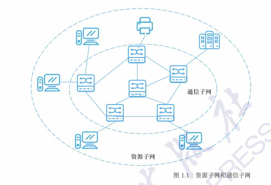

> [!note]
>
> 计算机网络的组成可以概括为：
>
> - **物理视角**：由 “结点（控制设备）+ 链路（传输线路）+ 主机（终端 / 服务设备）” 连接而成；
> - **功能视角**：分为 “资源子网（处理信息、提供服务）” 和 “通信子网（传输信息、转发数据）”。

### 计算机网络拓扑结构

计算机网络的组成（结点、链路、主机），而 “拓扑结构” 就是这些组成元素的 “几何排列方式”—— 它决定了网络中数据的传输路径、故障影响范围和运维难度，是网络设计的核心基础。

- 计算机网络拓扑结构，本质是**网络中各结点（交换机、路由器等）与链路（网线、光纤等）的互联模式，即几何布局**。
- 拓扑结构关注的是 “**逻辑连接关系**”，而非物理设备的实际地理位置 
- 拓扑结构的设计直接影响网络的三个关键指标：可靠性，成本，可维护性

> [!tip]
>
> 常见的基本网络拓扑结构
>
> | 拓扑类型   | 核心结构亮点                       | 核心优势                         | 关键劣势                                  | 典型应用场景                             |
> | ---------- | ---------------------------------- | -------------------------------- | ----------------------------------------- | ---------------------------------------- |
> | 星状拓扑   | 所有终端连单一中心结点             | 结构简单、故障易定位、扩展性好   | 中心结点是单点瓶颈、终端多则成本高        | 家庭 WiFi、办公室网络、校园网接入层      |
> | 环状拓扑   | 结点首尾闭合形成环                 | 安装简单、无数据冲突             | 单结点 / 链路故障致全网瘫痪、延迟随环增大 | 早期令牌环网、小型工业控制网             |
> | 总线型拓扑 | 所有结点共享一条主干链路           | 成本低、传输逻辑简单             | 总线故障致全网瘫痪、结点多易冲突          | 早期同轴电缆以太网、小型楼道监控网       |
> | 网状拓扑   | 结点间多链路互联（含部分网状）     | 可靠性极强、传输快、负载均衡     | 成本极高、配置复杂                        | 互联网骨干网、金融核心网络               |
> | 树状拓扑   | 星状拓扑的层级扩展（根 - 枝 - 叶） | 扩展性极强、管理清晰、故障易定位 | 上层结点是瓶颈、层级多则延迟高            | 校园网、企业网（核心 - 汇聚 - 接入分层） |
> | 混合型拓扑 | 组合两种以上基本拓扑               | 兼顾可靠性、成本、扩展性         | 设计和维护复杂                            | 绝大多数实际网络（如校园网、城市政务网） |

#### 星状拓扑

星状拓扑是目前**应用最广泛的网络拓扑结构**，星状拓扑的核心是 **“中心节点 + 终端设备” 的辐射式连接 **：

- 所有终端设备（电脑、手机、打印机）都通过独立的链路（网线、WiFi）连接到**一个中心节点**（通常是交换机或路由器）；
- 任意两个终端设备之间的通信，都必须经过中心节点转发 —— 比如你用电脑给同办公室的同事传文件，数据会先从你的电脑传到中心交换机，再由交换机转发到同事的电脑。

优点：拓扑结构简单（**一条链路 + 一个接口**接入即可），健壮性强（故障影响范围小），便于管理（故障易定位）

星状拓扑的唯一核心缺点是 **“中心节点是单点瓶颈”**：中心节点故障，**所有连接到该中心节点的设备都会断网**

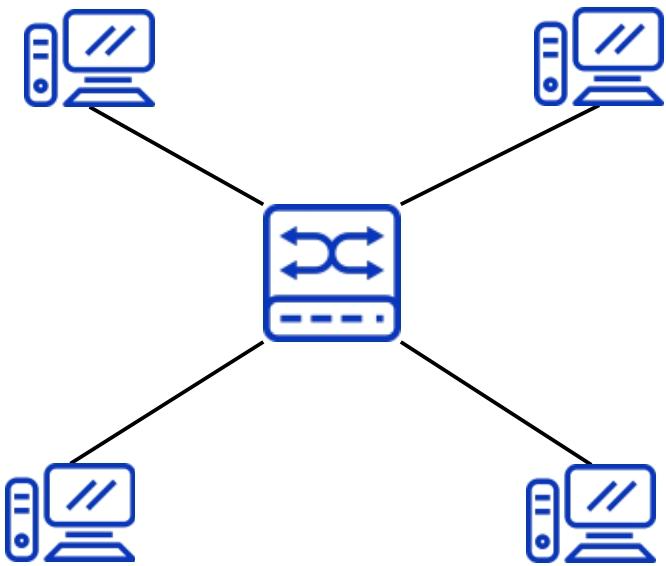

---

#### 环状拓扑

环状拓扑是早期网络中常见的拓扑类型，核心特征是 “设备首尾相连形成**闭合环**”

- 环状拓扑中，所有网络设备（如工作站、交换机）通过**通信链路首尾顺次连接**，最终形成一个 “闭合的环形”
- 数据在环中沿**固定方向**（顺时针或逆时针）传输，遵循 “逐结点转发” 规则：
  - 发送设备将数据打包成 “帧”，注入环中；
  - 数据帧按固定方向传输，每经过一个设备，该设备会检查帧的 “目标地址”—— 若不是自身地址，就继续转发给下一个设备；若是自身地址，就接收数据并停止转发；
  - 为避免数据在环中无限循环，部分环状拓扑（如令牌环网）会用 “令牌” 控制数据发送（只有拿到令牌的设备才能发数据）。

优点：安装与重配置简单，无数据冲突问题

缺点：传输延迟随规模增大而显著升高，可靠性差：单故障致全网瘫痪，维护难度高：故障定位复杂

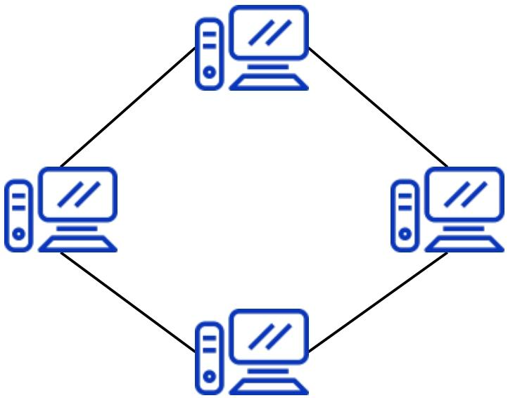

---

#### 总线型拓扑

总线型拓扑是早期局域网的经典拓扑之一，核心特征是 “所有设备共享一条**主干链路**”

- 总线型拓扑的核心是 **“一条主干电缆 + 多个分支设备”**：
  - 用一条 “主干电缆”（早期多为同轴电缆，类似有线电视线）作为网络的核心传输通道，相当于 “城市主干道”；
  - 所有网络设备（电脑、打印机等）通过 “T 型接头” 或 “分接头” 连接到主干电缆上，设备与主干之间用 “引出线”（短电缆）连接，类似 “主干道上的支路连接到各个建筑”。
  - 总线型拓扑的数据传输遵循 “**广播 + 监听**” 逻辑，没有中间转发设备（如交换机），核心流程如下：
    1. **数据广播**：某台设备发送数据时，会将数据打包成 “帧”，通过引出线注入主干电缆 —— 数据会在主干上**双向传输**（向主干的两个端点扩散），所有连接在主干上的设备都能 “监听到” 这份数据；
    2. **地址匹配**：每个设备会实时监听主干上的数据流，检查数据帧中的 “目标地址”—— 若地址与自身地址一致，就接收并处理数据；若不一致，就忽略该数据；
    3. **冲突处理**：若多台设备同时向主干发送数据，会导致 “数据碰撞”（冲突），此时所有设备会暂停发送，等待随机时间后重试（早期通过 CSMA/CD 协议解决冲突，即 “载波监听多路访问 / 冲突检测”）。

优点：信息传输无路由转发，逻辑简单；易于安装，成本低

缺点：信号衰减限制网络规模；主干故障致全网瘫痪；多设备通信易冲突，效率低

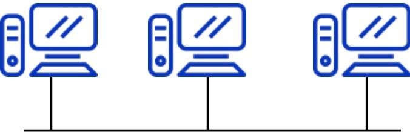

---

#### 网状拓扑

网状拓扑是所有基础拓扑中**可靠性最高**的类型，核心特征是 “设备间**两两专线互联**”

- 网状拓扑的核心是 **“全互联” 或 “部分互联” 的冗余设计 **：
  - **全网状拓扑**（理想形态）：网络中**每一台设备都通过独立的专线链路，与其他所有设备直接连接**—— 例如 3 台设备需 3 条链路，4 台设备需 6 条链路，n 台设备需 n (n-1)/2 条链路，形成 “多对多” 的连接关系，类似 “社交网络中每个人都和其他人直接好友”；
  - **部分网状拓扑**（实际主流）：仅核心设备（如骨干路由器）之间采用全互联，普通设备（如接入层交换机）仅与 1-2 台核心设备连接 —— 既保留冗余可靠性，又降低成本，是现实中网状拓扑的主要形式。
- 网状拓扑的数据传输依赖 “动态路由协议”，核心逻辑是 “多路径可选，智能避障”：
  1. **路径发现**：每台设备通过路由协议（如 OSPF、BGP）与其他设备交换 “链路状态信息”，实时掌握全网所有链路的连通情况，构建 “全网拓扑地图”；
  2. **最优路径选择**：发送数据时，设备会根据 “链路带宽、延迟、负载” 等指标，从多条可达路径中选择最优路径 —— 例如北京到广州的数据包，可选择 “北京 - 广州” 直达链路，也可选择 “北京 - 上海 - 广州” 链路，若直达链路负载高，会自动切换到绕行链路；
  3. **故障自动恢复**：若某条链路或设备故障（如北京 - 广州的链路断了），设备会通过路由协议快速检测到故障，并重新计算最优路径（自动切换到 “北京 - 上海 - 广州” 或 “北京 - 深圳 - 广州”），整个过程通常在秒级完成，用户几乎感知不到中断。

优点：健壮性极强：抗故障能力拉满；负载分担：避免网络拥塞

缺点：成本极高：链路与接口数量呈指数级增长；配置与维护复杂：对运维要求极高

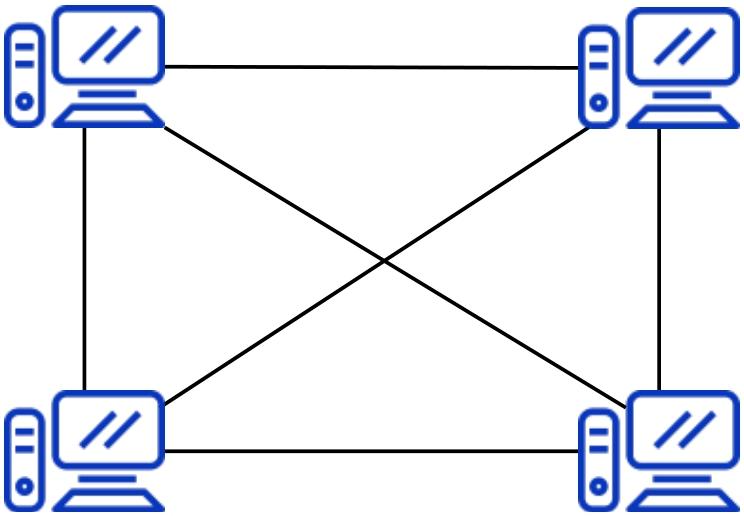

---

#### 树状拓扑

树状拓扑是星状拓扑的 “升级版”，核心特征是 “**按层级关系扩展**”，完美适配大规模网络的分层管理需求，是校园网、企业网等园区网络的主流拓扑选择。

- 树状拓扑的核心是 **“星状拓扑的层级叠加”**，形成 “根 - 枝干 - 叶” 的树形结构：
  - **根节点**：网络的顶层核心设备（如校园网的核心交换机、企业网的核心路由器），是全网数据交互的 “中枢”
  - **枝干节点**：中间层级的汇聚设备（如校园网的楼宇汇聚交换机、企业网的部门汇聚路由器），负责汇总下层设备的流量并转发到根节点
  - **叶节点**：网络的底层接入设备（如校园网的教室接入交换机、企业网的员工电脑 / 打印机），直接连接终端用户或小型设备
- 树状拓扑的数据传输遵循 “**分层转发**” 逻辑，核心是 “数据按层级流动，不跨层级直达”

优点：扩展性极强：支持 “无限层级扩展”；管理清晰：故障定位与维护效率高；带宽利用率高：分层汇聚减少冗余流量

缺点：可靠性较差：上层节点是 “单点故障源”；传输延迟随层级增加而升高

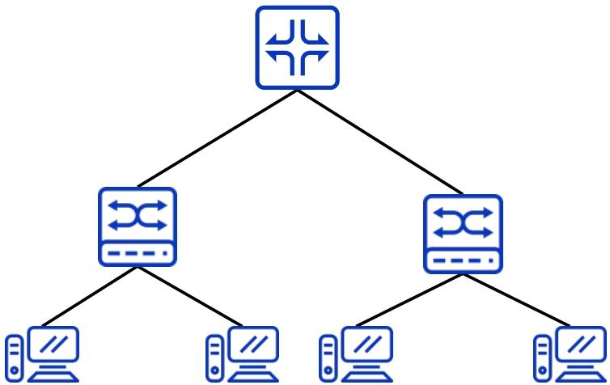

---

#### 混合型拓扑

- 混合型拓扑是**结合两种或两种以上基础拓扑（星状、环状、网状、树状等），根据实际场景需求（如成本、可靠性、地理位置）灵活设计的拓扑结构**。
- 基础拓扑是 “零件”，混合型拓扑是 “用零件组装的成品”，成品的结构完全由 “使用需求” 决定。

实际网络中，混合型拓扑的常见组合有 3 种，覆盖 90% 以上的场景：

1. **核心网状 + 汇聚树状 + 接入星状**（最主流）：核心层用网状保证可靠性，汇聚层用树状分层管理，接入层用星状降低成本（如企业园区网、校园网）；
2. **核心星状 + 接入星状**（小型网络）：核心层 1 台交换机（星状中心），接入层多台交换机连核心，终端连接入交换机（如小型公司、网吧）；
3. **核心环状 + 接入星状**（工业场景）：核心层用环状保证实时性，接入层用星状连接传感器、控制器（如工厂生产线网络）。

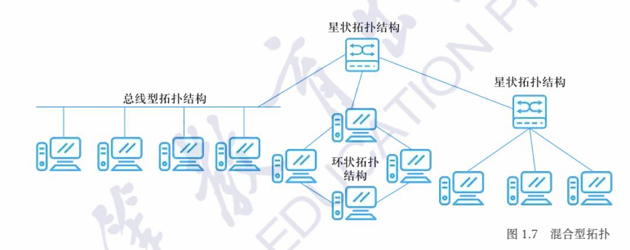

### 计算机网络分类

计算机网络的分类是理解不同场景网络特性的关键 —— 通过 “接入方式” 可明确设备与网络的连接载体，通过 “覆盖范围” 能快速判断网络的应用场景和技术特点。

#### 按接入方式划分

接入方式的核心是 “设备与网络连接的物理载体”，直接决定网络的灵活性、稳定性和适用场景，分为**有线网络**和**无线网络**两大类。

- 有线网络：“物理线路为载体” 的稳定连接
  - 通过有形的物理线路（如网线、光纤、同轴电缆）实现设备与网络的连接，数据通过线路中的电信号或光信号传输。
- 无线网络：“无线电波为载体” 的灵活连接
  - 无需物理线路，通过无线电波（如 WiFi、5G、蓝牙）实现设备与网络的连接，数据通过电磁波在空气中传输。

#### 按覆盖范围划分：从 “个人” 到 “全球” 的四级网络

覆盖范围的核心是 “网络服务的地理区域大小”，直接决定网络的拓扑结构、传输技术和核心功能，分为**个域网（PAN）、局域网（LAN）、城域网（MAN）、广域网（WAN）** 四级，覆盖范围依次扩大。

##### 个域网（PAN，Personal Area Network）：“围绕个人” 的最小网络

个域网的核心是服务个人设备协同，场景高度贴近日常办公与生活

- 围绕某个人而搭建的计算机网络
- 覆盖范围一般小于10米,可以视为一种特殊类型的局域网,支持的是 一个人而不是一个小组｡

个域网（PAN）分为有线和无线两类

- **有线个域网**：依靠短距离有线传输介质连接设备，常见的有 USB 数据线连接手机与电脑、Thunderbolt 接口连接电脑与外接显示器等，传输稳定且不易受干扰。

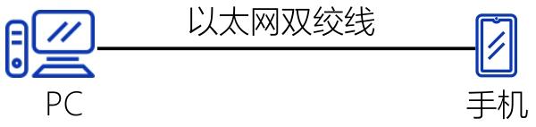

- **无线个域网**：无需线缆，通过无线信号传输数据，遵循 IEEE 802.15 系列标准，覆盖范围通常 10 米以内，适配移动场景下设备的灵活连接。

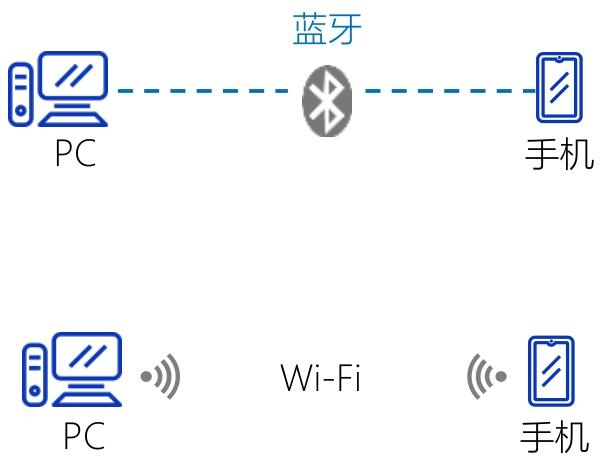

##### 局域网（LAN）：局部区域的高速互联网络

局域网（Local Area Network，LAN）是**局限于单一地点（如办公室、教室、家庭、一栋 / 一组建筑）的网络**，本质是 “同一物理范围内设备的高速互联系统”—— 它既可以独立运行（仅内部设备互通），也可以通过路由器接入外网（如互联网）。

- 覆盖范围有限（通常 < 10 公里）
- 单一组织管理，自主可控
- 传输速率高、延迟低

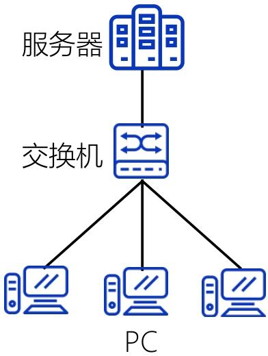

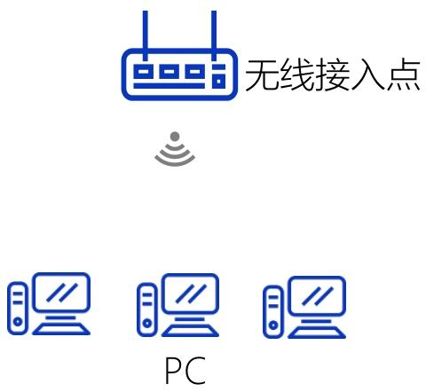

##### 城域网（Metropolitan Area Network，MAN）

覆盖范围介于局域网（单栋 / 多栋建筑）与广域网（跨城市 / 国家）之间，通常以**一座城市、大型都市圈或巨型校园（如高校大学城、科技园区）** 为单位，覆盖半径一般为**10-100 公里**，可灵活适配城市核心区、近郊等不同区域的网络需求。

- 整合城市内分散的企业、家庭、机构**局域网**，又通过接口与**广域网**连接，实现跨城市的数据交互
- 通常是跨越一个城市或一个大型校园的大规模计算机网络，通常使用高容量的**骨干网技术**（如光纤链路）来互连多个局域网

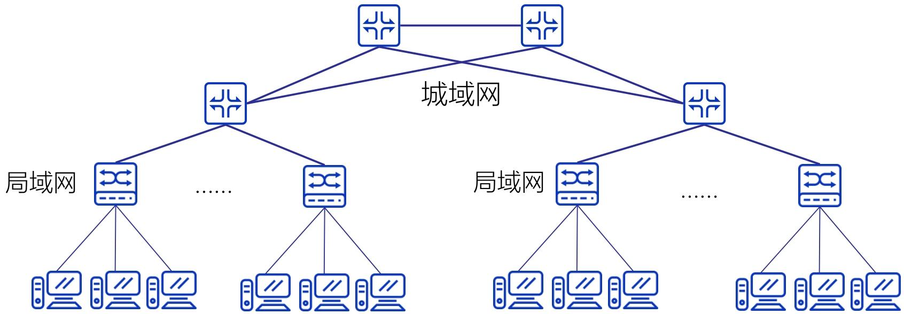

##### 广域网（WAN）

广域网（Wide Area Network，简称 **WAN**）是计算机网络按覆盖范围划分的核心类别之一，也是连接地理上广泛分布节点的关键网络形态，其核心价值在于突破局域网（LAN）、城域网（MAN）的地理限制，实现长距离、跨区域的资源共享与数据传输。

- 盖尺度为**跨地区、跨国家甚至全球**
- 支持多类型信息传输，包括**数据（如文件、数据库交互）、声音（如 VoIP 语音通话）、图像（如高清图片）、视频（如远程会议、流媒体）**
- 不依赖单一私有链路，而是**组合使用公共通信设备、租赁链路或私有链路**
- 通常由**多个组织协同管理**

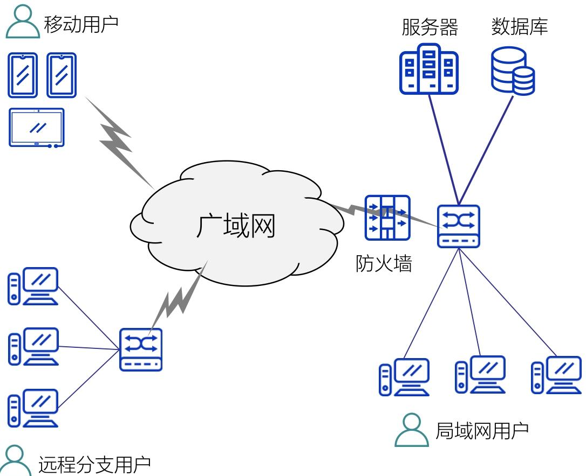

> [!note]
>
> | 网络类型      | 覆盖范围             | 核心特点                     | 典型例子                                                     |
> | ------------- | -------------------- | ---------------------------- | ------------------------------------------------------------ |
> | 个域网（PAN） | ＜10 米（围绕个人）  | 设备少、用于个人设备互联     | 手机通过蓝牙连接电脑传文件                                   |
> | 局域网（LAN） | 一栋建筑 / 一组建筑  | 速率高、单一组织管理         | 家庭 Wi-Fi（连接电脑、电视、手机）、公司办公室网络           |
> | 城域网（MAN） | 一个城市 / 大型校园  | 连接多个局域网、用光纤骨干网 | 某市的有线电视网络、大学跨校区网络（如清华园校区与深圳校区互联） |
> | 广域网（WAN） | 跨地区 / 国家 / 全球 | 长距离传输、多组织管理       | 互联网、企业跨省市办公网                                     |

---

## 计算机网络体系结构

计算机网络体系结构是解决 “跨设备、跨网络复杂通信” 的核心理论框架，其本质是通过**分层定义功能、标准化协议**，将 “PC1 到 PC2 的数据传输” 这一复杂问题拆解为可实现、可协同的子任务。

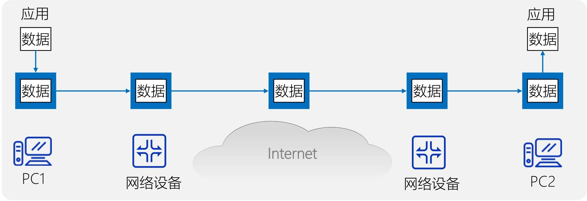

- **计算机网络体系结构 = 各层功能定义 + 对应层协议的集合**
  - **“层”**：按 “数据传输的逻辑流程” 划分的功能模块（如 “负责数据加密”“负责路由选择”“负责应用数据封装” 等）；
  - **“协议”**：同一层的不同设备（如 PC1 和 PC2 的 “应用层”）之间，为实现通信而约定的 “规则、标准或约定”；
  - **抽象性**：体系结构仅 “精确定义各层应完成的功能”（比如 “传输层要保证数据可靠传输”），不涉及具体的硬件 / 软件实现即实现细节；而 “协议的实现” 是具体的（如用编程语言编写的 TCP 协议软件、路由器中的路由协议硬件模块），且必须遵循体系结构的规则。

### 网络协议

为进行网络中的数据交换而建立的规则、标准或约定，即网络协议

协议是体系结构的 “执行细则”，任何协议都必须包含**语法、语义、时序**三要素

| 三要素   | 核心作用（解决 “什么问题”）                           | 通俗举例（以 “PC1 给 PC2 发文件” 为例）                      |
| -------- | ----------------------------------------------------- | ------------------------------------------------------------ |
| **语法** | 规定 “数据的格式与结构”，解决 “如何讲对方才懂” 的问题 | PC1 的传输层需将文件数据封装为 “TCP 报文段”，格式必须是 “首部（20 字节）+ 数据段”，PC2 的传输层才能识别并解析（若格式混乱，PC2 会认为是无效数据） |
| **语义** | 规定 “数据的含义与动作”，解决 “讲什么、做什么” 的问题 | TCP 协议中，“首部的 ACK=1” 这一控制信息的语义是 “确认已收到数据”；PC2 收到后，需执行 “停止重传该数据” 的动作（若语义不明确，PC1 可能重复发数据） |
| **时序** | 规定 “操作的顺序”，解决 “讲话有秩序、不混乱” 的问题   | 通信流程必须是 “PC1 先发送连接请求（SYN 报文）→ PC2 回复确认（SYN+ACK 报文）→ PC1 再发文件数据”，不能颠倒（若时序混乱，会出现 “PC2 还没准备好，PC1 就发数据” 的错误） |

### 体系结构

体系结构是计算机网络及其部件的各层所应完成的功能的精确定义

- 体系结构是抽象的
- 协议的实现是具体的，是真正在运行的计算机硬件和软件，即实现是遵循体系结构的前提下用硬件或软件完成预定的功能

---

### 分层

“分层”可将庞大而复杂的问题，转化为若干较小的局部问题，而这些较小的局部问题就比较易于研究和处理

分层的本质是将 “端到端通信” 这一庞大任务，拆解为多个**功能独立、职责明确**的子任务，每个子任务由一层负责，最终通过层间协作实现整体功能

- 每层完成特定的功能
- 各层协调起来实现整个网络系统

优点：各层独立灵活，结构可分，易于实现和维护，同时有利于标准化

缺点：由于通信的传递，可能会降低效率，并且有些功能会在各层冗余

原则：不同等级的抽象建立一层； 功能相近的分在一层； 每层功能明确；边界信息要尽量少； 层次数量应适当

#### 网络协议的层次结构

- 层次栈（Layer Stack）—— 通信功能的 “垂直拆解”
  - 层次栈是网络协议层次结构的**物理基础**，本质是将 “端到端通信” 的完整功能，按 “抽象等级” 和 “功能职责” 拆分为若干个独立的 “垂直层次”，且**每一层都建立在其下一层的功能基础上，仅为上一层提供服务**。
- 对等实体（Peer Entities）—— 跨设备的 “逻辑通信方”
  - “对等实体” 是层次结构中**跨设备的 “逻辑通信伙伴”**，指 “不同主机（或网络设备）上，处于同一层次的功能模块 / 组件”。
  - 对等实体遵循 “同一协议”。只有遵循相同的协议，对等实体才能 “听懂对方的逻辑语言”
- 接口（Interface）—— 层间服务的 “边界规则”
  - 接口是**相邻两层之间的 “服务契约”**，定义了 “下层必须向上层提供哪些具体服务（原语操作）”，以及 “上层如何调用这些服务或者请求服务”
- 层间 “实通信” vs 对等实体 “虚通信”（物理层除外）
  - 实通信” 指**同一主机内，相邻两层之间通过 “接口” 进行的真实数据 / 控制信息传递**。
  - 虚通信” 指**不同主机的对等实体之间，通过 “协议” 进行的 “逻辑通信”**

> [!TIP]
>
>  物理层（第 1 层）的对等实体（如 PC1 的网卡和路由器的网卡）是**唯一实现 “实通信” 的对等实体**—— 因为它们直接通过物理介质（网线、无线信号）传递电信号 / 光信号，无需依赖更下层（没有比物理层更低的层次）

## OSI 参考模型（开放系统互连参考模型）

OSI（Open Systems Interconnection Reference Model，开放系统互连参考模型）是由国际标准化组织（ISO）于 1984 年制定的网络通信架构标准，其核心目标是解决不同厂商、不同类型网络设备之间的 “兼容性问题”—— 通过**统一的分层框架**，让来自不同系统的设备能遵循相同的通信规则，实现跨平台、跨网络的互联互通。

- 解决网络之间不能兼容和不能通信的问题
- OSI 模型的设计遵循 “**分层解耦**” 原则：
  - 每一层只与相邻的上一层（请求服务）和下一层（提供服务）交互，不关心其他层的实现细节；
  - 不同设备的 “对等层”（如主机 A 的第 3 层与主机 B 的第 3 层）通过统一的 “协议” 进行 “虚通信”（逻辑上的通信），而实际的数据传输则通过 “层间实通信”（从上层到下层，再通过物理介质传递到对方设备，最后从下层到上层）完成。

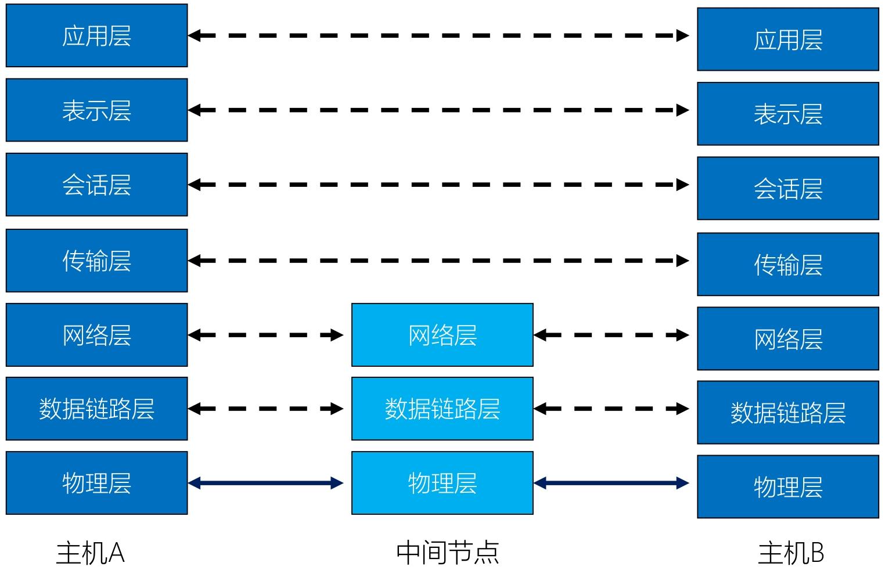

> [!NOTE]
>
> **物联网书会使用**
>
> | 层名       | 核心功能                                                     | 数据单元        | 关键技术 / 协议示例                               | 通俗类比                                                     |
> | ---------- | ------------------------------------------------------------ | --------------- | ------------------------------------------------- | ------------------------------------------------------------ |
> | 应用层     | 核心：应用程序的网络业务 详细：处理用户数据与信息，完成用户实际需求（如网页浏览、文件传输、邮件发送），是用户与网络的直接接口。 | 数据（用户级）  | HTTP/HTTPS（网页）、FTP（文件传输）、SMTP（邮件） | 用户（发件人写快递内容、收件人拆件看内容）—— 直接对接 “人的需求” |
> | 表示层     | 核心：数据表达 详细：解决用户信息语法问题，对数据进行翻译、编码、变换（如统一格式、加密 / 解密、压缩 / 解压缩），确保接收方正确解析。 | 数据（编码后）  | JPEG、MP3、SSL/TLS（加密）、ASCII 编码            | 快递包装标准化（不规则物品装标准纸箱、敏感文件加锁）—— 确保 “内容可识别” |
> | 会话层     | 核心：主机间通信详细：建立、管理、终止用户进程间的通信会话，确认双方身份、协商会话细节（如超时重连、同步检查点）。 | 会话数据单元    | RPC（远程过程调用）、NetBIOS                      | 发件人确认收件人地址 / 收件时间 —— 协商 “通信连接规则”       |
> | 传输层     | 核心：端到端的连接可靠性 详细：实现端到端（如主机 A 进程→主机 B 进程）的可靠通信，负责端口识别、端到端流量控制、差错重传。 | 报文（Message） | TCP 协议（可靠）、UDP 协议（不可靠）              | 快递公司总部调度（确认端到端链路、丢包重发）—— 负责 “全局可靠性” |
> | 网络层     | 核心：地址和最佳路径详细：负责跨网络路由选择（规划最优传输路径）、拥塞控制、网际互连，通过 IP 地址识别不同网络。 | 分组（Packet）  | IP 协议、路由协议（RIP、OSPF）、ICMP              | 快递全国调度中心（规划北京→上海路线、避开拥堵）—— 负责 “跨区域找路” |
> | 数据链路层 | 核心：访问介质 详细：访问物理介质，实现相邻设备间可靠传输，完成分帧、排序、差错检测与纠正（提供可靠链路）、流量控制、链路建立 / 拆除，通过 MAC 地址识别设备。 | 帧（Frame）     | 以太网（Ethernet）、VLAN、PPP                     | 本地快递点操作（按小区分堆、扫描确认无丢件、控制卸货速度）—— 负责 “本地小范围可靠传输” |
> | 物理层     | 核心：二进制传输 详细：通过物理介质（导线、光纤等）传输二进制信号，定义硬件接口（如 RJ45）、电压速率、信号编码规则，规定机械特性，电气特性，功能特性和规程特性，但是不关心数据含义。 | 比特（Bit）     | 双绞线、光纤、RJ45 接口、RS-232                   | 快递运输工具 + 道路 / 航线（货车、飞机、传送带）—— 负责 “物理信号传输” |

## 网络互连设备

网络互连设备是用于连接不同网络、扩展网络覆盖范围或实现不同协议间通信的**硬件设备**，核心作用是解决 “网络如何连通”“信号如何可靠传输”“不同类型网络如何协作” 等问题

### 网络互连设备总览（按 OSI 工作层级从低到高排序）

| 设备类型 | OSI 工作层级                               | 核心定位                          | 通俗类比（以 “城市交通” 为例）                         |
| -------- | ------------------------------------------ | --------------------------------- | ------------------------------------------------------ |
| 中继器   | 仅**物理层**（第 1 层）                    | 信号 “放大器”，扩展物理网段       | 高速公路上的 “路灯 / 信号增强器”（只补信号，不换路线） |
| 网桥     | 物理层（第 1 层）+ 数据链路层（第 2 层）   | 局域网内 “分拣员”，按物理地址转发 | 城市内的 “区域快递分拣点”（按小区地址分送，不跨城市）  |
| 路由器   | 物理层 + 数据链路层 +**网络层**（第 3 层） | 跨网络 “导航仪”，按 IP 选路径     | 全国高速 “交通调度中心”（规划从北京到上海的最优路线）  |
| 网关     | 所有 7 层（重点在高层）                    | 异类网络 “翻译官”，转换协议       | 国际航班 “海关 + 翻译”（解决不同国家语言、规则的互通） |

### 中继器（Repeater）

解决物理信号在传输中的衰减问题 —— 当**二进制信号（0/1）**通过网线、光纤等物理介质传输时，距离越远信号越弱（类似声音越传越小），中继器会**接收衰减的信号、再生放大后重新发送**，从而延长网络的物理覆盖范围

- 通过再生信号扩展网络的物理网段
- 不以任何方式改变网络的功能
- 仅仅运行在物理层

### 网桥（Bridge）

作为 “存储转发设备”，主要在**局域网内部**工作：先接收数据链路层的 **“帧”**（数据单元），读取帧中的**MAC 地址**（设备的物理地址），再根据 MAC 地址表判断 “该帧要发给哪个设备”，只向目标设备所在的网段转发（不广播到所有网段），减少局域网内的无效数据干扰。

- 同时作用在OSI的物理层和数据链路层
- 在数据链路层进行数据帧的存贮和转发
- 识别物理地址；具备寻址功能

### 路由器（Router）

解决 **“跨网络通信”** 的核心设备 —— 当数据需要从一个网络（如公司内网）传输到另一个网络（如互联网、其他公司的网络）时，路由器会读取网络层的 “分组”（数据单元）中的**IP 地址**（逻辑地址），通过路由协议（如 RIP、OSPF）计算 “从当前网络到目标网络的**最优路径**”，再将数据转发到下一个路由器或目标网络，最终实现 “端到端的跨网传输”。

- 工作在**物理层 + 数据链路层 + 网络层**
- 能连接 “不同类型的网络”
- 具备 “拥塞控制” 能力

### 网关（Gateway）

解决 “**异类网络协议互通**” 的问题 —— 当两个网络的 “通信规则（协议）完全不同” 时（如局域网的 TCP/IP 协议与大型机的 SNA 协议），普通路由器无法识别对方的协议，而网关会作为 “协议转换器”，在 OSI 的**所有 7 层**（从物理层的信号到应用层的业务数据）进行 “翻译”：将 A 网络的协议格式转换为 B 网络能理解的格式，再转发数据，实现 “本质不同的网络间通信”。

- 协议转换器
- 工作在 OSI**所有 7 层**
- 能互连异类的网络；在局域网的微机和小型机或大型机之间作翻译

### 总结

| 对比维度      | 中继器         | 网桥             | 路由器          | 网关         |
| ------------- | -------------- | ---------------- | --------------- | ------------ |
| 最高 OSI 层级 | 物理层（1）    | 数据链路层（2）  | 网络层（3）     | 所有 7 层    |
| 识别的地址    | 不识别地址     | MAC 地址（物理） | IP 地址（逻辑） | 多种协议地址 |
| 核心能力      | 放大信号       | 局域网分拣       | 跨网选路        | 协议转换     |
| 连接网络类型  | 同类型物理网段 | 同协议局域网     | 不同类型网络    | 异类协议网络 |
| 能否跨互联网  | 不能           | 不能             | 能              | 能（需翻译） |

## 层间通信与对等层通信

分层的核心是 “每一层只负责特定功能，通过标准化接口协作”，而这两种通信正是分层协作的两种核心方式。

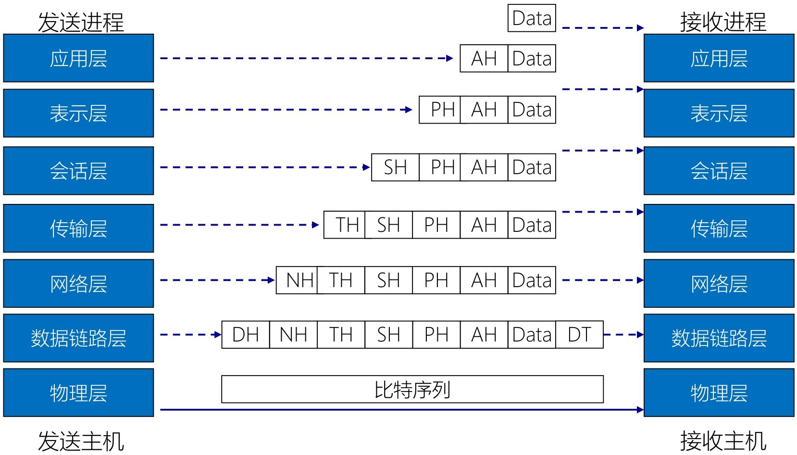

1. **发送主机（从上到下：封装）**
   - 应用层：发送进程产生原始数据（`Data`），加上应用层头部（`AH`，含应用层协议信息，如 HTTP 头部），形成 “应用层 PDU（协议数据单元）”；
   - 传输层：接收应用层 PDU，加上传输层头部（`TH`，含端口号等，如 TCP 头部），形成 “传输层 PDU（段 / Segment）”；
   - 网络层：接收传输层 PDU，加上网络层头部（`NH`，含 IP 地址等），形成 “网络层 PDU（数据包 / Packet）”；
   - 数据链路层：接收网络层 PDU，加上数据链路层头部（`DH`，含 MAC 地址等）和尾部（帧校验序列 FCS），形成 “数据链路层 PDU（帧 / Frame）”；
   - 物理层：接收数据链路层帧，将其转换为 “比特序列”（电信号 / 光信号），通过物理介质（网线、光纤）传输。
2. **接收主机（从下到上：解封装）**
   - 物理层：接收比特序列，还原为数据链路层帧，传递给数据链路层；
   - 数据链路层：验证 FCS、剥离`DH`和尾部，还原为网络层数据包，传递给网络层；
   - 网络层：剥离`NH`，还原为传输层段，传递给传输层；
   - 传输层：剥离`TH`，还原为应用层 PDU，传递给应用层；
   - 应用层：剥离`AH`，还原为原始`Data`，传递给接收进程。

### **层间通信（Inter-layer Communication）**

在**同一台主机（或网络设备）内部**，OSI 模型中 “相邻的上下两层” 通过标准化的 “接口”（称为 “服务访问点 SAP”）进行数据传递和功能协作 —— 本质是 “**垂直**方向的通信”。

- **同一设备内**：仅发生在发送主机或接收主机内部，不跨设备；
- **相邻层**：只能是 “直接上下层”
- **接口标准**：每层都为上层即`N+1层`提供 “服务”（如下层帮上层处理数据封装 / 传输），上层通过 “SAP” **调用或者请求**下层服务，接口规则由 OSI 标准定义（确保不同厂商的设备可兼容）。

### **对等层通信（Peer-layer Communication）**

在**不同主机（或网络设备）之间**，OSI 模型中 “相同层级”（如发送主机的应用层↔接收主机的应用层、发送主机的网络层↔接收主机的网络层）通过 “相同的协议” 进行的 “逻辑通信”—— 本质是 “**水平**方向的通信”。

- **跨设备**：发生在发送端和接收端（如 PC1 和 PC2）的相同层级之间；
- **对等层**：必须是 “同层级”
- **本质：逻辑通信**：对等层之间不直接传递物理信号，而是通过 “下层的层间通信” 间接实现
- **依据：对等层协议**：同层级必须遵守相同的协议规则

## 服务与协议

 “协议是水平的逻辑规则，服务是垂直的功能支撑” 

1. **协议（Protocol）：水平的逻辑规则**协议是**同一层（对等层）的实体之间**（如发送主机的第 n 层 ↔ 接收主机的第 n 层），为了实现通信而约定的 “规则、格式、顺序”（即之前提到的 “语法、语义、时序”）—— 它是**水平方向**的逻辑约定，只约束 “同层级的实体如何交互”。
2. **服务（Service）：垂直的功能支撑**服务是**下层实体向上层实体**（如第 n 层 ↔ 第 n+1 层）提供的 “功能支持”（如下层帮上层处理数据封装、传输）—— 它是**垂直方向**的功能传递，只约束 “相邻层之间如何协作”。

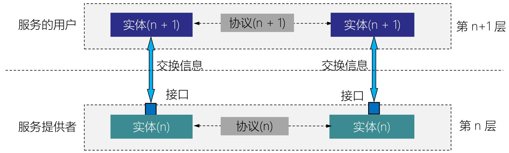

### 服务、服务访问点（SAP）和各类数据单元（IDU、SDU、PDU）

- 服务（Service）
  - 下层实体向上层实体提供的**功能支持**（如传输层为应用层提供 “端到端可靠传输” 服务），是垂直方向的功能传递（对应之前提到的 “服务是垂直的”）。
-  服务访问点（SAP：Service Access Point）
  - **相邻层之间的接口**（如应用层与传输层之间的接口），是上层实体调用下层服务的 “入口”—— 上层通过 SAP 发送请求，下层通过 SAP 返回结果，实现层间功能的解耦。

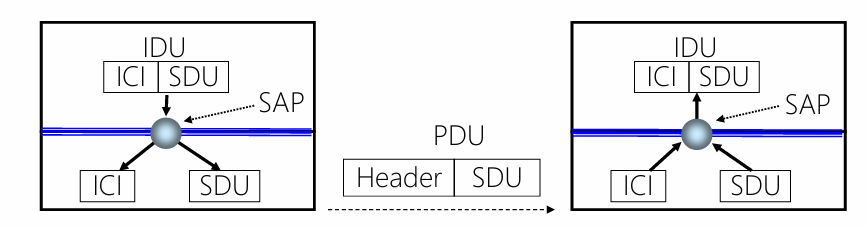

| 数据单元         | 英文缩写 | 定义与作用                                                   |
| ---------------- | -------- | ------------------------------------------------------------ |
| **接口数据单元** | IDU      | 上层通过 SAP 传递给下层的 “完整数据单元”，包含**ICI + SDU**：- ICI：接口控制信息，用于控制层间交互（如下层如何处理数据）；- SDU：服务数据单元，是上层需要下层处理的 “原始数据”。 |
| **接口控制信息** | ICI      | 包含层间交互的控制指令（如 “是否需要加密”“传输优先级”），是 IDU 的一部分。 |
| **服务数据单元** | SDU      | 上层需要下层 “处理并传输” 的数据内容（如应用层的 HTTP 请求数据），是 IDU 的核心部分。 |
| **协议数据单元** | PDU      | 下层对 SDU 的 “封装结果”：下层接收 SDU 后，添加本层的**PCI（协议控制信息，如头部）**，形成 PDU，用于对等层通信（如下层通过 PDU 与接收主机的同层实体交互）。 |

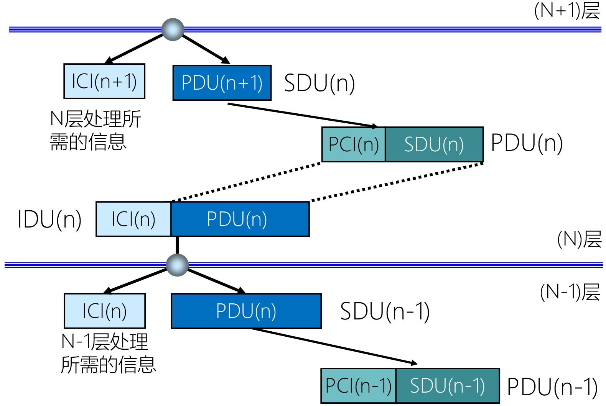

1. **N+1 层准备数据**：N+1 层生成**SDU(n+1)**（自身需要传输的原始数据），添加**ICI(n+1)**（控制 N 层如何处理的指令），组合成**IDU(n+1)**，通过**SAP**传递给 N 层。
2. **N 层处理数据**：N 层接收 IDU (n+1) 后，拆分出 ICI (n+1)（解析控制指令）和 SDU (n+1)—— 此时，**SDU (n+1) 会作为 N 层的 SDU (n)**（N 层需要处理的数据）。N 层对 SDU (n) 添加本层的**PCI(n)**（协议控制信息，如传输层的 TCP 头部），形成**PDU(n)**，用于与接收主机的 N 层实体进行对等层通信。
3. **N 层调用 N-1 层服务**：N 层将 PDU (n) 作为**SDU(n-1)**，添加**ICI(n)**（控制 N-1 层的指令），组合成**IDU(n)**，通过 SAP 传递给 N-1 层，重复上述流程，直到物理层。

## 面向连接服务与无连接服务

二者的本质区别在于是否通过 “预先建立连接” 保障数据传输的可靠性

### 面向连接服务（Connection-Oriented Service）

面向连接服务的核心是 “先建连接、再传数据、最后释放连接”，通过固定的 “三阶段流程” 确保数据**有序、可靠、不丢失**

- **可靠性优先**；**资源预留**；**有状态**
- 传输层的**TCP 协议**（如网页浏览 HTTP/HTTPS、文件传输 FTP、即时通讯）：需确保网页内容、文件、消息不丢失、不错乱。

### 无连接服务（Connectionless Service）

无连接服务的核心是 “无需预先建立连接，直接发送数据”，不保证数据的可靠性和顺序

- **效率优先**；**无资源预留**；**无状态**

3种类型： 数据报； 证实交付（可靠的数据报）； 请求/响应

## TCP/IP

**TCP/IP（Transmission Control Protocol/Internet Protocol，传输控制协议 / 网际协议）**是互联网的核心通信体系结构，它通过分层设计实现不同设备间的标准化数据传输，目前已成为全球通用的 “事实上的国际标准”，而 OSI 参考模型因设计复杂、实现成本高等问题未获得广泛市场认可。

### TCP/IP网络体系结构

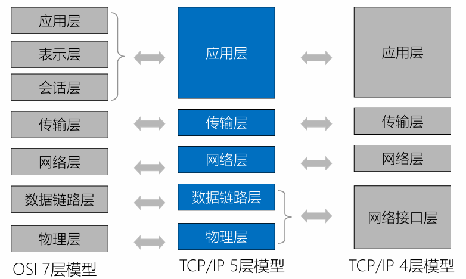

TCP/IP 体系结构通常有**4 层模型**和**5 层模型**两种表述（5 层模型是在 4 层基础上细化物理层，更贴近实际网络实现）

| TCP/IP 4 层模型 | TCP/IP 5 层模型 | OSI 7 层模型           | 核心功能                                                     |
| --------------- | --------------- | ---------------------- | ------------------------------------------------------------ |
| 应用层          | 应用层          | 应用层、表示层、会话层 | 为用户提供具体应用服务（如网页、邮件），定义应用程序间的通信规则 |
| 传输层          | 传输层          | 传输层                 | 负责端到端（如两台主机的应用程序间）的可靠数据传输，控制数据流量和差错恢复 |
| 网络层          | 网络层          | 网络层                 | 实现不同网络间的路由选择（跨网通信），定义 IP 地址格式，将数据分组转发到目标网络 |
| 网络接口层      | 数据链路层      | 数据链路层             | 负责同一物理网络内（如局域网）的帧传输，处理 MAC 地址、帧封装与差错检测 |
| -               | 物理层          | 物理层                 | 定义物理设备（如网线、网卡）的电气特性、接口标准，实现二进制数据的物理传输 |

### TCP/IP参考模型

TCP/IP 由 Vint Cerf 和 Bob Kahn 于 1974 年为 ARPANET（互联网前身）设计，核心目标是解决 “不同类型网络如何互联互通” 的问题。

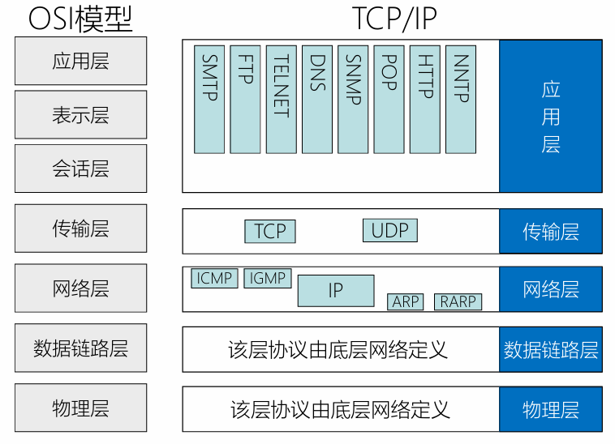

TCP/IP 参考模型分为 4 层，每层负责特定功能，协议由底层网络或上层应用定义，具体如下：

| 分层       | 核心功能                                                     | 关键协议及作用                                               |
| ---------- | ------------------------------------------------------------ | ------------------------------------------------------------ |
| **链路层** | 适配底层物理网络，为网络层提供 “无连接的分组传输服务”，负责物理链路内的帧封装与传输。 | 协议由底层网络定义（如以太网、Wi-Fi），实现 “IP over everything”（IP 可运行在任意物理网络上）。 |
| **网络层** | 定义数据包格式和协议（(IP 地址（IPv4/IPv6）)，实现 “跨网络的分组转发”：将数据拆分为 IP 分组，通过路由选择传递到目标网络。 | - IP：定义分组格式与地址，是跨网通信的核心； - ARP/RARP：实现 IP 地址与 MAC 地址的转换 - ICMP：网络故障诊断（如`ping`）；- IGMP：组播通信管理。 |
| **传输层** | 实现 “端到端（源主机应用→目标主机应用）” 的通信：通过端口号区分应用，保证数据可靠 / 高效传输。 | - TCP：面向连接的可靠传输（三次握手建立连接、重传机制），适用于文件、网页等场景； - UDP：无连接的高效传输，适用于直播、游戏等实时场景。 |
| **应用层** | 直接为用户应用提供服务，整合了 OSI 模型中会话层、表示层的功能。 | 包含各类上层协议（如 HTTP：网页浏览；FTP：文件传输；DNS：域名解析；SMTP：邮件发送），实现 “Everything over IP”（任意应用可基于 IP 运行）。 |

> [!note]
>
> TCP/IP 参考模型摒弃了传统电话系统 “**笨终端 & 聪明网络**”（终端仅负责简单输入输出，网络承担路由、差错恢复等复杂逻辑）的设计思路，采用 **“聪明终端 & 简单网络”** 的创新架构，核心逻辑如下：
>
> - **简单网络**：网络核心仅负责 “分组转发” 这一基础功能（通过路由表将 IP 分组送达目标地址），不承担差错恢复、流量控制等复杂任务，即**网络层不再负责差错控制、流量控制、连接建立与释放、可靠传输管理等功能**。这是和OSI不同的地方
> - **聪明终端**：由终端（如电脑、手机等 “端系统”）通过 TCP 协议实现可靠性保障，包括数据丢失重传、顺序重组、流量控制等功能，最终实现 “**建立在简单、不可靠网络部件上的可靠数据传输系统**”。

### IP 分组交换

IP 分组交换是 TCP/IP 模型的 “灵魂”，通过以下 3 个特点实现 “万物互联”：

1. **IP over everything（IP 承载于任意物理网络）**：IP 分组可在任意底层物理网络（如以太网、Wi-Fi、4G/5G 移动网络、光纤网络）上传输，无需为不同物理网络设计专属协议，打破了 “物理网络类型限制”。
2. **Everything over IP（任意应用基于 IP 承载）**：无论是网页、视频、邮件、物联网数据，还是语音通话，都可封装为 IP 分组传输，实现 “一种协议支撑所有应用场景”，避免了应用与网络的强绑定。
3. **分组独立路由**：每个 IP 分组都携带完整的 “源 IP 地址” 和 “目的 IP 地址”，网络核心设备（路由器）仅需根据目的 IP 查询路由表，独立转发每个分组（无需关注分组间的关联），进一步简化了网络逻辑。

## 交换技术

交换技术是网络数据传输的核心机制，核心解决 “如何在源设备和目标设备之间分配传输资源、转发数据” 的问题。

### 电路交换

电路交换（Circuit Switching）：通过物理线路的连接，动态地分配传输线路资源。

- 电路交换的过程：

  > 建立连接（尝试占用通信资源）
  > 通信（一直占用通信资源）
  > 释放连接（归还通信资源）

- 优点
  - 通信前端和端建立一条专用的物理通路，在通信时间内，两个用户始终占用端到端的线路资源。数据直连，传输速率高。
- 缺点：
  - 建立 / 释放连接，需要额外的时间开销。
  - 线路被通信双方独占，利用率低
  - 线路分配的灵活性差
  - 交换节点不支持 “差错控制”（无法发现传输过程中的发生的数据错误）

适用于：
低频次、大量地传输数据

### 报文交换

报文交换（Message Switching）：由控制信息和用户数据组成，由存储转发的方式传输数据。

- **存储转发** 的思想：把传送的数据单元先存储进中间节点，再根据目的地址转发至下一节点。
- 优点：
  - 通信前无需建立连接
  - 数据以 “报文” 为单位被交换节点间 “存储转发”，通信线路可以灵活分配
    在通信时间内，两个用户无需独占一整条物理线路。相比于电路交换，线路利用率高。
  - 交换节点支持 “差错控制”（通过校验技术）
- 缺点：
  - 报文不定长，不方便存储转发管理
  - 长报文的存储转发时间开销大，缓存开销大
  - 长报文容易出错，重传代价高

### 分组交换

分组交换将报文（不定长）拆分为控制信息和数据，其中控制信息：包含源地址、目的地址等。而数据则拆分为若干个分组（Packet），每个分组（定长）包含了首部和分组数据
首部（Header）：即分组的控制信息，包含源地址、目的地址、分组号等

注意：**存储转发**：在交换机能够开始向输出链路传输该分组的第一个比特之前，必须接收到整个分组。

- 优点：
  - 通信前无需建立连接
  - 数据以 “分组” 为单位被交换节点间 “存储转发”，通信线路可以灵活分配在通信时间内，两个用户无需独占一整条物理线路。相比于电路交换，线路利用率高
  - 交换节点支持 “差错控制”（通过校验技术）
  - 由上可见，分组交换继承了报文交换的优点，并改进以下问题：
    分组定长，方便存储转发管理
    分组的存储转发时间开销小、缓存开销小
    分组不易出错，重传代价低
- 缺点：
  - 相比于报文交换，控制信息占比增加
  - 相比于电路交换，依然存在存储转发时延
  - 报文被拆分为多个分组，传输过程中可能出现失序、丢失等问题，增加处理的复杂度

### 虚电路交换技术

基于分组交换的交换技术
虚电路交换的过程：

> 建立连接（虚拟电路）
> 通信（分组按序、按已建立好的既定路线发送，通信双方不独占线路）
> 释放连接

| 对比维度                 | 电路交换                         | 报文交换 | 分组交换                 |
| ------------------------ | -------------------------------- | -------- | ------------------------ |
| 完成传输所需时间         | 👍 最少 (排除建立 / 释放连接耗时) | 👎🏿 最多  | 👌🏻 较少                  |
| 存储转发时延             | 👍 无                             | 👎🏿 较高  | 👌🏻 较低                  |
| 通信前是否需要建立连接？ | 👎🏿 是                            | 👍 否     | 👍 否                     |
| 缓存开销                 | 👍 无                             | 👎🏿 高    | 👌🏻 低                    |
| 是否支持差错控制？       | 👎🏿 不支持                        | 👍 支持   | 👍 支持                   |
| 报文数据有序到达         | 👍 是                             | 👍 是     | 👎🏿 否                    |
| 是否需要额外的控制信息   | 👍 否                             | 👌🏻 是    | 👎🏿 是 (控制信息占比最大) |
| 线路分配灵活性           | 👎🏿 不灵活                        | 👍 灵活   | 👍 非常灵活               |
| 线路利用率               | 👎🏿 低                            | 👍 高     | 👍 非常高                 |

## 计算机网络的性能指标

### 速率

- 信道（Channel）：表示某一方向传送信息的通道（信道 ≠ 通信线路），一条通信线路在逻辑上往往对应一条发送信道和一条接收信道。
- 速率（Speed）：指连接到网络上的节点在信道上传输数据的速率。也称为数据率、比特率、数据传输速率。
- 速率单位：bit/s、b/s、bps。

> [!tip]
>
> |                | K    | M    | G    | T     |
> | -------------- | ---- | ---- | ---- | ----- |
> | 计网           | 10^3 | 10^6 | 10^9 | 10^12 |
> | 机组、操作系统 | 2^10 | 2^20 | 2^30 | 2^40  |

### 带宽

- 带宽（bandwidth）：某信道所能传送的最高数据率，单位 bps。
  - 通信原理中的带宽与计网中的带宽不同，通信原理中的带宽表示信道允许通过的信号频带范围，单位 Hz。例如光纤带宽约 500MHz。
- 信道带宽越大，传输数据的能力越强。

### 吞吐量

- 吞吐量（Throughput）：指单位时间内通过某个网络（或信道、接口）的实际数据量（实际的综合数据率）。
- 吞吐量受带宽限制、受复杂的网络负载情况影响。
- **实际吞吐量**：min{R1,R2,...,RN} ，R 是链路传输速率。即**瓶颈链路**传输速率。当没有其他千扰流最时，其吞吐量能够近似为沿着源和目的地之间路径的最小传输速率

### 时延

- 时延（Delay）：指数据（一个报文或分组，甚至比特）从网络（或链路）的一端传送到另一端所需的时间，也成为延迟或迟延。
- 总时延 = 发送时延 + 传播时延 + 处理时延 + 排队时延，即`dnodal = dproc + dqueue + dtrans + dprop`
- **处理时延** dproc：检查分组首部和决定将该分组导向何处、检查比特级别差错等所需要的时间。
- **排队时延** dqueue：如果到达的分组需要传输到某条链路，但发现该链路正忙于传输其他分组，该到达的分组必须在输出缓存中等待。时间无法确定。
- **传输时延** dtrans：`L/R` ，L 比特表示分组长度，R bps表示路由器之间的链路传输速率。这是将所有分组的比特推向链路所需要的时间。
- **传播时延** dprop：`d/s`，d 是路由器之间的距离，s 是链路的传播速率。表示从链路起点到另一个路由器传播所需要的时间。

5. 时延带宽积
    时延带宽积，指一条链路中，已从发送端发出但尚未到达接收端的最大比特数。
    时延带宽积 = 传播时延 × 带宽。单位为 bit。

6. 往返时延
    往返时延（Round-Trip Time，RTT）：表示从发送方发送完数据，到发送方收到来自接收方的确认总共经历的时间。

7. 信道利用率：某个信道有百分之多少的时间是有数据通过的。
    信道利用率 = {有数据通过的时间}/{有数据通过的时间+没有数据通过的时间}

  利用率低回浪费带宽资源；利用率太高可能导致网络拥塞
