# 数据通信基础

计算机网络的核心基础 —— 数据通信基础。因为计算机网络本质就是 “计算机技术 + 数据通信技术” 的结合体

## 数据通信系统

计算机网络技术是计算机技术和数据通信技术相结合的产物

计算机负责 “产生和处理数据”，而数据通信系统负责 “把数据准确、高效地送到目的地”

### 通信系统的两大传输方式

数据传输的核心是 “**信号的传递**”，根据信号处理方式不同，分为模拟传输和数字传输

#### 模拟传输

只关注信号的 “波形本身”，不关心信号承载的内容。

- 传输过程中，核心目标是尽量减少信号的衰减（信号强度减弱）和外界噪声干扰。
- **长距离传输方案**：使用 “信号放大器”—— 把衰减后的信号幅度放大，让信号能继续传输。但是**放大器会同时放大信号和混入的噪声**
- 老式有线广播、早期无绳电话、传统有线电视（未数字化前）

#### 数字传输

关注信号承载的 “数字内容”（即 0 和 1 的比特序列），而非单纯的波形。

- **兼容性强**：既能直接传输电脑产生的数字信号，也能先把模拟信号（如语音、音乐）转换成数字信号后再传输。
- **长距离传输方案**：使用 “转发器”（也叫**中继器**）—— 转发器会先识别接收信号中的 0 和 1，然后 “**重新生成**” 一个无噪声的干净信号发送出去，从根本上**消除了噪声累积**。
- 互联网、手机数据网络、光纤通信。

---

### 数据通信系统的组成

1. 信源：产生要发送数据的设备，是数据的源头。
   - 实例：发送邮件的你的电脑、录制语音的手机、上传文件的服务器。

2. 发送设备：将信源产生的原始数据，转换成适合在传输系统中传输的信号，即对数据进行编码
   - 实例： “**调制解调器**（Modem）”—— 电脑产生的是数字比特流，而公用电话网只能传模拟信号，Modem 就负责把数字信号 “调制” 成模拟信号，这个过程就是 “编码”。

3. 传输系统：连接源系统和目的系统的物理线路或网络，是数据传输的载体。
   - 实例：网线、光纤、无线电波、公用电话网、互联网骨干网。上面示例中，“公用电话网” 就是核心传输系统。

4. 接收设备：将传输系统送来的信号，解码还原成信宿能识别的原始数据（与发送设备的功能相反）。
   - 实例：接收方 PC 机上的 “调制解调器”—— 把电话网传来的模拟信号 “解调” 回数字比特流，交给 PC 机处理。

5. 信宿：接收并处理数据的目的设备，是数据传输的终点。
   - 实例：接收邮件的朋友的电脑、播放语音的耳机、存储文件的云服务器。

> [!note]
>
> 1. 信源（你的 PC 机）产生输入信息（比如一份文档），转换成数字比特流；
> 2. 发送设备（你的 Modem）将数字比特流编码成模拟信号；
> 3. 模拟信号通过传输系统（公用电话网）远距离传输；
> 4. 接收设备（朋友的 Modem）将模拟信号解码回数字比特流；
> 5. 信宿（朋友的 PC 机）接收数字比特流，还原成文档并显示 —— 整个数据通信过程完成。

### 主要技术指标

1. 码元速率（波特率）

- **定义**：每秒通过信道传输的 “码元数”（码元是承载数据信息的基本信号单元，比如一个高电平、一个相位变化、一个频率变化）。或者说是每秒中信道的电平变化数

- **单位**：波特（Baud），1 波特 = 1 个码元 / 秒。

- **物理意义**：描述信号的 “传输节奏”—— 码元速率越高，信号变化越频繁，信道的带宽需求越大。

  

2. 数据传输率（比特率）

- **定义**：每秒通过信道传输的 “二进制位数”（即 0 和 1 的个数）。
- **单位**：比特 / 秒（bps 或 b/s），常用单位有 kbps（千比特 / 秒）、Mbps（兆比特 / 秒）、Gbps（吉比特 / 秒），换算关系：1Gbps=1000Mbps=10⁶kbps=10⁹bps。
- **物理意义**：描述数据的 “传输速度”—— 这是我们最常说的 “网速”，比如 100Mbps 宽带、5G 的 1Gbps 峰值速率，本质都是数据传输率。
- 与码元速率的关系：**数据传输率 S = 码元速率 B × log₂N**（N 是码元的状态数，即一个码元能表示的比特数）。
  - 例 1：N=2（每个码元表示 1 个比特，比如高电平 = 1，低电平 = 0），则 S=B×log₂2=B（码元速率 = 比特率）；
  - 例 2：N=4（每个码元表示 2 个比特，比如 4-PSK 调制，4 种相位对应 00、01、10、11），则 S=B×log₂4=2B（比特率是码元速率的 2 倍）。

3. 误码率（码元差错率）

- **定义**：传输过程中 “出错的码元数” 占 “传输的总码元数” 的比例。
- **公式**：误码率 Pₑ = 出错的码元数 / 总码元数。
- **物理意义**：描述系统的 “码元传输准确性”—— 误码率越低，码元传输越可靠。

4. 误比特率（比特差错率）

- **定义**：传输过程中 “出错的比特数” 占 “传输的总比特数” 的比例。
- **公式**：误比特率 Pᵦ = 出错的比特数 / 总比特数。
- **物理意义**：描述系统的 “比特传输准确性”—— 这是最常用的可靠性指标（因为数据最终以比特为单位存储和处理）。
- **与误码率的关系**：当每个码元只表示 1 个比特（N=2）时，误比特率≈误码率；当每个码元表示多个比特（N>2）时，一个码元出错可能导致多个比特出错，此时误比特率 > 误码率。

| 指标名称        | 定义核心              | 单位         | 核心作用                       | 典型数值范围                       |
| --------------- | --------------------- | ------------ | ------------------------------ | ---------------------------------- |
| 码元速率（B）   | 码元数 / 秒           | 波特（Baud） | 描述信号传输节奏，决定带宽需求 | 电话线：几千波特；光纤：几十万波特 |
| 数据传输率（S） | 比特数 / 秒           | bps          | 描述数据传输速度（网速）       | 宽带：100Mbps；5G：1Gbps           |
| 误码率（Pₑ）    | 出错码元数 / 总码元数 | 无（比例）   | 描述码元传输准确性             | 光纤：<10⁻⁹；铜线：10⁻⁶            |
| 误比特率（Pᵦ）  | 出错比特数 / 总比特数 | 无（比例）   | 描述比特传输准确性（常用）     | 互联网：<10⁻⁶；存储：<10⁻¹²        |

## 信号和数据编码

信息→数据→信号（编码的本质）

- **信息**：我们要传递的 “内容”（比如微信消息 “晚上吃火锅”、图片、文件）；
- **数据**：信息的 “数字化表示”—— 计算机只能处理 0 和 1，所以所有信息都会被转换成二进制比特流（比如 “晚上吃火锅” 会被编码成一串 0 和 1）；
- **信号**：数据的 “物理载体”——0 和 1 是抽象的，必须转换成电磁信号（比如网线里的电压变化）或光信号（比如光纤里的激光明暗变化），才能在传输媒体上传输。
- 承载数字信息的信号有两种选择：**可以是模拟信号，也可以是数字信号**

### 模拟信号：连续变化的 “波形”

- 随时间连续变化的信号

模拟信号的核心是 “连续”—— 它的数值不会突然跳变，而是平滑过渡。

- **单模拟信号**：最典型的是正弦波（比如数学里的正弦函数图像），是构成所有复杂模拟信号的 “基本单元”；
  - 简单模拟信号的核心：正弦波三要素（考点重点）；数学表达式是：*x*(*t*)=*A*sin(2*π*f*t*+*φ*)
  - **振幅 A**：信号的 “强弱程度”（对应声音的 “大小”）；**频率 f**：信号每秒振动的次数（单位：赫兹 Hz），对应 “信号变化的快慢”；**相位 φ**：信号的 “起始位置”
- **复杂模拟信号**：由多个不同频率、振幅、相位的正弦波叠加而成

### 数字信号：离散跳变的 “脉冲”

- 离散的、值的变化瞬时发生的信号

数字信号的核心是 “离散” 和 “跳变”—— 它的数值只有有限个（比如只有高、低两个电平），而且数值变化是瞬间完成的（没有中间过渡）。

- 数字信号是为了传递 0 和 1，所以参数都和 “比特（bit）” 相关：
  - **比特间隙**：发送 1 个比特（1 或 0）所用的时间
  - **比特率**：每秒能发送的比特数（单位：bps 或 b/s，比特 / 秒），是衡量数字信号**传输速度**的核心指标。

---

### 信息编码

**编码 = 信息用信号来表示的方法**。这里的 “信息” 可以是数字形式（0/1），也可以是模拟形式（比如声音、声波）；“信号” 也分模拟和数字两类

编码的四种方式，本质是 “**输入信息类型” 和 “输出信号类型” 的组合**

| 编码方式        | 输入（要传递的信息）      | 输出（传输的物理信号）      | 核心用途（场景）                     | 通俗类比                                                     |
| --------------- | ------------------------- | --------------------------- | ------------------------------------ | ------------------------------------------------------------ |
| 数字 — 数字编码 | 数字信息（0/1 比特流）    | 数字信号（高低电平 / 脉冲） | 网线、光纤、U 盘等 “直接传 0/1” 场景 | 把中文（0/1）翻译成中文电报码（数字脉冲），直接在有线信道传递 |
| 数字 — 模拟编码 | 数字信息（0/1 比特流）    | 模拟信号（正弦波参数变化）  | 电话线、无线电、早期卫星通信         | 把中文（0/1）翻译成英文口语（模拟声波），在只能传声音的信道传递 |
| 模拟 — 数字编码 | 模拟信息（声音 / 声波等） | 数字信号（0/1 比特流）      | 录音、视频采集、语音通话数字化       | 把英文口语（模拟信号）翻译成中文文字（0/1），方便计算机存储 / 传输 |
| 模拟 — 模拟编码 | 模拟信息（声音 / 声波等） | 模拟信号（正弦波参数变化）  | 传统广播、有线电视（未数字化）       | 把小声的英文口语（弱模拟信号）放大成大声的英文口语（强模拟信号），不改变信号类型 |

#### 数字 — 数字编码

1. **用数字信号（脉冲电压）表示数字信息（0/1）**，不需要中间转换成模拟信号，直接在有线媒体上传输；
2. 传输载体：网线（双绞线）、铜线、光纤（光信号本质也是数字脉冲，明暗对应高低电平）；
3. 关键需求：① 抗干扰（电压变化不易被噪声误判）；② 同步（接收方知道每个比特的起止时间）；③ 低带宽占用（节省传输资源）。

##### 单极性编码

**高电平代表 1，低电平代表 0**

1. 有直流电平：长期高电平会导致导线发热，且需要宽带宽传输（直流信号的低频成分占用带宽）；
2. 无法同步：连续多个 1 或 0 时，接收方不知道 “每个比特的边界”，必须额外拉一条 “同步线” 传递时钟信号，增加成本。

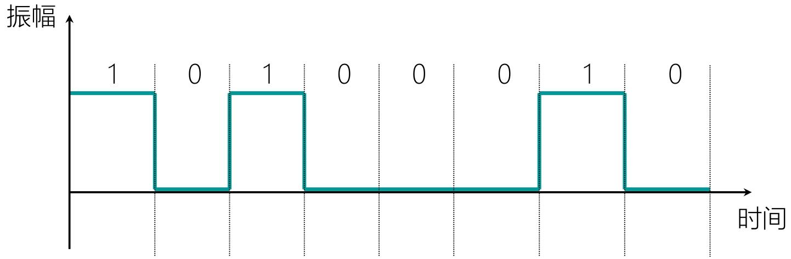

##### 极化编码

**采用正、负两种电压（比如 + 5V 和 - 5V），取消低电平（0V）**，从根源上减轻直流分量（正负电压平均后接近 0V）

（1）**非归零编码**（NRZ：Non-Return to Zero）—— 基础款，应用广

**每个比特间隙内，信号电平保持不变（不回到 0V）**，直到下一个比特才可能变化。分为两种：NRZ-L 和 NRZ-

NRZ-L（非归零电平编码） 是 “电平代表比特”

NRZ-I（非归零反相编码） 是 “翻转代表比特”：**电平翻转代表1，否则代表0**

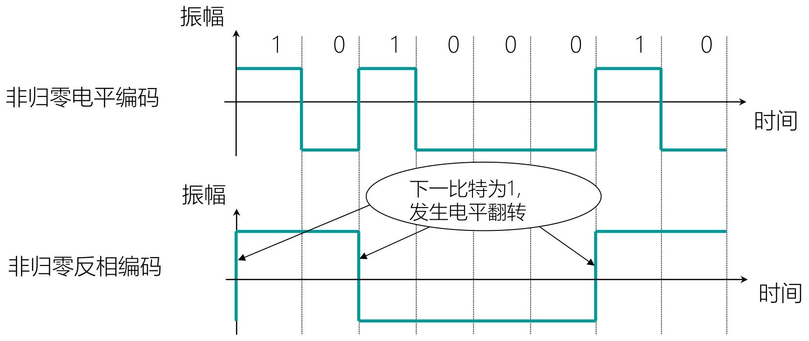

（2）**归零编码**（RZ：Return to Zero）—— 同步友好但带宽浪费

**每个比特间隙的中间，信号必须回到 0V**（归零），通过 “跳变方向” 表示 0/1，中间跳变同时实现同步。

- 电平：正电平（+5V）、负电平（-5V）、零电平（0V）；
- 比特 1：正电平→零电平的跳变（中间归零）；比特 0：负电平→零电平的跳变（中间归零）；
- 同步：每个比特中间都有跳变，接收方以跳变作为时钟同步（比如看到跳变就知道 “一个比特结束，下一个开始”）。

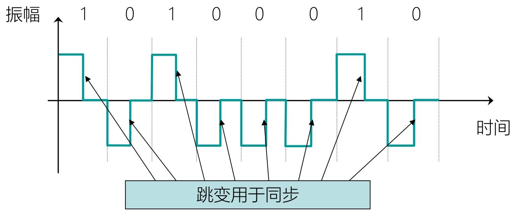

（3）**双相位编码** —— 同步 + 抗干扰最优，网络核心编码

**每个比特间隙的中间必须跳变（不归零）**，跳变既用于同步，又用于表示比特（或仅用于同步），完美解决同步问题，抗干扰性强。

分为两种：**曼彻斯特编码（MPE）** 和**差分曼彻斯特编码（DME）**

| 编码类型                | 核心规则（同步 + 比特表示）                                  | 优缺点                                                       | 适用场景                                                  |
| ----------------------- | ------------------------------------------------------------ | ------------------------------------------------------------ | --------------------------------------------------------- |
| 曼彻斯特编码（MPE）     | 1. 同步：每个比特中间必须跳变（时钟同步）；2. 比特表示：跳变方向决定比特 ———— 负电平→正电平（上升沿）= 比特 1；—— 正电平→负电平（下降沿）= 比特 0；（课件明确约定，不同标准可能相反，但考试按课件记！） | 优点：同步能力强（中间跳变）、抗干扰强（跳变明显，噪声难掩盖）；缺点：带宽占用高（比 NRZ 高一倍，每个比特都有跳变） | 以太网（网线传输）的核心编码！（IEEE 802.3 标准强制要求） |
| 差分曼彻斯特编码（DME） | 1. 同步：每个比特中间必须跳变（仅用于同步，和比特值无关）；2. 比特表示：比特间隙开始位置是否跳变决定比特 ———— 开始位置有跳变 = 比特 0；—— 开始位置无跳变 = 比特 1；（中间跳变仅同步，不代表比特！） | 优点：抗干扰性比曼彻斯特更强（开始跳变比中间跳变更易识别）；缺点：实现复杂（需要区分 “开始跳变” 和 “中间跳变”） | 令牌环网、工业控制网络（对干扰敏感的场景）                |

- 曼彻斯特编码：中间跳变→既同步又表示比特；**将时钟信号与数据信号通过异或运算融合**，使生成的 MPE 信号自带同步信息 

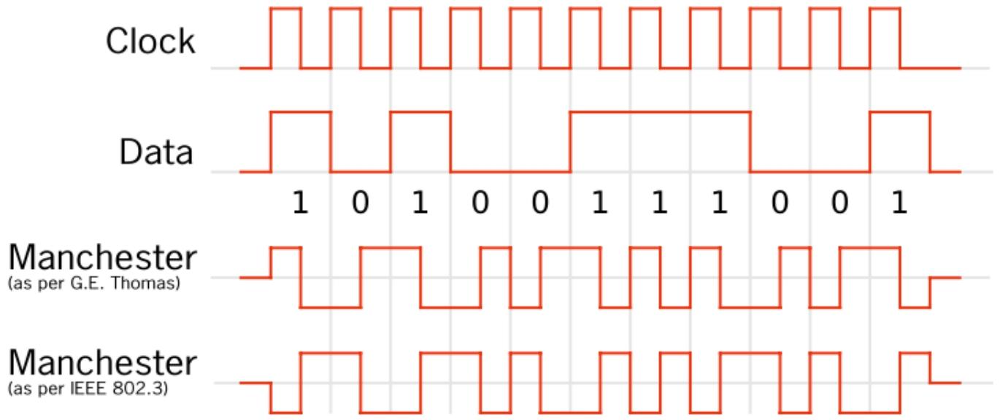

- 差分曼彻斯特编码：中间跳变→仅同步，开始跳变→表示比特。

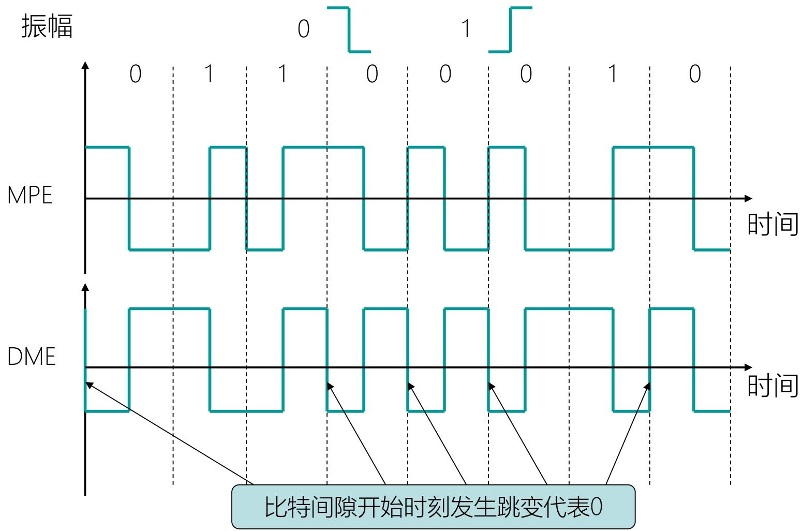

（4）4B/5B 编码 —— 解决连续 0/1 的终极方案

4B/5B 编码的目标是 “用 5 个比特表示 4 个比特”，从根源上避免连续 0/1，解决连续0或1导致的同步丢失问
题；同时提升编码效率。

- 映射关系：4 位二进制数（16 种组合）→ 5 位二进制数（32 种组合中选 16 种）；
- 选取原则（关键！）：每个 5 比特码组中，**不含多于 3 个连续 0**，且**不少于 2 个 1**（确保有足够的跳变，避免同步丢失）；

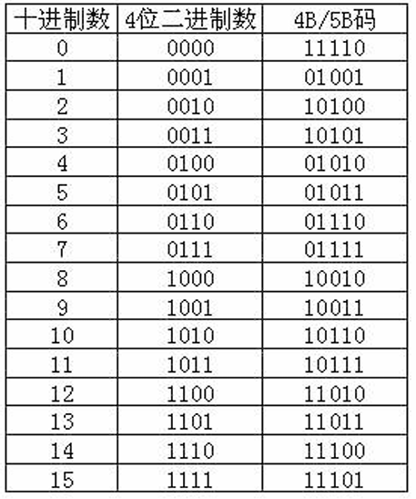

##### 双极性编码

和极化编码类似，使用**正、负、零三个电平**，但编码逻辑更侧重 “平衡传输”（正负电平交替，进一步消除直流分量）

- 比特 0：零电平（0V）；
- 比特 1：正负电平交替出现（比如第一个 1→+5V，第二个 1→-5V，第三个 1→+5V，以此类推）。

比如：信号交替反转码（AMI：Alternate Mark Inversion）

- 编码规则：0→0V；1→+V 和 - V 交替（Mark 代表 1，Inversion 代表反转）；
- 改进版：B8ZS（8 零替换）、HDB3（高密度双极性 3 零编码）—— 当出现连续 0 时，用特定的正负电平组合替换（比如 HDB3 用 “+V→0→0→-V” 替换 4 个连续 0），解决同步问题。

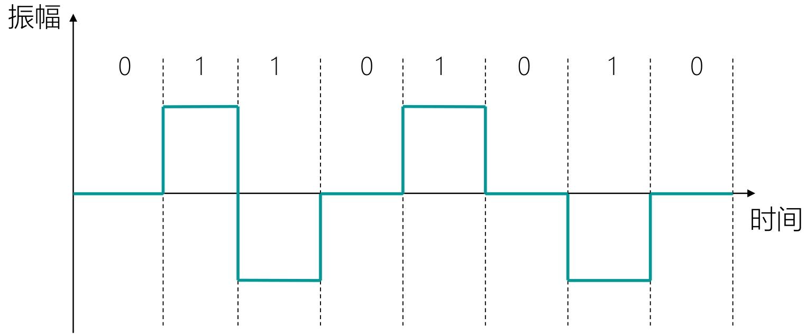

#### 数字—模拟编码

利用模拟信号表示数字信息的技术；即用模拟信号的三个关键参数（振幅、频率、相位）的变化来代表 0 和 1，这一过程也叫 “调制”（对应英文 “Modulation”）。

所以根据三个参数的选择分为幅移键控（ASK）；频移键控（FSK）；相移键控（PSK）；正交调幅（QAM）

##### 幅移键控（ASK：Amplitude Shift Keying）

用振幅变化表示 0/1

- 频率和相位不变，只有振幅随 0/1 变化。
- 抗干扰能力极差 —— 噪声容易改变信号振幅

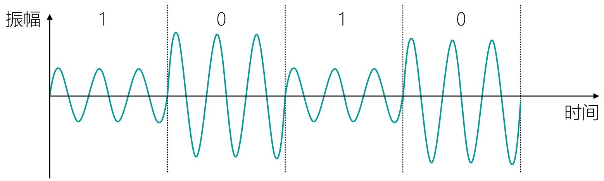

##### 频移键控（FSK：Frequency Shift Keying）

用频率变化表示 0/1

- 振幅和相位不变，只有频率随 0/1 切换。
- 抗干扰能力比 ASK 强 —— 噪声很难改变信号频率。但是带宽占用比 ASK 高

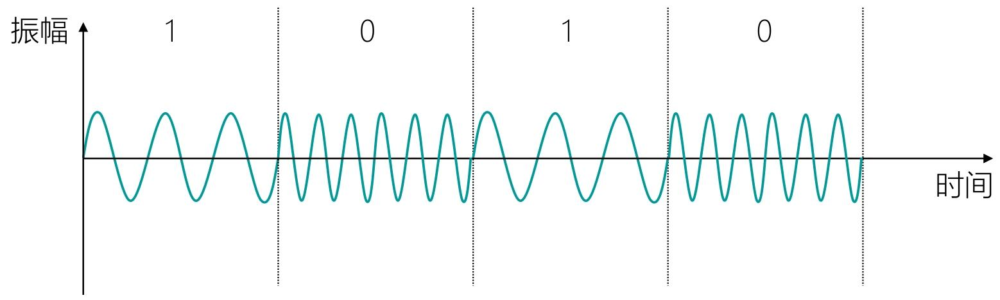

##### 相移键控（PSK：Phase Shift Keying）

用相位变化表示 0/1

- 振幅和频率不变，只有相位随 0/1 跳变。

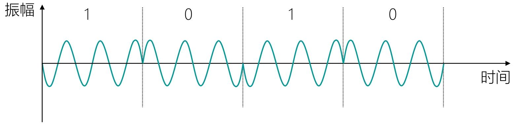

> [!tip]
>
> 多进制 PSK：
>
> 相位可以有多个角度（比如 0°、90°、180°、270°），每个角度代表一组二进制比特；
>
> 1. （4-PSK）：0° 相位 → 00；90° 相位 → 01；180° 相位 → 10；270° 相位 → 11；
> 2. （8-PSK）：8 个相位状态（0°、45°、90°…315°），每个状态表示 3 个比特（比如 000、001…111）
>
> 相移键控星座图” 是 PSK 的直观表示：星座图的 “每个点” 代表一个相位状态；星座图越密集（点数越多），每个状态承载的比特数越多，传输效率越高
>
> 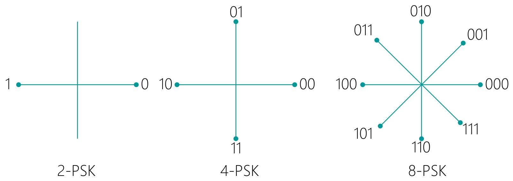

##### 正交调幅（QAM：Quadrature Amplitude Modulation）

QAM 是 “幅移键控 + 相移键控” 的混合技术，同时操控 “振幅” 和 “相位” 两个参数，让每个信号状态承载更多比特 —— 相当于 “双重叠加提升效率”。

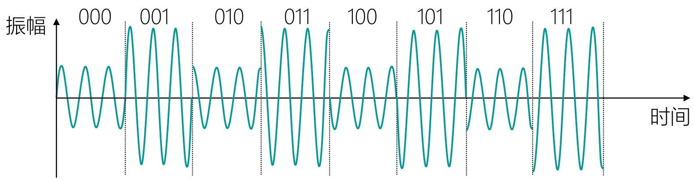

正交调幅星座图

QAM 的星座图是 “振幅 - 相位” 的二维分布：

- 横轴 / 纵轴：代表不同的相位分量；
- 每个点的 “位置”：既体现振幅（离原点的距离），又体现相位（与横轴的夹角）；

两种16相位QAM星座图：

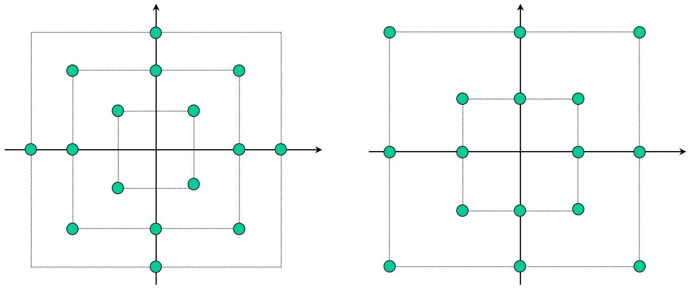

#### 模拟—数字编码

模拟 — 数字编码，本质是 “将连续变化的模拟信号（比如声音、温度、电压），转换成离散的二进制比特流（0/1）”，这个过程也叫 “模数转换（A/D 转换）”。

模拟 — 数字编码要经过 “采样→量化→编码” 三个不可逆步骤：

- 采样 —— 将连续的模拟信号离散化；**采样频率（每秒采样次数）必须大于信号最高频率的 2 倍**；
- 量化—— 离散的采样值用2进制位数量化；**量化位数（二进制位数）**—— 量化级的数量 = 2^ 量化位数；
- 编码—— 对量化后的数据用2进制编码

模拟信号→采样点→量化等级→二进制比特流，完成 A/D 编码。

**采样定理:采样频率大于信号最高频率的2倍｡**

#### 模拟 — 模拟编码

本质是 “用一个模拟信号去承载另一个模拟信号”，没有数字化过程，只是对原始模拟信号的参数（振幅、频率）进行调整，方便远距离传输或多信号复用。

- 传统有线电视、电话系统等
- “声音信号的频率范围 20Hz~20kHz，主要能量集中在 300Hz~3000Hz”。即放大信号 / 频率搬移

## 傅里叶分析与有限带宽信号

### 傅里叶分析(了解即可)

- **任何复杂的模拟信号，都可以被分解为多个不同频率、振幅、相位的正弦波（简单模拟信号）的叠加**—— 这就是傅里叶分析的核心思想

1. 介质带宽（Hz）：传输介质的 “频率通行证”

- 传输介质（网线、光纤、无线电波）只能有效传输 “某一频率范围” 内的信号，这个频率范围就是介质带宽（比如网线的带宽是 100MHz，意味着它能有效传输 0~100MHz 的信号）；
- 本质：介质的物理特性决定（比如导线的电阻、电容会阻碍高频信号传输），超出这个范围的信号会被大幅衰减（信号强度变弱）或失真；

2. 有效带宽（Hz）：信号还原的 “最低频率要求”

- 定义：数字信号（或复杂模拟信号）由多个谐波叠加而成，若只传输 “有重要振幅分量” 的谐波（能保证信号还原精度的谐波），这些谐波的最高频率就是有效带宽；
- 通俗理解：有效带宽是 “还原信号所需的最小频率范围”—— 只要介质的带宽≥信号的有效带宽，就能以合理精度还原信号；若介质带宽小于有效带宽，部分关键谐波会被过滤，信号失真；

3. 信道：信号传输的 “单向通道”

- 定义：表示 “向某一方向传送信息的媒体”—— 注意 “单向” 是核心（比如从 A 到 B 的网线是一条信道，从 B 到 A 的是另一条信道）；
- 与 “传输介质” 的区别：传输介质是物理载体（比如一根网线），信道是介质上的 “逻辑通道”；
  - 例：一根网线可以同时承载两条信道（A→B 和 B→A），实现双向通信；

4. 信道容量（bps）：传输介质的 “最大传输速度”

- 定义：传输介质在单位时间内可以传输的最大比特数（单位 bps），是衡量介质传输能力的核心指标；
- 关键影响因素：
  - 介质带宽：带宽越大，能传输的谐波越多，信道容量越高（比如光纤带宽远大于铜线，信道容量也远高于铜线）；
  - 编码技术：相同带宽下，高效编码（比如 QAM、曼彻斯特编码）能提升信道容量（比如 64-QAM 比 2-PSK 的容量高 6 倍）；

> [!note]
>
> 傅里叶分析→复杂信号由多个谐波组成→需要传输关键谐波（有效带宽）→传输介质的带宽必须≥信号有效带宽（否则失真）→介质带宽 + 编码技术决定信道容量（最大传输速度）。

### 基带信号和带通信号(了解即可)

**基带信号**和**带通信号**，它们的本质区别是 “是否经过载波调制（频谱搬移）”

#### 基带信号（基本频带信号）

基带信号是**来自信源的原始信号，未经过任何频谱搬移和变换**

1. 包含较多低频成分，甚至有直流分量（0Hz）：
   - 直流分量：信号的平均电平不为 0（比如单极性编码的高电平持续存在，相当于直流）；
   - 低频成分：信号变化缓慢的部分（比如连续多个 0 对应的低电平，频率接近 0）。
   - 解决方法：发送设备产生一个高频信号作为基波来承载信息信号((基波称为载波信号)
2. 传输受限：许多信道不能传输低频或直流分量 —— 比如无线电波信道、传统电话线信道，会过滤掉低频信号，导致基带信号失真或无法传输。

#### 带通信号

带通信号是**基带信号经过载波调制后的信号**—— 通过高频载波信号 “承载” 基带信号，让原本不能远距离传输的基带信号，能在特定信道中传输。

- 使用载波信号传输基带信号的过程称为调制(modulation)
  

### 奈氏准则

奈氏准则的核心是：**无噪声情况下，信道的最大码元速率（波特率）是信道带宽的 2 倍**，再结合码元状态数，就能算出最大比特率（数据传输率），它为无噪声信道的传输能力划定了理论上限。

1. **码元**：携带数据信息的最小信号单元，比如一个高电平、一个相位变化、一个频率跳变，都可以是一个码元（相当于 “信号的基本包装单位”）；
2. **二进制码元**：最基础的码元类型，只有 2 种状态（比如高 = 1、低 = 0），单位时间内的这种信号间隔叫 “码元长度”（比如 1 个码元长度 = 0.125 秒，意味着每秒能传 8 个码元）；
3. **码元速率（波特率 B）**：每秒传输的码元个数，单位是 “波特（Baud）”，描述的是 “信号单元传输的快慢”（不是数据传输的快慢）。

公式 1：无噪声信道的最大码元速率（波特率上限）`B=2×W(单位：Baud)`;`W` 是信道带宽（单位：Hz），`B`是最大波特率

公式 2：无噪声信道的最大比特率（数据传输率上限）*S*=*B*×log2*N*=2×*W*×log2*N*(单位：bps)；S 是最大比特率，N 是码元状态数

### 香农(Shannon)定理

信道总是要受到噪声的干扰，所以需要使用香农定理弥补奈氏准则

香农定理的核心是：**有噪声时，信道的最大传输速率（信道容量）由 “信道带宽” 和 “信噪比” 共同决定**，与码元状态数无关，它为现实信道的传输能力划定了理论上限。

噪声环境中有限带宽介质信道的最大传输速率C与信道带宽和信号噪声功率比之间的关系

*C*=*W*×log2(1+*S*/*N*)（单位：bps）

**W：信道带宽（Hz）**；**S：平均信号功率（W）**；**N：平均噪声功率（W）**

- **信噪比（S/N）与分贝（dB）换算**
- 信噪比（S/N）：信号功率与噪声功率的比值，是 “信号清晰度” 的指标（S/N 越大，信号越清晰）；
- 信噪比（dB)=10×log10(S/N)

## 多路复用技术

多路复用技术是数据通信的 “资源优化神器”—— 核心逻辑是**用一条物理链路同时传输多路信号**，最大化利用传输介质的带宽，降低通信成本。

四类核心技术：频分多路复用（FDM）、时分多路复用（TDM，含同步 / 异步）、波分多路复用（WDM）、码分多路复用（CDM）。

| 技术类型   | 核心区分维度   | 适用信号         | 带宽利用率 | 典型场景             | 核心特点               |
| ---------- | -------------- | ---------------- | ---------- | -------------------- | ---------------------- |
| FDM        | 频率划分       | 模拟信号为主     | 低         | 有线电视、广播       | 独占子频带，有警戒频带 |
| TDM - 同步 | 固定时间片     | 数字信号（连续） | 中         | 电话交换机、实时控制 | 时间片固定，实时性强   |
| TDM - 异步 | 动态时间片     | 数字信号（突发） | 高         | 互联网核心交换       | 按需分配，利用率高     |
| WDM        | 波长划分（光） | 光信号           | 极高       | 光纤骨干网           | 速率 T 级，抗干扰强    |
| CDM        | 码片序列划分   | 数字信号         | 高         | 3G、卫星通信         | 共享频率时间，抗干扰强 |

### 频分多路复用（FDM：Frequency Division Multiplexing）

- 把物理链路的**总带宽分割成多个互不重叠的子频带**（每个子频带 = 一个独立信道）；
- 每个用户独占一个子频带，从通信开始到结束全程占用，不同用户的信号在不同频率上并行传输；
- 关键：子频带之间必须留 “警戒频带/隔离频带”（空白频率），避免不同信道的信号相互干扰。
- 注意：FDM 的 “带宽” 是**频率带宽**（Hz），不是数据传输率（bps）

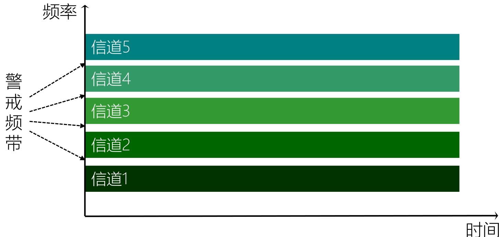

### 时分多路复用（TDM：Time Division Multiplexing）

- 把物理链路的**总传输时间分割成固定长度的 “时间片”**（每个时间片 = 一个独立信道）；
- 每个用户轮流占用一个时间片，按顺序循环使用链路
- 关键：所有用户共享同一带宽，只是在不同时间占用，适用于数字信号传输。
- 仅适用于数字信号（比如 0/1 比特流），因为数字信号是离散的，可在固定时间片内精准传输。

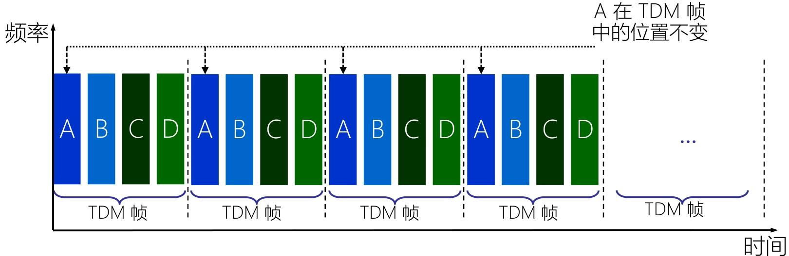

- 时隙周期性出现：每个用户的时间片会按固定周期重复
- 共享频带宽度：所有用户在不同时间占用**同样的频带宽度**，只是时间上错开，不会冲突。
- 定义：将多个用户的时间片组合成一个 “帧”（比如 A、B、C、D 各 1 个时间片，组成 1 个 TDM 帧）；
- 周期：1 个 TDM 帧的长度就是用户时间片的重复周期（比如帧长 = 4ms，用户 A 每 4ms 占用 1 次 1ms 时间片）；

#### 同步时分多路复用 TDM

时间片分配 “固定不变”

- 复用器给每个用户分配**固定数量的时间片**，无论用户是否有数据要传，时间片都预留着，位置固定不变；

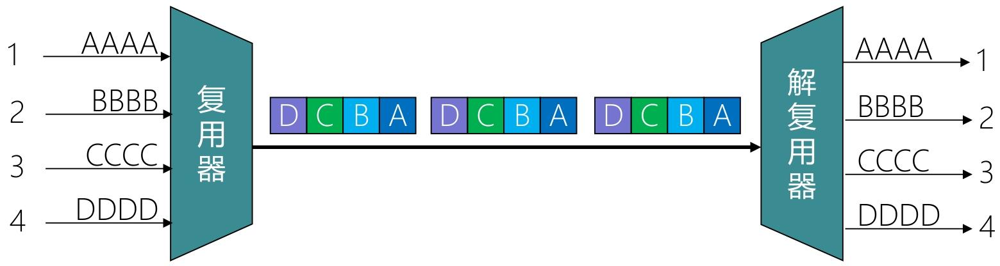

- 同步TDM可能浪费资源
- 用户 3 只有 c、c 数据，用户 4 只有 d 数据，但同步 TDM 仍为它们预留固定时间片，导致链路资源浪费

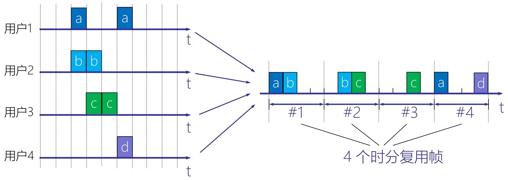

#### 异步时分多路复用（STDM）

时间片 “按需动态分配”

- 又称 “**统计复用**”，复用器不预留固定时间片，只给**有数据要传的用户**分配时间片；
- 所以每帧的时间片数量小于输入设备数量；
- 数据单元需附带**地址信息**，方便解复用器识别归属；

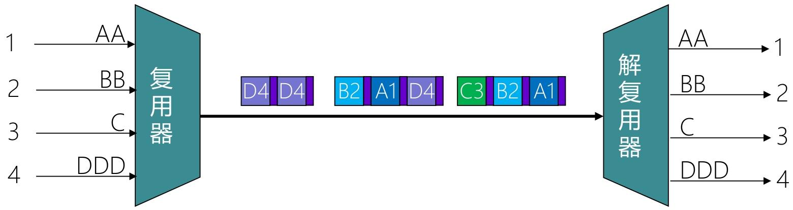

- STDM帧 中的时隙不是固定地分配给某个用户，因此每个时隙中还必须要有 `用户的地址信息`，因此造成开销
- 如下图，输出线路上每个时隙之前的 `短时隙（白色）` 用于存放 `用户地址信息`

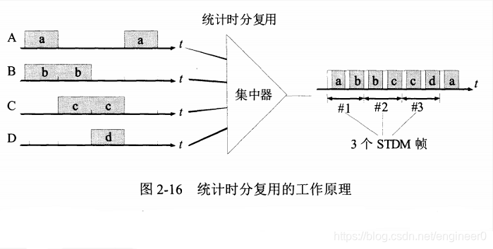

> [!tip]
>
> | 对比维度     | 同步 TDM                   | 异步 TDM（STDM）                   |
> | ------------ | -------------------------- | ---------------------------------- |
> | 时间片分配   | 固定不变，为每个用户预留   | 按需分配，只给有数据的用户         |
> | 帧大小       | 固定（时间片数量固定）     | 可变（时间片数量随数据量变化）     |
> | 资源利用率   | 低（空闲时间片浪费）       | 高（无空闲浪费）                   |
> | 实时性       | 强（无排队延迟）           | 较弱（可能排队等待）               |
> | 额外开销     | 无（无需地址信息）         | 有（数据带地址，需缓存）           |
> | 适用数据类型 | 连续数据（语音、实时控制） | 突发数据（上网、文件传输）         |
> | 核心设备要求 | 简单（无需缓存和队列管理） | 复杂（需缓存、队列管理、地址识别） |

---

### 波分多路复用（WDM：Wavelength Division Multiplexing）

- 本质：FDM 在**光纤通信**中的特殊应用 —— 把 “频率” 换成 “光的波长”；
- 用多个激光器产生不同波长的激光（每个波长 = 一个独立信道），将多路光信号调制到不同波长上，通过合波器合并后，在单根光纤中传输；
- 同时各个信道之间也有类似于FDM一样的隔离频带
- 接收端用分波器将不同波长的光信号分离，分别解调还原数据。

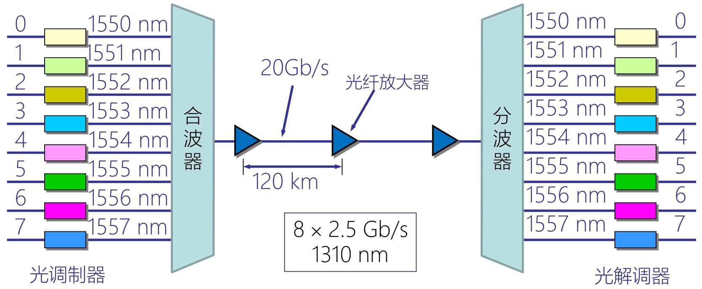

### 码分多路复用（CDM：Code Division Multiplexing）

码分多路复用（又称码分多址复用，CDMA）是一种**所有用户共享同一频率和带宽，仅通过 “独特码型” 区分信号**的复用技术，核心是 “码片序列的正交性”。

- 码分多路复用又称码分多址复用CDMA

1. **码片**：将每个比特的传输时间细分为`m`个更短的时间间隔（课件中`m=8`），每个间隔称为 1 个 “码片”；
2. **码片序列**：为每个用户分配一个长度为`m`的二进制码（课件中站点 A 的码片序列是`0 0 0 1 1 0 1 1`）；
3. **双极型表示**：为了计算正交性，将码片中的`0`映射为`-1`、`1`映射为`+1`（课件中 A 的双极型码片序列是`-1 -1 -1 +1 +1 -1 +1 +1`）。

> [!note]
>
> CDMA 的关键是**不同用户的码片序列相互正交**，即两个不同用户的码片序列做 “内积运算” 结果为 0。
>
> - **内积运算规则**：两个码片序列对应位置的元素相乘，再求和，最后除以码片长度`m`；
> - **正交性定义**：若用户 X 和 Y 的码片序列内积为 0，则两者正交（信号互不干扰）；若内积为 1，则是同一用户的信号；若内积为 - 1，则是该用户的反码（对应发送比特 0）。

信号发送规则(站点A （0 0 0 1 1 0 1 1）)

- 发送比特`1`：发送自身的双极型码片序列（如站点 A 发送`-1 -1 -1 +1 +1 -1 +1 +1`）；
- 发送比特`0`：发送自身码片序列的反码（如站点 A 的反码是`+1 +1 +1 -1 -1 +1 -1 -1`）。

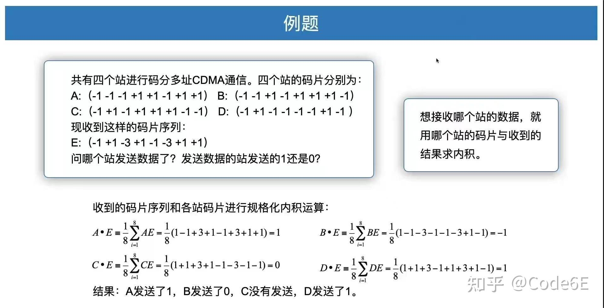

## 数据交换技术

- 当网络中有大量设备时，不可能每两台设备都直接连接物理链路（成本极高）
- 数据交换技术的核心是通过**中间设备**（交换机、路由器）为设备间**临时建立通信路径**，实现**无直接物理连接**（没有物理链路直接连接）的设备互通。

三种基本交换方式

| 交换方式 | 核心特征         | 延迟         | 链路利用率 | 适用场景                                        |
| -------- | ---------------- | ------------ | ---------- | ----------------------------------------------- |
| 电路交换 | 独占物理链路     | 最小（实时） | 低         | 语音通话、视频会议（实时通信）                  |
| 报文交换 | 存储完整报文转发 | 最大         | 中         | 早期电报（已淘汰）                              |
| 分组交换 | 存储分组转发     | 中           | 高         | 互联网、文件传输、手机数据（突发 / 非实时通信） |

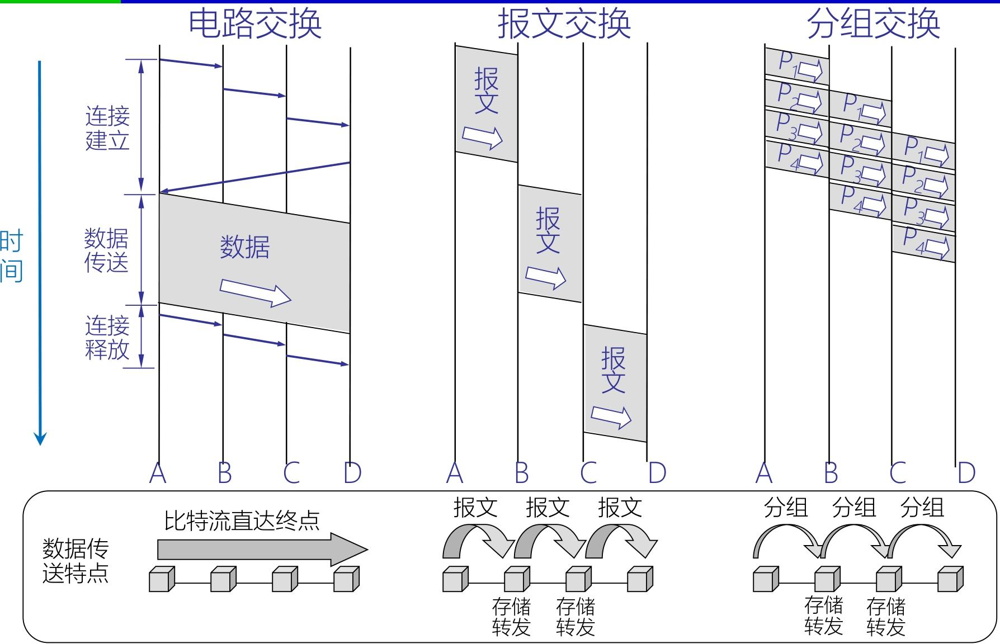

其它交换技术： ATM交换（信元交换）；帧中继

### 电路交换

- 电路交换是**早期通信网络的核心交换技术**，核心逻辑是 “为通信双方建立一条临时**独占**的物理链路”
- 通信前，在两个设备之间建立一条**完全独占的物理通路**
- 电路交换机可以理解为 “可动态切换的多路开关”—— 通过切换开关位置，为不同设备对（如 A-B、B-C）接通对应的物理链路。

电路交换过程包括：电路建立、数据传输、电路拆除

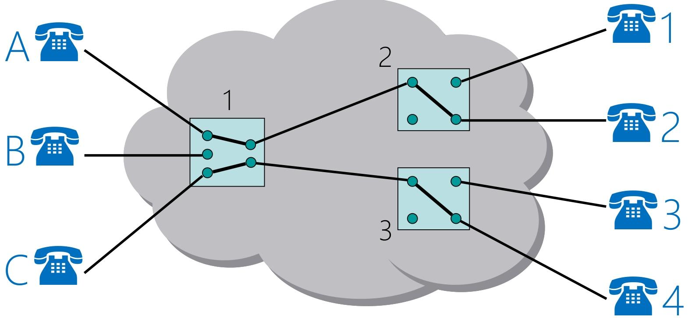

### 报文交换

报文交换是**第二代数据交换技术**，核心标签就是你提到的**存储转发**—— 它彻底改变了电路交换 “独占链路” 的模式，也是分组交换技术的前身。

- 通信双方不需要提前建立物理通路，发送方直接将完整的**报文**（发送到网络中。
- 网络中的中间节点（如交换机、路由器）收到完整报文后，先将其**全部存入本地缓存**；然后校验转发
- **传输延迟极大**：中间节点必须等待**整个报文完全接收并校验完毕**，才能开始转发。
- 同时报文错误后，重传的代价很大，必须传递整个大报文

### 分组交换

分组交换的核心是**将较长的报文拆分为较短的数据包，以包为单位存储转发**

- 在报文交换的基础上，将完整的长报文拆分成若干个**等长的短数据单元**。
- 给每个短数据单元**附加通信控制信息**，最终形成一个独立的**分组（Packet）**。比如源IP，目的IP，分组编号以及校验码等
- 包长度一般比报文短得多，只要包到达后就可以转发，不必等待报文全部到达，缩短传输延迟；类似于”流水线“
- 同时**容错性强**：单个分组传输失败（比如丢失、损坏），只需重传这一个分组，无需重传整个报文

分组交换的两种类型

1. 数据报：无连接、独立传输的 “自由分组”

   > 核心就是 **“每个分组独立处理，链路共享，乱序到达”**。
   >
   > - **每个包独立于其他包处理**
   > - **任何一条链路可同时为多对设备服务**
   > - **分组乱序到达，传输层负责重新排序**
   >
   > 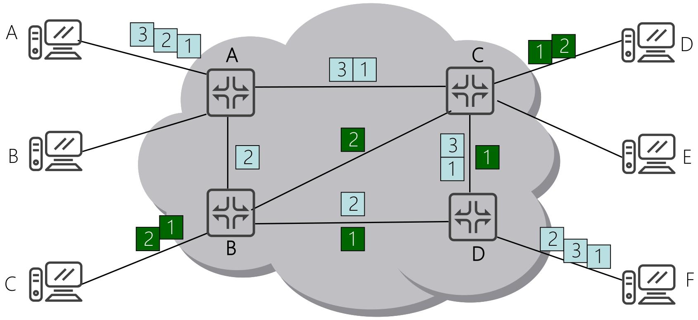

2. 虚电路：有连接、有序传输的 “逻辑专线”

   > 虚电路是 **“分组交换 + 电路交换” 的结合体 **;核心是 “维持同一次通信的所有包的关系，**提前选定路径**”
   >
   > - **同一次通信的所有包维持关系，提前选定路径**
   > - **传输分组时仅需携带虚电路号，减少开销**
   >
   > 虚电路与电路交换的本质区别：
   > 
   > | 对比维度 | 虚电路（分组交换）                                           | 电路交换                                                   |
   > | -------- | ------------------------------------------------------------ | ---------------------------------------------------------- |
   > | 链路性质 | 建立的是**逻辑路径**，同一物理链路可同时承载多条虚电路（链路共享） | 建立的是**物理独占链路**，链路只能被一对设备使用           |
   > | 资源占用 | 仅在传输分组时占用链路，无分组传输时链路可分配给其他虚电路   | 通信全程独占链路，即使无数据传输，链路也无法被其他设备使用 |
   > | 技术归属 | 属于分组交换，基于 “存储 - 转发” 机制                        | 属于电路交换，无存储转发，直接比特流传输                   |
   > 
   > 同时根据虚电路的存在时间，分为**交换虚电路（SVC）** 和**永久虚电路（PVC）**，两者的核心区别是 “是否按需创建”。
   >
   > - 交换虚电路（SVC）:**按需创建，用完即删**。
   >- 永久虚电路（PVC）：**长期存在，固定分配**。
   > 
   > 优点：分组有序到达，无需传输层排序；控制信息开销小；延迟稳定，通信质量可控

> [!tip]
>
> 分组交换 vs 电路交换：
>
> | 对比维度        | 电路交换                                     | 分组交换                                           |
> | --------------- | -------------------------------------------- | -------------------------------------------------- |
> | 链路占用方式    | 独占物理链路，通信全程专用                   | 共享链路，多路分组穿插传输                         |
> | 资源利用率      | 极低（空闲时链路浪费）                       | 极高（链路始终高效利用）                           |
> | 拥塞 / 流量控制 | 无，要么通要么断                             | 有，缓存排队导致延迟增大                           |
> | 通信模式支持    | 仅支持点对点通信                             | 支持点对点、广播、多播                             |
> | 设备兼容性      | 仅支持同类、同速率设备                       | 支持异构设备（电脑 / 手机 / 传感器等）             |
> | 适用场景        | 语音通话、视频会议等**实时性要求极高**的业务 | 网页浏览、文件下载、直播等**突发式、非实时**的业务 |

## 错误检测编码

错误检测编码的本质是**通过添加冗余码，建立 “原始数据” 和 “校验信息” 的关联规则**，以此判断数据在传输过程中是否发生失真。

- **发送方操作：添加冗余码**，按照**预设的校验规则**计算出一段**冗余码**，将数据和冗余码一起发送
- **接收方操作：规则校验**：接收方收到 “原始数据 + 冗余码” 后，**使用和发送方完全相同的校验规则**重新计算；
- **编码效率**：数据信息在整个发送信息中的比重，即*R*=*n/k*=原始数据比特数/(原始数据比特数+冗余码比特数)；

检错码 vs 纠错码

- 检错码：只 “查错” 不 “纠错”，即给发送信息加上冗余位，使其具备检错功能，所以检测到错误后，一般通过**重传机制**请求发送方重新传输数据
- 纠错码：既 “查错” 又 “纠错”，即能检错，同时能纠正错误的冗余码

数据在传输中受电磁干扰、信号衰减等影响，会出现不同类型的比特错误，将其分为三类

1. 单比特错误：同一传输单元中，**仅有 1 个比特位发生翻转**；
2. 多比特错误：同一传输单元中，**有 2 个及以上不连续的比特位发生翻转**；
3. 突发错误：同一传输单元中，**连续多个比特位发生翻转**，是实际传输中**最常见的错误类型**

### 奇偶校验码

奇偶校验码是最简单、最常用的检错码，核心是通过**添加 1 位校验位**，让数据中 “1” 的个数满足 “奇数” 或 “偶数” 规则，以此检测传输错误。

1. 偶校验：让 `数据单元 + 校验位` 中 **“1” 的总数为偶数**；*r*=*b*1⊕*b*2⊕*b*3⊕⋯⊕*bm*
2. 奇校验：让 `数据单元 + 校验位` 中 **“1” 的总数为奇数**；*r*=*b*1⊕*b*2⊕*b*3⊕⋯⊕*b*m⊕1`即在偶校验结果的基础上**异或 1**，翻转结果的奇偶性；

发送方发送数据时，连同校验位`r`一起发送；接收方根据结果，判断是否发生差错

当传输**多块数据**时，单一的 “逐块校验”（垂直校验）检错能力有限，因此衍生出水平校验和纵横校验

1. 垂直（纵向）偶校验：**对每一块数据单独计算校验位**，附加在该块数据的末尾；

   

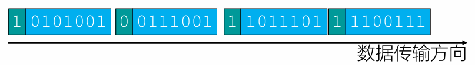

2. 水平(横向)偶校验：**对多块数据的 “相同位置比特” 进行偶校验**，生成 1 个 “水平校验块”；

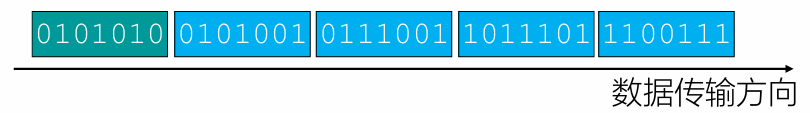

3. 水平垂直（纵横）偶校验：**同时做垂直校验和水平校验**，形成 “数据矩阵 + 校验矩阵”；

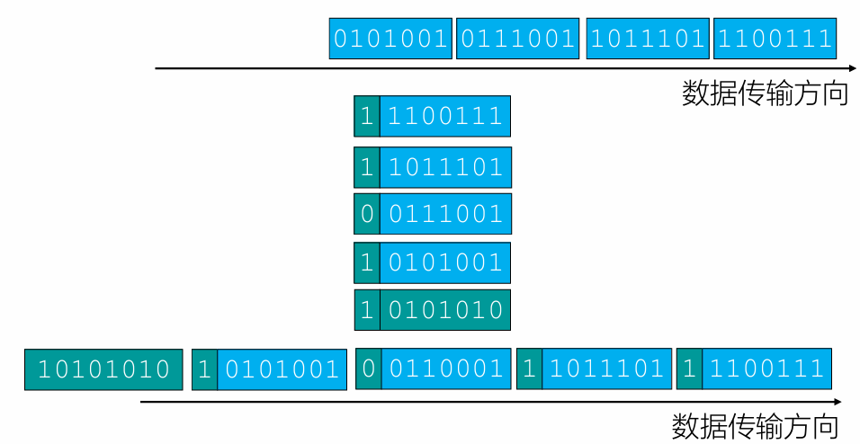

奇偶校验码**只能检错，不能纠错**，不同校验方式的检错能力差异很大：

| 校验方式                   | 能检测的错误                                                 | 不能检测的错误                                               |
| -------------------------- | ------------------------------------------------------------ | ------------------------------------------------------------ |
| **垂直偶校验**             | 1. 单个数据单元内的**单比特错误**（1 个比特翻转）2. 单个数据单元内的**奇数个比特错误**（如 3、5 个比特翻转） | 1. 单个数据单元内的**偶数个比特错误**（如 2、4 个比特翻转，奇偶性不变）2. 跨数据块的同一位错误 |
| **水平偶校验**             | 1. 多块数据中**同一位的奇数个错误**（如块 1、块 3 的第 2 位同时翻转，共 2 个？不，奇数个：块 1、块 3、块 4 的第 2 位翻转，共 3 个）2. 单个数据单元内的**突发错误**（连续多个比特翻转，若总数为奇数） | 1. 多块数据中同一位的**偶数个错误**2. 同一数据单元内的偶数个比特错误 |
| **水平垂直（纵横）偶校验** | 几乎所有错误：1. 单比特 / 奇数个比特错误2. 跨块同一位错误3. 大部分突发错误 | **唯一漏检情况**：数据块中 **偶数个数据单元** 的 **偶数个相同位** 同时出错（比如块 1 和块 2 的第 2、3 位同时翻转，共 2 个单元 ×2 个比特 = 4 个错误，奇偶性不变） |

### 循环冗余校验码（CRC）

CRC 的本质是**基于 “模 2 除法” 的余数校验**

1. 通信双方提前约定一个**生成多项式Gx)**（相当于校验规则）；如 G(x)=x^4+x^3+1=11001，即m=4
2. 发送方将待发送数据 *U*(*x*) 左移 *m* 位（*m* 是 *G*(*x*) 的最高阶数），再用模 2 除法除以 *G*(*x*)，得到 *m* 位余数 *R*(*x*)；
3. 发送方将余数 *R*(*x*) 拼接在原始数据 *U*(*x*) 末尾，形成完整传输数据；
4. 接收方用同样的*G*(*x*)对收到的完整数据做模 2 除法：
   - 若余数为 **0** → 判定数据传输无误；
   - 若余数不为 **0** → 判定数据传输出错。

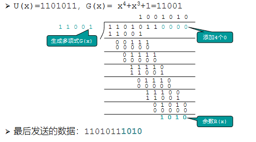

接收方收到 `11010111010` 后，用 *G*(*x*)=11001 做模 2 除法：

> [!tip]
>
> 明确 CRC 的除法是**无借位的模 2 法则**，和我们日常的十进制除法完全不同，规则如下：
>
> 1. **模 2 加法 / 减法**：等价于**异或运算**，规则：相同为 0，不同为 1。
>
> 2. 被除数的**最高位与除数对齐**，从高位开始逐位计算；
>
> 3. 若被除数当前最高位是 **1**：用除数与被除数对应位做**模 2 减法（异或）**，得到新的被除数；
>
> 4. 若被除数当前最高位是 **0**：用全 0 序列与被除数对应位做异或，得到新的被除数；
>
> 5. 重复上述步骤，直到被除数的长度**小于除数长度**，此时的被除数就是余数 *R*(*x*)。余数长度**必须等于 G(x) 的最高阶 m**，不足时高位补 0；
>

CRC 的检错能力由**生成多项式 G(x) 的最高阶 r** 决定

1. **能检测出所有奇数位的突发性错误**：无论错误比特数是 3、5、7 等奇数，CRC 都能 100% 检测；
2. **能检测出所有长度小于 r 的突发性错误**：比如 *r*=4，长度 1~3 位的连续错误，100% 检测；
3. **检测长度为 r+1 的突发性错误的概率为(2^r-1)/2^r**：比如 *r*=4，长度 5 位的突发错误，检测概率为 15/16=93.75%；
4. **检测长度大于r+1 的突发性错误的概率为(2^r-1)/2^r **：概率同样极高。

**CRC-32** 是应用最广的标准，生成多项式为：

### 校验和

 发送方通过 “求和 + 取反” 生成校验和，接收方通过 “求和 + 校验” 判断数据是否出错，核心规则是**二进制加法 + 进位循环 + 按位取反**。

**数据分段**：待传输的数据被分成 **4 个 8 比特（1 字节）的数据段**；整个数据单元分成大小都为n（一般为16）

- 加法：**二进制无符号加法**，产生的进位需**循环加到结果的最低位**（这是校验和的关键规则即**反码加法**）；
- 取反：**按位取反**，0 变 1，1 变 0；
- 校验准则：接收方将所有数据段 + 校验和求和，若结果为 **全 1（8 比特则为`11111111`）**，判定数据无错。

对于发送方：

**“4 个数据段求和 → 处理进位 → 取反得到校验和”**

1. 4 个数据段逐次二进制求和（含进位循环）
2. 溢出的进位需要**循环加到 8 位结果的最低位**即**反码加法**
3. 按位取反，得到校验和

对于接收方：

**“4 个数据段 + 校验和求和 → 处理进位 → 判断是否全 1”**

1. 接收方收到 4 个数据段和校验和后，执行与发送方相同的二进制加法，包括**进位循环**：
2. (数据段总和+校验和)=(数据段总和)+~(数据段总和)；所以将数据和加上校验和判断是否为全`1`

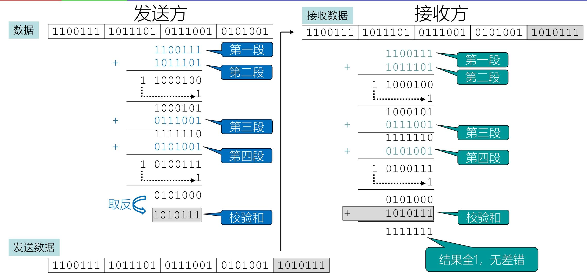

