# 物理层

物理层是整个网络体系结构的基础，它直接**对接传输介质**，负责将数据以**比特流**的形式从一个设备传输到另一个设备。

## 物理层功能

物理层的核心功能是**实现计算机与通信媒体的连接**，并将上层（数据链路层）交付的帧转换成**比特流**，通过传输介质传输，同时接收对方的比特流并还原给上层。

- 数据传输的基本单位是**比特（Bit）**，也就是 0 和 1。

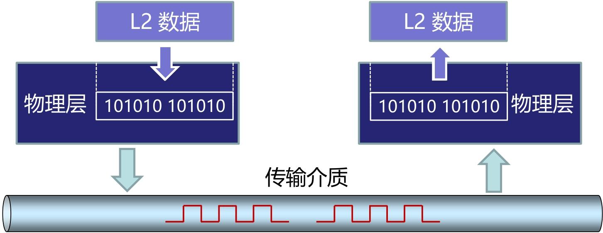

### 要解决的 7 个关键问题

要实现 “连接 + 比特传输”，物理层必须先解决以下 7 个核心问题 —— 从 “怎么连” 到 “怎么传” 的全流程

| 问题类型     | 核心含义                     | 实例说明                                                     |
| ------------ | ---------------------------- | ------------------------------------------------------------ |
| 线路配置     | 设备与传输介质的连接方式     | 点对点（电脑→路由器）、多点连接（多台电脑连到同一根总线）    |
| 数据通信模式 | 数据传输的方向规则           | 单工（广播电台：只能听不能发）、半双工（对讲机：能互发但不能同时）、全双工（微信语音：同时说同时听） |
| 拓扑结构     | 多台设备的物理连接形态       | 星型（所有电脑连路由器）、总线型（早期以太网用一根同轴电缆连所有设备）、环型（老式令牌环网） |
| 信号         | 比特流的物理表现形式         | 电信号（双绞线传输：高电平代表 1，低电平代表 0）、光信号（光纤传输：亮代表 1，灭代表 0）、无线电信号（Wi-Fi 传输：特定频率波动代表 0 和 1） |
| 编码         | 0 和 1 与信号的对应规则      | 比如 “非归零编码”（NRZ）：持续高电平是 1，持续低电平是 0；“曼彻斯特编码”（后面会学）：电平跳变代表 0 或 1 |
| 接口         | 设备与传输介质的连接端口标准 | 电脑的 RJ45 网线接口、手机的 USB-C 接口、路由器的光纤接口    |
| 介质         | 选择哪种物理载体传输信号     | 家庭上网用双绞线，小区骨干网用光纤，户外监控用微波           |

这 7 个问题是层层递进的：先确定 “用什么介质”（介质）和 “设备怎么连”（线路配置 + 拓扑结构），再明确 “数据怎么传方向”（通信模式），最后解决 “0 和 1 怎么变成物理信号”（信号 + 编码）和 “设备端口怎么匹配”（接口）。

### 物理层的四大特性

为了让不同厂商的设备能通过物理层互通，必须对 **“接口和传输规则” 进行标准化** —— 这就是物理层的四大特性，每个特性都对应一个具体的 “标准化维度”

1. 机械特性：规定接口的**物理结构**，包括插头 / 插座的尺寸、引脚数量、引脚位置、线缆类型等。
2. 电气特性：规定传输线上的**电信号参数**，包括电压范围、信号速率、阻抗匹配等
3. 功能特性：规定接口每个引脚（或信号线）的**具体功能**，比如哪根线用于发送数据、哪根用于接收数据、哪根是接地线。
4. 规程特性：规定数据传输的**操作流程**，包括建立连接、传输数据、断开连接的先后顺序，以及不同信号（如控制信号、数据信号）的交互规则。

##  传输介质

传输介质是计算机网络中数据传输的 “**物理载体**”，就像我们日常通信的 “道路”—— 没有道路，数据就无法从一台设备到达另一台设备。

- 信息是 “内容”，信号是 “载体”，传输介质是 “传输载体的通道”—— 三者的关系是：信息→编码成比特流→转换成信号→通过传输介质传输。
- 将传输介质分为**导向传输媒体（有线介质）** 和**非导向传输媒体（无线介质）**，分类标准是 “信号是否有固定传播路径”

 5 种核心类型，我们结合两大分类，逐一说明其归属和核心应用，帮大家建立 “分类 - 类型 - 场景” 的关联：

| 介质类型 | 归属分类       | 核心应用场景                                           |
| -------- | -------------- | ------------------------------------------------------ |
| 双绞线   | 导向（有线）   | 家庭上网、企业局域网、办公电脑连接路由器 / 交换机      |
| 同轴电缆 | 导向（有线）   | 早期有线电视网、部分监控线路                           |
| 光纤     | 导向（有线）   | 骨干网（运营商机房之间）、数据中心高速连接、远距离传输 |
| 微波     | 非导向（无线） | 城域网骨干网、远距离点对点通信、5G 基站回传            |
| 红外     | 非导向（无线） | 短距离点对点通信、遥控设备                             |

### 传输介质频谱

- **低频段（无线电波）→ 同轴电缆**：波长 longer，绕射能力强（能绕过建筑物、地形），传输距离远，但速率低；
- **中高频段（微波）→ 无线介质（地面 / 卫星微波）**（如微波、红外线、可见光）：波长 shorter，绕射能力弱（多为直线传播），传输距离近，但速率高、带宽大；
- **极高频段（可见光 / 近红外）→ 光纤**：极高频信号速率极高，但在自由空间中易受干扰，且方向性极强，因此用光纤 “约束” 光信号传输（全反射），既减少衰减，又避免干扰。
- 超高频电磁波（如 X 射线、γ 射线）：波长极短，穿透能力强，但能量高、不易控制，不用于常规网络传输

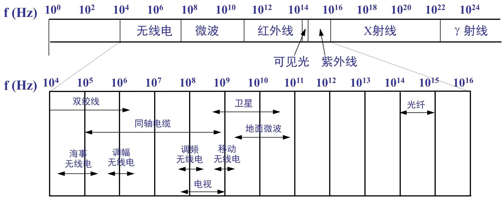

### 双绞线

双绞线是我们日常网络中最常用的传输介质 —— 家里上网的网线、机房里连接服务器的线缆，几乎都是双绞线。

双绞线是将两根单独的绝缘导线按照某种标准以**互相缠绕**的方式组成的一种配线。通过扭绞导线，一部分噪声信号沿一个方向传输（发送），而另一部分则沿反方向传输（接收），这种导线相互缠绕的形式可有效**减少导线上的磁效应**，并且来自外部的干扰信号会被导线的扭绞相互抵消。

与单根导线或非双绞水平排列的线对相比，双绞线减少了线对间的电磁辐射和相邻线对间的串扰，并有效抑制了来自外部的电磁干扰。

双绞线的核心区别在于 “是否有屏蔽层”，屏蔽层的作用是**减少电磁干扰（EMI）和射频干扰（RFI）**

| 类型简称 | 英文全称                                               | 核心结构特点                                               | 优缺点                                                       | 适用场景                                                     |
| -------- | ------------------------------------------------------ | ---------------------------------------------------------- | ------------------------------------------------------------ | ------------------------------------------------------------ |
| UTP      | Unshielded Twisted Pair（非屏蔽双绞线）                | 无金属屏蔽层，仅 8 根铜芯线绞合 + 塑料外皮                 | 优点：成本低、重量轻、安装方便（可弯曲）；缺点：抗干扰能力弱 | 家庭上网、办公局域网、普通机房（无强干扰环境）—— 日常最常用  |
| STP      | Shielded Twisted Pair（屏蔽双绞线）                    | 每对双绞线外有金属屏蔽层（如铝箔），整体再包外皮           | 优点：抗干扰能力强（屏蔽层阻挡外部干扰）；缺点：成本高、安装复杂（屏蔽层需接地，否则反而引入干扰） | 工业环境（如工厂机床旁，强电磁干扰）、涉密机房（需要防信号泄露） |
| S/UTP    | Screened/Unshielded Twisted Pair（总屏蔽非屏蔽双绞线） | 无单对屏蔽，仅整束双绞线外有一层总屏蔽层                   | 优点：抗干扰能力介于 UTP 和 STP 之间，成本比 STP 低；缺点：对单对线缆的干扰防护不足 | 对干扰有一定要求，但预算有限的场景（如小型企业机房）         |
| S/STP    | Screened/Shielded Twisted Pair（总屏蔽屏蔽双绞线）     | 每对双绞线有独立屏蔽层，整束外还有一层总屏蔽层（双重屏蔽） | 优点：抗干扰能力最强，信号保密性好；缺点：成本最高、重量最重、安装难度大 | 强干扰 + 高保密场景（如军事通信、大型数据中心核心区域）      |

568A 和 568B 是双绞线的两种线序规范 ——**线序的作用是保证发送端和接收端的信号对应，避免交叉错乱**。即设备的 “发送引脚（TX）” 必须对应另一设备的 “接收引脚（RX）”

| 线对（Pair）   | 568A 标准（线色→引脚） | 568B 标准（线色→引脚） | 关键用途（百兆网）                       |
| -------------- | ---------------------- | ---------------------- | ---------------------------------------- |
| 1（白蓝 - 蓝） | 白蓝→5，蓝→4           | 白蓝→5，蓝→4           | 闲置（或用于以太网供电）                 |
| 2（白橙 - 橙） | 白橙→3，橙→6           | 白橙→1，橙→2           | 568A 中是接收（RX），568B 中是发送（TX） |
| 3（白绿 - 绿） | 白绿→1，绿→2           | 白绿→3，绿→6           | 568A 中是发送（TX），568B 中是接收（RX） |
| 4（白棕 - 棕） | 白棕→7，棕→8           | 白棕→7，棕→8           | 闲置（或用于以太网供电）                 |

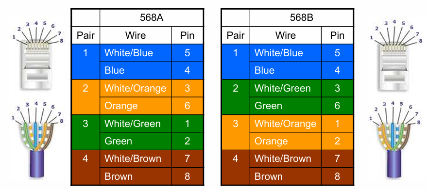

仅 2、3 线对的引脚位置互换

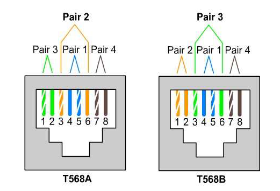

双绞线连接器（RJ45/8P8C）

常说的 “网线插头”，正式名称是**8P8C 连接器**，俗称 RJ45

- 8P：8 个 Position（位置）—— 连接器内部有 8 个引脚槽位；
- 8C：8 个 Contact（触点）—— 每个槽位对应一个金属触点，插入网线后与铜芯线接触导电。

> [!tip]
>
> - 百兆以太网（100BASE-TX）：仅使用 1、2、3、6 四根引脚（对应 2 对线），其余 4 根（4、5、7、8）闲置或用于 PoE（以太网供电，如给监控摄像头、无线 AP 供电）；
>   - 信号传输方式：**差分信号**——1、2 引脚发送差分信号（TX+、TX-），3、6 引脚接收差分信号（RX+、RX-）；差分信号的优势是 “抗干扰”—— 外界干扰对两根线的影响相同，接收端可通过减法抵消干扰，保证信号稳定。
> - **千兆以太网（1000BASE-T）或以太网供电（PoE）**：使用全部 4 对线（8 根引脚），每对都承担发送 / 接收任务，实现高速传输或供电。

直连线和交叉线的本质是 “两端线序是否相同”，核心用途是 “匹配不同设备的 TX/RX 引脚”：

- 直连线：两端线序完全相同 ，同为 568A 或 同为 568B（日常优先用 568B）
- 交叉线：两端线序不同 ，一端 568A + 另一端 568B

双绞线参数：**传输速率 = lanes（每方向通道数）× bits per hertz（每赫兹比特数）× spectral bandwidth（频谱带宽）**

其中100BaseT则`T`表示双绞线

### 同轴电缆

内层导体与外层网格导线 “同轴心”，能让电信号的电场和磁场集中在两者之间，减少信号辐射（泄露）和外界干扰

同轴电缆通过**无线电波管制（RG）级别**分类

同轴电缆的两种类型：细缆（10Base2）与粗缆（10Base5）

- “10”：代表传输速率为 10Mbps（早期以太网的主流速率）；
- “Base”：代表 “基带传输”（直接传输数字信号，无需调制，区别于射频等宽带传输）；
- “2”/“5”：代表最大传输距离（单位：100 米）——10Base2 最大距离 200 米，10Base5 最大距离 500 米

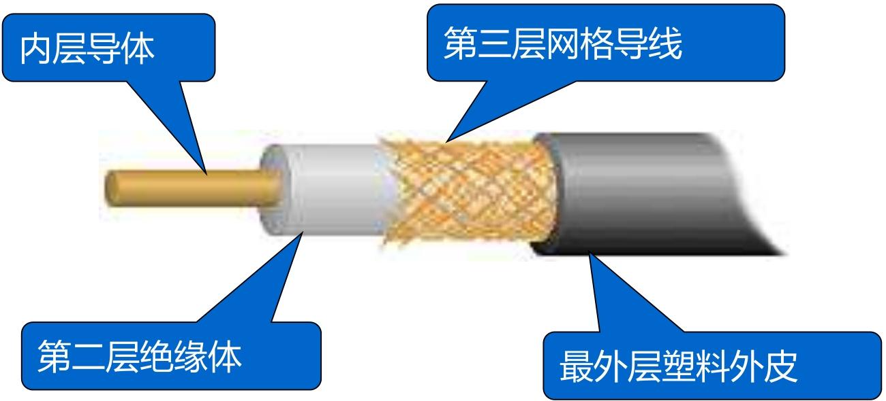

### 光纤

光纤 —— 这种目前传输速率最快、抗干扰能力最强的导向传输介质，也是现代通信骨干网的核心载体。

结构上，光纤的结构包括 “纤芯、包层、填充材料、保护层”

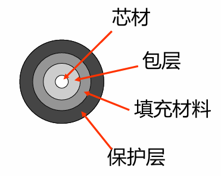

“光线在纤芯中传输的方式是不断地**全反射**”

1. 核心前提：折射率差（n₁ > n₂）
2. 光从**光密介质（高折射率 n₁）射向光疏介质（低折射率 n₂）**（即从纤芯→包层）；
3. 入射光线与界面的**入射角 ≥ 临界角**（临界角由 n₁和 n₂决定，公式：sinθ 临界 = n₂/n₁）。

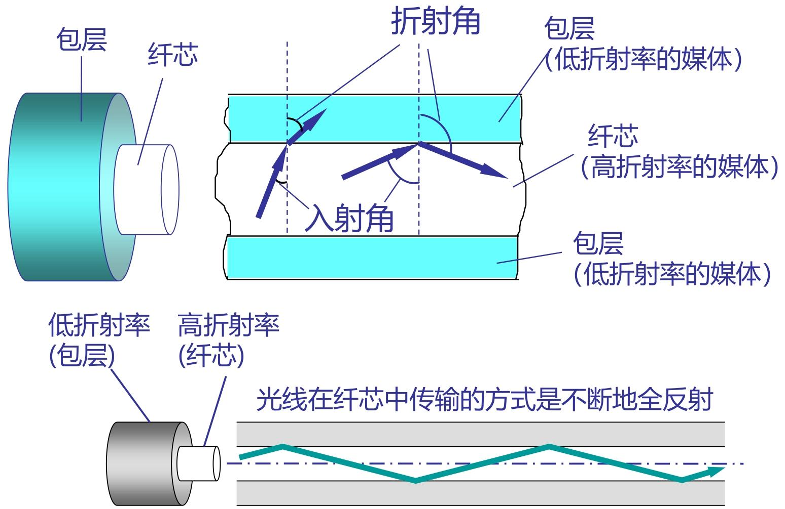

优点：抗干扰，传输速率高、距离长； 缺点：价格贵，安装维护困难，费用高

规格：单模光纤（SMF）与多模光纤（MMF）

光学上把具有**一定频率、一定的偏振状态和传播方向**的光波称做光波的一种模式。

- 只允许传输一个模式光波的光导纤维称为单模光导纤维
- 允许同时传输多个模式光波的光导纤维称为多模光导纤维。 

光缆组件与光电转换设备（光纤通信的配套核心）

- 光纤本身无法直接传输电信号（计算机处理的是电信号），且单根光纤易损坏，因此需要 “光缆组件” 和 “光电转换设备” 配合使用：
- 其中光缆组件：将多根光纤（如 12 芯、24 芯）封装在一起，加上保护层、加强芯（如钢丝），形成 “光缆”
- 光电转换设备（核心：电→光、光→电转换）
  - 传输：发光二极管(LED)或注入激光二极管(ILD)
  - 接收：光敏元件或光敏二极管

### 无线传输介质

微波通信、卫星通信，以及无线局域网（WLAN）的核心组件。

这三类技术是无线通信的基石：

- 微波通信解决 “地面中远距离高速传输”
- 卫星通信解决 “广覆盖（跨洋、偏远地区）传输”
- WLAN 组件则是我们日常 Wi-Fi 上网的硬件基础。

## 物理层接口

**明确 “谁连谁（DTE/DCE）”+“怎么连（EIA-232 标准）”**

### DTE 与 DCE

物理层接口的本质是**DTE 与 DCE 的连接**，两者是 “终端 - 中转” 的关系：

| 设备类型                | 核心定位               | 功能                                                         | 典型实例                                    |
| ----------------------- | ---------------------- | ------------------------------------------------------------ | ------------------------------------------- |
| DTE（数据终端设备）     | 数据的 “产生 / 使用者” | 具备数据处理能力，能收发数据，但**不直接连网络**             | 电脑、服务器、路由器（终端侧）              |
| DCE（数据电路终接设备） | 数据的 “中转 / 转换器” | 连接网络，将 DTE 的数字信号转成适合网络传输的信号（如模拟信号） | 调制解调器（Modem）、光猫、交换机（中心侧） |

其中DTE和DCE的连接称为DTE—DCE接口；DTE-DCE 接口上同时传输 “数据信息”（如文件内容）和 “控制信息”（如 “请求发送”）；

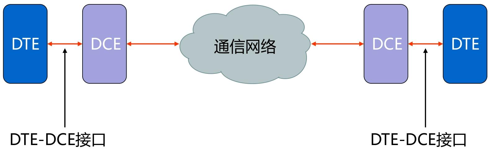

下面有两种常见的接口标准

### 双绞线连接器（RJ45/8P8C）

和上述双绞线的描述一致，

常说的 “网线插头”，正式名称是**8P8C 连接器**，俗称 RJ45

### EIA-232 接口标准

EIA-232 是最经典的 DTE-DCE 接口标准（早期称 RS-232），通过**四大特性**定义连接规则：

1. 机械特性：接口的 “物理形态”

- 采用**DB25 连接器**（25 针），实际常用简化的 9 针连接器（子集）；
- 引脚功能分类：数据（4 针）、控制（11 针）、定时（3 针）、其他（7 针）；
- 限制：电缆长度≤25 米（超过则信号衰减严重）；
- 接口类型：DTE 端用**阳型（针式）**，DCE 端用**阴型（孔式）**。

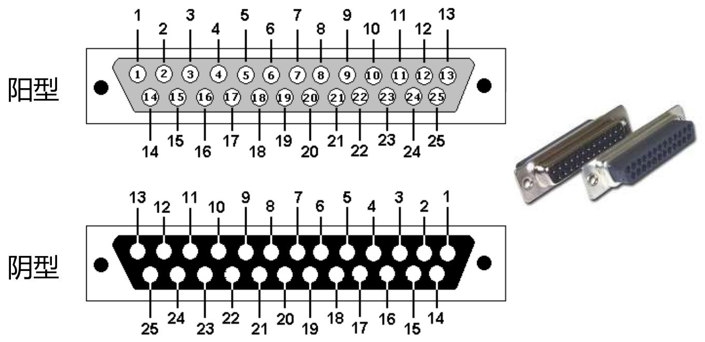

2. 电气特性：信号的 “电压规则”

定义 0/1 和控制信号的电压对应关系（电压范围：-15V~+15V）：

- 数据信号（NRZ-L 编码）
  - 逻辑 0 → 正电平（+3V~+15V）；→ “开”
  - 逻辑 1 → 负电平（-15V~-3V）；→ “关”
  - 注意：±3V 是 “无效区域”，避免信号波动导致误判。

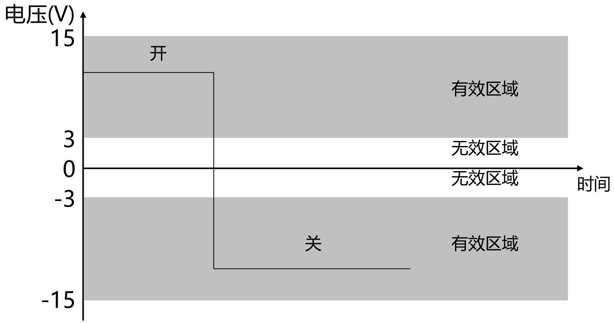

3. 功能特性：引脚的 “用途定义”

| 引脚号 | 功能               | 方向     | 说明                 |
| ------ | ------------------ | -------- | -------------------- |
| 2      | 发送数据（TD）     | DTE→DCE  | DTE 向 DCE 传数据    |
| 3      | 接收数据（RD）     | DCE→DTE  | DTE 从 DCE 收数据    |
| 4      | 请求发送（RTS）    | DTE→DCE  | DTE 请求发送权限     |
| 5      | 清除待发（CTS）    | DCE→DTE  | DCE 允许 DTE 发送    |
| 7      | 信号地（SG）       | 参考电平 | 所有信号的电压基准   |
| 8      | 数据载波检测（CD） | DCE→DTE  | DCE 成功接收网络信号 |
| 20     | DTE 准备好（DTR）  | DTE→DCE  | DTE 已就绪           |

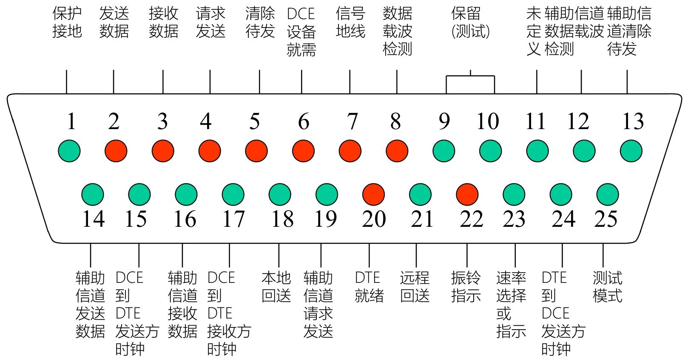

4. 规程特性：通信的 “流程步骤”

定义同步**全双工**通信的操作流程（以 Modem 拨号为例）：

1. **准备**：DTE（电脑）和 DCE（Modem）通电，引脚 20（DTR）置 “开”；
2. **就绪**：DCE（Modem）完成初始化，引脚 6（DSR）置 “开”；
3. **建立**：DTE 发 RTS（引脚 4）→ DCE 回 CTS（引脚 5）→ 网络载波建立（引脚 8 置 “开”）；
4. **数据传输**：DTE 通过引脚 2 发数据，DCE 通过引脚 3 收数据；
5. **清除**：传输完成，DTE 置 DTR “关”→ DCE 置 DSR “关”→ 载波断开。

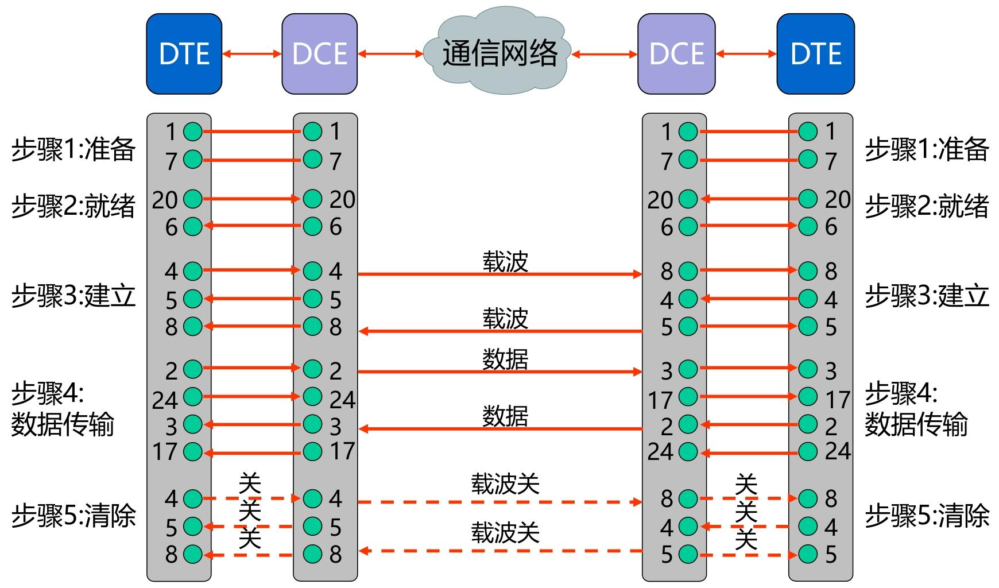

同时采用RS-232异步串行传输；每个数据包含有7或8 bit数据位、1bit起始位，1bit停止位，1bit校验位

#### EIA-232 子集：实际常用的简化接口

多数场景不需要 25 针的全部功能，因此常用**9 针子集**（异步串行通信），仅保留核心引脚：

- 保留引脚：2（TD）、3（RD）、4（RTS）、5（CTS）、6（DSR）、7（SG）、8（CD）、20（DTR）、22（RI）；

## 物理层互联设备

工作在物理层的设备，仅处理**电气信号**（不理解上层数据，如帧、数据包），核心作用是**扩展网络覆盖范围**，包括**中继器和集线器。**

### 中继器（Repeater）

- **信号处理**：接收传输介质上衰减、失真的信号，**重新生成原始的二进制比特形式**（不是简单放大，而是 **“再生”**），再转发以补偿信号衰减；
- **网络扩展**：连接两个**相同物理层协议**的网段，使它们成为一个逻辑网络
- 只能连接**相同物理层协议、相同 MAC 协议**的网段

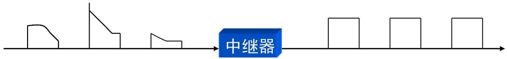

### 集线器（Hub）

- 是**多端口的中继器**（也叫 “多口中继器”），提供多个接口（如 8 口、16 口）连接多台设备；
- 工作机制：某一端口收到信号后，**放大**并广播到所有其他端口（所有设备共享同一传输介质）；

> [!tip]
>
> - 中继器：放大 / 再生信号，扩展传输距离；解决 “单段介质传输距离短” 的问题，实现网段扩展；
> - 集线器：多端口中继器，连接多台设备；解决 “多设备连接” 的问题，但因性能缺陷（冲突、带宽共享），已被数据链路层的**二层交换机**取代

---

## 总结

> [!note]
>
> 1. 物理层是分层体系结构中的最底层：只负责 “底层比特传输”，不参与上层数据的封装、纠错等复杂处理
> 2. 通过**传输介质和互连设备**搭建可靠的数据传输的物理基础，并为上层提供透明服务
> 3. 规定了机械（物理）、电气（信号）、功能（引脚）、规程（流程） 4 个特性

