# 数据链路层

数据链路层是 TCP/IP 分层模型中连接物理层与网络层的关键层，核心作用是将不可靠的物理链路转化为可靠的逻辑链路，实现**相邻结点间的帧传输**

有基本原理、控制协议、介质访问控制和网络互连四大核心内容

---


## 数据链路层基本原理

在 TCP/IP 分层模型中，数据链路层介于**物理层和网络层之间**

- 向下对接物理层：利用物理层提供的比特流服务（服务可能有差错）
- 向上对接网络层：向网络层提供数据包的收发服务（**无差错**的数据包传送服务）

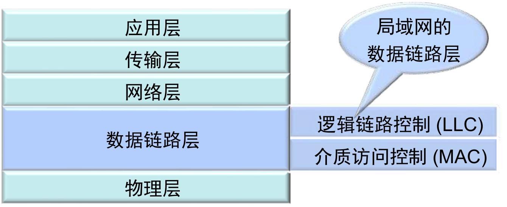

网络通信的底层逻辑

不管是电脑连手机、服务器连路由器，还是跨多个设备通信，本质都遵循一个规律：

- 网络层（比如 IP 层）的视角：只管 “谁要发给谁”—— 直连的设备直接发，不直连的就找中间设备（路由器、交换机）转发，最终总能传到目标。
- 物理层的视角：不管上层数据是什么，都只以 “0/1 比特流” 的形式在物理线路（网线、光纤、Wi-Fi）上传输
- 关键矛盾：网络层需要 “完整无错的数据包”，物理层只给 “可能出错的比特流”，而且相邻设备（比如电脑和交换机、交换机和路由器）之间，必须准确交接数据 —— 这就需要数据链路层来 “搭桥”即保证没有错误的帧数据。

> [!note]
>
> 相邻结点间，实现正确的数据传输：
>
> 1. **分帧与组帧** ：数据链路层把网络层的 “数据包” 封装成 “帧”—— 帧就是给比特流加了 “开始标签” 和 “结束标签” 的最小传输单元
> 2. **差错控制**：数据链路层给帧加 “校验码”（比如 CRC 校验），接收方收到后核对校验码，错误则要求重发或者丢弃
> 3. **流量控制**：让接收方 “反馈进度”，从而控制发送方的发送速率
> 4. **传输协议**：制定标准化协议（比如 HDLC、PPP），明确帧格式、校验方式、确认机制等


### 数据链路层的任务和主要功能、地位

数据链路层的任务：

核心任务是提供**相邻**结点之间的**可靠通信**，即**无差错的传输数据**

- 结点：结点可以是路由器等网络设备，也可以是用户主机或其它业务终端，但是需要“相邻”—— 就是直接连接的两个设备
- 场合：处理相邻节点间的数据传输，只处理相连节点的数据传输
-  对象：传输的数据单元是帧（Frame）
-  目的：将不可靠的物理链路变为**可靠的逻辑链路**

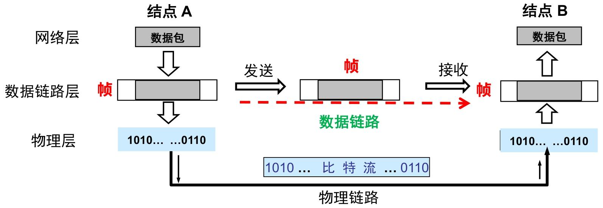

---

数据链路层的主要功能

1. **为网络层提供服务**，并且分为无确认无连接､有确认无连接､有确认面向连接
2. **链路管理**：介质访问控制（如多设备共享信道）； 链路建立、链路维持、链路释放
3. **成帧**：根据传输协议记忆传输介质，确认帧格式，将数据封装成适合在链路上传送的基本单元（加上帧头帧尾）
4. **差错控制**：通过校验码或者纠错码处理数据帧的损坏､丢失､重复和乱序，为网络层提供可靠的数据传送服务
5. **流量控制**：接收方实时反馈 “处理进度”，发送端根据进度**控制发送速率**，避免信道拥挤、数据丢失

---

数据链路层在网络中的地位

从 TCP/IP 协议栈来看，数据链路层夹在最底层的物理层和负责跨网络路由的网络层之间，是上层数据 “落地传输” 和底层比特流 “抽象为数据” 的关键衔接

- 网络中的主机､交换机､路由器等都必须实现数据链路层接入网络
- 主机 A 到主机 B 的通信，不管经过多少中间设备，最终都要拆解成 数据链路层中“**相邻结点间的帧传输**”

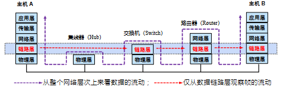


### 数据链路层提供的服务

围绕 “是否要先**建立连接**”以及“是否要**确认收到**” 两个关键问题，适配不同信道可靠性需求：

1. **无确认无连接**服务 ：不建立连接，收到帧也不确认
   - 发送方直接发帧，不用和接收方提前协商参数；
   - 接收方收到后，既不反馈 “已收到”，也不反馈 “没收到”，发完、收完就结束。
   - 适用场景：信道靠谱（误码率低，很少传错、丢帧），且要速度的场景

2. **有确认无连接**服务：不建立连接，但每帧都要确认
   - 不用提前和接收方协商规则，直接发帧，但每发一个帧，接收方必须回一个 “确认消息（ACK）”；
   - 如果发送方没收到确认，就认为帧丢了或传错了，会重新发送。
   - 适用场景：信道不靠谱（容易丢帧、传错）的场景

3. **面向连接**的服务 ：先建立连接，再传数据，每帧都确认
   - 通信分三步：① 建立连接：双方协商帧格式、校验方式、传输速率等参数，做好收发准备（类似开通专属快递通道）；② 传输数据：每发一个帧都要确认，确保无错；③ 释放连接：数据传完后，断开连接，释放资源。
   - 适用场景：长延迟、高差错的信道

| 服务类型         | 是否建立连接 | 是否需要确认 | 核心优势               | 适用场景                     |
| ---------------- | ------------ | ------------ | ---------------------- | ---------------------------- |
| 无确认无连接服务 | 否           | 否           | 传输效率高、延迟低     | 可靠信道（以太网）、实时通信 |
| 有确认无连接服务 | 否           | 是           | 流程简单、可靠性高     | 不可靠信道（Wi-Fi）          |
| 面向连接的服务   | 是           | 是           | 全程可靠、适配复杂链路 | 长延迟不可靠信道（卫星通信） |


### 数据链路层数据单元：帧（Frame）

帧是数据链路层的 “协议数据单元”

- 发送端： “组帧”（打包），给数据加 “帧头”（开始标志、地址）和 “帧尾”（校验码、结束标志），变成标准化的帧
- 接收端：通过 “拆帧”（拆包），识别帧的边界，去掉帧头帧尾，还原成数据包交给网络层；

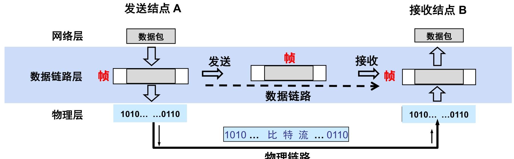

#### 成帧(framing)

成帧的关键是 “帧定界”—— 让接收方从一堆比特流中，精准找到一帧的开始和结束

从而实现分段传输，错误隔离，误差校验，以及数据恢复

不同协议有不同的帧：PPP帧、MAC帧

帧定界（帧同步）的两个核心难题：

- ① 选什么 “定界符”（比如特定字节、比特组合）；
- ② 万一数据本身就包含定界符（比如快递盒里的物品和包装图案一样），怎么避免误判？

#### 成帧方法

| 成帧方法             | 核心逻辑                            | 解决冲突方式               | 适用场景                 | 优缺点                         |
| -------------------- | ----------------------------------- | -------------------------- | ------------------------ | ------------------------------ |
| 字节计数法           | 用计数字段标明帧长度                | 无                         | 早期技术                 | 简单；极不可靠，已淘汰         |
| 字节填充的标志字节法 | 特定字节（FLAG）当定界符            | 加转义字符（ESC）          | PPP 协议、软件实现场景   | 逻辑清晰；硬件实现复杂         |
| 比特填充的标志比特法 | 特定比特组合（如 01111110）当定界符 | 连续 5 个 1 后插 0         | HDLC、USB、硬件实现场景  | 硬件友好；比特级操作稍复杂     |
| 编码违禁法           | 物理层违禁编码当定界符              | 数据中无违禁编码，无需处理 | 以太网（10M/100M/1000M） | 效率高、无冲突；依赖物理层编码 |

目前成帧的主要方法：比特填充的**标志比特**法和**编码违禁**法

1. 字节计数法：用一个 “**计数字段**” 标明本帧的字节数（包括计数字节），接收方按计数截取比特流；但是计数字段可能本身传错

   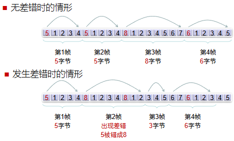

2. 字节填充的标志字节法：用**特定字节（比如 FLAG）当 “定界符”**，作为帧的开始和结束

   - 开始字节和结束字节可相同也可不同

   - 帧和帧之间可以连续发定界符(FLAG)，用来作同步填充

   - 解决定界符冲突：

     - 如果数据本身包含 FLAG，就在 FLAG 前面加 “**转义字符（ESC）**”即（ASCII字符1BH），表示 “这个 FLAG 是数据，不是边界”；如果数据里有 ESC
     - 就给 ESC 也加一个 ESC（避免 ESC 被误判为转义标志）；

   - 简单来说就是，在特殊字符（SOH，EOT，ESC）的前面加上转义符ESC

     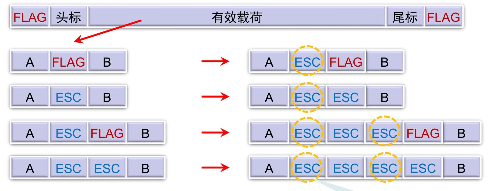

3. **比特填充的标志比特法**：用**特定比特组合**当定界符（比如 HDLC 协议的 **01111110**），在比特级划分帧边界

   - 对于发送端：比特填充

     - 利用**比特位操作**，检查数据中的比特流，只要出现 “连续 5 个 1”，就插入 1 个 0；防止和定界符的比特模式 01111110 相同

       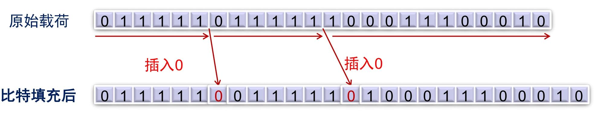

   - 对于接收端则需要恢复数据

     - 遇到 “连续 5 个 1”，就看后面的比特 —— 是 0 就丢弃（这是填充的）；是 1 再看接下来的比特：是 0 就是定界符（帧结束），是 1 就是出错；

     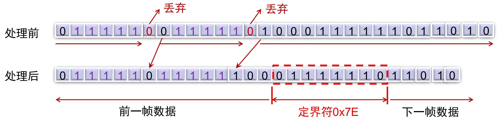

4. **编码违禁法**：利用物理层的 “**冗余编码**规则”—— 有些编码组合在数据传输中是 “违禁的”（不允许出现），就用这些违禁编码当帧的开始 / 结束标志；

   - 仅仅用于采用冗余编码的物理层中实现

     > - 曼彻斯特编码（10Mbps 以太网）：高 - 高、低 - 低电平是违禁的，用作帧定界；
     > - 4B/5B 编码（快速以太网）：16 种编码未使用，用作定界符；
     > - 8B/10B 编码（千兆以太网）：未使用的编码用作定界符和控制码；


### 信道分配与介质访问控制（X）

多点连接环境（比如 Wi-Fi、集线器组网）中，多个设备共享一条信道，**MAC 子层**的核心任务就是制定 “使用规则”，避免大家同时用导致冲突，确保信道高效利用。

两种信道分配方式：静态 vs 动态

1. 静态信道分配——“分固定工位，各自用各自的”
   - 用**多路复用技术**（比如时分复用、频分复用），把单个信道划分成多个固定的 “子信道”，每个设备分配一个专属子信道，只能在自己的子信道里传输数据。
   - 效率极低 —— 网络数据流量大多是 “突发性” 的，各个信道的负载或者工作量不均衡
2. 动态信道分配 ——“先到先得 / 按规则排队，灵活用资源”
   - 不划分固定子信道，所有设备共享整个信道，根据实时流量动态分配使用权
   - 5 个关键假设（协议设计的前提）：
     1. 流量独立：每个设备的数据流互不影响；
     2. 单信道：所有设备共用一条物理信道；
     3. 冲突可检测：能发现两个设备同时用信道的冲突；
     4. 时间连续或分槽：要么时间连续可用，要么分成固定 “时间槽”（比如分槽 Aloha）；
     5. 载波侦听：设备能检测信道是否被占用（比如听有没有其他设备传数据）。
   - 核心是 “**多路访问协议**”：即设备如何竞争 / 获取信道使用权，分 3 类协议。


对于动态分配的三类协议的具体内容

1. 竞争协议 ——“先到先得，冲突了再重试”（轻负载高效）

   - 纯 Aloha 协议：只要有数据帧要发，直接发送，不做任何检测；靠接收方的 **“确认消息**” 判断是否成功，没收到确认就重传。
   - 分槽 Aloha 协议：把时间分成固定长度的 “槽”（比如每个槽 10ms），设备只能在每个**时间槽的开头发送数据**。
   - CSMA/CD 协议（以太网专用）：对于有线共享信道，**先听再发，撞了就停**；即发前检测信道是否空闲，空闲则发，检测到冲突则停止发送
   - CSMA/CA 协议（无线局域网专用）：对于无线共享信道没法快速检测冲突，所以重点在“避免冲突”；
     - 发前侦听：先检测信道是否空闲；
     - 空闲等待：信道空闲后，还要等一段 “**帧间间隔（IFS）**”，再发 “**请求发送（RTS）**” 帧，通知其他设备 “我要占用信道了”；
     - 确认接收：接收方收到 RTS 后，发 “**允许发送（CTS）**” 帧回应，发送方再发数据；数据发完后，接收方必须发 “**确认（ACK）**” 帧，确保没丢包。

2. 无冲突协议 ——“按规则排队，绝不撞车”（重负载高效）

   适合设备多、数据发送频繁的场景，就像给打印机排好号，按顺序用，完全不冲突。

   - 基本位图协议（按槽投票）：把时间分成 “竞争槽”（比如 8 个槽，对应 8 个设备），每个设备对应一个槽

     - 想发数据的设备，在自己对应的槽里发 “1”（表示要占用信道）；
     - 所有设备看完所有竞争槽后，按 “槽的顺序” 依次使用信道

     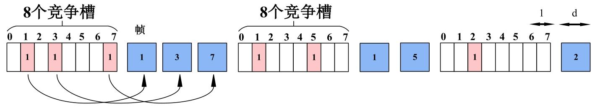

   - 令牌传递协议（令牌即权限）：有一个特殊的 “令牌帧”（就像 “打印机使用权限卡”）在设备间循环传递：

     - 只有拿到令牌的设备，才能发送数据；数据发完后，把令牌传给下一个设备；
     - 没拿到令牌的设备，只能等待，不能发送。

     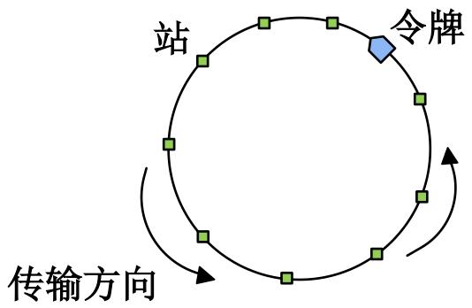

   - 二进制倒计数协议（编号大的先得）：每个设备有唯一的二进制编号

     - 想发数据的设备，同时广播自己的编号，从最高位开始比较
     - 编号大的直接获得信道使用权
     - 其他设备看到比自己编号大的设备抢到时，就放弃竞争

     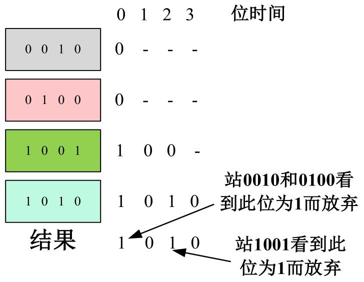

3. 有限竞争协议 ——“轻负载抢，重负载排队”（兼顾两种场景）

   - 低负载时用 “竞争协议”（比如 CSMA），冲突少、延迟短；

   - 高负载时自动切换到 “无冲突协议”（比如令牌传递、位图协议），避免频繁冲突，提升信道效率。

   - 自适应树遍历协议：

     - 把设备按 “树状结构” 分组（比如 A/B/C/D/E/F/G/H 分成两层）：
     - 低负载时：所有设备都能竞争信道，抢到就用；
     - 高负载时：按树的分支依次让每组设备竞争（比如先让上层 A/B/C/D 竞争，抢到的组再让组内设备竞争），避免全员同时抢导致冲突。

     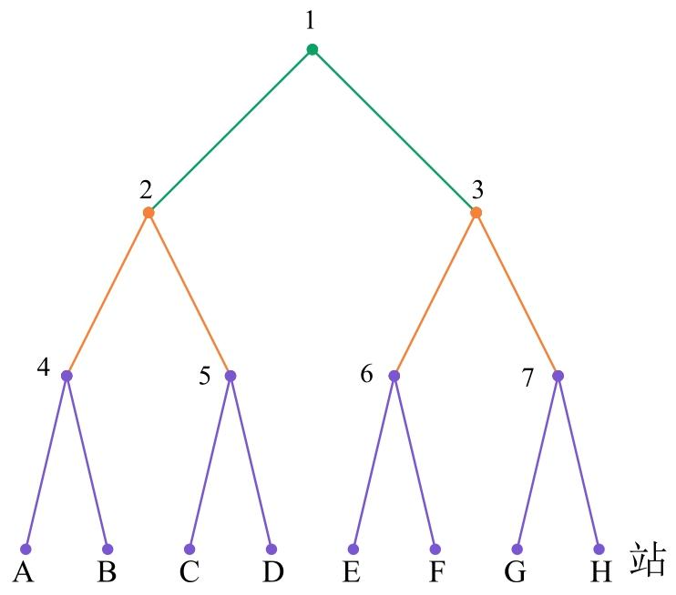

   

   

   > [!tip]
   >
   > 1. 静态分配：固定子信道，无冲突但效率低，适配恒定流量场景；
   > 2. 动态分配：共享信道，按协议分配使用权，是主流方式；
   >    - 竞争协议：轻负载快（冲突少、延迟短），重负载差（冲突多）；
   >    - 无冲突协议：重负载稳（无冲突、效率高），轻负载差（延迟高）；
   >    - 有限竞争协议：兼顾轻负载低延迟和重负载高效率，适配复杂场景。


### 数据链路管理

用 “搭建专属通信通道” 的逻辑，把数据链路管理拆成 4 个核心模块，每个模块都对应 “怎么接线（线路配置）、怎么传数据（传输方式）、怎么定规则（线路规程）、怎么管链路生命周期（链路状态管理）”

#### 线路配置

线路配置指的是网络中**两个或多个结点通过物理线路连接的具体方式**，核心分两种，本质是 “专属线路” 和 “共享线路” 的区别

1. 点到点连接：“专属专线，一对一通信”
   - 两个结点之间用**专用物理线路**直接连接
   - 信道容量都用于这两个结点间的数据传输
   - 严格的 “一对一”点对点通信方式
2. 多点连接（广播信道）：“共享线路，一对多通信”
   - 两个以上的结点共用同一条物理线路，这条线路是所有结点的 “公共信道”
   - 信道容量由所有结点共同使用，需要通过 “复用技术”（比如时分复用、频分复用）划分资源，避免拥挤
   - 用专门的共享信道协议（比如以太网的 CSMA/CD、Wi-Fi 的 CSMA/CA）协调结点发送数据，避免冲突
   - “一对多” 的广播模式

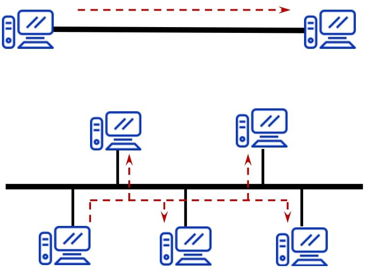

#### 传输方式

传输方式本质是 “比特流从一个设备到另一个设备的传送规则”

按传输方向分：单工、半双工、全双工

1. 单工：“单行线，只能单向传”

   - 数据只能从一个设备发、另一个设备收，通信单向不能反向传输

   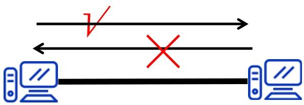

2. 半双工：“双向车道，不能同时走”

   - 两个设备都能收发数据，但**同一时间**只能一个发、一个收

   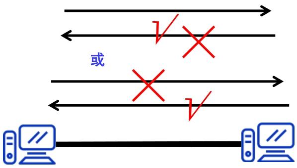

3. 全双工：“双向双车道，可同时走”

   - 两个设备能同时收发数据
   - 要么链路有两条独立物理路径（一条发、一条收），要么将信道带宽一分为二（复用技术），同时传两个方向的信号

   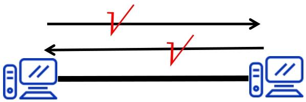

按比特传输方式分：串行传输 vs 并行传输

1. 串行传输：“单车道，比特挨个传”
   - 每个时钟脉冲只传 1 个比特，只用 1 条线路（或少数辅助线路），比特按顺序依次发送
   - 适用场景：短距离（如 USB 线）和长距离通信（如网线、光纤、串口线），是网络通信的主流方式。
2. 并行传输：“多车道，比特同时传”
   - 每个时钟脉冲同时传多个比特，每个比特用 1 条独立线路
   - 缺点：长距离传输时，线路成本高（需多条线路）、捆扎困难、接收端同步复杂（要对齐所有线路的比特）。
   - 适用场景：近距离传输（如电脑主机与打印机、主板上的部件互连），不适合长距离通信。

按同步方式分：**异步传输 vs 同步传输**

1. 异步传输：“自由节奏，字符级同步”

   - 以 “字符” 为单位传输，每个字符的传输时间固定，但字符之间的时间间隔不固定
   - 每个字符前加 “开始位”，后加 “停止位”，靠这两个位实现同步
   - 传输开销大（每个字符都要加同步位）、效率低，适合低速设备。

   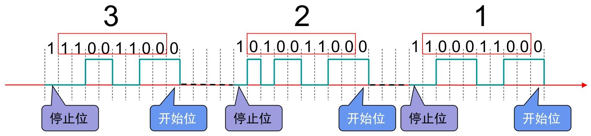

2. 同步传输：“统一节奏，帧级同步”

   - 字符或比特流组合成 “数据帧” 成块传输，收发双方按同一时钟节奏同步
   - 数据帧结构：包含同步字符（SYN，标识帧开始）、控制域（源地址、目的地址、长度等）、数据域（要传的信息）、错误检查域（检测传输错误）、帧结束标记（END，标识帧结束）
   - 实现 “位同步”（对齐每个比特的传输节奏）和 “帧同步”（识别帧的开始和结束）

| 分类维度     | 具体类型 | 核心优势           | 适用场景                         |
| ------------ | -------- | ------------------ | -------------------------------- |
| 传输方向     | 单工     | 结构简单、成本低   | 单向通信（广播、打印）           |
|              | 半双工   | 双向通信、成本低   | 低频双向通信（对讲机、早期组网） |
|              | 全双工   | 效率高、无等待     | 高频双向通信（手机、交换机）     |
| 比特传输方式 | 串行传输 | 线路少、适配长距离 | 短 / 长距离通信（网线、光纤）    |
|              | 并行传输 | 速度快             | 近距离高速传输（设备内部互连）   |
| 同步方式     | 异步传输 | 无需统一时钟       | 低速设备（键盘、老式打印机）     |
|              | 同步传输 | 效率高             | 高速大量数据传输（以太网、光纤） |

---

#### 线路规程

线路规程本质是 “数据链路的通信规则手册”，核心负责两件事：一是监视链路建立 / 终止，二是在同一时刻给某个设备分配 “数据传送权”，避免冲突

线路规程可以两种方式实现： 询问/应答方式（ENQ/ACK） ；轮询/选择方式（Poll/Select）

1. 询问 / 应答方式（ENQ/ACK）：“点对点的双向预约”

   - 仅用于**点对点连接**（比如电脑和路由器、两台路由器之间），链路两头的设备级别相同，没有主次之分，任意一方都能主动发起通信。
   - 建立会话：启动方（比如站点 A）发 “询问帧（ENQ）”，问接收方（站点 B）“是否准备好接收数据？”；
   - 数据传输：接收方如果就绪，回复 “肯定应答帧（ACK）”，启动方就开始发数据帧；如果没就绪，回复 “否定应答帧（NAK）”，启动方稍后再问；
   - 终止会话：数据传完后，启动方发 “传输结束帧（EOT）”，链路释放。

   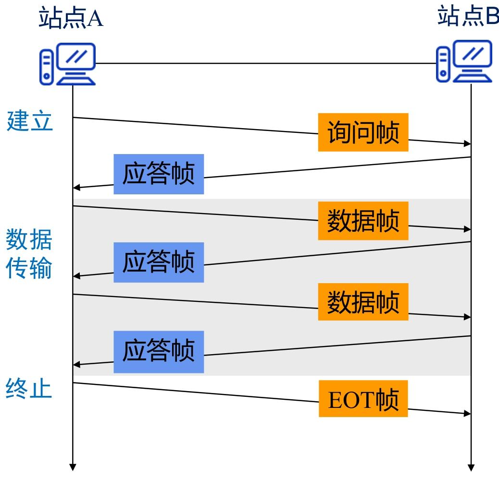

2. 轮询 / 选择方式（Poll/Select）：“多点连接的主次调度”

   - 用于**多点连接**，必须有一个 “主设备”（比如路由器），其他是 “从设备”（比如电脑），主设备统一控制链路。
   - 要确定设备是否就绪，还要确定哪一个站点有权使用信道
   - 主设备控制链路，主设备发命令，从设备响应
     - 轮询：如果主设备希望接收数据
     - 选择：如果主设备希望发送数据
   - 同时在链路上的每个设备都有一个**地址来标识自己**

   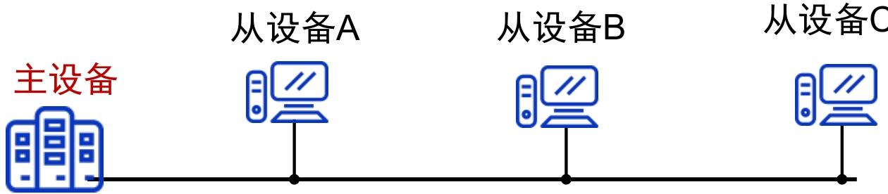

   > 1. 选择模式：
   >
   >    - 主设备想给某个从设备（比如从设备 A）发数据，先发送 “选择帧（SEL）”，明确告诉 “从设备 A 准备接收”；
   >    - 从设备 A 如果就绪，回复 “ACK”，主设备开始传数据帧；
   >    - 如果没就绪，回复 “NAK”，主设备换个时间再试；
   >    - 数据传完后，主设备发 “EOT” 终止
   >
   >    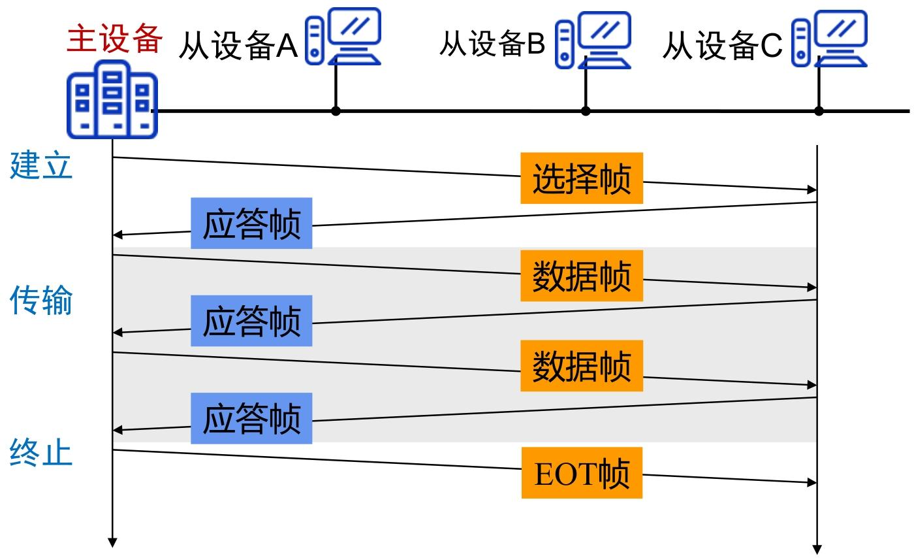
   >
   > 2. 轮询模式：
   >
   >    - 主设备逐个给从设备发 “轮询帧（Poll）”，问 “你有数据要发吗？”；
   >    - 从设备如果有数据，直接发数据帧应答；
   >    - 如果没有，必须回复 “NAK”；
   >    - 从设备数据传完后，发 “EOT” 告知，主设备继续轮询下一个从设备；也可以用主设备发 “时间到” 消息终止轮询。
   >
   >    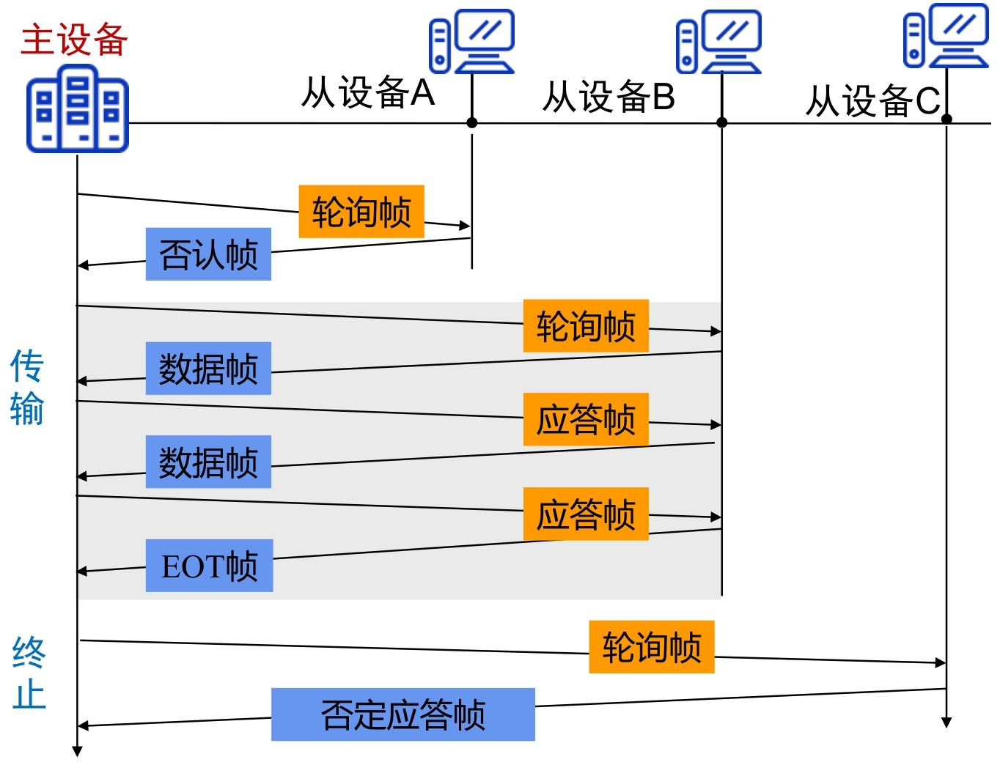


> [!tip]
>
> | 实现方式                   | 适用连接   | 设备关系       | 核心逻辑                       | 关键帧 / 信号                                           |
> | -------------------------- | ---------- | -------------- | ------------------------------ | ------------------------------------------------------- |
> | 询问 / 应答（ENQ/ACK）     | 点对点连接 | 平等（无主次） | 主动询问对方是否就绪，再传数据 | ENQ（询问）、ACK/NAK（应答）、EOT（结束）               |
> | 轮询 / 选择（Poll/Select） | 多点连接   | 主从关系       | 主设备调度，从设备响应         | Poll（轮询）、SEL（选择）、ACK/NAK（应答）、EOT（结束） |


#### 链路状态管理

链路状态管理的核心目标就是：**让发送方明确知道接收方是否 “准备好接收”“正在接收” 或 “已完成接收”**

1. 收发数据前，建立数据链路，确定通信协议
2. 数据传输中，维持数据链路，进行差错控制和流量控制
3. 完成数据收发后，释放数据链路，回收通信资源

| 阶段     | 核心目标                | 关键动作                       | 类比场景       |
| -------- | ----------------------- | ------------------------------ | -------------- |
| 链路建立 | 协商规则 + 确认接收就绪 | 交换协商帧 + 状态确认帧        | 拨号接通电话   |
| 链路维持 | 监测状态 + 避免传输故障 | 确认反馈 + 过载控制 + 链路恢复 | 通话中保持连接 |
| 链路释放 | 确认传输完成 + 回收资源 | 发送结束帧 + 释放确认帧        | 挂电话释放线路 |

---


### 差错控制和流量控制

差错控制和流量控制是数据链路层保障 “可靠传输” 的两大核心技术 —— 差错控制解决 “数据传错、传丢” 的问题，流量控制解决 “发送方太快、接收方接不住” 的问题

1. 差错控制：检测并修正数据传输中的错误，靠 “检测 + 确认 + 重传” 三大手段
   - 差错控制主要指错误检测和重传方法
     - **错误检测**：接收方通过数据帧中的 “校验码”，判断帧是否损坏，出错则不交给网络层。
     - **确认（ACK）**：接收方收到正确的帧后，给发送方发 “肯定应答”，告知 “已安全收到”。
     - **自动重复请求（ARQ）**：如果帧损坏，接收方发 “否定应答（NAK）”，催促发送方重传该帧
     - **超时重传**：发送方发完帧后启动定时器，若超时没收到确认，自动重传该帧
   - 对于上述方法的实现要点：携带校验码，发送方进行接收确认和超时重传，接收方则按序接收
   - 重传的三种情况：帧破坏；帧丢失；应答帧丢失
2. 流量控制：协调收发双方的速率，不让发送方发得太快，导致接收方缓冲区溢出（数据丢失），主要靠 “**接收方反馈调速**” 实现
   - 基于反馈调整：接收方实时反馈自己的 “接收能力”（比如缓冲区剩余空间），发送方根据反馈调整发送速率
   - 依赖确认机制：接收方的 “确认帧（ACK）” 不仅是 “收到信号”，也隐含接收能力的流量信息

---

#### 差错控制与流量控制的关联与区别

1. 共同点：共享基础技术

- 都依赖 “接收确认” 和 “超时重传”：确认帧既用于告知 “数据正确”（差错控制），也用于告知 “接收能力”（流量控制）；
- 超时重传既解决 “帧丢失”（差错控制），也应对 “确认帧丢失导致的速率误判”（流量控制）。

2. 核心区别：解决的问题不同

- 差错控制多了 “**差错检测与纠错**” 环节：这是它的核心，重点处理 “数据对错”；
- 流量控制重点是 “**速率匹配**”：不关心数据本身对错，只确保接收方不被数据 “淹了”。

两种控制都通过以下两种协议落地，兼顾可靠性和效率：

- 停止等待协议：简单直接（发一帧等确认，再发下一帧），同时实现流量控制（等待确认就是限速）和差错控制（错了重传）；
- 滑动窗口协议（又称为**连续ARQ协议**）：高效灵活（发送方可连续发多帧，不用逐帧等确认），通过窗口大小限制发送速率（流量控制），通过重传机制修正错误（差错控制）。


#### 停止等待协议

停止等待协议是数据链路层最基础的可靠传输协议，核心分 “无错信道” 和 “有错信道” 两种场景，本质是 “发一帧等确认，再发下一帧”

1. **无错**信道的停止等待协议：只解决 “接收方接不住”

   - 假设为信道的绝对理想状态，物理层比特流完全正确；同时`v_send > v_receive`，导致接收方来不及接收
   - 协议逻辑：
     - 发送方：发完一帧就暂停，不继续发，**等待接收方的 “确认帧”**（叫 “哑帧”，内容不重要，只当 “收到信号”），收到确认后再发下一帧。数据发完，发送方发送**传输结束帧（EOT）**，通信终止。
     - 接收方：收到一帧并处理完成后，立即**回复一个确认帧**，

   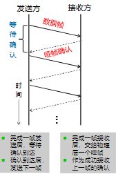

2. **有错**信道的停止等待协议：解决 “出错 + 接不住”

   - 前提：信道不靠谱：数据帧可能损坏（比特翻转）、丢失（链路中断）；接收方仍有处理上限：不能接收太快。

   - 基础解决方案：加 **“计时器”+“超时重传”**：

     - 发送方：发完一帧后，立即启动一个计时器（比如设 10ms 超时）。
     - 超时重传：如果计时器到期，还没收到接收方的确认，就默认帧丢了或出错了，自动重传这一帧。
     - 接收方：收到正确的帧就发确认，收到错误的帧直接忽略（或发否定应答 NAK）

     > 接收方重复收到同一数据帧的两种场景:
     >
     > - **确认帧（ACK）丢失。**比如发送方 A 发帧 A1→接收方 B 收到并处理→B 发 ACK→ACK 在传输中丢了→A 没收到确认，超时重传 A1→B 收到重复的 A1。
     > - 超时时间设太短。比如 A 发 A1 后，计时器很快超时→A 重传 A1→之后 B 才收到第一次的 A1→又收到重传的 A1→重复。

   - 对于“重复帧”的解决方案：

     1. 给帧加 “**1 位序号（SEQ=0/1）**”

        - 发送方：每发一帧，都带一个序号（0→1→0→1 循环）
        - 接收方：初始化时 “期待接收 0 号帧”，收到帧后先查序号：
          - 序号是 “期待的序号”：说明是新帧，处理后发确认，同时把 “期待序号” 换成下一个（0→1 或 1→0）。
          - 序号和 “期待的序号” 不一致：说明是重复帧，直接丢弃，同时重发上一个正确帧的确认

        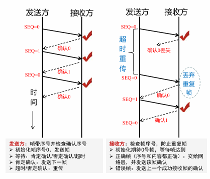

     2. 停等 ARQ：自动重复请求，或带有重传的肯定确认

   

##### 基于停止等待协议实现流量控制

基于停止等待协议实现的**流量控制**，核心逻辑是 **“用确认帧控制发送节奏”**，强制发送方和接收方速率匹配，避免接收方因处理能力不足导致数据溢出

**应答帧就是 “速率开关”**—— 只有收到开关信号（ACK），发送方才会继续发送；即**“接收方的处理速度决定了发送方的发送速度”**

- 协议简单，但是传输效率低，线路带宽利用率低

完成一帧发送所需的最短时间

`t_W = t_I + 2t_P + 2t_Proc + t_S`

其中，`t_I` 是发送数据帧的有效时间，而 `2t_P + 2t_{Proc} + t_S` 都是**等待和应答的开销时间**。

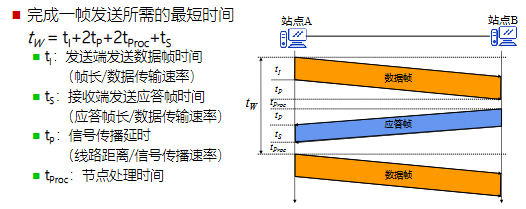

> [!note]
>
> 信道利用率：信道被占用的时间和总时间之比，即信道被 “有效传输数据” 占用的时间，占总时间的比例，值越大说明信道没被浪费。
>
> 有效数据传输率：单位时间内传输的有效数据位数，即单位时间内，实际传输的**有用数据比特数**（去掉帧头帧尾的有效数据 *N*），不是链路的标称速率。
>
> 1. 无差错情况下：**帧不会丢失、不会损坏，不用重传**，是协议性能的上限
>    - 信道利用率：`P = t_I / t_W`，即发送端发送**数据帧**时间/发送一帧总时间
>    - 有效数据传输率：`S = N / t_W`，即一帧有效比特位/一帧总时间
> 2. 有差错情况下：实际信道会出错（帧损坏 / 丢失，概率为 *p*），需要重传，性能会下降
>    - 正确传一帧的平均时间 *tV*：`t_V = t_W / (1 - p)`,其中`p`为出错率
>    - 系统最大吞吐量*λmax*(每秒成功发送帧数）：`λmax = 1 / t_V = (1-p)/t_W`
>    - 极限吞吐量M：`M = 1 / t_I`
>    - 系统传输效率`η`:实际吞吐量和 “理论极限吞吐量” 的比值：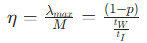
>
> 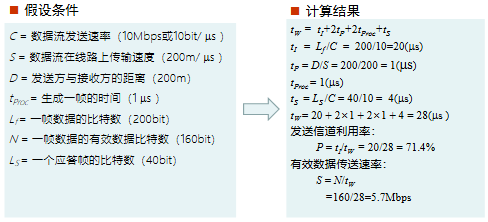


> [!tip]
>
> 1. **无错场景**：协议性能由 *tW* 决定，**传播延时 \*tP\* 越长，\*tW\* 越大，利用率越低**
> 2. **有错场景**：出错率 *p* 越高，重传次数越多，性能下降越明显；同时传播延时的影响会被放大。
> 3. **本质问题**：**停止等待协议的低利用率，根源是 “发一帧等一帧”，信道大部分时间在空闲等待** —— 这也是滑动窗口协议（GBN/SR）要解决的核心痛点。


##### 基于停止等待协议实现差错控制

为实现差错控制，在停止等待协议中采用自动重复请求（停等ARQ ）

1. 数据帧丢失（对应图中 `帧丢失 超时重传` 部分）
   - 站点 A 发送完数据帧 1 后，立即启动定时器；定时器到期时，仍未收到站点 B 的应答帧 → A 判定 “帧丢失或出错”，**重传数据帧 1**。
2. 应答帧丢失（对应图中 `应答帧丢失 超时重传` 部分）
   - **重复帧处理**：站点 B 收到重传的**数据帧 1** → 检查序号，发现当前期望接收的是**帧 0**（因为已经收过帧 1 了），判定这是**重复帧** → 直接丢弃该帧，同时**重发应答帧 0**（确保 A 能收到确认）。
3. 数据帧破坏
   - 接收方处理帧时发现错误，发送否定应答帧给发送方请求重发

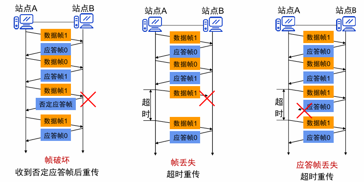

解决 “帧丢失、重复帧、差错重传” 的核心保障：

1. **发送端保留帧备份**，直到接收确认帧
2. **帧序号 0/1 交替**：让接收方区分**新帧**和**重复帧**，防止重复帧接收
3. **否定应答帧（NAK）**：接收方收到损坏的帧（校验失败），直接发 NAK请求重发
4. **定时器是核心保障**：定时器的超时时间要略大于 “帧往返的总时间”，是检测帧丢失、触发重传的关键机制


对于停止等待协议：信道利用率低，延迟高，主要就是 “发一帧等一帧”，信道空闲


#### 滑动窗口协议

滑动窗口协议的核心是**打破停止等待协议 “发一帧等一帧” 的限制**

允许发送方在未收到确认前连续发送多帧，用 “窗口” 机制控制并发帧数，既提升信道利用率，又实现流量控制和差错控制

窗口本质是**发送方 / 接收方存放数据帧的缓冲区范围**，对可以连续发送的最多帧数(已发出但未确认的帧)作限制

- 为了应对突发性流量，发送窗口和接收窗口均可以设置大一点
- 窗口大一点，利于区分帧序号循环产生的新帧和重传的帧，避免重复接收

对于发送方和接收方的窗口具体含义：

- 发送方在收到应答前可以连续发送若干帧

- 对于发送方窗口：分为两个部分**已发送未确认的帧** + **未发送但可发送的帧**

  - 发送限制：窗口大小 = 最大并发帧数；窗口满了就暂停，等收到确认再 “滑动窗口”，释放新的发送名额。
  - 窗口滑动：收到确认后，窗口整体右移，移出已确认的帧，纳入新的待发送帧。

  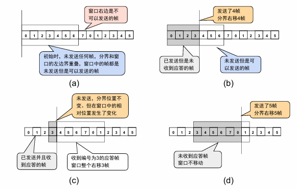

- **接收方窗口**：分为两部分 ——**已接收未确认的帧** + **未接收但可接收的帧**。

  - 接收限制：只有落在窗口内的帧才接收，窗口外的帧直接丢弃。
  - 窗口滑动：发送确认后，窗口整体右移，移出已确认的帧，纳入新的可接收帧。

  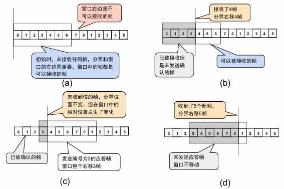

> [!tip]
>
> - **帧序号循环复用**：帧编号采用 **模 n** 方式（比如 n=8，编号 0~7 循环），窗口大小 ≤ n-1（避免新帧和重传帧序号混淆）。
> - **累积确认**：接收方不用逐帧确认，而是用 1 个 ACK 帧确认 “所有≤x 的帧都已正确接收”，ACK 序号 x 表示 “下一个期望接收的帧序号”（比如 ACK=3，代表 0、1、2 号帧都收好了，要收 3 号帧）。
> - **接收窗口驱动发送窗口**：发送窗口的滑动完全依赖接收方的确认 —— 接收方确认越多，发送方窗口滑动越多，能发的新帧就越多。
> - 对于接收窗口和发送窗口的大小限制：**W_T + W_R <= 2^n**，其中`n`即帧序号的比特数；根据此可以推出GBN以及SR的窗口大小关系

对于滑动窗口协议中的差错控制：

1. **回退 N 帧（GBN）**
   - 核心逻辑：接收方只按序接收帧，一旦某帧出错 / 丢失，后续帧全部丢弃；发送方收到否定确认（NAK）或超时后，**从出错帧开始，重传窗口内所有未确认的帧**。
   - 特点：实现简单，接收方无需缓存乱序帧；但重传效率低（一帧错，多帧重传）。
2. **选择重传（SR）**
   - 核心逻辑：接收方会缓存**窗口内的乱序正确帧**；发送方收到 NAK 后，**只重传出错的那一帧**，不用重传后续帧。
   - 特点：重传效率高，信道利用率更高；但接收方需要更大的缓冲区，实现更复杂。


##### 回退 N （GBN）协议

回退 N 帧协议（Go-Back-N，简称 GBN）是**滑动窗口协议的一种实现**，核心目标是**在提升信道利用率的同时，简化接收方逻辑**，代价是 “一帧出错，后续帧全部重传”。

GBN 的设计围绕 **“连续发送 + 按序接收 + 出错全重传”** 三个关键词展开，本质是**用发送方的 “批量重传” 换取接收方的 “极简缓存”**。

1. **出错全部重传**：只要某一帧出错或丢失，发送方就从**出错帧开始**，重传窗口内所有未被确认的帧（包括出错帧之后的正确帧）。
2. **接收方按序接收**：接收窗口大小固定为`1`，只能接收**当前期望序号的帧**。
   - 收到期望帧：正常接收，发送**累积确认**（ACK，**确认当前帧及之前所有帧**），并更新期望序号。
   - 收到出错 / 乱序帧：直接丢弃该帧及后续所有帧，**不发送任何确认**（或发送否定确认 NAK）。
3. **发送方超时重传**：发送方为**最早未确认的帧**设置定时器，超时后重传窗口内所有未确认帧。

基本流程：

- 发送方维护一个**发送窗口**（大小 > 1），窗口内的帧可以连续发送，无需等待逐帧确认。

- 接收方维护一个**接收窗口**（大小 = 1），仅接收与 “期望序号” 匹配的帧。

  > [!important]
  >
  > - 发送方收到**累积确认**（ACK）后，滑动发送窗口，纳入新的待发送帧；若定时器超时，**回退到出错帧的位置，重传窗口内所有未确认帧**，即从上一个确认帧后面开始重发
  > - 而接收方则在接收到正确的帧N时，为帧N发送ACKn确认信号，如果接收的是重复帧或者错误帧，则发上一个正确帧的确认ACK信号，告诉发送方接收到哪一个帧
  > - **累积确认**（ACK）：若有**ACKn**发送, 则n号帧和前面所有帧均已按序接收。(或：接收窗口停在n处**, **则n-1号帧和前面所有帧均已按序接收)


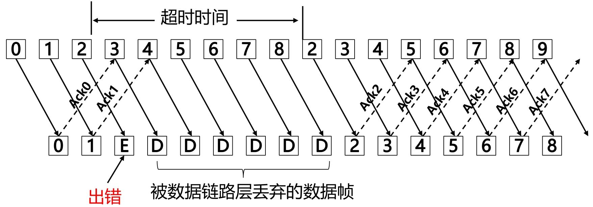

三种差错情况的处理：

1. 差错情况 1：帧破坏（数据帧损坏）

- **场景**：发送方发帧 0~4（窗口大小 = 5），其中帧 3 损坏。
- **接收方动作**：收到帧 3 时校验出错，直接丢弃帧 3，同时丢弃后续的帧 4；**不发送 ACK**（或发送 NAK3）。
- **发送方动作**：帧 3 的定时器超时，**重传帧 3 及后续的帧 4**（尽管帧 4 是正确的）；接收方收到重传的帧 3、4 后，按序接收并发送 ACK5（确认帧 0~4）。

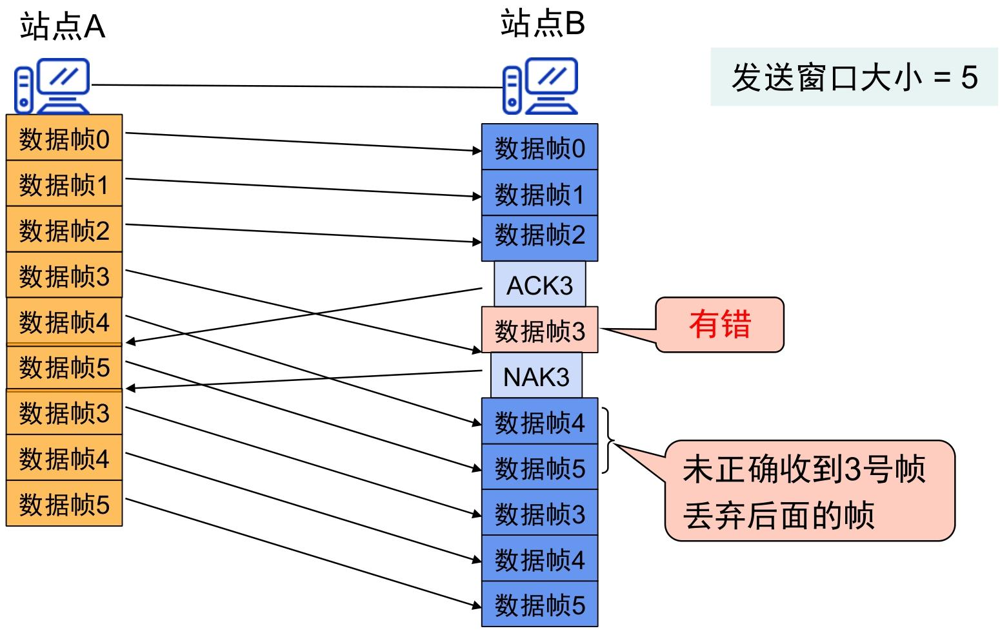

2. 差错情况 2：数据帧丢失

- **场景**：发送方发帧 0~4，其中帧 2 丢失。
- **接收方动作**：没收到帧 2，后续收到帧 3、4 时，因是乱序帧，直接丢弃；发送 NAK2或者ACK1，表示2之前的帧已经收到。
- **发送方动作**：收到 NAK2 或定时器超时，**重传帧 2、3、4**；接收方按序接收后发送 ACK5。

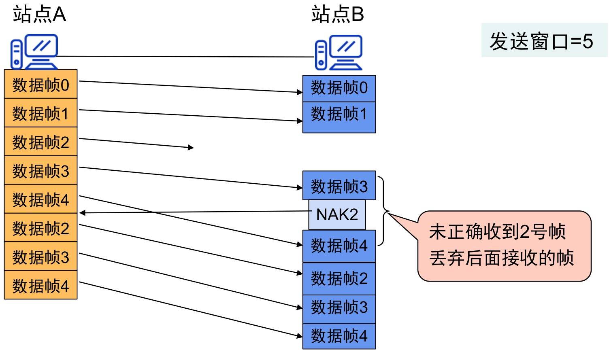

3. 差错情况 3：应答帧（ACK）丢失

- **场景**：发送方发帧 0~2，接收方正确接收并发送 ACK3，但 ACK3 丢失。
- **发送方动作**：帧 0 的定时器超时，**重传帧 0、1、2**。
- **接收方动作**：此时期望序号是 3，收到的帧 0、1、2 都是乱序帧，直接丢弃，并**重发 ACK3**；发送方收到 ACK3 后，停止重传并滑动窗口。

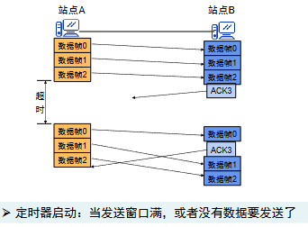

对于回退N协议的窗口大小与编号范围的关系：

BN 的帧编号采用**模 n**（比如 n=8，编号 0~7 循环），**发送窗口大小必须 ≤ n-1**：窗口大小≤n-1 时，发送窗口内的帧序号范围，与 “下一轮发送” 的帧序号范围不会重叠；

窗口大小=接收窗口大小+发送窗口大小

| 窗口大小情况   | 协议是否可行 | 原因                                                       |
| -------------- | ------------ | ---------------------------------------------------------- |
| 窗口大小 > n   | 不可行       | 序号循环后，新帧和重传帧序号完全重叠，无法区分             |
| 窗口大小 = n   | 不可行       | 应答帧丢失时，接收方会把重传帧误判为新帧（如图 72 示例）   |
| 窗口大小 = n-1 | 可行         | 序号不会完全重叠，接收方能区分新帧和重传帧（如图 73 示例） |
| 窗口大小 < n-1 | 可行         | 效率略低，但兼容性更好                                     |

1. 窗口尺寸等于n时,应答帧丢失时协议失败

   即接收方无法分别接收的帧是**重发的旧的帧**还是**下一个滑动窗新的帧**

   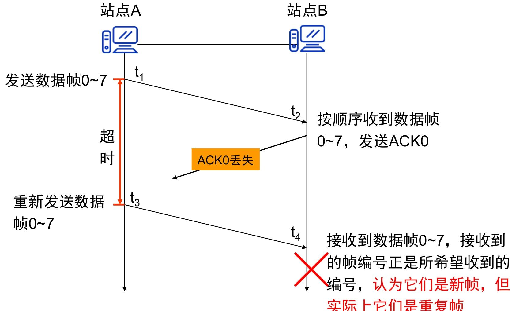

2. 窗口尺寸等于 n-1 时,协议成功

   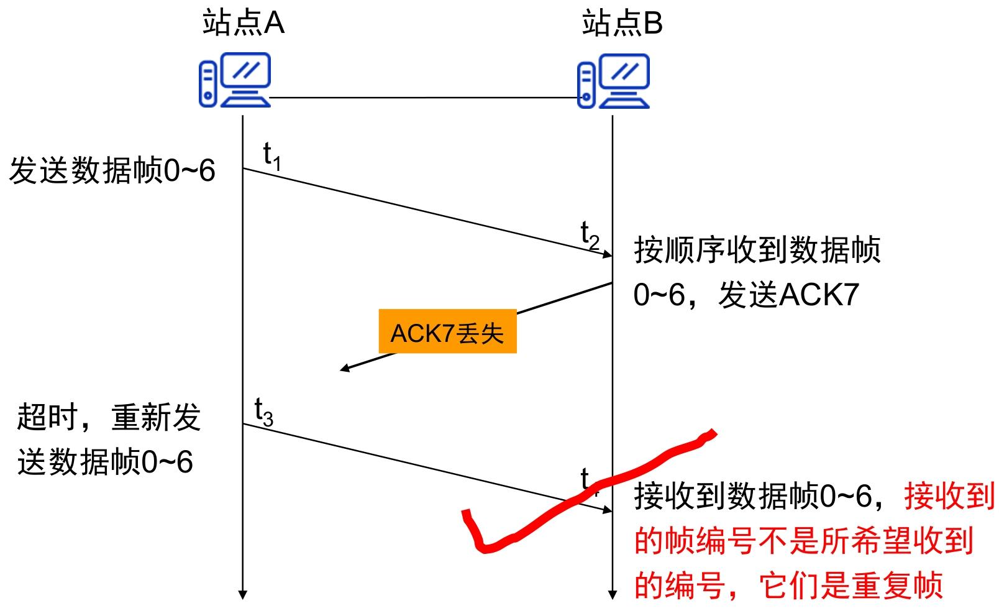


##### 选择拒绝自动重复请求（SR）

核心逻辑是 “只重传出错 / 丢失的帧，不浪费带宽重传正确帧”

发送方连续发送多帧（窗口内），若某帧出错 / 丢失，仅重传该帧，后续已正确发送的帧无需重传；

接收方会缓存窗口内的乱序正确帧，待缺失帧补全后按序交给上层。

- 对比回退 N 帧（GBN）：GBN 是 “一帧错，全重传”，SR 是 “错哪帧，传哪帧”

适用前提：

- 接收窗口大小＞1：能缓存乱序到达的正确帧，不能像 GBN 那样仅按序接收。
- 接收方需排序功能：缓存乱序帧后，按序号重组。
- 发送方需查找机制：能精准定位出错帧，单独重传（而非重传整个窗口）。

优点：避免重传正确帧，信道利用率高，尤其适合出错率较高的场景。

缺点：接收方需更大缓冲区存储乱序帧，实现复杂度高

三类差错的处理流程：数据帧损坏，数据帧丢失，应答帧（ACK）丢失

1. 差错 1：帧破坏（数据帧损坏）

- 流程：

  1. 发送方 A 连续发帧 0、1、2、3、4、5；
  2. 接收方 B 收到帧 2 时校验出错（Step1：错误检测），其他帧（0、1、3、4、5）正确，缓存这些帧；
  3. B 发送否定应答（NAK2），告知 A “帧 2 损坏”（Step2：发送否定应答）；
  4. A 收到 NAK2 后，仅重传帧 2（Step3：重传出错帧）；
  5. B 收到重传的帧 2，补全序列，按序交给上层，发送 ACK5（确认 0~5 帧均收到）。

  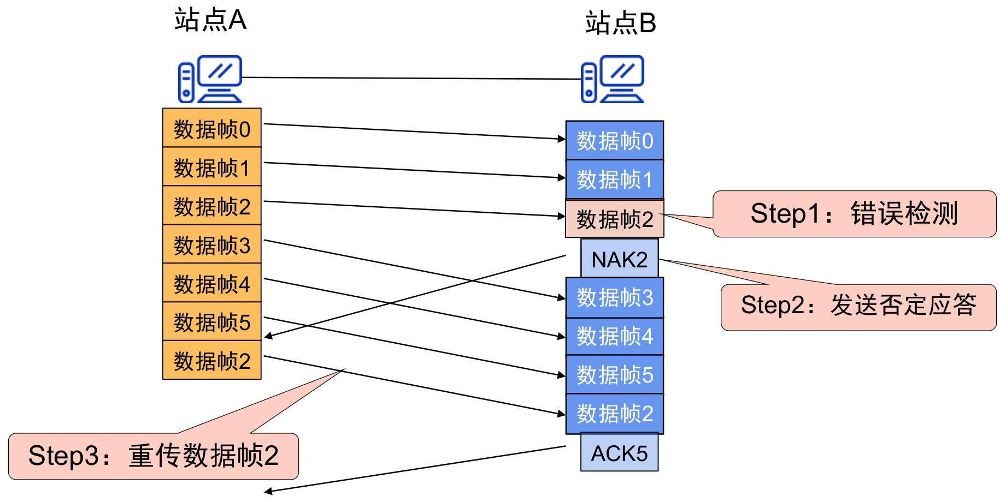

2. 差错 2：数据帧丢失

- 流程：
  1. 发送方 A 发帧 0、1、2、3、4、5，其中帧 2 在传输中丢失；
  2. 接收方 B 收到帧 0、1、3、4、5，发现帧 2 缺失，缓存已收帧，发送 NAK2；
  3. A 收到 NAK2（或帧 2 超时），仅重传帧 2；
  4. B 收到帧 2 后补全序列，发送 ACK5 确认。
- 特殊情况：若丢失的是最后一帧（如帧 5），接收方不会主动反应，发送方因未收到对应确认，超时后重传该帧。

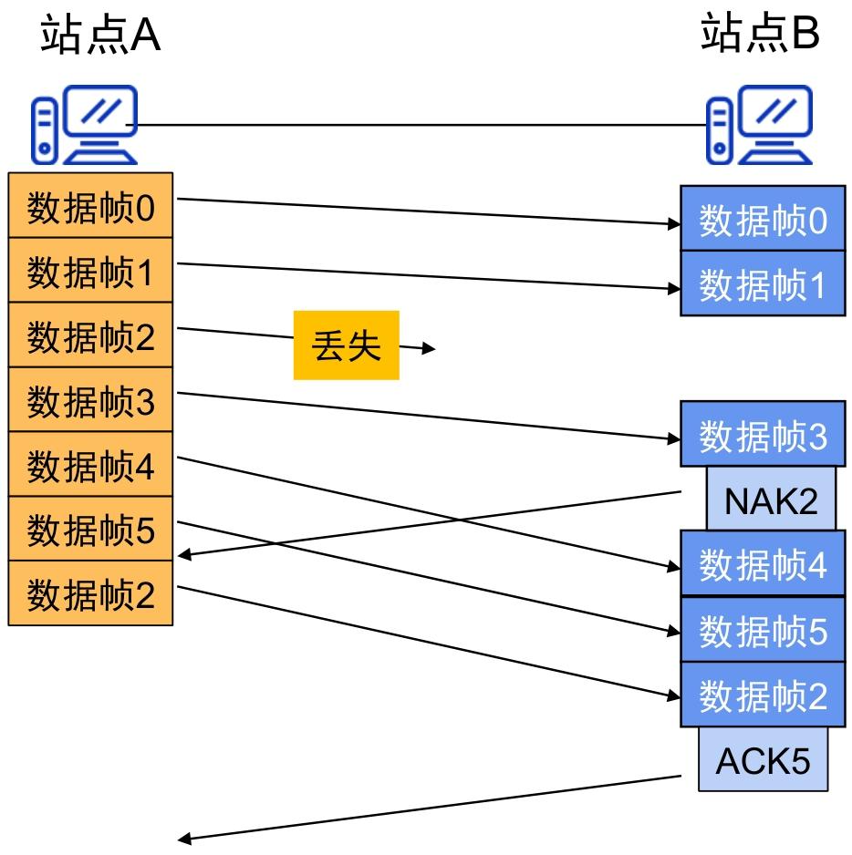

3. 差错 3：应答帧（ACK）丢失

- 流程：

  1. 发送方 A 发完窗口内所有帧（如 0~5），启动超时定时器；
  2. 接收方 B 正确接收所有帧，发送 ACK5，但 ACK5 在传输中丢失；
  3. A 超时未收到确认，将窗口内所有 “未确认帧”（此处为 0~5）重传一遍；
  4. B 收到重传帧后，通过序号识别为重复帧，直接丢弃，并重发 ACK5；
  5. A 收到 ACK5 后，停止重传，滑动窗口。

  

> [!tip]
>
> 窗口大小与帧编号范围的关系:
>
> - 如果帧的编号范围是0到n-1(即模n编号)，则发送窗口尺寸和接收窗口尺寸之和应小于或等于`n`
>   - 发送窗口大小（Wt） + 接收窗口大小（Wr） ≤ n（帧编号范围 0~n-1）；
> - 如果要求发送窗口和接收窗口大小相等，则窗口尺寸应该小于或等于`n/2`
>   - 若要求 Wt=Wr（常用场景），则 Wt=Wr ≤ n/2。
>
> 1. 发送窗口尺寸太大,协议会失败
>
>    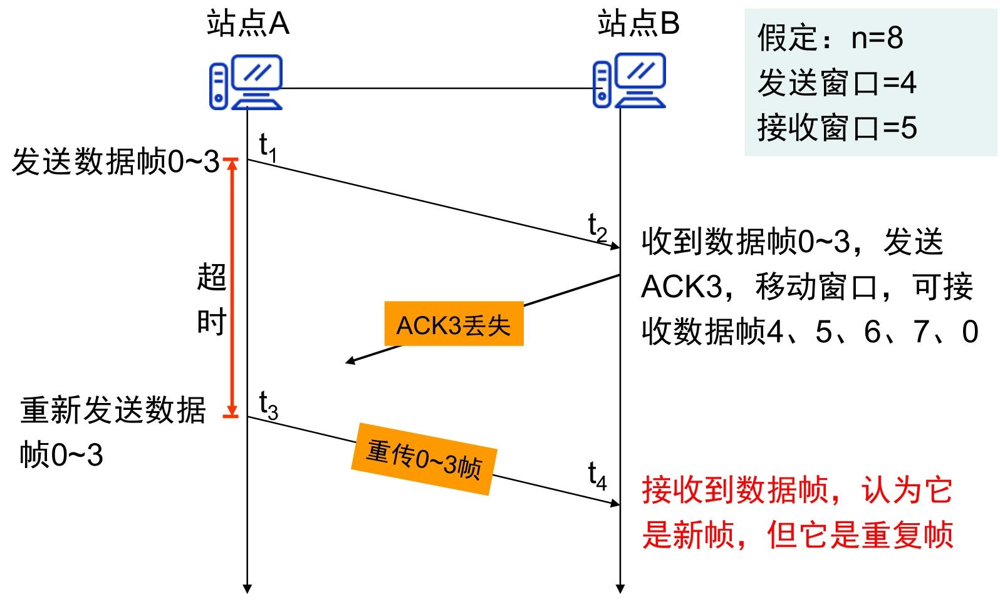
>
> 2. 接收窗口尺寸太大,协议失败
>
>    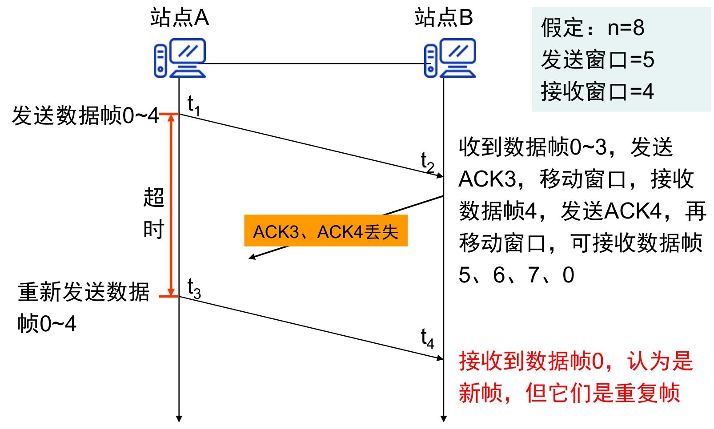

---


##### 回退 N 帧（GBN）协议的传输效率

- 传输效率与差错率有关，无差错时，p=0，滑窗协议的传输效率 η=100%；
- 有差错时，传输效率与传送一帧的总时间和发送端发送一帧的时间之比有关，如果线路传输延时、应答帧时间越长，则传输效率下降越多

延时比`t_W / t_I`：传播 / 应答延时越长，效率越敏感

- 长延时场景下，GBN 的连续发送能抵消重传开销，效率远超停止等待。
- 短延时场景下，等待时间占比低，GBN 的优势不明显。

##### 窗口大小的选择

窗口大小*n*的核心作用是 “填满链路延时”，避免发送方过早等待，需满足：`n*tI >= tI+tS+2*tP`

- 窗口太小：发送方发完窗口内帧后，还没收到确认，只能等待，链路空闲，效率下降。
- 窗口太大：需要更大缓冲区存储未确认帧，增加设备成本，且超过链路承载能力后，效率不再提升（边际效益递减）。

---


## 数据链路控制协议

数据链路控制协议是数据链路层的核心执行标准，负责规范帧格式、链路管理、差错控制等关键操作

### IEEE 局域网参考模型

IEEE 局域网模型仅涉及 OSI 的**物理层**和**数据链路层**，并对这两层进一步拆分，上层（网络层及以上）与 OSI 模型保持一致：

| OSI 模型     | IEEE 局域网模型                | 核心功能                                                     |
| ------------ | ------------------------------ | ------------------------------------------------------------ |
| 网络层及以上 | 网络层及以上                   | 保持原有功能（如路由、数据传输控制），与底层局域网类型无关   |
| 数据链路层   | 逻辑链路控制子层（LLC，802.2） | 提供统一接口，屏蔽 MAC 子层差异，处理流量控制、差错控制      |
|              | 媒体访问控制子层（MAC）        | 适配具体传输介质，定义信道访问规则、帧格式、物理地址（MAC 地址） |
| 物理层       | 介质访问单元（MAU，上子层）    | 实现物理信号的收发、编码解码（如曼彻斯特编码）、链路激活     |
|              | 介质说明（下子层）             | 定义物理介质特性（如电缆类型、接口标准、传输速率）           |

对于MAC子层，IEEE 802.3（以太网）、802.4（令牌总线）、802.5（令牌环）、802.11（无线 Wi-Fi），每个标准对应专属的 MAC 子层实现。

而LLC子层，为网络层提供统一的服务接口，屏蔽不同 MAC 子层的差异，让上层协议（如 IP）无需关心底层的局域网是以太网还是令牌环。


### 逻辑链路控制子层LLC

**局域网 LLC 子层（逻辑链路控制）** ，本质是 LLC 作为 “上层统一接口、下层适配 MAC” 的中间层，解决不同局域网（以太网、令牌环等）的互连兼容问题

- LLC 子层位于**网络层**和**MAC 子层**之间
- 向上：给网络层提供统一的服务接口，让上层协议（如 IP）不用关心底层是以太网还是令牌环；
- 向下：屏蔽不同 MAC 子层的差异（比如以太网的 CSMA/CD、令牌环的令牌传递），适配各种局域网类型；
- 复用：让一个站点的多个进程（如浏览器、聊天软件）通过不同 “服务访问点（SAP）”，共享同一个 MAC 帧资源通信。

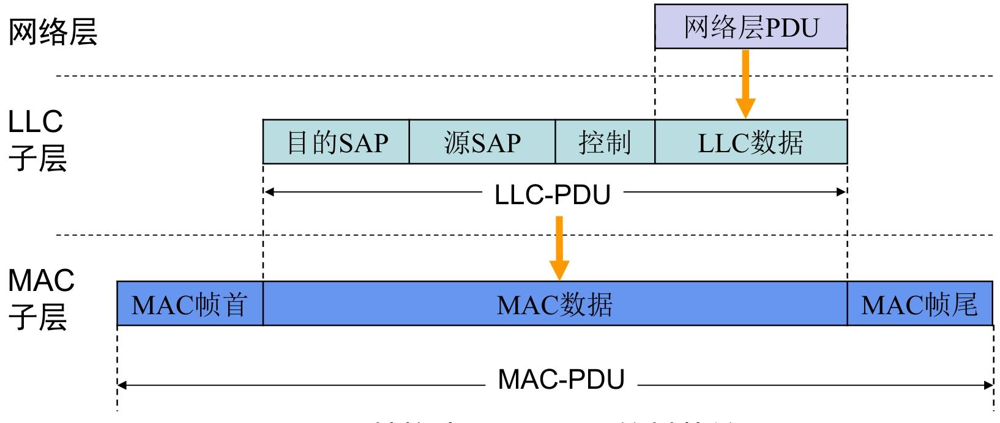

#### LLC-PDU（LLC 帧）的核心结构

LLC 帧是 LLC 子层的协议数据单元，结构简单且标准化，核心由 4 个字段组成：

```plaintext
DSAP目的SAP（7位） + SSAP源SAP（7位） + 控制字段（8/16位） + LLC数据（网络层PDU）
```

- **LLC 数据**：本质是网络层传递下来的数据包（如 IP 数据报），是 LLC 帧的 “有效载荷”；
- 整个 LLC-PDU 会被嵌入到 MAC 帧的 “MAC 数据” 字段中，再加上 MAC 帧首（目的 MAC、源 MAC 等）和帧尾（CRC 校验），形成完整的传输单元，最终通过物理层发送。

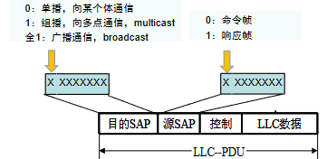

#### LLC 的三种帧类型

1. 信息帧（I - 帧）

- 控制字段结构：1 位（0，I 帧标识） + 7 位 N (S)（发送序号） + 1 位 P/F（是否结束发送） + 7 位 N (R)（期望接收的下一个序号）；
- 功能：传输用户数据（LLC 数据字段），同时通过序号实现流量控制和差错控制（和滑动窗口协议逻辑一致）。

2. 监管帧（S - 帧）

- 控制字段结构：2 位（10，S 帧标识） + 2 位 SS（类型码） + 4 位保留位 + 1 位 P/F + 7 位 N (R)（确认序号）；
- 类型码含义：00 = 接收就绪（RR，确认数据已收），10 = 接收未就绪（RNR，让发送方暂停），01 = 拒绝（REJ，要求重传）；
- 功能：仅负责流量控制和差错控制，**无信息字段**（不传输用户数据）。

3. 无编号帧（U - 帧）

- 控制字段结构：2 位（11，U 帧标识） + 2 位 MM（功能码） + 1 位 P/F + 3 位 MM（扩展功能码）；其中功能码一共`5`位
- 功能：链路管理（如建立连接、释放连接），不涉及序号控制，适用于简单的链路控制场景。

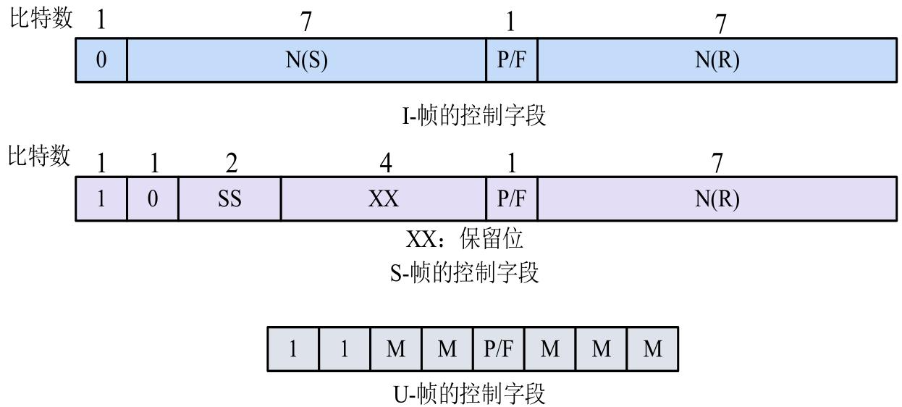

> [!tip]
>
> ### 与 HDLC 帧的核心区别
>
> - 无 “选择拒绝帧（SREJ）”：LLC 只支持 “拒绝帧（REJ）”，即一帧出错需重传后续所有帧（类似 GBN 协议）；
> - 无 CRC 校验：LLC 帧本身不做差错检测，CRC 校验由下层的 MAC 子层完成，LLC 仅负责接收 MAC 子层校验通过的帧。

#### LLC 提供的三类服务

1. 无确认无连接服务

- 核心逻辑：发送方发完帧就结束，不需要接收方回复确认；
- 差错 / 流量控制：由高层协议（如 TCP）负责，LLC 不处理；
- 适用场景：信道误码率低、实时性要求高的场景（如有线以太网）。

2. 有确认无连接服务

- 核心逻辑：每发送一帧，都需要接收方单独回复确认（ACK），确保帧被正确接收；
- 特点：无需建立连接，但单帧可靠；
- 适用场景：信道不可靠的场景（如无线 Wi-Fi，802.11 协议依赖此服务）。

3. 有确认面向连接服务

- 核心逻辑：通信前先建立连接（通过 U - 帧协商），数据传输时每帧都需确认，结束后释放连接；
- 特点：连接导向，全程可靠；
- 适用场景：无复杂上层协议的简单终端（如蓝牙设备、工业控制终端），直接基于链路层通信。

---


## 介质访问控制协议

介质访问控制（MAC）协议的核心是解决 “多设备共享信道时的使用权分配” 问题，避免信号冲突，确保通信有序

### 以太网

以太网拓扑结构的核心是 “共享介质的广播信道”，随技术发展从**总线形**演进为**星形**，同时通过 CSMA 机制减少共享信道的冲突

IEEE 802.3 把以太网分为两类，核心差异在传输方式：

- **基带**：直接用数字信号传输数据（比如 0 和 1 的电信号），是目前最常用的类型；
- **宽带**：用模拟信号传输（类似有线电视的信号），现在很少使用，重点关注基带即可。

> [!tip]
>
> 基带类的 5 个标准，核心是 “速率 + 传输介质” 的组合，命名有规律（以 “10Base-T” 为例）：
>
> - “10”：代表传输速率是 10Mbps（100Base-T 就是 100Mbps）；
> - “Base”：代表基带传输；
> - 最后一位（5/2/T）：代表传输介质（5 = 粗同轴电缆、2 = 细同轴电缆、T = 双绞线）。
>
> 基带传输用 **曼彻斯特编码** 把数字信号（0 和 1）转换成物理信号

每个接入以太网的设备（电脑、服务器等）都必须装 **NIC（网络接口卡）**，也就是常说的 “网卡”：

- 安装位置：通常内置在设备内部（比如电脑主板上的集成网卡）；
- 唯一标识：NIC 上固化了一个 **6 字节（48 位）的物理地址**（即 MAC 地址），全世界任意两个 NIC 的 MAC 地址都不重复，就像设备的 “身份证”，用来在以太网中精准识别目标设备。

#### 以太网拓扑结构

以太网拓扑结构随技术发展从**总线形**演进为**星形**，核心围绕 “共享介质的广播信道” 本质，优化传输可靠性与可维护性

1. 1990年前的以太网,使用**同轴电缆**,采用**总线形**拓扑结构
   - 比如对应 10Base5（粗同轴电缆）和 10Base2（细同轴电缆）标准，同时为典型的**共享介质广播信道**
2. 1990 年,IEEE 制定出802.3i标准,使用**双绞线**的**星形**拓扑（物理上是星形，但是逻辑上还是总线形，因为集线器是共享介质广播信道）
   - 通过**双绞线**（常用两对线）连接到中心设备 “集线器（Hub）”，站点侧采用 RJ-45 接头连接网卡（NIC），形成 “中心辐射” 结构
   - 仍为**共享介质广播信道**—— 集线器不做数据筛选，会将一个站点的信号转发到所有端口，所有站点共享集线器总带宽

---

#### 以太网CSMA/CD

当多个用户不加控制同时访问共享信道时，会由于不同信号叠加而相互破坏，导致信号会产生严重的失真，所以需要处理共享广播信道以太网的冲突问题，比如载波侦听多路访问CSMA

CSMA（载波侦听多路访问）是共享信道的基础介质访问机制，核心是 “发送前先侦听”；

> [!tip]
>
> - 多路访问（MA）：多个站点共享同一信道，一个站点发送的数据会广播到所有站点，无集中管制，依赖接收方响应判断数据是否完好。
> - 载波侦听（CS）：站点发送数据前，通过检测信道电压判断是否 “忙碌”（有无其他站点传输信号）。
> - **信道空闲则直接传输；信道忙碌则避让一段时间后重试**，减少冲突概率。

依据避让时间的选择方法,CSMA可分为三种:

| 类型          | 核心逻辑                                                     | 特点                                 |
| ------------- | ------------------------------------------------------------ | ------------------------------------ |
| 非坚持 CSMA   | 检测到信道忙，随机等待一段时间后再侦听                       | 冲突概率低，但信道利用率可能偏低     |
| 坚持 CSMA     | 检测到信道忙，持续侦听，一旦空闲立即发送                     | 信道利用率高，但多站同时抢占易冲突   |
| P - 坚持 CSMA | 检测到信道空闲，以概率 P 直接发送，以概率（1-P）等待一个时隙后再尝试 | 平衡利用率与冲突概率，适配时隙化信道 |

即使先侦听，仍会因 “信号传播延迟” 产生冲突

所以必须采用**CSMA/CD**

CSMA/CD 是 IEEE 802.3 标准的核心，在 CSMA 基础上增加 **“冲突检测” 和 “冲突处理”**，形成 “侦听 - 发送 - 检测 - 重传” 的闭环，适用于半双工共享信道以太网。

- 冲突检测：站点发送数据的同时，持续侦听信道 —— 若检测到信号叠加失真（电压异常），立即判定为 “冲突”。
- 冲突处理：
  1. 立即停止发送数据，避免无效占用信道；
  2. 发送 “阻塞信号”，通知其他站点信道冲突，防止后续误发送；
  3. 等待随机时间后，重新执行 CSMA 流程重试发送。

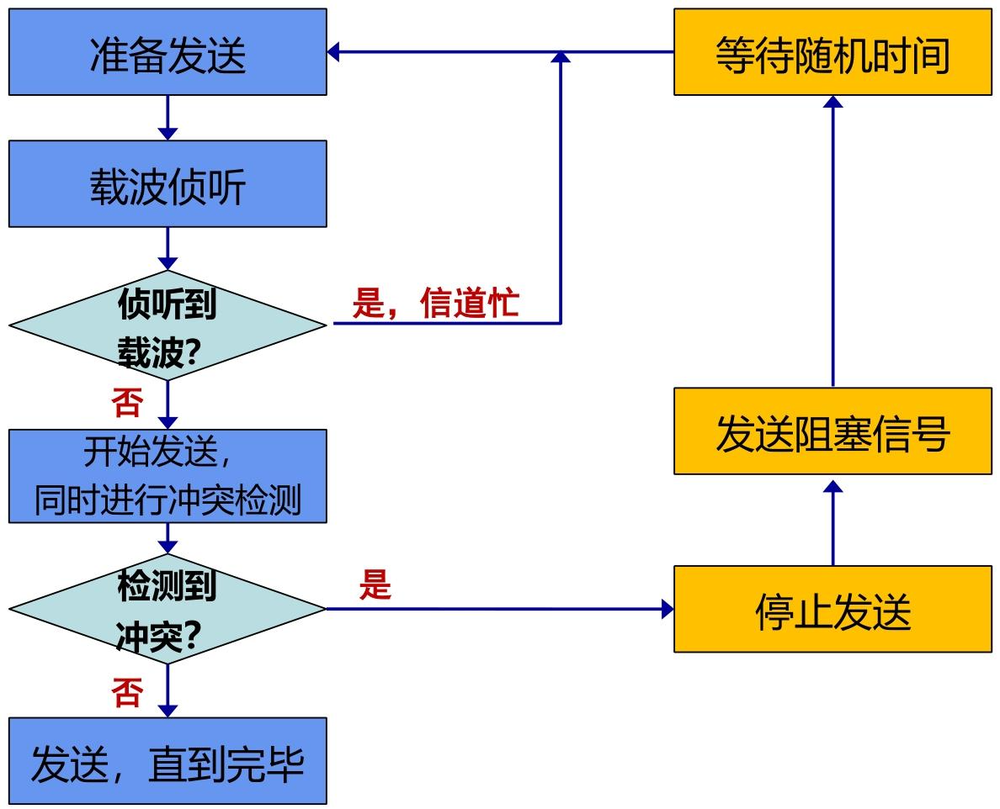

关键在于**冲突检测窗口与最短帧长**

（1）冲突检测窗口（争用期）

- 以太网的端到端往返时延（2T），即信号从一个站点传到最远站点再返回的时间。
- 核心逻辑：若发送方在 “2T” 内未检测到冲突，说明该帧发送不会与其他站点冲突（所有站点已感知信道忙碌）。

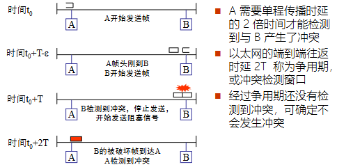

（2）**最短帧长**

- 定义：争用期（2T）内可传输的比特数，确保发送方在检测到冲突前，已发送足够长的帧，避免冲突后无法通知其他站点。
- 计算公式：***Lmin*=2*t*×*R***（t=D/V即传播时延，D 为最大距离，V 为信号传播速度，R 为传输速率）。也可以是两倍的时延带宽积
- 实例：10Mbps 以太网的争用期可传输 512bit（64 字节），因此规定最短有效帧长为 64 字节；长度＜64 字节的帧均为冲突中止的无效帧。

而对于冲突重试则需要采用**二进制指数退避算法**

发生冲突的站点停止发送数据,并发送完阻塞信号；为降低再次冲突概率，站点冲突后按以下规则等待重试：

- 基本退避时间 = 争用期（2T）。
- 第 k 次冲突时，从 [1, 2^k] 中随机取 r，退避时间 = t = r×2T。
- k=Min (重传次数，10)：重传≤10 次时，k = 重传次数；重传达 **16 次**仍失败，丢弃帧并向上层报错。

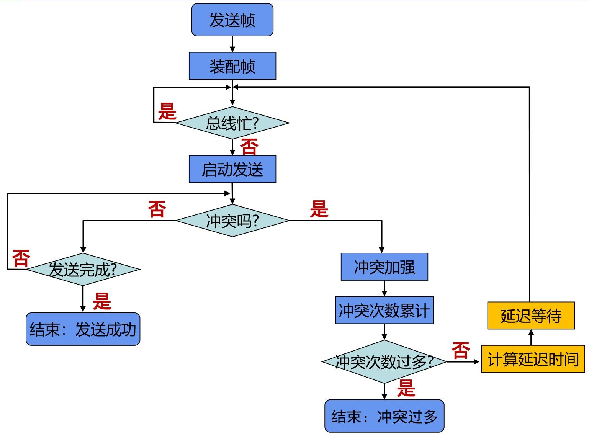

> [!note]
>
> - CSMA 是 “预防冲突” 的基础机制，靠 “侦听 + 避让” 减少冲突，但无法完全避免。
> - CSMA/CD 是以太网的完整解决方案，通过 “侦听（CS）+ 共享访问（MA）+ 冲突检测（CD）+ 退避重传”，实现共享信道的有序通信。
> - 适配早期两个以上站点共享信道、各站点之间以半双工方式进行通信的以太网即一个冲突域

---

#### 以太网帧结构

以太网 MAC 帧的核心是**两种标准格式**，通过 “长度 / 类型” 字段区分，其中 Ethernet II（DIX V2）是目前最常用的格式

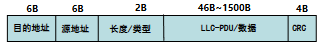

区分依据：2 字节 “长度 / 类型” 字段

- **Ethernet II 标准（DIX V2）**：字段值 > 0X0600（十进制 1536），此时该字段是 “类型字段”，标识上层协议类型。
- **IEEE 802.3 标准**：字段值 ≤ 0X0600，此时该字段是 “长度字段”，标识后续数据字段的字节数。

1. Ethernet II 帧

   ```plaintext
   前导码（7B） + 帧起始定界符（1B） + 目的地址（6B） + 源地址（6B） + 类型字段（2B） + 数据字段（46B~1500B） + 帧校验（4B）
   ```

   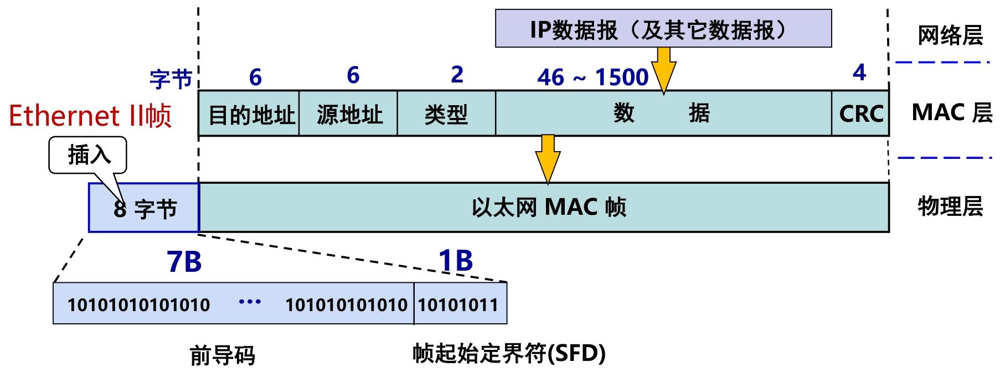

- 目的地址 + 源地址（MAC 地址6B）：硬件地址（物理地址），全球唯一，固化在网卡（NIC）中

  前 3 字节为 “组织唯一标识符（OUI）”（IEEE 分配给厂商），后 3 字节为 “扩展唯一标识符”（厂商自行分配，确保无重复）

  

- MAC地址分三种:单播地址､组播地址和广播地址：规定**地址字段的第一字节的最低位**用于标识单播还是组播地址

  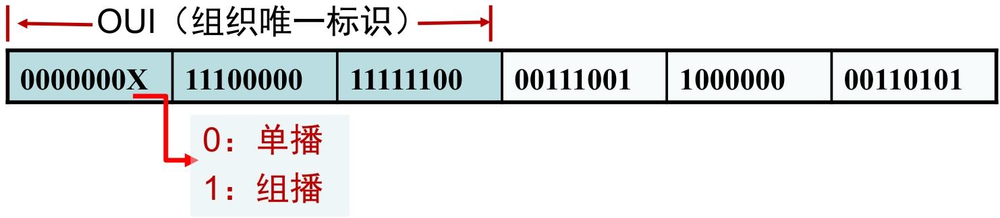

- 类型字段（2 字节）：指明上层协议，让接收方将数据交给正确的网络层协议。

- 数据字段（46B~1500B）：上层协议的 PDU（如 IP 数据报、ARP 报文）。

- 帧校验字段（FCS，4 字节）：差错检测，采用 CRC-32 校验算法。


2. 过时格式：IEEE 802.3 帧

   ```plaintext
   目的地址（6B） + 源地址（6B） + LLC-PDU长度（2B） + LLC-PDU（46B~1500B） + 帧校验（4B）
   ```

   - 核心区别：将 “类型字段” 改为 “LLC-PDU 长度字段”，数据字段必须封装 LLC 帧（含 DSAP、SSAP、控制字段），再承载网络层数据。

3. 无效 MAC 帧判定（64B~1518B 为有效帧长度）

   满足以下任一条件即为无效帧，接收方直接丢弃，不重传：

   1. 数据字段长度与 “长度字段”（IEEE 802.3）的值不一致；
   2. 帧总长度不是整数个字节；
   3. CRC 校验结果与帧校验字段不匹配（帧损坏）；
   4. 数据字段长度不在 46B~1500B 之间（未满足最小填充或超过 MTU）。

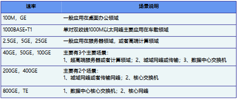

---


### 无线局域网

无线局域网（WLAN）是采用无线通信技术覆盖局部地理范围的网络，核心基于 IEEE 802.11 协议簇，**Wi-Fi 是其通俗统称**（二者意义等同），核心特点是无物理线缆、支持移动接入，半双工通信，同一时刻仅一台设备可发送需排队等待

WLAN 可分为两大类： 有固定基站的 WLAN；无固定基站的 WLAN

#### 无线局域网标准

IEEE 802.11 标准定义了 3 种物理层介质，适配不同传输场景：

1. **跳频扩展频谱（FHSS）**：通过快速切换频率避免干扰，适用于早期低速传输。
2. **直接序列扩展频谱（DSSS）**：将数据信号与伪随机序列叠加传输，抗干扰能力强，802.11b 采用此技术。
3. **红外线（IR）**：利用红外光传输，受遮挡影响大，适用短距离无遮挡场景。

**正交频分复用（OFDM）**，从 802.11a/g 开始普及，通过将信道划分为多个子信道并行传输，提升抗干扰能力与传输速率

很多无线局域网适配器做成双模（802.11a/g)或三模(802.11a/b/g或802.11b/g/n)

对于802.11b；802.11g；802.11a三类主流标准

| 对比维度 | 802.11b                                                      | 802.11g                                 | 802.11a                                  |
| -------- | ------------------------------------------------------------ | --------------------------------------- | ---------------------------------------- |
| MAC 协议 | 均采用 CSMA/CA（载波侦听多路访问 / 冲突避免），因无线信道冲突检测困难，通过 “预约信道 + ACK 确认” 避免冲突 |                                         |                                          |
| 工作频率 | 2.4GHz（开放频段，易受蓝牙、微波炉等干扰）                   | 2.4GHz（与 802.11b 兼容）               | 5GHz（频段干净，干扰少，但覆盖范围略小） |
| 物理编码 | DSSS                                                         | DSSS（兼容 802.11b）或 OFDM（高速传输） | OFDM                                     |
| 最高速率 | 11Mbps                                                       | 54Mbps                                  | 54Mbps                                   |
| 兼容性   | 向下兼容 802.11 标准                                         | 向下兼容 802.11b/g                      | 不兼容 802.11b，需双模 / 三模适配器互通  |

#### 拓扑结构

基本服务集（BSS）是无线局域网（WLAN）的最小功能单元

本质是 “一组共享同一无线链路、遵循相同 MAC 协议的站点集合”，所有站点通过竞争方式使用信道，核心分为 “独立 BSS” 和 “有 AP 的 BSS” 两类

| 对比维度 | 有 AP 的 BSS（基础设施 BSS） | 独立 BSS（IBSS/Ad-Hoc）  |
| -------- | ---------------------------- | ------------------------ |
| 核心设备 | 必须有 AP（中心节点）        | 无 AP，仅站点对等连接    |
| 拓扑结构 | 星形（站点→AP→站点）         | 网状（站点直接互连）     |
| 控制方式 | AP 集中控制信道、接入        | 站点自主竞争，无中心控制 |
| 覆盖范围 | 较大（由 AP 功率决定）       | 较小（由站点信号决定）   |
| 扩展能力 | 强（多 BSS 可互连）          | 弱（仅局限于少量站点）   |
| 典型场景 | 家庭、办公、公共场所 Wi-Fi   | 临时文件共享、应急通信   |

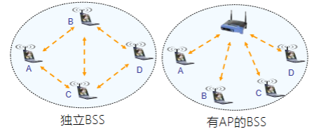

#### WLAN 协议栈

WLAN（无线局域网）协议栈核心遵循 IEEE 802 标准，与有线以太网（802.3）上层完全兼容，仅在数据链路层（MAC 子层）和物理层适配无线信道特性

同时通过 MAC 层双工作模式、帧间间隔（IFS）、专用 MAC 帧结构保障无线传输有序可靠

WLAN 与 有线以太网

- 上层（应用层→网络层）：WLAN 与有线以太网完全共用，无需额外适配，比如电脑连接 Wi-Fi 或网线，浏览器、办公软件的使用体验一致。
- 下层（数据链路层→物理层）：因传输介质不同（无线开放信道 vs 有线封闭信道），MAC 子层的冲突处理机制（CSMA/CA vs CSMA/CD）、帧结构，以及物理层的信号处理方式存在本质区别。

##### WLAN MAC层

WLAN MAC 层通过 “**争用 + 无争用**” 双模式，适配不同优先级数据传输，避免无线信道冲突：

争用服务：分布协调功能（DCF）

- 基于 CSMA/CA（载波侦听多路访问 / 冲突避免），是 WLAN 默认工作模式。
- 站点发送数据前先侦听信道，空闲则等待帧间间隔（IFS）后发送；忙则持续侦听，待信道空闲后按退避算法重试，通过 RTS/CTS（信道预约）和 ACK 确认避免冲突。
- 适用场景：**普通数据**传输（如网页浏览、文件下载），分布式竞争，无需集中控制。

无争用服务：点协调功能（PCF）

- 集中控制，由**接入点（AP）主导分配**信道使用权。
- AP 通过轮询方式，依次允许各站点发送数据，站点无需竞争信道，直接在分配时隙内传输。
- 适用场景：**高优先级数据**（如语音通话、视频会议），无冲突、低延迟，依赖 AP 的集中调度。

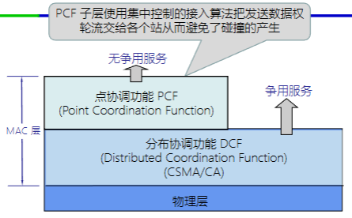

##### 帧间间隔（IFS）

IFS 是站点发送帧后的**强制等待时间**，通过长度差异划分帧优先级，减少冲突概率：

- 帧间间隔长度取决于该站欲发送的帧的类型
- 优先级越高，等待时间越短，越容易抢占信道；低优先级帧若遇高优先级帧发送，需重新等待，避免冲突。

| IFS 类型 | 中文名称             | 长度关系         | 适用帧类型                                                   | 核心作用                                                     |
| -------- | -------------------- | ---------------- | ------------------------------------------------------------ | ------------------------------------------------------------ |
| SIFS     | 短帧间间隔           | 最短（基础单位） | ACK 帧、CTS 帧、分片后的数据帧、AP 查询响应帧、PCF 模式下 AP 发送的帧 | 保障同一对话的帧连续传输（如数据帧 + ACK 帧），站点可快速切换收发状态 |
| PIFS     | 点协调功能帧间间隔   | SIFS + 1 个时隙  | PCF 模式下 AP 发送的轮询帧、控制帧                           | 确保 AP 在 PCF 模式下优先抢占信道，主导无争用传输            |
| DIFS     | 分布协调功能帧间间隔 | PIFS + 1 个时隙  | DCF 模式下的普通数据帧、管理帧（认证帧、关联帧等）           | 普通数据传输的默认间隔，平衡信道利用率与冲突概率             |

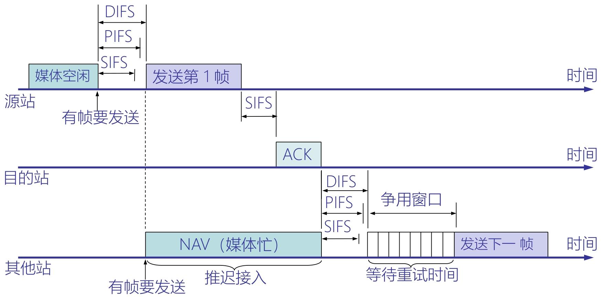

##### 802.11 MAC 帧结构

MAC 帧是 WLAN 数据传输的基本单元，首部（30 字节）包含关键控制信息，适配 AP 转发场景

- 帧控制： 含协议版本（固定为 0）、帧类型（管理 / 控制 / 数据）、子类型（认证 / 探测 / ACK 等）、传输方向（到 DS / 从 DS）等
- 持续期：标识信道占用时间，其他站点通过此字段设置 NAV，避免冲突

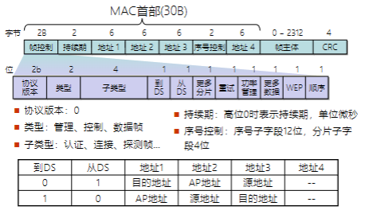

- 示例

  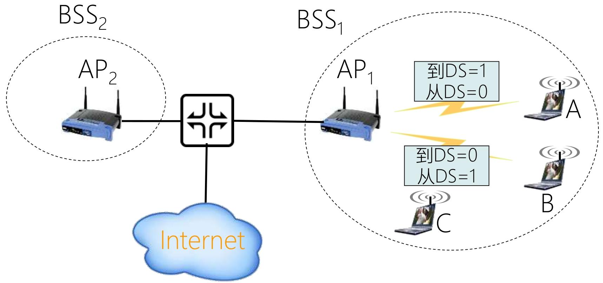

  1. A→AP：到 DS=1、从 DS=0，地址 1=AP 的 MAC、地址 2=A 的 MAC、地址 3=B 的 MAC；
  2. AP→B：到 DS=0、从 DS=1，地址 1=B 的 MAC、地址 2=AP 的 MAC、地址 3=A 的 MAC；


#### CSMA/CA协议

为什么不采用有限以太网的CSMA/CD协议？

> - 无线设备难以同时收发信号；CSMA/CD 的核心逻辑是 “发送数据的同时检测冲突”；
>
> - 冲突检测方式不兼容无线信道；无线信道是开放介质，信号易受干扰、衰减、反射，无法通过单一物理指标（如电压）判断冲突
>
> - 隐蔽站问题导致冲突检测失效
>
>   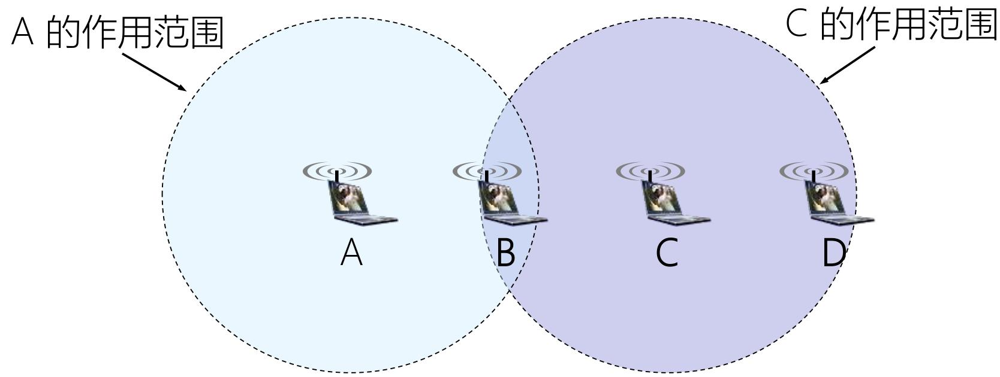
>
>   - 站点 A 和 C 都在站点 B 的通信范围，但 A 和 C 互不可见（信号覆盖无重叠），A 和 C 检测信道时均认为 “空闲”，同时向 B 发送数据，导致信号在 B 处冲突，但 A 和 C 无法检测到（因彼此信号无法到达）。
>   - CSMA/CD 的 “冲突检测” 仅能感知本地信道状态，无法解决远距离站点的隐蔽冲突，导致冲突频繁且无法及时处理。
>
> - 暴露站问题
>
>   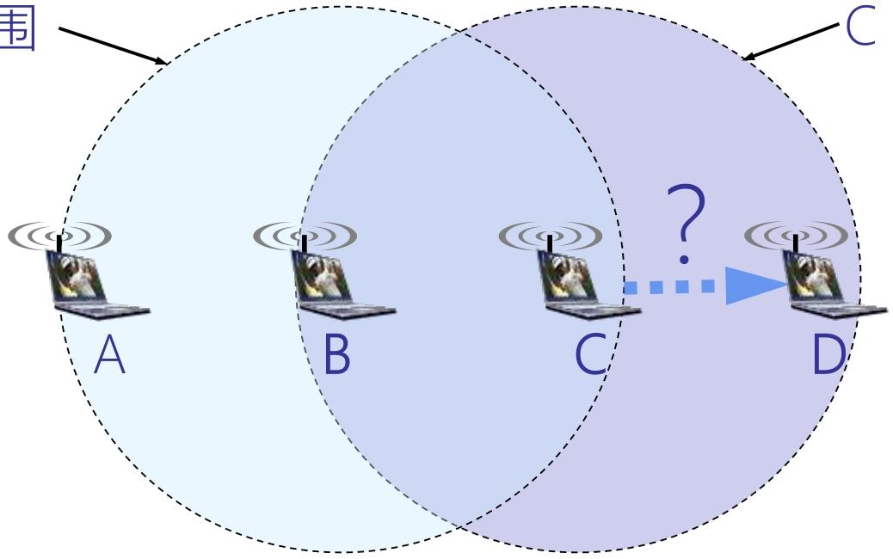
>
>   - 站点 B 向 A 发送数据，站点 C 检测到信道有信号（B 的传输），误以为自己无法发送数据（实际 C 向 D 发送数据不会干扰 B→A 的传输），导致信道利用率下降。
>   - 关键：暴露站问题不影响协议正常工作，但说明无线信道的 “忙闲状态” 无法通过简单侦听判断

CSMA/CA 的核心是 “**提前避免冲突**”，而非 “冲突后处理”

1. 站点有数据要发送时，先侦听信道（能量 / 载波检测）。
2. 信道空闲：等待帧间间隔（IFS）后再次侦听，仍空闲则发送数据。
3. 信道忙碌：持续侦听至传输结束，等待 IFS 后，按 “二进制指数退避算法” 随机等待一段时间，再重新侦听发送。

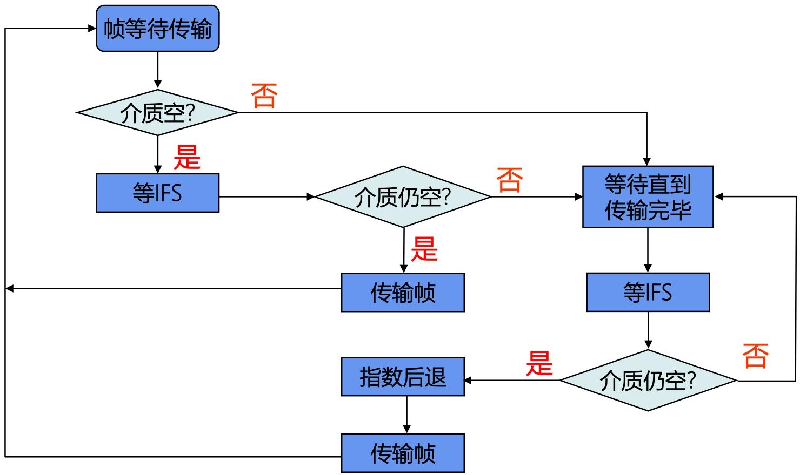

二进制指数退避算法（减少重复冲突）

- 第 i 次退避就在 `2^(2 + i)` 个时隙中随机地选择一个
- 第 i 次冲突时，退避时隙范围为 {0,1,...,2^(2+i)-1}（第 1 次退避 8 个时隙，第 2 次 16 个时隙，最多 6 次退避后时隙数固定为 255）。
- 通过随机等待时间，降低多个站点同时抢占信道的概率，避免重复冲突。

 信道预约（RTS/CTS 机制）：解决隐蔽站问题

源站点发送数据前，先通过短控制帧预约信道，让周边站点知晓 “信道即将被占用”，主动避让，而非直接发送数据引发冲突。

- **RTS（请求发送）**：源站发送的短控制帧，包含 3 个关键信息 —— 源 MAC 地址、目的 MAC 地址、本次通信总持续时间（含数据帧发送 + 应答帧接收的全部时间）。
- **CTS（允许发送）**：目的站响应的短控制帧，会复制 RTS 中的 “持续时间”，告知所有能接收的站点 “信道占用时长”。
- **NAV（网络分配向量）**：所有站点的 “信道忙闲计时器”，收到 RTS/CTS 后，会将 NAV 设置为帧中指定的持续时间，期间不再侦听信道，直接判定为 “忙”，不发送任何数据。

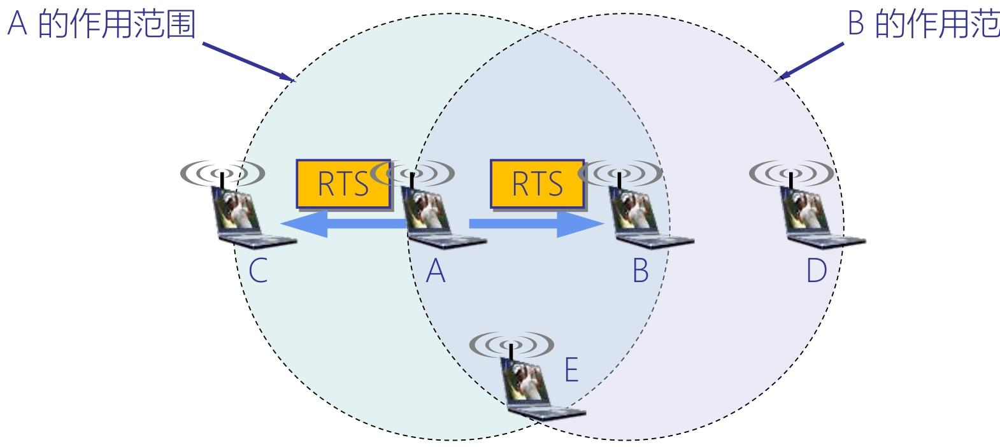

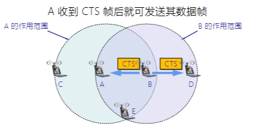

**正向确认(ACK机制）**：接收站正确收到数据要发确认帧,否则源站点重复发送数据帧

> [!note]
>
> CSMA/CA 的冲突避免技术，是 “主动预约” 与 “被动确认” 的结合：
>
> - RTS/CTS+NAV 机制：提前锁定信道，让周边站点主动避让，从源头避免冲突（尤其是隐藏站冲突）；
> - 正向 ACK 机制：事后验证传输结果，解决信号丢失、失真等问题，保障可靠性；
> - 两者协同，让无线信道在开放共享的环境下，实现有序、可靠的数据传输，是 WLAN 的核心技术之一。


---


## 数据链路层网络互连

数据链路层网络互连的核心是通过**网桥**和**二层交换机**两种设备，实现局域网的扩展与互连，解决单局域网覆盖范围有限、主机数量不足的问题，虚拟局域网（VLAN）则进一步优化互连后的网络性能与安全性


### 网桥

网桥是工作在物理层和数据链路层的局域网互连设备，在数据链路层进行帧的存储与转发，专门用于连接不同类型或不同网段的局域网

网桥属于 DCE 级端到端连接，是**局域网间的 “桥梁”**，仅用于局域网互连，不涉及广域网。

网桥同时作用于 **OSI 的物理层和数据链路层**，底层适配物理链路，上层聚焦帧的处理与转发。

网桥的核心组成的是实现帧处理与转发的关键

- **站表**：存储站点地址与对应接口的映射关系，用于判断帧的转发路径。
- **接口管理软件**：管理网桥的物理接口，适配不同网段的物理层特性。
- **网桥协议实体**：核心处理单元，负责帧的接收、解析、路由判断与转发。
- **缓存**：接口 1 和接口 2 分别对应两个互连的网段（如网段 A、网段 B），用于临时存储待转发的帧，缓解传输速率差异带来的冲突。

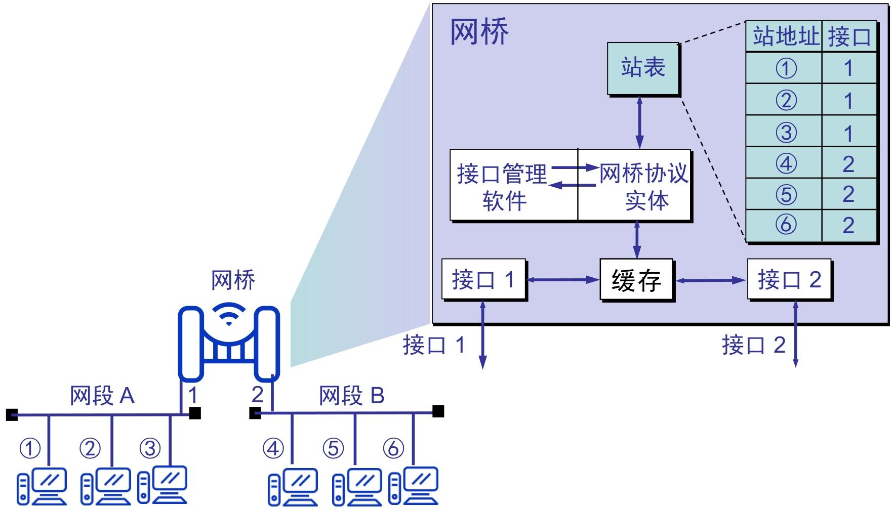

网桥的优势：过滤通信量仅仅转发网段的数据；连接多个局域网扩大了物理范围；可互连不同物理层、不同 MAC 子层和不同速率的局域网

网桥的缺点：增加存储转发时延特别是异构网段互连；MAC子层无法流量控制

#### 网桥的功能

网桥的核心价值是 “精准转发、适配异构、隔离冲突”

1. 帧路由：按目的地址精准转发

   - 网桥就像 “局域网间的交通指挥员”，收到帧后先查看帧的目的 MAC 地址，再通过自身的 “站表”（记录站点地址与对应网段的映射）判断该帧是否需要跨网段传输。
   - 若目的站点与发送站点在同一网段，网桥直接丢弃该帧，不转发，避免冗余流量；

   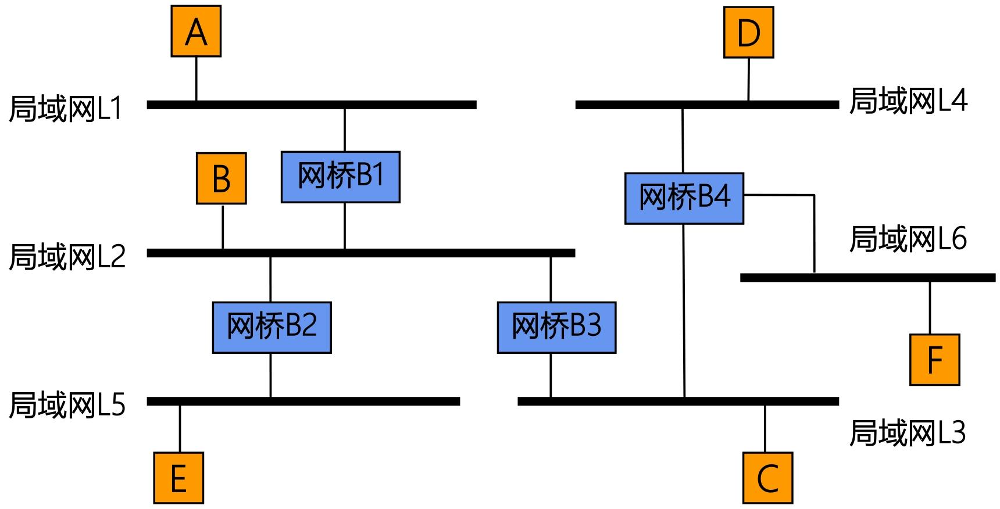

2. 错误检测

   - 网桥接收帧后，会通过 CRC 校验等方式检查帧的完整性（如比特错误、帧格式异常）
   - 若检测到错误帧，直接丢弃，不转发到其他网段，保障跨网段传输的数据可靠性

3. 帧格式转换

   - 不同局域网的 **MAC 子层协议**可能不同（如以太网 802.3、令牌总线 802.4），对应的帧格式也有差异，网桥可在数据链路层完成帧格式转换

4. 隔离通信：划分独立冲突域

   - 网桥将互连的多个局域网划分为独立的 “冲突域”，每个网段内的设备竞争信道时，不会影响其他网段，减少跨网段的冲突概率

     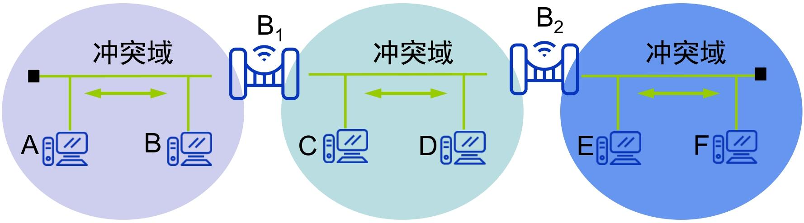

#### 网桥路由

网桥决定转发哪个帧和往哪儿转发的过程被称为路由

**路由表**是网桥转发决策的依据，记录 “目标站点 - 下一局域网” 的映射关系，网桥接收帧后，通过查询目标站点对应的条目，决定是否转发及转发到哪个局域网。

仅转发跨局域网的帧，同一局域网内的帧直接丢弃

三类核心路由算法

1. 固定路由算法（静态路由）

   - 路由表由人工手工配置，配置完成后固定不变，不支持动态调整。
   - 适用于拓扑稳定、站点数量少的小型网络。

2.  透明路由算法（动态路由，IEEE 802.1D 标准）

   - “透明” 指站点无需知晓网桥存在，网桥自动完成路由表生成与维护，是目前最常用的路由算法，核心包含 “逆向学习” 和 “生成树协议（STP）” 两大机制。

   - 逆向学习（路由表自动生成与修改）

     > 自动修改和生成路由表的能力称为路由学习或地址学习
     >
     > - 路由表初始化：网桥刚启动时路由表为空，收到未知目标站点的帧时，采用 “扩散算法”，向所有连接的局域网广播该帧，确保目标站点能收到。
     > - 自动学习：网桥接收帧时，提取帧的 “源 MAC 地址” 和 “入端口对应的局域网”，更新路由表（如从 L1 收到 A 发送的帧，记录 “A- L1”）。
     > - 动态更新：路由表项带定时器，超时未收到该站点的帧则删除表项；表项满时，通过替换算法淘汰不常用表项，适配动态拓扑。

   - **生成树协议（STP）**—— 解决帧循环问题

     > [!important]
     >
     > - 多网桥互连易形成网络环路，导致帧循环转发（广播风暴），阻塞网络。
     >
     > - 不改变物理拓扑，逻辑上阻断冗余链路，形成**无环路的树状结构**，冗余链路作为备份。
     >
     >   - 选择 “树根”：确定一个核心设备（根网桥），作为所有帧转发的起点；
     >   - 确定最短路径：所有站点到根网桥的路径唯一且最短，避免多路径导致循环；
     >   - 阻塞冗余链路：将多余的环路链路逻辑关闭（端口阻塞），仅保留最优路径，形成无环路的树状拓扑；
     >   - 冗余备份：被阻塞的链路仍作为备份，当最优路径故障时自动激活。
     >
     >   STP 是专门解决帧循环的二层协议，通过自动选举和端口控制，实现无环路拓扑，核心流程如下：
     >
     >   - BPDU：网桥间的 “通信语言”，用于**传递拓扑信息（如网桥 ID、路径费用）**；
     >   - 根网桥：树状结构的 “根”，由网桥 ID（唯一标识）决定，ID 最小的网桥当选；
     >   - 根端口：每个非根网桥中 “到根网桥路径最短” 的端口，负责接收根网桥方向的帧；
     >   - 指定端口：每个局域网中 “到根网桥路径最短” 的端口，负责转发该局域网的帧；
     >   - 阻塞端口：既非根端口也非指定端口的端口，逻辑关闭，仅监听不转发数据帧（冗余备份）。
     >
     >    STP 工作流程（三步构建无环路拓扑）
     >
     >   （1）第一步：选举根网桥（确定树状结构的根节点）
     >
     >   - 所有网桥启动后，通过 BPDU 广播自身 ID；
     >   - 网桥接收 BPDU 后，对比 ID 大小，最终**ID 最小的网桥当选根网桥**（如文档示例中 ID 为 41.13.92 的 B92）。
     >
     >   （2）第二步：非根网桥选举根端口（确定到根的最优路径）
     >
     >   每个非根网桥选择 1 个 “**到根网桥路径**费用最低” 的端口作为根端口，选举优先级：
     >
     >   1. 路径费用最低（带宽越大，费用越低）；
     >   2. 费用相同时，选发送方网桥 ID 最小的；
     >   3. 仍相同时，选发送方端口 ID 最小的。
     >
     >   （3）第三步：为每个局域网指定网桥与指定端口（确定唯一转发端口）
     >
     >   - 每个局域网需选举 1 个 “指定网桥” 和 1 个 “指定端口”，确保该局域网的帧仅通过唯一端口转发，避免环路
     >   - 剩余端口自动设为 “阻塞端口”，逻辑关闭，仅监听 BPDU，不转发数据帧；

3. 源路由算法（动态路由）

   - 路由由 “源站点” 决定，而非网桥：源站点通过 “路由探索” 确定到目标站点的路径，将路由信息（局域网号 + 网桥 ID 序列）封装在帧的路由字段中。

     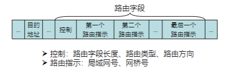

   - 网桥仅按帧中路由指示转发：接收帧后，提取下一个路由指示，转发到对应局域网，无需自主决策。

     > 路由生成又称 “路由探索（route discovery）”，是源站点主动查找并确定到目的站点通信路径的过程
     >
     > - 源站点：全路由广播帧 + 目标站点：非广播响应帧
     > - 源站点：单路由广播帧（沿生成树）+ 目标站点：全路由广播响应帧

---

### 二层交换机

“多端口网桥 + MAC 地址转发 + 隔离冲突域”

工作在 OSI 数据链路层，基于以太网帧的目的 MAC 地址寻址转发，本质是**多接口网桥**（硬件 ASIC 实现，比传统网桥更快）

替代集线器、隔离冲突域、提升带宽利用率，是局域网的核心接入与互联设备。

- **端口与双工**：多端口设计，每端口可接主机 / 交换机，支持全双工（同时收发，带宽翻倍）。

- MAC 地址学习与地址 - 端口表

  - 收到帧时提取源 MAC，绑定到入端口并写入地址表，超时自动删除，适配主机移动。
  - 转发决策：查地址表，命中则单端口转发；未命中则广播（泛洪），收到回应后更新表项。

  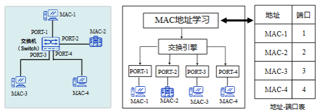

- **交换引擎**：硬件交换矩阵 / 总线，实现多端口并行转发，保障并发通信效率。

- **冲突域隔离**：每个端口是独立冲突域，消除带宽竞争；对比集线器所有端口共享 1 个冲突域、N 用户平均带宽 B/N，交换机每个用户独占端口带宽 B。

三类转发模式（延迟与可靠性的平衡）

| 转发模式 | 触发条件                       | 核心优点                           | 核心缺点                                            |
| -------- | ------------------------------ | ---------------------------------- | --------------------------------------------------- |
| 直通式   | 读取目的 MAC 即转发            | 延迟最小，速度最快                 | 无 CRC 校验，可能转发错误帧；没有缓存不支持速率适配 |
| 存储转发 | 收完帧并做 CRC 校验            | 过滤错误帧，支持多速率端口         | 延迟大（需缓存完整帧）                              |
| 无碎片   | 收到 64 字节（最小帧长）后转发 | 过滤冲突碎片，兼顾速度与基础可靠性 | 无 CRC 校验，无法完全避免错误帧                     |

链路层互连的核心优点

1. **即插即用**
2. **无冲突通信**：单播帧独占信道，无 CSMA/CD 冲突，提升吞吐。
3. **带宽独享**：端口专属带宽，无竞争，适配高带宽需求主机。
4. **多速率适配**

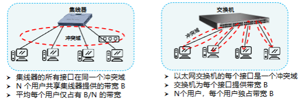

### 虚拟局域网(VLAN)

以太网交换机互连的网络本质是 “单广播域 + 多冲突域” 的架构，这会带来性能与安全问题，而虚拟局域网（VLAN）通过 “逻辑分组” 解决该问题

交换机的冲突域与广播域的区别

- **冲突域**：交换机每个接口是独立冲突域（主机通信无碰撞），这是交换机的核心优势；
- **广播域**：交换机互连的所有主机共享**同一个广播域**—— 当交换机收到未知目的 MAC 的帧时，会向所有接口广播该帧，网络中所有主机都能接收到，因此属于广播网络。

如果整个网络在同个广播域：大量广播报文转发影响网络性能，同时用户信息安全有风险

针对上述问题的解决方法:虚拟局域网(VLAN)

虚拟局域网（VLAN）是遵循 **IEEE 802.1Q** 标准的二层网络技术，核心是**打破物理位置限制，将局域网内的主机按逻辑需求划分为独立广播域**，解决传统交换机单广播域的性能与安全问题

从而缩小广播域；提升网络安全，简化网络管理，扩大网络规模

VLAN 的核心定义与本质

VLAN是由局域网网段构成的与物理位置无关的逻辑组，组内网段有共同特征和需求。

- **逻辑分组，非物理分组**：不依赖主机的物理接入位置，同一办公室的主机可分属不同 VLAN，不同楼层的主机也可划入同一 VLAN。
- **广播域隔离**：同一 VLAN 内的主机处于同一广播域，链路层可直接通信；不同 VLAN 的主机链路层相互隔离，需通过三层设备（路由器 / 三层交换机）才能通信。
- **帧标识唯一**：每个 VLAN 的帧都携带专属标识符（VLAN Tag），交换机通过该标识识别帧所属 VLAN，实现精准转发。

#### 虚拟局域网（VLAN）划分

交换机支持多种 VLAN 划分方式，核心分为**静态划分**和**动态划分**两类，适配不同网络场景：

| 划分方法                      | 核心逻辑                                                     | 技术层级                | 优点                                                         | 缺点                                                         | 典型场景                                                     |
| ----------------------------- | ------------------------------------------------------------ | ----------------------- | ------------------------------------------------------------ | ------------------------------------------------------------ | ------------------------------------------------------------ |
| **基于端口（静态划分）**      | 将交换机的物理端口与 VLAN 强制绑定，端口接入的主机自动归属对应 VLAN | 第一层（物理层）        | 配置最简单、最常用，转发效率高                               | 主机移动时需重新配置端口（如主机从端口 1 换到端口 2，需修改端口的 VLAN 绑定） | 拓扑稳定的场景（如企业部门固定工位、服务器集群）             |
| **基于 MAC 地址（动态划分）** | 按主机网卡的 MAC 地址划分 VLAN，交换机内置 “MAC 地址 - VLAN” 映射表 | 第二层（数据链路层）    | 支持主机自由移动，更换端口无需重新配置                       | 需录入大量 MAC 地址，管理维护成本高；主机更换网卡后需更新映射表 | 主机移动频繁的场景（如会议室移动终端、办公笔记本）           |
| **基于协议类型**              | 按以太网帧的 “类型” 字段划分（如区分 IP、IPX 协议帧）        | 第二层（数据链路层）    | 适配多协议共存的网络，自动识别协议类型归类                   | 协议类型单一的网络中无意义，灵活性有限                       | 传统多协议混合组网场景（如老旧企业网同时运行 IP 和 IPX）     |
| **基于 IP 子网**              | 按主机的 IP 子网地址划分（如 192.168.1.0/24 划入 VLAN 10，192.168.2.0/24 划入 VLAN 20） | 第三层（网络层）        | 与 IP 子网规划联动，适配网络分层设计，主机 IP 变更时可自动归类 | 依赖 IP 地址，对非 IP 协议不支持                             | 按业务网段划分的企业网、数据中心网络                         |
| **基于高层应用 / 服务**       | 按主机的应用类型或服务划分（如 FTP 服务划入 VLAN 10，Telnet 服务划入 VLAN 30） | 高层（传输层 / 应用层） | 灵活性最高，可精准匹配业务需求                               | 配置复杂，需识别应用特征，对交换机性能要求高                 | 对业务隔离性要求高的场景（如企业核心业务与普通办公业务隔离） |

#### 802.1Q 帧标签（VLAN Tag）

传统以太网帧无 VLAN 标识，交换机通过**插入 4 字节 VLAN Tag**实现 VLAN 识别，遵循 **IEEE 802.3ac** 标准

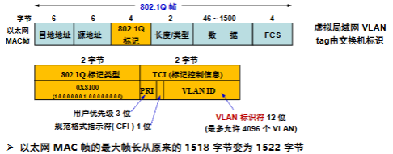

