# 网络层

网络层是计算机网络的核心层次，核心作用是实现任意两个网络节点间的端到端通信

## 网络层基本原理

网络层 核心使命是**让不同网络里的任意两个设备能通信**，数据包从源头（信源）送到目的地（信宿），实现 “端到端” 传递

网络层主要做 2 件事，还有 1 个必须满足的要求：

1. **交换**：建立临时连接，让数据有传输的路径
2. **路由**：在众多可能的路径中选 “最优解”

在原始数据包头部，加上**源地址**（谁发的）和**目的地址**（发给谁）。

这两个地址是 “逻辑地址”（比如 IP 地址），和数据链路层的 “物理地址”（比如 MAC 地址）不一样 —— 物理地址只能在同一个小网络里用（比如家里路由器和手机之间），逻辑地址才能跨网络定位（比如从家里定位到公司服务器）。

### 网络层的功能和服务

网络层的核心是解决 “跨网络通信” 问题，具体实现 6 大功能：

- 信源到信宿的传输：将多条物理链路整合为一条逻辑传输路径
- 逻辑寻址：在数据包头部添加源 / 目的 IP 地址，区分不同网络的节点
- **路由**：筛选从信源到信宿的最佳传输路径
- 地址转换：实现网络层 IP 地址与数据链路层物理地址的映射
- 复用与流量控制：同一物理线路承载多设备数据，调节发送速率避免拥塞
- 网络互连：通过专用设备连接不同类型的网络

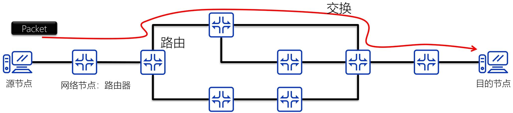

网络层的 2 种核心服务：面向连接 vs 无连接

1.  面向连接的服务（CONS）：

   - 核心逻辑：先建通道→再传数据→最后拆通道，三步缺一不可。

   - 所有数据包都走同一条 “虚电路”（专属通道），路由器要记住这条通道的状态（比如有没有被占用）。

   - 建连接→传数据→ 拆连接，所有 “数据” 都走同一条线路。

   - 数据包会按发送顺序到达，不会乱序。

   - ATM、帧中继、X.25（早期电信网络常用）

   - 优点：可靠，数据包开销小；缺点：不灵活，速度慢延迟大

     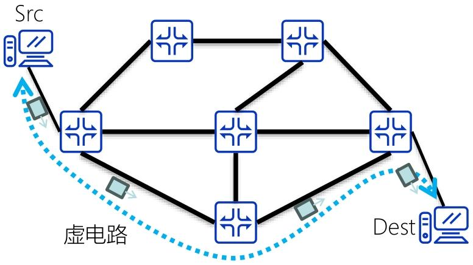

2. 无连接的服务（CLNS）：

   - 核心逻辑：不用提前打招呼，每个数据包都是 “独立个体”，自己找路去目的地。

   - 无需建连接，直接发数据包；每个包都带完整的源和目的地址，路由器单独为每个包选路。

   - IP 协议

   - 优点：速度快延迟小，灵活，效率高；缺点：不可靠，开销大

     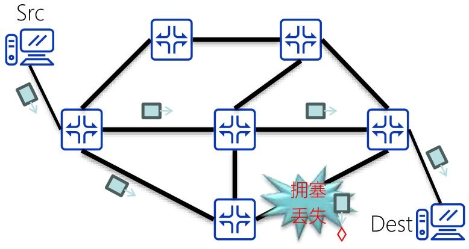

   

#### TCP/IP 体系为何选 “无连接服务”？

网络层（IP 层）只提供 “无连接、尽最大努力交付” 的服务；

网络层不提供端到端的可靠传输服务，网络中的设备不必维护和保存海量的连接状态

网络层只做 “最基础的跨网传输”，把 “可靠性、流量控制” 这些个性化需求交给上层（传输层），使得分层设计更合理

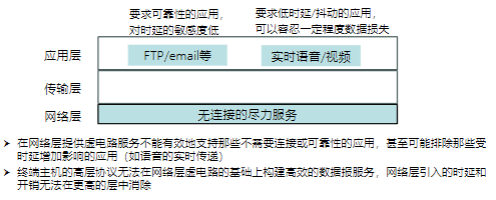

### 网络层互连

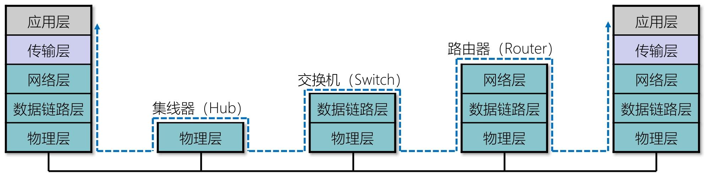

#### 路由器

**路由器**是网络层互连的核心，相当于不同网络之间的 “中转站”

- 从一个网络接口接收来自 A 网络的数据包，再根据目的地址，从另一个接口转发到其他目标网络
- 能为每个数据包 “**规划传输路径**”，不管目的网络在互连网络的哪个角落，都能精准转发
- 由硬件（比如接口卡、处理器）和软件（比如路由协议、操作系统）共同构成。

> [!tip]
>
> 路由器 vs 交换机：核心区别在 “**是否跨网**”
>
> - 交换机：工作在**数据链路层**，只管 “同一网络内” 的转发（比如家里的手机、电脑、平板都连在同一个路由器的 WiFi 下，它们之间的通信由交换机负责），靠 MAC 地址（物理地址）转发。
> - 路由器：工作在**网络层**，只管 “不同网络间” 的转发（比如家里的电脑要访问公司的服务器，数据从家庭网络到公司网络，必须经过路由器转发），靠 IP 地址（逻辑地址）转发。

特殊设备：**三层交换机和网关**

1. 三层交换机：“交换机 + 路由器” ，比如一般个人家庭中的“光猫”
   - 既懂数据链路层的 “交换”（同一网络内转发），又懂网络层的 “路由”（不同网络间转发）。
   - 基于 IP 地址（第三层地址）转发跨网业务流，同时保留交换机的高速转发能力，还能做报文过滤等特殊任务。
   - 比如企业内部有多个子网，需要高速**跨子网**通信时，用三层交换机比路由器更高效。
2. 网关：
   - 协议转换器，因为不同网络可能用不同协议（比如以太网和帧中继网），网关负责把一种协议的数据包转换成另一种协议，让它们能互通。
   - 通常是路由器里的一段软件，能工作在 OSI 所有层（从物理层到应用层），适配各种异构网络。
   - 比如企业内网（用私有 IP）要访问互联网（用公有 IP），网关就负责协议和地址的转换。

---

### 路由选择

路由选择的核心是**网络节点（比如路由器）给数据包选 “最优输出链路”**

- 用**数据报**（比如 IP 协议）：每个数据包都是 “独立个体”，节点要给每个到来的包单独选一次路
- 用**虚电路**（比如 ATM 协议）：先建一条 “专属通道”，只在建立时选一次路，后续所有数据包都按这条通道走

 正确性；简单性；坚定性； 稳定性； 公平性；最佳性

两种路由选择策略（“谁来算路线”）

- 选路的核心是 “谁收集信息、谁计算路线”
- 分布式策略：“群策群力”
  - 节点（路由器）都有自己的 “路由表”，并周期性地从周围**相邻的节点**收发网络状态信息
  - 整个网络的路由是动态变化的
  - 路由表按 “节点间距离” 调整，距离可以是链路数目、延迟时间、通信费用等
  - RIP 协议、OSPF 协议（企业内网常用）
- 集中式策略：“中央指挥”
  - 有一个 “网络控制中心（NCC）”。所有节点定期向 NCC 报告网络状态，由 NCC 统一收集信息、计算最优路由，再下发给各个节点
  - 优点：节点不用自己算路由，简单；能调控流量，容易消除网络环路（比如避免数据包绕圈）。
  - 缺点：NCC 附近通信量大（所有节点都要向它发状态）；NCC 一旦故障，整个网络瘫痪；不适合大规模网络（比如互联网）

#### 路由算法

不管是分布式还是集中式策略，最终都靠算法算 “最短路径”，核心有两种：

- “最短路径 = 最佳路径”，这里的 “短” 是广义的（费用最小、延迟最小，数据传输速率最大等）。

两种最常用的计算最短路径的方法：

1. 距离向量路由算法：节点只和邻居交流信息，靠 “距离” 更新路由表，简单但适合小规模网络。
2. 链路状态路由算法：节点向全网广播自己的 “链路状态”（比如和哪个节点相连、链路质量如何），全网节点都有完整的网络拓扑，再用 Dijkstra 算法算最优路径，适合大规模网络。

##### 距离向量路由算法

距离向量路由算法的核心是 **“路由器只跟相邻节点传递网络信息，靠分享‘到各个网络的距离 + 下一跳’，逐步摸清全网路由”**

1. **只跟邻居交流**：路由器不跟非相邻的设备通信，只把自己的路由信息发给直接相连的邻居

2. **只分享 “距离 + 下一跳”**：不传递完整网络拓扑，仅仅传递和目标网络的距离以及数据包下一步该交给哪个邻居路由器

3. **只保存全网路由表**：每个路由器最终会有一张包含所有目的网络的表，表项格式固定为 `NetID: Distance: NextHop`（目的网络：距离：下一跳）。

   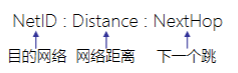

4. **定期同步**：不管网络状态变没变，都会按固定时间间隔（比如 30 秒）给邻居发路由信息，确保大家的路由表保持一致。

对于路由器来说：

路由器根本不知道整个网络的拓扑结构（比如谁和谁相连、有没有环路），它只知道 3 件事：

1. 自己直接连的网络（比如路由器 A 直接连 Net1、Net3、Net5，距离都是 1，下一跳写 “-” 表示不用经过其他路由器）；
2. 通过邻居告知的 “到其他目标网络的距离”；
3. 要去某个网络，该把数据包交给哪个邻居节点（下一跳）。

算法简单，适用于小规模网络；但是难以扩展规模，并且对于链路变化响应慢，路由报文开销大

距离矢量路由选择协议—以IP协议为例：

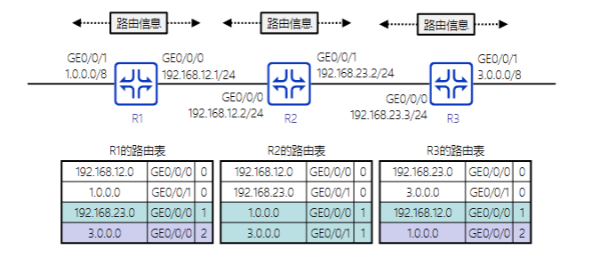

---

##### 链路状态路由算法

链路状态路由算法是网络层的核心路由机制之一，核心逻辑是 **“每个路由器向全网广播自己的邻居信息，最终所有路由器都拥有完整的网络拓扑，再独立计算最优路径”**，与距离向量算法的 “仅与邻居交流” 形成本质区别。

链路状态路由的核心是 **“信息全透明 + 分布式计算”**：

- **每个路由器只分享 “自己的邻居信息”**
- **信息扩散到全网**：通过 “扩散法” 将邻居信息发送给所有路由
- **独立计算最优路径**：每个路由器基于完整的拓扑数据库，用最短路径算法（如 Dijkstra 算法）计算到每个网络的最优路由。

共享信息在有规律的时间间隔内进行(一般30分钟)

链路状态路由分为 “共享拓扑信息” 和 “计算最优路径” 两步，流程如下：

1. 共享链路状态信息（全网同步拓扑）

   > [!note]
   >
   > 路由器将它自己和它的所有邻居之间的链
   > 路状态信息发送给互连网络中的所有其它路由器，从而让所有路由器获得**完全一致的网络拓扑**，核心操作是 “生成 LSP→扩散 LSP→构建链路状态数据库”。
   >
   > - 生成链路状态包（LSP）：每个路由器生成 “链路状态包（LSP）”，包含 4 个核心信息：
   >
   >   - **广告者 ID**：发送该 LSP 的路由器（如路由器 A）。
   >   - **目标网络 ID**：与广告者直接相连的网络（如 Net1）。
   >   - **费用**：广告者到该网络 / 邻居的链路开销（费用是 “加权值”，可综合带宽、延迟、安全级别等因素）。**仅计算路由器到网络的部分**
   >   - **邻居路由器 ID**：与广告者直接相连的路由器（如路由器 B）。
   >
   > - 扩散 LSP 到全网：路由器通过 “扩散法” 将 LSP 发送给所有路由器：
   >
   >   - 初始发送：路由器将 LSP 发送给直接邻居。
   >   - 转发规则：邻居收到 LSP 后，**标记 “已接收”**，再转发给除发送方外的所有邻居（避免重复转发）。
   >   - 最终结果：所有路由器都收到全网所有路由器的 LSP。
   >
   > - 构建链路状态数据库
   >
   >   每个路由器将收到的所有 LSP 汇总，形成 “链路状态数据库”—— 本质是**完整的网络拓扑图**（包含所有路由器、链路及对应费用）。
   >
   
2. 基于拓扑计算最优路径（Dijkstra 算法）

   每个路由器基于链路状态数据库，用**Dijkstra 算法（最短路径算法）** 独立计算到每个网络的最优路由。

   > [!important]
   >
   > - **点**：分为两类 ——`路由器`（如 A、B、C）和`目标网络`（如 Net1、Net2）。
   > - 弧（链路）：也分为两类
   >   - `路由器→网络`：链路有**有效费用**（如带宽、延迟等指标的加权值）；
   >   - `网络→路由器`：链路费用固定为`0`（仅计算 “路由器到网络” 的单向费用）
   >
   > 算法的核心是 **“从根路由器出发，逐步将‘费用最小的节点’加入‘永久最短路径树’，最终得到到所有网络的最优路由”**，共 4 步：
   >
   > 1. **初始化：确定根节点，标记永久 / 临时节点**
   >    - 选当前路由器（如 A）作为 “最短路径树的根节点”，标记为**永久性节点**（已确定最短路径）。
   >    - 所有其他网络 / 路由器初始为**临时性节点**，到根节点的费用设为`∞`（表示 “暂未知路径”）。
   > 2. **连接根节点的直接邻居，更新临时费用**
   >    - 根路由器（A）先连接自己**直接相连的网络**，记录这些网络的费用，标记为 “临时连接”。
   > 3. **选 “费用最小的临时节点”，标记为永久节点**
   >    - 比较所有临时节点的费用，选**费用最小的节点**，将其加入 “永久最短路径树”（标记为永久性节点）。
   > 4. **从新永久节点扩展，更新临时节点费用**
   >    - 考察刚加入的永久节点的**邻居路由器**（未标记为永久的路由器），计算 “根节点→新永久节点→邻居路由器” 的总费用。
   >    - 若总费用**小于**邻居路由器当前的临时费用，则更新其费用；否则保持原费用。
   >
   > 重复 “选最小费用临时节点→标记为永久→扩展邻居并更新费用” 的流程，直到所有目标网络都被标记为永久节点。最后**去掉所有非永久性的弧**，剩下的就是 “从根路由器到所有网络的最短路径树”。

   

### 拥塞控制与服务质量（QoS）X

#### QoS

QoS（Quality of Service，服务质量）是指**针对不同业务的差异化需求，为其提供端到端的、可预期的服务水平保证**—— 简单说就是 “给不同业务分优先级，让关键业务优先通行”。

网络流量分类与 QoS 优先级

根据业务需求，网络流量被划分为三类，对应不同的 QoS 保障策略：

| 业务类型                     | 核心需求       | 优先级 | 保障目标                                             |
| ---------------------------- | -------------- | ------ | ---------------------------------------------------- |
| 语音业务（如电话、视频通话） | 低时延、低抖动 | 高     | 时延 < 150ms，抖动 < 1ms，优先分配带宽和转发资源     |
| 交易业务（如支付、股票交易） | 低时延、高可靠 | 中     | 时延 < 4s / 页，保证传输成功率，避免数据丢失         |
| 文件传输（如下载、邮件）     | 尽力交付即可   | 低     | 时延 < 15s，网络资源充足时优先传输，资源紧张时可降级 |

#### 拥塞控制

拥塞控制是指**防止网络或网络局部区域出现过多数据包，避免网络性能下降**的全局性技术 —— 本质是 “给网络‘限流’，解决‘堵车’问题”。

拥塞控制的核心特点

- 全局性：涉及所有主机、路由器及网络链路，需要全网协同；
- 目标：避免 “数据包堆积→吞吐量下降→延迟激增” 的恶性循环；
- 关键逻辑：平衡 “网络资源供给” 与 “数据传输需求”，要么增加资源（如扩容带宽），要么降低负载（如限制发送速率）。

拥塞控制与流量控制的核心区别

很多人会混淆 “拥塞控制” 和 “流量控制”，二者本质不同，核心差异如下：

| 对比维度 | 拥塞控制                   | 流量控制                     |
| -------- | -------------------------- | ---------------------------- |
| 控制范围 | 全局性（整个网络）         | 点对点（发送端 - 接收端）    |
| 控制目标 | 防止网络整体拥塞           | 防止接收端被发送端 “淹没”    |
| 控制对象 | 所有主机、路由器的发送速率 | 单个发送端的发送速率         |
| 核心逻辑 | 避免网络资源耗尽           | 匹配发送端与接收端的处理能力 |

---

## IPv4 协议

IPv4 协议是 TCP/IP 体系的核心，其设计思路围绕 “网络层应提供何种服务” 的核心争议展开，最终形成了 “简单、灵活、尽最大努力交付” 的核心特征

### 可靠交付该由谁负责？

数据的 “可靠交付”（不丢失、不错误、按序到达）该由**网络层（路由器等网络设备）负责，还是端系统（主机）负责**？

IPv4 最终选择了 “网络层极简、端系统补位” 的设计，核心特点是**无连接、不可靠、尽最大努力交付**：

1. 无连接：发送数据包前无需建立连接，每个 IP 数据包都是 “独立个体”，与其前后的数据包无关（不编号、不关联）。
2. 不可靠：网络层不做任何可靠性承诺 —— 数据包可能出错、丢失、重复或失序到达，也不保证传输时限。
3. 尽最大努力：网络设备（如路由器）会尽力转发数据包，但不会因为数据包丢失、出错而重传或纠错。

降低网络设备复杂度，端系统灵活补位，适应多种应用，同时降低网络造价

### IPv4 协议的体系定位与配套协议

IPv4 是 TCP/IP 协议族的 “传输基石”，为所有上层协议提供跨网络的数据报传输服务 ——TCP、UDP、ICMP、IGMP 等协议的数据，都必须封装成 **IP 数据报格式**才能在网络中传输。

IPv4 无法单独完成通信，需依赖三个核心配套协议：

- ARP（地址解析协议）：将 IP 地址映射为数据链路层的 MAC 地址，解决 “跨网络路由后，本地链路如何定位目标设备” 的问题。
- ICMP（Internet 控制消息协议）：报告 IP 数据包传输中的错误（如目的不可达、超时），提供网络诊断能力（如 ping、tracert 工具的底层支撑）。
- IGMP（Internet 组管理协议）：管理 IP 多播组成员关系，让主机能加入或退出多播组，支撑 “单点发送、多点接收” 的通信场景（如视频直播）。

### IP 地址

IP 地址是网络层识别网络节点的唯一标识，相当于设备在互联网中的 “身份证”，核心作用是让路由器确定数据包的**传输目的地和转发接口**

1. **唯一标识**：网络中每个主机（如电脑、手机）或路由器的**每个接口**，都必须分配一个**唯一的 IP 地址**，确保跨网络通信时能精准定位。
2. 接口关联：
   - 主机通常有 1-2 个接口（如以太网接口、WiFi 接口），每个接口对应一个 IP 地址；
   - 路由器有多个接口（高端路由器可达几十个），每个接口连接不同网络，对应不同网段的 IP 地址。
3. **地址长度**：IPv4 地址为 32 位（4 个字节），地址空间约 40 亿个（2³²），但因分类设计和预留，实际可用地址远少于理论值。

为适配不同场景（配置、调试、底层传输），IP 地址有三种常用表示形式：

| 表示方法       | 格式说明                                                     | 示例（对应 129.16.6.31）            |
| -------------- | ------------------------------------------------------------ | ----------------------------------- |
| 二进制表示     | 32 位比特序列，每字节间可加空格分隔，用于底层数据传输        | 10000001 00001110 00000110 00011111 |
| 点分十进制表示 | 最常用，将 32 位拆分为 **4 个字节，每个字节用 0-255 的十进制数表示**，字节间用小数点分隔 | 129.16.6.31                         |
| 十六进制表示   | 每 4 位二进制对应 1 位十六进制，字节间用小数点分隔，用于部分网络调试场景 | 81.0E.06.1F                         |

#### IP 地址的分类（五类结构）

IP地址采用两级结构，分为**网络标识和主机标识**

32 位 IP 地址 = 网络号（标识所属网络） + 主机号（标识网络内唯一设备）

通过**首位二进制比特**和**网络号 / 主机号的固定长度**划分，共 5 类（A、B、C、D、E），前 3 类用于主机 / 网络通信，后 2 类为特殊用途。

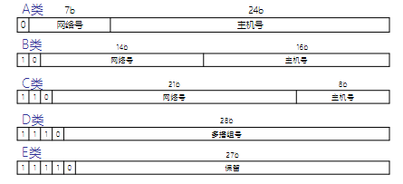

其中，网络号长度越大，可用网络数就越大，越适用于小型网络

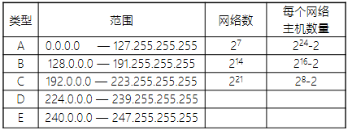

#### 特殊 IP 地址

5 类特殊 IP 地址不用于标识普通主机，而是承担 “路由兜底”“全网通知”“本机测试”“内网专用” 等特殊功能

1. **网络地址**

   - **主机号全为0**的地址
   - 网络IP地址不分配给任何主机，而是作为**网络本身的标识**，供路由器查找路由表用
   - 例：主机 202.198.151.136所在网段的网络地址为202.198.151.0

2. **32 位全 0** 地址（0.0.0.0）：“未知地址的收容所”

   - 不是真正的主机 IP 地址，而是 “所有不清楚的主机和目的网络” 的集合 ——“不清楚” 指本机路由表中没有对应条目，不知道该往哪转发。
   - **默认路由的 “兜底目标”**：所有无法匹配路由表的数据包（比如访问陌生网站），都会被转发到默认网关，由网关负责后续转发
   - **分配 IP 主机的 “临时源地址”**：主机刚启动、还没通过 DHCP 获取到 IP 地址时，发送 IP 报文（如 DHCP 请求）的源地址会填 0.0.0.0表示“我是待分配地址的主机”

3. 广播地址：“全网通知的喇叭”

   - 用于向某一网段内**所有主机**发送数据，分为直接广播和受限广播两类，核心区别是 “能否跨网转发”。

     | 类型         | 格式特征                     | 能否跨网         | 典型用途                   |
     | ------------ | ---------------------------- | ---------------- | -------------------------- |
     | 直接广播地址 | 网络号 + 全 1 主机号         | 能（路由器转发） | 跨网段通知、大规模网络广播 |
     | 受限广播地址 | 32 位全 1（255.255.255.255） | 不能（仅本网）   | 局域网设备发现、本地通知   |

4. 环回地址：“本机内部的测试通道”

   - 第一个字节为 127 的 IP 地址（如 127.0.0.1、127.1.2.3），对应的是主机的 “环回接口”—— 一个虚拟接口，**数据包不会流出本机**。
   - 常用于本机上**软件测试**和本机上网络应用程序之间的通信地址

5. 私有地址：“内网专用的‘内部身份证’”

   - 专门用于企业、家庭等内部网络的 IP 地址，**不对外网路由**，需通过 NAT 转换才能访问互联网。
     - A 类私有地址：10.0.0.0 ~ 10.255.255.255（整个 10 网段）。
     - B 类私有地址：172.16.0.0 ~ 172.31.255.255（172.16 到 172.31 共 16 个网段）。
     - C 类私有地址：192.168.0.0 ~ 192.168.255.255（192.168 开头的 256 个网段，家庭内网最常用）。
   - 节省公有IP地址，提升安全性

### IP 网络地址分配机制

IP 地址分配是保障互联网全局唯一性的核心机制，核心由 互联网名字和数字分配机构ICANN 主导的分层体系负责

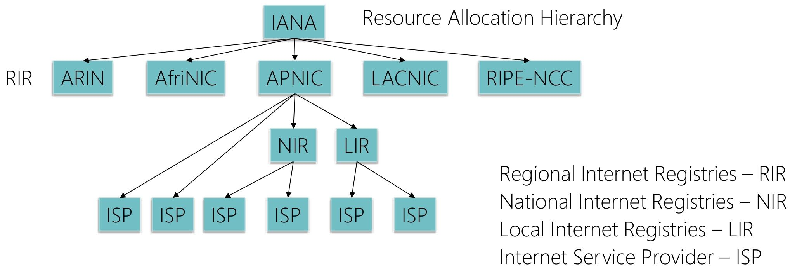

- 公有 IP 地址：全球唯一，由上述机构分层分配，不可重复使用。
- 私有 IP 地址：仅需内网唯一（如家庭网络的 192.168.1.x），无需全球分配，通过 NAT 转换访问互联网。

早期采用 “有类编址”（A、B、C、D、E 类），虽简单但存在明显缺陷，导致地址资源浪费和网络性能问题：

1. 地址利用率低：分类粒度固定，无法适配不同规模网络。
2. 路由表膨胀：转发效率下降。
3. 灵活性差：两级结构（网络号 + 主机号）无法根据实际需求调整网段大小

解决方案：划分子网：子网编址（三级地址结构）、子网掩码（识别子网的 “工具”）

**子网编址（三级地址结构）：**

IP地址看成由单纯的一个网络号和一个主机号组成，而是把主机号进一步划分为一个子网号和一个主机号

**IP地址 = 网络号 + 子网号 + 主机号**

不改变网络号，仅对同一网络内的地址进一步细分，让一个大网络变成多个独立的小子网。

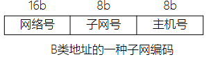

子网掩码（识别子网的 “工具”）

32 位二进制数，与 IP 地址一一对应，是 “网络号 + 子网号” 和 “主机号” 的 “分割线”。

- 比特值 = 1：对应 IP 地址中的 “网络号 + 子网号”（子网的网络标识部分）。
- 比特值 = 0：对应 IP 地址中的 “主机号”（子网内设备的唯一标识部分）。

仅凭 IP 地址无法判断是否划分子网，子网掩码能明确 “哪部分是子网、哪部分是主机”

（如 172.16.1.10，掩码 255.255.255.0 说明前 24 位是 “网络号 + 子网号”，后 8 位是主机号）。

- 子网的 “必备属性”：每个**子网都有唯一的子网掩码**，无掩码则无法识别子网范围
- 路由交换的 “必需信息”：
  - 路由器之间交换路由时，必须同步告知子网掩码
  - 路由表中每条条目都包含 “目的网络 + 子网掩码”
- 多子网设备的 “多掩码特性”：连接多个子网的路由器（如企业网关），每个接口对应一个子网的掩码

> [!important]
>
> IP 地址是设备的 “网络身份证”，子网掩码是 “子网划分工具”，二者结合可精准计算网络地址、广播地址、地址范围、主机数
>
> 1. 网络地址（子网标识），又称为子网地址，即主机号为0的地址
>    - IP 地址的二进制 & 子网掩码的二进制（按位与运算，1&1=1，1&0=0，0&0=0）。
> 2. 广播地址（子网内全局通知地址）
>    - 先通过子网掩码确定 “**主机号位数**”（掩码中 “0” 的个数，记为 n）；
>    - 将网络地址的二进制中，“主机号部分”（对应掩码 0 的位置）全置为 1，**转换为十进制**即为广播地址。
> 3.  地址范围（可分配给主机的 IP）
>    - 网络地址 + 1 至 广播地址 - 1（排除网络地址和广播地址）
> 4. 主机数量（子网最大接入设备数）
>    - 2ⁿ - 2（n = 主机号位数，即掩码中 “0” 的个数；减 2 是排除网络地址和广播地址）。

对于网络中IP地址使用示例：

1. 路由器多接口：连接不同网络，对应不同网段 IP
   - 路由器至少有 2 个接口，每个接口连接一个独立网络，且配置对应网段的 IP 地址（一个接口 = 一个网段的 “网关”）
2. 路由器互连端口：30 位掩码（/30），减少地址浪费
3. 局域网内地址：同一网段，主机号自行分配

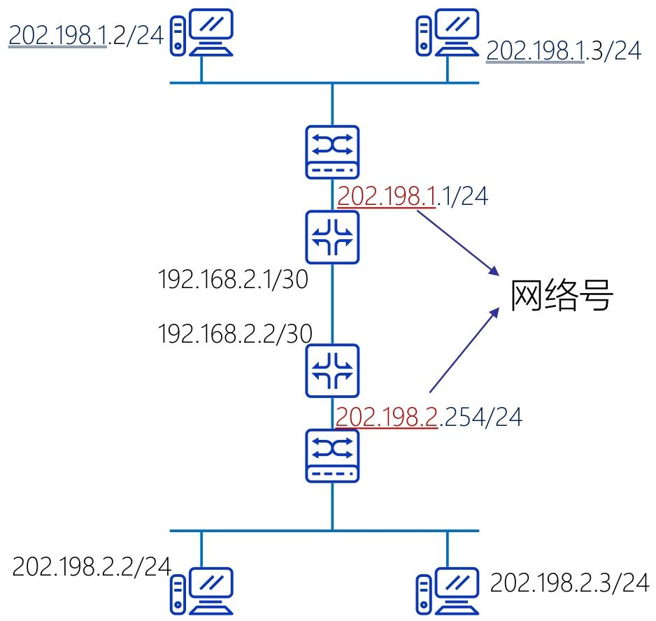

### 无分类编址 CIDR

CIDR（无类别域间路由）是解决 IPv4 编址缺陷的关键技术，核心是 “打破地址分类、聚合路由表项”，既缓解 IP 地址浪费，又解决路由表爆炸问题

通过把多个地址块组合到一个路由表项，组成一个**CDIR地址块**，来减少路由表的表项数量，从而减少由核心路由器承载的路由选择信息的数量

打破传统 A、B、C 类地址分类，将 IP 地址重新定义为 “无分类的两级结构”：

- **32 位 IP 地址 = 网络前缀（n 位） + 主机号（32-n 位）**
- 网络前缀：替代分类地址的 “网络号 + 子网号”，长度可灵活调整（1~30 位）。
- 主机号：剩余位数，用于标识前缀内的设备。

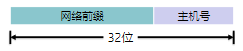

> [!tip]
>
> **斜线记法**（CIDR 记法）
>
> - 格式：`IP地址/网络前缀长度`（如 88.166.0.1/19、128.123.1.8/28）。
> - 含义：斜线后数字表示 “网络前缀的位数”，即子网掩码中 “1” 的连续个数。
> - 示例：128.123.1.8/28 → 网络前缀 28 位，主机号 4 位；对应的子网掩码为 255.255.255.240（前 28 位为 1，后 4 位为 0）。
>
> **低位连续 0 省略**：若 IP 地址低位为连续 0，可省略不写。例如 10.0.0.0/10 可简写为 10/10（隐含低位全 0）。
>
> **星号 \* 占位**：用 “网络前缀 + * ” 表示主机号可任意取值。

CIDR 掩码

- 本质：与子网掩码功能一致，均用于区分网络前缀和主机号，但无需遵循 “分类掩码规则”（如可出现 255.255.240.0/20 这类非标准分类掩码）。
- 计算方式：网络前缀位数 n → 掩码前 n 位为 1，后 32-n 位为 0，转换为点分十进制即可。

CIDR 把**网络前缀都相同**的**连续**的 IP 地址组成“CIDR 地址块”

#### CIDR 地址块

网络前缀相同的连续 IP 地址集合，由 “起始地址 + 前缀长度” 唯一确定。

以 128.14.32.0/20 为例

1. **地址总数**：2^ 主机号位数 = 2^(32-20) = 4096 个（主机号 12 位）。
2. **起始地址（最小地址/网络地址）**：网络前缀对应的 IP（主机号全 0）→ 128.14.32.0。
3. **结束地址（最大地址/广播地址）**：主机号全 1 的 IP → 128.14.47.255（32+15=47，15 为 12 位主机号的前 4 位最大值）。
4. **可用地址**：总数 - 2（排除全 0 网络地址和全 1 广播地址）→ 4094 个。

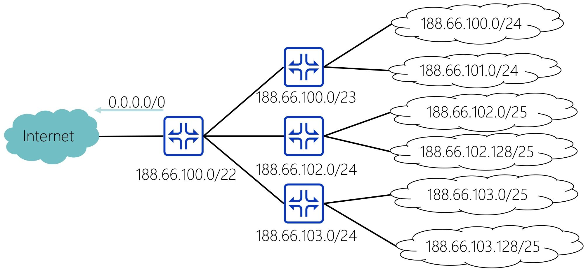

#### 路由聚合（构成超网）

无分类两级编址的最大优势是支持 “路由聚合”（也称构成超网），将多个连续子网的路由表项合并为一条 CIDR 路由，大幅减少路由表规模：

- 待聚合的子网需满足 “网络前缀连续且相同位数足够长”，且地址块数量为 2 的整数次幂（如 2 个、4 个、8 个 C 类地址）。
- 172.16.1.0/24、172.16.2.0/24、172.16.3.0/24（3 个连续子网）。前 16 位网络前缀相同（172.16），可聚合为 172.16.0.0/16（前缀 16 位）。从而路由表项从 3 条缩减为 1 条

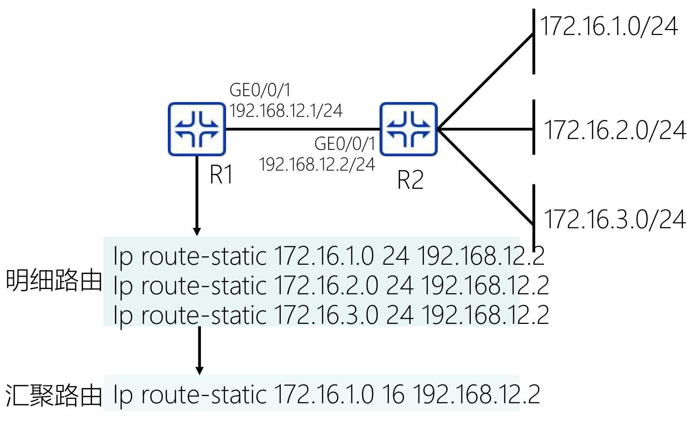

构成超网（特殊的路由聚合）

当聚合的地址块为**连续 C 类地址**时，称为 “构成超网”，是 CIDR 的典型应用：

- **规则**：前缀长度≤23 位的 CIDR 地址块必包含多个 C 类地址（C 类默认前缀 24 位）。
- **示例**：192.24.0.0/13（前缀 13 位）→ 包含 8 个连续 C 类地址（192.24.0.0~192.31.255.0），掩码 255.248.0.0，适配 4000 台设备的中型网络。

网络前缀越短，其地址块所包含的地址数就越多。而在三级结构的IP地址中，划分子网是使网络前缀变长

### 主机 IP 地址配置

给主机配置 IP 地址是网络通信的基础，需完成 IP 地址、子网掩码、默认网关、DNS 地址等核心参数配置，主要分为**静态配置**和**动态配置（DHCP）** 两种方式

无论哪种配置方式，主机需完成以下参数设置（缺一不可）：

1. **IP 地址**：主机在网络中的唯一标识（如 192.168.1.100）。
2. **子网掩码**：区分 IP 地址的网络前缀和主机号（如 255.255.255.0）。
3. **默认网关**：跨网段通信时的 “转发入口”（通常是路由器接口 IP，如 192.168.1.1）。
4. **DNS 地址**：解析域名（如[www.baidu.com](https://www.baidu.com/)）为 IP 地址的服务器（如 223.5.5.5、8.8.8.8）。
5. **其他参数**：部分场景需配置 MTU、静态路由等，按需设置即可。

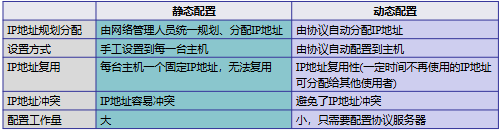

#### DHCP（动态主机配置协议）

DHCP（Dynamic Host Configuration Protocol）是基于 **客户端 / 服务器（C/S）架构** 的网络管理协议，核心作用是**集中、自动化地为网络主机分配 IP 地址及配套参数**，解决了手动配置 IP 的低效与易出错问题，对应 RFC 2131 标准。

一台计算机和另一台计算机的区别，都可通过一些不同的参数来体现。

但在协议软件运行之前，必须给每一个参数赋值（协议配置）：

对于使用TCP/IP的主机需要配置的项目：IP 地址；；子网掩码；默认路由器的 IP 地址；域名服务器的 IP 地址

DHCP 的核心优点（集中化 + 自动化）

- **集中监控与分配 IP**： DHCP 服务器上规划地址池、子网掩码、网关、DNS 等参数，即可统一管理全网主机的 IP 分配
- **支持主机移动性**：主机从一个网段移动到另一个网段，自动向新网段的 DHCP 服务器（或通过中继）请求新的 IP 地址
- **降低配置错误率，提升部署效率**
- **多网段统一管理**：一台 DHCP 服务器可同时管理多个网段的 IP 配置。

##### DHCP 的基础工作架构（局域网场景）

DHCP 基于 **C/S 模式** 运行，使用 **UDP 协议** 传输报文，端口分工明确，且局域网内通信依赖广播：

- **DHCP 客户端**：需要获取 IP 的主机（如电脑、手机、打印机），主动发起地址请求。
- **DHCP 服务器**：存储 IP 地址池和配置参数，接收客户端请求并分配 IP。

同时定义传输层端口

- 客户端发送请求报文 → 目标端口为 **UDP 67**（服务器监听端口）。
- 服务器发送应答报文 → 目标端口为 **UDP 68**（客户端监听端口）。

注意，客户端刚启动时无 IP 地址，会发送 **DHCP DISCOVER（发现报文）**，该报文以**广播形式**发送（目的 IP 为 255.255.255.255）。同时**只有与客户端同网段的 DHCP 服务器能收到此广播报文**，进而回应地址分配信息。

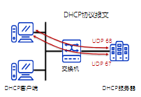

##### DHCP 跨网段工作机制（依赖 DHCP 中继）

若 DHCP 客户端和服务器不在同一个网段，直接广播的 DHCP DISCOVER 报文会被路由器拦截（路由器默认不转发广播包），此时必须部署 **DHCP 中继** 实现跨网段通信，核心逻辑是 “中继转发，双向伪装”：

中继设备（通常是路由器或三层交换机）相当于客户端与服务器之间的 “中间人”，实现广播报文与单播报文的转换。

- 在DHCP客户端看来，DHCP中继就像DHCP服务器，DHCP 中继收到主机发送的发现报文后，以单播方式向 DHCP服务器转发此报文
- 在DHCP服务器看来，DHCP中继就像DHCP客户端，DHCP 中继收到服务器回复的报文后，将此报文发回给主机

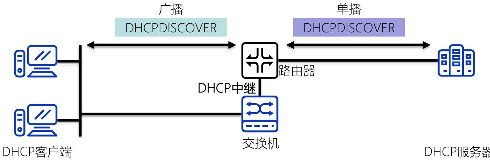

##### DHCP 的三种 IP 地址分配机制

DHCP 支持三种灵活的地址分配方式：

1. **自动分配（永久分配）**
   - DHCP 服务器为客户端分配一个**永久有效的 IP 地址**，一旦分配，该 IP 与客户端硬件地址（MAC）绑定，不会被回收。
2. **动态分配（临时分配，最常用）**
   - 服务器为客户端分配一个**有租赁期的临时 IP 地址**。租期到期前，客户端需向服务器续租；若未续租，服务器会回收该 IP，重新放入地址池供其他主机使用。
3. **人工分配（管理员指定）**
   - IP 地址由管理员手动指定，DHCP 服务器仅负责**将指定的 IP 地址及配套参数（掩码、网关）传达给客户端**，不参与地址选择。

##### DHCP报文

DHCP 报文基于 UDP 传输，**客户端端口为 68，服务器端口为 67**，报文格式固定

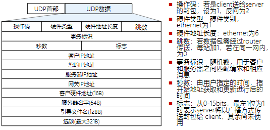

#####  DHCP 完整工作流程

DHCP 的核心是**临时分配 IP 地址**，整个生命周期分为**IP 地址分配（4 步握手）、租期续租、地址释放**三个环节

对于请求IP地址（首次 IP 地址分配）

1. **发现阶段（DISCOVER）：客户端找服务器**
   - 客户端无 IP，以**广播方式**发送`DHCP DISCOVER`报文（目的 IP=255.255.255.255）。
   - 报文字段关键配置：操作码 = 1，客户 IP=0.0.0.0，标志位最高位 = 1（要求服务器广播应答），携带客户端 MAC 地址和请求的参数列表（如掩码、DNS）。
   - 同一网段的所有 DHCP 服务器都会收到该报文。
2. **提供阶段（OFFER）：服务器发 offer**
   - 服务器收到 DISCOVER 后，从对应网段的地址池中选一个空闲 IP，封装到`DHCP OFFER`报文。
   - 报文字段关键配置：操作码 = 2，您的 IP 地址 = 分配的空闲 IP，填充子网掩码、网关、DNS 等参数。
   - 服务器以**广播方式**发送报文（因为客户端无 IP），客户端可能收到多个服务器的 OFFER。
3. **选择阶段（REQUEST）：客户端选服务器**
   - 客户端只接收**第一个收到的 OFFER**，然后以**广播方式**发送`DHCP REQUEST`报文。
   - 报文字段关键配置：携带选中的服务器标识符、请求分配的 IP 地址。
   - 作用：通知所有 DHCP 服务器 —— 客户端已选定某台服务器的 IP，其他服务器可回收已分配的 IP。
4. **确认阶段（ACK）：服务器最终确认**
   - 被选中的服务器收到 REQUEST 后，发送`DHCP ACK`报文（操作码 = 2），确认将该 IP 分配给客户端。
   - 客户端收到 ACK 后，**正式使用该 IP 地址**，完成首次分配。

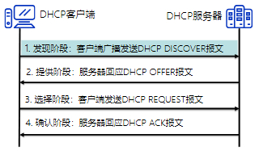

而对于租期续租有T1 和 T2 两个关键时间点

1. **T1（租期 50%）：单播续租**
   - 客户端以**单播方式**向原服务器发送`DHCP REQUEST`报文，请求续租。
   - 若收到`DHCP ACK`：续租成功，租期重新从 0 开始计算。
   - 若收到`DHCP NACK`：续租失败，客户端需重新发送 DISCOVER 请求新 IP。
2. **T2（租期 87.5%）：广播续租**
   - 若 T1 续租未收到应答，客户端在租期 87.5% 时，以**广播方式**发送`DHCP REQUEST`报文。
   - 若收到 ACK：续租成功；若收到 NACK 或无应答：租期到期后客户端释放 IP，重新请求新 IP。

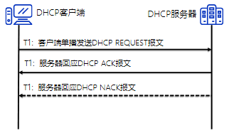

对于地址释放：主动归还 IP

- 客户端在租期到期前，若需断开网络（如关机、换网段），会主动发送`DHCP RELEASE`报文（操作码 = 1）给服务器。
- 服务器收到后，**释放该 IP 的租期**，将其标记为空闲，可重新分配给其他客户端；同时保留客户端的配置信息，便于后续快速分配。

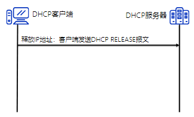

> [!tip]
>
> 1. **数据包丢失 / 重复的处理**：客户端未收到 OFFER/ACK 时，会重传 DISCOVER/REQUEST 报文；服务器通过事务标识识别重复请求，避免重复分配 IP。
> 2. **服务器地址高速缓存**：客户端首次分配成功后，缓存服务器 IP，后续续租直接单播请求，无需广播，减少网络开销。
> 3. **避免大量请求阻塞**：服务器采用地址池分段分配、限制单客户端请求频率等方式

### 网络地址转换（NAT）

网络地址转换（NAT）是缓解 IPv4 公网地址枯竭的核心过渡技术，核心逻辑是**将内网私有 IP 地址与外网公有 IP 地址进行映射转换**，实现多台内网主机共用少量公网 IP 访问互联网，同时还能提升内网安全性。

路由器或防火墙等网络设备，对 IP 数据报文头部的**源 / 目的 IP 地址**（必要时包含端口号）进行修改，实现内网私有 IP 与外网公有 IP 的双向映射。

明确了 3 种主流 NAT 实现方式，分别适配不同的网络场景，核心区别在于**是否转换端口号**以及**映射关系的类型**。

1. 基本 NAT（Basic NAT）：一对一 IP 映射

   - **仅转换 IP 地址，不处理 TCP/UDP 端口号**，属于 “私有 IP→公有 IP” 的一对一映射。
   - 一个公网 IP 地址只能分配给一个内网主机使用，**无法实现地址复用**。

   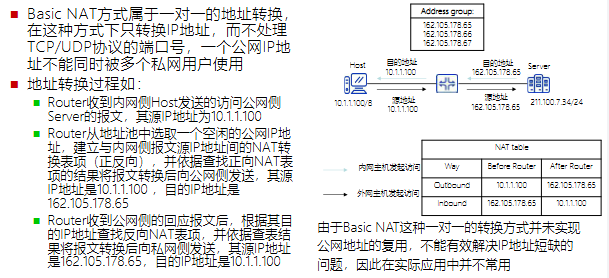

2. 网络地址端口转换（NAPT）：多对一 IP + 端口映射

   - “端口地址转换（PAT）”，核心是**同时转换 IP 地址和端口号**，实现 “多个内网主机→1 个公网 IP” 的多对一映射。
   - 以 **“私有 IP + 端口号”** 作为内网主机的唯一标识，映射到 **“公有 IP + 端口号”**。
   - 一个公网 IP 可通过不同端口号，同时为成百上千台内网主机提供外网访问服务，**最大化复用公网 IP**。

   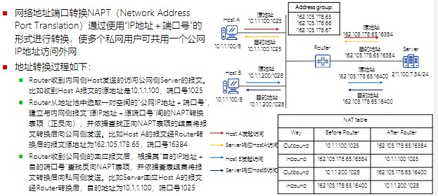

3. NAT 服务器（NAT Server）：外网访问内网服务的映射

   - 普通 NAT 和 NAPT 都是**内网主动访问外网**，而 NAT Server 的作用是**让外网主机主动访问内网服务器**（如内网 Web 服务器、FTP 服务器），本质是 **“公有 IP + 端口号→私有 IP + 端口号” 的静态映射 **。
   - 映射关系是**静态配置**的，由管理员手动在 NAT 路由器上设置，不会动态变化。

   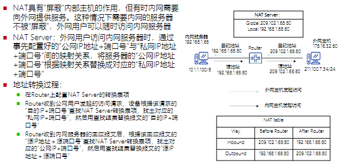

- 节省公网IP，内网安全隔离，网络互通
- 但是不支持部分协议，破坏端到端通信，需维护大量映射表项

### IPv4 报文格式

IPv4 报文是 TCP/IP 协议栈网络层的核心数据单元，用于在不同网络之间传输数据。其格式为**固定首部（20 字节，无选项） + 可选字段（0~40 字节） + 数据部分**，总长度最大为 65535 字节。

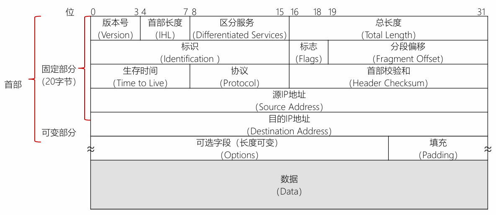

- 版本号（Version）：4 比特；固定为`4`，表示该报文遵循 IPv4 协议标准。区分 IPv4 和 IPv6（IPv6 版本号为 6）。

- 报头长度（Internet Header Length, IHL）：4 比特；表示 IP 首部占**32 位（4 字节）的数量**，而非直接的字节数。

  - 无可选字段时，首部为 20 字节 → 20 ÷ 4 = 5 → 该字段值为`5`。
  - 包含可选字段时，最大值为 60 字节 → 60 ÷ 4 = 15 → 该字段取值范围为`5~15`。

-  区分服务（Differentiated Services, DS）：8 比特,

  - 前 6 比特：**区分服务码点（DSCP）**，标记数据报的服务类别（如高优先级、低延迟、高吞吐量），用于 QoS（服务质量）管控。
  - 后 2 比特：**显示拥塞通知（ECN）**，用于网络拥塞预警，避免丢包（仅在双方设备都支持时生效）。

- 总长度（Total Length）：16 比特；表示整个 IPv4 数据报的长度，单位为**字节**，包含 “IP 首部 + 数据部分”

  - 当数据报超过链路的**最大传输单元（MTU）** 时，需分片传输。**分片后的每个报文，该字段表示分片自身的长度，而非原数据报长度**。

- 标识（Identification）：16 比特；唯一标识源主机发送的**每一个原始数据报**。

  - 源主机每发送一个新数据报，该值自动加 1；同一数据报的**所有分片，标识值相同**。

- 标志（Flags）：3 比特中，第 1 比特未使用（固定为 0），第 2、3 比特分别为`DF`和`MF`。

  - DF位：=1禁止分片，=0允许
  - MF位：=1非最后分片，=0为最后分片

- 偏移量（Fragment Offset）：13 比特；表示该分片在**原始数据报中的相对位置**，单位为**8 字节**。

  - 偏移量 = （该分片数据部分的起始字节数） ÷ 8
  - 要求：每个分片的数据部分长度必须是 8 的整数倍（保证偏移量为整数）。

- 生存时间（Time To Live, TTL）：8 比特；限制数据报在互联网中的**最大转发次数**（即经过的路由器数量）。

  - 源主机设置初始值，常见为 32、64、128。
  - 数据报每经过一个路由器，TTL 值减 1。
  - 当 TTL 值减为 0 时，路由器**丢弃该报文**，并向源主机发送 ICMP “超时” 报文。

- 协议（Protocol）：8 比特；标识 IP 数据报**携带的数据属于哪一个上层协议**（传输层或其他层）

- 报头检查和（Header Checksum）：16 比特；仅对**IP 首部**计算，**不包含数据部分**（数据部分的校验由上层协议负责，如 TCP 的校验和）。

  > - 算法：16 位反码求和(进位循环加)
  >
  >   1. 发送端
  >      - 将检查和字段置为 0；
  >      - 将 IP 首部按 16 比特分组，逐组进行反码求和；
  >      - 将求和结果的反码，填入检查和字段。
  >   2. 接收端
  >      - 将 IP 首部按 16 比特分组，逐组进行反码求和（**包含检查和字段**）；
  >      - 若求和结果为全 1（反码表示为 0），则首部无差错；否则判定为差错，丢弃该报文（不发送差错报文，由上层协议发现丢包并重传）。
  >
  >   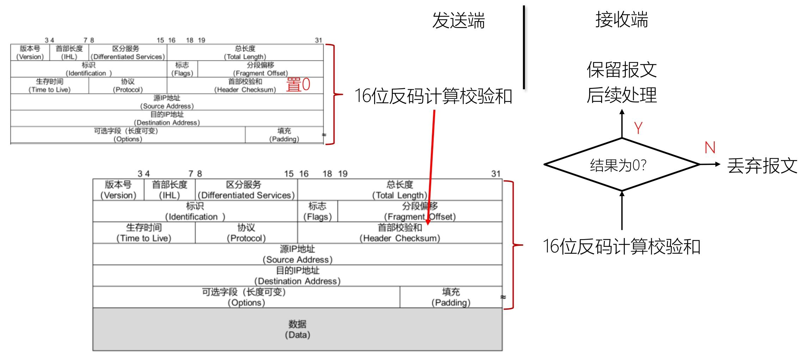

-  源 IP 地址 & 目的 IP 地址：各 32 比特

  - 源 IP 地址：标识发送数据报的主机 / 设备；
  - 目的 IP 地址：标识接收数据报的主机 / 设备。

- 可选字段（Options）：0~40 字节

- 填充（Padding）：0~3 字节；保证 IP 首部长度是 32 位（4 字节）的整数倍（满足 “报头长度” 字段的要求）。

---

### IP路由选择

IP 路由选择是网络层的核心功能，本质是 “为 IP 数据包选择最优传输路径”，核心依赖路由表、最长前缀匹配机制，以及直接 / 间接两种交付方式

> [!tip]
>
> 主机与路由器的路由逻辑差异
>
> 1. 主机的路由选择极简单：若目的主机与自身在同一共享网络（如以太网），直接交付数据包；
> 2. 否则，统一将数据包发往**默认路由器（网关）**，由路由器负责后续转发。

路由表是路由选择的 “决策依据”，每条条目包含 3 个关键信息：

- **目的 IP 地址**（路由前缀，如 192.168.1.0/24）；
- **下一跳路由器 IP 地址**（或 “Direct” 表示直接相连）；
- **出接口**（数据包需从路由器的哪个物理接口转发）。

默认路由（如 0.0.0.0/0）是 “兜底路由”，适用于网络对外连接少的场景：

- 当路由表中无匹配目的网络的条目时，数据包自动按默认路由转发；
- 典型应用：小网络仅通过一个路由器接入互联网，所有外网访问请求都走默认路由。

#### IP 交付

IP 数据包的最终交付分为 “直接交付” 和 “间接交付”，核心区别是是否需要路由器转发：

1. 直接交付

   - 源主机与目的主机在**同一网络**（如同一局域网）。
   - 无需路由器参与，源主机直接将数据包发送到目的主机（通过**数据链路层 MAC 地址寻址**）。
   - 示例：同一办公室的两台电脑（192.168.1.2 和 192.168.1.3）通信，直接交付数据包。

   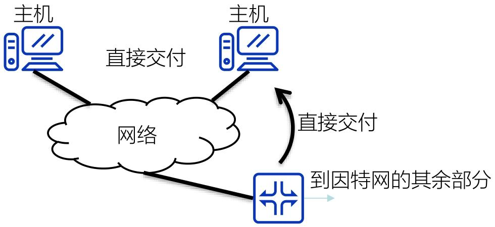

2. 间接交付（转发）

   - 源主机与目的主机在**不同网络**。
   - 数据包需经过一个或多个路由器**转发**，每台路由器通过路由表选择下一跳，直到数据包到达目的网络的路由器，再通过直接交付发送给目的主机。
   - 示例：家庭电脑（192.168.1.10）访问互联网服务器（203.0.113.5），需经家庭路由器→运营商路由器→目标网络路由器，最终直接交付给服务器。

   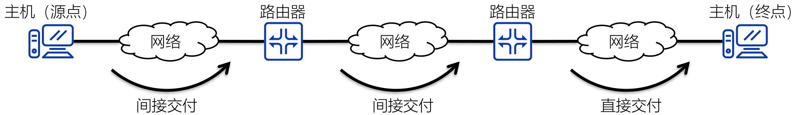

#### IP 转发

IP 转发的本质是**路由器根据路由表，将收到的 IP 分组从合适接口转发至目的网络或下一跳路由器**，核心依赖路由表和最长前缀匹配（LPM）机制

路由器的主要功能是 “**转发分组**”，内存中持续维护路由表。

- 收到分组后，提取**目的 IP 地址**作为检索关键词，查询路由表后，将分组从**指定接口**转发出去，实现跨网络通信。
- 路由器转发分组需经过 “校验→查表→转发” 三步
  1. **收到报文并合法性检查**：校验分组首部，同时丢弃非法分组
  2. **目的 IP 查表（最长前缀匹配）**：若分组合法，提取目的 IP 地址，与路由表中所有路由前缀进行**逐位二进制比对**，选择**匹配位数最长的条目**
  3. 命中则转发，查表未命中则无默认路由则报告转发错误，有默认路由则按默认路由转发。

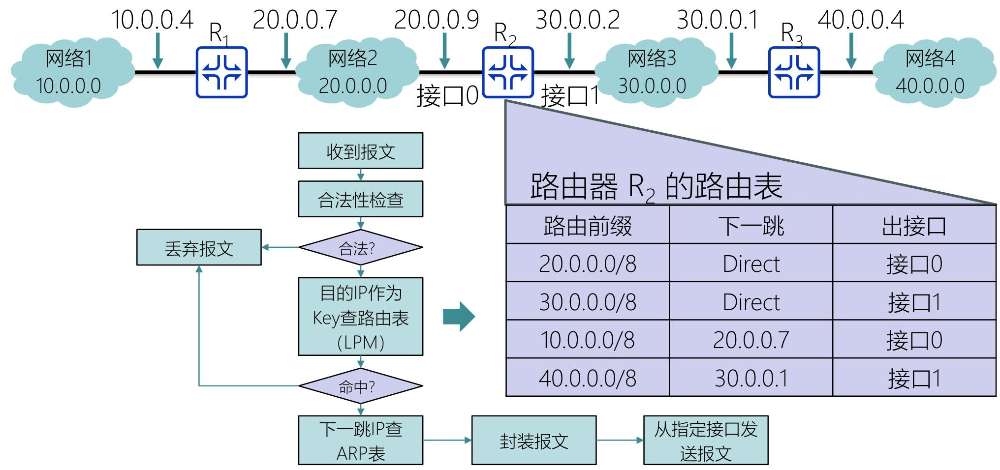

> [!important]
>
> 最长前缀匹配（LPM）
>
> - 网络前缀越长，地址块范围越小，路由越具体，优先级越高；
>
> - 路由器将目的 IP 与所有路由前缀逐位比对，直到找到 “匹配位数最长” 的条目，确保分组走最精准的路径。
>
>   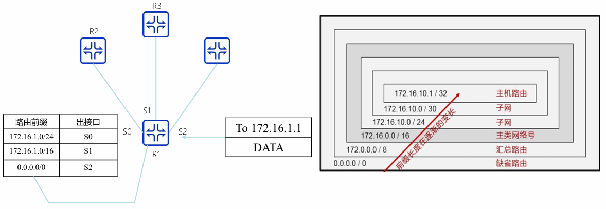

路由器转发分组的 6 步算法

1. 从分组首部提取目的 IP 地址 D，推导对应的目的网络地址 N；
2. 若网络 N 与路由器直接相连，直接交付给目的主机 D；否则执行下一步（间接交付）；
3. 若路由表有目的地址为 D 的 “特定主机路由”（如 192.168.2.2/32），转发至表中指定下一跳；否则执行下一步；
4. 若路由表有到达网络 N 的路由，转发至对应的下一跳；否则执行下一步；
5. 若路由表有默认路由（0.0.0.0/0），转发至默认路由器；否则执行下一步；
6. 报告转发错误，向源主机返回 ICMP 差错报文。

---

### ARP地址解析协议

ARP（Address Resolution Protocol）的核心功能是**将网络层的 IP 地址映射为数据链路层的硬件地址（如以太网 MAC 地址）**

解决局域网内通信时 “知道 IP 但不知道物理地址” 的问题，是 TCP/IP 协议栈中**网络层与数据链路层的关键衔接协议**。

IP 协议负责跨网络的逻辑寻址（用 IP 地址），但局域网内实际传输的是 “数据帧”，数据帧的首部需要目的主机的 MAC 地址（物理地址）才能准确送达。

所以需要通过地址解析协议ARP即用于实现将**IP地址解析为MAC地址**

#### ARP 协议的核心工作原理

- ARP 请求：源设备以**广播方式**发送 ARP 请求报文，询问 “目标 IP 对应的 MAC 地址是什么”，同一网段内所有设备都会接收该请求。
- ARP 应答：只有 IP 地址与请求中 “目标 IP” 一致的设备，会以**单播方式**返回 ARP 应答报文，告知自身的 MAC 地址。
- 缓存存储：源设备收到应答后，将 “IP 地址→MAC 地址” 的映射关系存入 ARP 高速缓存，后续通信可直接查询缓存，无需重复解析。

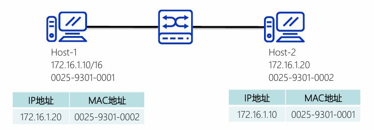

#### ARP封装与报文格式

以太网帧首部（目的 MAC + 源 MAC + 类型 0x0806）→ ARP 报文 → 帧尾 CRC 校验，其中 “类型字段 0x0806” 用于标识该帧承载的是 ARP 报文。

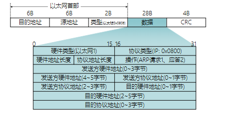

#### ARP 高速缓存

类似于处理器上的Cache，但是ARP高速缓存存储最近解析的 “IP→MAC” 映射关系，避免每次通信都发送 ARP 请求，减少网络开销，提升通信效率。

其中缓存表项类型又分为动态和静态

- 动态 ARP 表项：由 **ARP 协议自动生成和维护**，有过期时间（通常 10-20 分钟），过期后自动删除；可被新的 ARP 报文更新，或被静态表项覆盖。
- 静态 ARP 表项：由**管理员手工配置**（如通过命令绑定），无过期时间，不会被动态表项覆盖，适用于需要固定映射的场景（如服务器、网关）。

主机的ARP缓存表是可以查询的，也可以添加、修改

#### ARP 工作流程

ARP 的核心工作流程是 “查询缓存→广播请求→单播应答→缓存更新→数据发送”，全程围绕 “IP 地址→MAC 地址” 的映射展开

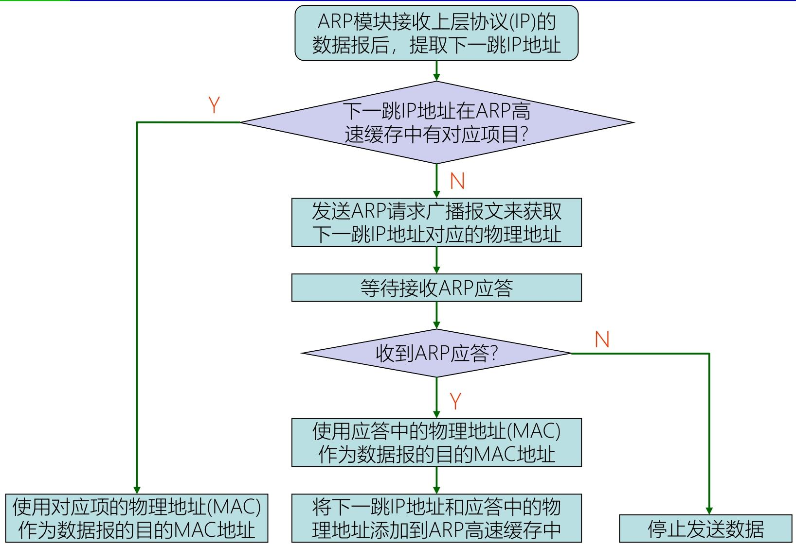

> [!tip]
>
> ARP 协议的**四种典型应用场景**
>
> 1. 主机→本网络主机：ARP 解析目的主机的 MAC 地址，直接发送数据帧；
> 2. 主机→其他网络主机：ARP 解析本网络路由器接口的 MAC 地址，将数据帧发送给路由器，由路由器转发；
> 3. 路由器→本网络主机：路由器转发数据时，ARP 解析目的主机的 MAC 地址，直接交付；
> 4. 路由器→其他网络主机：路由器 ARP 解析本网络下一跳路由器接口的 MAC 地址，转发数据帧给下一跳。

### ICMP 协议（Internet 控制消息协议）

ICMP 是 IP 层的核心辅助协议，核心作用是**报告 IP 数据包传输中的差错、提供网络诊断信息**，弥补 IP 协议 “尽力而为、无差错控制” 的缺陷，确保网络通信的可感知性和可调试性

ICMP 报文封装在 IP 数据报中传输，自身不保证可靠交付；同时被IP协议层、传输层协议（TCP或UDP）和用户进程使用

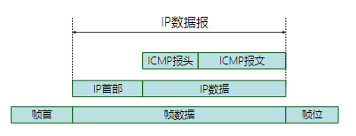

ICMP 报文由 “报头 + 数据” 组成，核心字段简洁明确：

- 类型：占8位，有15个不同的值：用来描述特定类型的ICMP报文（如 0 = 回显应答、3 = 目的不可达、8 = 请求回显）
- 代码：占8位：进一步描述某类型的ICMP报文的不同功能（如类型 3 “目的不可达”，代码 0 = 网络不可达、1 = 主机不可达）
- 检验和：占16位：覆盖整个ICMP报文，包括头部和数据

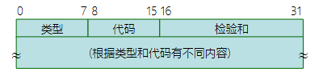

ICMP协议有两种报文：

1. 查询报文
   - 用于主动查询网络状态或设备信息，源端发送请求、目的端返回应答
2. 差错报文
   - 用于告知源端数据包传输失败的原因
   - 同时对 ICMP 差错报文不会再产生新的 ICMP 差错报文，避免无限循环。

对于上述两种报文有具体的用途

1. 检查目的站的可达性

   利用 ICMP **回送请求和回送回答**报文来测试目的站的可达性

2. 时间戳请求和回答

   两个机器(主机或路由器)可使用**时间戳请求和时间戳回答**报文来确定IP数据报在这两个机器之间来往所需的**往返时间**

3. ICMP地址掩码请求与响应

   向局域网上的路由器发送地址掩码请求报文，得到主机的**掩码**

4. 源点抑制

   当路由器或主机因拥塞而丢弃数据报时，它就向数据报的发送站发送源点抑制报文，告诉源端口数据报丢弃，或者路径出现拥塞

5. 其它类型差错报告

   > 超时(类型=11)：数据报的**生存时间字段值被减为0**时，路由器丢弃这个数据报，并向源端发送超时报文
   >
   > 目的不可达(类型=3) ：当路由器不能够给数据报找到路由或主机，就丢弃这个数据报，然后这个路由器就向发出这个数据报的源主机发回目的端不可达报文
   >
   > 重定向(类型=5) ：路由器给主机发送的更好路由

#### ICMP典型应用

1. **ping（直接检测可达性）**
   - ping 是最常用的可达性检测工具，直接基于 ICMP 回送报文实现
   - 利用了ICMP协议类型8的回显请求和类型0的回显应答完成
2. **tracert**（追踪路径 + 定位不可达原因）
   - 查看数据包从源端到目的端的路径信息，从而检查网络连接是否可用；主要是通过ICMP超时信息和目的不可达信息来确定从一个主机到网络上其他主机的路由，并显示IP网络中每一跳的延迟
   - 利用了ICMP协议的请求回显，并巧妙的利用了**TTL值**来获得路径信息

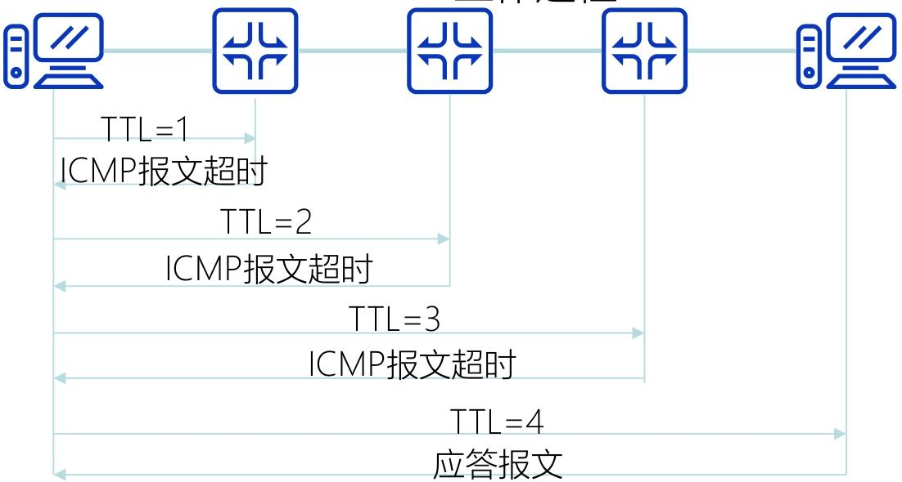

## IPv6 协议

IPv6 是为解决 **IPv4 地址枯竭问题**而生的下一代互联网协议，凭借 128 位地址空间、简化报文结构等优势，成为物联网、大规模网络等场景的核心支撑

其中IPv6

- 利用支撑邻接点发现（NDP）：替代 IPv4 的 ARP 协议，实现 IPv6 地址与 MAC 地址的映射、邻居状态维护等。
- 同时取消了广播地址

优势：

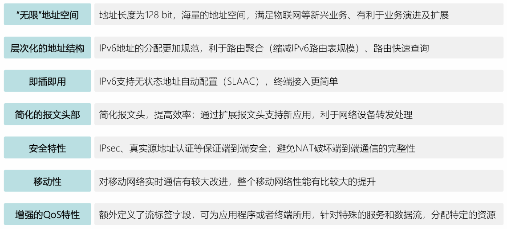

### IPv6 报文头部

IPv6 报文头部由 “基本头部（必选，40 字节）+ 扩展头部（可选）” 组成

#### IPv6 基本头部

基本头部提供**报文转发的基本信息**，会被转发路径上的所有设备解析

与 IPv4 头部的核心差异

| 对比维度     | IPv4 头部                        | IPv6 头部                                |
| ------------ | -------------------------------- | ---------------------------------------- |
| 长度         | 20~60 字节（可变，含选项）       | 40 字节（固定，无选项）                  |
| 核心字段变化 | 含 IHL、校验和、标识符等冗余字段 | 取消冗余字段，新增流标签字段             |
| 扩展方式     | 内置选项字段（影响转发效率）     | 独立扩展头部（按需添加，不影响基础转发） |

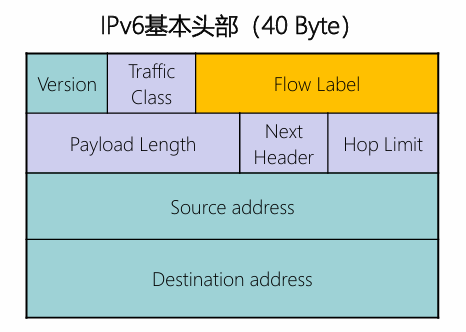

- Version（版本）：4Bit，区分IPv4和IPv6，值为6
- Traffic Class：流类别(8 bit)；用于标记数据包的服务优先级，支撑 QoS 管控
- Flow Label:流标签(20 bit)；与源地址组合可唯一标识一条数据流，网络设备无需深度解析报文内容，即可快速识别并转发特定流量
- Payload Length:有效载荷长度(16 bit)；表示紧跟基本头部的所有数据长度（含扩展头部 + 上层协议数据），单位为字节
- Next Header:下一个报文头(8 bit)；类似 IPv4 的 Protocol 字段，标识后续首个扩展头部类型（如路由扩展头、认证扩展头）或上层协议类型（如 TCP=6、UDP=17）。
- Hop Limit:跳数限制(8 bit)；替代 IPv4 的 TTL 字段，定义数据包最大转发跳数（路由器转发一次减 1），值为 0 时丢弃数据包，防止路由环路
- Source Address:源地址(128 bit), 表示发送方的地址；Destination Address:目的地址, (128 bit)｡表示接收方的地址

#### IPv6 扩展头

IPv6 扩展头是 IPv6 协议的灵活扩展机制，用于在基本头部之外补充功能（如路由、安全、分片），不强制包含，按需添加，核心特点是 “变长结构、链式衔接”

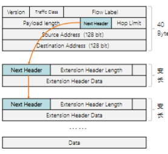

位于 IPv6 基本头部之后、上层协议数据（如 TCP/UDP）之前，可串联多个扩展头。

每个扩展头的 “Next Header” 字段标识下一个扩展头类型（或上层协议），形成 “基本头部→扩展头 1→扩展头 2→…→上层协议” 的链式结构。

如果IPv6 基本头部（Next Header=6）→ TCP 数据段；则表示**无扩展头**

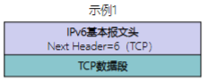

- Next Header（8 比特）：标识后续报文类型（如 0 = 逐跳选项头、43 = 路由头、6=TCP）。
- Extension Header Length（8 比特）：表示扩展头数据部分的长度（不含 Next Header 字段），单位为字节。
- Extension Header Data（变长）：扩展头的核心功能数据，由选项字段和填充字段组成。

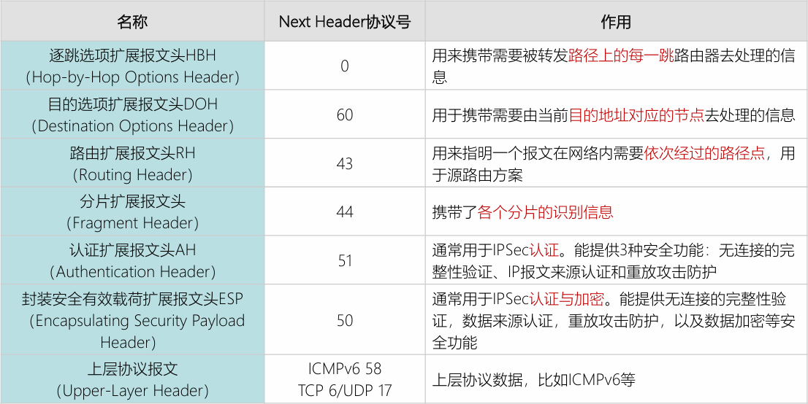

IPv6扩展头典型应用：**SRv6**

SRH（Segment Routing Header）是**路由扩展头（RH）的特殊类型**（Routing Type=4），专为段路由（SRv6）设计，用于**指定 IPv6 报文的显式转发路径**。

- 存储 “Segment List”（段列表）：包含报文需依次经过的 IPv6 段地址（如路由器接口地址）。
- 显式路径控制：源节点提前规划转发路径，报文按段列表顺序转发，无需依赖中间路由器的路由表。

---

### IPv6 地址

128 比特（16 字节），是 IPv4 地址（32 比特）的 4 倍，地址空间约 2¹²⁸个，满足各类场景长期扩展。

- 按 16 比特（2 字节）为一组，共分为 8 组，各组之间用冒号（:）分隔，每组用十六进制数表示（0~F，大小写不敏感）。
- **基础格式示例**：2001:0DB8:0000:0000:0008:0800:200C:417A（8 组完整表示，每组 16 比特）。

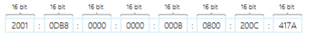

1. 完整表示法
   - **8 组十六进制数完整书写**，每组 16 比特，不足 16 比特的组需在**前面补 0**，确保每组长度一致。
   - 示例：2001:0DB8:0000:0000:0008:0800:200C:417A（无缩写，完整呈现所有组的 0）。
2. 前缀表示法（子网掩码对应形式）
   - 采用 “IPv6 地址 / 掩码长度” 格式，掩码长度表示网络前缀的比特数（0~128），对应子网范围。
   - 网络前缀：前 64 比特（即前 4 组：2001:0DB8:2345:CD30），可简写为 2001:0DB8:2345:CD30::/64（:: 表示后续全 0 组）；
   - 主机标识：后 64 比特（1230:4567:89AB:CDEF），用于标识网络内的具体设备。

IPv6 允许对连续或前导 0 进行缩写

1. 省略每组前导 0
   - 每组十六进制数中的前导 0 可直接省略；若某组所有比特均为 0，需保留至少一个 “0”，不能完全省略。
     - 原组：0000 → 缩写为 0（不能省略，需保留一个 0）；
     - 原组：0008 → 缩写为 8（省略前导 3 个 0）。
   - 应用示例：2001:0DB8:0000:0000:0008:0800:200C:417A → 2001:DB8:0:0:8:800:200C:417A。
2. 用 “`::`” 省略连续全 0 组
   - 规则：一个或多个连续的 “全 0 组”（每组均为 0000），可用双冒号（`::`）替代；**整个地址中仅允许使用一次`::`**，避免歧义（若用两次，无法还原原始地址）。
   - 原地址：0000:0000:0000:0000:0000:0000:0000:0001 → 7 组全 0，缩写为::1；
3. 可同时应用 “省略前导 0” 和 “:: 替代连续全 0 组”，但需遵守各自规则，不冲突。

### ICMPv6 协议

ICMPv6 是 IPv6 协议栈的基础支撑协议，不仅继承了 ICMPv4 的核心差错报告与诊断功能，还拓展了 IPv6 特有的**邻接点发现、无状态地址配置**等核心能力

ICMPv6的协议号(即IPv6报文中的Next Header字段的值)为**58**

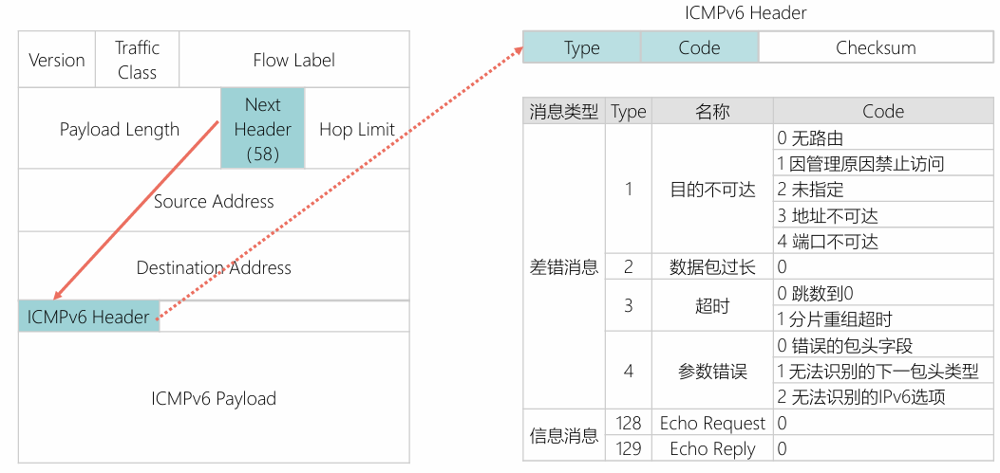

## 内部网关路由选择协议（OSPF)

OSPF（Open Shortest Path First）是应用最广泛的**链路状态类内部网关协议（IGP）**

核心基于 **SPF（Dijkstra）算法计算最短路径**，通过层次化区域划分、链路状态洪泛等机制，适配大规模自治系统（AS）的路由需求

SPF 算法是 OSPF 路由计算的基础，核心逻辑是 “以自身为根，构建最短路径树”：

- 路由器收集全网链路状态信息后，将每个网络、路由器视为节点，链路带宽对应的 Cost 视为边的权重；
- 按 “累计 Cost 最小” 原则，计算到每个目的网络的最短路径，生成路由表。

Cost 是 OSPF 衡量链路优劣的核心指标，公式固定为：`Cost=100×10^6/链路带宽（bps）`

#### OSPF 三大核心工作机制

1. 链路状态信息传播：洪泛法

   - 仅在**自治系统（AS）内传播**，不跨 AS；
   - 路由器仅发送**自身的 “链路状态”**（即与哪些路由器相邻、对应链路的 Cost），而非完整路由表；
   - 触发条件：**链路状态变化**时（如链路中断、带宽变更）主动洪泛；无变化时，每 **30 分钟刷新一次**，确保信息时效性；

2. 层次化区域划分

   在一个区域内部的路由器只知道**本区域的完整网络拓扑**，而不知道其他区域的网络拓扑的情况

   - 主干区域（Backbone Area）：标识符固定为 0.0.0.0，是区域间通信的核心，所有非主干区域必须通过它互连；
   - 非主干区域（如 0.0.0.1、0.0.0.2）：自治系统内的下层区域，仅维护本区域的拓扑信息；

   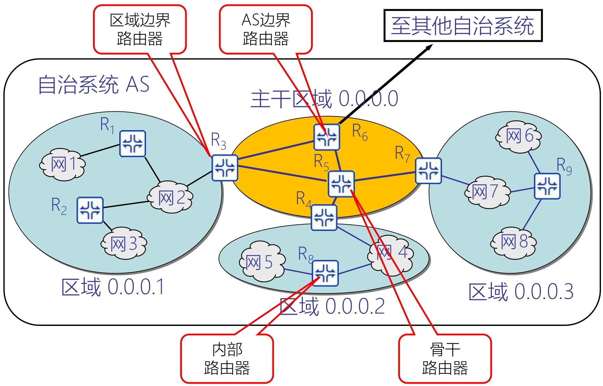

3. 邻居关系与数据包交互

   - OSPF 通过特定数据包建立和维护邻居关系

   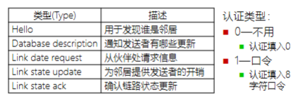

### 路由器体系结构

路由器的核心体系结构围绕 “路由选择” 和 “分组转发” 两大核心功能设计，由五大关键组件构成，输入 / 输出端口按分层逻辑处理数据包，确保高效、精准的跨网络转发

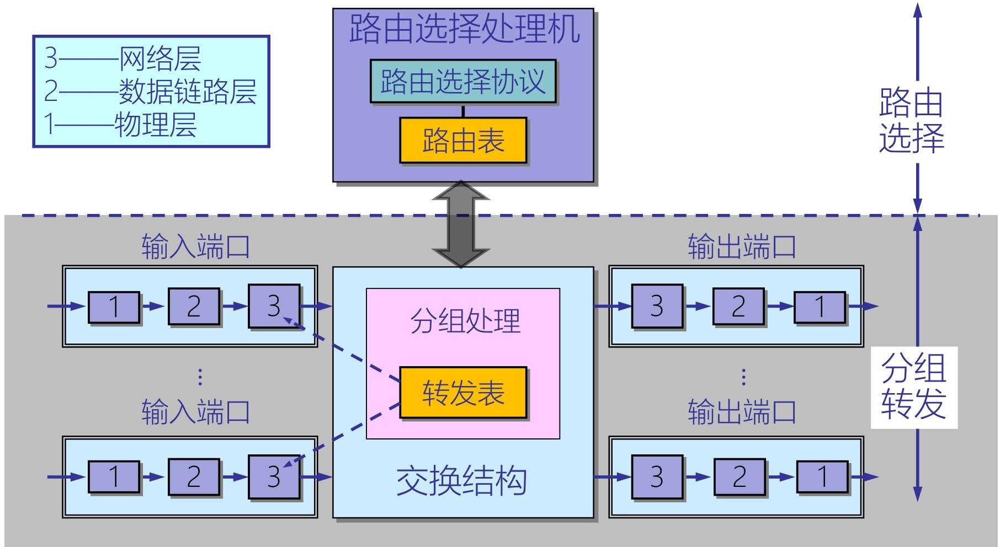

- 路由选择处理机：运行路由选择协议（如 RIP、OSPF、BGP），计算并维护路由表

  - 路由选择协议：实现路由器间的拓扑信息交互，支撑路由表更新。
  - 路由表：记录各目的网络的 “网络前缀→下一跳地址→出接口” 映射关系，由路由选择处理机生成和维护。

- 交换结构：连接所有输入端口和输出端口，将输入端口接收的数据包快速转发至指定输出端口，是路由器的 “数据总线”。

-  输入 / 输出端口：路由器与外部网络的连接接口，每个端口对应不同网段，支持分层协议处理（物理层、数据链路层、网络层）。

  主要是**分组排队**：将处理后的数据包按优先级放入队列，等待交换结构调度转发（避免端口拥堵）。

  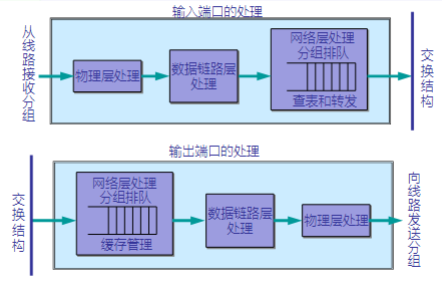

