# 传输层

传输层就是连接寄件人和收件人的专属快递服务 —— 它不关心公路是否通畅、干线如何规划，只保证你的包裹（数据）准确、完整、及时地送到收件人手中，即**端到端的通信**

## 传输层基本原理

传输层的基本原理可浓缩为 “一个核心定位(连接网络层和应用层）、两大核心价值（逻辑通信，向上透明）、三类关键机制”

在 OSI 参考模型中，传输层的位置是关键 —— 夹在**通信子网**（物理层、数据链路层、网络层，负责 “硬件级通信”）和**资源子网**（会话层、表示层、应用层，负责 “软件级数据处理”）之间。

- 通信子网只管 “主机到主机” 的传输（比如把数据从你的电脑传到朋友的电脑）；
- 资源子网需要 “进程到进程” 的通信（比如你的微信进程和朋友的微信进程交互）；

传输层为**源主机上的进程和目的主机上的进程之间**提供可靠的**透明**数据传送，使高层用户在相互通信时不必关心通信子网实现的细节

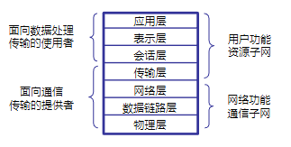

### 传输层 “逻辑通信” 和传输协议

传输层提供的 “逻辑通信”，本质是**为源主机和目的主机的应用进程，搭建 “仿佛直接相连” 的虚拟通信通道**

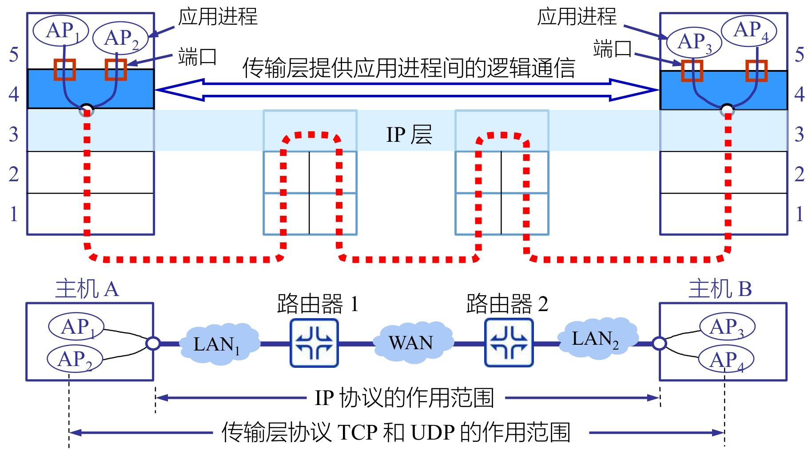

逻辑通信≠物理通信：

- IP 层（网络层）的 “物理通信”：负责 “主机到主机” 的路径传输，“主机 A→路由器 1→路由器 2→主机 B”
- 传输层的 “逻辑通信”：负责 “进程到进程” 的虚拟连接；“主机 A 的 AP1/AP2 进程 ↔ 主机 B 的 AP3/AP4 进程”

逻辑通信的核心实现：用 “端口号” 精准定位进程：

- 每个应用进程对应一个唯一的端口号
- 传输层把应用进程的数据，封装成 “IP 地址 + 端口号” 的报文段：IP 地址定位主机，端口号定位主机上的进程；

传输层的逻辑通信，核心是 **“穿透” 底层物理网络，把 “主机到主机” 的粗粒度通信，升级为 “进程到进程” 的细粒度通信 **

而对于传输协议来说

传输协议是传输层实体（源主机与目的主机的传输层模块）之间遵循的**通信规则集合**，核心作用是实现 “端应用程序到端应用程序” 的进程级通信，即给上层应用提供 “进程间通信服务”

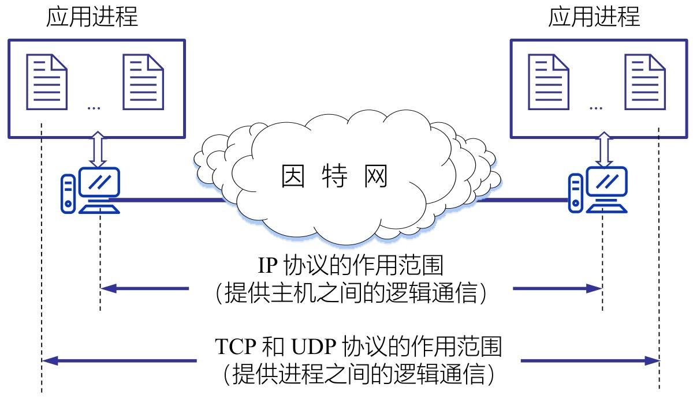

> [!tip]
>
> 与网络层（IP 协议）的核心区别
>
> | 对比维度 | 网络层协议（IP）                 | 传输层协议（TCP/UDP）                    |
> | -------- | -------------------------------- | ---------------------------------------- |
> | 通信范围 | 主机到主机                       | 进程到进程                               |
> | 核心作用 | 主机寻址、路由转发（找设备）     | 进程寻址、可靠传输（找软件 + 保交付）    |
> | 寻址方式 | 依赖 IP 地址（定位主机）         | 依赖 “IP 地址 + 端口号”（定位进程）      |
> | 服务类型 | 无连接、不可靠（不保证数据完整） | TCP：面向连接、可靠；UDP：无连接、不可靠 |
> | 关注重点 | 底层路径传输（怎么把数据送过去） | 上层进程通信（把数据送给谁、送得好不好） |

### 传输层功能

传输层的核心功能围绕 “实现进程间可靠、精准通信” 展开

1. 端到端的报文传递：直接面向应用进程提供 “端到端” 的数据交付服务

2. 服务点的寻址：解决 “数据到主机后，该交给哪个应用进程” 的核心问题

3. 拆分和组装：适配网络传输能力，解决应用层大数据块传输

   - 拆分：源端传输层将应用层发送的大数据块，拆分成多个符合网络层、数据链路层传输限制的**小报文段，并为每个报文段添加序号**
   - 组装：目的端传输层接收所有乱序到达的报文段后，根据序号重组为原始的大数据块

4. 连接控制：管理传输连接的生命周期，包括连接建立、数据传输过程中的连接维护、数据传输完成后的连接终止；

   为上层提供两种类型服务：面向连接和无连接

   - 面向连接的传输服务：通信前必须先建立连接（如 TCP 的三次握手）
   - 无连接的传输服务：通信前无需建立连接，应用进程直接发送数据（UDP)

为实现上面的功能，需要支撑精准通信的 “双地址”，即传输层地址

- NSAP 地址（网络服务访问点）：即**网络层的 IP 地址**，负责定位 “哪台主机”，是数据传输的 “大地址”
- TSAP 地址（传输访问服务点）：即**端口号**，负责定位 “主机上的哪个进程”，是数据传输的 “小地址”

同时传输层通过 “向上复用” 和 “向下复用”，让有限的网络资源支持更多应用场景

- 向上复用：多个应用进程共享同一传输层服务和网络连接（一个NSAP)
- 向下复用：一个应用进程可使用多个网络层路径（NSAP 地址）传输数据。(多个NSAP)

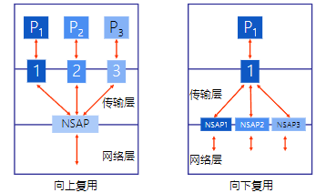

---

### 可靠传输

可靠传输是传输层的核心能力，核心目标是确保数据从源进程到目的进程的 “**无差错、按序、无丢失、无重复**” 交付，再配合端到端的流量控制，避免接收方因处理不及导致数据溢出

其中 “**无差错、按序、无丢失、无重复**” 则对应差错控制，次序控制，丢失控制，重复控制

#### 差错控制

数据在网络传输中可能因链路干扰、路由器故障等出现比特翻转、数据损坏等错误，差错控制就是检测并处理这些错误。

通过校验和（如 TCP 的强制性校验和、UDP 的可选校验和）检测数据完整性

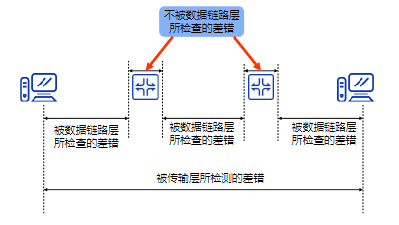

####  次序控制：保证数据按序交付

应用层大数据会被拆分为多个报文段传输，这些报文段可能因路由不同、传输延迟差异导致乱序到达，次序控制负责**恢复原始顺序**。

1. 分段与组合：源端传输层将大数据拆分为小报文段，为每个报文段分配唯一序号；目的端传输层根据序号，将乱序报文段重组为原始数据

   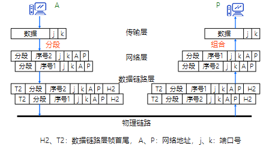

2. 连接与分割：对于连续的数据流，传输层通过 “连接” 标识（网络地址（A、P）和端口号（j、k））关联相关数据，再按序号 “分割” 为独立报文段传输，确保接收方准确拼接。

   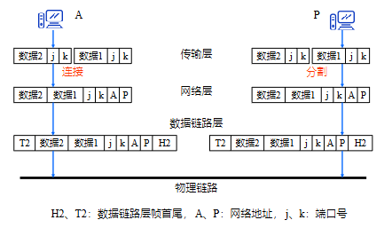

#### 丢失控制：找回丢失数据

报文段可能因网络拥堵、链路中断等丢失，丢失控制通过 “重传机制” 确保所有数据都能到达目的地。

主要是超时重传机制：每个报文段设置计时器，若超时未收到接收方的确认，判定报文段丢失，自动重传该报文段；

但是同时需要**序号和确认机制**，确保重传的报文段能被接收方正确识别，避免重复处理。

### 传输层流量控制

传输层流量控制的核心是**在源进程与目的进程之间动态协调传输速率**，避免发送方发送过快导致接收方缓冲区溢出

> [!note]
>
> - 数据链路层流量控制：作用于**单条链路**（如主机 A→路由器 1、路由器 1→路由器 2），仅协调相邻两个设备的传输速率；
> - 传输层流量控制：作用于**端到端**（如主机 A 的 AP1 进程→主机 B 的 AP4 进程），协调整个传输路径的源端与目的端速率，覆盖所有中间链路。

传输层同样用滑动窗口协议实现流量控制，但窗口大小**可动态变化**，

核心适配接收方缓冲区的实时空闲情况 —— 接收方缓冲区空闲多，窗口就放大（允许发送方多传）；空闲少，窗口就缩小（限制发送方少传）。

通过 3 个指针将发送方缓冲区划分为 4 个区域：发送已确认，发送未确认，可发送，不可发送

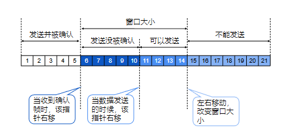

- 当发送方发送数据时，“可发送指针” 向右移，缩小 “可以发送” 区域；
- 当发送方收到接收方的确认帧时，“已发送并确认指针” 向右移，释放已确认数据的缓冲区；
- 当接收方缓冲区空闲情况变化时，窗口边界左右移动（扩大或缩小窗口大小），动态调整 “可以发送” 区域的范围。

### 传输连接

传输连接是传输层实现端到端数据传送的核心机制，核心分为 “面向连接” 和 “无连接” 两种模式，其中面向连接需经历 “建立 - 传输 - 终止” 完整流程

面向连接传输的核心是 “先建连接、再传数据、最后断连接”

#### 三次握手（避免无效请求）

让通信双方（A 和 B）确认彼此的发送和接收能力，同时拒绝重复的连接请求，步骤如下：

- 第一步（请求）：主机 A 发送连接请求报文`CR(seq=x)`，表示 “我想和你建立连接，我的初始序号是 x”；
- 第二步（响应 + 请求）：主机 B 收到后，回复`CR(seq=y,ack=x+1)`，表示 “我收到你的请求（ack=x+1 证明已接收 x 序号数据），同意连接，我的初始序号是 y”；
- 第三步（确认）：主机 A 收到后，再回复`CR(seq=x+1,ack=y+1)`，表示 “我收到你的响应（ack=y+1 证明已接收 y 序号数据），连接可以正式建立”。

如果主机 A 的连接请求报文`CR(seq=x)`因网络延迟重复发送，主机 B 收到重复请求时，会回复`RJ(ack=y+1)`（拒绝报文）

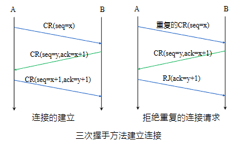

#### 数据传输：可靠交付

连接建立后，双方进入数据传输阶段：

- 传输层会为每个数据字节**分配序号**，确保接收方**按序重组数据**；
- 配合确认机制、重传机制（丢失数据重传）、流量控制（避免缓冲区溢出），保证数据可靠交付；
- 双方可同时发送数据（全双工通信），传输过程中连接持续维护。

#### 连接终止：有序关闭（避免数据丢失）

- 第一步：一方（如 A）发送 “连接终止请求”，告知对方 “我已无数据要发送”；
- 第二步：另一方（如 B）回复 “连接终止确认”，表示 “我收到你的断连请求，正在处理剩余数据”；
- 第三步：B 处理完所有数据后，发送 “对确认帧的响应”，A 收到后正式关闭连接，确保数据无残留。

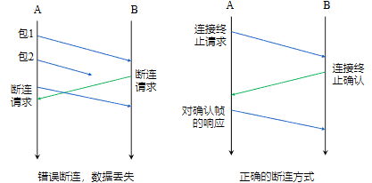

断连过程中会用到三个关键报文：

- `DR`（断连请求）：主动发起断连的一方发送，表明要关闭连接；
- `DC`（断连证实）：接收断连请求的一方回复，确认收到断连通知；
- `ACK`（确认）：对断连证实的再次确认，确保双方都同意关闭连接；

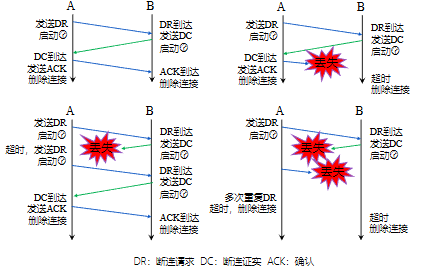

## 用户数据报协议（UDP）

UDP 是传输层**无连接**、轻量级的核心协议，核心定位是 “高效交付、按需使用”，不追求可靠性但能满足低时延、灵活通信需求

- UDP 的核心是**非连接式事务处理**：应用层发起数据传输时，UDP 无需先建立连接，直接封装数据后通过 IP 协议转发，传输完成后也无需终止连接，全程无额外交互开销。
- 所以UDP不提供端到端的确认、重传机制，数据可能出现丢失、重复、延迟、乱序或损坏，可靠性需由上层应用自行保障

底层依赖 IP 协议：UDP 不能独立运行，必须以 IP 协议为基础将 UDP 数据报封装在 IP 数据报中传输

IP 协议负责主机寻址和路由转发，UDP 负责进程寻址和数据封装。

### UDP 六大核心特征

1. **端到端服务**：直接面向应用进程，数据从源进程封装后直达目的进程，不依赖中间节点（路由器）的额外处理。
2. **无连接**：无需建连、断连流程，应用进程可随时发送数据，响应速度快。
3. **面向报文**：不拆分应用层数据，直接将完整报文封装为 UDP 数据报（**若数据过大，由 IP 层分片**），接收方也会原样交付应用层，不重组、不合并。
4. **尽力而为**：仅尝试将数据发送到目的地，不处理传输中的错误，也不控制流量，尽最大努力完成交付。
5. **任意交互**：支持一对一（如点对点聊天）、一对多（如直播、广播）两种通信方式，适配多场景数据分发需求。
6. **操作系统无关**：跨平台兼容性强，无论何种操作系统，UDP 的协议逻辑和接口都保持一致，便于应用开发。

其中任意交互中，UDP允许采用2种交互通信方式：一对一，一对多

- 一对一：单个源进程与单个目的进程通信（如 DNS 查询，客户端向指定 DNS 服务器发送请求）。
- 一对多：单个源进程向多个目的进程同时发送数据（如视频直播，主播端向所有观众端推送流数据）。

同时为了端到端的服务，UDP 通过 “**协议端口号**” 定位主机上的应用进程，解决 “数据到主机后交给哪个进程” 的问题。

### UDP报头格式

UDP 报头是 UDP 协议的核心封装结构，仅占 8 字节（64 位），无冗余字段

UDP 报头按 32 位（4 字节）为一个单元排列：源端口号和目的端口号作为一个单元各占两个字节，而报文长度和校验和一起

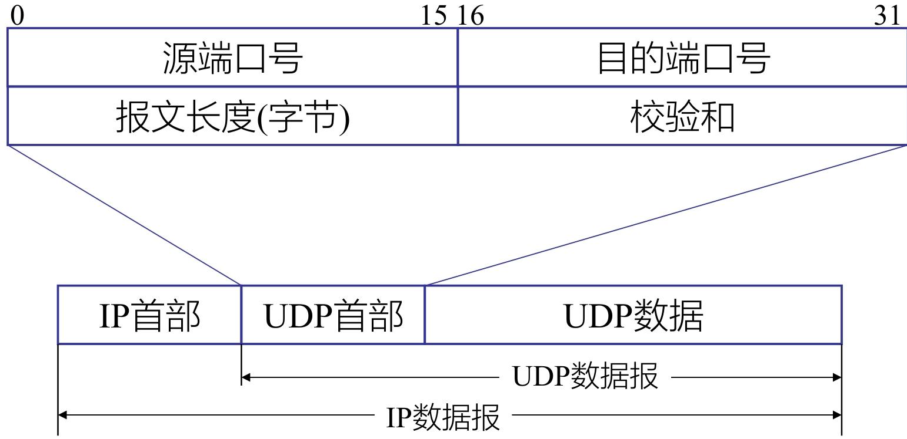

UDP数据报封装在IP数据报中，将IP首部去除就是UDP数据报

1. 源端口号（Source Port）
   - 作为**接收进程返回数据时的 “目的端口”**，即告知接收方 “回复数据时该发往哪个端口（对应源主机的应用进程）”。
   - 可选字段，若无需接收方回复（如广播、单向数据推送），则该字段值填 0
2. 目的端口号（Destination Port）
   - 定位接收主机上的 “特定应用进程”，是 UDP 实现 **“进程寻址” 的核心字段**，与源主机的 IP 地址配合，精准交付数据。
3. 报文长度（Length）
   - 标识整个 UDP 数据报的总字节数，包括 “UDP 首部（8 字节）+ UDP 数据（应用层数据）”。
   - UDP 数据报长度 = IP 数据报总长度 - IP 首部长度（因为 UDP 数据报封装在 IP 数据报中）。
4. 校验和（Checksum）
   - 检测传输过程中数据是否出错（如比特翻转、数据丢失、乱序），是 UDP 唯一的错误检测机制。

### 12 字节伪首部（仅用于校验和计算）

伪首部并非 UDP 报头的实际传输部分，仅在计算校验和时临时添加，目的是让 UDP “双重校验”—— 既确保进程寻址正确，又确保主机和协议正确。

伪首部结构（12 字节，按 32 位分组）

| 32 位（4 字节） | 32 位（4 字节） | 32 位（4 字节）                     |
| --------------- | --------------- | ----------------------------------- |
| 源 IP 地址      | 目的 IP 地址    | 0（填充） + 协议号（17） + UDP 长度 |

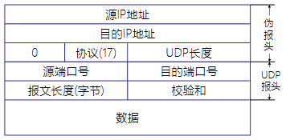

具体校验和计算过程：将 “伪首部（12 字节）+ UDP 首部（8 字节）+ UDP 数据（N 字节）” 按 16 位（2 字节）分组，不足 16 位的末尾补 0（填充）；

**反码求和**：对所有 16 位分组按 “二进制反码” 规则求和（若有进位，将进位加到和的最低位）；

**取反码**：对求和结果再次取 “二进制反码”，得到最终的校验和；填入校验和字段

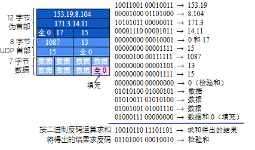

---

## 传输控制协议（TCP）

TCP 是传输层**面向连接、可靠传输**的核心协议，基于 IP 网络层提供增强服务，核心围绕 “**可靠字节流传输**” 展开

TCP提供端到端的**流量控制**，并**计算和验证**一个强制性的端到端检查和

### TCP 核心服务特点

TCP 的服务设计完全围绕 “可靠性” 和 “实用性”

1. **面向连接**：通信前必须通过**三次握手建立连接**，通信后通过**四次挥手终止连接**，全程有明确的连接生命周期管理；
2. **点对点**：仅支持两个进程间的一对一通信，不支持广播、组播模式；
3. **完全的可靠性**：通过序号、确认、重传、校验和等机制，确保数据无丢失、无重复、按序交付；
4. **全双工通信**：连接建立后，通信双方可同时发送和接收数据，无需单向交替；
5. **流接口**：将应用层数据视为连续的字节流，而非离散报文，传输层负责拆分和重组，应用层无需关注数据分段；
6. **可靠的连接建立**：通过三次握手避免无效连接请求，确保双方发送和接收能力正常；
7. **友好的连接关闭**：通过四次挥手保证双方数据都已发送完毕，避免关闭连接时丢失数据。

### TCP的报头格式

TCP 固定首部占 20 字节，是 TCP 协议实现连接管理、可靠传输、流量控制的核心载体，按位（0~31 位）排列

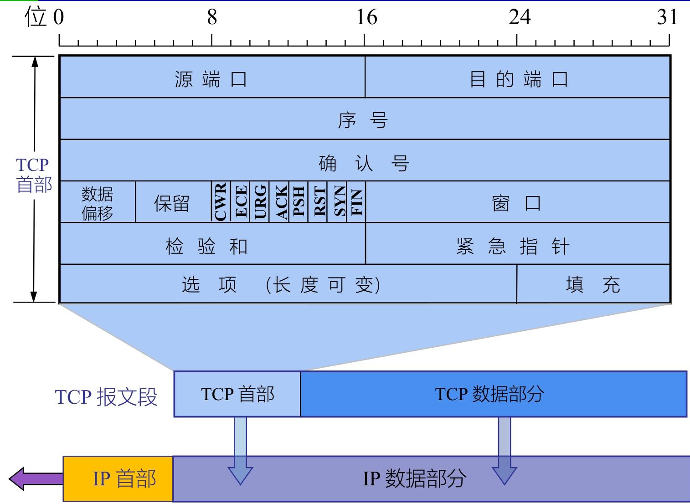

1. 端口号（源 / 目的，各 2 字节）

   - TCP 实现 “进程级寻址” 的关键，与 IP 地址配合形成 “IP + 端口” 的唯一标识（如 192.168.1.1:8080）。

2. 序号（4 字节）

   - 给字节流中的每个字节分配唯一序号，解决数据乱序问题。
   - 本报文段的序号 = 该报文段第一个数据字节在整个字节流中的位置。

3. 确认号（4 字节）

   - 响应对方的序号，告知 “我已收到你截至 X-1 字节的数据，下次请发 X 字节”。
   - 仅当标志位 ACK=1 时有效（TCP 连接建立后，ACK 始终为 1）

4.  数据偏移（4 位）

   - 区分 **TCP 首部和数据**部分的边界（因为首部可能包含可变长度的选项）
   - 数据偏移值 × 4 字节 = 首部总长度

5. 标志位（8 个，重点解析 6 个核心）

   | 标志位  | 位置      | 核心作用                                                     |
   | ------- | --------- | ------------------------------------------------------------ |
   | SYN     | 第 5 位   | 同步连接，SYN=1 表示 “连接请求” 或 “连接接受” 报文（三次握手核心标志） |
   | FIN     | 第 0 位   | 终止连接，FIN=1 表示 “发送方数据已发完，请求关闭连接”（四次挥手核心标志） |
   | ACK     | 第 4 位   | 确认有效，ACK=1 时确认号字段生效（连接建立后始终为 1）       |
   | URG     | 第 7 位   | 紧急数据标识，URG=1 时紧急指针字段有效（如键盘中断信号需优先传输） |
   | PSH     | 第 3 位   | 推送数据，PSH=1 时接收方需立即将数据交付应用进程（不等待缓冲区填满） |
   | RST     | 第 2 位   | 复位连接，RST=1 表示连接出现严重错误（如主机崩溃），需释放连接后重新建立 |
   | ECE/CWR | 第 1/6 位 | 拥塞控制相关，ECE=1 表示网络拥堵，CWR=1 表示发送方已减小发送窗口 |

6. 窗口（2 字节）

   - TCP 流量控制的核心，告知对方 “我当前的接收缓冲区还能容纳多少字节的数据”。

7. 检验和（2 字节）

   - 检测传输过程中的数据错误（如比特翻转、数据丢失），是 TCP 可靠传输的基础。
   - 校验范围：TCP 首部 + TCP 数据 + 12 字节伪首部

8. 紧急指针（2 字节）

   - 配合 URG 标志，标识本报文段中紧急数据的长度（紧急数据放在数据部分最前面）。

9. 选项：长度可变。

   - TCP最初只规定了一种选项，即**最大报文段长度 MSS**。
   - MSS 告诉对方TCP：“我的缓存所能接收的报文段的数据字段的最大长度是MSS个字节”

10. 填充（可变长度）

    - 确保 TCP 首部总长度为 32 位（4 字节）的整数倍（因为 TCP 按 32 位字处理首部）。

### TCP 核心特性

TCP 的核心特性围绕 “可靠字节流传输” 展开，结合序号确认、滑动窗口、超时重传等机制保障可靠性，同时通过 SACK、Nagle 算法等优化传输性能

1. 字节计数与确认机制

   - 所有传输的字节都有唯一序号，确认序号始终是 “上次成功接收的最大字节序号 + 1”，明确告知对方 “下次应发送的字节位置”。
   - 同时只有ACK标志为1时，确认序号字段才有效
   - 发送ACK无需任何代价，因为32bit的确认序号字段和ACK标志一样，总是**TCP首部的一部分**。

2. 面向流的传输模型

   - 应用层数据被视为连续字节流，TCP 负责拆分（发送端）和重组（接收端），应用进程无需关注数据分段细节。

   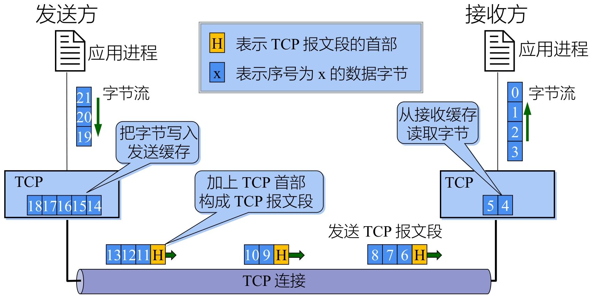

3. 无选择确认的滑动窗口特性

   - TCP 是 “无选择确认 / 否认” 的滑动窗口协议，仅能确认 “截至某序号的所有字节已接收”，无法单独确认数据流中的部分片段。类似于数据链路层的回退N协议，其中的确认信号ACKn只能确定`n`之前的帧

4. 可靠传输核心技术

   - 排序技术：发送端为每个报文段附加序号，接收端按序号重组，**解决乱序和重复问题**。
   - 重传技术：采用 “带重传的正向确认”，发送方未收到确认则重传报文段。
   - 流量控制技术：通过滑动窗口限制发送速率，防止接收方缓冲区溢出。

#### 超时重传：可靠传输的关键保障

TCP 为每个发送的报文段设置计时器，超时未收到确认则自动重传

核心挑战是 “往返时延（RTT）波动大”（互联网路由动态变化导致），需精准计算超时重传时间（RTO）。

首先TCP保留**加权平均往返时间（RTT_S）**：平滑 RTT 波动

- 公式为`新RTT_S = (1-α)×旧RTT_S + α×新RTT样本`，α 推荐值 0.125（更新较慢，适配波动）。
- 首次测量时，RTT_S 直接取 RTT 样本值。

**往返时间偏差（RTT_D）**：衡量 RTT 波动幅度

- 公式为`新RTT_D = (1-β)×旧RTT_D + β×|RTT_S - 新RTT样本|`，β 推荐值 0.25。
- 首次测量时，RTT_D 取 RTT 样本值的一半。

RTT_D 是 RTT 的偏差的加权平均值:

最后根据RTT_D以及RTT_S计算**超时重传时间（RTO）**

`RTO = RTT_S + 4 × RTT_D`，确保 RTO 略大于实际 RTT，减少误重传。

在上述方案下，存在问题：重传的报文段收到 ACK 后，无法区分 ACK 对应原始报文还是重传报文，导致 RTT 测量歧义。

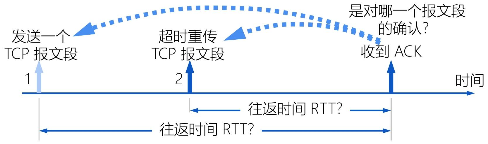

利用Karn 算法及修正：重传的报文段不参与 RTT 样本计算。

报文段每重传一次，RTO 翻倍（`新RTO = γ×旧RTO`，γ 典型值 2），避免因 RTT 测量缺失导致 RTO 无法更新。

> [!tip]
>
> TCP 通过 4 种计时器保障传输有序：
>
> - 重传计时器：超时未确认则重传报文段（核心计时器）。
> - 持久计时器：防止 “通告窗口为 0 后，接收方窗口恢复但通知丢失” 导致的死锁。
> - 保活计时器：长连接场景（如 SSH），无数据传输时发送探测报文，确认连接是否存活。
> - 关闭状态计时器：连接终止阶段（TIME_WAIT），等待 2MSL 确保报文失效。
>
> 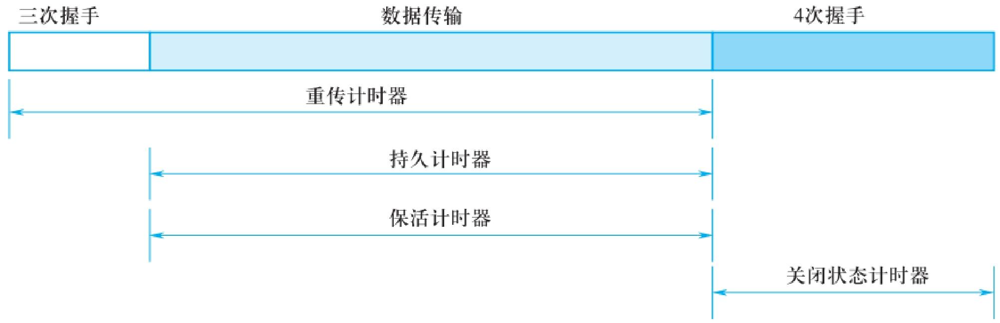

#### 选择确认（SACK）：解决无选择确认的缺陷

无选择确认机制下，中间字节丢失会导致后续已接收字节无法被确认（需等待丢失字节重传），SACK 通过 “**选择性确认已接收的不连续字节块**” 解决该问题。

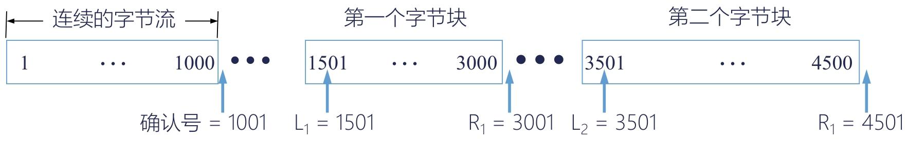

- 接收方通过 SACK 选项，告知发送方 “已接收的不连续字节块范围”，发送方仅需重传丢失的字节块，无需重传已接收的后续字节。
- 已接收 1~1000、1501~3000、3501~4500 字节，确认号 = 1001（未接收 1001~1500 字节），同时通过 SACK 选项告知 “1501~3000、3501~4500 字节已接收”，发送方仅需重传 1001~1500 字节。

注意：RFC 2018 关键规定

- 建立连接时，需在 TCP 首部选项中声明 “允许 SACK”，且双方需协商一致。
- SACK 选项占 2 字节（1 字节标识选项类型，1 字节标识选项长度），每个字节块边界需 4 字节描述，最多支持 4 个不连续字节块（受 TCP 首部选项最大 40 字节限制）。
- 原有确认号字段用法不变，SACK 仅作为补充信息。

#### TCP 数据发送时机：平衡效率与开销

TCP 通过 3 种机制控制报文段发送时机，避免频繁发送小报文导致网络开销过大：

1. 达到最大报文段长度（MSS）：缓存数据达到 MSS 时，立即封装发送。
2. 应用进程推送（push 操作）：应用进程明确要求发送时，TCP 立即封装缓存数据发送（无论是否达到 MSS）。
3. 计时器超时：达到超时时间后，封装当前缓存数据发送（长度不超过 MSS）。

其中有提升性能的措施：

1.  Nagle 算法：减少小报文数量

   - 发送方先发送第一个字节，**缓存后续字节**；收到第一个字节的确认后，再将缓存数据封装为一个报文段发送。
   - 缓存数据达到 “发送窗口大小的一半” 或 “MSS” 时，立即发送，无需等待确认。

2. 糊涂窗口综合症（HWS）

   TCP接收缓存已满，而应用进程一次只从缓存中读取一个字节

   - 接收方：等待缓存可容纳 1 个 MSS 或空闲空间达一半时，再更新通告窗口，避免通告过小窗口。
   - 发送方：避免发送小于 MSS 的小报文，等待缓存数据积累到一定规模后再发送。

### TCP 连接建立（三次握手）

TCP 连接建立的核心是 “三次握手”，本质是通过三次交互确认双方通信能力、协商参数并分配资源，同时避免失效请求干扰

在发送数据前，三次握手需解决 3 个关键问题：

1. **双向确认存在**：让客户端和服务器都明确 “对方已就绪”，能正常发送和接收数据；
2. **协商核心参数**：确定最大报文段长度（MSS）、最大窗口大小、服务质量等，为后续传输适配；
3. **分配传输资源**：双方预留缓存空间、在连接表中创建条目，保障数据传输顺畅。

假设主机 A 是客户端（主动发起连接），主机 B 是服务器（被动等待连接）

| 步骤            | 交互行为             | 双方状态变化                                                 | 报文核心内容                                                 |
| --------------- | -------------------- | ------------------------------------------------------------ | ------------------------------------------------------------ |
| 1（第一次握手） | 客户端主动打开连接   | 客户端：CLOSED → SYN-SENT                                    | 发送`SYN=1，seq=x`（SYN=1 表示连接请求，x 是客户端初始序号） |
| 2（第二次握手） | 服务器被动打开并响应 | 服务器：CLOSED → LISTEN → SYN-RCVD                           | 回复`SYN=1，ACK=1，seq=y，ack=x+1`（SYN=1 表示同意连接，ACK=1 确认收到客户端请求，y 是服务器初始序号，ack=x+1 表示 “已接收 x 及之前的所有数据”） |
| 3（第三次握手） | 客户端确认服务器响应 | 客户端：SYN-SENT → ESTABLISHED；服务器：SYN-RCVD → ESTABLISHED | 发送`ACK=1，seq=x+1，ack=y+1`（ACK=1 确认收到服务器响应，ack=y+1 表示 “已接收 y 及之前的所有数据”） |

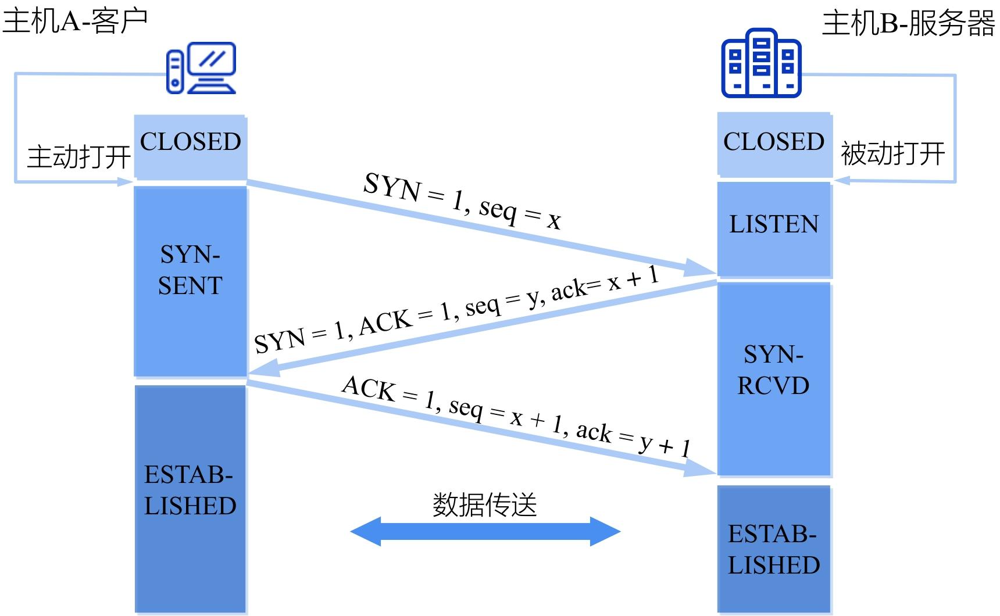

> [!note]
>
> 三次握手的主要目的是为了**避免 “已失效的连接请求报文” 干扰新连接**，即重复连接

#### TCP连接的释放

1. 连接建立是 “三次握手”，连接释放是 “四次挥手”（因全双工通信需双方分别确认数据发送完毕）；
2. 连接释放时，主动关闭方需等待 2MSL（最长报文寿命），确保最后一个确认报文到达对方，同时让网络中残留的旧报文段自然失效，避免干扰后续新连接

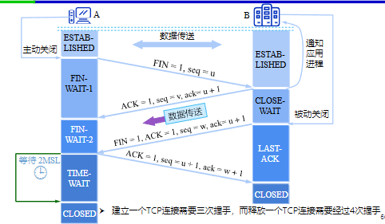

---

### TCP 拥塞控制原理

TCP 拥塞控制的核心是**避免过多报文段注入网络导致路由器 / 链路过载**，同时最大化利用网络空闲资源，遵循 “报文段守恒” 原则（网络中可用容量决定有效传输量）

- **拥塞窗口（cwnd）**：TCP 发送方允许连续发送的最大数据量（单位：SMSS 字节，即发送端最大数据段尺寸），是拥塞控制的核心调节变量。
- **接收端窗口（rwnd）**：接收方告知的缓冲区空闲大小，限制发送方不超过接收能力。
- **慢启动阈值（ssthresh）**：**区分 “慢启动” 和 “拥塞避免” 阶段的临界值**，初始值通常为较大值（如 65535 字节）。
- **发送窗口上限**：取`min(rwnd, cwnd)`，由接收方能力（rwnd）和网络拥塞状态（cwnd）共同决定。

两种拥塞控制方式

- **端到端拥塞控制**：发送方通过报文丢失、重复确认等现象自主判断拥塞，调整发送速率，无需网络设备配合，是 TCP 默认方式。
- **网络辅助拥塞控制**：路由器主动反馈拥塞信息（如 IP 头部 ECN 标志），需底层硬件支持，适配性较弱。

TCP 拥塞控制遵循 “AIMD（**加法增大，乘法减小**）” 法则，由慢启动、拥塞避免、快速重传、快速恢复 4 种算法协同工作

> [!note]
>
> 乘法减小（Multiplicative Decrease）
>
> - 触发条件：**网络拥塞**（报文超时）或局部丢包（3 个重复确认）。
> - 操作：ssthresh = 当前 cwnd/2，快速降低发送速率，避免拥塞加剧。
>
> 加法增大（Additive Increase）
>
> - 触发条件：**拥塞避免阶段**，无报文丢失（收到正常确认）。
> - 操作：每个传输轮次 cwnd+1 个 SMSS，缓慢增长避免过早拥塞。

#### 慢启动：快速探测网络容量（cwnd 指数增长）

- 连接初始阶段，发送方不知道网络容量，通过**指数增长快速探测上限**。
- 操作规则：
  1. 初始 cwnd=1 个 SMSS 字节；
  2. 每个传输轮次（收到所有报文确认）后，cwnd 翻倍（1→2→4→8...）；
  3. 当 cwnd≥ssthresh 时，进入拥塞避免阶段。

####  拥塞避免：平稳利用网络资源（cwnd 线性增长）

- 避免 cwnd 增长过快导致拥塞，通过线性增长逐步逼近网络容量。
- 操作规则：
  1. 每个传输轮次后，cwnd 增加 1 个 SMSS 字节（而非翻倍）；
  2. 若检测到报文超时（判定网络拥塞），**执行 “乘法减小”**：ssthresh = 当前 cwnd/2，cwnd 重置为 1，重新进入慢启动。

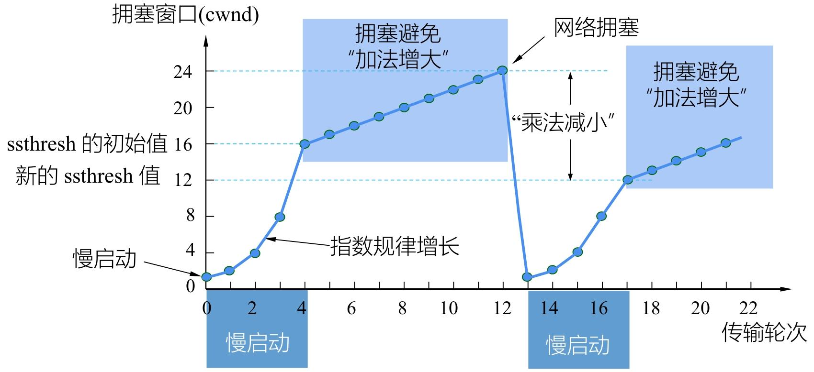

> [!tip]
>
> 假定最大报文段长度是1KB，TCP拥塞窗口是16KB，并发生了超时事件。
>
> 1. **问题1**：如果接着4个轮次传输都是成功的，那么该窗口将是多大？
>    - 发生超时后，ssthresh = 当前 cwnd/2，同时cwnd 重置为 1即下一次传输的是1，接着是2、4、8个报文段。在八个报文段后到达慢启动阈值（ssthresh）进入拥塞避免节点，采用加法增大，所以4个轮次后的拥塞窗口是9KB。
> 2. **问题2**：如果接着6个轮次都成功，CWND的值应该是多大？
>    - 由于每个报文段长度为1KB，所以6个轮次后的拥塞窗口大小为11KB。

#### 快速重传 / 快速恢复

快速重传和快速恢复是 TCP 拥塞控制的核心补充算法，核心目标是**在不等待超时的情况下，快速识别并修复单个报文段丢失**，避免因超时导致传输效率骤降

1. 快速重传：不等超时，及时重传丢失报文

   - 当网络仅发生 “局部丢包”（而非严重拥塞）时，通过接收方的重复确认，让发送方快速定位丢失的报文段，无需等待重传计时器超时，提前发起重传
   - 接收方行为：收到失序报文段后，立即发送重复确认（不等待自己的数据）。
   - 发送方行为：**连续收到 3 个相同的重复确认**，判定对应报文段丢失，立即重传。

   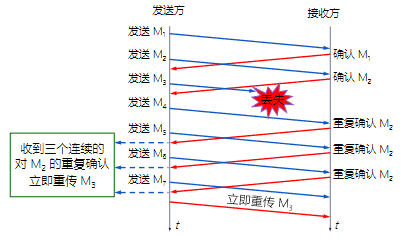

2. 快速恢复：避免拥塞后性能骤降

   发送方收到 3 个重复确认后，判定网络 “无严重拥塞”（仅局部丢包），因此不执行慢启动（**避免 cwnd 重置为 1** 导致性能暴跌），**直接进入拥塞避免阶段**

   - 执行 “乘法减小”：将慢启动阈值（ssthresh）设为当前拥塞窗口（cwnd）的一半（与拥塞避免阶段的拥塞处理逻辑一致）；
   - 重置拥塞窗口：**cwnd 直接设为新的 ssthresh**（而非 1），跳过慢启动阶段；
   - 进入拥塞避免：之后每个传输轮次，cwnd 按 “加法增大” 规则线性增长（每收到一个确认，cwnd 增加 1 个 SMSS 字节），逐步恢复传输速率

   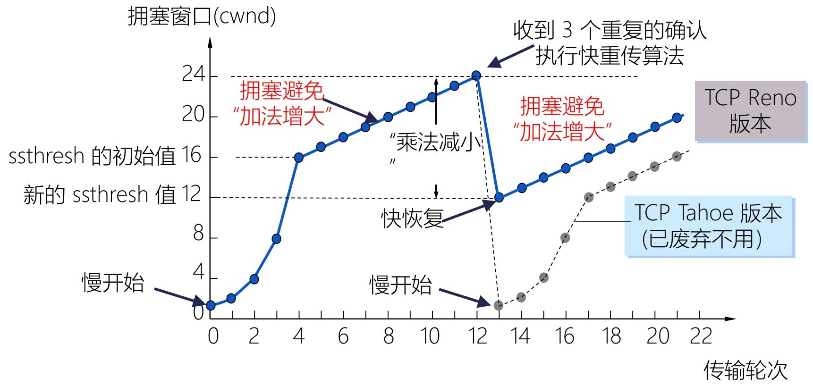

   

快速重传 / 恢复过程中，发送窗口的最大值仍遵循`min(rwnd, cwnd)`规则：

- 若 rwnd < cwnd：由接收方缓冲区大小限制发送速率；
- 若 cwnd < rwnd：由网络拥塞状态（cwnd）限制发送速率，确保不加剧网络负担。