# 应用层

应用层是用户与网络的直接接口，所有我们日常接触的网络服务，从浏览网页、发送邮件到文件传输，其核心逻辑都构建于此。

应用层协议不做 “万能工具”，而是 “专事专办”—— **每个协议都针对一个明确的应用场景**，只解决这一类问题，不兼顾其他需求。

- DNS 协议只解决 “域名与 IP 地址的映射”（比如把[www.baidu.com](https://www.baidu.com/)转换成 180.101.49.11），不负责文件传输；
- SMTP 协议只解决 “邮件从发送方服务器传到接收方服务器”，不负责邮件的读取；
- FTP 协议只解决 “异构主机间的文件传输”，不负责网页展示。

单个主机上的应用进程无法完成网络应用功能，必须依赖 “不同主机上的多个应用进程” 配合，通过通信达成协同。

应用层的 “协议” 本质是 “约定”，具体规定了应用进程通信的 “游戏规则”，确保双方能顺畅交互，无歧义。

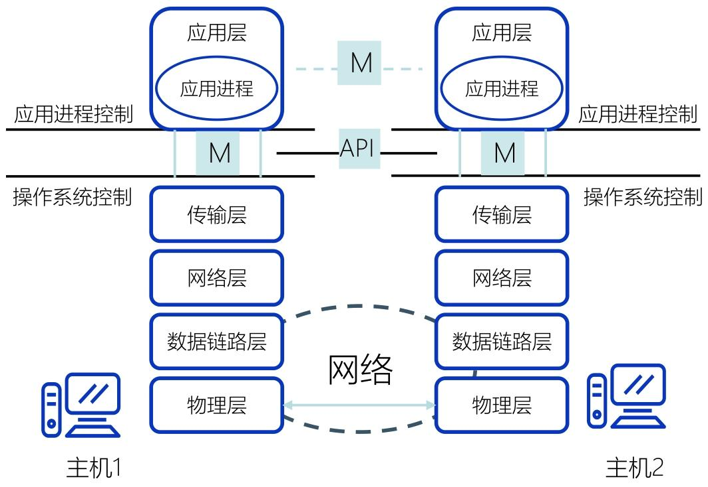

应用层协议的通信模式，完全依赖传输层提供的服务（TCP/UDP），因此分为两种核心模式，二者是 “非此即彼” 的选择

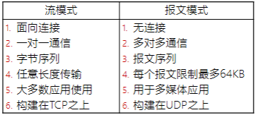

- 流模式的核心是 “**可靠**”：比如**下载文件**时，TCP 会保证字节流的顺序和完整性，不会出现文件损坏，这是 FTP、HTTP 选择流模式的原因；
- 报文模式的核心是 “**快速**”：比如**视频通话**时，哪怕丢失个别报文（帧），也不会影响整体流畅度，但如果用 TCP 的重传机制，会导致延迟增加（卡顿），因此选择 UDP 的报文模式。

## 客户与服务器模型

客户 - 服务器模型的本质，是**两个应用进程之间 “服务与被服务” 的关系**，而非物理设备的 “主从关系”

位于不同主机上的进程间的通信有三种通信方式：

- C/S：Client/Server，客户/服务器方式
- B/S：Browser/Server，浏览器/服务器方式
- P2P：Peer to Peer，对等方式

### 客户 - 服务器（C/S）

客户 - 服务器（C/S）模型是应用层最核心的通信架构，也是理解 B/S、P2P 等衍生模式的基础。

C/S 架构是应用层最经典、最核心的通信架构，其本质是 **“主从式” 的应用进程协同模式 **

- 客户（Client）：**服务请求方**，是主动发起通信、获取服务的应用进程（如浏览器进程、FTP 客户端进程）；
- 服务器（Server）：**服务提供方**，是被动等待请求、提供服务的应用进程（如 Web 服务器进程、DNS 服务器进程）；

在移动互联网环境下，每个应用APP都是一个客户端

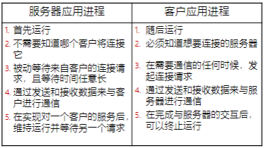

1. 服务器：**多进程运行，并发服务多客户**
2. **可缩放架构**：按需升级，适配业务增长

应用层的绝大多数经典协议和服务，都基于 C/S 架构设计

- 传统互联网服务：文件传输（FTP）、电子邮件（SMTP/POP3）、远程登录（Telnet）、域名解析（DNS）等；
- 现代网络服务：手机 APP 服务（微信、淘宝、抖音）、桌面软件服务（QQ、迅雷、Office 365）、企业内部系统（ERP 系统、考勤系统）等。

C/S方式可以是面向连接的（TCP)，也可以是无连接的（UDP）

虽然客户端是 “主动请求方”，服务器是 “被动提供方”，但**一旦面向连接的通信关系建立，双方地位平等**

- 既可以**客户端向服务器**发数据（如你在 APP 上输入消息发送）
- 也可以**服务器向客户端**发数据（如服务器推送的 “新消息提醒”“订单通知”），实现双向交互

C/S方式特点：C/S 架构的高效，本质是客户端与服务器的 “互补行为”：

- 客户端：“主动、临时、知目标”—— 按需发起请求，不通信时可做本地计算，明确服务器地址，支持多服务器交互；
- 服务器：“被动、持续、专功能”—— 专职提供特定服务，持续运行待命，无需预知客户，支撑多客户并发。

### B/S（浏览器 / 服务器）

B/S 方式是应用层核心通信架构之一，本质是**C/S 架构的 “标准化客户端” 特例**—— 它继承了 C/S “请求 - 响应” 的核心逻辑，却通过**将客户端统一为浏览器**

B/S（Browser/Server）即 “浏览器 / 服务器” 模式，其核心改造是**将 C/S 架构中的 “专用客户端软件”（如 FTP 客户端、邮件客户端）替换为通用浏览器**

B/S方式采取**浏览器请求、服务器响应**的工作模式

其中简单事务在客户端实现，主要复杂的事务在服务器实现

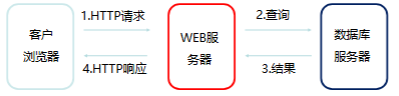

B/S 方式通过 “展现层、处理层、数据层” 的三层架构实现服务交付，每层各司其职，既保证了逻辑清晰，又便于部署和维护：

B/S 方式的通信过程可简化为 “**浏览器请求→Web 服务器处理→数据库查询→结果响应**” 四步

| 架构层级 | 承担角色       | 核心职责                                                     | 硬件 / 软件载体                              |
| -------- | -------------- | ------------------------------------------------------------ | -------------------------------------------- |
| 展现层   | 用户交互接口   | 仅负责网页信息的浏览、用户输入（如填写表单、点击按钮），以超文本（HTML）格式呈现数据 | 客户端浏览器（Chrome、Edge 等）              |
| 处理层   | 业务逻辑核心   | 接收浏览器的 HTTP 请求，执行核心业务逻辑（如订单计算、用户登录验证），管理网页资源（如 HTML、CSS 文件），协调数据层与展现层的交互 | Web 服务器（如 Apache、Nginx、Tomcat）       |
| 数据层   | 数据存储与处理 | 接收 Web 服务器的数据库操作请求（如查询用户信息、存储订单数据），完成数据的增删改查，再将处理结果返回给 Web 服务器 | 数据库服务器（如 MySQL、Oracle、SQL Server） |

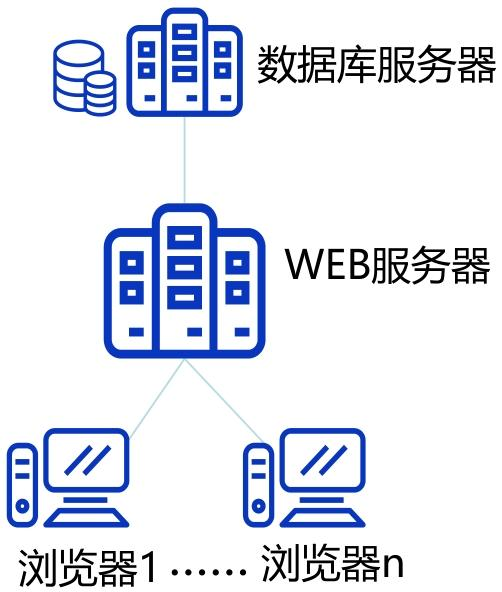

B/S方式的特点：使用简单、维护高效、扩展性好，信息共享度高

但是存在浏览器适配问题

---

### P2P（对等）方式

P2P 方式的核心是 “对等”，即**通信双方地位平等，无固定的 “服务请求方” 和 “服务提供方” 之分**，这是它与 C/S、B/S 架构最本质的区别：

- 处于不同主机上的 P2P 进程，既是 “客户” 也是 “服务器”（都运行了 P2P 软件）
- 在权限允许的范围内，双方可自由访问对方主机的共享资源

P2P 的核心通信特点：去中心化 + 水平流量

- 去中心化，节点自主通信：无中心服务器，同时节点具有动态性
- 从 “垂直” 到 “水平”：流量主要集中在 “对等节点之间”（水平路径）

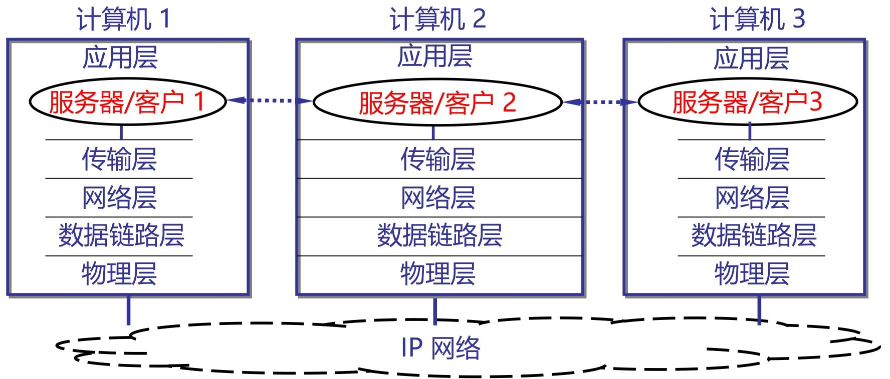

P2P 网络中，每个对等节点的进程本质是 “同时具备客户和服务器的工作能力”，因此会间接用到服务器进程的两种工作方式

1. 循环方式(iterative mode)

   - 仅运行 1 个服务进程
   - 按请求顺序 “逐一响应”，处理完一个再处理下一个
   - 使用无连接的UDP服务进程通常都工作在循环方式，
   - 服务进程只使用一个服务套接字。每个客户则使用自己设定端口号的客户套接字（socket）

   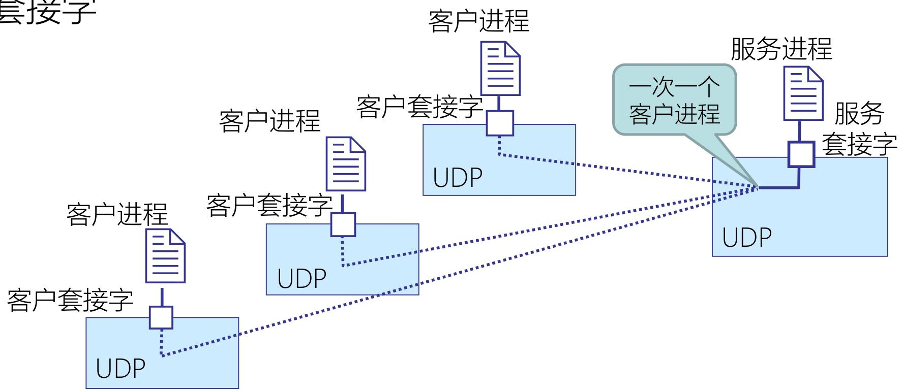

2. 并发方式（Concurrent Mode）

   - 运行 “主服务进程 + 多个从属服务进程”
   - 主进程监听请求，从属进程 “**并行响应**” 多个客户
   - 面向连接的TCP服务进程通常都工作在并发服务方式，一个TCP连接对应一个（熟知）服务端口

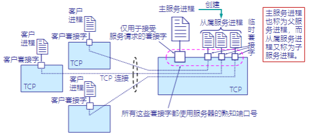

---

## DNS（域名系统）

DNS(域名系统､域名服务､域名服务器)解决 “IP 地址难记忆” 的痛点 —— 通过将有语义的域名（如[www.baidu.com](https://www.baidu.com/)）与机器识别的 IP 地址（如 180.101.49.11）相互映射

DNS 的核心功能是域名和IP地址的 “双向映射”：

域名与 IP 地址的映射并非固定一对一，而是支持三种灵活关系：一对一，一对多，多对一

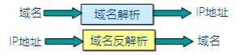

向所有需要域名解析的应用提供服务，主要负责将可读性好的域名映射成IP地址

C/S 工作模式：请求 - 响应，协同解析

- DNS 客户端（如电脑的域名解析器、浏览器）：主动发起域名解析请求；
- DNS 服务器（名字服务器）：被动接收请求，返回解析结果；

域名解析是由若干个**域名服务器程序**完成的，域名服务器程序在专设的结点上运行；相应的结点称为**名字服务器(Name Server)或域名服务器(Domain Name Server)**

DNS 的核心设计之一是 “层次化树状命名空间”，就像一棵 “域名树”，从根到叶依次划分层级，每个节点代表一个 “域”，确保域名全球唯一：

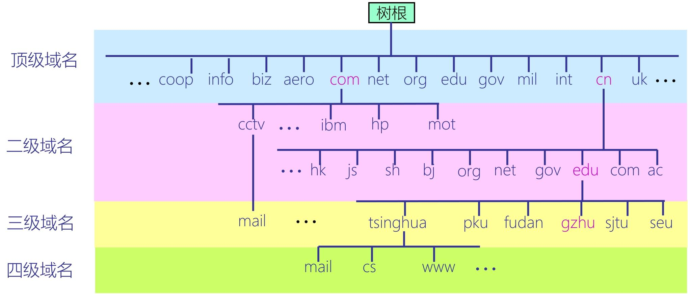

### 域名服务器

DNS 不是集中式数据库，而是由全球无数台域名服务器组成的 “分布式数据库集群”；

- 每个子域（如.[edu.cn](https://edu.cn/)、.[baidu.com](https://baidu.com/)）的管理机构，负责维护该子域下 “域名→IP” 的映射记录（即数据库分段）；

  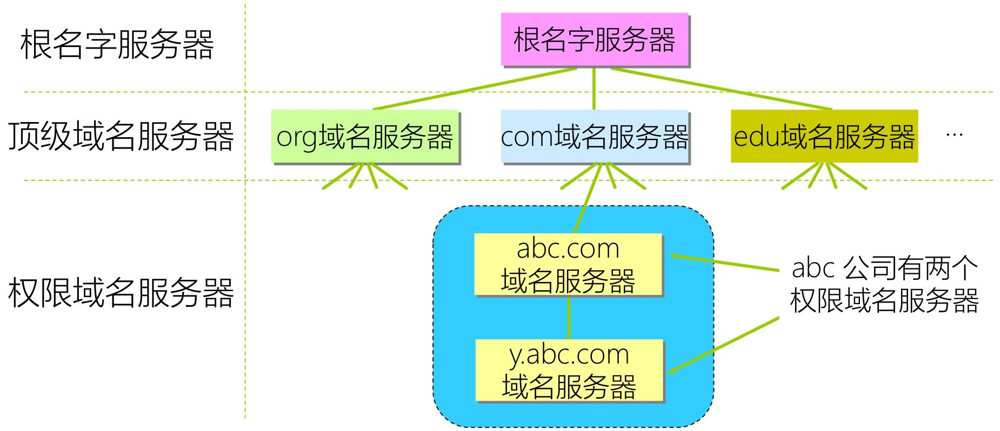

1. 根域名服务器：：DNS 域名树的最顶层服务器，不直接存储域名 - IP 映射，仅负责告知 “下一级顶级域服务器的地址”
2. 顶级域名服务器：根服务器之下，负责管理某一类顶级域（如.com、.edu、.cn、.uk 等）；存储该顶级域下所有二级域服务器的地址
3. 权限域名服务器：：某一特定子域（区 /zone）的 “权威服务器”，是域名解析的 “终点”（存储最终映射记录）
   - 存储本辖域内所有主机的域名 - IP 映射
   - 所有主机必须在所属权限服务器注册，确保映射记录的准确性
   - 若自身无法解析（如子域已进一步细分），会告知下一级权限服务器地址

### DNS 系统组成与工作原理

DNS 系统由 “域名空间、命名规则、代理技术” 构成基础框架

1. 域名空间：域名空间是 DNS 的核心骨架，本质是一棵**层次化树状结构**，所有域名都对应树上的一个节点

   - 域名全称是 “从目标域到根域” 的标签组合，标签间用 “.” 分隔

2. 命名规则：规范域名的分配与格式

   - 命名规则明确了域名的 “分配权限” 和 “格式限制”

3. 代理技术：分布式管理的核心

   代理技术是 DNS“分散存储、分级管理” 的实现基础：数据存储分散化，管理权分散化

DNS 的核心工作是 “域名→IP” 的映射解析，流程遵循 “缓存优先 + 逐层查询”，查询方式分为两种

解析过程由 “域名解析器”（客户端内置程序）和各级 DNS 服务器协同完成，核心逻辑是 “先查本地，再查远程”：

1. 本地主机缓存查询：解析器首先检查本地主机的缓存（如电脑系统缓存、浏览器缓存），若之前解析过该域名，直接获取 IP，无需发起网络请求；
2. 本地域名服务器查询：缓存未命中时，解析器向本地域名服务器（ISP 部署的默认服务器）发送请求；
3. 本地服务器查询：本地服务器先查自身缓存和数据库，有记录则直接返回；无记录则向上级服务器发起查询；
4. 上级服务器接力查询：本地服务器依次向根服务器、顶级域服务器、权限服务器查询，最终获取 IP 并返回给客户端，同时缓存该映射。

解析过程中，服务器间的交互采用两种查询方式，核心差异是 “谁来完成后续查询”：

1. 递归查询（代理式查询）：接收请求的服务器，以 “DNS 客户端” 身份替请求方完成全流程查询，直到获取最终 IP，再返回结果；

   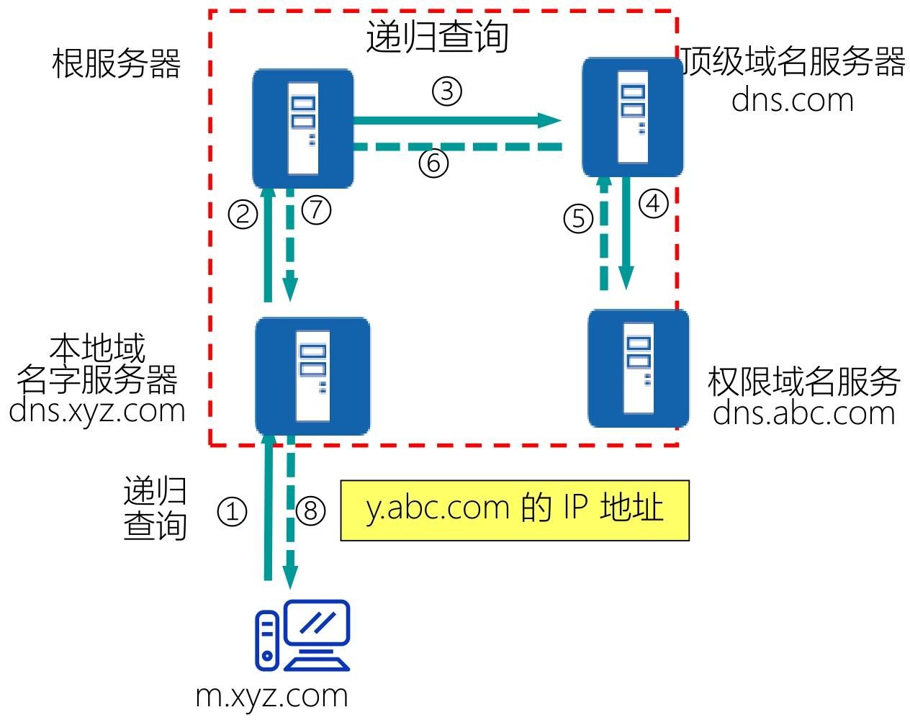

2. 迭代查询（指引式查询）：被查询的服务器若没有最终结果，仅返回 “下一级服务器的地址”，由请求方自行向下查询；

   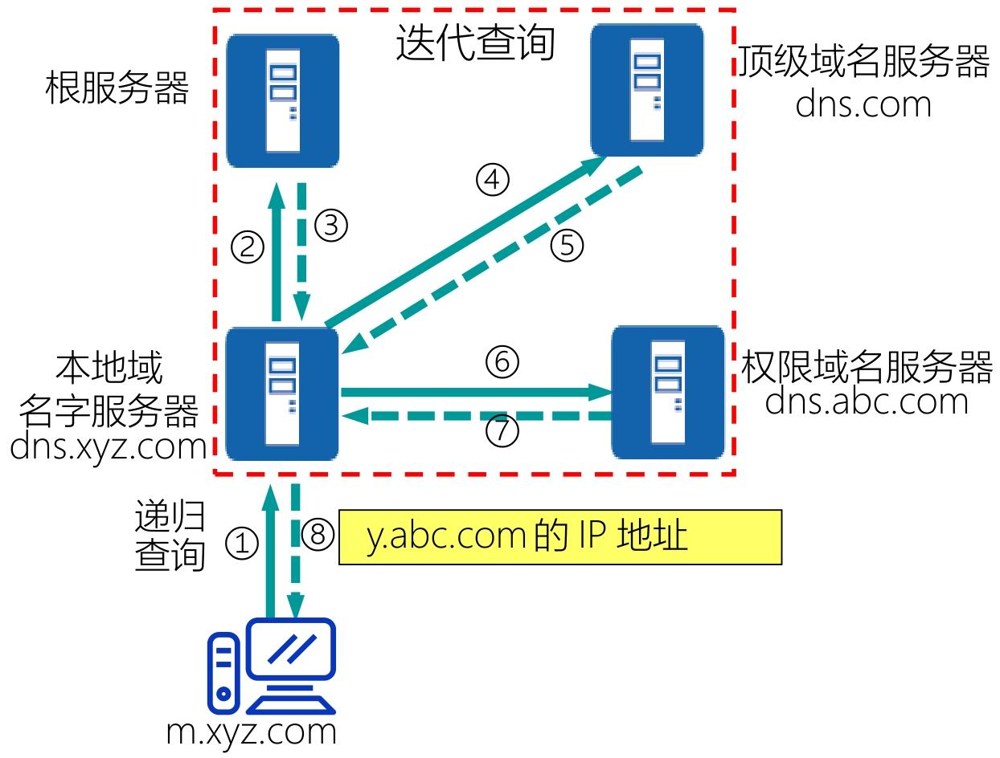

### 域名系统高速缓存（DNS 缓存）

DNS 缓存是所有域名服务器（本地、顶级域、权限域）的核心优化机制，本质是 “临时存储最近解析过的域名 - IP 映射及来源”

每个域名服务器都会维护一个专属缓存空间：

- 最近被查询过的 “域名→IP 地址” 映射记录
- 该映射记录的 “来源服务器地址”（如来自哪个权限域名服务器），确保后续验证或更新时能定位源头

> [!tip]
>
> DNS 和 ARP 都是 “地址映射工具”，但因作用于网络体系结构的不同层级，承担完全不同的使命
>
> - DNS：应用层地址 ↔ 网络层地址的映射翻译，具体是 “域名（应用层用户友好地址）” 与 “IP 地址（网络层路由地址）” 的相互转换（正向解析：域名→IP；反向解析：IP→域名）；
> - ARP：网络层地址 ↔ 数据链路层地址的映射翻译，具体是 “IP 地址（网络层地址）” 与 “MAC 地址（数据链路层物理地址）” 的相互转换（正向 ARP：IP→MAC；反向 ARP：MAC→IP）。

---

## 电子邮件服务

电子邮件（Email）是互联网最核心、使用最广泛的应用之一，其核心逻辑是 “**存储 - 转发**”—— 邮件并非直接从发件人终端发送到收件人终端，而是通过邮件服务器中转存储、逐步转发，最终送达收件人。

- 用户代理（User Agent，UA）：用户与电子邮件系统的接口，是用户机上运行的程序。
- 邮件服务器（Email Server）：收发邮件，运行邮件服务程序。
- 电子邮件协议：规范邮件传输、接收的 “通信规则”，确保不同厂商的用户代理和邮件服务器能互通。如 SMTP、POP3

### SMTP（简单邮件传输协议）

SMTP（Simple Mail Transfer Protocol）是邮件发送的标准协议，核心是 “将邮件从发件人服务器转发到收件人服务器”，基于 **TCP 协议实现可靠传输**

客户 / 服务器（C/S）模式 —— 发送邮件的进程（如发送端服务器的 SMTP 进程、用户代理的 SMTP 进程）是 SMTP 客户，接收邮件的进程（如接收端服务器的 SMTP 进程）是 SMTP 服务器；

默认使用 TCP 熟知端口 25（非安全端口）；

#### 通信三阶段：连接建立→邮件传送→连接释放

SMTP 的通信全程基于 TCP 连接，分为三个明确阶段

（1）第一阶段：连接建立（“打通通信通道”）

1. SMTP 客户（发送端）主动与 SMTP 服务器（接收端）的 25 端口建立 TCP 连接；
2. 服务器建立连接后，返回响应 “220 SMTP ready”（表示服务器已就绪）；
3. SMTP 客户发送 HELO 命令（附上发送方主机名，如 HELO [abc.edu.cn](https://abc.edu.cn/)），告知服务器 “我要发送邮件”；
4. 服务器若能接收邮件，返回 “250 OK”，表示连接建立成功，可开始传输邮件。

（2）第二阶段：邮件传送（“投递邮件内容”）

通过系列命令逐步传输邮件的 “信封（收件人 / 发件人地址）、首部（主题、日期）、主体（正文）”：

1. MAIL 命令：SMTP 客户发送 “MAIL FROM: 发件人地址”（如 MAIL FROM: Ling@jlu.edu.cn），告知服务器发件人信息；服务器返回 “250 OK” 确认；
2. RCPT 命令：SMTP 客户发送 “RCPT TO: 收件人地址”（如 RCPT TO: Wang@abc.com），告知服务器收件人信息（多个收件人需发送多条 RCPT 命令）；服务器返回 “250 OK” 确认（表示收件人地址有效，服务器已准备接收）；
3. DATA 命令：SMTP 客户发送 “DATA” 命令，告知服务器 “即将传输邮件内容”；服务器返回 “354 Start mail input; end with <CRLF>.<CRLF>”（表示可开始传输，以 “回车 + 换行 +.+ 回车 + 换行” 结束）；
4. 传输内容：SMTP 客户依次传输邮件首部（From、To、Date、Subject）、空行、邮件主体（正文内容），最后以 “.<CRLF>” 标识内容结束；
5. 服务器确认：服务器接收完内容后，返回 “250 OK”，表示邮件已成功接收并存储。

（3）第三阶段：连接释放（“关闭通信通道”）

1. 邮件传输完成后，SMTP 客户发送 “QUIT” 命令，告知服务器 “通信结束”；
2. 服务器返回 “221 close connection”，表示同意释放连接；

### 接收邮件协议

SMTP 仅负责将邮件送到接收端邮件服务器，用户需通过 POP3 或 IMAP 协议，从服务器的 “邮箱” 中取出邮件

1. POP3 协议（脱机取件）
   - **脱机协议** —— 用户代理（如 Outlook）通过 POP3 连接服务器后，会将邮件**完整下载到本地终端**，服务器上的邮件可选择保留或删除；
   - 端口：默认端口 110（非安全端口），安全端口 995（基于 SSL/TLS 加密）；
2.  IMAP 协议（联机取件）
   - **联机协议** —— 用户代理仅从服务器**同步邮件索引（如发件人、主题、时间）** ，查看邮件时才下载完整内容；服务器上的邮件始终保留，支持文件夹管理（如新建、移动、删除邮件）；
3. 端口：默认端口 143（非安全端口），安全端口 993（基于 SSL/TLS 加密）；

> [!note]
>
> 电子邮件服务的本质是 “**存储 - 转发 + 协议协同**”：
>
> - 存储转发：邮件通过服务器中转，避免终端直接通信的限制（如发件人离线时，服务器暂存邮件，待收件人上线后再投递）；
> - 协议分工：SMTP 负责 “发送 / 转发”，POP3/IMAP 负责 “接收”，各司其职，确保全流程可靠；

## FTP（文件传输协议）

FTP（文件传输协议）的核心是 “在异构主机间可靠传输文件”，其工作原理围绕**客户机 / 服务器（C/S）架构**展开，通过 “双连接分离控制与数据”“两种工作模式适配不同网络环境”

FTP 本质是 C/S 系统，客户机与服务器通过 “请求 - 执行 - 响应” 的逻辑协同工作：

- **FTP 客户机**：运行在用户终端（电脑、服务器）的客户端程序（如 FileZilla、Windows 自带 FTP 客户端），是 “命令发起方”—— 用户通过客户机输入操作指令（如登录、上传、下载），并接收服务器返回的结果（如文件数据、目录列表）。
- **FTP 服务器**：运行在远程主机的服务程序（如 vsftpd、FileZilla Server），是 “命令执行方”—— 监听固定端口，被动接收客户机连接，执行用户命令（如验证账号、读取文件、存储文件），并将结果返回给客户机。

FTP 最核心的设计是 “控制信息与数据传输分离”（即 “带外传送”），通过两个独立的 TCP 连接实现

- **端口21用于控制连接**，如用户标识、操作命令
- **端口20用于数据连接**

数据连接的建立方式，决定了 FTP 的两种工作模式 —— 核心差异是 “谁主动发起数据连接”

1. 主动模式（PORT 模式）：服务器主动发起数据连接

   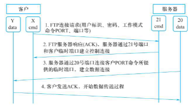

2. 被动模式（PASV 模式）：客户机主动发起数据连接

   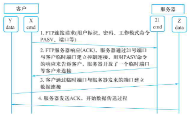

TFTP（简单文件传输协议）是 FTP 的轻量级替代方案，核心用于简单文件传输场景

- TFTP 基于 UDP（无连接），无需建立 TCP 连接，代码占用内存极小
- 仅支持文件传输（无登录验证、目录浏览等交互功能），需自带差错改正机制（如重传、校验）；

## Web 服务

Web 服务是互联网最主流的应用形态，核心是通过 “浏览器 - 服务器” 架构，让用户借助超文本技术便捷访问分布式网络资源。

- 万维网（World Wide Web）：本质是**分布式超文本系统**，核心能力是让互联网中不同计算机的文件通过 “链接” 相互关联，打破物理地址限制。
- Web 服务器：包含两部分 —— 硬件层面是存储 Web 资源的服务器设备，软件层面是运行在设备上、负责接收和响应浏览器请求的服务程序

两个概念以及对应的两个实现技术

1. 超文本（Hypertext）和 HTML（超文本标记语言）
   - 超文本（Hypertext）：打破传统文本的 “顺序关系”，**通过 “链接” 将不同文档、资源关联起来** —— 用户点击链接即可从一个资源跳转到另一个资源，实现跨文档漫游（如网页中的文字链接、图片链接）。
   - HTML（超文本标记语言）：解决 “资源统一标注” 问题，是 Web 文档的基础格式。通过标签定义资源类型
2. 通用资源定位符（URL）和 HTTP（超文本传输协议）
   - 通用资源定位符（URL）：解决 “资源定位” 问题，**为互联网上所有资源分配唯一标识**（即网址），无论资源类型（网页、图片、文件）和存储位置，都能通过 URL 精准定位。
   - HTTP（超文本传输协议）：规范浏览器与 Web 服务器的通信规则，定义请求 / 响应的格式和交互流程，是资源传输的 “桥梁”。

### 客户浏览网页基本过程

客户浏览网页的核心是 “浏览器与 Web 服务器的协同交互”，全程围绕 “建立连接→发起请求→传输资源→解析展示” 

1. 浏览器要和 Web 服务器**先建立TCP可靠的传输通道**，才能传递后续的请求和网页数据。
2. 浏览器会主动向 Web 服务器发送 **HTTP 请求报文**，核心是传递 “访问需求”。
3. HTTP 请求报文的核心是 “URL（统一资源定位符）”，它是网页资源的 “唯一身份证”，确保服务器能精准找到用户要访问的内容。
4. 服务器收到 HTTP 请求后，会**根据 URL 找到对应的网页资源**，并通过 HTTP 响应报文返回给浏览器。
5. 浏览器收到服务器返回的 HTML 资源后，会进行**解析和渲染**，最终以用户友好的格式展示出来。

### URL：资源的 “唯一身份证”

URL 是访问 Web 资源的核心标识，格式统一且对字符大小写不敏感，确保全球资源唯一可定位。

URL 由四部分组成，核心结构为：`协议://主机:端口/路径`

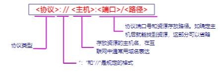