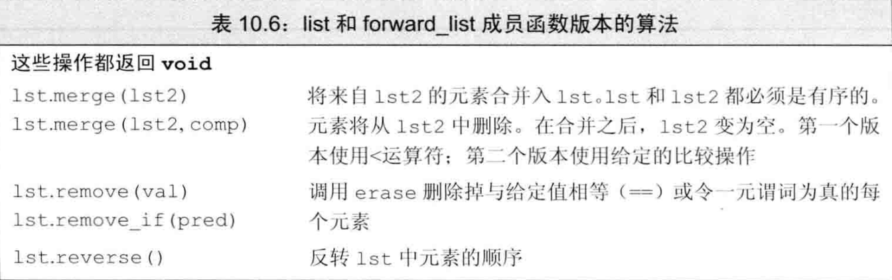
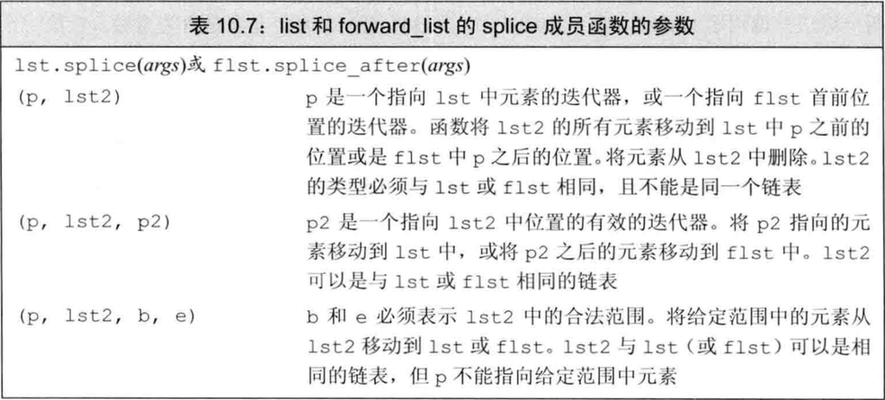

[TOC]

# C++ 泛型算法详解

## 迭代器进阶

迭代器是C++中连接容器和算法的桥梁，了解不同类型的迭代器及其特性对于高效使用泛型算法至关重要。

`#include <iterator>`

### 1. 插入迭代器 (Inserters)

> **迭代器特性**: 左闭合区间 `[begin, end)`，迭代器末端永远指向最后一个元素之后的位置（尾后位置）。这种设计保证了算法的简洁性和一致性。

---

## 泛型算法结构

插入迭代器是一种适配器，它将赋值操作转换为对应容器的插入操作。

#### 1.1 back_inserter

使用容器的 `push_back()` 方法在容器末尾添加元素。

```cpp
vector<int> vec;
auto it = back_inserter(vec); // 创建一个使用push_back的插入迭代器
*it = 42;  // 等价于 vec.push_back(42)
```

#### 1.2 front_inserter

使用容器的 `push_front()` 方法在容器开头添加元素（仅适用于支持此操作的容器，如 `list` 和 `deque`）。

**注意**: 使用 `front_inserter` 会**颠倒**元素的插入顺序，因为每个新元素都被插入到容器的开头。

```cpp
list<int> lst;
auto it = front_inserter(lst);
*it = 1; // lst: [1]
*it = 2; // lst: [2, 1]
*it = 3; // lst: [3, 2, 1]
```

#### 1.3 inserter

使用容器的 `insert()` 方法在指定位置前插入元素。与 `front_inserter` 不同，`inserter` 每次插入后会自增迭代器，因此插入顺序与赋值顺序一致。

```cpp
vector<int> vec = {1, 4, 7};
// 在vec[1]位置(即值为4的元素)之前插入新元素
auto it = inserter(vec, vec.begin() + 1);
*it = 2; // vec: [1, 2, 4, 7]
*it = 3; // vec: [1, 2, 3, 4, 7]
```

### 2. 流迭代器 (Stream Iterator)

流迭代器将流操作与迭代器接口连接起来，允许算法直接从输入流读取数据或向输出流写入数据。

#### 2.1 istream_iterator

从输入流中读取指定类型的数据。

**构造方式**:
- 默认构造：创建一个表示结束的迭代器（尾后迭代器）
- 使用输入流构造：关联到特定输入流

**从标准输入读入整数并构造vector**:

```cpp
// 方式一：使用循环
istream_iterator<int> in_iter(cin);
istream_iterator<int> eof; // 默认构造的迭代器代表输入结束
vector<int> vec;
while(in_iter != eof) {
    vec.push_back(*in_iter++);
}

// 方式二：直接使用迭代器范围构造
istream_iterator<int> in_iter(cin), eof;
vector<int> vec(in_iter, eof); // 从迭代器范围构造vec
```


**使用算法操作流迭代器**:

```cpp
// 计算输入的整数序列的总和
istream_iterator<int> in(cin), eof;
cout << accumulate(in, eof, 0) << endl;
```

#### 2.2 ostream_iterator

向输出流写入指定类型的数据。

```cpp
vector<int> vec = {1, 2, 3, 4, 5, 6, 7, 8, 9};
// 创建输出迭代器，第二个参数是分隔符
ostream_iterator<int> out_iter(cout, " ");

// 方式一：手动赋值
for (auto i : vec) {
    *out_iter++ = i;  // 输出i并跟一个空格
}
cout << "\n";

// 方式二：使用copy算法
copy(vec.begin(), vec.end(), out_iter);
cout << "\n";
```


### 3. 反向迭代器 (Reverse Iterator)

反向迭代器颠倒了元素的访问顺序，从容器的最后一个元素开始，向第一个元素方向移动。

**主要特点**:
1. `++it` 移动到前一个元素（向容器开头方向移动）
2. `--it` 移动到下一个元素（向容器末尾方向移动）
3. 包括 `rbegin()`、`rend()`、`crbegin()`、`crend()` 成员函数（`r` 表示反向，`c` 表示常量）
4. 不能用于单向链表 `forward_list` 和流迭代器
5. `base()` 成员函数可以将反向迭代器转换为对应的正向迭代器

```cpp
vector<int> vec = {1, 2, 3, 4, 5};
// 使用反向迭代器从尾到头遍历
for (auto it = vec.rbegin(); it != vec.rend(); ++it) {
    cout << *it << " "; // 输出: 5 4 3 2 1
}
```


---

==迭代器特性：左闭合区间，即[---->)，迭代末端永远是尾“后”，保证了算法的简洁和统一。==

---


# 泛型算法结构


### 1. 迭代器种类

每个泛型算法都对其使用的迭代器类型有特定要求。任何算法的最基本特性是它要求其迭代器提供哪些操作。

算法所要求的迭代器操作可以分为5个迭代器类别(iterator category)，每个算法都会对它的每个迭代器参数指明须提供哪些迭代器类型。

| 输入迭代器     | 只读，不写，单遍扫描，只能递增       | 判等(==、!=),递增(++),解引用(*),箭头运算符(->) |
| -------------- | ------------------------------------ | ---------------------------------------------- |
| 输出迭代器     | 只写，不读，单遍扫描，只能递增       | 递增(++),解引用(*)                             |
| 前向迭代器     | 可读写；多遍扫描，只能递增           | 输入输出、多次读写、可保存                     |
| 双向迭代器     | 可读写；多遍扫描，可递增递减         | 双向、支持--运算，                             |
| 随机访问迭代器 | 可读写；多遍扫描，支持全部迭代器运算 | 常量时间访问速度                               |


### 2. 算法形参模式

大多数标准库算法遵循以下四种基本形式之一：

1. `alg(beg, end, other_args)`
   - 对范围内元素进行操作

2. `alg(beg, end, dest, other_args)`
   - `dest` 是目标位置，算法假定从 `dest` 开始有足够空间来容纳写入的数据

3. `alg(beg, end, beg2, other_args)`
   - 算法假定从 `beg2` 开始的序列与 `beg` 和 `end` 表示的范围至少一样大

4. `alg(beg, end, beg2, end2, other_args)`
   - 同时使用两个迭代器范围

### 3. 算法命名规范

标准库算法的命名遵循一定的模式，理解这些模式有助于记忆和使用算法。

#### (1) 重载形式传递谓词

许多算法提供接受谓词（predicate）的重载版本：

```cpp
// 不使用谓词，使用默认的相等比较
unique(beg, end);
// 使用自定义的比较谓词
unique(beg, end, comp); 
```

#### (2) _if 版本算法

当算法需要接受一个元素值和一个谓词函数作为可选参数时，通常会提供带有 `_if` 后缀的版本：

```cpp
// 查找特定值
find(beg, end, val);
// 查找第一个满足谓词条件的元素
find_if(beg, end, pred); 
```

> 这种命名方式避免了参数数量相同可能导致的函数重载歧义。

#### (3) 拷贝与非拷贝版本

有些算法提供两个版本：一个在原序列上直接操作，另一个将结果写入新的目标位置。

```cpp
// 直接反转原序列
reverse(beg, end);
// 将反转后的序列写入目标位置，原序列保持不变
reverse_copy(beg, end, dest);
```

某些算法甚至同时提供 `_copy` 和 `_if` 版本：

```cpp
// 将满足条件的元素从v1拷贝到v2，v1保持不变
// 该示例将非偶数元素（即奇数）从v1拷贝到v2
remove_copy_if(v1.begin(), v1.end(), back_inserter(v2), 
              [](int i) { return i % 2; });
```

### 4. 特定容器算法

某些容器类型（如链表）提供了针对其数据结构特点优化的特殊成员算法，使用这些算法通常比通用泛型算法更高效。


以下是链表（`std::list`）的一些特殊成员函数：



png)

#### (1) splice 成员函数

`splice` 是链表的一个重要操作，用于将一个链表的元素移动到另一个链表：



#### (2) 链表特有操作的影响

由于链表特有算法的实现机制，这些操作会改变底层容器的结构，可能导致迭代器甚至链表对象本身失效。在使用这些操作时需要特别注意管理迭代器的有效性。

```cpp
list<int> lst1 = {1, 2, 3};
list<int> lst2 = {10, 20, 30};
auto it = lst1.begin();
++it; // 指向值2的元素
lst1.splice(lst1.end(), lst2, lst2.begin(), lst2.end());
// 此时lst2为空，lst1包含 {1, 2, 3, 10, 20, 30}
// it仍然有效，指向值2的元素
```


