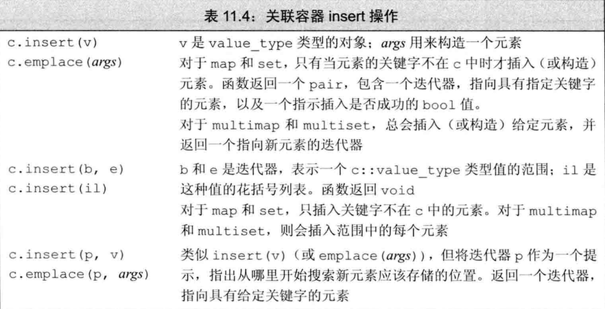

[TOC]

# C++ 关联容器详解

## 关联容器概述

关联容器是C++标准库中的一类重要容器，它们将值与键关联起来，并通过键快速访问值。两个主要的关联容器类型是 **map** 和 **set**。

C++标准库提供了8种关联容器，它们之间的区别主要体现在三个方面：

1. 容器类型：**map**（键值对）或 **set**（仅键）
2. 键的唯一性：键可以重复（multi）或必须唯一
3. 元素顺序：有序存储或无序（哈希表实现）存储

下表展示了8种关联容器的特点：


### 头文件和容器类型

- **有序容器**：
  - `map` 和 `multimap` 定义在 `<map>` 头文件中
  - `set` 和 `multiset` 定义在 `<set>` 头文件中
  
- **无序容器**：
  - `unordered_map` 和 `unordered_multimap` 定义在 `<unordered_map>` 头文件中
  - `unordered_set` 和 `unordered_multiset` 定义在 `<unordered_set>` 头文件中

## 1. 使用关联容器

所有关联容器都提供高效的关键字查询和访问操作。**关联容器的迭代器都是双向迭代器**，支持前向和后向遍历。

### 1.1 map 容器

`map` 是键值对（key-value pair）的集合，每个键对应一个值。

```cpp
map<string, int> word_count; // 字符串到整数的映射
word_count["hello"] = 1;     // 插入键值对 {"hello", 1}
```

`map` 类型通常被称为**关联数组**（associative array），与普通数组相比，其最大的不同在于**下标（键）不必是整数**，可以是任何能比较大小的类型。

### 1.2 set 容器

`set` 是关键字的简单集合，值就是键，每个键只能出现一次。

```cpp
set<string> exclude = {"the", "but", "and", "or", "an", "a"};
if (exclude.find("the") != exclude.end())
    cout << "Found 'the'" << endl;  // 将会执行
```

当我们只需要知道一个值是否存在时，`set` 是最有用的容器类型。

### 1.3 multi 容器

带有 `multi` 前缀的关联容器（`multimap`, `multiset`）允许多个元素具有相同的键。

```cpp
// 允许一个作者有多本书
multimap<string, string> authors;  // 作者到书名的映射
authors.insert({"Tolkien", "The Hobbit"});
authors.insert({"Tolkien", "The Lord of the Rings"});  // 同一作者的另一本书

// 允许集合中有重复元素
multiset<int> nums = {1, 3, 5, 7, 1, 3, 1};  // 包含多个1和3
cout << "Count of 1: " << nums.count(1) << endl;  // 输出：Count of 1: 3
```

对于普通的 `set` 和 `map`，插入重复键的元素不会产生任何效果，而 `multiset` 和 `multimap` 则会存储所有具有相同键的多个元素。

## 2. 关键字类型的要求

关联容器中的关键字必须能够**比较大小**，以便容器能对元素进行排序和查找。

### 默认排序准则

默认情况下，标准库使用关键字类型的 `<` 运算符进行比较。这意味着：

- 关键字类型必须定义 `<` 运算符
- 或者，必须提供自定义的比较函数

### 自定义排序准则

如果要使用自定义的比较方式，可以在模板参数中提供一个函数类型：

```cpp
// 使用自定义的比较函数
bool compareLength(const string &a, const string &b) {
    return a.size() < b.size();  // 按字符串长度比较
}

// 需要在类型后指定比较函数类型
map<string, int, decltype(compareLength)*> word_count(compareLength);
```

自定义的比较函数必须满足严格弱序（strict weak ordering）的要求，确保能够正确排序元素。

## 3. pair 类型

`pair` 是一个简单的模板类，用于将两个值组合在一起：

1. 定义在头文件 `<utility>` 中
2. 是一个模板：`pair<T1, T2>`
3. 数据成员是 `public` 的，分别为 `first` 和 `second`

### pair 的操作


### 创建和使用pair

```cpp
// 几种创建pair的方式
pair<string, int> word_count1;                  // 默认构造
pair<string, int> word_count2("hello", 1);      // 提供两个值构造
pair<string, int> word_count3 = {"world", 2};   // 列表初始化
auto p = make_pair("C++", 3);                   // 自动推断类型

// 访问pair成员
cout << p.first << ": " << p.second << endl;    // 输出：C++: 3
```

## 4. 关联容器操作

关联容器除了支持普通容器操作外，还提供了特定于关联容器的操作，如按键查找等。


使用作用域运算符(`::`)可以访问容器的类型成员，例如 `map<string, int>::key_type` 表示 map 的键类型。

## 5. 关联容器迭代器

关联容器的迭代器有一些特殊性质，了解这些特性对于正确使用它们非常重要。

### 5.1 解引用关联容器迭代器

当我们解引用一个关联容器的迭代器时，得到的是一个 `value_type` 类型的值的引用：

```cpp
map<string, int>::iterator it = word_count.begin();
// *it 是一个 pair<const string, int>& 类型
cout << it->first << ": " << it->second << endl;
```

对于 `map`，`value_type` 是 `pair<const KeyType, ValueType>`，第一个成员（键）是常量，不能被修改。

> **注意**：map 的 value_type 是一个 pair，我们可以改变 pair 的值部分，但不能改变关键字部分。

### 5.2 set 的迭代器是常量迭代器

由于 `set` 中元素的值就是键，且键是常量，因此 `set` 的迭代器是常量迭代器，不能用来修改元素值：

```cpp
set<int> iset = {1, 2, 3};
set<int>::iterator it = iset.begin();
// *it = 42;  // 错误：set的元素是const的，不能修改
```

### 5.3 遍历关联容器

可以使用 `begin()` 和 `end()` 操作，以及范围for循环来遍历关联容器：

```cpp
map<string, int> word_count = {{"hello", 1}, {"world", 2}};

// 使用迭代器
for (auto it = word_count.begin(); it != word_count.end(); ++it) {
    cout << it->first << ": " << it->second << endl;
}

// 使用范围for循环
for (const auto& pair : word_count) {
    cout << pair.first << ": " << pair.second << endl;
}
```

### 5.4 关联容器和泛型算法

通常不对关联容器使用泛型算法，原因有两个：

1. **关键字是常量**：关联容器的关键字是 `const` 的，这意味着算法无法修改 `set` 的元素和 `map` 元素（pair）的第一个成员，因此不能用于修改或重排容器元素的算法。

2. **查找效率**：关联容器提供的查找算法通常比泛型算法快得多，因为它们利用了关联容器的内部结构。

在实际使用中，如果要对关联容器使用算法，通常有两种情况：
- 将关联容器作为输入源序列
- 将关联容器作为目标位置（通常需要使用插入迭代器）

## 6. 添加元素

向关联容器中添加元素通常使用 `insert()` 方法，可以插入一个元素或一个范围的元素。

### 6.1 pair的四种创建方式

向 `map` 添加元素时，我们需要创建键值对（pair）。C++提供了多种创建 pair 的方式：


### 6.2 insert和emplace操作

关联容器提供了多种插入元素的方法：



```cpp
// 向map中插入元素的不同方式
map<string, int> word_count;

// 方式1：使用insert和value_type
word_count.insert(map<string, int>::value_type("hello", 1));

// 方式2：使用insert和pair
word_count.insert(pair<string, int>("world", 2));

// 方式3：使用insert和花括号列表初始化
word_count.insert({"C++", 3});

// 方式4：使用emplace直接构造
word_count.emplace("programming", 4);

// 插入范围
map<string, int> other_words = {{"book", 5}, {"pen", 6}};
word_count.insert(other_words.begin(), other_words.end());
```

### 6.3 检测插入操作的返回值

对于不允许重复键的容器（`map`、`set`），添加**单一元素**的 `insert` 和 `emplace` 返回一个pair：
```cpp
pair<iterator, bool>
```
其中：
- 第一个成员是一个迭代器，指向具有给定键的元素
- 第二个成员是一个布尔值，如果插入成功则为true，如果键已存在则为false

```cpp
// 检测插入是否成功
auto ret = word_count.insert({"hello", 1});
if (ret.second) {
    cout << "插入成功" << endl;
} else {
    cout << "元素已存在，插入失败" << endl;
    cout << "已存在的值：" << ret.first->second << endl;
}
```

**注意**：对于允许重复键的容器（`multimap`、`multiset`），`insert` 仅返回指向新插入元素的迭代器，不返回布尔值，因为插入总是成功的。

## 7. 删除元素

从关联容器中删除元素通常使用 `erase()` 方法。

### 7.1 erase操作

关联容器支持三种形式的 `erase` 操作：

1. **删除指定迭代器指向的元素**
2. **删除一个迭代器范围内的所有元素**
3. **删除所有匹配特定键的元素**（关联容器特有）


```cpp
map<string, int> word_count = {{"hello", 1}, {"world", 2}, {"C++", 3}};

// 通过迭代器删除
auto it = word_count.find("hello");
if (it != word_count.end())
    word_count.erase(it);  // 删除"hello"

// 通过键删除
size_t removed = word_count.erase("world");  // 返回值是1，表示删除了一个元素

// 删除一个范围
word_count.erase(word_count.begin(), word_count.end());  // 清空map
```

当使用键作为参数调用 `erase` 时，函数返回实际删除的元素数量。这对于 `multimap` 和 `multiset` 特别有用，可以知道有多少具有相同键的元素被删除了。

## 8. map的下标操作

`map` 类型提供了下标运算符(`[]`)和 `at()` 函数来直接访问与特定键关联的值。

### 8.1 下标操作和at函数

```cpp
map<string, int> word_count;

// 使用下标操作 - 如果键不存在，会创建元素并进行值初始化
word_count["hello"] = 1;  // 添加新元素
word_count["hello"]++;    // 更新现有元素

// 使用at函数 - 如果键不存在，会抛出异常
try {
    word_count.at("world")++;  // 如果"world"不存在，抛出out_of_range异常
} catch (const out_of_range& e) {
    cout << "键不存在: " << e.what() << endl;
}
```

### 8.2 下标运算符的特性


**重要特性**：
1. **Set不支持下标操作**，因为set的元素本身就是键，没有对应的值可以获取或修改。

2. **下标运算符的自动插入行为**：
   > 使用下标运算符时，如果关键字不在map中，会自动创建一个新元素并插入到map中，关联值将进行值初始化（对于内置类型是0，对于类类型调用默认构造函数）。

3. **下标运算符仅适用于非const map**：
   由于下标操作可能插入新元素，因此只能对非const的map使用下标运算符。

4. **下标操作vs解引用**：
   - 下标操作返回 `mapped_type` 对象（值类型）
   - 解引用迭代器返回 `value_type` 对象（键值对）

```cpp
// 区别示例
map<string, int> word_count = {{"hello", 1}};
int& count1 = word_count["hello"];  // 下标返回值类型的引用
pair<const string, int>& pair1 = *word_count.find("hello");  // 解引用返回pair的引用
```

## 9. 访问元素

关联容器提供了多种访问元素的方法，包括查找特定元素和范围内的元素。


### 9.1 查找元素

在关联容器中，查找特定键的元素通常使用 `find` 函数：

```cpp
map<string, int> word_count = {{"hello", 1}, {"world", 2}};
auto it = word_count.find("hello");
if (it != word_count.end())
    cout << it->first << ": " << it->second << endl;
```

**对map使用find而非下标操作**：如果只是想检查一个键是否存在而不想修改容器，应该使用 `find` 而非下标操作。下标操作会在键不存在时插入新元素。

### 9.2 处理multimap或multiset中的元素

对于允许重复键的容器，需要特殊的技术来处理具有相同键的多个元素。

#### 方法一：使用find和count

```cpp
// 在multimap中查找特定作者的所有书籍
string search_item("Alain de Botton");
auto entries = authors.count(search_item);  // 获取元素的数量
auto iter = authors.find(search_item);      // 获取第一个匹配元素的迭代器

// 遍历所有匹配的元素
while (entries) {
    cout << iter->second << endl;  // 打印书名
    ++iter;      // 移动到下一个元素
    --entries;   // 减少计数
}
```
#### 方法二：使用lower_bound和upper_bound

`lower_bound` 返回指向第一个具有给定键的元素的迭代器，`upper_bound` 返回指向最后一个具有给定键之后位置的迭代器：

```cpp
// 使用迭代器范围查找特定作者的所有书籍
for (auto beg = authors.lower_bound(search_item),
         end = authors.upper_bound(search_item);
     beg != end; ++beg) {
    cout << beg->second << endl;  // 打印书名
}
```

#### 方法三：使用equal_range

`equal_range` 函数一次性返回一对迭代器，表示具有给定键的元素范围：

```cpp
// equal_range返回表示范围的迭代器对
auto range = authors.equal_range(search_item);
for (auto it = range.first; it != range.second; ++it) {
    cout << it->second << endl;  // 打印书名
}
```

`equal_range` 返回一个 `pair`，其中 `first` 成员等价于 `lower_bound` 的返回值，`second` 成员等价于 `upper_bound` 的返回值。

## 10. 无序容器

C++11新增了四种无序关联容器（unordered_map、unordered_set、unordered_multimap和unordered_multiset），它们不是使用比较运算符来组织元素，而是使用**哈希函数**（hash function）和键类型的**相等运算符**（`==`）。

### 10.1 无序容器的基本原理

**哈希组织**：无序容器使用哈希技术来组织元素，相比于有序容器的树形结构，哈希表通常提供更好的平均查找性能。

**基本操作**：除了组织方式不同外，无序容器的大部分操作与有序容器相同。所有适用于有序容器的操作（如插入、删除、查找等）都可以用于对应的无序容器。

```cpp
// 无序容器示例
unordered_map<string, int> word_count;
word_count["hello"] = 1;
word_count["world"] = 2;

// 查找操作与有序map相同
auto it = word_count.find("hello");
if (it != word_count.end())
    cout << it->first << ": " << it->second << endl;
```

### 10.2 桶管理

无序容器在内部组织为一组**桶**（bucket），每个桶保存零个或多个元素：

1. **哈希过程**：
   - 容器使用哈希函数将键转换为哈希值
   - 哈希值决定元素应存储在哪个桶中
   - 所有具有相同哈希值的元素都存储在同一个桶中

2. **性能影响因素**：
   - 哈希函数的质量（避免冲突）
   - 桶的数量（足够多以减少冲突）
   - 桶的大小（每个桶中元素过多会降低查找性能）

无序容器提供了一组桶管理函数：


```cpp
// 检查和管理桶
unordered_map<string, int> word_count;
// 填充容器...

// 显示容器状态
cout << "桶数量: " << word_count.bucket_count() << endl;
cout << "负载因子: " << word_count.load_factor() << endl;

// 重组容器
word_count.rehash(2 * word_count.bucket_count());  // 增加桶数量
```

### 10.3 自定义类型的要求

要将自定义类型用作无序容器的键，必须满足两个要求：

1. **相等比较**：必须定义 `==` 运算符
2. **哈希函数**：必须提供计算哈希值的函数

```cpp
// 为自定义类型提供哈希支持
struct Person {
    string name;
    int age;
    
    bool operator==(const Person& p) const {
        return name == p.name && age == p.age;
    }
};

// 为Person类型定义哈希函数
namespace std {
    template<>
    struct hash<Person> {
        size_t operator()(const Person& p) const {
            return hash<string>()(p.name) ^ hash<int>()(p.age);
        }
    };
}

// 现在可以使用Person作为键了
unordered_map<Person, string> person_map;
```

标准库为所有内置类型（包括指针）和一些标准库类型（如`string`和智能指针）提供了哈希函数。

例如:

````cpp
size_t hasher (const Sales_data &sd) {
  return hash<string>() ( sd.isbn() );//hash<string>() 产生一个string的hash对象,调用()运算符来运算 sd.isbn() 的hash值.

// 推荐：避免不必要的构造或插入时，可以使用 C++17 的 try_emplace。
// try_emplace 只有在键不存在时才构造对应的 mapped_type，且不会发生额外的拷贝或移动。
// 例如：
// auto [it, inserted] = word_count.try_emplace("new_key", 42);
// if (inserted) cout << "Inserted new_key with value 42" << endl;

}
bool eqOp (const Sales_data &lhs, const Sales_data &rhs) {
  return lhs.isbn() == rhs.isbn() ;
}

unordered_multiset<Sales_data, decltype(hasher)*, decltype(eqOp)*> bookStore (42, hasher, eqOp);//传递hash和==的函数指针
````
