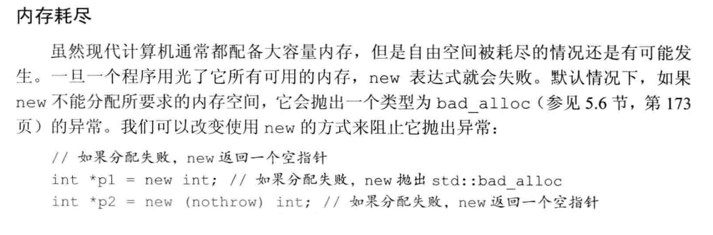
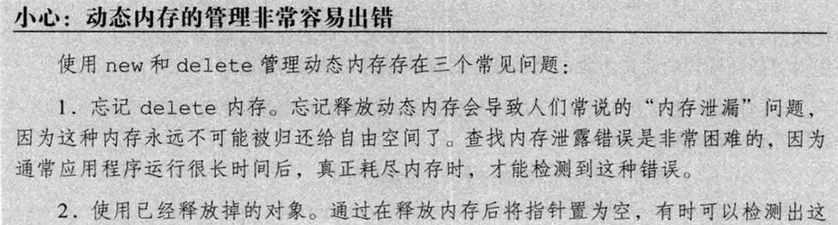
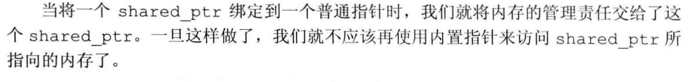
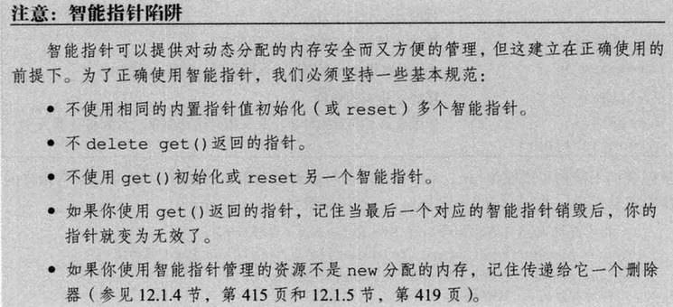
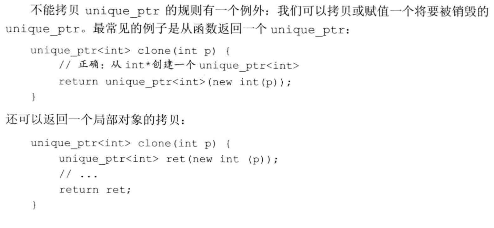
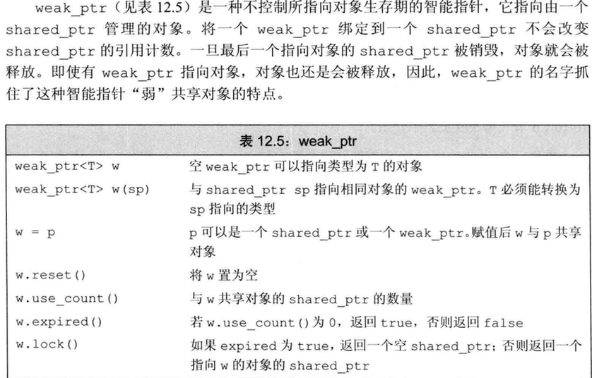
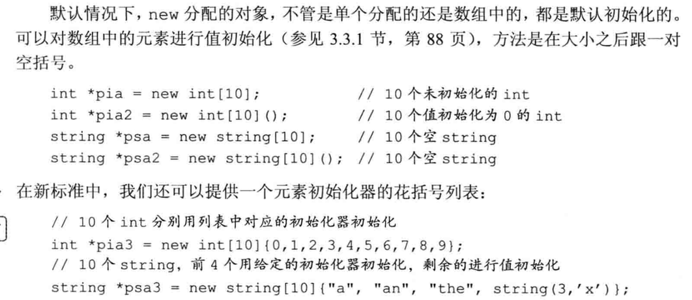
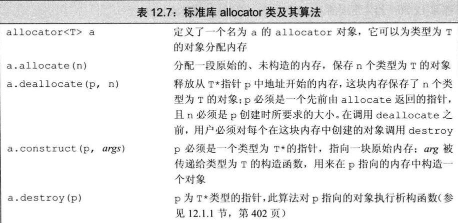
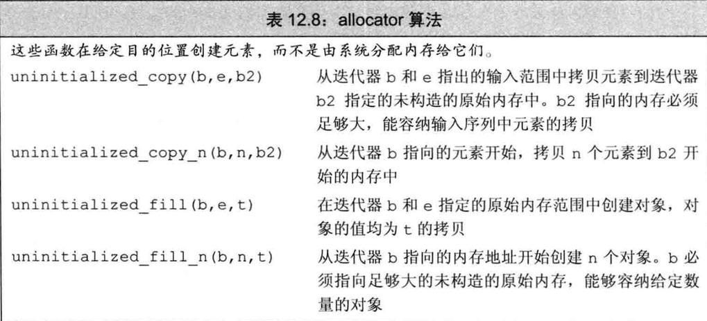

[TOC]

# C++ 动态内存管理

C++的动态内存管理是一个强大但复杂的特性。良好的内存管理对于编写高效、稳定的C++程序至关重要。本章探讨C++中动态内存的分配、使用和释放方法，特别关注现代C++中智能指针的应用。

## 本节要点

- 首选使用标准库智能指针（`make_shared` / `make_unique`）管理动态资源，避免直接使用裸 `new`/`delete`。
- `shared_ptr` 实现共享所有权；`unique_ptr` 实现独占所有权；`weak_ptr` 用于观察 `shared_ptr` 管理的对象且不增加引用计数，常用于打破循环引用。
- 管理动态数组时，优先使用 `unique_ptr<T[]>` 或标准容器（如 `std::vector<T>`）；若使用 `shared_ptr` 管理数组，必须提供自定义删除器。
- `std::allocator` 可将内存分配与对象构造分离，适用于需要精细控制内存和对象构造的场景。

## 一、智能指针

智能指针是C++标准库提供的模板类，用于自动管理动态分配的内存，有效防止内存泄漏和指针悬挂等常见问题。

- 定义在`<memory>`头文件中
- 基于RAII（资源获取即初始化）原理设计
- C++11引入了三种智能指针：`shared_ptr`、`unique_ptr`和`weak_ptr`

### 1. shared_ptr

`shared_ptr`是一种共享所有权的智能指针，多个`shared_ptr`可以指向同一个对象，当最后一个指向该对象的`shared_ptr`被销毁时，对象才会被释放。

#### 基本用法

```cpp
// 创建shared_ptr
shared_ptr<string> p1;         // 默认初始化为空指针
shared_ptr<list<int>> p2;      // 指向list<int>的空指针
shared_ptr<int> p3 = make_shared<int>(42);  // 指向值为42的int
shared_ptr<string> p4 = make_shared<string>("Hello");  // 指向字符串

// 使用shared_ptr
if (p4) {                      // 检查p4是否为空
    cout << *p4 << endl;       // 解引用智能指针
    cout << p4->size() << endl; // 访问指向对象的成员
}
```

1. 默认初始化的智能指针保存着一个空指针
2. 解引用一个智能指针返回它指向的对象
3. `make_shared`函数是创建`shared_ptr`的首选方式，它在单次内存分配中同时创建对象和控制块

#### shared_ptr操作

`shared_ptr`提供了多种操作方法来管理共享对象：


.png)

#### 引用计数

`shared_ptr`通过引用计数机制跟踪有多少个智能指针共享同一个对象：

```cpp
auto p1 = make_shared<int>(42);  // 引用计数为1
auto p2 = p1;                    // 引用计数增加到2
{
    auto p3 = p1;                // 引用计数增加到3
}                               // p3离开作用域，引用计数减为2
p1.reset();                     // p1不再指向该对象，引用计数减为1
// 当p2离开作用域，引用计数变为0，对象被自动删除
```

#### 1.1 直接管理内存

除了使用智能指针外，C++也允许程序员直接管理动态内存，但这要求程序员自行确保内存的正确释放，防止内存泄漏和悬挂指针问题。

##### 1.1.1 new 和 delete 运算符

`new`运算符用于动态分配内存，`delete`运算符用于释放动态分配的内存：


**初始化方式**：

```cpp
// 内置类型的初始化
new int;       // 默认初始化，值未定义
new int();     // 值初始化为0
new int(42);   // 初始化为42

// 类类型的初始化
new string;    // 默认初始化为空字符串
new string();  // 同上，值初始化
new string("Hello");  // 初始化为"Hello"

// C++11的列表初始化
new int{42};   // 初始化为42
new vector<int>{1, 2, 3, 4};  // 初始化为包含1,2,3,4的vector
```


**内存释放**：

```cpp
int* p1 = new int(42);    // 分配一个int
delete p1;                // 释放int

int* p2 = new int[10];    // 分配10个int的数组
delete[] p2;              // 释放数组
```



##### 1.1.2 定位new表达式（placement new）

定位new表达式允许在预先分配的内存上构造对象，或者传递额外参数给分配函数：




**示例**：

```cpp
// 使用nothrow选项
int* p = new(nothrow) int(42);  // 如果分配失败，返回nullptr而非抛出异常

// 在预先分配的缓冲区上构造对象
char buffer[sizeof(int)];
int* p = new(buffer) int(42);   // 在buffer上构造int对象
```

#### 1.2 智能指针和原始指针的结合使用

智能指针需要与传统的原始指针交互，尤其是与那些使用C风格内存管理的代码协作时。

##### 从原始指针创建智能指针


```cpp
// 使用原始指针初始化智能指针
int* raw_ptr = new int(42);
shared_ptr<int> sp(raw_ptr);  // shared_ptr接管内存管理

// 推荐使用make_shared而不是上述方式
auto sp2 = make_shared<int>(42);  // 更安全、更高效
```

##### 自定义删除器


```cpp
// 为需要特殊清理的资源定义删除器
auto deleter = [](FILE* fp) { fclose(fp); };
shared_ptr<FILE> fp(fopen("data.txt", "r"), deleter);
// 当fp离开作用域，会调用deleter来关闭文件
```


> [!WARNING]
>
> **所有权转移注意事项**
>
> 
>
> 一个动态分配的对象应该只由一种智能指针类型管理。混合使用不同类型的智能指针，或者混用智能指针和原始指针管理同一对象，会导致多重释放或悬挂指针问题。

> [!WARNING]
>
> **谨慎使用get方法**
>
> 
>
> 若使用`get()`方法获取的原始指针初始化另一个智能指针，会出现两个独立的智能指针（**计数器不共享**）指向相同的内存，导致**未定义行为**，通常是对象被释放两次。
>
> ```cpp
> shared_ptr<int> p1(new int(42));
> // 错误用法：会导致double free
> shared_ptr<int> p2(p1.get());  // p1和p2各自维护引用计数
> ```

#### 1.3 reset和智能指针的安全修改

`reset`方法允许智能指针指向新对象，同时正确处理原对象的引用计数：

```cpp
// 安全地修改shared_ptr指向的对象
if (!p.unique()) {
    p.reset(new string(*p));  // 如果有其他shared_ptr指向同一对象，先创建副本
}
*p += newVal;  // 现在确保p是唯一指向该对象的指针，可以安全修改

// 重置为空或其他对象
shared_ptr<int> p1(new int(42));
p1.reset();                // p1现在为空
p1.reset(new int(1024));   // p1指向新值1024
```

#### 使用场景示例

```cpp
// 实现写时复制的字符串类
class CopyOnWriteString {
private:
    shared_ptr<string> text;
public:
    CopyOnWriteString(const string& s) : text(make_shared<string>(s)) {}
    
    void modify(const string& newText) {
        if (!text.unique())  // 如果有其他对象共享此文本
            text.reset(new string(*text));  // 创建副本
        *text = newText;  // 修改文本
    }
    
    string get() const { return *text; }
};
```

### 2. 异常安全和内存管理

智能指针在异常处理中特别有用，因为它们能够自动释放不再需要的内存，防止内存泄漏。


**对比原始指针和智能指针在异常情况下的行为**：

```cpp
// 使用原始指针 - 可能导致内存泄漏
void f() {
    int *ip = new int(53);
    // 如果这里发生异常且未在f中被捕获
    // ip指向的内存永远不会被释放
    delete ip;  // 如果前面有异常，这行代码不会执行
}

// 使用智能指针 - 异常安全
void g() {
    shared_ptr<int> sp(new int(53));
    // 即使发生异常，sp也会被正确销毁
    // sp指向的内存会被自动释放
}
```

> 智能指针也是处理那些具有复杂清理要求（如文件句柄、网络连接等）的资源的理想选择。

> [!IMPORTANT]
>
> 
>
> 使用RAII（资源获取即初始化）模式和智能指针是现代C++中管理资源的最佳实践。


---


### 3. unique_ptr

`unique_ptr`是一种独占所有权的智能指针，不允许多个指针指向同一对象。它提供了对动态分配资源的专属访问。


#### 3.1 基本用法

```cpp
// 创建unique_ptr
unique_ptr<int> p1(new int(42));
unique_ptr<string> p2 = make_unique<string>("Hello");  // C++14引入的函数

// 使用unique_ptr
if (p1) {
    cout << *p1 << endl;  // 访问指向的对象
}

// 释放所有权
p1.reset();  // 释放对象，p1变为空
p2.reset(new string("World"));  // 释放旧对象，指向新对象
```

#### 3.2 使用自定义删除器

`unique_ptr`支持自定义删除器，但删除器类型是智能指针类型的一部分。

**1. 使用函数对象作为删除器**

```cpp
#include <iostream>
#include <memory>

// 自定义删除器
struct CustomDeleter {
    void operator()(int* ptr) const {
        std::cout << "CustomDeleter called\n";
        delete ptr;
    }
};

int main() {
    std::unique_ptr<int, CustomDeleter> u1(new int(42));  // 使用自定义删除器
    // 当u1离开作用域时，会调用CustomDeleter
    return 0;
}
```

**2. 使用lambda表达式作为删除器**

```cpp
#include <iostream>
#include <memory>

int main() {
    auto deleter = [](int* ptr) {
        std::cout << "Lambda deleter called\n";
        delete ptr;
    };

    std::unique_ptr<int, decltype(deleter)> u2(new int(42), deleter);  // 使用lambda删除器
    // 当u2离开作用域时，会调用lambda删除器
    return 0;
}
```

#### 3.3 所有权转移

由于`unique_ptr`不共享所有权，复制是不允许的，但可以通过移动语义转移所有权：


```cpp
unique_ptr<int> p1(new int(42));
// unique_ptr<int> p2 = p1;  // 错误：不允许复制

// 转移所有权
unique_ptr<int> p3 = std::move(p1);  // p1现在为空，p3接管了资源
p1 = std::move(p3);  // 所有权再次转移回p1，p3现在为空
```

#### 3.4 传递和返回unique_ptr



```cpp
// 返回unique_ptr
unique_ptr<int> createInt(int value) {
    return unique_ptr<int>(new int(value));  // 可以返回临时unique_ptr
    // 或者更简洁地
    return make_unique<int>(value);  // C++14
}

// 使用返回的unique_ptr
auto p = createInt(42);
```

> [!NOTE]
>
> 
>
> 从C++14开始，推荐使用`std::make_unique`创建`unique_ptr`，这样更安全且更简洁。


---


### 4. weak_ptr

`weak_ptr`是一种不控制所指向对象生存期的智能指针，它指向由`shared_ptr`管理的对象，但不会影响对象的引用计数。



#### 4.1 基本用法

`weak_ptr`主要用于**解决循环引用**问题，以及在不确定对象是否还存在时安全地访问该对象。

```cpp
// 创建weak_ptr
shared_ptr<int> sp = make_shared<int>(42);
weak_ptr<int> wp = sp;  // wp观察sp指向的对象但不增加引用计数

// 检查对象是否存在并使用
if (shared_ptr<int> locked = wp.lock()) {
    // 对象仍然存在
    cout << "Value: " << *locked << endl;
} else {
    // 对象已被销毁
    cout << "Object no longer exists" << endl;
}
```

#### 4.2 使用lock方法安全访问对象

`lock`方法是`weak_ptr`的核心功能，它尝试提升`weak_ptr`为`shared_ptr`：

```cpp
#include <iostream>
#include <memory>

int main() {
    std::shared_ptr<int> sp = std::make_shared<int>(42);
    std::weak_ptr<int> wp = sp;

    // 对象仍存在时的lock
    if (auto locked_sp = wp.lock()) {
        std::cout << "Locked shared_ptr value: " << *locked_sp << std::endl;
        std::cout << "Original shared_ptr use count: " << sp.use_count() << std::endl;
        std::cout << "Locked shared_ptr use count: " << locked_sp.use_count() << std::endl;
    } else {
        std::cout << "The managed object has been deleted." << std::endl;
    }

    // 销毁原始shared_ptr
    sp.reset();

    // 对象已销毁时的lock
    if (auto locked_sp = wp.lock()) {
        std::cout << "Object still exists." << std::endl;
    } else {
        std::cout << "The managed object has been deleted." << std::endl;
    }

    return 0;
}
```

#### 4.3 lock方法的工作原理

`std::weak_ptr::lock`方法返回一个`std::shared_ptr`，具有以下特性：

1. **如果原对象存在**：返回一个新的`shared_ptr`，该指针与其他指向同一对象的`shared_ptr`共享所有权。引用计数会增加，反映新的`shared_ptr`的存在。

2. **如果原对象已销毁**：返回一个空的`shared_ptr`（等价于默认构造的`shared_ptr`）。

3. **临时对象处理**：如果调用`wp.lock()`但不保存返回值，创建的`shared_ptr`会在语句结束时立即销毁，引用计数会相应减少。

#### 4.4 解决循环引用问题

```cpp
class Node {
public:
    shared_ptr<Node> next;  // 强引用可能导致循环引用
    weak_ptr<Node> parent;  // 使用weak_ptr避免循环引用
    
    ~Node() {
        cout << "Node destroyed" << endl;
    }
};

int main() {
    auto parent = make_shared<Node>();
    auto child = make_shared<Node>();
    
    // 建立双向引用
    parent->next = child;
    child->parent = parent;  // 使用weak_ptr避免循环引用
    
    // 当我们释放这些指针时，对象能正确释放
    // 如果都使用shared_ptr，将导致内存泄漏
    return 0;
}
```


## 二、动态数组

动态数组是在运行时动态分配的一组连续的对象，其大小在编译时不需要知道。C++提供多种管理动态数组的方式。


### 1.  new 和数组

#### 1.1 声明方式：

1. `int * pia = new int [ size_t ] ;`

2. ````cpp
   typedef int arrT [42];
   int *p = new arrT;  //实际和方式一等效
   ````

> [!NOTE]
>
> 实际上所谓的“动态数组”并不是数组，使用new T []获得的T类型指针ptr，虽然我们可以通过ptr访问申请到的空间，但是不能对它调用  
>
> `begin`或`end`，也不能用范围 for 语句来处理动态数组中的元素。


#### 1.2 初始化：



> [!IMPORTANT]
>
> 

> [!IMPORTANT]
>
> 不能用 auto 分配数组
>
> `auto p = new auto[10](1)  //错误` 

> [!NOTE]
>
> `new T[0]`是合法的
>
> 


#### 1.3 释放动态数组

```cpp
// 错误用法示例（不要这样做，会导致 double free）
// shared_ptr<int> p1(new int(42));
// 错误示例（不要这样做）：
// shared_ptr<int> p2(p1.get());  // p1 和 p2 各自认为自己拥有该裸指针 -> double free
// 正确示例：
// auto p2 = p1; // 共享所有权
// weak_ptr<int> wp = p1; // 仅观察，不增加引用计数

// 正确做法：直接复制 shared_ptr 或使用 weak_ptr 来观察
{
    auto p1 = std::make_shared<int>(42);
    auto p2 = p1; // 正确，共享同一个控制块，引用计数安全增加
}

// 如果只想观察而不影响生命周期，可使用 weak_ptr
{
    auto p1 = std::make_shared<int>(100);
    std::weak_ptr<int> wp = p1; // 不增加引用计数
    if (auto sp = wp.lock()) {
        // 可以安全地使用 sp
    }
}
```
>
> 


#### 1.4 智能指针和动态数组

> 使用 unique_ptr 管理 new 分配的数组。

```cpp
shared_ptr<int> p1 = make_shared<int>(42); // 推荐：使用 make_shared
// 错误示例（不要这样做）：
// shared_ptr<int> p2(p1.get());  // 错误用法：p1和p2各自维护引用计数 -> double free

// 正确做法：共享所有权
auto p2 = p1; // p1 和 p2 共享引用计数

// 或者，仅想观察但不拥有：使用 weak_ptr
weak_ptr<int> wp = p1; // 不增加引用计数，仅观察
``` 
up.reset(); // 释放并删除数组（调用 delete[]）
````


> shared_ptr 本质上仍是一个**单一对象的指针**，因此要使用它管理动态数组，需要**自行定义删除器**。


### 2. allocator 类

> std::allocator 类定义在头文件 memory 中，它帮助我们将**内存分配和对象构造分离**开来。它提供一种类型感知的内存分配方法，它分配的内存是原始的、未构造的。


#### 2.1 new 的局限性：

**内存分配和对象构造绑定**

1. 提前分配**并初始化**了可能不需要使用的对象。

2. 对于确实要使用的对象，在初始化时进行了默认初始化，但默认初始化往往不是我们所需要的，重复赋值造成了资源浪费。

3. > [!IMPORTANT]
   >
   > 使得没有默认构造函数的类无法动态分配数组


#### 2.2 allocator类的使用

> std::allocator 是一个模板

````cpp
allocator<string> alloc; // 可以分配string的allocator对象
auto const p = alloc.allocate(n); // 分配 n 个未构造的 string 存储空间（未初始化）
// 需要手动构造 / 销毁 / 释放：
for (size_t i = 0; i < n; ++i)
    alloc.construct(p + i, ""); // 在分配的原始内存上构造对象

// 使用完毕后，先销毁对象再释放内存
for (size_t i = 0; i < n; ++i)
    alloc.destroy(p + i);
alloc.deallocate(p, n);
````




#### 2.3 拷贝和填充


