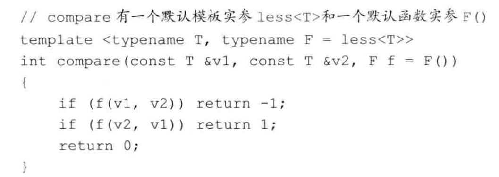
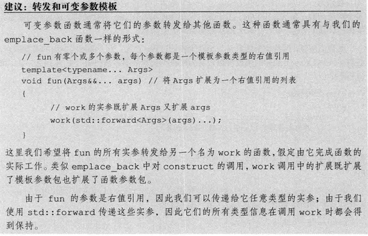
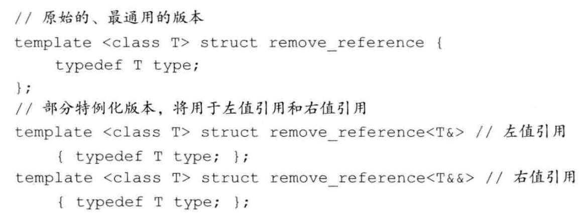
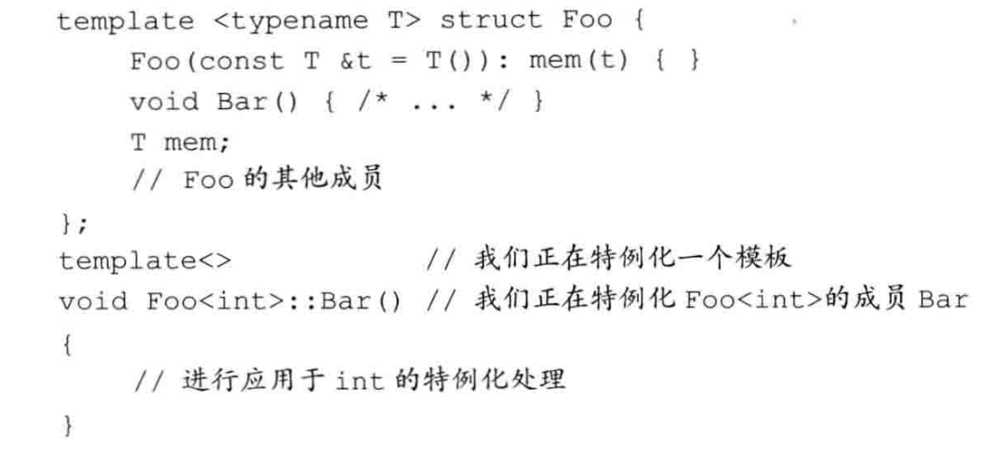

[TOC]

# 模板与泛型编程


## 1. 定义模板


#### 1.1 语法要求

> [!NOTE]
>
> 
>
> 
>

```
/*  @brief  翻转函数参数
 *
 *  用于翻转一个两参数的函数的参数顺序并调用之
 */
template <typename F, typename T1, typename T2>
void flip(F f, T1&& t1, T2&& t2) {
  f(std::forward<T2>(t2), std::forward<T1>(t1));
}

// 示例
// auto lambda = [](int a, const std::string& b){ /*...*/ };
// flip(lambda, std::string("s"), 42);
```


---

#### 1.2 模板与友元


---

#### 1.3 模板参数


> [!NOTE]
>
> **使用类的类型成员**
>
> 使用前加`typename`
>
> 

- **默认模板实参**




---

#### 1.4 成员模板

> 成员模板不能是虚函数

- **控制实例化**

  > 通过显式实例化来避免在多个文件中**实例化相同模板**的额外开销。
  >
  > 
  >
  > ````cpp
  > template <typename T>
  > void foo(T) {}
  > template void foo<int>(int a);//使用显式指定的模板参数实例化 f
  > template void foo(char a);//用推导出的模板参数‘char’实例化 f
  > ````

> [!WARNING]
>
> 

> [!NOTE]
>
> **实例化定义会实例化所有成员**
>
> 


## 2. 模板实参推断


#### 2.1 类型转换与模板类型参数

**函数模板中可用的类型转换**

- 顶层const无论是在形参中还是在实参中，都会被忽略。


除此之外，编译器会生成一个**新的模板实例**。

> [!NOTE]
>
> 
>
> 
>
> 


---

#### 2.2 函数模板显式实参

将**需要显式指定**的模板形参放在前面

````cpp
template <typename T1,typename T2,typename T3>
T1 sum(T2,T3);
//编译器无法推导T1的类型，需要每次实例化时显式指定。
````

> [!NOTE]
>
> **显式指定**的实参可以进行正常的类型转换。
>
> ````cpp
> template<typename T> int compare(const T& a,const T& b);
> long lng;
> compare<long>(lng, 1024) //1024: int->long
> compare<int>(lng, 1024) //lng: long->int
> ````


---

#### 2.3 尾置返回类型与类型转换

> [!NOTE]
>
> 当我们不确定返回结果的准确类型时，可以使用尾置返回类型。
>
> ````cpp
> //尾置返回允许我们在参数列表之后声明返回类型
> template <typename It>
> auto fcn(It beg,It end) ->decltype(*beg) {
>     //处理序列
>     return *beg;//返回序列中一个元素的引用
> }
> //或者可以直接使用auto作为返回值，让编译器自动推导。
> ````

更进一步，也许我们希望**返回元素的值**而非引用，但是迭代器只能生成元素的引用，为了获得元素本身的类型，我们可以使用标准库的**类型转换（type transformation）**模板，它们定义在头文件`type_traits`中。

````cpp
template <typename It>
auto fcn(It beg, It end) ->
  typename std::remove_reference<decltype(*beg)>::type
//std::remove_reference::type是脱去引用后的类型
{
  return *beg;
}
````


如果不可能（或不必要）转换模板参数，`type`成员就是模板参数类型本身。


---

#### 2.4 函数指针和实参推断

>当我们用一个函数模板初始化一个函数指针或为一个函数指针赋值时，编译器使用指针的类型来推断模板实参。

````cpp
template <typename T> int compare(const T&, const T&);
int (*pf1) (const int&, const int&) = compare;
````

> [!NOTE]
>
> 


---

#### 2.5 模板实参推断和引用


**从左值引用函数参数推断类型**

- T& 只能接受一个左值
- const T& 可以接受任何类型的实参——对象、临时对象、字面常量值。

**从右值引用函数参数推断类型**

```cpp
template <typename T> void f3(T&&);
f3(42); //T是int
```


**引用折叠和右值引用参数**


> template <typename T> void f3 (T&&);
>
> 假定 i 是一个int对象，我们可能认为像 f3 ( i ) 这样的调用是不合法的。毕竟，i 是一个左值，而**通常我们不能将一个右值引用绑定到一个左值上**。但是，C++语言在正常绑定规则之外定义了两个例外规则，允许这种绑定。这两个例外规则是 move 这种标准库设施正确工作的基础。
>
> **第一个例外规则**
>
> 第一个例外规则影响右值引用参数的推断如何进行。当我们将一个**左值传递给函数模板的右值引用参数**（如T&&)时，编译器推断模板
> 类型参数为实参的左值引用类型。因此，当我们调用 f3 (1) 时，编译器推断 T 的类型为 int& ,而非 int 。
>
> 
>
> **第二个例外规则**
>
> 如果我们间接创建一个**引用的引用**，则这些引用形成了“折叠”。
>
> 对于一个给定类型：
>
> - **X& &、X& && 和 X&& & 都折叠成类型X&**
> - **类型X&& &&折叠成X&&**
>


> [!NOTE]
>
> 通常，我们不能直接定义一个引用的引用，但是通过**类型别名**或通过**模板类型参数**间接定义是可以的。
>
> ````cpp
> typedef int& intLref;
> int b;
> intLref& a = b;//a是一个左值引用
> 
> typedef int&& intRref;
> intRref&& c = 42;//c是一个右值引用
> 
> template <typename T> void f3 (T&&);
> f3(i); //T是int&
> f3(42);//T是int&&
> ````

> [!NOTE]
>
> 

> [!NOTE]
>
> 使用右值引用的函数模板通常使用下面的方式进行重载：
>
> ````cpp
> template <typename T> void f(T&&); //绑定到非const右值
> template <typename T> void f(const T&);//左值和const右值
> ````


---

#### 2.6 理解 std::move

标准库是这样定义`move`的：

````cpp
template <typename T> //模板形参列表
typename std::remove_reference<T>::type&& //返回类型
  move (T&& t) {
  return static_cast<typename std::remove_reference<T>::type&&>(t);
}
````

假设我们传递给`move`一个`int`左值，T被推断为`int&`，替换T后函数变为：

````cpp
typename remove_reference<int&>::type&& //返回类型
  move (int& && t) {
  return static_cast<typename remove_reference<int&>::type&&>(t);
}
````

显然，`remove_reference<int&>::type&&>`即为`int&&`，`move`返回了`static_cast<int&&>(t)`，实现了将左值转换为右值。

> [!NOTE]
>
> 从一个左值`static_cast`到一个右值引用是允许的


---

#### 2.7 转发

**使用指向模板类型参数的右值引用**


**使用`std::forward`保持类型信息**


> [!NOTE]
>
> `std::forward`的实现
>
> ````cpp
> template<typename _Tp>
>     _GLIBCXX_NODISCARD
>     constexpr _Tp&& //返回类型
>     forward(typename std::remove_reference<_Tp>::type& __t) noexcept
>     { return static_cast<_Tp&&>(__t); }
````

typename std::remove_reference<int&>::type&& //返回类型
  move (int& && t) {
  return static_cast<typename std::remove_reference<int&>::type&&>(t);
}
````
 *  @brief  翻转函数参数
 *
 *  用于翻转一个两参数的函数的参数顺序并调用之
 */
void flip(F f,T1 &&t1,T2 &&t2) {
    f(std::forward<T2>(t2), std::forward<T1>(t1));
}
````


## 3. 重载与模板

- 对于一个调用，其候选函数包括所有**模板实参推断成功**的函数模板实例
- 候选的函数模板总是可行的，因为模板实参推断会排除任何不可行的模板。
- 与往常一样，可行函数（模板与非模板）按类型转换（如果对此调用需要的话）来排序。当然，可以用于函数模板调用的类型转换是非常有限的。
- 与往常一样，如果恰有一个函数提供比任何其他函数都更好的匹配，则选择此函数。但是，如果有多个函数提供同样好的匹配，则：
  - 如果同样好的函数中只有一个是**非模板函数**，则选择此函数。
  - 如果同样好的函数中没有非模板函数，而有多个函数模板，且其中一    个模板比其他模板**更特例化**，则选择此模板。
  - 否则，此调用有歧义。

> [!WARNING]
>
> 

> const T& 比 T* 更通用，但是由于“特例化“规则，**当传递一个 const 指针时，会调用 T***.

> [!NOTE]
>
> 
>
> 


````cpp
template <typename T>
std::string debug_rep(const T& t) {
  std::ostringstream ret;
  ret << t;
  return ret.str();
}//t必须定义了输出运算符

template <typename T>
std::string debug_rep(T* p) {
  std::ostringstream ret;
  // std::cout << "pointer: " << p << std::endl;
  if (p) {
    ret << debug_rep(*p);
  } else {
    print("t is nullptr");
  }
  return ret.str();
}//接受指针类型参数
//WARNING：无法打印char*类型，因为IO库为它定义的<<运算符会打印数组而不是地址值

std::string debug_rep(const std::string& s) { return s; }
//必须在前面声明否则debug_rep(char* p)会调用模板函数。

//接受 char* 参数
std::string debug_rep(char* p) { return debug_rep(std::string(p));// }
std::string debug_rep(const char* p) { return debug_rep(std::string(p)); }
````


## 4. 可变参数模板

### 可变参数模板定义

可变参数模板时需要在typename或class后面带上省略号「...」

```cpp
template<typename...>
template<class...>
void f(T... args);
```

- 省略号作用

  > 1. 声明一个参数包T... args，这个参数包中可以包含0到任意个模板参数；
  > 2. 在模板定义的右边，可以将参数包展开成一个一个独立的参数。
  > 3. 带省略号的参数称为“参数包”，它里面包含了0到N（N>=0）个模板参数。

- **模式**：后随省略号且其中至少有一个形参包的名字的**模式**会被展开 成零个或更多个**逗号分隔**的模式实例，`&args... 中 &args 就是模式` 

#### 递归函数展开参数包

通过递归函数展开参数包，需要提供一个「参数包展开的函数」和一个「递归终止函数」，递归终止函数正是用来终止递归的

````cpp

//递归终止函数
template <typename T>
void foo(const T& arg) {
  print("end of call");
}  // 递归终点：当只剩一个参数时更特例化

//参数包展开的函数
template <typename T, typename... Args>
void foo(const T& arg, const Args&... args) {
  println("size of Args: {}", sizeof...(Args));
  println("size of args: {}", sizeof...(args));
  foo(args...);  // 递归调用,args每次少一个参数
}
````

- `sizeof...(args)`返回参数包参数个数
- `typename... class...`参数包展开

- 另一例子

```cpp
#include <iostream>
using namespace std;

template<typename T>
T sum(const T& t) {
    return t;
}

template<typename T, typename... Types>
T sum(const T& first, const Types&... rest) {
    return first + sum<T>(rest...);
}

int main() {
    cout << sum(1, 2, 3, 4) << endl;    // 10
    return 0;
}
```

> [!WARNING]
>
> 

#### 逗号表达式展开参数包

- 借助「逗号表达式」(逗号表达式是从左往右执行的，返回最右边的值作为整个逗号表达式的值)和「初始化列表」
- 也就是说：每一个 `(std::cout << arg0 << ' ' ,0)` 都会返回 0

```cpp
#include <iostream>
using namespace std;

template<typename T>
void printArg(T t) {
    cout << t << endl;
}

template<typename... Args>
void expand(Args... args) {
    int _[] = {(printArg(args), 0)...};
}

int main() {
    expand(1, 2, 3, 4);
    return 0;
}

//「C++14的新特性」泛型lambda表达式
expand([](auto i)->void{cout << i << endl;}, 1, 2.2, "hello");
```

#### 模板偏特化和递归方式来展开参数包
可变参数模板类的展开一般需要定义两到三个类，包括「类声明」和「偏特化」的模板类

```cpp
#include <iostream>
using namespace std;

// 前向声明,声明这个Sum类是一个可变参数模板
template<typename... Args>
struct Sum;

// 基本定义
template<typename First, typename... Rest>
struct Sum<First, Rest...> {
    enum {
        value = Sum<First>::value + Sum<Rest...>::value
    };
};

// 递归终止
template<typename Last>
struct Sum<Last> {
    enum {
        value = sizeof(Last)
    };
};

int main() {
    cout << Sum<int, double, short>::value << endl; // 14
    // Sum<int, double, short> s;
    // cout << s.value << endl;                     // 4+8+2=14
    return 0;
}

```


---

#### 4.1 转发参数包




---

#### 4.2 模板特例化

> [!NOTE]
>
> 

> 将特殊的函数定义为一个特例化版本还是一个独立的非模板函数，会影响到函数匹配。


````cpp
template <typename T>
int compare(const T& v1, const T& v2) {
  if (v1 < v2) return -1;
  if (v2 < v1) return 1;
  return 0;
}

// 处理const char*类型的参数
template <>
int compare(const char* const& p1, const char* const& p2) {
  return strcmp(p1, p2);
}
````


**类模板特例化**

````cpp
// 打开std命名空间，以便特例化std::hash
namespace std {

template <>
//vector<string>的hash函数的特例化
class hash<vector<string>> {
 public:
  typedef size_t result_type;
  typedef vector<string> argument_type;
  size_t operator()(const vector<string>& s) const;
};

//类外定义hash函数
size_t hash<vector<string>>::operator()(const vector<string>& strs) const {
  size_t res = 114514;
  for (const auto& str : strs) {
    res ^= hash<string>()(str);
  }
  return res;
}

}  // namespace std
````


**类模板部分特例化**

> [!NOTE]
>
> 

> 引：`std::remove_reference`类型是通过一系列的特例化版本来完成其功能的。
>
> 


**特例化特定成员函数**



## 5. 折叠表达式

- C++17 折叠表达式

### 语法

```cpp
( 形参包 运算符 ... )              (1)//(E1 运算符 (... 运算符 (EN-1 运算符 EN)))
( ... 运算符 形参包 )              (2)//(((E1 运算符 E2) 运算符 ...) 运算符 EN)
( 形参包 运算符 ... 运算符 初值 )   (3)//(E1 运算符 (... 运算符 (EN−1 运算符 (EN 运算符 I))))
( 初值 运算符 ... 运算符 形参包 )   (4)//((((I 运算符 E1) 运算符 E2) 运算符 ...) 运算符 EN) （其中 N 是包展开中的元素数量）
```

- ***折叠表达式是左折叠还是右折叠，取决于 `...` 是在“形参包”的左边还是右边。***

### 实现Print函数

- 再需要创建愚蠢的数组对象 `_`。

```cpp
template<typename...Args>
void print(const Args&...args) {
    ((std::cout << args << ' '), ...);
}
print("luse", 1, 1.2); // luse 1 1.2
```

### 一元折叠

1. “*对于逗号运算符，一元左折叠和一元右折叠没有区别*”。

2. 一个非类型模板参数的变量模板来展示在一些情况下左折叠和右折叠是会造成不同结果:***右折叠就是先算右边，左折叠就是先算左边***。

   ```cpp
   template<int...I>
   constexpr int v_right = (I - ...);  // 一元右折叠
   
   template<int...I>
   constexpr int v_left = (... - I);   // 一元左折叠
   
   int main(){
       std::cout << v_right<4, 5, 6> << '\n';  //(4-(5-6)) 5
       std::cout << v_left<4, 5, 6> << '\n';   //((4-5)-6) -7
   }
   ```

   

### 二元折叠

```cpp
template<typename... Args>
void print(Args&&... args){
    (std::cout << ... << args) << '\n';
}
//std::cout 就是初值、 运算符 ... 运算符 就是 << ... << 、形参包就是 args。
print("luse", 1, 1.2); // luse11.2
```

- **`运算符 ... 运算符`** 这种形式就是二元。
- ***折叠表达式是左折叠还是右折叠，取决于 `...` 是在“形参包”的左边还是右边。***

```cpp
// 二元右折叠
template<int...I>
constexpr int v = (I + ... + 10);    // 1 + (2 + (3 + (4 + 10)))
// 二元左折叠
template<int...I>
constexpr int v2 = (10 + ... + I);   // (((10 + 1) + 2) + 3) + 4

std::cout << v<1, 2, 3, 4> << '\n';  // 20
std::cout << v2<1, 2, 3, 4> << '\n'; // 20
```

### 总结

```cpp
template<class ...Args>
auto Reverse(Args&&... args) {
    std::vector<std::common_type_t<Args...>> res{};
    bool tmp{ false };
    (tmp = ... = (res.push_back(args), false));
    return res;
}
```

> 1. `std::vector<std::common_type_t<Args...>> res{}`
>
>    " std::common_type_t 的作用很简单，就是确定我们传入的共用类型，说白了就是这些东西都能隐式转换到哪个，那就会返回那个类型
>
> 2. `(tmp = ... = (res.push_back(args), false));`
>
>    二元左折叠表达式，根据下面的展开方式：
>
>    ```cpp
>    ((((I 运算符 E1) 运算符 E2) 运算符 ...) 运算符 EN)
>    ```
>
> 3. ***该函数是将传入的参数进行逆序。***

