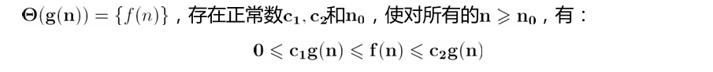
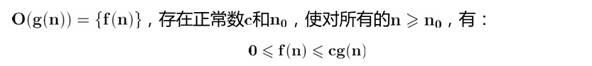
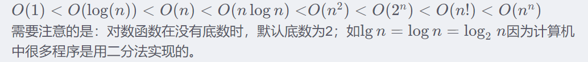
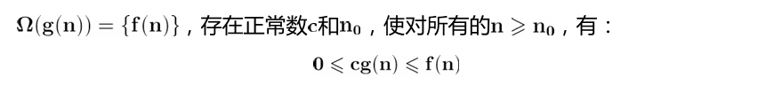
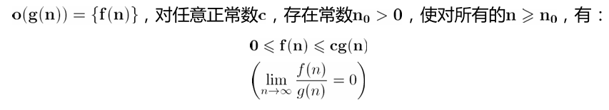
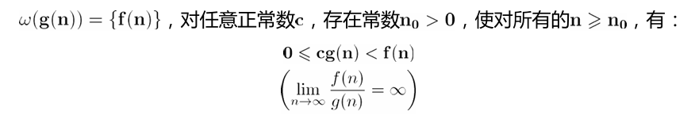
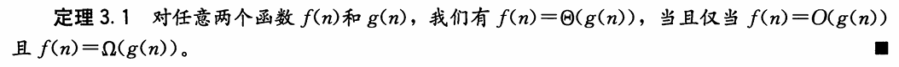
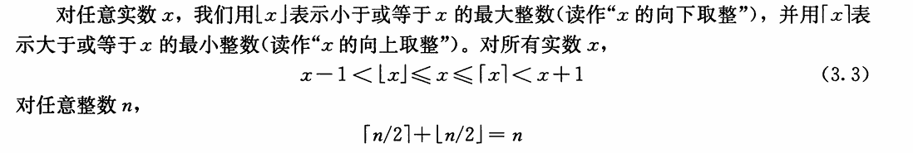
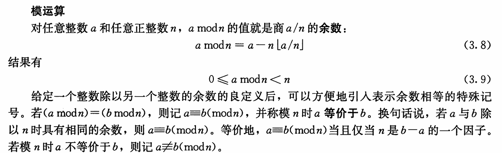

# 函数的增长

## 3.1 渐进符号

### 渐近记号、函数与运行时间

将主要使用渐近记号来描述算法的运行时间。

渐近记号实际上应用于函数

### 渐近紧确界记号： Θ（big-theta）

- 通俗理解为f (n) 和g(n)**同阶**，Θ 用来表示算法的**精确阶**。
  

### 渐近上界记号：O(big-oh)

- 通俗的说n满足一定条件范围内，函数f(n)的阶不高于函数g(n)。
  

> [!important]
>
> 

### 渐近下界记号：Ω(big-omega)

- 通俗的说n满足一定条件范围内，函数f(n)的阶不低于函数g(n)。

### 非渐近紧确上界：o(小-oh)

- 通俗理解为f (n) 低于g(n)的阶。
- 例子：`f(n) = n^2 + n` ,则`f(n)=o(n^3)`

### 非渐近紧确下界：ω(小-omega)

- 通俗理解为f (n) 高于g(n)的阶

- ω记号与Ω的关系类似于o和O记号的关系
  

> [!note]
>
> 
>
> 即渐进确界在渐进上界和渐进下界之间

---

## 3.2 标准记号与常用函数

### 向下取整与向上取整

- 其实就是进一或者去尾

### 模运算

