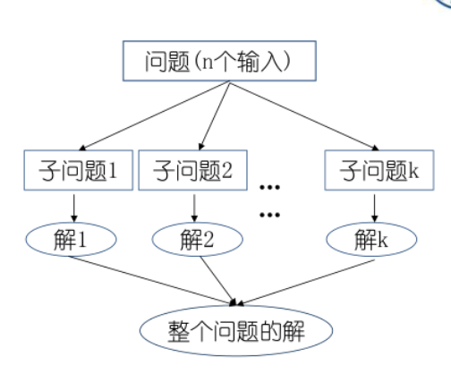
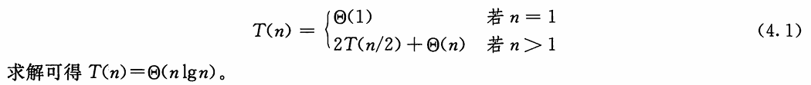
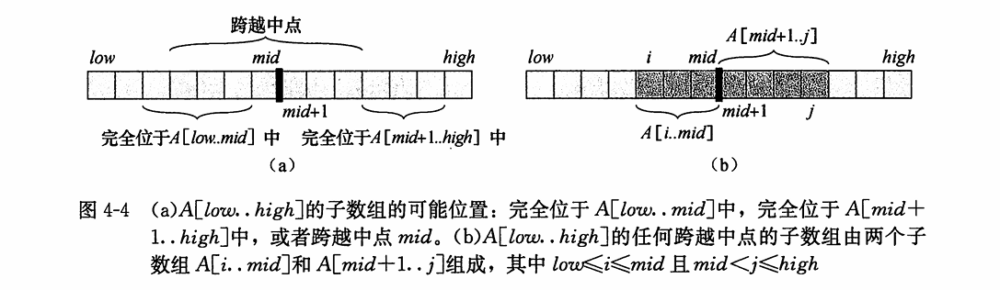
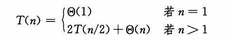
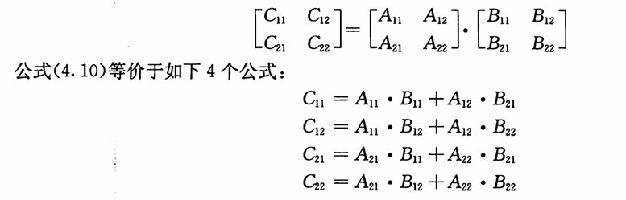
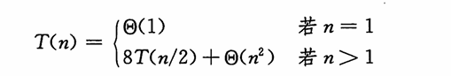
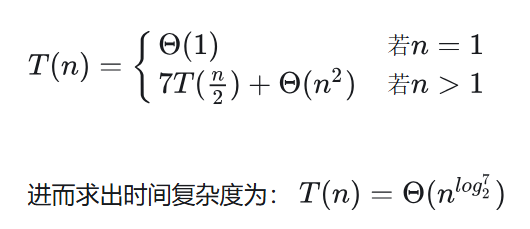
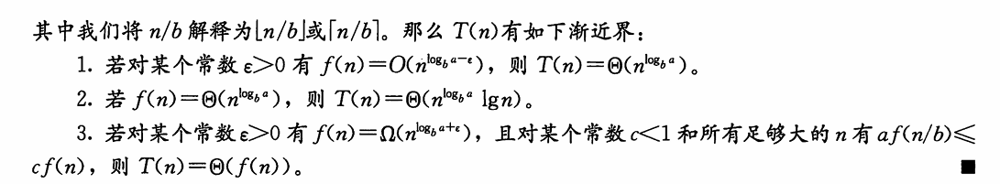
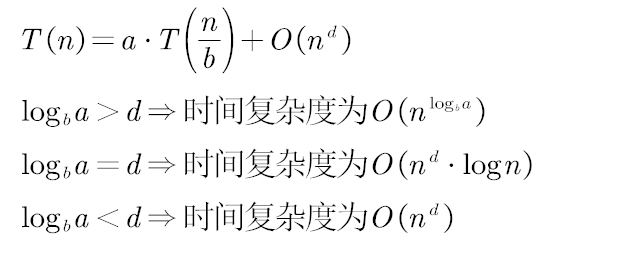

# 分支策略

- 分治法适用于问题规模大直接求解困难，可以分解为不同的可独立的子问题，求解子问题后可以合并

  

- 在分治策略中递归地求解一个问题，在每层递归中应用如下三个步骤

> [!important]
>
> - 分解(Divide)步骤将问题**划分为一些子问题**，子问题的形式与原问题一样，只是规模更小。 
> - 解决(Conquer)步骤递归地求解出子问题。如果子问题的规模足够小，则停止递归，直接求解。 
> - 合井(Combine)步骤将子问题的解**组合**成原问题的解。

1. 递归情况(recursive case)：子问题足够大，需要递归求解
2. 基本情况(base case)：子问题变得足够小可以解决，不再需要递归

## 递归式

一个递归式(recurrence)就是一个等式或不等式，它通过更小的输入上的函数值来描述一个函数。



子问题的规模不必是原问题规模的一个固定比例。

并且分的子问题数量越大，可能分开和合并的代价大

- 三种求解递归式

  > 1. **代入法** 我们猜测一个界，然后用数学归纳法证明这个界是正确的。
  > 2. **递归树法** 将递归式转换为一棵树，其结点表示不同层次的递归调用产生的代价。然后 采用边界和技术来求解递归式。
  > 3. **主方法** 可求解形如下面公式的递归式的界： T(n) = aT(n/b) + f(n) 
  >    1. 其中a>=1,b>=1, f(n)是一个给定的函数。
  >    2. 生成a个子问题，每个子间题的规模是原问题规模的 1/b, 分解和合并步 骤总共花费时间为f(n)

## 递归式技术细节

1. 递归式声明和求解的一些技术细节

   > 子问题规模是不是n/2？进一还是去尾

2. 边界条件是另一类我们通常忽略的细节

   > 对于足够小的n, 表示算法运行时间的递归式一般为 T(n)=@(1)

3. 当声明、求解递归式时，我们常常**忽略向下取整、向上取整及边界条件**。先忽略这些细 节，稍后再确定这些细节对结果是否有较大影响。

##  最大子数组问题

> [!note]
>
> 寻找数组A的和最大的非空连续子数组。我们称这样的连续子数组为最大子数组(maximum subarray)。

### 暴力解法，求出所有连续子数组的和进行比较

```cpp
int FIND-MAXIMUM-SUBARRAY(vector<int>& nums)
{ 
    int sum = INT_MIN;
    for(int i=0;i<nums.size();i++)
    {
        int tmp=0;
        for(int j=i;j<nums.size();j++)
           { 
             tmp+=nums[j];
        	if(sum<tmp)sum=tmp;
           }
    }
    return sum;
}
```

### 分治策略

> [!important]
>
> 1. 要寻找子数组A[low.. high]  的最大子数组。使用分治技术意味着我们要将子数组**划分**为两个规模尽量相等的子数组
> 2. 例如取中间位置划分，则所求子数组的位置必然是以下三种情况给
>    1. 完全位于左区间
>    2. 完全位于右区间
>    3. 跨越了中点
> 3. 所以最大子数组必然是完全位千 `A[low.. mid]`中、完全位于 `A[mid+l.. high] ` 中或者 跨越中点的所有子数组 中和最大者。
> 4. **递归**地求解`A[low.. mid]和 A[mid+ 1.. high]的最大子数组`，因为这两个子问题仍是最大子数组问题，只是规模更小。
> 5. 因此，剩下的工作就是寻找**跨越中点的最大子数组**，然后在三种情况中选取和最大者。
>
> 
>
> 6. 对于穿过中间线的子数组，我们可以求出「中间线左侧的最大子数组和」以及「中间线右侧的最大子数组和」，相加就得到「穿过中间线的最大子数组和」。
>
>    ```text
>    //返回一个下标元组划定跨越中点的最大子数组的边界，并返回最大子数组中值的和。
>    FIND-MAX-CROSSING-SUBARRAY(A,low,mid,high)
>     left-sum = -inf
>     sum = 0
>     //求出左半部A[low.. mid]的最大子数组
>     for i = mid downto low
>         sum += A[i]
>         if sum > left-sum
>             left-sum = sum
>        	 max-left = i//更新左边界
>     right-sum = -inf
>     sum = 0
>     //求右半部A[mid+1. . high]的最大子数组
>     for j = mid + 1 to high
>         sum += A[j]
>         if sum > right-sum
>             right-sum = sum
>             max-right = j//更新右边界
>     return (max-left,max-right,left-sum + right-sum)
>    ```
>
> 7. 求解最大子数组问题的分治算法的伪代码:
>    ```text
>    FIND-MAXIMUM-SUBARRAY(A,low,high)
>     // base case, only one element （基本情况）
>     if high == low
>         return (low,high,A[low])
>     else 
>     	//递归求解左右区间最大子数组
>     	mid = [(low + high) / 2]
>         (left_low,left_high,left_sum) = FIND-MAXIMUM-SUBARRAY(A,low,mid)
>         (right_low,right_high,right_sum) = FIND-MAXIMUM-SUBARRAY(A,mid + 1,high)
>                                 
>         //穿过中间线的最大子数组
>         (cross_low,cross_high,cross_sum) = FIND-MAXIMUM-CROSSING-SUBARRAY(A,low,mid,high)
>                                 
>         //比较返回最大子数组
>         if left_sum == Max(left_sum,right_sum,cross_sum)
>             return (left_low,left_high,left_sum)
>         else if right_sum == Max(left_sum,right_sum,cross_sum)
>            return (right_low,right_high,right_sum)
>        else return (cross_low,cross_high,cross_sum)
>    ```

1. 分治算法的分析

   > [!tip]
   >
   > 1. 建立递归式
   >
   >    
   >
   > 2. 用主方法求解此递归式，其解为 T(n) = Θ(nlgn) 。

### 动态规划

> [!important]
>
> 1. 状态转移方程：
>
>    `dp[0]=nums[0],dp[i]=((dp[i-1]+dp[i])>dp[i])?(dp[i-1]+dp[i]):dp[i]`
>
> 2. 遍历求出最大dp[i]
>
> ```cpp
> int FIND-MAXIMUM-SUBARRAY(vector<int>& nums)
> { 
>     if(nums.empty())return INT_MIN;
>    
>     vector<int> dp(nums.size());
>     dp[0]=nums[0];
>     int sum = dp[0];
>     for(int i=1;i<nums.size();i++)
>     {
>        dp[i]=((dp[i-1]+dp[i])>dp[i])?(dp[i-1]+dp[i]):dp[i]
>        if(sum<dp[i])sum=dp[i];
>     }
>     return sum;
> }
> ```

---

## 矩阵乘法的Strassen算法

### 一般的矩阵乘法

nXn矩阵A和B, 返回它们的乘积一nXn矩阵C。

假设每个矩阵都有一个属性rows, 给出矩阵的行数。

```text
//O(n^3)
SQUARE-MATRIX-MULTIPLY(A, B) 
	n= A.rows
    let C be a new nXn matrix 
	for i=l to n 
		for j = 1 to n 
			c[ij]=0
			for k=1 to n
				c[ij]+=a[ik]*b[kj]
	RETURN C
```

---

### 简单的分治算法

当使用分治算法计算矩阵积C=A•B时，假定三个矩阵均为nXn矩阵，其中 n 为 2 的幂。

>  nXn矩阵都被划分为4个`n/2Xn/2 `的子矩阵
>
> 因此可以将公式`C=A•B`改写成
>
> 
>
> 递归分治算法：
>
> ```cpp
> SQUARE-MATRIX-MULTIPLY-RECURSIVE(A, B) 
>     n = A.rows
> 	let C be a new nXn matrix 
> 	if n==l 
> 		c[11] =a[11]• b[11] 
> 	else partition A, B, and C as in equations (4. 9) 
> 		C11 = SQUARE-MA TRIX-MUL TIPLY-RECURSIVE(A11 , B11) 
> 			+ SQUARE-MATRIX-MDL TIPL Y-RECURSIVE(A12, B21) 
> 		C12=SQUARE-MATRIX-MULTIPLY-RECURSIVE(A11, B12)
> 			+ SQUARE-MATRIX-MULTIPLY-RECURSIVE(A12, B22) 
> 		C21=SQUARE-MATRIX-MULTIPLY-RECURSIVE(A21, B11)
> 			+ SQUARE-MATRIX-MULTIPLY-RECURSIVE(A22, B21) 
> 		C22=SQUARE-MATRIX-MULTIPLY-RECURSIVE(A21, B12) 
> 			+ SQUARE-MATRIX-MULTIPLY-RECURSIVE(A22, B22)
> 	return C 
> ```
>
> 对于分解矩阵：而非创建12个新的`n/2*n/2`矩阵，而是使用下标计算,通过矩阵的一组行下标和一组列下标指明一个子矩阵，所以分解矩阵只需要常数的时间
>
> 递归式：共八次递归调用完成完成两个n/2Xn/2 矩阵的乘法`(T(n/2)`，以及四次矩阵加法
>
> 

---

### Strassen算法

1. 将输入矩阵A、 B 和输出矩阵C分解为`n/2 * n/2`的子矩阵。采用下标计算方法，此步骤花常数时间，与 SQUARE-MATRIX-MULTIPLY-RECURSIVE相同。

2.  创建 10 个 `n/2 * n/2` 的矩阵 S1, S2, …, S10, 每个矩阵保存步骤 1 中创建的两个子矩阵的和或差。

   > 如下创建10个 n/2 * n/2 的矩阵 S1,S2,...,S10 (花费时间 Θ(n^2) ）。
   >
   > S1=B12−B22
   >
   > S2=A11+A12
   >
   > S3=A21+A22
   >
   > S4=B21−B11
   >
   > S5=A11+A22
   >
   > S6=B11+B22
   >
   > S7=A12−A22
   >
   > S8=B21+B22
   >
   > S9=A11−A21
   >
   > S10=B11+B12

3. 递归地计算 7个矩阵积P1, P2, …,  p7 。每个矩阵 P都是`n/2 * n/2` 的(花费时间 `Θ(n^2) `）。

   > P1 =  A11⋅S1 = A11⋅B12−A11⋅B22
   >
   > P2 = S2⋅B22  = A11⋅B22+A12⋅B22
   >
   > P3 = S3⋅B11  = A21⋅B11+A22⋅B11
   >
   > P4 = A22⋅S4  = A22⋅B21−A22⋅B11
   >
   > P5 = S5⋅S6    = A11⋅B11+A11⋅B22+A22⋅B11+A22⋅B22
   >
   > P6 = S7⋅S8    = A12⋅B21+A12⋅B22−A22⋅B21−A22⋅B22
   >
   > P7 = S9⋅S10  = A11⋅B11+A11⋅B12−A21⋅B11−A21⋅B12
   >
   > 注意，上述公式中只有中间一列需要计算。右边这列只是说明这些乘积与原始子矩阵的关系

4. . 通过Pi矩阵的不同组合进行加减运算 计算 **C11,C12,C21,C22** ，花费时间 Θ(n^2) 。

   > C11 = P5+P4−P2+P6
   >
   > C12 = P1+P2
   >
   > C21 = P3+P4
   >
   > C22 = P5+P1−P3−P7

5. 得到如下描述Strassen算法运行时间 T(n)的递归式

   > 
   >
   > 用常数次矩阵乘法的代价减少了一次矩阵乘法的递归使得子问题规模减少一个

6. 伪代码

   ```
   If n = 1 Output A × B
    Else
    Compute A11,B11, . . . ,A22,B22 % by computing m = n/2
    P1   Strassen(A11,B12 − B22)
    P2   Strassen(A11 + A12,B22)
    P3   Strassen(A21 + A22,B11)
    P4   Strassen(A22,B21 − B11)
    P5   Strassen(A11 + A22,B11 + B22)
    P6   Strassen(A12 − A22,B21 + B22)
    P7   Strassen(A11 − A21,B11 + B12)
    C11   P5 + P4 − P2 + P6
    C12   P1 + P2
    C21   P3 + P4
    C22   P1 + P5 − P3 − P7
    Output C
    End If
   ```


## 三次乘法完成复数相乘

- 有两个复数`m=a+b*i,n=c+d*i`,现在计算它们的乘法，设计一个只使用**三次实数乘法**的算法来完成m和n的计算。

  > [!note]
  >
  > 复数乘法的计算公式：`m*n=（a*c-b*d）+(a*d+b*c)i`
  >
  > C1=a*d,*
  >
  > *C2=b*c,
  >
  > C3=(a+b)(c-d)，
  >
  > 虚部为C1+C2，实部为C3+C1-C2，计算完毕。

---


## 二维极大点问题

- 问题描述

  > 支配规则：在二维空间中，如果x1>x2，且y1>y2，那么称点(x1,y1)支配点(x2,y2)
  >
  > 极大点：如果一个点没有被其他点支配，则称其为极大点。
  >
  > 求极大点问题：已知有n个点的集合，找出其中的所有极大点。

- 分治策略

  > 分：设计中位线L，将整个点集分为两个子集SL和SR
  >
  > ​	中位线：垂直于X轴的中位线L，l对集合S中的所有点按x值**排序(预处理)**后，寻找第n/2点位置
  >
  > 治：分别找出SL和SR的极大点
  >
  > 合：基于支配规则合并SL和SR的极大点(l对于SL中的极大点p，如果yp小于SR中极大点的y值，则p被支配，舍弃掉)
  >
  > 递归出口：如果集合S中只有一个点，那么该点为极大点

```cpp
#include <vector>
#include <algorithm>
using namespace std;

struct Point {
    int x;
    int y;
};
//S预处理排序
vector<Point> find_maxima(vector<Point> S) {
    if (S.size() == 1) {
        return S;
    }
    
    int n = S.size();
    auto mid = S.begin() + n / 2;
    
    // 使用nth_element将数组分为两部分，左半部分x较小，右半部分x较大
    nth_element(S.begin(), mid, S.end(), [](const Point& a, const Point& b) {
        return a.x < b.x;
    });
    
    vector<Point> SL(S.begin(), mid);
    vector<Point> SR(mid, S.end());
    
    vector<Point> sl_maxima = find_maxima(SL);
    vector<Point> sr_maxima = find_maxima(SR);
    
    // 计算SR的极大点中的最大y值
    int max_y_sr = 0;
    for (const auto& p : sr_maxima) {
        if (p.y > max_y_sr) {
            max_y_sr = p.y;
        }
    }
    
    // 过滤SL的极大点，保留y大于max_y_sr的点
    vector<Point> merged;
    for (const auto& p : sl_maxima) {
        if (p.y > max_y_sr) {
            merged.push_back(p);
        }
    }
    
    // 添加SR的所有极大点
    merged.insert(merged.end(), sr_maxima.begin(), sr_maxima.end());
    
    return merged;
}
```

---

## 用代入法求解递归式

> [!note]
>
> 代入法求解递归式分为两步：
>
> 1. L猜测解的形式。 
> 2.  用数学归纳法求出解中的常数，并证明解是正确的。

- 当将归纳假设应用于较小的值时，我们将猜测的解代入函数，因此得名“代入法”。

- 数学归纳法要求我们证明解在边界条件下也成立。

  > 1. 通常证明对于归纳证明，边界条件适合作为基本情况
  > 2. 对于我们所要讨论的大多数递归式来说，扩展边界条件使归纳假设对较小的n成立，例如个可以设一个常数n0 ，叧要求对n>=n0时能够得证即可。
  > 3.  先证明较松的上下界，然后逐步降低上界，提高下界。 

> [!warning]
>
> 只能用于解的形式很容易猜的情况，不存在通用的方法来猜测递归式的正式解。

- 在归纳假设不够强，无法证出准确的界。当遇到这种障碍时，如果修改猜测，将它**减去一个低阶的项**，数学证明常常能顺利进行。
- 使用渐近符号很容易出错。
- 一个小的代数运算可以将一个未知的递归式变成你所熟悉的形式。

---

## 用递归树方法求解递归式

> [!note]
>
> 在递归树中，每个结点表示一个**单一子问题**的代价，子问题对应**某次递归函数调用**。
>
> 我们将树中每层中的代价求和，得到每层代价，然后将所有层的代价求和，得到 所有层次的递归调用的总代价。

- 递归树最适合用来生成好的猜测，然后即可用代入法来验证猜测是否正确。

## 用主方法求解递归式(主定理)

主方法为如下形式的递归式提供了一种”菜谱”式的求解方法 

> [!important]
>
> `T(n) = aT(n/b) + f(n)  (4. 20)`
>
>   其中`a>=l 和b>=l `是常数， `f(n)`是渐近正函数。
>
> 递归式(4.20)描述的是这样一种算法的运行时间：它将规模为n的问题分解为a 个子问题， 每个**子问题规模为 n/b**, 其中 a 和b 都是正常数。 **a个子问题递归**地进行求解，每个花费时间 T(n/b) 。
>
> 函数 f(n)包含子问题**分解**和子间题**解合并**的代价

> [!note]
>
> 定理4.1(主定理）:
>
>  令`a>=l 和b>=l `是常数， `f(n)`是一个函数， `T(n`)是定义在**非负整数**上的递归式：`T(n) = aT(n/b) + f(n) `
>
> 


通俗的解释：



> [!note]
>
> - `a`：归约后的子问题个数
> - `n/b`：规约后子问题的规模
> - `O(n^d)`：归约过程及组合子问题的解的工作量（多项式）
