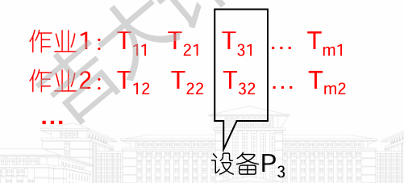

# 动态规划

> [!note]
>
> 动态规划(dynamic programming)与分治方法相似，都是通过**组合子问题的解**来求解原问题（在这里， `programming`指的是一种表格法，并非编写计算机程序）。

- 动态规划应用于**子问题重叠**的情况，即不同的子问题具有**公共的子问题**（子问题 的求解是递归进行的，将其划分为更小的子子问题）
- 在这种情况下，分治算法会做许多不必要的 工作，它会反复地求解那些公共子子问题。而动态规划算法对每个子子问题只求解一次，将其解**保存在一个表格**中，从而无需每次求解一个子子问题时都重新计算，避免了这种不必要的计算工作。

> [!important]
>
> 动态规划方法通常用来求解**最优化问题**(optimization problem)。这类问题可以有很多可行解，每个解都有一个值，我们希望寻找具有最优值（最小值或最大值）的解。我们称这样的解为问题的**一个**最优解(an optimal solution),
>
> - 四个步骤设计一个动态规划算法
>
> 1. 刻画一个最优解的**结构特征**。 
> 2. **递归地定义**最优解的值。 （动态转移方程）
> 3. 计算最优解的值，通常采用**自底向上**的方法。 
> 4. 利用计算出的信息构造一个最优解。
>
> 如果我们仅仅需要一个**最优解的值**，而非解本身，可以忽略步骤4。例如求最大子数组的值，并不需要求出最大子数组的范围
>
> 需要在执行步骤3 的过程中维护一些额外信息，以便用来构造一个最优解。

---

##  钢条切割

- 钢条切割问题是这样的：给定一段长度为n英寸的钢条和一个价格表`pi(i=l, 2, …, n)`,  求切割钢条方案，使得销售收益r最大。

  > - 注意，如果长度为n英寸的钢条的价格Pn足够大，最优解可能就是完全不需要切割。
  > - 长度为n英寸的钢条共有`2^n-1`种不同的切割方案，因为在距离钢条左端`i(i=l, 2, …, n—1)`英寸处，我们总是可以选择**切割或不切割**
  > - 用普通的加法符号表示切割方案：`n= i1+i2+...+ik`，将钢条切割为长度分别为`i1,i2 , …， ik `的小段
  > - 得到最大收益 `rn = P(i1), + P(i2)+…+ P(ik)`. 

- 更一般地，对于r.(n~l), 我们可以用更短的钢条的最优切割收益来描述它： 

  > 

> [!note]
>
> 先求解形式完全一样，但规模更小的子问题：当完成首次切割后，我们将两段钢条看成两个独立的钢条切割问题实例
>
> 通过组合两个相关子问题的最优解，并在所有可能的两段切割方案中选取组合收益最大者，构成原问题的最优解
>
> 称钢条切割问题满足**最优子结构(optimal substructure)**性质：问题的最优解由相关子问题的最优解组合而成，而这些子问题可以独立求解。

### **自顶向下**递归实现

> [!tip]
>
> 钢条切割问题还存在一种相似的但更为简单的递归求解方法
>
> - 问题分解的方式为：将长度为n的钢条分解为左边开始一段， 以及剩余部分继续分解的结果。
>
> - 即从钢条上切下长度为 i 的一段，且这段不再分割，对剩下的长度为 n−i 进行递归求解。
>
>   
>
> - **自顶向下**递归实现
>
> - CUT-ROD反复地用相同的参数值对自身进行递归调用，即它**反复求解相同的子问题**，导致CUT-ROD 的效率这么差？
>
> ```cpp
> //价格数组p[l.. n]和整数n为输入，返回长度为n的钢条的最大收益
> CUT-ROD(p, n) 
>  if	n==O 
>  	return O 
>  q = -oo 
>  for i=l to n 
>  	q=max(q,p[i]+CUT-ROD(p,n-i)) 
> return q 
> ```

### 动态规划方法求解

- 动态规划方法仔细安排求解顺序，对每个子问题只求解一次，并将结果保存下来

> [!important]
>
> **空间换时间**
>
> 动态规划方法是付出额外的内存空间来节省计算时间，是典型的**时空权衡**(time-memory trade-off) 的例子

动态规划有两种等价的实现方法:

> 1. 第一种方法称为带备忘的**自顶向下**法(记忆化搜索)
>
>    按自然的递归形式编写过程，但**过程会保存每个子问题的解**（通常保存在一个数组或散列表中）
>
> 2. 第二种方法称为**自底向上**法
>
>    一般需要恰当**定义子问题”规模"** 的概念，使得任何子问题的求解都只依赖于“更小的“子问题的求解，以将子问题按规模排序，按**由小至大**的顺序进行求解，即求出状态转移方程

- 自顶向下CUT-ROD过程的伪代码，加入了备忘机制：

  ```cpp
  MEMOIZED-CUT-ROD(p,n)  
  	let r[ 0 .. n]be a new array 
      //将辅助数组 r[O.. n]的元素均初始化为MIN, 这是一种常见的表示“未知值”的方法
  	for j = 0 ton 
      	r[i]=-oo
      return MEMOIZED-CUT-ROD-AUX(p,n,r) 
          
  MEMOIZED-CUT-ROD-AUX(p,n,r)  
  	if r[n]>=0 
  		return r[n] 
  	if n==0 
  		q = 0 
  	else q= —oo 
  		for i=1 to n 
  			q=max(q,p[i]+MEMOIZED-CUT-ROD-AUX(p,n—i, r)) 
  	r[n]=q 
  	return q    
  ```

- 重构解版本：通过s数组记录切割方案

```cpp
MEMOIZED-CUT-ROD(p, n)
    let r[0 : n] and s[0 : n] be a new array    
    for i = 0 to n
        r[i] = -∞
    (val, s) = MEMOIZED-CUT-ROD-AUX(p, n, r, s)
    j = n
    while j > 0
        print s[j]    // cut location for length n
        j = j - s[j]    // length of the remainder of the rod

MEMOIZED-CUT-ROD-AUX(p, n, r, s)
    if r[n] ≥ 0    // already have a solution for length n ?
        return r[n]
    if n == 0
        q = 0
    else q = -∞
        for i = 1 to n    // i is the position of the first cut
            (val, s) = MEMOIZED-CUT-ROD-AUX(p, n - i, r, s)
            if q < p[i] + val
                q = p[i] + val
                s[n] = i
    r[n] = q    // remember the solution value for length n
    return (q, s)
```

- 修改CUT-ROD和MEMOIZED-CUT-ROD-AUX，使得其for循环轮数降为 ⌊n/2⌋ 而不是 n ，需要如何对过程进行修改？运行时间如何变化？

```cpp
MEMOIZED-CUT-ROD(p, n)
    let r[0 : n] be a new array    // will remember solution values in r
    for i = 0 to n
        r[i] = -∞
    return MEMOIZED-CUT-ROD-AUX(p, n, r)

MEMOIZED-CUT-ROD-AUX(p, n, r)
    if r[n] ≥ 0    // already have a solution for length n ?
        return r[n]
    if n == 0
        q = 0
    else q = p[n]
        for i = 1 to ⌊n / 2⌋   // i is the position of the first cut
            q = max{q, MEMOIZED-CUT-ROD-AUX(p, i, r) + MEMOIZED-CUT-ROD-AUX(p, n - i, r)}
    r[n] = q    // remember the solution value for length n
    return q
```


- 自底向上版本

  ```cpp
  BOTTOM-UP-CUT-ROD(p,n)  
  	let r[O .. n]be a new array 
  	r[0]=0 
  	for j=1 to n 
  		q= —oo 
     		for i=1 to j 
  			q=max(q,p[i]+r[j-i])
  		r[j]=q
   	return r[n]
  ```

### 子问题图

子问题图：动态规划问题所涉及的子问题及子问题之间的依赖关系

> 它是一个**有向图**，每个顶点唯一地对应一个子问题。 若求子问题x的最优解时**需要直接用到子问题y的最优解**，那么在子问题图中就会有一条从子问题x的顶 点到子问题y的顶点的有向边。
>
> 可以将子问题图看做自顶向下**递归调用树的“简化版”或 “收缩版“**，因为树中所有对应相同子问题的结点合并为图中的单一顶点，相关的所有边都从父结点指向子结点

- **自底向上的动态规划**方法处理子问题图中顶点的顺序

  > 对于一个给定的子问题x, 在求解它之前求解邻接至它的子问题y
  >
  > 自底向上动态规划算法是按“**逆拓扑序"或“反序的拓扑序"** 来处理子问题图中的顶点
  >
  > 对于任何子问题，直至它依赖的所有子问题均已求解完成，才会求解它

### 重构解

以扩展动态规划算法，使之对每个子问题不仅保 存最优收益值，还**保存对应的切割方案**。利用这些信息，我们就能输出最优解。

```cpp
//切割下来的每段钢条的长度 s[l.. n]，例如s[5]=1表示长度为5的钢条切割为1和s[4]继续切割
EXTENDED-BOTTOM-UP-CUT如ROD(p,n) 
	let r[O .. n]and s[O .. n]be new arrays 
	r[0]=0 
	for j=1 to n 
		q=-oo 
		for i=1 to j 
            if q<p[i]+r[j-i]
                q=p[i]+r[j-i]
                s[j]=i
            r[j]=q
    return r and s

```

> 对钢条切割问题进行一点修改，除了切割下的钢条段具有不同价格 pi 外，每次切割还要付出固定的成本c。
>
> ```cpp
> //切割下来的每段钢条的长度 s[l.. n]，例如s[5]=1表示长度为5的钢条切割为1和s[4]继续切割
> EXTENDED-BOTTOM-UP-CUT如ROD(p,n) 
> 	let r[O .. n]and s[O .. n]be new arrays 
> 	r[0]=0
> 	for j=1 to n 
> 		q=p[j]
>          s[j]=j
> 		for i=1 to j-1
>             //等于自身时不切割            
>             if q<p[i]+r[j-i]+c
>                 q=p[i]+r[j-i]+c
>                 s[j]=i
>          r[j]=q
>     return r and s
> 
> ```

> [!note]
>
> 斐波那契数列可以用递归式(3.22)定义。设计一个 O(n)时间的动态规划算法计算第 n 个斐波那契数。
>
> - 写出动态转移方程：
> - num[0]=1,num[1]=1;
> - i>1;num[i]=num[i-1]+num[i-2];
>
> ```cpp
> //求前n个斐波那契数
> vector<int> Fib(n);
> {
>     vector<int> num;
>     if(n==1)return {1};
>     else num.push_back(1);
>     if(n==2)return {1,1};
>     else num.push_back(1);
>     for(int i=2;i<n;i++)
>     {
>         num.push_back(num[i-1]+num[i-2]);
>     }
>     return num;
> }
> ```

---

## 矩阵链乘法

### 矩阵相乘

- 给定一个n个矩阵的序列（矩阵链）<A1, A2, …， An>，我们希望计算它们的乘积`A1A2...An`

- 可以先用括号明确计算次序，由于矩阵乘法满足结合律，因此任何加括号的方法都会得到相同的计算结果，然后利用标准的矩阵相乘算法进行计算。

- > [!note]
  >
  > 们称有 如下性质的矩阵乘积链为**完全括号化**的(fully parenthesized) : 它是**单一矩阵**，或者是**两个完全括号化的矩阵乘积链的积**，且已外加括号。
  >
  > <A1, A2, A3, A4>则共有 5 种 完全括号化的矩阵乘积链：
  >
  > 

- 两个矩阵A和B只有相容(compatible), 即 A 的列数等于B 的行数时，才能相乘。

- A 是`pXq`的矩阵， B是`qXr`的矩阵，那么乘积C是`pXr`的矩阵，标量乘法的次数决定，即`pqr`。

- 对矩阵链加括号的方式会对乘积运算的代价产生巨大影响，不同加括号方式进行标量乘法的次数不同

### 矩阵链乘法问题

> [!important]
>
> 给定 n 个矩阵的链<A1,A2, … , An>，相邻的矩阵相容，求完全括号化方案，使得计算乘积A1A2…An所需标量乘法次数最少。

### 计算括号化方案数量

穷举所有可能的括号化方案：

一个相似的递归公式产生的序列为卡特兰数(Catalan numbers) , 这个 序列的增长速度为`O(4^n/n^(3/2))= 0(2^n)`

### 应用动态规划方法

1. 刻画一个最优解的结构特征。 
2. 递归地定义最优解的值。
3. 计算最优解的值，通常采用自底向上的方法。
4. 利用计算出的信息构造一个最优解。

#### 1.最优括号化方案的结构特征

动态规划方法的第一步是寻找最优子结构

> 本问题的最优子结构:
>
> - 假设AiAi+i…Aj; 的最优括号化方案的分割点在Ak和 Ak+1之间
> - 继续对“前缀“子链AiAi+1…Ak 进行括号化时，我们应该直接采用**独立**求解它时所得的最优方案。
>
> 有相似的结论： 在原问题AiAi+1...Aj的最优括号化方案中，对子链Ak+1Ak+2...Aj进行括号化的方法，就是它**自身的最优括号化**方案。

为了构造一个矩阵链乘法问题实例的最优解，我们可以将问题划分为两个子问题(AiAi+1...Ak 和Ak+1Ak+2…Aj的最优括号化问题），求出子问题实例的最优解，然后将子问题的最优解**组合**起来。

#### 2. 一个递归求解方案

令`m[i, j]`表示计算矩阵Ai..Aj;所需标量乘法次数的最小值，那么，原问题的最优解计算Ai..An 所需的最低代价就 是`m[1, n]`。

> 递归定义m[i, j]:
>
> 
>
> 分割点在矩阵Ak 和Ak+1之间，其中`i<=k<j`

用`s[i,j]`保存`AiAi+1…Aj` 最优括号化方案的分割点位置k' 即使得`m[i, j]=m[i, k]+  m[k+ 1, j] + Pi-1PkPj` 成立的 K 值。

#### 3.计算最优代价

每个子问题` Ai:j` 都需要对应 i 和 j ，且满足 `1≤i≤j≤n` ，可以推导出


递归算法会在递归树的多个不同分支中遇到**同一个子问题**。这里总结出能够运用动态规划求解的问题的两个重要特征：

- 该问题具有**最优子结构(optimal structure)**。
- 该问题具有**重叠子问题(overlapping subproblems)**。

> [!important]
>
> 采用**表格(tabular)**法，自底向上动态规划
>
> m[i, j]只依赖于那些少于`j-i+1`个矩阵链相乘的最优计算代价
>
> p=<P0, P1, …, Pn >
>
> ```cpp
> MATRIX-CHAIN-ORDER(p, n)
>     let m[1 : n, 1 : n] and s[1 : n - 1, 2 : n] be new tables
>     //单一矩阵计算代价为0
>     for i = 1 to n
>         m[i, i] = 0
>     for l = 2 to n    // l is the chain length
>         for i = 1 to n - l + 1    // chain begins at A_i
>             j = i + l - 1    // chain ends at A_j
>             m[i, j] = ∞
>             for k = i to j - 1    // try A_i:k A_k+1:j
>                 q = m[i, k] + m[k + 1, j] + p_i-1 * p_k * p_j
>                 if q < m[i, j]
>                     m[i, j] = q    // remember this cost
>                     s[i, j] = k    // remember this index
>    return m and s
> ```
>
> 

#### 4. 构造最优解

表格` s[1:n−1,2:n]` 保持了构造最优解的所需信息

```cpp
PRINT-OPTIMAL-PARENS(s, i, j)
    if i == j
        print "A"_i
    else print "("
        PRINT-OPTIMAL-PARENS(s, i, s[i, j])
        PRINT-OPTIMAL-PARENS(s, s[i, j] + 1, j)
        print ")"
```

---

#### 实现矩阵链最优代价乘法计算的真正计算过程

其输入序列为矩阵链 ⟨A1,A2,…,An⟩ ，表格 s 是通过调用 MATRIX-CHAIN-ORDER 计算出来的

```cpp
MATRIX-CHAIN-MULTIPLY(A, s, i, j)
    if i == j
        return A[i]
    if i + 1 == j
        return A[i] · A[j]
    return MATRIX-CHAIN-MULTIPLY(A, s, i, s[i, j]) · MATRIX-CHAIN-MULTIPLY(A, s, s[i, j] + 1, j)

MATRIX-CHAIN-MULTIPLY(A, s, 1, n)
```

> [!tip]
>
> 类似题目：1. [戳气球](D:\Internt_of_Thing\e_book\coding_problem\312. 戳气球.md);2. [移除盒子](D:\Internt_of_Thing\e_book\coding_problem\546. 移除盒子.md)

## 动态规划原理

> [!important]
>
> 适合应用动态规划方法求解的最优化问题应该具备的两个要素：
>
> **最优子结构**和**子问题重叠**。

### 最优子结构

用动态规划方法求解最优化问题的第一步就是**刻画最优解的结构**

> - 如果一个问题的最优解包含其子问题的最优解，我们就称此问题具有**最优子结构性质**
> - 当然，具有最优子结构性质也可能意味着适合应用贪心策略

使用动态规划方法时，我们用**子问题的最优解**来构造原问题的最优解，所以心确保考察了最优解中用到的**所有**子问题

发掘最优子结构性质的过程中，实际上遵循了如下的通用模式：

> [!note]
>
> 1. 证明问题最优解的第一个组成部分是**做出一个选择**，做出这次选择会产生一个或多个待解的子问题。
> 2. 对于一个给定问题，在其可能的第一步选择中，你**假定已经知道**哪种选择才会得到最优解。
> 3. 给定可获得最优解的选择后，你确定这次选择会**产生哪些子问题**，以及如何最好地刻画子问题空间。
> 4. 利用“剪切—粘贴"(cut-and-paste)技术**证明**：作为构成原问题最优解的组成部分，每个子问题的解**就是它本身的最优解**。
>    - 如果原问题的最优解包含多个子问题，通常它们都很相似，我们可以将针对一个子问题的＂剪切—粘贴“论证方法稍加修改，**用于其他子问题**
>    - 一个刻画子问题空间的好经验是：保持子问题空间**尽可能简单**，只在必要时才扩展它。
>    - 对于不同问题领域，最优子结构的不同体现在两个方面：
>      - 原问题的最优解中涉及**多少个子问题**，
>      - 以及在确定最优解使用哪些子问题时，我们需要**考察多少种选择**。

> [!tip]
>
> 1. 可以用子问题的总数和每个子问题需要考察多少种选择这两个因素的乘积来粗略分析动态规划算法的运行时间
>    1. 对于钢条切割问题，共有 ®(n)个子问题，每个子问题最多需要考察n种选择，因此运行时间为O(n^2)。
>    2. 矩阵链乘法问题共有 ®(n^2)个子问题，每个子问 题最多需要考察n-1 种选择，因此运行时间为O(n3)。
> 2. 子问题图也可用来做同样的分析。图中**每个顶点对应一个子问题**，而需要考察的**选择对应关联至子问题顶点的边**。

- 在动态规划方法中，我们通常**自底向上地使用最优子结构**。也就是说，首先求得子问题的最优解，然后求原问题的最优解。

  > 1. 求解原问题过程中，我们需要在**涉及的子问题**中做出选择，选 出能得到原问题最优解的子问题
  > 2. 原问题最优解的代价通常就是**子问题最优解的代价**再加上由 **此次选择直接产生的代价**。

> [!warning]
>
> 贪心算法和动态规划最大的不同在千，它并不是首先寻找子问题的最优解，然后在其中进行选择，而是首先做出**一次“贪心”选择**——在当时（局 部）看来最优的选择然后求解选出的子问题，从而不必费心求解所有可能相关的子问题。

> [!note]
>
> 但两个最长简单路径子问题是相关的，而两个最短路径子问题是无关的(independent)
>
> 子问题无关的含义是，同一个原问题的一个子问题的解不影响另一个子问题的解。
>
> 说两个子问题是相关的：求解一个子问题时用到了**某些资源**（在本例中是顶点），导致这些资源在求解其他子问题时不可用。
>
> 无权最短路径和无权最长路径的根本区别：
>
> - 无权最短路径问题的子问题是**独立(independent)**的。根本原因是子问题之间是不共享资源的。可以用反证法证明，如果从 u 到 v 的最短路径经过 w ，即 u⇝p1w⇝p2v ，除 w 外不存在别的顶点同时位于 p1 和 p2 上。
> - 无权最长简单路径问题的子问题不是独立的。根本原因是子问题之间是可以共享资源的。
>
> 评：独立一定不相关，不相关不一定独立。


### 重叠子问题

适合用动态规划方法求解的最优化问题应该具备的第二个性质是子问题空间必须足够“小"'，即问题的递归算法会反复地求解相同的子间题，而不是一直生成新的子问题

类似于递归出口，递归的基本情况，或者最小子问题

> 如果递归算法**反复求解相同**的子问题，我们就称最优化问题具有重叠子问题(overlapping subproblems)性质
>
> 与之相对的，适合用分治方法求解的问题通常在递归的每一步都生成**全新的子间题**。
>
> 所以动态规划算法通常这样利用**重叠子问题性质**： 对每个子问题求解一次，将解存入一个表中，当再次需要这个子问题时直接查表，每次查表的代价为常量时间

> [!tip]
>
> 将自顶向下的递归算法（无备忘）与自底向上的动态规划算法进行比较，后者要高效得多， 因为它利用了重叠子问题性质。

---

### 重构最优解

- 记录选择

  > 从实际考虑，我们通常将每个子问题所做的选择存在一个表中，这样就不必根据代价值来 重构这些信息。

- 按选择回溯，或者递推

  > 对矩阵链乘法问题，利用表s[i, j], 我们重构最优解时可以节省很多时间
  >
  > 第一次选择：s[i,j]
  >
  > 第二层：左：`s[i,s[i,j]]`，右：`s[s[i,j],j]`
  >
  > ……

### 备忘

- 可以保持自顶向下策略，同时达到与自底向上动态规划方法相似的效率。

  > 思路就是对自然但低效的递归算法加入**备忘机制**
  >
  > 维护一个表记录子问题的解，但仍保持递归算法的控制流程。
  >
  > 带备忘的递归算法为每个子问题维护一个表项来保存它的解。每个表项的初值设为一个**特殊值，表示尚未填入子问题的解**。
  >
  > 递归调用过程中第一次遇到子问题时，计算其解，并存入对 应表项。随后每次遇到同一个子问题，只是**简单地查表**，返回其解

矩阵链式乘法备忘版本自顶而下递归O(n^3)

```cpp
MEMOIZED-MATRIX-CHAIN(p, n)
    let m[1 : n, 1 : n] be a new table
    for i = 1 to n
        for j = i to n
            m[i, j] = ∞
    return LOOKUP-CHAIN(m, p, 1, n)

//区间左闭右开[i,j)
LOOKUP_CHAIN(m, p, i, j)
    if m[i, j] < ∞
        return m[i, j]
    if i == j
        return m[i, j] = 0
    else 
        for k = i to j - 1
            q = LOOKUP-CHAIN(m, p, i, k) + LOOKUP-CHAIN(m, p, k + 1, j) + p_i-1 · p_k · p_j
            if q < m[i, j]
                m[i, j] = q
    return m[i, j]
```

- 自底而上动态规划

```python
def MATRIX_CHAIN_ORDER(p):
    n = len(p) - 1  # 矩阵的数量
    m = [[0] * (n + 1) for _ in range(n + 1)]  # 初始化二维表 m

    # 自底向上计算所有子问题
    for length in range(2, n + 1):  # 当前链的长度，从2到n
        for i in range(1, n - length + 2):  # 子链的起始位置
            j = i + length - 1  # 子链的结束位置
            m[i][j] = float('inf')  # 初始化为无穷大
            for k in range(i, j):  # 尝试所有可能的分割点
                q = m[i][k] + m[k + 1][j] + p[i - 1] * p[k] * p[j]
                if q < m[i][j]:
                    m[i][j] = q  # 更新最小代价

    return m[1][n]  # 返回整个矩阵链的最小代价
```


---

> [!note]
>
> **[自底向上](https://zhida.zhihu.com/search?content_id=213588837&content_type=Article&match_order=3&q=自底向上&zhida_source=entity)动态规划和自顶向下动态规划的比较**
>
> - 如果**每个子问题都必须求解一次**，自底向上动态规划比自顶向下动态规划快，虽然渐近时间一致，但是自底向上动态规划的隐藏系数比自顶向下动态规划的隐藏系数小，因为自底向上动态规划没有递归调用的开销，维护表格的开销也更小。而且通过访问表格，可以进一步减少额外空间开销。
> - 当**子问题不需要完全求解**时，自顶向下动态规划就比较有优势了，自顶向下动态规划可以只求解那些需要求解的子问题。


## 最长公共子序列

### 问题概念

> [!tip]
>
> 相似性：如果将一个串转换为另一个串所需的操作很少，那么可以说两个串是相似的
>
> 最后一种相似度的概念命名为最长公共子序列问题：
>
> 另一种衡量串S 和S2 的相似度的方式是：寻找第三个串S3, 它的所有碱基也都出现在S1 和S2 中，且**在三个串中出现的顺序都相同**，但**在S1 和S2 中不要求连续出现**。可以找到的 S3 越长，就可以认为 S1 和 S2 的相似度越高。

> [!note]
>
> **最长公共子序列问题**:
>
> 简称LCS问题，给定序列 `X=⟨x1,x2,…,xm⟩ `和 `Y=⟨y1,y2,…,yn⟩` ，求 X 和 Y 的公共子序列中**最长的子序列**。

> [!warning]
>
> 一个**给定序列的子序列**，就是将给定序列中零个或多个元素去掉之后得到的结果
>
> **子序列(subsequence)**：给定序列` X=⟨x1,x2,…,xm⟩`，有子序列 `Z=⟨z1,z2,…,zk⟩ `，那么一定存在一个**严格递增**序列 ⟨i1,i2,…,ik⟩ ，对于所有的 j=1,2,…,k ，都有 `xij=zj `。
>
> 简单说就是从序列 X 中随机选出 k 个元素按照原来顺序组成序列 Z 。或者从序列 X 中随机删除 m−k 个元素剩余元素组成序列 Z 。
>
> 子序列和子串的区别:
>
> - 子序列中相邻的两个元素在原序列中不一定相邻，仅仅是**相对顺序保持不变**
> - 子串是从原序列中**截取连续**的 k 个元素，子串中相邻的两个元素在原序列中一定相邻且相对顺序保持不变

---

### 步骤 1 : 刻画最长公共子序列的特征

- 可以用暴力法求解LCS问题，枚举 X 的所有子序列，逐个检查这些子序列是否是 Y 的子序列，过程中始终保存当前能够找到的最长的那一个。由于 X 有 m 个元素，所以 X 有 2^m 个，**暴力法的运行时间为指数级**。

LCS问题符合最优子结构特征:

> 子问题的自然分类对应两个输入序列的“前缀“对
>
> 前缀的严谨定义如下：给定一个序列 ` X=⟨x1,x2,…,xm⟩`定义 X 的第i 前缀为 ` X=⟨x1,x2,…,xi⟩`

#### 定理14.1（LCS的最优子结构）(**Theorem 14.1 (Optimal substructure of an LCS)**)

给定序列` X=⟨x1,x2,…,xm⟩` 和 `Y=⟨y1,y2,…,yn⟩` ，子序列 `Z=⟨z1,z2,…,zk⟩ `是 X 和 Y 的最长子序列。

> 1. 如果` xm=yn `，那么 `zk=xm=yn` ，且 Zk−1 是 Xm−1 和 Yn−1 的一个LCS。
> 2. 如果` xm≠yn` 且 `zk≠xm` ，那么 Z 是 Xm−1 和 Y 的一个LCS。
> 3. 如果` xm≠yn `且 `zk≠yn `，那么 Z 是 X 和 Yn−1 的一个LCS。

定理15. 1 告诉我们，两个序列的 LCS包含两个序列的前缀的 LCS。

---

### 步骤2: 一个递归解

根据定理14.1，求解序列 `X=⟨x1,x2,…,xm⟩`和 `Y=⟨y1,y2,…,yn⟩ `的LCS时：

> 1. 如果` xm=yn `，需要求解**一个**子问题，求 Xm−1 和 Yn−1 的一个LCS，将 xm=yn 追加在这个LCS末尾。
> 2. 如果 `xm≠yn` ，需要求解**两个**子问题， Xm−1 和 Y 的一个LCS和 X 和 Yn−1 的一个LCS，取两者中较长的为 X 和 Y 的一个LCS。

所以LCS的问题具有[重叠子问题](https://zhida.zhihu.com/search?content_id=213773901&content_type=Article&match_order=1&q=重叠子问题&zhida_source=entity)性质。

- 定义·`c[i,j] 为序列 Xi 和 Yj 的一个LCS的长度`，则求解LCS问题的递归式如下：


> [!tip]
>
> 对比钢条切割问题，LCS问题加入了判断条件，根据判断条件求解对应的子问题，同时排除了另一部分子问题。
>
> 类似地，**编辑距离问题(edit-distance problem)**具有这样的特点，详见思考题14-5。

---

### 步骤3: 计算LCS的长度

LCS问题有 Θ(mn) 个不同的子问题，可以采用自底向上[动态规划](https://zhida.zhihu.com/search?content_id=213773901&content_type=Article&match_order=1&q=动态规划&zhida_source=entity)进行计算。

构造表格 `c[0:m,0:n] 用于保存 c[i,j]` ，并按照**行优先顺序(行主次序)**计算表项，即首先由左至右计算c的第一行，然后计算第二行。过程中维护一个表格·`b[1:m,1:n] `帮助构造最优解， b[i,j] 保存构造最优解 c[i,j] 的选择。

```cpp
LCS-LENGTH(X, Y, m, n)
    let b[1 : m, 1 : n] and c[0 : m, 0 : n] be new tables
    for i = 1 to m
        c[i, 0] = 0
    for j = 0 to n
        c[0, j] = 0
    for i = 1 to m   // compute table entries in row-major order
        for j = 1 to n
            if x_i == y_j
                c[i, j] = c[i - 1, j - 1] + 1
                b[i, j] = "↖"
            else if c[i - 1, j] ≥ c[i, j - 1]
                c[i, j] = c[i - 1, j]
                b[i, j] = "↑"
            else c[i, j] = c[i, j - 1]
                b[i, j] = "←"
    return c and b
```


图14.8展示了当 `X=⟨A,B,C,B,D,A,B⟩` 和 `Y=⟨B,D,C,A,B,A⟩` 时LCS-LENGTH的示意图。

评：辅助表格 b[1:m,1:n] 在代码中一般用` int `值表示。

另，本题也可以使用记忆化自顶向下动态规划求解，过程MEMOIZED-LIS-LENGTH的伪代码如下：

```cpp
MEMOIZED-LCS-LENGTH-AUX(X, Y, i, j, c, b)
    //查表
    if c[i, j] > -1
        return c[i, j]
    if i == 0 or j == 0
        c[i, j] = 0
        return c[i, j]
    if x_i == y_j
        b[i, j] = "↖"
        c[i, j] = MEMOIZED-LCS-LENGTH-AUX(X, Y, i - 1, j - 1, c, b) + 1
    else if MEMOIZED-LCS-LENGTH-AUX(X, Y, i - 1, j, c, b) ≥ MEMOIZED-LCS-LENGTH-AUX(X, Y, i, j - 1, c, b)
        b[i, j] = "↑"
        c[i, j] = MEMOIZED-LCS-LENGTH-AUX(X, Y, i - 1, j, c, b)
    else
        b[i, j] = "←"
        c[i, j] = MEMOIZED-LCS-LENGTH-AUX(X, Y, i, j - 1, c, b)
    return c[i, j]

MEMOIZED-LCS-LENGTH(X, Y)
    let b[1 : m, 1 : n] and c[0 : m, 0 : n] be new tables
    for i = 0 to m
        for j = 0 to n
            c[i, j] = -1
    MEMOIZED-LCS-LENGTH-AUX(X, Y, m, n, c, b)
    return c and b
```

- 不需要构造最优解时

```cpp
MEMOIZED-LCS-LENGTH(c, X, Y, i, j)
    if c[i, j] > -1
        return c[i, j]
    if i == 0 or j == 0
        return c[i, j] = 0
    if x_i == y_j
        return c[i, j] = LCS-LENGTH(X, Y, i - 1, j - 1) + 1
    return c[i, j] = max{LCS-LENGTH(X, Y, i - 1, j), LCS-LENGTH(X, Y, i, j - 1)}

LCS-LENGTH(X, Y, m, n)
    let c[0 : m, 0 : n] be a new table
    for i = 0 to m
        for j = 0 to n
            c[i, j] = -1
    MEMOIZED-LCS-LENGTH(c, X, Y, m, n)
    return c
```

---

### 步骤4: 构造LCS

通过LCS-LENGTH返回的表格，从 b[m,n] 开始，在表格中按照箭头方向追踪下去，可以逆序找出构造LCS的所有元素。递归调用[PRINT-LCS](https://zhida.zhihu.com/search?content_id=213773901&content_type=Article&match_order=1&q=PRINT-LCS&zhida_source=entity)可以按照正确顺序打印出 X 和 Y 的一个LCS，伪代码如下：

```cpp
PRINT-LCS(b, X, i, j)
    if i == 0 or j == 0
        return    // the LCS has length 0
    if b[i, j] == "↖"
        PRINT-LCS(b, X, i - 1, j - 1)
        print x_i    // same as y_i
    else if b[i, j] == "↑"
        PRINT-LCS(b, X, i - 1, j)
    else PRINT-LCS(b, X, i, j - 1)

PRINT-LCS(b, X, m, n)
```

因为每次递归调用 i 和 j 至少有一个会减少一，所以PRINT-LCS的运行时间为 O(m+n) 

### 改进代码

对于LCS问题，我们可以去除表格 b ，由于 `c[i,j] 仅由 c[i−1,j−1] 或 c[i,j−1] 或 c[i−1,j] 这三项确定`，很容易在 O(1) 时间内计算出最优选择方案，这样你可以用类似PRINT-LCS的过程重构LCS代码

```cpp
PRINT-LCS(c, X, Y, i, j)
    if c[i, j] == 0
        return    // the LCS has length 0
    if x_i == y_j
        PRINT-LCS(c, X, Y, i - 1, j - 1)
        print x_i    // same as y_i
    else if c[i - 1, j] > c[i, j - 1]
        PRINT-LCS(c, X, Y, i - 1, j)
    else
        PRINT-LCS(c, X, Y, i, j - 1)

PRINT-LCS(c, X, Y, m, n)
```

其实表格 c 只需要两行，由于每次表格 **c 中下一行的计算仅仅依赖于上一行**，练习14.4-4要求实现这个方案。但如果仅仅需要求解一个LCS的长度，这个方案是可行的，但是要构造出一个LCS，那么这个表格中保存的信息不支持在 Θ(m+n) 时间内完成构造。

这里提到了用[滚动数组](https://zhida.zhihu.com/search?content_id=213773901&content_type=Article&match_order=1&q=滚动数组&zhida_source=entity)优化空间复杂度，但是滚动数组的缺陷也是显而易见的

> 这里构造的两行或者两列下标分别为 0 和 1 ，因为`0=¬1`  `1=¬0`
>
> 所以直接对**下标取反就行进行下标切换**，相当于进行了exchange操作。
>
> ```cpp
> LCS-LENGTH(X, Y, m, n)
> 
>     if m>n{swap(m,n), swap(X,Y)}      
>         let c[0 : m, 0 : 1] be a new table
>         c[0, 1] = 0
>         for i = 0 to m
>             c[i, 0] = 0
>         curr = 1    // current column index
>         prev = 0    // previous column index
>         for j = 1 to n   // compute table entries in row-major order
>             for i = 1 to m
>                 if x_i == y_j
>                     c[i, curr] = c[i - 1, prev] + 1
>                 else if c[i, prev] ≥ c[i - 1, curr]
>                     c[i, curr] = c[i, prev]
>                 else c[i, curr] = c[i - 1, curr]
>                 curr = ┐curr
>                 prev = ┐prev
>         return c[m, curr]
> ```

## 最长递增子序列问题

简称 LIS (longest increasing subsequence problem)问题，是一道非常经典的动态规划问题。设给定序列 X=⟨x1,x2,…,xn⟩ 。求出X中最长的递增子序列

注意，这里要求出**一个序列**，不仅仅是序列长度。

最长递增子序列可能存在多个，这里仅求其中之一。

#### **方法一：自底向上动态规划**

构造数组 `C[0:n] ，其中 ci 为以 X 第 i 数 xi 结尾的 LIS 的长度`，构造数组` B[1:n] ，其中 bi 为以 X 第 i 数 xi 结尾的 LIS 的前一个数的下标`。构造边界 x0=−∞ 。


该LIS算法的运行时间为 O(n^2) 。


#### **方法二：贪心+动态规划+二分查找**

一个简单的贪心，如果我们要使上升子序列尽可能的长，则我们需要让序列**上升得尽可能慢**，因此我们希望每次在上升子序列**最后加上的那个数尽可能的小**

基于上面的贪心思路，我们维护一个数组 D ， `d[i] 表示长度为 i 的最长上升子序列的末尾元素的最小值`，用` lis-length 记录目前最长上升子序列的长度`，起始时 lis-length=1 ， d[1]=x1 。

依次遍历数组 X=⟨x1,x2,…,xn⟩ 中的每个元素，并**更新数组 d 和 lis-len** 的值。如果 `xi>d[lis-len]` ，那么更新` lis-length=lis-length+1 且 d[lis-length]=xi `，否则在 `d[1:lis-length] `**二分查找**到第一个大于等于 xi 的元素 d[k] ，并将 d[k] 替换为 xi 。

运行时间为 O(nlg⁡n) 


---

---

## 最优二叉搜索树

### 问题概念

> [!note]
>
> **最优二叉搜索树(optimal binary search tree)**：给定一个由 n 个互不相同的关键字组成的序列 `K=⟨k1,k2,…,kn⟩，其中 k1<k2<⋯<kn `，用这些关键字构**造一棵二叉搜索树**。
>
> 对于每个关键字 ki ，查找其的的概率为 pi ，可能有些被查找的关键字不在 K 中，我们需要构造 n+1 个**虚关键字**` d0,d1,d2,…,dn ，其中 d0<k1 ， dn>kn， ki<di<ki+1 ，其中 i=1,2,…,n−1` ，对于每个关键字 di ，查找其的的概率为 qi 。每个关键字 ki 对应二叉搜索树中一个内部结点，每个虚关键字 di 对应二叉搜索树中一个叶结点，这样每次查找关键字如果查找成功，那么最终落在 ki ，如果查找失败，那么最终落在 di 。
>
> 
>
> 给定一棵二叉搜索树 T ，假定一次搜索代价为访问的结点数，即此次搜索找到的结点在 T中的深度再加1，那么在 T 中进行一次搜索期望的代价为：
>
> 
>
> i对于一个给定的概率集合，我们希望构造一棵**期望搜索代价最小**的二叉搜索树，我们称这样一棵二叉搜索树为最优二叉搜索树。
>
> 最优二叉搜索树**不一定是高度最矮**的，最优二叉搜索树的**根结点中的关键字也不一定是概率最高的关键字**。

---

### 步骤 1 : 最优二叉搜索树的结构

- 从观察子树特征开始。考虑一棵二叉搜索树的**任意子树**。

  > 1. 给定一棵二叉搜索树，考虑其中任意一棵子树，包含关键字 ki…kj ，其中 1≤i≤j<n ，同时，子树有包含虚关键字` di−1,di,…,dj `的叶结点。
  > 2. [最优子结构](https://zhida.zhihu.com/search?content_id=213995150&content_type=Article&match_order=1&q=最优子结构&zhida_source=entity)：如果一棵最优二叉搜索树 T 有一棵包含关键字 ki,…,kj 的子树 T′ ，那么 T′ 一定是包含关键字 ki…kj 和虚关键字 di−1,di,…,dj 的**子问题的最优解**

### 步骤2: 一个递归算法

1. 设最优二叉搜索树问题的子问题中包含关键字 ki…kj ，其中 i≥1,j≤n,j≥i−1 （**当 j=i−1 时，只只包含虚关键字 di−1** ）。定义 e[i,j] 为在包含关键字 ki…kj 的最优二叉搜索树中进行一次关键字搜索的**期望代价**。最终我们的目标是求出 e[1,n] 。

2. 当 j=i−1 时，子问题只包含虚关键字 di−1 ，搜索的期望代价为 `e[i,i−1]=qi−1` 。

3. 当 j≥i 时，设子树根结点关键字为 kr ，左子树包含关键字 ki,…,kr−1 ，右子树包含关键字 kr+1,…,kj 。

4. 当一棵树成为一个结点的一个子树时，树中所有结点的深度都要加一。

   包含关键字 ki…kj 的子树，定义子树中所有关键字和虚关键字的概率和为：

   

### 步骤3: 计算最优二叉搜索树的期望搜索代价

解最优二叉搜索树和矩阵链乘法的一些相似之处。它们的子问题都由**连续的下标子域组成**

1. 将 e[i,j] 保存在表格` e[1:n+1,0:n]` ，第一个下标到 n+1 是因为需要考虑**只包含伪关键字dn** 的子树 的情况，即 e[n+1,n] ，第二个下标从 0 开始是因为需要考虑于**只包含伪关键字d0** 的子树的情况，即 e[1,0] 。

2. 为了避免每次计算 e[i,j] 时花费 Θ(j−i) 次加法重新计算 w(i,j) ，将 w[i,j] 保存在表格 `w[1:n+1,0:n]` ，递归式：

   

3. 程序OPTIMAL-BST输入为概率表 p1,…,pn 和 q0,…,qn 以及规模 n ，输出表格 e 和 root ，伪代码如下：

   ```cpp
   OPTIMAL-BST(p, q, n)
       let e[1 : n + 1, 0 : n], w[1 : n + 1, 0 : n], and root[1 : n, 1 : n] be new tables
       for i = 1 to n + 1    // base cases
           e[i, i - 1] = q_{i-1}    // equation (14.14)
           w[i, i - 1] = q_{i-1}
       for l = 1 to n
           for i = 1 to n - l + 1
               j = i + l - 1
               e[i, j] = ∞
               w[i, j] = w[i, j - 1] + p_j + q_j    // equation (14.15)
               for r = i to j     // try all possibles roots r
                   t = e[i, r - 1] + e[r + 1, j] + w[i, j]    //equation (14.14)
                   if t < e[i, j]    // new minimum?
                       e[i, j] = t
                       root[i, j] = r
       return e and root
   ```

   程序OPTIMAL-BST的运行时间为 Θ(n3) 。

### 构造最优解

写出程序 CONSTRUCT-OPTIMAL-BST(root,n) 的伪代码，给定表格` root[1:n,1:n]` ，输出最优二叉搜索树的结构。

解答：

对应第三版15.5-1。

```cpp
CONSTRUCT-OPTIMAL-BST-AUX(root, i, j, r)
    if i == j
        return
    if r == 0
        print root[i, j] + "is the root"
    else if j < r
        print root[i, j] + "is the left child of" + r
    else
        print root[i, j] + "is the right child of" + r
    CONSTRUCT-OPTIMAL-BST-AUX(root, i, root[i, j] - 1, root[i, j])
    CONSTRUCT-OPTIMAL-BST-AUX(root, root[i, j] + 1, j, root[i, j])

CONSTRUCT-OPTIMAL-BST(root, n)
    CONSTRUCT-OPTIMAL-BST-AUX(root, 1, n, root[1, n])
```

### 优化

对所有 1≤i<j≤n ，存在最优二叉搜索树，其根满足 root[i,j−1]≤root[i,j]≤root[i+1,j] ，利用这一性质改写程序OPTIMAL-BST，使得其运行时间下降为 Θ(n^2) 。

解答：

对应第三版15.5-4。

仅需要修改OPTIMAL-BST第10行代码，修改后伪代码如下：

```cpp
OPTIMAL-BST(p, q, n)
    let e[1 : n + 1, 0 : n], w[1 : n + 1, 0 : n], and root[1 : n, 1 : n] be new tables
    for i = 1 to n + 1    // base cases
        e[i, i - 1] = q_{i-1}    // equation (14.14)
        w[i, i - 1] = q_{i-1}
    for l = 1 to n
        for i = 1 to n - l + 1
            j = i + l - 1
            e[i, j] = ∞
            w[i, j] = w[i, j - 1] + p_j + q_j    // equation (14.15)
                for r = r[i, j - 1] to r[i + 1, j]     // try all possibles roots r
                t = e[i, r - 1] + e[r + 1, j] + w[i, j]    //equation (14.14)
                if t < e[i, j]    // new minimum?
                    e[i, j] = t
                    root[i, j] = r
    return e and root
```

## 有向无环图中的最长路径问题

### 问题

- Longest Path in DAG 

给定一个**有向图**(Directed Acyclic Graph)以及一个起点s，求该图中s点到其余所有点的最长路径。

### 解答

最长路径问题不具有最优子结构属性。事实上，**最长路径**问题对于一般的图来说是**NP-Hard**问题。然而，对于有向无环图的最长路径问题，其具有线性时间解。这个想法类似于有向无环图中[最短路径](https://so.csdn.net/so/search?q=最短路径&spm=1001.2101.3001.7020)的线性时间解决方案，我们使用拓扑排序

1. 将到所有顶点的距离初始化为负无穷大，到源点的距离初始化为 0

2. 图的拓扑排序。图的拓扑排序表示图的线性排序（图b是图a的线性表示）

3. 按照拓扑顺序一一处理所有顶点。对于正在处理的每个顶点，我们使用当前顶点的距离更新其相邻的距离。

   > 按拓扑顺序对每个顶点 u 执行以下作。
   >
   > - ..对 u 的每个相邻顶点 v 执行以下作
   > - ……if （dist[v] < dist[u] + weight（u， v））
   > - ………距离[v] = 距离[u] + 权重（u， v）

4. 使用 DP 求最长路，使时间复杂度优化到 O(m+n)。状态转移方程为`dis_v = max(dis_v, dis_u + w_{u,v})`。


```cpp
// The function to find longest distances from a given vertex.  
// It uses recursive topologicalSortUtil() to get topological  
// sorting.  
void Graph::longestPath(int s)  
{  
    stack<int> Stack;  
    int dist[V];  
    
    // Mark all the vertices as not visited  
    bool* visited = new bool[V];  
    for (int i = 0; i < V; i++)  
        visited[i] = false;  
    
    // Call the recursive helper function to store Topological  
    // Sort starting from all vertices one by one  
    for (int i = 0; i < V; i++)  
        if (visited[i] == false)  
            topologicalSortUtil(i, visited, Stack);  
    
    // Initialize distances to all vertices as infinite and  
    // distance to source as 0  
    for (int i = 0; i < V; i++)  
        dist[i] = NINF;  
    dist[s] = 0;  
    // Process vertices in topological order  
    while (Stack.empty() == false) {  
        // Get the next vertex from topological order  
        int u = Stack.top();  
        Stack.pop();  
    
        // Update distances of all adjacent vertices  
        list<AdjListNode>::iterator i;  
        if (dist[u] != NINF) {  
            for (i = adj[u].begin(); i != adj[u].end(); ++i){  
              
                if (dist[i->getV()] < dist[u] + i->getWeight())  
                    dist[i->getV()] = dist[u] + i->getWeight(); 
            } 
        }  
    }  
```

---

## 最长回文子序列

### 问题：

 回文(palindrome)是正序与逆序相同的非空字符串。

设计高效算法，求给定输入字符串的最长回文子序列。

最优子结构：是回文子序列，并且长度大于 2，那么将它首尾的**两个字符去除之后，它仍然是个回文子序列**。因此可以用动态规划的方法计算给定字符串的最长回文子序列。

*dp*\[*i*][*j*] 表示字符串 *s* 的下标范围 [*i*,*j*] 内的最长回文子序列的长度。

1. 由于任何**长度为 1 的子序列都是回文子序列**，因此动态规划的边界情况是，对任意 0≤*i*<*n*，都有 *dp*\[*i*][*i*]=1。

2. 当 *i*<*j* 时，计算 *dp*\[*i*][*j*] 需要分别考虑 *s*[*i*] 和 *s*[*j*] 相等和不相等的情况

   > - 如果 `s[i]=s[j]`，则**首先得到 s 的下标范围 [i+1,j−1] 内的最长回文子序列**，然后在该子序列的首尾分别添加 s[i] 和 s[j]，即可得到 s 的下标范围 [i,j] 内的最长回文子序列，因此 dp\[i][j]=dp\[i+1][j−1]+2；
   > - 如果 s[i]!=s[j]，则 s[i] 和 s[j] 不可能同时作为同一个回文子序列的首尾，因此 **dp[i]\[j]=max(dp\[i+1][j],dp\[i][j−1])**

```cpp
class Solution {
public:
    int longestPalindromeSubseq(string s) {
        int n=s.size();
        if(n==0)return 0;
        vector m(n,vector<int>(n,0));
        for(int i=0;i<n;i++)m[i][i]=1;
        
        for(int i=n-2;i>=0;i--)
            for(int j=i+1;j<n;j++)
            {
                m[i][j]=s[i]==s[j]?m[i+1][j-1]+2:max(m[i+1][j],m[i][j-1]);
            }
        return m[0][n-1];
    }
};
```

### 类似题目：最长回文子串

给你一个字符串 `s`，找到 `s` 中最长的 回文 子串。

对于一个子串而言，如果它是回文串，并且长度大于 2，那么将它首尾的两个字母去除之后，它仍然是个回文串。这样就有了最优子结构

依次构造动态转移方程

> 1. 首先每个字符为最小回文子串长度为一
>
> 2.  *P*(*i*,*j*) 表示字符串 *s* 的第 *i* 到 *j* 个字母组成的串（下文表示成 *s*[*i*:*j*]）是否为回文串
>
> 3. 长度大于3时：*P*(*i*,*j*)=*P*(*i*+1,*j*−1)∧(*Si*==*Sj*)
>
>    只有 *s*[*i*+1:*j*−1] 是回文串，并且 *s* 的第 *i* 和 *j* 个字母相同时，*s*[*i*:*j*] 才会是回文串。
>
> 4. 长度为2或者3时：对于长度为 2 的子串，只要它的两个字母相同，它就是一个回文串
>
> 最终的答案即为所有 *P*(*i*,*j*)=true 中 *j*−*i*+1（即子串长度）的最大值

其实这道题就是回文子序列的基础上**增加了约束条件，即必须是连续字串**

直接考虑自底而上的动态规划

```cpp
class Solution {
public:
    string longestPalindrome(string s) {
        int n=s.size();
        vector<vector<bool>> m(n,vector<bool>(n,false));
        //长度为一的回文字串
        for(int i=0;i<n;i++)m[i][i]=true;
        int l=1,begin=0;
        for(int i=n-2;i>=0;i--)
            for(int j=i+1;j<n;j++)
            {
                int tmp=j-i+1;
                //长度为2或者3
                if(tmp<=3)m[i][j]=(s[i]==s[j]);
                else m[i][j]=m[i+1][j-1]&&(s[i]==s[j]);
                //更新最长回文子串               
                if(m[i][j]&&l<tmp){
                   l=tmp;
                   begin=i;
                }
            }
       return s.substr(begin,l);
    }
};
```

## 双调欧几里得旅行商问题

### 问题

旅行商问题描述：平面上n个点，确定一条连接各点的最短闭合旅程。这个解的一般形式为NP的（在多项式时间内可以求出）

J.L. Bentley 建议通过只考虑**双调旅程(bitonictour)**来简化问题,这种旅程即为从最左点开始，严格地从左到右直至最右点，然后严格地从右到左直至出发点。下图(b)显示了同样的7个点的最短双调路线。在这种情况下，多项式的算法是可能的。事实上，存在确定的最优双调路线的O(n*n)时间的算法。


设计一个O(n2)时间的最优双调巡游路线算法。你可以认为任何两个点的x坐标均不 同，且所有实数运算都花费单位时间。（提示：由左至右扫描，对巡游路线的两个部分分别维护可能的最优解。）

### 解答

1. 首先将各点按照x坐标从小到大**排列**，时间复杂度为O(nlgn)。

2. 最优子结构：定义从Pi到Pj的路径为：从Pi开始，从右到左一直到P1，然后从左到右一直到Pj。在这个路径上，会经过P1到Pmax(i,j)之间的所有点且只经过一次。

3. 定义d(i,j)为满足这一条件的最短路径。我们只考虑i>=j的情况

4. 最优解：需要求的是d(n,n)

   > 1. 当j < i - 1时，`d(i,j) = d(i-1,j) + dist(i - 1,i)`。
   >
   >    由定义可知，点Pi-1一定在路径Pi-Pj上，而且又由于j<i-1,因此Pi的左边的相邻点一定是Pi-1
   >
   > 2. 当j = i - 1时，`d(i,j) = d(i,i-1) = min{d(k,j) + dist(i,k)},其中1 <= k <= j`
   >
   >    与Pi左相邻的那个点可能是P1到Pi-1总的任何一个。因此需要递归求出最小的那个路径：
   >
   > 3. 当j=i时，`d(i,i) = min{d(i,1)+dist(1,i),...,d(i,i-1),dist(i-1,i)}.`
   >
   >    路径上最后相连的两个点可能是P1-Pi、P2-Pi...Pi-1-Pi。

```c
double DP(tagPoint *points,int n)
{
	double b[MaxLen][MaxLen];//记录最短路径的长度
	//计算所有情况下的b[i][j]，1 <= i <= j
	//初始化
	b[1][2] = distance(points,1,2);
	for (int j = 3;j <= n;++j)
	{
		//i < j-1
		for (int i = 1;i <= j - 2;++i)
		{
			b[i][j] = b[i][j - 1] + distance(points,j - 1,j);
		}
		//i = j - 1,b[i][j] = min(b[k][j - 1] + distance(k,j));
		b[j - 1][j] = MaxVal;
		for (int k = 1;k <= j - 2;++k)
		{
			double temp = b[k][j - 1] + distance(points,k,j);
			if (temp < b[j - 1][j])
			{
				b[j - 1][j] = temp;
			}
		}
	}
 
	b[n][n] = b[n - 1][n] + distance(points,n - 1,n);
 
	return b[n][n];
}
```


## 多段图问题

### 问题

- 设图 G =（V,E）是一个带权有向图，如果把顶点集合 V 划分成 k 个互不相交的子集 `Vi（2<=k<=n,1<=i<=k）`，使得 E 中的任何一条边 `<u,v>，必有 u∈Vi, v∈Vi + m(1<=i<k, 1<i+m<=k)`,则称图 G 为多段图，称 s∈V1 为源点，t∈Vk 为终点。多段图的最短路径问题为从**源点到终点的最小代价路径**。


### 解答

1. 最优子结构：

   > [!important]
   >
   > 设一个多段图有且仅有一个起点 S，有且仅有一个终点 T，`S->S1->S2->…Sn->T` 为从起点 S 到终点 T 的最短路径。其中``Si属于Vi`
   >
   > 设 V0->V1 的开销已经求出，则从起点 S 到终点 T 的最小开销的求解将转换为对**V1 到终点 T 的最小开销**进行求解。
   > 假设 S1->S2->S3…Sn->T 不是点 S1 到终点 T 的最短路径，则必然存在另一条路径 S1->R1->R2…Rn->T 的开销小于 S1->S2->S3…Sn->T 的路径开销，进而推出起点 S 到终点 T 的最短路径为 S->S1->R1->R2…Rn->T。然而已知路径 S->S1->S2->…Sn->T 为起点 S 到终点 T 的最短路径，不可能存在其他路径的总开销比该路径的开销还要小，产生了矛盾，因此多段图的最短路径问题满足最优子结构。

#### 多段图向后处理递推关系式

1. 设 Cuv 为多段图有向边 **<u,v> 的权值**，源点 s 到终点 v 的最短路径长为 `d(s,v)`，终点为 t，则可以得到该问题的状态转移方程为：

   

   COST(j)= min{COST(l)+ c(l , j)}

这里其实类似于Dijkstra最短路径算法，因为多段图其实也是一个图，只不过是一个特殊的图，被分成k个集合，只有相邻集合的节点之间才可能有边

其实就是**类似于最长递增子序列**，不过这里更新的条件是更小的距离

**O(n^2)**

```cpp
//邻接矩阵g,多段图v
int FGRAPH(vector<vectro<pair<int,int>>> g,vector<vector<int>> v)
{
    int n=g.size();
    vector<int> cost(n,INT_MAX);
    vector<int> path(n,-1);//记录前驱节点
    cost[0]=0;//到自身距离为0
    for(int i=1;i<n;i++)
    {
        //使用u,v便于理解
        int v=i;
        for(int u=0;u<i;u++)
            if(g[u][v]!=INT_MAX)//<u,v>有边
            {
                int now_cost=cost[u]+g[u][v];
                if(cost[v]>now_cost){
                    cost[v]=now_cost;
                    path[v]=u;
                }
            }
    }
    return cost[n-1];
}
```

#### 多段图的向前处理算法

- 从后往前递推

`COST(i, j)= min{ c(j, l)+ COST(i+1, l)}, l∈Vi+1 , <j, l>∈E,  c(j, l)该边的成本`

```cpp
//邻接矩阵g,多段图v
int FGRAPH(vector<vectro<int>>> g,vector<vector<int>> v)
{
    int n=g.size();
    vector<int> cost(n,INT_MAX);
    vector<int> path(n,-1);//记录后驱节点
    cost[n-1]=0;//到自身距离为0
    for(int i=n-1;i>0;i++)
    {
       for(int j=i-1;j>=0;j++)
          if(g[j][i]!=INT_MAX)
          {
            int now_cost=cost[i]+g[j][i];
              if(cost[j]>now_cost){
                  cost[j]=now_cost;
                  path[j]=i;
              }
          }
    }
    return cost[n-1];
}
```

> [!tip]
>
> 多段图的应用
>
> 考虑把n个资源分配给r个项目的问题，要求使得总净利达到最大值

例题：


## 货郎担问题（欧几里得旅行商问题）

### 问题

有n个城市，用1，2，…，n表示，城i,j之间的距离为dij，有一个货郎从城1出发到其他城市一次且仅一次，最后回到城市1，求解经过所有点的最短巡游路线

> [!tip]
>
> 经典模型
>
> - 邮车收集邮件的邮路问题
>
>   假定有一辆邮车要到n个不同的地点收集邮件，最后回到起始点
>   邮车所行经的路线是一条周游路线，希望求出具有最小长度的周游路线。
>
> - 机械手臂在装配线上的移动问题
>   机械手由其初始位置(该位置在第一个要紧固的螺帽的上方)开始，
>   依次移动到其余的每一个螺帽，最后返回到初始位置。
>   机械手移动的路线就是以螺帽为结点的一个图中的一条周游路线。
>   一条最小成本周游路线将使这机械手完成其工作所用的时间取最小值。
>
> - 机械手臂在装配线上的移动问题
>
>   第三个例子是产品的生产安排问题。
>   假设要在同一组机器上制造n种不同的产品，生产是周期性进行的，
>   即在每一个生产周期这n种产品都要被制造。
>   要生产这些产品有两种开销，一种是制造第i种产品时所耗费的资金(1≤i≤n)，称为**生产成本**，
>   另一种是这些机器由制造第i种产品变到制造第j种产品时所耗费的开支cij称为**转换成本**。
>   显然，生产成本与生产顺序无关。
>   于是，我们希望找到一种**制造这些产品的顺序**，
>   使得制造这n种产品的转换成本和为最小。
>   由于生产是周期进行的，因此在开始下一周期生产时也要开支转换成本，
>   它等于由最后一种产品变到制造第一种产品的转换成本。
>   于是，可以把这个问题看成是一个具有n个结点，边成本为cij图的货郎担问题。

等价于求图的**最短哈密尔顿回路**问题）令G=(V, E)是一个带权重的有向图，顶点集V=(v0, v1, ..., vn-1)。从图中任一顶点vi出发，经图中所有其他顶点一次且只有一次，最后回到同一顶点vi的最短路径。

### 解答

- 最优子结构：

  > [!note]
  >
  > 如果这条周游路线是最优的, 则这条由k到1的路径必定是通过V-{1,k}中所有结点的由k到1的最短路径

- 设`g(i,S)`是由结点i开始, 通过S中的所有结点, 在结点1终止的一条最短路径长度。

  - 所以`g(1,V-{1})`是一条最优的周游路线长度

    

  - 递推的时候需要遍历集合 S 中的所有节点，找到最小成本路线

  - 初始时，集合 S 为空集，节点 i 到节点 1 的成本就是两点之间的距离

  - 依次求出 `|S|=k` 的所有 `g(i,S) ，k=0,1...n-1`

  - 当 `k<n−1 时，`i≠1，1∉S 且 i∉S`

  - 当 `k=n−1` 时，求 `g(1,V−{1})` ，问题得解

  - ` |S|=k，k=0,1,…n-2`时，对于k的每一种取值，g(i,S)中的结点i都有n-1种选择， 即i=2,3,..,n，对应每个i的S的个数为Ckn-2 ，S是V-{1,i}的子集

    
    
  - 时间复杂度（n^2*2^n)

- 例题


- deepseek代码：

```python
def tsp_dynamic_programming(dist):
    n = len(dist)
    m = 1 << n
    INF = float('inf')
    
    # 初始化dp表，dp[mask][i]表示经过mask表示的城市，最后停在i的最短路径
    dp = [[INF] * n for _ in range(m)]
    dp[1][0] = 0  # 初始状态：只有城市0被访问，停在0，路径长度为0
    
    # 按子集大小从小到大处理
    for k in range(1, n):
        for S in [mask for mask in range(m) if bin(mask).count('1') == k]:
            for i in range(n):
                if not (S & (1 << i)) or dp[S][i] == INF:
                    continue  # 跳过未访问i或不可达的状态
                for j in range(n):
                    if S & (1 << j):
                        continue  # j已在S中
                    new_S = S | (1 << j)
                    dp[new_S][j] = min(dp[new_S][j], dp[S][i] + dist[i][j])
    
    # 计算最终结果，访问所有城市后回到起点
    full_S = (1 << n) - 1
    min_cost = INF
    for i in range(1, n):
        if dp[full_S][i] + dist[i][0] < min_cost:
            min_cost = dp[full_S][i] + dist[i][0]
    
    return min_cost

```

- c++:利用掩码表示集合，而非利用vector表示集合
- 例如，101表示已经访问0号节点和二号节点

```cpp
// 自定义哈希函数用于pair<int, int>
struct PairHash {
    template <class T1, class T2>
    size_t operator()(const pair<T1, T2>& p) const {
        auto hash1 = hash<T1>{}(p.first);
        auto hash2 = hash<T2>{}(p.second);
        return hash1 ^ (hash2 << 1);
    }
};

class Solution {
private:
    unordered_map<pair<int, int>, int, PairHash> memo; // 记忆化缓存
    vector<vector<int>> edge;  // 邻接矩阵
    int n;  // 城市总数
    
public:
    int tsp(vector<vector<int>>& distances) {
        edge = distances;
        n = edge.size();
        if (n == 0) return 0;
        
        // 初始状态：从0号城市出发，已访问集合只有0号城市（掩码为0b1）
        return dfs(0, 1 << 0);
    }

private:
    int dfs(int currentCity, int visitedMask) {
        // 递归终止条件：所有城市已访问，掩码全为1
        if (visitedMask == (1 << n) - 1) {
            return edge[currentCity][0]; // 返回起点
        }
        
        // 检查缓存，记忆化搜索
        auto key = make_pair(currentCity, visitedMask);
        if (memo.count(key)) {
            return memo[key];
        }
        
        int minCost = INT_MAX;
        // 遍历所有可能的下一个城市
        for (int nextCity = 0; nextCity < n; ++nextCity) {
            // 跳过已访问的城市和当前城市，利用位运算
            if (nextCity == currentCity || (visitedMask & (1 << nextCity))) {
                continue;
            }
            
            // 计算新的访问掩码
            int newMask = visitedMask | (1 << nextCity);
            // 递归计算子问题
            int cost = edge[currentCity][nextCity] + dfs(nextCity, newMask);
            // 更新最小值
            minCost = min(minCost, cost);
        }
        
        // 缓存结果
        memo[key] = minCost;
        return minCost;
    }
};
```


## 0/1背包问题

> [!note]
>
> 拓展：
>
> 
>
> 完全背包又是也是01背包稍作变化而来，即：完全背包的物品数量是无限的。
>
> **所以背包问题的理论基础重中之重是01背包，一定要理解透**！

### 问题

- 对于n个物品，容量为M的背包，要求物品或者整件装入背包中,  或者根本不装入，即xi限定只能取0或1值。
- 有N件物品和一个最多能被重量为W 的背包。第i件物品的重量是weight[i]，得到的价值是value[i] 。**每件物品只能用一次**，求解将哪些物品装入背包里物品**价值总和最大**。


### 解法一：动态规划

- 最优子结构：首先问题具有最优子结构，对于原问题的最优解，可以分为不同的最优子问题，即及有最大收益的子集同时背包重量减去对于最优解少的那个物品重量

  > 对于容量为W*W*的背包和n*n*个物品，考虑是否选择第n*n*个物品：
  >
  > - **不选第n个物品**：问题转化为前n−1个物品在容量`W`下的最大价值。
  > - **选第n个物品**：问题转化为前n−1个物品在剩余容量`W−wn`下的最大价值，加上vn。

  依此获取动态规划转移方程（递推式）：假设物品依照重量递增排序

  设dp\[i][j]表示**前`i`个**物品在容量`j`下的最大价值，则：

  `dp[i][j] = max(dp[i - 1][j], dp[i - 1][j - weight[i]] + value[i])`

  - 初始化：

    1. 当容量为0时无论几个物品价值都为0：`dp[i][0] = 0`

    2. ```cpp
       //dp[0][j]，即：i为0，存放编号0的物品的时候，各个容量的背包所能存放的最大价值
       for (int j = weight[0]; j <= bagweight; j++) {
           dp[0][j] = value[0];
       }
       ```

- 最终的初始化

  ```cpp
  // 初始化 dp
  vector<vector<int>> dp(weight.size(), vector<int>(bagweight + 1, 0));
  for (int j = weight[0]; j <= bagweight; j++) {
      dp[0][j] = value[0];
  }
  ```

1. 先遍历物品，然后遍历背包重量

```cpp
for(int i=1;i<weight.size();i++)
{
    for(int j=0;j<bagweight;j++)
    {
        //无法装下物品i，前i-1个物品的最大价值就是当前的最大价值
        if(j<weight[i])dp[i][j]=dp[i-1][j];
        else dp[i][j]=max(dp[i-1][j],dp[i-1][j-weight[i]]+value[i]);//是否选择物品i
    }
}
```

2. **先遍历背包，再遍历物品**

```cpp
for(int j=0;j<=bagweight;j++)
    for(int i=0;i<weight.size();i++)
    {
        if(j<weight[i])dp[i][j]=dp[i-1][j];
        else dp[i][j]=max(dp[i-1][j],dp[i-1][j-weight[i]]+value[i]);
    }
```


- 完整代码（注意重量数组不需要排序）

```cpp
int max_value(vector<int>weight,vector<int> value,int bagweight)
{
	int n = weight.size();
	vector<vector<int>> dp(n, vector<int>(bagweight + 1, 0));
	for (int j = weight[0]; j <= bagweight; j++)dp[0][j] = value[0];

	for (int i = 1; i < n; i++)
		for (int j = 0; j <= bagweight; j++)
			if (j < weight[i])dp[i][j] = dp[i - 1][j];
			else dp[i][j] = max(dp[i - 1][j], dp[i - 1][j - weight[i]] + value[i]);

	return dp[n - 1][bagweight];
}
```

### 解法二：记忆化搜索

- 在动态规划即自底而上的动态规划可以推出自顶而下的动态规划即记忆化搜索
- 边界条件剩余空间小于当前物品重量或者到达最后一个物品

```cpp
int max_value(vector<vector<int>>& dp,const vector<int>&weight,const vector<int>& value,int i,int now_weight)
{
    //已经记录了子问题的解
    if (dp[i][now_weight] != -1)return dp[i][now_weight];
 	
    //最后一个物品能装就装
    if (i == 0)return dp[i][now_weight] = weight[0] <= now_weight ? value[0] : 0;
    
    //根据物品重量判断是否能装下，并判断装的利润大还是不装
    return dp[i][now_weight]=weight[i] > now_weight ? max_value(dp, weight, value, i - 1, now_weight) : max(max_value(dp, weight, value, i - 1, now_weight), max_value(dp, weight, value, i - 1, now_weight - weight[i]) + value[i]);
}
 
int main()
{
    int n, bagweight;
    cin >> n >> bagweight;
    vector<int> weight(n), value(n);
    for (int i = 0; i < n; i++)cin >> weight[i];
    for (int i = 0; i < n; i++)cin >> value[i];
 
    vector<vector<int>> dp(n, vector<int>(bagweight + 1, -1));
    cout << max_value(dp, weight, value, n - 1, bagweight) << endl;
}
```

### 解法三：序偶对法

- 支配规则:已知`(Pj,Wj)∈Si-1，(Pk,Wk)∈Si1`，并且在`Wj≥Wk&&Pj≤Pk`， 那么序偶(Pj,Wj)被放弃，称为(Pk,Wk)支配(Pj,Wj)。

步骤：

> 1. S0=`{(0,0)} `
> 2. `Si1= {(p,w)|(p-pi,w-wi) ∈Si-1} `
> 3. 在支配规则下将Si-1和Si1归并成Si。
> 4. 在生成Si时, 将W>M的那些序偶(p,w)去掉, 它们不能导出满足约束 条件的可行解。即装不下的序偶对
> 5. Sn中最末序偶对的P值，是问题的最优解


空间复杂度是`O(2^n)`

时间复杂度为 `O(min{2^n, n∑1≤j≤n(Pj) , nM})`，所以最坏情况为指数级

最坏情况，即集合里序偶对不可支配性，每次合并时无法通过支配规则剔除一些序偶对

例如：每阶段序偶集合大小满足 ∣Si∣=2^i，需要确保每次处理物品时，新增的序偶均不被已有序偶支配，从而无法合并。

> - **物品数量**：*n* 件。
> - **重量与效益**：物品 i 的重量 `wi=2i−1`，效益 `pi=2i−1`。
> - **背包容量**：`M=2^n−1`（足够大以容纳所有可能的组合）

 


## 权值之和最大的兼容活动子集

每个活动或者说作业ai除了开始和结束时间外，还有一个值v作为权值或者收益值,。目 求**权值之和最大**的兼容活动子集。也就是选择一个活动集合 A ，使得 `∑Vk(ak∈A)` 最大化。设计一个多项式时间的算法求解该问题

- 解答：每个活动新增了权值属性，而且原问题为求权值总和最大的活动子集，我们无法再用贪心策略求解，因为即便参加活动多活动权值总和未必大，所以本题只能用**动态规划**求解

### **方法一：动态规划（区间两个端点都不固定）**

1. 所有活动已经按照**结束时间从小到大**排序

2. 定义 Aij 为 Sij 中权值总和最大且相互兼容的活动子集，定义 **val[i,j] 为子问题 Sij 的最大权值总和**，则求解 val[i,j] 的递归式如下

   

   

- 构造两个**虚拟活动** a0 和 an+1 ，活动 a0 的结束时间 f0=0 ，活动 an+1 的开始时间 sn+1=+∞ 
- 原问题转化为求子问题 **S0,n+1 中权值总和最大且相互兼容的活动子集 A0,n+1** 。
- 构造 Aij 权值总和 val[i,j] 表格 val[0:n+1,0:n+1] 和对应的 **act[i,j] 选择表格** act[0:n+1,0:n+1] 。

MAX-VALUE-ACTIVITY-SELECTOR伪代码如下：

```cpp
MAX-VALUE-ACTIVITY-SELECTOR(s, f, v, n)
    let val[0 : n + 1, 0 : n + 1] and act[0 : n + 1, 0 : n + 1] be new tablbs
    //依旧是开区间，（i，i）和（i，i+1)都没有元素
    for i = 0 to n
        val[i, i] = 0
        val[i, i + 1] = 0
    val[n + 1, n + 1] = 0
        
    //区间长度
    for l = 2 to n + 1
        for i = 0 to n - l + 1
        j = i + l
        val[i, j] = 0
        k = j - 1
        while f[i] < f[k]
            if f[i] ≤ s[k] and f[k] ≤ s[j] and val[i, k] + val[k, j] + v_k > val[i, j]
                val[i, j] = val[i, k] + val[k, j] + v[k]
                act[i, j] = k
            k = k - 1
    print "A maximum-value set of mutually compatible activities has value" val[0, n + 1]
    print "The set contains"
    PRINT-ACTIVITIES(val, act, 0, n + 1)

PRINT-ACTIVITIES(val, act, i, j)
    if val[i, j] > 0
        k = act[i, j]
        print k
        PRINT-ACTIVITIES(val, act, i, k)
        PRINT-ACTIVITIES(val, act, k, j)
```

MAX-VALUE-ACTIVITY-SELECTOR的运行时间为 O(n^3) 。

### 方法二：动态规划（区间一个端点固定，另一个端点不固定）

- 需要从单端开始拓展就行，构造数组 val[0,n] 
- 构造一个虚拟活动 a0 ，活动 a0 的结束时间 ，f0=0，v0=0 
- val[i] 表示前 i 个活动能够取得的最大权值总和，即子问题 S0,i 中权值总和最大且相互兼容的活动子集 A0,i 的权值总和，对应的活动序列为 act[i] 。
- 求解 val[i] 的递归式如下：


当 i≠0 时， val[i] 在**选择第 i 个活动 val[k]+vi** （ k 为结束时间小于等于且最接近 si 的活动下标）和**不选择第 i 个活动 val[i−1]** 之间取最大值

MAX-VALUE-ACTIVITY-SELECTOR伪代码如下：

```cpp
MAX-VALUE-ACTIVITY-SELECTOR(s, f, v, n)
    let val[0 : n] and act[0 : n] be new arrays
    //第一个虚拟活动价值为0
    val[0] = 0
    for i = 1 to n
        k = i - 1
        while k > 0
            if f[k] ≤ s[i]
                break
            k = k - 1
        //前k活动加上活动i收益大于不选则i的收益
        if val[k] + v[i] > val[i - 1]
            val[i] = val[k] + v[i]
            act[i] = act[k]
            act[i] = act[i] ∪ {i}
        else 
            val[i] = val[i - 1]
            act[i] = act[i - 1]
    print "A maximum-value set of mutually compatible activities has value" val[n]
    print "The set contains"
    print act[n]
```

MAX-VALUE-ACTIVITY-SELECTOR的运行时间为 O(n^2) 。

### 方法三：动态规划（区间一个端点固定，另一个端点不固定）二分查找优化

- 可以看出方法二在查找第一个结束时间小于等于且最接近 si 的活动下标类似于求左边界，即f[k]<=s[i]的最大下标
- 利用二分查找或者STL中的upper_bound

```cpp
MAX-VALUE-ACTIVITY-SELECTOR(s, f, v, n)
    let val[0 : n] and act[0 : n] be new arrays
    val[0] = 0
    for i = 1 to n
        l = 1
        r = n - 1
        while l ≤ r
            mid = l+((r-l)>>1)
            if f[mid] ≤ s[i]
                l = mid + 1
            else
                r = mid - 1
        k = r
        if val[k] + v[i] > val[i - 1]
            val[i] = val[k] + v[i]
            act[i] = act[k]
            act[i] = act[i] ∪ {i}
        else 
            val[i] = val[i - 1]
            act[i] = act[i - 1]
    print "A maximum-value set of mutually compatible activities has value" val[n]
    print "The set contains"
    print act[n]
```

MAX-VALUE-ACTIVITY-SELECTOR的运行时间为 O(nlg⁡n) 。


---

## 可靠性设计问题

### 问题

- 设计一个系统由若干个以串联方式连接在一起的不同设备(Di)所组成。
- 设ri是设备Di正常运转的概率，即可靠性。
- 在最大成本c的约束下，求整个系统的最大化可靠性（各个可靠性的乘积）
- 已知系统中每种设备至少有一台，设cj是一台设备j的成本，j允 许配置的台数至多为：`uj=  [c+cj-∑ck)/cj]`

### 解答


- 支配规则:对于(f1,x1)和(f2,x2)，当且仅当`f1≥f2而x1≤x2`时， (f1,x1)支配(f2,x2)。 (f2,x2)从序偶集合中舍去。


- 例子


- deepseek

```python
def reliability_design(n, c, c_list, phi_list, u_list):
    # 初始化动态规划数组
    dp = [0.0] * (c + 1)
    dp[0] = 1.0  # 前0级，成本0的可靠性为1

    for i in range(n):  # 处理第1级到第n级
        current_c = c_list[i]
        current_phi = phi_list[i]
        max_u = u_list[i]
        temp = [0.0] * (c + 1)

        for s_prev in range(c + 1):
            if dp[s_prev] == 0:
                continue
            for m in range(1, max_u + 1):
                cost = m * current_c
                s_current = s_prev + cost
                if s_current > c:
                    continue
                reliability = dp[s_prev] * current_phi(m)
                if reliability > temp[s_current]:
                    temp[s_current] = reliability

        dp = temp.copy()

    max_reliability = max(dp)
    return max_reliability
```


---


## 流水线调度问题

### 问题

- 处理一个作业通常需要若干个不同的任务。 
- 假设有n个作业，每个作业`i`要求执行`m`个任务：`T1i,T2i,…Tmi,1≤i≤n`。 
- 任务`Tji`只能在设备`Pj`上执行，`1≤j≤m`。 
- 对于任一作业i，在任务`Tj-1,i`没完成以前，不能对任务`Tji`开始处理。 
- 同一台设备在任何时刻只能处理一个任务



> [!note]
>
> 假设完成任务Tji所要求的时间是`tji，1≤j≤m，1≤i≤n`，那么如何将 这n×m个任务分配给这m台设备，才能使这n个作业在以上要求下顺利完成呢？
>
> 只考虑非抢先式调度：当前任务一旦被设备处理就不能被中断，直到完成
>
> 这里只讨论m=2 时，获取OFT（非抢先调度下最优时间）调度这一特殊情况。

- 在m=2的OFT调度问题中，每个作业只有两个任务。为简便起见，令`ai表示 t1i,bi表示t2i`，假定`ai≠0，1≤i≤n`。
- 每个任务都应在**最早的可能时间开始执行**，排列在后面的作业可以先被执行

> [!note]
>
> 最优子结构：在给出了这个排列的第一个作业后，剩下的排列相对于这两台设备在完成第一个作业时所处的状态而言是最优的

- 令`t`表示设备P1完成任务后，设备P2还需要花费的执行时间，即后继任务在 P1可用后，还需要等待`t`时间才可以使用P2。
- 设`g(S,t)`是上述t下作业集合S的最优调度长度


- min不等式


- 对于对于作业i和j，当ai或bj最小时，min不等式成立，即先i后j处理作业长度更短
- 轮换法：若一个作业调度中，**每一对相邻的作业都满足min不等式关系**，则获得一个最 优长度，该调度也是一个最优调度

> [!important]
>
> 最后得到最优调度规则
>
> - 把全部ai和bj非降次序排序后，考察该序列： 
> - 如果下一个元素是aj且作业j还没调度，那么在还没使用的**最左**位置调度作业j；
> - 如果下一个元素是bj且作业j还没调度，那么在还没使用的**最右**位置调度作业j； 
> - 如果已经调度了作业j，则考查下一个元素，直到n个作业都分配完为止。
>
> 该规则也适用于存在`ai=0`的作业集合。
>
> 通俗理解：就是如果一个作业的第一个任务即`a`小于`b`则尽量往左边靠，先执行使后面的作业可以提前。相反如果`a`大于`b`，则放在后面，后执行以便减少前面作业`a`和`b`任务的间隔时间

- 例题：


```python
def optimal_job_scheduling(jobs):
    """
    根据最优调度规则生成作业顺序
    :param jobs: 列表，每个元素为元组 (a_i, b_i) 表示第i个作业的参数
    :return: 最优调度顺序的作业索引列表
    """
    n = len(jobs)
    elements = []
    
    # 生成包含所有a和b元素的列表，并标记类型和作业索引
    for job_id in range(n):
        a, b = jobs[job_id]
        elements.append((a, 'a', job_id))
        elements.append((b, 'b', job_id))
    
    # 按照元素值升序排序
    elements.sort(key=lambda x: x[0])
    
    schedule = [None] * n  # 初始化调度结果容器
    left, right = 0, n - 1  # 左右指针
    scheduled = set()       # 记录已调度的作业
    
    for elem in elements:
        value, elem_type, job_id = elem
        
        # 跳过已调度的作业
        if job_id in scheduled:
            continue
        
        # 处理a类型元素（放在最左可用位置）
        if elem_type == 'a':
            schedule[left] = job_id
            left += 1
        # 处理b类型元素（放在最右可用位置）
        else:
            schedule[right] = job_id
            right -= 1
        
        scheduled.add(job_id)
    
    return schedule
```

