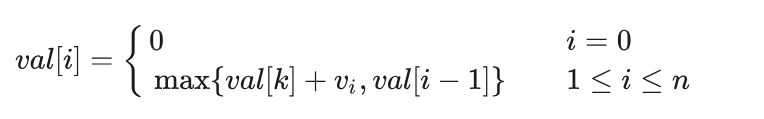

# 贪心算法

> [!note]
>
> 贪心算法(greedy algorithm)就是这样的算法，每一步都做出**当时看起来最佳的选择**。总是做出局部最优的选择
>
> 贪心方法是一种”只顾眼前”的分级处理方法：
>
> - 根据题意选取一种量度标准；
>- 按该标准一次选中一个输入；
> - 如果这个输入和当前的部分解加在一起满足约束条件，则将其加入到部分解中；否则舍弃掉。
>

> [!warning]
>
> 贪心算法并**不保证得到最优解**，但对很多问题确实可以求得最优解。
>
> 贪心法设计求解的核心问题：选择能产生问题最优解的量度标准，即**最优量度标准**


## 活动选择问题

**活动选择问题(activity-selection problem)**：是一个**调度多个活动问题**，这些活动需要互斥竞争共享资源。从一个活动日程表中选出**规模最大的相互兼容**的活动(activity)的集合。

有 n 个活动构成的集合 `S={a1,a2,…,an}` ，这些活动都需要占用会议室，且每个时刻会议室只能给一场活动提供服务。每个活动 ai 的开始时间`(start time)为 si` ，结束时间`(finish time)为 fi `，其中 `0≤si<fi<∞ `。如果活动 ai 占用的时间为左闭右开区间 [si,fi) 。如果活动 ai 和 aj 的时间区间 `[si,fi) 和 [sj,fj) 没有重叠`，那么活动 ai 和 aj 相互兼容

活动选择问题目标是从所有活动中选出一个总时间规模最大相互兼容的活动子集

> [!tip]
>
> 假设这些活动已经按照**结束时间**从小到大排序，即：`f1≤f2≤f3≤⋯≤fn`

### 活动选择问题的最优子结构

> [!important]
>
> 定义 Sij 为 ai 结束后 aj 开始前的活动集合，定义 Aij 为 Sij 中规模最大且相互兼容的活动子集。
>
>  Aij中包含活动 ak ，和**两个子问题 Aik 和 Akj** 。定义 `Aik=Aij∩Sik 且 Akj=Aij∩Skj `，这样有 `Aik=Aik∪{ak}∪Akj ，所以有 |Aij|=|Aik|+|Akj|+1` 。
>
> 剪切粘贴方法可以证明最优解 Aij 一定包含两个子问题 Sik 和 Skj 的最优解
>
> 如果你能找到一个由 Skj 相互兼容的活动组成的集合 Akj′ ，其中`|Akj′|>|Akj|` ，那么你就可以用 Akj′ 替换 Akj 。此时就能构造出规模为`|Aik|+|Akj′|+1>|Aik|+|Akj|+1=|Aij| `的相互兼容的活动集合，与 Aij 是最优解矛盾。同理也可以用于证明子问题 Sik 

- 最优解

> [!note]
>
> 定义 Sij 的最优解的规模为 c[i,j] ，运用[动态规划](https://zhida.zhihu.com/search?content_id=214481794&content_type=Article&match_order=1&q=动态规划&zhida_source=entity)方法可以写出递归式： `c[i,j]=c[i,k]+c[k,j]+1` 。
>
> 如果不知道 Sij 的最优解包含活动 ak ，就需要考察 Sij 中的所有活动，**寻找哪个活动可以构造最优解**:
>
> 

#### **方法一：动态规划（区间两个端点都不固定）**

这个方法实际意义是找到**分割点**

- 对于子问题 Sij ，当 j−i≥2 时，我们要找到活动 ak ，使得 `i<k<j,fi≤sk,fk≤sj `。
- 构造两个**虚拟活动** a0 和 an+1 ，活动 a0 的结束时间 `f0=0` ，活动 an+1 的开始时间 `sn+1=+∞` 
- 构造 Aij 规模 c[i,j] 表格 c[0:n+1,0:n+1] 和对应的 act[i,j] 选择表格 act[0:n+1,0:n+1] 。
- `c[i][j]` 表示在虚拟活动 `i` 和 `j` 之间（即活动 `i` 结束后开始、活动 `j` 开始前结束的活动）能选择的最大兼容活动数

```cpp
DP-ACTIVITY-SELECTOR(s, f, n) {
    let c[0 : n + 1, 0 : n + 1] and act[0 : n + 1, 0 : n + 1] be new tables
    //开区间，所以（i，i)和（i，i+1)之间没有活动
    for i = 0 to n
        c[i, i] = 0
        c[i, i + 1] = 0
    c[n + 1, n + 1] = 0
    //区间长度（i,i+l)中间有l-1个活动
    for l = 2 to n + 1
        //起始点
        for i = 0 to n - l + 1
            //结束点
            j = i + l
            c[i, j] = 0
            //从后往前遍历分割点
            k = j - 1
            while f[i] < f[k]
                if f[i] ≤ s[k] and f[k] ≤ s[j] and c[i, k] + c[k, j] + 1 > c[i, j]
                    c[i, j] = c[i, k] + c[k, j] + 1
                    act[i, j] = k
                k = k - 1
    print "A maximum size set of mutually compatible activities has size" c[0, n + 1]
    print "The set contains"
    PRINT-ACTIVITIES(c, act, 0, n + 1)
}

PRINT-ACTIVITIES(c, act, i, j)
    if c[i, j] > 0
        k = act[i, j]
        print k
        PRINT-ACTIVITIES(c, act, i, k)
        PRINT-ACTIVITIES(c, act, k, j)
```

- DP-ACTIVITY-SELECTOR的运行时间为 O(n^3) 。

#### **方法二：动态规划（区间一个端点固定，另一个端点不固定）**

这个方法则是从左到右判断是否**选择该活动**

假定所有活动已经按照结束时间从小到大排序。

只需要从单端开始拓展就行，构造数组 c[0,n] ，构造一个虚拟活动 a0 ，活动 a0 的结束时间 ，`f0=0，v0=0` ，**c[i] 表示前 i 个活动能够取得的最大规模**，即子问题 S0,i 中规模最大且相互兼容的活动子集 A0,i 的规模，对应的活动序列为 act[i] 。则求解 c[i] 的递归式如下：


当 i≠0 时， c[i] 在**选择第 i 个活动 c[k]+1** （ k 为结束时间小于等于且最接近 si 的活动下标）和**不选择第 i 个活动 c[i−1]** 之间取最大值

DP-ACTIVITY-SELECTOR伪代码如下：

```cpp
-ACTIVITY-SELECTOR(s, f, v, n)
    let c[0 : n] and act[0 : n] be new arrays
    c[0] = 0
    for i = 1 to n
        k = i - 1
        //找到不冲突的活动
        while k > 0
            if f[k] ≤ s[i]
                break
            k = k - 1
        if c[k] + 1 > c[i - 1]
            c[i] = c[k] + 1
            act[i] = act[k]
            act[i] = act[i] ∪ {i} 
        else 
            c[i] = c[i - 1]
            act[i] = act[i - 1]
    print "A maximum size set of mutually compatible activities has size" c[n]
    print "The set contains"
    print act[n]
```

DP-ACTIVITY-SELECTOR的运行时间为 O(n^2) 。

#### **方法三：动态规划（区间一个端点固定，另一个端点不固定）二分查找优化**

方法二中查找 k 的步骤因为**f[n]是有序的**，可以用**二分查找进一步优化**：

```cpp
DP-ACTIVITY-SELECTOR(s, f, v, n)
    let c[0 : n] and act[0 : n] be new arrays
    c[0] = 0
    for i = 1 to n
        l = 1
        r = i
        while l ≤ r
            mid = ⌊(l + r) / 2⌋ 
            if f[mid] ≤ s[i]
                l = mid + 1
            else
                r = mid - 1
        k = r
        if c[k] + 1 > c[i - 1]
            c[i] = c[k] + 1
            act[i] = act[k]
            act[i] = act[i] ∪ {i}
        else 
            c[i] = c[i - 1]
            act[i] = act[i - 1]
    print "A maximum size set of mutually compatible activities has size" c[n]
    print "The set contains"
    print act[n]
```

DP-ACTIVITY-SELECTOR的运行时间为 O(nlg⁡n) 。

> [!tip]
>
> 全源最短路径[Floyd算法](https://zhida.zhihu.com/search?content_id=214481794&content_type=Article&match_order=1&q=Floyd算法&zhida_source=entity)、单源最短路径[Dijkstra算法](https://zhida.zhihu.com/search?content_id=214481794&content_type=Article&match_order=1&q=Dijkstra算法&zhida_source=entity)、单源最短路径**Dijkstra算法优先队列优化**的运行时间依次为 O(n^3) 、 O(n^2) 、 O(nlg⁡n) 。
>
> 两者非常相似。

### 贪心选择（最早结束）

对于活动选择问题，我们只需要考虑一个选择，那就是贪心选择。

贪心选择一个能够**尽早结束活动**，这样留下尽可能多的资源供接下来的活动使用。

由于所有活动已经按照结束时间从小到大排序，贪心选择 a1 ，接下来只有一个子问题要处理，**选择一个在 a1 结束后开始的活动**。为什么没必要考察在 a1 开始前的活动呢？因为 s1<f1 ， f1 是最早结束的活动，所以**不会有活动结束时间早于 s1** ，可以贪心选择活动 a1 

令 `Sk={ai∈S:si≥fk}` 为在 **ak 结束后开始**的任务集合。当贪心选择 a1 后， S1 是唯一需要求解的子问题。

#### **定理16.1(Theorem 16.1)**

> [!note]
>
> 考虑任意非空子问题Sk, 令am 是Sk 中结束时间最早的活动，则 am 在sk 的某个 最大兼容活动子集中。
>
> 证明：定义 Ak 是 Sk 的最大兼容活动子集，且 aj 是 Ak 中结束时间最早的活动。
>
> 1. 若 aj=am ，则已证明 am∈Ak 。
> 2. 若 aj≠am ，令 `Ak′=(Ak−{aj})∪{am} `，则 |Ak|=|Ak′| 。又 aj 是 Ak 中结束时间最早的活动，am 是 Ak′ 中结束时间最早的活动， fm≤fj 。所以 Ak′ 是 Sk 的最大兼容活动子集， am∈Ak′ 。

我们每次选择**结束时间最早的且与当前活动兼容**的活动，重复执行这个过程直到没有剩余活动可以选择。所选择的活动的结束时间必然是严格递增的。所以我们只需要按照结束时间单调递增的顺序处理所有活动，每个活动仅需要考察一次。

由于[贪心算法](https://zhida.zhihu.com/search?content_id=214481794&content_type=Article&match_order=1&q=贪心算法&zhida_source=entity)只有一个子问题，所以用自顶向下的方法进行求解也非常方便。

#### 递归贪心算法(A recursive greedy algorithm)

可以增加一个**虚拟活动 a0** 放在所有活动之前，其结束时间 f0=0 。这样子问题 S0 就是完整的活动集合 S 。RECURSIVE-ACTIVITY-SELECTOR的伪代码如下：

```c
RECURSIVE-ACTIVITY-SELECTOR(s, f, k, n) 
    m = k + 1
    while m ≤ n and s[m] < f[k]    // find the first activity in S_k to finish
        m = m + 1
    if m ≤ n
        return {a_m} ∪ RECURSIVE-ACTIVITY-SELECTOR(s, f, m, n) 
    else return ∅

RECURSIVE-ACTIVITY-SELECTOR(s, f, 0, n) // call function
```

假定所有活动**已经按照结束时间从小到大排序**，则递归调用 RECURSIVE-ACTIVITY-SELECTOR(s,f,0,n) 的运行时间为 Θ(n) 。

#### 迭代贪心算法(An iterative greedy algorithm)

RECURSIVE-ACTIVITY-SELECTOR几乎就是**[尾递归](https://zhida.zhihu.com/search?content_id=214481794&content_type=Article&match_order=1&q=尾递归&zhida_source=entity)(tail recursive)**，

> 如果一个函数中所有递归形式的调用都出现在函数的末尾，我们称这个递归函数是尾递归的。（详见思考题7-5）

将尾部递归过程转换为迭代形式通常是一项简单的任务。事实上，**某些编程语言的编译器会自动执行此任务。**

RECURSIVE-ACTIVITY-SELECTOR可以转化为迭代版本GREEDY-ACTIVITY-SELECTOR，伪代码如下：

```cpp
GREEDY-ACTIVITY-SELECTOR(s, f, n)
    A = {a_1}
    k = 1
    for m = 2 to n
        if s[m] ≥ f[k]    // is a_m in S_k
            A = A ∪ {a_m}    // yes, so choose it
            k = m    // and continue from there
    return A
```

变量 k 记录了**最近加入集合 A 的活动下标**，对应递归算法中的活动 ak ，由于我们按照结束时间单调递增处理活动。 fk 是 A 中活动的的最大结束时间，也就是说，


假定所有活动已经按照结束时间从小到大排序，则递归调用 GREEDY-ACTIVITY-SELECTOR(s,f,n) 的运行时间为 Θ(n) 。

### 另一贪心选择（最晚开始）

不再一直选择最早结束的活动，而是**选择最晚开始**的活动，前提仍然是与之前 选出的所有活动均兼容

这个策略和选择最早结束的方案是完全对称的，假设时间倒流，所有活动倒过来执行。

有 n 个活动构成的集合 `S={a1,a2,…,an}` ，假设这些活动已经按照**开始时间从大到小**排序，即：` s1≥s2≥s3≥⋯≥sn `。

> [!tip]
>
> 令 `Sk={ai∈S:fk≤si}` 为在 ak **开始前结束**的任务集合。当贪心选择 a1 后， S1 是唯一需要求解的子问题。
>
> 考虑任意非空子问题 Sk ，如果 am 是 Sk 中开始时间最晚的活动，那么 am 在 Sk 的某个最大兼容活动子集中。
>
> 证明：定义 Ak 是 Sk 的最大兼容活动子集，且 aj 是 Ak 中开始时间最晚的活动。
>
> 1. 若 aj=am ，则已证明 am∈Ak 。
> 2. 若 aj≠am ，令 `Ak′=(Ak−{aj})∪{am} `，则 |Ak|=|Ak′| 。又 aj 是 Ak 中开始时间最晚的活动，am 是 Ak′ 中开始时间最晚的活动， sm≥sj 。所以 Ak′ 是 Sk 的最大兼容活动子集， am∈Ak′ 。

我们每次选择开始时间最晚的且与当前活动兼容的活动，重复执行这个过程直到没有剩余活动可以选择。所选择的活动的开始时间必然是严格递减的。所以我们只需要按照开始时间单调递减的顺序处理所有活动，每个活动仅需要考察一次

#### **递归贪心算法**

可以增加一个**虚拟活动 a0** 放在所有活动之后，其开始时间 s0=f1 。这样子问题 S0 就是完整的活动集合 S 。RECURSIVE-ACTIVITY-SELECTOR的伪代码如下：

```cpp
RECURSIVE-ACTIVITY-SELECTOR(s, f, k, n) 
    m = k + 1
    //越往后开始时间越早，f[m]>s[k]则保证兼容
    while m ≤ n and f[m] > s[k]    // find the first activity in S_k to start
        m = m + 1
    if m ≤ n
        return {a_m} ∪ RECURSIVE-ACTIVITY-SELECTOR(s, f, m, n) 
    else return ∅

RECURSIVE-ACTIVITY-SELECTOR(s, f, 0, n) // call function
```

假定所有活动已经按照开始时间排好序，则递归调用 

RECURSIVE-ACTIVITY-SELECTOR(s,f,0,n) 的运行时间为 Θ(n) 。

#### **迭代贪心算法**

迭代版本GREEDY-ACTIVITY-SELECTOR，伪代码如下：

```cpp
GREEDY-ACTIVITY-SELECTOR(s, f, n)
    A = {a_1}
    k = 1
    for m = 2 to n
        if f[m] ≤ s[k]    // is a_m in S_k
            A = A ∪ {a_m}    // yes, so choose it
            k = m    // and continue from there
    return A
```

假定所有活动已经按照开始时间排好序，则调用 GREEDY-ACTIVITY-SELECTOR(s,f,n) 的运行时间为 Θ(n) 。

### 不合理的贪心选择

在剩余活动中选择**持续时间最短**的活动不能得到最大兼容的活动子集。

在剩余活动中选择**与其它活动重叠最少**的活动不能得到最大兼容的活动子集。

在剩余活动中**选择最早开始**的活动不能得到最大兼容的活动子集。


## 区间着色问题

假设有一组活动，将它们安排到一些讲堂，任意活动都可以在任意讲堂进行，我们希望用**最少的教室完成所有活动**，设计一个贪心算法求每个活动所在讲堂进行分配。

> [!note]
>
> 这个问题可以视为**区间图着色问题(interval-graph coloring problem)**。区间图着色问题：构造一个区间图，顶点表示给定的活动，边连接不兼容的活动。要求用最少的颜色对顶点进行着色，相邻顶点的颜色不能相同。

- 设活动数组为 A ，总共有 n 个活动。每个活动保存为一个结构体，包含活动id，开始时间，结束时间，讲堂id。

### **方法一：优先队列**

朴素思想：每当有新活动时，就遍历所有讲堂，查看是否有空闲讲堂。如果没有空闲讲堂，就新开一个讲堂。为了方便**选出空闲讲堂**，我们可以使用优先队列。

> 1. 按照**开始时间**对活动进行排序。
> 2. 初始化一个**小顶堆**，按照**结束时间排序**，堆顶活动为最早结束的活动。
> 3. 遍历检查每一个活动
>    1. 如果**堆为空**，增加一个新讲堂，选好讲堂后将**活动加入堆中**，同时将该活动记录到所在讲堂举行的活动名单中。
>    2. 如果**堆不为空**，和堆顶活动进行比较，如果堆顶活动的结束时间小于或等于当前活动的开始时间即检查当前有无空闲讲堂，将堆顶活动出队，并将当前活动放在堆顶活动所在讲堂进行，否则开辟一个新讲堂。选好讲堂后将活动加入堆中，同时将该活动记录到所在讲堂举行的活动名单中
> 4. 所有活动检查结束后，输出所有讲堂举行的活动名单。

```cpp
LECTURE-HALLS-SCHEDULE(A, n) 
    sort A by start time in ascending order
    //A[i]={start_time,finsh_time,hall-id，activity_id}
    let PQ be a new min-priority queue keyed by end time
    let H be a new table
    hall-count = 0
    //遍历活动
    for i = 1 to n
        if PQ.empty() == true
            hall-count = hall-count + 1
            A[i].hall-id = hall-count 
            PQ.push(A[i])
            H[hall-count] = H[hall-count] ∪ {A[i]}
        else 
            //有空闲讲堂
            if A[i].start-time ≥ PQ.top().end-time
                A[i].hall-id = PQ.top().hall-id
                H[A[i].hall-id] = H[A[i].hall-id] ∪ {A[i]}
                PQ.pop()
            else
                hall-count = hall-count + 1
                A[i].hall-id = hall-count
                let h be a new array
                H.push_back(h)
                H[A[i].hall-id] = H[A[i].hall-id] ∪ {A[i]}
            PQ.push(A[i])
    for j = 1 to hall-count
        print "the activities lecture hall" j "will hold are: "
        for k = 1 to H[j].size()
            print H[j][k].activity-id ", "
```

LECTURE-HALLS-SCHEDULE运行时间为 **Θ(nlg⁡n)** ，排序运行时间为 Θ(nlg⁡n) ，每个活动要检查一次，优先队列调整运行时间为 O(lg⁡n) ，总共有 n 个活动，总计 O(nlg⁡n) 。所以总的运行时间为 Θ(nlg⁡n) 。

LECTURE-HALLS-SCHEDULE需要的辅助空间大小为 **Θ(n)** ，最坏情况下所有活动都需要一个独立的讲堂，优先队列最大为 O(n) ，表格 H 记录所有活动，大小为 Θ(n) 。所以总的辅助空间大小为 Θ(n) 。

### 方法二：有序化

1. 将活动数组分别按照开始时间和结束时间从小到大排序。按照开始时间从小到大排序的数组称为活动开始数组，按照结束时间从小到大排序的数组称为活动结束数组，
2. 维护两个指针，活动开始数组指针 sp ，跟踪活动开始，活动结束数组 fp ，跟踪活动结束。
3. 当考虑 sp 指向的特定活动时，**检查该开始时间是否大于或等于 fp 指向的活动**。若如此，则说明 fp 开始时，已经有活动结束。于是我们可以重用讲堂。否则，我们就需要开新讲堂，同时**记录新开讲堂**。处理结束后自增 sp ，处理下一个活动。
4. **若有活动结束，则记录空闲讲堂**（可以用栈或者队列维护所有空闲讲堂），自增 fp 
5. 重复这一过程，直到 sp 处理完所有活动。

```python
LECTURE-HALLS-SCHEDULE(A, n) 
    sort A by start time in ascending order
    A' = A
    sort A' by start time in ascending order
    let H be a new table
    hall-count = 0
    sp = 1
    fp = 1
    let Q be a new queue
    while sp ≤ n
        //有空闲讲堂或者说有活动结束
        if A[sp].start-time ≥ A'[fp].finish-time
            hall-id = Q.pop()
            A[sp].hall-id = hall-id
            H[hall-id] = H[hall-id] ∪ {A[sp]}
            Q.push(A'[fp].hall-id) //放入当前活动
            fp = fp + 1
        else
            hall-count = hall-count + 1
            A[sp].hall-id = hall-count
            let h be a new array
            H.push_back(h)
            H[A[sp].hall-id] = H[A[sp].hall-id] ∪ {A[sp]}
        sp = sp + 1
    for j = 1 to hall-count
        print "the activities lecture hall" j "will hold are: "
        for k = 1 to H[j].size()
            print H[j][k].activity-id ", "
```

LECTURE-HALLS-SCHEDULE运行时间为 **Θ(nlg⁡n)** ，排序运行时间为 Θ(nlg⁡n) ，每个活动要检查一次，运行时间为 Θ(1) ，总共有 n 个活动，总计 Θ(n) 。所以总的运行时间为 Θ(nlg⁡n) 。

LECTURE-HALLS-SCHEDULE需要的辅助空间大小为 Θ(n) ，复制数组 A′ 记录所有活动大小为 Θ(n) ，辅助队列 Q 大小为 O(n) ，表格 H 记录所有活动，大小为 Θ(n) 。所以总的辅助空间大小为 Θ(n) 。

## 权值之和最大的兼容活动子集

每个活动或者说作业ai除了开始和结束时间外，还有一个值v作为权值或者收益值,。目 求**权值之和最大**的兼容活动子集。也就是选择一个活动集合 A ，使得 `∑Vk(ak∈A)` 最大化。设计一个多项式时间的算法求解该问题

- 解答：每个活动新增了权值属性，而且原问题为求权值总和最大的活动子集，我们无法再用贪心策略求解，因为即便参加活动多活动权值总和未必大，所以本题只能用**动态规划**求解

### **方法一：动态规划（区间两个端点都不固定）**

1. 所有活动已经按照**结束时间从小到大**排序

2. 定义 Aij 为 Sij 中权值总和最大且相互兼容的活动子集，定义 **val[i,j] 为子问题 Sij 的最大权值总和**，则求解 val[i,j] 的递归式如下

   

   

- 构造两个**虚拟活动** a0 和 an+1 ，活动 a0 的结束时间 f0=0 ，活动 an+1 的开始时间 sn+1=+∞ 
- 原问题转化为求子问题 **S0,n+1 中权值总和最大且相互兼容的活动子集 A0,n+1** 。
- 构造 Aij 权值总和 val[i,j] 表格 val[0:n+1,0:n+1] 和对应的 **act[i,j] 选择表格** act[0:n+1,0:n+1] 。

MAX-VALUE-ACTIVITY-SELECTOR伪代码如下：

```cpp
MAX-VALUE-ACTIVITY-SELECTOR(s, f, v, n)
    let val[0 : n + 1, 0 : n + 1] and act[0 : n + 1, 0 : n + 1] be new tablbs
    //依旧是开区间，（i，i）和（i，i+1)都没有元素
    for i = 0 to n
        val[i, i] = 0
        val[i, i + 1] = 0
    val[n + 1, n + 1] = 0
        
    //区间长度
    for l = 2 to n + 1
        for i = 0 to n - l + 1
        j = i + l
        val[i, j] = 0
        k = j - 1
        while f[i] < f[k]
            if f[i] ≤ s[k] and f[k] ≤ s[j] and val[i, k] + val[k, j] + v_k > val[i, j]
                val[i, j] = val[i, k] + val[k, j] + v[k]
                act[i, j] = k
            k = k - 1
    print "A maximum-value set of mutually compatible activities has value" val[0, n + 1]
    print "The set contains"
    PRINT-ACTIVITIES(val, act, 0, n + 1)

PRINT-ACTIVITIES(val, act, i, j)
    if val[i, j] > 0
        k = act[i, j]
        print k
        PRINT-ACTIVITIES(val, act, i, k)
        PRINT-ACTIVITIES(val, act, k, j)
```

MAX-VALUE-ACTIVITY-SELECTOR的运行时间为 O(n^3) 。

### 方法二：动态规划（区间一个端点固定，另一个端点不固定）

- 需要从单端开始拓展就行，构造数组 val[0,n] 
- 构造一个虚拟活动 a0 ，活动 a0 的结束时间 ，f0=0，v0=0 
- val[i] 表示前 i 个活动能够取得的最大权值总和，即子问题 S0,i 中权值总和最大且相互兼容的活动子集 A0,i 的权值总和，对应的活动序列为 act[i] 。
- 求解 val[i] 的递归式如下：



当 i≠0 时， val[i] 在**选择第 i 个活动 val[k]+vi** （ k 为结束时间小于等于且最接近 si 的活动下标）和**不选择第 i 个活动 val[i−1]** 之间取最大值

MAX-VALUE-ACTIVITY-SELECTOR伪代码如下：

```cpp
MAX-VALUE-ACTIVITY-SELECTOR(s, f, v, n)
    let val[0 : n] and act[0 : n] be new arrays
    //第一个虚拟活动价值为0
    val[0] = 0
    for i = 1 to n
        k = i - 1
        while k > 0
            if f[k] ≤ s[i]
                break
            k = k - 1
        //前k活动加上活动i收益大于不选则i的收益
        if val[k] + v[i] > val[i - 1]
            val[i] = val[k] + v[i]
            act[i] = act[k]
            act[i] = act[i] ∪ {i}
        else 
            val[i] = val[i - 1]
            act[i] = act[i - 1]
    print "A maximum-value set of mutually compatible activities has value" val[n]
    print "The set contains"
    print act[n]
```

MAX-VALUE-ACTIVITY-SELECTOR的运行时间为 O(n^2) 。

### 方法三：动态规划（区间一个端点固定，另一个端点不固定）二分查找优化

- 可以看出方法二在查找第一个结束时间小于等于且最接近 si 的活动下标类似于求左边界，即f[k]<=s[i]的最大下标
- 利用二分查找或者STL中的upper_bound

```cpp
MAX-VALUE-ACTIVITY-SELECTOR(s, f, v, n)
    let val[0 : n] and act[0 : n] be new arrays
    val[0] = 0
    for i = 1 to n
        l = 1
        r = n - 1
        while l ≤ r
            mid = l+((r-l)>>1)
            if f[mid] ≤ s[i]
                l = mid + 1
            else
                r = mid - 1
        k = r
        if val[k] + v[i] > val[i - 1]
            val[i] = val[k] + v[i]
            act[i] = act[k]
            act[i] = act[i] ∪ {i}
        else 
            val[i] = val[i - 1]
            act[i] = act[i - 1]
    print "A maximum-value set of mutually compatible activities has value" val[n]
    print "The set contains"
    print act[n]
```

MAX-VALUE-ACTIVITY-SELECTOR的运行时间为 O(nlg⁡n) 。

## 小数背包

### 问题 

已知有n种物品和一个可容纳M重量的背包，每种物品i的重量为wi，效益值为pi ,假定将物品i的某一部分xi放入背包就会得到`pi*xi(0≤xi≤1,pi>0) `的效益，采用怎样的装包方法会使装入背包物品的**总效益为最大**

不同于0/1背包，物品无法分割只能选择放一个或者不放，而小数背包可以切割物品的一部分或者说按比例放入，同时获取比例收益

### 解答

#### 动态规划

- 最优子结构：

  > [!tip]
  >
  > - 假设总容量为 *W*，当前选择装入某物品的 *x* 单位（x≤ 该物品总重量），则剩余容量 W−x 构成一个子问题。
  > - 剩余容量必须继续按照最优策略分配，即选择剩余物品中单位价值最高的装入。这一子问题的最优解与原问题的部分解结合，形成全局最优解。
  > - 若剩余容量未按最优方式分配，则整体解必然不是最优，因此子问题的最优性保证了全局最优。
  
  

#### 贪心算法

但是对于这个问题可以利用**人的思维惯性**，先放入价值最高的物品，再放入价值次优的物品，直至背包被装满

> [!note]
>
> 这就是贪心算法，然后选择量度标准即价值高低的定义，因为有重量的约束并且物品可分则使用**单位重量的效益**作为标准
>
> 1. 将物品按单位重量效益的非增次序排序（递减）
> 2. 按该次序逐一放物品，直到背包装满

```cpp
//先将物品按pi/wi比值的非增次序排序(降序)
int GREEDY-KNAPSACK(vector<int> weight,vector<int>value,int bagweight)
{
    int max_value=0;
    int now_weight=bagweight;
    vector<int> object(weight.size());//记录物品放入比例
    for(int i=0;i<weight.size();i++){
        //无法装入完整物品
        if(weight[i]>now_weight)
        {
            //按比例放入
            object[i]=now_weight/weight[i];
            max_value+=value[i]*object[i];
            break;
        }
        max_value+=value[i];
        now_weight-=weight[i];
        object[i]=1;
    }
    return max_value;
}
```

---

#### 类似的模型

##### 最佳装载

有编号为1,2,…,n的集装箱准备装上轮船，其中集装箱i的重量是wi , i=1,2,…,n.  已知轮船最大承重量是C，轮船对集装箱没有体积限制。如何选择装载，可使船上集装箱数量最多。

> [!note]
>
> 为了使轮船上装载的集装箱数量最多，最优量度标准是：优先选择重量最小的集装箱进行装载，直到无法再装载新的集装箱为止。

船可容纳的最大重量为C

设贪心解选择的集装箱数量为 m，即 SG={wi1,wi2,...,wim}，其中 wi1≤wi2≤...≤wim} 

设最优解选择的集装箱数量为 k，即 SO={wj1,wj2,...,wjk}

证明贪心解是最优解：

> 1. 假设贪心解不是最优解，即 m<k
>
>    1. m>k，与最优解矛盾
>    2. m<k，由于最优解 SO 选择了 k 个集装箱，因此其总重量必然满足小于等于C
>       1. 若贪心解比最优解少装了某些集装箱，即 m<k，贪心策略按重量从小到大选择，未被贪心选中的集装箱重量均不小于 wjm。
>       2. 又因为未被贪心选中的集装箱重量如果在最优解里那么也可以在贪心解里，所以未被贪心选中的集装箱不在最优解里，所以m>=k与m<k矛盾，m不小于k.
>    
>    3. m=k，如果SO=SG，则贪心解就是最优解
>       1. 如果SO!=SG，则找到第一个不相等的集装箱`wia!=wjb`，贪心策略按重量从小到大选择，所以wia<=wjb，a<=b；
>       2. 所以将wjb替换成wia，依旧为最优解，重复执行替换，可以将最优解变为贪心解，证明得m=k
>    
>    
>    总上m=k，即贪心解就是最优解

排序的时间复杂度为O(nlgn)，遍历weight时间复杂度为O(n)，所以总的时间复杂度为O(nlgn).

```cpp
int max_number(vector<int> weight,int boat)
{
    //使weight按非递增次序排序
    sort(weight.begin(),weight.end());
    int number=0;
    int now_weight=boat;
    for(int i=0;i<weight.size()&&weight[i]<=now_weight;i++)
        if(weight[i]<now_weight){
            number++;
            now_weight-=weight[i];
        }    
   return number;
}
```

##### 顾客等待时间问题

设有 n 个顾客同时等待一项服务，顾客需要的服务时间为 ti, i=1,2,...,n. 从时刻0开始计时.若在时刻 t 开始对顾客 i 服务,那么 i 的等待时间就是 t. 应该怎样安排 n 个顾客的服务次序，使得总的等待时间（每个顾客等待时间的总和）最少？

> [!note]
>
> 最优量度标准：在每个步骤，总是选择 需要服务时间最短的顾客 进行服务，即 按照服务时间 ti 递增排序 进行服务。

假设给定一个任意调度方案 S，其中某两个相邻的顾客 i 和 j 满足：

- `ti>tj`，但在调度方案 S 中，顾客 i 被安排在 j 之前。

我们交换 i 和 j 的位置，新的方案 S′ 相比 S 具有：

- 顾客 j 的等待时间减少了 `ti−tj`。
- 顾客 i 的等待时间增加了 `ti−tj`。

由于 `ti>tj`，交换后，整体的等待时间减少了。因此，始终按从小到大排序能获得更优的调度方案。

经过有限次交换，我们可以得到一个 **按照服务时间递增排序** 的最优调度方案。因此，贪心策略是最优的。

排序的时间复杂度为O(nlgn)，遍历Customer时间复杂度为O(n)，所以总的时间复杂度为O(nlgn).

```cpp
int min_wait(vector<int> customer)
{
    //排序，顾客需要时间从小到大
    sort(customer.begin(),customer.end());
    int time=0;
    int wait_time=0;
    //最后一个顾客的服务时间不计入等待
    for(int i=0;i<customer.size();i++)
    {
        time+=wait_time;
        wait_time+=customer[i];
    }
    
    return time;
}
```


## 带有期限的作业调度问题

### 问题

假定只能在一台机器上处理n个作业：

- 每个作业均可在单位时间内完成; 
- 又假定每个作业i都有一个截止期限di>0(di是整数), 当且仅当作业i在它的期限截止之前被完成时，方可获得pi>0的效益
- 求具有最大效益值的可行解（最优解）

### 解答

贪心算法，以目标函数∑pj作为量度标准, 将各作业按效益pi降序排列:` p1≥ p2≥ …≥ pn`

```cpp
procedure GREEDY_JOB(D, J, n)
//作业按p1≥ p2≥ …≥ pn的次序输入；期限值D(1:n)≥1；J是最优解//
J←{1}
for i ← 2  to  n  do
      if  (J ∪ {i}的所有作业都能在它们的截止期限前完成)
           then   J ← (J ∪ {i})//最优解加上i
      endif
repeat
end GREEDY_JOB
```

- 证明：J是贪心方法求出的作业集合，I是一个最优解的作业集合

  > 找一个属于J不属于I的元素，替换I中对应的元素，获得I’
  >
  > 证明I’仍然最优
  >
  > 重复步骤，间接证明J最优

> [!important]
>
> 定理5.3：设J是k个作业的集合, `б=i1,i2,…,ik`是J中作业的一种排列, 它使得`di1≤di2≤…≤dik`。J是一个可行解, 当且仅当J中的作业可以按照б的次序而又不违反任何一个期限的情况来处理
>
> - 证明思路：
> - 如果J中的作业可以按照б的次序而又不违反任何一个期限，则J是一个可行解
> - l若J是可行解，则必存在`б’=r1,r2,…,rk，使得drj≥j，1≤j≤k`。
>   - 假设`б’≠б`，令a是使得`ra≠ia`的最小下标；设`rb=ia`，显然b>a。
>   - 在б’中交换ra与rb的位置，产生新的可行排列б”，仍然是可行的。
> - 连续使用这种方法，就将б’转换成б且不违反任何一个期限
>
> 注意如果各个作业的**时间片不一样**定理依旧成立，可以通过相邻交换证明

- 根据以上定理，可以验证可行解

  > 假设已处理了i–1个作业, 有k个作业已存入J中, 且`D[J(1)]≤D[J(2)]≤…≤D[J(k)]`
  >
  > 在J中从后向前为作业i寻找位置r+1，插入r+1位置后，J中作业**仍按照期限值从小到大排列，且不违反期限值**

#### 基于插入排序的带有限期的作业排序

作业数 n 和包含在解J中的作业数 s ，JS算法所需要的总时间为O(sn)，由于s<=n，所以JS算法的最坏时间复杂度为O(n^2)

其中作业按收益非递增次序排序，并且从一号作业开始

```cpp
void JS(std::vector<int>& D, std::vector<int>& J, int n, int& k) {
    D[0] = 0;
    J[0] = 0;
    k = 1;
    J[1] = 1;
	//处理第i个作业
    for (int i = 2; i <= n; ++i) {
        int r = k;
        //找到插入的位置r
        while (D[J[r]] > D[i] && D[J[r]] != r) {
            --r;
        }
        //表示找到了插入位置r
        if (D[J[r]] <= D[i] && D[i] > r) {
            //实现作业r+1到作业k依次往后移动一个位置
            for (int l = k; l >= r + 1; --l) {
                J[l + 1] = J[l];
            }
            //插入
            J[r + 1] = i;
            ++k;
        }
    }
}
```

#### 基于集合数（并查集）的作业排序算法

- 对作业i分配时间时, 尽可能**推迟**对作业i的处理。 (在其截止期前最靠后的空时间片)
- 作出一些以期限值为元素的集合，且使同一集合中所有元素有**相同的最大空时间片**
- 对于每个期限值i，用F(i)表示当前最大空时间片，即 `F(i)=ni`
- 时间复杂度：O(n)

> [!tip]
>
> - 使用集合树表示法，**把每个集合表示成树**。P(i)把期限值i链接到它的父节点
> - 判断**作业*h*的可用空时间片**，即找`min{n,dh}`的根j，若`F(j)!=0`,说明有时间片可以分配，则` F(j)`是最接近期限值的时间片，把F(j)时间片分配给作业h并做标记。
> - 以 *j* 为根的集合树必须与包含期限`F(j)-1`的集合树合并。

```cpp
// 并查集路径压缩查找,根节点为-1
int find(std::vector<int>& parent, int x) {
    return parent[x]>0?x:parent[x]=find(parent,parent[x]);
}

//注意parent的绝对值才是个数，这里是小树合并到大树
void UNION(std::vector<int>& parent,int i,int j)
{
    int x=parent[i]+parent[j];
    if(parent[i]>parent[j]){
        parent[i]=j;
        parent[j]=x;
    }else {
        parent[j]=i;
        parent[i]=x;
    }
}

void FJS(std::vector<int>& D, int n, int b, std::vector<int>& J, int& k) {
    int b = min(n,*max_element(D.begin(),D.end()));
    // 初始化F数组，F[0..b]代表时间槽的父指针
    std::vector<int> F(b + 1);
    for (int i = 0; i <= b; ++i) {
        F[i] = i;
    }
    
    k = 0; // 可行作业数
    J.resize(n + 1); // J[1..k]存储可行作业

    // 按利润降序处理作业（假设输入已排序）
    for (int i = 1; i <= n; ++i) {
        int d = std::min(n, D[i]); // 计算有效截止时间
        int j = find(F, d); // 找到最晚可用时间槽
        
        if (F[j] != 0) { // 存在可用时间槽
            J[++k] = i; // 将作业i加入解集
            int l = find(F, F[j] - 1); // 找到下一个可用位置
            UNION(F,l,j);//合并集合
            F[j] = F[l]; // 合并时间槽，路径压缩
        }
    }
}
```

## 最小生成树问题

### 问题

最小生成树的定义：

设G=(V,E)是一个**加权无向连通图**。V表示顶点集合，E表示边集合。G的一棵生成树是一棵**无向树T=(V, E’)**，其中E’是E的子集。生成树的权是E’的所有权之和。**G的最小生成树是G的具有最小权值的生成树。**

### 解答

#### Kruskal方法

- 考虑预排序，从边的个数入手分析，时间复杂度为O(eloge)
- 这里贪心算法的度量标准就是**边的权值**，先选择权值小的

> [!tip]
>
> 证明：用e替换掉ej，获得新的可行解T ’’,证明新解也是最小生成树。反复替换，从而命题得证

- 从小到大选择边，如果将其加入最小生成树的集合T生成回路则放弃边否则加入T
- 这里判断回路则使用了并查集处理

```cpp
	//克鲁斯卡尔 (Kruskal)算法，可称为“加边法”，适用于稀疏图
	//每次选出权值最小并且无法使现有的树形成环的边加入最小支撑树,返回一个图
	std::vector<Edge> MiniSpanTree_Kruskal(std::vector<Edge> graph,int number)
	{
		//非连通图
		if (Connected_Component(graph,number) != 1)
		{
			return{};
		}
		std::vector<Edge> MiniSpanTree;
		//在Edge增加了weight成员存储权值，可以直接用sort排序
		std::sort(graph.begin(), graph.end(), [](const Edge& a, const Edge& b)->bool {return a.weight < b.weight; });

		//辅助数组Vexset,标识各个顶点所属的连通分量,类似于并查集
		std::vector<int> Vexset;
		Vexset.resize(number,0);
		//初始化,表示各顶点自成一个连通分址
		for (int i = 0; i < number; i++)
		{
			Vexset[i] = i;
		}

		//开始创建最小支撑树
		for (int i = 0; i < graph.size(); i++)
		{
			int v1 = graph[i].u;
			int v2 = graph[i].v;
			int vs1 = Vexset[v1];
			int vs2 = Vexset[v2];

			//边的两个顶点不在同一连通分量
			if (vs1 != vs2)
			{
				//加入此边
				MiniSpanTree.push_back(Edge(v1, v2));

				//合并vs1和vs2两个分量，即两个集合统一编号
				for (int j = 0; j < number; j++)
				{
					if (Vexset[j] == vs2)Vexset[j] = vs1;
				}
			}
		}

		//返回
		return MiniSpanTree;
	}
```

#### Prim算法（加点法）

- 选择任一点u做为起点，放入集合S，即令S={u}(u属于V)；
- 找最小跨集合边(u, v) ，即端点分别属于集合S和V-S且权值 最小的边，将该边加入最小支撑树，并将点v放入S；
- 执行②，直至S=V

如果只是需要权值和则不需要构造出最小生成树

```cpp
// 普里姆算法优化，使用优先队列
Adj_Matrix MiniSpanTree_Prim(const Adj_Matrix& adj, int u = 0 /*起始点*/) {
    // 非连通图，返回空图
    if (Connected_Component(adj) != 1) {
        return Adj_Matrix(0);
    }

    int n = adj.graph.size();  // 图的顶点数
    Adj_Matrix MiniSpanTree(n, adj.is_direct);  // 最小生成树

    // 记录顶点是否已经加入生成树
    std::vector<bool> vis(n, false);

    // 使用优先队列（最小堆）保存未加入生成树的点和其对应的最小边权值
    // 队列中存储的是 (边权值, 顶点) 的 pair
    std::priority_queue<std::pair<int, int>, std::vector<std::pair<int, int>>, std::greater<>> pq;

    // 初始化：从起始点u开始，加入队列，权值为0
    pq.push({0, u});

    // 选择其他n-1个顶点，生成n-1条边
    while (!pq.empty()) {
        // 取出当前权值最小的边
        int current_weight = pq.top().first;
        int u0 = pq.top().second;
        pq.pop();

        // 如果顶点u0已经加入生成树，则跳过
        if (vis[u0]) continue;

        // 标记u0为已访问
        vis[u0] = true;

        // 更新最小生成树的边
        if (u0 != u) {  // 排除起始点
            int v0 = pq.top().second;  // 顶点u0的前驱
            MiniSpanTree.graph[u0][v0] = current_weight;

            // 无向图则增加对称边
            if (!MiniSpanTree.is_direct) {
                MiniSpanTree.graph[v0][u0] = current_weight;
            }
        }

        // 更新与u0的相邻节点的最小边，并加入优先队列
        for (int i = 0; i < n; i++) {
            if (!vis[i] && adj.graph[u0][i] < INT_MAX) {  // 如果i未访问且有边
                pq.push({adj.graph[u0][i], i});
            }
        }
    }

    // 返回生成的最小生成树
    return MiniSpanTree;
}
```

---

## 补水点选择问题

### 问题

Gekko教授想横穿North Darkota州，教授在起点带着两公升水，在喝光水之前能滑行 m 英里，他还携带了一份路线图，上面标明了沿途补水点距离起点的距离。

教授的目标是最小化横穿途中的补水次数，请设计一个高效的算法，以帮助教授确定在哪些补水点进行补水。证明该算法能生成最优解，并给出该算法的运行时间。

### 解答

**假设一定能够到达终点**，并且起点也是一个补水点，假想教授在起点处进行了一次补水，若每次补水点位置为 x ，教授能够滑行的区间为 [x,x+m] 

采用贪心策略，教授是需要在在**喝光水之前的一个补水点进行补水**就行。

设途中有 n 个补水点，起点坐标为 0 ，终点坐标为 d ，第 i 个补水点坐标为 xi ，有 `0<x1<x2<⋯<xn<D ，设 x={x1,x2,…,xn} `，集合 S 保存补水点编号。

GREEDY-INTERVAL-SELECTOR伪代码如下：

```cpp
GREEDY-INTERVAL-SELECTOR(m, d, x, n) 
    let S be a new set
    i = 1
    s = 0 //当前前进距离
    
    //直到终点
    while (s + m < d)
        prev = s
        //找到最远并且在喝完水前可以到达的点
        while (i ≤ n and x[i] ≤ prev + m)
            s = x[i]
            i = i + 1
        S = S ∪ {i - 1}
    return S
```

优化为二分查找

```cpp
//有n个补水点包括起点
GREEDY-INTERVAL-SELECTOR(m, d, x, n) 
    let S be a new set
    i = 0//目前补水点
    s = 0 //当前前进距离
    
    //直到终点
    while (s + m < d)
        prev = s
        //二分查找最远并且在喝完水前可以到达的点
       	int l=i+1
        int r=n-1
        while(l<=r)
        {
            int mid=l+(r-l)>>1
           	if(x[mid]<=prev+m){
                i=mid;
                l=mid+1;
            }else r=mid-1;
        }
		s = x[i];
		S = S ∪ {i}
    return S
```

c++

```cpp
//n个补水点包括终点
vector<int> GreedyIntervalSelector(int m, int d, vector<int>& x) {
    vector<int> S;
    int n = x.size();
    if (n == 0 || x[0] > m) return {}; // 初始位置不可达第一个点

    int s = 0;       // 当前已到达的最远位置
    int current = 0; // 当前选中的点索引

    while (s + m < d) {
        int prev = s;
        int left = current + 1;
        int right = n - 1;
        int best = -1;

        // 二分查找最大可达点
        while (left <= right) {
            int mid = left + (right - left) / 2;
            if (x[mid] <= prev + m) {
                best = mid;
                left = mid + 1;
            } else {
                right = mid - 1;
            }
        }

        if (best == -1) return {}; // 没有可达点
        
        S.push_back(best);
        s = x[best];
        current = best;
    }
    return S;
}
```


---

## 覆盖点问题

### 问题

给定实数轴上的一个点集 {x1,x2,…,xn} ，请设计一个高效的算法，求一个能够包含所有点的单位长度的闭区间的集合，使得该集合最小，并证明该算法的正确性。

### 解答

设 `x1,x2,…,xn` 已经按照坐标从小到大排序，我们先考虑 x1 ，不存在值比 x1 更小了，我们选择闭区间 [x1,x1+1] ，设第一个大于 x1+1 的点为 xi ，剩下子问题的点集为 `{xi,xi+1,…,xn} `。重复执行上述步骤直到剩下子问题的**点集为 ∅** 。集合 S 为单位长度的闭区间的集合。

方法一：线性查找 + 线性查找

GREEDY-INTERVAL-SELECTOR伪代码如下：

```cpp
GREEDY-INTERVAL-SELECTOR(x, n)
    //无点集
    if n = 0
        return ∅
    let S be a new set
    //集合x[1:n]
    i = 1
    while (i ≤ n)
        S = S ∪ {[x[i], x[i] + 1]}
        prev = i
        //找到第一个未能覆盖到的点
        while (i ≤ n && x[i] ≤ x[prev] + 1)
            i = i + 1
    return S
```

GREEDY-INTERVAL-SELECTOR的运行时间为 Θ(n) 。

方法二：线性查找 + 二分查找

while循环中线性查找下一个区间的左端点可以用二分查找加速，修改后GREEDY-INTERVAL-SELECTOR伪代码如下：

GREEDY-INTERVAL-SELECTOR伪代码如下：

```cpp
GREEDY-INTERVAL-SELECTOR(x, n) 
    if n = 0
        return ∅
    let S be a new set
    i = 1
    while (i ≤ n)
        S = S ∪ {[x[i], x[i] + 1]}
        prev = i
        l = i
        r = n
        while (l ≤ n)
            mid = ⌊(l + r) / 2⌋
            if (x[mid] ≤ x[prev] + 1) 
                l = mid + 1
            else
                r = mid - 1
        i = l//更新单位长度的起点
    return S
```

GREEDY-INTERVAL-SELECTOR的运行时间为 O(n) 。

---

## 哈夫曼编码

### 编码问题

> [!important]
>
> 设计**二进制字符编码(binary character code)**问题：每个字符用唯一的二进制编码表示，称为码字(codeword)。
>
> 1. **定长编码(fixed-length code)**：所有字符的码字长度相同，需要使用 ⌈lg⁡n⌉ 个比特位表示 n≥2 个字符。
> 2. **变长编码(variable-length code)**：高频字符使用短码字，低频字符使用长码字。


### 前缀无关编码(Prefix-free codes)

**前缀无关编码(prefix-free codes)**：**任何一个码字都不是其它码字的前缀的编码**。在所有编码中，前缀无关编码的数据压缩效果是最优的。

> [!tip]
>
> 评：第三版中称为前缀编码(prefix codes)，在第四版和《计算理论导论》第三版中都已经改成前缀无关编码(prefix-free codes)，个人认为称为前缀无关编码更加准确，充分表达出定义中“不是”的含义。当然free比较难翻译，可以翻译成自由，空闲，无关等，为了方便，本人统一翻译成无关。

- **编码(encoding)**：任何二进制字符编码的编码很简单，直接将字符的码字按照**顺序拼接**。
- **解码(decoding)**：由于任何一个码字都不是其它码字的前缀的编码，所以每个字符的编码都是无歧义的。所以可以**按照顺序识别码字**，并将其转换为原来字符。

> [!note]
>
> 前缀无关编码可以用一棵**二叉树**表示，**叶结点存储字符**，左指针表示 0 ，右指针表示 1 (0意味着“转向左孩子"'，1意味着“转向右孩子＂)，从根结点到某叶结点的路径表示该叶结点存储的字符的码字。
>
> 同时文件的最优编码可以用一棵**满二叉树(full binary tree)**表示，即每个非叶结点都有两个孩子结点。

- 这里的满二叉树不是数据结构上的满二叉树而是一种更广义上的满二叉树或者说**严格的二叉树**，即所有非叶节点的度都为2，而不是树的每层数量都达到最大


- 如有字符集 C ，最优前缀无关编码对应的二叉树中有 |C| 个叶结点和 |C|−1 个非叶结点。

- 设给定某文件的**前缀无关编码**，对应的二叉树为 T ，字符集 C 中每个字符 c 在该文件中出现的频率为 `c.freq` ，对应的叶结点在二叉树中的深度为 `dT(c)>0` ， dT(c) 也是字符 c 的**码字的长度**。该文件的编码需要的比特位数为：

  

- 定义 B(T) 为树 T 的**代价(cost)**。


- 定长编码和变长编码的编码方案

### 构造哈夫曼编码(Constructing a Huffman code)

哈夫曼编码

- 首先目标是使编码方案对应的二叉树的代价最小，因此可以推出贪心策略对应的最优度量标准，即频率越高的字符深度越小
- 假定字符集 C 中包含 n 个字符，每个字符 c∈C 的频率为 c.freq ，我们采用自底向上的方法构造哈夫曼树，该算法使用了小根堆（最小优先队列） Q ，小根堆的关键字为属性 freq 。
- 识别两个最低频率的对象将其合并。当合并两个对象时， 得到的新对象的频率设置为原来**两个对象的频率之和**。
- 合并时顺序是任意的，交换左右孩子会生成一个不同的编码，但代价完全一样

HUFFMAN的伪代码如下：

```cpp
HUFFMAN(C)
    n = |C|
    //构建小根堆
    let PQ be a new min-priority queue keyed by freq
    PQ = C
    for i = 1 to n - 1
        allocate a new node z
        //选出频率最小的两颗树
        x = EXTRACT-MIN(PQ)
        y = EXTRACT-MIN(PQ)
        z.left = x
        z.right = y
        z.freq = x.freq + y.freq
        INSERT(PQ, z)
    return EXTRACT-MIN(PQ)    // the root of the tree is the only node left
```

- 简化

```cpp
HUFFMAN(C)
    n = |C|
    //构建小根堆
    let PQ be a new min-priority queue keyed by freq
    PQ = C
    for i = 1 to n - 1
        allocate a new node z
        //选出频率最小的两颗树
        z.left = EXTRACT-MIN(PQ)
        z.right = EXTRACT-MIN(PQ)
        z.freq = x.freq + y.freq
        INSERT(PQ, z)
    return EXTRACT-MIN(PQ)    // the root of the tree is the only node left
```

需要合并 n−1 次，每次优先队列调整的运行时间为 O(lg⁡n) ，所以HUFFMAN的运行时间为 **O(nlg⁡n)** 。

- 图解过程


### 哈夫曼算法的正确性(Correctness of Huffman's algorithm)

为了证明贪心算法HUFFMAN是正确的，需要证明最优前缀无关编码问题具有**贪心选择和最优子结构性质**。

#### **引理15.2(Lemma 15.2)**

这条引理将证明构造最优前缀无关编码问题具有贪心选择性质。

> [!note]
>
> 给定一个字母表 C ，每个字符 c∈C 的频率为 c.freq ，若 x 和 y 是 C 中频率最低的两个字符，则**存在一个 C 的最优前缀无关编码**，其中 x 和 y 的码字长度相同且只有最后一个比特位不同。

证明：

> 令 T 表示**任一**最优前缀无关编码对应的一棵二叉树，修改得到另一个最优前缀无关编码对应的二叉树，其中 x 和 y 对应的结点是深度最大的结点，且两者为兄弟结点。x 和 y 的码字长度相同且只有最后一个比特位不同。
>
> 设字符 a 和 b 在 T 中对应的结点是深度最大的结点，假设 `a.freq≤b.freq 且 x.freq≤y.freq` ，由于` x.freq 和 y.freq` 是所有字符频率中最小的两个频率，故 `x.freq≤a.freq 且 y.freq≤b.freq` 。
>
> 若` x.freq=b.freq ，则 a.freq=b.freq=x.freq=y.freq` 。此时引理成立。
>
> 
>
> 假设` x.freq≠b.freq` ，意味着 x≠b 。
>
> 
>
> 如图15-7所示，在 T 中交换 a 和 x 生成 T′ ，在 T′ 中交换 b 和 y 生成 T″ ， T 和 T′ 的代价差值为：
>
> 
>
> 即 B(T)≥B(T′) ，同理可得， B(T′)≥B(T″) ，由不等式的传递性， B(T)≥B(T″) ，又 **T 表示任一最优前缀无关编码对应的一棵二叉树**，有 B(T)≤B(T″) ，得 `B(T)=B(T″)` ，故 T″ 也表示某一最优前缀无关编码对应的一棵二叉树。

引理16.2 说明，不失一般性，通过合并来构造最优树的过程，可以从合并出现频率最低的 两个字符这样一个贪心选择开始。

#### **引理15.3(Lemma 15.3)**

这条引理将证明构造最优前缀无关编码问题具有最优子结构性质

> [!note]
>
> 给定一个字母表 C ，每个字符 c∈C 的频率为 c.freq ，若 x 和 y 是 C 中频率最低的两个字符，定义字符 z 且 `z.freq=x.freq+y.freq` ，定义字母表 `C′=(C−{x,y})∪{z} `，字母表 C′ 的任一最优前缀无关编码对应的一棵二叉树 T′ ，将 T′ 中的字符 z 对应的叶结点修改为一个内部结点且两个孩子结点分别为字符 x 和 y 对应的叶结点，这样可以得到字母表 C 的某一最优前缀无关编码对应的一棵二叉树 T 。

- 证明：

  > 由 `C′=(C−{x,y})∪{z}`
  >
  > `z.freq=x.freq+y.freq`
  >
  > `dT(x)=dT(y)=dT′(z)+1`
  >
  > `B(T)=∑c∈Cc.freq⋅dT(c)``
  >
  > ``B(T′)=∑c∈C′c.freq⋅dT′(c)` ，
  >
  > 可得 `B(T)=B(T′)+x.freq+y.freq `。
  >
  > 用反证法可证明，
  >
  > 
  >
  > 二叉树 T′ 能够表示字母表 C′ 的某一最优前缀无关编码，则二叉树 T 能够表示字母表 C 的某一最优前缀无关编码。

#### **定理15.4(Theorem 15.4)**

算法HUFFMAN能够生成一个最优前缀无关编码。

证明：由引理15.2和引理15.3可得。

---

## 最优归并树

构造一棵**最优[三路归并树](https://zhida.zhihu.com/search?content_id=215766440&content_type=Article&match_order=1&q=三路归并树&zhida_source=entity)(optimal ternary merge tree)** T=(V,E) ，其中只有度为 0 的结点和度为 3 的结点，设度为 i 的结点个数为 ni ，由|V|=|E|+1，可得 `n0+n3=3*n3+1`。

当叶子节点数不够时，构造权值为0的虚字符节点用来构造归并树

设给定一个由 n 个字符组成的字符集 C ，设需要补充的虚字符个数为 μ ，每个虚字符的频率为 0 。

由于 `n0=n+μ`，解得 μ 最小为 `μ=3−1−((n−1)mod(3−1))=2−((n−1)mod2)` 。

同理可得：k叉归并树的`μ=k−1−((n−1)mod(k−1))`

构造最优三进制编码和构造哈夫曼编码的过程类似。哈夫曼树是**最优二路归并树(optimal binary merge tree)**。

采用自底向上的方法构造三路归并树，该算法使用了小根堆 Q ，小根堆的关键字为属性 freq 。

设合并次数为 *k*，则总减少的节点数为 2*k*。初始总叶子数为*n*+*μ*，最终剩下1个根节点，所以循环(*n*+*μ*−1)/2 

OPTIMAL-TERNARY-MERGE的伪代码如下：

```cpp
OPTIMAL-TERNARY-MERGE(C)
    n = |C|
    μ = 2 - ((n - 1) mod 2)//虚字符个数
    let PQ be a new min-priority queue keyed by freq
    PQ = C
    //构造虚节点
    for i = 1 to μ
        allocate a new node x
        x.freq = 0
        INSERT(PQ, x)
    for i = 1 to (n + μ - 1) / 2
        allocate a new node w
        x = EXTRACT-MIN(PQ)
        y = EXTRACT-MIN(PQ)
        z = EXTRACT-MIN(PQ)
        w.first = x
        w.second = y
        w.third = z
        w.freq = x.freq + y.freq + z.freq
        INSERT(PQ, w)
    return EXTRACT-MIN(PQ)    // the root of the tree is the only node left
```

需要合并 (n+μ−1)/2 次，每次优先队列调整的运行时间为 O(lg⁡n) ，所以OPTIMAL-TERNARY-MERGE的运行时间为 **O(nlg⁡n)** 。

评：参考《数据结构（C语言版）》11.5 最佳归并树。

---

## 离线缓存

> [!note]
>
> **缓存(cache)**：容量比主存小，速度比主存快的**存储器(memory)**。计算机通过把需要访问的数据的一部分储存在缓存中，可以减少数据的访问时间。缓存将数据有组织地存放在**缓存块(cache blocks)**中，缓存块大小一般是 32 、 64 或 128 字节。
>
> **主存(main memory)**：虚拟内存系统中，主内存可以被视为驻留在磁盘上的数据的缓存。这些主存**块(blocks)**被称为**页(pages)**，页大小一般是 4096 字节。

### 问题

当一个程序执行时，需要进行一系列的存储器请求。假设有 n 个访存请求，这些数据按照请求顺序分别在 b1,b2,…,bn 块中。事实上，这些请求不会完全不同，多个请求有可能需要访问同一个块。

当需要访问 bi 时，会出现以下三种情况：

- 情况一：由于之前访问过 bi ， bi 已经在缓存中，当需要再次访问 bi 时，可以直接访问缓存，称为**[缓存命中](https://zhida.zhihu.com/search?content_id=216238624&content_type=Article&match_order=1&q=缓存命中&zhida_source=entity)(cache hit)**。
- 情况二：bi 不在缓存中，**缓存未满**，当需要访问 bi 时，直接将 bi 填充到空闲的缓存块。
- 情况三：bi 不在缓存中，**缓存已满**，当需要访问 bi 时，需要预先将某一个缓存块空出来，然后将 bi 填充到空闲的缓存块。

情况二和情况三称为**缓存未命中(cache miss)**。情况二称为**强制未命中(compulsory miss)**。

一般情况下，由于计算机无法知道未来的请求，因此**缓存(caching)**是一个在线问题。这里我们仅仅考虑**缓存问题的离线版本，即已知完整的访存请求序列和缓存块数量**，我们的目标是**最小化缓存未命中，最大化缓存命中**。

> [!important]
>
> 我们采用称为**将来最久(furthest-in-future)**的贪心策略求解离线缓存问题，即如果缓存已满，那么**选择已在缓存中且访存序列中将来最久到达的块**进行置换。在有些情况下，我们可以提前知道完整的访存请求序列，例如，我们可以将主存视为磁盘或者固态硬盘中所有数据的缓存，即已经有一些算法可以预先计划整个读写操作集。此外，我们可以使用最优算法的缓存未命中数作为比较多种在线算法性能的基线。这些我们将在27.3节中进行说明。

离线缓存也可以用于现实生活中的问题的建模。

### 解答

采用称为**将来最久(furthest-in-future)**的贪心策略求解离线缓存问题，即如果缓存已满，那么**选择已在缓存中且访存序列中将来最久到达的块**进行置换。

则接下来讨论贪心策略的最优子结构和贪心选择性质

#### 离线缓存的最优子结构(**Optimal substructure of offline caching**)

- 定义子问题 (C,i) ，缓存块集合为 C ，访存请求序列为 `bi,bi+1,…,bn` ，当前需要请求 bi ，设可用的缓存块数量最多为 k ， |C|≤k 。子问题 (C,i) 的最优解要求使得缓存未命中数最小

- 设子问题 (C,i) 的最优解为 S ，请求 bi 完成后缓存块集合为 C′ ，子问题 (C′,i+1) 的最优解为 S′ 。

- 定义 RC,i 为子问题 (C,i) 请求 bi 完成后可能的缓存块集合的集合，有：

  - 情况一： `RC,i={C}`，对应缓存命中
  - 情况二： `RC,i={C∪{bi}}`，对应缓存强制未命中
  - 情况三： `RC,i={(C−x)∪{bi}:x∈C}`，对应缓存未命中且满

  定义 miss(C,i) 为子问题 (C,i) 的最优解的**缓存未命中数**。递归式如下：

  

---

#### 离线缓存的贪心选择性质(Greedy-choice property of offline caching)

最优离线缓存具有贪心选择性质(Optimal offline caching has the greedy-choice property)

考虑子问题 (C,i) ，缓存块集合为 C 有 k 个缓存块，即此时缓存已满，且出现缓存未命中。当前需要请求 bi ，设 z=bm 为 C 中将来最久被请求的缓存块，（如果有缓存块将来不再被访问，优先考虑这样的缓存块成为 z ，所以可以增加虚缓存块，使得 z=bm=bn+1 。）我们可以移除缓存块 z ，然后将增加缓存块 bi ，如此操作可以得到子问题 (C,i) 的某一个最优解。

证明详见[算法导论（第四版）第十五章：贪心算法　第四节：离线缓存 - 知乎](https://zhuanlan.zhihu.com/p/576474832)


---

## 贪心算法原理

> [!note]
>
> 以通过贪心选择来改进最优子结构，使得选择后只留下一 个子问题
>
> 也就是优化动态规划的子问题数量

- 以下步骤设计贪心算法。

> [!important]
>
> 1. 最优化问题为你做出选择后只有一个子问题需要求解。
> 2. 证明每次做出贪心选择后，原问题总是有最优解，所以贪心选择总是安全的。
> 3. 证明做出贪心选择后的子问题和贪心选择一起构成原问题的最优解，即原问题具有最优子结构。
>
> 能够用贪心算法求解的问题具有**贪心选择性质**和**最优子结构**。

### 贪心选择性质(Greedy-choice property)

**贪心选择性质(greedy-choice property)**：可以通过作出局部最优（贪心）选择来构造全局最优解。

> [!important]
>
> 贪心算法和动态规划的对比：
>
> - 动态规划的选择依赖于子问题的解，所以一般采用**自底向上**的方法求解问题。
> - 贪心算法不依赖于子问题的解，所以一般采用**自顶向下**的方法求解问题。

- 因此必须证明每个步骤做出贪心选择能生成全局最优解：
  - 首先考查**某个子问题的最优解**，然后用贪心选择替换某个其他选择来修改此解，从而得到一个相似但更小的子问题。

如果我们进行贪心选择时不得不考虑众多选择，我们必须提高进行贪心选择的效率。通过对输入数据进行**预处理**或者选择**合适的数据结构**（通常是优先队列），我们可以快速做出贪心选择，从而得到高效的算法。

### 最优子结构(Optimal substructure)

> [!note]
>
> 如果一个问题的最优解包含其子问题的最优解，则称此问题具有最优子结构性质。

贪心算法通常采用一个非常直接的方法运用最优子结构，**假定通过对原问题的贪心选择就可以得到子问题**，我们只需要证明做出贪心选择后的子问题和贪心选择一起构成原问题的最优解。

该方法隐式地运用了**归纳法**证明了每一步贪心选择都能构成原问题的最优解。


### 贪心VS动态规划(Greedy versus dynamic programming)

虽然贪心和动态规划方法都对问题的最优子结构进行了研究，但是如何选择两种方法求解问题却是个难点，所以我们用下面两个问题进行举例。

**0-1[背包问题](https://zhida.zhihu.com/search?content_id=215541408&content_type=Article&match_order=1&q=背包问题&zhida_source=entity)(0-1 knapsack problem)**：商店里有 n 个商品，第 i 个商品价值为 vi ，重量为 wi ，现在有一个可容纳最大重量为 W 的背包，目标使得背包中的商品总价值最大，每个商品只能选择一次，且要不选择整个某商品要不不选择某商品，应该选择哪些商品。

**分数背包问题(fractional knapsack problem)**：问题场景和0-1背包问题一样，唯一区别是可以选择拿走商品的一部分，应该选择哪些商品。

可以将0-1 背包问题中的商品想象为金锭，而分数背包问题中的商品更像金砂。

两个**背包问题(knapsack problem)**都具有最优子结构。

分数背包问题可以用**贪心策略**求解，练习15.2-1要求你证明分数背包问题的贪心选择性质。首先计算每个商品的每磅价值v./w,。遵循贪心策略，小偷尽量多地拿走每磅价值最高的商品

0-1背包问题只能用**动态规划**求解，练习15.2-2要求你用动态规划求解0-1背包问题。因为可能无法法装满背包，空闲空间降低了案的有效每磅价值导致贪心策略失败


> [!note]
>
> 给定两个集合 A 和 B ，每个集合都包含 n 个正整数，你可以按照任意顺序重排每个集合。重排后，令 ai 为集合 A 中第 i 个元素， bi 为集合 B 中第 i 个元素，请设计一个算法，使得`ai^bi`的和最大化，给出该算法的运行时间，并证明该算法的正确性。
>
> 将集合 A 和 B 中元素分别按值进行降序排序，此时 `ai^bi`的**和**最大。
>
> 


