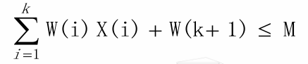

# 回溯

## 一般方法

### 基本思想

- 回溯法是一种搜索算法，是通用的解题法。 
- 以**深度优先**的方式系统地搜索问题的解。
- 例如迷宫问题，深度优先搜索遍历迷宫路径

### 方法适用问题特点

- 方法适用于解决多阶段决策问题，也称为组合问题
- 问题的解向量用元组表示，元素xi通常取自于某个有穷集`Si ,1≤i≤n`, n表示问题规模
  - 固定长n元组`组(x1, … , xn)`
  - 可变长k元组`(x1, … , xk), k<n`
- 问题目标
  - 满足**约束条件**的一个解或多个解；通常用限界函数表示约束条件；
  - 满足约束条件的**最优解**；此时需要定义目标函数，使目标函数取极值的解是最优解。
- 问题满足**多米诺性质** 
- 适用于求解组合数较大的问题。

### 细分多阶段决策问题

- 组合搜索：关注解的存在性
  - 问题描述中仅存在约束条件 
  - 问题希望找到一个可行解（简单的0/1背包）/所有可行解（子集和）
- 组合优化：关注解的最优性
  - 问题描述中还存在目标函数 
  - 问题希望找到一个具有极小值（最短路径）/极大值（树的路径权值最大）的可行解，即最优解，也称为极小化/极大化问题

### 多米诺性质

- 设`P(x1,…,xi)`是关于向量`(x1,…,xi)`的某种性质的判定，当`P(x1,…,xi+1)`为真 时，一定有`P(x1,…,xi)`为真，`0<i<n`,相反`P(x1,…,xi)`不成立，则`P(x1,…,xi+1)`亦不成立
- 所以对于一个满足多米诺性质的组合问题指能够根据约束条件和目标函数不断检验正在构造的部分解向量 `(x1,…,xi)，0<i<n`一旦发现不成立，则无需考虑后续`xi+1,…,xn`的取值，也就是**剪枝**
- 多米诺性质是回溯法提高算法效率的关键，可以通过剪枝去除不必要的搜索

> [!note]
>
> - 设限界函数B实现问题的约束条件，对于n元组`(x1,…,xn), xi∈Si`
> - 回溯法利用多米诺性质：提前检验正在构造中的部分向量`(x1,…,xi)`，如果发现不能导致问题的解, 终止该向量继续构造

---

### 回溯求解的基本概念

- 显式约束：每个xi的取值集合Si ，可能与问题实例有关，也可能无关
- 隐式约束：描述xi彼此相关的情况，与问题实列有关，对应着限界函数
- 解空间：满足**显式约束**的所有元组
- 可行解：解空间内满足隐式约束的元组
- 解集合->解空间->可行解

#### 解空间树

- 回溯法解决问题的过程就是在解空间树上**搜索答案状态结点**的过程
- 解空间树就是基于解空间画成的树形状
  - 树中的节点对应问题状态，其中解状态就是由根到节点X的那条路径确定了这个解空间中的一个元组，
  - 答案则是**解状态**中满足隐式约束的路径
- 答案状态<解状态<问题状态

### 问题建模

- 确定元组表达形式：固定长或者不定长
- 确定显式和隐式约束
- 遍历解空间树过程中检验问题发多米诺性质，以便剪枝
- 确定解空间树：问题状态、解状态和答案状态

#### 子集和问题

- 已知n+1个正数：`wi(1≤i≤n)和M`, 要求找出wi的和是M的所有子集。
- 即简单0/1背包的所有解

- 固定长元组

  > n元组`(x1, … , xn)`
  >
  > 显式约束：`xi∈{0,1},1≤i≤n`；如果选择wi，则xi=1；否则xi=0
  >
  > 隐式约束：`∑wixi=M，1≤i≤n`
  >
  > 多米诺性质，部分解向量大于M,剪枝
  >
  > 解空间共计2^n个元组

- 不定长元组

  > k-元组`(x1, … , xk), k≤n`
  >
  > 显式约束：不重复；隐式：和为M
  >
  > 多米诺性质，部分解向量大于M,剪枝
  >
  > 解空间共计2^n个元组

### 动态树

- 静态树: 即解空间树，树结构与所要解决的问题实例无关。 
- 动态树: 树结构与实例相关, 在求解过程中生成结点
  - **活结点**：自己已经生成而其儿子结点还没有全部生成的结点
  - E-**结点**(**正在扩展的结点**): 当前正在生成其儿子结点的活结点。 
  - **死结点**: 不再进一步扩展或者其儿子结点已全部生成的结点。

#### 动态树结点生成方式

- 回溯法：基于深度优先

  > E-结点R一旦生成一个新的儿子结点C, 这个C结点就变成一个新的 E-结点, 
  >
  > 当检测完了子树C后, R结点就再次成为E-结点, 生成下一个儿子 结点

- 分治限界法：基于广度优先

  > 当前结点一旦成为E-结点，就**一直处理到变成死结点**为止。
  >
  > 其生成的儿子结点加入到活结点表中，然后再从活结点表中选择下一个新的E-结点。

## 回溯的具体算法

### 回溯的设计思想

- 定义解空间树结构：元组、显式隐式约束条件
- 检验问题满足多米诺性质
- 深度优先搜索解空间树，并通过限界函数剪枝，避免无效搜索
- 在解空间树中搜索, 直至找到所要求的解或解空间中已没有活结点时为止。

### 回溯法的形式化描述

- 假设要求出所有可行解，即所有答案结点
- `(x1,x2,…,xi-1)`是状态空间树中由根出发的一条路径，到达 结点Y
- 对于限界函数Bi，如果路径(x1,x2,…,xi-1,xi)不可能延伸到一 个答案结点，则Bi(x1,x2,…,xi)取假值,否则取真值

### 回溯法的非递归算法描述

```cpp
procedure  BACKTRACK(n)
	int k, n     
	local  X(1: n)
 	k ← 1
 	while (k>0) do
 		if (还剩有没检验的X(k)使得X(k)∈T(X(1)…X(k-1)) and B(X(1)…X(k))=TRUE)
        then if (X(1) …X(k))是一条抵达答案结点的路径) 
			then print ( X(1)…X(k))
 			endif
 		k ← k+1
 		else   k ← k-1  //回溯
		endif
 	repeat
 end  BACKTRACK
```

### 回溯法的递归算法描述

```cpp
procedure  RBACKTRACK(k)
global   X(1:n);  
int k, n;
for (满足下式的每个X(k), X(k) ∈T(X(1)…X(k-1)) and B(X(1),…X(k))=true)  do
	if (X(1),…,X(k))是一条抵达答案结点的路径 then    
		print (X(1)…X(k)) endif
 		call  RBACKTRACK(k+1) 
repeat
end  RBACKTRACK
```

## 回溯法的效率分析

### 决定回溯法效率的因素

- 生成下一个X(k)的时间
- 满足显式约束的X(k)的数目
- 限界函数Bj的计算函数：Bi能够大大减少生成的结点数，但在计算时间和减少程度上要进行折中
- 对于所有的i，满足Bi的X(k)的数目

### 回溯法的效率估计

- 解空间的结点数是`2^n或n!`，
- 易知，回溯算法最坏情况下的时间复杂度 为`O(p(n)2^n)`或`O(q(n)n!)`，其中p(n)和q(n)为n的多项式
- 用回溯算法处理一棵树所要生成的结点数(活结点），可以用蒙特卡罗方法估算出来

### 蒙特卡罗方法的一般思想

- 假定限界函数是固定的
  - 状态空间中生成一条随机路径
  - x是这条路径上的位于第i级的一个结点
  - 设限界函数确定x的可用儿子结点的数目为mi。 
  - 从这mi个儿子结点中**随机**选中一个，重复上述过程，直到当前结点是**叶结点或者儿子结点都被限界为止**

> [!note]
>
> - 不受限界结点的估计数: `m=1+m1+m1*m2+m1*m2*m3+…` 
> - mi表示第i级结点没受限界的儿子结点数。

---


##  n-皇后问题

- 问题描述： 在一个`n*n`棋盘上放n个皇后，**使得每两个皇后都不能在同一行**、**同一列及同一条斜角线上**。

- 基于回溯法求解：

  -  n-元组`(x1,…xn)`：表示皇后`i`放在`i`行`xi`列上。

  - 显示约束：`1<=x<=n`，使得解空间为`n^n`

  - 隐式约束：没有两个xi可以相同, 且没有两个皇后可以在同一条斜角线上（已经不在同一行），解空间：`n!`

    - 限界函数，两个皇后被放置在`(i, j )和(k, l )`位置，，如果行差距=列差距， 则两个皇后在同一条斜角线上即`| j – l | = | i– k |`

    ```cpp
    //能否放置一个新皇后
    procedure  PLACE(k)
     //若一个皇后能放在第k行和第X(k)列, 则返回true, 否则返回false。
    //X是全程数组, 进入此过程时已置入了k个值, ABS是绝对值函数。
    	int i , k
    	i←1
     	while ( i<k )  do
     		if (X(i)=X(k) or ABS(X(i)-X(k))=ABS(i-k))
     			then  return false
     		endif
     		i ← i+1
     	repeat   
    	return true
     end  PLACE
    ```

-  n-皇后问题的**回溯算法**描述

```cpp
procedure   NQUEENS(n)
	int k, n, X(1:n)   
	X(1) ← 0 ; k ← 1 // k是当前行; X(k)是当前列
	while (k>0) do    // 对所有的行执行循环语句
		X(k) ← X(k)+1   // 移到下一列
		while ( X(k) ≤ n and not  PLACE(k) )  do 
			X(k) ← X(k)+1；repeat //当前列X(k)不能放皇后k时，放到下一列
		if(X(k)≤n)   //找到一个位置
			then if(k=n) //若是一个完整的解则打印数组X
 				then  print (X)
 				else   k ←k+1;  X(k) ←0 //准备求解下一个皇后
			endif
 		else   k ←k-1; //没有合适的位置, 回溯
		endif
 	repeat
 end NQUEENS
```

- 8-皇后问题的不受限结点的估计值
  - 不受限结点的估计数大约是8-皇后状态空间树的结点总数的 1625/69281=2.34%

[N 皇后](https://leetcode.cn/problems/n-queens/)

## 子集和数问题

假定有n个不同的正数W(1:n)，找出这些数中所有使得和为M的组合。 元素W(i)称为权。

用固定长的n-元组X来表示，解向量元素X(i)取1或0值，表示解中是否 包含权数W(i)。∑W(i)X(i)=M，1≤i≤n

- 预处理排序，按权值非递减排序
- 则得到限界函数：

所以得到递归回溯算法

```cpp
1 procedure SUMOFSUB(s,k,r)
 2 //找W（1：n）中和数为M的所有子集。进入此过程时X(1),…,X(k-1)的值已确定。W(j)按非降次序排列。//
 3 //下面的变量解释：s表示已经加进来的这个序列的和；r表示还没有加入进来的所有的数的和；k表示级数//
 4 global integer M,n; 
 5 global real W(1:n); 
 6 global boolean X(1:n);
 7 real r, s; 
 8 integer k,j;
 9 //生成左儿子//
10 X(k)←1 if s+W(k)=M then
12     print(X(j),j←1 to k)
13 else
14 //这里指判断了界限函数的一个条件：我们假设所有的数的和大于等于M，否则没意义了，将一定无解；还假设第一个数小于等于M//
15     if s+W(k)+W(k+1) ≤ M then//B(k)=true//
16         call SUMOFSUB(S+W(k),k+1,r-W(k))
17     endif
18 endif
19 //生成右儿子和计算Bk的值//
20 if s+r-W(k) ≥ M and s+W(k+1) ≤ M//B(k)=true//
21     then X(k)←0
22         call SUMOFSUB(s,k+1,r-W(k))
23 endif
24 end SUMOFSUB
```

- 相对的，如果不经过预处理排序则限界函数则是当前子集的总和小于M

[luogu U407992 子集和数 - 洛谷](https://www.luogu.com.cn/problem/U407992)

## 图着色问题

- 图着色问题(Graph Coloring Problem, GCP) 又称着色问题，是最著名的NP-完全问 题之一
- 数学定义：给定**无向连通图G=(V,E)**，其中V为顶点集合，E为边集合，用不同的颜色给图中顶点着色，要求任何两个**相邻顶点的着色不同**。 
- 用m种不同颜色给图中顶点 着色，问：是否存在任何两个相邻顶点颜色不同的着色方案？

```cpp
procedure  OK( k )
	int i , k
 	i ← 1
 	while (i<k)  do
 		if (i和k之间有边存在 and C(i)=C(k))
 			then  return false
 		endif
		i ← i+1
	repeat   
	return true
end  OK


Procedure MCOLORING(V,E,C,n,m)
 // 图G=(V,E),n个顶点，m种颜色
	C(1:n) ← 0; k ← 1 //C记录决策序列，从第一个顶点开始
	while (k≥1)//k=0表示整颗树遍历完毕
 		C(k) ← C(k) +1
		while (not OK(k)and C(k)≤m ) do C(k) ← C(k) +1 repeat
 		if C(k) ≤ m then 
			if k=n then print(C); return true  //全部着色,打印
			else k ← k+1; C(k) ← 0  //准备为下一个顶点着色
			endif
 		else k ← k-1 //顶点k无法着色，回溯
		endif
 	Repeat
 	return false
 END MCOLORING
```

- cpp

```cpp
// 检查顶点k的颜色是否合法
bool isSafe(int k, const vector<int>& color, const vector<vector<bool>>& graph) {
    for (int i = 1; i < k; ++i) {
        // 如果相邻且颜色相同则不合法
        if (graph[k][i] && color[i] == color[k]) {
            return false;
        }
    }
    return true;
}

// 图着色主函数
bool mColoring(int n, int m, const vector<vector<bool>>& graph) {
    vector<int> color(n + 1, 0); // 颜色数组（1-based）
    int k = 1;                   // 当前处理的顶点

    while (k >= 1) {
        color[k]++; // 尝试下一个颜色
        
        // 寻找合法颜色
        while (color[k] <= m && !isSafe(k, color, graph)) {
            color[k]++;
        }

        if (color[k] <= m) {
            if (k == n) { // 找到完整解
                cout << "Valid coloring: ";
                for (int i = 1; i <= n; ++i) {
                    cout << color[i] << " ";
                }
                cout << endl;
                return true;
            } else { // 处理下一个顶点
                k++;
                color[k] = 0;
            }
        } else { // 回溯
            color[k] = 0;
            k--;
        }
    }
    return false;
}
```


题[1042. 不邻接植花](https://leetcode.cn/problems/flower-planting-with-no-adjacent/)
