# 分支限界

## 一般方法

### 分支限界使用的问题特点

> [!note]
>
> 清华大学出版社出版的屈婉玲等编著的《算法设计与分析》中认为：“分支限界是回溯算法的变种”
>
> 两者主要区别在于**E**-**结点**(**即扩展结点**)处理方式不同

- 分支限界法同样适用于求解组合数较大的问题， 特别是组合优化问题(求最优解)。

### 分支限界的基本思想

- 定义解空间树的结构：元组（等不等长），显式约束，隐式约束
- 检验问题的多米诺性质（可剪枝性）
- 假设当前寻找一个答案结点，按下列方式搜索解空间树： 
  - 如果根结点T是答案结点，输出T，操作结束；否则令T是当前扩展结点E。 
  - 生成E的所有儿子结点，判断每个儿子结点X： 
    - 如果X是答案结点，输出到根的路径，操作结束； 
    - 如果X满足限界函数B，则将X添加到活结点表中；否则舍弃X。 
  - 从活结点表中选出下一个结点成为新的E-结点，重复上述操作。如果活结点表为空，则算法以失败结束。 

其中，限界函数剪枝作用：避免生成那些不包含可行解的子树。

### 分支限界的抽象化描述

- 伪代码

```cpp
// ADD(X):将X添加到活结点表中
//LEAST(E):从活结点表中选中一个结点赋值给E，并从表中删除该结点

procedure BB(T)
	if T是答案结点then 输出T; return endif
 	E←T
	将活结点表初始化为空
	loop
		for E的每个儿子X do
 			if X是答案结点then 输出从X到T的那条路径; return; endif 
			if B(X) then call ADD(X);PARENT(X)←E endif
 		repeat
 		if 表中不再有活结点then print(“no answer node”); return; endif
 		call LEAST(E)
 	repeat
 end BANDB
```


### 检索方式

- 根据活结点检索次序，分支限界策略可以分为
- 顺序队列：FIFO(先进先出)，活结点表采用队列实现，FIFO检索
- 优先队列：活结点依赖**成本估计函数ĉ**，ĉ最小/最大的活结点优先从活结点表中被选出。 活结点表采用**极小堆/极大堆**实现。LC检索

## LC检索

### LC检索的优点

- 理想状态下，对活结点表使用一个“有智力的”成本函数c来选 取下一个E-结点，从而加快到达答案结点的检索速度。
- 就是给每个活结点根据接近答案的程度设置优先级，但是只是适用于仅仅求可行解而不是全部解的情况

### 成本函数c

#### 成本函数c的量化方法

- 令X是当前结点，c(X)定义为**以X为根的子树中的最小成本值** 
- 方法1：寻找**生成结点数目最少**的答案结点 
  - 基于X在生成一个答案结点之前需要生成的结点数定义 
- 方法2：寻找**路径长度最短**的答案结点 
  - 基于距离X最近的那个答案结点的路径长度定义 
- 方法3：寻找**使目标函数取极值**的答案节点(最优解) 
  -  基于问题描述中的目标函数定义 

本章中，问题不存在目标函数时，采用方法2定义c函数

#### 成本函数c的定义

- 对状态空间树里的解状态结点X定义真实成本函数

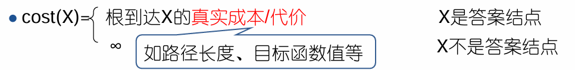

- 从上帝视角对状态空间树里的任意结点X定义成本函数

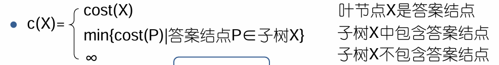

> [!caution]
>
> 探讨c(X)时，我们假设答案节点已经找到，检索树已经生成，一切都是在已知的情 况下进行讨论。 
>
> c(X)是节点X的**真实成本函数**

#### 成本函数c的问题

- c(X)基于答案结点的真实成本定义，为求出该值，需要生成状态空间树。 
- c的计算工作量与原问题具有相同的复杂度
- 转化思维，定义一个易于计算的成本估计函数ĉ，来替代c对 活结点表进行检索

### 成本估计函数ĉ定义

- 成本估计函数 ：ĉ(X)=f(h(X))+ ĝ(X）
  - h(X)：根结点到结点X的成本 
  - ĝ(X)：子树X中，X到最小成本答案结点的估计成本 
  - f：为调整h和ĝ在成本估计函数ĉ中的影响比例而定义的非负函数

因此得出LC-检索和广度优先检索的关系

> [!tip]
>
> - ĉ(X)=f(h(X))+ ĝ(X)
> - LC-检索(Least Cost search)：选取成本估计函数ĉ的值最小的活结点作为 下一个E-结点。 
> - BFS-检索(广度优先)：f(h(X))=根到结点X的路径长度，ĝ(X)=0。即 BFS是LC-检索的特殊情况

### 总结

-  ĉ(X)=f(h(X))+ ĝ(X)要易于计算，且ĉ(X)≤c(X)；当叶节点X是答案节点时， c(X)=ĉ(X) 
-  在LC-检索中，算法利用ĉ对活结点表进行检索。即优先选择更靠近答案 结点，同时又离根结点较近的结点

---

## 迷问题

### 问题描述

在一个分成16格的方形棋盘上放有15块编了号码的牌，如(a)所示，要求通过一系列合法的移动转换成(b)所示那样的目标排列，其中若当前牌邻接有空位置，则 可将牌移动到空位置

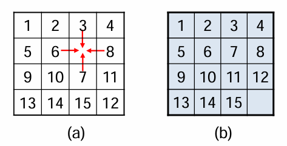

### 状态空间树

-  问题状态，即棋盘布局状态
- 其中初始排序a位初始状态，目标排序b为目标状态

对与棋牌每一次移动就会产生新的布局状态

- 其中当前结点X的儿子结点是X通过一次合法移动到达的布局状态

### 函数定义

- POSITION(i)是棋牌`i`在初始状态时的**位置号**，1≤i≤16，**POSITION(16)表示 空格的位置**
- LESS(i)是牌面上`j < i` 且 `POSITION(j)>POSITION(i)的j`的**数目**，即反序的数目

根据此有初始状态判定定理：当且仅当初始状态的`∑LESS(i)+X`是偶数时，图(b)所示的目标状态可由此状态到达

其中在初始状态下，如果空格在(c)的阴影 位置中，则令X=1；否则令X=0。

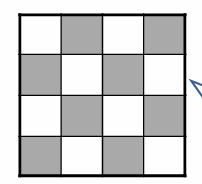

### 检索

- FIFO检索:对于空格，顺序按照上右下左搜索

- 深度优先检索：采取由根开始的最左路径， 搜索过程中有可能远离目标

- LC-检索

  > [!note]
  >
  > 定义c(X)：从初始排列到达目标排列时，棋牌最少移动次数
  >
  > 又ĉ(X)=f(X)+ĝ(X)，
  >
  > f(X)：从初始排列到X时，棋牌已经移动的次数 
  >
  > ĝ(X)：不在其目标位置的非空白棋牌数目（非法棋牌数）


## 求最小成本的分支限界法

### 寻找最小成本

- BB算法中：算法一旦判断出儿子结点X是答案结点，则打印路径，操作结束
- 算法BB基于LC-检索寻找具有最小成本的答案结点，则ĉ要满足： 
  -  易于计算 
  - 对于每一个结点X，ĉ(X) ≤c(X) 
  - 对于答案结点X，有ĉ(X) = c(X) 
  - 追加：c(X)<c(Y)时，有ĉ(X) <ĉ(Y)难于实现，一般不需要满足

-  改进算法：算法从活结点表中**选出E结点**时，再判断E是不是答案结点，若是则打印路径，操作结束。

### 基于ĉ求最小成本的LC-检索算法

```cpp
procedure LC(T, ĉ)//为找出最小成本答案结点
	E←T, 将活结点表初始化为空
	loop
 		if E是答案结点then 输出从E到T的那条路径; return; endif//c帽=c
 		for E的每个儿子X do
 			if B(X) then call ADD(X); PARENT(X)←E; endif 
		repeat
 		if 表中不再有活结点then print(“no answer node”); return; endif
 		call LEAST(E)//选择最小的c帽
 		repeat
 end LC
```

- 对于活结点表中的每一个结点L，一定有ĉ(E)≤ĉ(L)。由ĉ定义知，E是答案结点时c(E)=ĉ(E)，则c(E)=ĉ(E)≤ĉ(L) ≤c(L)，也就找到最小成本节点

### 加速寻找最小成本

- 若发现结点X不能导致最小成本答案结点，也不必再搜索子树X，子树X被剪枝。
- 所以设置一个**最小成本上界U**，问题的最小成本不会大于这个上界U。如果 `ĉ(X)>(/≥)U`，则算法无需检索以X为根的子树。

### 基于ĉ和U求最小成本的分支限界法基本思想

1. 对于极小化问题，把目标函数作为成本函数
2. 约束条件作为约束函数B
3. 问题转化为寻找解空间树中最小成本答案结点 
4. 设计成本估计函数ĉ(X)，ĉ(X)≤c(X)
5. 还可以设计最小成本的上界U，c(X)≤U
6. 基于ĉ(X)和U进行分支限界搜索，其中c帽决定遍历方向，U决定剪枝

#### 最小成本上界U

- U是当前算法生成的所有状态结点对**最小成本上界估计的最小值**
- 初始无穷大，或通过启发式方法(或者贪心）得到；初值≥最小成本答案结点的成本
- 并随着结点访问缩小
- 主要作用是判断结点死活，是否剪枝

#### 成本上界函数U(x)

- u(X)是对成本c(X)的上界估计
-  u(X)可仿照ĉ(X)定义，或其他方式
  - 根到X的成本
  - 子树X中，X到最小成本答案节点的成本上界估计
- 易于计算，C(x)<=U(x),同时对于答案结点c(X)=u(X)

> [!note]
>
> 区分函数cost,ĉ,c和u
>
> - cost(X)：根到答案结点X的真实成本
> - c(X)：子树**X中所有答案结点**的最小成本值， 即最小cost值 
> - ĉ(X)和u(X)：对子树X的c值估计，满足 `ĉ(X)≤c(X)≤u(X)`
> - 设图中，设当前每个结点都满足约束条件
> - 当cost(X)>u(X)时，意味着以X为根的子树中一定有更优解。

#### 界U的改值和剪枝

- U改值：答案结点X，`cost(X)<U`时，`U = cost(X);`状态结点X,`u(X)<U`时，`U = u(X)`同时符号取值小者
- U剪枝：U值来自一个真实成本，ĉ(X)≥U的活结点X都可以被杀死；U值来自一个成本上界，ĉ(X)>U的所有活结点X都可以被杀死

#### 界函数UB

- 一个足够小的正常数ε：对任意结点X,Y，如果u(X)<u(Y),u(X)<u(X)+ε<u(Y)

```cpp
procedure UB(X,ε,U,ans)
//X是当前活结点，U是当前上界估计值，ans是当前最小成本的答案结点。
//结点X满足ĉ(X)≤c(X)≤u(X)；当X是答案节点时，cost(X)表示根到X的真实成本。
	if ĉ(X)≥U then return false 
	if X是解结点 and cost(X)<U 
		then U←min(cost(X), u(X)+ε); ans←X
    endif
 	else if u(X)+ε<U then U←u(X)+ε endif  
 	return true 
end UB
```

#### 算法8.4 求最小成本的FIFO-分支限界算法

- 假定状态空间树T至少包含一个解结点，并且不可行结点的估计值ĉ(X)=∞

```cpp
procedure FIFOBB(T,ĉ,u,ε,cost)
	E←T; PARENT(E)←0; U←∞，ans←0
 	UB(E,ε,U,ans)
	将队列初始化为空
	loop
 		for E的每个儿子X do
 			if B(X) and UB(X,ε,U,ans) then call ADDQ(X); PARENT(X)←E endif
 		repeat
 		loop
 		if 队列为空 then print (‘least cost = ‘, U); 输出从ans到T的路径;return endif
 		call DELETEQ(E); 
		if ĉ(E) < U then exit endif//存在节点的最小估计成本小于成本上界，退出循环，处理其子节点
 		repeat
 	repeat
 end FIFOBB
```

#### 算法8.5 求最小成本的LC-分支限界法

- 假定状态空间树T至少包含一个解结点，不可行结点的估计值ĉ(X)=∞
- 不同于FIFO，这里将活结点表的最小估计成本组织成最小堆，每次取当前活结点表中估计成本最小的处理其子节点

```cpp
 procedure LCBB(T,ĉ,u,ε,cost)
 //函数ADD：加一个结点到min-堆中；函数LEAST：从min-堆中删去堆顶结点
	E←T; PARENT(E)←0; U←∞，ans←0
 	UB(E,ε,U,ans)
	将活结点表初始化为空
	loop
 		for E的每个儿子X do
 			if B(X) and UB(X,ε,U,ans) then call ADD(X); PARENT(X)←E endif
 		repeat
 		if 表中不再有活结点 or 堆顶结点ĉ值≥U then print (‘least cost = ‘ ,U); 输出从ans到T的那条路径; return endif
 		call LEAST(E)
 	repeat
 end LCBB
```

### 极大化问题

- 将问题转化为极小化问题：取目标函数的相反数作为成本函数c
- 对照极小化问题做镜像修改：把目标函数作为成本函数c，问题转化为寻找解空间树中最大成本答案结点，此时`u(X)≤c(X)≤ĉ(X)`。

### 总结求最优解问题的分支限界法

- 剪枝依据：约束函数B限定是否存在**可行解**，成本估计函数数ĉ(X)和界U界定是否存在**最优解**
- 剪枝发生点：
  - X入活结点表时，接受B检验和U检验(判断是否可行以及是否存在最优解)
  - X出活结点表时，接受U检验（判断是否存在最优解）
- 算法终止：活结点表为空；或者活结点表中再没有通过U检验的活结点

## 带有期限的作业调度问题

### 问题描述

假设有n个作业和一台处理机，每个作业i由一个三元组`(pi,di,ti)`表 示，表示作业需要ti个**时间**处理完毕，如果在**期限**di之前没有完成 则要交付pi的**罚款**。

从这n个作业中选取一个子集合J，使J中作业都能在相应的期限内完成，而不在J中的作业罚款总数最小。也就是极小化问题

### 解法

- 解空间表示：不定长的k-元组(X1,..Xk), k≤n
  - 显示约束：作业在集合里
  - 隐式约束：对于`Xj`，有`sum(t0,...,tj)<=dj`，即所有作业在期限前完成
  - 目标函数：未选中的作业罚款总数最小
- 状态空间树：2^n个结点
- 其中：圆形结点表示满足约束条件的结点；方形结点表示不可行结点

#### 约束函数B

- k-元组表示状态空间树
- 按层次遍历为结点编号

实例： `(p1,d1,t1)=(5,1,1);(p2,d2,t2)=(10,3,2);(p3,d3,t3)=(6,2,1);(p4,d4,t4)=(3,1,1)`

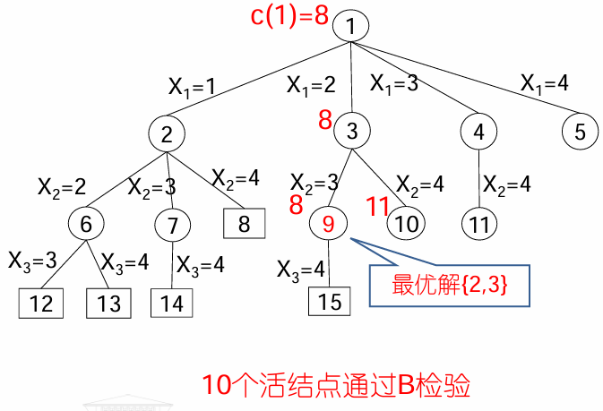

#### 成本估计函数ĉ

- 定义成本估计函数ĉ(X)，使得`ĉ(X)≤c(X)`：
  - Sx是根结点到达结点X时选中的作业集合
  - `m=max{i|i∈Sx}`
  -  `ĉ(X)=∑pi, 1<=i<m,i不属于Sx`,若X是可行解
  -  ĉ(X)=∞，若X是不可行解
  -  实例： `(p1,d1,t1)=(5,1,1);(p2,d2,t2)=(10,3,2);(p3,d3,t3)=(6,2,1);(p4,d4,t4)=(3,1,1)`

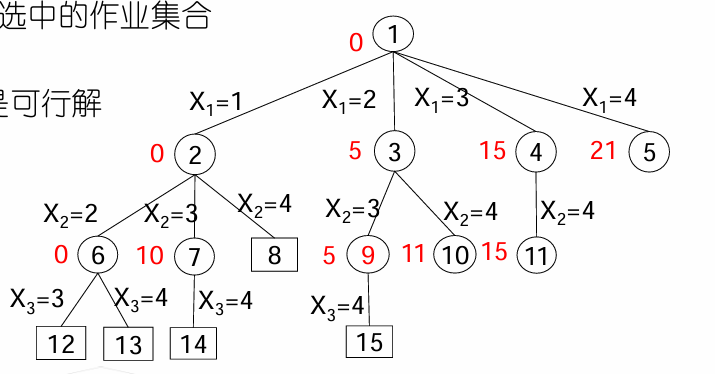

#### 成本上界U

- 上界估计函数u(X)=∑pi, i∉Sx
- 实例： `(p1,d1,t1)=(5,1,1);(p2,d2,t2)=(10,3,2);(p3,d3,t3)=(6,2,1);(p4,d4,t4)=(3,1,1)`

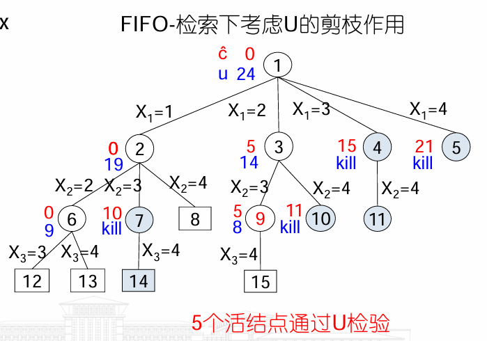

### 完整实例

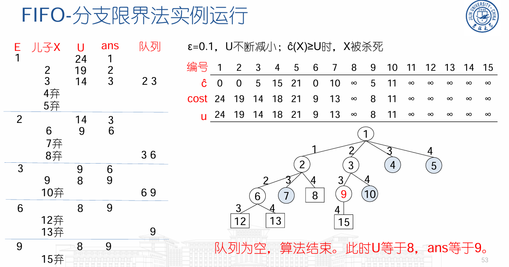

---

## 货郎担问题

### 问题描述

- TSP问题：某售货员要到若干个城市销售货物，已知各城市之间的距离，要 求售货员从某一城市出发并选择旅行路线，使每个城市经过一次，最后回到 原出发城市，而总路程最短。
- **问题形式化描述**：设G(V,E)是一个有向图，|V|=n，cij>0表示边∈E的成 本。寻找一条最小成本的周游路线，不失一般性，考虑从结点1开始，在结点1结束

动态规划方法求解的时间复杂度是Θ(n^2*2^n)

分支限界法最坏情况也是O(n^2*2^n) ，但对许多具体实例，能花费较少的时间

### 解

#### 解空间

- 问题的解是S中结点的一种排列`(X1,X2,X3)`，使`1,X1,X2,X3,1`的成本最小
- 固定长3-元组`(X1,..Xn-1)`，n=4
- 显式约束：Xi属于G，且互不相同
- 隐式约束：存在周游路线1,X1,X2,X3,1，即相邻两点有边存在
- 目标函数：周游路线成本最小
- 状态空间树：共计3!个叶结点

#### 成本函数c

成本函数c(X)：目标函数作为成本函数 

- c(X)=根到X的的路径的周游路线成本，X是叶结点 
- c(X)=子树X中最小成本叶结点的成本，X非叶结点

#### 成本下界函数ĉ

成本下界函数`ĉ(X) ≤ c(X)`，X表示(X1,..Xk)到达的结点，`ĉ(X)= f(X)+ ĝ(X)`

- f(X)表示**已选定的路线**X0=1,X1,…Xk的成本和
-  ĝ(X)表示经过剩余结点回到1的最短距离估计，具体为已选定路线最后一个点最小出边加上剩余结点出边最小值

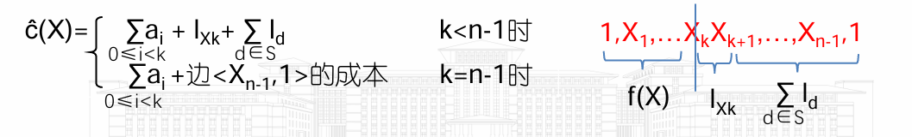

#### 成本上界U

成本上界U≥c(X)：当前得到的最短周游路线长度 ，其中初始值一般为贪心解

- 实例

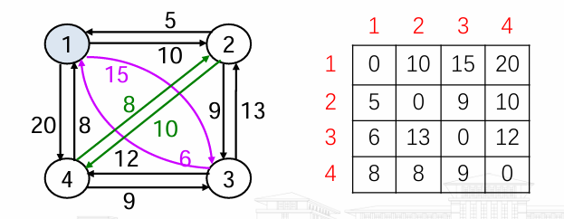

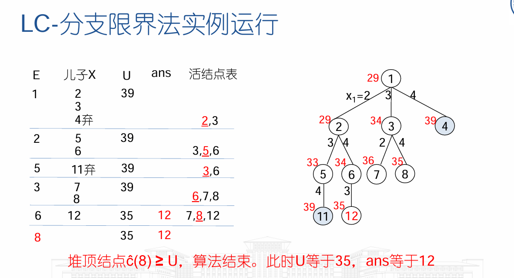

---

## 总结

> [!tip]
>
> 分支限界法与回溯法：
>
> - 相同点：
>   - 同样适用于求解**组合数**较大的问题(/多阶段决策问题) 
>   - 都是在**解空间树**上搜索答案结点 
>   - 都会借助约束函数B进行**剪枝** 
> - 分支限界法与回溯法的不同点： 
>   - 最本质的区别在于E-结点(即扩展结点)处理方式不同
>   - 存储空间上，分支限界法需要额外维护活结点表，回溯法不需要


- 分支限界法求极小化问题，即寻找状态空间树中最小成本的答案结点
  - 目标函数作为成本函数c
  - 约束条件作为约束函数B
  - 设计成本估计函数ĉ(X)，**ĉ(X)≤c(X)** 
  - 设计最小成本的上界U，**c(X)≤U** 
  - 基于ĉ(X)和U进行分支限界搜索，也就是通过ĉ(X)>=U去活加速搜索

- 求极大化问题
  - 目标函数取相反数，转化为极小化问题 
  - 或对照极小化问题做镜像修改
