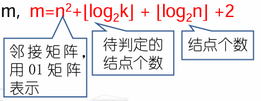
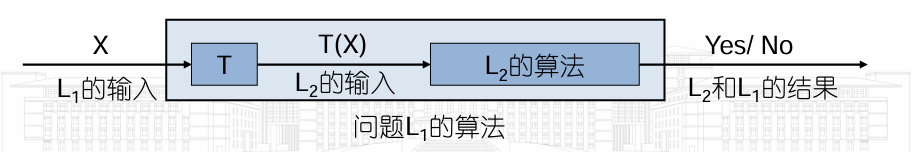
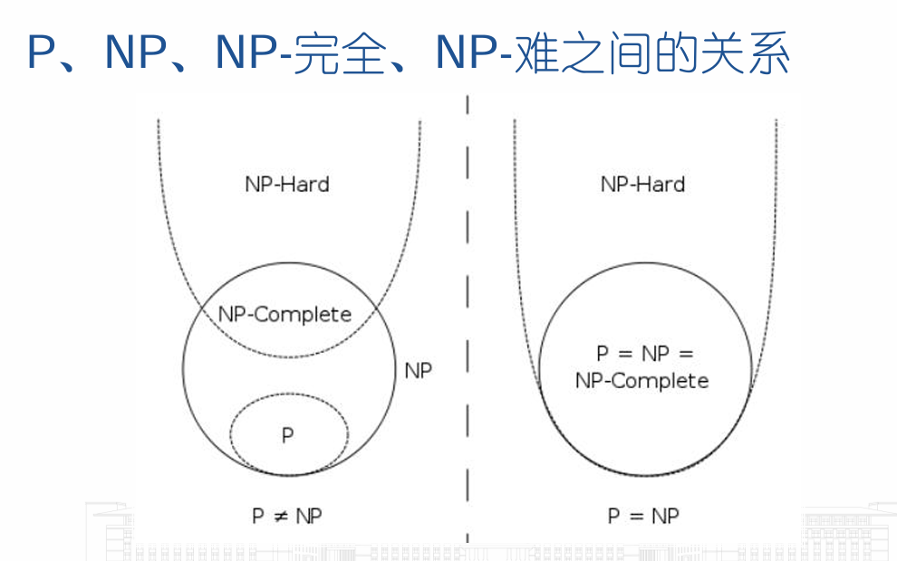

# NP-完全问题


## 判定问题

### 优化问题可以转化为判定问题（存在性问题）

- 判定问题是指只需要回答**“是”和“否”**的问题，即是否存在某种情况

- 例如图着色问题

  > 原问题：已知图G=<V,E>，求对G的n个顶点 进行着色的一种方法（相邻顶点颜色不同），问最少需要多少种颜色
  >
  > 转为判定问题：已知图G=<V,E> ，问图G是否可用k 种颜色进行着色？

- 最大团问题

  > 原：图G=(V,E)的一个完全子图叫做G的一个团(clique)。团的大小用所含的 结点数表示。 求G内最大团和它的大小。
  >
  > 已知图G=G=(V,E)，问图G是否存在一个大小为k的团？

- 01背包问题

  > 已知n个物品的效益值pi和重量wi， 每个物品只能整取。在背包容量M 的限定下如何选择，使选中物品的 效益值之和最大
  >
  > 在M限定下，对于给定效益值X，是否存在一组选择策略，使选中物品 的效益值之和大于等于X？

### 优化问题转化为判定问题的好处

- 最大团问题可以在多项式时间内求解，当且仅当其判定问题可以在多项式 时间内求解
- 将优化问题转化为判定问题的好处是消除了不同优化问题的输出差异性， 通过转化为判定问题，输出统一成“是”和“否”

## 不确定的判定问题

### 不确定算法

- 从理论角度看，取消对运算“确定性”这一限制。
- 即允许运算结果受限于某个特定的集合。
- 包含这种不确定运算的算法称为不确定的算法

为描述不确定算法，SPARKS中引进了一个新函数和两个新语句，时间复杂 度恒为O(1)

- choice(S)：按题意选取集合S中的一个元素
- failure：发出不成功完成的信号
- success：发出成功完成的信号

### 不确定机

- 能按上述方式执行不确定算法的机器称为不确定机（实际上不存在）

### 检索问题不确定性

- 考察给定元素集A(1:n),n>=1中，元素X的检索问题。需确定下标j，使得A(j)=x，或者当x不在A中时有j=0。

  ```cpp
  j←choice(1:n)
  if A(j)=x then success endif
  j←0；print(‘0’); failure
  ```

### 不确定算法设计

- 猜想阶段：也称为不确定阶段，基于不确定函数choice**猜出**一个解
- 验证阶段：也称为确定阶段，用确定语句**验证**构造出的解是否是答案
- 不确定算法在多项式时间可验证
- 时间复杂度：failure时为O(1)；success不确定阶段和确定阶段的时间复杂度之和

### 排序问题的不确定算法

- 设A(1:n),1≤i≤n，是一个待排序的正整数集，要求将其按非降次序排序

```cpp
procedure NSORT(A,n)//对n个正整数排序
	integer A(1:n),B(1:n),n,i,j
 	B(1:n)←0 //辅助数组
	for i←1 to n do//构造
		j←choice(1:n), if B(j) ≠0 then failure endif；
		B(j)←A(i)
 	repeat
 	for i←1 to n-1 do//验证B的次序
		if B(i)>B(i+1) then failure endif
 	repeat
 	print(B)
 	success
 end NSORT
```

### 不确定的判定算法

- 不确定的判定算法只需要回答yes或者no的问题，只产生0/1 输出

- 例如：**最大团判定问题的不确定算法**

```cpp
procedure  DCK(G,n,k)//n表示图G中点的个数
	S<-空集//求得的点集,S是“猜测”的k个顶点的集合，初值为空集
	for i<-1  to  k  do
 	t <- choice(1:n)
    //若t是一个已生成过的顶点，失败
 	if t属于S  then  failure endif
 	S <-S U t
 	repeat
 	for 使得i属于S, j属于S的每一对(i,j),and i!=j do
 		if (i,j)不是此图的边 then  failure endif
 	repeat
 	success
 end DCK
```

### 问题规模的二进制表示

- 统一度量不同判定问题的算法时间复杂度，不同算法的输入参数均转 换为二进制形式，算法时间复杂度基于二进制输入长度来考虑

- 例如：

  > 最大团判定问题DCK(G,n,k)的输入
  >
  > - 设图G由其邻接矩阵表示，n是点个数，k是判定值
  > - 二进制转换输出参数集，其长度和为m
  >
  > 
  >
  > - 算法DCK的时间复杂度：O(n^2)=O(m)

## NP问题与NP完全性

### P和NP

> [!note]
>
> - **P问题**：所有可在多项式时间内用**确定算法**求解的判定问题的集合
> - **NP问题**：所有可在多项式时间内用**不确定算法**求解的判定问题的集合，即能够用不确定算法在多项式时间里猜出一个解和验证一个解

- P问题、NP问题与非P问题

> - P问题是NP问题的一种特例，但尚不确定是否有P=NP或者P≠NP
> - NP≠非P问题，它是非P问题中用**不确定算法**能在多项式时间内求解的那部分判定问题的集合，因此NP⊂非P问题

### 归约定义

> [!tip]
>
> 定义（归约）：令L1和L2是两个问题，如果有一确定的多项式时间算法求解L1，而这个算法使用了一个在多项式时间内求解L2的确定算法，则称L1归约为L2（`L1<=L2或L1∝L2`）
>
> 可以用问题L2的解法解决问题L1，或者说，问题L1可以“变 成”问题L2

- 特殊的判定问题L1到判定问题L2的归约

- 存在一个**转换函数T**，可以把问题L1的输入x转换为问题L2 的输入T(x)，满足：问题L1对于输入x得到正确结果当且仅当问题L2对于输入T(x)得到正确结果。

  

- 归约具有**传递性**

直观意义：L1可归约为L2，则**L2的时间复杂度不低于L1的时间复杂度**，即L1不比L2难

#### 多项式时间归约

- T是问题L1归约到L2的转换函数，如果计算T的算法是**多项式级**的，则称 问题L1可以多项式时间归约到L2，记为`L1<=p L2(L1 ∝p L2)`
- **多项式时间归约具有传递性**

### NP完全问题（NPC问题）

- 问题**L是NP-完全**的，或**NPC**的，当满足：

  > L∈NP
  >
  > 对于每个L’∈NP，有`L’<=p L`

- 问题L是NP-难的，或NP-hard的，当满足：对于每个L’∈NP，有`L’<=p L`

  因为没限定L∈NP，NP-难问题尚未找到多项式级的不确定算法

> [!note]
>
> 比较NP-完全问题与NP-难问题 
>
> - NP-hard比NPC范围广， NP-Hard同样难以找到多项式算法，有可能比所有NPC的时间复杂度更高从而更难以解决 
> - **NPC不是NP-hard**，但它是NP中最难的问题


## P问题、NP问题、NP完全问题

> [!important]
>
> NP问题的定义引出未解问题：P是否等于NP基于NP完全问题发现， 如果**任意一个NP完全问题可以在多项式时间解决**，即所有NP问题均可在多项式时间解决，即P=NP，如果证明任意一个NP完全问题不存在多项式时间的解，则所有NP问题均不可能在多项式时间内 解决。




### NPC的意义

- 所有的NP问题都可以多项式时间归约到一个NPC问题，这意味着一旦一个NPC问题多项式可解，则所有NP问题都多项式可解
- P=NP充要条件是存在NPC问题L∈P

> [!note]
>
> 证明问题L是NPC：
>
> 1. 证明L属于NP，即问题L是NP问题
> 2. 已知一个NPC-问题L’, 证明`L’<=p L`，一个NPC问题可以归约为L


## 可满足性（SAT)问题

- SAT问题是第一个被发现的NPC问题，它约化出 了其他NPC问题，如果证明出SAT问题是P问题， 就能证明出P=NP。
- 问题：对于任意给定的一个合取范式F, F是否可满足?

### 可满足性问题的不确定算法

```cpp
Procedure EVAL(F,n)
 //判定命题F是否为可满足的。变量为Xi，1≤i≤n
 	Boolean x(1:n)
 	for i←1 to n do//选取一组真值指派
		xi←choice(true,false)
 	repeat
 	if F(x1,…,xn)=true
 		then success
 	else failure
 	endif
 end EVAL
```

### Cook定理

-  Cook定理：**SAT是NP完全的**
- 即任何NP问题都可以在多项式时间归约为SAT问题

## 小结

> [!tip]
>
> - P-问题：已经找到多项式算法的问题
> - NP-问题：可能找到多项式算法的问题
> - 证明出NPC中的某个问题是P问题，那么所有的NP问题都是P问题，即 P=NP
> - SAT问题是第一个被发现的NPC问题，它归约出了其他NPC问题
> - NPC-问题：SAT问题可以多项式时间归约到的**NP问题**
> - NP-难问题：SAT问题可以多项式时间归约到的问题
