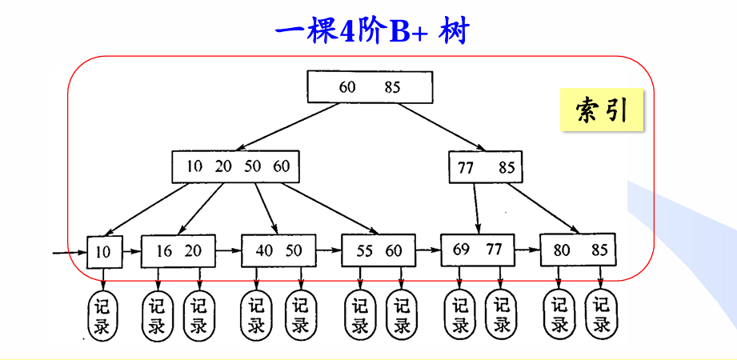

# 查找

## 定义

> [!note]
>
> - **查找亦称检索**。给定一个文件包含n个记录（或称元 素、结点），每个记录都有一个关键词域。一个查找算法， 就是对给定的值K，在文件中找关键词等于K的那个记录。
> - 查找结果：成功或者失败
> - 平均查找长度：查找一个元素所作的关键词平均比较次数

## 线性结构查找

### 顺序查找

- 从表的一端开始，依次将记录的关键字和给定值进行比较，寻找关键字
- 既适用于线性表的顺序存储结构，又适用于线性表的链式存储结构
- 实现简单，仅实现其中数组查找

```cpp
template<class T = int>
int Search_Seq(T* ST,int n, T key)
{
	for (int i = 0; i < n; i++)
	{
		//比较
		if (ST[i] == key)
		{
			//直接返回
			return i;
		}
	}
	//查找失败返回-1
	return -1;
}
```

- 改进

```cpp
//通过为表引入一个“虚拟＂记录key即设置监视哨，并且每次前进步长为二
//通过设置监视哨， 免去查找过程中每一步都要检测整个表是否查找完毕从而减少比较次数，能提高算法S的查找效率
template<class T = int>
int Search_Seq_modify(std::vector<T>& ST, T key)
{
    // 放入虚拟记录
    ST.push_back(key);

    int i = 0;
    while (ST[i] != key) 
    {
        if (ST[i + 1] != key) 
        {
            i += 2;  // 步长为2
        } 
        else 
        {
            i++;  // 步长为1
        }
    }

    // 返回结果
    if (i == ST.size() - 1) 
    {
        // 查找失败
        return -1;
    } 
    else 
    {
        // 查找成功，返回索引
        return i;
    }
}
```

### 二分查找

二分查找要求线性表必须采用顺序存储结构， 而且表中元素按关键字有序排列

> - 有序表Rlow ,Rlow+1 ,…, Rhigh 按照关键词递增有序。
> - 选取一个 位置 mid (low <= mid <= high)，比较K和Rmid，
>   - 若: K < Rmid，[K只可能在Rmid左侧] 
>   - K > Rmid，[K只可能在Rmid右侧] 
>   - K = Rmid ，[查找成功结束] 
>   - 使用不同的规则确定mid，可得到不同的二分查找方法：**对半查找、斐波那契查找、插值查找**等

#### 对半查找

K与待查表的中间记录进行比较，即`mid == (low+high)/2`

每次迭代可将查找范围缩小一半。

- 左闭右闭

```cpp
// target 是在一个在左闭右闭的区间里，也就是[left, right] 
//闭区间里，while (left <= right) 要使用 <= ，因为left == right是有意义的
//if (nums[middle] > target) right 要赋值为 middle - 1，因为当前这个nums[middle]一定不是target
template<class T=int>
int Binary_Search(T* a, int left,int right, T key)
{
	int mid;
	
	//循坏搜索
	while (left <= right)
	{
		//防止溢出 等同于(left + right) / 2
		mid = left + ((right - left) >> 1);
	
		if (key < a[mid])//大于转为右区间
		{

			right = mid - 1;
		}
		else if (a[mid] < key)//小于转为左区间
		{
			left = mid + 1;
		}
		else//找到键值
		{
			return mid;
		}
	}

	//未找到
	return -1;
}
```

- 左闭右开

```cpp
//定义 target 是在一个在左闭右开的区间里，也就是[left, right) ，那么二分法的边界处理方式则截然不同。
//while (left < right)，这里使用 < , 因为left == right在区间[left, right)是没有意义的
//if (nums[middle] > target) right 更新为 middle，因为当前nums[middle]不等于target
template<class T=int>
int Binary_Search(T* a, int n, T key)
{
	int left = 0;
	int right = n;

	//循坏搜索
	while (left < right)
	{
		int mid = left + ((right - left) >> 1);
		
		if (key < a[mid])//大于转为右区间
		{

			right = mid;
		}
		else if (a[mid] < key)//小于转为左区间
		{
			left = mid + 1;
		}
		else//找到键值
		{
			return mid;
		}
	}

	// 未找到目标值
	return -1;
}
```

- 递归写法

```cpp
//闭区间递归实现二分查找
template<class T = int>
int Binary_Search_Recursive(T* a, int left, int right, T key)
{
	if (left > right) {
		return -1; // 区间为空，未找到
	}

	int mid = left + ((right - left) >> 1); // 计算中间索引，防止溢出

	if (key < a[mid]) {
		// 在左区间查找
		return Binary_Search_Recursive(a, left, mid - 1, key);
	}
	else if (a[mid] < key) {
		// 在右区间查找
		return Binary_Search_Recursive(a, mid + 1, right, key);
	}
	else {
		// 找到目标值
		return mid;
	}
}

// 左闭右开递归实现 [left, right)
template<class T = int>
int Binary_Search_Recursive_Open(T* a, int left, int right, T key)
{
	if (left >= right) {
		return -1; // 区间为空，未找到
	}

	int mid = left + ((right - left) >> 1); // 防止溢出

	if (key < a[mid]) {
		return Binary_Search_Recursive_Open(a, left, mid, key); // 在左区间查找
	}
	else if (a[mid] < key) {
		return Binary_Search_Recursive_Open(a, mid + 1, right, key); // 在右区间查找
	}
	else {
		return mid; // 找到目标值
	}
}
```

- 扩展：二叉判定树

> - 便于分析算法的时间效率，采用二叉树表示查找过程
> - 对于 有序表Rlow , Rlow+1 ,…, Rhigh ，对半查找的二叉判定树T(low,high) 的是按如下递归定义的扩充二叉树： 
>   - 当high-low+1 <= 0时：T(low, high)为空； 
>   - 当high-low+1 > 0时，令mid=(low+high)/2 
>     - T(low, high)的根结点是mid ； 
>     - 根结点的左子树是Rlow ,…,Rmid-1 对应的二叉判定树； 
>     - 根结点的右子树是Rmid+1 ,…,Rhigh 对应的二叉判定树。
> - 在二叉树中空指针的位置，都增加特殊的结点（空叶结点）， 由此生成的二叉树称为扩充二叉树。称空叶结点为外结点，其余结点为内结点
> - 对半查找算法的每次 成功查找对应判定树 的一个内结点，元素 比较次数为该结点的深度加1，用于计算查找成功的平均查找长度。
> - 每次不成功的查找对应判定树的一个外结 点，关键词的比较次 数为该结点的深度。用于计算查找失败的平均查找长度。

- 对于对半查找的优化或者改进

> - **一致查找**
> - 
>
> ```cpp
> //一致对半查找，
> //譬如仅使用三个指针(s、门和e)中的两个。
> //其具体思路是，使用当前位置i和它的变化率x,在每次不相等的比较之后，可置i<-i土x和x<-x/2(近似地）。
> // 算法U之所以被称为是一致的，
> //其原因是在第K层上的一个结点的编号与在第K - l层上其父结点的编号之差的绝对值，
> //对于第k层上的所有结点均有一致的常数x。
> 
> //构建辅助数组DELTA记录每次区间数量m的值,避免在查找过程中计算。
> std::vector<int> cal_delta(int n)
> {
> 	std::vector<int> delta; // 保存步长
> 	int k = int(log2(n)) + 1; // 计算层数
> 	int temp = 1;
> 
> 	for (int i = 0; i < k; i++)
> 	{
> 		delta.push_back((n + temp) / (temp * 2)); // 计算步长
> 		temp *= 2; // 更新 temp
> 	}
>     
> 	return delta; // 返回步长数组
> }
> 
> template<class T = int>
> int cbiSearch(T* a, int n, int key)
> {
> 	if (n < 1)return -1; // 空数组，直接返回
> 
> 	if (a[0] == key)return 0; // 特殊情况：第一个元素就是目标
> 
> 	std::vector<int> Delta = cal_delta(n); // 生成步长数组
> 	int i = n / 2;
> 	int j = 1;        // 当前步长索引
> 
> 	while (key != a[i]) // 循环直到找到 key
> 	{
> 		if (key < a[i]) // key 在当前元素左侧
> 		{
> 			if ( j >= Delta.size()|| Delta[j] == 0 ) return -1; // 步长为 0，无法再分割
> 			else
> 			{
> 				i -= Delta[j]; // 左移
> 				j++;           // 步长递减
> 			}
> 		}
> 		if (a[i] < key) // key 在当前元素右侧
> 		{
> 			if (j >= Delta.size() || Delta[j] == 0)return -1; // 步长为 0，无法再分割
> 			else
> 			{
> 				i += Delta[j]; // 右移
> 				j++;           // 步长递减
> 			}
> 		}
> 	}
> 	return i; // 找到目标，返回下标
> }
> ```

#### 斐波那契查找

- 在二分搜索的基础上，根据斐波那契数列分割，而不是简单的二分
- 前提是待查找的查找表必须顺序存储并且有序
- 平均和最坏情况下的时间复杂性为O(log2n)。
- 总体运行时间略快于对半查找算法。 因为**算法不涉及乘除法**，而只涉及加减法。

```cpp
//数列从坐标1开始计数
//构造辅助数组，即斐波那契数列，数列生成到大于等于n
std::vector<int> Fib_arr(int n)
{
	std::vector<int> Fib;
	//初始化
	Fib.push_back(0);
	Fib.push_back(1);

	for (int i = 2;; i++)
	{
		int next = Fib[i - 1] + Fib[i - 2];
		Fib.push_back(next);
		if (next - 1 >= n) break;
	}

	return Fib;
}

template<class T=int>
int Fibonacci_Search(T* a,int n,T key)
{
	//空表
	if (n < 1)return -1;

	//初始化
	int left = 0;
	int right = n - 1;

	//得到辅助数列
	std::vector<int> F = Fib_arr(n);
	int k = F.size()-1;

	//如果a数组不足F[k]-1，则重复增加a的最后一个数直到长度等于F[k]-1
	std::vector<T> temp{ a,a+n };

	//一次性调整 temp 的大小来提高效率
	temp.resize(F[k] - 1, temp[n - 1]);


	//查找，注意这里实现查找区间左边比右边大
	//即如果当前区间为F[k]-1=F[k-1]-1 + F[k-2]-1 + 1;最后一个1的位置给mid
	//左区间为F[k-1]-1, 右区间为F[k-2]-1
	while (left <= right)
	{
		// mid 由左边界和 F[k-1] 决定，确保不越界,但是正常情况下不会越界 
		int mid = std::min(left + F[k - 1] - 1, right);

		if (key < temp[mid])  // 如果 key 在左区间
		{
			right = mid - 1;  // 更新右边界
			k -= 1;          // 更新斐波那契索引，左区间长度为 F[k-1]
		}
		else if (temp[mid] < key)  // 如果 key 在右区间
		{
			left = mid + 1;  // 更新左边界
			k -= 2;          // 更新斐波那契索引，右区间长度为 F[k-2]
		}
		else  // 找到目标值
		{
			// 如果是补充值，则返回原数组最后一个元素
			return mid < n ? mid : n - 1;  
		}
	}

	//未找到
	return -1;
}
```

#### 插值查找

- 基本原理是根据要查找的值在有序数组中的大致位置进行估计，以此来缩小搜索范围
- 通过数据的分布情况来预测目标值的位置，特别适用于有序且均匀分布的数据集

```cpp
template<class T=int>
int InterPolation_Search(T* a, int n, T key)
{
	if (n < 1)return -1;

	//初始化
	int left = 0;
	int right = n - 1;
	//插值
	int pos = INT_MAX;
	//迭代
	while (left <= right&&a[left]!=a[right])//防止除以零
	{
		// 使用插值公式计算估计位置,此处和二分查找不同
		pos = left + (((key - a[left]) * (right - left)) / (a[right] - a[left]));

		// 越界检查
		if (pos < left || pos > right) return -1;
		
		if (key < a[pos])
		{
			right = pos - 1;
		}
		else if (a[pos] < key)
		{
			left = pos + 1;
		}
		else
		{
			return pos;
		}

	}

	// 特殊情况：剩余单个元素时检查是否匹配
	return (a[left] == key) ? left : -1;
}
```

### 分块查找

- 分块查找，又称为索引顺序查找

- 在此查找法中，除表本身以外，尚需建立一个 “索引表”。

- 对每个子表（或称块）建立一个索引项，其中包括两项内容：

- 关键字项（其值为该子表内的最大关键字）和指针项（指示该子表的第一个记录在表中位置）。

- 索引表按关键字有序，则表或者有序或者分块有序，由于块内是无序的，故插入和删除比较容易，无需进行大量移动。

- 过程

  > 1. 将大数组分成若干子数组（块），每个块中的数值都 比后一块中数值小（块内不要求有序），建一个索引表记录每个子表的起始地址和各块中的最大关键字
  > 2. 先将key依次和索引表中各最大关键字利用对半查找进行比较，确定待查记录所在的块（子表）
  > 3. 确定了关键字所在的块后，从该块的指针项（指示该子表的第一个记录在表中位置）顺序查找

## 树形结构的查找

> [!tip]
>
> - 对有序数组的二分查找，适用于静态查找场景，若元素动态变化（插入、删除元素），为了维持数组有序，需要O(n)时间调整。
> - 所以就有了树形结构的查找结构

### 二叉查找树

> [!note]
>
> - 一棵二叉树，其各结点关键词互异，且中根序列按其关键词递增排列
> - 二叉查找树中任一结点P，其左子树中结点的关键词都小于P的关键词，右子树中结点的关键词都大于P的关键词， 且结点P的左右子树也都是二叉查找树。
> - 查找、插入、删除平均时间复杂度O(logn)，但最坏情况时间复杂度为O(n)（根节点为最大节点或者最小结点

```cpp
template<class T=int>
class Tree
{
public:
	//数据项
	T data;//重载了==运算符和<运算符
	//左右子树
	Tree* lchild;
	Tree* rchild;

	// 维护其他信息，如高度，节点数量等

	int size;   // 当前节点为根的子树大小
	int count;  // 当前节点的重复数量

	Tree() = default;
	Tree(T key,Tree* left=nullptr, Tree* right=nullptr):size(1),count(1),data(key),lchild(left),rchild(right){ }

};
```

- 核心操作

  - **查找**：在二叉查找树中查找关键词为K的结点

  ```cpp
  //在根指针T所指二叉排序树中递归地查找某关键字等于key的数据元素
  	Tree<T>* SearchBiSortTree(Tree<T>* root, T key)
  	{
  		//二叉排序树为空，则查找失败，返回空指针
  		if (!root)return nullptr;
  
  		//key等千T->data.key, 则查找成功，返回根结点地址
  		if (root->data == key)
  		{
  			return root;
  		}
  		else if (key < root->data)//key小千T->data.key, 则递归查找左子树
  		{
  			return SearchBiSortTree(root->lchild, key);
  		}
  		else//key大千T->data.key, 则递归查找右子树
  		{
  			return SearchBiSortTree(root->rchild, key);
  		}
  	}
  ```

  - 插入：将关键词为K的结点插入二叉查找树，插入后仍为二 叉查找树，若K已在树中，则该节点大小加一。

  ```cpp
  //当二叉排序树T中不存在关键字等千e.key的数据元素时,则插入该元素
  //注意传入二级指针
  void InsertBiSortTree(Tree<T>*& root, T key)
  {
      //空树直接将其作为根节点
      if (!root)
      {
          Tree<T>* temp = new Tree<T>(key);
          root = temp;
      }
      else if (key < root->data)//将*S插入左子树
      {
          InsertBiSortTree(root->lchild, key);
      }
      else if (root->data < key)//将*S插入右子树
      {
          InsertBiSortTree(root->rchild, key);
      }
      else//相等说明root存在相同关键字的结点,个数++
      {
          root->count++;
          return;
      }
  
      //处理size,根的节点数等于左右子树和加上本身个数
      root->size = root->count + (root->left ? root->left->size : 0) + (root->right ? root->right->size : 0);  // 更新节点的子树大小
      return;
  }
  ```

  - **删除**：删除关键词为K的结点（如果该结点大小大于一则大小减一），删除后仍为二叉查找树，采用代替法删除

```cpp
//二叉排序树的删除
//被删除的结点可能是二叉排序树中的任何结点
//删除结点后，要根据其位置不同修改其双亲结点及相关结点的指针，以保持二叉排序树的特性
void DeleteBST(Tree<T>*& root, T key)//因为可能删除根节点，所以传入二级指针
{
    //空树
    if (!root)return;

    //初始化,目标结点和目标节点的父节点以便查找
    Tree<T>* p = root;
    Tree<T>* pre = nullptr;

    //查找
    while (p)
    {
        //找到关键字等于key的结点* p, 结束循环
        if (p->data == key)break;

        //前移
        pre = p;
        //判断往左移还是右移
        p = key < p->data ? p->lchild : p->rchild;

    }

    //找不到
    if (!p)return;

    //count大于1
    if (p->count > 1)
    {
        p->count--;
    }
    else
    {
        //考虑三种情况

        //q记录s的前驱
        Tree<T>* q = p;
        Tree<T>* s = p->rchild;

        //被删结点*p左右子树均不空
        if (p->lchild && p->rchild)
        {

            //在*p的左子树中继续查找其前驱结点，即最右下结点也是左子树最大节点用以代替被删除节点
            //或者找右子树最小节点代替
            while (s->rchild)
            {
                q = s;
                s = s->rchild;
            }

            //s指向被删结点的 “前驱",以最大节点替换被删结点
            p->data = s->data;

            //重接*q的右子树
            if (q != p)//避免q未移动
            {
                //s左子树的值依旧大于其前驱，并且s作为最大节点一定没有右子树了
                q->rchild = s->lchild;
            }
            else//重接*q的左子树,未移动则q即是被s替换的p
            {
                q->lchild = s->lchild;
            }

            delete s;
            return;
        }
        else if (!p->rchild)//被删结点*p无右子树， 只需重接其左子树
        {
            q = p;
            p = p->lchild;
        }
        else if (p->lchild)//被删结点*p无左子树， 只需重接其右子树
        {
            q = p;
            p = p->rchild;
        }

        //将p所指的子树挂接到其双亲结点*f相应的位置

        //被删结点为根节点
        if (!pre)root = p;
        else if (q == pre->lchild)//被删结点为前驱的左子树
        {
            //挂接到*f的左子树位置
            pre->lchild = p;
        }
        else //被删结点为前驱的左子树
        {
            pre->rchild = p;
        }

        delete q;
    }

    //维护size
    root->size = root->count + (root->left ? root->left->size : 0) + (root->right ? root->right->size : 0);  // 更新节点的子树大小

    return;
}

//递归版本，注意传入二级指针
void remove(Tree<T>*& root,T key)
{
    //空树，或者找不到
    if (root == nullptr)
    {
        return;
    }

    if (root->data < key)
    {
        remove(root->rchild, key);
    }
    else if (key < root->data)
    {
        remove(root->lchild, key);
    }
    else//找到
    {
        if (root->count > 1) {
            root->count--;
        }
        else
        {
            //左子树为空
            if (root->lchild == nullptr)
            {
                Tree<T>* temp = root;
                root = root->rchild;
                delete temp;
                return;
            }
            //右子树为空
            else if (root->rchild == nullptr) 
            {
                Tree<T>* temp = root;
                root = root->lchild;
                delete temp;
                return;
            }
            else
            {
                //找到继承者，即左子树最大节点或者右子树最小节点
                Tree<T>* successor = findMax(root->lchild);
                root->data = successor->data;
                root->count = successor->count;

                // 当 successor->count > 1时，也应该删除该节点，否则
                // 后续的删除只会减少重复数量
                successor->count = 1;
                remove(root->rchild, successor->data);
            }
        }
    }
    // 继续维护size，不写成 --root->size;
    // 是因为value可能不在树中，从而可能未发生删除
    root->size = root->count + (root->left ? root->left->size : 0) +(root->right ? root->right->size : 0);
    return;
}
```

### AVLTree(高度平衡树)

- 定义

> [!note]
>
> 一棵满足如下条件的二叉查找树：任意结点的左子树和右子树的**高度最多相差1**。 
>
> - 即对于任意结点P，| P的左子树高度−P的右子树高度 | <=1
> - AVL树中任意结点P的**平衡系数(平衡因子）**定义为：P的左子树高度减去右子树高度。从定义可知平衡系数只可能为：-1,0,1

- 核心操作

> [!important]
>
> - 查找：与普通二叉查找树一致。
>
> - **插入和删除**：先使用二叉查找树的插入/删除方法，但插入/ 删除一个结点后，有可能破坏AVL树的平衡性。因此需对平衡树进行调整，恢复其平衡性，实现这种调整的操作称为“**旋转（Rotation）**”。
>
>   > 1. 插入新结点X后，若AVL树失去平衡，应调整失去平衡的最小子树，即找从**X到根结点的路径上的第一个失衡结点A**， 平衡以 A为根的子树。
>   > 2. 调整策略： ①LL型：右转  ②RR型：左转 ③LR型：左转+右转 ④RL型：右转+左转
>
>   对于插入：
>
>   > 如何找从插入点到根结点的路径中第一个失衡结点A？ 
>   >
>   > ➢ 从根到插入点（自顶向下）：通过递归过程实现； 
>   >
>   > ➢ 从插入点到根（自底向上）：通过递归函数的**返回过程（ 回溯）**实现。在上一层递归函数返回后，检查当前结点的平衡性。
>   >
>   > ```cpp
>   >  void Insert(AVLnode* &root, int K) {
>   >  	if(root==NULL) root=new AVLnode(K);
>   >  	else if(K < root->key)  //在左子树插入
>   > 			Insert(root->left, K);
>   > 	else if(K > root->key)  //在右子树插入
>   > 			Insert(root->right, K);
>   > 	 ReBalance(root);
>   >  }
>   > 
>   > //调整平衡
>   >  void ReBalance(AVLnode* &t) {
>   >  	if(t==NULL) return;
>   >  	if(Height(t->left)- Height(t->right)==2){   
>   >  		if(Height(t->left->left) >= Height(t->left->right)) 
>   > 			LL(t);
>   >  		else
>   >  			LR(t);
>   >  	}else if(Height(t->right)- Height(t->left)==2){
>   >  		if(Height(t->right->right) >= Height(t->right->left))  
>   > 			RR(t);
>   >  		else
>   > 			 RL(t);
>   >  	}
>   >  	UpdateHeight(t);
>   >  }
>   > ```
>
>   对于删除
>
>   > 1. 二叉查找树的删除算法进行删除
>   > 2. 沿实际删除点到根结点的路径，向上找第 一个不平衡点为A，平衡以 A为根的子树。
>   > 3. 平衡后，可能使子树A高度变小。这样可能导致A的父结点 不满足平衡性。
>   > 4. 要继续向上考察结点的平衡性，最远可能至根结点， 即最多需要做O(logn)次旋转
>   >
>   > ```cpp
>   > void remove(AVLnode* &root, int K) {
>   >  	if(root==NULL) return;
>   >  	if(K<root->key) remove(root->left, K);  //在左子树删K
>   >  	else if(K>root->key) remove(root->right, K); //在右子树删K
>   >  	else if(root->left!=NULL && root->right!=NULL){
>   > 			AVLnode *s=root->right;
>   >  			while(s->left!=NULL) s=s->left;
>   > 			root->key=s->key;    //s为t右子树中根序列第一个结点
>   > 			remove(root->right, s->key);
>   > 		 }else{ 
>   > 			AVLnode* oldroot=root;
>   >  			root=(root->left!=NULL)? root->left:root->right;
>   >  			delete oldroot;
>   >  			}
>   >  	ReBalance(root);
>   > }
>   > ```

- 总结

  > - AVL树的高度为**O(logn)**，因此使插入、删除、查找的最坏时间复杂度均为O(logn)。
  > - 删除操作最坏情况下需要做O(logn)次旋转，即从删除节点一直维护平衡到根节点

### 红黑树（Red Black Tree）

红黑树是一种**自平衡**的二叉搜索树。每个节点额外存储了一个 color 字段 ("RED" or "BLACK")，用于确保树在插入和删除时保持平衡。

> [!tip]
>
> 一棵合法的红黑树必须遵循以下五条性质：
>
> 1. 节点为红色或黑色(**非红即黑**)
>
> 2. NIL 节点（空叶子节点或者说外结点）为黑色（**黑外**）
>
> 3. 红色节点的子节点为黑色（**红父黑子**）
>
> 4. 从根节点到 NIL 节点的每条路径上的黑色节点数量相同
>
> 5. 根结点为黑色； （**黑根**）
>
>    > 这条性质要求完成插入操作后若根节点为红色则将其染黑，但由于将根节点染黑的操作也可以延迟至删除操作时进行，因此，该条性质并非必须满足。

- 红黑树类的定义

  > ```cpp
  > template <typename Key, typename Value, typename Compare = std::less<Key>>
  > class RBTreeMap {
  >   // 排序函数
  >   Compare compare = Compare();
  > 
  >   // 节点结构体
  >   struct Node {
  >       std::shared_ptr<Node> parent,left,right;
  >       enum class color{BLACL,RED};
  >       Key key;
  >       Value value;
  >   };
  > 
  >   // 根节点指针
  >   Node* root = nullptr;
  >   // 记录红黑树中当前的节点个数
  >   size_t count = 0;
  > }
  > ```

---


### Splay 树

> [!note]
>
> **Splay 树**, 或 **伸展树**，是一种**平衡二叉查找树**
>
> 它通过 **Splay/伸展操作** 不断将某个节点**旋转到根节点**，使得整棵树仍然满足二叉查找树的性质，能够在均摊  时间内完成插入，查找和删除操作，并且保持平衡而不至于退化为链。

- 结构

> Splay 树是一棵二叉搜索树，查找某个值时满足性质：
>
> 左子树任意节点的值 < 根节点的值 < 右子树任意节点的值。
>
> ### 节点维护信息
>
> |     rt     |   tot    | fa[i] | ch[i]\[0/1]  |  val[i]  |    cnt[i]    |  sz[i]   |
> | :--------: | :------: | :---: | :----------: | :------: | :----------: | :------: |
> | 根节点编号 | 节点个数 | 父亲  | 左右儿子编号 | 节点权值 | 权值出现次数 | 子树大小 |

- 旋转操作

  > 为了使 Splay 保持平衡而进行旋转操作，旋转的本质是将某个节点上移一个位置。
  >
  > **旋转需要保证**：
  >
  > - 整棵 Splay 的中序遍历不变（不能破坏二叉查找树的性质）。
  > - 受影响的节点维护的信息依然正确有效。
  > - `root` 必须指向旋转后的根节点。

### B树（B-Tree）

> [!note]
>
> B树：平衡m叉查找树。
>
> 一个结点存**多个关键词**，形成多叉查找树来代替 二叉查找树，降低查找树高度。 

- B树结点结构

  > 1. 包含j个关键词：满足 `K1<K2<...<Kj`。
  > 2. 包含j+1个指针：第i个指针pi（0 < i <j）指向的子树所包含关键词都在Ki和Ki+1之间
  >
  > 

- m阶B树的定义

  > - ① 每个结点至多有m个孩子； 
  > - ② 除根和叶结点外，每个结点至少有[m/2]取下界个孩子； 
  > - ③ 若根结点不是叶结点，则至少有2个孩子； 
  > - ④ 有k个孩子的结点恰好包含k-1个递增有序的关键词； 
  > - ⑤ 所有的叶结点在同一层，不包含任何信息。
  >
  > > [!important]
  > >
  > > 根和叶以外的结点有**[m/2]取下界～m个孩子**
  > >
  > > 根结点有**2 ～m个孩子**

> 在 B 树中，有两种节点：
>
> 1. 内部节点（internal node）：存储了数据以及指向其子节点的指针。
> 2. 叶子节点（leaf node）：与内部节点不同的是，叶子节点只存储数据，并没有子节点。是虚拟的结点
> 3. 指向叶结点的指针是空指针

- B树的查找

  >  ①在根结点内查找K，即在其所包含的关键词K1 ,…, Kj 中查找 K（可采用顺序查找或对半查找），**找到则查找成功**； 
  >
  > ②否则，确定K在**某个Ki 和Ki+1 之间**，于是在指针pi 所指向的 子树里继续查找K，即将pi 所指向的结点读入内存，继续查 找；如果pi 为空，则查找失败。

- B树的插入

  > 先查找，在查找失败的位置插入。
  >
  > 若在结点中插入关键词后，结点包含的关键词超过m-1个， 则该结点关键词上溢，需进行分裂操作。

- B树的删除

  > 类似于二叉查找树的删除
  >
  > 但是当删除关键词后，若该结点目前包含的关键词个数小于[m/2]-1 称为下溢，则从左（右）兄弟结点中借最大（最小）关键词。

### B+ 树

> ① 每个结点至多有m个子结点； 
>
> ② 除根结点外，其它每个非叶结点至少有m/2个子结点；
>
>  ③ 根结点至少有两个子结点； 
>
> ④ 包含n个孩子的结点有n个关键词（即每个关键词对应一棵子 树）； 
>
> ⑤ 每个非叶结点仅包含各孩子的最大关键词及指向各孩子的指 针（每个非叶结点不存放实际的数据记录，可看成索引）； 
>
> ⑥ 所有叶结点包含全部关键词及指向相应数据记录的指针，且 **叶结点按关键词递增的顺序连成一个链表**（每个叶结点的指 针指向磁盘上实际数据文件中的记录，也可看成索引）。
>
> 

> [!warning]
>
>  B树：每个结点存储关键词及其 对应的**实际数据 记录**（或指针）
>
> B+树：只存关键词

---


## 散列查找

### 散列（Hash, 亦称哈希、杂凑）

> [!note]
>
> 哈希表又称散列表，一种以「key-value」形式存储数据的数据结构。
>
> 所谓以「key-value」形式存储数据，是指任意的键值 key 都唯一对应到内存中的某个位置。只需要输入查找的键值，就可以快速地找到其对应的 value。
>
> 可以把哈希表理解为一种高级的数组，这种数组的下标可以是很大的整数，浮点数，字符串甚至结构体。

#### 哈希函数

> ✓自变量K：关键词 
>
> ✓函数值h(K)：元素在散列表中的存 储地址（亦称散列地址） 
>
> ✓作用：把关键词值**映射**到散列地址
>
> 哈希函数应当易于计算，并且尽量使计算出来的**索引均匀分布**。

#### 冲突

> [!warning]
>
> 多个不同的关键词具有**相同的散列函数值**， 即`K1!=K2, h(K1)=h(K2)`

- 一些方法来处理冲突

- 拉链法

  > 拉链法也称开散列法（open hashing）。
  >
  > 拉链法是在每个存放数据的地方开一个**链表**，如果有多个键值索引到同一个地方，只用把他们都放到那个位置的链表里就行了。查询的时候需要把对应位置的链表整个扫一遍，对其中的每个数据比较其键值与查询的键值是否一致。
  >
  > **若链表很长，可将其替代为跳表或查找树**

- 闭散列法

> 闭散列方法把所有记录**直接存储在散列表**中，如果发生冲突则根据某种方式继续进行探查。
>
> 1. 线性探查（亦称线性探测）:当发生冲突时，以固定的次序查找表中的记录，直到**找到一个关键词为K的结点或者找到一个空位置**。
> 2. 二次探查: 一旦冲突，能更快的跳离“是非之地”，避免聚集
> 3. 双重探查：从h(K)开始，寻找空地址时，所前进的**步长不是固定**的，而与K有关，

#### 散列表的删除

- 懒惰删除

  > 并不真正的删除元素，而是将删除的位置做一个**标记**，其状态置为“已删除”

- 实时删除

  > 将位置j清空，然后考察位置j+1到下一个空位前的每一个位置i，看将位置j清空后，**是否阻碍**查找T[i]的探查路 径，若是则将T[i]前移至空位。

- 延迟删除

  > 每隔一段时间**定期执行一次真正删除**， 把标记为“已删除”的结点真正清空

---

