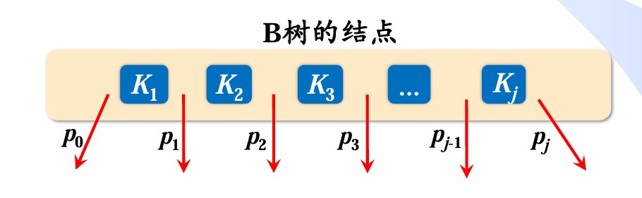
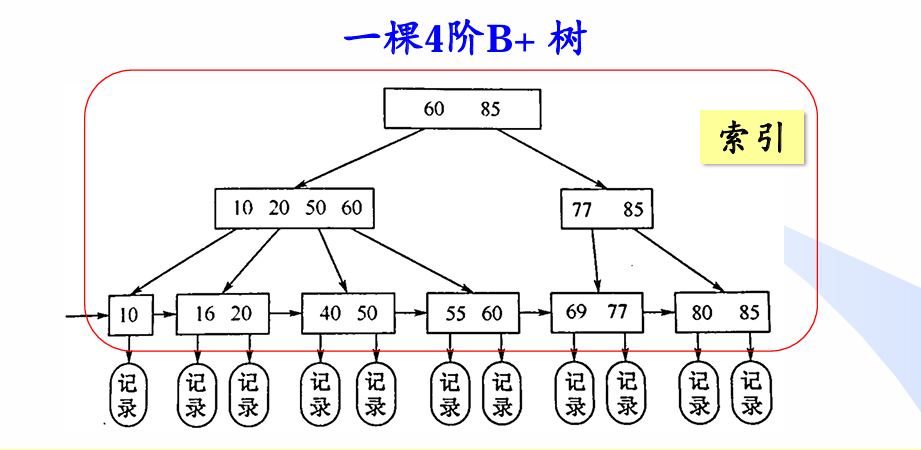

[TOC]


# 绪论


## 数据结构的研究内容

### 数据结构主要研究**非数值计算问题 **

​           数据结构是一门研究**非数值计算**程序设计中的操作对象， 以及这些对象之间的关系和操作的学科。

> 例如:
>
> * 学生学籍管理系统
> * 人机对弈问题
> * 最短路径问题。


## 基本概念和术语


## 数据、 数据元素、 数据项和数据对象

### 数据（Date)

>数据 (Data) 是客观事物的符号表示，是所有能输入到计算机中并被计算机程序处理的**符号的总称**。
>
>* 数学计算中用到的整数和实数
>* 文本编辑中用到的字符串
>* 多媒体程序处理的图形、 图像、声音及动画等通过特殊编码定义后的数据

### 数据元素(Data Element)

>数据元素(Data Element)是数据的***基本单位***，在计算机中通常作为一个整体进行考虑和处理。 在有些情况下，数据元素也称为元素、记录等
>
>数据元素用千完整地描述一个对象
>
>* 一名学生记录
>* 树中棋盘的一个格局（状态）
>* 及图中的一个顶点

### 数据对象 (Data Object) 

> 数据对象 (Data Object) 是性质相同的数据元素的集合，是数据的一个子集。
>
> * 整数数据对象是集合N= {0, 士1' 士2,…}
> * 字母字符数据对象是集合C= {'A','B', …，'Z','a','b', …，  'z'}
> * 学生基本信息表也可以是一个数据对象

> 只要集合内元素的***性质均相同***，都可称之为一个数据对象。


## 数据结构

> 数据结构 (Data Structure) 是相互之间存在一种或多种**特定关系的数据元素的集合**。
>
> * 数据结构是带 ”结构＂ 的数据元素的**集合**
> * “结构” 就是指数据元素之间存在的**关系**

### 逻辑结构

> 数据的逻辑结构是从**逻辑关系**上描述数据，它**与数据的存储无关**，是独立千计算机的。
>
> * 数据的逻辑结构可以看作是从具体问题抽象出来的**数学模型**。

> 数据的逻辑结构有两个要素
>
> * 数据元素
>
> * 关系  （指数据元素间的**逻辑关系**）
>
>   * 集合结构
>
>     > 数据元素之间除了 “**属于同一集合**” 的关系外，别无其他关系。例如，确定一名学生是否为 班级成员， 只需将班级看做一个集合结构。
>
>   * 线性结构
>
>     > 数据元素之间存在**一对一**的关系。例如，将学生信息数据按照其入学报到的时间先后顺序进 行排列，将组成一个线性结构。
>
>   * 树结构
>
>     > 数据元素之间存在**一对多**的关系。例如，在班级的管理体系中，班长管理多个组长，每位组长管理多名组员，从而构成树形结构。
>
>   * 图结构或网状结构
>
>     > 数据元素之间存在**多对多**的关系。例如，多位同学之间的朋友关系， 任何两位同学都可以是朋友，从而构成图状结构或网状结构。


#### 线性结构

> * 线性表（典型的线性结构，如例1.1中的学生基本信息表）
> * 栈和队列（具有特 4 l 第1章 绪论 I 殊限制的线性表，数据操作只能在表的一端或两端进行）
> * 字符串（也是特殊的线性表，其特殊性 表现在它的数据元素仅由一个字符组成）
> * 数组（是线性表的推广，它的数据元素是一个线性表）
> * 广义表（也是线性表的推广，它的数据元素是一个线性表，但不同构，即或者是单元素，或者是 线性表）

#### 非线性结构

>* 树（具有多个分支的层次结构）
>* 二叉树（具有两个分支的层次结构）
>* 有向图（一种图结构，边是顶点的有序对）
>* 无向图（另一种图结构，边是顶点的无序对）

### 存储结构

- 存储结构是逻辑结构在计算机中的存储表示
- 有两类存储结构：顺序存储结构和链式存储结构。


## 算法和算法分析

### 算法定义及其特性

- 算法 (Algorithm) 是为了解决某类问题而规定的一个**有限长的操作序列**。

- 算法由有限条指令构成，规定了解决特定问题的一系列操作。

- 一个算法必须满足以下五个重要特性。

  > 1. 有穷性：有限个步骤之后终止。
  > 2. 确定性：每条指令有明确的含义。
  > 3. 可行性：通过已经实现的基本运算执行有限次来完成。
  > 4. 输入：外界提供的量。
  > 5. 输出：结果。

### 评价算法优劣的基本标准

> 1. 正确性：正确结果
> 2. 可读性：
> 3. 健壮性（鲁棒性）：对有缺失、有噪声或有错误的输入数据，算法应具有较强的适应能力。
> 4. 高效性：时空复杂度。

### 时间复杂度

> - 影响算法时间代价的最主要因素是问题规模。
> - 问题规模是算法求解问题**输入量的多少**，是问题大小的本质表示，一般用整数n表示。
>
> - 一条语句的重复执行次数称作**语句频度**(FrequencyCount)
> - 而对于时间复杂度，取决于**基本运算**
> - 基本运算是指算法运行过程中起**主要作用且花费时间最多**的运算

### 空间复杂度

算法在实现时所需要的**辅助空间**


# 线性表

## 定义(逻辑结构)

- 由n(n>=0)个**数据特性相同**的元素构成的**有限序列**称为线性表

- 或者说是数据类型相同的元素组成的**有限集合**

- 线性表中元素的个数n(n>=0)定义为线性表的长度，n=0时称为**空表**。 

- 对千非空的线性表或线性结构，其特点是：

  > 1. 存在唯一的一个被称作“第一＂的数据元素；
  > 2. 存在唯一的一个被称作“最后一个＂的数据元素；
  > 3. 除第一个之外，结构中的每个数据元素均只有一个前驱；
  > 4. 除最后一个之外，结构中的每个数据元素均只有一个后继。

## 存储结构

### 顺序存储

- 线性表的**顺序表**示指的是用一组**地址连续的存储单元**依次存储线性表的数据元素，这种表示也称作线性表的顺序存储结构或顺序映像。
- 逻辑上相邻的数据元素，其物理次序也是相邻的
- 简单来说就是**数组**

### 链接存储

- 用**任意**一组存储单元存储线性表
- 一个存储单元除包含结点数据字段的值，还必须存放其逻辑相邻结点（前驱或 后继结点）的地址信息，即指针字段。
- **链表**

- **哨兵节点**：
  - 为便于在表头进行插入、删除操作，通常在表的前端增加一个特殊的**表头结点**，称其为哨位（哨兵）结点。

```cpp
//节点
struct ListNode{ 
 int data;
 ListNode* next;
 ListNode(int d){ data=d; next=NULL; }
 };

struct List{
    ListNode* headnode;//哨兵节点
}
```

 

### 时空效率比较

#### 空间

- 顺序表空间来自于申请的数组空间，数组大小确定，当元素较少时，顺序表中的很多空间处于闲置状态，造成了空间的浪费；
- 链表空间是根据需要动态申请的，不存在空间浪费问题，但链表需要在每个结点上附加一个指针，从而产生额外开销

#### 时间

|        | 基于下标的查找              | 插入/删除                   |
| ------ | --------------------------- | --------------------------- |
| 顺序表 | **O(1)**按下标直接查找      | **O(n)** 需要移动若干元素   |
| 链 表  | **O(n) **从表头开始遍历链表 | **O(1) **只需修改几个指针值 |


# 栈和队列

对于栈和队列，可以理解为**操作受限的线性表**，只可以在线性表的表头或者表尾进行操作

## 栈

### 定义

- 栈(stack)是限定仅在表尾进行插入或删除操作的线性表。
- 因此，对栈来说，表尾端有其特殊含义，称为栈顶(top)
- 相应地，表头端称为栈底(bottom)。
- 不含元素的空表称为空栈。
- 栈的修改是按后进先出的原则进行的，因此，栈又称为**后进先出(LastIn First Out, LIFO)**的线性表，

### 应用

- **进制转换**：假设十进制转换为K进制：

  > - 创建一个栈Stack
  > - 不断除以K取余数。后生成的余数先输出，先生成的余数后输出，正好符合栈的后进先出性质。

- **括号匹配**：

  > - 从左向右扫描字符串
  > - 若遇到左括号：压栈 
  > - 若遇到右括号：弹出栈顶的左括号与之匹配。
  > - 最后判断栈空

- n对括号共有多少种可能的**合法匹配序列**：第n个卡特兰数

  > `Cn=(2n)!/(n!*n!)/(n+1)`

- **表达式求值**：（中缀表达式转变为后缀表达式）

  > - 从左到右依次读入后缀表达式的每一个操作数/运算符/结束符
  > - 若读到的是操作数，将它压入栈。 
  > - 若读到的是运算符，就从操作数栈中连续弹出两个元素（操作数），进行相应的运算，并将结果压入栈中。 
  > - 读入结束符时，栈顶元素就是计算结果。

- **调度场算法**：中缀表达式转后缀表达式

  > - 设置一个栈，存放运算符从左到右依次读入中缀表达式的每一个元素
  > - 操作数规则：直接放入后缀表达式,注意对多位数的处理
  > - 运算符规则：
  >   - 栈空或栈顶是左括号：压栈
  >   - 当前运算符优先级>栈顶运算符：压栈
  >   - 当前运算符优先级<=栈顶运算符：弹栈直至当前运算符 优先级>栈顶或栈空或栈顶为左括号（期间弹出的运算符顺序依次放入后缀表达式），再把当前运算符压栈
  > - 括号规则： (1) 遇到左括号：压栈 (2) 遇到右括号：弹栈直至左括号 
  > - 结束符规则：弹栈至栈空

- **栈混洗**：给定入栈序列，模拟出栈序列

  > - n个元素的栈混洗总数，即n对括号的匹配序列，卡特兰数*(n+1)
  >
  > - n个元素的栈混洗合法出栈序列，即n对括号的合法匹配序列，卡特兰数*(n+1)

- 利用**栈模拟队列**:

  > 利用两个栈模拟队列

- 共享栈

## 队列

### 定义

- 队列(queue)是一种**先进先出(First In First Out, FIFO)**的线性表
- 允许插入的一端称为队尾(rear), 允许删除的一端则称为队头(front)。

### 应用

- BFS广度优先搜索

- 栈和队列都需要注意的一点是top和rear指针是**指向元素还是下一个空位置**，判满和判空条件不同，

- 双端队列


# 数组和矩阵

## 数组

### 多维数组的存储和寻址：

- 已知数组`A[a][b][c][d]`,每个元素占C个存储单元
- 数组元素`A[i] j][k][l]`的存储地址：
  - 行优先:`Loc(A)+( i*b*c*d + j*b*d + k*d + l )*C`
  - 列优先:`Loc(A)+( i + j*a + k*a*b + l*a*b*c )*C`

### 矩阵的压缩存储

- 压缩存储需考虑2个问题
  - 需要多大存储空间：数组d[ ]需要多少元素 
  - 地址映射：矩阵的任意元素M(i, j)在一维数组d[ ]中的位置（下标）， 即把矩阵元素的下标映射到数组d的下标


1. **对角矩阵的压缩存储**

   1. 对于一个n*n的对角矩阵，至多只有n个非0元素，因此只需存储n个对角元素
   2. `M( i , i ) -> d[ i ]`

2. **(下）三角矩阵的压缩存储**

   1. 以按行优先方式压缩存放在一维数组d，d需要`n(n+1)/2`个元素
   2. `M(i, j)= d[k]=d[i(i−1)/2 + (j−1)]`

3. **对称矩阵M**的压缩存储

   1. 对称矩阵中M(i, j)与M(j, i)的信息相同，只需存储M的下三角部分的元素信息。
   2. 对于对称矩阵中的下三角元素`M(i, j) (i>=j)` :
      1. `i < j，M(i, j)=d[k]，k = i(i−1)/2 + (j−1)`
   3. 对于上三角元素`M(i, j) (i<j)`:元素值与下三角矩阵中的 元素M(j,i)相同
      1. `i < j, M(i, j)=M(j, i)=d[q]， q= j(j−1)/2 + (i−1)`

4. **三对角矩阵M的压缩存储**

   1. 方阵Mn*n中任意元素M(i, j)，当| i - j | >1时，有M(i, j) =0， 则 M称为三对角矩阵。
   2. 需要3*n-2个存储单位
   3. 对于非零元素：即`| i-j | <=1, M(i,j) = d[2*i + j - 3]`

5. 稀疏矩阵的压缩存储

   1. 非零元素的个数远小于零元素的个数

   2. 三元组结点来存储矩阵的每个非零元素aij，其中i和j为元素的行号和列号，即`node(i,j,aij)`

      ```cpp
      struct Triple{
          int row;
          int col;
          int value;
       };
      
       Triple Array[100];
      ```

      - 对于三元组有一个需要注意的算法：**稀疏矩阵的快速转置**。
      - 预先确定矩阵M中每一列（即T中每一行）的第一个非零元的位置
      - 求出每行非零元素个数，然后利用`cpot[col]=copt[col-1]+num[col-1]`，求出位置

   3. 十字链表:`数据,该结点所在行 ,该结点所在列 ,指向左侧相邻非零元素的指针 ,指向上方相邻非零元素的指针`,即`node(row,col,value,left,up)`

      ```cpp
       struct ListNode{
          int row; //节点所在行
          int col; //节点所在列
          int value; //数据
          ListNode* left;//指向左侧相邻非零元素的指针
          ListNode* up; //指向上方相邻非零元素的指针
       };
      ```

      

   4. 双向十字链表：在十字链表的基础上增加双方向的指针，并有循环链表的特点

      ```cpp
       struct ListNode{
          int row; //节点所在行
          int col; //节点所在列
          int value; //数据
          ListNode* left;//指向左侧相邻非零元素的指针
          ListNode* up; //指向上方相邻非零元素的指针
          ListNode* right; //指向右侧相邻非零元素的指针
          ListNode* down;  //指向下方相邻非零元素的指针
       };
      ```

      

   


# 树

## 定义

- 一棵树是结点的一个有限集合T。

- 若T空，则称为空树。 

- 若T非空，则：

  - 有一个被称为根的结点，记 为`root(T) `； 
  - 其余结点被分成m(m >=0) 个 不相交的非空集合T1,T,…,Tm， 且T1, T2, …, Tm也都是树，其 称为`root(T)`的**子树**。(递归结构)

- 相关术语

  > - 度 ：一个结点的度指该结点的子结点的数目。其中一棵树的度为各结点的度的最大值。
  > - 叶结点：度为0的结点，即没有孩子节点的结点。
  > - 分支结点 ：度大于0的结点，即非叶结点
  > - 边：树中结点间的连线
  > - 层数/深度：根结点层数为0，其余结点的层数为其父结点的层数加1。
  > - 树的高度/深度：树中结点的最大层数
  > - 结点的高度：以该结点为根的子树的高度

- 对于二叉树

  > - 二叉树中第i层至多有2^i个结点，i>=0
  > - 高度为k的二叉树中至多有`2^(k+1)-1 (k>=0)`个结点
  > - 在n个结点构成的二叉树中，若叶结点即度为零的结点个数为n0 ，度为2的结点个数为n2 ，则有：`n0 = n2 ＋1`
  > - 特殊二叉树
  >   - 完全二叉树：
  >     - 除最下一层外，每一层都是满的（达到 最大结点数），
  >     - 最后一层结点从左至右出现
  >     - 对所有结点，按层次顺序从1开始编号，仅编号最大的非叶结点可以没有右孩子，其余非叶结点都有两个子结点
  >     - 知道总度数可以求出各个不同度的节点数，因为度为1只可以为`0或者1`
  >   - 满二叉树（特殊的完全二叉树）：
  >     - 叶节点都在最后一层
  >     - 每个非叶节点都有两个子节点

## 存储结构

### 顺序结构

将树的结点存放在数组里

或者我们这需要关注**各个结点的逻辑关系**而非各个结点的数据时，可用int数组,例如：对于第i个结点，父节点为tree[i]，特殊的根节点的没有父节点所以对应的值为本身或者一个负数，这个用法可用于哈夫曼树或者并查集

- 根节点存放在tree[0]，则`tree[i]`对应的左右子树分别为`tree[2*i+1]`,`tree[2*i+2]`，父节点为`tree[(i-1)/2](i>=1)`
- 根节点存放在tree[1]，则`tree[i]`对应的左右子树分别为`tree[2*i]`,`tree[2*i+1]`父节点为`tree[i/2]（i>0)`
- 比较适用于满二叉树和完全二叉树，对于普通的树未使用的空间较多

``` cpp
template<class T>
class Complete_BiTree
{
public:
	std::vector<T> tree;
};
```

### 链接存储

利用指针用类似链表的方式连接各个结点

```cpp
template<class T>
class BiTree
{
public:
	T data;//数据

	BiTree<T>* parent;//父节点,可有可无
	BiTree<T>* leftChild;//左子树
	BiTree<T>* rightChild;//右子树

	//左右子树是否为线索
	bool leftTag;
	bool rightTag;

	BiTree() = default;
};
```

### 重要操作

- 树的遍历（以链接存储为例）

  二叉树的遍历：按照一定次序访问二叉树中所有结点， 并且每个结点仅被访问一次的过程

  - 前序遍历(类似图的深度优先搜索DFS)，利用栈可以实现非递归。

    ```cpp
    //这里function不一定返回空，具体视情况而立,默认为输出data
    	void PreOrderTraverseTree(BiTree<T>* tree,/*处理函数*/std::function<void(T&)> address = [](T& e)->void {std::cout << e; })
    	{
    		//空树
    		if (!tree)
    		{
    			return;
    		}
    
    		//根节点
    		address(tree->data);
    
    		//遍历左子树
    		if (tree->leftChild && !tree->leftTag)
    		{
    			PreOrderTraverseTree(tree->leftChild, address);
    		}
    
    		//遍历右子树
    		if (tree->rightChild && !tree->rightTag)
    		{
    			PreOrderTraverseTree(tree->rightChild, address);
    		}
    
    		return;
    
    	}
    
    ```

    - 非递归

      ```cpp
      // 非递归前序遍历函数，使用栈模拟递归过程
      void Non_Recursive_PreOrderTraverseTree(BiTree<T>* tree,/*处理函数*/std::function<void(T&)> address = [](T& e)->void {std::cout << e; })
      {
          // 空树情况，直接返回
          if (!tree)
          {
              return;
          }
      
          // 初始化栈，用于保存遍历过程中的结点
          std::vector<BiTree<T>*> stack;
      
          BiTree<T>* current = tree; // 当前结点指向树的根结点
          
          // 当前结点非空或者栈非空时，继续遍历
          while (current || !stack.empty())
          {
              // 遍历到当前结点时
              if(current)
              {
                  // 处理当前结点（例如打印当前结点的数据）
                  address(current->data);
      
                  // 将当前结点压入栈中，以便后续回溯
                  stack.push_back(current);
      
                  // 转向当前结点的左子树继续遍历
                  current = current->leftChild;
              }
      
              // 当前结点为空但栈不为空时，需要回溯
              else
              {
                  // 从栈中弹出一个结点，恢复到上一个结点
                  current = stack.back();
      
                  // 弹出栈顶结点
                  stack.pop_back();
      
                  // 转向当前结点的右子树继续遍历
                  current = current->rightChild;
              }
          }
      }
      
      ```

      

  - 中序遍历，利用栈实现非递归。

    ```cpp
    void InOrderTraverseTree(BiTree<T>* tree,/*处理函数*/std::function<void(T&)> address = [](T& e)->void {std::cout << e; })
    	{
    		//空树
    		if (!tree)
    		{
    			return;
    		}
    
    		//遍历左子树
    		if (tree->leftChild && !tree->leftTag)
    		{
    			InOrderTraverseTree(tree->leftChild, address);
    		}
    
    		//根节点
    		address(tree->data);
    
    		//遍历右子树
    		if (tree->rightChild && !tree->rightTag)
    		{
    			InOrderTraverseTree(tree->rightChild, address);
    		}
    
    		return;
    
    	}
    ```

    - 非递归

    ```cpp
    // 非递归中序遍历函数，使用栈模拟递归过程
    void Non_Recursive_InOrderTraverseTree(BiTree<T>* tree, /*处理函数*/std::function<void(T&)> address = [](T& e)->void {std::cout << e; })
    {
        // 空树情况，直接返回
        if (!tree)
        {
            return;
        }
    
        // 初始化栈，用于保存遍历过程中的结点
        std::vector<BiTree<T>*> stack;
    
        BiTree<T>* current = tree; // 当前结点指向树的根结点
    
        // 当前结点非空或者栈非空时，继续遍历
        while (current || !stack.empty())
        {
            // 遍历到当前结点的左子树
            if (current)
            {
                // 将当前结点压入栈中，以便后续回溯
                stack.push_back(current);
                // 转向左子树继续遍历
                current = current->leftChild;
            }
    
            // 当前结点为空但栈不为空时，需要回溯
            else if (!stack.empty())
            {
                // 从栈中弹出一个结点，恢复到上一个结点
                current = stack.back();
                // 弹出栈顶结点
                stack.pop_back();
    
                // 处理当前结点（例如打印当前结点的数据）
                address(current->data);
    
                // 转向当前结点的右子树继续遍历
                current = current->rightChild;
            }
        }
    }
    
    ```

    

  - 后序遍历

    ```cpp
    void PostOrderTraverseTree(BiTree<T>* tree,/*处理函数*/std::function<void(T&)> address = [](T& e)->void {std::cout << e; })
    	{
    		//空树
    		if (!tree)
    		{
    			return;
    		}
    
    		//遍历左子树
    		if (tree->leftChild && !tree->leftTag)
    		{
    			InOrderTraverseTree(tree->leftChild, address);
    		}
    
    		//遍历右子树
    		if (tree->rightChild && !tree->rightTag)
    		{
    			InOrderTraverseTree(tree->rightChild, address);
    		}
    
    		//根节点
    		address(tree->data);
    
    		return;
    
    	}
    ```

    - 非递归

    ```cpp
    void Non_Recursive_PostOrderTraverseTree(BiTree<T>* tree, /*处理函数*/ std::function<void(T&)> address = [](T& e)->void { std::cout << e; })
    {
        // 空树情况，直接返回
        if (!tree)
        {
            return;
        }
    
        // 初始化栈，用于保存遍历过程中的结点
        std::vector<BiTree<T>*> stack;
    
        BiTree<T>* current = tree; // 当前结点指向树的根结点
        BiTree<T>* lastVisite = nullptr; // 记录上一个被访问的结点，用于判断右子树是否已访问
    
        // 当前结点非空或者栈非空时，继续遍历
        while (current || !stack.empty())
        {
            // 遍历到当前结点的左子树
            if (current)
            {
                stack.push_back(current); // 将当前结点压入栈中
                current = current->leftChild; // 转向左子树
            }
            else
            {
                // 当前结点为空，回溯到栈顶结点
                BiTree<T>* top = stack.back();
    
                // 如果右子树存在且未访问，则遍历右子树
                if (top->rightChild && lastVisite != top->rightChild)
                {
                    current = top->rightChild; // 转向右子树
                }
                else
                {
                    // 右子树为空或者已访问
                    address(top->data); // 处理当前结点
                    lastVisite = top; // 更新上一个访问的结点
    
                    stack.pop_back(); // 弹出栈顶结点
                }
            }
        }
    }
    
    ```

    

    - 层次遍历（类似图的广度优先搜索BFS）

      ```cpp
      void LevelOrderTraverseTree(BiTree<T>* tree,/*处理函数*/std::function<void(T&)> address = [](T& e)->void {std::cout << e; })
      	{
      		//空树
      		if (!tree)
      		{
      			return;
      		}
      
      		std::queue<BiTree<T>*> trees;
      		trees.push(tree);
      
      		while (!trees.empty())
      		{
      			BiTree<T>* p = trees.front();
      			trees.pop();
      
      			address(p->data);
      
      			//左子树
      			if (p->leftChild && !p->leftTag)
      			{
      				trees.push(p->leftChild);
      			}
      
      			//遍历右子树
      			if (p->rightChild && !p->rightTag)
      			{
      				trees.push(p->rightChild);
      			}
      
      		}
      		return;
      
      	}
      ```

- 树和二叉树的转换（**树使用兄弟儿子表示法**）

## 应用

- 先根序列个数为n的不同二叉树的个数为**卡特兰数**

- 线索二叉树：利用**节点的空指针**指向结点的某个序列的前驱和后继

- 哈夫曼树

  - 构造

    > - 一类带权路径长度最短的树。（用于不等长最优编码等）
    > - 在哈夫曼树中，权值越大的结点离根结点越近。
    > - 依次找到最小的两个节点组成一棵树直到所有节点都有根节点

  - 编码：

    > - 在构造哈夫曼树之后，求哈夫曼编码的主要思想是：依次以叶子为出发点，向上回溯至根结点为止。 
    > - 回溯时走左分支则生成代码 0, 走右分支则生成代码 l

  - 译码：

    > - **初始化**：从根节点开始，遍历二进制编码字符串。
    >
    > - **遍历路径**：
    >   - 每个`'0'`表示向左子树移动，`'1'`表示向右子树移动。
    >   - 每当到达叶子节点，就记录该节点编号即译出一个字符，并重新从根节点开始译码。
    >
    > - **结束判断**：若最终到达叶子节点，返回所有编号；否则该串无法译码为非法序列。
    >
    > 

- 并查集

  - 一种用于管理元素所属集合的数据结构，实现为一个森林

  - 其中每棵树表示一个集合，树中的节点表示对应集合中的元素。

  - 优化搜索

    > - 压缩路径
    >   - 查询过程中经过的每个元素都属于该集合，我们可以将其直接连到根节点以加快后续查询。
    >
    > ```cpp
    > size_t find(size_t x)
    > 	{
    > 		return pa[x] == x ? x : pa[x]=find(pa[x]);
    > 	}
    > ```
    >
    > - 小树并入大树(按秩合并)
    >
    > ```cpp
    > // 合并两个集合，x 和 y 所在的集合进行合并，按秩合并策略
    > size_t unite(size_t x, size_t y)
    > {
    >     // 找到 x 和 y 所在集合的根节点
    >     x = find(x);
    >     y = find(y);
    > 
    >     // 如果 x 和 y 已经在同一个集合中，无需合并，直接返回
    >     if (x == y) return;
    > 
    >     // 按秩合并，始终将小树合并到大树上
    >     // 如果 x 的树小于 y 的树，将 x 和 y 交换，确保 x 是较大的树的根
    >     if (size[x] < size[y])
    >     {
    >         std::swap(x, y); // 交换 x 和 y，确保 x 是较大的树根
    >     }
    > 
    >     // 将 y 的根节点合并到 x 的根节点
    >     pa[y] = x;  // 更新父节点数组，将 y 的父节点设为 x，表示 y 的根节点为 x
    > 
    >     // 更新 x 所在树的大小，将 x 的集合大小加上 y 集合的大小
    >     size[x] += size[y]; // size[x] 累加 size[y]，更新 x 集合的大小
    > }
    > 
    > ```

    - 集合数：如果一个节点的根指向自己，则为整棵树的根即一个集合。


# 图

## 定义

图(Graph) G由两个集合V和E组成，记为G=(V,E) , 其中V是顶点的有穷非空集合， E是V中顶点偶对的有穷集合，这些顶点偶对称为边。

## 存储结构

- 边存储

  将各个点的关系利用边存起来

  ```cpp
  struct Edge
  {
  	//存储边节点的编号
  	//u->v
  	int u;
  	int v;
  
  	//加入权值
  	int weight;
  
  	Edge() = default;
  
  	Edge(int _u, int _v,int weight=1) :u(_u), v(_v),weight(weight){	}
  };
  
  ```

  

- 邻接表（稀疏图）

  用顶点表将各个邻接点利用链接结构存放起来

  ```cpp
  //边结点
  //边链表中边结点包括邻接点域(adjvex)、数据域(info) 和链域(nextarc) 三部分
  //邻接点域指示与顶点V; 邻接的点在图中的位置；数据域存储和边相关的信息， 如权值等；链域指示与顶点v邻接的下一条边的结点。
  template<class T=int>//默认为int
  class ArcNode
  {
  public:
  	//该边所指向的顶点位置，如果为有向边则为弧头
  	int adjvex;
  
  	//指向下一条边的指针
  	std::shared_ptr<ArcNode<T>> nextarc;
  
  	//边信息，如权值,默认无信息
  	T info;
  
  	ArcNode() = default;
  
  	ArcNode(int vex) :adjvex(vex),info(1),nextarc(nullptr){ }
  
  	ArcNode(int vex,T info) :adjvex(vex),info(info), nextarc(nullptr) { }
  
  };
  
  template<class K = int, class T = int>
  class Adj_List
  {
  public:
  	//表头结点表，此vector.size()即顶点数,所以不需要记录顶点数
  	std::vector<VexNode<K, T>> vertices;
  
  	//记录边数
  	int arcnum;
  
  	//是否为有向图
  	bool is_direct;
  };
  ```

  - 对于链式结构的的邻接表，可以使用变为使用数组存放边的**前向星**

  ```cpp
  // 边类定义，包含两个成员变量：目标节点v和权重w
  class edge
  {
  public:
      int v;  // 目标节点
      int w;  // 边的权重
  
      // 构造函数，初始化目标节点和边的权重
      edge(int _v, int _w) :v(_v), w(_w){ }
  };
  
  // 存储图的邻接表(前向星)，vextices[i]表示节点i的所有边
  vector<vector<edge>> vextices;
  
  ```

  

- 邻接矩阵（稠密图）

  - 利用矩阵(即二维数组）将各个点是否存在边的信息存放起来


```cpp
//使用一个二维数组 adj 来存边，其中 adj[u][v] 为 1 表示存在 u 到 v 的边，为 0 表示不存在。
//如果是带边权的图，可以在 adj[u][v] 中存储 u 到 v 的边的边权。
//默认顶点到自身没有边
//并且二维数组难以改变结构所以不考虑增加和删除节点但是可以增删边，并且二维数组空间大不适用于稀疏图
//其实无向图为对称矩阵可以压缩为一维数组存放，但是实现逻辑相似不考虑分离  
//小技巧：对于有向无向图图，并且规定没有弧为0，有弧为1，则矩阵A^n[i][j]的值表示从顶点i到顶点j中路径长度为n的数目

class Adj_Matrix
{
public:
	std::vector<std::vector<int>> graph;

	//标志是否为有向图
	bool is_direct;

	Adj_Matrix() = default;

	//顶点数量number,依旧从零开始,当weight默认时表示无权图
	Adj_Matrix(int number,bool direct=false, int weight = INT_MAX):is_direct(direct)
	{
		graph.resize(number, std::vector<int>(number,weight));
	}
};

```

- 对于邻接表和邻接矩阵的比较
  - 首先是，邻接表适用于稀疏图，邻接矩阵适用于稠密图
  - 判断两个顶点是否存在边或者查询修改边的信息，邻接表O(n)（n表示该点的出度），邻接矩阵O(1)，所以频繁查询和修改边的信息则邻接矩阵更合适
  - 对于需要增删顶点则邻接表更适合

## 应用(重要操作)

都以邻接矩阵为例

- DFS:深度优先搜索，非递归时使用栈

```cpp
//深度优先搜索（DFS）算法,并对节点进行处理,vis保存是否访问
	void dfs(int u, std::vector<bool>& vis, const Adj_Matrix& adj, std::function<void(int&)> address = [](int& u)->void {std::cout << u; })
	{
		//访问过或者u不合法
		if (u<0||u>=vis.size()||vis[u])
		{
			return;
		}

		//标记已访问
		vis[u] = true;

		address(u);

		//递归搜索
		for (int i = 0; i < vis.size(); i++)
		{
			//存在邻接点
			if (adj.graph[u][i] != INT_MAX)
			{
				dfs(i, vis,adj,address);
			}
		}
	}
```

- 非递归

```cpp
//深度优先搜索（DFS）算法的非递归形式，类似于广度优先，但这里使用栈
	void dfs_non_recursive(int start, std::vector<bool>& vis, const Adj_Matrix& adj, std::function<void(int&)> address = [](int& u)->void {std::cout << u; })
	{
		//已经访问过或者start不合法
		if (vis[start] || start < 0 || start >= vis.size())return;

		std::vector<int> q;//存放当前连通分支节点

		q.push_back(start);//将起始节点入栈

		vis[start] = true;// 标记为已访问

		//栈不为空，即当前连通分支还有未访问的节点
		while (!q.empty())
		{
			int u = q.back(); // 获取栈顶的节点

			q.pop_back();           // 出栈

			address(u);       // 处理当前节点

			// 遍历当前顶点，找到所有邻接并且未访问的节点加入队列
			for (int i = 0; i < adj.graph.size(); i++)
			{
				if (adj.graph[u][i] != INT_MAX && !vis[i])
				{
					vis[i] = true;// 标记为已访问
					q.push_back(i);     // 将邻接节点入栈
				}
			}
			
		}
	}
```


- BFS:广度优先搜索

  - 非递归利用队列（类似树的层次遍历）
  - 可用于单源无权（权值为1）最短路

  ```cpp
  //广度优先搜索（BFS）算法（非递归）,并对节点进行处理,vis保存是否访问
  	void bfs(int start, std::vector<bool>& vis, const Adj_Matrix& adj, std::function<void(int&)> address = [](int& u)->void {std::cout << u; })
  	{
  		//已经访问过或者start不合法
  		if (vis[start] || start < 0 || start >= vis.size())return;
  
  		std::queue<int> q;//存放当前连通分支节点，并要着start节点一圈圈增加
  
  		vis[start] = true;//标记初始点访问
  
  		q.push(start);//将起始节点入队
  
  		//队列不为空，即当前连通分支还有为访问的节点
  		while (!q.empty())
  		{
  			int u = q.front(); // 获取队列前端的节点
  
  			q.pop();           // 出队
  
  			address(u);       // 处理当前节点
  
  			// 遍历当前顶点，找到所有邻接并且未访问的节点加入队列
  			for (int i=0;i<adj.graph.size();i++)
  			{
  				if (adj.graph[u][i] != INT_MAX && !vis[i])
  				{
  					vis[i] = true;// 标记为已访问
  					q.push(i);     // 将邻接节点入队
  				}
  			}
  		}
  	}
  ```

  

- **拓扑序列**：AOV网是一个有向无环图，可以用于证明图是否有环

  > 1. 选择一个入度为0的顶点并输出
  >
  > 2. 删除该顶点及该顶点引出的所有边
  >
  > 3. 执行①②，直至所有顶点已输出，或图中剩余顶点 入度均不为0（说明存在环，无法继续拓扑排序）
  > 4. 对于任何无环的AOV网，其顶点均可排成拓扑序列， 其拓扑序列**未必唯一**
  > 5. 拓展：**DFS可以输出拓扑序的逆序**
  >
  > ```cpp
  > std::vector<int> TopologicalSort(const Adj_Matrix& adj)
  > {
  >     // 如果是无向图，无法进行拓扑排序
  >     if (!adj.is_direct)
  >     {
  >         std::cerr << "Graph doesn't have direction, topological sorting not possible." << std::endl;
  >         return {};
  >     }
  > 
  >     int number = adj.graph.size();  // 获取图中节点数量
  > 
  >     std::vector<int> Topo;          // 存储拓扑排序结果
  >     std::queue<int> zero_in_degree; // 存储入度为0的节点
  > 
  >     // 存放各个节点的入度
  >     std::vector<int> indegree(number, 0);
  > 
  >     // 计算每个节点的入度
  >     for (int u = 0; u < number; u++)
  >     {
  >         for (int v = 0; v < number; v++)
  >         {
  >             // 如果存在边 u -> v，v的入度增加
  >             if (adj.graph[u][v] != INT_MAX)
  >             {
  >                 indegree[v]++;
  >             }
  >         }
  >     }
  > 
  >     // 将入度为0的节点放入队列
  >     for (int i = 0; i < number; i++)
  >     {
  >         if (indegree[i] == 0)
  >         {
  >             zero_in_degree.push(i);
  >         }
  >     }
  > 
  >     // Kahn算法：处理入度为0的节点
  >     while (!zero_in_degree.empty())
  >     {
  >         // 从队列中取出一个节点
  >         int u = zero_in_degree.front();
  >         zero_in_degree.pop();
  > 
  >         // 将该节点加入拓扑排序结果
  >         Topo.push_back(u);
  > 
  >         // 遍历该节点的所有邻接节点
  >         for (int i = 0; i < number; i++)
  >         {
  >             // 如果有边 u -> i，i的入度减一
  >             if (adj.graph[u][i] != INT_MAX)
  >             {
  >                 indegree[i]--;
  > 
  >                 // 如果i的入度为0，加入队列
  >                 if (indegree[i] == 0)
  >                 {
  >                     zero_in_degree.push(i);
  >                 }
  >             }
  >         }
  >     }
  > 
  >     // 检查是否存在环：如果拓扑排序结果的节点数不等于图的节点数，说明图中有环
  >     if (Topo.size() != number)
  >     {
  >         std::cerr << "Graph has a cycle, topological sorting not possible." << std::endl;
  >         return {};
  >     }
  > 
  >     // 返回拓扑排序结果
  >     return Topo;
  > }
  > 
  > ```
  >
  > 

- **关键路径**：完成整个工程所需的最短时间取决于从源点到汇点的最长路径长度

  > - 关键活动：活动的**最早开始时间等于活动 A 的最迟开始时间**， 即`l(i)＝e(i)`,也是不可以拖延的活动
  > - 关键路径：由关键活动组成的路径，亦即源点到汇点的最长路径，可能不止一条
  >
  > 1. 对AOE网求各顶点vj的最早发生时间ve(j)
  > 2. 求各顶点vj的最迟发生时间vl(j)；
  > 3. 求出各活动ai的最早开始时间e(i)和 最迟开始时间l(i)，若e(i)=l(i)，则ai是关键活动
  > 4. 具体算法
  >    1. 求出拓扑排序，若网中有环则终止算法，按拓扑序求出各顶点的最早发生时间ve
  >    2. 按逆拓扑序求各顶点的最迟发生时间vl
  >    3. 根据ve和vl的值，求各活动的最早开始时间e与最迟开始时间l，若`e=l`，则对应活动是关键活动，其中最晚开始时间和最早开始时间的差值为活动的**时间余量**。
  >    4. 因为拓扑序列不唯一，所以关键路径也不唯一。
  >
  > ```cpp
  > //关键路径不唯一
  > std::vector<int> CriticalPath(const Adj_Matrix& adj)
  > {
  >     // 检查是否为无向图
  >     if (!adj.is_direct)
  >     {
  >         std::cerr << "Graph doesn't have direction, CriticalPath not possible." << std::endl;
  >         return {};
  >     }
  > 
  >     int number = adj.graph.size();  // 获取图中节点数量
  > 
  >     // 获取拓扑排序
  >     std::vector<int> Topo = TopologicalSort(adj);
  > 
  >     // 如果拓扑排序为空，表示图中存在环，无法进行关键路径计算
  >     if (Topo.empty())
  >     {
  >         std::cout << "图中存在环，无法计算关键路径。" << std::endl;
  >         return {};
  >     }
  > 
  >     // 初始化边的数量
  >     int edge_num = 0;
  > 
  >     // 初始化每个节点的最早发生时间（VE），开始点的 VE 为0
  >     std::vector<int> VE(number, 0);
  > 
  >     // 计算每个节点的 VE
  >     for (int u = 0; u < Topo.size(); u++)
  >     {
  >         for (int v = 0; v < number; v++)
  >         {
  >             // 如果存在边 u -> v，更新 v 的 VE
  >             if (adj.graph[u][v] != INT_MAX)
  >             {
  >                 VE[v] = std::max(VE[v], VE[u] + adj.graph[u][v]);
  >                 edge_num++;  // 计算边的数量
  >             }
  >         }
  >     }
  > 
  >     // 初始化每个节点的最晚发生时间（VL），结束点的 VL 为 VE[number - 1]
  >     std::vector<int> VL(number, VE[number - 1]);
  > 
  >     // 逆拓扑排序计算每个节点的 VL
  >     for (auto it = Topo.rbegin(); it != Topo.rend(); it++)
  >     {
  >         int u = *it;
  >         for (int i = 0; i < number; i++)
  >         {
  >             if (adj.graph[u][i] != INT_MAX)
  >             {
  >                 VL[u] = std::min(VL[u], VL[i] - adj.graph[u][i]);
  >             }
  >         }
  >     }
  > 
  >     // 计算关键路径上的活动（弧的最早开始时间和最晚开始时间相同）
  >     std::vector<int> critical_adjpath;
  > 
  >     // 遍历拓扑排序中的每个节点，检查哪些弧是关键路径
  >     for (int u = 0; u < Topo.size(); u++)
  >     {
  >         for (int v = 0; v < number; v++)
  >         {
  >             // 如果存在边 u -> v，计算其最早开始时间 ET 和最晚开始时间 LT
  >             if (adj.graph[u][v] != INT_MAX)
  >             {
  >                 int ET = VE[u];  // 最早开始时间
  >                 int LT = VL[v] - adj.graph[u][v];  // 最晚开始时间
  > 
  >                 // 如果 ET == LT，则该弧是关键路径
  >                 if (ET == LT)
  >                 {
  >                     // 如果 critical_adjpath 为空，加入首尾节点
  >                     if (critical_adjpath.empty())
  >                     {
  >                         critical_adjpath.push_back(u);
  >                         critical_adjpath.push_back(v);
  >                     }
  >                     // 如果首尾节点相接，直接添加尾节点
  >                     else if (critical_adjpath.back() == u)
  >                     {
  >                         critical_adjpath.push_back(v);
  >                     }
  >                 }
  >             }
  >         }
  >     }
  > 
  >     // 输出项目的最早完成时间
  >     std::cout << "项目的最早完成时间为：" << VE[number - 1] << std::endl;
  > 
  >     // 返回关键路径
  >     return critical_adjpath;
  > }
  > 
  > ```
  >
  > 

- 最短路径

  - 无权图的单源最短路径问题：BFS

    > - BFS过程中，当访问某个顶点时，就确定了该点与源点的最 短距离
    > - 通过BFS，从源点开始由近及远求各顶点的最短路径v
    >
    > ```cpp
    > // 找到无权最短路径，图中所有边权值为1，求点v到其他各个点的最短路径和最短路径长度
    > // path[i] 记录从 v 到 i 的最短路径上顶点 i 的前驱结点
    > // dist[i] 记录从 v 到 i 的最短路径长度
    > void ShortestPath(const Adj_Matrix& adj, int v, std::vector<int>& dist, std::vector<int>& path)
    > {
    >     // dist 和 path 的初始化由调用方完成
    >     int number = dist.size(); // 获取图中顶点的数量
    > 
    >     // 创建一个队列用于广度优先搜索（BFS）
    >     std::queue<int> Q;
    >     Q.push(v); // 将起点 v 入队
    > 
    >     // 起点到自身的距离为0
    >     dist[v] = 0;
    > 
    >     // 求 v 到其他各个顶点的最短路径，类似于图的 BFS
    >     while (!Q.empty())
    >     {
    >         // 处理队头的顶点 u
    >         int u = Q.front();
    >         Q.pop();
    > 
    >         // 遍历当前点 u 的所有边（邻接节点）
    >         for (int i = 0; i < number; i++)
    >         {
    >             // 如果存在边 u -> i（即图中有连接）
    >             if (adj.graph[u][i] != INT_MAX)
    >             {
    >                 int k = i;  // 邻接点 k
    > 
    >                 // dist[k] == -1 表示未访问过该节点
    >                 if (dist[k] == -1)
    >                 {
    >                     // 将未访问的邻接点 k 入队
    >                     Q.push(k);
    > 
    >                     // 更新 dist[k] 为 u 到 k 的距离，等于 u 到起点的距离加 1
    >                     dist[k] = dist[u] + 1;
    > 
    >                     // 更新 k 的前驱节点为 u
    >                     path[k] = u;
    >                 }
    >             }
    >         }
    >     }
    > }
    > ```
    >
    > 

  - 正权图的单源最短路径问题：Dijkstra算法

    > - 找到各个局部最优路（任意最短路的前缀，也是一条最短路）
    > - 初始化起点到其他点距离
    > - 找局部最优路
    > - 从局部最优路更新到其他点的距离
    > - 重复直到所有点的最优路找到
    > - 可以利用优先队列（斐波那契堆）优化找局部最优路的步骤
    >
    > ```cpp
    > //利用优先队列维护最短路长度最小的结点，适用于稀疏图
    > 	void Dijkstra_ShortestPath_optimize(const Adj_Matrix& adj, int v, std::vector<bool>& vis, std::vector<int>& dist, std::vector<int>& path)
    > 	{
    > 		//创建优先队列，利用pair<T,int>分别存放距离，节点,默认T有greater
    > 		std::priority_queue<std::pair<int, int>, std::vector<std::pair<int, int>>, std::greater<std::pair<int, int>>> pq;
    > 
    > 		//初始化
    > 		dist[v] = 0;
    > 
    > 		//放入队列
    > 		pq.push({ 0,v });
    > 
    > 		//直到队列为空则完成
    > 		while (!pq.empty())
    > 		{
    > 			//取当前最短路长度最小的结点
    > 			std::pair<int, int> node = pq.top();
    > 			pq.pop();
    > 
    > 			//如果此点已经找到最小路径即局部最优路
    > 			int u = node.second;
    > 			if (vis[u])continue;
    > 
    > 			////如果有已经更新的最短路径,放弃这个记录
    > 			//if (node.first > dist[u])continue;
    > 			//此操作和上面判断相同
    > 
    > 			//标记
    > 			vis[u] = true;
    > 
    > 			//更新从此点出发的其他点最短路径
    > 			for(int i=0;i<adj.graph.size();i++)
    > 			{
    > 				//更小则更新
    > 				if (adj.graph[u][i] != INT_MAX && dist[u] + adj.graph[u][i] < dist[i])
    > 				{
    > 					//更新路径和前驱并放入队列
    > 					dist[i] = dist[u] + adj.graph[u][i];
    > 					path[i] = u;
    > 					pq.push({ dist[i] ,i });
    > 				}
    > 			}
    > 		}
    > 	}
    > ```
    >
    > 

  - 正权图的多源最短路径问题

    - 多次Dijkstra算法

    - Floyd算法（多用于邻接矩阵）

      > - 算法通过三重循环来更新最短路径。外层循环通过引入一个中间点 `k`，判断是否可以通过中间点 `k` 来缩短从 `i` 到 `j` 的路径。
      > - 如果通过 `k` 的路径更短，则更新 `dist[i][j]`，并且更新前驱节点 `path[i][j]` 为通过 `k` 到达 `j` 的前驱节点。
      >
      > ```cpp
      > void Floyd_ShortestPath(const Adj_Matrix& adj)
      > {
      >     // 将从Vi到Vj的最短路径长度初始化为邻接矩阵中的值
      >     std::vector<std::vector<int>> dist, path;
      > 
      >     // 初始化dist和path，大小与邻接矩阵相同
      >     dist.resize(adj.graph.size(), std::vector<int>(adj.graph.size(), 0));
      >     path.resize(adj.graph.size(), std::vector<int>(adj.graph.size(), -1));
      > 
      >     // 初始化dist和path
      >     for (int i = 0; i < adj.graph.size(); i++)
      >     {
      >         for (int j = 0; j < adj.graph.size(); j++)
      >         {
      >             dist[i][j] = adj.graph[i][j];
      > 
      >             // 如果i和j之间有边，则设置j的前驱为i
      >             if (dist[i][j] < INT_MAX)
      >                 path[i][j] = i; 
      >         }
      >     }
      > 
      >     // 使用三重循环来计算最短路径
      >     for (int k = 0; k < adj.graph.size(); k++)  // 中间点
      >     {
      >         for (int i = 0; i < adj.graph.size(); i++)  // 起点
      >         {
      >             if(i == k)continue;
      >             for (int j = 0; j < adj.graph.size(); j++)  // 终点
      >             {
      >                 if(j == k || j == i)continue;
      >                 // 如果通过k能得到更短的路径
      >                 if (dist[i][k] + dist[k][j] < dist[i][j])
      >                 {
      >                     // 更新最短路径长度
      >                     dist[i][j] = dist[i][k] + dist[k][j];
      > 
      >                     // 更新路径的前驱节点
      >                     path[i][j] = path[k][j];
      >                 }
      >             }
      >         }
      >     }
      > 
      >     // 打印结果（可以添加打印逻辑）
      > }
      > 
      > ```
      >
      > 

- 最小支撑树：边权之和最小的支撑树称为G的最小支撑树

  - Prim算法（加点法）

    > - 选择任一点u做为起点，放入集合S，即令S={u}(u属于V)；
    > - 找最小跨集合边(u, v) ，即端点分别属于集合S和V-S且权值 最小的边，将该边加入最小支撑树，并将点v放入S；
    > - 执行②，直至S=V
    >
    > ```cpp
    > // 普里姆算法优化，使用优先队列
    > Adj_Matrix MiniSpanTree_Prim(const Adj_Matrix& adj, int u = 0 /*起始点*/) {
    >     // 非连通图，返回空图
    >     if (Connected_Component(adj) != 1) {
    >         return Adj_Matrix(0);
    >     }
    > 
    >     int n = adj.graph.size();  // 图的顶点数
    >     Adj_Matrix MiniSpanTree(n, adj.is_direct);  // 最小生成树
    > 
    >     // 记录顶点是否已经加入生成树
    >     std::vector<bool> vis(n, false);
    > 
    >     // 使用优先队列（最小堆）保存未加入生成树的点和其对应的最小边权值
    >     // 队列中存储的是 (边权值, 顶点) 的 pair
    >     std::priority_queue<std::pair<int, int>, std::vector<std::pair<int, int>>, std::greater<>> pq;
    > 
    >     // 初始化：从起始点u开始，加入队列，权值为0
    >     pq.push({0, u});
    > 
    >     // 选择其他n-1个顶点，生成n-1条边
    >     while (!pq.empty()) {
    >         // 取出当前权值最小的边
    >         int current_weight = pq.top().first;
    >         int u0 = pq.top().second;
    >         pq.pop();
    > 
    >         // 如果顶点u0已经加入生成树，则跳过
    >         if (vis[u0]) continue;
    > 
    >         // 标记u0为已访问
    >         vis[u0] = true;
    > 
    >         // 更新最小生成树的边
    >         if (u0 != u) {  // 排除起始点
    >             int v0 = pq.top().second;  // 顶点u0的前驱
    >             MiniSpanTree.graph[u0][v0] = current_weight;
    > 
    >             // 无向图则增加对称边
    >             if (!MiniSpanTree.is_direct) {
    >                 MiniSpanTree.graph[v0][u0] = current_weight;
    >             }
    >         }
    > 
    >         // 更新与u0的相邻节点的最小边，并加入优先队列
    >         for (int i = 0; i < n; i++) {
    >             if (!vis[i] && adj.graph[u0][i] < INT_MAX) {  // 如果i未访问且有边
    >                 pq.push({adj.graph[u0][i], i});
    >             }
    >         }
    >     }
    > 
    >     // 返回生成的最小生成树
    >     return MiniSpanTree;
    > }
    > ```
    >
    > 

  - Kruskal算法（逐边加入）所以不针对邻接矩阵为例

    > - 在G中选择权值最小的边，并将此边从G中删除
    > - 若该边加入T后不产生环（即此边的两个端点在T的不同连 通分量中），则将此边加入T中，从而使T减少一个连通分 量，否则本步骤无操作，对于是否产生环可以利用并查集
    > - 重复①②直至T中仅剩一个连通分量
    >
    > ```cpp
    > //克鲁斯卡尔 (Kruskal)算法，可称为“加边法”，适用于稀疏图
    > 	//每次选出权值最小并且无法使现有的树形成环的边加入最小支撑树,返回一个图
    > 	std::vector<Edge> MiniSpanTree_Kruskal(std::vector<Edge> graph,int number)
    > 	{
    > 		//非连通图
    > 		if (Connected_Component(graph,number) != 1)
    > 		{
    > 			return{};
    > 		}
    > 		std::vector<Edge> MiniSpanTree;
    > 		//在Edge增加了weight成员存储权值，可以直接用sort排序
    > 		std::sort(graph.begin(), graph.end(), [](const Edge& a, const Edge& b)->bool {return a.weight < b.weight; });
    > 
    > 		//辅助数组Vexset,标识各个顶点所属的连通分量,类似于并查集
    > 		std::vector<int> Vexset;
    > 		Vexset.resize(number,0);
    > 		//初始化,表示各顶点自成一个连通分址
    > 		for (int i = 0; i < number; i++)
    > 		{
    > 			Vexset[i] = i;
    > 		}
    > 
    > 		//开始创建最小支撑树
    > 		for (int i = 0; i < graph.size(); i++)
    > 		{
    > 			int v1 = graph[i].u;
    > 			int v2 = graph[i].v;
    > 			int vs1 = Vexset[v1];
    > 			int vs2 = Vexset[v2];
    > 
    > 			//边的两个顶点不在同一连通分量
    > 			if (vs1 != vs2)
    > 			{
    > 				//加入此边
    > 				MiniSpanTree.push_back(Edge(v1, v2));
    > 
    > 				//合并vs1和vs2两个分量，即两个集合统一编号
    > 				for (int j = 0; j < number; j++)
    > 				{
    > 					if (Vexset[j] == vs2)Vexset[j] = vs1;
    > 				}
    > 			}
    > 		}
    > 
    > 		//返回
    > 		return MiniSpanTree;
    > 	}
    > ```
    >
    > 

  

# 排序

## 定义

排序(Sorting)是按**关键字**的非递减或非递增顺序对一组记录重新进行排列的操作

排序的稳定性：关键字相同的记录排序前后的相对位置不变

## 内排序

内部排序的过程是一个逐步扩大记录的有序序列长度的过程。在排序的过程中，可以将排序记录区分为两个区域：有序序列区和无序序列区。 

使有序区中记录的数目增加一个或几个的操作称为一趟排序。

### 插入排序

每一趟将一个待排序的记录，按其关键字的大小插入到已经排好序的一组记录的适当位置上，直到所有待排序记录全部插入为止

- **插入排序**

> 1. 直接插入排序：将一条记录插入到已排好序的有序表中，从而得到一个新的、 记录数量增1的有序表。
>
>    ```cpp
>    //直接插人排序，O(n^2)
>    //稳定排序,更适合于初始记录基本有序（正序）的情况
>    //也适用千链式存储结构，只是在单链表上无需移动记录，只需修改相应的指针
>    template<class T=int>
>    void Straight_Insertion_Sort(T a[], int n)
>    {
>    	//对顺序表L做直接插入排序
>    	//数组从0开始，第零个元素已经有序,所以从1开始排序
>    	for (int i = 1; i < n; i++)
>    	{
>    		//记录要插入的元素
>    		T key = a[i];
>                         
>    		//从i-1位置往前找位置,同时后移元素
>    		int j = i - 1;
>    		while (j >= 0 && key < a[j])
>    		{
>    			//后移
>    			a[j + 1] = a[j];
>    			j--;
>    		}
>                         
>    		//插入
>    		a[j + 1] = key;
>    	}
>    }
>    ```
>
>    2. 折半插入排序：在直接插入排序的基础上优化"查找"即找到插入位置，，这个 “查找＂ 操作可利用 “**折半查找**” 来实现
>
>    ```cpp
>    //折半插人排序，O(n^2)
>    //在已经排序的有序数组里采用二分查找，提高找到插入位置的效率
>    //稳定排序,适合初始记录无序、n较大时的情况。
>    //只能用于顺序结构
>    template<class T = int>
>    void Binary_Insertion_Sort(T a[], int n)
>    {
>    	//对顺序表L做折半插入排序
>    	for (int i = 1; i < n; i++)
>    	{
>    		//记录要插入的元素
>    		T key = a[i];
>                         
>    		//二分查找位置,在[0,i-1]找
>    		int low = 0;
>    		int high = i - 1;
>    		while (low <= high)
>    		{
>    			//折半
>    			int mid = (low + high) / 2;
>    			//更新搜索区间
>    			if (key < a[mid])high = mid - 1;
>    			else low = mid + 1;
>    		}
>                         
>    		//找到插入位置，为high+1(/low)
>                         
>    		//后移元素,high+1(/low)
>    		for (int j = i - 1; j >= high + 1; j--)a[j + 1] = a[j];
>                         
>    		//插入
>    		a[high + 1] = key;
>    	}
>    }
>    ```

- **希尔排序（缩小增量排序）**

采用**分组插入**的方法。先将整个待排序记录序列分割成几组，从而减少参与直接插入排序的数据量，对每组分别进行直接插入排序，然后增加每组的数据量，重新分组。 这样 当经过几次分组排序后，整个序列中的记录“基本有序” 时，再对全体记录进行一次直接插入排序。

希尔对记录的分组，不是简单地 ”逐段分割＂，而是将相隔某个 **“增量”** 的记录分成一组。

具体步骤

> 1. 将待排序序列分为若干子序列（每个子序列的元素在原始数组中间距相同
> 2. 对这些子序列进行插入排序
> 3. 减小每个子序列中元素之间的间距，重复上述过程直至间距减少为1。

```cpp
//记录跳跃式地移动导致排序方法是不稳定的，只能用于顺序结构
//n越大时，效果越明显。所以适合初始记录无序、n较大时的情况
template<class T>
void ShellSort(T a[], int n)
{
	//初始化间隔 h，使用 Knuth 序列计算使其小于数组长度的最大值
	int h = 1;

	//生成最大增量
	while (h < n / 3)
	{
		h = 3 * h + 1;
	}

	//进行希尔排序，逐渐减少间隔 h，直到 h 减小到 1（最后一次遍历）
	while (h >= 1)
	{
		//对每一个间隔为 h 的子数组进行插入排序
		for (int i = h; i < n; i++)
		{
			//将 a[i] 插入到其对应的子数组中的正确位置
			for (int j = i; j >= h && a[i] < a[j - h]; j -= h)
			{
				std::swap(a[j], a[j - h]);//类似后移
			}
		}
		// 缩小间隔，使 h 逐渐减小，最终变为 1
		h = h / 3;
	}
}

```

- 可以提前生成增量序列

```cpp
template<class T>
void ShellSort_C(T a[], int n,int t,int dk[])
{
	//dk[]存放着生成好的增量序列
	//有多种增量序列
	//希尔增量序列（2^k - 1）
	//Hibbard增量序列（1, 3, 7, 15, ...）
	//Sedgewick增量序列（1, 5, 19, 41, ...）

	for (int i = 0; i < t; i++)
	{
		Shellinsert_C(a, n, a[i]);
	}
}

//进行一趟希尔排序
template<class T>
void Shellinsert_C(T a[], int n,int dk)
{
	int d = dk;//此次增量
	//插入排序
	for (int i = d; i < n; i++)
	{
		int j;
		if (a[i] < a[i - d])
		{
			//存在无序
			int key = a[i];

			//插入
			for (j = i - d; j >= 0 && key < a[j]; j -= d)
			{
				a[j + d] = a[j];
			}

			a[j + d] = key;
		}
	}
}
```

### 交换排序

两两比较待排序记录的关键字，一旦发现两个记录不满足次序要求 时则进行交换，直到整个序列全部满足要求为止。

- **冒泡排序**

通过两两比较相邻记录的关键字， 如果发生逆序，则进行交换，从而使关键字小的记录如气泡一般逐渐往上 ＂漂浮＂ （左移），或者使关键字大的记录如石块一样逐渐向下 ＂坠落” （右移）。

```cpp
//冒泡排序，O(n^2),当数组为完全逆序时最坏需要比较n*(n-1)/2次
//两两比较相邻记录的关键字，如果发生逆序，则进行交换
//稳定排序,可用于链式存储结构
//当初始记录无序，n较大时
template<class T=int>
void Bubble_Sort(T a[], int n)
{
	//设置交换标识,开始时假设有交换
	bool flag = true;

	//只要一趟起泡排序有交换就继续
	while (flag)
	{
		//假设无交换
		flag = false;

		//遍历找逆序
		for (int i = 0; i < n - 1; i++)
		{
			//有逆序则交换
			if (a[i] > a[i + 1])
			{
				std::swap(a[i], a[i + 1]);
				//重置标识
				flag = true;
			}
		}
	}
}
```

- 改进

```cpp
//一趟比较中，当比较结束，发现从某个位置t开始不再交换，则说明t及以后的记录有序
//从而下一趟比较进行到t即可
template<class T = int>
void Bubble_Sort_modify(T a[], int n)
{
	if (n <= 1)return;

	//停止标识
	int stop = n-1;
	while (stop!=0)
	{
		//一趟冒泡排序记录交换的最后位置，-1表示无记录交换
		int t = 0;
		for (int i = 0; i < stop; i++)
		{
			if (a[i + 1] < a[i])
			{
				//交换并记录交换位置
				std::swap(a[i], a[i + 1]);
				t = i;
			}
		}

		stop = t;
	}
}
```

- **双向冒泡**

```cpp
//双向冒泡排序，上浮和下沉交替进行
template<class T = int>
void Double_Bubble_Sort(T* a, int n) {
    // 上浮和下沉的区域
    int left = 0;
    int right = n - 1;

    bool swapped = true;

    while (left <= right && swapped) {
        swapped = false;

        // 上浮，大数往后移
        for (int i = left; i < right; i++) {
            if (a[i + 1] < a[i]) {
                std::swap(a[i], a[i + 1]);
                swapped = true;
                right = i;  // 更新右边界
            }
        }

        // 下沉，小数往前移
        for (int i = right; i > left; i--) {
            if (a[i] < a[i - 1]) {
                std::swap(a[i], a[i - 1]);
                swapped = true;
                left = i;  // 更新左边界
            }
        }
    }
}
```

#### 快速排序

由冒泡排序改进而得的，能通过两个（不相邻） 记录的一次交换消除多个逆序，大大加快排序的速度。

平均情况下，快速排序的时间复杂度为O(n*log2n)。

快速排序是递归的，执行时需要有一个栈来存放相应的数据。最大递归调用次数与递归树的 深度一致，所以最好情况下的空间复杂度为O(log2n），最坏情况下为O(n)。

- 具体步骤：

  > 待排序的n个记录中任取一个记录（通常取第一个记录）作为枢轴（或支点），又称为基准，经过一趟排序后，将枢轴放置在排序好的的位置，即左边比基准小，右边比基准大，结果将待排序记录分成两个子表，分别 对左、右子表重复上述过程，直至每一子表只有一个记录时

- 对于快速排序有多个版本，其中取基准的办法也有多种，单趟排序也有不同。

- 严蔚敏《数据结构》标准分割函数，取待排序的表中第一个记录作为基准，但这样的话，如果待排序的表基本有序或者已经有序，会导致快速排序进入”陷阱“，重新使得记录无序化，时间复杂度变为最坏`O(n^2)`

- ```cpp
  //严蔚敏《数据结构》标准分割函数
  template<class T=int>
  void Quick_Sort_C(T a[], int left, int right)
  {
  	int low = left;
  	int high = right;
  
  	//退出递归
  	if (low >= high)return;
  
  	//这里选择第一个作为脊椎
  	T pivot = a[low];
  
  	//类似左右指针
  	while (low < high)
  	{
  		//右指针左移直到小于基准
  		while (low < high && a[high] >= pivot)
  			--high;
  
  		//交换
  		a[low] = a[high];
  
  		//左指针右移直到大于基准
  		while (low < high && a[low] <= pivot)
  			++low;
  
  		//交换
  		a[high] = a[low];
  	}
  
  	//放回基准值，此时low和high重合，左边的元素小于基准，右边的元素大于基准
  	a[low] = pivot;
  
  	//排序左区间
  	Quick_Sort_C(a, left, low - 1);
  
  	//排序右区间
  	Quick_Sort_C(a, low + 1, right);
  }
  ```

- 为了避免快排进入"陷阱"，对取基准进行改进

> - 选择基准，一般选第一个或者最后一个，但是如果数组本来有序会导致效率低
>
> - 可以三数取中（即选取第一个、最后一个以及中间的元素中的中位数）或者随机取数，以及中位数中的中位数
>
> - 下面为取基准的方法，可以优化快速排序
>
> - 三数取中
>
>   ```cpp
>   int getmid(T array[], int left, int right)
>   	{
>   		//获取中间值下标
>   		int mid = left + (right - left) / 2;
>                 
>   		//当left<mid
>   		if (array[left] < array[mid])
>   		{
>   			//如果mid<right
>   			if (array[mid] < array[right])
>   			{
>   				return mid;
>   			}
>   			else
>   			{
>   				//left>right
>   				if (array[left] > array[right])
>   				{
>   					return left;
>   				}
>   				else
>   				{
>   					return right;
>   				}
>   			}
>   		}
>   		else
>   		{
>   			//如果mid>right
>   			if (array[mid] > array[right])
>   			{
>   				return mid;
>   			}
>   			else
>   			{
>   				//left>right
>   				if (array[left] > array[right])
>   				{
>   					return left;
>   				}
>   				else
>   				{
>   					return right;
>   				}
>   			}
>   		}
>   	}
>   ```
>
>   - 中位数中的中位数
>
>     > - 算法的流程如下：
>     > - 将整个序列划分为n/5组，每组元素数不超过 5 个；
>     > - 寻找每组元素的中位数（因为元素个数较少，可以直接使用 插入排序 等算法）。
>     > - 找出这n/5组元素中位数中的中位数。将该元素作为前述算法中每次划分时的分界值即可。
>     > - 不考虑实现
>
>   - 随机取数法
>
>     > ```cpp
>     > //随机法
>     > 	int getrandom(T array[], int left, int right)
>     > 	{
>     > 		std::random_device rd;   // 获取随机设备
>     > 		std::mt19937 gen(rd());  // 使用 Mersenne Twister 随机数生成器
>     > 
>     > 		std::uniform_int_distribution<> size_dis(left, right);
>     > 
>     > 		return size_dis;
>     > 
>     > 	}
>     > ```

- 处理完基准问题，这里给出快排的模板

```cpp
//进行多趟排序相同一起实现,递归实现
	void Sort(T array[], int left, int right)
	{
		//退出递归条件
		if (left >= right)return;


		int idxkey = Partion(array, left, right);

		//继续排序左区间
		Sort(array, left, idxkey - 1);

		//排序右区间
		Sort(array, idxkey + 1, right);

	}

	//进行多趟排序相同一起实现,非递归实现
	//一个栈来保存需要处理的数组区间,
	//如果某个子数组的元素数量少于等于1，则不需要入栈处理
	void SortNoR(T a[], int left, int right)
	{
		//工作栈存放左右边界
		std::vector<std::pair<int, int>> stack;

		//存放开始左右边界
		stack.push_back({ left,right });

		//当栈不空
		while (!stack.empty())
		{
			//取出左右边界
			auto p = stack.back();
			stack.pop_back();
			
			////使用一次单趟的快排得到第一次的基准值
			int key = Partion(a, left, right);

			//将基准值的左右边界入栈
			if (key + 1 < right)
			{
				//右边
				stack.push_back({ key + 1,right});
			}
			if (left < key - 1)
			{
				//左边
				stack.push_back({ left,key - 1 });
			}
		}
	}
```

- 其中Partion有多个版本，利用多态实现。

> 1. **前后指针法**，现在最常用的方法。
>
> ```cpp
> //可以先三数取中交换后，再选取数组的第一个元素作为基准数key
> template<class T>
> class FroandBack :public QuickSort<T>
> {
> 	//返回左右区间的分界处，此处区间为左右闭区间即[left,right]
> 	int Partion(T array[], int left, int right)
> 	{
> 		int prev = left;
> 		int cur = left + 1;
> 
>         //三数取中选定基准后与第一个数交换
> 		int key = QuickSort<T>::getmid(array, left, right);
> 		std::swap(array[key], array[left]);
> 
> 		int idxkey = left;//当前排序基准位置
> 
> 		while (cur <= right)
> 		{
> 			//当cur找到比基准值小的值，cur与prev++位置的值交换
> 			if(array[cur] <= array[idxkey] && ++prev != cur)
> 			{
> 				swap(cur, prev);
> 			}
> 			//当前指针后移
> 			++cur;
> 		}
> 		//最后cur越界（识别完所有的数据），交换prev和基准位置的值
> 		swap(prev, idxkey);
> 		//更新新基准位置
> 		idxkey = prev;
> 
> 		return idxkey;
> 	}
> };
> ```
>
> 2. **霍尔快排**，最经典的快速排序，多用于教材。
>
> ```cpp
> template<class T>
> class Hoare :public QuickSort<T>
> {
> 	int Partion(T array[], int left, int right)
> 	{
> 		//用三数取中法得到key的位置
> 		int key = QuickSort<T>::getmid(array, left, right);
> 		std::swap(array[key], array[left]);
> 
> 		//当前排序基准位置
> 		int idxkey = left;
> 
> 		while (left < right)
> 		{
> 			//右边左移找较小值
> 			while (left < right && array[right] >= array[idxkey])
> 				--right;
> 
> 			//左边右移找较大值
> 			while (left < right && array[left] <= array[idxkey])
> 				++left;
> 
> 			//交换
> 			swap(left, right);
> 		}
> 
> 		//left和right相遇，交换
> 		swap(left, idxkey);
> 
> 		//新基准位置
> 		idxkey = left;
> 		return idxkey;//返回基准位置
> 	}
> };
> ```
>
> 3. **挖坑法**，最容易理解的办法
>
> ```cpp
> template<class T>
> class Hole : public QuickSort<T>
> {
> 	int Partion(T* array, int left, int right)//类似于Hoare
> 	{
> 		//用三数取中法得到key的位置
> 		int idxkey = QuickSort<T>::getmid(array, left, right);
> 		std::swap(array[idxkey], array[left]);
> 
> 		T key = array[left];//储存基准值
> 		int hole = left;//第一个坑
> 
> 		while (left < right)
> 		{
> 			//右边左移找较小值
> 			while (left < right && array[right] >= key)
> 			{
> 				--right;
> 			}
> 
> 			array[hole] = array[right];//填坑
> 			hole = right;//新坑
> 
> 			//左边右移找较大值
> 			while (left < right && array[left] <= key)
> 			{
> 				++left;
> 			}
> 
> 			array[hole] = array[left];
> 			hole = left;
> 		}
> 
> 		//填最后一个坑马，并且最后一个坑为新基准
> 		array[hole] = key; 
> 		return hole;
> 
> 	}
> };
> ```

- 快速排序的改进

> 1. 三路划分法:
>    1. 为了解决当数组中存在大量重复元素时，传统的快速排序算法会导致不必要的比较和交换操作数组中存在大量重复元素问题
>    2. 小的甩到左边，大的甩到右边，与 key 值相等的值则推到中间
>    3. 最后记录表变为[ begin , left-1 ] [ left , right ] [ right + 1 , end ]
>
> ```cpp
> template<class T=int>
> void Quick_Sort_Threeroad(T a[], const int n)
> {
> 	if (n <= 1)return;
> 
> 	//随机法取基准
> 	const T pivot = a[rand() % n];
> 
> 	// i：当前操作的元素下标
> 	int i = 0;
> 	// arr[0, left)：存储小于 pivot 的元素
> 	int left = 0;
> 	// arr[right, len)：存储大于 pivot 的元素
> 	int right = n;
> 
> 	// 完成一趟三路快排，将序列分为：
>     // 小于 pivot 的元素 | 等于 pivot 的元素 | 大于 pivot 的元素
>     //这里类似于前后指针法
> 	while (i < right )//往前遍历
> 	{
> 		// 小于基准的元素交换到左边同时前移i
> 		if (a[i] < pivot)
> 		{
> 			std::swap(a[i++], a[left++]);
> 		}
> 		// 大于基准的元素交换到右边同时前移i
> 		else if (pivot < a[i])
> 		{
> 			//新交换过来的元素可能还是大于基准的，因此我们不急于让 i 继续向前遍历。
> 			std::swap(a[i], a[--right]);
> 		}
> 		// 相等的元素直接跳过不操作，只是前移i
> 		else i++;
> 	}
> 
> 	Quick_Sort_Threeroad(a, left);
> 
> 	Quick_Sort_Threeroad(a + right, n - right);
> 
> }
> ```
>
> 2. 小区间改造法：
>    1. 当子区间的大小足够小时，可以考虑使用插入排序来代替递归调用提高效率，并通过设置一个阈值来决定是否使用插入排序
>
> ```cpp
> //Insertion_Sort为插入排序
> template<class T=int>
> void Quick_Insert_Sort(T *a, int n)
> {
> 	if (n <= 1)return;
> 
> 	//类似三路划分
> 	//随机法取基准
> 	const T pivot = a[rand() % n];
> 
> 	// i：当前操作的元素下标
> 	int i = 0;
> 	// arr[0, left)：存储小于 pivot 的元素
> 	int left = 0;
> 	// arr[right, len)：存储大于 pivot 的元素
> 	int right = n;
> 
> 	// 完成一趟三路快排，将序列分为：
> 	// 小于 pivot 的元素 | 等于 pivot 的元素 | 大于 pivot 的元素
> 	while (i < right)//往前遍历
> 	{
> 		// 小于基准的元素交换到左边同时前移i
> 		if (a[i] < pivot)
> 		{
> 			std::swap(a[i++], a[left++]);
> 		}
> 		// 大于基准的元素交换到右边同时前移i
> 		else if (pivot < a[i])
> 		{
> 			//新交换过来的元素可能还是大于基准的，因此我们不急于让 i 继续向前遍历。
> 			std::swap(a[i], a[--right]);
> 		}
> 		// 相等的元素直接跳过不操作，只是前移i
> 		else i++;
> 	}
> 
> 	//设置闸值为10
> 	//快排::小区间优化，因为插入排序在小数组上的性能往往比快速排序更好。
> 	if (n - right > 10)
> 	{
> 		Quick_Insert_Sort(a + right, n - right);
> 	}
> 	else
> 	{
> 		Insertion_Sort(a + right, n - right);
> 	}
> 
> 	if (left > 10)
> 	{
> 		Quick_Sort_Threeroad(a, left);
> 	}
> 	else
> 	{
> 		Insertion_Sort(a, left);
> 	}
> 	return;
> }
> ```
>
> 3. 内省排序：
>    1. 快速排序和 堆排序 的结合
>    2. 内省排序将快速排序的最大递归深度限制为[log2_n]，超过限制时就转换为堆排序。
>    3. 这样既保留了快速排序内存访问的局部性，又可以防止快速排序在某些情况下性能退化为 O(n^2)，
>    4. 快速排序在某些情况下性能退化为 O(n^2)又称为快速排序落入陷阱
>
> ```cpp
> //Heap_Sort为堆排序。
> template<class T = int>
> void Introspective_Sort(T* a, int n,int deep)
> {
> 	if (n <= 1)return;
> 
> 	//判断快速排序是否落入陷阱，并设阈值为2logn
> 	if (deep >= 2 * log2(n))
> 	{
> 		Heap_Sort(a,n);
> 		return;
> 	}
> 
> 	//类似三路划分
> 	//随机法取基准
> 	const T pivot = a[rand() % n];
> 
> 	// i：当前操作的元素下标
> 	int i = 0;
> 	// arr[0, left)：存储小于 pivot 的元素
> 	int left = 0;
> 	// arr[right, len)：存储大于 pivot 的元素
> 	int right = n;
> 
> 	// 完成一趟三路快排，将序列分为：
> 	// 小于 pivot 的元素 | 等于 pivot 的元素 | 大于 pivot 的元素
> 	while (i < right)//往前遍历
> 	{
> 		// 小于基准的元素交换到左边同时前移i
> 		if (a[i] < pivot)
> 		{
> 			std::swap(a[i++], a[left++]);
> 		}
> 		// 大于基准的元素交换到右边同时前移i
> 		else if (pivot < a[i])
> 		{
> 			//新交换过来的元素可能还是大于基准的，因此我们不急于让 i 继续向前遍历。
> 			std::swap(a[i], a[--right]);
> 		}
> 		// 相等的元素直接跳过不操作，只是前移i
> 		else i++;
> 	}
> 
> 	Introspective_Sort(a, left,deep+1);
> 
> 	Introspective_Sort(a + right, n - right,deep+1);
> 
> 	return;
> }
> ```

### 选择排序

每一趟从待排序的记录中选出关键字最小的记录，按顺序放在已排 序的记录序列的最后，直到全部排完为止

由于 swap（交换两个元素）操作的存在，选择排序是一种不稳定的排序算法。

- **简单选择排序（直接选择排序）**，每趟排序在未排序的记录中找到关键词最小的记录加入有序子表里。

```cpp
//简单选择排序 (SimpleSelection Sort)也称作直接选择排序。O(n^2)
//移动记录次数较少，当每一记录占用的空间较多时，此方法比直接插入排序快。
template<class T=int>
void Simple_Selection_Sort(T* a, int n)
{
	//找到n-1次最小值就已经有序了，
	for (int i = 0; i < n - 1; i++)
	{
		//交换的位置
		int ith = i;
		//找到最未排序的最小值,选择排序可以从这里入手提高效率
		for (int j = i + 1; j < n; j++)
		{
			if (a[j] < a[ith])ith = j;
		}
		//交换
		std::swap(a[ith], a[i]);
	}
}
```

- **堆排序**：

  - 利用 二叉堆 这种数据结构所设计的一种排序算法
  - 堆排序的本质是建立在堆上的选择排序
  - 或者说是将待排序的记录a[l..n]看成是一棵完全二叉树的顺序存储结构

  具体步骤：

  > 调整数组变为大根堆，自下而上建堆
  >
  > 依次取最大值并重新调整数组为大根堆

  ```cpp
  //首先建立大顶堆,小数往下筛,大数往上浮
  template<class T=int>
  void sift_down(T* a, int start, int end)
  {
  	//父节点
  	int parent = start;
  
  	//子节点，因为从零开始，所以子节点为parent*2+1，parent*2+2（完全二叉树性质
  	int child = parent * 2 + 1;
  
  	//存在child,即子节点编号在区间[start,end]内（完全二叉树性质）
  	while (child <= end)
  	{
  		//比较两个子节点（如果存在），取大值与父节点交换，使父节点大于两个子节点，形成大根堆
  		if (child + 1 <= end && a[child] < a[child + 1])child++;
  
  		//已经是大根堆
  		if (a[child] <= a[parent])
  		{
  			return;
  		}
  		else
  		{
  			std::swap(a[parent], a[child]);
  			//往下调整
  			parent = child;
  			child = parent * 2 + 1;
  		}
  	}
  }
  
  
  //这里为堆排序完整实现
  template<class T=int>
  void Heap_Sort(T* a, int n)
  {
  	if (n <= 1)return;
  
  	//从最后一个节点的父节点完成堆化，因为数组从零开始，所以最后一个节点为n-1-1，即自下而上建堆。
  	for (int i = (n - 1 - 1) / 2; i >= 0; i--)
  	{
  		sift_down(a, i, n - 1);
  	}
  
  	//建完堆
  	//将第一个元素和已排序的前一位交换，接着重新调整，
  	//将大数往上，小数往下，即重新找到下一个要排序的大数
  	for (int i = n - 1; i > 0; i--)
  	{
  		//i为要交换的位置，即第n-i大的数
  		std::swap(a[0], a[i]);
  
  		//重新调整，但是结束区间不包括已排序值
  		sift_down(a, 0, i - 1);
  	}
  }
  ```


### 归并排序

两个或两个以上的有序表合并成一个有序表

 归并排序的时间复杂度为O(nlog2n)，稳定排序。

具体步骤：

> 假设初始序列含有n个记录，则可看成是 n个有序的子序列
>
> 每个子序列的长度为1,然后两两归并，得到`[n/2]`个长度为2或1的有序子序列；
>
> 如此重复，直至得到一个长度为n 的有序序列为止

```cpp
//归并排序最核心的部分是合并（merge）过程：
//将两个有序的数组 a[i] 和 b[j] 合并为一个有序数组 c[k]。
template<class T=int>
void merge(const T* a, size_t alen, const T* b, size_t blen, T* c)
{
	//三个数组的工作指针
	size_t i = 0, j = 0, k = 0;

	//遍历比较
	while (i < alen && j < blen)
	{
		//先判断 b[j] < a[i]，保证稳定性
		if (b[j] < a[i])
		{
			c[k] = b[j];
			++j;
		}
		else
		{
			c[k] = a[i];
			++i;
		}
		//后移c的工作指针
		++k;
	}

	// 此时一个数组已空，另一个数组非空，将非空的数组并入 c 中
	for (; i < alen; ++i, ++k) c[k] = a[i];
	for (; j < blen; ++j, ++k) c[k] = b[j];

}

//pointer-style merge
template<class T = int>
void merge(const T* a, const T* a_end, const T* b, const T* b_end, T* c)
{
	//三个数组的工作指针
	size_t i = 0, j = 0, k = 0;

	int alen = a_end - a;
	int blen = b_end - b;

	//遍历比较
	while (i < alen && j < blen)
	{
		//先判断 b[j] < a[i]，保证稳定性
		if (b[j] < a[i])
		{
			c[k] = b[j];
			++j;
		}
		else
		{
			c[k] = a[i];
			++i;
		}
		//后移c的工作指针
		++k;
	}

	// 此时一个数组已空，另一个数组非空，将非空的数组并入 c 中
	for (; i < alen; ++i, ++k) c[k] = a[i];
	for (; j < blen; ++j, ++k) c[k] = b[j];
}

//注意下面的代码所表示的区间分别是 [l, r)，[l, mid)，[mid, r)。
//分治法实现归并排序
template<class T=int>
void Merge_Sort(T* a, int l, int r)
{
	//当数组长度为 1 时，该数组就已经是有序的，不用再分解
	if (r - l <= 1)return;

	//当数组长度大于 1 时，该数组很可能不是有序的。此时将该数组分为两段
	int mid = l + ((r - l) >> 1);

	//分治左右区间
	Merge_Sort(a, l, mid);
	Merge_Sort(a, mid , r);

	//创建临时数组
	T* temp = new T[r - l];

	//合并
	merge(a + l, a + mid, a + mid, a + r, temp);

	//返回
	for (int i = 0; i < r - l; i++)
	{
		a[i + l] = temp[i];
	}

	//释放空间
	delete[] temp;
}

```

- 非递归

```cpp
//倍增法实现非递归的归并排序
template<class T=int>
void Merge_sort(T* a, size_t n)
{
	//临时数组
	T* temp = new T[n];

	//seg表示要合并的段的大小，每次翻倍
	for (size_t seg = 1; seg < n; seg <<= 1)
	{
		//从 left1 开始，将数组分为两段 [left1, right1) 和 [left2, right2)。
		//每次步长为 seg + seg，即跳过两个段的长度。
		for (size_t left1 = 0; left1 < n - seg; left1 += seg + seg)
		{
			size_t right1 = left1 + seg;
			size_t left2 = right1;

			//使用 std::min 确保第二段的右边界不会超过数组长度 n（处理最后一段）。
			size_t right2 = std::min(left2 + seg, n);

			//合并
			merge(a + left1, a + right1, a + left2, a + right2, temp + left1);

			//返回
			for (size_t i = left1; i < right2; ++i) a[i] = temp[i];
		}

	}

	//释放空间
	delete[] temp;
}
```

### 基于关键词比较的排序算法分析

以上的排序算法是建立在记录关键词比较的基础上，即根据关键词比较结果，变换记录位置实现排序。

#### 平方阶排序算法及改进算法

最坏情况下时间复杂度为平方阶的排序算法称为简单排序算法，包括直接插入、冒泡、交替冒泡、直接选择、对半插入 希尔(Shell)等排序算法

简单排序算法都是通过**两层循环**实现的。


#### 线性对数阶排序算法

合并排序、快速排序和堆排序算法


- 结论：基于关键词比较的排序算法下界：O(nlog2n)。即任何基于关键词比较的排序算法在最坏情况下的比较次数都大于等于`nlog2n`.


### 分布排序

非基于关键词比较的排序算法，而是基于分配、收集的排序算法，其中分配排序的基本思想为：排序过程无须比较关键字，而是通过"分配"和"收集"过程来实现排序

时间复杂度可达到线性阶：O(n)

- 基数排序

- 元素的关键词由多个域构成，即K=Kd,Kd-1,…,K2,K1 
  - 若每个域为英文字母，则关键词即英文单词 
  - 若每个域为1位十进制数字(0~9),则关键词即d位十进制数 
- 自K1至Kd（自低位向高位），依次以各域为序进行稳定排序


- 计数排序

```cpp
//计数排序,只适用于元素集中于一个范围的排序
template<class T=int>
void Counting_Sort(T* elem,int n)
{
	//求最大值和最小值
	T max = elem[0];
	T min = elem[0];

	for (int i = 0; i < n; i++)
	{
		if (elem[i] > max)max = elem[i];
		if (elem[i] < min)min = elem[i];
	}

	
	//元素范围
	int gap = max - min;

	//统计数组个数
	int* count_a = new int[gap + 1];


	//初始化count_a
	for (int i = 0; i < gap + 1; i++)
		count_a[i] = 0;

	//特殊类型需要重载运算符"-"
	for (int i = 0; i < n; i++)
		//根据关键词计数
		count_a[elem[i] - min]++;

	for (int i = 1; i < gap + 1; i++)
		//计算元素所在位置
		count_a[i] += count_a[i - 1];


	//临时数组
	T* sorted_a = new T[n];
	for (int i = n - 1; i >= 0; i--)
	{
		//如果有重复元素则位置减一
		int idx = --count_a[elem[i] - min];

		sorted_a[idx] = elem[i];
	}

	//返回
	for (int i = 0; i < n; i++)
	{
		elem[i] = sorted_a[i];
	}

	//释放空间
	delete[] sorted_a;
}
```

- 桶排序

```cpp
template<class T = int>
void Bucket_Sort(T* elem, int n)
{
	if (n <= 0)return;

	//求最大值和最小值
	T max = elem[0];
	T min = elem[0];

	for (int i = 0; i < n; i++)
	{
		if (elem[i] > max)max = elem[i];
		if (elem[i] < min)min = elem[i];
	}


	int size = 1, cnt = 1;

	if (n != 0)
	{
		//桶中数组范围
		size = (max - min) / n + 1;
	}

	if (n != 0)
	{
		//桶数(至少为一
		cnt = (max - min) / size + 1;
	}

	//创建桶
	std::vector<std::vector<T>> buckets(cnt);

	//放入桶中
	for (int i = 0; i < n; i++) {

		//判断元素在哪个范围，即在哪个桶
		int idx = (elem[i] - min) / size;
		//入桶
		buckets[idx].push_back(elem[i]);
	}

	//分别利用关键词比较排序每个桶
	for (int i = 0; i < cnt; i++)
	{
		sort(buckets[i].begin(), buckets[i].end());
	}


	int index = 0;
	//重新放入原数组
	for (int i = 0; i < cnt; i++)
	{
		for (int j = 0; j < buckets[i].size(); j++)
		{
			elem[index++] = buckets[i][j];
		}
	}
}
```

## 外排序

排序过程既需要内存储器又需要外存储器


# 查找

## 定义

> [!note]
>
> - **查找亦称检索**。给定一个文件包含n个记录（或称元 素、结点），每个记录都有一个关键词域。一个查找算法， 就是对给定的值K，在文件中找关键词等于K的那个记录。
> - 查找结果：成功或者失败
> - 平均查找长度：查找一个元素所作的关键词平均比较次数

## 线性结构查找

### 顺序查找

- 从表的一端开始，依次将记录的关键字和给定值进行比较，寻找关键字
- 既适用于线性表的顺序存储结构，又适用于线性表的链式存储结构
- 实现简单，仅实现其中数组查找

```cpp
template<class T = int>
int Search_Seq(T* ST,int n, T key)
{
	for (int i = 0; i < n; i++)
	{
		//比较
		if (ST[i] == key)
		{
			//直接返回
			return i;
		}
	}
	//查找失败返回-1
	return -1;
}
```

- 改进

```cpp
//通过为表引入一个“虚拟＂记录key即设置监视哨，并且每次前进步长为二
//通过设置监视哨， 免去查找过程中每一步都要检测整个表是否查找完毕从而减少比较次数，能提高算法S的查找效率
template<class T = int>
int Search_Seq_modify(std::vector<T>& ST, T key)
{
    // 放入虚拟记录
    ST.push_back(key);

    int i = 0;
    while (ST[i] != key) 
    {
        if (ST[i + 1] != key) 
        {
            i += 2;  // 步长为2
        } 
        else 
        {
            i++;  // 步长为1
        }
    }

    // 返回结果
    if (i == ST.size() - 1) 
    {
        // 查找失败
        return -1;
    } 
    else 
    {
        // 查找成功，返回索引
        return i;
    }
}
```

### 二分查找

二分查找要求线性表必须采用顺序存储结构， 而且表中元素按关键字有序排列

> - 有序表Rlow ,Rlow+1 ,…, Rhigh 按照关键词递增有序。
> - 选取一个 位置 mid (low <= mid <= high)，比较K和Rmid，
>   - 若: K < Rmid，[K只可能在Rmid左侧] 
>   - K > Rmid，[K只可能在Rmid右侧] 
>   - K = Rmid ，[查找成功结束] 
>   - 使用不同的规则确定mid，可得到不同的二分查找方法：**对半查找、斐波那契查找、插值查找**等

#### 对半查找

K与待查表的中间记录进行比较，即`mid == (low+high)/2`

每次迭代可将查找范围缩小一半。

- 左闭右闭

```cpp
// target 是在一个在左闭右闭的区间里，也就是[left, right] 
//闭区间里，while (left <= right) 要使用 <= ，因为left == right是有意义的
//if (nums[middle] > target) right 要赋值为 middle - 1，因为当前这个nums[middle]一定不是target
template<class T=int>
int Binary_Search(T* a, int left,int right, T key)
{
	int mid;
	
	//循坏搜索
	while (left <= right)
	{
		//防止溢出 等同于(left + right) / 2
		mid = left + ((right - left) >> 1);
	
		if (key < a[mid])//大于转为右区间
		{

			right = mid - 1;
		}
		else if (a[mid] < key)//小于转为左区间
		{
			left = mid + 1;
		}
		else//找到键值
		{
			return mid;
		}
	}

	//未找到
	return -1;
}
```

- 左闭右开

```cpp
//定义 target 是在一个在左闭右开的区间里，也就是[left, right) ，那么二分法的边界处理方式则截然不同。
//while (left < right)，这里使用 < , 因为left == right在区间[left, right)是没有意义的
//if (nums[middle] > target) right 更新为 middle，因为当前nums[middle]不等于target
template<class T=int>
int Binary_Search(T* a, int n, T key)
{
	int left = 0;
	int right = n;

	//循坏搜索
	while (left < right)
	{
		int mid = left + ((right - left) >> 1);
		
		if (key < a[mid])//大于转为右区间
		{

			right = mid;
		}
		else if (a[mid] < key)//小于转为左区间
		{
			left = mid + 1;
		}
		else//找到键值
		{
			return mid;
		}
	}

	// 未找到目标值
	return -1;
}
```

- 递归写法

```cpp
//闭区间递归实现二分查找
template<class T = int>
int Binary_Search_Recursive(T* a, int left, int right, T key)
{
	if (left > right) {
		return -1; // 区间为空，未找到
	}

	int mid = left + ((right - left) >> 1); // 计算中间索引，防止溢出

	if (key < a[mid]) {
		// 在左区间查找
		return Binary_Search_Recursive(a, left, mid - 1, key);
	}
	else if (a[mid] < key) {
		// 在右区间查找
		return Binary_Search_Recursive(a, mid + 1, right, key);
	}
	else {
		// 找到目标值
		return mid;
	}
}

// 左闭右开递归实现 [left, right)
template<class T = int>
int Binary_Search_Recursive_Open(T* a, int left, int right, T key)
{
	if (left >= right) {
		return -1; // 区间为空，未找到
	}

	int mid = left + ((right - left) >> 1); // 防止溢出

	if (key < a[mid]) {
		return Binary_Search_Recursive_Open(a, left, mid, key); // 在左区间查找
	}
	else if (a[mid] < key) {
		return Binary_Search_Recursive_Open(a, mid + 1, right, key); // 在右区间查找
	}
	else {
		return mid; // 找到目标值
	}
}
```

- 扩展：二叉判定树

> - 便于分析算法的时间效率，采用二叉树表示查找过程
> - 对于 有序表Rlow , Rlow+1 ,…, Rhigh ，对半查找的二叉判定树T(low,high) 的是按如下递归定义的扩充二叉树： 
>   - 当high-low+1 <= 0时：T(low, high)为空； 
>   - 当high-low+1 > 0时，令mid=(low+high)/2 
>     - T(low, high)的根结点是mid ； 
>     - 根结点的左子树是Rlow ,…,Rmid-1 对应的二叉判定树； 
>     - 根结点的右子树是Rmid+1 ,…,Rhigh 对应的二叉判定树。
> - 在二叉树中空指针的位置，都增加特殊的结点（空叶结点）， 由此生成的二叉树称为扩充二叉树。称空叶结点为外结点，其余结点为内结点
> - 对半查找算法的每次 成功查找对应判定树 的一个内结点，元素 比较次数为该结点的深度加1，用于计算查找成功的平均查找长度。
> - 每次不成功的查找对应判定树的一个外结 点，关键词的比较次 数为该结点的深度。用于计算查找失败的平均查找长度。

- 对于对半查找的优化或者改进

> - **一致查找**
> - 
>
> ```cpp
> //一致对半查找，
> //譬如仅使用三个指针(s、门和e)中的两个。
> //其具体思路是，使用当前位置i和它的变化率x,在每次不相等的比较之后，可置i<-i土x和x<-x/2(近似地）。
> // 算法U之所以被称为是一致的，
> //其原因是在第K层上的一个结点的编号与在第K - l层上其父结点的编号之差的绝对值，
> //对于第k层上的所有结点均有一致的常数x。
> 
> //构建辅助数组DELTA记录每次区间数量m的值,避免在查找过程中计算。
> std::vector<int> cal_delta(int n)
> {
> 	std::vector<int> delta; // 保存步长
> 	int k = int(log2(n)) + 1; // 计算层数
> 	int temp = 1;
> 
> 	for (int i = 0; i < k; i++)
> 	{
> 		delta.push_back((n + temp) / (temp * 2)); // 计算步长
> 		temp *= 2; // 更新 temp
> 	}
> 
> 	return delta; // 返回步长数组
> }
> 
> template<class T = int>
> int cbiSearch(T* a, int n, int key)
> {
> 	if (n < 1)return -1; // 空数组，直接返回
> 
> 	if (a[0] == key)return 0; // 特殊情况：第一个元素就是目标
> 
> 	std::vector<int> Delta = cal_delta(n); // 生成步长数组
> 	int i = n / 2;
> 	int j = 1;        // 当前步长索引
> 
> 	while (key != a[i]) // 循环直到找到 key
> 	{
> 		if (key < a[i]) // key 在当前元素左侧
> 		{
> 			if ( j >= Delta.size()|| Delta[j] == 0 ) return -1; // 步长为 0，无法再分割
> 			else
> 			{
> 				i -= Delta[j]; // 左移
> 				j++;           // 步长递减
> 			}
> 		}
> 		if (a[i] < key) // key 在当前元素右侧
> 		{
> 			if (j >= Delta.size() || Delta[j] == 0)return -1; // 步长为 0，无法再分割
> 			else
> 			{
> 				i += Delta[j]; // 右移
> 				j++;           // 步长递减
> 			}
> 		}
> 	}
> 	return i; // 找到目标，返回下标
> }
> ```

#### 斐波那契查找

- 在二分搜索的基础上，根据斐波那契数列分割，而不是简单的二分
- 前提是待查找的查找表必须顺序存储并且有序
- 平均和最坏情况下的时间复杂性为O(log2n)。
- 总体运行时间略快于对半查找算法。 因为**算法不涉及乘除法**，而只涉及加减法。

```cpp
//数列从坐标1开始计数
//构造辅助数组，即斐波那契数列，数列生成到大于等于n
std::vector<int> Fib_arr(int n)
{
	std::vector<int> Fib;
	//初始化
	Fib.push_back(0);
	Fib.push_back(1);

	for (int i = 2;; i++)
	{
		int next = Fib[i - 1] + Fib[i - 2];
		Fib.push_back(next);
		if (next - 1 >= n) break;
	}

	return Fib;
}

template<class T=int>
int Fibonacci_Search(T* a,int n,T key)
{
	//空表
	if (n < 1)return -1;

	//初始化
	int left = 0;
	int right = n - 1;

	//得到辅助数列
	std::vector<int> F = Fib_arr(n);
	int k = F.size()-1;

	//如果a数组不足F[k]-1，则重复增加a的最后一个数直到长度等于F[k]-1
	std::vector<T> temp{ a,a+n };

	//一次性调整 temp 的大小来提高效率
	temp.resize(F[k] - 1, temp[n - 1]);


	//查找，注意这里实现查找区间左边比右边大
	//即如果当前区间为F[k]-1=F[k-1]-1 + F[k-2]-1 + 1;最后一个1的位置给mid
	//左区间为F[k-1]-1, 右区间为F[k-2]-1
	while (left <= right)
	{
		// mid 由左边界和 F[k-1] 决定，确保不越界,但是正常情况下不会越界 
		int mid = std::min(left + F[k - 1] - 1, right);

		if (key < temp[mid])  // 如果 key 在左区间
		{
			right = mid - 1;  // 更新右边界
			k -= 1;          // 更新斐波那契索引，左区间长度为 F[k-1]
		}
		else if (temp[mid] < key)  // 如果 key 在右区间
		{
			left = mid + 1;  // 更新左边界
			k -= 2;          // 更新斐波那契索引，右区间长度为 F[k-2]
		}
		else  // 找到目标值
		{
			// 如果是补充值，则返回原数组最后一个元素
			return mid < n ? mid : n - 1;  
		}
	}

	//未找到
	return -1;
}
```

#### 插值查找

- 基本原理是根据要查找的值在有序数组中的大致位置进行估计，以此来缩小搜索范围
- 通过数据的分布情况来预测目标值的位置，特别适用于有序且均匀分布的数据集

```cpp
template<class T=int>
int InterPolation_Search(T* a, int n, T key)
{
	if (n < 1)return -1;

	//初始化
	int left = 0;
	int right = n - 1;
	//插值
	int pos = INT_MAX;
	//迭代
	while (left <= right&&a[left]!=a[right])//防止除以零
	{
		// 使用插值公式计算估计位置,此处和二分查找不同
		pos = left + (((key - a[left]) * (right - left)) / (a[right] - a[left]));

		// 越界检查
		if (pos < left || pos > right) return -1;
		
		if (key < a[pos])
		{
			right = pos - 1;
		}
		else if (a[pos] < key)
		{
			left = pos + 1;
		}
		else
		{
			return pos;
		}

	}

	// 特殊情况：剩余单个元素时检查是否匹配
	return (a[left] == key) ? left : -1;
}
```

### 分块查找

- 分块查找，又称为索引顺序查找

- 在此查找法中，除表本身以外，尚需建立一个 “索引表”。

- 对每个子表（或称块）建立一个索引项，其中包括两项内容：

- 关键字项（其值为该子表内的最大关键字）和指针项（指示该子表的第一个记录在表中位置）。

- 索引表按关键字有序，则表或者有序或者分块有序，由于块内是无序的，故插入和删除比较容易，无需进行大量移动。

- 过程

  > 1. 将大数组分成若干子数组（块），每个块中的数值都 比后一块中数值小（块内不要求有序），建一个索引表记录每个子表的起始地址和各块中的最大关键字
  > 2. 先将key依次和索引表中各最大关键字利用对半查找进行比较，确定待查记录所在的块（子表）
  > 3. 确定了关键字所在的块后，从该块的指针项（指示该子表的第一个记录在表中位置）顺序查找

## 树形结构的查找

> [!tip]
>
> - 对有序数组的二分查找，适用于静态查找场景，若元素动态变化（插入、删除元素），为了维持数组有序，需要O(n)时间调整。
> - 所以就有了树形结构的查找结构

### 二叉查找树

> [!note]
>
> - 一棵二叉树，其各结点关键词互异，且中根序列按其关键词递增排列
> - 二叉查找树中任一结点P，其左子树中结点的关键词都小于P的关键词，右子树中结点的关键词都大于P的关键词， 且结点P的左右子树也都是二叉查找树。
> - 查找、插入、删除平均时间复杂度O(logn)，但最坏情况时间复杂度为O(n)（根节点为最大节点或者最小结点

```cpp
template<class T=int>
class Tree
{
public:
	//数据项
	T data;//重载了==运算符和<运算符
	//左右子树
	Tree* lchild;
	Tree* rchild;

	// 维护其他信息，如高度，节点数量等

	int size;   // 当前节点为根的子树大小
	int count;  // 当前节点的重复数量

	Tree() = default;
	Tree(T key,Tree* left=nullptr, Tree* right=nullptr):size(1),count(1),data(key),lchild(left),rchild(right){ }

};
```

- 核心操作

  - **查找**：在二叉查找树中查找关键词为K的结点

  ```cpp
  //在根指针T所指二叉排序树中递归地查找某关键字等于key的数据元素
  	Tree<T>* SearchBiSortTree(Tree<T>* root, T key)
  	{
  		//二叉排序树为空，则查找失败，返回空指针
  		if (!root)return nullptr;
  
  		//key等千T->data.key, 则查找成功，返回根结点地址
  		if (root->data == key)
  		{
  			return root;
  		}
  		else if (key < root->data)//key小千T->data.key, 则递归查找左子树
  		{
  			return SearchBiSortTree(root->lchild, key);
  		}
  		else//key大千T->data.key, 则递归查找右子树
  		{
  			return SearchBiSortTree(root->rchild, key);
  		}
  	}
  ```

  - 插入：将关键词为K的结点插入二叉查找树，插入后仍为二 叉查找树，若K已在树中，则该节点大小加一。

  ```cpp
  //当二叉排序树T中不存在关键字等千e.key的数据元素时,则插入该元素
  //注意传入二级指针
  void InsertBiSortTree(Tree<T>*& root, T key)
  {
      //空树直接将其作为根节点
      if (!root)
      {
          Tree<T>* temp = new Tree<T>(key);
          root = temp;
      }
      else if (key < root->data)//将*S插入左子树
      {
          InsertBiSortTree(root->lchild, key);
      }
      else if (root->data < key)//将*S插入右子树
      {
          InsertBiSortTree(root->rchild, key);
      }
      else//相等说明root存在相同关键字的结点,个数++
      {
          root->count++;
          return;
      }
  
      //处理size,根的节点数等于左右子树和加上本身个数
      root->size = root->count + (root->left ? root->left->size : 0) + (root->right ? root->right->size : 0);  // 更新节点的子树大小
      return;
  }
  ```

  - **删除**：删除关键词为K的结点（如果该结点大小大于一则大小减一），删除后仍为二叉查找树，采用代替法删除

```cpp
//二叉排序树的删除
//被删除的结点可能是二叉排序树中的任何结点
//删除结点后，要根据其位置不同修改其双亲结点及相关结点的指针，以保持二叉排序树的特性
void DeleteBST(Tree<T>*& root, T key)//因为可能删除根节点，所以传入二级指针
{
    //空树
    if (!root)return;

    //初始化,目标结点和目标节点的父节点以便查找
    Tree<T>* p = root;
    Tree<T>* pre = nullptr;

    //查找
    while (p)
    {
        //找到关键字等于key的结点* p, 结束循环
        if (p->data == key)break;

        //前移
        pre = p;
        //判断往左移还是右移
        p = key < p->data ? p->lchild : p->rchild;

    }

    //找不到
    if (!p)return;

    //count大于1
    if (p->count > 1)
    {
        p->count--;
    }
    else
    {
        //考虑三种情况

        //q记录s的前驱
        Tree<T>* q = p;
        Tree<T>* s = p->rchild;

        //被删结点*p左右子树均不空
        if (p->lchild && p->rchild)
        {

            //在*p的左子树中继续查找其前驱结点，即最右下结点也是左子树最大节点用以代替被删除节点
            //或者找右子树最小节点代替
            while (s->rchild)
            {
                q = s;
                s = s->rchild;
            }

            //s指向被删结点的 “前驱",以最大节点替换被删结点
            p->data = s->data;

            //重接*q的右子树
            if (q != p)//避免q未移动
            {
                //s左子树的值依旧大于其前驱，并且s作为最大节点一定没有右子树了
                q->rchild = s->lchild;
            }
            else//重接*q的左子树,未移动则q即是被s替换的p
            {
                q->lchild = s->lchild;
            }

            delete s;
            return;
        }
        else if (!p->rchild)//被删结点*p无右子树， 只需重接其左子树
        {
            q = p;
            p = p->lchild;
        }
        else if (p->lchild)//被删结点*p无左子树， 只需重接其右子树
        {
            q = p;
            p = p->rchild;
        }

        //将p所指的子树挂接到其双亲结点*f相应的位置

        //被删结点为根节点
        if (!pre)root = p;
        else if (q == pre->lchild)//被删结点为前驱的左子树
        {
            //挂接到*f的左子树位置
            pre->lchild = p;
        }
        else //被删结点为前驱的左子树
        {
            pre->rchild = p;
        }

        delete q;
    }

    //维护size
    root->size = root->count + (root->left ? root->left->size : 0) + (root->right ? root->right->size : 0);  // 更新节点的子树大小

    return;
}

//递归版本，注意传入二级指针
void remove(Tree<T>*& root,T key)
{
    //空树，或者找不到
    if (root == nullptr)
    {
        return;
    }

    if (root->data < key)
    {
        remove(root->rchild, key);
    }
    else if (key < root->data)
    {
        remove(root->lchild, key);
    }
    else//找到
    {
        if (root->count > 1) {
            root->count--;
        }
        else
        {
            //左子树为空
            if (root->lchild == nullptr)
            {
                Tree<T>* temp = root;
                root = root->rchild;
                delete temp;
                return;
            }
            //右子树为空
            else if (root->rchild == nullptr) 
            {
                Tree<T>* temp = root;
                root = root->lchild;
                delete temp;
                return;
            }
            else
            {
                //找到继承者，即左子树最大节点或者右子树最小节点
                Tree<T>* successor = findMax(root->lchild);
                root->data = successor->data;
                root->count = successor->count;

                // 当 successor->count > 1时，也应该删除该节点，否则
                // 后续的删除只会减少重复数量
                successor->count = 1;
                remove(root->rchild, successor->data);
            }
        }
    }
    // 继续维护size，不写成 --root->size;
    // 是因为value可能不在树中，从而可能未发生删除
    root->size = root->count + (root->left ? root->left->size : 0) +(root->right ? root->right->size : 0);
    return;
}
```

### AVLTree(高度平衡树)

- 定义

> [!note]
>
> 一棵满足如下条件的二叉查找树：任意结点的左子树和右子树的**高度最多相差1**。 
>
> - 即对于任意结点P，| P的左子树高度−P的右子树高度 | <=1
> - AVL树中任意结点P的**平衡系数(平衡因子）**定义为：P的左子树高度减去右子树高度。从定义可知平衡系数只可能为：-1,0,1

- 核心操作

> [!important]
>
> - 查找：与普通二叉查找树一致。
>
> - **插入和删除**：先使用二叉查找树的插入/删除方法，但插入/ 删除一个结点后，有可能破坏AVL树的平衡性。因此需对平衡树进行调整，恢复其平衡性，实现这种调整的操作称为“**旋转（Rotation）**”。
>
>   > 1. 插入新结点X后，若AVL树失去平衡，应调整失去平衡的最小子树，即找从**X到根结点的路径上的第一个失衡结点A**， 平衡以 A为根的子树。
>   > 2. 调整策略： ①LL型：右转  ②RR型：左转 ③LR型：左转+右转 ④RL型：右转+左转
>
>   对于插入：
>
>   > 如何找从插入点到根结点的路径中第一个失衡结点A？ 
>   >
>   > ➢ 从根到插入点（自顶向下）：通过递归过程实现； 
>   >
>   > ➢ 从插入点到根（自底向上）：通过递归函数的**返回过程（ 回溯）**实现。在上一层递归函数返回后，检查当前结点的平衡性。
>   >
>   > ```cpp
>   > void Insert(AVLnode* &root, int K) {
>   > 	if(root==NULL) root=new AVLnode(K);
>   > 	else if(K < root->key)  //在左子树插入
>   > 			Insert(root->left, K);
>   > 	else if(K > root->key)  //在右子树插入
>   > 			Insert(root->right, K);
>   > 	 ReBalance(root);
>   > }
>   > 
>   > //调整平衡
>   > void ReBalance(AVLnode* &t) {
>   > 	if(t==NULL) return;
>   > 	if(Height(t->left)- Height(t->right)==2){   
>   > 		if(Height(t->left->left) >= Height(t->left->right)) 
>   > 			LL(t);
>   > 		else
>   > 			LR(t);
>   > 	}else if(Height(t->right)- Height(t->left)==2){
>   > 		if(Height(t->right->right) >= Height(t->right->left))  
>   > 			RR(t);
>   > 		else
>   > 			 RL(t);
>   > 	}
>   > 	UpdateHeight(t);
>   > }
>   > ```
>
>   对于删除
>
>   > 1. 二叉查找树的删除算法进行删除
>   > 2. 沿实际删除点到根结点的路径，向上找第 一个不平衡点为A，平衡以 A为根的子树。
>   > 3. 平衡后，可能使子树A高度变小。这样可能导致A的父结点 不满足平衡性。
>   > 4. 要继续向上考察结点的平衡性，最远可能至根结点， 即最多需要做O(logn)次旋转
>   >
>   > ```cpp
>   > void remove(AVLnode* &root, int K) {
>   >  	if(root==NULL) return;
>   >  	if(K<root->key) remove(root->left, K);  //在左子树删K
>   >  	else if(K>root->key) remove(root->right, K); //在右子树删K
>   >  	else if(root->left!=NULL && root->right!=NULL){
>   > 			AVLnode *s=root->right;
>   >  			while(s->left!=NULL) s=s->left;
>   > 			root->key=s->key;    //s为t右子树中根序列第一个结点
>   > 			remove(root->right, s->key);
>   > 		 }else{ 
>   > 			AVLnode* oldroot=root;
>   >  			root=(root->left!=NULL)? root->left:root->right;
>   >  			delete oldroot;
>   >  			}
>   >  	ReBalance(root);
>   > }
>   > ```

- 总结

  > - AVL树的高度为**O(logn)**，因此使插入、删除、查找的最坏时间复杂度均为O(logn)。
  > - 删除操作最坏情况下需要做O(logn)次旋转，即从删除节点一直维护平衡到根节点

### 红黑树（Red Black Tree）

红黑树是一种**自平衡**的二叉搜索树。每个节点额外存储了一个 color 字段 ("RED" or "BLACK")，用于确保树在插入和删除时保持平衡。

> [!tip]
>
> 一棵合法的红黑树必须遵循以下五条性质：
>
> 1. 节点为红色或黑色(**非红即黑**)
>
> 2. NIL 节点（空叶子节点或者说外结点）为黑色（**黑外**）
>
> 3. 红色节点的子节点为黑色（**红父黑子**）
>
> 4. 从根节点到 NIL 节点的每条路径上的黑色节点数量相同
>
> 5. 根结点为黑色； （**黑根**）
>
>    > 这条性质要求完成插入操作后若根节点为红色则将其染黑，但由于将根节点染黑的操作也可以延迟至删除操作时进行，因此，该条性质并非必须满足。

- 红黑树类的定义

  > ```cpp
  > template <typename Key, typename Value, typename Compare = std::less<Key>>
  > class RBTreeMap {
  > // 排序函数
  > Compare compare = Compare();
  > 
  > // 节点结构体
  > struct Node {
  >    std::shared_ptr<Node> parent,left,right;
  >    enum class color{BLACL,RED};
  >    Key key;
  >    Value value;
  > };
  > 
  > // 根节点指针
  > Node* root = nullptr;
  > // 记录红黑树中当前的节点个数
  > size_t count = 0;
  > }
  > ```

---


### Splay 树

> [!note]
>
> **Splay 树**, 或 **伸展树**，是一种**平衡二叉查找树**
>
> 它通过 **Splay/伸展操作** 不断将某个节点**旋转到根节点**，使得整棵树仍然满足二叉查找树的性质，能够在均摊  时间内完成插入，查找和删除操作，并且保持平衡而不至于退化为链。

- 结构

> Splay 树是一棵二叉搜索树，查找某个值时满足性质：
>
> 左子树任意节点的值 < 根节点的值 < 右子树任意节点的值。
>
> ### 节点维护信息
>
> |     rt     |   tot    | fa[i] | ch[i]\[0/1]  |  val[i]  |    cnt[i]    |  sz[i]   |
> | :--------: | :------: | :---: | :----------: | :------: | :----------: | :------: |
> | 根节点编号 | 节点个数 | 父亲  | 左右儿子编号 | 节点权值 | 权值出现次数 | 子树大小 |

- 旋转操作

  > 为了使 Splay 保持平衡而进行旋转操作，旋转的本质是将某个节点上移一个位置。
  >
  > **旋转需要保证**：
  >
  > - 整棵 Splay 的中序遍历不变（不能破坏二叉查找树的性质）。
  > - 受影响的节点维护的信息依然正确有效。
  > - `root` 必须指向旋转后的根节点。

### B树（B-Tree）

> [!note]
>
> B树：平衡m叉查找树。
>
> 一个结点存**多个关键词**，形成多叉查找树来代替 二叉查找树，降低查找树高度。 

- B树结点结构

  > 1. 包含j个关键词：满足 `K1<K2<...<Kj`。
  > 2. 包含j+1个指针：第i个指针pi（0 < i <j）指向的子树所包含关键词都在Ki和Ki+1之间
  >
  > 

- m阶B树的定义

  > - ① 每个结点至多有m个孩子； 
  > - ② 除根和叶结点外，每个结点至少有[m/2]取下界个孩子； 
  > - ③ 若根结点不是叶结点，则至少有2个孩子； 
  > - ④ 有k个孩子的结点恰好包含k-1个递增有序的关键词； 
  > - ⑤ 所有的叶结点在同一层，不包含任何信息。
  >
  > > [!important]
  > >
  > > 根和叶以外的结点有**[m/2]取下界～m个孩子**
  > >
  > > 根结点有**2 ～m个孩子**

> 在 B 树中，有两种节点：
>
> 1. 内部节点（internal node）：存储了数据以及指向其子节点的指针。
> 2. 叶子节点（leaf node）：与内部节点不同的是，叶子节点只存储数据，并没有子节点。是虚拟的结点
> 3. 指向叶结点的指针是空指针

- B树的查找

  >  ①在根结点内查找K，即在其所包含的关键词K1 ,…, Kj 中查找 K（可采用顺序查找或对半查找），**找到则查找成功**； 
  >
  >  ②否则，确定K在**某个Ki 和Ki+1 之间**，于是在指针pi 所指向的 子树里继续查找K，即将pi 所指向的结点读入内存，继续查 找；如果pi 为空，则查找失败。

- B树的插入

  > 先查找，在查找失败的位置插入。
  >
  > 若在结点中插入关键词后，结点包含的关键词超过m-1个， 则该结点关键词上溢，需进行分裂操作。

- B树的删除

  > 类似于二叉查找树的删除
  >
  > 但是当删除关键词后，若该结点目前包含的关键词个数小于[m/2]-1 称为下溢，则从左（右）兄弟结点中借最大（最小）关键词。

### B+ 树

> ① 每个结点至多有m个子结点； 
>
> ② 除根结点外，其它每个非叶结点至少有m/2个子结点；
>
> ③ 根结点至少有两个子结点； 
>
> ④ 包含n个孩子的结点有n个关键词（即每个关键词对应一棵子 树）； 
>
> ⑤ 每个非叶结点仅包含各孩子的最大关键词及指向各孩子的指 针（每个非叶结点不存放实际的数据记录，可看成索引）； 
>
> ⑥ 所有叶结点包含全部关键词及指向相应数据记录的指针，且 **叶结点按关键词递增的顺序连成一个链表**（每个叶结点的指 针指向磁盘上实际数据文件中的记录，也可看成索引）。
>
> 

> [!warning]
>
> B树：每个结点存储关键词及其 对应的**实际数据 记录**（或指针）
>
> B+树：只存关键词

---


## 散列查找

### 散列（Hash, 亦称哈希、杂凑）

> [!note]
>
> 哈希表又称散列表，一种以「key-value」形式存储数据的数据结构。
>
> 所谓以「key-value」形式存储数据，是指任意的键值 key 都唯一对应到内存中的某个位置。只需要输入查找的键值，就可以快速地找到其对应的 value。
>
> 可以把哈希表理解为一种高级的数组，这种数组的下标可以是很大的整数，浮点数，字符串甚至结构体。

#### 哈希函数

> ✓自变量K：关键词 
>
> ✓函数值h(K)：元素在散列表中的存 储地址（亦称散列地址） 
>
> ✓作用：把关键词值**映射**到散列地址
>
> 哈希函数应当易于计算，并且尽量使计算出来的**索引均匀分布**。

#### 冲突

> [!warning]
>
> 多个不同的关键词具有**相同的散列函数值**， 即`K1!=K2, h(K1)=h(K2)`

- 一些方法来处理冲突

- 拉链法

  > 拉链法也称开散列法（open hashing）。
  >
  > 拉链法是在每个存放数据的地方开一个**链表**，如果有多个键值索引到同一个地方，只用把他们都放到那个位置的链表里就行了。查询的时候需要把对应位置的链表整个扫一遍，对其中的每个数据比较其键值与查询的键值是否一致。
  >
  > **若链表很长，可将其替代为跳表或查找树**

- 闭散列法

> 闭散列方法把所有记录**直接存储在散列表**中，如果发生冲突则根据某种方式继续进行探查。
>
> 1. 线性探查（亦称线性探测）:当发生冲突时，以固定的次序查找表中的记录，直到**找到一个关键词为K的结点或者找到一个空位置**。
> 2. 二次探查: 一旦冲突，能更快的跳离“是非之地”，避免聚集
> 3. 双重探查：从h(K)开始，寻找空地址时，所前进的**步长不是固定**的，而与K有关，

#### 散列表的删除

- 懒惰删除

  > 并不真正的删除元素，而是将删除的位置做一个**标记**，其状态置为“已删除”

- 实时删除

  > 将位置j清空，然后考察位置j+1到下一个空位前的每一个位置i，看将位置j清空后，**是否阻碍**查找T[i]的探查路 径，若是则将T[i]前移至空位。

- 延迟删除

  > 每隔一段时间**定期执行一次真正删除**， 把标记为“已删除”的结点真正清空

---

