# 引言

## 基本概念

### 数据（Data）

- 数据是描述事物的**符号记录**，是数据库中**存储的基本对象**
- 单独的数据可能无意义，需经过加工处理才能成为有用信息，即数据的解释是指对数据含义的说明，数据的含义称为数据的语义，数据与其语义是不可分的
- 如：数据：93。
  - 语义1：学生某门课的成绩，
  - 语义2：某人的体重

> [!tip]
>
> 混淆 “数据” 和 “信息”，数据是原始符号（如 “90”），信息是数据的解读（如 “张三数学成绩 90 分，处于优秀水平”）。

---

### 数据库（Database, DB）

- 数据库是长期存储在计算机内，有组织，可共享的**大量数据的集合**
- 长期存储在计算机内、有组织、可共享的数据集合。并且按一定数据模型组织，避免冗余，支持多用户共享
- 分类：层次数据库，网络式数据库，关系式数据库
- 基本特点：**永久存储，有组织和可共享**

---

### 数据库管理系统（Database Management System, DBMS）

- 数据库管理系统：一种操纵和管理数据库的**大型软件**，用于建立、使用和维护数据库，对数据库进行统一的管理和控制，以保证数据库的安全性和完整性。如：`Mysql`, `Oracle`。

- 简单来说就是，用于管理数据库的软件系统，是用户与数据库之间的**接口**，是位于用户与操作系统之间的一层**数据管理软件**

- 大部分DBMS提供数据定义语言DDL和数据操作语言DML等，供用户定义数据库的模式结构与权限约束，实现对数据的追加、删除等操作

  > - 定义数据的**存储结构**
  > - 提供**操作数据**的机制
  > - 当系统崩溃或者出现未经授权的对数据的访问时，**保证存储的数据的安全性**
  > - 在多个用户间共享数据时，要避免出现异常结果，保证**数据一致性**

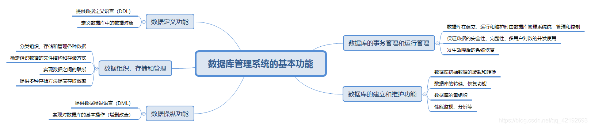

---


###  数据库系统（Database System, DBS）

- 数据库系统：由数据库、数据库管理系统（及其应用开发工具）、应用程序和**数据库管理员**（用户）组成的存储、管理、处理和维护数据的**完整系统**
- 数据库系统一般由数据库（DB）、数据库管理系统（DBMS）、应用系统、数据库管理员和用户构成。**DBMS是数据库系统的基础和核心。**

- 比如
  - 学校的 “教务管理系统”：包含服务器（硬件）、MySQL（DBMS）、学生信息 DB、教务管理软件（应用程序）、教师 / 学生 / 管理员（用户）；
  - 银行的 “核心交易系统”：包含大型服务器、Oracle（DBMS）、客户账户 DB、柜台交易软件、柜员 / 客户（用户）。

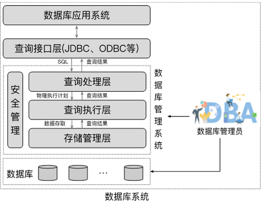

**数据库系统的特点：**

- **数据的整体结构化**：数据用数据模型描述，无需应用程序定义。不再针对某一应用，数据之间具有联系，数据记录可变长。
- **数据的共享性高，冗余度低且易扩充**：数据面向整个系统，可以被多个用户、多个应用共享使用。
- **数据独立性高**：物理存储与逻辑结构都相互独立。数据独立性由数据库管理系统的二级映像功能来保证。
- **数据由数据库管理系统统一管理和控制**：数据的安全性（security）保护、数据的完整性（integrity）检查、并发（concurrency）控制、数据库恢复（recovery）。

## 早期数据库应用

- 早期数据库应用直接构建于**文件系统**之上

- 文件系统存储数据的缺陷

  > - `Data redundancy and inconsistency`（冗余与不一致性）
  > - `Difficulty in accessing data` （获取数据困难）
  > - `Data isolation` （数据孤岛）,数据隔离性差
  > - `Integrity problems` （完整性问题）,完整性约束（如账户余额＞0）嵌入程序代码，而非显式声明，新增或修改约束难度大
  > - 更新原子性缺失：故障可能导致数据库处于部分更新的不一致状态
  > - 多用户并发访问问题：并发访问可提升性能，但无控制的并发访问会导致数据不一致
  > - 安全性问题：难以实现用户对部分数据的访问控制


## 数据管理的三个阶段

- 20 世纪 50 年代中期前：人工管理阶段
- 20 世纪 50 年代中期 - 60 年代中期：文件系统管理阶段
- 20 世纪 60 年代末至今：数据库管理阶段

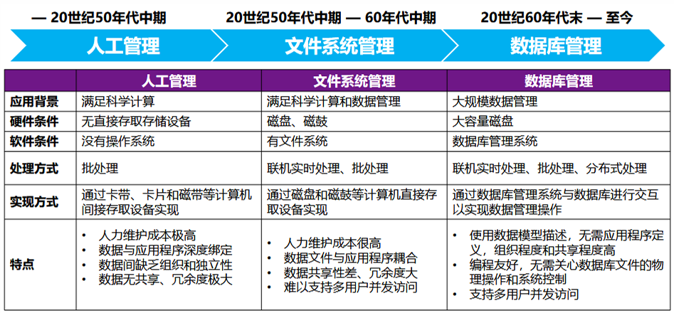

- 人工管理阶段

  - 计算机主要用于科学计算，无直接存取存储设备，没有操作系统，没有数据管理软件。
  - ①数据不保存；②数据面向应用；③没有共享、数据冗余度大；④数据与程序之间的依赖性大，不独立；⑤应用程序自己控制数据；⑥没有专门的数据管理软件，基本上没有文件的概念。

  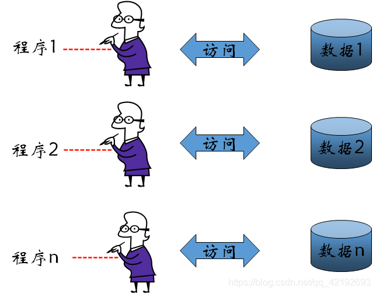

- 文件系统阶段

  - 计算机大量用于科学计算与数据处理，有了专门管理数据的软件，称为文件系统。
  - ①具有文件系统，数据可长期保存；②数据面向应用；③共享性差、数据冗余度大；④记录内有结构，整体无结构；⑤文件系统提供数据与程序之间的存取方法，独立性差；⑥应用程序自己控制数据；⑦文件之间缺乏联系，相互孤立，仍然不能反映现实世界各种事物之间错综复杂的联系。

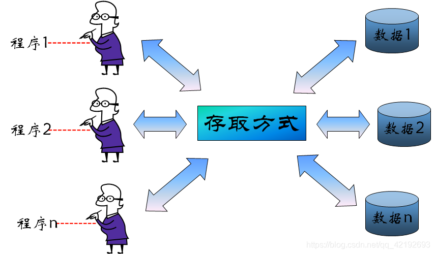

- 数据库系统阶段
  - 计算机应用于社会各个领域，计算机管理的数据量大，关系复杂，共享性要求强
  - ①数据结构化；②数据共享性好；③数据独立性好；④数据库管理系统（DBMS）对数据进行统 一的管理和控制。；⑤为用户提供了友好的接口。

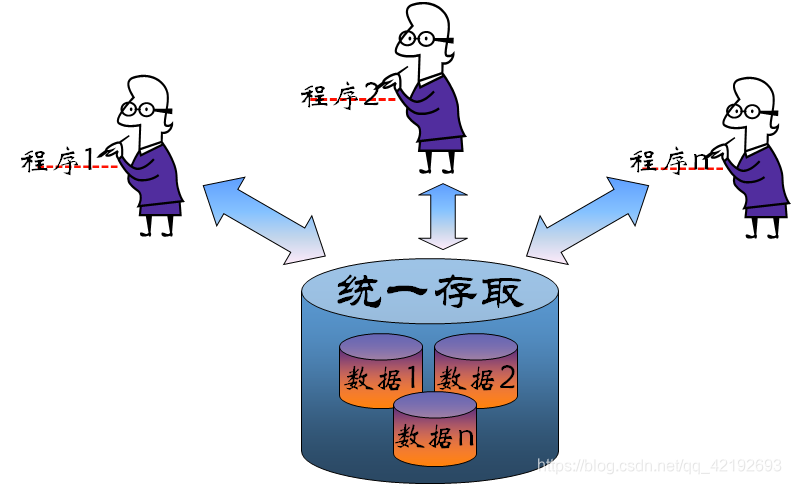


## 数据库的三层抽象

### 物理层

- **物理层**（`Physical level`）：描述记录（如教师信息）的存储方式
  - **最低层次的抽象**，描述数据实际上是**怎样**存储的。
  - 物理层详细描述复杂的底层数据结构。

---

### 逻辑层

- **逻辑层**（`Logical level`）：描述数据库中存储的数据以及数据之间的关系。

  - 比物理层层次稍高的抽象，描述数据库中存储**什么**数据及这些数据间存在什么**关系**。

  - 这样逻辑层就通过少量相对简单的结构描述了整个数据库。虽然逻辑层的简单结构的实现可能涉及复杂的物理层结构，但逻辑层的用户不必知道这样的复杂性。这称作**物理数据独立性**( `physical data independence`)。

  - 数据库管理员（`DBA`）使用抽象的逻辑层，他必须确定数据库中应该保存哪些信息。

  - 用记录类型定义描述逻辑结构：

    ```plaintext
    type instructor = record  // 教师记录类型
    	ID : string;  // 教师ID（字符串类型）
    	name : string;  // 姓名（字符串类型）
    	dept_name : string;  // 部门名称（字符串类型）
    	salary : integer;  // 薪资（整数类型）
    end;
    ```

  - 忽略逻辑层的 “关系定义”：逻辑层不仅描述单张表的结构，更重要的是**描述表与表之间的关联**（如外键约束），这是数据库区别于文件系统的关键。

---

### 视图层

- **视图层**（`View level`）：视图层(view level)。应用程序隐藏数据类型的细节；视图还可出于安全目的隐藏信息（如员工薪资）。
  - **最高层次的抽象**，只描述整个数据库的**某个部分**。
  - 尽管在逻辑层使用了比较简单的结构，但由于一个大型数据库中所存信息的多样性，仍存在一定程度的复杂性。
  - 数据库系统的很多用户并不需要关心所有的信息,而只需要访问数据库的一部分。
  - 视图层抽象的定义正是为了使这样的用户与系统的交互更简单。系统可以为同一数据库提供多个视图。

---

> [!tip]
>
> 1. 物理层是底层：负责将逻辑层定义的数据结构转换成硬件可存储的格式（如字节流），管理磁盘、内存等物理资源；
> 2. 逻辑层是核心：承上启下，向上给视图层提供统一的逻辑数据结构，向下屏蔽物理层的存储细节；
> 3. 视图层是顶层：直接面向用户和应用程序，提供定制化、安全的访问接口，让用户无需关心底层实现。

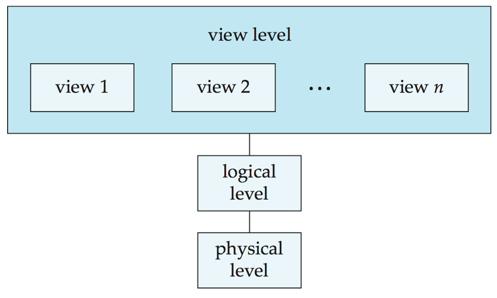


## 实例与模式

#### 实例（Instance）

**实例**（Instances）：指**特定时刻**存储在数据库中的信息的集合

- 特定时间点数据库中存储的实际数据集合，是动态、随时间变化的（如插入、更新、删除数据）。
- 类似编程语言中 “变量的具体值”，比如`Customer`类实例化后的对象`customer1 = new Customer("C001", "张三", "13800138000")`，`customer1`就是实例。

#### 模式（Schema）

数据库的整体结构定义，分为逻辑模式和物理模式，是静态、长期不变的（除非结构调整）。

类似编程语言中的 “数据类型”（如 Java 中的`class`类定义、C 语言中的`struct`结构体），只规定 “有什么属性、属性是什么类型、属性间有什么关系”，不涉及具体值。

- 物理模式（physical schemas）：
  - 在物理层描述数据库的设计
  - 描述数据的物理存储细节（对应之前讲的 “物理层”）。
- **逻辑模式**（logical schemas）：
  - 在逻辑层描述数据库的设计。程序员使用逻辑模式来构造数据库应用程序
  - 描述数据的逻辑结构和关系（对应之前讲的 “逻辑层”）。
- 子模式（subschemas）：描述了数据库的不同视图

### 物理数据独立性（Physical Data Independence）

- 修改物理模式时，无需改变逻辑模式（及依赖逻辑模式的应用程序）的能力。
- 隔离物理存储变化对上层的影响，降低维护成本。
- 通常情况下，各个层级和组件之间的接口应当被清晰定义，这样一来，某些部分的变更就不会对其他部分产生严重影响。

> [!tip]
>
>  “物理数据独立性” 和 “逻辑数据独立性”：前者是 “物理存储变，逻辑结构不变”，后者是 “逻辑结构变，应用程序不变”


## 数据模型

### 数据模型的四大描述对象

1. 数据（Data）：数据的基本单元、数据类型和取值范围。
2. 数据关系（Data Relationships）：不同数据之间的关联方式（一对一、一对多、多对多）。
3. 数据语义（Data Semantics）：数据的含义、用途和业务规则背景。
4. 数据约束（Data Constraints）：确保数据有效性和一致性的规则限制。

### 数据模型分类

- **关系模型**（retional model）：用**表的集合**来表示数据和数据间的联系
  - 以 “表格（关系）” 为基本结构，数据存储在行（记录）和列（属性）中，通过主键和外键关联不同表格。
  - **代表 DBMS**：MySQL、Oracle、SQL Server。
- **实体-联系模型**（entity-relationship model）：基于对现实世界的认识——现实世界由一组称作实体的基本对象以及这些对象间的联系构成。广泛用于数据库设计
  - 以 “实体（对象）” 和 “关系” 为核心，通过 E-R 图可视化描述现实世界的业务结构，主要用于数据库设计阶段。
- 基于对象的数据模型（object-based data model）：基于面向对象设计思想
  - 包括面向对象数据模型（OODM）和对象 - 关系数据模型（ORDBM）。
- 半结构化数据模型（semistructured data model）：可拓展标记语言 `xml`，`eXtensible`，`Markup`，`Language`
  - 数据没有固定的 schema（结构），格式灵活，支持嵌套和自描述，典型代表是 XML。


## 数据库模型

### 层次数据库

- 基于层次模型，以 “树结构” 表示数据记录间联系，用树形结构来表示各类实体以及实体间的联系
- 除根节点外，其他节点有且只有一个父节点（代表：IBM 的 IMS 数据库）

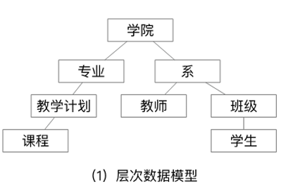

### 网状数据库

- 基于网状模型，以 “图结构” 表示数据记录间联系
- 允许多个节点无父节点，一个节点可有多个父节点（代表：美国通用电气的 IDS 数据库）


### 关系模型

- 所有数据存储在各类表格中，表格由**行和列**组成

- （示例：教师表包含 ID、姓名、部门名称、薪资等列，每行对应一位教师的信息）

  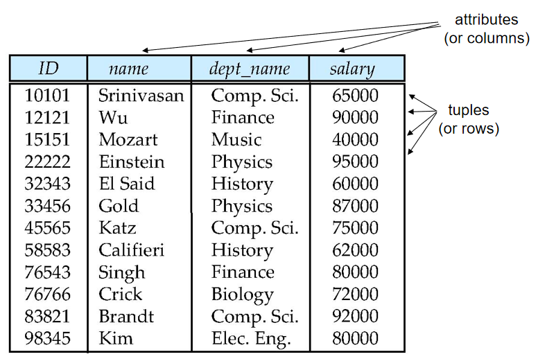

- **属性**（attributes）：表中每一列数据。`A1, A2, …, An`

- **元组**（tuples）：表中每一行数据

- **关系**（relation）：关系是无序的

  - 关系实例（relation instance）：表，实际的拥有数据的数据表
  - 关系模式（relation schema）：表的模板 `R = (A1, A2, …, An )`。例如： `instructor = (ID, name, dept_name, salary)`

---

**码/键**（keys）

- **超码**（super key）：一个或一组属性，能够唯一区分一个关系的任何一个元组。例如 `{ID, name}`，`{ID}`，可以有冗余属性
- **候选码**（candidate key）：最小的（包含属性个数最少）超码。例如 `{ID}`，`{name}`
- **主码**（primary key）：候选码中挑出一个作为主码，**任何关系只能有一个主码**
- **外码**（foreign key）：一个表中某一列的**所有**值一定出现在另一张表的某一列，且在另一张表中为**主码**，需要考虑级联操作


## 数据定义语言（DDL）

Data Definition Language（DDL）即**数据定义语言**，是用于**定义数据库模式（结构）的 SQL 子语言**，核心作用是创建、修改、删除数据库中的对象（如表、视图、索引等），不涉及具体数据的增删改查。

- 用于描述数据库的逻辑结构（如表结构、表间关系、约束规则等）的规范符号

  ```sql
  create table instructor (
    ID char(5),               -- 教师ID，字符类型，长度5
    name varchar(20),         -- 姓名，可变长字符类型，最长20
    dept_name varchar(20),    -- 部门名称，可变长字符类型，最长20
    salary numeric(8,2)       -- 薪资，数值类型，总长度8、小数位2
  );
  ```

- DDL 语句经**DDL 编译器**处理后，会生成对应的 “表模板”（即表的结构定义），并存储在 **数据字典（Data Dictionary）** 中。

- **数据字典（元数据存储）**：数据字典是数据库的 “元数据仓库”（存储 “数据的数据”），包含：

  - **数据库模式**：表、视图等对象的结构定义（如`instructor`表的字段列表）；
  - **完整性约束**：如`ID`是`instructor`表的主键（唯一标识教师），确保`ID`非空且唯一；
  - **权限信息**：记录哪些用户可以访问`instructor`表，以及能执行的操作（如只读、修改）。

## 数据操纵语言（DML）

Data Manipulation Language（DML）即**数据操纵语言**，是用于访问、修改数据库中数据的 SQL 子语言，核心作用是对已定义结构的数据库进行 “数据层面” 的操作（而非结构层面）

- 基于数据模型（如关系模型）对数据库中的数据进行查询、插入、更新、删除的语言，也常被称为 “查询语言”（因为查询是最常用的 DML 操作）。

DML 的分类

- 纯 DML（理论型）：数据库理论研究（如验证计算能力、优化查询算法），不直接用于商业系统。
  - **关系代数**：通过 “运算操作” 描述查询逻辑（如选择、投影、连接）。
  - **元组关系演算**：以 “元组变量” 为核心，通过逻辑条件描述查询结果
  - **域关系演算**：以 “属性（域）变量” 为核心，通过属性的逻辑条件描述查询结果。
- 商业 DML（实用型）
  - **定位**：用于商业数据库系统，语法更贴近自然语言，易被用户掌握。
  - **代表语言**：SQL（Structured Query Language），是目前应用最广泛的商业 DML。

### SQL

SQL 是**结构化查询语言（Structured Query Language）**，是目前全球应用最广泛的数据库操作语言，核心用于关系型数据库的**数据定义、操纵、控制**。

- SQL 本身不具备 “图灵完备性”—— 即无法独立实现所有可计算的逻辑（比如复杂循环、条件分支的嵌套组合）
- SQL 是**声明式语言**（用户只需描述 “要什么结果”，无需写 “怎么得到结果”），而非**过程式语言**（如 Java）。它的设计目标是简化数据操作，而非实现通用编程逻辑。
- 应用程序无法直接 “原生运行 SQL”，需通过以下接口与数据库交互：**嵌入式 SQL**,**应用程序接口（API）**


## 数据库设计（Database Design）

Database Design 即**数据库设计**，是根据业务需求构建数据库结构的过程，核心分为**逻辑设计**和**物理设计**两个阶段，最终目标是实现数据的高效存储、低冗余、高一致性。

### 逻辑设计（Logical Design）

逻辑设计：确定数据库的 “逻辑结构”，聚焦于 “数据的组织方式”，构建一个好的数据关系表

- 业务决策：确定需记录的属性

- 计算机科学决策：设计关系模式及属性分布，避免数据冗余、保证数据一致性。

  - **实体 - 关系（E-R）模型**：先将业务抽象为 “实体（如商品、用户）” 和 “关系（如购买）”，再将 E-R 图转换为关系模式；
  - **规范化理论**：通过 “范式”（如 1NF、2NF、3NF）优化关系模式，消除冗余。

  > 反例：若将 “用户信息” 和 “订单信息” 合并为一张表，会导致同一用户的姓名、手机号重复存储（冗余），修改用户信息时需更新所有相关订单记录（易不一致）。
  >
  > 正例：拆分为 “用户表（用户 ID、姓名、手机号）” 和 “订单表（订单 ID、用户 ID、金额）”，通过 “用户 ID” 关联两张表，既无冗余又保证一致性。


### 物理设计（Physical Design）

物理设计：确定数据库的 “物理存储方式”，聚焦于 “数据的存储效率”

- **存储位置**：数据、索引存储在哪个磁盘分区；
- **文件组织方式**：数据以 “堆文件”“顺序文件” 还是 “哈希文件” 存储；
- **索引设计**：为哪些字段建立索引（如为 “订单表” 的 “用户 ID” 建立 B + 树索引，加速按用户查询订单）；
- **分区策略**：是否将大表按 “时间”“地区” 分区（如将订单表按月份分区，提升查询效率）。


### 设计方法

解决 “如何设计出优质关系模式” 的问题，避免出现数据冗余（如同一信息重复存储）、更新异常（如修改一个信息需改多个地方）、插入 / 删除异常（如无法单独插入某类数据）。

#### 实体 - 关系模型（Entity-Relationship Model，E-R 模型）

- 先将现实业务中的 “事物” 抽象为 “实体”，“事物间的关联” 抽象为 “关系”，用可视化的 E-R 图描述，再将 E-R 图转换为关系模式（表结构）。
  - 识别实体：业务中需要记录的独立事物（如 “学生”“课程”“教师”）；
  - 定义属性：每个实体的特征（如 “学生” 的学号、姓名、性别）；
  - 描述关系：实体间的关联方式（如学生与课程是 “选课” 关系，多对多；教师与课程是 “授课” 关系，一对多）；
  - 转换为表：实体→表，属性→字段，关系→通过主键 / 外键关联（多对多关系需新增中间表）。

#### 规范化理论（Normalization Theory）

- 通过 “范式（Normal Form）” 这一形式化规则，定义 “不良设计” 的特征，并通过拆分表结构消除这些问题，最终达到 “优质设计”。
  - 明确范式等级：常用范式有 1NF（原子性）、2NF（消除部分依赖）、3NF（消除传递依赖），等级越高，冗余越少；
  - 检测现有模式：判断当前表结构是否符合目标范式（如是否存在传递依赖）；
  - 优化调整：通过拆分表消除异常（如将存在传递依赖的表拆分为多张表）。


## 对象 - 关系数据模型（Object-Relational Data Models）

对象 - 关系数据模型（Object-Relational Data Models，简称 OR 模型）是关系模型的 “增强版”。

- 表中的每个属性必须是 “原子值”，不可拆分，表结构呈 “扁平状”（无嵌套）。
- 通过融入面向对象思想和相关结构，对关系数据模型进行扩展，以支持新增的数据类型。
- 允许元组（表中的行）的属性采用复杂类型，包括非原子值（如嵌套关系）。
- 保留关系模型的基础特性，尤其是数据的声明式访问方式，同时增强建模能力。
- 与现有的关系型语言向上兼容。


## XML（Extensible Markup Language）

- 可扩展标记语言（Extensible：可扩展，Markup：标记，Language：语言）
- **定义主体**：由万维网联盟（W3C，World Wide Web Consortium）制定，是通用的文本标记规范。
- **设计初衷**：最初用于**文档标记**（如格式化电子书、技术文档），目的是让文档结构更清晰、易读且可机器解析，而非设计用于数据库存储或查询。可自定义标签以及创建嵌套标签结构的能力，让 XML 成为优秀的**数据交换方式**，而不仅仅是文档标记工具。
- XML 已成为所有新一代数据交换格式的基础。
- 存在多种用于解析、浏览和查询 XML 文档 / 数据的工具。


## 数据库引擎（Database Engine）

数据库引擎是 DBMS 中负责数据物理存储、逻辑处理、事务控制的核心程序集合，是连接用户操作（如 SQL 语句）与底层存储（如磁盘文件）的关键中间层。

### 存储管理器（Storage Manager）

存储管理器是底层数据与上层应用 / 查询之间的**接口程序模块**，负责数据在物理存储（磁盘、内存）与用户操作之间的流转。

- 与操作系统文件管理器交互
- 高效存储、检索和更新数据

关键问题：

- **存储访问**：如何优化磁盘 I/O 效率（磁盘读写速度远低于内存，需通过缓存等机制减少磁盘访问）；
- **文件组织**：数据文件以何种结构存储（如堆文件、顺序文件、B + 树文件），影响数据查询速度（如顺序文件适合范围查询，哈希文件适合等值查询）；
- **索引和散列**：如何设计索引（如 B + 树索引、哈希索引）加速数据检索，避免全表扫描（如给学生表的 “学号” 列建索引，查询特定学生时直接定位，无需遍历所有记录）。


### 查询处理（Query Processing）

Query Processing（查询处理）是数据库引擎将用户 SQL 查询转换为实际数据结果的完整流程，核心分为解析与翻译、优化、执行三步，其中优化环节直接决定查询效率 

DML 编译器，将以查询语言表示的DML语句翻译成查询执行引擎可以理解的较低层次的执行计划。一个查询语句可以被翻译成多个返回结果相同的执行计划，DML 翻译器通过进行查询优化来选择**开销最低**的计划

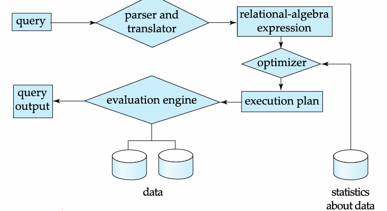


### 事务管理（Transaction Management）

Transaction Management（事务管理）是数据库系统的核心组件之一，主要解决**系统故障**和**并发操作**带来的数据一致性问题，确保数据库始终处于正确、可靠的状态。

> [!tip]
>
> 事务是**一组执行单一逻辑功能的操作集合**，这些操作要么全部成功执行（提交），要么全部不执行（回滚），是数据库操作的最小 “原子单元”。

事务管理包含两个核心子组件，分别解决故障和并发问题：

- 故障恢复（确保系统故障下的一致性）:事务管理组件通过**日志机制**和**恢复算法**，保证系统故障后数据库仍处于一致状态
- 并发控制（确保多用户操作的一致性）:并发控制管理器通过**锁机制**、**多版本并发控制（MVCC）** 等技术，协调多个并发事务的执行，避免数据冲突：

> [!important]
>
> 事务管理通过保障**ACID 特性**（原子性（Atomicity）、一致性（Consistency）、隔离性（Isolation）、持久性（Durability）），让数据库在复杂环境下始终可靠：
>
> - 原子性：事务要么全执行，要么全回滚；
> - 一致性：**事务执行前后**，数据库的业务规则（如账户总金额）保持正确；
> - 隔离性：并发事务的执行互不干扰；
> - 持久性：事务提交后，修改结果永久保存。

> [!caution]
>
> 事务应当具备原子性、
>
> 一致性。事务不能违反现有的数据库一致性约束，如果事务开始之前DB处于一致的状态，事务结束之后，DB状态也应保持一致。
>
> 但是在事务执行过程中，有可能需要**临时破坏数据库的一致状态**，因为A账户扣钱B账户加钱这两个操作**总有先后顺序**。


## 数据库系统内部架构

### 一、用户层级（顶层）

不同类型的用户对应不同的操作工具 / 接口：

| 用户类型                   | 操作方式               | 工具 / 接口                        |
| -------------------------- | ---------------------- | ---------------------------------- |
| 普通用户（柜员、Web 用户） | 使用应用程序           | 应用接口（Application Interfaces） |
| 应用程序员                 | 编写应用程序           | 应用程序（Application Programs）   |
| 高级用户（分析师）         | 执行复杂查询           | 查询工具（Query Tools）            |
| 数据库管理员（DBA）        | 管理数据库结构、权限等 | 管理工具（Administration Tools）   |

### 二、核心功能层（中间层）

#### 1. 查询处理器（Query Processor）：处理用户请求

负责将用户请求转换为可执行的操作，包含：

- **编译器与链接器**：将应用程序代码编译为可执行的目标代码；
- **DML 编译器与组织器**：解析数据操纵语言（DML）查询，生成逻辑执行计划并优化；
- **DDL 解释器**：解析数据定义语言（DDL）语句（如建表），更新数据字典；
- **查询执行引擎**：执行优化后的查询计划，调用存储管理器获取 / 修改数据。

#### 2. 存储管理器（Storage Manager）：管理数据存储

负责与底层磁盘交互，保障数据的高效访问与一致性：

- **缓冲管理器**：管理内存缓存，将频繁访问的数据块加载到内存，减少磁盘 I/O；
- **文件管理器**：管理磁盘上的数据文件，实现数据的物理存储与访问；
- **授权与完整性管理器**：验证用户权限，确保数据的完整性约束（如主键唯一）；
- **事务管理器**：保障事务的 ACID 特性，处理并发控制与故障恢复。

### 三、物理存储层（底层）

数据最终存储在磁盘中，包含：

- **数据**：实际业务数据（如用户表、订单表）；
- **索引**：加速数据查询的结构（如 B + 树索引）；
- **数据字典**：存储元数据（如表结构、权限信息）；
- **统计数据**：记录数据分布信息（如记录数、字段取值范围），用于查询优化。

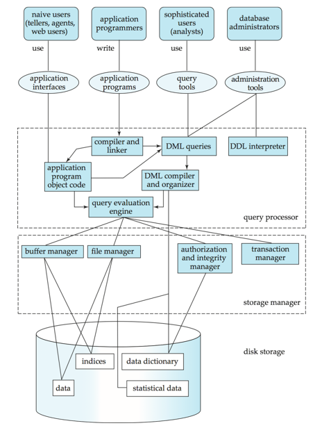


## 数据库架构（Database Architecture）

Database Architecture（数据库架构）指数据库系统的部署与组织方式，其设计会极大地受底层计算机系统的影响，核心分为以下 4 类：

### 1. 集中式架构（Centralized）

- **结构**：数据库、数据库管理系统（DBMS）、应用程序都部署在**同一台计算机**上，所有用户通过终端连接这台机器操作数据。
- **特点**：部署简单、维护成本低，但性能受单台机器硬件限制，且存在 “单点故障” 风险（机器故障会导致整个系统不可用）。
- **适用场景**：小型业务（如小型企业的内部管理系统）。

### 2. 客户 - 服务器架构（Client-server）

- 结构：分为客户端与服务器端：

  - 服务器端：部署 DBMS 和数据库，负责数据存储、查询处理等核心工作；
  - 客户端：部署应用程序，负责用户交互（如界面展示），通过网络向服务器发送请求。
  
- **特点**：资源集中管理，客户端轻量化；可通过升级服务器提升性能，但仍受单台服务器的性能与可靠性限制。

- **适用场景**：中小型业务（如电商平台、企业 ERP 系统），是当前主流架构之一。

### 3. 并行式架构（Parallel）

- 结构：数据库部署在多处理器 / 多核心的单台计算机上，利用硬件并行能力提升性能，常见类型包括：
  - 共享内存：多处理器共享同一内存，访问速度快但内存带宽易成为瓶颈；
  - 共享磁盘：多处理器共享磁盘，内存独立，可扩展更多处理器；
  - 无共享：处理器、内存、磁盘均独立，通过网络通信，扩展性最强。
- **特点**：大幅提升海量数据的处理速度（如大规模查询、批量计算）。
- **适用场景**：数据仓库、实时数据分析平台等对性能要求极高的场景。

### 4. 分布式架构（Distributed）

- **结构**：数据库被拆分 / 复制到**多台独立计算机（节点）**，节点通过网络协同工作，每个节点可独立运行 DBMS。
- **特点**：高可靠性（单点故障不影响整体）、高扩展性（增加节点即可扩容），但需解决数据一致性、分布式事务等复杂问题。
- **适用场景**：超大规模业务（如互联网巨头的用户数据库）、跨地域业务（如跨国企业的分布式数据中心）。