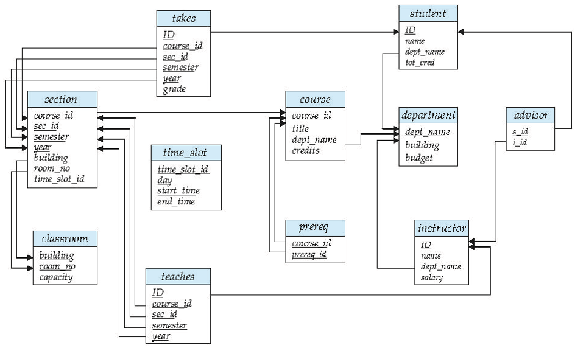
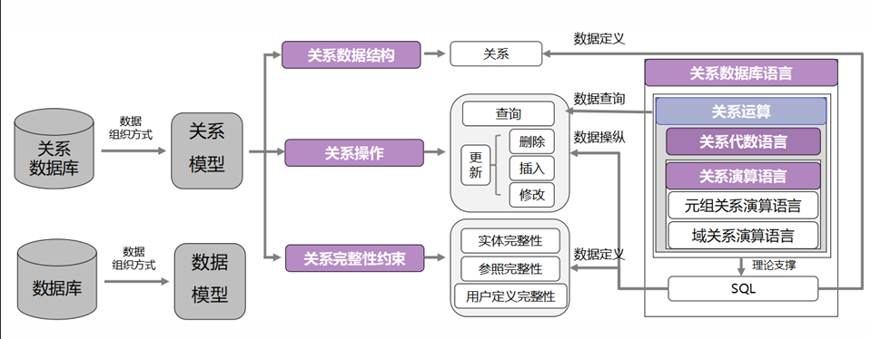
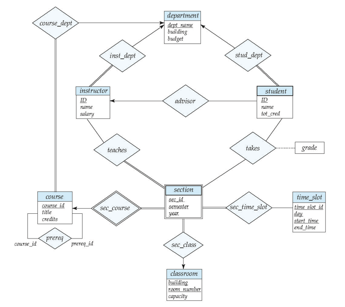

# 关系模型导论


## **属性**（attributes）

**属性**（attributes）：表中每一列数据。`A1, A2, …, An`

- 域（Domain）的定义
  - 每个属性允许的值集合称为该属性的域。
  - 域就是属性的 “取值规则表”，规定了这个属性能填哪些值、不能填哪些值。
- 原子性（Atomicity）
  - 属性值（通常）要求是原子的，即不可分割的。
  - 属性值必须是 “最小不可拆分单元”，不能包含多个独立信息的组合。

> [!tip]
>
> 特殊值 NULL 是每个域的成员，表示值 “未知”。NULL 值会给许多操作的定义带来复杂性。
>
> 不管域的正常取值是什么，都默认包含 NULL 这个 “特殊值”，专门用来表示 “不知道这个属性的值”，但它会让运算规则变得复杂。

---


## 关系模式和关系实例

关系模式是关系的 “结构定义”（静态框架），关系实例是关系的 “具体数据”（动态内容）

### 关系模式（Relation Schema）

设 `A₁、A₂、…、Aₙ`为属性，则`R = (A₁, A₂, …, Aₙ) `是一个关系模式。

- 示例：教师（ID，姓名，部门名称，薪资）。
- 关系模式就是给 “表” 下的 “结构定义”，规定了这张表有哪些列、列的名称是什么，相当于一张 “空表的表头”，只定规则不包含具体数据。同时模式还隐含了各属性对应的 “域”（允许的取值范围）

---

### 关系实例（Relation Instance）

关系的当前值**（关系实例）**由一张表指定。关系 r 中的元素 t 是一个元组，由表中的一行表示。

- 形式上，给定集合 D₁、D₂、…、Dₙ（各属性的域），关系 r 是 D₁×D₂×…×Dₙ的子集。因此，关系是 n 元组（a₁,a₂,…,aₙ）的集合，其中每个 aᵢ∈Dᵢ（aᵢ属于 Dᵢ）。
- D₁×D₂×…×Dₙ是所有属性域的 “笛卡尔积”（简单说就是 “所有可能的组合”），而关系实例 r 是其中 “有实际意义的子集”，这些子集以 “n 元组”（即表中的行）形式存在，且每个元组的每个值都符合对应属性的域规则。
- 关系实例就是 “填了数据的表”，表中的每一行就是一个元组（tuple），每一列对应关系模式中定义的一个属性，且当前所有行的集合构成了该关系在某一时刻的实例。


## 关系（relation）

系是无序的。元组的顺序无关紧要（元组可以以任意顺序存储）。

- 关系本质是 “集合”（数学中的集合），而集合的特点是 “元素无序”—— 就像你手里的一堆苹果，不管是先拿红的还是先拿绿的，这堆苹果的本质没变。对应到数据库表中，就是行的排列顺序不影响表的内容和意义。
- 元组的集合完全相同，只是顺序不同，不影响数据的本质含义。即**元组进行不同排序但是集合相同的表视为一个关系实例**


## **码/键**（keys）

- **超码**（super key）：一个或一组属性，能够唯一区分一个关系的任何一个元组。例如 `{ID, name}`，`{ID}`
  - 设 K 是关系模式 R 的属性子集（K⊆R）。若 K 的属性值足以唯一标识关系模式 R 的任何可能关系实例 r (R) 中的每个元组，则 K 是 R 的超键。但是需要注意超键中可能会有冗余属性， “多余属性不影响唯一性”
  - 超键就是 “能唯一找到一行数据的属性组合”，只要知道超键的取值，就能确定唯一的元组，不会重复。
- **候选码**（candidate key）：最小的（包含属性个数最少）超码。例如 `{ID}`
  - 若超键 K 是 “最小的”（即移除 K 中的任何一个属性后，K 就不再是超键），则 K 是候选键。
  - 候选键是 “精简版超键”，不能再去掉任何一个属性，否则就失去唯一标识能力，是 “最经济” 的超键。
- **主码**（primary key）：候选码中挑出一个作为主码，**任何关系只能有一个主码**
  - 从多个候选键中选择一个作为主键（通常选最常用、最简单的）。
  - 主键是 “官方指定的候选键”，是关系中唯一的 “主要标识”，用于日常数据操作（如查询、关联其他表），是数据库设计中人为选定的。
  - 优先选属性个数少（最好单属性）、取值稳定（不会轻易修改，如 ID）、非空的候选键。
- **外码**（foreign key）：一个表中某一列的**所有**值一定出现在另一张表的某一列，且在另一张表中为**主码**
  - 外键约束是指 “一个关系中的某个属性值，必须在另一个关系的主键中存在”。其中，包含外键的关系叫 “引用关系”，被引用的关系叫 “被引用关系”。
  - 外键是 “跨表的关联纽带”，确保两个表之间的数据一致性，避免出现 “无对应记录” 的无效数据。


> [!tip]
>
> 1. **候选键可能多个**：不是所有关系都只有一个候选键。例如 “学生选课” 关系（学号，课程 ID，成绩），候选键是 {学号，课程 ID}（单独学号对应多个选课记录，单独课程 ID 也对应多个记录，组合后才唯一）；若增加 “选课编号” 且唯一，则 {选课编号} 和 {学号，课程 ID} 都是候选键，需选一个作为主键。
> 2. 外键不一定是单属性：外键可以是属性组合，但必须**与被引用表的主键结构一致**（被引用表主键是组合属性，外键也需对应组合）。例如 “订单详情” 表的外键 {订单号，商品 ID}，引用 “订单商品” 表的主键 {订单号，商品 ID}。
> 3. 外键允许 NULL：外键约束是 “**值存在则必须在被引用表中**”，但可以取 NULL（表示 “暂时无关联”）。例如教师表中 dept_name 为 NULL，可能表示 “教师暂未分配部门”，这是允许的（除非额外设置非空约束）。
> 4. 主键必须非空且唯一：主键是关系的核心标识，不能取 NULL（否则无法标识元组），也不能重复，这是数据库自动强制的约束；而候选键本身也隐含 “非空唯一” 特性（否则无法唯一标识）。


**大学数据库模式图**



> **系/部门表** — 存储大学各院系的信息，包括系名、所在建筑和预算
>
> - **department**(**dept_name**,building,budget);
>
> **教师表** — 存储教师信息，包括工号、姓名、所属系和工资
>
> - **instructor**(**ID**, name,dept_name,salary);
>
> **课程表** — 存储课程信息，包括课程号、课程名称、开课系和学分
>
> - **course**(**course_id**,title,dept_name,credits);
>
> **课程班表** — 存储课程的具体开课班次信息，包括课程号、班次号、学期、年份、上课地点和时间
>
> - **section**(**course_id**,**sec_id**,**semester**,**year**,building,room_number,time_slot_id);
>
> **授课表** — 关联教师与课程班，记录哪位教师教授哪个课程班
>
> - **teaches**(**ID**,**course_id**,**section_id**,**semester**,**year**);
>
> **学生表** — 存储学生信息，包括学号、姓名、所属系和总学分
>
> - **student**(**ID**,name,dept_name,tot_cred);
>
> **先修课表** — 存储课程之间的先修关系（哪门课是另一门课的先修课）
>
> - **prereq**(**course_id**,**prereq_id**);
>
> **导师表** — 关联学生与教师，记录哪位教师指导哪位学生
>
> - **Advisor**(**s_id**,**i_id**)
>
> **选课表** — 记录学生选课情况及成绩
>
> - **takes**(**ID**,**course_id**,**sec_id**,**semester**,**year**,grade)
>
> **教室表** — 存储教室信息，包括建筑名、房间号和容量
>
> - **classroom**(**building**,**room_number**,capacity)
>
> **时间段表** — 存储上课时间段信息，包括时间段ID、星期、开始时间和结束时间
>
> - **time_slot**(**time_slot_id**,**day**,**start_time**,end_time)
>
> 其中**粗体**字段表示**主键（Primary Key）**，用于唯一标识表中的每条记录。


## elational Query Languages（关系查询语言）

- **关系数据库语言**：包含关系运算、关系代数语言、关系演算语言，是实现数据定义、查询、操纵的工具。
- **关系运算**：是关系查询语言的**理论基础**，分为 6 个基本运算（选择、投影等）。
- **关系代数语言**：过程化语言（需要描述 “怎么查”），比如用选择、投影的组合来写查询。
- **关系演算语言**：声明式语言（只需描述 “查什么”），分为**元组关系演算**（以元组为变量）和**域关系演算**（以属性域为变量）。
- **SQL**：是实际应用的数据库语言，**基于关系代数和关系演算的理论**（比如 SQL 的`SELECT`对应投影，`WHERE`对应选择）。



- 关系查询语言分为两类，核心区别是 “是否描述查询过程”：
- **过程化语言（如关系代数）**：
  - 需要明确写出 “查询的步骤”（先选哪些行、再选哪些列、怎么组合表）。
- **声明式语言（如关系演算）**：
  - 只需描述 “想要的结果满足什么条件”，不用管 “怎么得到结果”。

关系运算的基本操作，直接对应 SQL 的语法：

| 关系运算      | SQL 语法示例                                 | 作用                          |
| ------------- | -------------------------------------------- | ----------------------------- |
| 选择（σ）     | `WHERE 部门名称="计算机科学"`                | 筛选行                        |
| 投影（Π）     | `SELECT 姓名`                                | 筛选列                        |
| 并（∪）       | `UNION`                                      | 合并结果（去重）              |
| 笛卡尔积（×） | `FROM 教师, 课程`                            | 表的组合（需配合`WHERE`筛选） |
| 自然连接（⋈） | `FROM 教师 JOIN 课程 ON 教师.ID=课程.教师ID` | 基于共有属性连接表            |


**大学数据库 E-R 图**




# 关系代数(Relational Algebra)

- **Procedural language（过程化语言）**

  - 关系代数是一种过程化语言。
  - 过程化意味着需要明确描述 “查询的步骤”—— 比如 “先筛选行、再选列、最后合并”，而不是只说 “想要什么结果”。

- **Six basic operators（6 个基本运算）**关系代数的 6 个基本运算，是所有复杂查询的 “基础积木”：

  | 运算名称                      | 符号 | 作用                                 | 输入数量 |
  | ----------------------------- | ---- | ------------------------------------ | -------- |
  | 选择（select）                | σ    | 筛选关系中的元组（行）               | 1 个关系 |
  | 投影（project）               | Π    | 选择关系中的属性（列）               | 1 个关系 |
  | 并（union）                   | ∪    | 合并两个关系的元组（去重）           | 2 个关系 |
  | 差（set difference）          | –    | 取属于第一个关系但不属于第二个的元组 | 2 个关系 |
  | 笛卡尔积（Cartesian product） | ×    | 组合两个关系的所有元组               | 2 个关系 |
  | 重命名（rename）              | ρ    | 给关系或属性起新名字                 |          |

- **运算的封闭性**

  - 这些运算以一个或两个关系为输入，产生一个新关系作为结果。
  - 无论用哪个运算，**输出都是 “关系”（二维表）**，这保证了运算可以 “链式组合”（比如先做选择，再做投影，结果还是关系，能继续参与其他运算）。

---

## 选择运算（Select Operation）

- **符号**：`σ_p(r)`
  - `σ`：选择运算的符号（读作 “sigma”）
  - `p`：选择谓词（Selection Predicate），即筛选条件
  - `r`：要操作的关系（输入的表）

- **形式化定义**：`σ_p(r) = {t | t ∈ r 且 p(t)}`
  - 选择运算的结果是**所有属于关系 r、且满足谓词 p 的元组 t 的集合**。
  - 从表 r 中，把满足条件 p 的行挑出来，组成一个新表。
- 选择谓词`p`是**命题演算公式**，由 “项” 通过逻辑连接符组合而成：
  - **逻辑连接符**：`∧`（与，同时满足）、`∨`（或，满足任意一个）、`¬`（非，不满足）
  - 项的形式
    1. `<属性> op <属性>`（属性之间比较，比如 “薪资> 平均薪资”）
    2. `<属性> op <常量>`（属性与固定值比较，比如 “部门名称 = 'Physics'”）
  - **比较运算符（op）**：`=`（等于）、`≠`（不等于）、`>`（大于）、`≥`（大于等于）、`<`（小于）、`≤`（小于等于）

> [!TIP]
>
> 1. **谓词的逻辑优先级**：
>    - 逻辑连接符的优先级是：`¬`（非） > `∧`（与） > `∨`（或）。
>    - 若不确定优先级，建议用括号明确顺序，比如`σ_(dept_name="Physics" ∨ dept_name="Comp. Sci.") ∧ salary>80000(r)`（先选部门，再筛薪资）。
> 2. **与投影运算的顺序**：
>    - 若需要 “先筛选行，再选列”，必须**先做选择、再做投影**（否则投影会去掉筛选需要的属性）。
>    - 错误示例：`Π_name(σ_dept_name="Physics"(instructor))`是对的；但`σ_dept_name="Physics"(Π_name(instructor))`会出错（投影后只剩 name 列，没有 dept_name 列，无法筛选）。
> 3. **NULL 值的影响**：
>    - **若属性值为 NULL，比较结果是 “未知”，不会被筛选出来。**比如 “薪资 = NULL” 的教师，不会被`σ_salary>60000`选中，也不会被`σ_salary≤60000`选中。

---


## 投影运算（Project Operation）

- **符号**：`Π_{A₁,A₂,…,Aₖ}(r)`
  - `Π`：投影运算的符号（读作 “pi”）
  - `A₁,A₂,…,Aₖ`：要保留的属性名列表
  - `r`：要操作的关系（输入的表）
- **定义**：投影运算的结果是 “从关系 r 中删除未被列出的列后，得到的 k 列关系”；同时，因为关系是**集合**（不允许重复元组），结果会**自动移除重复的行**。

> [!TIP]
>
> 1. **投影会丢失信息**：投影是 “不可逆” 的 —— 如果投影后删除了某列，无法从投影结果恢复原关系的完整数据。比如投影`Π_{name}(instructor)`后，无法知道每个 name 对应的 ID 或薪资。
> 2. **投影后的重复行必被删除**：即使原关系没有重复行，投影后可能因 “保留列的值相同” 产生重复，此时会自动去重（因为关系是集合）。比如两个不同教师的 name 和 salary 完全相同，投影`Π_{name,salary}`后会合并为一行。

---


## 并运算（Union Operation）

- 符号:`r ∪ s`
  - `r`和`s`：两个待合并的关系（输入的表）
  - `∪`：并运算符号，读作 “union”
- 形式化定义 `r ∪ s = {t | t ∈ r or t ∈ s}`
  - 并运算的结果是 “所有属于关系 r、或属于关系 s、或同时属于两者的元组 t 的集合”。
  - 把两个表的行合并到一起，**自动去掉重复的行**，最终得到 “包含两个表所有不重复元组” 的新表。

> [!important]
>
> 并运算不是任意两个表都能做，有严格的兼容性要求：
>
> 1. **相同元数（arity）**：两个关系的**属性个数（列数）必须完全一致**。比如 r 有 3 列，s 也必须有 3 列，不能一个 3 列一个 2 列。
> 2. **属性域兼容**：对应位置的属性域（取值类型）必须相同。比如 r 的第 2 列是 “整数型薪资”，s 的第 2 列也必须是 “整数型”（不能是字符串或日期），确保合并后列的含义一致。

> [!tip]
>
> 1. **与 SQL 中 UNION 的区别**：关系代数的并运算**默认去重**；SQL 中`UNION`也去重，但`UNION ALL`不去重（保留所有重复元组），实际应用中需注意区分。
> 2. **属性名不影响有效性**：只要列数相同、对应列域兼容，即使属性名不同也能运算（结果的属性名通常取第一个关系的）。比如 r 的第 1 列是 “course_id”，s 的第 1 列是 “c_id”，只要都是课程 ID 的整数类型，就能合并。


---


## 差运算（Set Difference Operation）

- 符号 `r – s`（注意：部分教材`r \ s`)
  - `r`：被减关系（主关系，保留其独有元组）
  - `s`：减关系（用于剔除元组的参考关系）
  - `–`：差运算符号，读作 “set difference”

- 形式化定义 `r – s = {t | t ∈ r and t ∉ s}`
  - 差运算的结果是 “所有属于关系 r、但不属于关系 s 的元组 t 的集合”。
  - 以 r 为 “基准表”，把 r 中与 s 完全相同的行去掉，剩下的就是结果，相当于 “只留 r 独有的数据”。

差运算和并运算的兼容性要求完全一致，缺一不可:**相同元数（arity）**和**属性域兼容**：

---


## 笛卡尔积（Cartesian-Product Operation）

- 符号 `r × s`
  - `r`和`s`：待组合的两个关系（输入表）
  - `×`：笛卡尔积运算符号，读作 “Cartesian product”
- 形式化定义 `r × s = {t⌒q | t ∈ r and q ∈ s}`
  - 笛卡尔积的结果是 “所有由关系 r 中的元组 t 和关系 s 中的元组 q 连接而成的新元组的集合”（`t⌒q`表示将 t 和 q 拼接成一个新元组）。
  - 把 r 的每一行和 s 的每一行都 “配对” 一次，生成所有可能的组合行，比如 r 有 3 行、s 有 2 行，结果就有 3×2=6 行。

属性不相交假设

- 默认假设 r (R) 和 s (S) 的属性集不相交（即 R∩S=∅，没有重名属性）。
- 含义：若两关系属性名完全不同，组合后新关系的属性名直接保留原属性名（如 r 的 A、B 和 s 的 C、D，组合后为 A、B、C、D）。
- 重命名要求：若属性名重复（如 r 和 s 都有属性 B），必须先用**重命名运算（ρ）** 给重复属性改名，否则无法区分（比如改为 r.B 和 s.B）。

##  重命名运算（配合笛卡尔积使用）

- **符号**：`ρ_X(E)` 或 `ρ_新关系名(新属性1,新属性2)(E)`
- 作用：给关系或属性起新名字，解决笛卡尔积中的 “属性名冲突” 问题。
- 示例：`ρ_s(r)` 表示将关系 r 重命名为 s；`ρ_r(ra=A, rb=B)(r)` 表示将 r 的属性 A 改为 ra、B 改为 rb。


## 自连接对比 + 集合差

- 利用自连接对比 + 集合差求出最大值
- **排除所有 “非最大值”，剩下的就是最大值**。
- `Π_{balance}(account) - Π_{account.balance}(σ_{account.balance < d.balance}(account × ρ_d(account)))`
- `ρ_d(account)`：将`account`表重命名为`d`（区分两个 “账户表”，一个是原始表`account`，一个是对比表`d`）。
- `account × ρ_d(account)`：做自连接，生成 “所有余额两两对比” 的组合（7 行 ×7 行 = 49 行）
- 筛选 “非最大值”（σ_{account.balance < d.balance}）
- 集合差运算（总余额 - 非最大值余额）


# 关系代数的附加运算（Additional Operations）

- 附加运算**不增加关系代数的计算能力**（所有附加运算都能通过 6 个基本运算组合实现），但能将复杂的基本运算组合 “封装” 成更简洁的形式，大幅简化常见查询的表达式，降低书写和理解成本。简化查询的 “语法糖”

| 附加运算 | 核心价值（简化的场景）                   | 等价的基本运算组合           |
| -------- | ---------------------------------------- | ---------------------------- |
| 集合交   | 求两个兼容关系的共有元组                 | 差运算组合（r - (r - s)）    |
| 自然连接 | 基于共有属性的关联（自动去重共有列）     | 笛卡尔积 + 选择 + 投影       |
| 除运算   | 解决 “对于所有” 的查询（如选修所有课程） | 投影 + 笛卡尔积 + 差运算     |
| 赋值运算 | 拆分复杂查询，降低嵌套深度               | 表达式直接替换（无新增运算） |

## 集合交运算（Set-Intersection Operation）

集合交运算是一种简化的集合操作，用于提取 “**同时存在于两个兼容关系中的所有元组**”，不新增关系代数的计算能力（完全可通过差运算推导）

- **符号**：`r ∩ s`（读作 “r 交 s”，`∩`是集合交的专用符号）

- 定义翻译：`r ∩ s = { t | t ∈ r and t ∈ s }`

  即 “关系 r 和 s 的交集，是所有既属于 r、又属于 s 的元组 t 的集合”。

- 把两个表想象成 “两个数据集合”，交集就是 “两个集合重叠的部分”—— 只有那些在两个表中**完全相同的行**，才会出现在交集结果中。

> [!caution]
>
> 和并运算（∪）、差运算（–）一样，集合交运算对输入关系有 “兼容性” 要求，否则无法判断 “元组是否相同”：即**相同元数（arity）**和**属性域兼容**，其中属性域兼容即同一位置的列的属性可以比较即可

- 核心公式：`r ∩ s = r – (r – s)`

  即 “r 和 s 的交集，等于从 r 中剔除‘属于 r 但不属于 s 的元组’后剩余的部分”。

> [!tip]
>
> 1. **误解 “交集” 与 “自然连接” 的区别**：
>
>    - 交集（`r ∩ s`）：要求两关系**结构完全兼容**，结果是 “共有元组”，列数与原关系相同；
>
>    - 自然连接（r ⋈ s）：基于共有属性关联，结果是 “关联后的新元组”，列数是两关系列数之和减去重复的共有属性列数。
>
>      例：r（客户名）和 s（客户名）的交集是 “共有客户名”（1 列）；r（客户名，贷款号）和 s（客户名，账户号）的自然连接是 “客户 - 贷款 - 账户”（3 列），二者完全不同。


## 连接运算（Join Operation）

- 连接运算（Join Operation）是关系代数中实现**多表数据关联**的核心运算，本质是 “笛卡尔积 + 选择运算” 的封装 —— 先将两个关系的所有元组两两组合（笛卡尔积），再筛选出满足特定条件的有效组合，最终生成包含两表关键信息的新关系。

### 笛卡尔积的冗余

“为什么需要连接”—— 因为直接使用笛卡尔积会产生大量无意义的冗余数据，而连接运算通过筛选条件剔除冗余，保留有效关联

- **笛卡尔积定义**：`instructor × teaches`会将`instructor`（教师表）的每个元组，与`teaches`（授课表）的每个元组强制组合。
- 假设`instructor`有 10 个教师，`teaches`有 20 条授课记录，笛卡尔积会生成`10×20=200`条记录。
- 这 200 条记录中，大部分是 “教师与非其授课课程” 的无效组合（比如 “爱因斯坦” 关联到 “计算机科学” 的课程），只有 “教师 ID 与授课表教师 ID 一致” 的组合才有效。

而连接运算的核心作用：剔除冗余，保留有效关联，即从笛卡尔积中筛选出 “教师与其实际授课” 的有效记录，需要添加**选择条件**：σ_{instructor.id = teaches.id}(instructor × teaches)

### 连接运算（θ- 连接）的正式定义与符号

连接运算（通常指**θ- 连接**，Theta-Join）是 “笛卡尔积” 与 “选择运算” 的结合，可直接用一个运算符封装这两个步骤，避免表达式冗长。

- 符号：`r ⋈_θ s`

  （读作 “r theta 连接 s”）

  - `r`和`s`：参与连接的两个关系（左表、右表）；
  - `θ`（theta）：连接谓词（筛选条件），由属性、比较运算符（=、≠、>、≥等）和逻辑运算符（∧、∨）组成。

- 形式化公式：`r ⋈_θ s = σ_θ (r × s)`

  即 “连接运算的结果 = 对 r 和 s 的笛卡尔积，应用选择谓词 θ 筛选后的关系”。

> [!tip]
>
> **等值连接**（Equi-Join）：θ 为 “属性相等” 的特殊 θ- 连接
>
> - **定义**：当连接谓词`θ`仅由 “属性 = 属性” 的等式组成时，称为等值连接，是实际应用中最常用的连接类型。
> - **示例**：`instructor ⋈_{instructor.id = teaches.id} teaches`就是典型的等值连接（通过`id`相等关联）。
> - **特点**：结果中会保留重复的 “连接属性”（如上述例子中，结果会同时包含`instructor.id`和`teaches.id`两列，且值完全相同）。


## 自然连接运算（Natural-Join Operation）

自然连接（Natural-Join）是**θ- 连接（等值连接）的简化与优化版**，无需手动指定关联条件，自动基于两个关系的 “共有属性”（**名称和域都相同**的属性）做等值连接，同时自动删除重复的共有属性列，最终生成结构简洁、语义清晰的关联结果。

- 设关系`r`基于模式`R`（属性集合），关系`s`基于模式`S`（属性集合），自然连接的前提是：`R`和`S`存在**共有属性**（即`R ∩ S ≠ ∅`），且共有属性的**域（取值类型）完全兼容**（如`r`的`B`是整数，`s`的`B`也必须是整数）

自然连接`r ⋈ s`（符号`⋈`无下标，代表 “自动关联”）的运算分 3 步：

1. **找共有属性**：自动识别`r`和`s`的共有属性（如`R=(A,B,C,D)`、`S=(E,B,D)`，共有属性是`B`和`D`）；
2. **等值关联筛选**：对`r × s`（笛卡尔积）做选择运算，仅保留 “**所有共有属性值完全相等**” 的元组（即`σ_{r.B=s.B ∧ r.D=s.D}(r × s)`）；
3. **去重共有属性**：从筛选结果中，删除重复的共有属性列（仅保留一套共有属性，如删除`s.B`和`s.D`，只留`r.B`和`r.D`）。

- 自然连接是 “笛卡尔积 + 选择 + 投影” ：`r ⋈ s = Π_{r.A, r.B, r.C, r.D, s.E}(σ_{r.B=s.B ∧ r.D=s.D}(r × s))`


---

## 除法运算（Division Operation）

若*q*=*r*÷*s*，则*q*是满足*q*×*s*⊆*r*的最大关系”。通俗来讲，*q*是所有符合 “其与*s*做笛卡尔积后，结果完全包含在原关系*r*中” 这一条件的关系里，范围最大的那个。

- 定义：r÷s
- R=(A1,A2,...Am,B1,B2,...Bn),S=(B1,B2,...Bn)
- 解释：前提是 `s` 表的属性包含于 `r` 表。则 `r` 表属性去掉 `s` 表的属性之后，`r` 表中包含 `s` 表所有数据的元组被选出。
- `r ÷ s = ∏_{R-S}(r) – ∏_{R-S}( (∏_{R-S}(r) × s) – ∏_{R-S,S}(r) )`

> [!TIP]
>
> 除法运算的本质是 **“验证包含关系”**：
>
> - 输入：关系`r`（“主体 - 客体” 关联）、关系`s`（“所有客体”）。
> - 过程：通过 “候选集生成→理想组合→排除不满足候选”，筛选出 “与`s`中所有客体都有关联的主体”。
> - 输出：满足 “包含所有客体” 的主体集合（即`r ÷ s`）。


---


## 赋值运算（Assignment Operation）

赋值运算的本质是 **“给中间结果起名字”**：当查询需要多步运算（如除法、多表嵌套关联）时，直接写嵌套表达式会非常冗长（比如除法的基础运算表达式），而赋值运算可以用 “临时变量” 存储每一步的结果，让查询逻辑像 “分步解题” 一样清晰。

- `temp←expression`，查询结果保存在临时表
- 赋值的**左部必须是 “临时关系变量”**

比如 `r ÷ s = ∏_{R-S}(r) – ∏_{R-S}( (∏_{R-S}(r) × s) – ∏_{R-S,S}(r) )`,可以通过赋值运算拆分

```
// 步骤1：筛选Perryridge有贷款的客户
temp1 ← ∏_{customer_name}(σ_{branch_name="Perryridge"}(borrower ⋈ loan))
// 步骤2：筛选Redwood有账户的客户
temp2 ← ∏_{customer_name}(σ_{branch_name="Redwood"}(depositor ⋈ account))
// 步骤3：输出最终结果
result = temp1 – temp2
```


# 扩展关系代数运算（Extended Relational-Algebra Operations）

- **扩展关系代数运算（Extended Relational-Algebra Operations）** 是对传统关系代数（并、交、差、笛卡尔积、选择、投影）的补充和增强。
- 扩展运算中最核心的三类：**广义投影（Generalized Projection）**、**聚集函数（Aggregate Functions）** 和 **外连接（Outer Join）**，包括其定义、解决的问题、语法 / 逻辑及实例。

| 扩展运算 | 解决的核心问题                     | 关键应用场景                       | 对应 SQL 能力                       |
| -------- | ---------------------------------- | ---------------------------------- | ----------------------------------- |
| 广义投影 | 传统投影无法生成计算列             | 数据转换、派生字段（如总价、年龄） | `SELECT`中的表达式（如`price*qty`） |
| 聚集函数 | 无法对多行数据汇总统计             | 统计分析（如平均成绩、销售总和）   | `COUNT()`/`AVG()`+`GROUP BY`        |
| 外连接   | 传统连接丢弃非匹配行，导致数据丢失 | 完整保留数据（如未选课的学生）     | `LEFT/RIGHT/FULL JOIN`              |


## 广义投影（Generalized Projection）

广义投影是对传统关系代数中**投影运算（Projection）的扩展**，核心是允许在投影过程中使用 “算术表达式、函数或常量组合”，而非仅选择关系中已有的属性列。

- 广义投影允许在 “投影列表” 中写**算术表达式**（如`limit – credit_balance`），基于已有属性生成新的计算结果。
- 输入：任意关系代数表达式`E`（可以是一张基础表，也可以是筛选、连接后的结果关系）；
- 输出：包含`F₁, F₂, …, Fₙ`的关系，每个`F`是 “表达式结果列”（可给列起别名，如`credit-available`）。
- 表达式规则：F₁~Fₙ必须是 “合法的算术表达式”，可包含：
  - 关系`E`的属性（如`limit`、`credit_balance`）；
  - 算术运算符（`+`、`-`、`×`、`/`等）；
  - 常量（如`100`、`0.8`等，例：`π_customer_name, credit_balance×0.8 (credit_info)`）；
  - 部分教材还扩展支持内置函数（如字符串函数`UPPER(customer_name)`、日期函数`YEAR(register_date)`）。

> [!tip]
>
> 算 “每个客户还能再消费多少金额”—— 即 “可支配额度 = 信贷额度（limit） - 信贷余额（credit_balance）”。
>
> ```plaintext
> π_customer_name, (limit – credit_balance) AS credit-available (credit_info)
> ```


> [!CAUTION]
>
> 若表达式中某属性值为`NULL`（如某客户的`limit`为`NULL`），则整个表达式结果为`NULL`（如`NULL - 1500 = NULL`），需提前通过筛选（`σ`）处理`NULL`值。


---

## 聚集函数与聚集运算（Aggregate Functions and Operations）

聚集函数（Aggregate Functions）与聚集运算（Aggregate Operation）是关系代数中用于**对多行数据进行汇总统计**的核心扩展能力。传统关系代数仅能处理 “行级” 数据（如筛选某一行、组合两行），而聚集运算通过 “分组 + 函数计算”，实现了 “多行→单一值” 或 “分组→组内单一值” 的统计分析，是实现业务中 “**求和、求平均、计数**” 等需求的关键工具。

### 聚集函数（Aggregate Functions）

聚集函数的核心是**接收一组数据（集合），返回一个单一结果值**，用于描述这组数据的 “汇总特征”。

| 聚集函数 | 核心作用                             | 适用数据类型                      | 示例（基于账户余额`balance`）          |
| -------- | ------------------------------------ | --------------------------------- | -------------------------------------- |
| `avg`    | 计算一组值的**平均值**               | 数值型（整数、小数）              | `avg(balance)`：计算所有账户的平均余额 |
| `min`    | 找出一组值的**最小值**               | 数值型、日期型、字符串型          | `min(balance)`：找出余额最小的账户金额 |
| `max`    | 找出一组值的**最大值**               | 数值型、日期型、字符串型          | `max(balance)`：找出余额最大的账户金额 |
| `sum`    | 计算一组值的**总和**                 | 数值型                            | `sum(balance)`：计算所有账户的余额总和 |
| `count`  | 统计一组值的**非空值个数**（或行数） | 任意类型（通常用于主键 / 非空列） | `count(account_number)`：统计账户总数  |

> [!TIP]
>
> - **输入是 “集合”**：函数的参数必须是 “一组数据”（如某列的所有值、某分组内某列的值），而非单个值；
> - **输出是 “单值”**：无论输入集合有多少行，输出始终是一个结果值（如 100 个账户的`avg(balance)`结果是一个数字）；
> - **忽略 NULL 值**：若集合中存在`NULL`值（如某账户的`balance`为`NULL`），聚集函数会自动忽略该值（`count`除外：`count(*)`统计所有行数，包括`NULL`行；`count(列名)`仅统计非空行）。


### 聚集运算（Aggregate Operation）

**聚集运算**正是将 “分组（Grouping）” 与 “聚集函数” 结合，实现更灵活的统计分析。

聚集运算的语法为：`G₁, G₂, ..., Gₙ ℑ F₁(A₁), F₂(A₂), ..., Fₖ(Aₖ) (E)`（符号`ℑ`表示聚集运算，部分教材也用`γ`）

> 各部分含义解析：
>
> - `E`：任意关系代数表达式（输入关系，可以是基础表、筛选结果、连接结果等）；
> - `G₁, G₂, ..., Gₙ`：**分组属性**（Grouping Attributes）—— 按这些属性的值对`E`中的行分组，相同值的行归为一组（若为空，则不分组，对整个关系做全局汇总）；
> - `F₁(A₁), ..., Fₖ(Aₖ)`：**聚集项**—— 对每个分组，应用聚集函数`F`到属性`A`上（如`sum(balance)`、`avg(age)`）；
> - 最终结果：包含 “分组属性列” 和 “聚集结果列” 的关系。


---


## 外连接（Outer Join）

外连接（Outer Join）是传统连接（如自然连接、θ 连接）的**关键扩展**，核心解决了传统连接 “仅保留匹配行、丢弃非匹配行” 导致的数据丢失问题。

在保留 “匹配行” 的基础上，通过`NULL`值填充，完整保留某一侧或两侧关系中的 “非匹配行”，确保原始数据的信息完整性，是实际业务中 “全量展示关联结果”（如 “所有客户及其订单，包括无订单客户”）的核心运算。

1. **运算逻辑：“匹配行 + 非匹配行”**外连接的运算分两步：
   - 第一步：执行传统连接（如自然连接），得到所有 “匹配行”；
   - 第二步：将 “某一侧关系中未参与匹配的行” 添加到结果中，对这些行的 “非匹配列”（即来自另一侧关系的列）填充`NULL`。

根据 “保留哪一侧非匹配行”，外连接分为**左外连接、右外连接、全外连接**三类。

### 1. 左外连接（Left Outer Join）：保留左表所有行

- **定义**：以 “左表（如`loan`）” 为基准，保留左表的**所有行**，右表（如`borrower`）仅保留匹配行；右表非匹配列填`NULL`。
- **符号**：`左表 ⟕ 右表`（或`左表 LEFT OUTER JOIN 右表`）。

### 2. 右外连接（Right Outer Join）：保留右表所有行

- **定义**：以 “右表（如`borrower`）” 为基准，保留右表的**所有行**，左表（如`loan`）仅保留匹配行；左表非匹配列填`NULL`。
- **符号**：`左表 ⟖ 右表`（或`左表 RIGHT OUTER JOIN 右表`）。

### 3. 全外连接（Full Outer Join）：保留两侧所有行

- **定义**：保留左表和右表的**所有行**，两侧非匹配列均填`NULL`（即左外连接 + 右外连接的并集）。
- **符号**：`左表 ⟗ 右表`（或`左表 FULL OUTER JOIN 右表`）。

# NULL 值（Null Values）

**NULL 值**是用于表示 “数据未知、数据不存在或数据不适用于该元组” 的特殊标记，并非 “空字符串” 或 “0” 等具体值。

- **“未知值”（Unknown Value）**：数据存在，但当前无法获取（如 “某客户的年龄已存在，但未录入系统”）；
- **“不存在值”（Non-Existent Value）**：数据本身不适用于该元组（如 “未选课的学生，其‘课程成绩’属性不存在”）；
- **≠ 空字符串 / 0**：NULL 不是 “”（空字符串），也不是 “0”（数字）—— 空字符串是 “已知的空数据”，0 是 “已知的数值”，而 NULL 是 “未知 / 不存在” 的状态。

### 算术运算：含 NULL 的表达式结果必为 NULL

> “The result of any arithmetic expression involving null is null.”

- 由于 NULL 是 “未知值”，任何包含未知值的计算结果也必然是未知的；
- 示例：
  - `3 + NULL = NULL`（已知数 + 未知值 = 未知）；
  - `NULL × 10 = NULL`（未知值 × 已知数 = 未知）；
  - `(loan.amount - NULL) = NULL`（贷款金额 - 未知值 = 未知）。

### 聚集函数：自动忽略 NULL 值

> “Aggregate functions simply ignore null values (as in SQL)”

- 逻辑：聚集函数（`sum`/`avg`/`min`/`max`/`count`）统计 “已知数据”，NULL 作为未知值不参与计算；
- 注意：`count(*)`是例外 ——`count(*)`统计元组总数（包括含 NULL 的元组），`count(列名)`仅统计该列非 NULL 值的个数；

###  去重（Duplicate Elimination）与分组（Grouping）：NULL 视为相同值

> “For duplicate elimination and grouping, null is treated like any other value, and two nulls are assumed to be the same (as in SQL)”

- 逻辑：为了保证去重和分组的一致性，即使 NULL 是 “未知值”，也默认两个 NULL 代表 “相同的未知状态”；
- 示例：
  - 去重（`δ`运算）：若某列有两个 NULL 值，去重后仅保留 1 个 NULL；
  - 分组（`GROUP BY`）：若按 “课程成绩” 分组，所有成绩为 NULL 的元组会被归为同一组。

## NULL 值的比较逻辑：三值逻辑（Three-Valued Logic）

传统逻辑只有 “真（True）” 和 “假（False）”，但由于 NULL 的存在，关系代数中的比较运算引入了**第三值 “未知（Unknown）”**—— 这是理解 NULL 比较的核心

任何与 NULL 的直接比较（如 “等于、大于、小于”）都无法确定结果，因此返回 “Unknown”；

#### （1）OR 运算（逻辑或）：只要有一个为真，结果为真；全为假则为假；否则为未知

- `T OR T = T`
- `T OR F = T`
- `T OR U = T`（真与任何值 OR，结果都是真）
- `F OR F = F`
- `F OR U = U`（假与未知 OR，结果无法确定，为未知）
- `U OR U = U`（未知与未知 OR，结果无法确定，为未知）

#### （2）AND 运算（逻辑与）：只有全为真，结果为真；有一个为假则为假；否则为未知

- `T AND T = T`
- `T AND F = F`
- `T AND U = U`（真与未知 AND，结果无法确定，为未知）
- `F AND F = F`
- `F AND U = F`（假与任何值 AND，结果都是假）
- `U AND U = U`（未知与未知 AND，结果无法确定，为未知）

#### （3）NOT 运算（逻辑非）：取反；未知的非仍为未知

- `NOT T = F`
- `NOT F = T`
- `NOT U = U`（未知的否定仍是未知，无法确定）


# 修改关系代数（**Modification of the Database**）

 “Modification of the Database” 指**修改关系代数**，它是对数据库中的数据内容进行变更的操作，主要包含删除（Deletion）、插入（Insertion）和更新（Updating）三类核心操作


## 删除操作（Deletion）

**删除操作（Deletion）** 是用于从关系（表）中移除符合特定条件的 “完整元组（行）” 的核心修改操作，而非仅删除某列的部分值。

**`r ← r – E`**

- `r`：待删除数据的目标关系（如`account`表、`loan`表）；
- `E`：关系代数查询表达式，用于筛选出 “需要从`r`中删除的元组”（结果是`r`的子集）；
- `←`：赋值运算符，将 “原关系`r`减去待删元组`E`后的新关系” 重新赋值给`r`，实现数据覆盖（即完成删除）。
- 删除后的关系 = 原关系中 “不包含在`E`中的元组”，确保仅移除符合条件的行。

> [!TIP]
>
> 1. **“先查询，后删除”**：`E`本质是一个查询，建议先单独执行`E`（如`σ_branch_name="Perryridge" (account)`），确认筛选出的元组是预期要删除的，再执行`r ← r – E`；
> 2. **级联删除（Cascading Deletion）**：若删除的元组在其他关系中存在 “引用”（如`account`表的`account_number`被`depositor`表引用），需同步删除关联关系中的元组（教材示例 2 明确体现了这一点），否则会导致 “悬空元组”（引用了不存在的数据）；
> 3. **无条件删除风险**：若`E`等于`r`（如`account ← account – account`），会删除`r`中的所有元组（清空表），需谨慎使用；
> 4. **权限控制**：删除操作通常需要数据库的 “删除权限（DELETE privilege）”，普通用户可能无权限删除系统表或其他用户的表。

---


## 插入操作（Insertion）

**插入操作（Insertion）** 是向关系（表）中添加新元组（行）的核心修改操作，支持 “单条元组插入” 和 “批量查询结果插入” 两种模式。

**`r ← r ∪ E`**

- `r`：待插入数据的目标关系（如`account`表、`depositor`表）；
- `E`：“待插入元组集合” 的来源，既可以是 “常量元组构成的集合”（如`{(“A-973”, “Perryridge”, 1200)}`），也可以是 “关系代数查询的结果”（如`π_loan_number, branch_name, 200 (r1)`）；
- `←`：赋值运算符，将 “原关系`r`与待插入元组`E`的并集” 重新赋值给`r`，实现数据覆盖（即完成插入）；

- 插入后的关系 = 原关系`r`中所有元组 + `E`中所有元组（自动去重）。

> [!TIP]
>
> 1. **属性数量与类型匹配**：`E`中的元组必须与目标关系`r`的 “属性数量一致、类型匹配”—— 如`account`表有`(account_number, branch_name, balance)`3 个属性，`E`中的元组必须是 3 个值，且分别为字符串、字符串、数值类型；
> 2. **主键唯一性**：若`r`定义了主键（如`account`表的`account_number`为主键），`E`中的元组主键值不能与`r`中已有的主键值重复，否则会触发 “主键冲突”，插入失败；
> 3. **非空约束**：若`r`的某属性定义为 “非空（NOT NULL）”（如`branch_name`不允许为`NULL`），`E`中的元组该属性不能为`NULL`，否则插入失败；
> 4. **外键约束**：若`r`的某属性是外键（如`depositor`表的`account_number`引用`account`表的`account_number`），`E`中的元组外键值必须在被引用表中存在（或为`NULL`，若允许），否则会触发 “外键冲突”，插入失败。


## 更新操作（Updating）

**更新操作（Updating）** 是用于修改关系（表）中已有元组（行）特定属性值的核心修改操作，无需改变元组的所有属性（区别于 “删除旧元组 + 插入新元组” 的间接修改方式）

`r ← ρ_r( π_{F1, F2, ..., Fl}(r) )`

- 符号含义：
  - `r`：待更新数据的目标关系（如`account`表）；
  - `F1, F2, ..., Fl`：广义投影的表达式列表，对应 `r`的每一个属性：
    - 若属性**不更新**：`Fi`直接取原属性（如`account_number`不修改，`F1=account_number`）；
    - 若属性**需更新**：`Fi`是 “基于原属性或常量的算术表达式”（如余额增加 5%，`F3=balance×1.05`）；
  - `π_{F1,...Fl}(r)`：通过广义投影生成 “所有元组修改后的值”，形成新的关系集合；
  - `ρ_r(...)`：将投影结果重命名为`r`（确保与原关系名一致）；
  - `←`：赋值运算符，用 “修改后的新关系” 覆盖原关系`r`，完成更新。

> [!TIP]
>
> 1. **表达式合法性**：需修改属性的表达式`Fi`必须合法 —— 仅含原关系的属性、常量和有效运算符（如`balance×1.05`合法，`balance+name`不合法，因类型不匹配）；
> 2. **属性覆盖完整性**：`F1~Fl`必须覆盖`r`的所有属性 —— 即使某属性不修改，也需在投影列表中明确保留（如`account`表有 3 个属性，投影列表必须包含 “账号、分行名、余额”，不能遗漏）；
> 3. **约束不破坏**：修改后的值需满足原关系的约束（如主键唯一性、非空约束、外键约束）—— 例如将`account_number`修改为已存在的值，会触发主键冲突；
> 4. **条件筛选精准性**：若仅更新部分元组（如 “仅余额超 10000 的账户加息”），需先通过选择运算（`σ`）筛选出目标元组，再执行投影，避免误改无关元组。


