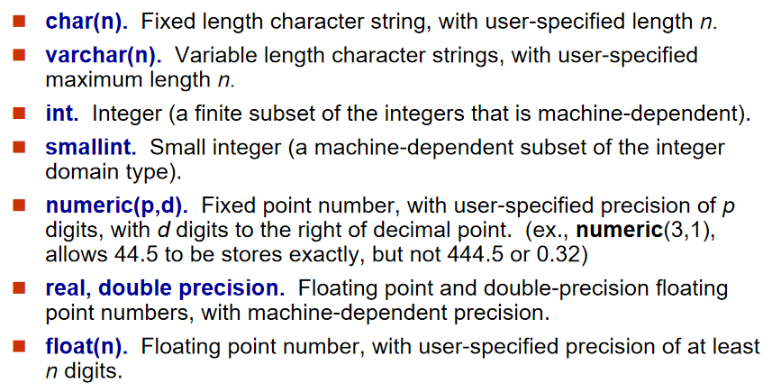

#      SQL 查询语言概览

SQL：结构化查询语言（Structured Query Language），是用于管理关系型数据库并对其中的数据进行一系列操作（包括数据插入、查询、修改、删除等）的一种语言。

- SQL 语言**不区分大小写**（关键字如 SELECT、FROM 可小写），但数据库表名、列名的大小写敏感性依赖于数据库和操作系统（如 Linux 下的 MySQL 区分表名大小写，Windows 下不区分）。
- SQL 是关系型数据库的 "通用语言"，所有主流关系型数据库（MySQL、Oracle、SQL Server 等）都支持 SQL，只是存在少量语法差异（称为 "方言"），核心功能完全一致。

### SQL 语言的组成部分

1. 数据定义语言（DDL）：用于定义和修改**数据库结构**，提供创建、修改、删除关系模式、索引、视图的命令。
2. 数据操纵语言（DML）：用于**查询和更新数据**，提供从数据库中查询数据，以及插入数据、修改数据、删除数据的命令。
3. 数据控制语言（DCL）：用于创建**用户角色和权限**，以及控制数据库访问。
4. 事务控制：用于管理**事务处理**，定义事务开始和结束，以确保在错误发生时事务可以完成或者回滚。
5. 存储过程和函数：是**一段 SQL 语句的集合**。通过编写存储过程和函数，可以重复地执行一段操作数据库的 SQL 语句集合。
6. 触发器：是与表相关的**特殊的存储过程**，在满足特定条件时，触发器中的 SQL 语句会被触发执行。

| 组成部分        | 核心命令                          | 应用场景       | 示例                                                         |
| --------------- | --------------------------------- | -------------- | ------------------------------------------------------------ |
| DDL             | CREATE、ALTER、DROP               | 数据库结构设计 | 创建学生表：CREATE TABLE student (ID char (5), name varchar (20)); |
| DML             | SELECT、INSERT、UPDATE、DELETE    | 日常数据操作   | 查询学生姓名：SELECT name FROM student;                      |
| DCL             | GRANT、REVOKE                     | 权限管理       | 授予用户查询权限：GRANT SELECT ON student TO user1;          |
| 事务控制        | COMMIT、ROLLBACK                  | 数据一致性保障 | 转账操作：执行扣款后若转账失败，ROLLBACK 撤销扣款            |
| 存储过程 / 函数 | CREATE PROCEDURE、CREATE FUNCTION | 复杂逻辑复用   | 编写计算学生平均分的函数，供多个查询调用                     |
| 触发器          | CREATE TRIGGER                    | 自动响应事件   | 学生表插入新记录时，自动在日志表中添加操作记录               |


# SQL 数据定义语言（DDL）

**数据定义语言（DDL）** 的核心作用是 “定义和管理数据库的结构”，而非操作表中的具体数据。

在 SQL 中，“关系（Relation）” 就是我们日常说的 “表（Table）”，是数据库中存储数据的基本结构。DDL 通过`CREATE`（创建）、`ALTER`（修改）、`DROP`（删除）等命令，为这些表 “制定规则”—— 包括表的结构、数据的格式、数据的有效性约束，以及表的存储和访问权限等，确保数据库结构合法、数据可靠、访问安全。

- 每个关系的模式：表中包含哪些属性（列）、每个属性的名称，以及属性之间的逻辑关联。

- 每个属性关联的值域：“值域”（Domain）指**某个属性允许存储的数据类型和范围**

- 完整性约束：确保表中数据**准确、一致、合法**的 “规则”，防止无效或矛盾的数据存入数据库

  - 每个关系要维护的索引集：索引（Index）是为了**加速查询**而创建的 “数据结构”，相当于给表的某个属性 “建目录”
  - 每个关系的安全和授权信息：控制 “谁能访问表、能做什么操作”
  - 每个关系在磁盘上的物理存储结构：指定表在磁盘上的 “存储方式”

  ```sql
  -- 先创建被引用的“部门表”（主键dept_name）
  CREATE TABLE department (
      dept_name VARCHAR(20) PRIMARY KEY,  -- 部门名称唯一，非空
      building VARCHAR(20),
      budget NUMERIC(10,2)
  );
  
  -- 创建“教师表”，添加完整的完整性约束
  CREATE TABLE instructor (
      ID CHAR(5) PRIMARY KEY,  -- 主键：教师编号唯一、非空
      name VARCHAR(20) NOT NULL,-- 非空：教师必须有姓名
      dept_name VARCHAR(20),
      salary NUMERIC(8,2) CHECK (salary > 0),-- 检查：薪资必须为正数
      -- 外键：关联部门表，确保教师的部门存在
      FOREIGN KEY (dept_name) REFERENCES department(dept_name)
  );
  
  -- 给instructor表的ID属性建唯一索引（主键默认会自动建索引）
  CREATE UNIQUE INDEX idx_instructor_id ON instructor(ID);
  -- 给dept_name建普通索引（加速按部门查询教师）
  CREATE INDEX idx_instructor_dept ON instructor(dept_name);
  
  -- 授予用户“student_user”查询course表的权限
  GRANT SELECT ON course TO student_user;
  -- 授予用户“teacher_user”查询和修改instructor表的权限
  GRANT SELECT, UPDATE ON instructor TO teacher_user;
  -- 回收“student_user”修改student表的权限（若之前授予过）
  REVOKE UPDATE ON student FROM student_user;
  
  -- 创建表空间（指定磁盘路径）
  CREATE TABLESPACE ts_instructor DATAFILE 'D:\oracle\data\instructor.dbf' SIZE 100M;
  -- 在指定表空间创建instructor表（物理存储在D盘的instructor.dbf文件中）
  CREATE TABLE instructor (
      ID CHAR(5) PRIMARY KEY,
      name VARCHAR(20) NOT NULL
  ) TABLESPACE ts_instructor;
  ```

  

## SQL 核心数据类型




| 数据类型           | 中文名称           | 核心定义与参数说明                                           | 存储特点 / 精度                        | 适用场景                                     | 关键优势                              | 易错点与注意事项                                             |
| ------------------ | ------------------ | ------------------------------------------------------------ | -------------------------------------- | -------------------------------------------- | ------------------------------------- | ------------------------------------------------------------ |
| `char(n)`          | 固定长度字符串     | `n`为用户指定固定长度（正整数），不足`n`时补空格，查询时部分数据库自动去尾空格 | 占用`n`字节，长度固定                  | 身份证号、学号、性别等长度固定的文本         | 查询效率高，存储结构稳定              | 1. 存储变长文本会浪费空间；2. 不同数据库对尾空格处理不同（MySQL 去、Oracle 留）；3. 不可存超`n`长度的文本 |
| `varchar(n)`       | 可变长度字符串     | `n`为用户指定最大长度（正整数），实际长度由数据决定，仅存 “内容 + 1 字节长度标识” | 占用 “实际长度 + 1 字节”，长度可变     | 姓名、地址、商品描述等长度不固定的文本       | 节省存储空间，适配长度差异大的场景    | 1. 查询效率略低于`char(n)`（差异极小）；2. 不可存超`n`长度的文本；3. 避免盲目设`n=255`浪费资源 |
| `int`              | 标准整数           | 机器相关有限子集，主流数据库为 4 字节，取值范围`-2147483648~2147483647`（±21 亿） | 4 字节，取值范围大                     | 订单号、用户数、年龄等大范围整数             | 通用性强，数据库优化优先，无溢出风险  | 1. 小范围整数用`int`浪费空间；2. 超范围存储会报 “数值溢出” 错误 |
| `smallint`         | 小整数             | 机器相关有限子集，主流数据库为 2 字节，取值范围`-32768~32767`（±**3.2 万**） | 2 字节，取值范围小                     | 班级人数、分数、月份等小范围整数             | 节省存储空间，大表优化效果显著        | 1. 超范围存储会报 “数值溢出”；2. 不适合存储超过 3.2 万的数值（如商品库存 10 万） |
| `numeric(p,d)`     | 定点数（精确小数） | `p`= 总位数（整数 + 小数），`d`= 小数位数（0≤d≤p），完全精确存储，无误差 | 精度完全可控，无误差                   | 金额、税率、精确分数等需精确计算的场景       | 计算无精度丢失，数值范围明确          | 1. 超`p`/`d`范围无法存储（如`numeric(3,1)`不可存`444.5`）；2. 计算性能略低于浮点数 |
| `real precision`   | 单精度浮点数       | 机器依赖精度，主流为 4 字节，有效数字约 6~7 位，近似存储     | 4 字节，近似精度（6~7 位有效数字）     | 温度、重量等允许微小误差的场景               | 存储紧凑，计算效率高                  | 1. 不可用于金额、税率等精确计算（有精度丢失）；2. 极端值可能溢出为`INF` |
| `double precision` | 双精度浮点数       | 机器依赖精度，主流为 8 字节，有效数字约 15~17 位，近似存储   | 8 字节，近似精度高（15~17 位有效数字） | 地理坐标、高精度实验数据等需高近似精度的场景 | 精度高于`real`，适配高精度近似需求    | 1. 仍有微小精度误差，不可用于精确计算；2. 存储占用比`real`多一倍 |
| `float(n)`         | 自定义精度浮点数   | `n`= 至少需要的有效数字位数，`n≤24`按`real`（4 字节）存储，`n≥25`按`double`（8 字节）存储 | 存储字节随`n`动态适配，近似精度        | 需动态调整精度的近似数据（如传感器数据）     | 精度灵活，无需手动选择`real`/`double` | 1. 本质是近似存储，有精度误差；2. `n`仅表示 “最小精度”，实际精度由机器决定 |

> [!tip]
>
> **VARCHAR vs CHAR**
>
> `CHAR` 和 `VARCHAR` 类型都可以存储比较短的字符串。
>
>  CHAR类型
>
> - `CHAR(M)` 类型一般需要预先定义字符串长度。如果不指定(M)，则表示长度默认是1个字符。
> - 如果保存时，数据的实际长度比 `CHAR` 类型声明的长度小，则会在**右侧填充空格**以达到指定的长度；如果数据的实际长度比 `CHAR` 类型声明的长度大，则会截取前 `M` 个字符。当 `MySQL` 检索 `CHAR` 类型的数据时，`CHAR` 类型的字段会去除尾部的空格。
> - 🔔 定义 `CHAR` 类型字段时，声明的字段长度即为 `CHAR` 类型字段所占的存储空间的字节数。
> - 🌋 固定长度；浪费存储空间；**效率高**；适用于存储不大，速度要求高的情况
>
> VARCHAR类型
>
> - `VARCHAR(M)` 定义时， 必须指定长度 `M`，否则报错。
> - `MySQL4.0` 版本以下，`varchar(20)`：指的是 20 字节，如果存放 `UTF8` 汉字时，只能存 6 个（每个汉字 3 字节）；`MySQL5.0`版本以上，`varchar(20)`：指的是 20 字符。
> - 🔔 检索 `VARCHAR` 类型的字段数据时，会保留数据尾部的空格。`VARCHAR` 类型的字段所占用的存储空间为字符串实际长度加 1 个字节。
> - 🌋 可变长度；**节省存储空间**；效率低；适合非 `CHAR` 的情况
>
> **CLOB vs BLOB**
>
> - `CLOB` 类型
>   - 将字符大对象 (Character Large Object) 存储为数据库表某一行中的一个列值，使用 `CHAR` 来保存数据
> - `BLOB` 类型
>   - 可以存储一个二进制的大对象(Binary Large Object)，比如 图片 、音频和视频等
> - 当查询结果是个大对象时，返回的不是对象本身，而是一个定位器


## `CREATE TABLE`

**SQL 关系（表）通过`CREATE TABLE`命令定义**，语法结构如下：

```sql
CREATE TABLE r (
    A1 D1,          -- 属性1 + 数据类型
    A2 D2,          -- 属性2 + 数据类型
    ...,
    An Dn,          -- 属性n + 数据类型
    integrity-constraint1,  -- 完整性约束1（可选）
    ...,
    integrity-constraintk   -- 完整性约束k（可选）
);
```

- `r`：**关系名（表名）**，需符合数据库命名规范（如不能含特殊字符、不与关键字冲突），示例中`instructor`（教师表）、`student`（学生表）均为关系名。
- `Ai`：**属性名（列名）**，对应表中的一列，需唯一且语义清晰，示例中`ID`（编号）、`name`（姓名）、`dept_name`（所属部门）均为属性名。
- `Di`：**属性的数据类型**，即该列允许存储的数据格式（如`char(5)`、`numeric(8,2)`），需结合属性语义选择（如 “薪资” 用`numeric`确保精确）。
- `integrity-constraint`：**完整性约束**（可选），是保障数据有效性的规则（如 “主键唯一”“属性非空”），教材后续重点补充了`not null`、`primary key`、`foreign key`三种核心约束。

| 约束关键词                               | 名称              |
| ---------------------------------------- | ----------------- |
| `primary key (A1, ..., An)`              | 主键（唯一+非空） |
| `foreign key (Am, ..., An) references r` | 外键              |
| `UNIQUE`                                 | 唯一约束          |
| `NOT NULL`                               | 非空约束          |
| `CHECK(p)`                               | 谓词约束          |
| `INDEX`                                  | 普通索引          |


# SQL 表数据与结构修改

 4 类核心操作（`Insert`插入数据、`Delete`删除数据、`Drop Table`删除表、`Alter Table`修改表结构）

## `Insert`：向表中插入新数据

`Insert`是**数据操纵语言（DML）** 命令，作用是向已存在的表中**添加新元组（记录）**，是数据库 “写入数据” 的基础操作。

```sql
-- 语法：INSERT INTO 表名 VALUES (值1, 值2, ..., 值n);
INSERT INTO instructor VALUES ('10211', 'Smith', 'Biology', 66000);
```

- **适用场景**：向表中添加单条或多条新记录（如新增教师、学生、订单信息）。

- 部分插入

  ```sql
  -- 语法：INSERT INTO 表名 (属性1, 属性2, ..., 属性k) VALUES (值1, 值2, ..., 值k);
  INSERT INTO instructor (ID, name, salary) VALUES ('10212', 'Jones', 72000);
  ```
  
- 查询结果插入多个元组

  ```sql
  insert into student
  select ID, name, dept_name, 0 from instructor;  -- 用select结果作为插入数据
  ```

  

  

> [!tip]
>
> - ❶ 顺序 / 数量不匹配：若表属性顺序是`ID→name→dept_name→salary`，却按`ID→salary→name→dept_name`插入（如`VALUES ('10211', 66000, 'Smith', 'Biology')`），会导致数据错位（`salary`存为字符串`'Smith'`，触发数据类型错误）。
> - ❷ 违反完整性约束：
>   - 插入`name`为`NULL`（如`VALUES ('10211', NULL, 'Biology', 66000)`）：触发`not null`约束，插入失败；
>   - 插入`ID`重复（如已有`ID=10211`）：触发`primary key`约束，插入失败；
>   - 插入`dept_name`不存在（如`'NoSuchDept'`）：触发`foreign key`约束，插入失败。
> - ❸ **字符串未加单引号**：如`VALUES (10211, Smith, Biology, 66000)`（`ID`、`name`、`dept_name`是字符串，需加`' '`），会被识别为 “列名”，触发 “未知列” 错误。


## Delete：从表中删除数据

`Delete`也是**DML 命令**，作用是从表中**删除符合条件的元组（记录）**，仅删除数据，**保留表结构**（与`Drop Table`本质不同）。

```sql
-- 语法1：删除所有记录（无WHERE条件）
DELETE FROM student;  -- 删除student表中所有学生记录，表结构仍在

-- 语法2：删除符合条件的记录（带WHERE条件）
DELETE FROM instructor WHERE dept_name = 'Biology';  -- 仅删除生物系的教师记录
```

- **适用场景**：清理无效数据（如删除过期订单）、批量删除特定记录（如删除某部门员工）。  

> [!tip] 
>
> **外键约束阻止删除**：若`student`表的`ID`被`takes`表（选课表）外键引用（`takes.ID`关联`student.ID`），删除`student`表中某`ID`时（如`DELETE FROM student WHERE ID='U001'`），若`takes`表有该`ID`的选课记录，会触发外键约束报错（需先删除`takes`表中的关联记录，或配置 “级联删除”）。


## Drop Table：彻底删除表

`Drop Table`是**数据定义语言（DDL）** 命令，作用是**彻底删除表的 “结构 + 所有数据”**，不可逆（删除后表完全消失，无法恢复）。

```sql
-- 语法：DROP TABLE 表名;
DROP TABLE r;  -- 删除表r，包括表结构、数据、约束、索引
```

- **适用场景**：删除废弃的表（如业务下线后，删除不再使用的 “旧订单表”）。

> [!tip]
>
> - ❶ 混淆`Delete`与`Drop`：误将`DROP TABLE student`当作 “删除数据”，导致表结构丢失（需重新创建表并恢复数据，成本极高），实际开发中`Drop Table`需经过严格审批。
> - ❷ 依赖表阻止删除：若`instructor`表外键关联`department`表（`instructor.dept_name`引用`department.dept_name`），直接`DROP TABLE department`会报错（因`instructor`表依赖其结构），需先删除`instructor`表或解除外键约束。
> - ❸ 无备份删除：`Drop Table`不可逆，删除前必须备份表数据（如用`CREATE TABLE 备份表 AS SELECT * FROM 原表`创建备份）。


## Alter Table：修改表结构

`Alter Table`是**DDL 命令**，作用是**修改已存在表的结构**（如添加 / 删除属性、修改数据类型、添加约束），教材重点介绍了 “添加属性” 和 “删除属性” 两种基础用法。

用法 1：添加属性（`Alter Table Add`）

```sql
-- 语法：ALTER TABLE 表名 ADD 新属性名 数据类型;
ALTER TABLE instructor ADD age int;  -- 给instructor表添加“age”属性（int类型）
```

- ❶ 现有记录的新属性值：**自动设为`NULL`**（因此**新属性不能直接加`not null`约束**，如`ALTER TABLE instructor ADD age int not null`会报错 —— 现有记录的`age`为`NULL`，违反`not null`）。添加属性时指定默认值（如`ALTER TABLE instructor ADD age int DEFAULT 0 not null`，现有记录的`age`设为`0`，符合`not null`）。
- ❷ 属性名唯一性：新属性名不能与表中已有属性重名（如`ALTER TABLE instructor ADD ID int`会报错，因`ID`已存在）。
- ❸ 数据类型兼容性：新属性的数据类型需符合数据库规则（如`age`用`int`合理，用`varchar(10)`存储年龄虽可行，但不符合语义）。

用法 2：删除属性（`Alter Table Drop`）

```sql
-- 语法：ALTER TABLE 表名 DROP 待删除属性名;
ALTER TABLE instructor DROP age;  -- 从instructor表中删除“age”属性
```

- ❶ 数据丢失：删除属性会**永久删除该属性的所有数据**（不可逆），如删除`age`后，所有教师的年龄数据消失，需谨慎。
- ❷ 数据库兼容性差：教材明确指出 “多数数据库不支持删除属性”（如 MySQL 默认禁用，Oracle 需通过 “重新创建表迁移数据” 实现），因删除属性会破坏表的存储结构、影响索引和外键，实际开发中极少使用。
  - 替代方案：若某属性不再使用，建议标记为 “废弃”（如`age`改名为`age_deprecated`），而非删除属性。

 扩展用法：修改属性（`Alter Table Modify`，教材未提但常用）

除了添加 / 删除属性，`Alter Table`还可修改现有属性的数据类型或约束（语法因数据库略有差异，以 MySQL 为例）：

```sql
-- 修改数据类型：将age从int改为smallint
ALTER TABLE instructor MODIFY age smallint;

-- 添加约束：给age加not null和默认值
ALTER TABLE instructor MODIFY age smallint DEFAULT 0 not null;
```

- 注意：修改数据类型时，需确保现有数据可兼容（如`age`从`smallint`改为`int`可行，从`int`改为`char(5)`需确保所有`age`值可转为字符串）。

- ❶ 添加`not null`属性无默认值：如`ALTER TABLE instructor ADD age int not null`，因现有记录`age`为`NULL`，触发`not null`约束报错，正确做法是加默认值（`DEFAULT 0`）。
- ❷ 删除关键属性：如删除`instructor`表的`ID`属性（主键），会破坏表的唯一标识，导致后续无法定位记录，绝对禁止。
- ❸ 大表修改性能问题：对百万级记录的大表执行`Alter Table`（如添加属性），会锁表并消耗大量资源（需扫描所有记录设置`NULL`），建议在业务低峰期执行。

## `Updating`:更新表操作

更新操作用于修改表中已有元组的值，基本语法为 `update 表名 set 列 = 新值 where 条件;`。

- 分条件调整教师薪资

  ```sql
  -- 薪资超10万的涨3%
  update instructor set salary = salary * 1.03 where salary > 100000;
  -- 其余涨5%（注意执行顺序，避免重复更新）
  update instructor set salary = salary * 1.05 where salary <= 100000;
  ```

- 用一条语句实现上述薪资调整

  ```sql
  update instructor
  set salary = case
    when salary <= 100000 then salary * 1.05  -- 条件1：低薪资涨5%
    else salary * 1.03  -- 条件2：高薪资涨3%
  end;
  ```
  
- **更新学生的总学分（根据已修课程计算）**：

  ```sql
  update student S
  set tot_cred = (
    select sum(credits)
    from takes, course
    where takes.course_id = course.course_id 
      and S.ID = takes.ID  -- 关联当前学生
      and takes.grade <> 'F'  -- 排除不及格课程
      and takes.grade is not null  -- 排除无成绩课程
  );
  ```
  
  可优化为 “未选课学生总学分为 0”：

  ```sql
  set tot_cred = case
    when sum(credits) is not null then sum(credits)
    else 0  -- 无课程记录时设为0
  end
  ```


# SQL 基础查询


## SQL 基础查询结构：整体框架与核心定义

**典型的 SQL 查询由 `SELECT`、`FROM`、`WHERE` 三个核心子句组成**，语法框架如下：

```sql
SELECT A1, A2, ..., An  -- 选择要返回的属性（列）
FROM r1, r2, ..., rm    -- 指定查询涉及的关系（表）
WHERE P                 -- 筛选符合条件的元组（行）

SELECT [DISTINCT] 列名/表达式 [AS 别名]  -- 投影：选哪些列（去重/重命名）
FROM 表1, 表2...                        -- 笛卡尔积：从哪些表查
WHERE 条件（AND/OR/NOT）                -- 选择：留哪些行
ORDER BY 列名 [ASC/DESC]                -- 排序：最后执行，NULL 排最前
```

各组成部分的核心定义（教材重点强调）：

| 组成部分      | 符号表示      | 核心含义                                                     | 关系代数对应操作                 |
| ------------- | ------------- | ------------------------------------------------------------ | -------------------------------- |
| `SELECT` 子句 | `A1,A2,...An` | 列出查询结果中需要包含的**属性（列）**，如教师姓名、部门名称等，可理解为 “选哪些列” | 投影（Projection，Π）            |
| `FROM` 子句   | `r1,r2,...rm` | 列出查询涉及的**关系（表）**，如教师表（`instructor`）、课程表（`course`）等，可理解为 “从哪些表查” | 笛卡尔积（Cartesian Product，×） |
| `WHERE` 子句  | `P`           | 定义**谓词（条件）**，筛选出满足条件的元组（行），可理解为 “留哪些行” | 选择（Selection，σ）             |
| 查询结果      | -             | 最终返回的是一个**新关系（表）**，结构由 `SELECT` 子句定义，数据由 `FROM` 和 `WHERE` 子句共同筛选 |                                  |

- 实际数据库执行顺序是：`FROM；WHERE；SELECT`
  1. **`FROM` 子句**：先确定查询涉及的表，计算这些表的笛卡尔积（生成所有可能的行组合）；
  2. **`WHERE` 子句**：对笛卡尔积的结果进行筛选，保留满足条件的元组；
  3. **`SELECT` 子句**：对筛选后的元组进行投影，保留需要的属性（列），生成最终结果。

---

## `SELECT` 子句：选择要返回的属性（投影操作）

`SELECT` 子句是查询的 “结果定义器”，决定最终返回的表包含哪些列

### 基础用法：指定属性（单属性 / 多属性）

从 `FROM` 子句指定的表中，**选择需要的属性**，对应关系代数的 “投影操作”（仅保留指定列，删除其他列）。

- 示例 1：查询所有教师的姓名（单属性）

  ```sql
  SELECT name  -- 仅返回“name”列
  FROM instructor;
  ```

  - 执行效果：返回一个仅含 “姓名” 列的表，行数与 `instructor` 表一致（含重复姓名，如两个 “Smith”）。

- 示例 2：查询教师的编号、姓名和薪资（多属性）

  ```sql
  SELECT ID, name, salary  -- 返回“ID”“name”“salary”三列
  FROM instructor;
  ```

  - 执行效果：返回三列的表，列顺序与 `SELECT` 子句中属性的顺序一致（先 `ID`，再 `name`，最后 `salary`）。

易错点：**属性名大小写不敏感**

### 去重操作：`DISTINCT` 与 `ALL`

SQL 允许表中存在重复元组（行），**查询结果默认也会保留重复**（如多个教师属于同一部门，查询 `dept_name` 会返回重复的部门名称）。`DISTINCT` 和 `ALL` 用于控制是否保留重复。

| 关键字     | 作用                                     | 语法示例（查询教师部门，控制重复）                           | 执行效果                                                     |
| ---------- | ---------------------------------------- | ------------------------------------------------------------ | ------------------------------------------------------------ |
| `DISTINCT` | **删除重复结果**（仅保留唯一的属性组合） | `SELECT DISTINCT dept_name FROM instructor;`                 | 若有 5 个教师属于 “Comp. Sci.”，仅返回 1 次 “Comp. Sci.”，无重复。 |
| `ALL`      | **保留重复结果**（默认，可省略）         | `SELECT ALL dept_name FROM instructor;` 或 `SELECT dept_name FROM instructor;` | 若有 5 个教师属于 “Comp. Sci.”，返回 5 次 “Comp. Sci.”，保留所有重复。 |

### 通配符：`*` 表示 “所有属性”

当需要返回表中**所有属性**时，无需逐一列出，用 `*` 代替即可，简化语法。

```sql
SELECT *  -- 返回instructor表的所有列（ID、name、dept_name、salary）
FROM instructor;
```

- 执行效果：返回的表结构与 `instructor` 表完全一致

### 字面量属性：返回常量值（无 / 有 `FROM` 子句）

“字面量” 指固定的常量值（如字符串 `'437'`、数字 `100`），`SELECT` 子句可将字面量作为 “虚拟属性” 返回，无需依赖表中的数据，分为 “无 `FROM` 子句” 和 “有 `FROM` 子句” 两种情况。

注意字符串需要使用单引号`' '`括起来

| 情况           | 语法示例                      | 执行效果                                                     | 适用场景                                 |
| -------------- | ----------------------------- | ------------------------------------------------------------ | ---------------------------------------- |
| 无 `FROM` 子句 | `SELECT '437' AS FOO;`        | 返回一个表：1 列（列名 `FOO`），1 行（值 `'437'`）           | 生成单个常量值（如测试查询语法）         |
| 有 `FROM` 子句 | `SELECT 'A' FROM instructor;` | 返回一个表：1 列（默认列名 `'A'`），`N` 行（`N` 是 `instructor` 表的行数），每行值均为 `'A'` | 给查询结果添加固定标识（如区分数据来源） |

###  算术表达式：对属性进行计算

`SELECT` 子句支持对属性或常量进行**算术运算**（`+`、`-`、`*`、`/`），生成新的计算列（如将年薪转为月薪、计算折扣价等）

- 示例 1：计算教师的月薪（年薪 `salary` 除以 12）

  ```sql
  SELECT ID, name, salary/12  -- 新增“salary/12”列，值为月薪
  FROM instructor;
  ```

  - 执行效果：返回的表含 `ID`、`name`、`salary/12` 三列，`salary/12` 列的值为对应教师薪资除以 12（如薪资 66000 对应月薪 5500.00）。

- 示例 2：给计算列重命名（`AS` 子句）上述示例中，计算列的默认名是 `salary/12`（不直观），可用 `AS` 子句指定别名：

  ```sql
  SELECT ID, name, salary/12 AS monthly_salary  -- 计算列名改为“monthly_salary”（直观）
  FROM instructor;
  ```

  - 注意：**`AS` 子句可省略**（如 `salary/12 monthly_salary`），但建议保留，提高可读性。

若算术表达式中涉及 `NULL`，结果会自动设为 `NULL`（如某教师薪资为 `NULL`，则 `salary/12` 也为 `NULL`），需用 `COALESCE` 函数处理（如 `COALESCE(salary, 0)/12`，将 `NULL` 薪资视为 0）。

## `WHERE` 子句：筛选符合条件的元组（选择操作）

### 基础用法：简单条件筛选

通过 “属性与值的比较” 筛选元组，支持的比较运算符包括：`=`（等于）、`<>`（不等于）、`>`（大于）、`<`（小于）、`>=`（大于等于）、`<=`（小于等于）。

- 示例：查询计算机系（Comp. Sci.）的教师姓名

  ```sql
  SELECT name
  FROM instructor
  WHERE dept_name = 'Comp. Sci.';  -- 条件：部门名称等于“Comp. Sci.”
  ```

  - 执行逻辑：先获取 `instructor` 表所有元组（`FROM` 子句），再筛选出 `dept_name` 为 `'Comp. Sci.'` 的元组（`WHERE` 子句），最后保留 `name` 列（`SELECT` 子句）。

- 字符串值必须用**单引号**包裹（如 `'Comp. Sci.'`），若用双引号（如 `"Comp. Sci."`）或无引号（如 `Comp. Sci.`），会被识别为 “属性名”，触发 “未知列” 错误；
- 数值类型（如 `salary`、`age`）无需加引号（如 `salary > 80000`，不能写成 `salary > '80000'`，虽部分数据库会自动转换，但不推荐）。

### 组合条件筛选（逻辑连接符）

当需要多个筛选条件时，用逻辑连接符 `AND`、`OR`、`NOT` 组合，实现复杂筛选逻辑。

| 逻辑连接符 | 作用                 | 示例（查询计算机系薪资超 8 万的教师姓名）           | 逻辑规则                                                     |
| ---------- | -------------------- | --------------------------------------------------- | ------------------------------------------------------------ |
| `AND`      | 同时满足多个条件     | `WHERE dept_name = 'Comp. Sci.' AND salary > 80000` | 只有两个条件都为 “真”，结果才为 “真”（如部门是 Comp. Sci. **且** 薪资 > 80000） |
| `OR`       | 满足任意一个条件     | `WHERE dept_name = 'Comp. Sci.' OR salary > 80000`  | 只要有一个条件为 “真”，结果就为 “真”（如部门是 Comp. Sci. **或** 薪资 > 80000） |
| `NOT`      | 否定某个条件（取反） | `WHERE NOT dept_name = 'Comp. Sci.'`                | 条件为 “真” 时结果为 “假”，条件为 “假” 时结果为 “真”（如部门**不是**Comp. Sci.） |


逻辑连接符的优先级：**`NOT` > `AND` > `OR`**，若需要调整顺序，用括号 `()` 包裹。例如：

```sql
-- 需求：查询“计算机系且薪资>8万”或“生物系且薪资>7万”的教师姓名
SELECT name
FROM instructor
WHERE (dept_name = 'Comp. Sci.' AND salary > 80000) 
   OR (dept_name = 'Biology' AND salary > 70000);
```

- 若省略括号，会按默认优先级执行（先 `AND` 后 `OR`），结果一致；但复杂条件下建议保留括号，避免逻辑错误。


### 扩展用法：对算术表达式结果筛选

`WHERE` 子句的条件不仅可以针对表的原始属性，还可以针对 `SELECT` 子句中定义的算术表达式结果（需注意执行顺序：`WHERE` 执行时 `SELECT` 尚未执行，因此**不能直接用计算列的别名**，需重复写算术表达式）。

- 需求：查询月薪超 7000 的教师姓名（月薪 = 年薪 / 12）

  ```sql
  SELECT name, salary/12 AS monthly_salary
  FROM instructor
  WHERE salary/12 > 7000;  -- 条件：对算术表达式“salary/12”筛选，不能写“monthly_salary > 7000”
  ```

  - 原因：`WHERE` 子句执行时，`SELECT` 子句的 `monthly_salary` 别名尚未生成，因此必须重复写 `salary/12`；若想使用别名，需用子查询或 `HAVING` 子句（后续章节讲解）。

## `FROM` 子句：指定查询涉及的关系（笛卡尔积操作）

`FROM` 子句是查询的 “数据来源器”，指定查询涉及的表，并计算这些表的笛卡尔积

### 基础用法：单表查询

当查询仅涉及一个表时，`FROM` 子句仅需指定该表，此时无笛卡尔积计算（或视为 “表与自身的笛卡尔积”，但结果与原表一致）。

- 查询所有教师的编号和姓名（仅涉及instructor

  ```sql
  SELECT ID, name
  FROM instructor;  -- 单表，无笛卡尔积计算
  ```

### 多表查询（笛卡尔积）

#### 核心定义

当 `FROM` 子句指定多个表时，数据库会计算这些表的**笛卡尔积**（Cartesian Product）：将第一个表的每一行与第二个表的每一行组合，生成所有可能的行组合，行数 = 表 1 行数 × 表 2 行数 ×...× 表 m 行数。

- `instructor` 与 `teaches` 表的笛卡尔积

```sql
SELECT *  -- 返回两个表的所有列
FROM instructor, teaches;  -- 计算instructor × teaches的笛卡尔积
```


# SQL 重命名操作（AS 子句）

**SQL 通过 `AS` 子句实现 “关系（表）” 或 “属性（列）” 的重命名**，本质是给表 / 列起一个 “临时别名”，仅在当前查询中生效（不修改数据库中表 / 列的实际名称）

| 重命名对象 | 基础语法         | 简化语法（省略 AS，可选） | 核心说明                                                     |
| ---------- | ---------------- | ------------------------- | ------------------------------------------------------------ |
| 关系（表） | `表名 AS 别名`   | `表名 别名`               | 给表起临时别名，后续查询中可用别名代替原表名（如 `instructor AS T` 可简写为 `instructor T`） |
| 属性（列） | `属性名 AS 别名` | `属性名 别名`             | 给列起临时别名，仅影响查询结果的列名（如 `salary/12 AS monthly_sal` 可简写为 `salary/12 monthly_sal`） |

```sql
-- 完整语法（带 AS）
SELECT DISTINCT T.name  -- T是instructor表的别名，代表“薪资更高的教师”
FROM instructor AS T, instructor AS S  -- 同一表instructor用两个别名：T和S
WHERE T.salary > S.salary  -- T的薪资 > S的薪资
  AND S.dept_name = 'Comp. Sci.';  -- S是“计算机系的教师”

-- 简化语法（省略 AS）
SELECT DISTINCT T.name
FROM instructor T, instructor S  -- 省略AS，直接写别名T、S
WHERE T.salary > S.salary 
  AND S.dept_name = 'Comp. Sci.';
```


# SQL 字符串匹配（LIKE 运算符）

**QL 提供 `LIKE` 运算符用于字符型数据的 “模糊匹配”**，它不要求字符串完全相等，而是通过 “模式（Pattern）” 和 “通配符” 定义匹配规则，实现 “包含某子串”“以某字符开头 / 结尾”“固定长度字符串” 等灵活查询需求。

```sql
SELECT 列名
FROM 表名
WHERE 列名 LIKE '_100\%' ESCAPE '\';
```

- `字符型列名`：必须是字符串类型（如 `char(n)`、`varchar(n)`），如教师姓名 `name`、部门名称 `dept_name`；
- `模式字符串`：由 “普通字符” 和 “通配符” 组成，用于定义匹配规则（必须用单引号 `' '` 包裹）；
- 匹配结果：若列值符合模式规则，则返回该记录；否则排除。
- **默认情况下，`LIKE` 运算符的模式匹配是 “大小写敏感” 的**：WHERE LOWER(name) LIKE LOWER('%Intro%');  -- LOWER() 函数：将字符串转为小写可以实现大小写不敏感

`%` 是 “多字符通配符”，可匹配 **0 个、1 个或多个任意字符组成的子串**（相当于 “任意内容”），是最常用的通配符，适用于 “包含某子串”“以某字符开头 / 结尾” 等场景。

`_` 是 “单字符通配符”，仅能匹配 **1 个任意字符**（不能匹配 0 个或多个），适用于 “固定长度字符串”“特定位置字符不确定” 的场景。

`ESCAPE '\'`：声明 “反斜杠（\）是转义字符”；


# SQL 排序（ORDER BY）

`ORDER BY` 是 SQL 中用于**对查询结果集按指定属性排序**的子句，它不影响数据的存储方式，仅改变查询结果的显示顺序，是 “美化结果、便于阅读” 的核心工具。

“按字母顺序列出所有教师的姓名（去重）”，对应的 SQL 语句如下：

```sql
SELECT DISTINCT name  -- DISTINCT：去重（避免重复姓名）
FROM instructor
ORDER BY name;  -- 按 name 属性排序，默认升序（A→Z，0→9）

-- 升序（默认，可省略 ASC）
ORDER BY 属性名 ASC;
-- 降序（必须显式写 DESC）
ORDER BY 属性名 DESC;
```

- **默认排序方向**：`ORDER BY 属性名` 未指定方向时，默认按 **升序（ASC，Ascending）** 排序（如字母从 A 到 Z，数字从 0 到 9）；可通过 `ASC` 或 `DESC` 明确指定排序方向
- **`DISTINCT` 与 `ORDER BY` 的配合**：`DISTINCT` 先去重，`ORDER BY` 再对去重后的结果排序（若先排序再去重，结果一致，但数据库内部执行顺序通常是 “去重→排序”）；
- **适用数据类型**：`ORDER BY` 支持字符串（按字符编码排序，如 ASCII 码）、数值（按大小排序）、日期（按时间先后排序）等类型。

### 多属性排序

当需要按 “多个属性分层排序” 时（如 “先按部门升序，同一部门内按姓名升序”），可在 `ORDER BY` 后列出多个属性，属性间用逗号分隔，排序优先级为 “先第一个属性，再第二个属性，以此类推”。

可对不同属性指定不同方向：

```sql
SELECT dept_name, name, salary
FROM instructor
ORDER BY dept_name ASC, salary DESC;  -- 部门升序，同部门薪资降序
```

`ORDER BY` 位置错误：`ORDER BY` 必须是查询语句的**最后一个子句**（顺序：**`SELECT` → `FROM` → `WHERE` → `GROUP BY` → `HAVING` → `ORDER BY`**

字符串排序的大小写敏感性：与 `LIKE` 类似，默认按字符编码排序（如 ASCII 码中大写字母 <小写字母，“A” < “a”）

`NULL` 值的排序位置：`NULL` 视为 “最小的值”，升序时排在最前面，降序时排在最后面；


# 范围查询（BETWEEN）

`BETWEEN` 是 SQL 中用于**筛选 “属性值在指定范围内” 的元组**的比较运算符，本质是简化 “`>= 下界 AND <= 上界`” 的逻辑，属于 “闭区间范围”（包含下界和上界）。

```sql
SELECT 列名
FROM 表名
WHERE 数值型列名 BETWEEN 下界值 AND 上界值;
```

- **等价逻辑**：`列名 BETWEEN 下界 AND 上界` ≡ `列名 >= 下界 AND 列名 <= 上界`；
- **适用数据类型**：**仅支持数值型**（如 `int`、`numeric`）、日期型（如 `DATE`），不支持字符串型（字符串需用 `LIKE` 匹配，而非 `BETWEEN`）。

反向范围：`NOT BETWEEN`。若需要筛选 “属性值在范围之外” 的元组，可使用 `NOT BETWEEN`，等价于 “`<= 下界 OR >= 上界`”。

# 元组比较（Tuple Comparison）

教材简要提及 “元组比较”，这是 SQL 中对 “多属性组合” 进行比较的高级功能，核心是 “将多个属性视为一个‘元组’，按属性顺序依次比较，直到找到第一个不相等的属性，确定元组的大小关系”。

```sql
SELECT 列名1, 列名2, ...
FROM 表1, 表2, ...
WHERE (表1.属性1, 表1.属性2, ...) 比较运算符 (表2.属性1, 表2.属性2, ...);
```

- 比较逻辑

  设元组`T = (t1, t2, ..., tn)`，元组 `S = (s1, s2, ..., sn)`，比较 `T 运算符 S` 时：

  1. 比如`>`；先比较第一个属性 `t1` 和 `s1`：
     - 若 `t1 > s1`，则 `T > S`；若 `t1 < s1`，则 `T < S`；
     - 若 `t1 = s1`，则比较第二个属性 `t2` 和 `s2`，以此类推；
  2. 若所有属性都相等，则 `T = S`。


# SQL 重复元组（Multiset）与关系代数运算符的多集版本

## 集合（Set）与多集（Multiset）的区别

在理解重复元组之前，需先明确 “集合” 与 “多集” 的本质差异 —— 这是 SQL 处理重复数据的基础：

| 类型             | 核心特征                 | 示例（教师表的 `dept_name` 属性）   | 关系代数默认类型       | SQL 默认类型               |
| ---------------- | ------------------------ | ----------------------------------- | ---------------------- | -------------------------- |
| 集合（Set）      | 元素唯一，无重复         | `{Comp. Sci., Finance, Math}`       | 是（经典关系代数）     | 否（需用 `DISTINCT` 实现） |
| 多集（Multiset） | 元素可重复，保留重复次数 | `{Comp. Sci., Comp. Sci., Finance}` | 否（扩展多集关系代数） | 是（默认保留重复）         |

SQL 中的关系（表）默认是 “多集”—— 即表中允许存在完全相同的元组（行），查询结果也默认保留这些重复元组（除非用 `DISTINCT` 去重）。而经典关系代数中的关系是 “集合”，不允许重复，因此需要扩展出 “多集版本的关系代数运算符”，以匹配 SQL 的重复语义。

### 多集选择（σ_θ(r₁)）：筛选重复元组，保留次数不变

设多集关系 `r₁` 中，元组 `t₁` 出现了 `c₁` 次（`c₁ ≥ 1`），若 `t₁` 满足选择条件 `θ`（即 `t₁` 符合 `WHERE` 子句的筛选逻辑），则在结果集 `σ_θ(r₁)` 中，`t₁` 仍出现 `c₁` 次；若 `t₁` 不满足 `θ`，则结果集中不包含 `t₁`。

“选择运算只筛选‘是否保留元组’，不改变‘保留元组的重复次数’”—— 符合条件的重复元组，多少次进就多少次出；不符合的直接剔除。

### 多集投影（Π_A (r₁)）：投影后重复次数与原元组次数一致

设多集关系 `r₁` 中，元组 `t₁` 出现了 `c₁` 次，对 `t₁` 按属性集 `A` 投影（即保留 `A` 中的属性，删除其他属性），得到投影后的元组 `Π_A(t₁)`。则在结果集 `Π_A(r₁)` 中，`Π_A(t₁)` 的出现次数等于 `t₁` 在 `r₁` 中的出现次数 `c₁`。

“投影运算只‘裁剪元组的属性’，不改变‘元组的重复次数’”—— 原元组有多少次，投影后的元组就有多少次（即使投影后不同原元组变成了相同的投影元组，次数会累加）。

### 多集笛卡尔积（r₁ × r₂）：重复次数相乘

设多集关系 `r₁` 中，元组 `t₁` 出现 `c₁` 次；多集关系 `r₂` 中，元组 `t₂` 出现 `c₂` 次。则在笛卡尔积结果 `r₁ × r₂` 中，组合元组 `(t₁, t₂)`（即 `t₁` 与 `t₂` 拼接成的新元组）的出现次数为 `c₁ × c₂`（`t₁` 的次数乘以 `t₂` 的次数）。

“笛卡尔积的重复次数是‘左表元组次数 × 右表元组次数’”—— 左表某元组出现 `c₁` 次，右表某元组出现 `c₂` 次，它们的组合就会出现 `c₁*c₂` 次。

## SQL 重复语义：查询与多集关系代数的等价性

**SQL 的基础查询（`SELECT A1,A2,...An FROM r1,r2,...rm WHERE P`）等价于 “多集版本的关系代数表达式”**，具体等价关系为：

Π*A*1,*A*2,...,*An*(*σP*(*r*1×*r*2×...×*rm*))即 SQL 查询的执行逻辑（按多集语义）可拆解为 3 步：

1. **多集笛卡尔积**：计算 `FROM` 子句中所有表的笛卡尔积 `r1 × r2 × ... × rm`，重复次数按 “各表元组次数相乘” 计算；
2. **多集选择**：对笛卡尔积结果应用 `WHERE` 子句的条件 `P`，筛选出满足条件的元组，重复次数保留不变；
3. **多集投影**：对选择后的结果按 `SELECT` 子句的属性 `A1,A2,...An` 投影，重复次数保留不变；
4. **（可选）去重**：若 `SELECT` 后有 `DISTINCT`，则将投影结果从 “多集” 转为 “集合”，删除所有重复元组（仅保留 1 次）。

“查找计算机系教师姓名” 的查询为例：

```sql
SELECT name  -- 步骤3：投影 name 属性（多集）
FROM instructor  -- 步骤1：仅一个表，笛卡尔积就是自身（多集）
WHERE dept_name = 'Comp. Sci.';  -- 步骤2：选择 dept_name 为 Comp. Sci. 的元组（多集）
```

- 若 `instructor` 表中 “计算机系教师姓名” 为 `{(Alice), (Alice), (Bob)}`（多集），则查询结果也为 `{(Alice), (Alice), (Bob)}`（默认保留重复）；
- 若加 `DISTINCT`（`SELECT DISTINCT name`），则结果为 `{(Alice), (Bob)}`（转为集合，去重）。

# SQL 集合操作（UNION/INTERSECT/EXCEPT）

**SQL 三大核心集合操作**（`UNION` 并集、`INTERSECT` 交集、`EXCEPT` 差集）

确 SQL 集合操作的**通用前提**（教材隐含强调）：

1. **结果集结构一致**：参与集合操作的两个子查询（如 `UNION` 左右两侧的查询），必须满足 “**列数相同 + 对应列数据类型兼容**”（如左侧查 `course_id`（字符串），右侧也必须查字符串类型列，不能查数值型）；
2. **默认去重**：`UNION`/`INTERSECT`/`EXCEPT` 均为 “集合版本” 操作，自动删除结果中的重复元组（相当于对最终结果加 `DISTINCT`）；
3. **多集版本可选**：若需保留重复元组，需用对应的 “多集版本” 操作（`UNION ALL`/`INTERSECT ALL`/`EXCEPT ALL`），按规则保留重复次数。

### UNION（并集）：“或” 逻辑，合并两个结果集

`UNION` 用于合并两个子查询的结果集，返回 “属于第一个结果集 **或** 属于第二个结果集” 的所有元组（自动去重），对应数学中的 “并集” 概念（`A ∪ B`）。

找到 “2009 年秋季（Fall 2009）开设的课程” **或** “2010 年春季（Spring 2010）开设的课程”，本质是合并两个子查询的 `course_id` 结果。

```sql
-- 子查询1：2009年秋季开设的课程ID
(SELECT course_id 
 FROM section 
 WHERE semester = 'Fall' AND year = 2009)

UNION  -- 合并两个结果集，自动去重

-- 子查询2：2010年春季开设的课程ID
(SELECT course_id 
 FROM section 
 WHERE semester = 'Spring' AND year = 2010);
```

###  INTERSECT（交集）：“且” 逻辑，取两个结果集的公共部分

`INTERSECT` 用于取两个子查询结果集的 “交集”，返回 “既属于第一个结果集 **又** 属于第二个结果集” 的所有元组（自动去重），对应数学中的 “交集” 概念（`A ∩ B`）。

找到 “2009 年秋季开设” **且** “2010 年春季也开设” 的课程，即两个学期的 “共同课程”。

```sql
-- 子查询1：2009年秋季开设的课程ID
(SELECT course_id 
 FROM section 
 WHERE semester = 'Fall' AND year = 2009)

INTERSECT  -- 取两个结果集的交集，自动去重

-- 子查询2：2010年春季开设的课程ID
(SELECT course_id 
 FROM section 
 WHERE semester = 'Spring' AND year = 2010);
```

### EXCEPT（差集）：“除了” 逻辑，取第一个结果集独有的部分

`EXCEPT` 用于取两个子查询结果集的 “差集”，返回 “属于第一个结果集 **但不属于** 第二个结果集” 的所有元组（自动去重），对应数学中的 “差集” 概念（`A - B`）。

找到 “2009 年秋季有开设” **但** “2010 年春季没有开设” 的课程，即秋季独有的课程。

```sql
-- 子查询1（被减集 A）：2009年秋季开设的课程ID
(SELECT course_id 
 FROM section 
 WHERE semester = 'Fall' AND year = 2009)

EXCEPT  -- 取 A - B 的差集，自动去重

-- 子查询2（减数集 B）：2010年春季开设的课程ID
(SELECT course_id 
 FROM section 
 WHERE semester = 'Spring' AND year = 2010);
```


# SQL 中 NULL 值

## 基本逻辑

 **NULL 值的核心含义**、**算术运算规则**、**三值逻辑（True/False/Unknown）**类似于[02_关系模型](./02_关系模型.md)的NULL 值（Null Values）部分

**NULL 表示 “未知值” 或 “不存在的值”**，不是 “空字符串”“0”，而是 “无法确定的值”

**任何包含 NULL 的算术运算，结果都为 NULL**（因为 “未知值” 参与计算，结果也无法确定）。

- NULL 的判断：`IS NULL` / `IS NOT NULL`

  ```sql
  -- 正确写法：用 IS NULL
  SELECT name
  FROM instructor
  WHERE salary IS NULL;
  ```

- 三值逻辑的运算规则，核心是 “Unknown 参与运算时，结果倾向于‘保留未知’”：

- **WHERE 子句中，Unknown 会被视为 False**（即包含 Unknown 的条件会过滤掉对应元组）,如果想要保留`NULL`的元组可以额外判断

  ```sql
  -- 筛选“薪资 > 80000 或薪资为 NULL”的教师
  SELECT name
  FROM instructor
  WHERE salary > 80000 OR salary IS NULL;
  ```

## NULL 值的替换：`COALESCE` 函数

为了避免 NULL 导致的计算错误，课件中使用 `COALESCE` 函数**将 NULL 替换为指定的默认值**（这是处理 NULL 最常用的方法）。

函数定义：`COALESCE(表达式1, 表达式2, ...)`：返回第一个**非 NULL**的表达式值。

```sql
-- 正确写法：用 COALESCE 替换 NULL
SELECT EMPNO, SALARY, COMM,
       SALARY + COALESCE(COMM, 0) AS TOTAL_INCOME
FROM EMPLOYEE;

SELECT DEPTNAME,
       COALESCE(MGRNO, 'UNKNOWN') AS MANAGER
FROM DEPARTMENT
ORDER BY DEPTNAME;
```

- 需要注意，如果进行排序时未知值`NULL`表示最小值

---


# SQL 聚合函数（Aggregate Functions）

聚合函数（Aggregate Functions）是 SQL 中用于对一组数据进行计算并返回单一结果的函数，它们操作的是表中某一列的 “多集值”（即可能包含重复值的集合）。

### avg：计算平均值

计算指定列中所有非 NULL 值的算术平均值。

```sql
SELECT AVG(列名) FROM 表名;
```

**示例**：计算教师表中所有教师的平均薪资

```sql
SELECT AVG(salary) AS avg_salary FROM instructor;
```

- 计算逻辑：总和（所有非 NULL 薪资）÷ 数量（非 NULL 薪资的个数）
- 注意：NULL 值会被自动排除，不参与计算

### min：查找最小值

返回指定列中的最小值（忽略 NULL 值）。

```sql
SELECT MIN(列名) FROM 表名;
```

**示例**：查找教师表中最低的薪资

```sql
SELECT MIN(salary) AS min_salary FROM instructor;
```

- 适用类型：数值、字符串（按字符顺序）、日期（按时间先后）

### 3. max：查找最大值

返回指定列中的最大值（忽略 NULL 值）。

```sql
SELECT MAX(列名) FROM 表名;
```

**示例**：查找教师表中最高的薪资

```sql
SELECT MAX(salary) AS max_salary FROM instructor;
```

- 与 min 对应，同样适用于多种数据类型

### 4. sum：计算总和

计算指定列中所有非 NULL 值的总和。

```sql
SELECT SUM(列名) FROM 表名;
```

**示例**：计算某部门所有教师的薪资总和

```sql
SELECT SUM(salary) AS total_salary 
FROM instructor 
WHERE dept_name = 'Comp. Sci.';
```

- 注意：仅适用于数值型列，字符串或日期类型不能使用 sum

### 5. count：统计数量

统计指定列中非 NULL 值的数量，或表中的总行数。

`count(*)` 是特殊用法，统计所有行数（包括含 NULL 的行），而 `count(列名)` 只统计该列非 NULL 值的数量。

```sql
-- 统计列中非NULL值的数量
SELECT COUNT(列名) FROM 表名;

-- 统计所有行数（包括含有NULL的行）
SELECT COUNT(*) FROM 表名;

-- 统计列中不重复的非NULL值数量
SELECT COUNT(DISTINCT 列名) FROM 表名;
```

**示例**：

```sql
-- 统计有薪资记录的教师人数（排除salary为NULL的教师）
SELECT COUNT(salary) AS paid_instructors FROM instructor;

-- 统计教师表的总人数（包括salary为NULL的教师）
SELECT COUNT(*) AS total_instructors FROM instructor;

-- 统计不同部门的数量
SELECT COUNT(DISTINCT dept_name) AS dept_count FROM instructor;
```

> [!tip]
>
> 1. **聚合函数的可用位置**：仅能出现在 **`SELECT` 子句或 `HAVING`** 子句中，不能在 `WHERE`/`GROUP BY` 等其他子句中使用。
> 2. **聚合函数不能嵌套**：不能写成 `AVG(SUM(SAL))` 这类嵌套形式。
> 3. **除 `count(*)` 外，所有聚合函数都忽略聚合列上为 NULL 的元组**；
> 4. 若聚合列中所有值都是 NULL（没有非 NULL 值）：
>    - `sum`、`avg`、`min`、`max` 返回 **NULL**（因为没有有效数据可计算）；
>    - `count(列名)` 返回 **0**（统计非 NULL 值的数量，此时为 0）。


## `GROUP BY` 子句与按组统计

group by一般用于**分组统计**，它表达的逻辑就是根据一定的规则，进行分组。

按部门计算平均薪资：

```sql
select dept_name, avg(salary) as avg_salary
from instructor
group by dept_name;
```

将 `instructor` 表中的教师按 `dept_name`（部门名称）分组，然后计算每个部门内教师的平均薪资。

1. **分组**：按 `dept_name` 将所有教师分成若干组（比如 “Comp. Sci.” 组、“Finance” 组等）；
2. **组内计算**：对每个组单独应用 `avg(salary)` 函数，计算该组的平均薪资；
3. **结果展示**：每个组返回一行结果，包含部门名称和对应的平均薪资。

> [!important]
>
> 若`SELECT`子句中同时包含**非聚合列**（如部门、教育等级）和**聚合函数**（如`SUM`、`AVG`），则**所有非聚合列必须出现在`GROUP BY`子句中**。
>
> - 正确示例：`SELECT dept_name, avg(salary) FROM instructor GROUP BY dept_name`（`dept_name`是非聚合列，出现在`GROUP BY`中）；
> - 错误示例：`SELECT dept_name, ID, avg(salary) FROM instructor GROUP BY dept_name`（`ID`是非聚合列，但未出现在`GROUP BY`中，数据库无法确定显示哪个`ID`）。

## `HAVING` 子句

`HAVING` 子句在分组后作用于组，`WHERE` 子句在分组前作用于行，这是两者的核心区别。

由于sql实际的子句执行顺序中，`where`的执行在分组前，所以无法使用聚合函数

> 查询「教师人数 ≥ 3 人」的所有部门名称

```sql
SELECT dept_name 
FROM instructor
GROUP BY dept_name  -- 按部门分组
HAVING COUNT(*) >= 3;  -- 聚合条件：统计每组人数，筛选人数≥3的组
```

> 需求：查询「部门平均薪资 > 80000」的部门名称和该部门平均薪

```sql
SELECT dept_name, AVG(salary) AS avg_sal 
FROM instructor
GROUP BY dept_name
HAVING AVG(salary) > 80000;
```

进阶用法 → 聚合函数 + 分组字段 组合筛选

> 需求：查询「计算机系（Comp. Sci.）中，平均薪资 > 80000」的部门名称和平均薪资

```sql
SELECT dept_name, AVG(salary) AS avg_sal 
FROM instructor
GROUP BY dept_name
HAVING dept_name = 'Comp. Sci.' AND AVG(salary) > 80000;
```

⚠注意：这种写法**语法正确，但性能一般**，应该在分组前就选择计算机系进行过滤

最优写法 → 使用「SELECT 聚合别名」简化代码

`HAVING` 执行在 `GROUP BY` 之后、`SELECT` 之前，主流数据库都支持在 `HAVING` 中直接引用 `SELECT` 里定义的聚合别名，代码更简洁，可读性更高

> 需求：同上，查询平均薪资 > 80000 的部门，用别名简化

```sql
SELECT dept_name, AVG(salary) AS avg_sal 
FROM instructor
GROUP BY dept_name
HAVING avg_sal > 80000;  -- 直接用 SELECT 的别名 avg_sal，替代完整的 AVG(salary)
```


> [!tip]
>
> - **`WHERE` 子句**：在分组（`GROUP BY`）**之前**执行，作用是筛选**原始数据行**，**绝对不能使用聚合函数**。
> - **`HAVING` 子句**：在分组（`GROUP BY`）**之后**执行，作用是筛选**分组后的结果集**，**可以任意使用聚合函数**。


# SQL 子查询（subquery）的嵌套机制

**子查询**是一个嵌套在其他查询中的 `SELECT-FROM-WHERE` 表达式（即完整的查询语句）。它的作用是为外层的主查询提供数据或条件，从而实现更复杂的查询逻辑。

1. 替换 `SELECT` 子句中的列（`A1, A2, ..., An`）

- 子查询必须返回**单一值**（单个数据，不是多个值或多行）。
- 将子查询的结果作为主查询结果集中的一列

```sql
SELECT 
	name,  -- 教师姓名
  	(SELECT AVG(salary) FROM instructor i2 WHERE i2.dept_name = i1.dept_name) AS dept_avg_salary  -- 子查询替换列
FROM instructor i1;  -- 主查询的表
```

子查询 `(SELECT AVG(salary) ...)` 为每位教师（`i1`）返回**其所在部门的平均薪资**，作为结果集中的 `dept_avg_salary` 列。

2. 替换 `FROM` 子句中的表（`r1, r2, ..., rm`）

- 子查询可以返回任意有效的结果集（可视为一张 “临时表”）。
- 将子查询的结果作为主查询的数据源。

```sql
SELECT i.name
FROM instructor i,  -- 主查询的教师表
     (SELECT dept_name FROM instructor GROUP BY dept_name HAVING AVG(salary) > 50000) AS high_avg_depts  -- 子查询替换表
WHERE i.dept_name = high_avg_depts.dept_name;  -- 关联条件
```

子查询 `(SELECT dept_name ...)` 返回平均薪资超 50000 的部门，作为临时表 `high_avg_depts`，主查询从该临时表关联教师信息。

3. 替换 `WHERE` 子句中的条件（`P`）

- 条件表达式为 `B <operation> (subquery)`，其中 `B` 是主查询中的一个属性，`<operation>` 是后续会定义的操作符（如 `IN`、`ANY`、`ALL` 等）。
- 用子查询的结果作为筛选条件，过滤主查询的数据。

```sql
SELECT name
FROM instructor
WHERE salary >  -- B 是 salary，<operation> 是 >
  (SELECT AVG(salary) FROM instructor WHERE dept_name = 'Comp. Sci.');  -- 子查询返回计算机系平均薪资
```

子查询返回计算机系的平均薪资，主查询用 `salary > 子查询结果` 筛选出薪资更高的教师。

> [!tip]
>
> 1. **集合成员测试（Set Membership）**判断主查询中的数据是否 “属于” 子查询返回的集合（用 `IN` 或 `NOT IN` 操作符）。
>
>    - `IN` ：满足 → 字段值 **存在于** 子查询的集合中 → 保留该行
>    - `NOT IN` ：满足 → 字段值 **不存在于** 子查询的集合中 → 保留该行
>
>    ```sql
>    #查询「选修了 CS-101 课程」的所有学生姓名
>    SELECT name FROM student
>    WHERE ID IN (
>        SELECT ID FROM takes WHERE course_id = 'CS-101'
>    );
>    
>    #查询「没有选修任何课程」的所有学生姓名
>    SELECT name FROM student
>    WHERE ID NOT IN (
>        SELECT DISTINCT ID FROM takes
>    );
>    ```
>
> 2. **集合比较测试（Set Comparisons）**将主查询数据与子查询返回的集合进行比较（用 `ANY`/`ALL`/`SOME` 配合比较运算符，如 `> ANY`、`< ALL` 等）。
>
>    - `SOME` 和 `ANY` 是**完全等价**的，写法可以互换，无任何区别，只是不同数据库的习惯写法不同；
>    - 必须和「比较运算符」搭配使用，不能单独写
>
>    ```sql
>    #查询薪资「高于 生物系任意一位教师」的所有教师姓名
>    SELECT name FROM instructor
>    WHERE salary > ANY (
>        SELECT salary FROM instructor WHERE dept_name = 'Biology'
>    );
>    
>    # 查询薪资「高于 生物系所有教师」的所有教师姓名（薪资最高的一批）
>    SELECT name FROM instructor
>    WHERE salary > ALL (
>        SELECT salary FROM instructor WHERE dept_name = 'Biology'
>    );
>    ```
>
> 3. **集合基数测试（Set Cardinality）**判断子查询返回的集合 “数量” 是否满足条件（如用 `EXISTS` 判断是否存在数据，或结合聚合函数判断数量）。
>
>    - **基数 = 集合的行数 / 数量**，这类测试的核心：不关心子查询返回的具体值，只关心「子查询有没有返回结果」（**子查询的结果集是不是空集**）
>    - `EXISTS(子查询)` ：子查询返回的结果集 **非空**（至少有 1 行） → 返回 `TRUE` → 主查询保留该行
>    - `NOT EXISTS(子查询)` ：子查询返回的结果集 **为空**（0 行） → 返回 `TRUE` → 主查询保留该行
>
>    ```sql
>    #查询「至少开设过一门课程」的所有教师姓名
>    SELECT name FROM instructor AS T
>    WHERE EXISTS (
>        SELECT * FROM teaches AS S WHERE S.ID = T.ID
>    );
>    
>       #查询「修完 生物系所有课程」的学生,这个需求是NOT EXISTS的经典应用，无法用 IN/ANY/ALL 实现，是面试必考原题！
>    SELECT DISTINCT S.ID, S.name FROM student AS S
>    WHERE NOT EXISTS (
>        -- 子查询1：生物系的所有课程
>        SELECT course_id FROM course WHERE dept_name = 'Biology'
>        EXCEPT
>        -- 子查询2：该学生已经选修过的课程
>        SELECT T.course_id FROM takes AS T WHERE T.ID = S.ID
>    );
>    
>       #查询「没有选修任何课程」的学生（替代 NOT IN，性能更好）
>    -- 写法1：NOT IN（基础写法）
>    SELECT name FROM student WHERE ID NOT IN (SELECT ID FROM takes);
>    -- 写法2：NOT EXISTS（性能更优，推荐写法）
>    SELECT name FROM student AS S
>    WHERE NOT EXISTS (
>        SELECT * FROM takes AS T WHERE T.ID = S.ID
>    );
>    ```
>    
>   1. 能写 `IN` 的场景，优先写 `IN`（最简单）；
>    2. 需要做「大小比较」的场景，用 `ANY/ALL`；
>    3. 遇到「是否存在」「所有条件满足」「无关联数据」的场景，**必须用 `EXISTS/NOT EXISTS`**；
>    4. 大数据量下，**尽量用 `EXISTS` 替代 `IN`**，性能差距非常明显！

---

### 子查询的限制规则

1. 子查询在`WHERE`或`HAVING`子句中使用时，必须位于搜索条件的**右侧**
2. 子查询必须用**括号`()`包裹**。
3. 子查询可以返回**单个值**或**多个值**，但返回值的数量需与外层查询的操作符兼容（如`=`要求子查询返回单值，`IN`要求返回多值）
4. 子查询返回的列数，必须与它所比较的列表的列数**一致**（如多列比较`(a,b) IN (子查询)`，子查询需返回两列）

### `WITH` 子句：定义临时关系

`WITH` 子句用于在查询开始时定义一个或多个**临时关系**（类似临时表），这些关系仅在当前查询中有效，可简化多层嵌套的复杂查询。

```sql
with max_budget (value) as (  -- 定义临时关系max_budget，包含一列value
  select max(budget)  -- 计算所有部门的最高预算
  from department
)
-- 主查询：关联部门表和临时关系，找到预算等于最大值的部门
select department.name
from department, max_budget
where department.budget = max_budget.value;
```

```sql
with 
  dept_total (dept_name, value) as (  -- 第一个临时关系：各部门的总薪资
    select dept_name, sum(salary)
    from instructor
    group by dept_name
  ),
  dept_total_avg (value) as (  -- 第二个临时关系：所有部门总薪资的平均值
    select avg(value)
    from dept_total
  )
-- 主查询：找到总薪资超过平均值的部门
select dept_name
from dept_total, dept_total_avg
where dept_total.value > dept_total_avg.value;
```

- 支持定义多个临时关系（用逗号分隔），前一个临时关系的结果可被后一个使用（如 `dept_total_avg` 引用 `dept_total`）；
- 相比多层嵌套子查询，结构更扁平，可读性更高，尤其适合多步骤分析场景。


# SQL 子句顺序

首先分为书写顺序和执行顺序

一是书写顺序

```sql
SELECT → FROM → WHERE → GROUP BY → HAVING → ORDER BY → LIMIT
```

语法规定的固定书写顺序，写乱了直接报错；

但是实际上SQL不会按照书写的顺序去执行各个子句

而是根据实际的顺序进行执行

```sql
FROM → WHERE → GROUP BY → HAVING → SELECT → ORDER BY → LIMIT
```

具体七个步骤

1. 【第一步】`FROM / JOIN` —— 组装数据源，造 “大表”

- 执行逻辑：先确定查询的**所有数据表 / 视图**，如果有多表就做 `JOIN` 关联，最终生成一张「所有数据的笛卡尔积中间大表」。
- 核心作用：**确定数据来源**，所有后续操作都基于这张中间大表执行。
-  必记规则：所有表关联、多表查询的逻辑，都在这一步完成。

2. 【第二步】`WHERE` —— 行级过滤，「筛行」，**最早过滤数据**

- 执行逻辑：基于第一步的中间大表，**逐行判断条件**，只保留满足条件的行，删除不满足的行。

- 核心作用：**过滤无效行数据**，越早过滤，后续处理的数据量越少，查询越快（性能核心优化点）。

- ✔ 必记铁律：

  ```
  WHERE 子句中，绝对不能使用聚合函数（sum/avg/count/max/min）
  ```

  > 原因：聚合函数需要基于「分组」计算，此时分组还没执行，**没有聚合结果可用**；同时`WHERE`也不能用`SELECT`里的列别名。

3. 【第三步】`GROUP BY` —— 分组，把行变成「组」

- 执行逻辑：将第二步过滤后的有效行，按照指定的「一列 / 多列」进行分组，**相同值的行被合并成一个组**。
- 核心作用：为「聚合计算」做准备，聚合函数（sum/avg 等）**必须基于分组生效**。
- ✔️ 必记铁律：
  1. `SELECT`中如果同时写「普通列」和「聚合函数」，**所有普通列必须出现在 GROUP BY 里**；
  2. `GROUP BY` 分组后，「一行代表一个组」，不再是原表的一行数据。

4. 【第四步】`HAVING` —— 组级过滤，「筛组」，唯一能用聚合函数的过滤

- 执行逻辑：对第三步分组后的「每个组」进行条件判断，只保留满足条件的组，删除不满足的组。
- 核心作用：**过滤分组后的结果**，弥补`WHERE`不能用聚合函数的缺陷。
- ✔️ 必记规则：
  1. `HAVING` 必须跟在 `GROUP BY` 之后，没有分组就不能用 `HAVING`；
  2. `HAVING` 里**可以直接用聚合函数**（这是它的核心价值），也可以用分组的列。

5. 【第五步】`SELECT` —— 最终投影，「选列 + 计算」，最后确定返回内容

- 执行逻辑：经过前面 4 步的筛选、分组后，才开始执行`SELECT`，只保留你指定的列、计算表达式（如 salary*12）、聚合函数结果，同时给列起别名。

- 核心作用：**确定最终返回给用户的列和值**，也是 SQL 书写时写在最前面的子句，但却是数据库最后才处理的核心筛选步骤。

- ✔️ 必记铁律：

  前面所有子句（FROM/WHERE/GROUP BY/HAVING）都不能使用 SELECT 里的「列别名」

  > 原因：执行顺序上，SELECT 是第五步，前面的步骤执行时，列别名还没被定义，数据库不认识！

6. 【第六步】`ORDER BY` —— 排序，对最终结果排序

- 执行逻辑：基于第五步`SELECT`生成的最终结果集，按照指定的列 / 别名 / 表达式进行升序 (ASC)/ 降序 (DESC) 排序。
- 核心作用：**调整结果展示顺序**，不影响数据本身，只影响展示效果。
- ✔️ 必记规则：
  1. `ORDER BY` 是**第一个可以使用 SELECT 列别名**的子句（执行顺序在 SELECT 之后）；
  2. 排序时遇到`NULL`值，默认把`NULL`当作「最小值」，升序排最前，降序排最后；
  3. 可以按「多列排序」，优先级从左到右。

7. 【第七步】`LIMIT / OFFSET` —— 分页 / 截断，取结果子集

- 执行逻辑：对第六步排序后的结果集，截取指定行数的子集（比如只取前 10 行、跳过前 5 行取后 10 行）。
- 核心作用：**实现分页查询、限制返回行数**，是 SQL 分页的核心语法。
- ✔️ 必记规则：`LIMIT` 必须写在 SQL 的最后面，是执行的最后一步，所有数据库都通用（MySQL 用 LIMIT，SQLServer 用 TOP，Oracle 用 ROWNUM，逻辑一致）。

需求：查询「计算机系」薪资 > 50000 的教师，按部门分组后筛选平均薪资 > 80000 的部门，展示部门名和平均薪资，按平均薪资降序排列，只取前 2 个部门。

```sql
SELECT dept_name, AVG(salary) AS avg_sal  -- 5. 选列+聚合+别名
FROM instructor                          -- 1. 数据源：教师表
WHERE dept_name = 'Comp. Sci.' AND salary > 50000  -- 2. 筛行：只留计算机系+薪资>5万的教师
GROUP BY dept_name                       -- 3. 分组：按部门分组
HAVING AVG(salary) > 80000               -- 4. 筛组：只留平均薪资>8万的部门
ORDER BY avg_sal DESC                    -- 6. 排序：按平均薪资降序（能用别名）
LIMIT 2;                                 -- 7. 分页：只取前2个
```
