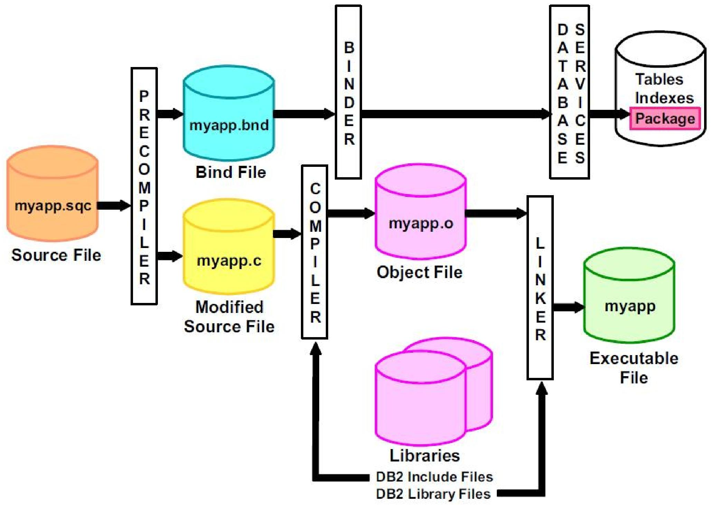

# 高级SQL

数据库开发从基础应用走向复杂业务实现的关键，涵盖了程序语言与 SQL 的交互、函数与存储过程、触发器、递归查询等核心内容


## 程序与数据库服务器的交互(Accessing SQL From a Programming Language)

SQL 是数据库的查询语言，但实际开发中，程序（如 Java/C++ 代码）不会直接在数据库终端执行 SQL，而是通过**应用程序接口（API）** 与数据库服务器交互，通用流程为：

1. 建立与数据库服务器的连接；
2. 向服务器发送 SQL 命令（查询 / 更新 / 插入等）；
3. 将查询结果逐行提取到程序变量中；
4. 处理执行过程中的错误。

支持该交互的主流工具分为三类：**JDBC、ODBC、嵌入式 SQL**。



### JDBC（Java Database Connectivity）

JDBC 是一套 Java API，用于与支持 SQL 的数据库系统进行通信。

1. **核心操作：增删改查**
2. **查数据库 “本身的结构”（元数据）**:数据库里有哪些表、某张表有哪些字段 

Java 程序用 JDBC 连数据库，必须走这四步：

1. **连数据库**：先和数据库服务器建立连接（输地址、账号密码）；
2. **准备 SQL “执行器”**：创建一个叫`Statement`的对象，专门用来装要执行的 SQL；
3. **发 SQL + 拿结果**：通过`Statement`把 SQL 发给数据库，再把返回的结果（比如查询到的用户列表）取回来；
4. **处理出错情况**：如果连不上数据库、SQL 写错了，JDBC 会用 “异常” 告诉你哪里出了问题，方便排查。

### ODBC（Open Database Connectivity，开放数据库连接）

ODBC 本质是一套**标准化的应用程序接口（API）**，程序通过调用这些 API 能完成和数据库的全流程交互，核心就三件事：

1. **建立连接**：通过 API 打开和数据库服务器的连接（输入数据库地址、账号密码），这是所有操作的基础；
2. **发送指令**：通过 API 把 SQL 查询（比如查数据）、更新（比如改数据 / 删数据）指令发给数据库；
3. **获取结果**：通过 API 接收数据库返回的执行结果（比如查询到的表格数据、更新是否成功的状态）。


### 嵌入式 SQL (Embedded SQL)

嵌入式 SQL 是把 SQL 语句直接写到 C、C++、Java 等编程语言（称为**宿主语言**）代码里的技术，SQL 标准统一规定了它在不同宿主语言中的嵌入规则

1. **标识 SQL 语句**：让编译器识别 SQL

- 通用格式：用`EXEC SQL`开头标记嵌入式 SQL 语句，结尾默认用分号（`;`），如`EXEC SQL <SQL语句>;`；
- 语言差异：
  - COBOL 语言：结尾用`END-EXEC`替代分号；
  - Java 语言：格式改为`#SQL { <SQL语句> };`。

2. **数据库连接**：操作前的必备步骤

执行任何嵌入式 SQL 前，必须先通过以下语句建立程序与数据库的连接：

```sql
EXEC SQL connect to server user 用户名 using 密码;
```

其中`server`是数据库服务器的标识（如 IP + 端口），这是所有数据库操作的前提。

3. 宿主语言变量的使用：区分程序变量和 SQL 变量

- 标记规则：程序里的变量（如`credit_amount`）在 SQL 中使用时，必须加冒号（`:`）前缀（如`:credit_amount`），避免和 SQL 自身的变量混淆；
- 声明规则：这类变量必须放在`EXEC SQL BEGIN DECLARE SECTION`和`EXEC SQL END DECLARE SECTION`之间，变量的声明语法遵循宿主语言规则（比如 C 语言用`int`、Java 用`int`/`String`）

```sql
EXEC SQL BEGIN DECLARE SECTION;
  int credit_amount; -- 宿主语言变量（C语言语法）
EXEC SQL END DECLARE SECTION;
```


#### 游标（Cursor）—— 处理多行查询结果

宿主语言无法直接接收 SQL 返回的 “多行结果集”，游标相当于 “结果集的指针”，逐行读取数据，核心流程分 4 步：

1. 声明游标：绑定要执行的 SQL 查询

语法：`EXEC SQL declare 游标名 cursor for <SQL查询>`，示例（查询学分超过`:credit_amount`的学生）：

```sql
EXEC SQL
declare c cursor for
select ID, name
from student
where tot_cred > :credit_amount
END_EXEC; -- COBOL结尾，其他语言可用;
```

作用：把 SQL 查询和游标`c`绑定，此时不执行查询，仅定义规则。

2. 打开游标：执行查询并保存结果

语法：`EXEC SQL open 游标名;`（如`EXEC SQL open c;`）；作用：数据库执行绑定的 SQL 查询，把结果存入临时数据集，**使用此时宿主变量（如`:credit_amount`）的当前值**。

3. 提取数据：逐行读取结果到程序变量

语法：`EXEC SQL fetch 游标名 into :变量1, :变量2;`（如`EXEC SQL fetch c into :si, :sn END_EXEC;`）；作用：把临时数据集里的一行数据存入程序变量（`si`存学生 ID，`sn`存姓名），重复调用`fetch`可读取下一行。

4. 终止与关闭：判断结束 + 释放资源

- 结束标识：SQL 通信区（SQLCA）里的`SQLSTATE`变量会被设为`'02000'`，表示没有更多数据；
- 关闭游标：`EXEC SQL close 游标名;`（如`EXEC SQL close c;`），删除临时数据集，释放数据库资源；
- 语言差异：Java 中用 “迭代器（Iterator）” 替代游标逐行遍历结果，逻辑一致但语法不同。

#### 嵌入式 SQL 的更新操作：通过游标修改数据

声明可更新的游标：加`for update`关键字，示例（锁定 Music 系讲师数据）：

```sql
EXEC SQL
declare c cursor for
select * from instructor where dept_name = 'Music'
for update;
```

遍历游标并更新：先通过`fetch`读取一行数据，再用`where current of 游标名`定位当前行并修改，示例（给当前行讲师涨薪 1000）：

```sql
update instructor
set salary = salary + 1000
where current of c;
```


## SQL 的扩展（Extensions to SQL）

SQL:1999 及各数据库厂商扩展了**函数、存储过程**等 “过程式” 特性，核心是让 SQL 能处理复杂逻辑、复用代码、提升执行效率

### 函数（Function）

封装一段可复用的逻辑，执行后返回**单个值 / 表对象**（表值函数）；

既可以用 SQL 本身写，也能用 C、Java 等外部语言

- 创建：`CREATE FUNCTION`，必须指定返回值类型（`RETURNS`），函数体必须有`RETURN`语句；
- 参数：仅支持`IN`类型（输入参数）；
- 调用：可直接嵌入查询语句中（如`SELECT`/`WHERE`子句）。

**不能执行 insert/update/delete 等更新操作**

```sql
CREATE FUNCTION <函数名> ([参数,..,参数])
	RETURNS <数据类型>
	BEGIN
		<SQL语句块>
	END<终止符>


create function dept_count (dept_name varchar(20))  -- 输入参数：部门名
	returns integer  -- 返回值类型：整数（讲师数量）
	begin
	  declare d_count integer;  -- 声明局部变量存统计结果
	  	select count(* ) into d_count  -- 统计指定部门的讲师数，存入变量
	  	from instructor
	  	where instructor.dept_name = dept_name;
	  return d_count;  -- 返回统计结果
	end                       
	
select dept_name, budget
from department
where dept_count (dept_name) > 12;  -- 函数直接用在WHERE子句中
```

---

### 存储过程（Procedure）

封装一段复杂业务逻辑（可包含**更新、循环、条件判断**），编译后存储在数据库中，调用时直接执行；

- 创建：`CREATE PROCEDURE`，无需指定返回值类型；
- 参数：支持`IN`（输入）、`OUT`（输出）、`INOUT`（输入输出），可返回多个值；
- 调用：必须用`CALL`语句（如`CALL 过程名(参数)`），不能嵌入查询语句。

```sql
CREATE PROCEDURE <存储过程名> ([参数,..,参数]) #参数的格式为:[IN/OUT/INOUT] 参数名 参数数据类型
	BEGIN
		<SQL语句块>
	END<终止符>
	
	
DELIMITER // #将数据库的终止符修改为//,因为数据库的默认终止符为分号,为了避免与存储过程中SQL语句块中的终止符(即分号)冲突
	CREATE PROCEDURE PROC_COURSE_AVG_ GRADE (IN course_id CHAR(4),OUT avg_grade FLOAT)
	BEGIN
		SELECT AVG (GRADE) INTO avg_grade FROM SC WHERE Cno=course_id;
	END //
	
DELIMITER; #恢复默认终止符
CALL PROC COURSE AVG GRADE ("1",@avg_grade);
# @ 符号用于表示用户定义的变量。
```


> [!tip]
>
> | 特性     | 存储过程               | 函数                |
> | -------- | ---------------------- | ------------------- |
> | 返回值   | 多值（OUT/INOUT 参数） | 单值 / 表（RETURN） |
> | 参数类型 | IN/OUT/INOUT           | 仅 IN               |
> | 调用方式 | CALL 独立执行          | 嵌入 SELECT 等查询  |
> | 数据操作 | 可增删改查             | 仅查询，不可修改    |
> | 语法要求 | 无需 RETURN            | 必须 RETURNS        |
>
> - 存储过程 = 数据库里的 “小程序”：能改数据、返多值、独立运行，适合复杂业务；
> - 函数 = 数据库里的 “计算器”：仅查数据、返单值、嵌在查询里用，适合简单计算 / 查询。


## 触发器（Trigger）

### 触发器的本质

触发器就是数据库的 “自动响应机器人”，当有人增 / 删 / 改数据时，它会自动按预设规则干活。

1. **自动触发，无需人工干预**：由数据库系统自行检测、自行执行的 “后台程序”
2. **触发前提：仅在数据库数据被修改时触发**：触发器不会无故执行，只有当数据库发生**数据修改操作**时才会被激活，这里的修改仅指三类核心操作：插入（`insert`）、删除（`delete`）、更新（`update`）
3. **本质属性：数据修改的 “附加副作用”**：触发器执行的逻辑（比如 “**自动累加该学生的总学分**”）并不是核心操作本身，而是核心操作带来的附加、连带动作

设计一个可用的触发器，必须完成两个关键配置，缺一不可

1. **明确触发条件（“什么时候干活”）**
   - 这是触发器的 “执行门槛”，需要定义清楚 “满足什么情况什么事件才会启动”，不是只要数据修改就触发。
2. **明确触发动作（“具体干什么活”）**
   - 这是触发器的 “核心业务逻辑”，需要定义清楚 “满足条件后，要执行哪些操作”。比如一条或者多条SQL语句

> [!tip]
>
> 1. 触发器本质：数据库数据修改（增 / 删 / 改）时自动执行的 “附加逻辑程序”，无需手动调用；
> 2. 设计核心：必须同时明确 “触发条件”（执行门槛）和 “触发动作”（业务逻辑）；


触发器的触发前提是数据库发生**数据修改操作**，仅支持三种核心事件，无其他额外触发类型：`insert`、`delete`、`update`

其中普通`update`触发器会在表的**任意字段**被修改时触发，而我们可以对其进行精准限制，仅当**指定字段**被修改时才激活触发器

```sql
#仅当takes表（学生选课成绩表）的grade字段（成绩字段）被更新后，该触发器才会执行
after update of takes on grade
```


### 新旧数据的引用规则

触发器支持引用数据修改前后的字段值，用于条件判断或业务计算，不同操作对应不同的引用方式，规则固定：

| 触发事件 | 可引用的数据                       | 引用语法                                                     | 用途                                             |
| -------- | ---------------------------------- | ------------------------------------------------------------ | ------------------------------------------------ |
| `delete` | 仅旧数据（删除前的行数据）         | `referencing old row as 别名`（如 orow）                     | 记录被删除的数据、做删除前校验                   |
| `insert` | 仅新数据（插入后的行数据）         | `referencing new row as 别名`（如 nrow）                     | 校验插入的数据、基于插入数据更新关联表           |
| `update` | 旧数据（更新前）+ 新数据（更新后） | 旧数据：`referencing old row as 别名`新数据：`referencing new row as 别名` | 对比数据变化（如工资是否上涨）、基于变化执行逻辑 |


### 两大触发时机：`before` vs `after`

1. **`before`（事件执行前触发）**

   - 作为**额外的数据约束 / 数据预处理**，在数据正式写入 / 修改到数据库前，对数据进行校验或修正，保证数据合法性。

   - 示例：将空白成绩（`''`）自动转为`null`（避免脏数据存入数据库），对应`setnull_trigger`触发器。

     ```sql
     create trigger setnull_trigger 
     before update of takes  -- 触发时机：更新takes表之前
     referencing new row as nrow  -- 引用更新后的行数据（别名nrow）
     for each row  -- 行级触发：每更新一行数据就执行一次
     when (nrow.grade = ' ')  -- 触发条件：更新后的grade字段是空白字符串
     begin atomic  -- 原子执行：要么全部成功，要么全部回滚
       set nrow.grade = null;  -- 触发动作：将空白成绩转为null
     end;
     ```

2. **`after`（事件执行后触发）**

   - **维护关联数据、记录审计日志**，在数据已经成功修改后，执行连带的业务逻辑，不影响原数据的修改操作。
   - 示例：学生成绩从不及格转为及格后，自动累加对应课程学分，对应`credits_earned`触发器。

   ```sql
   create trigger credits_earned 
   after update of takes on (grade)  -- 触发时机：takes表的grade字段更新后
   referencing new row as nrow  -- 新数据：更新后的成绩行
   referencing old row as orow  -- 旧数据：更新前的成绩行
   for each row  -- 行级触发：逐行处理成绩更新
   -- 触发条件：从“不及格/无成绩”转为“及格”
   when nrow.grade <> 'F' and nrow.grade is not null
     and (orow.grade = 'F' or orow.grade is null)
   begin atomic
     -- 触发动作：累加对应课程的学分到学生总学分
     update student
     set tot_cred= tot_cred +
     (select credits from course where course.course_id= nrow.course_id)
     where student.id = nrow.id;
   end;
   ```

   


### 两种触发范围：行级触发 vs 语句级触发

触发器按执行粒度分为两种，适用于不同数据量场景，效率差异明显：

1. 行级触发：**`for each row`**（默认常用）
   - 对**每一条受修改操作影响的行**，都独立执行一次触发器逻辑；
2. 语句级触发：**`for each statement`**
   - 无论多少行数据受影响，**仅对整个修改语句执行一次触发器逻辑**；


### 核心用途

1. **保障数据完整性**：
   - 通过触发器补充数据库基础约束的不足，确保存入 / 修改后的数据库数据是**合法、一致、完整**的，避免脏数据（无效 / 混乱数据）产生。
   - 插入前校验；更新或者删除时的级联操作
2. **实现数据审计**：
   - 通过触发器自动跟踪数据库中**数据的变化轨迹**，留存完整的修改痕迹，同时校验数据变化是否符合业务规则，确保业务数据的正确性与合理性，便于后续追溯问题、排查责任。
   - 日志
3. **强化数据安全性**
   - 通过触发器实现 “场景化安全校验”，补充数据库传统账号权限的不足，限制非法数据操作，保障核心业务数据的安全。
4. **实现数据备份与同步**
   - 当数据发生增、删、改操作时，触发器自动触发**数据备份或跨表 / 跨库同步**操作，无需人工手动干预，避免数据丢失，同时保证多表 / 多库数据的一致性。

触发器有上述核心作用，但是下面有些情况不应该使用触发器

1. **对于维护汇总数据**（实时统计聚合信息）：替代方案 - **物化视图（Materialized View）**
2. **实现数据库复制**（主从 / 多库数据同步）：替代方案 - **数据库原生复制功能**
3. 同时**封装更新方法**替代了多数触发器场景：手动定义专门的 “字段更新方法”，将触发器动作封装到该更新方法中


---


## 递归查询（Recursive Queries）

递归查询（Recursive Queries）是 SQL 的高级特性（SQL:1999 正式纳入标准），核心用于解决**层次化数据**和**传递闭包**问题

递归查询就是 “查询结果可以反复调用自身” 的查询方式，像 “循环解题” 一样：

- 先获取基础数据（初始条件），再用基础数据的结果作为新的输入，反复迭代，直到满足终止条件，最终得到完整结果。
- 处理**有层级关系**或**传递关系**的数据

传递闭包（Transitive Closure，层次传递闭包）

- 这是递归查询最核心的应用场景，指 “从直接关系推导出自接（间接）关系的完整集合”。

**SQL:1999 这个官方标准，正式支持「递归视图」的定义**，对于递归视图的内容可以看[04_SQL进阶中的视图](./04_SQL进阶.md)

对于找出某一门特定课程的**所有先修课程**，需要使用递归查询

```sql
-- 1. 定义递归公用表表达式（递归视图）rec_prereq
WITH RECURSIVE rec_prereq(course_id, prereq_id) AS (
  -- 第一部分：非递归查询（基础查询/初始条件）
  SELECT course_id, prereq_id
  FROM prereq
  -- 连接非递归查询和递归查询（UNION自动去重，UNION ALL效率更高）
  UNION
  -- 第二部分：递归查询（自我调用，推导间接关系）
  SELECT rec_prereq.course_id, prereq.prereq_id
  FROM rec_prereq, prereq  -- 递归自连接：递归结果与原始先修表连接
  WHERE rec_prereq.prereq_id = prereq.course_id  -- 递归关联核心条件
)
-- 2. 查询递归视图的最终结果（所有直接+间接先修关系）
SELECT *
FROM rec_prereq;
```

- **`WITH RECURSIVE`**：SQL:1999 中定义递归视图 / 公用表表达式（CTE）的核心关键字，标志着后续定义的是递归结构；

**这个递归视图`rec_prereq`，被称为`prereq`关系的「传递闭包」**（这是理解递归查询的核心概念）。

- `prereq`表（原始关系）：仅存储「直接关系」（A→B、B→C、C→D）；
- 传递闭包（`rec_prereq`视图）：存储「所有直接关系 + 所有间接关系」的完整集合（A→B、A→C、A→D、B→C、B→D、C→D）；
- 从 “直接关联” 推导 “间接关联”，完整覆盖层级化的传递关系，这正是递归查询的本质作用。

> [!note]
>
> 普通非递归查询的本质局限：**无法适配任意层级的传递关系**，层级数超过预设的连接次数后，查询就会失效
>
> 递归视图使得某些查询（例如传递闭包查询）的编写成为可能，而这类查询离开递归或迭代是无法实现的。


递归视图**必须满足单调性约束**，这是 SQL 标准对递归视图的强制要求，目的是保证迭代能稳定收敛到唯一的不动点。

- 单调性的具体定义是：当我们向原始关系`prereq`表中添加新的元组（行数据，比如新增一门课程的直接先修关系）时，递归视图`rec_prereq`的结果集**只会保持不变或增加新的元组**，绝不会减少原有已存在的元组，但是可能会增加

