# 实体 - 关系（E-R）模型

核心围绕**实体 - 关系（E-R）模型**展开，系统覆盖了从概念设计到逻辑设计的全流程。

- E-R 模型是连接 “现实业务需求” 与 “物理数据库实现” 的桥梁
- 通过抽象的 “实体、关系、属性” 三大要素，将模糊的业务逻辑转化为结构化的概念 schema，解决 “如何精准映射现实世界数据关联” 的核心问题，是后续逻辑设计（关系模式）和物理设计（存储结构）的基础。
- “基础构建 - 规则约束 - 复杂扩展 - 实战落地 - 跨域衔接” 五大模块

---

## Design Phases（数据库设计阶段）

**从业务需求出发，逐步落地为可实现的数据库结构**，整体分为 “需求分析→概念设计→逻辑设计→物理设计” 四大核心阶段，同时配套两种主流设计方法

1. 需求分析（Initial Phase）—— 明确 “要做什么”
   - 全面梳理数据库用户的**数据需求和功能需求**：
   - 数据需求：明确需要存储哪些数据；功能需求：明确用户要对数据执行哪些操作
2. 概念设计（Conceptual Design）—— 抽象 “业务模型”
   - **选择数据模型，将需求转化为抽象的概念 schema（概念蓝图）**
   - 选择数据模型（E-R)；用模型映射现实；形成包含数据结构以及功能需求的概念 schema
3. 逻辑设计（Logical Design）—— 转化 “表结构方案”
   - **将抽象的概念模型转化为具体的关系模式（即表结构设计）**
   - 业务决策（Business decision）：确定需要在数据库中记录哪些属性
   - 计算机科学决策（Computer Science decision）：确定**表结构的组织方式** —— 包括需要设计哪些表（关系模式）、每个表包含哪些属性、属性如何在不同表之间分配
4. 物理设计（Physical Design）—— 确定 “存储细节”
   - **决定数据库的物理存储布局**，即如何在计算机硬件上存储数据：
   - 据文件的存储路径、索引设计、表的分区策略、存储引擎选择（如 InnoDB、MyISAM）等；

支撑数据库设计的两种主流方法，分别对应不同设计阶段的需求：

1. 实体 - 关系模型（Entity Relationship Model，ER 模型）—— 聚焦概念设计
   - 将企业业务抽象为 “实体” 和 “关系” 的集合；
   - 实体的描述：每个实体通过一组 “属性” 来刻画；
   - 通过 “**实体 - 关系图（E-R 图）**” 直观呈现概念 schema，便于沟通和优化；
2. 规范化理论（Normalization Theory）—— 优化逻辑设计
   - 通过形式化的规则，定义 “坏设计” 的标准（如数据冗余、更新异常），并提供检验和优化方法

> [!tip]
>
> 1. 需求分析：从业务中提炼 “要存储什么数据、要执行什么操作”；
> 2. 概念设计：用 ER 模型将需求抽象为 “实体 - 关系” 蓝图；
> 3. 逻辑设计：将蓝图转化为具体的表结构方案（关系模式），并用规范化理论优化；
> 4. 物理设计：确定数据的物理存储细节，保障落地后的性能；

## Outline of the ER Model（E-R 模型概述）

明确 E-R 模型的**设计目标、核心价值、三大基础概念**，并延伸讲解了最核心概念 “实体集（Entity Sets）” 的定义、特征与实例

E-R 模型（Entity-Relationship Model，实体 - 关系模型）的核心目的是**简化数据库设计**

通过定义一套标准化的概念，让设计者能够清晰描述 “企业级数据库的**整体逻辑结构**”（即 “enterprise schema”），无需过早纠结于具体数据库的技术实现细节。

- 最关键的作用是 **“现实世界→概念模型” 的映射桥梁 **：将现实企业中的业务含义、对象交互，转化为结构化的 “概念 schema”（抽象的模型框架）

E-R 模型的基础是**三大核心概念**（后续所有复杂建模都基于这三者扩展）：

- 实体集（Entity Sets）：同类现实对象的集合（如 “所有学生”“所有课程”）；
- 关系集（Relationship Sets）：实体集之间的关联（如 “学生选课” 这种学生与课程的互动）；
- 属性（Attributes）：描述实体集或关系集的特征信息（如学生的 “学号”“姓名”，选课的 “成绩”）。

---

### 实体集（Entity Sets）

实体是一个客观存在，并且能够与其他对象相互区分的独立对象。

- 重点在于客观存在性，可区分性，即有独特性的真实事物

实体集是一组同类型、且拥有相同属性（特征）的**实体的集合**。

- **同类型**：集合内的所有实体都属于同一类别；
- **共享属性**：所有实体都具备相同的描述特征（只是特征值不同）；
- **集合性**：是多个单个实体的汇总，而非单个对象。

（`Example: set of all persons, companies, trees, holidays`）

一个实体通过一组属性来描述；也就是说，属性是实体集中所有成员（所有实体）都具备的**描述性特征**。

- 从实体集的所有属性中，选取一个**属性子集**作为主键；主键的核心作用是**唯一标识**该实体集中的每一个成员（每一个实体）。
  - **主键的来源**：是属性的 “子集”（可以是单个属性，也可以是多个属性的组合）；
  - **主键的核心特性**：**唯一性**—— 同一实体集中，没有任何两个实体的主键值是重复的；
  - **主键的作用**：精准定位单个实体。

> [!tip]
>
> Entity Sets（实体集）的逻辑关系可概括为：`单个可区分的实体（Entity）→ 同类实体汇总为实体集（Entity Set）→ 用属性（Attribute）描述实体/实体集 → 选取主键（Primary Key）唯一标识实体集中的每个实体`

#### Weak Entity Sets（弱实体集）

对于弱实体集有两个定义

1. **存在依赖**：弱实体集的存在依赖于另一个实体集（称为标识实体集 / Identifying Entity Set），没有标识实体集，弱实体集无法独立存在
2. **无独立主键**：弱实体集自身没有足够的属性来构成独立的主键（无法单独唯一标识单个实体）

虽然弱实体集没有主码，但是我们仍需要区分依赖于特定强实体集的弱实体集中的实体的方法。弱实体集的**分辨符**（discriminator）是使得我们进行这种区分的属性集合

同时弱实体集和标识实体集的**标识关系不应该有任何描述性属性**—— 它仅用于建立弱实体集与标识实体集的依赖关联，无需额外描述

分辨符（Discriminator）又称 “部分键（Partial Key）”

- 是弱实体集中的一组属性，**能够区分同一标识实体下的不同弱实体，但无法跨标识实体唯一区分弱实体**；
- 与标识实体集的主键组合，形成弱实体的 “复合主键”，实现唯一标识；

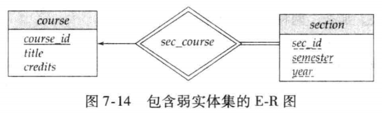

图 7-14 中弱实体集 `section` 的主码由 `course_id`，`sec_id`，`semester`，`year` 组成。其中 `course_id` 是 `course `的主码，`sec_id`，`semester`，`year` 是 `section` 的**分辨符**，用于区分每个 `course` 的不同 `section`。

“将`section`转化为关系模式（表结构）时，最终的表中依然包含`course_id`属性”，这看似矛盾，实则是设计权衡

1. **本质区别**：此时的`course_id`不是 “冗余属性”，而是**外键（Foreign Key）**，用于关联`section`表和`course`表，实现两者的关联查询；
2. 提升查询效率，避免频繁的复杂关联操作

---

### Relationship Sets（关系集）

关系集的**属性关联、度数分类**

关系集的核心是「**多个实体集之间的关联集合**」

**关系集本身也可以拥有属性**—— 属性不仅能描述实体集，还能描述实体集之间的 “关联关系”。

- 关系集的属性用于描述 “关联本身的特征”，而非实体的特征
- 后续转化为关系模式时，该属性会被纳入关系集对应的关联表中

关系集的 “度数” 指**参与该关系集的实体集个数**，是关系集最核心的分类标准

1. **二元关系集**（Binary Relationship Set）—— 最常用
   - **参与实体集个数为 2 的关系集**，度数为 2。
   - 数据库系统中绝大多数关系集都是二元的 —— 现实业务中，实体间的关联大多是 “**两个对象之间的互动**”，如：
     - 学生（student）与课程（course）的 “选课” 关系；
     - 客户（customer）与账户（account）的 “开立” 关系；
     - 教师（instructor）与学生（student）的 “指导”（advisor）关系。
2. 三元关系集（Ternary Relationship Set）—— 特殊场景
   - 参与实体集个数为 3 的关系集，度数为 3
   - 参与实体集：instructor（教师）、student（学生）、project（项目）；
   - 关系集：proj_guide（项目指导）；

> [!tip]
>
> 1. 关系集不仅是实体间的 “关联纽带”，还可通过自身属性（如指导日期）描述关联的细节；
> 2. 关系集按度数分为二元（2 个实体集，最常用）、三元（3 个实体集，少见）等

### Mapping Cardinality Constraints（映射基数约束）

映射基数约束（Mapping Cardinality Constraints）是 E-R 模型中**描述实体间关联数量限制**的核心规则，也是确保数据库数据符合业务逻辑的关键约束

映射基数约束用于明确 “通过某一关系集，一个实体集中的单个实体，最多能与另一个实体集中的多少个实体建立关联”。

即关系表连接的实体集中的对应关系

1.  一对一（One to One，1:1）
   - A 实体集中的**一个实体**，最多能与 B 实体集中的**一个实体**关联；反之，B 实体集中的一个实体，也最多能与 A 实体集中的一个实体关联。
2. 一对多（One to Many，1:N）
   - A 实体集中的**一个实体**，最多能与 B 实体集中的**多个实体**关联；但 B 实体集中的**一个实体**，最多只能与 A 实体集中的**一个实体**关联（**“一” 方限制单个，“多” 方允许多个**）。
3. 多对一（Many to One，N:1）
   - A 实体集中的**多个实体**，最多能与 B 实体集中的**一个实体**关联；但 B 实体集中的**一个实体**，最多只能与 A 实体集中的**一个实体**关联
   - 与 “一对多” 是反向逻辑，仅视角不同
4. 多对多（Many to Many，M:N）
   - A 实体集中的**一个实体**，最多能与 B 实体集中的**多个实体**关联；反之，B 实体集中的**一个实体**，也最多能与 A 实体集中的**多个实体**关联

映射基数约束仅限制 “最多能关联的数量”，**不强制 “必须关联”**—— 即实体集中的部分实体可以不参与该关系集。

> [!tip]
>
> - 1:1、1:N、N:1 关系：可通过 “外键嵌入” 实现（如 1:N 关系中，“多” 方表添加 “一” 方表的主键作为外键）；
> - M:N 关系：必须单独建立 “关联表”，存储双方实体的主键（如 “选课表” 存储学生 ID 和课程 ID），否则无法实现多对多关联。

### 复杂属性（Complex Attributes）及冗余属性（Redundant Attributes）

**属性分类（核心是复杂属性）\*和冗余属性的规避原则**，前者是精准描述实体特征的关键，后者是保障数据库低冗余、高一致性的核心

#### 复杂属性

复杂属性并非单一类型，而是**复合属性、多值属性、派生属性的统称**

- 按 “属性是否可拆分” 划分，其中**复合属性是复杂属性的核心类型之一**，分为简单属性和复合属性
  - **简单属性**（Simple Attribute）：**不可再拆分**为更小、更有意义的子属性的属性，是属性的最小单位。
  - **复合属性**（Composite Attribute）：**可拆分**为多个子属性（简单属性或其他复合属性）的属性，子属性可单独描述实体的某一细节特征。
    - “地址（address）” 可拆分为 “街道（street）”、“城市（city）”、“邮编（zip code）”、“国家（country）”；
    - “姓名（full_name）” 可拆分为 “姓氏（last_name）”、“名字（first_name）”；
- 按 “单个实体对应属性值的数量” 划分，**多值属性是复杂属性的另一核心类型**，分为单值属性和多值属性
  - **单值属性（Single-valued Attribute）**：单个实体在该属性上仅对应一个唯一的值。
  - **多值属性（Multivalued Attribute）**：单个实体在该属性上可以对应多个互不相同的值
    - `phone_numbers`（电话号码）—— 一个教师可能有办公电话、私人手机、家庭电话等多个号码
    - 学生的 “兴趣爱好（hobbies）”（可能包含篮球、读书、编程等多个值）
    - 多值值属性不能直接嵌入实体的基础属性中，后续转化为表结构时，通常需要**单独建立关联表**

- 派生属性（Derived Attribute）
  - **无需直接存储，可通过其他属性（存储属性）计算 / 推导得到的属性**，属于复杂属性的特殊类型
  - 动态变化、依赖其他属性，存储该属性会增加数据不一致的风险；
    - `age`（年龄）—— 可通过 “当前年份 - 出生日期（date_of_birth）” 计算得出；
    - “学生的总学分（total_credits）”—— 可通过 “选课表” 中该学生所有课程的学分累加得到
  - 优先不存储，仅在 “查询频率极高、计算成本高” 的场景下，可适度存储

属性的域（Domain）：`the set of permitted values for each attribute`，即**每个属性的合法取值范围**，是属性的基础约束。

#### 冗余属性（Redundant Attributes）—— 定义、问题与规避原则

当两个实体集之间的关联关系，已经**通过 “关系集” 明确建立**时，若其中一个实体集存储了另一个实体集的主键（或核心属性），该属性即为冗余属性。

> 1. 两个实体集及属性：
>    - `instructor`（教师）：`ID`（主键）、`name`、`dept_name`（部门名称）、`salary`；
>    - `department`（部门）：`dept_name`（主键）、`building`（办公大楼）、`budget`（预算）；
> 2. 关联关系：已通过`inst_dept`（教师 - 所属部门）关系集，明确 “每个教师对应一个部门” 的关联；
> 3. 冗余属性：`instructor`实体集中的`dept_name`—— 该属性是`department`的主键，其表达的 “教师归属某部门” 的信息，已经通过`inst_dept`关系集体现，因此在`instructor`中存储`dept_name`属于冗余。

为什么必须规避冗余属性？核心问题是**导致数据冗余和数据不一致（更新异常）**：

- 数据冗余：多个教师可能属于同一个部门，`dept_name`会在多个教师记录中重复存储
- 数据不一致（更新异常）：若部门名称发生变更（如 “计算机系” 改为 “人工智能系”），需要修改`department`表中的`dept_name`，同时还要批量修改`instructor`表中所有该部门教师的`dept_name`

避免 “两个实体集之间的**联系隐含于一个属性**中”，冗余属性需要从实体集中移除。

> [!tip]
>
> 在将 E-R 模型转化为关系模式（表结构）时，**某些场景下被移除的冗余属性（如`dept_name`）会被重新引入到表中**，这并非违背 “低冗余” 原则，而是为了**提升查询效率，避免频繁关联查询**。

## E-R 图（E-R Diagrams）

E-R 图是实体 - 关系模型的可视化工具，通过标准化符号直观呈现实体集、关系集、属性及各类约束，是数据库设计与沟通的核心载体。

### 基础符号：实体集、关系集与属性

#### 实体集（Entity Sets）—— 矩形表示

- 核心符号：**矩形**代表实体集（如 “instructor”“student”“course”）；
- 属性标注：实体的所有属性直接列在矩形内部（如教师的 ID、name、salary）；
- 主键标识：**下划线**标注主键属性（如 “ID” 是 instructor 的主键，需下划线突出）。

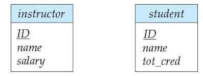

#### 关系集（Relationship Sets）—— 菱形表示

- 核心符号：**菱形**代表实体集之间的关系集（如 “advisor”“teaches”“takes”）；
- 关联方式：用直线将菱形与参与该关系的所有实体集连接（如 “advisor” 菱形需连接 “instructor” 和 “student” 矩形）。

同时，对于带属性的关系集（Relationship Sets with Attributes）

- 表示方法：关系集的属性直接列在对应菱形内部（如 “advisor” 关系的 “date” 属性，标注在菱形中）；
- 核心逻辑：属性描述 “**关系本身的特征**”，而非实体的特征（如 “指导日期” 是 “指导关系” 的属性，而非教师或学生的属性）。

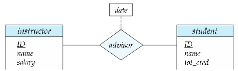

> [!tip]
>
>  **连线**：只能连接实体和属性、实体和联系，不能连接实体和实体或联系和联系

#### 属性（Attributes）

对于一个实体集的属性有多个类型的属性，分为简单属性，复合属性，多值属性，派生属性

主要是复合属性，多值属性，派生属性的写法

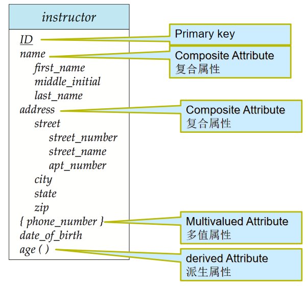

#### 角色（Roles）—— 关系中的实体身份标注

- 适用场景：实体在联系中扮演的**功能**叫做实体的角色。当**相同实体集**在联系中扮演**不同的角色**的时候（**自连接**），需显示标记角色信息
- 标注方式：在实体集与菱形的连接线上，标注角色名称（如 “course” 实体集参与 “prereq”（先修）关系时，分别标注 “course_id”（课程）和 “prereq_id”（先修课程）两个角色）；
- 核心价值：明确实体在关系中的具体作用，避免歧义

### 约束表达：基数约束与参与约束

#### 映射基数约束（Cardinality Constraints）—— 线的类型区分

映射基数描述实体间关联的数量限制，通过 “有向线（→）” 和 “无向线（—）” 区分 “一” 和 “多”：

- 有向线（→）：表示 “一”（最多关联 1 个实体）；
- 无向线（—）：表示 “多”（可关联多个实体）。

| 关系类型      | 图示特征                                   | 业务逻辑示例                                                 |
| ------------- | ------------------------------------------ | ------------------------------------------------------------ |
| 一对一（1:1） | 实体集与菱形间均用有向线（→）连接          | 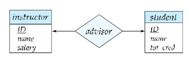 |
| 一对多（1:N） | “一” 方用有向线（→），“多” 方用无向线（—） | 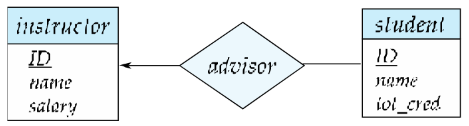 |
| 多对一（N:1） | “多” 方用无向线（—），“一” 方用有向线（→） | 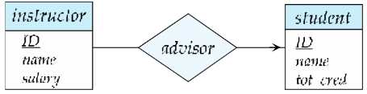 |
| 多对多（M:N） | 实体集与菱形间均用无向线（—）连接          | 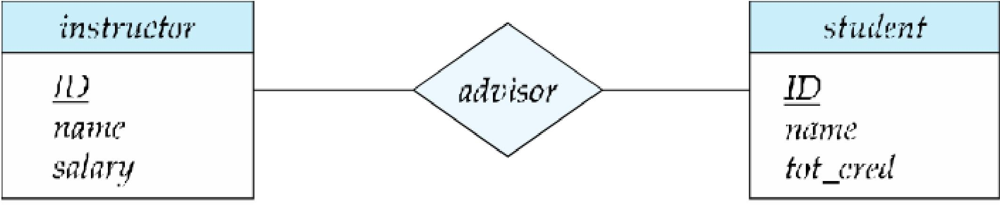 |

更复杂的基数约束（l..h 格式）—— 细化参与数量范围

精准界定实体参与关系的 “最少数量” 和 “最多数量”，是基础参与约束的延伸和补充。

- 在 E-R 图的实体集与关系集的连接线上，可标注 “l..h” 格式的约束，其中：
- `l`：最小基数（Minimum Cardinality）：表示一个实体**至少要参与的关系数量**；
- `h`：最大基数（Maximum Cardinality）：表示一个实体**最多能参与的关系数量**。
  - 最大基数 `h=*`  ，表示实体参与关系的**数量无上限**

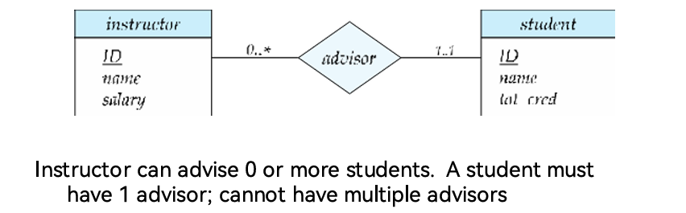

---

#### 参与约束（Participation Constraints）—— 线的粗细区分

参与约束描述实体是否 “必须” 参与关系，通过 “单直线” 和 “双直线” 区分：

- 完全参与（Total Participation）：**双直线**连接实体集与菱形，代表该实体集中的每个实体 “必须” 参与至少一个关系（如学生必须有指导教师，“student” 与 “advisor” 用双直线连接）；
- 部分参与（Partial Participation）：**单直线**连接实体集与菱形，代表实体 “可选” 参与关系（如教师可选指导学生，“instructor” 与 “advisor” 用单直线连接）。

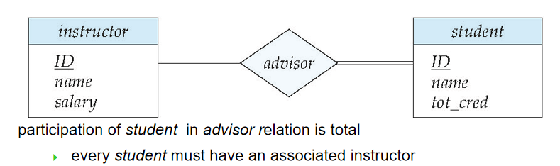

#### Expressing Weak Entity Sets（弱实体集的 E-R 图表达）

- 弱实体集表示为**双层矩形**
- 弱实体集的分辨符用**虚下划线**标出
- 弱实体集和标志性强实体集间的联系集用**双层菱形**表示。
- 弱实体集与标识实体集之间必然是**多对一**关系，且弱实体集的实体**全部参与**

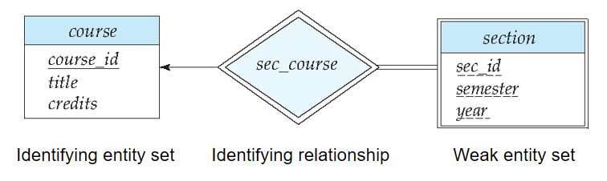

> [!tip]
>
> E-R Diagram for a University Enterprise：
>
> 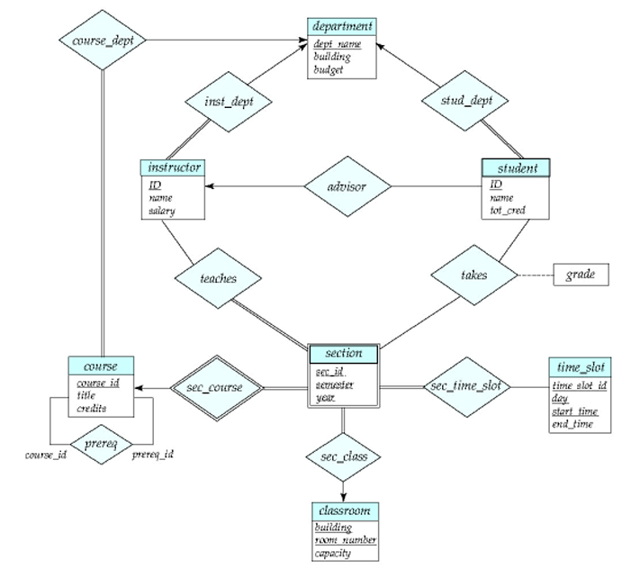

## 转化为关系模式（Reduction to Relation Schemas）

**E-R 模型向关系模式（即数据库表结构）的转化规则**，分别讲解了多对多关系、复合属性、多值属性的转化方法，以及关系模式的冗余优化策略

“Reduction to Relation Schemas” 指将 E-R 模型（实体集、关系集、属性等）转化为关系型数据库可直接实现的**关系模式（表结构）**，是连接概念设计与物理实现的关键步骤

> [!tip]
>
> 1. 统一性：**实体集和关系集**均需转化为唯一的关系模式，模式名称与对应实体集 / 关系集一致；
> 2. 列唯一性：每个关系模式的列（对应属性）名称唯一，避免歧义；
> 3. 完整性：转化后的所有关系模式集合，需完整保留 E-R 模型的所有数据信息和关联逻辑。

### 实体集

对于强实体集（Strong Entity Set）：

- 直接映射为关系模式，属性与强实体集的属性完全一致；
- 沿用强实体集的主键（属性子集）；
- 学生实体集`student(ID, name, tot_cred)`，直接转化为表`student`，主键为`ID`。

而弱实体集（Weak Entity Set）

- 需包含弱实体集自身的分辨符（部分键）+ 所依赖的标识强实体集的主键；
- 主键：由 “标识强实体主键 + 弱实体分辨符” 组成（复合主键）；
- 课程章节弱实体集`section`，依赖强实体集`course`（主键`course_id`），自身分辨符为`sec_id, sem, year`，转化后表结构为`section(course_id, sec_id, sem, year)`，主键为`(course_id, sec_id, sem, year)`。

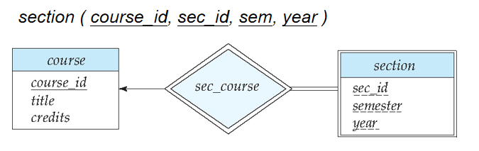

### 关系集

1.  多对多（M:N）关系集

   - **单独创建关系模式**，属性包含 “参与双方实体集的主键 + 关系集自身的描述属性（若有）”；

   - 主键：由双方实体集的主键组合而成（复合主键）；

   - 示例：指导关系集`advisor`（连接学生`student`和教师`instructor`），无描述属性，转化后表结构为`advisor(s_id, i_id)`，主键为`(s_id, i_id)`（`s_id`是学生主键，`i_id`是教师主键）。

     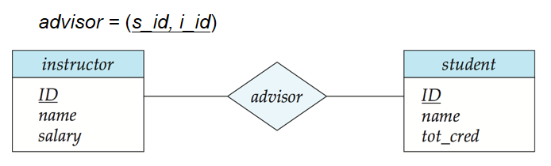

   - 同一实体集**内部多对多**：

     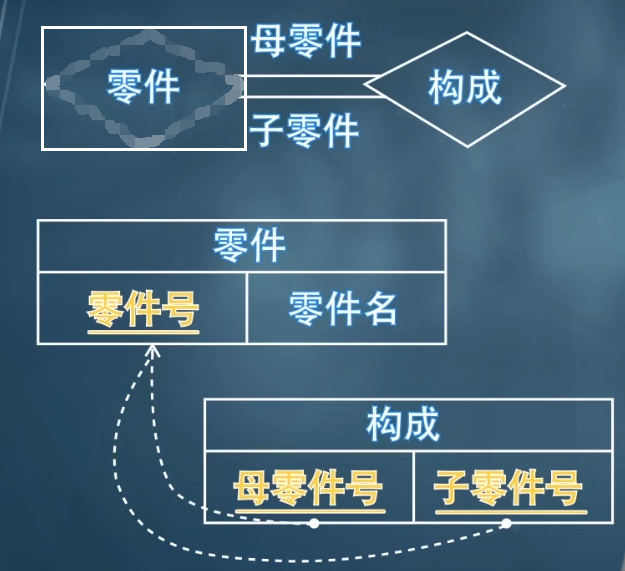

2. 一对多（1:N）/ 多对一（N:1）关系集（多端完全参与）

   - 当 1:N/N:1 关系集中，“多” 端实体集为**完全参与**（所有实体必须参与该关系）时，单独为关系集创建的模式（表）是冗余的。

   - 无需单独创建关系模式，将 “一” 端实体集的主键作为外键，添加到 “多” 端实体集对应的关系模式中；

   - 示例：教师 - 部门的`inst_dept`关系集（1:N，一个部门对应多个教师），无需创建`inst_dept`表，直接在教师表`instructor`中添加部门主键`dept_name`作为外键，表达 “教师归属部门” 的关联。

     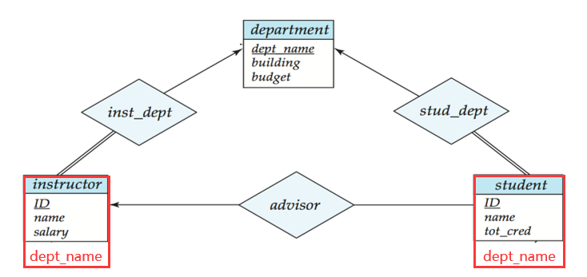

     - **自引用**（同一实体集内部不同实体之间多对一）：

     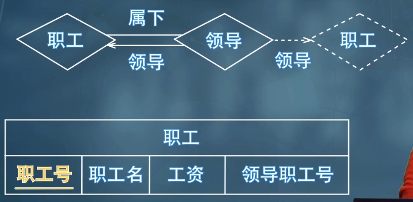

3. 一对一（1:1）关系集

   - 一对一关系集单独创建的模式（表）必然冗余，因关联信息可通过 “外键嵌入” 实现。

   - 无需单独创建关系模式，可选择任意一端实体集的关系模式，添加另一端实体集的主键作为外键；

   - 注意：若某一端为部分参与，添加外键后可能出现`null`值（如 “员工 - 配车” 1:1 关系，部分员工无配车，配车主键列可为`null`）。

     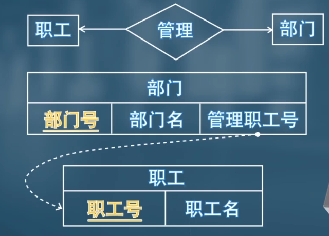

4. 弱实体集的标识关系

   - 标识关系（连接弱实体与强实体的关系集）对应的关系模式冗余，直接删除；实体集当成多对一处理即可。
   - 原因：弱实体集转化后的表已包含标识强实体的主键，无需额外关系模式表达关联；
   - 示例：`section`与`course`的标识关系`sec_course`，因`section`表已包含`course_id`，`sec_course`表冗余，无需创建。

   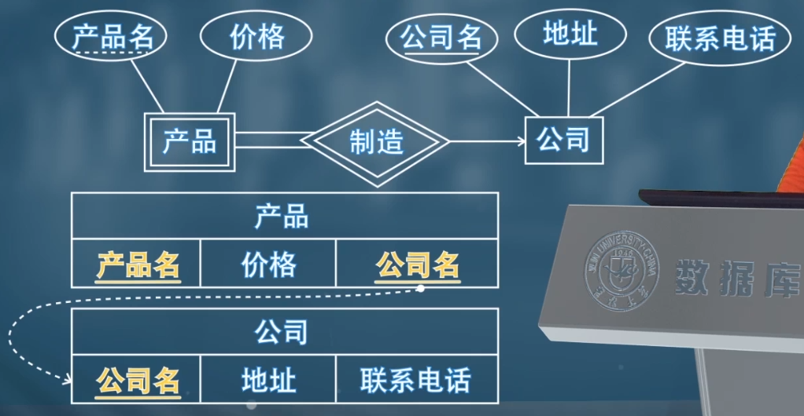

### 属性

1. 复合属性（Composite Attribute）
   - 扁平化拆分，为每个子属性创建独立列，无需保留原复合属性；
   - 命名规则：可添加复合属性名作为前缀（如`name_first_name`），无歧义时可省略前缀；
   - 教师实体集的复合属性`name(first_name, middle_initial, last_name)`、`address(street_number, street_name, apt_number, city, state, zip)`，转化后教师表结构为`instructor(ID, first_name, middle_initial, last_name, street_number, street_name, apt_number, city, state, zip_code, date_of_birth)`。
2.  多值属性（Multivalued Attribute）
   - 单独创建关系模式，属性包含 “原实体集的主键 + 多值属性本身”；
   - **忽视多值属性**，将多值属性表示成一个单独的模式 EM（原实体集 E，多值属性 M）。多值属性的每一个取值都会映射成为这个新的模式内的一条元组
   - 示例：教师实体集的多值属性`phone_number`，单独创建表`inst_phone(ID, phone_number)`（`ID`是教师主键）；若教师`ID=22222`有两个电话，对应两条记录：`(22222, 456-7890)`、`(22222, 123-4567)`。
3. 派生属性
   - 对于派生属性，直接忽略即可

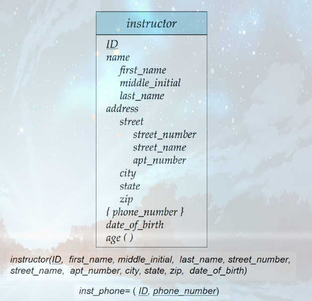

### 非二元关系集+ 特化+ 泛化+ 聚集

#### Non-binary Relationship Sets（非二元关系集）

参与实体集个数 `n≥3` 的关系集（如三元关系涉及 3 个实体集，n 元关系涉及 n 个实体集）；

数据库中绝大多数关系集是二元的），但部分场景下非二元关系集更便于表达业务逻辑

- `proj_guide` 关系集，关联 `instructor`（教师）、`student`（学生）、`project`（项目）三个实体集；
- 业务逻辑：描述 “学生在教师的指导下参与某个项目” 的关联 —— 三个实体必须同时存在才能构成完整关系，拆分為多个二元关系会丢失 “三者协同” 的核心逻辑。

非二元关系集的基数约束规则与二元关系不同，核心是 “**避免歧义，限定最多一个箭头**”：三元及以上关系集，最多只能从菱形（关系集）向外画一个有向线→，表示 “一” 的约束

若画多个箭头（如同时指向`B`和`C`），会产生两种歧义（如 “每个 A 对应唯一 B 和 C” 或 “每个 A-B 对对应唯一 C，每个 A-C 对对应唯一 B”）

#### Specialization（特化）

- 本质：“拆分共性，突出个性”—— 高层实体集包含所有实体的共性属性 / 关系，低层实体集（子分组）拥有自身独有的属性 / 关系；

用标注`ISA`（“is a”，如 “instructor ISA person”）的三角形连接高层与低层实体集；

核心特性：`Attribute inheritance`（属性继承）—— 低层实体集自动继承高层实体集的所有属性和关系参与权

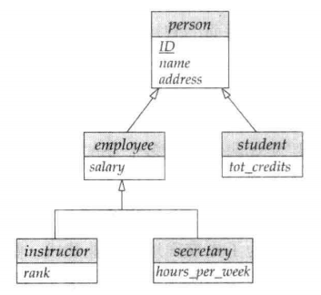

- 将高层实体集拆分为具有独特属性 / 关系的低层实体集，转化为关系模式时核心有两种方案
- 方案 1：低层模式仅含 “高层主码 + 自身独有属性”
  - 高层实体集：单独转化为关系模式，包含自身所有属性（含主码）；
  - 低层实体集：每个低层实体集转化为独立关系模式，仅包含两部分属性 —— 高层实体集的主码（用于关联高层模式）、低层实体集的独有属性（局部属性）；
  - 继承逻辑：低层实体的通用属性（如人员的姓名、地址）需通过高层主码关联查询获取。
  - 缺点：获取低层实体继承的属性时需要访问高层实体；关联查询会增加操作复杂度
- 方案 2：低层模式包含 “所有属性（继承 + 独有）”
  - 高层实体集：可保留独立关系模式（也可省略，视场景而定）；
  - 低层实体集：每个低层实体集**转化为独立关系模式**，包含所有属性 —— 继承自高层的通用属性、自身的独有属性；
  - 继承逻辑：无需关联高层模式，直接从低层模式获取完整信息。
  - 缺点：数据冗余严重，并且更新异常风险

#### Generalization（泛化）

一种自下而上的设计过程 —— 将多个具有相同特征（属性、关系）的实体集，合并为一个更高层级的实体集。

与特化（Specialization）的关系

- 互为逆过程：特化是 “自上而下拆分”（高层→低层），泛化是 “自下而上合并”（低层→高层）；它们在 E-R 图中用相同的符号表示。

特化和泛化这两个术语可互换使用。在数据库设计场景中，两者核心都是描述实体集的层级关联，仅视角不同

泛化的设计约束：完整性约束（Completeness Constraint）：规定高层实体集中的实体，是否必须属于该泛化关系中的某个低层实体集。

1. 完全约束：一个实体必须属于某个低层实体集（无例外）。
   - 在 E-R 图中，可通过**添加 “total” 关键词**，并从该关键词画一条虚线到对应的空心箭头，来表示完全约束。
2. 部分约束：一个实体无需属于任何低层实体集（允许例外）。
   - 部分约束是默认规则，无需额外标注

由于通过泛化得到的高层实体集，通常仅由低层实体集的实体组成，因此泛化得到的高层实体集，其**完整性约束通常是完全约束**。

#### Aggregation（聚集）

之前提到的三元关系 proj_guide（教师 - 学生 - 项目的指导关系）。

假设我们想要记录学生在某个项目中被指导教师给出的评价。

需建立 “指导关系（proj_guide）” 与 “评价（evaluation）” 的关联，但直接设计会导致信息冗余（两者都需关联教师、学生、项目）

当需要描述 **“关系与实体” 的关联**时，需用聚集解决冗余。

- 重叠问题：eval_for 和 proj_guide 都需关联教师、学生、项目，直接设计会重复存储这些关联信息；
- 不可删除 proj_guide：因部分指导关系可能无评价，删除后会丢失无评价的指导关系数据。

通过聚集消除这种冗余。将关系集视为一个抽象实体。允许关系与关系之间建立关联。即将关系抽象为新的实体。

要表示聚集，需创建一个包含以下内容的关系模式：**聚合关系的主键、关联实体集的主键、任何描述性属性**。

- 聚合关系的主键：即被抽象的原关系集（如 proj_guide）的主键（由参与该关系集的各实体主键组成）；
- 关联实体集的主键：即与聚合实体建立关联的外部实体集（如 evaluation）的主键；
- 描述性属性：该关联本身的特征（如评价时间、等级，可选）。

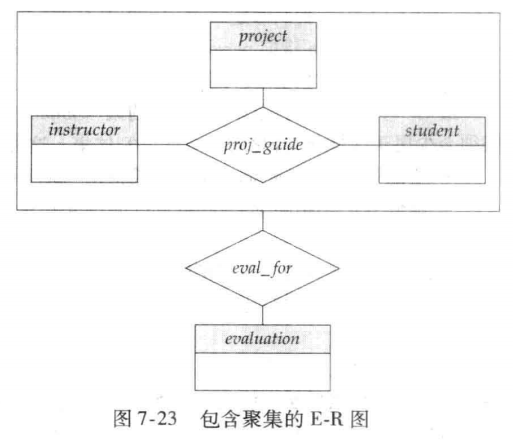

表示聚集和实体集之间联系的联系集（eval_for）需要包含：

- 聚集联系的主码（i_ID，s_ID，project_ID）
- 关联实体集的主码（evaluation_ID）
- 联系集的描述属性

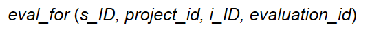

> [!note]
>
> 1. 功能分工：非二元关系集处理 “多实体协同”，特化 / 泛化处理 “实体层级关联”，聚集处理 “关系与实体关联的冗余”；
> 2. 共性价值：均为应对复杂业务场景，让 E-R 模型在 “精准表达逻辑” 与 “简化结构、减少冗余” 之间达到平衡；
> 3. 关键关联：特化与泛化互为逆过程，聚集常与非二元关系集配合使用（解决多元关系的后续关联问题）。

## 实体-联系设计问题（Design Issues）

明确 “实体与属性 / 关系的划分”“二元与非二元关系的选择” 及 “非二元关系转二元关系的规则与局限”

### Entities vs. Attributes（实体集 vs. 属性）

若对象需要存储 “额外信息” 或 “多值”，则设为实体集；仅需存储单一描述性特征，设为属性。

- 方案 1：将 “电话号码” 设为教师实体的属性（`instructor(ID, name, salary, phone_number)`），仅能存储单个号码，无法记录号码类型（办公 / 私人）等额外信息；
- 方案 2：将 “电话号码” 设为独立实体集（`inst_phone(ID, phone_number, location)`），可存储多个号码及额外信息（如`location=办公`），适配多值场景。

当对象存在**多值特性或需扩展额外属性**时，优先设为实体集；否则设为属性，简化模型。

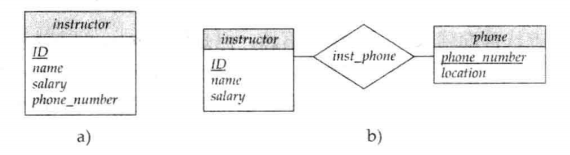

> [!caution]
>
> 有两个常犯的错误：
>
> 1. **用一个实体集的主码作为另一个实体集的属性,而不是用联系。**
> 2. **将相关实体集的主码属性作为联系集的属性。**

### Entities vs. Relationship sets（实体集 vs. 关系集）

用**关系集描述实体间的 “动作型关联”**（如 “指导”“选课”“注册”），用实体集描述独立存在的对象

**当描述发生在实体间的行为时采用联系集**，即关系集用于描述实体间发生的动作

- 延伸问题：**关系属性的放置**（Placement of relationship attributes）

  - 决策逻辑：属性描述 “关系本身” 则归属于关系集；描述 “实体特征” 则归属于实体集。

  - 一对一联系集的属性可以放到任意一个与其联系的实体集中。一对多或多对一联系集的属性可以放到“多方”的实体集中.

    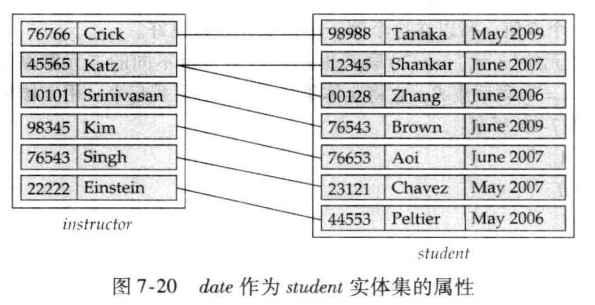

  - 示例：“指导日期（date）” 描述 “指导（advisor）” 动作的时间，归属于`advisor`关系集；“学生入学日期” 描述学生特征，归属于`student`实体集。

### Binary Vs. Non-Binary Relationships（二元关系 vs. 非二元关系）

**优先选择二元关系**，非二元关系仅在必要时使用

- 非二元关系的优势：清晰体现多个实体的协同关联，如`proj_guide`（教师 - 学生 - 项目）直接表达 “学生在教师指导下参与项目” 的协同逻辑。
- 非二元关系的转化场景：部分看似非二元的关系，拆分为二元关系更灵活。
  - “parents（父母 - 孩子）” 三元关系，拆分为 “father（父亲 - 孩子）” 和 “mother（母亲 - 孩子）” 两个二元关系，可支持 “仅知晓母亲” 等部分信息场景。
- 非二元关系的不可替代性：部分关系本质是非二元），如`proj_guide`，拆分后会丢失 “三者协同” 的核心逻辑，需保留非二元形式。

### Converting Non-Binary Relationships to Binary Form（非二元关系转二元关系）

- 对于非二元关系，可以通过一定方法转为二元关系

以三元关系 R (A,B,C) 为例）

1. 创建人工实体集 E，添加标识属性（如`E_id`）及原关系 R 的描述属性；
2. 建立三个二元关系集：`R_A`（E 与 A）、`R_B`（E 与 B）、`R_C`（E 与 C），均为 “从 E 到实体集” 的**多对一**关系；
3. 原关系 R 中的每一条记录（a_i, b_i, c_i），转化为：
   - E 中新增一个实体 e_i；
   - `R_A`中添加（e_i, a_i）、`R_B`中添加（e_i, b_i）、`R_C`中添加（e_i, c_i）。

但是新增人工实体集和多个二元关系集，模型更繁琐，占用更多存储空间；

同时约束无法完全转化：部分原关系的基数约束无法通过拆分后的二元关系表达

- 原三元关系中 “每个（A,B）对最多关联一个 C” 的约束，无法通过`R_A`、`R_B`、`R_C`精准表达；

---

## E-R Design Decisions（E-R 模型设计决策）

### E-R 设计决策

E-R 设计决策是数据库概念设计的核心环节，核心围绕 “如何精准抽象现实业务” 展开，需在 6 个关键维度做出选择，每个决策都直接影响模型的简洁性、准确性与可扩展性

1. 用属性还是实体集表示对象
   - **属性**：对象仅需存储 “**单一**描述性特征”，无额外属性、无多值需求（如教师的 “姓名”“工资”，仅需记录单一值，无扩展信息）；
   - **实体集**：对象需存储 “**多值**信息” 或 “额外关联属性”（如教师的 “电话号码”，可能有办公号、私人号多个值，或需记录号码类型，此时设为独立实体集`inst_phone`更合适）。
2. 用实体集还是关系集表达现实概念
   - **实体集**：概念是 “独立存在的对象”，可脱离其他对象单独描述（如 “学生”“课程”“项目”，自身具备完整属性）；
   - **关系集**：概念是 “实体间的**动作型关联**”，依赖多个实体才能成立（如 “选课”“指导”“资助”，核心是描述实体间的互动，而非独立对象）。
3. 用三元关系还是一对二元关系
   - 选**三元关系**：概念是 “多个实体的协同关联”，缺一不可，拆分后会丢失核心逻辑（如 “学生在教师指导下参与项目”，需用三元关系`proj_guide`直接表达三者协同，拆分后无法体现 “指导 + 参与” 的绑定关系）；
   - 选**一对二元关系**：概念可拆分为独立的两两关联，拆分后不丢失信息，且更灵活（如 “父母 - 孩子” 关系，拆分为 “父亲 - 孩子”“母亲 - 孩子” 两个二元关系，可支持 “仅知晓母亲” 等部分信息场景）。
4. 用强实体集还是弱实体集
   - 选**强实体集**：对象有 “**独立主键**”，无需依赖其他实体即可唯一标识（如 “课程” 通过`course_id`唯一标识，无需依赖其他对象）；
   - 选**弱实体集**：对象 “无独立主键”，存在依赖于其他强实体（标识实体），需通过 “标识实体主键 + 自身分辨符” 才能唯一标识（如 “课程章节” 依赖 “课程” 存在，需用`course_id+sec_id+semester+year`组合标识）。
5. 是否使用特化 / 泛化
   - 用：实体集存在 “共性 + 个性” 分层特征，需突出**子实体的独特属性 / 关系**（如 “人员” 包含 “学生”“教师”，两者有共性属性（ID、姓名），也有独有属性（总学分、工资））；
   - 不用：实体集无明显分层，所有实体属性 / 关系一致，无需拆分或合并。
6. 是否使用聚集
   - 用：需描述 “**关系与实体 / 关系的关联**”，直接设计会导致信息冗余（如 “项目指导关系” 与 “评价实体” 的关联，需将 “指导关系” 抽象为聚合实体，避免重复存储三者关联信息）；
   - 不用：仅需描述 “实体间的直接关联”，无嵌套关联需求。

> [!tip]
>
> E-R 设计决策的本质是 “精准匹配业务逻辑 + 优化模型结构”：
>
> 1. 所有决策围绕 “是否独立存在”“是否有分层 / 嵌套特征”“是否协同关联” 三大核心维度；
> 2. 核心目标是让模型既简洁无冗余，又能完整表达业务逻辑，同时具备高可维护性；
> 3. 各决策并非孤立，需结合使用（如弱实体集需搭配标识关系，聚集常与三元关系配合）

### E-R图中的符号

#### 矩形

- **实体集**：实体是指在现实世界中可独立存在的对象或事物，实体集就是相同类型实体的集合，可以看成是一个类
  

- **画在实体集中的属性**

  - A1 表示 **简单属性**；A2 表示 **复合属性**；A3 表示 **多值属性**；A4 表示 **派生属性**
    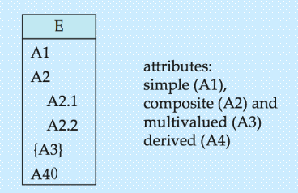

- **实体集中的主码(主属性)**：使用下划线来(实线)表示主码
  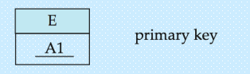

- **弱实体集**：弱实体集没有独立的主键，即本身不具有到唯一识别自身的属性，其分辨符加上标识强实体集的主键作为标识

  弱实体集中的属性都会带上下划线(虚线)，用来和强实体集区分开来
  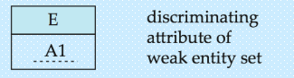

#### 菱形

- **联系集**：联系是指两个或多个实体之间的关系或关联，即实体集之间的行为动作
  
- **识别关系集**：强实体集和弱实体集之间的联系集
  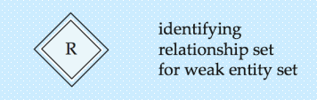

#### 椭圆

这是属性的另一种不写在实体集矩形中的方式，将属性作为分支写到实体集外

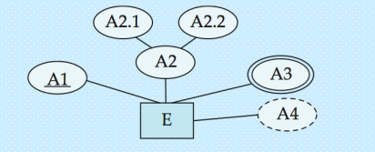

E是实体集，A1是主属性，A2是复合属性，A3是多值属性，A4是派生属性

#### 线段

实体集与联系集之间

- 实体集(E)中全部属性都参与到联系集(R)中
  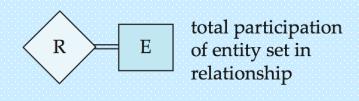
- 关系基数
  - **多对多**
    
  - **多对一**
    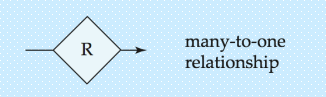
  - **一对一**
    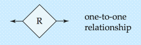
  - **基数限制**：1..h表示，最少1个，最多h个
    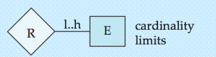
- 角色指示符：用来表示和描述某个实体在其与其他实体关系中的角色
  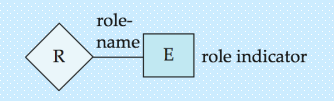

实体集与实体集之间

- **泛化**：继承，ISA即"is a"是一个的关系，比如 狗是一个动物
  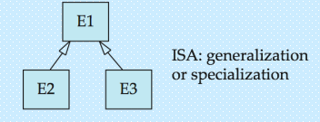
  - **不相交泛化**：一个实例不能同时属于多个子类
    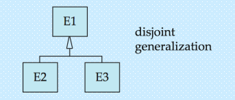
  - **完全泛化**：父类的每个实例都必须属于某个子类
    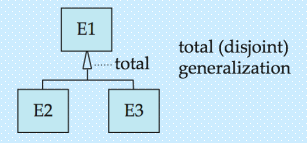

### UML（统一建模语言)

UML 是 `Unified Modeling Language`（统一建模语言）的缩写，它不是编程语言，而是一套标准化的**可视化建模语言**，用于清晰、直观地描述软件系统的各类特征。

UML 并非单一图表，而是一个 “建模工具集”，可覆盖软件系统的全生命周期建模，比如：

- 结构建模（如类图、组件图）：描述系统的静态结构（各元素及关联）；
- 行为建模（如用例图、时序图）：描述系统的动态行为（功能执行、交互流程）；
- 部署建模（如部署图）：描述系统的物理部署架构（软硬件分布）。

> [!tip]
>
> UML 类图与 E-R 图相对应（功能重叠），但存在若干差异。解读：
>
> - 对应性：两者均用于**静态结构建模**，UML 类图对应 E-R 图的核心功能 —— 抽象现实中的对象 / 实体及其关联关系，是软件设计与数据库设计的衔接桥梁；
> - 差异性：两者的设计目标、符号体系、约束表达存在区别
>   - **直接连线表示关系集**：二元关系集在 UML 中仅通过绘制一条连接两个实体集（类）的直线来表示，关系集的名称标注在直线旁。
>   - **明确实体在关系中的角色**：实体集在关系集中所扮演的角色，可通过在直线上（靠近对应实体集的位置）标注角色名称来指定。
>   - **虚线连接属性框**：关系集名称也可与关系集的属性一起写在一个方框内，再用一条虚线将该方框连接到表示关系集的直线上。

---

## 概念数据库设计过程

概念数据库设计是数据库设计的核心阶段，核心目标是基于业务需求构建**无冗余、逻辑一致、精准匹配业务**的全局 E-R 模式（实体 - 关系模型），整体流程分为「局部 E-R 模式设计」「全局 E-R 模式设计」「全局 E-R 模式优化」三大核心阶段

### 局部 E-R 模式设计（分模块建模，贴合业务场景）

局部 E-R 模式设计是 “分而治之” 的过程，针对复杂系统按业务模块拆分后分别建模，避免直接设计全局模式导致逻辑混乱：

- 需求分析结果
- 确定局部结构范围
- 实体定义
- 联系定义
- 属性分配

### 全局 E-R 模式设计（合并局部模式，消除冲突）

全局 E-R 模式设计是将多个独立的局部 E-R 模式合并为统一的全局 E-R 模式的过程，核心是 “统一标准、消除冲突”

- 确定公共实体类型

- 合并两个局部E-R模式

- 检查并消除冲突

  > [!note]
  >
  > （1） 属性冲突
  >
  > 指同一属性在不同局部模式中定义不一致，分为两种：
  >
  > - 属性域冲突：属性的类型、取值范围、精度不同（如 “学号” 在 A 局部模式中是字符型（长度 10），在 B 局部模式中是数值型；“成绩” 在 A 中是 0-100，在 B 中是 A-F 等级）；
  > - 属性取值单位冲突：属性的计量单位不同（如 “学生体重” 在 A 中以 “千克” 为单位，在 B 中以 “磅” 为单位；“商品价格” 在 A 中以 “元” 为单位，在 B 中以 “美元” 为单位）；
  > - 解决方法：统一标准（由业务部门确认最终规范，如学号统一为字符型 10 位、体重统一为千克）。
  >
  > （2） 命名冲突
  >
  > 指对象名称不一致导致的歧义，分为两种：
  >
  > - 同名异义：同一名称对应不同对象（如 “订单” 在 A 局部模式中是 “学生选课订单”，在 B 局部模式中是 “财务缴费订单”）；
  > - 异名同义：不同名称对应同一对象（如 “学生” 在 A 局部模式中叫 “学员”，在 B 局部模式中叫 “在校生”；“课程” 在 A 中叫 “课目”，在 B 中叫 “科目”）；
  > - 解决方法：统一命名规范（确定唯一名称，标注别名，消除歧义）。
  >
  > （3） 结构冲突
  >
  > 指同一对象在不同局部模式中的抽象形式或关联关系不一致，分为三种：
  >
  > - 同一对象的抽象不同：在 A 局部中是实体，在 B 局部中是属性（如 “职工” 在 A 中是独立实体（含工号、姓名、部门），在 B 中是 “部门” 实体的一个属性）；
  > - 同一实体的属性组成不同：在 A 局部中含属性 “邮箱”，在 B 局部中无该属性；或属性名称一致但含义不同；
  > - 同一联系的类型不同：在 A 局部中是 1:N 关系，在 B 局部中是 M:N 关系（如 “教师” 与 “课程” 的关联，A 中是 “1 个教师教 1 门课”（1:N），B 中是 “1 个教师教多门课，1 门课被多个教师教”（M:N））；
  > - 解决方法：按全局业务需求统一抽象形式和关联类型（如将 “职工” 统一为实体；补充缺失属性；按实际业务确定联系类型为 M:N）。

- 循环合并：检查是否有未合并的局部模式

### 全局 E-R 模式优化（精简结构，消除冗余）

初步的全局 E-R 模式可能存在冗余（冗余属性、冗余联系），需通过优化提升模型的简洁性和可维护性

-  合并实体类型
-  消除冗余属性
- 消除冗余联系

优化完成后，得到最终的全局 E-R 模式（E-R 图），该模式无冗余、逻辑一致、精准匹配全局业务需求，是后续逻辑数据库设计的输入。

