# 关系数据库设计（Relational Database Design）

关系数据库设计有两大阶段：一是**概念设计阶段**以E-R 模型方式通过实体、关系等抽象概念描述业务需求；二是**逻辑设计阶段**即关系模型（关系数据库的最终数据模型），主要是以函数依赖理论为基础，通过**规范化设计**优化结构，比如通过范式（1NF、2NF 等）逐步消除数据冗余与操作异常

> 数据库规范化设计：**减少数据冗余**（同一组数据在多个表中重复存储）避免和定义一个**规范的表间结构**，以更好地实现**数据完整性和一致性**
>
> 所以通过数据库规范化设计会**降低数据存储和维护数据一致性的成本**，**便于设计合理的关系表间的依赖和约束关系**

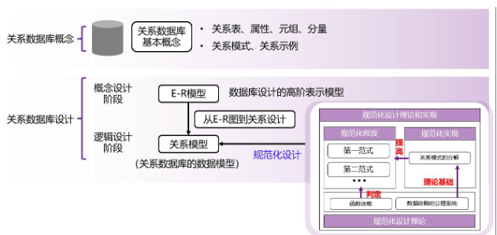

其中**逻辑设计过程**大致为： “判断模式优劣→分解优化→依赖理论支撑”

1. 判断一张表的结构是否 “合理”—— 核心标准是**无数据冗余、无操作异常（插入 / 删除 / 更新异常）**
   - 量化判断工具：**范式（Normal Form）**（对应下方 “范式” 模块），从低到高分为 1NF、2NF、3NF、BCNF、4NF，范式级别越高，表结构越 “良好”（冗余越少、异常越少）。
2. 若模式 “不良”，则进行 “模式分解”：将一张结构混乱的大表，拆分为多张结构清晰的小表（{R₁, R₂, ..., Rₙ}）。
   - 每个子表都必须是 “良好形式”：即每张小表都满足较高范式（如 3NF 或 BCNF），各自消除冗余和异常；
   - 分解是 “无损连接分解（lossless-join decomposition）”，可以通过分解的子表通过自然连接还原原表

所有判断和分解操作，都依赖两大核心依赖关系：

- 函数依赖（functional dependencies/FD）：属性间的 “决定关系”（如 “学号→姓名”“部门名→部门地址”），是判断范式、识别冗余的核心工具（比如通过 “非候选键→属性” 的依赖，发现表需拆分）；
- 多值依赖（multivalued dependencies/MVD）：解决 “一对多” 场景的冗余问题（函数依赖覆盖不到），比如 “员工→→孩子”“员工→→电话”，是 4NF 的基础，指导更精细的拆分。

具体设计过程如下：

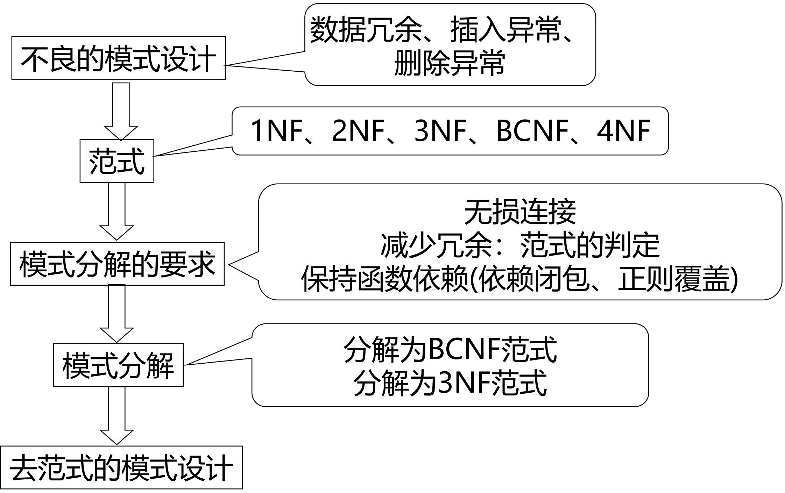


## 好的关系设计特点（Features of Good Relational Design）

首先理解什么是否需要拆分表， 以`inst_dept`为例

> `inst_dept`是合并了 “教师表（instructor）” 和 “部门表（department）” 的表（包含`ID, name, dept_name, building, budget`等字段），**必须拆分的原因是 “存在不合理的函数依赖”**：
>
> 1. **函数依赖的矛盾**：`dept_name → building, budget`（部门名决定部门的办公地点和预算），但`dept_name`不是`inst_dept`的候选键（`inst_dept`的候选键是教师 ID）；
> 2. **冗余的直接后果**：同一部门的`building`和`budget`会随该部门的每个教师重复存储（比如 “计算机系” 有 10 名教师，`building`和`budget`会被存 10 次），导致存储冗余 + 更新成本高（修改部门预算需同步改 10 条记录）。

拆分表的核心逻辑是 “**消除‘非候选键→属性’的函数依赖**”：即 “非候选键是否决定其他属性”：

1. 规则：若一个属性集（如`dept_name`）能决定其他属性（如`building, budget`），但它不是当前表的候选键，说明该表 “职责过载”，需要拆分为独立的表（如`department(dept_name, building, budget)`）；
2. 例子：`inst_dept`中`dept_name`决定`building, budget`，但`dept_name`不是候选键→拆分出`department`表，仅保留`instructor(ID, name, dept_name)`，通过`dept_name`关联两张表。

### **有损分解**（A Lossy Decomposition）

**有损分解**（A Lossy Decomposition）：原表经过分解之后进行**自然连接**，如果形成的表与原表相同则为**无损分解**；否则为**有损分解**

> [!note]
>
> **无损分解的标准**：以`R(A,B,C)`拆为`R1(A,B)`和`R2(B,C)`为例，只要`R1和R2的交集（B）是其中一个表的候选键`（比如`B`是`R2`的候选键），连接时就能通过`B`准确匹配，还原原始数据。
>
> 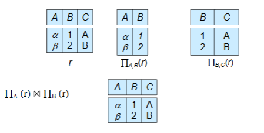

不是所有拆分都有效 ——“有损分解” 会丢失数据；而拆分表必须满足 **“无损连接”**（拆分后的表能还原原始数据），否则是错误拆分：

1. **反例**：将`employee(ID, name, street, city, salary)`拆为`employee1(ID, name)`和`employee2(name, street, city, salary)`；
2. **问题**：若存在同名员工（比如两个 “张三”），`employee1`和`employee2`自然连接时，会把不同员工的地址、薪资错误关联，无法还原原始`employee`表的正确数据（这种拆分叫 “有损分解”）；

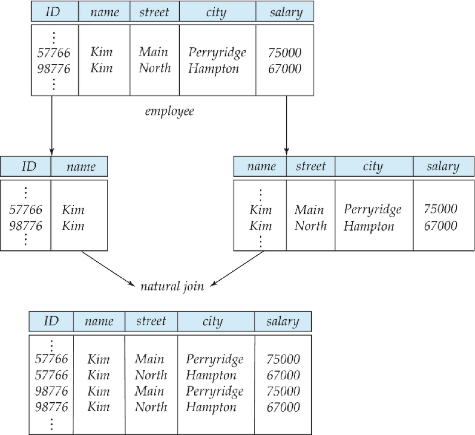


## 原子域和第一范式（Atomic Domains and First Normal Form）

核心是**第一范式（1NF）的定义、原子性判断标准**

### 原子域（Atomic Domain）

原子域指**属性的取值是 “不可再分的最小单元”** —— 不能把一个属性值拆成多个有独立意义的部分，否则该属性的域就不是原子的。或者反过来说，一个域是**原子的**（atomic ），如果该域的元素被认为是不可分的单元。

非原子域的典型例子：

- **集合类属性**：如 “客户的账号集合”（一个客户对应多个账号，直接存在一个字段中）、“账号的所有者集合”（一个账号对应多个所有者）；
- **复合属性**：如 “家庭住址”（包含省、市、区、街道等，可拆分）；
- **可拆分的标识**：如学号`CS0012`（前两位`CS`代表计算机系，后四位`0012`是序号，若需从学号中提取 “部门”，则学号的域不是原子的）。


### 第一范式（1NF）

根据上述原子域的概念引申出第一范式（1NF）的判定标准：

称一个关系模式 R 属于**第一范式**（First Normal Form，1NF），如果 R 的**所有属性的域都是原子的**。

- 严格定义：若关系模式`R`中**所有属性的域都是原子的**，则`R`满足第一范式（1NF）；

1NF 是关系数据库的**最低要求**（课件明确 “默认所有关系都满足 1NF”），不满足 1NF 的表无法被关系数据库正常存储和处理；

而非原子值会增加存储复杂度，并导致数据的冗余（重复）存储

但是必须注意：原子性本质上是域中元素的**使用属性**

- 原子性是 “使用层面” 的属性（而非绝对属性）即原子性不是属性本身的固定特性，而是由**使用方式决定**
- 字符串`CS0012`，若仅作为 “学生唯一标识”（不拆分使用），则是原子的；若需要从字符串中提取 “部门”（`CS`）、“序号”（`0012`），则该字符串的域不是原子的；


## 范式

### 函数依赖（Functional Dependency ）

函数依赖是对 “关系模式中合法数据” 的硬性约束即**合法关系的约束条件** —— 它要求：**若一组属性（α）的取值确定，另一组属性（β）的取值必须唯一确定**（α 决定 β，记为 α→β）。

> [!tip]
>
> 严格数学定义：设 R 为关系模式，α⊆R（α 是 R 的属性子集）、β⊆R（β 是 R 的属性子集）：
>
> - α→β 在 R 上成立，当且仅当：对 R 的任何合法数据（关系 r），任意两个元组 t₁和 t₂，若 t₁[α] = t₂[α]（α 的属性值相同），则必然有 t₁[β] = t₂[β]（β 的属性值相同）。
>
> 关系 r (A,B) 的数据为：(1,4)、(1,5)、(3,7)
>
> - A→B 不成立：A=1 时，B 有 4 和 5 两个不同值（A 无法唯一决定 B）；
> - B→A 成立：B=4→A=1、B=5→A=1、B=7→A=3（B 的每个值对应唯一 A）。

函数依赖源于**客观世界的规则**（如 “部门名→部门地址”“学号→姓名”），不是从某组具体数据中总结出来的。

而特定数据属性之间的关系，并不能代表该关系模式所有实例数据之间可能的关系：比如某组数据可能 “偶然满足” 某 FD（如某班无同名学生，“姓名→学号” 偶然成立），但不代表该 FD 对所有合法数据都成立

同时Functional Dependency 是 “**键（Key）概念的推广**”

- 键的本质是 “能决定所有属性的属性集”（如候选键 K→R），而 FD 是 “属性集之间的决定关系”—— 键是 FD 的特殊情况（α=K，β=R），FD 则覆盖了更广泛的属性依赖场景。

#### “平凡 FD” 和 “非平凡 FD”

Functional Dependency又分为 **“平凡 FD” 和 “非平凡 FD”**

- 平凡 FD：所有关系实例都必然满足的 FD（无实际约束意义）无需额外约束，判定标准是 β⊆α（β 是 α 的子集）；
  - 若`β⊆α`（右边属性集是左边属性集的子集），则`α→β`是平凡函数依赖。
  - 简单来说，就是集合->子集的依赖
  - 示例：ID,name→ID（右边 ID 是左边子集）、name→name（右边等于左边）；
- 非平凡 FD：需通过约束保证的 FD（有实际意义），如 ID→name、dept_name→building。


#### 超键（superkey）和候选键（candidate key）

1. 超键（Superkey）

   - “K 是关系模式 R 的超键，当且仅当 K→R”（K→R 表示 “属性集 K 能决定关系 R 中的所有属性”）。
   - 超键是**能唯一标识一条记录的属性集**—— 只要知道 K 中所有属性的值，就能确定这条记录中其他所有属性的值（无歧义）
   - 注意：超键允许包含 “冗余属性”，只要核心标识属性存在即可，即只要**子集存在唯一标识就可以作为超键**

2. 候选键（Candidate Key）

   - K 是关系模式 R 的候选键，当且仅当：

     1. K→R（K 是超键）；
     2. 不存在任何 α⊂K（α 是 K 的真子集），使得 α→R（移除 K 中任何一个属性后，剩余属性集不再是超键）。

   - 候选键是 **“最小的超键”**—— 既满足 “唯一标识记录”，又不包含任何冗余属性（多一个属性多余，少一个属性不行）

     

> [!tip]
>
> 超键只能表达 “某属性集能决定所有属性”（如 ID→R），而函数依赖可表达 “部分属性之间的约束关系”
>
> 函数依赖的价值在于：既可以表达 “超键→所有属性”（候选键的约束），也可以表达 “非超键→部分属性”（如 dept_name→building）或 “部分属性无依赖”（如 dept_name 不→salary）


#### SQL中的函数依赖

除了候选键和主键外，SQL没有提供函数依赖的支持，可以通过**断言**来完成

用「断言（Assertion）」实现普通函数依赖的校验：

- 写一个断言以保证在 *R*(*A*,*B*,*C*) 上成立 *B*→*C*

  - 只要出现「同一个 B 值，对应了 2 个及以上不同的 C 值」，就违反了这个函数依赖

  ```sql
  create assertion BtoC check
  (
    not exists
    (
      select B
      from R
      group by B
      having count(distinct C) > 1
    )
  );
  ```

#### Use of Functional Dependencies

函数依赖的本质是 “通过属性间的决定关系，规范数据的合法性与约束范围”，具体落地为两大核心作用：

1. **检验关系的合法性**（验证数据实例是否合规）
   - 给定一组函数依赖集`F`（如`ID→name`、`dept_name→building`），判断某张表的具体数据（关系`r`）是否符合这些规则。
   - 若关系`r`中所有元组都满足`F`中的每一条函数依赖，则称`r`满足`F`，即`r`是合法关系；反之则为非法。
   - 比如在教师表中，若存在 “同一`ID`对应两个不同`name`” 的元组，就违反了`ID→name`的 FD，可直接判定该数据实例非法，避免脏数据进入数据库。
2. **定义合法关系的全局约束**（规范表结构的所有实例）
   - 为关系模式`R`（如表结构定义）指定函数依赖集`F`，要求`R`的**所有合法实例**（即该表的所有数据版本）都必须满足`F`，此时称`F`在`R`上成立。
   - 比如为`instructor`表定义`ID→salary`，意味着 “同一教师 ID 的薪资必须唯一”，无论后续插入、更新多少条数据，都不能违反该规则，从根源上保障数据一致性。

**“实例偶然满足”≠“依赖全局成立”**，即不能将 “实例偶然满足” 的依赖作为全局约束（即不能认为`name→ID`在`instructor`表上成立），否则会导致后续数据插入 / 更新时出现异常


### 函数依赖闭包（F⁺）

函数依赖闭包（F⁺）的本质 —— 由已知函数依赖集（F）通过逻辑推理导出的**所有函数依赖的集合**

- 若从已知的 F 中，通过合理推理能得出某条新的函数依赖（如由`A→B`和`B→C`推出`A→C`），则称这条新依赖 “被 F 逻辑蕴含”。
- **闭包（F⁺）的本质**：F⁺是 F 本身，加上所有被 F 逻辑蕴含的函数依赖的 “完整集合”。
- **关键关系**：**F⁺一定是 F 的超集** ——F 中的每一条依赖都属于 F⁺（自身蕴含自身），且 F⁺中还包含大量推导得出的新依赖。

> [!tip]
>
> - 已知 F = {`A→B`, `B→C`}
> - 直接属于 F⁺的依赖：`A→B`、`B→C`（F 本身的依赖）；
> - 推导得出的依赖：
>   1. 传递律推导：由`A→B`和`B→C`，推出`A→C`；
>   2. 自反律推导（平凡依赖）：`A→A`、`B→B`、`C→C`、`A→AB`等；
>   3. 增广律推导：由`A→B`推出`AC→BC`，由`B→C`推出`AB→AC`等；
> - 最终 F⁺包含上述所有依赖，形成完整的 “依赖全集”。

F⁺看似抽象，实则是后续所有规范化操作的基础

1. **验证函数依赖是否成立**：判断某条依赖（如`A→C`）是否为 F 所蕴含，无需手动推导，只需检查该依赖是否在 F⁺中。
2. **判定超键与候选键**：某属性集 K 是超键，当且仅当`K→R`（R 为所有属性）属于 F⁺；进一步筛选 “最小超键”，即可得到候选键。
3. **支撑范式判定与模式分解**：BCNF、3NF 等范式的核心是 “消除不合理依赖”，而 “不合理依赖” 的判断，本质是检查依赖是否符合 F⁺中的逻辑关系；模式分解的 “依赖保持” 约束，也需通过 F⁺验证。


### BCNF范式（Boyce-Codd Normal Form）

BCNF（Boyce-Codd Normal Form，巴斯 - 科德范式）的严格定义：对关系模式 *R*，基于函数依赖集*F*的**闭包*F*+**中，**所有的非平凡函数依赖 *α*→*β***，必须满足：**箭头左边的属性集*α*，一定是*R*的超键**。

- *F*+ ：函数依赖集*F*的闭包，指从*F*能推导出来的**所有函数依赖**（包括*F*本身 + 所有隐含依赖）；
- 超键 (Superkey) ：能唯一决定关系*R*中**所有属性**的属性集，候选键 / 主键都是超键的「最小版本」；
- 非平凡函数依赖 ：*β*⊆*α*，比如`dept_name→building,budget`，这是我们设计中真正要约束的依赖，平凡依赖（如`ID,name→ID`）无意义，不影响 BCNF 判定。

BCNF 是**比 3NF 更严格的范式**，也是数据库设计的「理想范式」，它的核心目标：**彻底消除关系模式中所有的「非超键决定属性」的不合理依赖，从根源上杜绝数据冗余和插入 / 删除 / 更新异常**。

简单来说，**在表中，任何能决定其他属性的属性集，都必须是能唯一标识整张表的超键**。

> `inst_dept (ID, name, salary, dept_name, building, budget )` 为什么不满足 BCNF
>
> `dept_name→building,budget`是 *F*+ 中的非平凡函数依赖，满足 2 个条件：
>
> - 箭头左边：`α = dept_name`
> - **`dept_name` 不是 `inst_dept` 表的超键** → 因为`dept_name`只能决定`building,budget`，无法决定`ID、name、salary`等属性，不能唯一标识整张表的记录。所以不满足BCNF

#### **BCNF 模式分解算法**

当关系模式*R*，因为**某一条非平凡函数依赖 *α*→*β*** 违反 BCNF 时，拆分为两个子表：`(α∪β)、(R−(β−α))`

拆分结果：**一定满足 BCNF + 一定是无损连接分解**（拆分后能还原原表，不丢数据、不产生脏数据）。

> 已知违规依赖：` α = dept_name ， β = building,budget `
>
> 表 1： `α∪β={dept_name,building,budget}` → 部门表department，dept_name是主键，满足 BCNF； 
>
> 表 2： `β−α={building,budget} `→ 原表去掉这两个属性即`(R−(β−α))` → `{ID,name,salary,dept_name} `→ 教师表instructor，ID是主键，满足 BCNF。
>
> 例题：*R*(*A*,*B*,*C*,*D*),*F*={*B*→*C*}，拆分结果：表 1(*B*,*C*)、表 2(*A*,*B*,*D*)。

---

#### 数据库一致性约束

数据库一致性约束的 5 种表达形式，按**实用程度从高到低**排序：

- **PK（主键约束）**：最常用，强制主键唯一性，核心约束；本质是函数依赖
- **Check（检查约束）**：常用，约束字段取值（如`salary>0`），轻量高效；
- **Trigger（触发器）**：实用，替代断言的主流方案（MySQL 无断言），实现复杂约束；
- **FD（函数依赖）**：理论核心，是所有约束的设计依据；
- **Assertion（断言）**：标准 SQL 语法，极少用，性能代价过高。

约束（包括函数依赖）在实际中校验的**代价很高**，除非约束**只作用于同一张关系表（单个表）**。即单个表的FD较为实用

如果**只需要在分解后的「每一张子表」上分别校验对应的函数依赖**，就能够保证「原表的所有函数依赖都成立」，那么这样的分解就称为 **依赖保持（dependency preserving）**。

**定义**：若关系模式 R(U, F) 分解为 R1(U1, F1), R2(U2, F2), ..., Rk(Uk, Fk)，并且原始关系模式 R 的每一个函数依赖要么由分解后的关系模式中的某个函数依赖集 F1, F2, ..., Fk 所逻辑蕴涵，则称该分解保持函数依赖。

- 若每次分解都恰好是一个函数依赖，则分解保持依赖
- 拆分表的时候，**每次拆分的依据，就是某一个独立的函数依赖 *α*→*β***，把这个依赖的「决定方 + 被决定方」单独拆成一张表 → 那么这次分解一定是**依赖保持的**。

无法在所有情况下，同时实现「BCNF 范式」和「依赖保持」这两个目标，所以我们引入了一种更宽松的范式，称为 **第三范式（3NF，Third Normal Form）**

---


### 第三范式（3NF，Third Normal Form）

3NF第三范式严格定义 → BCNF一定是3NF的证明 → 数据库分解的三大目标 → BCNF的局限性（有异常但满足BCNF） → 引出多值依赖+4NF第四范式

对关系模式*R*，基于函数依赖集*F*的闭包*F*+中，**所有的函数依赖 \*α\*→\*β\***，只要满足「三个条件中的任意一个」，则*R*满足 3NF。

1. **α→β 是平凡函数依赖 ( β⊆α )**，平凡依赖**永远不影响范式判定**，3NF/BCNF 都对其无要求

2. **α 是关系模式 R 的超键 (Superkey)**，**和 BCNF 的核心条件完全一致**！BCNF 的要求就是「所有非平凡 FD 的左部必须是超键」；

3. **β−α中的每一个属性，都包含在R的某个候选键中**

   - β−α → 取「箭头右边的属性集 β 」中，不在箭头左边 α 里的那些属性即**被*α*决定的、且不在决定方中的属性**
   - 被α决定的这些属性（β−α），每一个都必须是「主属性」即任意候选键的助兴

   *β*−*α*中的不同属性，可以属于**不同的候选键**，不需要都在同一个候选键里，只要每个属性都在「某一个」候选键中即可。

3NF 是 **BCNF 的「最小程度宽松版」**：

- BCNF 只允许满足「条件 1、条件 2」；而 3NF 在 BCNF 的基础上，**额外放宽允许满足条件 3**。
- 3NF 允许存在「少量的、可控的、基于主属性的不合理依赖」即条件3，代价是引入**极少量的冗余**，但换来的是「**依赖保持**」这个核心工程需求。

> [!important]
>
> 如果一个关系模式满足 BCNF，那么它**一定、必然**满足 3NF。
>
> 证明如下：
>
> BCNF 的要求是：所有*α*→*β*∈*F*+，满足「平凡依赖 或 α 是超键」→ 这两个条件恰好是 3NF 的前两个条件；所以**满足 BCNF 的关系，天然满足 3NF 的条件**，BCNF 是 3NF 的**真子集**。


#### 数据库模式分解

数据库分解的三大黄金准则：**范式合规 > 无损连接 > 依赖保持**

1. 分解后的每一张子表，都必须是「良好范式」（good form）：子表满足**3NF 或 BCNF**， 消除冗余、避免操作异常；
2. 分解必须是「无损连接分解（lossless-join）」：分解后的多张表，通过**自然连接**能**完全还原出原始表的数据**
3. 尽可能满足「依赖保持分解（dependency preserving）」：原表的所有函数依赖，都能在分解后的某一张子表中完整体现，无需跨表连接就能验证；


#### 第四范式（4NF）

**存在一些满足 BCNF 的关系模式，但它们依然没有被「充分规范化」** → 依然存在**数据冗余 + 操作异常**。

BCNF 只能解决**函数依赖 (FD)** 带来的冗余和异常，但无法解决**多值依赖 (MVD)** 带来的冗余和异常

> `inst_info (ID, child_name, phone)` 
>
> ① 一个教师可以有**多个子女** ② 一个教师可以有**多个电话** ③ 子女和电话之间**没有任何关联**
>
> 这个表中，**不存在任何非平凡的函数依赖**：则满足BCNF
>
> 教师的每个子女，都会和教师的每个电话组合成一条记录 → 记录数是「子女数 × 电话数」，大量重复存储 child_name 和 phone，冗余极高。

**函数依赖 (FD) 无法描述这类冗余，需要引入新的依赖关系 → 多值依赖 (MVD)**，进而引入更高的范式 → 4NF。

多值依赖的本质：α →→ β 表示「α 确定后，β 的取值和 R-β 的取值相互独立」；

> `classes (course, teacher, book)`
>
> ① 一门课程可以有**多个教师**授课 ② 一门课程需要**多本教材** ③ 教师和教材之间**无关联**
>
> 虽然满足BCNF，但是给数据库课程新增一位教师 Marilyn，**必须为该课程的每一本教材都新增一条记录**存在插入异常，所以分解该表
>
> 1. `teaches (course, teacher)` → 专门存课程和教师的关系
> 2. `text (course, book)` → 专门存课程和教材的关系


## 函数依赖理论（Functional Dependency Theory）

1. 先建立一套 “数学规则”，用来判断 —— 从已知的函数依赖集`F`（比如`A→B`、`B→C`），能推导出哪些 “隐含的函数依赖”（比如`A→C`）。
2. 设计具体步骤，把不满足 BCNF/3NF 的 “不良表”，拆分成多张满足范式的子表，且保证分解是「无损连接」
3. 设计验证方法，判断拆分后的子表是否 “保留了原表的所有函数依赖”

### 函数依赖的闭包（F⁺）

已知依赖集`F`，有些依赖虽然没直接写在`F`里，但通过逻辑推理能必然成立，这些就是 “被 F 逻辑蕴含” 的依赖。

而所有依赖的 “完整集合”就是**函数依赖的闭包（F⁺）**：`F⁺`是`F`的超集（`F`是`F⁺`的子集），且是 “唯一的完整集合”

而所有被 F 逻辑蕴含的依赖都可以通过Armstrong 公理系统推理出来

#### Armstrong 公理系统

| 公理名称                      | 规则描述                                      | 通俗解读                       | 示例                             |
| ----------------------------- | --------------------------------------------- | ------------------------------ | -------------------------------- |
| 自反律（Reflexivity）         | 若`β⊆α`（右边属性集是左边的子集），则`α→β`    | 子集依赖天然成立，无需额外定义 | `ID,name→ID`、`AB→A`（平凡依赖） |
| 传递律（Transitivity）        | 若`α→β`且`β→γ`，则`α→γ`                       | 依赖可传递，是推导核心         | 由`A→B`和`B→C`，得`A→C`          |
| 增广律/增补律（Augmentation） | 若`α→β`，则`γα→γβ`（左右同时加同一属性集`γ`） | 依赖可 “扩展属性”，不改变本质  | 由`A→C`，得`AG→CG`（两边加`G`）  |

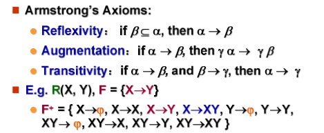

 Armstrong 的自反 / 增广 / 传递律推导的衍生规则

| 规则名称                       | 形式化描述                        | 通俗解读                                                     | 示例                         |
| ------------------------------ | --------------------------------- | ------------------------------------------------------------ | ---------------------------- |
| 合并律（Union）                | 若 α→β 且 α→γ 成立，则 α→βγ 成立  | 同一属性集 α 能决定 β 和 γ，就能同时决定 β+γ（合并右边）     | 由`A→B`和`A→C`，直接得`A→BC` |
| 分解律（Decomposition）        | 若 α→βγ 成立，则 α→β 且 α→γ 成立  | 合并律的逆规则：α 能决定 β+γ，就能分别决定 β 和 γ（拆分右边） | 由`A→BC`，直接得`A→B`和`A→C` |
| 伪传递律（Pseudotransitivity） | 若 α→β 且 γβ→δ 成立，则 αγ→δ 成立 | 传递律的扩展：α 决定 β，γ+β 决定 δ → α+γ 就能决定 δ（左边叠加） | 由`A→B`和`CB→D`，得`AC→D`    |

> [!note]
>
> 三个公理的证明
>
> 1. 自反律（Reflexivity） 
>
>    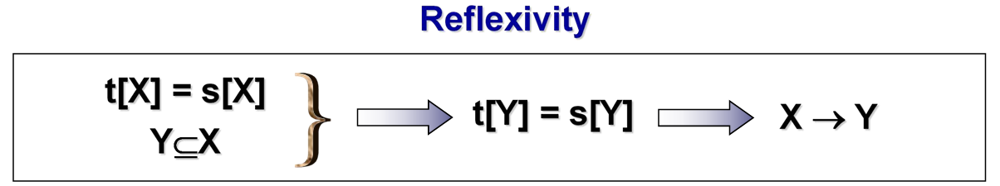
>
> 2. 传递律（Transitivity）
>
>    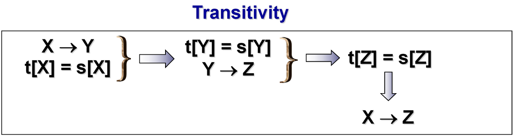
>
> 3. 增广律/增补律（Augmentation）
>
>    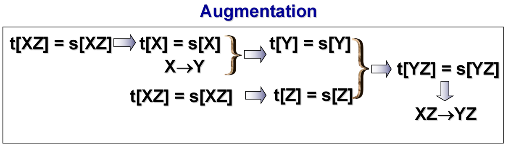
>
> 三个额外定理的证明
>
> - **合并律**（union rule）：若 α→β 和 α→γ 成立，则 α→βγ 成立。
>
>   > α→β （题目已知）1️⃣
>   >
>   > αγ→βγ （增补律）2️⃣
>   >
>   > α→γ （题目已知）3️⃣
>   >
>   > αα→αγ （增补律）4️⃣
>   >
>   > 即 α→αγ 5️⃣
>   >
>   > 由 2️⃣ 和 5️⃣ 得 α→βγ （传递律）
>
> - **分解律**（decomposition）：若 α→βγ 成立，则 α→β 和 α→γ 成立。
>
>   > α→βγ （题目已知）1️⃣
>   >
>   > 由 β⊆βγ 得 βγ→β （自反律）2️⃣
>   >
>   > 由 γ⊆βγ 得 βγ→γ （自反律）3️⃣
>   >
>   > 由 1️⃣ 和 2️⃣ 得 α→β （传递律）
>   >
>   > 由 1️⃣ 和 3️⃣ 得 α→γ （传递律）
>
> - **伪传递律**（pseudotransitivity rule）：若 α→β 和 γβ→δ 成立，则 αγ→δ 成立。
>
>   > α→β （题目已知）1️⃣
>   >
>   > αγ→βγ （增补律）2️⃣
>   >
>   > 即 αγ→γβ 3️⃣
>   >
>   > γβ→δ （题目已知）4️⃣
>   >
>   > 由 3️⃣ 和 4️⃣ 得 αγ→δ （传递律）

算法通过**迭代遍历 + 规则应用**，把所有能从 F 推导的依赖 “无遗漏” 地纳入 F⁺，直到 F⁺稳定（无新依赖可加），保证结果的完整性。

```tex
To compute the closure of a set of functional dependencies F:
计算函数依赖集F的闭包步骤：
1. F⁺ = F  
   ✅ 初始化为：闭包F⁺先把原始依赖集F全部包含进来（F是F⁺的基础子集）。

2. repeat （重复执行以下步骤）
   a. for each functional dependency f in F⁺
      apply [Armstrong] rules on f
      add the resulting functional dependencies to F⁺
      ✅ 遍历当前F⁺中的每一条依赖f，对f应用Armstrong公理（自反律、增广律、传递律），把推导出来的新依赖都加入F⁺。
   
   b. for each pair of functional dependencies f1 and f2 in F⁺
      if f1 and f2 can be combined using [附加规则]
      then add the resulting functional dependency to F⁺
      ✅ 遍历当前F⁺中每一对依赖f1、f2，若二者能通过后续的“附加规则”（合并/分解/伪传递）组合推导，就把新得到的依赖加入F⁺。

3. until F⁺ does not change any further
   ✅ 终止条件：当一轮迭代后，F⁺中没有新增任何依赖（所有能推导的都已加入），迭代停止，此时的F⁺就是最终闭包。

NOTE: We shall see an alternative procedure for this task later
✅ 后续会用“属性集闭包”间接验证依赖，效率更高。
```


### 属性集闭包（α⁺）

如果 α→β ，我们称属性 B 被 α **函数确定**（functionally determine）。要判断集合 α 是否为超码，我们必须设计一个算法，用于计算**被** α **函数确定的属性集**。

但是由于计算 F+，找出所有左半部为 α 的函数依赖，并合并这些函数依赖的右半部。但是这么做开销大，因为 F+ 可能很大。所以计算属性集的闭包进行替代：

令 α 为一个属性集。我们将函数依赖集 F 下被 α 函数确定的所有属性的集合称为 F 下 α 的闭包，记为 α+ 。

```cpp
result = α;  // 步骤1：初始化结果集为属性集α本身
while (changes to result) do  // 步骤2：循环迭代，直到result不再变化
  for each β→γ in F do  // 遍历F中的每一条函数依赖β→γ
    begin
      if β ⊆ result then result := result ∪ γ;  
      // 关键逻辑：若β是当前result的子集（β能被α决定），则把γ加入result（γ也能被α决定）
    end
```

> 计算 (AG)⁺：
>
> R = (A, B, C, G, H, I)；F = {A → B A → C CG → H CG → I B → H}
>
> 1. result = AG
> 2. result = ABCG (A → C and A → B)
> 3. result = ABCGH (CG → H and CG ⊆ AGBC)
> 4. result = ABCGHI (CG → I and CG ⊆ AGBCH)

#### 判定超键 / 候选键

1. 判定超键（Superkey）

- 若 α⁺包含关系模式 R 的**所有属性**，则 α 是 R 的超键（能唯一决定整条记录）。

2. 判定候选键（Candidate Key）

候选键是「最小超键」—— 超键中**去掉任何一个属性后，就不再是超键**。所以首先判断是否为超键，如果不是那不可能是候选键，如果是则检查超键的所有真子集是否存在超键，不存在则为候选键

- 判定步骤：
  1. 先确认 α 是超键；
  2. 检查 α 的**所有真子集**（比如 AG 的子集是 A、G），判断是否为超键：
     - 计算 A⁺：A→B→H，A→C → A⁺=ABCH（不包含 G、I）→ A 不是超键；
     - 计算 G⁺：G 无法决定任何属性 → G⁺=G（远小于 R）→ G 不是超键；
  3. **AG 的所有真子集都不是超键 → AG 是 R 的候选键**。

所以要验证 α→β 是否是 F 的隐含依赖（属于 F⁺），只需计算 α⁺，看 β 是否是 α⁺的子集。

如果 α 能决定的所有属性（α⁺）包含 β，说明 α→β 必然成立；反之则不成立。

> - 验证`AG→H`是否成立：H⊆(AG)⁺（ABCGHI）→ 成立；
> - 验证`A→I`是否成立：I⊈A⁺（ABCH）→ 不成立。

> [!tip]
>
> 如何通过 α⁺计算 F⁺：
>
> - 遍历 R 的所有属性子集 γ，计算每个 γ 的闭包 γ⁺；对 γ⁺中的每一个子集 S，γ→S 都是 F⁺中的依赖。
> - **本质**：通过「属性集闭包」间接生成完整的 F⁺（避免直接计算 F⁺的指数级复杂度）。
>
> - γ=A，γ⁺=ABCH → F⁺包含`A→A`、`A→B`、`A→C`、`A→H`、`A→AB`、`A→ABC`等所有 A→S（S⊆ABCH）的依赖。


### 候选键的计算

候选键是「最小超键」，需满足 “能唯一决定所有属性 + 去掉任意属性后不再是超键”

先将属性按在函数依赖集`F`中的位置分类，再利用定理缩小候选键范围：

| 属性分类      | 定义                  | 定理（候选键包含性）     |
| ------------- | --------------------- | ------------------------ |
| 左部（L 类）  | 只出现在`F`的依赖左边 | 一定出现在所有候选键中   |
| 右部（R 类）  | 只出现在`F`的依赖右边 | 一定不出现在任何候选键中 |
| 双部（LR 类） | 出现在`F`的依赖两边   | 可能出现在候选键中       |
| 外部（N 类）  | 不在`F`中出现         | 一定出现在所有候选键中   |

1. **筛选基础属性**：先收集 L 类 + N 类属性，组成初始集合`K`；
2. **验证初始闭包**：计算`K⁺`，若`K⁺`包含所有属性，则`K`是候选键；
3. **补充 LR 类属性**：若`K⁺`不包含所有属性，**逐一将 LR 类属性加入`K`**，计算闭包，直到`K⁺`包含所有属性；
4. **验证最小性**：去掉`K`中任意属性，若闭包不再包含所有属性，则`K`是候选键。

还有替换法（All-Candidate Keys 算法）:**利用双部属性的 “双向依赖” 特性**，通过「去掉一个双部属性 + 替换为其依赖的左部属性」，生成新的候选键

1. **步骤 1**：调用`Key-Finding(U,F)`，先找到**任意一个候选键**（记为`K`）；
2. **步骤 2**：将`K`加入队列`Q`，用于后续替换；
3. 步骤 3：循环处理队列`Q`中的候选键：
   - 取出队列头的候选键`K`；
   - 提取`K`中的**双部属性**（出现在依赖两边的属性）；
   - 对**每个双部属性`A`**，遍历依赖集`F`，找到包含`A`的依赖`X→Y`（`A∈Y`）；
   - 生成新候选键`K' = (K - A) ∪ X`，若`K'`未在队列中，则加入队列；
4. **终止条件**：队列`Q`为空，此时收集的所有候选键即为结果。

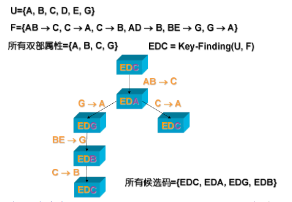


### 正则覆盖

函数依赖集`F`中可能存在两种冗余，需通过正则覆盖简化：

1. **冗余依赖**：某条依赖可由其他依赖推导（如`A→C`在`{A→B, B→C, A→C}`中冗余）；
2. 依赖中冗余属性
   - 右部冗余：如`A→CD`中`C`可由`A→B, B→C`推导，简化为`A→D`；
   - 左部冗余：如`AC→D`中`C`可由`A→B, B→C`推导，简化为`A→D`。

> [!tip]
>
> 无关属性：如果去除函数依赖中的一个属性后，依赖集的闭包不变，则该属性是「无关属性」
>
> 1. 左部无关属性：若`A∈α`，计算`(α−A)⁺`，若包含`β`，则`A`在`α`中无关；
>    - 简单来说就是减少左部`α`已知条件`A`重新计算属性闭包`a+`，看闭包是否包括右部`β`,包含则说明不需要`A`，`α`也可以推出`β`，`A`在`α`中无关紧要可以去除
> 2. 右部无关属性：若`A∈β`，计算`α⁺`（基于`F' = (F−{α→β}) ∪ {α→(β−A)}`），若包含`A`，则`A`在`β`中无关。
>    - 或者通过一个简单的办法，不需要构造新的函数依赖集，而是尝试假设α无法决定A，然后计算α的闭包α+是否包含A，包含则A在`β`中无关
>    - 即在已知条件左部`α`的情况下，修改函数依赖集，将α→β修改为α→(β−A)，然后重新计算闭包α+是否包含A，包含则说明可以通过其他依赖推出A，没有必要写到右部`β`中
>
> “强依赖→弱依赖”：
>
> - 若存在依赖`X→Y`，则任何包含`X`的左部（如`XZ→Y`）都是 “更强的依赖”，必然能推出原依赖；
> - 若存在依赖`X→Y`，则任何包含于`Y`的右部（如`X→Y'`，`Y'⊆Y`）都是 “更弱的依赖”，必然能被原依赖推出。

正则覆盖是与`F`等价的**最小依赖集**，满足：无冗余依赖、无无关属性、左部唯一，计算步骤：

1. **合并相同左部**：用「合并律」将左部相同的依赖合并（如`A→B`和`A→C`合并为`A→BC`）；
2. **删除无关属性**：先判定左部、再判定右部，删除无关属性；
3. **循环优化**：重复上述步骤，直到依赖集不再变化。

> （`R=(A,B,C), F={A→BC, B→C, A→B, AB→C}`）
>
> - 合并左部：`A→BC`（合并`A→BC`和`A→B`），`F={A→BC, B→C, AB→C}`；
> - 删左部无关属性：`AB→C`中`A`无关（`B⁺=BC`包含`C`），简化为`B→C`；
> - 删右部无关属性：`A→BC`中`C`无关（`A⁺=ABC`包含`C`），简化为`A→B`；
> - 最终正则覆盖：`F_c={A→B, B→C}`。

#### 无损连接（Lossless-join）

在好的关系设计中存在无损分解的解释，但是其针对于两个关系模式（表）而言，现在这个无损连接则是通过函数依赖进行判断分解是无损分解

含义一致：分解后的子表通过自然连接能**完全还原原表数据**（不丢失、不产生脏数据），称为 “无损连接分解”。

判定条件（充分条件）：若关系`R`分解为`R1、R2`，且**至少满足以下之一**，则分解是无损连接：

- `R1∩R2 → R1`（公共属性是`R1`的超键）；
- `R1∩R2 → R2`（公共属性是`R2`的超键）。

该条件是 “充分非必要” 的（仅当所有约束都是函数依赖时，才是必要条件）；


#### 依赖保持（Dependency Preservation）

Fi是函数依赖闭包F+的子集，且Fi中的所有依赖，仅包含子表Ri的属性（即依赖的左部、右部属性都在Ri中）。即*Fi* 是「原表所有依赖中，能完整落在子表 *Ri* 里的那部分依赖」（包括直接定义的和隐含的）。

依赖保持：若 “所有子表依赖集的并集” 的闭包，等于 “原表依赖集 *F* 的闭包”，则该分解是依赖保持的。

为什么需要依赖保持？因为若分解不保持依赖，验证某条依赖是否被满足时，需要把多个子表连接起来（还原原表）才能校验

依赖保持的通用判定算法：

当需要验证「某条具体依赖 ***α*→*β* 是否被保持**」时，可通过以下多项式时间算法判定（无需计算庞大的 *F*+）

```c
result = α;  // 步骤1：初始化结果集为依赖的左部α
while (changes to result) do  // 步骤2：循环扩展result，直到不再变化
  for each R_i in the decomposition  // 遍历所有子表R_i
    t = (result ∩ R_i)^+ ∩ R_i  // 计算“result与R_i的交集”的闭包，再取与R_i的交集,注意此时的闭包基于原依赖集 F 计算
    result = result ∪ t  // 步骤3：将t加入result，扩展α能决定的属性范围
// 步骤4：判定结果
If result contains all attributes in β, then α→β is preserved.
// 若最终result包含β的所有属性，则该依赖被保持；否则不被保持
```


## 分解算法（Decomposition Algorithm）


### BCNF（Boyce-Codd 范式）分解

可以通过计算F+加上BCNF的定义用于检查一个关系是否属于BCNF，但是F+计算复杂，所以在某些情况下，判定一个关系是否属于BCNF可以作如下简化，**只能分解之前使用**：

- 为了检查非平凡的函数依赖 α→β 是否违反 BCNF，计算 α+( α的属性闭包)，并且验证它是否包含 R 中的所有属性，即验证它是否是 R 的超码。
- 检查关系模式 R 是否属于 BCNF，仅须检查给定集合 F 中的函数依赖是否违反 BCNF 就足够了，**不用检查 F+ 中的所有函数依赖**。

**一个关系分解后，后一步过程就不再适用。**也就是说，当我们判定 R 上的一个分解 Ri 是否违反 BCNF 时，只用 F 就不够了，只能在 F+ 的范围。

> （R=(A,B,C,D,E), F={A→B, BC→D}）
>
> - 分解后 R2=(A,C,D,E)，F 中无依赖仅包含 R2 的属性，易误判 R2 满足 BCNF；
> - 实际 F⁺中存在 AC→D（隐含依赖），且 AC⁺=ACBD≠R2 的所有属性（ACDE）→ R2 不满足 BCNF。

**BCNF 分解算法**：**保证无损分解，无法保证依赖保持**：

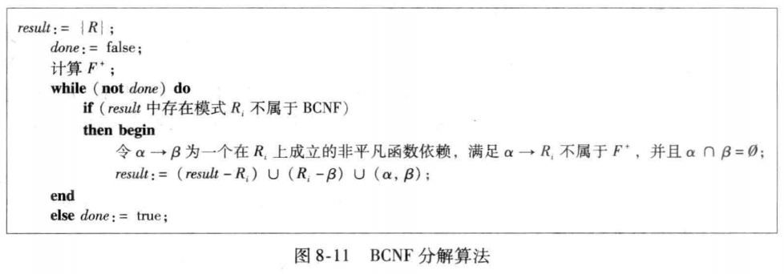

> 1. **求候选键**：确定关系的候选键（超键的最小集）；
> 2. **识别违规依赖**：检查函数依赖集，若某依赖的左部不是候选键（超键），则该依赖违反 BCNF；
> 3. 拆分关系：用违规依赖（如A→B）拆分原关系：
>    - 子表 1：`R1=AB`（包含依赖的左部 + 右部）；
>    - 子表 2：`R2=(原关系-R1)∪A`（保留原关系剩余属性 + 依赖左部，保证无损连接）；
> 4. **更新依赖集**：删除子表 1 包含的依赖，保留剩余依赖；（同时需要根据删除的依赖左部A计算闭包A+，将隐含的依赖加入到子表二）
> 5. **迭代验证**：对新生成的子表重复步骤 1-4，直到所有子表满足 BCNF

例子：

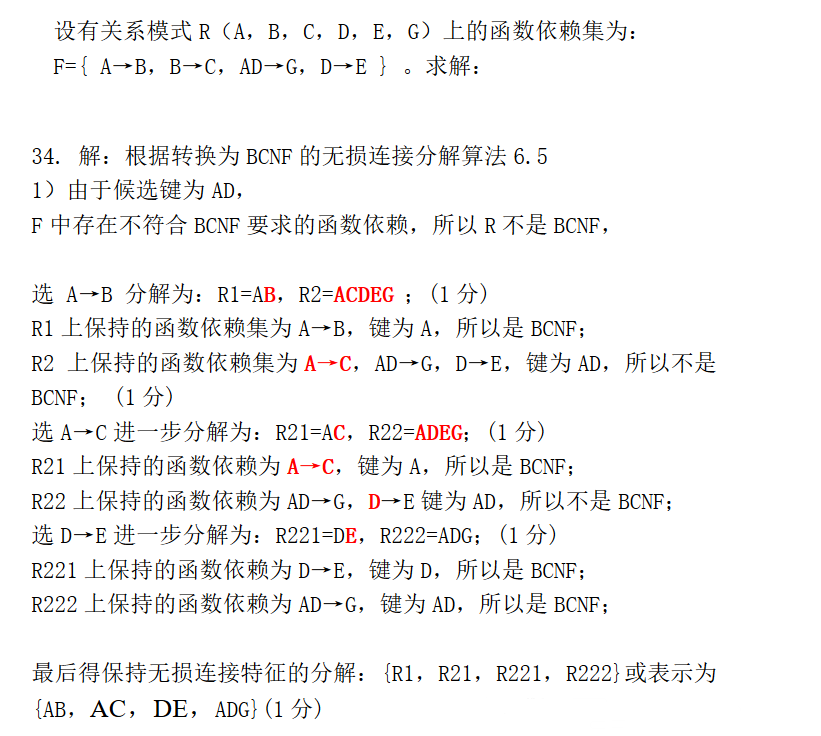

**BCNF 分解无法保证依赖保持**—— 这是 BCNF 的固有局限，也是 3NF 存在的意义（3NF 能同时保证无损连接和依赖保持）。


### 3NF 分解

首先重新定义3NF

关系模式*R* 满足 3NF，当且仅当：**对函数依赖集 F 中所有的非平凡依赖 \*α\*→\*β\*，二选一成立**

1. *α* 是 *R* 的**超键**（*α*+ 包含 R 的所有属性）；
2. *β* - *α* 中的**每一个属性**，都**包含在 \*R\* 的某一个候选键中**（*β*⊆ 某候选键）。

比 BCNF 多了第 2 条，所以 **满足 BCNF 的关系，一定满足 3NF；满足 3NF 的关系，不一定满足 BCNF** → 3NF 是 BCNF 的子集。

尽管3NF 是**比 BCNF 更宽松**的范式，它**放弃了「零冗余」**，允许少量冗余存在；但一定能同时满足 **无损连接 + 依赖保持**。


3NF 判定的「两步高效法」：

1. 先计算 α + （属性集闭包）→ 快速判断 α 是不是超键； 
   - 如果是超键 → 这条依赖直接合规，不用再看了； 
   - 如果不是超键 → 进入第二步； 
2. 逐一检查 β 中的每一个属性，是否在 R 的任意一个候选键里；
   - 全部都在 → 合规；
   - 有一个不在 → 违反 3NF。

最后是3NF 的「标准分解算法」：

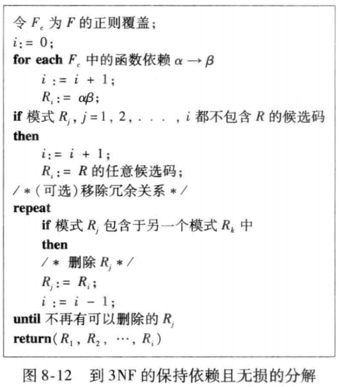

1. 求原依赖集的「正则覆盖 *Fc*」，寻找**最小等价依赖集**（无无关属性、无冗余依赖、左部唯一）
2. 基于 *Fc* 生成初始子表
   - 遍历 *Fc* 中的每一条函数依赖 *α*→*β*，为每条依赖生成一个子表：*Ri*=*α*∪*β*（即子表包含依赖的左部 + 右部，承载该依赖，保证 “依赖保持”）
3. 添加候选键子表：检查步骤 2 生成的所有子表：
   - 若**存在子表包含原关系的候选键** → 无需额外操作（候选键子表已存在，天然保证无损连接）；
   - 若**所有子表都不包含候选键** → 新增一个子表，属性为原关系的任意候选键（通过候选键关联所有子表，保证分解是 “无损连接”）。
4. 删除冗余子表（优化）
   - 循环检查所有子表：若**某子表 \*Rj\* 的所有属性被另一个子表 \*Rk\* 包含**（即 *Rj*⊆*Rk*）→ 删除 *Rj*（避免冗余子表）。

例子：

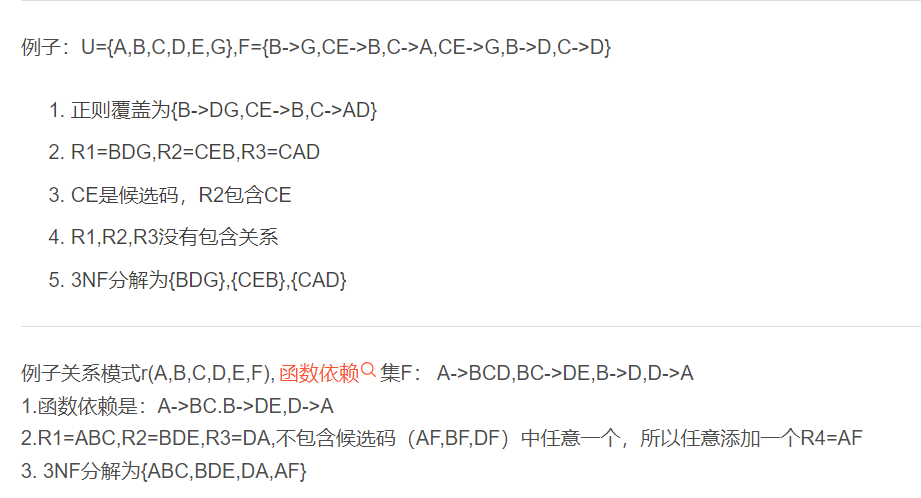


> [!tip]
>
> | 维度     | BCNF 分解                  | 3NF 分解                     |
> | -------- | -------------------------- | ---------------------------- |
> | 分解策略 | 逐步拆分违规依赖，次序相关 | 基于正则覆盖(多个)，覆盖相关 |
> | 时间代价 | 指数时间                   | 多项式时间                   |
> | 无损连接 | ✅ 保证                     | ✅ 保证                       |
> | 依赖保持 | ❌ 不保证                   | ✅ 保证                       |
> | 子表数量 | 较少                       | 可能较多                     |
> | 冗余程度 | 零冗余                     | 少量冗余                     |

