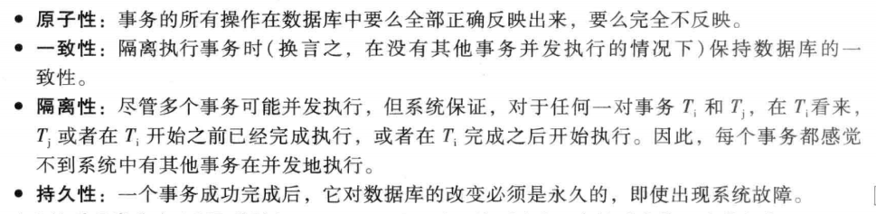
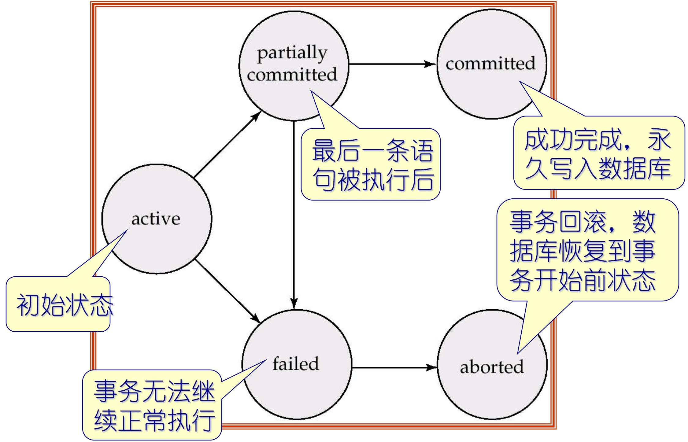
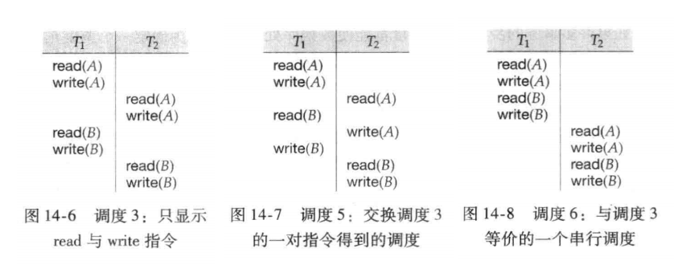
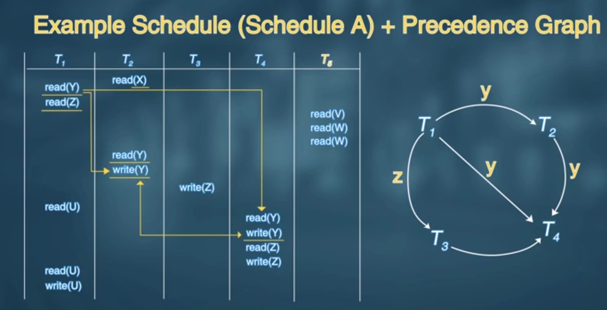
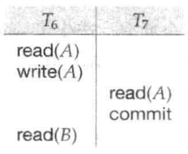
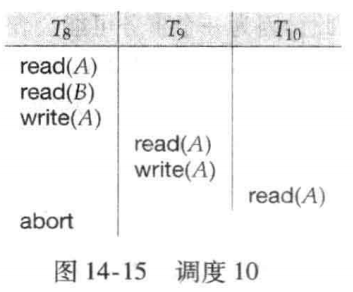

# 事务（Transaction）

## 事务的概念

事务是程序执行的一个基本单位，它会访问（读取）数据库中的多个数据项，并且可能会修改（更新）这些数据项。

- 事务是 “**最小不可分割单元**”：要么完整执行所有操作，要么一点都不执行（不能只执行一部分）；
- 核心操作：包含 “读（read）” 和 “写（write）”—— 读是获取数据，写是修改数据。

比如经典的转账问题：用 “从账户 A 向账户 B 转账 50 美元” ；其中包含多个数据库操作

这些步骤是一个完整的事务，则表示操作必须 “打包” 执行 —— 要么全部成功（6 步都完成），要么全部失败（只要有一步没完成，就撤销所有已做的修改），避免账户A金额减少，但是没成功转到B中

同时保持一致性， “数据符合预设规则”，执行事务后，数据库的完整性约束（显式或隐式）不会被打破；示例中的一致性：转账前 A+B=1000+2000=3000，转账后 A+B=950+2050=3000——“总和不变” 是这个事务的隐式规则，

还是就是持久性（Durability）：事务提交后，修改 “永久有效”；和隔离性（Isolation）不影响其他业务进行

## 事务ACID特性

事务是程序执行的基本单元，会读取或修改数据库中的多个数据项。为了保证数据的完整性，数据库系统必须满足以下特性。

1. 原子性（Atomicity）
   - 事务的所有操作 “要么全执行、要么全不执行”，是不可分割的最小单元。
   - 转账事务（扣 A 的钱、加 B 的钱），要么 A 扣款且 B 到账，要么两者都不发生（比如执行中崩溃则回滚所有操作），不会出现 “只扣 A 钱但 B 没到账” 的中间状态。
2. 一致性（Consistency）
   - 事务隔离执行时，会保持数据库的 “数据规则” 不被破坏（从一个一致状态，变为另一个一致状态）。
   - 转账前 A+B 总和为 3000（一致状态），事务执行后 A+B 总和仍为 3000（符合 “转账总和不变” 的规则）；同时数据库的主键、外键等约束也不会被破坏。
3. 隔离性（Isolation）
   - 多个事务并发执行时，每个事务 “看不到其他事务的中间结果”，仿佛所有事务是串行执行的。
   - 转账事务 Ti 执行到 “扣 A 钱但未加 B 钱” 时，查询事务 Tj 不会读到 “总和减少” 的中间数据，只会看到 Ti 执行前或执行后的最终结果。
4. 持久性（Durability）
   - 事务成功完成后，其修改会永久保存在数据库中，不受系统故障（断电、硬件损坏）的影响。
   - 转账事务提交成功后，即使数据库服务器断电重启，A 和 B 的余额仍为更新后的结果，不会恢复到原始状态。

## 事务的状态（Transaction State）

事务的**生命周期状态及转换逻辑**，描述了事务从开始到结束的完整过程

1. 活跃（Active）
   - 事务的初始状态，事务正在执行过程中（比如转账事务的 “读取 A 余额→扣减 A→写入 A” 等操作正在执行）。
   - 持续条件：只要事务的指令还在正常执行，就保持活跃状态。

2. 部分提交（Partially committed）
   - 事务的**最后一条语句已经执行完毕**后，但数据修改尚未完全写入持久存储（比如修改还停留在内存缓存，未同步到磁盘）。
   - 典型场景：转账事务执行完 “写入 B 余额” 的语句后，内存中 B 的余额已更新，但磁盘上的 B 数据还未同步。

3. 失效（Failed）
   - 事务执行过程中，发现**无法继续正常执行**（比如硬件故障、数据约束冲突、权限不足等），进入失效状态。
   - 触发原因：可能是系统故障（如断电），也可能是逻辑错误（如转账金额为负数，违反完整性约束）。

4. 终止/中止（Aborted）
   - 事务失效后，通过 “回滚（Rollback）” 操作，**撤销所有已做的修改**，数据库恢复到事务开始前的状态。
   - 终止后的两个选择：
     - **重启事务**：仅当失败是 “非逻辑错误” 导致（比如临时硬件故障），重启后事务可正常执行；
     - **终止事务**：若失败是 “逻辑错误” 导致（比如转账金额为负），需终止事务，无法重启。

5. 提交（Committed）
   - 事务**成功完成所有操作**，且所有修改已被永久写入数据库（比如内存中的修改同步到磁盘），状态不可逆。
   - 典型场景：转账事务的所有操作执行完毕，A 和 B 的余额修改已持久化到磁盘，事务完成。

## 串行化（Serializability）

在进入串行化前，还需要理解事务并发执行以及调度的含义

### 事务并发执行

数据库允许多个事务 “指令**交错执行**”（而非严格按顺序排队），从而**提升硬件利用率与事务吞吐量**以及**降低事务平均响应时间**

并发执行虽提升效率，但会导致数据不一致（如 “读脏数据”），因此需要**并发控制机制**：通过控制事务间的交互，实现 “隔离性”（每个事务仿佛单独执行），保证数据库的一致性不被破坏。

### 调度（Schedule）

调度是并发事务指令的执行顺序序列，需满足两个规则：

- 包含所有事务的全部指令；
- 保持每个事务内部的指令顺序（如转账事务中 “读 A” 必须在 “写 A” 之前）。

同时完成事务的终止指令（调度的收尾规则）

- 事务成功完成：最后一步执行`commit`（提交），修改永久生效；
- 事务执行失败：最后一步执行`abort`（终止），通过回滚撤销所有修改。

还需要注意**并发事务指令的时间顺序安排**，即事务之间的先后顺序

### 可串行化（Serializability）

基本假设：**每个独立的事务本身是 “正确的”**—— 即事务单独执行（无并发干扰）时，能保证数据库从一致状态变到另一致状态（满足一致性）

所以根据假设可以知道：既然单个事务是正确的，那么 “串行执行”（一个事务完再执行下一个）一组事务时，数据库的一致性必然被保持。

**可串行化（Serializability）**：并发调度（指令交错）的 “正确性”，不取决于 “是否串行”，而取决于 “是否**等价**于某一个串行调度”。

- 可串行化（Serializable）：并发调度的最终结果、数据状态，与某一个串行调度（如 T1→T2 或 T2→T1）完全一致，则该并发调度是可串行化的（即 “正确的并发调度”）。
- 等价（Equivalent）：对数据库的最终影响相同（所有数据项的最终值一致），且不破坏一致性。

根据是否可串行化就可以判断一个并发调度是否正确

可串行化的两种形式（等价的不同判定维度）：由于 “等价” 有不同的判定角度，可串行化分为两类：

1. 冲突可串行化（Conflict Serializability）：基于 “指令冲突” 判定等价，是最常用、易判定的类型；
2. 视图可串行化（View Serializability）：基于 “数据读写视图” 判定等价，范围更广（包含冲突可串行化），但判定更复杂。

#### **冲突可串行化**（Conflict Serializability）

首先分析调度等价性时简化操作，**只关注 “读（read）” 和 “写（write）” 指令**，忽略事务内部的计算逻辑（如 “A:=A-50”“temp:=A*0.1”）。

1. **冲突的本质**：两个指令 “不能交换顺序”—— 交换后会导致数据库最终状态不同。类似于计组中的数据冒险
2. 冲突的两个必要条件（缺一不可）
   - 访问同一个数据项 Q（如都操作 A）；
   - 至少有一个是 “写指令（write (Q)）”（读 + 读无冲突，读 + 写、写 + 读、写 + 写有冲突）。

考虑一个调度 S，其中含有分别属于 I 与 J 的两条连续指令 Ii 与 Ij，如果 I 与 J 引用不同的数据项，则交换 I与 J 不会影响调度中任何指令的结果。如果有相同的数据项则如下表：

四种指令组合的冲突判定（前提是I 与 J 引用相同的数据项，只有读读顺序无所谓）

| li（Ti 的指令） | lj（Tj 的指令） | 是否冲突 | 原因                                           |
| --------------- | --------------- | -------- | ---------------------------------------------- |
| read(Q)         | read(Q)         | 否       | 仅读取，交换顺序不影响结果                     |
| read(Q)         | write(Q)        | 是       | Ti 读 Q 后 Tj 写 Q，交换后 Ti 会读 Tj 写的新值 |
| write(Q)        | read(Q)         | 是       | Ti 写 Q 后 Tj 读 Q，交换后 Tj 会读 Q 的原始值  |
| write(Q)        | write(Q)        | 是       | 两个写操作覆盖对方结果，交换顺序影响最终值     |

冲突等价与冲突可串行化（判定规则）：

1. 冲突等价：若调度 S 能通过 “多次交换非冲突指令”，变成调度 S´，则 S 和 S´ 冲突等价。
   - 示例：调度 S 中 “Ti 的 read (B)” 和 “Tj 的 read (A)” 是非冲突指令，交换后结果不变，仍等价。
2. 冲突可串行化：若调度 S 能通过交换非冲突指令，**变成某一个 “串行调度”（如 T1→T2）**，则 S 是冲突可串行化的。
   - 冲突可串行化的调度，本质是 “非冲突指令交错，冲突指令顺序与串行调度一致”，因此最终结果与串行调度等价，保证一致性。

> [!tip]
>
> 单个事务保证一致性 → 串行调度保证一致性 → 可串行化（等价于串行）的并发调度也保证一致性 → 冲突可串行化是通过 “交换非冲突指令能否变成串行调度” 判定 → 判定时仅关注读 / 写指令，核心是识别冲突指令。

#####  前驱图（Precedence Graph）判断冲突可串行化

**非冲突可串行化调度**：存在一些并发调度，**无论如何交换非冲突指令，都无法变成任何一个串行调度（如 <T3,T4> 或 < T4,T3>）**，这类调度就是 “非冲突可串行化调度”，本质是 “不正确的并发调度”（会破坏数据一致性）。

前驱图是一个**有向图（Direct Graph）**，用于描述并发事务之间的冲突依赖关系：

- **顶点（Vertices）**：每个并发事务（如 T1、T2、T3）作为一个顶点；
- **边（Edges）**：若事务 `Ti` 和 `Tj` 存在冲突指令，且 `Ti` 的冲突指令**先执行**，则添加一条从 Ti 指向 Tj 的有向边`（Ti→Tj）`，边可标注冲突的数据项（如 Q、A）；
- 边的含义：`Ti` 必须在 `Tj `之前执行，才能保证调度等价于串行（冲突指令的顺序不能颠倒）。
  - 具体来说：
  - 在`Tj` 执行 read(Q) 之前，`Ti` 执行 write(Q)
  - 在 `Tj` 执行 write(Q) 之前，`Ti `执行 read(Q)
  - 在 `Tj` 执行 write(Q) 之前，`Ti` 执行 write(Q)

**一个调度是冲突可串行化的，当且仅当其前驱图是 “无环图”（没有循环依赖）**，即根据不同事物对同一资源的读写顺序画出优先图，如果没有环路，则冲突可串行化。

##### 可恢复调度（recoverable schedule）

一个**可恢复调度**（recoverable schedule）应满足：对于每对事务 `Ti` 和 `Tj`，如果 `Tj`读取了之前由 `Ti` 所写的数据项，则 `Ti` 先于 `Tj`提交。

即写后读的一对事务，写事务必须先于读事务提交

- 例如，调度 9 是不可恢复调度的一个例子，如果要使调度 9 是可恢复的，则 T7 ，应该推迟到 T6 **提交后**再提交(`仅强调提交顺序`)。

数据库必须保证调度是 “可恢复的”，否则故障后数据无法回滚到一致状态。

##### 无级联调度（cascadeless schedule）

级联回滚（cascading rollback）：单个事务失败，导致一连串依赖它的事务都需要回滚，称为级联回滚。

- 前提：调度是 “可恢复的”（Ti 提交在 Tj 提交前），但 Ti 的提交在 Tj 读取之后、Tj 提交之前；
- 但是Ti 在 Tj 读取后、Tj 提交前失败回滚，Tj 因读取了 Ti 的脏数据，必须回滚；若还有 Tk 读取了 Tj 的修改，Tk 也需回滚，形成 “滚雪球” 效应。

**这种因单个事务故障导致一系列事务回滚的现象称为级联回滚**，导致撤销大量工作，是我们不希望发生的

所以对调度加以限制，避免级联回滚发生。这样的调度称为无级联调度

无级联调度（cascadeless schedule）应满足：对于每对事务 Ti 和 Tj，如果 Tj 读取了先前由 Ti 所写的数据项，则 Ti 必须在 Tj 这一**读操作前**提交(`强调读和提交的顺序`)。容易验证每一个无级联调度也都是可恢复的调度。

在可恢复调度的基础上，将写事务的提交提前到读操作前

根据上述内容总结

> [!tip]
>
> 并发控制的核心是：设计一套协议，让并发事务的调度既满足 “冲突可串行化 + 可恢复 + 尽量无级联” 的正确性要求，又能在 “并发效率” 与 “实现开销” 之间权衡，避免 “事后补救” 的风险，最终实现 “高效且安全的并发执行”。

#### 视图可串行化（View Serializability）

类似于冲突等价，首先理解视图等价

设 S 和 S' 是 “包含同一组事务” 的两个调度（比如都包含 T1、T2、T3），判断两者是否视图等价，需对**每个数据项 Q**（如账户 A、B）都满足 3 个条件：

| 条件序号 | 通俗解释                                                     | 核心逻辑                                                     |
| -------- | ------------------------------------------------------------ | ------------------------------------------------------------ |
| 1        | 若在调度 S 中，事务 Ti 读取的是 Q 的 “初始值”（数据库原始状态，未被任何事务修改过），则在调度 S' 中，Ti 必须也读 Q 的初始值。 | **同一事务对 “原始数据” 的读取行为一致** —— 不能 S 中读初始值，S' 中读其他事务修改后的值。 |
| 2        | 若在调度 S 中，Ti 读取的 Q 值是 “Tj 写入的”（即 Ti 的读依赖 Tj 的写），则在调度 S' 中，Ti 必须也读 “同一个 Tj 写入的 Q 值”（不能读其他事务或 Tj 的其他写操作产生的值）。 | **事务间的 “读写依赖关系” 一致** —— 谁给 Ti 提供的 Q 值，在两个调度中必须相同。 |
| 3        | 若在调度 S 中，是事务 Tk 最后一个写入 Q（决定 Q 的最终值），则在调度 S' 中，必须也是 Tk 最后一个写入 Q。 | **数据项的 “最终修改者” 一致** —— 两个调度对 Q 的最终结果，必须由同一个事务决定。 |

- 视图等价的判定**仅关注 “读（read）” 和 “写（write）” 指令**，与事务内部的计算逻辑（如 “A:=A-50”“temp:=A*0.1”）无关 —— 只要读写行为满足上述 3 个条件，就是视图等价。

> [!note]
>
> 冲突可串行化是 “更强的约束”—— 所有冲突可串行化的调度，必然是视图可串行化的（满足冲突等价，一定满足视图等价）；

视图可串行化的判定是 “NP 完全问题”：随着事务数（或指令数）增加，判定时间会呈 “指数级增长”：

所以数据库不会追求 “完全判定视图可串行化”，而是用 “充分条件判定算法”—— 只要调度满足这些条件，就认为是视图可串行化的；不满足则放弃，而非复杂判定。

##### 广义等价性：超越读 / 写的结果等价

- 存在一类调度：**最终数据结果与串行调度完全一致，但既不冲突等价，也不视图等价**—— 这类调度的 “结果等价”，依赖事务内部的计算逻辑，而非仅靠读 / 写指令。
- 这类 “结果等价” 的判定，必须分析事务内部的计算操作（如加减乘除），不能仅靠读 / 写指令 —— 但数据库无法通用化这类判定（业务逻辑千变万化），因此这类调度仅作为 “理论补充”，实际中不依赖。