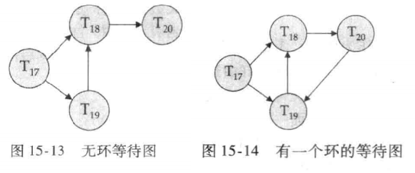

# 并发控制（Concurrency Control）

并发是指在同一时间间隔内多个事务相继执行的场景 —— 当事务数量少、间隔久时可依次执行；当事务数量多、间隔短时，就必须通过**并发控制**避免数据一致性问题。

并发操作会引发三类核心冲突：

- 写写冲突：多个事务同时修改同一数据，导致**丢失更新**；
- 写读冲突：一个事务读取了另一个事务未提交的修改，导致**脏读**；
- 读写冲突：同一事务重复读取同一数据时，其他事务修改了该数据，导致**不可重复读**；或重复执行查询时，其他事务插入 / 删除了符合条件的数据，导致**幻读**。

所以需要并发控制保证事务执行的**隔离性**和**可串行化**—— 即使多个事务并发执行，其结果也等价于按某一顺序串行执行的结果。

并发控制三大核心思想

- 悲观控制（事前控制）：假设冲突一定会发生，提前通过锁机制避免冲突（如两阶段锁）；
- 乐观控制（事后控制）：假设冲突很少发生，事务执行时不限制，提交前检测冲突并处理（如时间戳协议、OCC）；
- 多版本机制（空间复用）：保存数据项的多个版本，不同事务访问不同版本，提升并发度（可与悲观 / 乐观控制结合）。

## 锁（Lock）

锁是控制数据项并发访问的核心机制，通过限制事务对数据的访问权限避免冲突。

- 共享锁（S 锁）：仅允许读取数据，多个事务可同时持有同一数据的 S 锁；
- 排他锁（X 锁）：允许读写数据，同一时间仅一个事务可持有某数据的 X 锁。

|      | S 锁           | X 锁   |
| ---- | -------------- | ------ |
| S 锁 | 兼容（可共存） | 不兼容 |
| X 锁 | 不兼容         | 不兼容 |

**规则**：当事务申请的锁与数据项上已有的锁兼容时，可直接授予；否则事务需等待，直到已有不兼容锁释放。并且**只有共享锁相互兼容**

许多事务可以同时持有一个数据项上的共享锁，但是只有当其他事务在一个数据项上不持有任何锁（无论共享锁或排他锁）时，一个事务才允许持有该数据项上的排他锁。

## 锁协议（Locking Protocol）

两阶段锁协议（2PL）—— 保证可串行化的核心协议：该协议要求每个事务分两个阶段提出加锁和解锁申请。

事务的锁操作分为两个阶段，严格遵循 “先加锁、后释放” 的顺序：

- **增长阶段**（growing phase）：仅申请锁，不释放锁（事务可不断获取新锁）；
- **缩减阶段**（shrinking phase）：仅释放锁，不申请锁（事务一旦释放第一个锁，就不能再获取新锁）。

保证并发调度的**冲突可串行化**—— 事务的串行化顺序等价于它们的 “锁点” 顺序（锁点即事务获取最后一个锁的时刻）。

同时还有严格两阶段锁（Strict 2PL）与强两阶段锁（Rigorous 2PL）

两阶段锁虽能保证可串行化，但可能导致**级联回滚**（一个事务回滚引发多个依赖它的事务回滚）和不可恢复调度。因此衍生出两种增强协议：

1. 严格两阶段锁
   - 事务必须持有所有**排他锁（X 锁）** 直到事务提交或中止后才释放；共享锁（S 锁）可在收缩阶段提前释放。
   - 避免级联回滚，保证调度的可恢复性。因为排他锁持有到提交，其他事务无法读取未提交的修改（避免脏读），且已提交事务的修改不会因其他事务回滚而失效。
2. 强两阶段锁
   - 事务必须持有**所有锁（包括 S 锁和 X 锁）** 直到提交或中止后才释放。
   - 特点：串行化顺序等价于事务的提交顺序，并发度低于严格 2PL，但数据一致性更强，实现更简单。

| 协议            | 核心规则                       | 可串行化 | 可恢复性 | 并发度 |
| --------------- | ------------------------------ | -------- | -------- | ------ |
| 两阶段锁（2PL） | 生长阶段加锁，收缩阶段释放     | 是       | 否       | 高     |
| 严格 2PL        | X 锁持有到提交，S 锁可提前释放 | 是       | 是       | 中     |
| 强 2PL          | 所有锁持有到提交               | 是       | 是       | 低     |

**锁转换**（lock conversion）：

- **升级**（upgrade）：共享锁 -> 排他锁，只能发生在增长阶段。
- **降级**（downgrade）：排他锁 -> 共享锁，只能发生在缩减阶段。

## 死锁检测（Deadlock Detection）

死锁是锁机制的必然问题 —— 多个事务相互等待对方持有的锁，导致所有事务都无法继续执行。

例如：T3 持有 B 的 X 锁，申请 A 的 X 锁；T4 持有 A 的 X 锁，申请 B 的 X 锁。T3 和 T4 相互等待，陷入死锁。

产生条件/必要条件（缺一不可）

- 互斥条件：数据项的锁具有排他性（如 X 锁同一时间仅一个事务持有）；
- 持有并等待：事务持有部分锁，同时等待其他事务的锁；
- 不可剥夺：锁只能由持有事务主动释放，不能被强制剥夺；
- 循环等待：多个事务形成等待环（如 T1→T2→T3→T1）。

同时死锁可以用称为等待图（wait-for graph）的有向图来精确描述。

该图由 G=(V，E) 对组成，其中 V 是顶点集，E 是边集。

- 顶点集由系统中的所有活跃的事务（正在执行且未提交 / 中止的事务）；
- 有向边 *Ti*→*Tj* 表示事务 *Ti* 正在等待 *Tj* 释放其需要的锁

等待图的维护规则

- 当事务 *Ti* 申请的数据项被 *Tj* 持有（且锁不兼容）时，在等待图中添加边 *Ti*→*Tj*；
- 当 *Tj* 释放 *Ti* 所需的锁（或 *Tj* 中止）时，删除边 *Ti*→*Tj*；
- 当事务完成（提交 / 中止）时，将其对应的顶点及所有关联边从图中移除。

当且仅当等待图包含环时，系统中存在死锁。在该环中的每个事务称为处于死锁。要检测死锁，系统需要维护等待图，并周期性地激活一个在等待图中搜索环的算法。

同时如果已经进入死锁则需要死锁恢复：打破循环

1. 步骤 1：选择 “牺牲者”（需回滚的事务）：
   - 选择标准：最小化回滚成本（如事务启动时间短、已执行语句少、加锁数据项少）；
   - 避免饿死：记录事务的回滚次数，多次回滚的事务优先不被选为牺牲者。
2. 步骤 2：事务回滚：
   - 全部回滚：中止事务并重启（简单但效率低）；
   - 部分回滚：仅回滚到能打破死锁的位置（需记录事务的操作日志，实现复杂但高效）。

> [!tip]
>
> - 死锁：多个事务相互等待，永久无法继续；
> - 饿死：单个事务长期等待锁（如 T2 申请 X 锁，而系统不断授予其他事务 S 锁），始终无法获得锁；
> - 避免饿死的方案：锁请求队列遵循 “先来先服务” 原则，优先满足等待时间最长的事务。