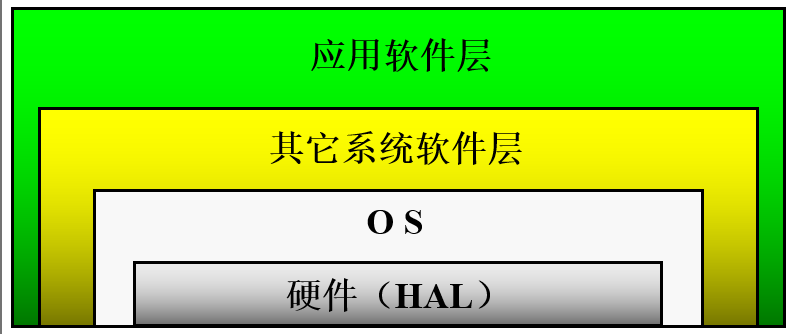
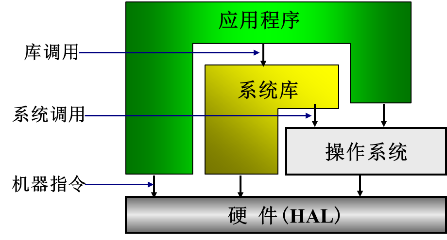

# 1.1 操作系统概念

1. 操作系统地位

   > - 硬件抽象层（HAL）之上
   >
   > - 所有其它软件层之下
   >
   >   
   >
   >   - 运行视图
   >   - 系统库(lib)可调用操作系统，执行硬件指令
   >   - 应用程序可以调用lib和操作系统，执行硬件指令
   >   - 
   >
   >   

   2. 操作系统的作用

      > 1. 管理系统中软硬件资源
      >    - 例如：CPU，内存，设备，文件
      > 2. 为用户(应用程序)提供良好的服务(界面)
      >    - 命令接口（联机和脱机），程序接口(系统调用），GUI

   3. **操作系统定义**

      > [!important]
      >
      > 操作系统是位于硬件层(HAL)之上，所有其它软件层之下的一个**系统软件**，通过它管理系统中各种**软硬件资源**（计算机资源），使它们被充分利用，方便用户使用计算机系统（向上层提供和简便易用的接口）。
      >
      > 1. 系统软件
      > 2. 管理资源
      > 3. 向上提供接口

---

# **操作系统的历史**

1. 操作系统的产生

   > 1. 手工操作阶段
   > 2. 电子管：二进制程序，打孔：纸带和卡片
   > 3. 批处理阶段
   >    1. 联机批处理（单道批处理）：读卡机，磁带机（监管程序：OS雏形）：
   >    2. 脱机批处理：卫星机：
   > 4. 执行系统阶段：I/O处理机（通道和中断技术）

2. 操作系统的完善

   > 1. 多道批处理系统：**多道批处理**:**主机中同时放多个作业**,**最大限度提高资源利用率**，标志操作系统走向成熟(在作业执行时用户不能直接干预，交互性差)
   > 2. 分时系统：时间片轮换（用于多用户，交互性好）
   > 3. 实时系统：时间约束（硬实时：严格时间约束）（软实时：时间约束宽松）：及时响应特性
   > 4. 通用操作系统：**通用操作系统可以同时**处理实时任务、接受终端请求、运行成批作业。

3. 操作系统的发展

   > **网络操作系统**
   >
   > **分布式操作系统**
   >
   > **多处理机操作系统**
   >
   > **单用户操作系统**
   >
   > **面向对象操作系统**
   >
   > **嵌入式操作系统**
   >
   > **智能卡操作系统**
   >
   > **多核技术下新一代操作系统**

---

# 操作系统的特性

1. **并发性**

   > - **多个程序在宏观上同时向前推进**，微观上依旧是交替进行
   > - 例如OS与OS并发，用户程序与OS,用户程序与用户程序
   > - 不同于**并行，即多个程序同时进行**

2. **共享性**

   > - 多个程序共用系统中的各种软硬件资源
   >
   > - 在操作系统的协调和控制下
   >
   > - 又分为互斥共享（宏观同时，微观交替），同时共享（同一时刻访问）

3. **程序异步性**

   > - 在多道程序环境下，允许多个程序**并发**执行，但由于资源有限，进程的执行不是一贯到底的，而是走走停停，以**不可预知的速度**向前推进，这就是进程的异步性；
   >
   > - 所以只有系统拥有并发性，才有可能导致异步性。
   >
   > - 交替的切换点是中断：
   >
   >     用户程序向操作系统切换；
   >
   >     操作系统程序向操作系统程序切换（中断嵌套）。
   >
   > - 中断随机发生，致使**程序切换不确定、不可预知**。
   >
   > - 

4. **虚拟性**

   > 所谓虚拟就是利用某种技术把一个物理实体变为**若干个逻辑实体**
   >
   > 空时复用（虚拟存储），时分复用（虚拟处理器）

> [!note]
>
> 其中并发和共享互为存在条件，是操作系统最基本的两个特征；
>
> 并且虚拟和异步依赖于并发

---

# 操作系统运行环境

## 定时装置

1. 绝对时钟

   > **记载实际实践，不发生中断**
   >
   > - 系统操作员可以修改，一般用户使用
   >
   > - 绝对时钟的值保存于硬件寄存器中
   >
   > - 程序可以读取绝对时钟的值

2. 间隔时钟

   > **定时发生中断，一般间隔单位为毫秒**
   >
   > - 间隔时钟是实现多道程序的基础—保证操作系统获得控制权。
   >
   > - 其它中断也进入操作系统，但是否发生，何时发生没有保障。
   >
   > - 通过间隔时钟可以构造逻辑时钟。

## 堆和栈

- 尽管用户进程的“堆”和“栈”在物理上通常是相邻的。每个运行程序都有一个堆和两个栈（一个用户栈，一个系统栈）

- 堆属于用户空间，用于保存程序中的**动态变量**

  > 例如树的结点，堆空间由操作系统分给运行程序，由于不同程序运行时对动态变量的使用不同，因而堆空间大小需求不定。

- 用户栈属于用户空间，用于保存用户函数调用时的**返回点、参数、局部变量、返回值**。除此之外，用户栈还要传送调用操作系统时传给操作系统的参数。

  > 用户程序调用操作系统时，有两个载体可以用来传递参数：
  >
  > - **寄存器：比较小的数据如：一个字符、一个整数、一个浮点数**
  >
  > - **用户栈：比较长的参数如：文件名**
  >
  > 对每个系统调用，操作系统都规定了参数和返回值的存放位置，用户程序必须遵循相应的规定

- 系统栈也称为核心栈，逻辑上属于操作系统空间

  > 程序切换的同时伴随着堆和用户栈以及系统栈的切换，但硬件的栈指针是多个进程共享的。
  >
  > 作用：
  >
  > - 中断响应时保存中断现场
  > - 保存函数调用返回点、参数、局部变量、返回值
  >
  > 内存中操作系统空间的一个固定区域

---

## 寄存器

- 硬件系统提供一套寄存器，由运行程序使用。

- 程序切换时，一般需要把寄存器的当前值保存起来，再次运行前再恢复。

  > 1. 程序状态字
  > 2. 指令计数器
  > 3. SP
  > 4. regs
  > 5. fregs
  > 6. 地址映射寄存器

## 特权指令与非特权指令

1. **特权指令(privileged instruction)**

   只有在**管态**才能执行的指令(影响系统状态)

   特权指令只有操作系统（内核空间）才能执行，用户程序（用户空间）不可执行

2. **非特权指令**(non-privileged instruction)

   在**管态和目态**都可以执行的指令(不影响系统状态)

## **处理机状态及状态转换**

1. **处理机状态**

   系统态（system mode）(管态，核态)

   用户态（user mode) (目态，常态)

2. 状态转换
   1. 管态 ->目态(中断返回，置程序状态字）
   2. 目态  -> 管态(中断，**trap**又称为陷入指令)

## 地址映射机构

- 逻辑地址映射到物理地址
  - 逻辑地址(虚地址)：程序中产生的地址
  - 物理地址(实地址)：存储器地址

## 存储保护设施

1. 防止应用程序
   1. 侵犯操作系统空间
   2. 侵犯其它用戶空间
   3. 对共享区域的非法访问
2. 地址检查
   1. 越界检查;
   2. 越权检查（对共享区域）

## 中断装置

- **发现并响应中断的硬件机构**

> 当前（PSW，PC）->系统栈
>
> 中断向量（PSW，PC）->寄存器；中断向量由硬件实现

## 通道与DMA

1. 通道：接受CPU委托完成输入输出操作任务，即负责IO操作的**处理机**
2. DMA**：**接受CPU委托直接依靠**硬件**完成数据在主存和块设备之间的传输

> 相同点：实现IO设备和内存之间建立**数据直传通路**
>
> 不同点
>
> - DMA只能实现固定的数据传送控制，而通道有自己的指令和程序
> - DMA只能控制一台或者少数几台同类设备，而一个通道可以控制多台同类或者不同的设备

## I/O保护

- 定义所有I/O指令为**特权指令**
- 方便使用：用户使用I/O指令做I/O传输非常麻烦
- 防止发生冲突

---