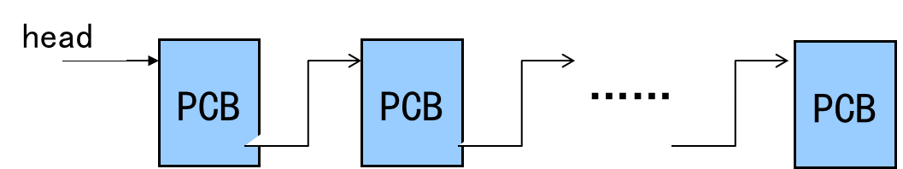
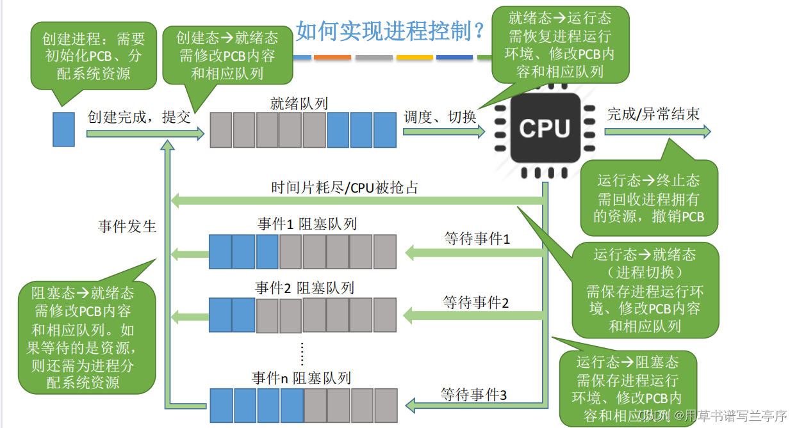
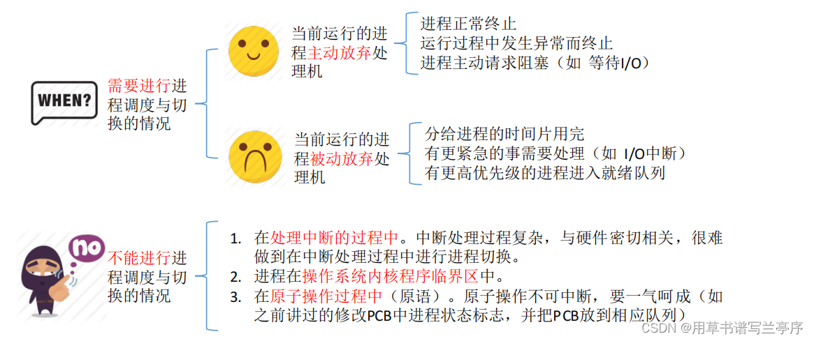
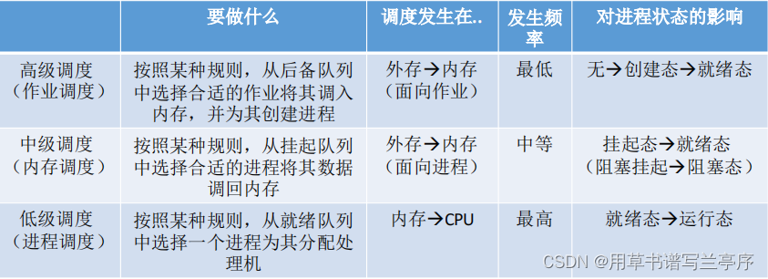

# 进程、线程与作业

# 多道程序设计

> [!tip]
>
> 单道程序设计：一次只允许一个程序进入系统的程序设计方法
>
> 缺点：资源利用率低.

- 多道程序设计：多个程序同时进入系统并投入执行的一种程序设计方法

> - 例题
>
> §进程P对磁盘数据进行处理，其**处理流程**为：
>
> §① 读入一块磁盘数据；
>
> §② 处理该块数据；
>
> §③ 把处理后的该块数据写到磁带上。
>
> §假设：进程P要处理3个磁盘块的数据，读一个磁盘块数据需要40ms，处理一块数据需要20ms，写一块磁带数据需要80ms，并假设系统只有进程P运行。在不考虑系统开销的情况下，
>
> §**问** **题**：
>
> § **⑴** 进程P把3块数据**处理流程**都完成，画出CPU运行、磁盘输入、磁带输出的时序图；
>
> § **⑵** 依据⑴画出的时序图，计算进程P等待设备I/O的时间。

> [!warning]
>
> 对于内存中的程序数量：
>
> 道数过少，**系统资源利用率低**
>
> 道数过多，**系统开销(system overhead)增大，程序响应速度下降**

- 多道程序设计的问题

> - 如何分配处理资源
> - 对于存储资源的管理
> - 设备资源管理：即分配策略

# 进程的引入

> [!note]
>
> 暂停：保存现场(PSW+PC，寄存器）
>
> 推进：恢复现场(寄存器，PSW+PC)
>
> 暂停原因：(1) 自身原因：等待资源，启动IO  (2) 剥夺CPU—给其它程序运行机会

- **进程的定义**

> 进程是程序的一次执行
>
> 进程是可以参与并发执行的程序
>
> 进程是程序和数据一道通过处理器执行时所发生的活动
>
> 进程是具有一定独立功能的程序关于一个数据集合的一次运行活动.
>
> 1. 进程是进程实体的运行过程，是系统进行资源分配和**调度（对于没有内核级线程的前提下）**的一个独立单位。

> [!important]
>
> 动态：是程序的一次执行过程。**同一程序多次执行会对应多个进程**。这是进程和程序的本质差异
>
> 并发：可与其它进程同时执行，宏观同时，微观上“交替执行”，不要求多个CPU

---

## 进程状态及状态转换

- 进程状态（基本状态）

> [!note]
>
> - 创建态：系统创建进程，操作系统给进程分配系统资源、PCB等等
> - 就绪态：已经具备运行条件，等待空闲的CPU，进行调用
> - 运行态：当CPU处于空闲阶段就会在就绪态的进程里面选择一个进行执行，也就是把CPU占据进入了运行态，一核的CPU就只可以一次运行一个进程，多少核的CPU可以有多少个进程处于运行态
> - 阻塞态：因为某个事件而暂时不可用运行
> - 终止态：运行进程从CPU撤销，操作系统就会回收资源、撤销PCB
>   

- 进程状态转换由**操作系统**完成，对用户是透明的
- 进程在其生存期内经过多次状态转换

> [!tip]
>
> 进程状态转换原因:
>
> - CPU调度
> - 进程在运行过程中需要等待某一事件
> - 进程等待的事件发生.

---

## PCB(进程控制块)

> [!note]
>
> 标志进程存在的数据结构，其中保存系统管理**进程所需的全部信息**
>
> 例如：进程标识(pid)，进程状态，现场信息，调度参数，所属用户(uid)

- 作用

  > 当调度某进程执行时，需要从该进程的PCB中**查询其状态及优先级等参数**
  >
  > 当调度到某进程后，根据PCB中的现场信息**恢复现场**，并根据PCB中的程序和数据的内存地址找到程序和数据
  >
  > 进程执行过程中，当需要与其它进程**通信**时，也要访问PCB
  >
  > 当进程发生进程切换时，需要将现场信息从系统栈弹出，保存于PCB中
  >
  > 系统建立进程时建立PCB，撤销进程时撤销PCB.

---

## 进程的组成与上下文

### 进程的组成（进程映像）

1. **进程控制块**（PCB）

2. 程序

   > - **代码**(程序段)：实现相应的功能
   >
   > - **数据**(数据段)：静态数据+动态堆和动态栈
   >
   >   - 堆栈(stack+heap)
   >
   >     栈：保存返回值、参数、断点、局部变量
   >
   >     堆：动态变量

- 进程的表记

  > **进程的程序**(PCB，代码和数据)称为进程影像(Process Image)
  >
  > 

---

### 进程的上下文

> [!note]
>
> - PCB+程序
> - 系统环境：地址空间，系统栈，打开文件表，…

1. 上下文的切换

   由一个进程的上下文转到另外一个进程的上下文

2. 系统开销（system overhead)

   运行操作系统程序完成系统管理工作所花费的时间和空间

3. 进程切换时需要保存的现场信息

   > **地址寄存器**:保存当前CPU所访问的内存单元的地址
   >
   > **通用寄存器**:用于传送和暂存数据，也可参与算术逻辑运算，并保存运算结果
   >
   > **浮点寄存器**:用于存储浮点数字，它决定着计算机的计算精度。
   >
   > **SP**(系统栈指针)
   >
   > **PSW**(程序状态字)
   >
   > **PC**(指令计数器)
   >
   > **打开文件表**(页表)

---

## 进程的队列

> [!note]
>
> PCB构成的队列：（不一定FIFO，单向或双向）
>
> 1. 就绪队列：系统一个或若干个（根据调度算法确定）
> 2. 等待队列：每个等待事件一个（可能对应不同设备各有一个，甚至对于一个设备不同请求一个）
> 3. 运行队列

---

## 进程的类型与特征

## 进程类型

1. 系统进程（内核态运行）

   > 运行操作系统程序，管态，完成系统管理(服务)功能
   >
   > 一个系统进程所完成的内容相对独立和具体，在进程生存周期保持不变，因而它们通常对应一个无限循环程序，在系统启动后便一直存在，直到系统关闭
   >
   > 系统进程承担系统的管理和维护性任务，优先级高于一般用户进程

2. 用户进程（用户态运行）

   > 在操作系统之上运行的所有程序
   >
   > 运行用户(应用)程序，为用户服务

## 进程特征

> [!note]
>
> - 并发性：可以与其它进程一道向前推进；
> - 动态性：动态产生、消亡，生存期内动态变化；
> - 独立性：一个进程是可以调度的基本单位；
> - 交互性：同时运行的进程可能发生相互作用；
> - 异步性：进程以各自独立，不可预知的速度向前推进；
> - 结构性：每个进程有一个PCB。

---

## 进程间相互联系与相互作用

### 相互联系

1. 相关进程

   > 同一家族的进程
   >
   > 可以共享文件，需要相互通讯，协调推进速度…
   >
   > 父进程可以监视子进程，子进程完成父进程交给的任务

2. 无关进程

   > **没有逻辑**关系、同时执行的进程。
   >
   > 有**资源竞争**关系，互斥、死锁、饿死。

### 相互作用

1. 直接相互作用

   > 发生在相关进程之间，进程之间不需要通过媒介而发生相互作用
   >
   > 

2. 间接相互作用

   > 发生在任何进程之间
   >
   > 

---

## 进程的创建与撤销

### 进程创建

> [!note]
>
> - 向系统申请一个空闲**PCB**，并指定唯一的进程标识
> - **为新进程分配资源**
> - 初始化新进程的PCB**加载程序**
> - 将PCB入**就绪队列**.
>
> 例如：用户登录，作业调度，提供服务，应用请求.

---

### 进程撤销

> [!note]
>
> 从系统PCB表中找到**被撤销进程的PCB**
>
> **检查被撤销进程的状态是否为执行状态**。若是，则立即停止该进程的执行
>
> **设置重新调度标志**，以便在该进程撤销后将处理器分配给其它进程
>
> **检查被撤销进程是否有子孙进程**，若有子孙进程还应撤销该进程的子孙进程
>
> 回收该进程占有的全部资源并回收其**PCB**.
>
> 例如：正常结束，异常结束，外界干预

### 进程汇聚和等待，唤醒

1. 进程汇聚

   > 例如：
   >
   > - Java语言中，子线程汇聚到父线程
   > - 用于数学计算，例如矩阵。，

2. 进程等待

   > **停止**当前进程的执行
   >
   > 保存该进程的**现场信息**。
   >
   > 将进程状态改为**等待**.
   >
   > 引起进程等待事件，例如：请求系统服务，启动某种操作，新数据未获取，无新工作

3. 进程唤醒

   > 将被唤醒进程从相应的**等待队列**中移除
   >
   > 将进程状态改为就绪，并将该进程插入**就绪**队列.

> [!important]
>
> 父进程创建子进程与主程序调用子程序区别?
>
> 1. 进程创建子进程后，**父进程与子进程可并发执行**
> 2. 主程序调用子程序后，**主程序暂停在调用点**，子程序开始执行，直到子程序执行完毕返回，主程序才开始执行

---

## 考虑生灭的进程状态转换图

> [!important]
>
> 
>
> 
>
> 

## 进程与程序 的联系与差别

1. 进程与程序的联系

   > 进程包括一个程序
   >
   > 进程存在的目的就是执行这个程序

2. 进程与程序的差别

   > 程序静态，进程动态
   >
   > 程序可长期保存，进程有生存期
   >
   > 一个程序可对应多个进程，一个进程只能执行一个程序

---

## 思考题

> [!note]
>
> 1. **若系统中没有运行进程，是否一定没有就绪进程？**  
>    **是的**。当系统中没有运行进程时，操作系统会立即触发调度程序。若就绪队列中存在进程，调度程序必然选择一个进程投入运行。因此，没有运行进程的唯一可能是就绪队列为空，即没有就绪进程。
>
> 2. **若系统中既没有运行进程，也没有就绪进程，系统中是否就没有进程？**  
>    **否**。系统中可能存在处于**阻塞状态**的进程（如等待I/O或事件），这些进程不占用CPU也不在就绪队列中，但仍然是系统中的有效进程。
>
> 3. **在采用优先级调度时，运行进程是否一定是系统中优先级最高的进程？**  
>    **否**。若系统采用**非抢占式调度**，即使有更高优先级的进程进入就绪队列，当前运行进程仍会继续执行，直到主动释放CPU。只有在**抢占式调度**下，运行进程才保证是优先级最高的。
>
> 4. **某进程被唤醒后立即投入运行，是否说明系统采用剥夺式调度？**  
>    **否**。例如，若原运行进程已主动阻塞（如等待I/O），此时唤醒的进程可能是唯一就绪进程，无需剥夺即可运行。这种情况与调度策略是否为剥夺式无关，因此不能以此判断。

---

# 线程与轻进程

## 线程的概念

- 进程中一个**相对独立的执行流**。（轻量级进程）

  > 进程是CPU**资源分配**的最小单位
  >
  > 线程是CPU调度和执行的最小单位（仅仅对于内核级线程，而用户级线程对于内核透明）

- 多线程优点

  > 切换速度快（地址空间不变）(light weighted)
  >
  > 系统开销小（用户级线程）
  >
  > 通讯容易（共享数据空间）

> [!important]
>
> 进程与线程的区别和联系
>
> 区别：
>
> 1. **调度**：线程作为**调度和分配**的基本单位，进程作为**拥有资源**的基本单位；
> 2. **并发性**：不仅进程之间可以并发执行，同一个进程的多个线程之间也可并发执行；
> 3. **拥有资源**：进程是拥有资源的一个独立单位，线程不拥有系统资源，但可以访问隶属于进程的资源。进程所维护的是**程序所包含的资源**（静态资源）， 如：地址空间，打开的文件句柄集，文件系统状态，信号处理handler等；线程所维护的**运行相关的资源**（动态资源），如：运行栈，调度相关的控制信息，待处理的信号集等；
> 4. **系统开销**：在创建或撤消进程时，由于系统都要为之分配和回收资源，导致系统的开销明显大于创建或撤消线程时的开销。但是进程有独立的地址空间，一个进程崩溃后，在保护模式下不会对其它进程产生影响，而线程只是一个进程中的不同执行路径。线程有自己的堆栈和局部变量，但线程之间没有单独的地址空间，一个进程死掉就等于所有的线程死掉，所以**多进程的程序要比多线程的程序健壮，但在进程切换时，耗费资源较大，效率要差一些。**
>
> 联系：
>
> 1. **一个线程只能属于一个进程，而一个进程可以有多个线程，但至少有一个线程**；
> 2. 资源分配给进程，同一进程的所有线程共享该进程的所有资源；
> 3. 处理机分给线程，即**真正在处理机上运行的是线程**；
> 4. 线程在执行过程中，需要协作同步。不同进程的线程间要利用消息通信的办法实现同步。

---

## 线程控制块（TCB）

> [!note]
>
> 标志线程存在的数据结构，其中包含对线程管理需要的全部信息
>
> 内容：线程的标志和状态，调度参数，现场（寄存器，PC，SP），链接指针
>
> 存放位置：用户级线程位于目态空间，内核级线程位于系统空间

---

### 线程的操作

1. 在进程创建时，同时为该进程创建第一个线程，用以运行程序，在以后适当的时候，通过“**线程创建**”系统调用创建线程
2. 线程**共享进程的代码段和数据段**。**但是线程有各自的用户栈**，可以独立调用，占用CPU运行
3. 当线程被剥夺处理器时，只需将其线程现场保存在该线程对应的栈区
4. 当进程内的所有线程结束时，意味着进程结束，从而释放进程所占用的所有资源.

---

## 线程的实现

### 用户级线程

1. 实现方法：

   > 基于library函数（线程库），**系统不可见**
   >
   > 线程创建、撤销、**状态转换在目态完成**
   >
   > TCB**在用户空间**，每个进程一个系统栈.

2. 优缺点：

   > 优点：
   >
   > - 不依赖于操作系统，**调度灵活**
   > - **同一进程中多线程切换速度快**(不需进入操作系统)
   >
   > 缺点：
   >
   > - 同一进程中多个线程不能真正并行，即使在多处理器环境中
   > - 一个线程进入系统受阻，进程中其它线程不能执行

> [!tip]
>
> 线程状态和进程状态
>
> - 若同一进程中的多个线程至少有一个处于运行态，则该进程的状态为运行态
> - 若同一进程中的多个线程均不处于运行态，但至少有一个线程处于就绪态，则该进程的状态为就绪态
> - 若同一进程中的多个线程均处于等待态，则该进程的状态为等待态

### 核心级别线程

1. 实现方法：

   > - 基于**系统调用**由操作系统创建
   > - 创建、撤销、状态转换由**操作系统完成**
   > - 线程是处理器调度的基本单位
   >
   > - TCB在操作系统空间，每个线程一个系统栈
   >
   > - 对于核心级别线程，进程状态不具有实际意义

2. 优缺点：

   > 优点：
   >
   > 1. 同一进程内多线程可以**并行执行**（多CPU）
   > 2. 进程中的一个线程被阻塞了，内核可以调度同一进程的其它线程占有处理器运行
   >
   > 缺点：线程的控制和状态转换需要进入操作系统，**系统开销大**

> [!note]
>
> 用户级别线程和核心级别线程区别
>
> - 核心级别线程操作系统可见；用户级别线程操作系统不可见
> - 用户级别线程的创建、撤销和调度不需要操作系统的支持，且是在**（程序）语言这一级处理**的。核心级别线程的创建、撤销和调度都需要操作系统内核的支持
> - 用户级别线程执行系统调用命令将导致其所属进程被中断，核心级别线程执行系统调用命令将导致线程被中断
> - 在仅有用户线程的系统内，CPU调度以进程为单位。在有核心级别线程的系统内，CPU调度以线程为单位
> - 用户级别线程的实体是运行在用户态下的程序，而核心级别线程的实体则是可以运行在任何状态下的程序

### 混合线程

- Solaris系统

- Light weighted process(LWP)

  > 由Lib程序支持
  >
  > 每个task至少一个LWP
  >
  > 用戶级别线程与LWP可以多对多
  >
  > LWP对操作系统可见
  >
  > 只有与LWP相联系的用户线程向前推进

---

> [!tip]
>
> 多线程与多任务的区别：
>
> - 多任务是针对操作系统而言的，代表操作系统可以同时执行的程序个数
> - 多线程是针对一个进程而言的，代表一个进程内部可以同时执行的线程个数，每个线程完成不同的任务.

---

## 作业

> [!note]
>
> 作业概念:
>
> 用户要求计算机系统为其完成的**计算任务集合**

1. 作业步

   > 作业处理过程中一个**相对独立的步骤**
   >
   > 一般一个作业步可由一个进程完成
   >
   > 某些作业步之间可以并行

2. 作业分类:批处理作业，交互式作业.

3. **作业控制块**

   > 标志作业存在的数据结构，其中包含对作业进行管理所需要的全部信息
   >
   > 如作业名称、作业状态、调度参数、资源请求、相关进程、作业长度、在输入井与输出井中的存放位置、记账信息等

> [!tip]
>
> 作业和进程的区别
>
> - 作业是用户向计算机提交的**任务实体**，而进程则是完成用户任务的**执行实体**，是向操作系统申请分配资源的基本单位
> - 一个作业可由多个进程组成，一个作业至少由一个进程组成
> - 作业的概念主要用在批处理系统中，而进程的概念则用在所有的多道程序系统中.

### 批处理作业

1. 作业控制语言(JCL)：描述批处理作业控制意图的语言

2. 作业说明书(JCL语句的序列）：一般以特殊符号起始

3. 作业控制进程：解释并处理作业说明书的程序，执行作业控制程序的进程.

4. 批处理作业的工作过程：

   > - 作业由**假脱机输入程序**控制进入输入井
   >
   > - 经由操作系统的**作业调度程序**选中进入内存
   >
   > - 同时由**作业调度程序**为其建立作业控制进程执行作业控制程序
   >
   > - **作业控制进程**解读作业说明书中的语句，并根据作业步的要求为其建立相应的进程

### 交互式作业

1. 账户管理

   > `/etc/passwd`文件(创建用户时，系统将设置口令文件)
   >
   > passwd中包括注册用户的所有信息(用户名,口令,用户根目录,同组用户,余额…)，为系统文件

# 处理机调度

- 调度分为三个层次，分别为高级调度，中级调度，初级调度。

## 高级调度

- 确定某种规则来决定将作业调入内存的顺序。即作业调度
- 按一定的原则从外存上处于后备队列的作业中挑选一个(或多个）作业，给他们分配内存等必要资源，并建立相应的进程（建立PCB)，以使它（们）获得竞争处理机的权利。
- 辅存（外存）与内存之间的调度

## 中级调度

- 暂时调到外存等待的进程状态为挂起状态。即决定将哪个处于**挂起状态**的进程重新调入内存。
- PCB并不会一起调到外存，而是会常驻内存。

## 低级调度

**从就绪队列中选取一个进程，将处理机分配给它。**

# 小结：

> [!note]
>
> - 作业与进程
>   - 作业进入内存后变为进程
>   - 一个作业通常与多个进程相对应
>
> - 进程与线程
>   - 一个进程一般包含多个线程，至少包含一个线程
>   - 不支持多线程的系统，可视为单线程进程

---

