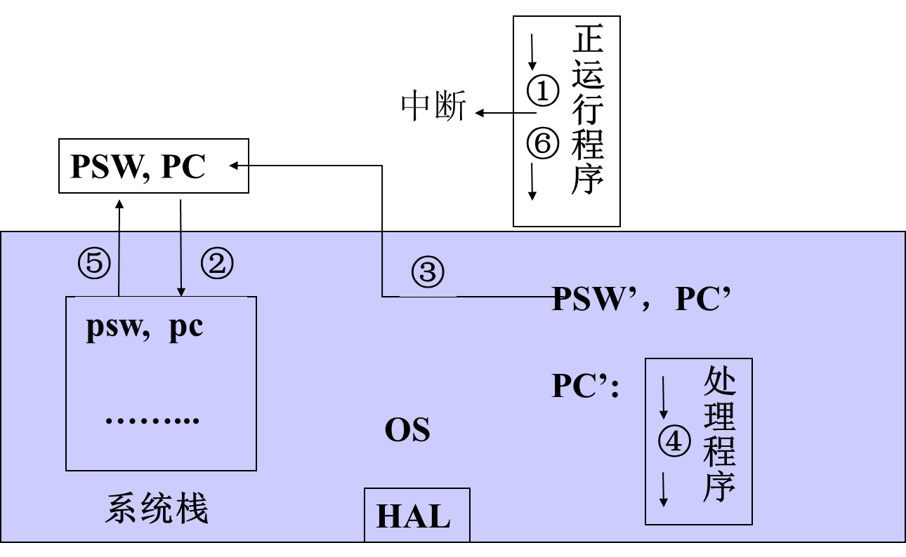
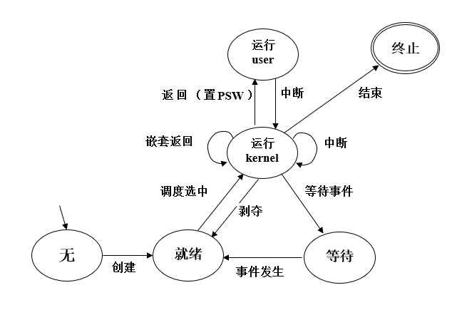
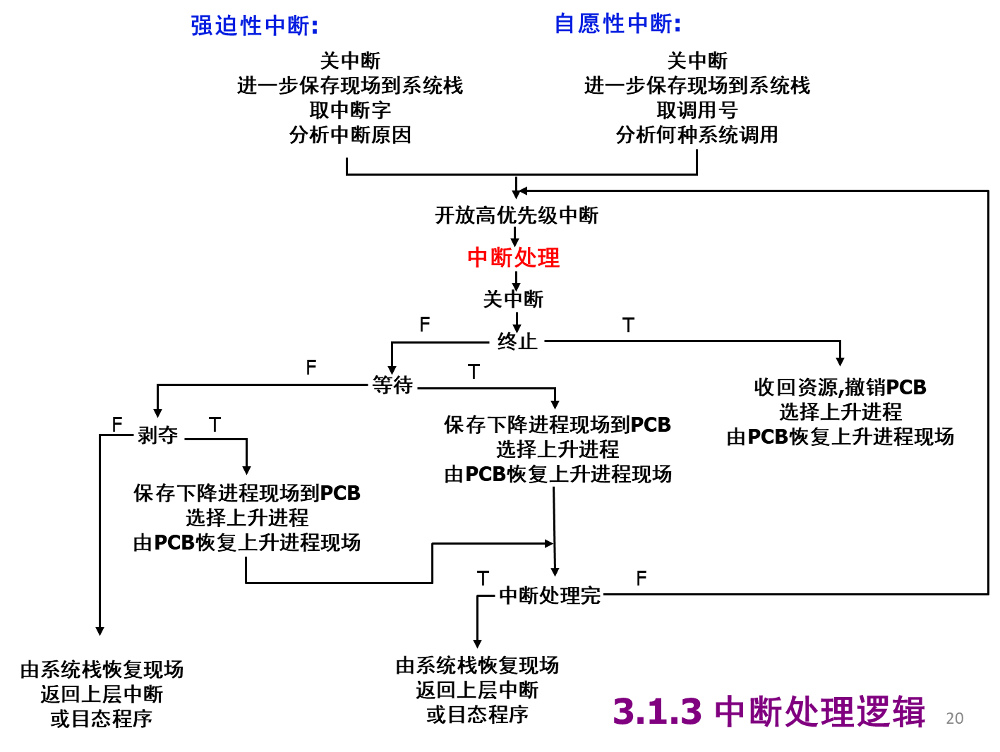
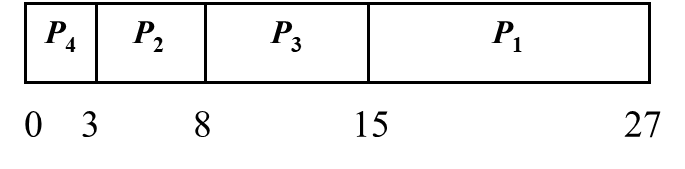
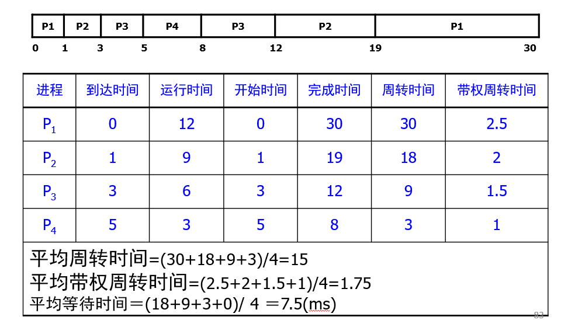
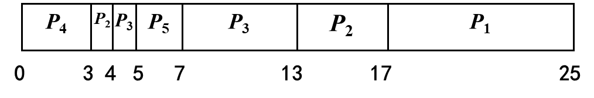
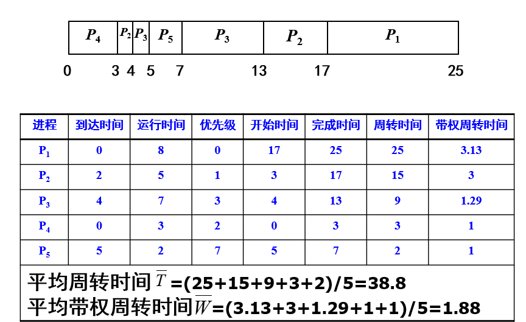
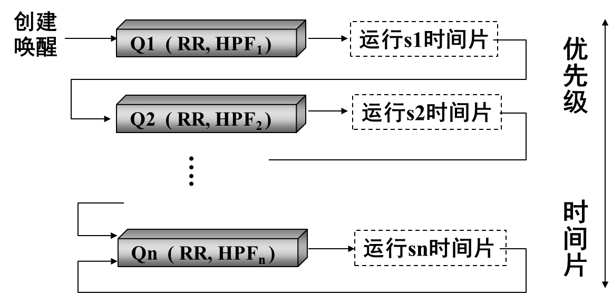

# 中断

## 中断与中断系统

### 中断的概念

> [!note]
>
> 在程序运行过程中出现某紧急事件，必须**中止当前正在运行的程序**，**转去处理这个事件**，然后**再恢复**原来运行的程序，这一过程称为中断.

- 中断系统：中断装置（硬件），中断处理程序（软件）

### 中断装置

- **发现并响应中断的硬件机构**

  > **识别中断源**，当有多个中断源时，按紧迫程度排队；
  >
  > **保存现场**；
  >
  > **引出中断处理程序**。

### **中断响应和处理的过程**

**中断源**：引起中断的事件。

**中断控制器**：CPU中的一个控制部件，包括中断控制逻辑线路和中断寄存器

**中断寄存器**：保存与中断事件相关信息的寄存器。

**中断字**：中断寄存器的内容。

> [!tip]
>
> 中断类型
>
> 1. **强迫性中断**
> 2. **自愿性中断**

- **中断向量**

  > 中断处理程序的运行环境与入口地址（**PSW**，**PC**）
  >
  > - 每类中断事件有一个中断向量,
  > - 中断向量的存放位置是由**硬件**规定的**,**
  > - 中断向量的内容是OS在系统初始化时设置好的。
  >
  > 中断向量mode应为**系统态**

## 中断嵌套与系统栈

**中断嵌套**

> [!note]
>
> 系统在处理一个**中断事件的过程中又响应了新的中断**，称系统发生了中断嵌套
>
> - 一般原则：只允许响应**更紧迫的中断事件**，中断嵌套的层数大多不会超过一个值（中断优先级别个数）
> - 实现方法：中断响应后立即**屏蔽**不高于当前中断优先级的中断源。

**系统栈**

> [!note]
>
> 系统栈：系统区，位置由硬件确定，**保存中断现场信息**
>
> 对于嵌套中断，现场恢复的次序和保存次序相反，所以保存现场信息的数据结构是栈，由操作系统访问
>
> - 系统栈保存的现场信息有中断装置保存的被中断程序的**PSW和PC**，还保存由中断处理程序保存的如**通用寄存器的值**等其它现场信息。
> - 系统栈还传递操作系统子程序之间相互调用的**参数**，返回值和返回地址。
> - 中断相当于是**特殊的子程序调用**，只不过它的发生时刻具有不确定性。

- 由于进一步保存现场信息是通过运行中断处理程序完成，程序运行时可以进行中断嵌套，为保证正确操作系统**不允许在保存现场信息时响应中断**
- 恢复现场信息也是由中断处理程序来完成，此时的工作也不允许响应中断
- **关中断**：尽管产生了中断源且发出了中断请求，但CPU内部的PSW中的**中断允许位被清除**，此时不允许CPU响应任何中断，此现象为关中断。

---

## 中断优先级与中断屏蔽

- **中断优先级**

  > 中断优先级：根据引起中断的事件的重要性和紧迫程度，硬件将中断源分成若干个级别
  >
  > 硬件规定的中断响应次序，依据紧迫程度；处理时间。
  >
  > 只允许高优先级别中断可以嵌入低优先级中断

- **中断屏蔽**

  > 暂时**禁止**一个或多个中断源向处理机发出中断请求，**屏蔽所有中断源就是关中断**
  >
  > 硬件系统提供中断屏蔽指令，通过它可以暂时禁止中断源向处理机发送中断请求，同时还有解除屏蔽指令
  >
  > 高优先级中断事件处理不受低优先级中断打扰；
  >
  > 程序调整中断响应次序。

---

## 中断处理逻辑

### 中断分析

#### 关于等待和剥夺

- 何时等待？**处于核心态**，无嵌套中断或有嵌套
- 等待剥夺几次？可能多次
- 保存在PCB的是什么级别现场？**核心级别**
- 等待或者剥夺时系统栈如何？**栈底是目态现场**，然后是嵌套函数的返回点，参数，局部变量，返回值；如有嵌套，接下来是核心现场，然后是嵌套函数的返回点、参数、局部变量、返回值；（可能有多重）

---

## 中断处理程序

### I/O中断处理

**正常结束**：准备好数据后启动通道继续传输；唤醒相关等待进程。

**传输错误**：复执（eg. 3次)；报告系统操作员。

### 时钟中断程序

- **Housekeeping**

  > - 进程管理：重新计算进程调度参数(eg. 动态优先数)
  > - 作业管理：记录作业在输入井中等待的时间，以及当前的优先级别，以便作业调度
  > - 资源管理：动态统计运行进程占有和使用处理器等资源的时间
  > - 事件处理：在实时系统中定时向被控对象发送控制信号
  > - 系统维护：定时运行死锁检测程序和记账程序
  >
  > - 实现软时钟：运用硬件间隔时钟和一个存储单元
  >   - 硬时钟5ms发生一次中断，实现软时钟50ms，存储单元初值10，发生一次中断寄存器减1，直到寄存器为0
  >
  > 

---

### 控制台中断程序

- 多个控制按钮对应多个中断向量
- 按下控制按钮产生中断信号，指向中断处理程序

---

### 硬件故障处理

- 电源故障处理
  - 掉电：硬件设备应保持继续工作一段时间
    - 内存，寄存器Þ外存，停止设备，停止处理机
  - 恢复：故障排除后恢复系统现场
    - 启动处理机，启动设备，外存Þ内存，寄存器
- 内存故障处理
  - 内存单元出现错误，中断处理对其进行检测并确认错误后划为不可用区域

---

### 程序性中断的处理

- 只能由**操作系统处理**的中断
  - 影响系统或其它进程：越界，非法指令，（处理：终止进程、调试）
  - 需要系统管理或协助：页故障，缺段，（处理：动态调入）
- 可以由**用户自己处理**的中断
  - 不影响系统和其它进程：除0，溢出，（处理：用户处理，或OS处理）

### 用户程序自行处理中断

1. 编译时：为每个用户程序生成一个**中断续元表（用户态）**
2. 运行时：执行调试语句，填写中断续元表
3. 中断时：根据中断原因查中断续元表
   - 为0，用户未规定中断续元，由OS标准处理
   - 非0，用户已规定中断续元，由用户处理

> [!TIP]
>
> 步骤：
>
> - （1）目态程序在运行时发生溢出中断
> - （2）中断装置将PSW和PC值压入系统栈
> - （3）取中断向量并送入PSW和PC寄存器
> - （4）执行对应的操作系统中断处理程序
> - （5）访问用户程序中的中断续元表（假定非0）
> - （6）系统栈中现场转移到用户栈
> - （7）中断续元运行环境和入口送PSW和PC
> - （8）控制权转到中断续元，执行中断续元
> - （9）由用户栈弹出现场送PSW和PC
> - （10）返回断点继续执行

### 自愿性中断的处理

1. 访管指令（SuperVisor Call)形式：

   > 准备参数
   >
   > SVC n
   >
   > 取返回值

2. 系统调用（system call)形式：返回值=系统调用名称（实参1,…,实参n)

3. 编译程序会将系统调用形式翻译为访管指令形式

---

# 处理器调度

> [!note]
>
> 3.2.1 处理器调度算法：**按什么原则分配**
>
> 3.2.2 处理器调度时机：**何时重新分配**
>
> 3.2.3 处理器调度过程：**如何完成分配**

---

## 处理器调度算法

### 因素

- 考虑因素：CPU利用率 ; (max)，吞吐量 ; (max)，周转时间 ; (min)，响应时间 ; (min)，系统开销 ; (min)

- 调度参数

  > 

---

### CPU burst vs. I/O burst 

- **阵发期**

  > CPU burst cycle: 进程(线程)一次连续使用**CPU**做计算
  >
  > I/O burst cycle: 进程(线程)一次使用设备做**I/O**操作

- 进程运行行为

- **CPU调度**：考虑处于CPU burst进程集合

- 下一个CPU burst的长度估算:

  > 令τ*n*是**估计**的第*n*个CPU阵发期的长度， *t*n*的值是进程**最近一次**CPU阵发期长度，则有如下估算公式:   τ*n*+1=α*t**n* + (1-α)τ*n*
  >
  > 参数α(0≤α≤1)控制*t*n*和τ*n*在公式中起的作用：当α=0时，τ*n*+1=τ*n*；当α=1时，τ*n*+1=*t**n*。通常α取0.5

### 剥夺式调度与非剥夺式调度

1. **剥夺式**(preemptive)

   > 就绪进程可以从运行进程手中**抢占CPU**
   >
   > 获得处理机的进程有3种:进程运行,直到结束; 等待 ;被抢先

2. **非剥夺式**(non-preemptive)

   > 就绪进程不可从运行进程手中抢占CPU
   >
   > 获得处理机的进程有2种：进程运行,直到结束；等待

### 先到先服务算法

FCFS（First Come First Serve)：按进程申请CPU（就绪）的次序

- 优点：“公平“
- 缺点：短作业等待时间长

### 短作业优先

SJF(Shortest Job First)：按CPU burst长度先执行时间短的作业，默认为不可抢占

§Process  Arrival time  Burst time

§  *P*1        0          12

§  *P*2        0           5

§  *P*3        0           7

§  *P*4        0           3

Gantt Chart：

特点：

- 假定所有任务同时到达，**平均等待时间**最短，也可以退出平均周转时间最小
- 忽略了作业等待时间，长作业可能被饿死

- 例题：

> §现有三个同时到达的作业J1，J2和J3，它们的执行时间分别为T1、T2和T3，且`T1<T2<T3`，系统按照单道方式运行且采用短作业优先算法，则平均周转时间为 `(3T1+2T2+T3)/3 `

---

### 最短剩余时间优先算法(SRTN)

**可剥夺**SJF，选择剩余时间最短的进程或线程

§Process  Arrival time  Burst time

§  *P*1        0           12

§  *P*2        1            9

§  *P*3        3            6

§  *P*4        5            3

Gantt图:

- 例题：
  

---

### 最高响应比优先(HRN)

- §Highest Response Ratio Next

  **`RR=(BT+WT)/BT=1+WT/BT`**

  > BT=burst time
  >
  > WT=wait time

计算每个作业的响应比，选择**响应比最高**的作业优先投入运行，类似于动态的优先级调度

优点

- 同时到达任务, 短者优先
- 长作业随等待时间增加响应比增加

- 例题：§一个作业8:00到达系统，估计运行时间为1小时。若从10:00开始执行，则其响应比为___。
- **`RR=(BT+WT)/BT=1+WT/BT=1+2/1=3`**

---

### 最高优先数算法(HPF)

- **用于实时系统**

1. **静态优先数**(static)

   > - 在进程创建时分配，生存期内不变
   >
   > - 简单，开销小
   >
   > - 公平性差，可能会造成低优先数进程长期等待
   >
   > - 适合批处理进程

2. **动态优先数**(dynamic)

   > 
   >
   > - 进程创建时继承优先数，生存期内可以修改
   >   - 获得资源优先数提高
   >   - 就绪时随等待处理机时间增长而提高
   >
   > - 资源利用率高，公平性好
   >
   > - 开销大，实现复杂

- 最高优先数算法有非剥夺式和剥夺式数

  > 1. 非剥夺式：获得处理机的进程运行，直至终止或者等待
  > 2. 剥夺式数：获得处理机的进程运行，直至终止或者等待，出现高优先级的进程（新创建或被唤醒的进程）

- 例子：

  > §可抢占CPU
  >
  > §Process  Arrival time  Priority  Burst time
  >
  > §P1      0        0         8
  >
  > §P2      2        1         5
  >
  > §P3      4        3         7
  >
  > §P4      0        2         3
  >
  > §P*5*      5        7         2
  >
  > Gantt Chart:
  >
  > 

- 例题：

  

---

### 循环轮转算法（RR）

- 系统为每个进程规定一个时间片，所有进程按照其**时间片长短轮流**的运行

- 适用于**分时系统**，利于多用户交互

- 基本的轮转

  > 时间片(quantum,time slice)长度固定，不变
  >
  > 所有进程等速向前推进

- 改进轮转：时间片长度不定，可变

- 对于时间片长度：

  > 几十毫秒~几百毫秒(eg. 50ms)
  >
  > 过长：响应速度慢
  >
  > 过短：系统开销(overhead)大

- 例子

  > §RR可抢占CPU调度：time slice=4ms
  >
  > §Process  Arriveral time  Burst time
  >
  > §P1          0              17
  >
  > §P2          0              10 
  >
  > §P3          0               3
  >
  > § Gantt Chart:
  >
  > 

- 例题

  > 

---

### 多级队列算法(MLQ)

- **多级队列**

  > 多个就绪队列，**进程所属的队列固定**
  >
  > 每个队列可以采用**不同的调度算法**

- 例如在通用系统中：

  > 队列1：实时进程就绪队列(HPF)
  >
  >  队列2：分时进程就绪队列 (RR)
  >
  >  队列3：批处理进程就绪队列 (HPF)

- 当CPU空闲时

  > 优先选择队列1中进程。如果队列1为空，则选择队列2中进程，否则选择队列3中进程

### 反馈排队算法

在多级队列的基础上，多个就绪队列，进程所属队列可变，并且越往上的队列优先级越高，但时间片越小

## 处理机度时机

- 运行进程结束
- 运行进程等待
- 处理器被剥夺

## 中断与处理器切换的关系

- 中断是处理器切换的**必要条件**，但不是充分条件

  > - 必然引起进程切换的中断：进程自愿结束，exit()，进程等待，进程强行终止
  > - 可能引起进程切换的中断：时钟，系统调用

## 处理机调度过程

1. 进程切换：

   > 中断处理后，需要进程切换则转入处理器分派程序dispatcher，选择上升进程运行

   > [!tip]
   >
   > **dispatcher**
   >
   > - 保存下降进程的现场：寄存器->PCB
   > - 选择上升进程：
   >   - 按调度算法在就绪队列选择进程
   >   - 为防止就绪队列为空，系统通常安排一个调度级别最低的进程，当系统中无其它进程时，运行“闲逛”进程
   > - 恢复上升进程的现场：PCB-> 寄存器（先恢复通用寄存器和地址寄存器，PSW和PC然后用一条指令恢复

   

---

# 调度级别与多级调度

## 交换与中级调度

### 调度层次

1. 高级调度
2. 中级调度
3. 低级调度：处理器调度

### 术语

> [!note]
>
> 交换(swapping)：进程在**内存和外存储器**之间的调度
>
> 中级调度(mid-level scheduling)：是系统控制并发程度的一个级别
>
> 并发度(degree of multi-programming)：**同时向前推进**的进程个数

- 交换的目标：减少并发度，缓解内存空间

### UNIX的中级调度

- 两个情况：

- 移入SRUN状态进程

- 如内存不够

  - 移出SWAIT和SSTOP状态进程；

  - 如还不够，移出SSLEEP和SRUN状态进程

    - 条件

      待移入进程在外存时间>=3秒

      待移出进程在内存时间>=2秒

---

## 作业与高级调度

### 作业调度

作业调度：将一个作业由（磁盘的）输入井**调入内存**，并为其建立相应的进程PCB，使其具有运行的资格

批处理作业的处理结果：程序的执行结果；计帐信息

---

### 作业的状态

提交: 输入机向**输入井**传送

后备: 在输入井,尚未进入内存

执行: 分解为进程,在**内存**处理

完成: 处理完毕,结果在**输出井**

退出: 由输出井向打印机传送

- 状态转换：

  

### 作业控制块与作业表

**JCB**

JCB（Job Control Block）：作业标识，所属用户，作业状态，调度参数，输入井地址，输出井地址，资源需求，进入时间，处理时间，完成时间

- SPOOling输入建立，作业调度使用，SPOOling输出撤销

### 批处理作业调度程序

#### 批处理作业调度程序(1)

- 在后备作业集合中选择作业，并为其建立作业控制进程来处理该作业。

- 其中为作业建立控制进程：

#### 批处理作业调度程序(2)

---

# 实时调度

> [!note]
>
> 实时任务：具有明确时间约束的计算任务，即明确开始结束
>
> 实时调度：合理安排就绪实时任务的执行次序，满足每个实时任务时间约束条件的调度

## 实时任务的分类

1. 硬实时和软实时（对应于实时操作系统）

   > 硬：必须满足任务截止期要求
   >
   > 软：期望满足截止期

2. 周期性和随机性

   > 周期：固定时间发生
   >
   > 随机：发生时刻不确定

## 周期性实时事务

- 可调度的必要条件：处理时间小于等于发生周期
- 多个进程时，所有进程处理时间和发生周期的比值和小于等于1

## 非周期实时任务

> [!tip]
>
> 若实时任务到达服从参数为λ的泊松分布时，当1/λ值很小，小于等于一个阈值，则**可以将其视为**周期性实时任务调度，任务的平均到达时间间隔为1/λ——平均周期

## 最早截止期调度

- **EDF**:

  > 优先选择完成**截止期最早**的实时任务
  >
  > 对于新到达的任务，如果其完成截止期先于正在运行任务的完成截止期，则重新分派处理器，即**剥夺**

- 可调度条件：，C处理时间，T发生周期

## 速率单调调度

- RMS：

  > 面向周期性实时事务，**非剥夺式**
  >
  > 优先调度**发生周期最短**（频度最高）的实时任务

- 可调度条件：

例题：

## 最小裕度优先调度

- 类似最早截止期优先，优先级基于一个进程的裕度  `L=D-(T+C)`

  L为裕度，T为当前时间，D为任务的截止期，C为剩余处理时间

- 最小裕度优先可调度的充分条件与最早截止期优先相同

---

# 多处理器调度

## 自调度

> - 均衡调度
> - 一个就绪队列，多处理机访问互斥
> - 系统负载利用率高，但是程序亲和性小

## 组调度

- 将一组相关(合作)的线程**同时**分派到多个处理机上运行

  避免合作线程之间的相互等待

  降低开销,提高运行效率

---

