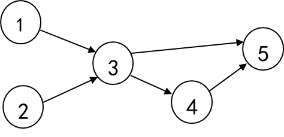
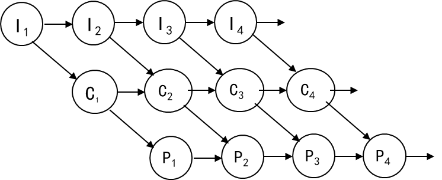
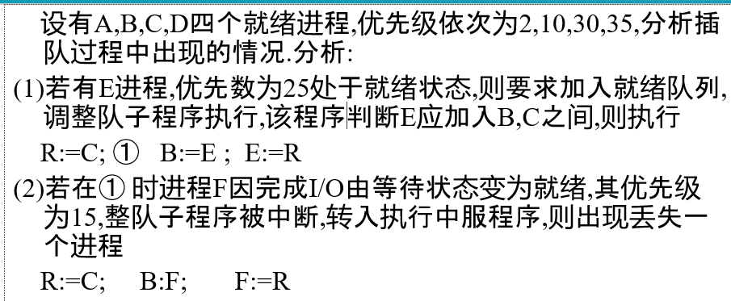
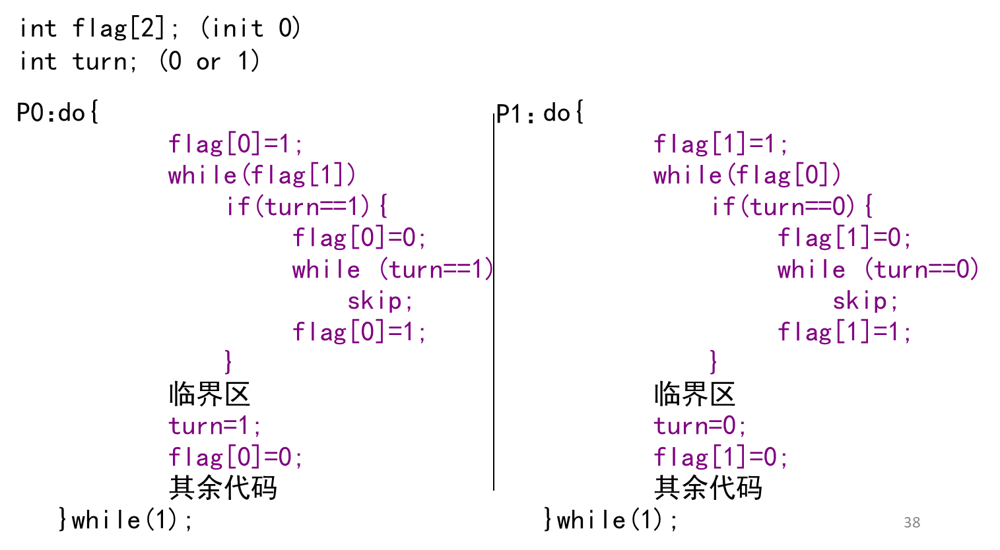
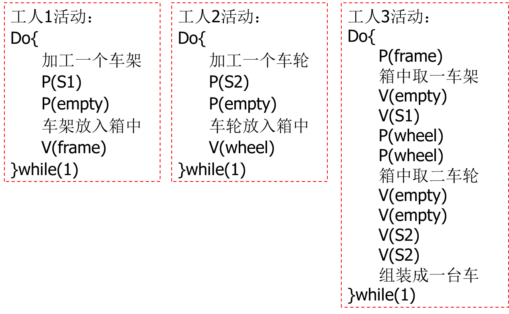
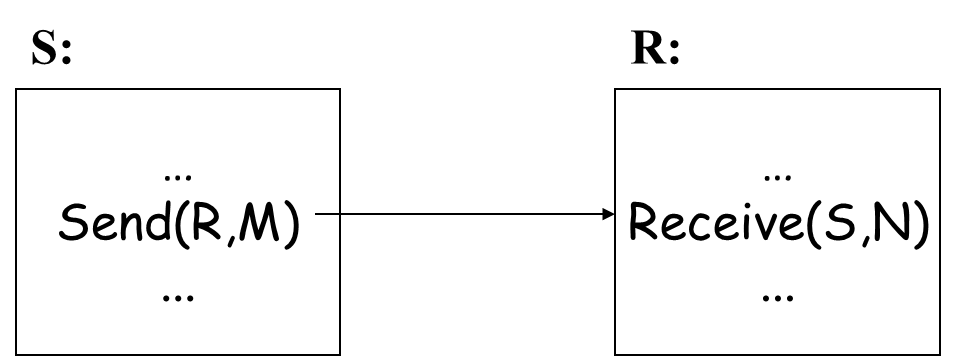
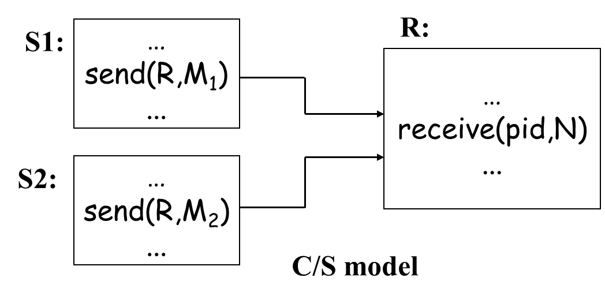
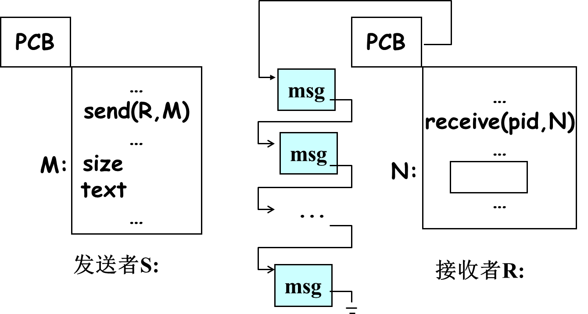
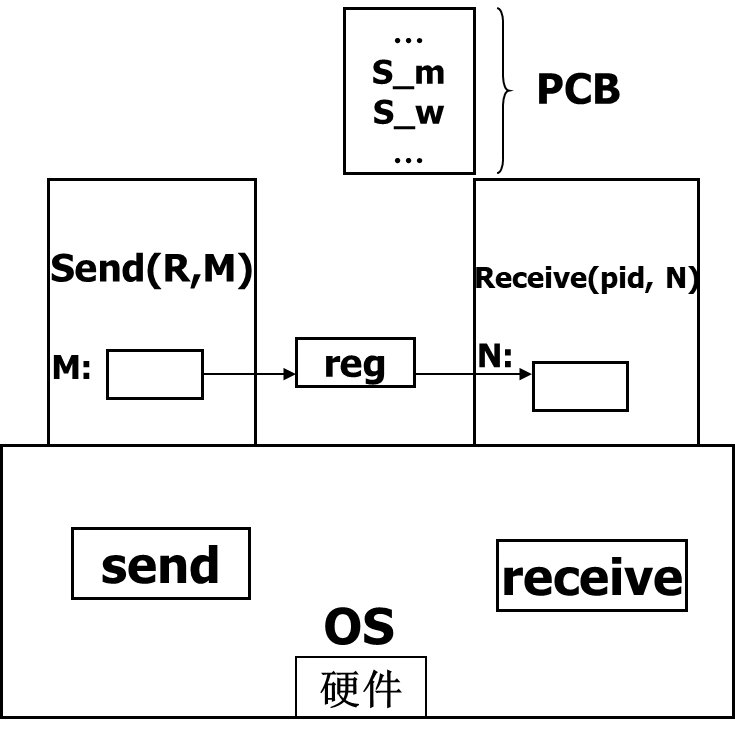

[TOC]

# 互斥同步与通讯

## 并发进程

### 前驱图

- 有向无环图，图中每个结点表示一个语句、一个计算步骤、或一个进程
- 结点间的有向边表示偏序或前趋(precedence relation)关系
- 在前趋图中，没有前趋的结点称为初始结点，没有后继的结点称为终止结点
- 每个结点可以有一个权重(weight)，它可以表示该结点所包含的程序量或计算时间
- 类似于图论里的AOE网

### 顺序程序

- 程序顺序执行

  > 1. 内部顺序性：对于一个进程来说，它的所有指令是按序执行的
  >
  >    
  >
  > 2. 外部顺序性：对于多个进程来说，所有进程的活动是依次执行的
  >
  >    输入(I)、计算(C)、打印(P)三个活动构成的进程
  >
  >    

- 顺序程序特性：连续，封闭，可再现

### 并发程序

- 程序并发执行

  > 1. 内部并发性：一个程序的并发性
  >
  >    
  >
  > 2. 外部并发性：多个程序之间的并发性，之间的交叉点由中断引起
  >
  >    

- 特性：间断，非封闭，不可再现

- 并发程序的表示:

  > `cobegin S1; S2; …; Sn coend;`
  >
  > `parbegin S1; S2; …; Sn parend;`


### 程序并发执行的条件

- 在失去封闭性的条件下，保持**可再现性**。

  > `R(pi)={a1,a2,…,am}`表示程序pi在执行期间所需读取的所有变量的集合，称为**“读集”**
  >
  > `W(pi)={b1,b2,…,bn}`表示程序pi在执行期间所需改变的所有变量的集合，称为**“写集”**

- 若两个程序p1，p2满足如下条件，则能够保持可再现性，因而可以并发执行。称为**Bernstein条件**。

  > [!note]
  >
  > ***R(p1)∩W(p2)∪R(p2)∩W(p1)∪W(p1)∩W(p2)=Φ***

### 与时间有关的错误

1. 同步写

   > [!warning]
   >
   > 程序并发交叉过程中改变了变量的运行环境，会导致错误。

2. 关于就绪队列的整队问题

   > 
   >
   > 结论:该错误因**共享就绪队列**引起,对就绪队列操作不当,也是与时间相关的错误导致结果不唯一.

3. 两进程申请两个独占性资源

   > 

> [!note]
>
> 错误原因之1：    进程执行交叉(interleave);
>
> 错误原因之2：    涉及公共变量(x)。
>
> Remarks:
>
> - 某些交叉结果不正确;
> - 必须去掉导致不正确结果的交叉。

## 进程互斥

### 共享变量与临界区

> [!note]
>
> 共享变量(shared variable)：多个进程都需要访问的变量
>
> 临界区域(critical region)：**访问共享变量的程序段**；访问同一组共享变量的临界区不能并发

- 表示

  > 共享变量: `shared <一组变量>`
  >
  > 临界区域: `region <一组变量> do <语句＞`

### 临界区域与进程互斥

- 定义：多个进程**不能同时**进入关于**同一组共享变量的临界区域**，否则可能发生与时间有关的错误，这种现象称为**进程互斥**。

> [!important]
>
>  （1）任何时刻最多只能有一个进程处于同一组共享变量的**相同**的临界区域
>
>   （2）任何时刻最多只能有一个进程处于同一组共享变量的**不同**的临界区域
>
> ​    Remarks: 互斥是相对于**公共变量**而言的

---

### 进程互斥的实现

- 进入区，临界区，退出区，剩余区


- **Framework**

  > 

- **Requirements**:

  > - **空闲让进**。临界区空闲时，可以允许一个请求进入临界区的进程立即进入临界区;
  > - **忙则等待**。当已有进程进入临界区时，其他试图进入临界区的进程必须等待;
  > - **有限等待**。对请求访问的进程，应保证能在有限时间内进入临界区（保证不会饥饿)
  > - **让权等待**。当进程不能进入临界区时，应立即释放处理机，防止进程忙等待。

- 临界资源：一次只允许一个进程使用的资源

  > 当关于某一组共享变量的临界区**均为空**时，一个要求进入该组公共变量的某一临界区的进程应当能够立刻进入；
  >
  > 当关于某一组共享变量的某一临界区被占用时，一个要求进入该组共享变量某一临界区的进程**应当等待**；
  >
  > 当一个进程**离开**关于某一组共享变量的某一临界区时，应当允许某一个等待该组共享变量某一临界区的进程进入；

#### 进程互斥的软件实现

- 完全用程序实现，不需特殊硬件指令支持

- 可用于单CPU和多CPU环境中

- 有忙式等待问题

  > 不进入等待状态
  >
  > 它**反复地检测**一个条件，如果条件成立就反复地循环
  >
  > 如果CPU被剥夺了，就回到就绪状态
  >
  > 以后如果再分配CPU，还检测这个条件

> [!tip]
>
> 忙式等待与阻塞式等待(让权等待)
>
> 相同之处：在于进程都**不具备继续向前推进**的条件
>
> 不同之处
>
> - 处于忙式等待的进程不主动放弃CPU，尽管CPU可能被剥夺，因而是低效的
> - 而处于阻塞状态的进程主动放弃CPU，因而是高效的

- 软件实现方法

  > 在进入区设置和检查一些**标志**来标明是否有进程在临界区中
  >
  > 如果已有进程在临界区，则在进入区通过循环检查进行等待
  >
  > 进程离开临界区后则在退出区**修改标志**

##### Dekker算法



##### Peterson算法

2个进程互斥的最简洁的算法

- **如果双方都争着想进入临界区，那可以让进程尝试“孔融让梨”，主动让对方先使用临界区。**
- Peterson算法用软件方法解决了**进程互斥问题，遵循了空闲让进、忙则等待、有限等待**三个原则，但是依然未遵循让权等待的原则。


##### Lamport面包点算法

- 想进入临界区的进程抓号，抓到号之后按**由小到大**的次序依次进入。
- 若抓到相同的号，按**进程编号**依次进入。这样可以把要进入临界区的进程排一个全序,`Definition: (a,b)<(c,d) if (a<c)or(a==c and b<d)`

> - 互斥性：多个进程竞争进入临界区时, 抓到号且**`二元组(number[i],i)最小`**的进程获准进入临界区, 其它进程将在**第一个while循环或第二个while循环**处等待,
> - 进展性：当仅有一个进程想进入临界区时, 该进程可以立即进入; 当有多个进程想进入临界区时，抓到号且`二元组(number[i],i)最小`的进程获准进入,
> - 有限等待性：对任意一个想要进入临界区的进程Pi, 设其抓到号码为number[i], 按二元组(number[i],i)次序排在Pi之前的**竞争进程数量是有限**的, 在最坏情况下Pi将等待n-1个排在其前面的进程进入并离开临界区后获准进入临界区

##### Eisenberg/Mcguire算法

> [!tip]
>
> `int turn; //0..n-1; 初始任意`
>
> - `flag[i]==idle`: 进程Pi不想进入临界区;
> - `flag[i]==want_in`: 进程Pi想进入临界区;
> - `flag[i]==in_cs`:  进程Pi想进入或已进入临界区

1. n个进程首尾相连
2. 如果Pi想要进入临界区，将状态置为`want_in`，还需要看从turn开始到i-1是否有想要进入临界区的进程。
3. 如果从turn开始到i-1，这些进程都不想进入临界区(`idle`)，则Pi有机会进入临界区，将状态置为`in_cs`
4. 一个进程将自己状态置为in_cs后，要检测其它进程状态是否为in_cs，如果都不是in_cs，则可以进入临界区。
5. 如果除了自己外，还有其它进程状态为In_cs，则从头来。


> [!note]
>
> - 互斥性：仅当`flag[i]==in_cs`, 且对所有`j!=i, flag[j]!=in_cs`时, 进程Pi才进入临界区域
> - 进展性：临界区空闲时, 排在序列`turn, turn+1, …, n-1,0,1, 2,…,turn-1`最前面的申请进入临界区的进程获准进入临界区
> - 有限等待性：进程离开临界区时,按循环次序turn+1, …, n-1,0,1, 2,…,turn-1确定唯一一个竞争进程为其后继, 所以一个进程**最多等待n-1个进程**进入并离开临界区后一定能进入临界区

---

### 进程互斥的硬件实现

> [!warning]
>
> 软件互斥算法一般适用于**单处理机系统**，多机环境下可并行执行的指令的效果可能是**重排序执行**的结果，会不满足互斥性

#### 硬件提供存储障碍语句

- 存储障碍（memory barrier）该指令出现在相继指令之间，**保证前面指令先于后面指令执行**

  > 例如Peterson算法：
  >
  > ```cpp
  > flag[0]=1;          
  > memory_barrier();        
  > turn=1;
  > ```
  >
  >    保证`flag[0]=1和turn=1`的次序不被重排序，从而保证算法在多处理环境下的正确性

### 硬件提供原子变量

- **原子变量**（atomic variable)：对一个基本变量的访问与修改不被分割的变量
- 在现代计算机系统中都支持原子变量，若上例中count被说明为原子变量，则对`count++` 的上述三条汇编指令就不会被打断。
- 原子变量并没有完全解决竞争条件的问题

> 1. 硬件提供“**测试并设置**”指令：将内存中一个单元的值取出，再送一个值。为原子操作。
>
>    ```cpp
>    int test_and_set(int *lock){
>              int temp;
>              temp=lock;
>              *lock=1;
>              return(temp);
>         }
>    ```
>
>    ```cpp
>    //增加全局变量waiting[]以满足有限等待性
>    waiting[i]=1; key=1;
>    while(waiting[i]&&key)
>         key=test_and_set(&lock);
>    waiting[i]=0;
>    临界区
>    J=(i+1)%n;
>    while(((j!=i)&&(!waiting[j]))
>        j=(j+1)%n;
>    //解锁
>    if(j==i) lock=0;
>    //唤醒
>    else waiting[j]=0;
>    其余部分
>    ```
>
> 2. 硬件提供“交换”指令：将内存中两个单元的**内容相互交换**，为原子操作。
>
>    ```cpp
>    void swap(int &a,&b){
>             int temp;
>             temp:=*a; *a:=*b; *b:=temp;
>      };
>    ```
>
>    满足互斥性，进展性，**不满足有限等待性**
>
>    ```c
>    waiting[i]=1; key=1;
>    while(waiting[i]&&key)
>         swap(&lock,&key);
>    waiting[i]=0;
>    临界区
>    J=(i+1)%n;
>    while(((j!=i)&&(!waiting[j]))
>        j=(j+1)%n;
>    if(j==i) lock=0;
>    else waiting[j]=0;
>    其余部分
>    ```

> [!note]
>
> test_and_set指令和swap指令是原子的，不可中断的
>
> -  test_and_set实际上是：将内存中一个单元的内容取出，再送一个新值
> - swap实际上是：交换内存两个单元的内容

3. 硬件提供“关中断”和“开中断”指令：

   > 开关中断只在**单CPU系统**中有效;
   >
   > 限制了处理器交替执行程序的能力，影响并发性。
   >
   > 只能操作系统使用

---


## 进程同步

> [!important]
>
> **同步**：一组进程，为了协调其推进速度，在某些点处需要**相互等待或者相互唤醒**，进程之间这种**相互制约**的关系称为进程同步。

- 进程同步是合作进程之间有意识的行为，只能发生在**相关进程**之间


### 进程同步机制

- 用于**实现进程同步**的工具称为同步机制

  > 描述能力够用、可实现、高效,使用方便

### 信号量与PV操作

- 信号量是一个结构体

  ```cpp
  typedef struct {
      int value;
      PCBpointer queue;//FIFO队列
  }semaphore 
  ```

- P操作

  > ```cpp
  > Procedure P(var s:semaphore)
  >     s.value:=s.value-1;
  >     If s.value<0 Then
  >         asleep(s.queue)
  > End
  > ```
  >
  > asleep(s.queue):
  >
  > (1) 执行此操作进程的PCB入s.queue尾（**状态改为等待**）
  >
  > (2) 转处理机调度程序，重新分派CPU

- V操作

  > ```cpp
  > Procedure V(var s:semaphore)
  >      s.value:=s.value+1;
  >      If s.value<=0 Then
  >           wakeup(s.queue)
  > End
  > ```
  >
  > wakeup(s.queue)：s.queue链头PCB出等待队列，进入就绪队列（**状态改为就绪**）

> [!tip]
>
> 信号量变量的规定
>
> - 必须置一次初值，**只能置一次初值，初值>=0**
> - 只能执行**P操作和V操作**，所有其它操作非法
>
> > 1. 当s.value>=0时，s.queue为空
> > 2. 当s.value<0时，|s.value|为队列s.queue的长度
> > 3. 当s.value初=1时，可以实现进程互斥
> > 4. 当s.value初=0时，可以实现进程同步（不一定为0）
> > 5. 当s.value的初值为非1的正整数时，可以用来管理同种组合资源，申请时执行一次P操作，归还时执行一次V操作

#### 用信号量实现进程互斥


- 例子：借书系统


#### 用信号量实现进程同步

V操作作为唤醒操作，P操作被唤醒


#### 用信号量实现资源管理

- **组合资源**：若干相对独立的资源构成的资源集合，其中每个相对独立的资源称为子资源。
- **同种组合资源**：相同类型的子资源构成组合资源

P操作相当于申请资源，V操作相当于释放资源


#### 小结

> [!note]
>
> - P操作相当于**申请**资源，V操作相当于**释放**资源。
> - P操作和V操作在系统中总是**成对出现**的，它们即可以出现在同一进程中，也可以出现在不同的进程中
> - 同步进程之间具有某种合作关系，如在执行时间上必须按一定的顺序协调进行，或者共享某种资源
> - 互斥进程彼此在逻辑上完全无关，它们的运行不具有次序的特征

---

### 生产者与消费者问题

> [!note]
>
> 缓冲区B:Array[0..k-1] Of item
>
> 生产者生产物品放入B中，消费者从B中取物品消费
>
>   箱子可以看做是一个缓冲区，且这个缓冲区是有限的，编号从0到k-1，容量是k。所以生产消费问题也叫**有界缓冲区问题**。

> [!tip]
>
> 为了方便编程，将缓冲区设置为环形。In：放入指针，out：取出指针

- 问题分析


- 其中生产者和消费者在加工和消耗没有直接关系
- 在这里P操作可以看作申请资源或者被唤醒，V则是释放资源或者唤醒进程

- 具体


其中P(mutex)和V(mutex)实现**进程的互斥**

#### 并发性提升策略

生产者和消费者：**不操作B的相同分量**(还没生产，消费者取)。

两个共享相同缓冲区B,但是有不同信号量实现互斥


---


### 读者与写者问题

一组**公共变量**(数据)，有2组进程访问，它们都要访问这组公共数据，**一组对公共数据进行读，一组对公共数据进行写。**

有m个读者，n个写者。这些读者读取这些数据，但是不修改数据。写者访问数据时可以修改数据。


---

- **同步读**：R-R可以同时
- **异步写**：R-W不可同时，W-W不可同时

### 障栅问题

- 若干进程并发，都向一个障栅推进，并在障栅处等待所有进程都到达再继续推进
- 其实就像一个协调器，让所有进程重新在同一起跑线

### 三台打印机管理

同种资源管理问题

- 编写一个申请函数require和一个释放函数return。
- require当有打印机空闲时，返回分得的打印机的编号；当无打印机空闲时则等待，被唤醒后返回分得的打印机的编号。
- Return用于释放指定编号的空闲打印机，当有申请者等待时就将其一唤醒


### 吸烟者问题

- 假设一个系统有三个抽烟者进程和一个供应者进程。每个抽烟者不停地卷烟并抽掉它，但要卷起并抽掉一支烟，抽烟者需要有三种材料：烟草、纸和胶水。三个抽烟者中，第一个拥有烟草，第二个拥有纸，第三个拥有胶水。供应者进程无限地提供三种材料，供应者每次将两种材料放到桌子上，拥有剩下那种材料的抽烟者卷一根烟并抽掉它，并给供应者一个信号告诉已完成，此时供应者就会将另外两种材料放到桌上，如此重复（让三个抽烟者轮流地抽烟）
- 传统解法


- Simultaneous P-operation

> ```cpp
> SP(S1,t1,d1;…;Sn,tn,dn);
> if S1>=t1 and … and Sn>=tn then
>     for I:=1 to n do Si:=Si-di endfor
> else 
> ```
>
> - 将运行进程的PCB连到第一个 Si< t1的队列中
> - 将该进程的指令计数器内容设置为SP操作的起始位置，使得当该进程重新执行时可以对所有等待条件重新进行评估
>
> ```cpp
> SV(S1,d1;…;Sn,dn)
> {
>     for(i=1; i<=n; i++)
>         Si = Si+di；
> }
> 
> ```
>
> -   将Si队列上的进程PCB取出，连到就绪队列中；
>
> 所以最终解法：
>
> 
>
> 

### 生产线问题

- 生产者和消费者问题的变种
- 自行车生产线上有一只箱子，其中有k个位置，每个位置可以存放一个车架或一个车轮，有3个工人，两个工人生产车架和车轮，另一工人则取车架和车轮


- 信号量：

  > semaphore empty; (空位，k)
  >
  > semaphore frame; (车架，0)
  >
  > Semaphore wheel; (车轮，0)
  >
  > 有死锁情况：K个车轮，k个或k-1个车架，所以增加信号量避免死锁
  >
  > semaphore S1; (初值 k-2，车架不超过k-2个)
  >
  > semaphore S2; (初值 k-1，车轮不超过k-1个)



### 寺庙问题

- 某寺庙有老和尚、小和尚若干。庙内有一水缸，由小和尚提水入缸，供老和尚饮用。水缸可容纳30桶水，每次入水、取水仅为一桶，不可同时进行。水取自同一井中，井口狭窄，每次只能容纳一个水桶取水。设有5只水桶，老和尚与小和尚共用。试用信号灯与PV操作给出老和尚和小和尚的活动

- 信号量定义：

  > semaphore empty; (30) //水缸容量
  >
  > semaphore full; (0) //当前水量
  >
  > semaphore bucket; (5) //水桶数
  >
  > semaphore mutex_bigjar;
  >
  > semaphore mutex_well; 


注意先申请empty，在申请bucket，这样避免死锁，即所有桶都在老和尚手里等待取水

> 若在上述解法中存在多个小和尚、老和尚时，P操作的不当顺序会引起死锁。假设先**P(bucket)****然后再****P(empty)**就会出现死锁
>
> 死锁一般都是在极限状态的时候判断

- 思想：范围或者等级更大的信号量可以包含小的信号量

## 进程同步与互斥

> [!important]
>
> 使用信号量和PV操作的规则
>
> - **互斥问题**（互斥访问临界资源的），**同步问题**（具有前后执行顺序要求的）
> - 对于互斥问题要设置互斥信号量，不管有互斥关系的进程有几个或几类，**互斥信号量的个数只与临界资源的种类有关**。通常，有几类临界资源就设置几个互斥信号量，且初值为1，代表临界资源可用
> - 对于同步问题要设置同步信号量，通常同步信号量的个数与**参与同步的进程种类**有关，即同步关系涉及几类进程，就有几个同步信号量。同步信号量表示该进程是否可以开始或该进程是否已经结束
> -  在每个进程中用于实现互斥的PV操作必须成对出现；用于实现同步的PV操作也必须成对出现，即有P操作就必须有对应的V操作
> - 但是，它们分别出现在不同的进程中；在某个进程中如果同时**存在互斥与同步的P操作，则其顺序不能颠倒**。必须**先执行对同步信号量的P操作，再执行对互斥信号量的P操作**。但是，V操作的顺序没有严格要求

---

## 条件临界区

- 形式：
- `regionr when b do s`
  - 执行s的条件：
  - 没有其它进程处于与r相关的条件临界区中
  - 进入s时b为true

- 条件临界区的实现效率是比较低的

  > - 主要是条件**表达式b的计算**
  > - 必须同时满足互斥和b为真两个条件
  > - 当处于条件临界区内的进程执行完s后，全局变量将发生变化，

---


## 管程

> [!note]
>
> 基本思想：将共享变量及其所有操作集中在一个**模块**中。
>
> 1. 把分散在各进程中的**临界区**集中起来进行管理;
> 2. 防止进程有意或无意的违法同步操作;
> 3. 便于用高级语言来书写程序, 也便于程序正确性验证;
> 4. 共享性、安全性、互斥性。

- 管程的形式

  > ```cpp
  > Type monitor_name=MONITOR(形参表) 
  >     共享变量说明;外部不可见
  > 	define 本管程内定义，本管程外使用的子程序名表；
  > 	use 本管程外定义，本管程内使用的子程序名表；
  > 
  >  Procedure 过程名（形参表）
  >     局部变量说明
  >     Begin    语句序列    End;
  > 
  > Function 函数名（形参表）:返回值类型；
  >     局部变量说明
  >     Begin  语句序列 End;
  >           ……………
  > Begin  共享变量初始化语句序列  End;
  > ```
  >
  > - 管程的共享变量在管程外部不可见，外部只能通过调用管程中的子程序访问共享变量(类似于类的私有成员变量)
  > - 每次仅允许一个进程在管程内执行某个内部过程
  > - 进程互斥地通过调用内部过程进入管程
  > - 管程是一种特殊的**数据类型**，它将共享变量以及对共享变量的操作封装到一起，是一种集中式的同步机制

### 管程的语义

- 等待时释放管程的互斥权，唤醒时(P唤醒Q)

- P紧急等待，Q继续，直到Q退出或等待(Hoare)
- Q等待，P继续，直到P退出或等待(Java)
- 唤醒是管程中可执行的最后一个操作(Hansen)

- 三个队列

  > 入口等待队列：每个管程变量一个，用于排队进入
  >
  > 紧急等待队列：每个管程变量一个，用于唤醒等待
  >
  > 条件等待队列：var c: condition; 可根据需要定义多个，用于设置等待条件


- 进入管程：申请管程互斥权
- 离开管程：如紧急等待队列非空，唤醒第一个等待者，否则开放管程

### 条件变量操作

1. Var c:condition;//指针，指向PCB队列头部
2. wait(c)：线程等待
3. signal(c)：唤醒

- 管程的应用：详见PPT

  > 单一资源管理
  >
  > 生产者与消费者
  >
  > 读者写者
  >
  > 哲学家就餐
  >
  > 磁头引臂调度问题
  >
  > 嗜眠理发师问题

---

### 管程与PV操作的等价性

#### 用管程构造PV操作

```cpp
TYPE semaphore=MONITOR(init_value)
    VAR c:condition;//条件变量
             count: integer;//整形变量
DEFINE  P,V;//定义2个外部函数
//用管程构造P操作
PROCEDURE P;
    BEGIN
        count:=count-1;
        IF count<0 THEN
            wait(c);
    END;

//用管程构造V操作
PROCEDURE V;
    BEGIN
       count:=count+1;
       IF count <=0 THEN
            signal(c);
    END;
//初始化
BEGIN
    count:=init_value;
END;

```

- 信号灯

  

#### 用PV操作构造管程


### 管程的嵌套调用问题

- 管程嵌套：

  > 一个进程在执行过程中调用某一管程中定义的外部函数，该函数在执行过程中可能又调用另一个管程中的外部函数


- 禁止嵌套：简单易行，但是过于严格的限制

- 允许嵌套，等待时释放当前管程互斥权

  >  这是容易保证程序正确性的处理策略，而且开销比较小， 但并发性差;

- 允许嵌套，等待时释放所有管程互斥权。

  > 并发性好，但是一旦等待结束，需要重新获得路经管程的互斥权，实 现困难，很难保证语义上的正确性;

- 允许嵌套，调用时释放路径管程互斥权。并发性好，但保证语义上的正确性更加困难

## 进程高级通讯

### 进程通讯概念

- 进程通讯：进程之间的**相互作用**

- 低级通讯（简单信号）：进程互斥，进程同步

- 高级通讯（大宗信息）

  > *memory sharing vs. message passing*
  >
  > *direct vs. indirect*
  >
  > *symmetric vs. non-symmetric*
  >
  > *buffering vs. non-buffering*

### 进程通讯模式

#### 共享内存模式（shared memory)

由OS提供：公共内存，互斥同步机制


#### 消息传递模式

OS提供两个基本的系统调用命令：发送命令，接收命令


#### 直接方式

- 对称形式：一对一，发送者在发送时指定接收者的名字，接收者在接收时要指定发送者的名字

  > `send(R,message)`
  >
  > `receive(S,message)`

  

- 非对称形式：多对一，发送者在发送时指定唯一的接收者，接收者在接收时不指定具体的发送者

  > `send(R,message)`
  >
  > `receive(pid,message)`



##### 实现方式

- 有缓冲途径（(消息传递模式,直接方式,非对称形式)

  > 
  >
  > 消息在发送者和接收者的传输经过一次缓冲，提高了系统的并发性。
  >
  > - 进程消息队列管理：    
  >
  >   ```cpp
  >    Var Sm:semaphore; (0)
  >   	收取消息前：P（Sm）;
  >   	消息入队后：V（Sm);
  >   ```
  >
  > - 消息队列互斥
  >
  >   ```CPP
  >   Var m_mutex:semaphore;(1)
  >   	P(m_mutex);
  >   	入列(出列)动作;
  >   	V(m_mutex);
  >   ```
  >
  > - Buffer pool management(缓冲池管理)
  >
  >   ```cpp
  >   Var Sb,  b_mutex:semaphore; (k,1)
  >   //申请：
  >       P(Sb);
  >          P(b_mutex);
  >          头缓冲出链;
  >          V(b_mutex);
  >   //释放：
  >       P(b_mutex);
  >          缓冲入链头;
  >          V(b_mutex);
  >          V(Sb);
  >
  >   ```
  >
  > - 发送原语
  >
  >   ```cpp
  >   //发送消息
  >   Send(R,M)
  >       根据R找接收者，否则带错返回；
  >       P(Sb);
  >       P(b_mutex);
  >       取一空buf;  
  >       V(b_mutex); 
  >       size,text,sender => buf：
  >       P(m_mutex);
  >       将载有消息的缓冲区挂到接收进程消息链的尾部；
  >       V(m_mutex);
  >       V(Sm);
  >   //接收消息
  >   Receive(pid,N)
  >       P(Sm);
  >       P(m_mutex);
  >       将消息链中的第一个载有消息的缓冲区由消息链取出;
  >       V(m_mutex);
  >       size,text=> N;
  >       sender => pid;
  >       P(b_mutex);
  >       将空闲的消息缓冲区挂到消息链的尾部；
  >       V(b_mutex);
  >       V(Sb);
  >   ```
  >
  > - Remarks
  >
  >   > Send/receive 为**高级通讯原语**，可用低级原语实现
  >   >
  >   > Send/receive不是真正意义的原语，**可以被中断**
  >   >
  >   > 对于发送进程来说，信息需要由发送进程空间复制到消息缓冲区中。对于接收进程来说，信息需要由消息缓冲区复制到接收进程空间
  >   >
  >   > 发送进程空间和接收进程空间均属于用户区，而消息缓冲区属于操作系统区
  
- 无缓冲途径(消息传递模式,直接方式,非对称形式)

  > 发送-接收都发生，信息由发送进程空间**复制**到接收进程空间，传送由操作系统完成
  >
  > 对于发送进程和接收进程都需要等待对方的行动
  >
  > 传输信息时可以利用寄存器
  >
  > - PCB中两个信号灯, S_m, S_w, 初值0
  >
  >   S_m: 接收进程等待
  >
  >   S_w: 发送进程等待
  >
  > - 发送过程
  >
  >   ```text
  >   根据R找到消息接收者
  >   发送消息增1, 如接收进程等待将其唤醒, 即执行V(S_m)
  >   等待消息传送完毕, 即执行P(S_w)
  >   ```
  >
  > - 接收过程
  >
  >   ```text
  >   等待消息到达, 即执行P(S_m)
  >   消息由发送进程空间复制到接收进程空间
  >   唤醒发送消息进程, 即执行V(S_w)
  >   ```
  >
  >   

#### 间接方式

> [!note]
>
> 指相互通信的进程之间在通信时不是直呼对方名字，而是**指明一个中间媒体**，即信箱，进程之间通过**信箱**来实现通信
>
> - `Send_MB(MB,M)`:将消息M发送到信箱MB中
> - `Receive_MB(MB,N)`:由信箱MB中接收消息至N


对于间接方式可以多对多或者多对一

`multi-sender -- multi-receiver`

`multi-sender -- one receiver`

```cpp
Type   mailbox=record
        in,out:0..k;//读写指针，初值为0
        s1,s2:semaphore; (k,0)//协调发送和接收进程
        mutex:semaphore; (1)//用于对信箱操作互斥
        //信箱体，可以保存k封信件
        letter:array[0..k-1]of message
end;
Var mb:mailbox; //定义信箱类型的变量
```

有关信箱的4个系统调用命令

> - creat_MB
> - delete_MB
> - send_MB
> - receive_MB

```cpp
//发送信息
Procedure send_mb(var mb:mailbox; m:massage);
    begin
           with mb do 
                begin
                     P(s1);  //申请空位
                     P(mutex);
                     letter[in]:=m;
                     in:=(in+1)mod k;
                     V(mutex);
                     V(s2)  //消息增加一个
                 end;
    end;
//接收信息
Procedure receive_mb(var mb:mailbox; var n:massage);
    begin
           with mb do 
                begin
                     P(s2);  //申请消息
                     P(mutex);
                     n:=letter[out];
                     out:=(out+1)mod k;
                     V(mutex);
                     V(s1)  //空位增加一个
                 end;
    end;

```


