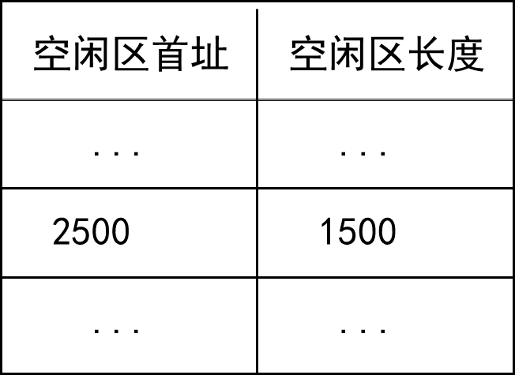
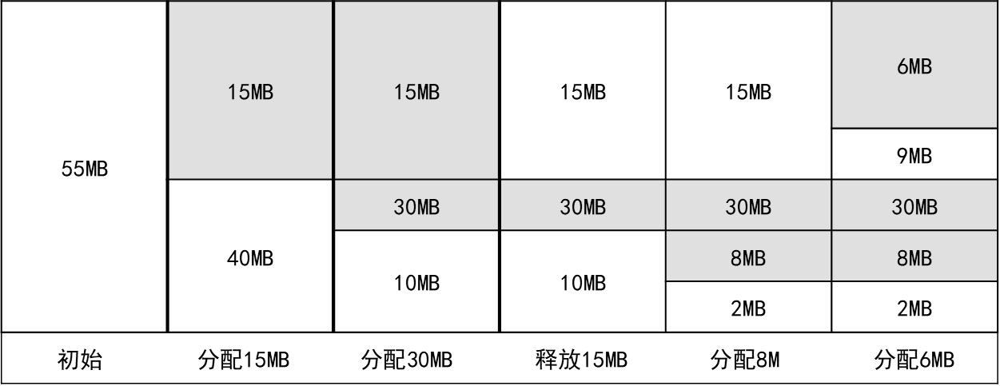
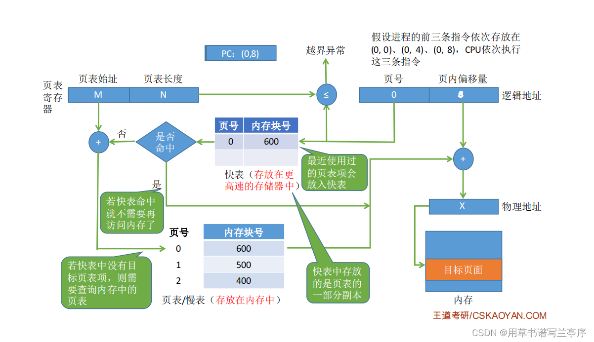
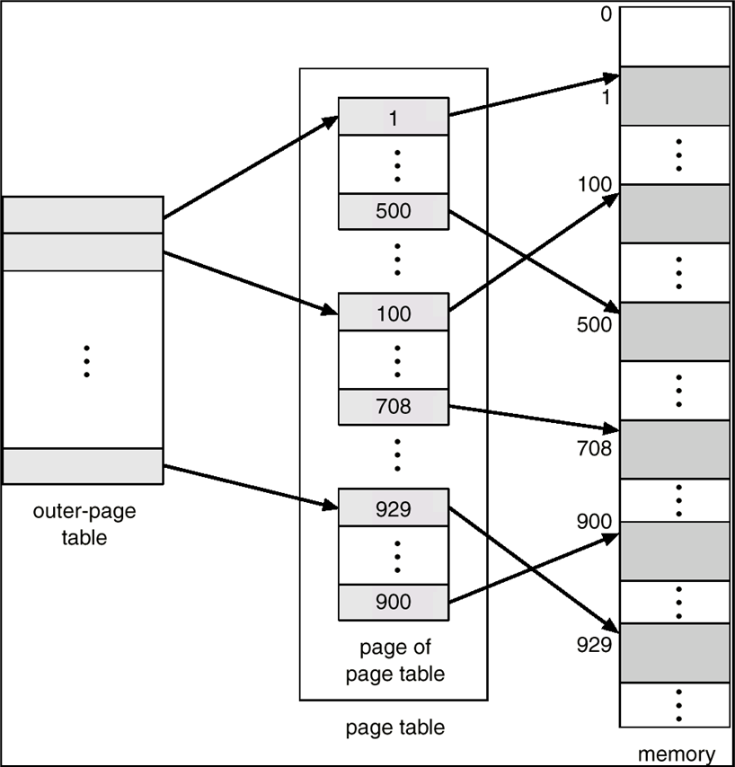
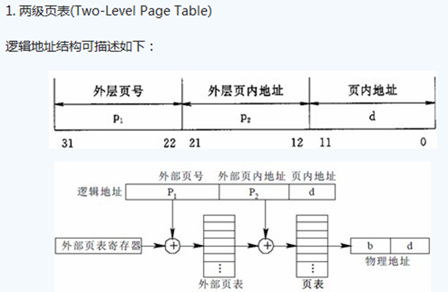
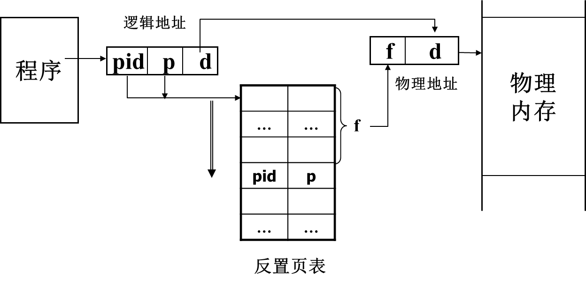
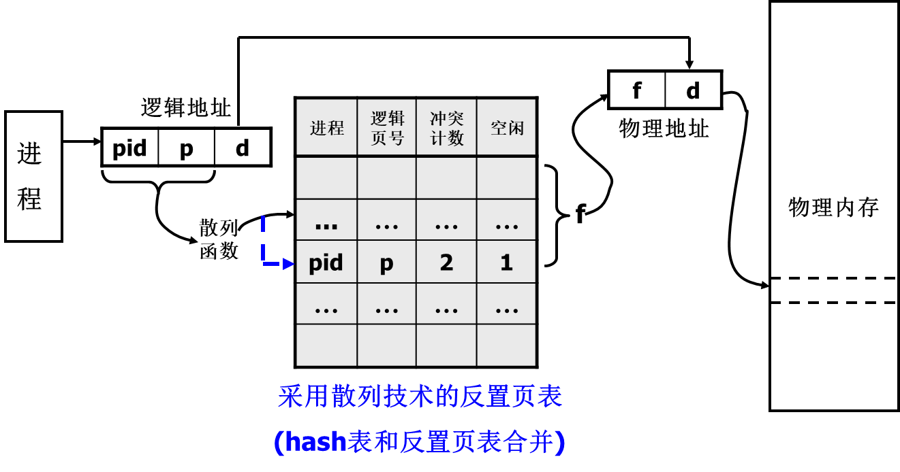
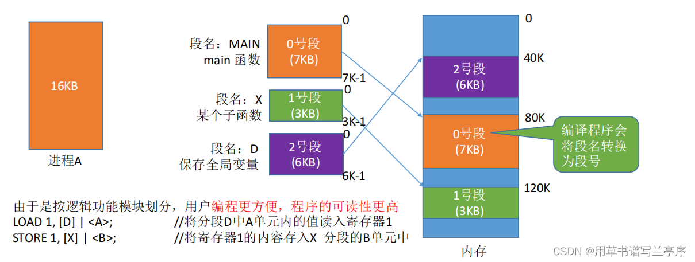
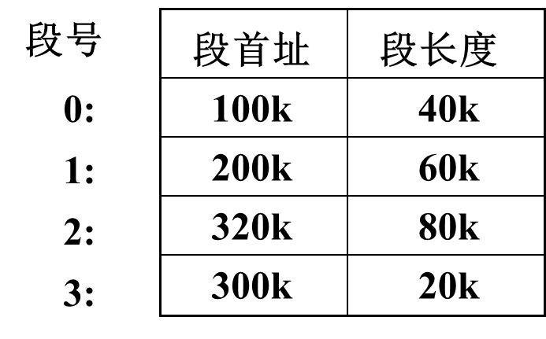
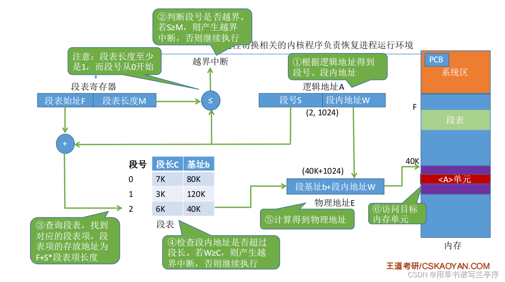

# 存储管理

## 存储管理功能

### 术语和概念

- 存储分配和去配
  - 分配和去配的对象：内存、外存
  - 分配和去配的时刻：进程创建、撤销、交换、长度变化(栈溢出, execl)
  - 分配表和空闲表
- 存储共享
  - 目的是节省内存、相互通讯
  - 内容为代码和数据
- 存储保护：防止地址越界、防止操作越权
- 存储扩充
  - 内存、外存结合，**虚拟存储**体系
  - 速度接近内存，容量相当外存
- 地址映射
  - 逻辑地址映射为物理地址
  - 硬件支撑：基址寄存器(base)、限长寄存器(limit)、快表

> [!tip]
>
> - 固定地址映射：**编译时**确定映射关系
> - 静态地址映射：**程序装入时**由OS完成映射（物理地址=逻辑地址+装入地址）
> - 动态地址映射：在**程序执行过程**中完成映射，需要MMU内存管理单元

### 存储体系

- 三级存储体系

- Cache(快，小，贵)+内存（适中）+辅存（慢，大，廉）

- 利用存储器访问的局部性原理

## 内存资源管理

### 内存分区

- 分区时刻：静态（系统初始化时），动态（申请时，系统运行中）
- 分区大小：等长或异长
- 通常做法：
  - 静态+等长（页式、段页式）
  - 动态+异长（段式、界地址）

### 内存分配

#### 静态等长分区的分配

- 位示图
- 用一个bit代表一页状态，0表空闲，1表占用。（ 多单元）
- 分配：自头**寻找第一个为0的位**，**改为1**，返回页号；
- 去配：找到页后，将页号对应的位(bit)**置为0**。

- 空闲页面**表**：若干个连续的空闲页面作为一组登记在空闲页面表中。
- 空闲页面**链**：将所有的空闲页面连成一个空闲页面链

#### 动态异长分区的分配

> [!note]
>
> 空闲区域表: 记录当前未被进程占用的空闲区域。
>
> 
>
> 初始时一个连续空闲区。长度=0为表尾。
>
> 尽量使空闲区域连续

##### 最先适应算法（First Fit）

- 空闲区：首地址按递增排序
- 申请：取满足申请长度要求并且起始地址最小的空闲区域

##### 下次适应算法（Next Fit）

空闲区：首址递增排列；

申请：自上次分配空闲区域 的下一个位置开始，选取第一个满足区域；

##### 最佳适应算法（Best Fit）

空闲区：首址递增排列；

申请：取**最小可满足区域**；

- 例题

  > 某基于动态分区存储管理的计算机，其主存容量为55MB（初始为空闲），采用最佳适配（Best Fit）算法，分配和释放的顺序为：分配15MB、分配30MB、释放15MB、分配8MB、分配6MB，此时主存中最大空闲分区的大小是____. 
  >
  > 

四种算法的比较

#### 碎片处理

- 动态异长分区存储分配可能形成**很小的空闲区域**，称为碎片(fragment)
- 解决方法-紧凑(compaction)：移动所有的占有区域，以使所有的空闲区域连成一片
- 紧凑的时期：系统找不到足够大的空闲区时；定期

---

## 存储管理方式

#### 界地址管理方式

- 基本原理：

  > - 内存空间划分：**动态异长**；
  > - 进程空间划分：**一个进程一个区域**，逻辑地址`0 ~ l-1`
  > - 所需表目：内存分配表，空闲区域表
  > - 所需寄存器：基址（首址）寄存器，限长寄存器
  > - 地址映射

  

1. 由程序确定逻辑地址*a*
2. 不满足：`0<=a<=*l-1`则越界；
3. a与b相加得到物理地址

> [!note]
>
> 双对界：允许一个进程在内存中占有2个连续的区域。
>
> - 代码(I空间)：一对界`(b1,l1)`
> - 数据(D空间)：一对界`(b2,l2)`

### 技术原理

#### 交换技术

- 内存不够时把进程写到磁盘（主存）（**换出**/Swap Out）
- 当进程要运行时重新写回内存（**换入**/Swap In）

- 需要考虑IO操作的CPU开销以及交换的单位大小
- 外存交换空间的管理方法，程序换入时的**地址重定位**问题

#### 覆盖技术

在较小的内存空间中运行较大的程序

内存分区：

- 常驻区：被**全局代码和数据占用**，可划分多个
- 覆盖区：能被多个段共同（覆盖），可划分多个

---

### 分页式存储管理

内存空间划分：静态等长，`2^i`,称为一个页框(frame)

- 所需表目：页表（每个进程一个）；总页表：**系统一个记录内存的分配和使用状态**
- 所需寄存器：页表寄存器一个，页表长度寄存器一个，快表（TLB）：一组

#### 快表

- 一组联想寄存器，用于保存正在运行进程的页表中的**部分表项**
- 页表长度一般大于快表的长度
- 通常只将正在访问的页面所对应的项目记录于快表中；
- 访问一个页面时，由逻辑页号先在快表中进行查找，如果找到则根据页框号和页内地址形成物理地址；如果没找到，则由逻辑页号在页表中查找，并将查找的页框号和页号**送入快表，如快表满则淘汰**。类似于Cache
- 快表命中率：访问页号在快表的次数与总访问次数之比
- 平均访存时间EAT=`快表命中率*(快表访问时间+内存访问时间)+(1-快表命中率)*(快表访问时间+2*内存访问时间) ns`
- 当有缺页时：EAT=`快表命中率*(快表访问时间+内存访问时间)+(1-快表命中率)*(快表访问时间+2*内存访问时间)+缺页故障率* 缺页中断处理时间] ns`

1. 页号=逻辑地址/页面长度(**取除法的整数部分**)；十六进制时可以转换为二进制计算
2. 页内偏移量 = 逻辑地址%页面长度（**取除法的余数部分**)
3. 页面在内存中的起始位置:操作系统需要用某种数据结构记录进程各个页面的起始位置。

#### 多级页表

二级或多级页表：

- 将4M的超大页表存储到离散的1K个页框中
- 仅将页表的部分内容调入内存.

- 对页表进行分页，称**页表页**，长度与页框相同(4K)，可移到外存
- 页表页之间可以不连续
- 外页表入口指向了**页表页的起始地址**(物理页框号)

- 多级页表：将大页表进行分页。**内存仅存放当前使用的页表**
- 系统为每个进程建立一张**页目录表**，它的每个表项对应一个页表页，
- 页表页的每个表项给出了页面和页框的对应关系
- 此时，页目录表为一级页表（外页表），页表页是二级页表。

> [!important]
>
> 二级页表地址映射特点
>
> - 访问数据需要三次访问内存（页目录表，页表页，存储单元）（N级页表访问一个逻辑地址需要N+1次访问内存。）
>   - 页目录调入内存
>   - 页表页按需调入内存
>   - 页面、页表页、页目录表的大小都刚好4k（占1个页框）即若采用多级页表机制，则各级页表的大小不能超过一个页面
>
> EAT=`快表命中率*(快表访问时间+内存访问时间)+(1-快表命中率)*(快表访问时间+(n+1)*内存访问时间) ns`

#### 反置页表

- 反置页表面向内存空间
  - 对每个内存页框设置一个表项，表项的序号为物理页框号f，表项的内容为**进程标识pid与逻辑页号p的有序对**
  - 反置页表大小固定
  - 整个系统一个反置页表，为所有进程所共用，类似于FAT表

#### 页式存储管理

- 采用杂凑技术的反置页表地址映射

- 在反置页表前增加一级杂凑表(冲突计数和空闲标志)
- 进行地址映射时，由hash(pid,p)计算得到反置页表入口地址
- 从入口地址开始向下探查找到对应的表项，**位移f为对应的页框号**

---

### 段式存储管理

- 内存空间划分：**动态异长**，每区一段。

- 进程空间划分：若干段，每段一个程序单位；逻辑地址结构由段号（段名）和段内地址（段内偏移量）所组成

- 所需表目

  > 1. 段表：每个进程一个，记录段号和段首地址的对应关系
  >
  > 
  >
  > 2. 空闲表：系统一个，用于记录并管理系统中的空闲区域

- 所需寄存器

  > 1. 段表首址寄存器：用于保存正在运行进程的段表首址，系统一个
  > 2. 段表长度寄存器：用于保存正在运行进程的段表长度，系统一个
  > 3. 快表(TLB)：系统一组，用于保存正在运行进程的段表中的部分项目

- 地址映射：

-   逻辑地址(s,d)->物理地址(b’+d)

#### 段的共享

- 共享段表

- 进程段表(n)->共享段表(1)->共享段(1)

  

- 链接共享段时：段名查共享段表

  > 找到，已有进程在用，共享计数加1，段表指向共享段表
  >
  > 未找到，读入内存填共享段表， 共享记数=1，段表指向共享段表
  >
  > 当一个进程结束对某一共享段的访问时，其共享计数减1
  >
  > 当共享计数减到0时，表示没有进程再使用该段，可以释放所占用的存储空间

- 类似于共享指针

#### 段的保护

- 对于段表和快表加上访问权限（RWE)
- 进程对于共享段的访问往往需要加上某种限制

---

### 段页式存储管理

- 段式便于共享和保护
- 页式可以消除碎片问题
- 段页式：每个进程包含若干段，每个段包含若干页

1. 内存空间划分和页式相同：物理地址=(页框号,页内地址)=`(f,d)`

2. 进程空间划分：逻辑地址=(段号, 逻辑页号, 页内地址)=`(s,p,d)`

3. 对应关系：每个进程包含若干段，每个段包含若干页

4. 所需页表

   > 1. 段表：进程一个
   > 2. 页表：段一个
   > 3. 总页表：系统一个，用于记录并管理内存页面

5. 所需寄存器

   > 1. 段表基址寄存器：保存正运行程序段表首址
   > 2. 段表基址寄存器：保存正运行程序段表首址
   > 3. 快表：一组联想寄存器 (快段表+快页表) (TLB)，保存正在运行进程的段表和页表中的部分表目

6. `逻辑地址(s,p,d)->物理地址(f,d)`

### Linux伙伴堆存储分配算法

## 总结

- 存储管理功能：存储分配和去配、存储共享、存储保护、存储扩充、地址映射
- 内存资源管理
  - 静态等长分区的分配：字位映象图、空闲页面表、空闲页面链
  - 动态异长分区的分配：最先适应 (First Fit)、下次适应法(Next Fit)、最佳适应 (Best Fit)、最坏适应 (Worst Fit)
- 存储管理方式
  - 界地址管理方式（一维地址）
  - 页式管理方式（一维地址）
  - 段式管理方式（二维地址）
  - 段页式管理方式（二维地址）
