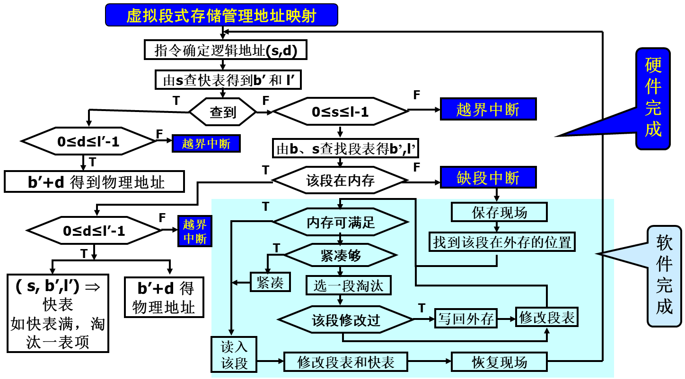

# 虚拟存储管理

## 外存空间管理

- **外存空间**

| Swap空间 | 输入井 | 输出井 |
| -------- | ------ | ------ |

- **外存空间划分**

  > - 静态等长，2^i, 为一块(block)，**块是外存分配的基本单位，也是IO传输的基本单位**
  > - 如果需求不足一个完整块，会形成块内**“零头”**

- **外存空间分配**：三个方法

  > 空闲块链(慢)：所有空闲块连成一个链
  >
  > 空闲块表：相连的空闲块记录在同一项中
  >
  > 字位映像图：用1位表示一个块的状态

- 界地址

> 每进程占一组外存连续块
>
> 每进程占二组外存连续块(双对界)

### 进程与外存对应关系

- 页式：内存一页，外存一块。内存页与外存块长度相同
- 段式：每段占外存若干连续块，进程的多个段之间在外存可以不连续
- 段页式：内存一页，外存一块。内存页与外存块长度相同。段内多页所对应的外存块可以不连续，一个进程的多段可以分散在外存的不同区域中

---

## 虚拟存储系统

> [!important]
>
> - 无虚拟的问题
>   - 不能运行比内存大的程序
>   - 浪费空间，因为进程活动有局部性
>     - 进程在一个有限的时间段内访问的代码和数据往往集中在有限的地址范围内
>     - 把程序一部分装入内存在较大概率上也足够让其运行一小段时间
> - 虚拟存储：只将当前**必要的很小一部分代码和数据装入内存**，其余装入外存，运行时访问在外存部分动态调入，内存不够淘汰

**虚拟内存的最大容量是由计算机的地址结构（ CPU寻址范围）确定的**

虚拟内存的实际容量= min(内存和外存容量之和，CPU寻址范围)

- 虚拟存储目标：大程序小内存，多程序小内存，多程序并发地址不冲突，高效内存
- 虚拟存储管理：虚拟页式，虚拟段式，虚拟段页式

### 虚拟页式存储系统

#### 基本原理

- 进程运行前：部分页面装入内存，其他（全部）装入外存

- 运行时：

  > 类似于Cache
  >
  > - 命中则访问
  > - 不命中则发生缺页中断，中断处理
  >   - 找到页面外存地址
  >   - 找到内存空闲页面（内存已满则按淘汰算法处理并淘汰原有页面）
  >   - 读入并修改页表和快表（中断返回，进程切换）

- 缺页中断：在地址映射过程中，当需要访问的页不在内存时
- 缺页中断处理程序：将所缺的页从外存调度内存的某个页框中，更新页表和快表

为了保持各个数据块的数据一致性，需要对页表和快表增加修改标志表明该页面是否被修改

---

#### 内存页框分配策略(静态策略)

1. 平均分配：将内存中的所有物理页框**等分**给进入系统中的进程。如内存128页，进程25个，每个进程5个页框

2. 按进程长度比例分配：按程序长度的比例确定分配内存的物理页框数。

   > pi共si个页面；`S=SUM(si)`；内存共m个页框
   >
   > 分配给进程pi的物理页框数`ai=(si/S)*m`

3. 优先级分配：根据优先级别按比例分配内存物理页面

   > ri表示进程pi的优先级。
   >
   > `S=SUM(ri)`；内存共m个页框
   >
   > 分配给进程pi的物理页框数`ai=(ri/S)*m`

4. 进程长度结合优先级

   > 进程pi逻辑页面数与优先级之和为`si+ri`
   >
   > `S=SUM(ri+si)`；内存共m个页框
   >
   > 分配给进程pi的物理页框数`ai=((si+ri)/S)*m`

静态策略无法反映程序的结构，以及程序不同时刻的行为特性

---

#### 外存块的分配策略

1. 静态分配：**外存保持进程的全部页面**
2. 动态分配：**外存仅保持进程不在内存的页面**，当某一外存页面被调入内存，将释放所占用的外存页面

#### 页面调入时机

1. 请调：发生**缺页中断时调入**，但是调入时进程堵塞
2. 预调：**将要访问时调入**(根据程序顺序行为，不一定准)。预调可以节省因页故障而等待的时间。预调必须辅以请调（当预先调入依旧缺页中断

#### 置换算法（淘汰算法

> [!note]
>
> - 用于确定页面的调出原则
> - 被移出页面称为淘汰页面
> - 用于选择被淘汰页面的算法称为置换算法
>
> 页淘汰，段淘汰，快表淘汰

- 置换方法：局部，全局

##### 最佳淘汰算法

- 淘汰以后不再需要的或者在最长时间以后才会用到的页面。
- 页故障率最低，为最理性的淘汰算法。然而，不能实现，因为**无法准确预期页面**“将来”的被访问情况。
- 可以作为衡量其它算法性能的一个标准。

##### 先进先出(FIFO)

- 淘汰最先调入内存的页面，先进入的可能已经使用完毕。
- 实现：采用队列的形式。
- 最坏的情况：有些代码和数据可能整个程序运行中用到

> [!warning]
>
> - 对于先进先出的算法，会有一个现象：**Belady**异常
> - 增加进程所分得的内存页框数不一定能够保证缺页故障次数下降
> - 这个现象和程序的结构有关

##### 最近最少使用算法(LRU)

- 淘汰最近一次**访问时间距离当前时间间隔最长**的页面。
- 实现：stack，当一页面被访问时, 从栈中取出压到栈顶,
- 栈底是: LRU page.

但是LRU算法的实现开销很大，必须有硬件的支持

##### 最近不用的先淘汰(not used recently,NUR)

- 淘汰最近一段时间未用过的页面。
- 为每一个页面增加两个硬件位，引用位和修改位
- **每隔固定时间将所有引用位清零**。

> 当要淘汰某一页面时，按照下面的次序进行选择：
>
> - 引用位=0，修改位=0；直接淘汰
> - 引用位=0，修改位=1；淘汰之前写回外存
> - 引用位=1，修改位=0；直接淘汰
> - 引用位=1，修改位=1；淘汰之前写回外存

##### 最不经常使用的先淘汰(LFU)

- 淘汰使用次数最少的页面

- 依据: 活跃访问页面应有较大的访问次数 

- 实现：**记数器**，调入清0，访问增1，淘汰选取最小者

    Suffer: (1) 前期使用多，但以后不用，难换出

  ​     	 (2) 刚调入的页面，引用少，被换出可能大

##### 最频繁使用算法(MFU)

- 与最不经常使用算法LFU相反，**淘汰使用次数最多**的页面。
- 使用多的页面可能已经用完了，因而淘汰时取计数器值最大的页面

Suffer: 程序有些成分是在整个程序运行中都使用的

##### 二次机会

- 淘汰**装入最久且最近未被访问**的页面
- 实现时：采用**拉链**数据结构。

##### 时钟算法

- 将页面组织成环形，有一个指针指向当前位置

  > - 每次需要淘汰页面时，从**指针所指的页面开始检查**
  > - 如果当前页面的访问位为0，该页没有访问过，则将该页替换
  > - 如果当前页面的访问位为1，**则将其清0**，并顺时针移动指针到下一个位置
  > - 重复上述步骤直至找到一个访问位为0的页面

- 改进：考虑修改标志m，此时的淘汰优先级类似于NUR算法
- 由指针当前位置开始扫描，选择最佳淘汰页面，**不改变引用位**，将第一个遇到的**r=0且m=0**的页面作为淘汰页面
- 如步骤1失败，再次从原位置开始，**找r=0且m=1的页面**，将第一个满足上述要求的页面作为淘汰页面，**同时将扫描过页面的r位清0**
- 若步骤2失败，指针再次回到原位置，**重新执行步骤1**。若还失败再次执行步骤2，此时定能找到

> [!note]
>
> 时钟算法：尽量淘汰**没被访问过**的
>
> 改进的时钟算法：尽量淘汰**没被访问过的且没被修改过**的

- 五种算法对比

---

#### 颠簸

- 页面在内存与外存之间频繁换入换出
  - 分配给进程的物理页框过少：增加物理页框（根本原因：内存少）
  - 淘汰算法不合理：改进
  - 程序结构不好：改善

#### 工作集模型

- 工作集(working set): 进程在**一段时间**内所访问页面的集合

Δ：称为窗口尺寸(window size)。

为使程序有效运行，工作集应能放入内存。

**Madnick**, Donovan建议： Δ＝**1万次访内**。

实现：页表中增加访问位

> - Δ开始时，全部清0,
> - 访问：置1
> - Δ结束时(新D开始时)访问标志为1的，为该D期间工作集，

> [!note]
>
> 工作集估计：

#### 页故障率反馈模型

- PFFB(Page Fault Feed Back)：**动态调整页面的分配**

> - 页故障率高(达到某上界阈值)：内存页框少，增加
> - 页故障率低(达到某下界阈值)：内存页框多，减少

### 虚拟段式存储系统

- 进程运行前，全部装入外存，**部分装入内存**，访问段不在内存时，发生缺段中断
- 若内存空间不够
  - 紧凑：将内存中的所有空闲区合并
  - 淘汰：将内存中的某段移至外存.

#### 段的动态连接

- 当遇到访问**外段的指令**时，需要进行连接

> [!note]
>
> - 静态连接：**运行前连接**，由link完成；一个程序共有多少个段是确定的，因而link可以为每一个段分配一个段号；
> - 动态连接：**运行时连接**，由**OS**完成.(在程序运行过程中需要某一个段时才将该段连接上)；一个程序共有多少个段是不确定的，因而段名到段号的转换需要由操作系统来完成的。

- 所需表目

  > - 段名-段号对照表：每进程一个，记录当前**已连接段的表目**
  > - 符号表：每段一个
  > - 段形式：符号表和目标代码或者数据
  >
  > 静态连接时不需符号表，由link将段名段号和目标对应起来

1. 编译或者汇编时： 遇到访问外段指令，采用间接寻址，指向一个间接字：

   

2. 执行时：遇到间接指令，且L=1, 发生连接中断，处理程序：

   1. 由D取出符号地址；
   2. 由段名查段名-段号对照表，是否分配段号。

　动态连接后，重新执行指令，发现连接字Ｌ＝０，为一般的间接地址。

> [!caution]
>
> 动态连接要求修改连接字，但是段的共享要求纯代码
>
> 所以将共享代码分为“纯段共享”，“杂段私用”

---

### 虚拟段页式存储系统

考虑段的动态连接，共享，段长度的动态变化

- 所需表目

  > - 段表：每一个进程一个，动态变化，**每连接一个新段时，增加一个新的表项**
  >   - | 段号 | 页表长度 | 页表首址 | 访问权限 | 扩展标志 | 共享段入口 
  > - 页表：每段一个，进程**开始时只为主程序段建立页表**，其他段的页表段连接时建立
  >   - 逻辑页号 | 页框号 | 外存块号 | 内外标志 | 修改标志 |
  > - 总页表：即位示图，内外存各一个
  > - 共享页表：系统一个，记录共享段
  >   - 段名 | 页表长度 | 页表首址 | 扩充标志 | 共享计数 | 
  > - 段名-段号对照表：进程一个

- 所需寄存器

  > - 段表长度寄存器：保存正运行进程段表长度
  > - 段表首址寄存器：保存正运行进程段表首址
  > - 快表：段名 | 逻辑页号 | 页框号 | 访问权限 | 修改标志

- 地址映射：逻辑地址`(s,p,d)`=》物理地址`(f,d)`

### 中断处理

- 连接中断
  - 所有进程均未连接(共享段表、段名-段号对照表均无)
  - 其它进程连接过，本进程未连接过(共享段表有，段名-段号对照表无)
  - 本进程连接过(段名-段号对照表有，共享段表有或无)
- 缺页中断
  - 分配页框，调入所需页面，更新页表和总页表
- 越界中断
  - 段号越界：访问不存在的段，地址错误，程序被中止
  - 页号越界：访问段内不存在的页，根据段扩充标志判断该段是否可以扩充
- 越权中断：违反段的访问权限，程序将被中止

> [!note]
>
> 
>
> - 分页对用户是透明的，分段对用户是可见的
