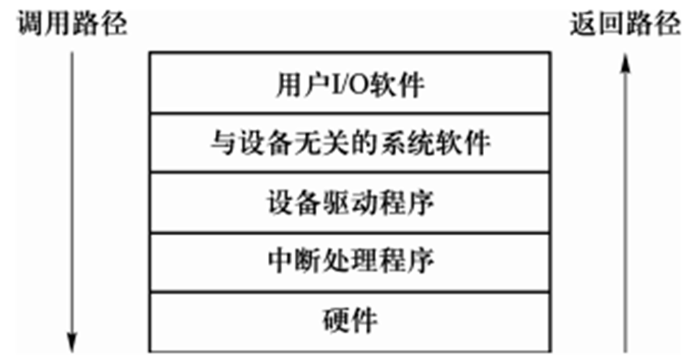
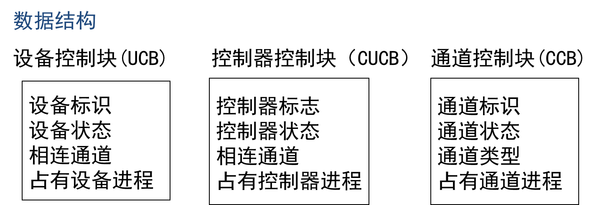
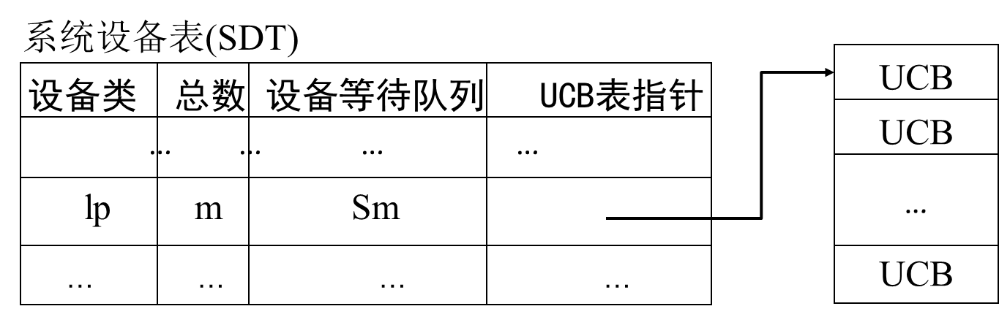
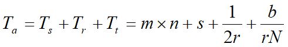
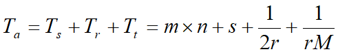
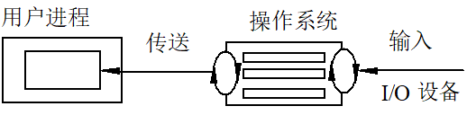

# 设备与IO管理

## 设备管理的功能

1. 设备管理的目标

   > - 合理的**分配和调度**设备资源
   > - 负责设备**驱动和中断**处理

2. 现代设备管理采用缓冲和并行技术

   > - 处理器远快于设备
   > - 设备与CPU，以及设备与设备并行

3. 虚拟设备（假脱机技术，SPOOLing技术）

   > 利用共享设备来构造数量较多、速度较快的虚拟设备，或者将独占性设备利用代理进程变为共享性设备

### 设备管理过程

- 设备分配与去配
  - 设备分配：将设备分配到哪一个要求该类设备的**进程**
  - 设备去配：收回由某占有资源的进程处的设备资源
- 设备处理：设备驱动，实现I/O 进程与设备控制器之间的通信
- 缓冲管理：提高 CPU 和 设备的并行度，尽量减少中断

## 设备的分类

- 交互对象分类：人机交互（显示器，键盘鼠标），与CPU等交互（磁盘磁带），计算机间通信（网卡）
- 交互方向：输入（键盘），输出（显示器），双向（软硬盘，网卡）
- 外设特性：使用特征（存储，输入输出），数据传输率，信息组织特征（字符，块，网络）
- 用途：存储，IO，网络

> [!tip]
>
> 数据传输基本单位：块型设备（磁盘磁带光盘），字符型设备（输入输出通信），时钟和显示器

- 从资源管理角度

  > - 共享型设备（块型）
  >   - 多个进程的IO操作以块交叉
  >   - 无需申请和释放设备
  >   - 包括除**磁带机**之外的所有块型设备
  >   - 属于**有结构**设备，传输速度高，可寻址
  > - 独占型设备（块型）
  >   - 多个进程的IO操作以块为单位不能交叉
  >   - 只能顺序访问（磁带机）
  > - 独占型设备（字符型）
  >   - 多个进程的IO操作以字符为单位不能交叉
  >   - 使用时，向系统申请。时常采用**中断I/O方式**
  >   - 属于**无结构**设备，传输速率低，不可寻址

## 设备的物理特性

- 字符型设备的物理特性

  > 每传送一个字符发生一次I/O中断。如打印机、键盘、鼠标等
  >
  > 低速、不可寻址，在输入/输出时常采用**中断驱动**方式
  >
  > **独占型设备**，为此需要提供打开和关闭操作，实现**互斥**

- 存储型设备的物理特性

  > **以块为单位**进行数据传送，如磁盘。每传输完一块，发生一次中断
  >
  > 高速、可寻址，磁盘设备的I/O常采用**DAM**方式
  >
  > 块设备接口将磁盘的所有**扇区从0到n-1依次编码**，这样将三维结构变成一种线性序列

### 磁带的物理特性

- 磁带的物理特性：**启停设备**

一维地址，顺序结构（一个文件占若干连续块）

## IO传输方式

### 程序控制查询

- **探询**(polling）又称程序控制输入输出，是最早的输入输出控制
  - 硬件提供输入输出指令
  - 内存操作指令：IO设备与内存统一编址
- 处理器代表进程向相应的设备模块发出输入输出请求，
- 然后处理器**反复查询**设备的状态，直至输入输出完成

### 中断驱动

当需要输入输出时，从当前程序处转入中断服务程序进行IO操作，然后返回断点

### 内存映射

- 采用取数和送数指令**（MOV）**
- 操作简单具有即时完成的特点，即指令执行完输入输出操作也就执行完了，没有中断需要处理

### DMA方式

- 不经过CPU而直接从主存存取数据
- 通过总线在外设和主存之间开辟直接的数据交换通路

- DMA特点
  - 数据块传输
  - 数据是从设备送到内存，或者相反
  - DMA控制器
  - 在DMA控制器的控制下，每传送一块，向CPU发送**一次中断**

> [!tip]
>
> 1. 开始DMA传输时，主机向内存写入**DMA命令块**，向DMA控制器写入该**命令块的地址**，**启动I/O设备**
> 2. CPU继续执行其它工作(**不占用总线**），DMA控制器直接操作内存总线，将地址放到总线上开始传输。整个传输完成后，DMA控制器**中断CPU**

> [!important]
>
> DMA和中断驱动
>
> - 中断驱动在每个数据（字节）传输后中断CPU，DMA一个数据块后中断
> - 中断驱动数据传送是在中断处理时由**CPU控制**完成
> - DMA方式的数据传送是在**DMA控制器**的控制下完成。

### 通道方式

- 一个专门负责输入/输出的**硬件**——通道来控制数据传送**方向**、存放数据的**内存始址**及传送的数据块**长度**
- 负责IO操作的**处理机**，独立于CPU，有自己的指令系统
- DMA(一个数据块)发展为通道（一组数据块）
- 实现CPU、通道和I/O设备三者的并行操作

#### 通道

- 负责IO操作的处理机
- 指令系统：基本操作（控制，读写，转移，结束）；指令格式（操作码，传输量，特征位，地址）
- 运控部件：CAW,CCW,CSW,CDW
- 存储区域：与CPU共用内存，通道内有缓冲区 

#### 通道在IO设备的作用

- 通道指令单一，没有独占的内存
- 通道程序是放在主机的内存中
- 一条通道指令可以传送一组数据，全部传输完毕后才向处理器发一次中断

> [!note]
>
> - 具有通道结构的计算机系统
> - 主机、通道、控制器和设备之间采用四级连接，实施三级控制
>   - 一个CPU连接若干通道；一个通道连接若干控制器；一个控制器连接若干设备
>   - CPU通过执行I/O指令对通道实施控制，通道执行通道指令对控制器实施控制，控制器发出动作序列对设备实施控制，设备执行相应输入输出操作

> [!important]
>
> 通道与DMA
>
> - DMA需要CPU来控制传输数据库的大小、传输的内存位置，通道自己控制
> - 设置通道后，CPU只需向通道发出一条I/O指令。
> - DMA控制器对应一台设备与内存传送数据，
> - 一个通道可以控制多台设备与内存的数据交换

#### 通道类型

- 字节多路通道：字节交换，许多非分配型子通道分别连接一台IO设备，子通道按时间片轮转共享主通道，用于低速IO
- 数组选择通道：块交换，一个分配型子通道，一段时间内执行一个通道程序，用于高速IO
- 数据多路通道：分时的方式执行几个通道程序

---

### IO设备控制器（接口）

- 接受识别CPU指令
- 数据交换
- **标识和报告设备的状态**，以供CPU处理
- 地址识别，数据缓冲，差错控制

#### IO端口

I/O端口指设备控制器中可被CPU之间访问的寄存器

- 数据寄存器：数据缓冲
- 状态寄存器：执行结果以及设备状态信息
- 控制寄存器：由CPU写入，启动命令或者更改设备模式

> [!note]
>
> 采用通道实现IO操作的具体数据输入过程
>
> - 进程需要输入数据，CPU向通道发出IO指令，给出要执行的**通道程序的首地址**和要**访问的I/O设备**
> - 通道接收启动指令，读出内存的通道程序并执行，控制设备传送数据
> - 数据传送结束，通道向CPU发出中断请求
> - CPU收到中断信号转至中断处理程序，**唤醒等待输入完成的进程**，返回断点
> - 在以后某个时刻，进程调度程序选中提出请求输入的进程，该进程从指定的内存单元中取出数据做进一步处理.

---

## IO软件的层次

### IO软件设计的基本思想

- 设备管理软件组成**层次结构**，向下接入硬件，向上与用户交互
- 与进程管理、存储器管理、文件管理存在一定联系
- I/O软件有清晰结构，**良好的可移植性和适应性**
- 分为四个层次，其中设备驱动和中断处理最为接近硬件

### 用户IO软件

- 实现与用户交互的接口，用户利用与IO操作有关的API对设备操作
- 操作系统的系统调用也是以函数界面形式供用户程序调用，如 `Linux:open()、read()、write()、close()`等
- **为相应的系统调用提供参数**，进而获取操作系统服务

### 与设备无关的系统软件

- 本层往下一般在操作系统内核中实现。为上层提供**系统调用接口**，对下则通过**设备驱动接口**调用设备驱动程序

- **系统调用处理程序**

- 实现设备无关性，引入了逻辑设备和物理设备概念。在系统实际执行时，必须将**逻辑设备名映射成物理设备名**使用

- 主要功能

  > - 向设备驱动程序提供**统一接口**：将逻辑设备名映射为物理设备名
  > - 向用户层提供统一接口
  > - 设备保护，禁止用户直接访问设备
  > - 缓冲，其中缓冲区在系统区
  > - 提供与设备无关的块尺寸
  > - 错误报告
  > - 设备分配与去分配

### 设备驱动程序

- 设备驱动程序是I/O**进程**与设备**控制器**之间的通信程序
- 实现**物理I/O操作的启动和执行**，即用来具体实现系统对设备发出的操作指令，驱动I/O设备工作
- 响应通道中断请求，根据中断类型调用相应中断处理
- 与硬件直接有关，如构建通道程序，启动设备，响应通道中断

> [!tip]
>
> 1. 接收到的上层软件发来的抽象要求（函数）转换为具体要求（指令）
> 2. 检查用户请求合法性，了解设备状态，传参，设置设备工作方式
> 3. 发出IO命令，启动分配的设备，完成IO操作并响应中断转到相应类型的中断处理
> 4. 对于设置有通道的计算机系统，驱动程序还应能够根据用户的 I/O 请求，**自动地构成通道程序**

---

### 中断处理程序

- 用于**保存被中断进程现场**，转入相应的中断处理程序进行处理
- 处理完后**恢复现场**，并返回到被中断的进程

### 具体过程

> [!important]
>
> 当用户程序想要读取文件中的数据时，执行步骤：
>
> - 用户I/O软件对用户的I/O请求进行解释，调用系统调用接口，假设调用read接口
> - 与设备无关的系统软件首先在高速缓存中查找该数据块
> - 若未找到，则调用设备驱动程序向硬件发出相应请求，用户进程阻塞直到数据块被读出
> - 当磁盘操作完成，硬件产生一个中断，并转入中断处理程序
> - 中断处理程序检查中断原因（传输是否出错，传输是否继续等），唤醒被阻塞进程以结束此次 I/O 请求，使用户进程继续执行

---

## 设备的分配与去配

- 独占型设备的分配与去配
  - 块型独占
  - 字符型独占
- 共享型设备的分配与去配
  - 块型共享

### 相关数据结构

- 设备控制块（UCB)：设备的标识，状态，相连通道，占有设备进程
- 控制器控制块（CUCB）：控制器标志，状态，相连通道，占有控制器进程
- 通道控制块（CCB）：通道标识，状态，类型，占有通道进程

- 系统设备表（SDT)
- 记录设备类别，以及各个类别的总数，确定设备的等待队列，以及队列的UCB（设备控制块）表的指针

---

### 独占设备的分配与去配

- 用户需要申请后再使用，最后释放

- 申请：根据设备类查SDT表，P(Sm)，查UCB表找以空闲设备分配
- 使用：分配通道和控制器，形成通道程序，启动设备进行操作，通道中断，去配
- 访问SDT表，查UCB表去配，V(Sm)

### 共享设备的分配与去配

#### 有通道情形

- 用户使用共享型设备的活动只有使用，没有申请和分配

- 特征

  > - 来自文件系统，虚拟存储管理系统，输入井/输出井
  > - 每次读写一块
  > - 通常经过缓存并且有排队优化

- 使用：分配通道；形成通道程序，启动通道，IO操作，中断处理；释放通道

#### 无通道情形

主要是使用不同于通道

- 分配缓冲，填写头部
  - 写：信息复制到缓冲区后链入IO链尾部，若设备空闲则启动设备，IO结束后释放缓冲区
  - 读：缓冲区链入IO链尾部，若设备空闲则启动设备，等待数据，中断唤醒后复制信息到进程空间，释放缓冲区

## 设备驱动

### 设备驱动特点

> 与硬件密切相关
>
> 每类设备需要配置驱动
>
> 有设备厂商根据OS编写
>
> OS仅对驱动接口有要求

### 设备驱动过程

- 通道程序：CCW指令序列，具体编制或者动态生成，多通道并行执行通道程序
- 设备启动：
  - CPU将通道程序的起址放到内存指定单元，然后执行通道启动指令
  - 通道启动，指定单元取出通道程序起址，放入通道地址字，依次执行通道指令
- 中断处理：通道向CPU发出中断请求

---

## 设备调度

- 主要是优化服务顺序，比如寻道，旋转延迟，传输
- 需要考虑公平（防止饿死）和高效（减少磁盘引臂移动）

### 磁盘IO参数

> [!note]
>
> 读写磁盘块时间三个因素：
>
> 1. 寻道时间（seek time）：将磁盘引臂移动到指定柱面所需要的时间；
> 2. 旋转延迟（rotational delay）：指定扇区旋转到磁头下的时间；
> 3. 传输时间（transfer time）：读/写一个扇区的时间。

- 寻道时间`Ts = m * n + s`，n为跨越磁道数，m为跨越一个磁道时间，s启动时间
- 旋转延迟`Tr = 1 / (2*r)`，r为磁盘转速
- 传输时间`Tt = b / (r*N)`，b为读写字节数，r磁盘转速，N一条磁道字节数

所以访问时间`Ta`为

一个扇区的访问时间：M为一个磁道上的扇区数

### 磁头引臂调度

#### 先到先服务（FCFS）

- 按照输入输出请求的**次序**为各个进程服务
  - 例如：130，42，180，15，108，68，97

则移动量：(130-53)+(130-42)+(180-42)+(180-15)+(108-15)+(108-68)+(97-68)=630

#### 最短寻找时间优先（SSTF)

- 优先为距离磁头当前所在位置**最近柱面**的请求服务。
- 例如：130，42，180，15，108，68，97

移动量：(53-42)+(180-42)+(180-15)=314

#### 扫描算法（电梯算法）

- 无访问请求时，磁头引臂停止不动；
- 当有访问请求时，引臂按照**电梯移动规律运动**，并为路经柱面的访问请求服务。
- 例如：130，42，180，15，108，68，97

移动量: (53-15)+(180-15)=203

#### 循环扫描算法

- 磁头仅在**单方向移动过程中才为路经的请求服务**，但只是移动到最内（外）请求柱面为止。
- 请求序列：130，42，180，15，108，68，97

- 存在磁头黏性

#### N-step SCAN（N步扫描）

- 将磁盘请求队列分为若干个长度为N的子队列，每个队列内采用SCAN算法

- 例如

  > 例子：磁道由外向内编号0-99,磁头当前位置20,向内移动,N=4
  >
  > - 12, 5, 7, 30, 60, 77, 13, 26, 61, 80, 53, 66
  > - 20→30→12→7→5→13→26→60→77→80→66→61 →53

- 当N很大时，接近SCAN算法
- 当N=1时，蜕化为FCFS算法

#### FSCAN（Freezing SCAN，冻结扫描)

- 将磁盘请求分为**两个子队列**：服务队列，请求队列
- 用SCAN算法扫描服务队列，并为请求服务，服务期间新到达的请求入请求队列
- 扫描完成后**交换两个队列的地位**
- 特点:克服磁道粘性, 防止饿死

---

## 缓冲与缓存

### 缓冲

> [!note]
>
> - 引入缓冲的原因
> - 缓和CPU与I/O设备间速度不匹配的矛盾
> - 减少对CPU的中断频率，放宽对中断响应时间的限制
> - 提高CPU和I/O设备之间的并行性

> - Buffering vs. Caching
> - buffering: **处理数据到达与离开速度不一致**所采用的技术。
> - caching: 将慢速存储器上活动信息缓冲到快速存储设备上的技术。

#### 缓冲的分类

- 硬缓冲与软缓冲
  - 硬缓冲：设备里
  - 软缓冲：内存系统空间（OS管理）
- 私用与共用
  - 私用缓冲: 一个缓冲区与一个固定设备相联系，不同设备使用不同的缓冲区，利用率低
  - 公用缓冲: 缓冲区由系统统一管理，按需要**动态分派**给正在进行I/O传输的设备

### 公共缓冲的管理

#### 单缓冲

- 一个IO请求，OS在主存中分配一个缓冲区
- 设备与处理器对缓冲区的操作是**串行**的
- 并且无法同时双向通信，半双工

#### 双缓冲

- 双缓冲提供两个缓冲区。
  -  进程和设备传送数据时（输入），信息由设备传送到一个缓冲区
  - 如满后，信息由设备传到第二个缓冲区，同时处理器将第一个缓冲区内容复制到进程空间
  - 然后，再将输入信息传到第一个缓冲区
- 如此交替，可以提供设备和CPU之间的并行性。
- 但双缓冲只是一种说明设备与设备、CPU与设备并行操作的简单模型，并不适用于实际系统中的并行操作。 

#### 循环缓冲

- 在设备与进程之间设置多个缓冲区，这些缓冲区连成**环状**。
- 有两个指针 in 和 out，in 指向当前输入的位置，out 指向当前取出的位置。
- 通过增加**缓冲区的个数**，可使并行程度得到明显提高。
- 循环缓冲包括以下两部分。(1) 多个缓冲区，(2) 多个指针

#### 缓冲池

- 由多个系统公用的缓冲区组成
- 缓冲池结构：**相同类型**的缓冲区链成一个队列
  - 一组用于块型设备，其长度通常与外围设备物理块的长度相同
  - 一组用于字符型设备，其长度通常为8 B、16 B 等
- 三个队列：空缓冲，输入，输出
- 多用于多道程序并发设计

### 高速缓存

- Cache
- 通过磁盘高速缓存技术提高磁盘的I/O速度，对访问高速缓存要比访问原始磁盘数据更高效
