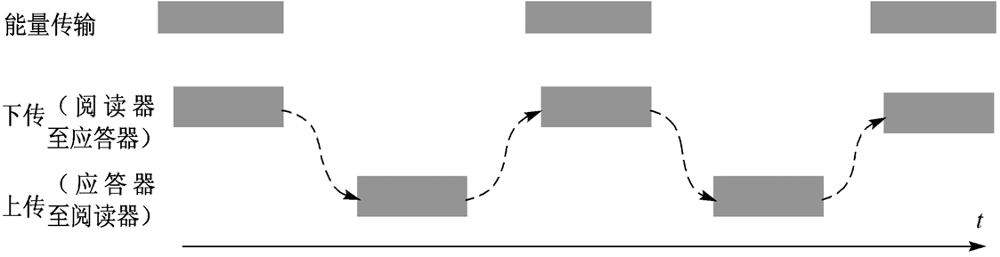
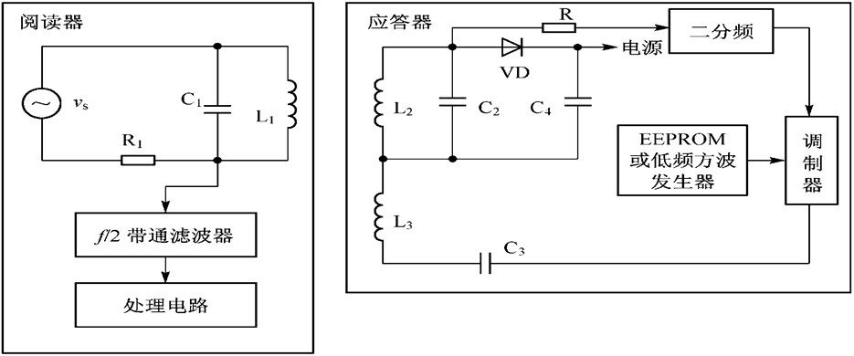
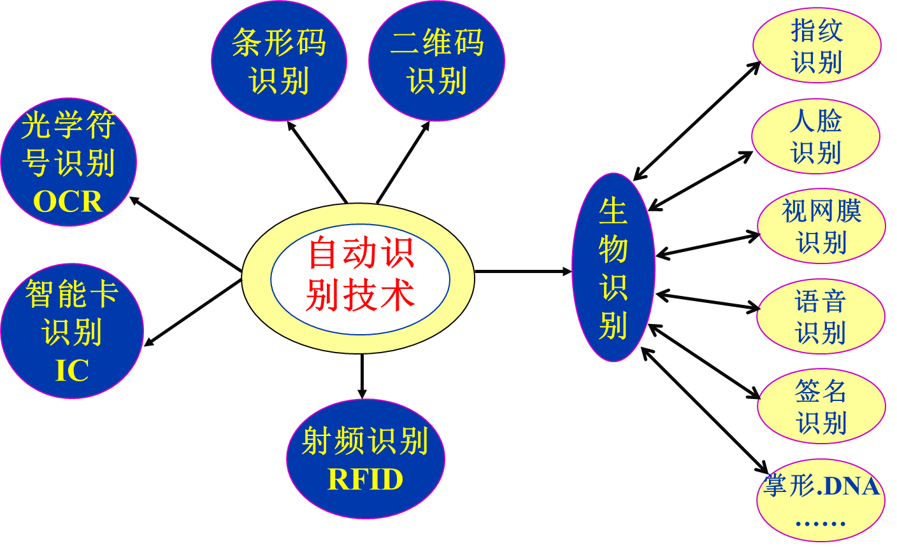
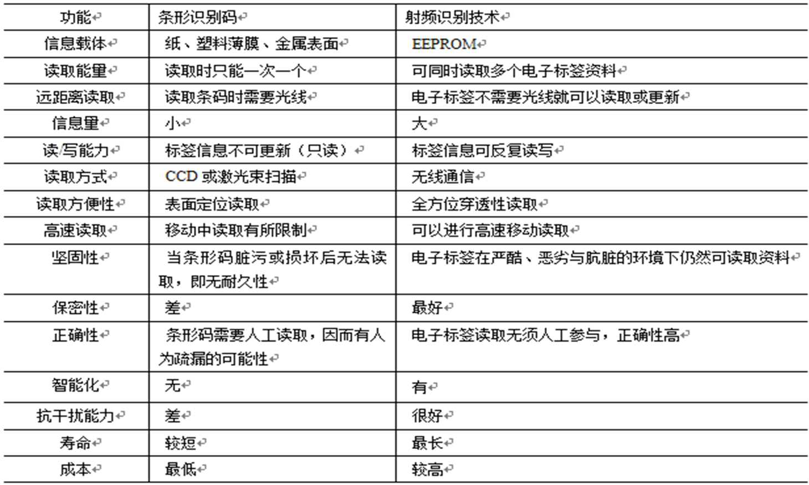

# RFID技术概述

## 定义和组成

- 定义

> [!note]
>
> RFID：Radio Frequency Identification射频识别，无线电频率识别的简称
>
> 通过**无线射频**方式进行**非接触**、**双向数据通信**对目标加以识别。

- 组成

  > 1. **应答器(标签）**：信息存放在电子数据载体中，其工作由阅读器提供能量（无源）
  > 2. 阅读器：**读出、写入**存放的信息，产生射频载波提供能量给标签，读写应答器数据，处理数据，应用操作；和高层处理交互信息
  >
  > 读写过程是通过双方之间的**无线通信**来实现的。

  

- 应用：第二代身份证，学生证，ETC，公交卡

- 天线：**能量转换装置**，并取得最大的能量传输效果；偶极子天线（远距离），微带贴片天线，线圈天线（电感耦合RFID,近距离）

---

## RFID系统特征

- 射频识别系统工作过程中的过程可归结为三种事件模型：

  > **数据传输**是目的，并且数据可以双向传递
  >
  > **时序**是数据交换的实现形式，由阅读器提供
  >
  > **能量**是时序得以实现的基础，对于无源和半有源标签能量由阅读器提供

  

  

### 时序

两种先讲方式

- 阅读器先讲方式:

  > 对于**双向系统**（读写器向射频标签发送命令与数据，射频标签向读写器返回所存储的数据）
  >
  > 读写器一般处于**主动状态**，即读写器发出询问后，射频标签予以应答。

- 标签先讲方式：

  > 射频标签**满足工作条件**之后，发送信息
  >
  > 读写器根据**射频标签发送的信息**，进行记录或进一步发送询问信息
  >
  > 与射频标签构成一个**完整地对话**，达到读写器对射频标签进行识别的目的

> [!note]
>
> **对于多标签识别**：
>
> 1. **读写器先讲方式**： 一般情况下，在读写器识别范围内存在多个标签时，对于具有多标签识别功能的射频系统，读写器处于主动状态。
> 2. **标签先讲方式**： 实现多标签的读取，现实应用中也有采用标签先讲方式的应用。

---

### 数据传输

- RFID系统所完成的功能可归结为**数据获取的一种实现手段**。
- 射频识别系统中的数据交换包含两个方面(方向不同）的含义：
  - 从读写器向射频标签方向的数据传输
    - 有线写入和无线写入
  - 从射频标签向读写器方向的数据传输。

## RFID工作方式

Ì从**能量和信息传输的基本原理**来说，射频识别技术:

1. **电感耦合方式：**
2. **反向散射耦合方式：**

> 相同：无线电射频技术
>
> 差异：无线电射频的频率不同，作用距离远近不同

### **电感耦合方式**

特点：

> 射频载波频率为**13.56 MHz和小于135kHz**
>
>   工件距离在**1米以下**

- 电感电容谐振回路和电感线圈产生的**交变磁场**，是射频卡工作的基本原理

- 负载调制：  **应答器向阅读器**传输数据采用的方式

- **电感耦合的变形**：时序方式

  > 正常的电感耦合，阅读器与应答器的信息交互过程中,阅读器一直保持着向应答**传输能量**。
  >
  > 变形：阅读器的**发送器仅在传输能量时工作**，传输能量在应答器中给电容充电
  >
  > 

> [!tip]
>
> 对于识别：
>
> 1. 扫频法：利用某种方法使得**正信号频率**随时间按一定规律在一定范围内扫动，其中这种频率扫动的正弦信号，称为扫频信号
>
> 2. 分频信号检测：
>
>    该方法的原理与电感耦合方式相同,应答器是无源的,载波信号经二分频后送至调制器。在调制器中被应答器数据(存储在EEPROM中)或低频方波信号(由低频方波发生器产生)调制。
>
>    被调制的二分频载波信号经应答器电感线圈L3送至阅读器,阅读器对二分频载波信号进行处理，便可获得应答器的有关信息。
>
>    

---

###  RFID反向散射耦合方式

- **更高频段**基于雷达探测目标。
- 理论基础是**电磁波传播和反射的形成**，用于微波电子标签。

  - 目标的反射性能随频率的升高而增强，
- 适用于特高频(UHF)和超高频（SHF)

---

## **射频识别的应用系统架构**

RIFD系统由应答器，阅读器，和高层（RFID中间件和应用系统软件）组成

>  [!note]
>
>  阅读器、电子标签（应答器）、高层（中间件和应用软件）
>
>  高层：整合数据，提供查询历史等管理和服务

### **RFID中间件与应用软件**

#### RFID中间件

- 是电子标签和应用程序之间的**中介角色**，从应用程序端使用中间件提供的一组通用的应用程序接口API
- 当存储电子标签信息的数据库软件或后端应用程序增加或改由其他软件取代，或者RFID阅读器种类增加等情况发生时，应用端不需修改也能处理，解决了多对**多连接的维护复杂性问题**。
- 作用：阅读器协调控制，进程管理，数据过滤与处理，数据路由与集成

#### *RFID应用软件*

RFID应用系统软件是针对不同行业的**特定需求开发的应用软件**，可以集成到现有的电子商务和电子政务平台中

> 1. 进程管理：决定采集到的**数据传递**给哪一个应用
> 2. 数据路由与集成：根据客户定制的任务负责**数据的监控与事件的触发**
> 3. 阅读器协调控制：终端用户通过RFID中间件接口直接**配置、监控以及发送指令**给阅读器
> 4. 数据过滤与处理：通过一定的算法，**纠正标签信息传输发生错误，并过滤掉冗余数据产生**

## **RFID**与相关的自动识别技术

1. 自动识别技术: 

   > 用**机器识别对象**的众多技术的总称。
   >
   > 是一种**高度自动化**的信息或数据采集技术。
   >
   > 能够**快速、准确**的将现场庞大的数据有效地登录到计算机系统的数据库中

自动识别技术的特点：准确性；高效性；兼容性。

### **RFID**自动识别的优势及特点

> [!tip]
>
> 1. 快速扫描
> 2. 体积小型化、形状多样化
> 3. 抗污染能力和耐久性
> 4. 可重复使用
> 5. 穿透性和无屏障阅读 
> 6. 数据的记忆容量大
> 7. 安全性

### **射频识别技术和条形码识别技术的比较**

---

## **RFlD**系统的分类

### 根据RFID系统完成的功能不同

1. EAS系统电子商品防窃（盗）系统的简称.
2. 便携式数据采集系统
3. 物流控制系统
4. 定位系统。

### 根据RFID系统频率

1. 低频系统（30kHz-300kHz）

   > RFID常见的低频工作频率有125kHz和134.2kHz；
   >
   > 电子标签内保存的**数据量比较少**，阅读**距离较短**，电子标签外形多样，阅读**天线方向性不强**；
   >
   > 技术比较成熟，主要用于**短距离、数据量低**的RFID系统中。

2. 高频系统（ 3MHz-30MHz)

   > RFID常见的高频工作频率有6.75MHz和13.56MHz；
   >
   > 可以传送**较大的数据量**，阅读**距离较长**，电子标签及读写器**成本较高**。

3. 微波系统（>300MHz)

   > 常见的微波工作频率： 433MHz、860/960MHz、2.4GHz和5.8GHz；
   >
   > 主要应用于**同时对多个电子标签进行操作**、需要**较长的读写距离**和**高读写速度**的场合；
   >
   > 天线波束方向较窄，系统**价格较高**。

### 根据RFID系统*供电方式*

|                                | **无源供电系统** | **有源供电系统**         | **半有源供电系统**                                           |
| ------------------------------ | ---------------- | ------------------------ | ------------------------------------------------------------ |
| 电子标签内**电池**             | **没有**         | **有**                   | 有                                                           |
| 读写器要**发射功率**           | **较大**         | 小                       | 大                                                           |
| 电子标签所在物体的**运动速度** | 慢               | 快                       | 快                                                           |
| 寿命                           | 较长             | 短：3 -10                | 长                                                           |
| 体积                           | 小               | 大                       | 大                                                           |
| 成本                           | 低               | 高                       | 高                                                           |
| 作用距离                       | 较短             | 较远                     | 远                                                           |
| 电子标签的能量                 | 来源于读写器     | 可为电子标签提供全部能量 | 主要来源于读写器的射频能量，  标签内部电池仅对维持数据的电路及维持芯片工作电压的电路提供支撑 |

### *根据RFID系统耦合方式*

1. 电感耦合方式系统

   > 在电感耦合方式中，读写器与电子标签之间的射频信号传递为**变压器模型**，电磁能量通过**空间高频交变磁场实现耦合**
   >
   > 用于**低频与高频**RFID系统中

2. 电磁反向散射方式系统

   > 在电磁反向散射方式中，读写器与电子标签之间的**射频信号传递为雷达模型**；
   >
   >  读写器发射出去的电磁波碰到电子标签后，**电磁波被反射**，同时**携带回电子标签的信息**；
   >
   >  该系统依据的是**电磁波空间辐射**原理；
   >
   > 一般适用于**微波系统**。

### 其他分类

1. **按照技术方式分类**

   > 主动广播式：电子标签主动向外发射信息
   >
   > 被动倍频式：电子标签被动接收
   >
   > 被动反射调制式：读写器发射查询信号，电子标签被动接收，但电子标签返回读写器的频率与读写器发射频率相同。

2. **按照工作方式**：全双工，半双工，时序

3. **按照保存信息方式分类**

   > 主动广播式：电子标签主动向外发射信息
   >
   > 被动倍频式：电子标签被动接收
   >
   > 被动反射调制式：读写器发射查询信号，电子标签被动接收，但电子标签返回读写器的频率与读写器发射频率相同。

---

## **电子标签体系结构的分类**

### 一位电子标签

- 一位系统数据量（1/0）
- 读写器两种状态：在读写器工作区**有无**电子标签
- 不需要芯片
- 多种方法工作：射频法，微波法，分频法，智能型，电磁法，声磁法

### **采用声表面波技术的标签**

- **传播于压电晶体表面的机械波**
- 不需要芯片
- 组成：具有压电特性的基底材料+叉指换能器（IDT：相互交错的**金属薄膜**构成)
- **电信号 －〉声信号 －〉电信号**

### 含有芯片的电子标签

- 以集成电路芯片为基础的电子数据载体
- 电子标签通过与读写器**电感耦合**，产生交变电压，该交变电压通过整流、滤波和稳压后，给电子标签的芯片提供所需的直流电压

### **不含微处理器、但具有存储功能的电子标签**

- 通过**状态机**对所有的过程和状态进行有关的控制。
- 采取的操作取决于接收到的事件和各个事件的相对发生顺序

### 分段存储的电子标签

将电子标签的存储器分为多个存储段：存储段独立有密钥保护

### 含有微处理器的电子标签

控制部分主要由：**编解码电路、微处理器和存储器组成**

操作系统的任务是对电子标签进行数据传输，完成命令序列的控制、文件管理及加密算法。

