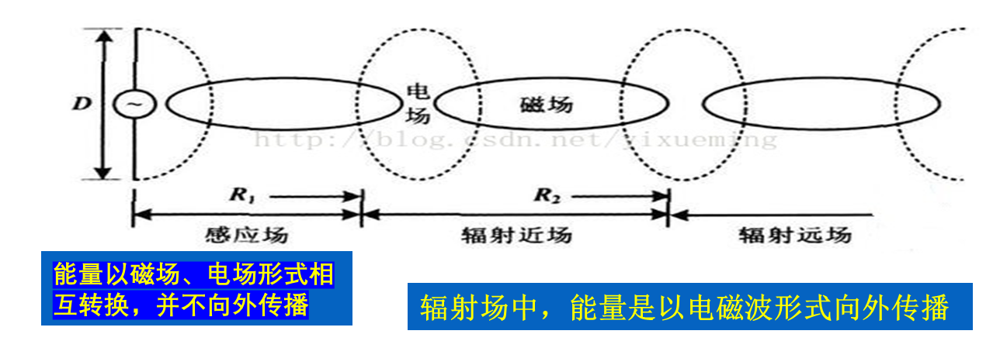
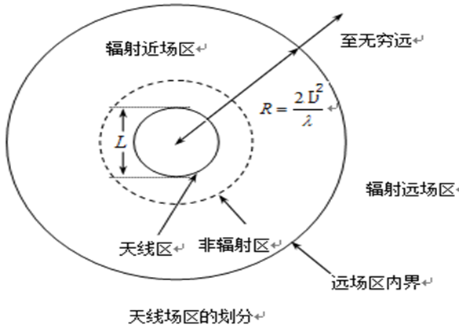
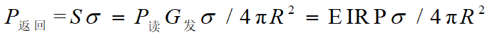
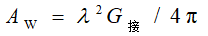
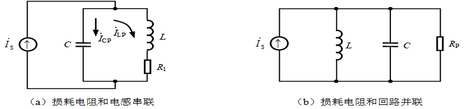
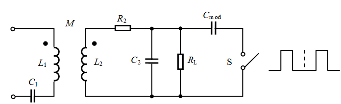

# 基础知识与 电磁场理论

## 基础知识

### 容抗

> [!note]
>
> 电容对交流电的**阻碍作用**叫做容抗
>
> 容抗和电容、频率成反比。

容抗计算公式： 　

`XC＝ 1／(2π*f*C) `容抗的单位是欧，交流电的频率f，电容C

### 电感

> [!note]
>
> **衡量**线圈产生电磁感应能力的物理量。
>
> 通过线圈的**磁通量**和通入的**电流**是成正比的，它们的比值叫做**自感系数**，也叫做电感。

如果通过线圈的磁通量用*φ*表示，电流用*I*表示，电感用L表示，`L＝ φ／I `

电感的单位是亨（*H*），也常用毫亨（*mH*）或微亨（*uH*）做单位。`1H=1000mH`。

### 感抗

> [!note]
>
> 线圈的**电感对交流电的阻碍**作用叫做感抗
>
> 感抗和电感、频率成正比

` XL＝ 2πfL `感抗的单位是欧, 电感用L表示，频率用f表示

### 阻抗

阻抗是电路中**交流电压和电流**之间的比值，用`v/i`表示，单位是欧姆(Ω）

阻抗又分为电阻和电抗

1. 电阻

   > 电路中交流电流通过时产生的**能量损耗**；与电流的相位无关
   >
   > 电阻的阻抗值为**实数**

2. 电抗

   > 电路中交流电流通过时产生的能量存储，分为感抗和容抗两种形式
   >
   > - 感抗：**电感器**引起的阻抗，当交流电流通过时，会**产生磁场**从而存储能量；与电流的相位差为**正**，且与频率成正比
   > - 容抗：**电容器**引起的阻抗，当交流电流通过时，会在**介质**中存储能量。与电流的相位差为负，且与频率成反比

> [!important]
>
> **阻抗与感抗、容抗的关系**
>
> 阻抗时电路中交流电流通过的阻碍作用
>
> 感抗和容抗则是阻碍作用与**电流相位**的关系

### 相位

> [!note]
>
> 相位是反映交流电任何时刻的**状态**的物理量。交流电的大小和方向是随时间变化的

### 串／并联谐振

> [!note]
>
> 谐振是正弦电路在特定条件下所产生的一种特殊物理现象，
>
>  含有R、L、C的一端口电路，在特定条件下出现端口**电压、电流同相位**的现象时，称电路发生了谐振。

1. 串联谐振：

   

2. 并联谐振：

   

---

## 电磁场理论

### 基本原理

1. 利用**射频信号**耦合（电感或者电磁耦合）

   > 射频标签和读写器通过各自的**天线**构建起两者之间的非接触信息传输通道

2. 雷达反射的传输特性

   > 这种空间信息传输通道的性能完全由**天线周围的场区特性决定**，是电磁传播的基本规律

### 电感线圈的交变磁场

- 安培定理指出，电流流过一个导体时，在此导体的周围会产生一个磁场 。

  

### 天线场

#### 天线场的划分

> [!note]
>
> 通常，根据**观测点**与天线的距离将天线周围的场划分为三个区域:
>
> 1. 无功近场区(感应场）:又称为电抗近场区,是一种**感应场**
> 2. 辐射近场区
> 3. 辐射远场区

#### 天线的方向性图

> [!tip]
>
> 天线的方向性图是指该辐射区域中辐射场的角度分布, 公认的辐射**近场区与远场区**的分界距离R
>
> 

- 对于天线而言，当天线的最大尺寸**L小于波长**时，天线周围只存在无功近场区与辐射远场区，没有辐射近场区。
- 无功近场区的外界约为`λ/2π`，超过了这个距离，辐射场就占主要优势。通常将满足的天线称为小天线。

#### 近场与远场的计算

- 根据观测点与天线的距离(与天线的最大尺寸有关）：
-  说明： *R*为观察点到天线的距离，*D*为天线的直径， *λ*为波长

> 天线尺寸< 波长 时， 近场边界 ` R= λ/2π `
>
> 天线尺寸 > 波长 时， 远场边界 `R = 2(D^2)/λ `

### 数据传输原理

- 读写器和标签之间的通信通过电磁波实现，按照通信距离可分为远场和近场。

- 读写器和标签之间数据交换方式：

  > 1. 负载调制：读写器和标签之间的天线能量交换方式类似于**变压器结构**，称为负载调制。（125kHz和13.56MHz射频识别）
  > 2. 反向散射调制：电磁波从天线向周围空间发射，到达目标的电磁能量一部分被目标**吸收**，另一部分以不同的强度散射到各个方向上去。反射能量的一部分最终返回发射天线

### 射频标签到读写器的能量传输

1. **反向散射调制**的能量传递

   > 在距离读写器`R`的射频标签处的功率密度**S**：
   >
   > 

2. 射频标签可吸收的功率

   > 射频标签可吸收的最大功率与入射波的功率密度S成正比，可表示为
   >
   > 
   >
   > 标签功耗越大，读写距离越短，性能越差。
   >
   > 射频标签能否工作主要由**射频标签的工作电压**来决定,限制了无源射频识别系统的识别距离，

3. 射频标签到读写器的能量传输

   > 1. 射频标签返回的能量为
   >
   >    
   >
   >    雷达散射截面***σ***
   >
   > 2. 返回读写器的功率密度:
   >
   >    
   >
   > 3. 接收天线的有效面积
   >
   >    
   >
   > 4. 接收功率
   >
   >    

---

# 电感耦合方式的射频前端

## 综述

> [!tip]
>
> 射频识别技术在工作频率**13.56 MHz和小于135 kHz**时，基于**电感耦合方式**（能量及信息传递以电感耦合方式实现），在**更高频段基于雷达探测目标的反向散射耦合方式**（雷达发射电磁波信号碰到目标后携带目标信息返回雷达接收机）

- **电感耦合方式的基础**是电感电容（LC）谐振回路及电感线圈产生的**交变磁场**，它是射频卡工作的基本原理
- 基于雷达探测目标的**反向散射耦合**方式的基础是电磁波传播和反射的形成，它用于微波电子标签
- 实现**射频能量和信息传递的电路**称为射频前端电路，简称为**射频前端**

## 阅读器天线电路

在阅读器中，使用**串联谐振回路**

> [!tip]
>
> 串联谐振回路适用于恒压源，即信号源**内阻很小**的情况。
>
> 并联谐振回路时，采用恒流源, 即信号源**内阻很大**的情况。
>
> 

## **阅读器和应答器之间的电感耦合**

- 当应答器进入阅读器产生的交变磁场时，应答器的电感线圈上就会产生**感应电压**，当**距离足够近**，应答器天线电路所截获的能量可以供应答器芯片正常工作时，阅读器和应答器才能进入信息交互阶段。 

- 应答器直流电源电压的产生是通过整流器滤波

- `C_P`-滤波电容，滤去高频信号; 同时为储能器件，较强负载能力

## 负载调制

- **应答器向阅读器**的信息传送时采用 

### 电阻负载调制

- 开关S用于控制负载调制电阻*R*mod的接入与否，开关S的通断由二进制数据编码信号控制。
- 应答器的负载电阻值有两个对应值，即*R*L（*S*断开时）和*R*L与*R*mod的并联值*R*L//*R*mod（S闭合时）

### 电容负载调制

电容负载调制是用附加的电容器*C*mod代替调制电阻*R*mod

## 功率放大电路

- 功率放大电路位于RFID系统的阅读器中，用于**向应答器提供能量**
- 采用谐振功率放大器
- 在电感耦合RFID系统的阅读器中，常采用B，D和E类放大器 

### 电磁兼容

电子产品的**电磁兼容性（EMC）**包含两方面：

- 一是**电磁干扰（EMI）**
- 二是**抗电磁干扰的能力（EMS）**。

