# 编码和调制

> [!note]
>
> RFID系统数字信号的主要特点:
>
> 1. 信号的完整和安全性
> 2. 信号便于存储处理和交换
> 3. 便于集成化微型化
> 4. 便于构成物联网

## 数据、信号、带宽

### 数据

- 可定义为表意的实体

- 又分为模拟数据和数字数据

  > 模拟数据：在某些时间间隔上取**连续的值**
  >
  > 数字数据：数字数据取**离散值**，例：文本或字符串。在射频识别应答器中存放的数据是数字数据
  >
  > 一般在RFID应答器存放**数字数据**

### 信号

- 模拟信号和数字信号

  > 模拟信号：连续变化的电磁波；在时域表现为连续变化，在频域其频谱离散；模拟信号用来表示模拟数据
  >
  > 数字信号：电压脉冲序列，表示数字数据

- 信号的频谱：指**频率的分布曲线**

  > 时域：电压和v和时间t之间的关系，即信号的**幅度随时间变化的曲线**,横轴是时间,纵轴是信号的幅度,一般的正弦波比如f(t)=sinwt就是时域曲线
  >
  > 频域：电压v在频率轴上的分布，即信号的**幅度与频率**的关系,函数比较复杂,可能是不连续的

### 信号带宽

信号频谱的宽度，范围广，但有效范围窄

## 信道

信道分为传送模拟信号的模拟信道以及传送数字信号的数字信道

传输介质分为两大类：**导向**传输介质（电磁波沿着固态介质传送）、**非导向**传输介质（自由空间无线传输，即**无线信道**）

- RFID的信道采用**无线信道**：无线传输所用的频段很广，包括无线电、微波、红外线和可见光

**国际电信联盟(ITU)对波段的划分：**

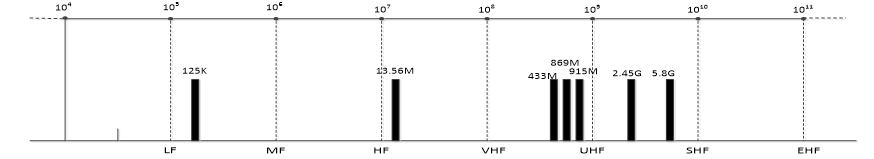

### 信道的特性

- 对于无线传输，发送和接收是通过**天线**完成的。

  > 发送天线向介质辐射出电磁能量
  >
  > 而接收天线从周围介质中检出电磁波

- 传输损耗与失真

  > **衰减**：对于无线信道，衰减和**距离、空气成分和电波频率**有关
  >
  > **延迟变形**：不同频率的成分在传输介质中**传播速度不同而使信号变形**的现象。个位元的信号成分可能**溢出**到其他位元，从而引起串扰。
  >
  > **噪声**：在信号传输过程中，经常遇到的干扰是噪声。
  >
  > - 白噪声，热噪声
  > - 脉冲噪声：突发性的

### 带宽

- 信号的大部分能量往往集中在较窄的一段频带，称为该信号的有效带宽或带宽
- 一般信道都有一个**最高和最低**的信号频率，在这两个频率之间的信号才能通过这个信道
- 这两个频率的差值就叫做这个信道的带宽，单位是Hz

### 信道容量

- 反映了信道所能传输的**最大信息量**，数据在信道中**传输的最高的比特率**就叫做这个信道的容量，单位是**bps** 

> [!tip]
>
> 具有理想低通矩形特性的信道。
>
>   根据奈奎斯特准则，这种信道的最高码元传输速率V=2BW            
>
>   也即这种信道的最高数据传输速率即信道容量为：
>
> BW是信道的带宽，M是码元数

### 奈奎斯特定理与香农定理

1. 奈奎斯特定理

   > 
   >
   > **无噪声信道**，用来计算理论值

2. 香农定理(计算**有噪声**的信道)

   > 
   >
   > S：信号的功率，N：噪声的功率
   >
   >  S/N 指的是信道的**信噪比**

> [!note]
>
> 信道容量决定于：**带宽，S/N(信噪比) ，编码**。
>
> RFID采用微波，微波比低频和高频有更大的带宽

## 数字通信模型及特点

- 安全性高：

  > 在传输过程中可实现**无噪声积累**，0，1 信号再生，消除干扰
  >
  > 通过相应的编码方法使接收端能具有**检错或纠错**能力

- 便于加密，存储，处理和交换，设备集成化微型化

- 信道频带宽

### 概念

- 波特率

  > 数据信号对载波的**调制速率**，即：数据传输过程中，在信道上每秒钟传送的信号波形个数，单位是Baud
  >
  > 从**信号**的角度来说
  >
  > 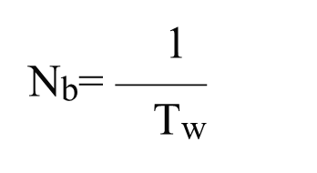

- 比特率

  > 信号**每秒钟传输的数据的位数**，也就是每秒钟传输0和1的个数，单位是bps
  >
  > 与波形速率和一个波形所携带的信息量有关
  >
  > 从**信息**的角度来说

> [!important]
>
> 波特率与比特率的关系：
>
> 

### 数字通信的主要性能指标

- 数据传输速率

  > 指信道中**每秒通过的数据位**，单位是bit/s
  >
  > 代表了**数据传输效率**
  >
  > 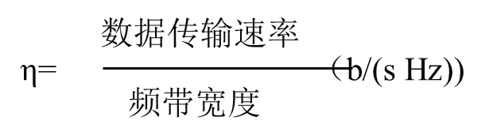

- 信道频带宽度：传输信息的能力

- 误码率：发生误码的码元与传输的总码元之比

  

## RFID通信方式

RFID通信是指读写器和标签之间，采用**无线电信号**传输信息，

其主要特点是：**通信距离很短**

### 信号的编码与调制

- 信号是消息的载体，消息以信号的形式传送到另一点
- RFID主要处理**数字信号**
- 信号又可分为**基带信号**（两个电压电平表示1/0）和**调制信号**
- RFID传输技术中，对**信号频域**的研究更重要

### 通信握手

- 读写器与电子标签双方在通信开始、结束和通信过程中的**基本沟通**，通信握手要解决通信双方的工作状态、数据同步和信息确认等问题

## 编码

- 编码是为了达到某种目的而对**信号进行的一种变换**。其逆变换称为解码或译码。
- 编码理论有信源编码、信道编码和保密编码
- 其中信道编码：**对信源编码器输出的信号进行再变换**为适合于数字信道的数字信号，包括区分通路、适应信道条件和提高通信可靠性而进行的编码.

### 数字编码方式

用不同的电平来表示两个二进制数字

1. **单极性矩形脉冲**（NRZ码）：

   > - 脉冲之间无间隔，**极性单一**，易于用TTL、CMOS电路产生
   > - 适用于计算机内部或极近距离的传输

2. **双极性波形**：

   > 当“1”和“0”等概率出现时无直流分量，有利于在信道中传输
   >
   > 在接收端恢复信号的**判决电平为零值**，因而不受信道特性变化的影响，抗干扰能力也较强

按信号是否归零，信号在上电平（正, 零,负）之间变化

1. 归零码：码元中间的信号**回归到0电平**
2. **非归零码**：**遇“1“信号电平发生变化**，遇”0”时不变

简单二元码：

> [!note]
>
> 1. 单极性非归零码（NRZ）
> 2. 双极性非归零码（NRZ）
> 3. **单**极性归零码（RZ）
> 4. **双**极性归零码（RZ）
>
> 

### RFID的编码

1. 反向不归零编码

2. **单极性归零编**码

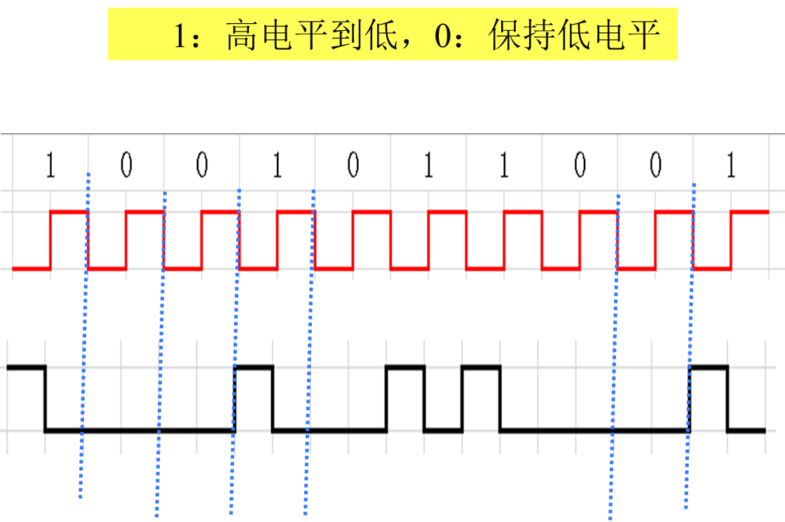

3. **曼彻斯特编码**

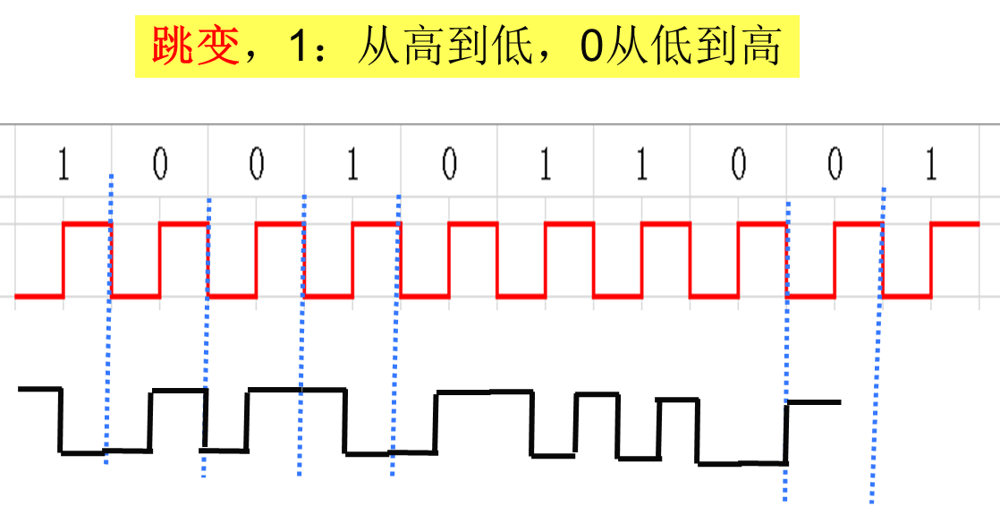

每一位的中间有一跳变，位中间的跳变既作时钟信号，又作数据信号

> [!tip]
>
> **差分曼彻斯特编码**，每位中间的跳变仅提供时钟定时，而用**每位开始时有无跳变**表示"0"或"1"，有跳变为"0"，无跳变为"1"。

4. 密勒(Miller)编码

- **1**：半周期有跳变， **0**：半周期无跳变，
- 发送连续的“0”时，在数据的开始处增加一个跳变

5. **变形密勒编码**

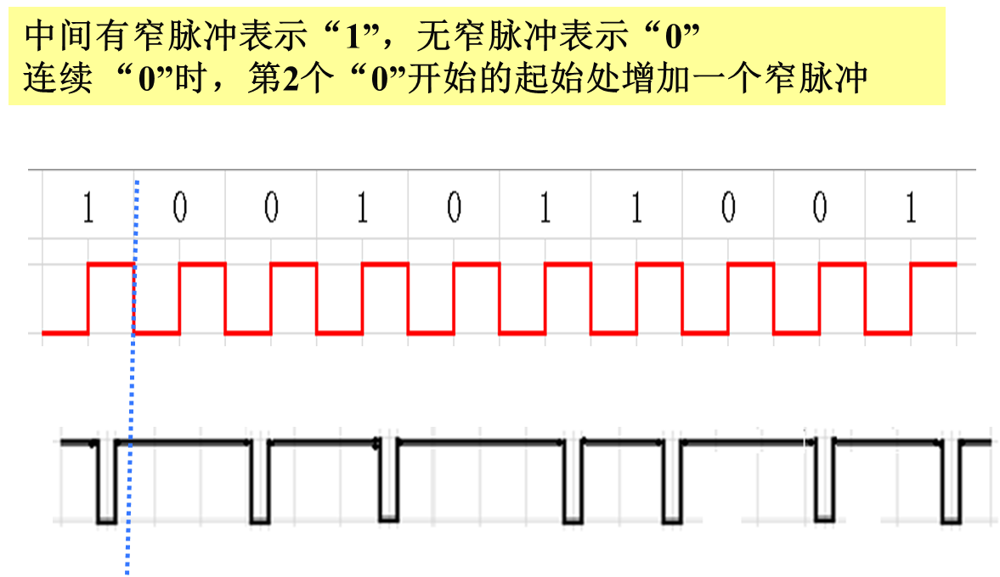

### RFID编码的关键问题

1. 适应传输信道的频带宽度
2. 有利于提取时钟
3. 误码检测
4. 码型变换简单
5. 电子标签能量来源

### 曼彻斯特码的编码、解码器

#### 编码

- **数据时钟 ⊕ 数据**

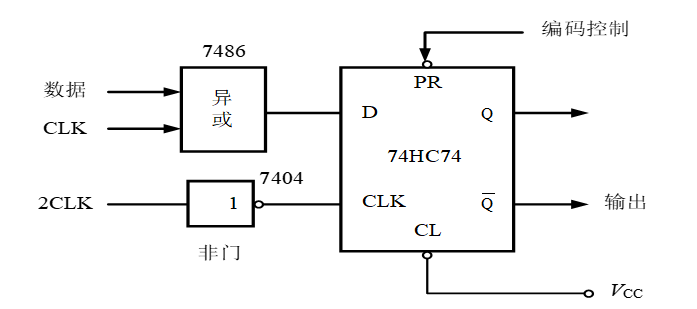

#### 解码

曼彻斯特码与数据时钟“异或”，便可恢复出**NRZ码数据信号**

通常,采用曼彻斯特码传输数据信息时,信息块格式：

起始位采用”1”码,结束位采用无跳变低电平

> [!tip]
>
> **11组合**是非法码，出现的原因可能是传输错误或冲突

## 调制和解调

- **基带信号**
  - 可以是数字，也可以是模拟
  - 近距离通信的局域网都采用基带传输。

> [!important]
>
> 调制的目的：把传输的基带信号，变换成**适合信道传输的信号**

### 调制类型

1. 脉冲调制

   > - 将数据的NRZ码变换为**更高频率的脉冲串**，该脉冲串的脉冲波形参数受NRZ码的值0和1调制。
   > - 主要的调制方式为**频移键控FSK和相移键控PSK**
   > - FSK：用于频率低于135 kHz（射频载波频率为125 kHz）主要用于阅读器
   > - PSK：
   >   - PSK1：绝对码**2PSK**
   >   - PSK2：相对码**2DPSK**

2. 载波调制

   > 信号与一个固定频率的波进行相互作用----**加载** 这个固定频率的波----**载波**
   >
   > 在RFID系统中，正弦载波还为无源电子标签**提供能量**。

### 载波调制解调方式

1. 频移键控: FSK：频率在多个频率间进行调制，**125KHz**采用

   > 利用载波的**频率**变化来传递数字信息，是对载波的频率进行键控。
   >
   >  二进制频移键控载波的频率只有**两种变化状态**，在f1和f2两个频率点变化，分别对应1和0
   >
   > 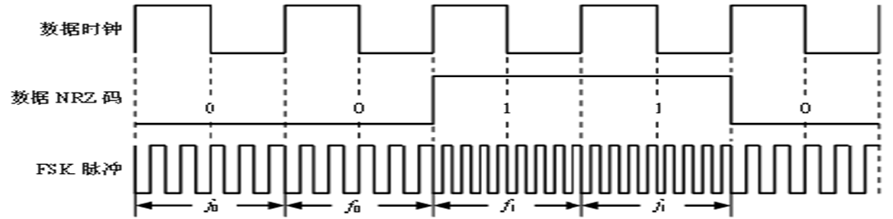

2. 相移键控: PSK ：相位在多个值之间调制

   > PSK1调制时，若在数据位的起始处出现上升沿或下降沿（即出现1，0或0，1交替），则相位将于**位起始处跳变180°**
   >
   > PSK2调制时，相位在数据位为1时从位起始处跳变180°，在数据位**为0时则相位不变**，使用较少。
   >
   > 
   >
   > PSK具有**较高的频带利用率**，在误码率、信号平均功率等方面比ASK性能更好

3. 幅移键控: ASK ：振幅在多个电平间调制，**大功率传输**，多数射频识别系统采用

### 副载波调制

- 副载波是**相对于主载波**而言的
- 信号调制在载波1上，对结果再进行一次调制，用这个结果去调制另外一个载波2

副载波频率是通过对载波的**二进制**分频产生的

主要用于**电子标签到读写器**方向的数据传输

> [!note]
>
> 标签将**基带编码调制到低频率的副载波频率**上，
>
> 再采用**ASK、FSK或PSK**对副载波进行二次调制。

#### **副载波与副载波调制解调**

- **ISO/IEC 14443**标准的TYPE A中的副载波调制，规定： PICC—> PCD

标准帧的结构：

- **TYPE B**中的副载波调制：位编码采用不归零NRZ编码，副载波调制采用BPSK方式
- *θ*0表示逻辑1， *θ*0＋180°表示逻辑0

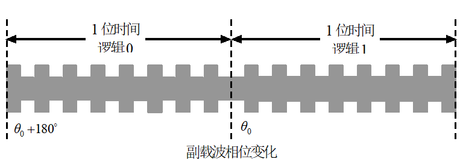

### 载波调制

载波通常是**高频正弦振荡信号**

1. 频移键控（FSK）

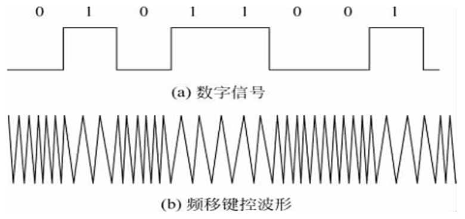

2. **二进制**相移键控（PSK）

利用载波的相位变化来传递数字信息，是对载波的相位进行键控。

通常载波的初始相位在0和π两种状态间变化，分别对应二进制信息的0 和1 。

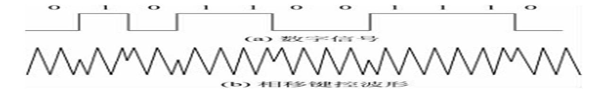

> [!tip]
>
> PSK也可分为二进制PSK（2PSK）和多进制PSK（MPSK）

3. 二进制幅移键控(ASK)

利用载波的幅度变化来传递数字信息

载波的幅度只有两种变化，分别对应二进制信息的1和0。

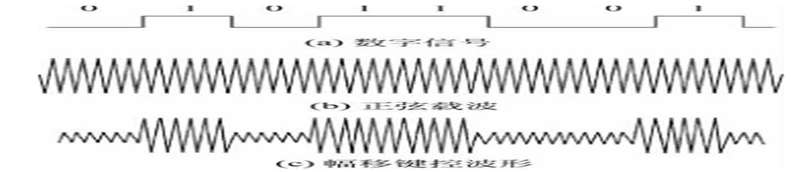

