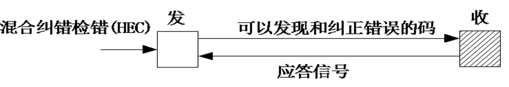
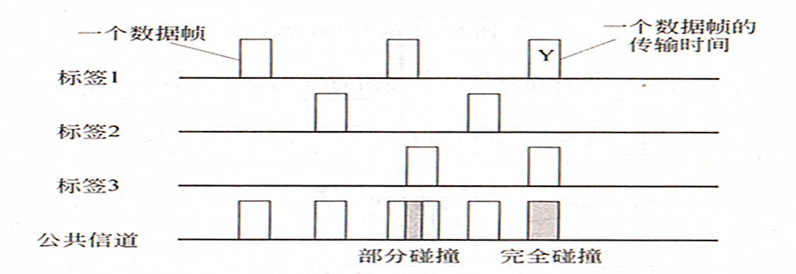
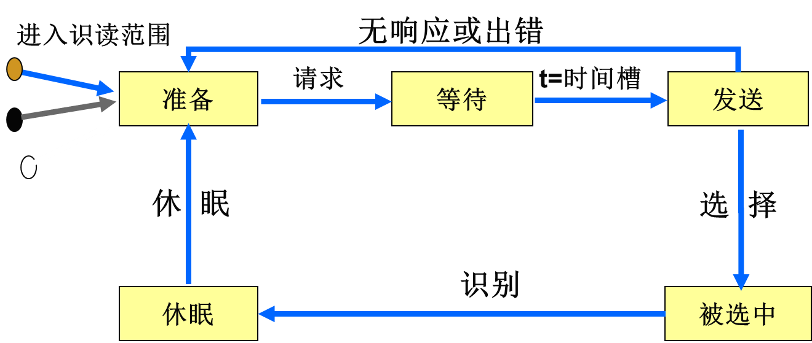
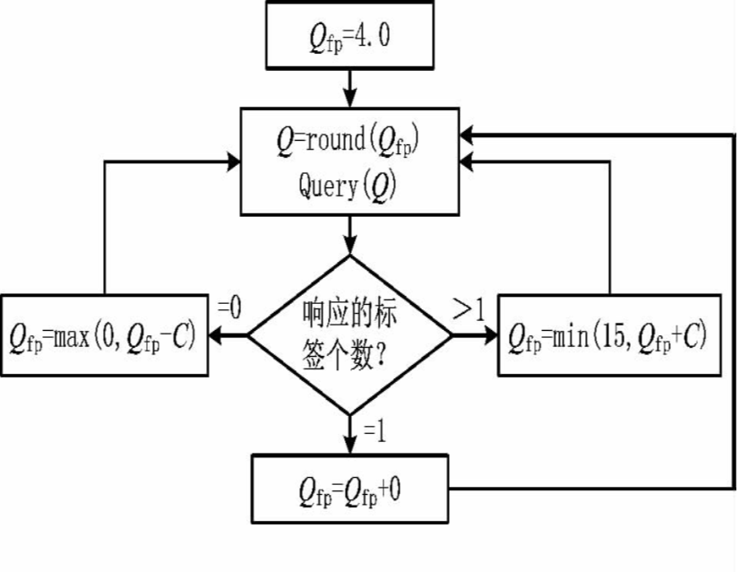
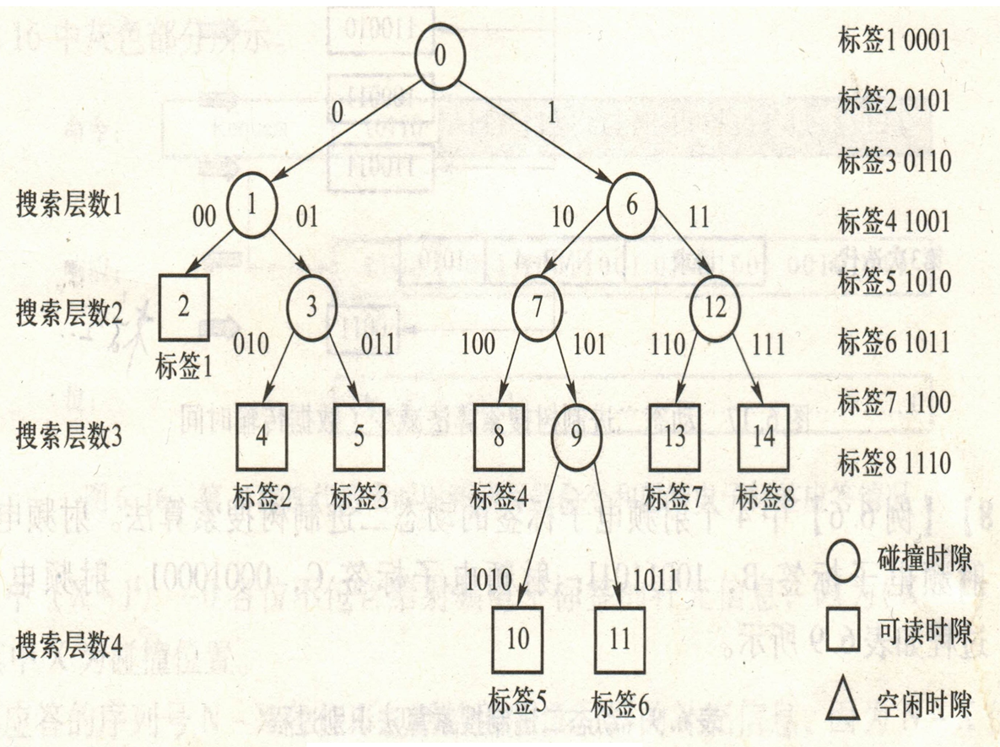
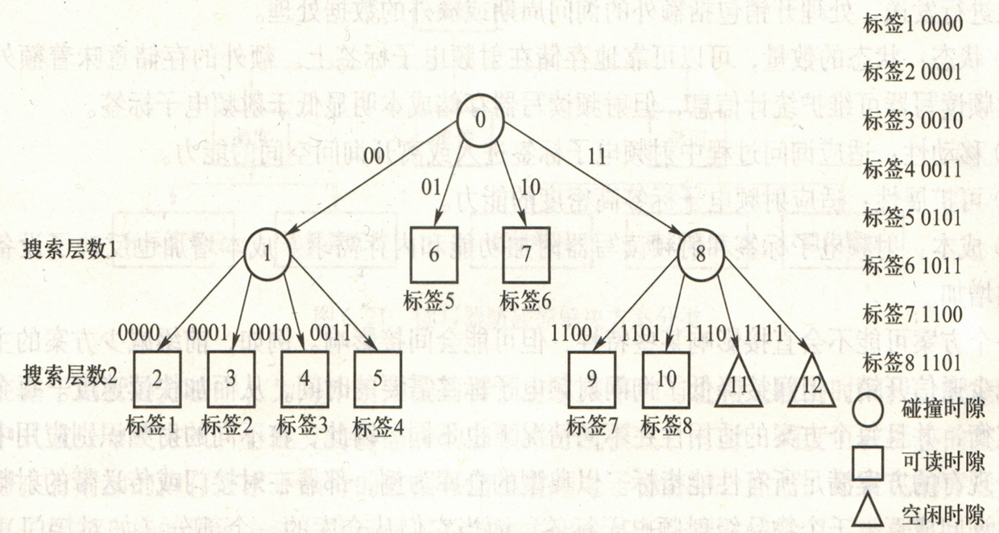
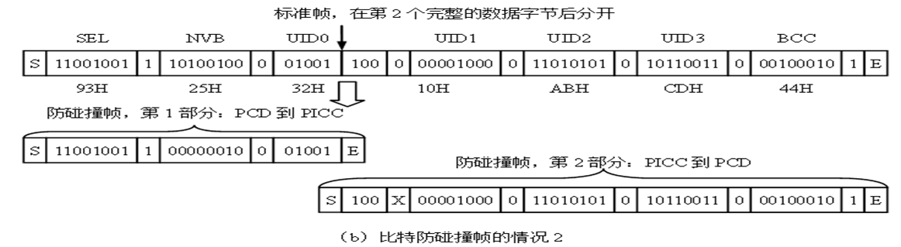
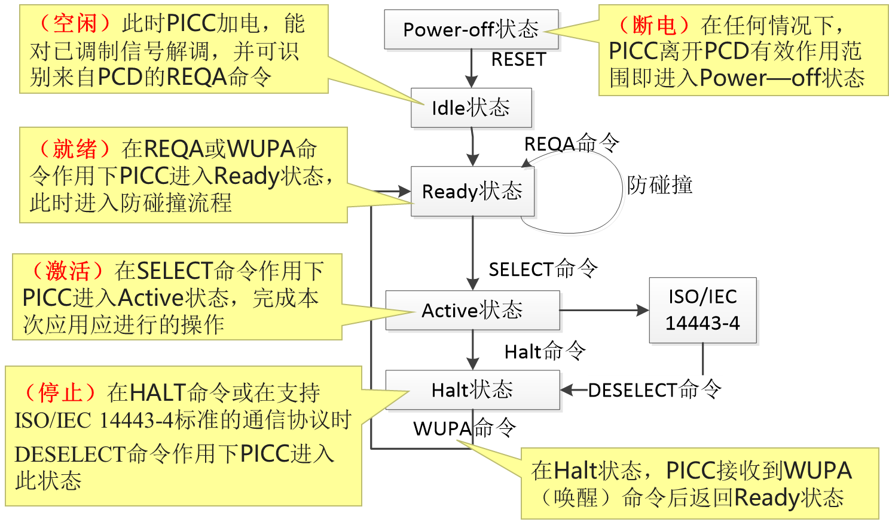

# 数据校验和防碰撞算法

> [!note]
>
> 1. 外界的各种**干扰**可能使数据传输产生错误：
>
>    外界噪声, 传输中**码间串扰**
>
>    方法：运用**数据检验**（差错检测）
>
> 2. 多个电子标签同时占用信道使发送数据产生**碰撞**
>
>    方法：防碰撞算法:**多路存取法** 。

## 差错的性质和表示方法

1. **随机错误：**由信道中的随机噪声干扰引起。在出现这种错误时，前后位之间的错误彼此无关。
2. **突发错误：** 由突发干扰引起，当前面出现错误时，后面往往也会出现错误，它们之间有相关性。
3. **混合错误 ：**既有单个错误，也存在关联性错误

### 差错控制方式

1. 前向纠错（FEC）

发送端发出的码字具有**纠错能力**的；

接收端译码后不仅可以发现错误码，而且可以**判断错误码的位置**并予以**自动纠正**。

2. 检错重发（ARQ)

少量的冗余码，就可以得到极低的输出误码率，并且有一定的自适应能力

但是需要反向信道传输应答信号

3. 混合纠错检错（HEC）

前向纠错方式和检错重发方式的结合

## 检纠错码

信息码元和监督码元

总码元数`n=k+r`

分类：

1. 卷积码：监督码元不仅与**本码组**的信息码元相关，而且与本码组相邻的**前*m*个时刻输入的码组**的信息码元之间也具有约束关系，**性能优于分组码** 
2. 分组码：监督码元仅与本码组的信息码元有关
3. 交织码：利用交织技术构造出来的编码 

### 校验码

1. 奇偶校验：奇偶校验分奇校验和偶校验，收发两端必须约定校验方式

2. 纵向冗余校验（LRC）也称作**代码和校验**

   > - 把传输数据块的所有字节进行**按位加**（称**异或运算**），其结果就是校验字节。附加校验字节传输
   > - 收端，将数据字节和校验字节进行按位加，如果**结果为0，就认为传输正确**
   >
   > 

### 循环冗余码校验

**CRC**码

1. 将k位信息写成M(x)阶多项式   
2. 设生成多项式G(x)的阶为 r
3.  用模2除法计算`x^r*M(x)/G(x)`，获得余数多项式 R(x)
4.  用模2减法求得传送多项式`T(x)= x^r*M(x)-R(x)`则T(x)多项式系数序列的前 k位为信息位，后r位为校验位，传输位数为n=k+r
5. 接收方解码方法：将T(x) 除以 G(x)，得到一个数，如果这个余数为0，则说明传输中无错误发生，否则说明传输有误

- 具体看 M(x)=1001,G(x)=1011

## 防碰撞算法

> [!note]
>
> 在RFID系统应用中，读写器之间或标签之间的**相互干扰**，统称为碰撞。
>
> 1. **读写器碰撞**：相邻的读写器在其**信号交叠区域内产生干扰**，导致读写器的读写范围减少，甚至无法读取标签
> 2. **标签碰撞：**多个标签与同一个读写器同时通信时产生的干扰。

### 防碰撞检测

1. 检测接收到的**电信号参数**的非正常变化
2. 通过差错检测方法检查有无**错码**
3. 利用某些编码的性能，检查是否出现**非正常码**来判断是否电生数据碰撞

### 多路存取法

> [!tip]
>
> 不同通信形式一般有三种：
>
> - “**无线广播**”式：1个读写器发出的数据被多个应答器接收
> - **多路存取通信** ：多个应答器同时向同一个读写器发送数据，常见
> - 多对多，少见

- 对于多路存取的四种解决办法

- 空分多路法（SDMA）：分离的空间范围内重新使用确定资源技术：

- 频分多路法（FDMA）: 使用多个频率

- 时分多路法（TDMA）/ 时分多址法

  > 通路容量按**时间**分配给多个用户
  >
  > 读写器控制:轮询法：需标签清单，慢；二进制搜索算法

- 码分多路法（CDMA）：用户具有**特征码**

- RFID系统一般采用**时分多址法（ TDMA）**来解决碰撞

## 防碰撞协议

防碰撞协议=**防碰撞算法** **+** **命令**

- 识别所有，及时处理，耗能少

1. 概率性算法：减少碰撞的概率；纯ALOHA，时隙ALOHA，动态ALOHA，Q值算法
2. 确定性算法：二进制树型搜索，基于序列号（UID)，基于随机数和时隙，查询树

### 概率性算法

#### 纯ALOHA算法的基本思想

1. **读写器检测接收到的信号并判断有无冲突**；冲突则让标签停止发送等待**随机一段时间**后再重新发送以减少冲突的发生
1. 仅仅适用于只读系统

#### 时隙ALOHA算法

- 在 ALOHA 算法的基础上对标签发送数据的时间加以限定
- 标签只能在每个时隙的**初始时刻**向读写器传输数据，必须有全局的时间同步
- 因此只处理碰撞的时隙

#### 动态时隙ALOHA算法

*动态调整时隙数量*：通过对待识别的应答器数量进行预测，动态调整最优帧长

提供1或2个时隙给工作应答器使用，工作应答器将选择自己的传送时隙

在这1或2个时隙内有较多应答器发生了数据碰撞，阅读器就用下一个请求命令增加可使用的时隙数

#### Q值算法

针对应答器数量较多：该算法可实时自适应地调整帧长，提高效率

### 确定性算法

**二进制树型搜索算法**

按照其工作方式可分为：

1. 基于序列号的方法
2. 基于随机数和时隙的方法 
3. 查询树算法

#### **基于序列号的方法**

1. 每个应答器有唯一的序列号UID
2. 一般采用曼彻斯特编码检测碰撞位

#### **基于随机数和时隙的方法**

采用**递归**的工作方式，遇到碰撞就进行分支，成为两个子集，或成为多个子集

基于二叉树搜索，还有四分支法

---

## ISO/IEC 14443 中的防碰撞协议 

- 规定：阅读器（PCD），标签（PICC）

- 当两个或两个以上的PICC同时进入射频区域时：

  - 它们都接收到PCD发出的**查询命令**

  - *PICC会同时发送响应，这样造成了PICC之间的信号冲突*

  - *PCD无法检测到正确的信号，即发生了碰撞。*

ÌISO/IEC 14443-3标准中提供了两种不同的防碰撞协议

A型(TYPE A)：**采用位检测防碰撞协议**

B型(TYPE B)：**通过一组命令来管理防碰撞过程**

### TYPE A 防碰撞协议 

- 三种类型的帧：

  - **短帧**：由起始位S、7位数据位和通信结束位E构成

  - **标准帧**: 帧中每一个数据字节后有一个**奇检验位P**

  - **面向比特的防碰撞帧：**仅用于防碰撞循环，由**7个字节(56位)**组成的标准帧，分裂为两部分:

    - 第1部分：PCD发送到PICC，最大长度为55位，最小长度为16位

    - 第2部分：从PICC发送到PCD

    - 在完整字节后分开并加以校验

      

    - 在完整字节后分开，不校验

      

- TYPEA的标签状态转换

### TYPE B的防碰撞协议

- TYPE B的防碰撞协议为**通用的时隙ALOHA算法**

