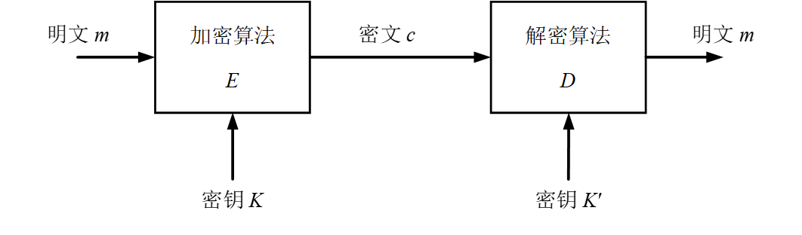
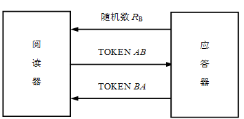
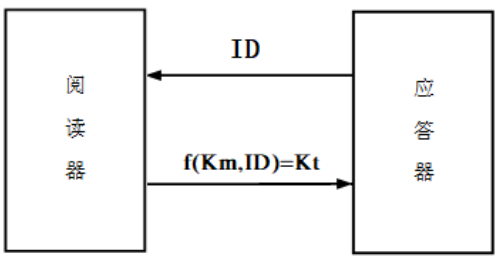

# RFID系统数据传输的安全性

## 信息安全概述

- 信息安全主要解决**数据保密和认证**的问题。
- 数据保密：采取复杂多样的措施对数据加以保护
- 认证  ：
  - **信息认证**：信息从发送到接收整个通路中没有被第三者修改和伪造。
  - **用户认证：**用户双方都能证实对方是这次通信的合法用户。

## 密码学基础

- `c=Ek(m)   m=Dk'(c)-Dk'(Ek(m))`

### 密码学基本概念

- 密码学包含**密码编码学**和**密码分析学**。
- 密码学的一条**基本原则**：加密算法E是公开的，真正的秘密在于**密钥**。
  - 密钥的长度越长安全性越大，但是成本也会越大
  - 密钥应易于更换
  - 密钥通常由一个**密钥源**提供，远地传送密钥时，一定要通过另一个**安全信道**。

### **密码**体制

- 对称密码：一种常规密钥密码体制，也称为**单钥密码**体制或**私钥密码**体制。加密密钥和解密密钥相同；又分为序列密码和分组密码
- **非对称密码**体制：也称为公钥密码体制、双钥密码体制。加密密钥是公开的,解密密钥用于自己对收到的密文进行解密，这是保密的。

## 射频识别中的认证技术

> [!note]
>
> 解决阅读器与应答器之间的互相认证问题。
>
>    **应答器**确认阅读器的身份，防止存储数据未被认可地读出或重写；
>
>    **阅读器**确认应答器的身份，以防止假冒和读入伪造数据。

1. 相互对称认证

阅读器和应答器之间的互相认证采用国际标准ISO 9798-2的“三次认证”，这是基于共享秘密密钥的用户认证协议的方法。

2. 三次认证过程

- 阅读器发送查询口令命令给应答器，应答器响应返回随机数RB
- `TOKEN AB=E_K （R_A，R_B）`阅读器产生一个随机数RA，使用共享的密钥K和共同的加密算法EK，算出加密数据块TOKEN AB传送给应答器
- 应答器解密TOKEN AB比较RB‘和RB，一致则确认阅读器
- 应答器发送另一个加密数据块TOKEN BA给阅读器`TOKEN BA=E_K （R_B1，R_A）`RA为从阅读器传来的随机数，R_B1为随机数
- 阅读器接收到TOKEN BA并对其解密，若收到的随机数R_A′与原先发送的随机数RA相同，则完成了阅读器对应答器的认证

3. 利用识别号的认证方法

- 应答器都有自己唯一的*ID*(识别号),可用主控密钥K_m对*ID* 实施加密算法而获得导出密钥K_t，并用其初始化应答器,则**K_t就成为该应答器的专有密钥**。

- 阅读器首先获取应答器的*ID*,在阅读器中利用主控密钥K_m、 *ID* 和指定算法获得该应答器的专有密钥(导出密钥)K_t。
- 认证过程同前面介绍的三次认证过程,但所用的密钥为K_t，其中K_t利用主控密钥K_m、 *ID* 和指定算法获得
- `TOKEN AB=E_Kt （R_A，R_B）TOKEN BA=E_Kt （R_B1，R_A）`
