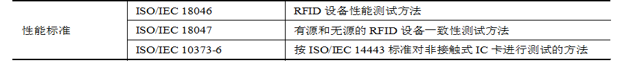
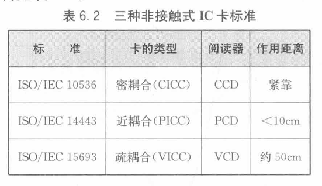
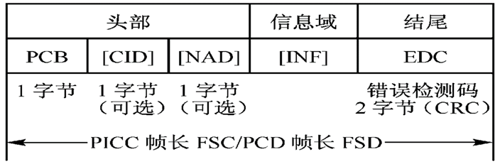
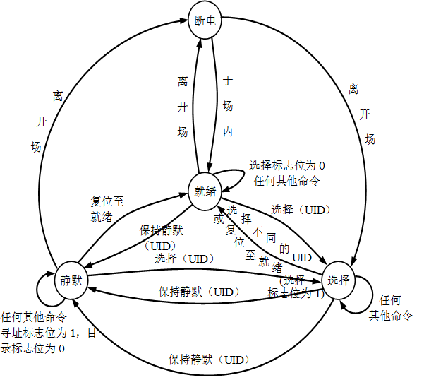
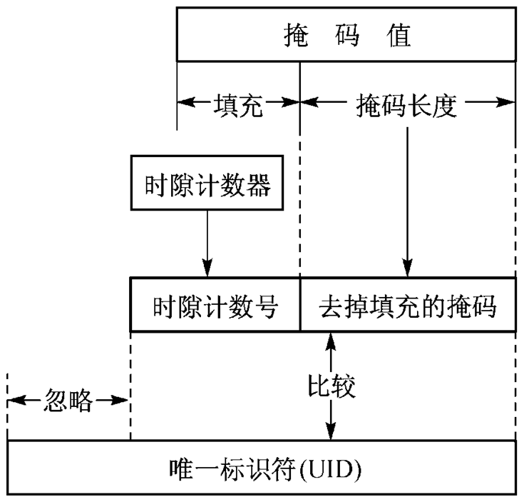
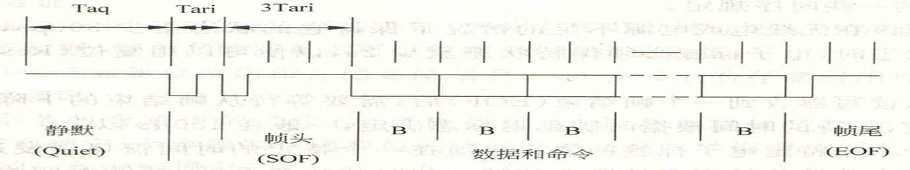

# RFID的标准体系

- 标准的作用：通过制定、发布和实施标准，解决编码、通信、空中接口和数据共享等问题
  - 过早：限制技术发展；过晚：限制技术应用范围

> [!note]
>
> - **技术**：接口和通信技术，如空中接口、防碰撞方法、中间件技术、通信协议
> - **一致性**：数据结构、编码格式及内存分配 
> - **电池辅助及与传感器的融合**
> - **应用**：如不停车收费系统、身份识别、动物识别、物流、追踪、门禁等

## RFID标准分类

- 国际标准（ISO/IEC)、 国家标准、 行业标准
- **技术标准、**应用标准、**数据内容标准**、性能标准

- RFID技术标准基本结构

  RFID技术标准主要定义了**不同频段的空中接口**及相关**编码标准和通信协议（通信接口）**是争夺比较激烈的部分，两者也构成了RFID标准的核心。

- 数据内容标准

  

- 性能标准 

  

  

## RFID标准

> [!important]
>
> RFID标准争夺的核心主要集中在RFID标签的**内容和编码标准**

### ISO/IEC标准体系

- 非接触IC卡：由于距离不同分为密耦合（紧靠没有应用），近耦合（<10cm），疏耦合（约50cm)

- ISO /IEC **11784** 规定动物识别的代码结构 
- ISO/IEC 11785 规定相关的技术准则(数据：**差分曼彻斯特码**)
- ISO/IEC 14223  为读取动物应答器内的特殊数字提供了协议，这些数字被存储在集中所有动物数据的中央数据库内 

#### 物品识别标准

- ISO/IEC 18000 ：**空中接口的重要标准** 

  > 无线频段（频率）有6个即低于135 kHz，13.56 MHz，433 MHz，860~960 MHz，2.45 GHz和5.8 GHz。作用距离从数厘米至十多米不等 

- ISO/IEC 18001 ：给出了应答器的**外形要求**

- ISO/IEC 10374 ：微波应答器的集装箱识别标准 

  > - 工作频率范围为850~950 MHz以及2.4~2.5 GHz，应答器的灵敏度以最大电场强度150 mV/m定义，最大可阅读距离为13 m
  >
  > 

#### **ISO/IEC 14443** 标准

- ISO/IEC 14443的全称是**近耦合集成电路卡**

- 定义了近耦合卡（Proximity Integrated Circuit Card，PICC）的作用原理和工作参数。

  > - PICC是指作用距离大约为**0～15cm的非接触IC卡**，主要应用于售票领域
  > - PICC作为数据载体，通常包含有**一个微处理器**，另外还可能有附加的触点供使用。

##### ISO/IEC 14443-1物理特性

- 规定了近耦合卡的物理特性
- PICC（应答器）是一种**ID-1**型卡，通常在其卡面上有集成电路和耦合工具
- PCD（读写设备）是通过**电感耦合为PICC提供能量**，控制数据交换进程的读写设备
- PICC与集成电路之间的通信是通过与近耦合设备进行**电感耦合**完成的

##### ISO/IEC 14443-2频谱能量和信号接口

- 规定了**耦合场的性质与特征**，以及PCD和PICC之间的双向通信，该耦合场需要外界提供能量

- PCD和PICC之间的初始化对话

  > - PCD的射频工作场激活PICC；
  > - PICC等待来自PCD的指令；
  > - PCD传输相关指令；
  > - PICC回送响应。

- PCD和PICC之间的两种完全不同的数据传输方式（TYPE A和TYPE B）

##### ISO/IEC 14443-4传输协议

头部(必备)，信息域(可选)，结尾(必备)

协议控制字节(PCB)包含控制数据传输所需的信息，定义了3种分组的基本类型

#### ISO/IEC 15693 标准

- ISO/IEC 15693的全称是**疏耦合非接触**集成电路卡，主要定义了**疏耦合卡（VICC）**的作用原理和工作参数。
- 读写器：**VCD** ，作用距离为**0～1m的非接触IC卡**，简单状态机的**便宜的存储器组件**作为数据载体

##### 空中接口与初始化

- 能量：疏耦合设备（VCD）产生**13.56Mz±7kHz**=*的正弦波
- VICC（应答器）通过**电感耦合**方式获得能量

1. VCD->VICC

   > ASK调制，调制深度为10%和100%
   >
   > 数据编码：采用PPM,编码方式有两种：“256选l”和“4选1”，由VCD选择、

2. VCD到VICC的帧

   > SOF和EOF，异同步，不依赖协议
   >
   > SOF通知VICC模式选择，EOF可用于两种模式

3. VICC->VCD的通信

   > 位表示和编码 ：采用**曼彻斯特码**编码方式 

##### 传输协议

- 唯一标识符（UID） ：由制造商永久地设定 
- 应用族标识符（AFI） ：由VCD锁定的应用类型 
- 数据存储格式标识符（DSFID） ：指出了数据在VICC内存中的结构 
- CRC ：初始值为FFH 
- VICC内存结构 ：可寻址块达256个，块大小可至256位，最大内存容量可达64 kb（8 kB）。 
- 块安全状态 ：由VICC作为对VCD请求的响应参数返回 

- 请求帧： 由SOF（帧开始）、标志、命令编码、强制和可选的参数、数据、CRC、EOF（帧结束）等域组成
- 应答帧：标志域为8位

##### VICC的四种状态

- 断电；就绪；静默；选择

##### 防碰撞过程中VICC的UID匹配方法

- 将得到的掩码放入比较器。
- 将时隙数放入比较器。
- 将上面两步得到的位值和VICC的UID相应低位值进行比较，如果相同即为匹配。

##### ISO/IEC 15693标准的防碰撞和传输协议

- 读写器通过**设置槽数目标识来完成防碰撞功能**
- 掩码的长度是指掩码值信号位的长度，防碰撞序列的目的是使用唯一标识符（UID）来确定工作场中的唯一的射频标签。
- 采用**轮询机制和分时查询**的方式达成防碰撞的目标，防碰撞算法采用**时隙ALOHA**算法。

---

> [!tip]
>
> -  ISO 14443和ISO 15693对比
>
> 

#### ISO/IEC 18000-6标准

- ÌISO/IEC 18000是目前相对较新的一系列标准，可用于**商品的供应链**
- 包含了**有源和无源RFID技术标准**，主要规定了基于物品管理的RFID**空中接口参数**，对数据内容和数据结构无限制，因而可用于EPC

1. 物理接口：读写器需要同时支持**Type A和Type B**两种协议，而且能够在这两种类型之间进行切换，电子标签则需要支持至少一种类型。

   > TypeA协议是一种基于“读写器先发言”的通信机制，**即基于**读写器的命令与电子标签的**回答交替发送**的机制
   >
   > Type B是基于“读写器”先发言的传输机制，是读写器的命令与电子标签的回答相互交换的机制

##### Type A协议物理接口

- 读写器到电子标签：
  - 数据：载波振幅调制，调制深度是30％
  - 数据编码：脉冲间隔编码（PIE ：Pulse Interval Encoding ） 即通过**定义下降沿之间的不同宽度来表示不同的数据信号**。
- 电子标签到读写器
  - 电子标签通过**反向散射**给读写器传输信息
  - 数据速率是40kb/s，数据采用FM0编码

- TypeA的协议和命令

  

  其中数据和命令格式

  

- 电子标签的回答

  

##### TypeB协议

- 读写器到电子标签
  - 采用**ASK调制**，调制深度是11％或99％
  - 位速率规定为l0kb/s或40kb/s
  - 采用曼彻斯特编码
- 电子标签到读写器
  - 采用FM0编码，通过调制入射并反向散射给读写器传输信息。
  - 数据速率是40kb/s。

- TypeB协议和命令：包括命令格式、数据和参数、存储器寻址和通信中的时序规定

- Type B的标签回答格式

> [!note]
>
> 

#### ISO/IEC 18000-7标准 

- 窄带UHF频段
- 载波频率为433.92 MHz±20 ppm
- 采用**FSK调制方式**，频率偏移为±35 kHz
- 数据位采用**曼彻斯特编码**，数据速率为27.7 kbps 
- 阅读器和应答器之间的通信采用**主从方式**

