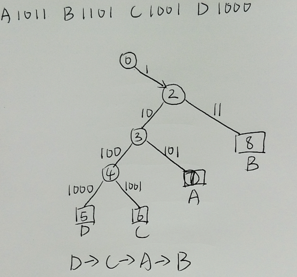

### RFID技术考试题
---

### **一、选择题**（共20题，每题1分，共20分）  

注：**加黑选项为正确选项**

1. RFID系统中负责为无源标签供能的是？  
   A. 高层软件  
   B. 天线  
   C. 中间件  
   **D. 阅读器**  
2. 电感耦合方式的工作频率通常是？  
   A. 433 MHz  
   **B. 13.56 MHz**  
   C. 2.45 GHz  
   D. 5.8 GHz  
3. 曼彻斯特编码的核心作用是？  
   A. 提高传输速率  
   **B. 提供时钟同步与数据**  
   C. 降低功耗  
   D. 增加传输距离  
4. 时隙ALOHA的最大吞吐率约为？  
   A. 18.4%  
   **B. 36.8%**  
   C. 50%  
   D. 75%  
5. ISO/IEC 15693标准的防碰撞机制是？  
   A. 二进制树搜索  
   **B. 时隙ALOHA**  
   C. 位检测  
   D. 查询树算法  
6. 反向散射耦合适用于？  
   A. 低频近距离识别  
   **B. 微波远距离多标签识别**  
   C. 声表面波标签  
   D. 一位电子标签  
7. 半有源标签的特点是？  
   A. 完全依赖读写器供能  
   **B. 电池维持电路，通信能量来自阅读器**  
   C. 主动发射信号  
   D. 成本低于无源标签  
8. RFID三次认证协议的目的是？  
   A. 提高数据传输速率  
   **B. 实现读写器与标签双向身份认证**  
   C. 减少能量消耗  
   D. 扩展识别距离  
9. ISO/IEC 18000-7标准的工作频率是？  
   A. 13.56 MHz  
   B. 860 MHz  
   **C. 433.92 MHz**  
   D. 2.45 GHz  
10. 标签到阅读器采用副载波调制的主要优势是？  
    A. 降低标签成本  
    **B. 提高返回信号抗干扰性**  
    C. 增加阅读器发射功率  
    D. 简化通信协议  
11. 下列哪种校验码通过异或运算生成？  
    A. CRC  
    **B. LRC**  
    C. 奇偶校验  
    D. 海明码  
12. ISO/IEC 14443 Type A的调制方式是？  
    A. FSK  
    **B. 100% ASK**  
    C. 10% ASK  
    D. PSK  
13. 谐振回路中，串联谐振的特征是？  
    **A. 阻抗最小，电流最大**  
    B. 阻抗最大，电压最大  
    C. 容抗等于感抗  
    D. 仅适用于恒流源  
14. RFID中间件的核心功能不包括？  
    A. 阅读器协调  
    B. 数据过滤  
    **C. 为标签供能**  
    D. 应用集成  
15. 在二进制树防碰撞算法中，读写器检测到冲突后的操作是？  
    A. 丢弃所有响应  
    **B. 追加0或1形成新前缀**  
    C. 增大发射功率  
    D. 切换频率  
16. 无源标签的缺点是？  
    A. 成本高  
    **B. 识别距离短**  
    C. 需定期更换电池  
    D. 体积大  
17. 下列标准中适用于集装箱识别的是？  
    A. ISO/IEC 14443  
    **B. ISO/IEC 10374**  
    C. ISO/IEC 15693  
    D. ISO/IEC 18000-6  
18. 香农定理用于计算？  
    A. 无噪声信道容量  
    **B. 有噪声信道容量**  
    C. 误码率  
    D. 波特率  
19. **在利用ID的认证中，专有密钥Kt如何生成？**  
    A. 由标签随机产生  
    **B. 通过主控密钥Km和标签ID计算**  
    C. 由读写器动态分配  
    D. 使用公钥加密  

---

### **二、判断题**（共10题，每题1分，共10分）  
1. **✓** RFID系统的三大组件是标签、阅读器和高层应用。  
2. **✗** 电感耦合方式适用于微波频段远距离通信。（电感耦合方式仅用于≤13.56 MHz近场）  
3. **✓** 曼彻斯特编码每个比特位中间必有跳变。  
4. **✗** CRC校验可纠正数据传输错误。（CRC校验仅检错，不纠错）  
5. **✓** 时隙ALOHA通过动态调整帧长提高吞吐率。  
6. **✗** 非对称密码（如RSA）适合资源受限的RFID标签。（对称密码更适用）  
7. **✓** ISO/IEC 15693支持1米内多标签识别。  
8. **✗** 反向散射耦合的能量传输依赖磁场感应。（反向散射耦合的能量传输依赖电磁波反射）  
9. **✓** 标签的负载调制通过改变阻抗影响阅读器天线电压。  
10. **✗** 无功近场区以电磁波辐射为主。（无功近场区以能量存储为主）  

---

### **三、简答题**（共5题，每题6分，共30分）  
1. **简述电感耦合与反向散射耦合的区别（至少3点）。**  
   **答案**：  
   | **电感耦合**       | **反向散射耦合**   |
   | ------------------ | ------------------ |
   | 磁场能量传输       | 电磁波反射能量传输 |
   | 工作频率≤13.56 MHz | 工作频率UHF/SHF    |
   | 识别距离<1米       | 识别距离可达数米   |

2. **说明RFID中间件的四大功能。**  
   **答案**：  
   ① 阅读器协调控制（防冲突）；  
   ② 数据过滤（去冗余）；  
   ③ 数据路由与集成（对接应用系统）；  
   ④ 进程管理（任务调度）。  

3. **描述三次认证协议的流程。**  
   **答案**：  
   1. 标签→读写器：发送随机数 R_B\；  
   2. 读写器→标签：发送 \(Token_AB}= E_K(R_A, R_B‘)\)；  
   3. 标签验证 \(R_B'\)和(R_B)是否一致，发送 \(Token_BA = E_K(R_B1, R_A’)\)；  
   4. 读写器验证 \(R_A'\)和(R_A)是否一致，完成双向认证。  

4. **二进制树防碰撞算法中，读写器检测到位冲突后如何操作？**  
   **答案**：  
   - 追加"0"和"1"生成两个新前缀；  
   - 分别向冲突子集发送新前缀；  
   - 递归直到无冲突，识别单个标签。  

5. **为何ISO/IEC 18000-7采用FSK调制？**  
   **答案**：  
   FSK抗幅度噪声能力强，适合433 MHz工业环境（如金属仓库、车辆追踪），避免ASK因信号衰减导致误码。  

---

### **四、综合题**（共3题，共40分）  

1. 给出以下二进制数，写出对应的编码方式的编码（10分）

   (1). 10010110，曼彻斯特编码（3分）

   

   (2). 1100110，差分曼彻斯特编码（3分）

   

   (3). 1011001，密勒(Miller)编码（4分）

   

---

2. 外界的各种干扰可能使数据传输产生错误，例如外界噪声, 会使传输中码间串扰，可以运用数据检验（差错检测）校验数据，以下给出二进制数，请给出对应校验方式对应的校验码

   (1). 三个字节10010011，00101101，11001100，纵向冗余校验（LRC）（4分）

   

   (2). 1001，循环冗余码校验（CRC)，其中G(x)=1011（6分）

   

---

1. 物流仓库RFID系统设计 （20分） 
   **场景**：需识别10米外多个货物标签，环境存在金属货架干扰。  
   **问题**：  
   (1) 应选择哪种耦合方式？为什么？ （4分）  
   (2) 标签供电类型如何选择？（4分）  
   (3) 对于以上4个货物，其对应的标签为1011，1101，1001，1000。当采用以下方法时：1、基于序列号的二进制树搜索法   2、基于随机数和时隙的二分支法识别所有的标签,识别出的标签的顺序是什么?（12分）

   

     

   **答案**：  
   (1) 反向散射耦合（微波频段如860MHz），支持远距离多标签识别：   
   (2) 半有源标签：  电池维持电路，延长寿命；  通信能量来自读写器，支持远距离反向散射。  
   (3)  

   

   

  

---

