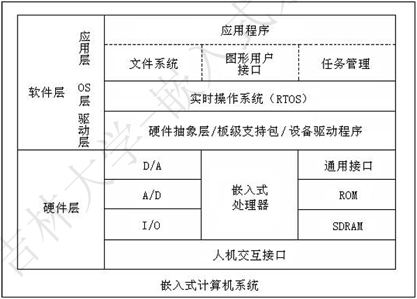
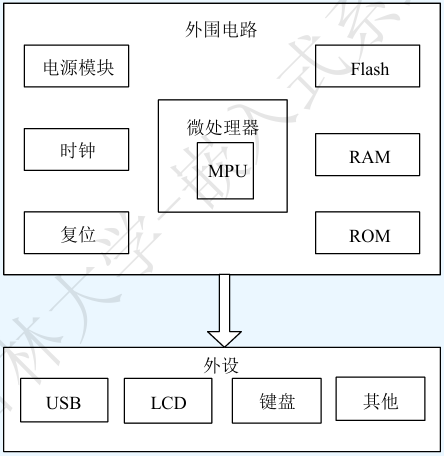
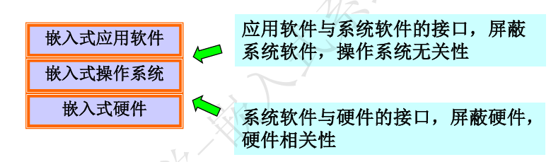
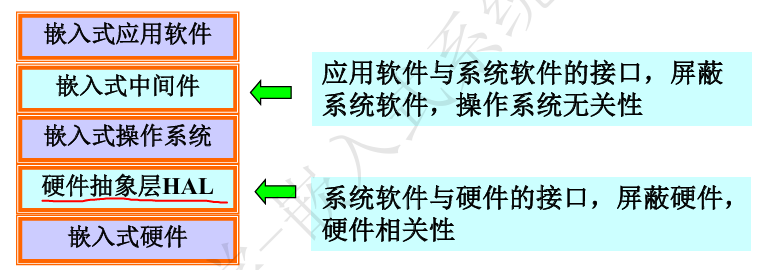
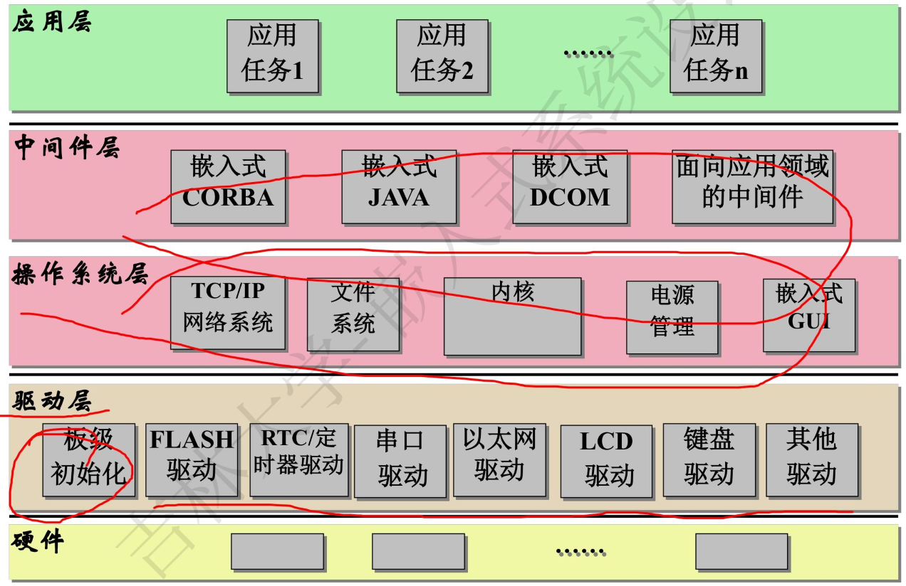
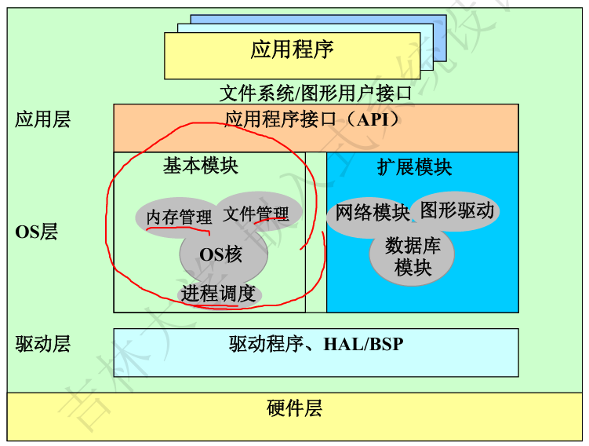
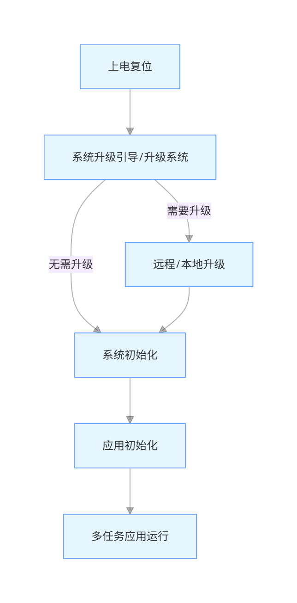
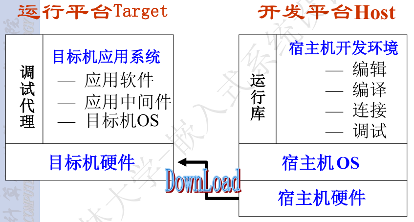

# 嵌入式系统

## 定义

嵌入式系统目前没有完全统一的权威定义，但有几个核心描述大家必须记住：

- 以**应用**为中心、以**计算机技术**为基础、**软硬件可裁剪**、适应应用系统对**功能、可靠性、成本、体积、功耗严格要求**的专用计算机系统；
- 嵌入性本质是将一个计算机**嵌入**到一个对象体系中去，这是理解嵌入式系统的基本出发点。关键在于**嵌入设备内部、信号控制、体积小、结构紧凑**；
- 嵌入式系统是计算机技术，通信技术，半导体技术，微电子技术，语音图象数据传输技术，甚至传感器等先进技术和具体应用对象相结合后的更新换代产品，是**技术密集**，投资强度大，高度分散，不断创新的知识密集型系统。反映当代最新技术的先进水平。
- **嵌入式行业 “分散无垄断”，通用计算机行业 “高度垄断”**；
- IEEE 定义：用于控制、监视或者辅助操作机器和设备的**装置**；
- 通俗理解：“看不见的计算机”，它嵌入在其他设备内部，不直接面向用户，而是为特定功能服务。

> [!tip]
>
> 1. 嵌入式系统是**面向用户、面向产品、面向应用**的
> 2. 嵌入式系统是一个**技术密集､资金密集､高度分散､不断创新**的知识集成系统｡
> 3. 嵌入式系统必须根据应用需求**对软硬件进行裁剪**

## 嵌入式系统的特点

嵌入式系统的特点根源在于 “**嵌入性、专用性、计算机系统**” 三大基本要素，所有特征都是这三要素的衍生，且与通用计算机形成明确差异。

| 基本要素   | 核心含义                               | 衍生特点                                                     | 典型设备实例体现                                             |
| ---------- | -------------------------------------- | ------------------------------------------------------------ | ------------------------------------------------------------ |
| 嵌入性     | 物理上成为对象系统的一部分，不独立存在 | 小型（适配宿主设备体积）、可靠（适应宿主工作环境）、低功耗（减少宿主能耗负担）、价廉（控制整体设备成本） | 智能手表：小巧便携（小型）、续航 7-14 天（低功耗）、百元级价格（价廉）；工业 PLC：适应工厂高温 / 潮湿环境（可靠） |
| 专用性     | 功能为特定场景定制，无多余通用功能     | 软硬件可裁剪（按需保留核心功能）、最小配置（无冗余资源）、实时性（满足特定场景响应要求）、定制 OS（适配功能的精简操作系统） | 无人机飞控：仅保留 “姿态控制、电机驱动” 核心功能（最小配置），用实时 OS 确保飞行稳定性（实时性）；智能灯泡：裁剪掉图形处理模块（软硬件裁剪），用极简 OS 控制开关 / 亮度 |
| 计算机系统 | 本质是具备控制能力的计算机内核         | 配备专用外设接口（与宿主设备的传感器、执行器适配）           | 智能手表：通过 I2C/SPI 接口驱动心率传感器（专用接口）；工业 PLC：通过隔离 I/O 接口连接工厂设备（专用接口）；无人机：通过 PWM 接口控制电机、UART 接口通信（专用接口） |

- 与通用计算机系统相比，还有其他显著特点
  - 系统内核小
  - 专用性强
  - 运行环境差异大
  - 可靠性要求高
  - 系统精简和高实时性操作系统
  - 具有固化在非易失性存储器中的代码
  - 嵌入式系统开发工作和环境特殊

> [!note]
>
> 嵌入式系统的 7 大显著特点，本质是 “嵌入性、专用性、计算机系统” 三要素的具体体现 —— 内核小、系统精简是专用性的要求，运行环境差异大、可靠性高是嵌入性的要求，固化代码、专用接口是计算机系统的要求，而特殊的开发环境是由前 6 大特点共同决定的。

## 通用计算机与嵌入式系统

通用计算机与嵌入式系统：现代计算机技术的两大分支；本质是 “满足不同核心需求” 而产生的分化 —— 一个追求 “极致算力”，一个追求 “精准控制”，两者并行发展、互不替代：

通用计算机：提供通用、强大的计算能力

嵌入式系统：实现特定对象的智能化控制

| 对比维度   | 通用计算机                                                   | 嵌入式系统                                                   |
| ---------- | ------------------------------------------------------------ | ------------------------------------------------------------ |
| 形式和类型 | 物理形态可见，为独立设备；按体系结构、运算速度、结构规模分为大、中、小型机和微机 | 物理形态不可见，嵌入在其他设备内部；形式多样，按应用场景分类（如汽车电子、智能家居等） |
| 系统组成   | 通用处理器 + 标准总线 + 外设；软件与硬件相对独立，可灵活搭配扩展 | 面向应用的嵌入式微处理器（总线和外部接口多集成于芯片内部）；软件与硬件紧密集成，定制化绑定 |
| 开发方式   | 开发平台与运行平台一致，直接在自身设备上编写、运行、调试程序 | 采用交叉开发模式，开发平台为通用计算机，运行平台为嵌入式设备（需通过工具烧录程序） |
| 二次开发性 | 终端用户可自由重新编制应用程序，支持更换操作系统，二次开发门槛低 | 出厂后功能固定，终端用户一般不能再编程；仅专业开发者可通过专用工具升级或修改程序 |

## 嵌入式系统的发展

嵌入式技术的 4 个发展阶段，核心是 “硬件集成化提升 + 软件功能升级 + 应用场景拓展” 的逐步演进

第一阶段：单芯片(芯片+汇编程序)
第二阶段：嵌入式CPU(芯片+简单操作系统+C程序)
第三阶段：嵌入式操作系统(芯片+可裁减操作系统+混合编程)
第四阶段： Internet技术与嵌入式技术融合

#### 第一阶段：单芯片时代（芯片 + 汇编程序）

以单芯片可编程控制器为核心（比如早期 8051 单片机的雏形），没有独立的操作系统，完全依赖汇编语言直接操作硬件。

- 一些专业性极强的工业控制系统，早期工业专用控制系统，比如工厂流水线的简单计数控制、机床的单一动作控制；
- 系统结构简单，只能完成单一控制任务（如 “检测温度→控制继电器开关”），存储容量小（KB 级），无用户交互接口；

#### 第二阶段：嵌入式 CPU 时代（芯片 + 简单 OS+C 程序）

嵌入式 CPU 出现（如 Intel 8080、Motorola 6800），搭配简单操作系统，C 语言取代汇编成为主流开发语言。

- 主要用来控制系统负载以及监控应用程序运行。工业控制中的负载监控、早期家电的简单智能控制（如带定时功能的洗衣机）；
- CPU种类繁多，通用性比较弱；系统开销小，效率高；操作系统具有一定的兼容性和扩展性；但是应用软件较为专业，用户界面不够友好

#### 第三阶段：嵌入式 OS 时代（ARM 处理器 + 可裁剪 OS + 混合编程）

以 ARM 技术为核心的嵌入式处理器成为主流，搭配可裁剪嵌入式操作系统，支持多语言混合编程。

- 分布控制、柔性制造、数字化通信和信息家电

- 操作系统内核精小，效率高，具备文件管理、多任务调度、网络支持、图形界面等功能，能满足复杂场景需求；

  具有大量的应用程序接口（API），开发应用程序简单；嵌入式应用软件丰富

#### 第四阶段：嵌入式 Internet 时代（32/64 位处理器 + IoT + 实时 OS）

32/64 位高性能嵌入式处理器，嵌入式技术与 Internet 深度融合，实时操作系统支持网络功能。

## 嵌入式系统的硬件和软件特征

嵌入式系统的**整体组成**和**硬件模块构成**，核心逻辑是 “面向特定应用定制”—— 硬件围绕 “嵌入式处理器” 搭建，所有模块都为适配具体功能服务。

嵌入式系统不是单一的硬件或软件，而是 “硬件 + 软件 + 开发工具 / 系统” 的完整体系，三者缺一不可：

- **核心组成**：硬件（物理基础）+ 软件（功能实现）+ 开发工具 / 系统（开发支撑）；
- **关键前提**：绝大多数嵌入式系统是 “定制化” 的 —— 比如智能手表的硬件的、软件是为 “可穿戴健康监测” 定制，工业 PLC 是为 “工厂设备控制” 定制，没有通用标准配置。

### 嵌入式系统的硬件

嵌入式硬件的 “核心架构”—— **以嵌入式处理器为中心**，所有模块（存储设备，I/O设备，通信接口设备，扩展设备接口以及电源）都围绕它协同工作，且完全为特定应用定制（无冗余设计）

#### 嵌入式处理器

嵌入式处理器是嵌入式硬件的核心**控制单元**，负责执行程序、处理数据、协调所有外设工作，所有硬件模块都围绕它协同运作。

嵌入式处理器分为 EMPU、EMCU、EDSP、ESoC 四类

1. 嵌入式微处理器（EMPU：Embedded Microprocessor Unit）
2. 嵌入式微控制器（EMCU：Embedded Microcontroller Unit）
3. 嵌入式数字信号处理器（EDSP：Embedded Digital Signal Processor）
4. 嵌入式片上系统（ESoC：Embedded System on Chip）

##### 嵌入式微处理器（EMPU）

EMPU 是嵌入式系统的 “高性能核心”，本质是通用 CPU 的 “嵌入式定制版”，核心优势是强大的通用计算能力，专门适配复杂嵌入式场景。

- EMPU 的核心本质：通用 CPU 的 “裁剪 + 强化” 版
- EMPU 的核心特征：“CPU Core” 方案（需外部扩展）
  - EMPU 芯片本身**只包含 CPU 内核**，必须搭配外部模块才能工作
  - 必需外部扩展模块：RAM（运行时存数据）、ROM/Flash（存程序）、电源管理芯片（稳定供电）、总线控制器（连接外设）；
  - 开发者需做工作：设计 “母板”（核心板或**单板计算机**），将 EMPU 与外部模块焊接在电路板上，完成硬件适配。
- 嵌入式微处理器及其存储器、总线、外设等安装在一块电路板上，称为**单板计算机**

EMPU 的架构选择由应用场景决定，核心是 “适配复杂操作系统和算法”，主流有三类：

| 架构类型    | 核心特点                             | 代表产品                                                 | 适用场景                                                     |
| ----------- | ------------------------------------ | -------------------------------------------------------- | ------------------------------------------------------------ |
| ARM 架构    | 低功耗、高性能、生态成熟，绝对主流   | Cortex-A53（中端设备）、A72（高端设备）、A78（旗舰设备） | 智能座舱、工业网关、高端物联网设备（运行 Linux/Android）     |
| x86 架构    | 兼容 x86 生态，支持完整 Windows 系统 | Intel Atom 系列、AMD Embedded 系列                       | 工控机、医疗设备、零售收银机（需运行 Windows 工业软件或 x86 专属程序） |
| RISC-V 架构 | 开源、免费、可自定义，新兴力量       | 嘉楠堪智 K230、昉・星光 V3S                              | 国产化设备、物联网网关、边缘计算设备（追求自主可控和成本优势） |

EMPU 的核心价值是 “**提供强大通用计算能力**”，当应用满足以下任一条件时，必选 EMPU：

1. 需要运行 Linux、Android、Windows 等复杂操作系统（这些系统对内存、计算能力要求高，MCU 无法支撑）；
2. 需要处理大量数据或复杂算法（如视频解码、AI 推理、大数据转发）；
3. 需要连接多个外设并协同工作（如智能座舱连接屏幕、摄像头、雷达、车联网模块）。

##### 嵌入式微控制器（EMCU）

EMCU（又称单片机），核心优势是 “**All-in-One 单片集成**”—— 把计算机系统所有核心部件打包进一颗芯片，兼顾低成本、小体积、低功耗，完美适配绝大多数简单到中等复杂度的嵌入式场景。

- EMCU 的核心本质：“一颗芯片 = 一台完整计算机”
- MCU (单片机) 是“All-in-One”的方案：将CPU、内存（RAM/Flash）、定时器、串口等所有外设都集成在了一颗芯片上。开发简单，系统紧凑。

EMCU 的核心特征是 “集成度高”，一颗典型的 MCU 芯片内部包含三大核心模块，无需外部扩展就能独立工作：

| 集成模块            | 核心作用                                                     | 实例体现（STM32F103）                                        |
| ------------------- | ------------------------------------------------------------ | ------------------------------------------------------------ |
| 内核（Core）        | 执行程序指令、处理数据，是 EMCU 的 “大脑”                    | ARM Cortex-M3 内核，每秒可执行数百万条指令，处理传感器数据、控制外设动作 |
| 存储器（Memory）    | 存储程序和数据，分为 “程序存储” 和 “数据存储” 两类           | - Flash（程序存储）：128KB，存操作系统和应用程序（如灯光控制逻辑）；- SRAM（数据存储）：20KB，存运行时的临时数据（如当前检测的温度值） |
| 外设（Peripherals） | 实现与外部设备的交互（输入 / 输出、通信），是 EMCU 的 “手脚和通信接口” | - 基础外设：GPIO（控制 LED 灯、继电器）、定时器（定时开关）、看门狗（防止程序卡死）；- 通信接口：UART（串口通信，如连接蓝牙模块）、I2C/SPI（连接传感器、显示屏）；- 功能外设：ADC（采集温度、电压等模拟信号）、PWM（控制电机转速、LED 亮度）；- 高端外设：部分 MCU 集成以太网（联网）、USB（数据传输）、CAN 总线（汽车电子专用） |

> [!tip]
>
> ## 总结：EMPU 与 EMCU 的核心差异对照表（含记忆要点）
>
> | 对比维度     | 嵌入式微控制器（EMCU）            | 嵌入式微处理器（EMPU）            | 记忆要点                           |
> | ------------ | --------------------------------- | --------------------------------- | ---------------------------------- |
> | 核心结构     | 单片集成（CPU + 内存 + 外设）     | 仅 CPU 内核，需外部扩展           | 集成度：EMCU＞EMPU                 |
> | 别名         | 单片机                            | ——                                | 记住 “单片机 = EMCU”               |
> | 核心特点     | 简单、紧凑、低功耗、低成本        | 强大、灵活、可配置性高            | 特点：EMCU “省”，EMPU “强”         |
> | 适用系统     | 裸机 / 轻量级 RTOS                | Linux/Android 等复杂 OS           | 系统复杂度：EMCU＜EMPU             |
> | 开发方式     | 简单开发，程序直接烧录            | 交叉开发，需编译内核 / 根文件系统 | 开发难度：EMCU＜EMPU               |
> | 应用核心需求 | 精准控制（如 “开关灯、读传感器”） | 复杂智能（如 “导航、图像识别”）   | 需求匹配：控制选 EMCU，智能选 EMPU |

##### 嵌入式数字信号处理器（EDSP）

EDSP 是嵌入式领域专门为**高速、实时数字信号处理**设计的处理器，核心优势是把音频、视频、传感器数据等离散信号的复杂数学运算（如滤波、FFT 变换）做到极致高效，远超通用 CPU 和 MCU。

- EDSP 的所有设计都围绕 “处理离散时间信号” 展开
- EDSP 的高效不是靠 “主频堆料”，而是靠针对性的硬件设计：
  1. **哈佛结构**：程序总线和数据总线分开，能同时读取指令和数据，解决了通用处理器 “指令和数据抢总线” 的瓶颈，
  2. **专用硬件单元**：比如乘法累加器（MAC）可直接完成 “乘法 + 累加” 一体化操作，无需分步骤执行，速度远超通用处理器的软件模拟；
  3. **SIMD（单指令多数据流）+ 零开销循环**：SIMD 指令能让一条指令同时处理多个数据（如一次处理 4 组音频采样值）；零开销循环允许反复执行某段运算（如连续滤波）时，无需额外的指令跳转开销，进一步提升实时性。

不再生产独立的 EDSP 芯片，而是将 DSP 能力集成到通用处理器或 SoC 中，通过 “协同工作” 发挥优势

| 融合方式       | 核心逻辑                                                     | 实例                                                         |
| -------------- | ------------------------------------------------------------ | ------------------------------------------------------------ |
| 协处理器模式   | 主 CPU（如 ARM Cortex-A）负责逻辑控制，DSP 作为协处理器，专门承接信号处理任务 | 部分工业 MCU 中，Cortex-M4 为主 CPU，集成专用 DSP 协处理器，处理传感器数据 |
| 指令集扩展模式 | 在通用 CPU 指令集中加入 DSP 专用指令（如 ARM 的 NEON 技术），让一个内核同时具备控制和信号处理能力 | 手机 SoC 的 ARM Cortex-A 系列内核，通过 NEON 指令集处理音频、视频编码 |
| 异构计算模式   | 在 SoC 中集成 CPU、GPU、DSP、NPU 等多个计算单元，各自负责擅长的任务，协同工作 | 手机 SoC 中的 Hexagon DSP（高通），专门处理音频降噪、传感器融合、AI 推理；自动驾驶 SoC 中，DSP 负责雷达信号处理 |

##### 嵌入式片上系统（ESoC）

SoC（嵌入式片上系统）的核心是 “将计算机系统所有核心功能，甚至多个不同架构的计算单元，全部集成在一颗芯片上” ，不只是简单的硬件堆砌，而是基于 **IP 核**的 “系统级解决方案”，尤其以 “异构计算” 为当代核心特征，是高端嵌入式设备的核心硬件。

- 核心依赖 “IP 核复用” 技术，这是理解 SoC 设计的关键
  - IP 核（知识产权核）是预先设计好、经过验证的 “标准功能模块”，相当于芯片世界的 “乐高积木” 或 “软件库”。
- 当代 SoC 最显著的特点是异构计算，将不同架构、不同指令集、为不同任务优化的计算单元（CPU、GPU、DSP、NPU、ISP 等）集成在一颗芯片上，各自负责擅长的任务，协同工作

### 嵌入式系统的软件

嵌入式系统的软件：由嵌入式**操作系统**和相应的各种**应用程序**构成；分为系统软件（操作系统，中间件）和应用软件

两个软件系统架构，核心差异是 “是否包含中间件”，对应不同复杂度场景：

| 架构类型           | 组成（从下到上）                                            | 适用场景                                                  | 核心优势                                         |
| ------------------ | ----------------------------------------------------------- | --------------------------------------------------------- | ------------------------------------------------ |
| 架构 1（无中间件） | 嵌入式硬件 → 嵌入式操作系统 → 嵌入式应用软件                | 简单场景（如智能灯、遥控器），功能单一、无跨 OS 需求      | 结构简单、资源占用少（适合内存小的 MCU）         |
| 架构 2（含中间件） | 嵌入式硬件 → HAL → 嵌入式操作系统 → 中间件 → 嵌入式应用软件 | 复杂场景（如物联网网关、工业控制器），需跨 OS、多设备通信 | 兼容性强、可扩展性好（支持功能迭代和跨平台移植） |

#### 嵌入式软件系统的体系结构

嵌入式软件系统的体系结构是 “从硬件到应用” 的五层分层架构，核心逻辑是**逐层屏蔽差异、降低耦合**

每层核心定位：

- 底层（驱动层 + 硬件）：解决 “硬件怎么用” 的问题；
- 中间层（操作系统层 + 中间件层）：解决 “资源怎么管、通用服务怎么提供” 的问题；
- 上层（应用层）：解决 “业务要做什么” 的问题。

#### 硬件抽象层（HAL)

HAL 是夹在 “操作系统（OS）” 和 “硬件” 之间的中间层，屏蔽底层硬件的多样性，操作系统不再面对具体的
硬件环境，而是面对这个中间层所代表的，逻辑上的硬件环境

- 对操作系统：提供**统一的标准化接口**（比如 “读取传感器数据”“控制 GPIO 输出”），OS 无需知道硬件的具体型号、寄存器地址，只需调用这些通用接口；
- 对硬件：将 OS 的通用接口指令，翻译成**硬件能识别的专属指令**（比如不同厂商的传感器，读取数据的寄存器地址不同，HAL 会适配这些差异）。

 HAL、驱动层和 BSP（板级支持包），核心差异如下：

| 组件              | 核心定位                                                     | 通俗区别               |
| ----------------- | ------------------------------------------------------------ | ---------------------- |
| HAL（硬件抽象层） | 芯片级抽象，提供统一接口，屏蔽不同芯片的硬件差异（如 STM32 和 GD32 的 GPIO 差异） | “跨芯片的通用翻译”     |
| 驱动层            | 硬件专属驱动，直接操作硬件寄存器（如某型号传感器的具体驱动代码） | “单个硬件的专属指令集” |
| BSP（板级支持包） | 板级抽象，适配特定开发板的硬件配置（如同一芯片不同开发板的 LED 引脚不同） | “跨开发板的适配工具”   |

#### 板级支持包（BSP）

BSP（Board Support Package，板级支持包）是**硬件抽象层（HAL）的具体实现形式**

- 本质：HAL 的一种实现（不是独立于 HAL 的组件），专门针对 “特定硬件板卡” 设计；
- 核心作用：解决 “嵌入式 OS 如何在具体硬件上运行” 的问题，是 OS 与硬件板卡之间的适配层；

BSP简单地说，就是一段启动代码，和计算机主板的BIOS差不多，但提供的功能相差很大。

1. 硬件相关性：BSP 与具体硬件板卡强绑定，为特定板卡定制。
2. 操作系统相关性：BSP 与特定嵌入式 OS 匹配，不同 OS 的 BSP 结构和接口不同。

BSP 需完成 “初始化” 和 “设备驱动” 两大工作，其中初始化分为三级流程，层层递进：

1. 嵌入式系统的三级初始化（从硬件到 OS）

| 初始化级别             | 核心工作内容                                                 | 实例（STM32F4 开发板 + BSP）                                 |
| ---------------------- | ------------------------------------------------------------ | ------------------------------------------------------------ |
| 片级初始化（最底层）   | 针对 CPU 芯片本身的初始化（与板卡无关）：设置 CPU 核心寄存器、栈指针、时钟频率、中断控制器 | 初始化 ARM Cortex-M4 内核、设置系统时钟为 168MHz、配置 NVIC 中断控制器 |
| 板级初始化（中间层）   | 针对具体板卡的硬件初始化：初始化板上外设（LCD、网卡、传感器）、配置 GPIO 引脚、初始化软件数据结构和参数 | 初始化开发板上的以太网 PHY 芯片、LCD 屏引脚、SD 卡接口、心率传感器 I2C 总线 |
| 系统级初始化（最高层） | 为嵌入式 OS 启动做准备：初始化内存（RAM）、设置 OS 启动参数、调用 OS 初始化函数 | 初始化 1MB SRAM、设置 FreeRTOS 的堆内存、调用`vTaskStartScheduler()`启动 OS 调度器 |

2. BSP 包含板卡上核心外设的驱动程序，无需 OS 或应用软件单独开发，直接为上层提供硬件操作接口

#### 嵌入式操作系统（EOS）

嵌入式操作系统包括：嵌入式内核、嵌入式TCP/IP网络系统、嵌入式文件系统、嵌入式GUI系统和电源管理等部分。

- 其中**嵌入式内核**是基础和必备的部分，其他部分要根据嵌入式系统的需要来确定
- 嵌入式操作系统大部分是 嵌入式实时操作系统（RTOS）
  - RTOS（Real-Time Operating System，实时操作系统）是 “可靠性和可信度极高的实时内核”，核心是 “**实时响应 + 资源合理分配**”
- 嵌入式操作系统的主要特点：**体积小、实时性、特殊的开发调试环境**

> [!tip]
>
> 从裸机到 RTOS，本质是 “从无序的单线程到有序的**多任务**”
>
> 使用嵌入式操作系统的本质是**用 “操作系统的调度开销” 换取 “实时性、可维护性、资源利用率的大幅提升”**：

#### 嵌入式软件运行流程

基于多任务操作系统的嵌入式软件的主要运行流程分为五个阶段：上电复位，板级初始化，引导/升级系统（远程/本地升级），系统初始化，应用初始化，多任务应用

- 上电复位，板级初始化阶段：
  - 嵌入式系统上电复位后完成板级初始化工作
  - 板级初始化程序具有完全的硬件特性，一般采用**汇编语言**实现。
  - CPU中**堆栈指针寄存器**的初始化。**BSS段**（Block Storage Space表示未被初始
    化的数据）的初始化。CPU芯片级的初始化：**中断控制器、内存**等的初始化
- 系统引导/升级阶段
  - 根据需要分别进入系统软件引导阶段或升级阶段
  - 软件可通过测试**通信端口数据**或判断**特定开关**的方式分别进入不同阶段
- 系统引导阶段
  - 将系统软件从NOR Flash中读取出来加载到RAM中运行
  - 软件直接在 NOR Flash 上运行（无需加载到 RAM），进入系统初始化阶段
  - 从外存（NAND Flash/CF 卡 / MMC）读取软件→加载到 RAM 中运行
- 系统升级阶段
  - 进入系统升级阶段后系统可通过网络进行远程升级（TFTP、FTP、HTTP）或通过串口进行本地升级（Console口使用超级终端或特定的升级软件）。
- 系统初始化阶段
  - 根据系统配置初始化数据空间、初始化系统所需的接口和外设
  - 内核→网络 / 文件系统→中间件
- 应用初始化阶段
  - 应用任务的创建，信号量、消息队列的创建和与应用相关的其它初始化工作
  - 系统进入多任务状态；OS 调度器按既定算法（如优先级抢占调度），轮流让就绪态的任务执行

---

## 嵌入式系统的开发工具和开发系统

嵌入式开发的核心特点是 **“开发与运行分离”** —— 开发在强大的 PC（宿主机）上完成，最终软件运行在资源有限的嵌入式设备（目标机）上。

- 开发工具一般用于开发主机，包括语言编译器、连接定位器、调试器等

- 交叉开发环境：嵌入式软件开发的全套工具软件集合 + 宿主机 - 目标机的协作体系（含硬件连接 + 逻辑通信）；宿主机与目标机之间在**物理连接**的基础上建立起**逻辑连接**。

- 宿主机（Host） ： 用于开发的计算机（通常是 PC / 工作站），软硬件资源丰富，支撑开发全流程

- 目标机（Target） ：所开发的嵌入式系统（如 STM32 开发板、智能温控器），是软件的最终运行环境

  

## 嵌入式系统的分类

- 按嵌入式微处理器的位数分类：4位、8位、16位嵌入式系统已经获得了大量应用，32位嵌入式系统正成为主流发展趋势。而一些要求高可靠性、高速处理的嵌入式系统已经开始使用64位嵌入式微处理器。
- 按软件实时性需求分类：非实时系统；软实时系统；硬实时系统
- 按嵌入式系统的复杂程度分类：小型，中型，复杂