# ARM微处理器概述

- 两种典型结构：冯·诺依曼结构；哈佛体系结构

## 冯·诺依曼结构

**指令和数据存储在同一个存储器**中，CPU 通过同一个地址总线和数据总线，分时读取指令和数据

- 结构简单，分时访问，自修改程序易实现
- **ARM 7**使用冯·诺依曼体系结构

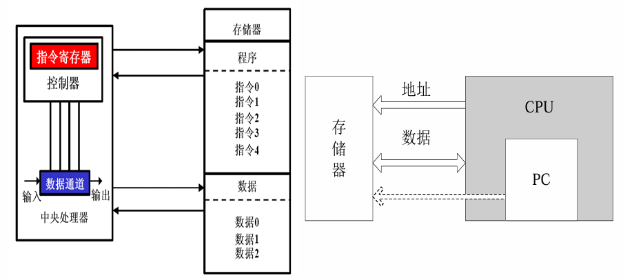

## 哈佛体系结构

专门设置**两个独立存储器**：一个存指令（程序存储器），一个存数据（数据存储器），还有两套独立的总线，CPU 可同时读指令和读数据。

- 并行访问，无总线冲突，难写自修改程序
- **ARM 9**使用哈佛体系结构

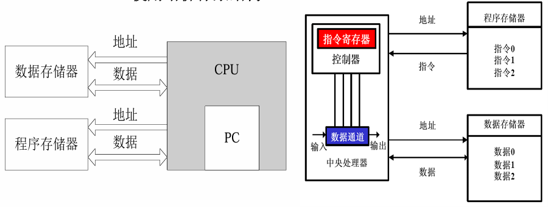

##  ARM微处理器的特点

ARM 微处理器的特点均围绕 “RISC（精简指令集）架构” 设计，核心是 “高效、精简、适配嵌入式场景”

1. 体积小、低功耗、低成本、高性能
2. 支持 Thumb（16 位）/ARM（32 位）双指令集，兼容 8/16 位器件
3. 大量使用寄存器，指令执行速度更快
4. 大多数数据操作都在寄存器中完成
5. 寻址方式灵活简单，执行效率高
6. 指令长度固定


----


## ARM体系结构版本

主要是v1~v4

### V1 版架构

- **26 位**寻址空间（64MB），无乘法指令
- 仅支持基础数据处理、Load/Store 存储指令、子程序调用及 SWI 软件中断，无复杂扩展功能。

### V2 版架构

- 新增乘法、乘加指令
- 快速中断模式
- 新增 SWP/SWPB（存储器与寄存器交换）指令；
- 其中，ARM3引入片上Cache

### V3 版架构

- 从 26 位升级为 **32 位**（4GB）
- 新增 CPSR（当前程序状态寄存器）和 SPSR（异常状态保存寄存器）
- 新增 MRS/MSR 指令，用于访问 CPSR/SPSR
- 新增中止、未定义两种异常模式

### V4 版架构

- 应用最普遍的 32 位基础架构，奠定双指令集基础
- 双指令集：新增 T 变种，支持 **16 位 Thumb 指令集**（代码密度提升 30%），兼容 ARM（32 位）/Thumb（16 位）切换
- 符号化 / 非符号化半字、符号化字节的存 / 取指令
- SWI 软件中断功能
- 不再强制兼容 26 位地址空间

### 总结

| 版本 | 核心里程碑    | 关键功能                    | 代表处理器     | 现状         |
| ---- | ------------- | --------------------------- | -------------- | ------------ |
| V1   | 原型架构      | 基础数据处理、26 位寻址     | ARM1           | 原型未商用   |
| V2   | 引入 Cache    | 乘法指令、快速中断          | ARM2、ARM3     | 已废弃       |
| V3   | 32 位寻址     | CPSR/SPSR、新增异常模式     | ARM6           | 已废弃       |
| V4   | 双指令集      | Thumb 指令集、32 位通用架构 | ARM7、ARM9     | 应用最广     |
| V5   | DSP/Java 优化 | Jazelle、增强 DSP 指令      | ARM10、Xscale  | 广泛应用     |
| V6   | 多媒体加速    | SIMD、媒体扩展              | ARM11          | 消费电子主力 |
| V7   | Thumb-2/NEON  | 混合指令集、多媒体性能飞跃  | Cortex-A/R/M   | 32 位主流    |
| V8   | 64 位支持     | AArch64、A64 指令集         | Cortex-A53/A57 | 高端场景主流 |


## Thumb-2 指令集

- V7 版架构开始

Thumb-2 不是 “替换” 传统 Thumb，而是 “扩充和优化”，核心是 “混合 16 位 + 32 位指令，无需状态切换”：

| 升级方向                       | 具体动作                                                     | 解决的问题                                      | 实际价值                                                   |
| ------------------------------ | ------------------------------------------------------------ | ----------------------------------------------- | ---------------------------------------------------------- |
| 1. 保留并优化 16 位 Thumb 指令 | 新增部分 16 位指令，专门优化程序执行流程（如分支、跳转、条件判断） | 传统 Thumb 执行流程类指令效率低的问题           | 基础流程类代码仍保持高代码密度，不额外占用空间             |
| 2. 新增 32 位 Thumb 指令       | 补充能实现 ARM 指令专有功能的 32 位指令（如访问协处理器、执行特权指令、操作特殊功能寄存器） | 传统 Thumb 无法处理复杂硬件控制、特权操作的局限 | 复杂功能无需切回 ARM 状态，直接用 Thumb-2 的 32 位指令完成 |
| 3. 指令集融合设计              | 16 位和 32 位指令统一在 Thumb-2 框架下，CPU 可自动识别执行，无需手动切换 ARM/Thumb 状态 | 频繁状态切换的性能损耗问题                      | 彻底消除切换成本，代码密度和性能同时提升                   |

- **代码密度不打折**；执行性能显著提升；功能完整性

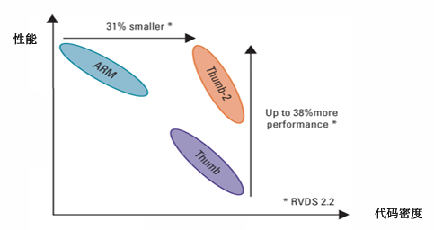


## ARM指令集（A32/T32/A64）

> [!tip]
>
> - **AArch32**：不是指令集，而是 ARMv8 架构中 “兼容 32 位指令集的执行环境”，A32 和 T32 都运行在这个环境下；
> - **AArch64**：ARMv8 架构中 “64 位指令集的执行环境”，仅运行 A64 指令集；
> - 核心关系：ARMv8 架构同时支持 AArch32（跑 A32/T32）和 AArch64（跑 A64），兼顾 32 位兼容和 64 位升级。

| 对比维度    | A32（ARM）                            | T32（Thumb）                            | A64                            |
| ----------- | ------------------------------------- | --------------------------------------- | ------------------------------ |
| 位宽 / 长度 | 32 位固定                             | 初期 16 位固定，Thumb-2 后 16+32 位混合 | 64 位固定                      |
| 执行环境    | AArch32（ARMv8）/32 位架构            | AArch32（ARMv8）/32 位架构              | AArch64（仅 ARMv8 及以上）     |
| 核心优势    | 执行效率最高、功能最完整              | 代码密度高（Thumb-2 兼顾性能）          | 64 位寻址、高性能并行运算      |
| 核心局限    | 代码体积大                            | 传统版本功能 / 性能受限                 | 不兼容 32 位（需切换执行环境） |
| 典型架构    | ARMv3-Armv7（核心）、ARMv8（AArch32） | ARMv4-Armv7（核心）、ARMv8（AArch32）   | ARMv8 及以上（AArch64）        |


## IP 核、软核、硬核、固核

IP（Intellectual Property）核是具备特定功能、可复用的 “**预制电路模块**”，就像芯片设计中的 “标准化零件”

IP核模块有行为（Behavior）、结构（Structure）和物理（Physical）三级不同程度的设计，对应描述功能行为的不同分
为三类，即软核（Soft IP Core）、完成结构描述的固核 （Firm IP Core）和基于物理描述并经过工艺验证的硬核（Hard IP Core）

| 对比维度   | 软核（Soft IP Core）           | 固核（Firm IP Core）           | 硬核（Hard IP Core）       |
| ---------- | ------------------------------ | ------------------------------ | -------------------------- |
| 交付形式   | HDL 文本（Verilog/VHDL）       | 门级网表                       | 物理版图 + 工艺文件        |
| 设计深度   | RTL 级（仅功能描述）           | 门级（逻辑结构确定）           | 物理级（布局布线确定）     |
| 灵活性     | 极高（可修改逻辑、多工艺适配） | 中等（不可改逻辑，可适配工艺） | 极低（不可修改，固定工艺） |
| 后续工作量 | 大（需门级综合 + 物理实现）    | 中等（仅需物理实现）           | 小（直接集成量产）         |
| 性能确定性 | 低（需自行验证时序 / 功耗）    | 中（已做时序仿真）             | 高（经过工艺验证）         |
| 典型场景   | 定制化芯片、多工艺适配         | 中端芯片、平衡灵活与效率       | 量产芯片、高速 / 成熟模块  |


## 专有名词

1. ARM（Advanced RISC Machines）：先进精简指令集计算机

2. MMU：Memory Management Unit，内存管理单元

3. MPU：Memory Protection Unit，内存保护单元

4. TCM ：Tightly Coupled Memory，紧耦合内存

   - TCM 与 Cache 的核心区别
   
     | 对比维度   | TCM（紧耦合内存）                   | Cache（高速缓存）                  |
     | ---------- | ----------------------------------- | ---------------------------------- |
     | 访问确定性 | 100% 无延迟（固定物理地址直接访问） | 不确定（命中则快，缺失需访问内存） |
     | 地址特性   | 有明确物理地址                      | 无固定地址（动态缓存内存数据）     |
     | 硬件资源   | 占用少（仅需专用 BUS + 存储单元）   | 占用多（需缓存控制器 + 替换算法）  |
     | 用途       | 存储实时关键数据（中断向量表）      | 临时缓存高频访问的普通数据         |


## ARM微处理器结构

   ARM 微处理器的结构核心是**RISC（精简指令集）架构**，核心逻辑是 “精简指令、优化执行效率”

- **CISC（复杂指令集）**：追求 “单条指令完成复杂操作”，不断新增专用复杂指令
- **RISC（精简指令集）**：仅保留 20% 高频使用的基础指令，通过简单指令组合实现复杂功能
  - 单周期指令执行；Load/Store 专属数据传输；硬布线逻辑实现；**精简指令**与寻址方式；指令格式固定；优化编译支持

| 对比维度     | RISC（精简指令集）                                        | CISC（复杂指令集）                                         |
| ------------ | --------------------------------------------------------- | ---------------------------------------------------------- |
| 指令集设计   | 指令数量少、功能基础，通过组合实现复杂操作；指令长度固定  | 指令数量多、功能复杂（单指令完成多步操作）；指令长度不固定 |
| 执行效率     | 单指令执行快（1 个机器周期），整体吞吐率高                | 复杂指令执行慢（多个机器周期），指令执行效率不均衡         |
| 流水线支持   | 指令格式统一，流水线每周期可推进 1 步，并行性好           | 指令格式多变，流水线易阻塞，并行优化难度大                 |
| 寄存器配置   | 更多通用寄存器（如 ARM 有 31 个通用寄存器），减少内存访问 | 专用寄存器多，通用寄存器少，频繁依赖内存数据               |
| 数据处理方式 | 仅 Load/Store 指令操作内存，其余运算在寄存器内完成        | 指令可直接处理内存数据，无需依赖寄存器中转                 |
| 芯片复杂度   | 电路设计简单，芯片面积小、功耗低                          | 电路设计复杂，芯片面积大、功耗高                           |


### 流水线

流水线技术是嵌入式处理器（尤其是 RISC 架构 ARM）提升性能的核心技术，核心是 “指令重叠执行”，通过时间复用硬件资源提高系统吞吐率

- 本质是**准并行处理技术**：程序执行时，多条指令的不同步骤 “重叠进行”
- 核心是**时间重叠**：在顺序指令流中，让完成一条指令的各个硬件部件在时间上交替工作，同时服务于不同指令；
- 关键是**资源独立**：每条指令的不同步骤必须使用完全不同的硬件资源

> [!tip]
>
> 1. **尽早启动原则**：前一个任务的某一步骤结束后，下一个任务立即启动该步骤，不浪费硬件空闲时间；
> 2. **资源独占性**：多个任务同时执行，但必须使用不同的硬件资源，避免冲突；
> 3. **不提升单个任务效率**：流水线不缩短单个任务的执行时间，只提升**系统吞吐率**；
> 4. **瓶颈决定效率**：流水线的整体速度由 “最慢的步骤” 决定


#### ARM 3 级流水线（取指 - 译码 - 执行）

ARM7 采用的**3 级流水线**是 RISC 架构提升吞吐率的核心设计，核心是 “让 3 条指令的不同阶段重叠执行”

1. **取指（Fetch）**：从存储器中读出指令，存入指令寄存器；
2. **译码（Decode）**：解析指令的操作码、确定操作数来源，为 “执行阶段” 准备控制信号；
3. **执行（Execute）**：完成指令的运算 / 操作，并将结果写回寄存器；

对于单周期指令**单条指令需要 3 个周期完成**，但**每 1 个时钟周期就能完成 1 条指令**即吞吐率为每个周期一条指令

但是多周期指令会出现**流水线阻塞**

- 下图中STR 指令的 “执行阶段” 需要 2 个周期（地址计算 + 数据传送）
- STR 的 “地址计算” 和 “数据传送” 都需要使用**存储器**（地址计算要读内存地址，数据传送要写内存），而**译码和执行阶段也需要访问存储器**—— 存储器是 “不可同时共享的资源”，因此 STR 执行时，后续指令的 “译码和执行" 操作无法进行，导致流水线暂停。

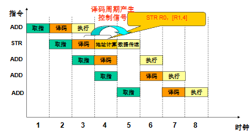

#### ARM的5级流水线

ARM9 是**5 级流水线**（取指→译码→执行→缓存→写回）

- 增加了I-Cache和D-Cache，把存储器的取指与数据存取分开
- 增加了数据写回的专门通路和寄存器
- 其中将原本三段流水的读寄存器从“执行”阶段移动到译码阶段，同时将写回作为一个独立的阶段，并且在执行和写回直接加入访存阶段专门用于Load或Store

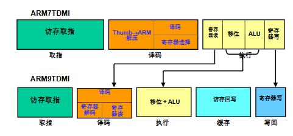

### ARM流水线的设计问题

ARM7 的 3 级流水线（取指→译码→执行）容易 “阻塞 / 间断”，比如多周期指令（如 STR）会抢存储器资源，导致后续指令没法取指 —— 这会让流水线 “卡壳”，降低每时钟周期完成的指令数（即吞吐量）。

解决方法：缩短程序执行时间、解决流水线相关问题


#### 缩短程序执行时间

程序执行时间的公式是：`时间 = 指令数 × CPI（每条指令平均周期数） ÷ 时钟频率`

- **提高时钟频率**（fclk）：把流水线拆成更多级（比如 3 级→5 级），让每一级的逻辑更简单，将每一级的处理时间变短，就能把时钟频率调得更高
- **降低 CPI**（每条指令的平均周期数）：降低 CPI，就得减少流水线阻塞则需要解决流水线的 “相关问题”


#### 解决流水线的 3 类 “相关问题”

**结构冒险**：多条指令抢同一个硬件

- 指令 Cache 和数据 Cache 分开
- 给 ALU 加**单独的加法器**，专门算内存地址

**数据冒险**：一条指令需要前一条的结果，但前一条还没执行完

- **旁路技术**（转发）
- **流水线互锁**（冒泡）

**控制冒险**：遇到`B`（跳转）指令，PC 跳转到新地址，流水线里已经取好的指令就没用了

- **延时分支**（延迟槽）
- **提前算分支地址**
- **分支预测**

### 超标量执行

一个时钟周期同时执行**多条指令**（比如 Cortex-A 系列），方法是装多套执行部件（多个 ALU、移位器）。

- 超标量处理机必须有两条或两条以上能够同时工作的指令流水线
- 动态地检查指令相关性
- 有分支指令,必须将分支被执行和分支不被执行这两种情况分开考虑


## ARM微处理器的寄存器结构

ARM 寄存器结构的核心是 “**分组管理 + 模式专属**”——37 个寄存器按功能和处理器模式划分，既保证模式切换时的状态隔离，又通过共用寄存器减少硬件开销

寄存器整体分类（37 个，均为 32 位）

- 通用寄存器（31 个）：存储数据、地址或指令地址，包含程序计数器（PC，R15），是指令执行的核心数据载体。
- 状态寄存器（6 个）：记录 CPU 的工作状态（如执行模式、中断禁止状态）和程序运行状态（如运算结果的正负、零标志）

ARM 的 7 种处理器模式（用户、系统、管理、中止、未定义、外部中断、快速中断）对应不同的寄存器组（BANK）

- **可访问寄存器数量固定**：任意模式下，都能直接访问 **15 个通用寄存器（R0~R14）**、1~2 个状态寄存器和 PC（R15），共 17~18 个寄存器
- **寄存器分 “共用” 和 “专属”**：部分寄存器（如 R8~R14 的部分分组、SPSR）是特定模式专属


## ARM微处理器的工作状态

ARM 处理器的**两种工作状态（ARM/Thumb）** 以及**状态切换规则**，这是 ARM 架构适配嵌入式场景 “性能 + 存储” 平衡的关键设计

两种工作状态：

| 工作状态   | 执行指令集         | 指令长度        | 核心特点                                                     | 适用场景                                             |
| ---------- | ------------------ | --------------- | ------------------------------------------------------------ | ---------------------------------------------------- |
| ARM 状态   | 32 位 ARM 指令集   | 32 位（4 字节） | 指令功能完整（支持所有 ARM 操作）、执行效率高                | 复杂运算（如乘法、中断处理）、需要全功能指令的场景   |
| Thumb 状态 | 16 位 Thumb 指令集 | 16 位（2 字节） | 指令是 ARM 的功能子集（无部分复杂指令）、存储开销小（省 50% 空间） | 简单控制逻辑（如循环、条件判断）、存储资源紧张的场景 |

> [!tip]
>
> ARM 处理器**总是从 ARM 状态启动**（上电 / 复位后默认 ARM 状态），运行过程中可通过**指令或异常处理**切换，具体规则如下：其中异常处理总是从当前状态切换为`ARM`状态执行异常服务程序
>
> 1. 进入 Thumb 状态（从 ARM→Thumb）
>
> 有两种触发方式，核心是**`BX`指令**：
>
> 方式 1：执行 BX 指令（主动切换）
>
> - 条件：操作数寄存器的**最低位（位 [0]）= 1**；
> - 举例：`MOV R0, #0x123 ; 让R0的位[0]=1（0x123是奇数）` → `BX R0`；
> - 效果：处理器立即切换到 Thumb 状态，开始执行 16 位 Thumb 指令。
>
> 方式 2：异常处理返回（被动切换）
>
> - 场景：处理器原本在 Thumb 状态，触发了异常
> - 逻辑：异常处理时会先切回 ARM 状态执行异常服务程序，**异常处理完成返回时**，自动切回 Thumb 状态。
>
> 2. 进入 ARM 状态（从 Thumb→ARM）
>
> 同样有两种方式，核心也是`BX`指令：
>
> 方式 1：执行 BX 指令（主动切换）
>
> - 条件：操作数寄存器的**最低位（位 [0]）= 0**；
> - 举例：`MOV R0, #0x122 ; 让R0的位[0]=0（0x122是偶数）` → `BX R0`；
> - 效果：处理器立即切换到 ARM 状态，开始执行 32 位 ARM 指令。
>
> 方式 2：触发异常处理（被动切换）
>
> - 场景：无论处理器当前是 ARM 还是 Thumb 状态，只要触发异常；
> - 逻辑：异常发生时，处理器会自动切换到 ARM 状态，把 PC 指针存入异常模式的链接寄存器（LR），并从异常向量地址（如 0x00000008）开始执行 ARM 指令的异常服务程序。


## ARM体系结构的存储器格式

ARM 体系结构的存储器格式核心围绕 “4GB 寻址空间 + 字节存储单位 + 字组织方式 + **两种端模式**” 展开，核心是解决 “多字节数据（字 / 半字）在内存中的排列顺序” 问题

1. 存储空间：
   - 地址线共 32 条，寻址空间为 `2^32`字节，即 4GB（0x00000000~0xFFFFFFFF）。
   - 地址按字节递增排列，每个字节对应唯一的 32 位地址（如 0x00000000、0x00000001 等）。
2. 存储单位与组织
   - 基本单位：字节（8 位），是**存储器读写的最小单位**。
   - 存储组织：字（32 位），由连续 4 个字节组成（地址为 A、A+1、A+2、A+3），且字的起始地址必须是 4 的倍数（如 0x00000000、0x00000004），这是 ARM 指令对齐的基本要求。

大端模式（Big-Endian）

- 高字节数据存放在低地址，低字节数据存放在高地址（“高位在前，低位在后”）。
- 若要存储 32 位数据 0x12345678（B3=0x12、B2=0x34、B3=0x56、B0=0x78）
  - 地址 A：存储 0x12（B3）
  - 地址 A+1：存储 0x34（B2）
  - 地址 A+2：存储 0x56（B1）
  - 地址 A+3：存储 0x78（B0）

小端模式（Little-Endian）

- 低字节数据存放在低地址，高字节数据存放在高地址（“低位在前，高位在后”），是 ARM 处理器最常用的模式。
- 存储 32 位数据 0x12345678（B3=0x12、B2=0x34、B3=0x56、B0=0x78）：
  - 地址 A：存储 0x78（B0）
  - 地址 A+1：存储 0x56（B1）
  - 地址 A+2：存储 0x34（B2）
  - 地址 A+3：存储 0x12（B3）


### 指令长度及数据类型

ARM处理器指令长度是32位（ARM状态）和16位（Thumb状态）。

ARM 支持 3 类、6 种存储数据类型，核心是 “字节 / 半字 / 字”，每种都有对齐要求：

| 数据类型 | 位数  | 有 / 无符号 | 对齐要求（地址必须是它的倍数）                      |
| -------- | ----- | ----------- | --------------------------------------------------- |
| 字节     | 8 位  | 有 / 无符号 | 无强制对齐（但实际按 1 字节对齐）                   |
| 半字     | 16 位 | 有 / 无符号 | 必须按 2 字节对齐（地址是 2 的倍数，如 0x00000002） |
| 字       | 32 位 | 有 / 无符号 | 必须按 4 字节对齐（地址是 4 的倍数，如 0x00000004） |

ARM 的指令长度和状态有关，**必须严格对齐，否则会触发异常**：

- “数据对齐” 是指**访问数据的地址必须是数据长度的整数倍**
- **ARM 状态（32 位指令）**：指令是 “字”，必须按 4 字节对齐（地址是 4 的倍数）；**Thumb 状态（16 位指令）**：指令是 “半字”，必须按 2 字节对齐（地址是 2 的倍数）。


### 存储管理单元（MMU）

MMU用于在CPU和物理内存之间进行**地址转换**；也就是内存映射

**内存映射**：将地址从逻辑空间映射到物理空间的过程

- 将虚地址转换成物理地址。
- 控制内存的访问权限

MMU关闭时，虚地址直接输出到物理地址总线。

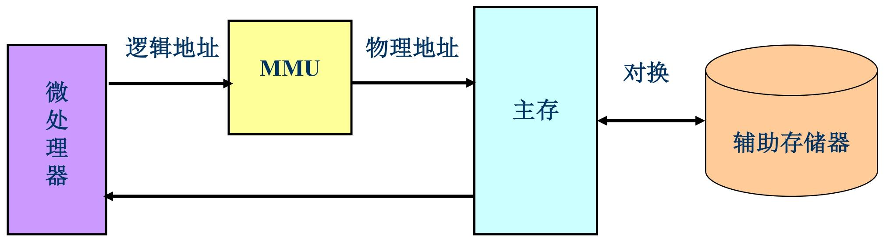


#### MMU的页式存储管理

MMU 页式存储管理，核心是 “把虚拟 / 物理内存切成等大的‘页’，用页表做地址映射，再用 TLB 加速查询”

| 术语           | 通俗解释                                                     | ARM920T 关键参数                                        |
| -------------- | ------------------------------------------------------------ | ------------------------------------------------------- |
| 虚拟页         | 虚拟地址空间被切分的固定大小块（程序 “看到” 的内存块）       | 支持 4 种大小：1MB/64KB/4KB/1KB                         |
| 物理页（页帧） | 物理内存被切分的固定大小块（实际的内存硬件块），大小和虚拟页完全一致 | 与虚拟页一一对应（如 4KB 虚拟页对应 4KB 物理页）        |
| 页表           | 存放在物理内存中的 “映射字典”，每个 “页表项” 对应 1 个虚拟页，记录映射关系 | 分一级 / 二级页表，一级页表基地址存在 CP15-C2 寄存器    |
| 页表项         | 页表的最小单位，核心内容：虚拟页→物理页的地址映射、访问权限、Cache 特性 | 32 位大小，包含地址位、权限位、C/B 位（Cache / 写缓冲） |
| TLB（快表）    | 缓存 “最近用的页表项” 的高速硬件，解决页表查询慢的问题       | 容量 8~16 字，访问速度≈CPU 通用寄存器                   |

- 在ARM系统中，使用协处理器CP15的寄存器C2来保存一级页表的基地址。

> [!tip]
>
> 页式存储管理的工作流程
>
> 1. 地址切分 —— 虚拟地址拆成 “页号 + 页内偏移”
> 2. 查 TLB—— 先找高速缓存的页表项
> 3. 查页表 —— 从内存找映射关系
> 4. 权限 / 缓冲检查 —— 最后一道安全关卡
> 5. 访问物理内存 —— 完成最终读写


#### 协处理器 CP15

协处理器 CP15 是 ARM 架构中**专门负责系统级配置与管理的硬件模块**，相当于处理器的 “控制面板”—— 所有和 MMU、Cache、内存权限相关的核心参数，都通过 CP15 的寄存器来设置。

| 寄存器                     | 核心作用（考点）                                             | 典型操作                                                     |
| -------------------------- | ------------------------------------------------------------ | ------------------------------------------------------------ |
| **C1（控制寄存器）**       | 1. 使能 / 禁止 MMU（位 [0]：置 1 启用 MMU，置 0 进入平板模式）；2. 开关 Cache（位 [2]/ 位 [3]）；3. 开关写缓冲器（位 [4]） | 启用 MMU：`MCR p15, 0, R0, c1, c0, 0`（R0 的位 [0] 置 1）    |
| **C2（页表基地址寄存器）** | 保存**一级页表的物理基地址**（MMU 查页表的起点），必须是 16KB 对齐（因为一级页表占 16KB） | 设置页表地址：`MCR p15, 0, R0, c2, c0, 0`（R0 存一级页表物理地址） |
| **C3（域访问控制寄存器）** | 将内存划分为 16 个 “域”，每个域用 2 位设置权限（如 “无访问 / 客户级 / 管理级”），实现内存区域的分组管控 | 设置域权限：`MCR p15, 0, R0, c3, c0, 0`（R0 的每 2 位对应一个域的权限） |
| **C5（失效状态寄存器）**   | 指示内存访问失效的原因（如 “权限违规”“地址未对齐”），用于异常处理时定位问题 | 读取失效原因：`MRC p15, 0, R0, c5, c0, 0`                    |
| **C6（失效地址寄存器）**   | 保存 “触发内存访问失效的虚拟地址”，帮助定位是哪个地址违规访问 | 读取失效地址：`MRC p15, 0, R0, c6, c0, 0`                    |
| **C8（TLB 操作寄存器）**   | 控制 TLB 的清空（如清空所有 TLB 项、清空指定虚拟地址的 TLB 项），进程切换时必须清空 TLB | 清空所有 TLB：`MCR p15, 0, R0, c8, c7, 0`                    |
| **C10（TLB 锁定寄存器）**  | 锁定 TLB 中的部分项（防止被替换），用于加速高频访问的页表项（如内核页表） | 锁定 TLB 项：`MCR p15, 0, R0, c10, c0, 0`                    |


#### 使能/禁止MMU

协处理器CP15的寄存器C1的位[0]用于设置禁止/使能MMU。C1位[0]=0时，禁止MMU；C1[0]=1时，使能MMU

```assembly
MRC P15, 0, R0, C1, 0, 0  #读取CP15的C1寄存器值到R0
ORR R0, #0x1  #ORR是按位或指令
MCR P15, 0, R0, C1, 0, 0  #R0写回CP15的C1寄存器
```

使能 MMU 后，内存访问的完整流程:

1. **查 TLB（快表）**:在高速缓存 TLB 中找当前虚拟地址的映射关系
2. **查页表**：MMU 到物理内存中找页表（一级→二级）
3. **更新 TLB**：把查到的页表项存入 TLB（如果 TLB 已满，会按 “淘汰算法” 替换掉最不常用的项）

禁止MMU时，存储器按如下处理：

1. **Cache / 写缓冲可选**：根据具体情况，确定是否允许cache和写缓冲器。
2. **权限 / 异常失效**
3. **地址直接映射**：虚地址就是物理地址，此时使用**平板存储模式**。

---

#### MMU 地址变换过程

核心是 “**按内存块大小分级映射**”—— 以 “段 / 大页 / 小页 / 极小页” 为单位，通过一级 / 两级页表完成虚拟地址到物理地址的转换

| 存储块类型          | 大小 | 页表层级                     | 核心特点                             |
| ------------------- | ---- | ---------------------------- | ------------------------------------ |
| 段（Section）       | 1MB  | 仅一级页表                   | 最快（少一级查表），适合大块内存映射 |
| 大页（Large Page）  | 64KB | 一级 + 二级页表（粗页）      | 中等粒度，兼顾灵活与效率             |
| 小页（Small Page）  | 4KB  | 一级 + 二级页表（粗 / 细页） | 细粒度，适合碎片化内存               |
| 极小页（Tiny Page） | 1KB  | 一级 + 二级页表（细页）      | 最细粒度，仅细页二级表支持           |

- 一级页表：包含**段描述符、粗页描述符、细页描述符**。
- 二级页表有**粗页、细页**2种形式。
- 以段为单位的地址变换只需要一级页表
- 二级页表：包含**大页、小页、极小页**的描述符。以页为单位的地址变换过程需要二级页表。其中粗页只有大页和小页

##### 一级页表地址变换

```plaintext
一级页表项地址 = CP15-C2高18位 + 虚拟地址高12位 + 00（2位0，字对齐）
			= 一级页表基地址（18位）+ 一级页表偏移量（12位）+ 00（字对齐）
```

首先一级页表需要 4096 个描述符（4K 个）即一级页表偏移量（12位）

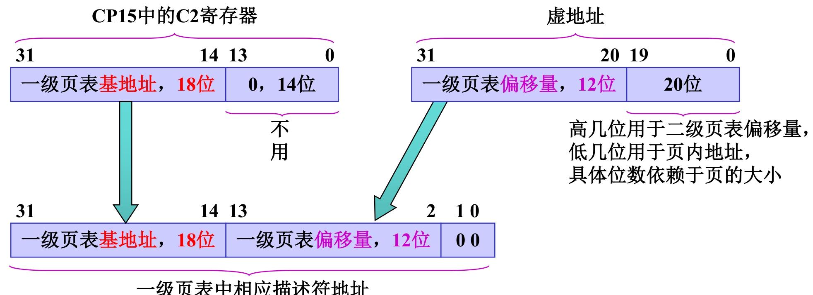

---

##### 页表和描述符

- **页表**：一段连续的物理内存，里面按顺序存放若干个 32 位的 “描述符”（每个描述符占 1 个字），是 MMU 做地址转换的 “字典”；
- **描述符**：页表中的最小单元（32 位），每个描述符对应一段虚拟地址，包含 “物理地址基址、类型标识、访问权限、缓存特性” 四大核心信息，是地址转换的 “最小依据”；
- **层级逻辑**：一级页表是 “总字典”（管 1MB 粒度），二级页表是 “子字典”（管 64KB/4KB/1KB 粒度），描述符是字典里的 “词条”。

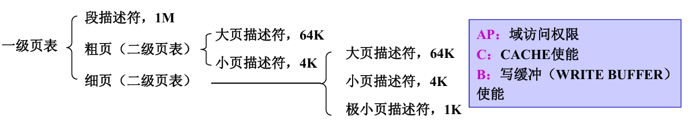

一级页表：

- 段描述符：直接映射 1MB，无需二级页表（最快）；
- 粗页 / 细页描述符：不直接映射物理地址，只告诉 MMU “二级页表的位置”，需继续查二级页表（更灵活）；
- 所有一级描述符的核心识别标志是**bit1~bit0**：00 = 无效、01 = 粗页、10 = 段、11 = 细页。

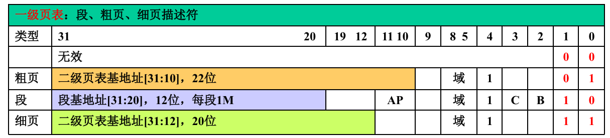

二级页表

- 所有二级描述符的核心识别标志也是**bit1~bit0**：00 = 无效、01 = 大页、10 = 小页、11 = 极小页（仅细页）；
- 基地址的 “对齐要求”：大页 64KB（低 16 位 0）、小页 4KB（低 12 位 0）、极小页 1KB（低 10 位 0），错一位就会映射错误。

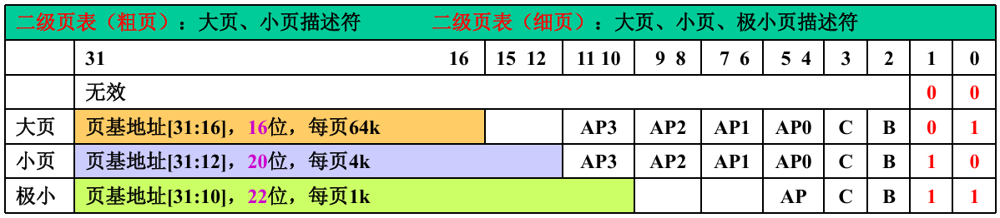

---

##### 段地址变换

- 段地址变换是 ARM MMU 中最简单、最快的地址转换方式（仅需一级页表，无需二级页表）
- 核心是 “**用 12 位段基地址 + 20 位段内偏移**” 拼接物理地址；
- 12 位 = 2¹²，对应 4096 个 1MB 物理段（4096×1MB=4GB），刚好覆盖 32 位物理地址空间；


1. 确定一级页表基地址（从 CP15-C2 寄存器读取）；计算一级页表偏移量（从虚拟地址提取）
2. 计算段描述符的物理地址（一级页表项地址）

```plaintext
段描述符地址 = 一级页表基地址（C2高18位） + 一级页表偏移量（12位）<<2 + 00（2位0，字对齐）
```

3. 读取段描述符，提取核心信息（**段基地址**+**属性校验**）
4. 提取段内地址，拼接最终物理地址

```plaintext
物理地址 = 段基地址（12位，bit31~20） + 段内地址（20位，bit19~0）
```

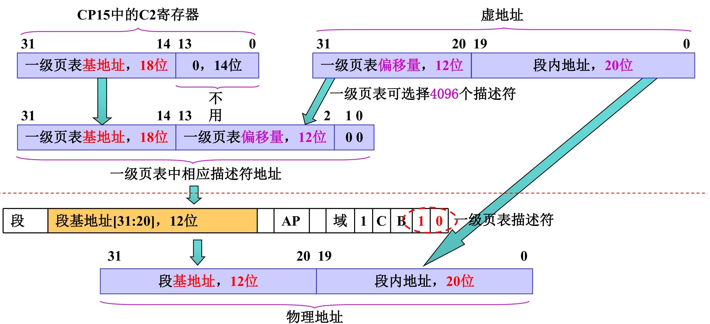


##### 粗页二级页表地址变换

大页64K

通过一级页表找到 22 位粗页二级页表基地址，再用虚拟地址中间 8 位定位 64KB 大页描述符，最终拼接 **“16 位物理页基地址 + 16 位页内偏移”**得到物理地址

1. 计算一级页表中 “粗页描述符” 的地址，然后读取一级页表 “粗页描述符”，提取**粗页二级页表基地址**和**属性校验**
2. 计算二级页表 “64KB 大页描述符” 的地址，读取二级页表 “64KB 大页描述符”，得到64KB 大页物理基地址和属性校验

```plaintext
二级页表项地址 = 粗页二级页表基地址（描述符[31:10]） + 二级页表偏移量（虚拟地址[19:12]）<<2 + 00（bit1~0）
```

3. 提取虚拟地址中的 “页内偏移”;拼接最终物理地址

```plaintext
物理地址 = 64KB大页物理基地址（描述符[31:16]） + 页内偏移（虚拟地址[15:0]）
```

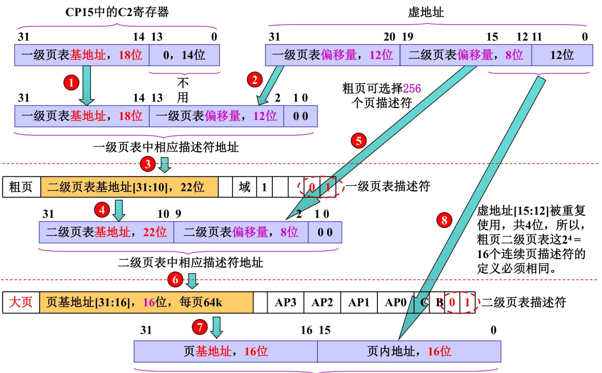

小页4K

不同于大页的基地址，小页4K的基地址有20位

同时`256 个描述符 × 4KB（小页）= 1024KB = 1MB`，刚好 “填满” 一级粗页项覆盖的 `1MB` 虚拟地址；

所以小页的物理地址：

```plaintext
物理地址 = 小页物理基地址（描述符[31:12]） + 页内偏移（虚拟地址[11:0]）
```


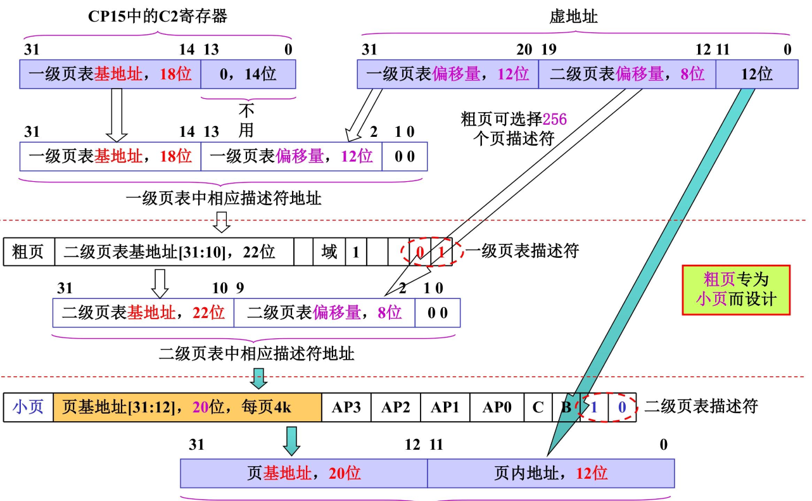


##### 细页二级页表地址变换

大页64K

1. 其中一级页表地址计算和上述一致
2. 读取一级 “细页描述符”，提取二级页表基地址；计算二级页表中 “64KB 大页描述符” 的地址

```plaintext
二级页表项地址 = 细页二级页表基地址（描述符[31:12]） + 二级偏移量（虚拟地址[19:10]）<<2 + 00（bit1~0）
```

3. 不同于粗页可选择256个页描述符即二级页表偏移量只有`8`位，细页可选择1024个页描述符所以偏移量有`10`位
4. 读取二级 “大页描述符”，提取物理页基地址；提取虚拟地址 “页内偏移”

```plaintext
物理地址 = 大页物理基地址（描述符[31:16]） + 页内偏移（虚拟地址[15:0]）
```

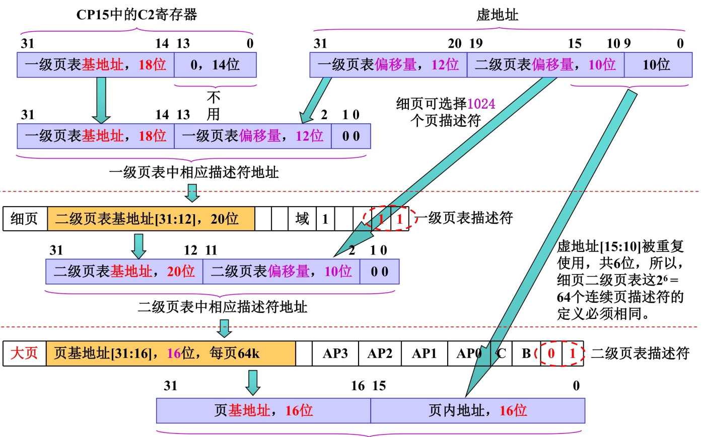

小页4K

不同于大页的地方在于最后物理地址的拼接，仅仅需要虚拟地址的低`12`位即可

```plaintext
物理地址 = 大页物理基地址（描述符[31:10]） + 页内偏移（虚拟地址[11:0]）
```

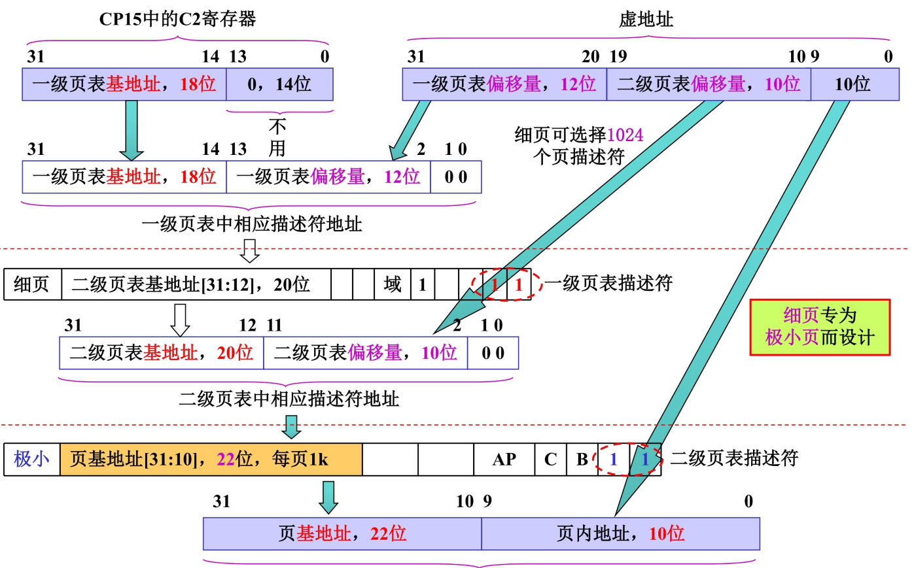

极小页1K

不同于上述两个页表的地方也是物理地址，仅仅仅仅需要虚拟地址的低`10`位即可

所以不会有连续页表描述符相同，细页专为极小页而设计；`1024 个描述符 × 1KB（小页）= 1024KB = 1MB`，刚好 “填满” 一级粗页项覆盖的 `1MB` 虚拟地址；


> [!note]
>
> MMU 地址变换完整流程：**从虚拟地址出发，先通过一级页表判断映射类型，再按 “段 / 粗页 / 细页” 分支完成物理地址拼接**
>
> 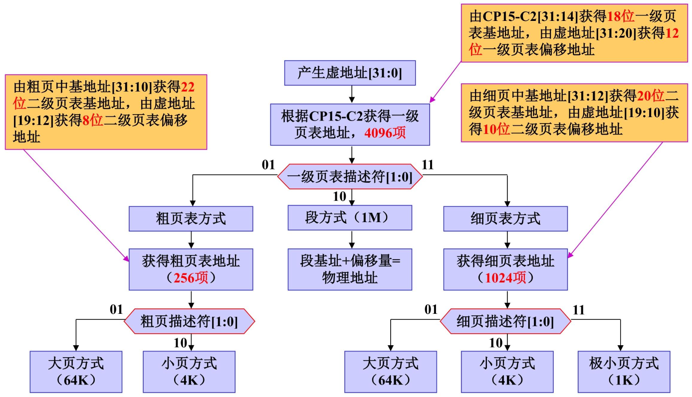


#### MMU中的存储访问权限

ARM920T MMU 的存储权限控制是 “**域（Domain）宏观管控 + AP（访问权限）微观管控**” 的双层逻辑

域是 “第一道门禁”（管 1MB/64KB/4KB 块的整体访问级别），AP 是 “第二道门禁”（管块内的读写 / 用户 / 特权权限）；域权限优先于 AP 权限，域禁止则直接故障，域允许才会检查 AP。

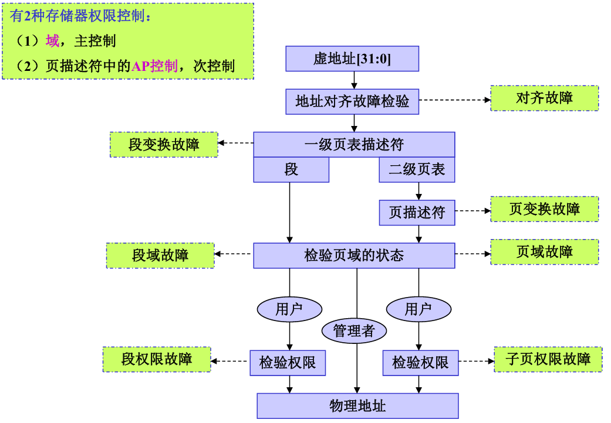

##### CP15-C1 寄存器 S/R/AP 联合逻辑

通过 3 个比特位的组合，差异化管控**特权级（Privileged）** 和**用户级（User）** 对内存的读写权限

| 位段 | 标识       | 全称 / 核心含义       | 作用范围       | 核心特性                                |
| ---- | ---------- | --------------------- | -------------- | --------------------------------------- |
| AP   | 访问权限位 | Access permissions    | 全局内存访问   | 权限管控的核心位，与 S/R 配合生效       |
| S    | 系统位     | Modify MMU SYSTEM     | 特权级权限扩展 | 标记 “系统内存区域”，覆盖 AP 的基础权限 |
| R    | ROM 保护位 | ROM Protection status | 只读内存保护   | 标记 “ROM / 只读区域”，限制写操作       |

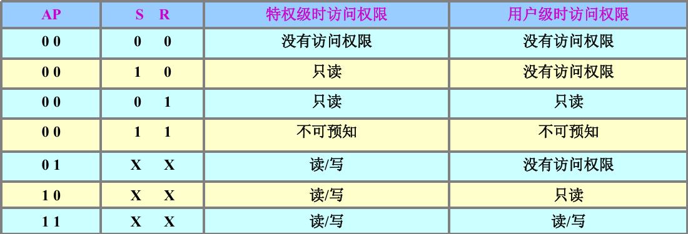

##### MMU 中的 “域（Domain）”

“域是一些段、大页或者小页的集合” → 本质是**内存的 “权限分组标签”**：无需给每个段 / 页单独配置 “是否允许访问”，只需给整个域配置规则，批量管控一组内存；

- ARM 920T支持最多16个域，每个域的访问控制特性都是由CP15中的寄存器C3中的两位来控制的。
- CP15中寄存器C3：每两位控制一个域的访问控制特性

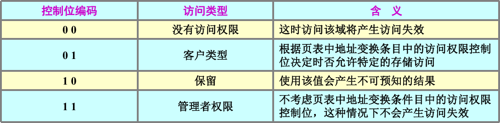

---

### 快表TLB操作

TLB（Translation Lookaside Buffer）直译是 “地址变换旁视缓冲器”，核心是**把近期高频访问的页表映射项（虚拟地址→物理地址 + 权限 / 属性）缓存到 CPU 内部的高速存储单元**，替代每次访问内存查页表的操作

“程序执行具有局部性” 是 TLB 生效的核心前提：

- **时间局部性**：程序近期访问过的内存地址，短时间内大概率会再次访问（比如循环变量、常用函数）；
- **空间局部性**：程序访问的内存地址，大概率集中在某一连续区域（比如数组、结构体）；


### 存储访问失效

存储访问失效是 ARM920T MMU 的 “安全防护机制”—— 当 CPU 发起的内存访问**违反硬件规则**（如地址不对齐、权限不足）时，MMU / 存储系统会主动 “叫停” 这次访问，并**触发异常**，避免错误的内存操作破坏系统数据或导致硬件异常。

- MMU的存储访问失效有4种类型：地址对齐失效、地址变换失效、域控制失效、访问权限控制失效。
- 当发生存储访问失效时，存储系统可以中止3种存储访问：cache内容预取、非缓冲的存储器访问操作、页表访问。

2 种失效检测机制： “存储访问中止（abort）”—— 这是对所有存储访问失效的统一命名。

| 检测机制             | 负责主体                          | 上报方式                                                     | 核心特点                                  |
| -------------------- | --------------------------------- | ------------------------------------------------------------ | ----------------------------------------- |
| MMU 失效机制（内部） | MMU                               | MMU 自己检测到失效后，向 CPU 报告，并把 “失效原因（C5）” 和 “失效地址（C6）” 写入 CP15 寄存器 | 最核心的检测方式，覆盖 90% 以上的失效场景 |
| 外部存储访问中止机制 | 外部存储系统（内存控制器 / 外设） | 外部硬件检测到访问错误（比如访问不存在的物理地址），主动给 CPU 发 “中止信号” | 补充检测，针对 MMU 管不到的外部硬件错误   |

存储访问中止会触发 CPU 的异常（中断），但触发时机分两种，核心取决于 “失效发生在哪个阶段”：

- 如果存储访问发生在数据访问周期，微处理器将产生**数据访问中止异常**。
- 如果存储访问发生在指令预取周期，当该指令执行时，微处理器将产生**指令预取异常**。

MMU中与存储访问失效相关的2 个核心寄存器：C5（失效状态）+ C6（失效地址）


## ARM的处理器模式

ARM 处理器的 7 种工作模式是其 “权限分级 + 异常处理” 的核心设计，所有模式由**当前程序状态寄存器（CPSR）的低 5 位 M [4:0]** 唯一标识，不同模式对应不同的权限、硬件资源访问范围

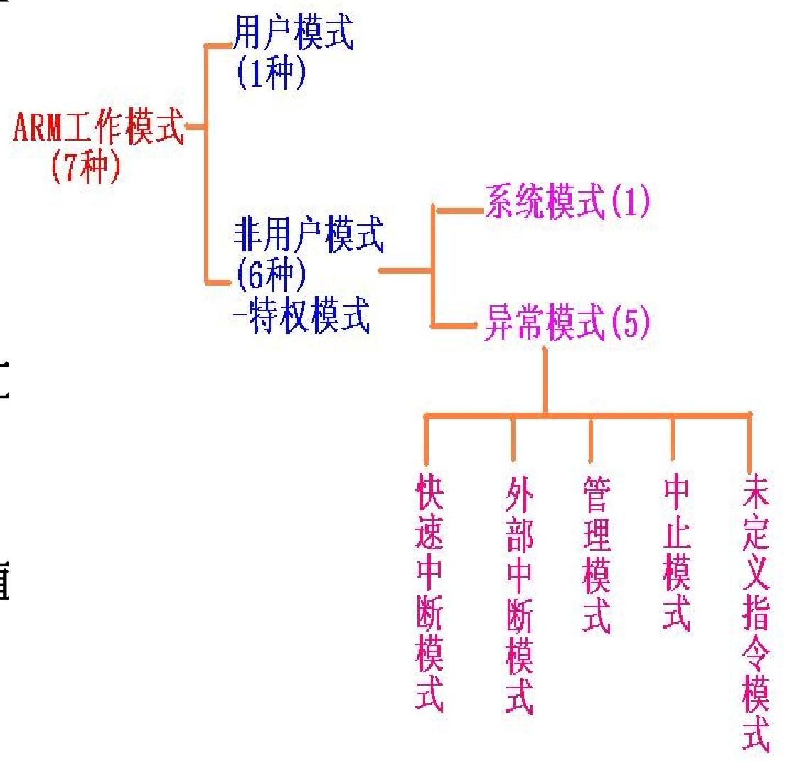

模式切换的两种核心方式：

1. 异常触发（自动切换，所有模式通用）：处理器自动改变CPSR中M[4:0]的值，进入相应的工作模式；
2. 特权模式下主动修改（手动切换，仅特权模式可用）：用指令向CPSR的M[4:0]字段写入特定的值，进入相应的工作模式。

| 处理器模式 | 简称 | 核心用途                                       | 关键备注                                                     | M [4:0]（5 位二进制） | 十进制值 |
| ---------- | ---- | ---------------------------------------------- | ------------------------------------------------------------ | --------------------- | -------- |
| 用户       | usr  | 正常程序执行（如 APP、普通代码）               | 唯一非特权模式，不能直接切换到其他模式                       | 10000                 | 16       |
| 快速中断   | fiq  | 高速数据传输、通道处理（如 DMA、高速外设中断） | FIQ 异常触发时自动进入，硬件上有独立寄存器组，响应速度最快   | 10001                 | 17       |
| 外部中断   | irq  | 通用中断处理（如按键、定时器、普通外设中断）   | IRQ 异常触发时自动进入，最常用的中断模式                     | 10010                 | 18       |
| 管理       | svc  | 操作系统内核运行、系统保护                     | 复位（开机）、软件中断（SWI 指令）时进入，是系统默认的特权模式 | 10011                 | 19       |
| 中止       | abt  | 内存访问失效处理（如地址变换失效、权限失效）   | ARM7TDMI 中用途有限，ARM9 及以上用于虚拟内存 / 存储保护      | 10111                 | 23       |
| 未定义     | und  | 未定义指令、硬件协处理器仿真处理               | 执行非法指令 / 未实现指令时自动进入，用于软件模拟硬件功能    | 11011                 | 27       |
| 系统       | sys  | 操作系统特权任务运行                           | 与用户模式功能几乎一致，但拥有特权（可直接切换模式），专为内核特权任务设计 | 11111                 | 31       |

除用户模式外，其余 6 种均为**特权模式**

处理器启动时的模式转换流程：

1. **复位后默认模式**：开机复位瞬间，硬件自动将 CPU 切换到**管理模式（svc）**（M[4:0]=10011）；
2. **初始化阶段**：在 svc 模式下完成核心初始化：初始化堆栈，配置MMU、Cache、中断控制器等核心硬件（禁止切换到用户模式）
3. 内核通过指令主动修改 CPSR 的 M [4:0] 为 10000，切换到**用户模式**，运行普通应用程序；

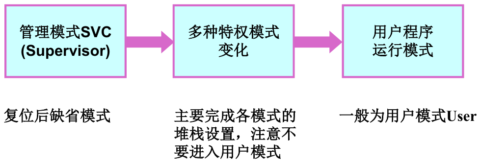


## ARM 处理器寄存器组织

ARM 处理器的 37 个32位寄存器（31 个通用 + 6 个状态）是其核心硬件资源

设计的核心逻辑是 **“按工作模式分组、重叠复用 + 模式专属”** 

| 寄存器类型 | 数量  | 核心包含 / 作用                                              |
| ---------- | ----- | ------------------------------------------------------------ |
| 通用寄存器 | 31 个 | 包含**程序计数器（PC）**（本质是 R15）+ 普通通用寄存器（R0~R14）；用于存放数据、地址、指令地址，是程序运行的 “临时存储区” |
| 状态寄存器 | 6 个  | 核心是**当前程序状态寄存器（CPSR）** + 5 个**保存程序状态寄存器（SPSR）**（fiq/irq/svc/abt/und 模式各 1 个）；用于记录 CPU 状态、模式、标志位、权限等 |

PC（R15）虽然归为 “通用寄存器”，但功能唯一 

ARM 不会为 7 种模式各做一套完整的 37 个寄存器（硬件成本太高），而是采用 **“重叠复用 + 模式专属”** 的分组策略：

- **全局共享寄存器**：所有模式都能访问的寄存器（比如 R0~R7）
- **模式重叠寄存器**：不同模式共享寄存器编号，但物理上是不同的寄存器
- **模式专属寄存器**：仅某一种模式能访问的寄存器，相当于 “专属储物间”。

ARM状态各模式下可以访问的寄存器

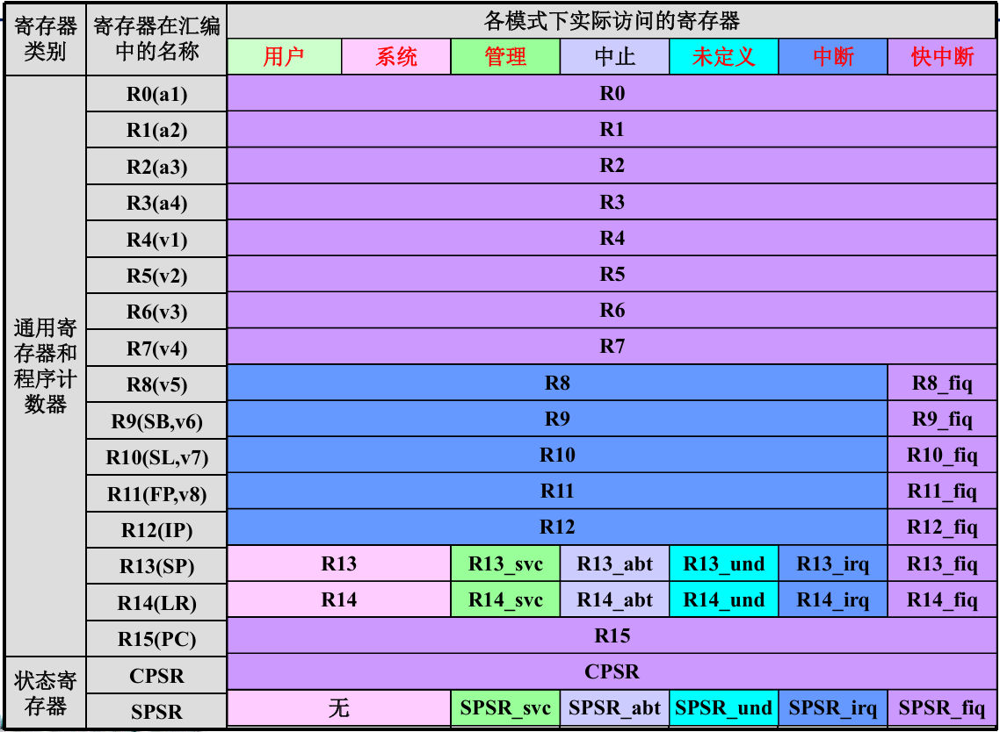

- 在汇编中，`R0~R13`为保存数据或者地址的通用寄存器，可用于任何使用通用寄存器的指令
- 其中`R0～R7`为未分组的寄存器，对于任何处理器模式，`R0～R7`都对应于相同的32位物理寄存器。
- 寄存器`R8～R14`为分组寄存器，其对应的物理寄存器取决于当前处理器模式
- 寄存器`R8～R12`有两个分组的物 理寄存器。一个用于除FIQ模式 之外的所有寄存器模式，另一个 用于FIQ模式。
- 寄存器`R13、R14`分别有6个分组的物 理寄存器。一个用于用户和系统模 式，其余5个分别用于5种异常模式
- 寄存器R13常作为**堆栈指针（SP）**。在ARM指令 当中，没有以特殊方式使用R13的指令或其它功能， 只是习惯上都这样使用。但是在Thumb指令集中有必须使用R13的指令
- R14为**链接寄存器（LR）**，在结构上有两个特殊功能：在每种模式下，模式自身的R14用于保存子程序返回地址；当发生异常时，将异常模式对应的R14设置为异常返回地址（有些异常有一个小的固定偏移量）
- 寄存器R15为程序计数器（PC），它指向正在取指的地址。R15值的改变将引起程序执行顺序的改变
- 所有模式都可以访问当前程序状态寄存器CPSR。
- 每种异常都有自己的保存程序状态寄存器SPSR。


### R14（LR 链接寄存器）

“程序 A 调用程序 B” 场景：

```plaintext
程序A执行 → 执行BL Lable（调用程序B） → 硬件自动把“BL下一条指令的地址”存入LR → 跳转到程序B执行 → 程序B最后把LR的值写入PC → 回到程序A的断点继续执行
```

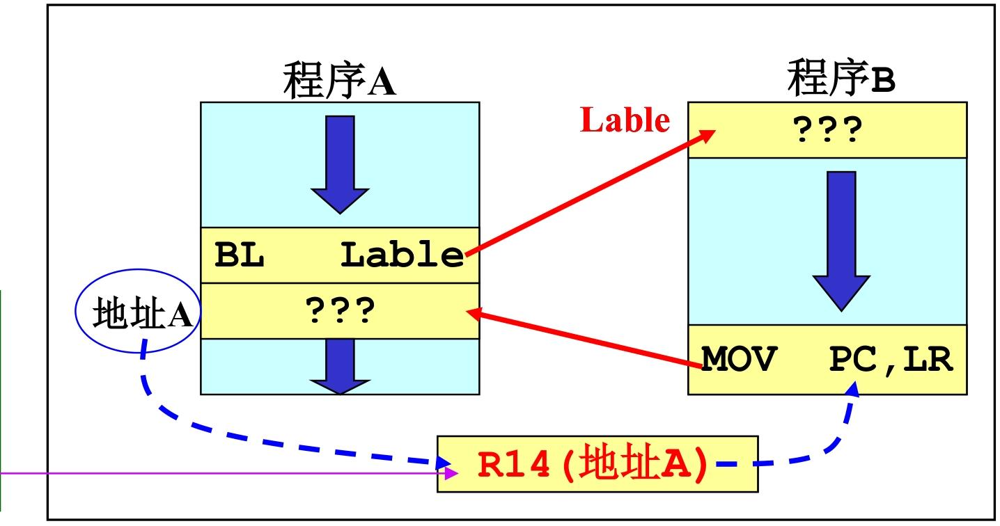

**保存的是 “下一条指令地址”，而非当前 PC**

LR 在异常处理中的作用：和子程序调用 “类似但有差异”

- 异常（如 IRQ 中断、FIQ 中断、内存失效）发生时，LR 的作用逻辑和子程序调用一致（保存返回地址），但有 2 个关键区别：**返回地址需 “减偏移常量”**
- LR 的核心风险：异常嵌套导致的覆盖问题；
  - 每种异常模式只有**一个专属 LR**（如 R14_irq 仅 1 个），若在异常处理程序中重新使能中断（允许嵌套），新异常会直接覆盖该 LR 的原有值，导致旧返回地址丢失。
  - 所以进入异常处理程序后，**立即把专属 LR 压栈保存**：


### Thumb状态下的寄存器组织

直接访问：8个通用寄存器（R7～R0）、程序计数器（PC）、堆栈指针（SP）、连接寄存器（LR）和CPSR。

每种特权模式下都有自己的SP、LR和SPSR

Thumb 和 ARM 状态共享**同一套物理寄存器硬件**，Thumb 只是 “屏蔽了部分寄存器的直接访问”，所有 Thumb 寄存器都直接映射到 ARM 寄存器的对应编号

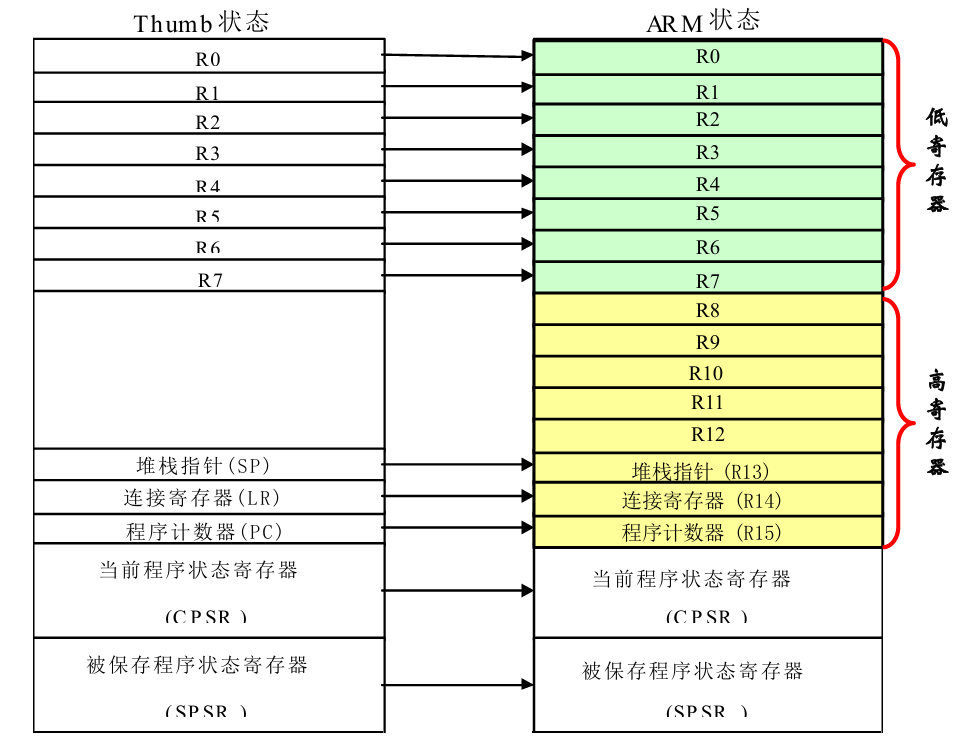

1. 若要访问 R8~R12（ARM 状态的通用寄存器），需通过 “特殊指令（如 MOV R8, R0）” 间接访问
2. SP/LR 在 “直接访问层面” 看似是 “全局寄存器”，但实际硬件会根据当前模式自动映射到对应模式的专属版本
3. Thumb 状态下**没有直接访问 SPSR 的指令**—— 因为 16 位指令编码空间不足，若要读写 SPSR（如异常处理中恢复 CPSR），需先通过 “BX 指令切换到 ARM 状态”，操作完成后再切回 Thumb 状态。


### 程序状态寄存器（CPSR/SPSR）

**CPSR（当前程序状态寄存器）** 和**SPSR（保存程序状态寄存器）** 两类，核心作用是记录 CPU 的运算状态、控制中断 / 指令集 / 工作模式

- CPSR：当前程序状态寄存器，可以在任何工作模式下被访问。
- SPSR：保持程序状态寄存器，只有在异常模式下，才能被访问
- 状态标志：5个，N符号位，Z零标志，C进位，V溢出位，QDSP运算溢出位。
- 控制标志：4个，I中断允许，F快速中断允许，T状态选择，M[4:0] 处理器工作模式

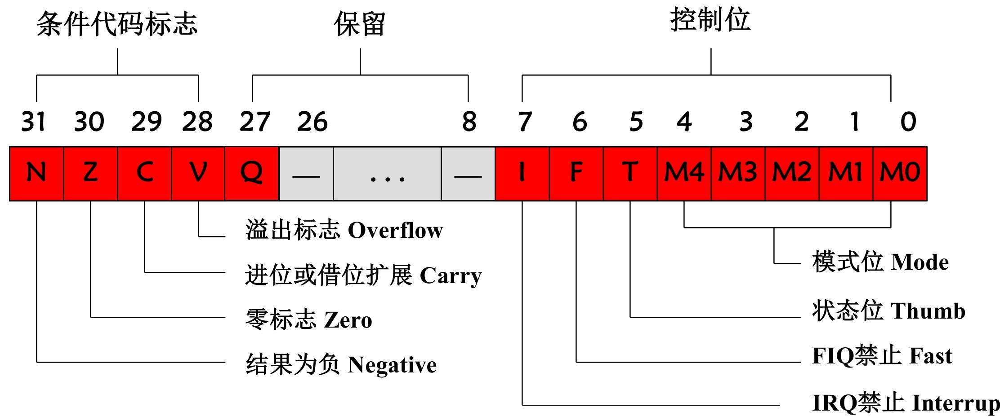

**条件代码标志位**（bit31~28 + bit27=Q）：运算结果的 “状态记录器”

这类标志位由 CPU**自动更新**（运算指令执行后），是 “条件执行指令”（如 BEQ、BNE）的判断依据，核心含义如下：

1. 核心 4 标志（N/Z/C/V）

| 标志 | 位   | 含义解读（通俗 + 技术）                                      |
| ---- | ---- | ------------------------------------------------------------ |
| N    | 31   | 符号位：✅ N=1：运算结果最高位 = 1（有符号数为负）；✅ N=0：运算结果最高位 = 0（正 / 零）；例：16 进制 0x80000000（二进制最高位 1）→ N=1；0x00000001 → N=0 |
| Z    | 30   | 零标志：✅ Z=1：运算结果 = 0（如 1-1、0×5）；✅ Z=0：运算结果≠0；例：CMP R0, #0 → 若 R0=0 则 Z=1，触发 BEQ（相等则跳转） |
| C    | 29   | 进位 / 借位标志（无符号数运算）：✅ 加法 / CMN：C=1 = 有进位（如 0xFFFFFFFF+1=0x100000000，超出 32 位，进位 1）；C=0 = 无进位；✅ 减法 / CMP：C=1 = 无借位（如 5-3）；C=0 = 有借位（如 3-5）；✅ 移位指令：C = 移出的最后一位（如 MOV R0, R1, LSL #1 → C=R1 的 bit31） |
| V    | 28   | 溢出标志（有符号数运算）：✅ V=1 = 溢出（如 0x7FFFFFFF+1=0x80000000，正数变负数，溢出）；✅ V=0 = 无溢出；注：无符号数运算不考虑 V 位 |

2. 扩展标志 Q（bit27）：DSP 运算专属

- 仅 ARMv5 及以上版本的 E 系列处理器支持；
- Q=1：增强型 DSP 运算（如乘法累加 MAC）发生溢出；
- Q=0：无溢出；
- 特点：Q 位不会自动清零，需手动执行`MSR CPSR_c, #0`清除。

**控制位**（bit7~0）：CPU 的 “操作开关”

这类标志位由程序员**手动修改**（特权模式下），控制 CPU 的核心行为，核心含义如下：

1. 中断禁止位（I/F）：中断的 “总开关”

| 控制位   | 位   | 含义解读                                                     |
| -------- | ---- | ------------------------------------------------------------ |
| I        | 7    | IRQ 中断禁止：✅ I=1：关闭 IRQ 中断（所有普通中断如按键、定时器都被屏蔽）；✅ I=0：开启 IRQ 中断； |
| F        | 6    | FIQ 中断禁止：✅ F=1：关闭 FIQ 中断（高速外设中断如 DMA 被屏蔽）；✅ F=0：开启 FIQ 中断； |
| 核心规则 | -    | 异常触发时，硬件会自动置 I/F=1（禁止中断），避免嵌套异常；处理完异常后需手动清零恢复。 |

2. 指令集状态位 T（bit5）：ARM/Thumb 切换

| 处理器版本       | T=0                    | T=1                                                 |
| ---------------- | ---------------------- | --------------------------------------------------- |
| ARMv4+ T 系列    | 执行 ARM 指令（32 位） | 执行 Thumb 指令（16 位）                            |
| ARMv5+ 非 T 系列 | 执行 ARM 指令          | 强制触发 “未定义指令异常”（禁止执行 Thumb）         |
| 核心作用         | -                      | 硬件根据 T 位自动切换指令集解码逻辑，无需手动干预。 |

3. 模式位 M [4:0]（bit4~0）：工作模式的 “编码开关”

5 位二进制编码唯一确定 CPU 的 7 种工作模式，对应你给出的编码表（修正后）：

| M [4:0]（二进制） | 工作模式        | 可访问的寄存器（核心）                      |
| ----------------- | --------------- | ------------------------------------------- |
| 10000（16）       | 用户模式        | R0~R14、PC、CPSR（只读）                    |
| 10001（17）       | 快速中断（FIQ） | R0~R7、R8_fiq~R14_fiq、PC、CPSR、SPSR_fiq   |
| 10010（18）       | 外部中断（IRQ） | R0~R12、R13_irq~R14_irq、PC、CPSR、SPSR_irq |
| 10011（19）       | 管理模式        | R0~R12、R13_svc~R14_svc、PC、CPSR、SPSR_svc |
| 10111（23）       | 中止模式        | R0~R12、R13_abt~R14_abt、PC、CPSR、SPSR_abt |
| 11011（27）       | 未定义模式      | R0~R12、R13_und~R14_und、PC、CPSR、SPSR_und |
| 11111（31）       | 系统模式        | R0~R14、PC、CPSR（特权，无 SPSR）           |

---


## ARM 异常(Exceptions)

ARM 的异常是处理器对 “内部错误 / 外部请求” 的标准化响应机制 —— 核心是 **“暂停当前任务→处理特定事件→恢复原程序”**

- 异常：处理器**由于外部或内部的原因**，停止执行当前任务，转而处理特定的事件，处理完后返回原程序，继续执行。
- 因为需要返回断点，所以处理器处理异常前，会自动保存当前执行状态
  - 把 “当前要执行的下一条指令地址” 存入链接寄存器 LR；
  - 把 “当前 CPU 状态（模式、中断开关、标志位）” 存入对应异常模式的 SPSR
- 处理器允许多个异常同时发生，它们将会按**固定的优先级**进行处理。

> [!note]
>
> - **中断**：仅指 “外部设备发起的请求”（如按键、定时器中断），是异常的 “子集”；
> - 异常：包含两类事件，范围更广：
>   1. 外部事件（即中断）：外部设备主动请求处理器处理（如 IRQ/FIQ）；
>   2. 内部事件：处理器执行过程中自身触发的问题（如未定义指令、内存访问错误、软件主动调用系统服务）。
>
> | 维度     | 异常（Exception）                                 | 中断（Interrupt）          |
> | -------- | ------------------------------------------------- | -------------------------- |
> | 事件来源 | 外部设备（中断）+ 内部错误 / 请求                 | 仅外部设备                 |
> | 关系     | 中断是异常的子集                                  | 属于异常的一种特殊类型     |
> | 典型场景 | 复位、未定义指令、内存错误、SWI 软件调用、IRQ/FIQ | 按键、定时器、串口数据接收 |


### ARM 体系结构 7 种异常类型

ARM共有7种类型的异常，不同类型的异常将导致处理器进入不同的工作模式，并执行**不同特定地址的指令**。

- 任何异常触发时，处理器都会自动完成 3 件事 —— 切换到对应工作模式、PC 跳转到 “特定地址（低端 / 高端）”、按优先级排队处理（高优先级先执行）；
- **优先级规则**：数字越小优先级越高（复位最高，未定义指令 / SWI 最低），同优先级异常同时发生时，按 “地址从小到大” 执行。

| 异常类型            | 工作模式              | 低端地址   | 高端地址   | 优先级 | 核心触发条件                                | 核心行为 / 用途                                |
| ------------------- | --------------------- | ---------- | ---------- | ------ | ------------------------------------------- | ---------------------------------------------- |
| 复位                | 管理模式（svc）       | 0x00000000 | 0xFFFF0000 | 1      | nRESET 信号从低变高（硬件复位）             | 系统开机 / 重启，初始化核心硬件                |
| 未定义指令          | 未定义指令模式（und） | 0x00000004 | 0xFFFF0004 | 6      | 执行 CPU 不识别 / 未实现的指令              | 软件仿真硬件（如浮点协处理器）、报错非法指令   |
| 软件中断（SWI）     | 管理模式（svc）       | 0x00000008 | 0xFFFF0008 | 6      | 用户模式执行 SWI 指令                       | 用户程序调用内核特权操作（如读文件、配置硬件） |
| 指令预取中止        | 中止模式（abt）       | 0x0000000C | 0xFFFF000C | 5      | 预取指令的地址不存在 / 无访问权限           | 虚拟内存管理、拦截非法指令访问                 |
| 数据访问中止        | 中止模式（abt）       | 0x00000010 | 0xFFFF0010 | 2      | 读写数据的地址不存在 / 无访问权限           | 内存保护、拦截非法数据访问（优先级仅低于复位） |
| 外部中断请求（IRQ） | 外部中断模式（irq）   | 0x00000018 | 0xFFFF0018 | 4      | IRQ 引脚有效 + CPSR 的 I 位 = 0（允许 IRQ） | 处理通用外设中断（按键、定时器、串口）         |
| 快速中断请求（FIQ） | 快速中断模式（fiq）   | 0x0000001C | 0xFFFF001C | 3      | FIQ 引脚有效 + CPSR 的 F 位 = 0（允许 FIQ） | 处理高速外设中断（DMA、网卡、摄像头）          |

#### 1. 复位异常（优先级 1，最高）

- **触发场景**：芯片开机、按复位键（nRESET 信号低→高）；
- 核心操作（硬件自动执行）
  1. 强制 CPSR 的 M [4:0]=b10011（切管理模式）；
  2. 置位 CPSR 的 I/F 位（禁止 IRQ/FIQ 中断，避免初始化时被打断）；
  3.  清零 CPSR 的 T 位（切 ARM 状态，禁止 Thumb）；
  4.  PC 跳转到 0x00000000（低端）/0xFFFF0000（高端）执行初始化代码；
- 复位异常时，处理器立即停止当前程序，进入**禁止中断**的管理模式。从地址0x00000000处开始执行。
- 相当于电脑开机，处理器先进入 “系统管理员模式”，关闭所有中断，从固定地址启动，完成硬件初始化。

#### 2. 未定义指令异常（优先级 6）

- **触发场景**：程序执行了 CPU 不支持的指令（如 ARM7 执行 ARM9 专属指令、自定义非法指令）；
- **核心行为**：自动切未定义指令模式，PC 跳转到 0x00000004 执行处理程序；
- **典型用途**：软件模拟硬件（比如 CPU 无浮点运算单元，用该异常模拟浮点指令），或提示 “程序非法” 并终止运行。

#### 3. 软件中断（SWI）（优先级 6）

- **核心价值**：用户模式（低权限）无法直接操作硬件，需通过 SWI 触发异常进入管理模式（高权限），调用内核功能；
- **举例**：APP 要读取 SD 卡数据→执行`SWI 0x12`（带参数的 SWI 指令）→触发异常→管理模式下内核执行读 SD 卡操作→完成后返回用户模式；
- **注意**：和未定义指令同优先级，同时发生时先执行未定义指令（地址更小）。

#### 4. 指令预取中止（优先级 5）

- **关键特点**：“预取时检测异常，但执行时才触发”——CPU 会提前预取后续指令，若预取的地址无效 / 无权限，不会立即触发异常，等这条指令要执行时才触发；
- **典型场景**：程序跳转到不存在的地址（如 0xFFFFFFF0），预取指令时内存控制器发中止信号，执行该指令时触发异常。

#### 5. 数据访问中止（优先级 2，仅低于复位）

- **触发时机**：执行读 / 写数据指令时（如`LDR R0, [R1]`、`STR R2, [R3]`），地址不存在 / 无权限；
- **优先级高的原因**：数据访问错误会直接破坏系统内存，需优先处理（比如 APP 写内核内存，立即触发该异常拦截）；
- **举例**：用户模式程序写 0x80000000（内核专属地址）→触发数据访问中止→中止模式下执行错误处理，终止该程序。

#### 6. 外部中断请求（IRQ）（优先级 4）

- **触发条件**：外设（如按键）拉低 IRQ 引脚 + CPSR 的 I 位 = 0（未禁止 IRQ）；
- **注意**：异常触发时，**硬件会自动置位 I 位**（禁止后续 IRQ），处理完中断后需手动清零 I 位恢复。

#### 7. 快速中断请求（FIQ）（优先级 3）

- **触发条件**：高速外设（如 DMA）拉低 FIQ 引脚 + CPSR 的 F 位 = 0（未禁止 FIQ）；
- **典型场景**：摄像头实时传数据、网卡接收高速数据包、工业控制的毫秒级响应。

复位（1）> 数据访问中止（2）>FIQ（3）>IRQ（4）> 指令预取中止（5）> 未定义指令 / SWI（6）；同优先级（如未定义指令和 SWI）按地址从小到大执行

---

### 异常的响应及返回

ARM 异常的 “响应 - 返回” 是保证程序中断后能精准恢复执行的核心机制，核心逻辑是 **“响应时保存状态、返回时修正地址 + 恢复状态”**

异常的响应

1. 保存返回地址到对应模式的 LR（R14_x）
   1. **ARM 状态进入异常**：LR 中保存 “下一条指令的地址”（本质是当前**`PC - 4`**，PC 因流水线超前性，实际指向当前指令后 2 条，减 4 后精准指向断点）；
   2. **Thumb 状态进入异常**：LR 中保存 “当前 PC 的偏移量”（无需区分 ARM/Thumb，返回时硬件自动适配）；
2. 备份 CPSR 到对应模式的 SPSR
3. 强制切换到异常专属工作模式：硬件自动修改 CPSR 的 M [4:0] 位（模式位），切换到对应异常模式
4. 跳转到异常向量地址 + 禁止中断

若异常发生时处理器处于 Thumb 状态，PC 加载向量地址后会**自动切换到 ARM 状态**

异常的返回

异常处理完成后，需执行 3 步操作恢复原程序，核心是 “修正 LR 地址→恢复 CPSR→开启中断”：

1. LR 减去偏移量写入 PC
2. SPSR 复制回 CPSR
3. 清除中断禁止位（可选）


> [!tip]
>
> 异常处理时保存在R14中值，即异常返回执行的指令地址
>
> 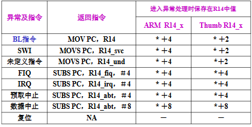
>
> （1）BL 子程序调用：LR 已自动修正
>
> - 举例：BL 指令在 0x8000（*=0x8000），PC 因流水线指向 0x8008（第 3 条指令）；
> - 硬件自动将 LR=0x8008-4=0x8004（下一条指令地址），返回时`MOV PC, LR`直接回到 0x8004，无需偏移。
>
> （2）SWI / 未定义指令：LR 指向断点，无需偏移
>
> - 这类异常由 “当前执行的指令” 触发（如执行`SWI 0x12`），PC 还未更新（指向当前指令后 2 条）；
> - 硬件保存 LR=PC-4=“当前指令的下一条指令地址”（断点），返回时`MOVS PC, LR`直接恢复，“S” 后缀自动把 SPSR 写回 CPSR。
>
> （3）FIQ/IRQ：需减 4 修正流水线偏移
>
> - IRQ/FIQ 在 “当前指令执行完” 触发，PC 已更新（指向当前指令后 3 条）；
> - 硬件保存 LR=PC-4=“当前指令后 2 条地址”（超前 4 字节），返回时`SUBS PC, LR, #4`减 4，回到 “当前指令的下一条”（断点）。
>
> （4）指令预取中止：减 4 回到错误指令
>
> - 异常由 “预取的指令地址无效” 触发，需回到 “有问题的指令” 重新执行；
> - LR 保存的是 “错误指令的下一条地址”，减 4 后回到错误指令，重新尝试取指。
>
> （5）数据访问中止：减 8 回到错误数据指令
>
> - 异常由 “读写数据指令” 触发，PC 已更新到 “当前指令后 3 条”，LR 保存的是 “当前指令后 2 条地址”；
> - 减 8 后回到 “数据访问指令本身”，重新尝试访问数据。


###  应用程序中的异常处理

应用程序中 ARM 异常处理的核心是 **“提前预埋跳转指令 + 硬件自动响应 + 软件恢复执行”** —— 通过在固定的异常向量表中放跳转指令，让异常发生时能精准跳转到处理程序，处理完后回到原程序，全程保证系统不陷入未知状态。

1. **异常的不可预测性**：系统运行时，IRQ/FIQ、内存错误、软件中断等异常可能随时发生（比如用户按按键触发 IRQ），必须提前做好 “兜底方案”；
2. **避免未知状态**：若异常发生后处理器找不到处理程序，会执行乱码指令，导致系统崩溃；因此核心思路是 “**异常向量表预埋跳转指令**”—— 把所有异常的 “入口地址”（向量地址）绑定到对应的处理程序；
3. **固定执行逻辑**：异常触发→PC 强制跳转到向量地址→执行跳转指令到处理程序→处理完成→返回原程序，全程硬件 + 软件配合，无人工干预。

#### IRQ 中断处理完整流程

进入异常（硬件自动完成，无需写代码）

程序 A 在**系统模式**运行，处理器状态为「Thumb 状态、I 位 = 0（允许 IRQ）」。

1. 置位 CPSR 的 I 位和 T 位，禁止中断同时进入ARM状态
2. 修改 CPSR 的 MOD 位（M [4:0]=10010），切换到IRQ模式
3. 保存返回地址到 LR_irq
4. 备份 CPSR 到 SPSR_irq
5. PC 跳转到 IRQ 向量地址（0x00000018）

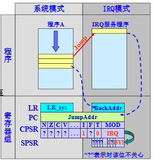

执行 IRQ 处理程序（软件编写，核心是 “通用处理 + 专属逻辑”）

1. 异常向量表是 “固定地址 + 固定跳转指令” 的集合，ROM（Flash）中固化以下代码；
2. 根据向量表读取真正中断服务程序地址，然后跳转后用户执行编写的异常处理程序

退出异常（软件编写，恢复原程序执行）

1. 将SPSR寄存器的值复制回CPSR寄存器
2. 回到用户程序的断点

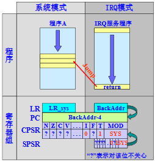


### Bootloader 外部中断（IRQ）处理实例

1. 异常向量表（Flash 中 0x00000000 起始）—— 中断的 “入口导航栏”

   ```assembly
   b SYS_RST_HANDLER   ; 0x00000000 复位异常 → 跳转到复位处理程序
   b UDF_INS_HANDLER   ; 0x00000004 未定义指令异常 → 跳转到对应处理程序
   b SWI_SVC_HANDLER   ; 0x00000008 软件中断 → 跳转到对应处理程序
   b INS_ABT_HANDLER   ; 0x0000000C 指令预取中止 → 跳转到对应处理程序
   b DAT_ABT_HANDLER   ; 0x00000010 数据访问中止 → 跳转到对应处理程序
   b                   ; 0x00000014 保留（空指令，无异常绑定）
   b IRQ_SVC_HANDLER   ; 0x00000018 IRQ外部中断 → 跳转到IRQ通用处理程序 【核心】
   b FIQ_SVC_HANDLER   ; 0x0000001C FIQ快速中断 → 跳转到FIQ处理程序
   ```

2. 外部中断触发后的硬件动作

   1. 处理器自动保存状态：把 “被中断程序的下一条指令地址” 存入 IRQ 模式的 LR（R14_irq），把当前 CPSR（状态寄存器）复制到 IRQ 模式的 SPSR_irq；
   2. 自动切换到 IRQ 模式：使用 IRQ 专属的栈指针（R13_irq）和 LR，避免覆盖用户程序的寄存器；
   3. 强制 PC 跳转到 0x00000018：执行该地址的`b IRQ_SVC_HANDLER`指令，跳转到通用处理程序；

3. IRQ 通用处理程序（IRQ_SVC_HANDLER）—— 中断的 “中间处理层”

   ```assembly
   IRQ_SVC_HANDLER:
       sub lr, lr, #4        ; 步骤1：修正IRQ模式LR的返回地址
       stmfd sp!, {r0-r3, lr} ; 步骤2：保护通用寄存器和修正后的LR
       ldr r0, =IRQ_SVC_Vector ; 步骤3：加载RAM中IRQ向量的地址到R0
       ldr pc, [r0]          ; 步骤4：跳转到RAM中存放的真正中断服务程序
   ```


中断向量地址分配与配置 —— 中断的 “动态绑定层”

```assembly
; 第一部分：为中断向量分配RAM地址空间
MAP _ISR_STARTADDRESS  ; 定义内存表的起始地址（_ISR_STARTADDRESS是RAM起始地址）
SYS_RST_VECTOR   #4    ; 复位向量，占4字节（RAM地址）
UDF_INS_VECTOR   #4    ; 未定义指令向量，占4字节
SWI_SVC_VECTOR   #4    ; 软件中断向量，占4字节
INS_ABT_VECTOR   #4    ; 指令预取中止向量，占4字节
DAT_ABT_VECTOR   #4    ; 数据访问中止向量，占4字节
RESERVED_VECTOR  #4    ; 保留向量，占4字节
IRQ_SVC_VECTOR   #4    ; IRQ向量，占4字节 【核心】
FIQ_SVC_VECTOR   #4    ; FIQ向量，占4字节

; 第二部分：绑定IRQ服务程序到IRQ_SVC_VECTOR
ldr r0, =IRQ_SVC_VECTOR  ; R0 = IRQ_SVC_VECTOR的RAM地址
ldr r1, =IsrIRQ          ; R1 = 真正的IRQ服务程序（IsrIRQ）的入口地址
str r1, [r0]             ; 把IsrIRQ的地址写入IRQ_SVC_VECTOR对应的RAM单元
```


> [!note]
>
> 1. **硬件触发 IRQ**：外部设备（如按键）触发 IRQ 中断，处理器自动保存状态→切 IRQ 模式→PC 跳转到 0x00000018；
> 2. **执行向量表跳转**：0x00000018 处的`b IRQ_SVC_HANDLER`指令，把 PC 跳转到 IRQ 通用处理程序；
> 3. 通用处理程序操作
>    - 修正 LR（减 4）→ 压栈保护 R0~R3 和 LR → 加载 RAM 中`IRQ_SVC_VECTOR`的地址到 R0；
>    - 读取`IRQ_SVC_VECTOR`中存放的 IsrIRQ 地址，写入 PC，跳转到真正的中断服务程序；
> 4. **执行具体中断逻辑**：IsrIRQ 处理按键 / 定时器等具体业务（如读取按键状态、清中断标志）；
> 5. **返回原程序**：处理完成后，执行`ldmfd sp!, {r0-r3, pc}^`（出栈恢复 R0~R3，把修正后的 LR 写入 PC，`^`恢复 SPSR 到 CPSR），回到被中断的程序继续执行。
