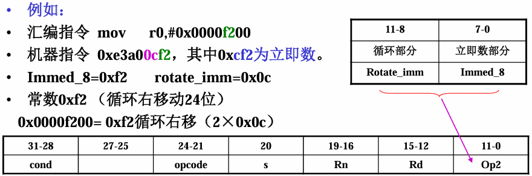
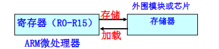
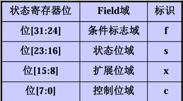

# ARM 9指令系统

在这一章中，首先从ARM处理器的寻址方式理解指令中操作数的来源，然后分别从ARM32指令集和Thumb16指令集学习整个ARM9的指令系统

## ARM处理器的寻址方式

寻址方式的本质是**CPU 根据指令里的操作数信息，找到操作数在内存 / 寄存器中实际物理地址的方法**。

- 依据指令中给出的操作数的不同格式，ARM指令系统具有8种常见的寻址方式：

  > 1. 寄存器寻址
  > 2. 立即寻址
  > 3. 寄存器间接寻址
  > 4. 变址寻址
  > 5. 寄存器移位寻址
  > 6. 多寄存器寻址
  > 7. 堆栈寻址
  > 8. 相对寻址

### 寄存器寻址

指令要运算 / 操作的数据，直接存在 CPU 的通用寄存器（R0~R15）里，不用去内存里找，直接拿寄存器里的值当操作数用。即**操作数 = 寄存器中存储的数值**

寄存器寻址是 ARM 处理器**最基础、最高效**的寻址方式

```assembly
ADD R0，R1，R2  ;R0=R1＋R2
MOV R0，R1 ;R0=R1
```

---

### 立即寻址 

立即寻址是 ARM 指令中**直接把操作数 “嵌在指令里”** 的寻址方式，指令本身直接包含 “要操作的数值”作为指令二进制编码的一部分；

- **识别标志**：立即数必须以`#`（井号）为前缀，这是 ARM 汇编语法的硬性规定，没有`#`会被编译器判定为错误；

| 进制类型 | 前缀标识    | 示例            |
| -------- | ----------- | --------------- |
| 十六进制 | `0x` 或 `&` | `#0x55`、`#&55` |
| 二进制   | `0b`        | `#0b101010`     |
| 十进制   | `0d` 或缺省 | `#5`、`#0d100`  |

```assembly
ADD R0,R1,#5 ;R0=R1+5 
MOV R0,#0x55 ;R0=0x55
```

#### 立即数的形成

ARM 是 32 位处理器，但立即数在指令编码中**仅占 12 位**，因此不是所有 32 位数值都能作为 “合法立即数”

只有满足**「`常数 = 8位二进制数（immed_8）循环右移（2×rotate_imm）`」**规则的数，才是合法立即数（rotate_imm 是 0~31 的整数）。

在机械指令中



- 对于较大的无法直接使用立即数表示的数，可以采用`LDR Rn ,=number`将32位数据读到Rn在进行操作

---

### 寄存器间接寻址

寄存器间接寻址是 ARM 中**通过 “地址找数据”** 的基础寻址方式

- 寄存器里存的**不是要运算的数值**，而是**数值在内存中的物理地址**；
- CPU 先从这个寄存器里读出内存地址，再到该地址对应的内存单元中，取 / 存真正的操作数

存放地址的寄存器必须用 `[]`（中括号）包裹，这是间接寻址的核心语法特征

比寄存器寻址 / 立即寻址慢（多了 “读地址→访内存” 两步），但比直接内存寻址灵活

```assembly
STR R0,[R1] ;[R1]=R0 
LDR R0,[R1] ;R0=[R1]
```

---

### 变址寻址

变址寻址是 ARM 中专门针对 **“基地址 + 偏移量” 访问连续内存 ** 设计的寻址方式 

操作数物理地址 = 基址寄存器的值 + 偏移量（核心公式）`[基址寄存器, 偏移量]`

- 其中基址寄存器：任意通用寄存器（R0~R15）
- 偏移量类型  两种：① 立即数偏移（如 #5）；② 寄存器偏移（如 R2）；同时偏移量需要注意内存对齐问题

```assembly
LDR R0，[R1，＃4] ; R0=[R1+4]
LDR R0，[R1，＃-4] ; R0=[R1-4]
LDR R0，[R1，R2] ; R0=[R1+R2]
```

ARM 变址寻址还分 “前变址” 和 “后变址”

| 类型               | 格式示例         | 核心区别                                | 场景                       |
| ------------------ | ---------------- | --------------------------------------- | -------------------------- |
| 前变址（课件示例） | `LDR R0,[R1,#5]` | 先算地址（R1+5），再访问，R1 不变       | 单次访问固定偏移地址       |
| 后变址             | `LDR R0,[R1],#4` | 先访问 R1 地址，再算 R1=R1+4（R1 更新） | 循环遍历连续内存（如数组） |

比如遍历 int 型数组（每个元素 4 字节）：

```assembly
MOV R1, #&array  ; R1=数组首地址（基址）
(LOR R1, =array)
MOV R2, #0       ; R2=偏移量初始值
loop:
LDR R0, [R1,R2]  ; 读取R1+R2地址的数组元素
; 处理元素（比如判断值、运算）
ADD R2, R2, #4   ; 偏移量+4（下一个int元素）
CMP R2, #40      ; 判断是否遍历完10个元素（10×4=40）
BNE loop         ; 没遍历完就循环
```

---


### 寄存器移位寻址

寄存器移位寻址是**ARM 独有的高效寻址方式**

-  指令中第二个操作数（源操作数）不是直接用寄存器里的原始值，而是先对该寄存器的值做 “移位操作”，再用移位后的结果参与运算 / 赋值；
- 移位操作不单独占指令，而是 “嵌在” 数据处理指令（ADD/MOV/AND 等）里，由 ARM 的 “桶型移位器” 硬件完成，同时提升代码密度，提升流水线效率

```assembly
ADD R0，R1，R2，ROR ＃5 ;R0=R1＋R2循环右移5位
MOV R0，R1，LSL R3 ;R0=R1逻辑左移R3位
```

`通用寄存器, <shift>  操作数`

5 种：LSL（ASL）、LSR、ROR、ASR、RRX：每一个指令中最后移出的位都存入状态寄存器 C 位；

1. LSL（逻辑左移）/ASL（算术左移）—— 左移补 0，等效 ×2ⁿ
2. LSR（逻辑右移）—— 右移补 0，等效无符号数 ÷2ⁿ
3. ROR（循环右移）—— 闭合移位，无数据丢失
4. ASR（算术右移）—— 右移保符号，等效有符号数 / 2ⁿ
5.  RRX（带扩展的循环右移）—— 仅移 1 位，结合 C 位循环：寄存器内容**仅向右移 1 位**，左侧**空位由状态寄存器 C 位填充**，右侧移出的位存入 C 位；

---

### 多寄存器寻址

多寄存器寻址是 ARM 中 **“批量搬运数据”** 的高效寻址方式

-  一条指令就能完成**多个寄存器**和**连续内存区域**之间的数据批量传输（读 / 写），不用逐一对每个寄存器写指令；
- 最多支持一次性操作 16 个通用寄存器（R0~R15）， “连续内存 <-> 多寄存器” 

`LDM/STM（IA/IB/DA/DB) <基址地址> {寄存器列表}`

- 寄存器列表由`{}`（大括号）包裹，连续寄存器用`-`连接（如`R1-R5`），非连续用`,`分隔（如`R1,R3,R5`）
- 用 IA/IB/DA/DB 标识，决定内存地址是 “传输前 / 后” 递增 / 递减
- 地址每次增减步长固定为 4，对应ARMz中一个字即四个字节

```assembly
LDMIA R0,{R1-R5} ;R1=[R0] ; R2=[R0+4] ; R3=[R0+8] ; R4=[R0+12] ; R5=[R0+16]
STMIA R0, {R1-R5} ;把 R1~R5 的值，批量写入以 R0 为起始地址的连续内存
```

`IA`表示在执行完一次Load操作后，R0自增4。而`IB`则表示Load前自增；`DA/DB`则是地址递减（在后面访存指令会由详解）

- `LDMIA R0,{R1}`：先读`R0`地址→`R1`，再`R0=R0+4`；
- `LDMIB R0,{R1}`：先`R0=R0+4`，再读新`R0`地址→`R1`；

---

### 堆栈寻址

堆栈寻址是 ARM 专为 “先进后出（FILO）” 数据存储设计的**特殊多寄存器寻址方式**

- 划定一块内存区域作为 “堆栈”，用**专用寄存器 SP（R13）**指向栈顶
- 一条指令就能批量把寄存器数据 “压入” 堆栈（存），或从堆栈 “弹出” 恢复到寄存器（取）；注意默认从寄存器编号从小到大操作，**和顺序无关**

```assembly
STMFD R13!,{R0,R1,R2,R3,R4} ;将R0-R4中的数据压入堆栈,R13为堆栈指针
LDMFD R13!,{R0,R1,R2,R3,R4} ;将数据出栈,恢复R0-R4原先的值
```

- `STMFD`（压栈：寄存器→堆栈）/`LDMFD`（出栈：堆栈→寄存器），FD 是最常用的堆栈类型
- `!`（感叹号）表示指令执行后自动更新 SP 值（栈指针随压栈 / 出栈移动）

FD：满递减即高地址到低地址；而FA则是满递增从低地址到高地址；

ED/EA：则表示栈顶指针指向下一个空闲单元即下一个元素入栈的位置，而栈顶元素为指针的上一个位置

---

### 相对寻址

相对寻址是 ARM 专为**程序跳转**设计的寻址方式，本质是 “以 PC 为基址的基址变址寻址”

- 把程序计数器 PC（R15）固定作为基址寄存器，指令里的 “跳转标签（如 process1）” 会被编译器转换成相对于 PC 的地址偏移量
- 最终通过 “PC 值 + 偏移量” 计算出跳转目标地址，实现程序流程的跳转。

```assembly
BEQ process1 ;相等则跳转到process1
```

ARM 相对寻址的偏移量是**24 位有符号数**，且需按 4 字节对齐；

- 最大正向跳转：PC + 0x00FFFFFF（约 + 32MB）；
- 最大反向跳转：PC - 0x00FFFFFF（约 - 32MB）；

超出范围时，编译器会报错，需用其他跳转方式（如`LDR PC, =process1`）。


## ARM指令集

机器指令 / 伪指令 / 宏指令，这三类 “指令” 本质不是同一层级的概念 ——**只有机器指令是 CPU 能直接执行的，伪指令和宏指令是给汇编编译器 “打工” 的辅助指令**

- 机器指令：ARM/Thumb 指令集，二进制编码，CPU 能直接识别并执行；是程序运行的 “**最小执行单元**”

- 伪指令：汇编编译时生效，编译器会把伪指令替换成 1~ 多条机器指令，运行阶段不存在

  >  ARM 立即数有合法性限制（只能 8 位 + 移位），直接写`MOV R0,#0x12345678`会报错，伪指令`LDR R0,=0x12345678`就能解决（编译器会把 0x12345678 存入内存，再用`LDR R0,[PC,#偏移]`加载）；

- 宏指令：先定义 “宏体”，再用 “宏指令” 调用，编译时编译器会把 “宏指令” 直接替换成宏体的机器指令序列；

ARM 指令集的核心特性：加载 / 存储型

- 所有运算 / 处理指令（ADD/SUB/AND/ORR 等）只能操作**寄存器中的数据**，处理结果也必须放回寄存器；
- 要读写内存（系统存储器），必须用专门的**加载 / 存储指令**（LDR/STR/LDM/STM 等），先把内存数据读到寄存器，运算后再写回内存。

### ARM指令格式

```assembly
<opcode> {<cond>} {S} <Rd>, <Rn>, <op2>
```

| 组成部分   | 核心含义                                                     | 示例（对应 ADDEQS R1,R2,#5）   |
| ---------- | ------------------------------------------------------------ | ------------------------------ |
| `<opcode>` | 操作码：指令要执行的核心动作（加 / 减 / 移 / 比较等）        | `ADD`（算术加法）              |
| `{<cond>}` | 条件域：指令是否执行，取决于 CPSR 标志位                     | `EQ`（相等时执行）             |
| `{S}`      | 状态位：指令执行后是否更新 CPSR 的标志位（Z/N/C/V）          | `S`（更新 CPSR）               |
| `<Rd>`     | 目的寄存器：指令执行结果存入的寄存器                         | `R1`（加法结果存 R1）          |
| `<Rn>`     | 第一个操作数：只能是寄存器（ARM 运算只操作寄存器）           | `R2`（第一个加数是 R2 的值）   |
| `<op2>`    | 第二个操作数：支持 3 种灵活形式（立即数`#immed_8r` / 寄存器`Rm` / 移位寄存器`Rm,shift`） | `#5`（立即数，第二个加数是 5） |

`< >`：尖括号包裹的是 “必选项”；`{ }`：大括号包裹的是 “可选项”

---

### ARM 指令条件码

ARM 指令的条件码（`<cond>`）是**基于 CPSR（当前程序状态寄存器）的标志位，决定指令是否执行**

“条件执行”的实现方式避免使用分支指令可以消除因分支预测失败或流水线清空带来的性能损失，同时省去了显式的比较-分支指令对（通常需要两条指令：CMP+Bxx）提升了代码密度

CPSR 中与条件码相关的 4 个核心标志位：

| 标志位               | 含义（通俗版）                                         | 触发场景                                         |
| -------------------- | ------------------------------------------------------ | ------------------------------------------------ |
| Z（零标志）          | Z=1：运算结果为 0；Z=0：结果非 0                       | 比较两数相等（R0-R1=0→Z=1）、运算结果清 0        |
| N（负标志）          | N=1：运算结果为负数；N=0：结果非负                     | 有符号数运算结果为负（如 5-10=-5→N=1）           |
| C（进位 / 借位标志） | C=1：无符号数运算有进位 / 无借位；C=0：有借位 / 无进位 | 无符号数加法进位（0xFF+1=0x100→C=1）、减法无借位 |
| V（溢出标志）        | V=1：有符号数运算溢出；V=0：未溢出                     | 有符号数超出范围（如 127+1=-128→V=1）            |

16 种条件码（实际常用 15 种）可分为 6 组，结合 “标志位 + 含义 + 场景” 逐一讲透：

1. 相等 / 不相等判断（基于 Z 位）

| 条件码 | 编码 | 标志位要求  | 含义   | 通俗理解         | 示例场景                                           |
| ------ | ---- | ----------- | ------ | ---------------- | -------------------------------------------------- |
| EQ     | 0000 | Z=1（置位） | 相等   | 两数相减结果为 0 | 判断 R0 是否等于 R1（CMP R0,R1 后，EQ 表示 R0=R1） |
| NE     | 0001 | Z=0（清零） | 不相等 | 两数相减结果非 0 | 判断 R0 是否不等于 R1                              |

2. 正负判断（基于 N 位）

| 条件码 | 编码 | 标志位要求  | 含义      | 通俗理解                       | 示例场景                           |
| ------ | ---- | ----------- | --------- | ------------------------------ | ---------------------------------- |
| MI     | 0100 | N=1（置位） | 负数      | 运算结果最高位为 1（有符号数） | 判断运算结果是否为负（如 R0-10<0） |
| PL     | 0101 | N=0（清零） | 正数 / 零 | 运算结果最高位为 0             | 判断运算结果是否非负               |

3. 溢出判断（基于 V 位）

| 条件码 | 编码 | 标志位要求  | 含义   | 通俗理解             | 示例场景                               |
| ------ | ---- | ----------- | ------ | -------------------- | -------------------------------------- |
| VS     | 0110 | V=1（置位） | 溢出   | 有符号数运算超出范围 | 判断 127+1 是否溢出（结果 =-128→V=1）  |
| VC     | 0111 | V=0（清零） | 未溢出 | 有符号数运算在范围内 | 判断 100+20 是否溢出（结果 = 120→V=0） |

4. 无符号数比较（基于 C/Z 位）

无符号数没有正负，只看 “大小 / 进位”，核心是 C（进位）和 Z（相等）的组合：

| 条件码 | 编码 | 标志位要求 | 含义       | 通俗理解            | 示例场景                              |
| ------ | ---- | ---------- | ---------- | ------------------- | ------------------------------------- |
| CS/HS  | 0010 | C=1        | 无符号数≥  | 减法无借位（A-B≥0） | 判断无符号数 R0≥R1                    |
| CC/LO  | 0011 | C=0        | 无符号数 < | 减法有借位（A-B<0） | 判断无符号数 R0<R1                    |
| HI     | 1000 | C=1 且 Z=0 | 无符号数 > | 减法无借位且不相等  | 判断无符号数 R0>R1（课件示例用的 HI） |
| LS     | 1001 | C=0 或 Z=1 | 无符号数≤  | 减法有借位或相等    | 判断无符号数 R0≤R1（课件示例用的 LS） |

5. 有符号数比较（基于 N/V/Z 位）

有符号数要考虑正负和溢出，核心是 N（负）和 V（溢出）的 “相等性”+ Z（相等）：

| 条件码 | 编码 | 标志位要求 | 含义       | 通俗理解                         | 示例场景                            |
| ------ | ---- | ---------- | ---------- | -------------------------------- | ----------------------------------- |
| GE     | 1010 | N=V        | 有符号数≥  | 结果非负且未溢出，或结果负且溢出 | 判断有符号数 R0≥R1（如 - 5≥-10→GE） |
| LT     | 1011 | N≠V        | 有符号数 < | 结果负且未溢出，或结果非负且溢出 | 判断有符号数 R0<R1（如 - 10<-5→LT） |
| GT     | 1100 | Z=0 且 N=V | 有符号数 > | 不相等且≥                        | 判断有符号数 R0>R1（如 5>-3→GT）    |
| LE     | 1101 | Z=1 或 N≠V | 有符号数≤  | 相等或 <                         | 判断有符号数 R0≤R1（如 - 3≤5→LE）   |

6. 无条件执行 / 保留

| 条件码 | 编码 | 标志位要求 | 含义          | 通俗理解               | 示例场景                                              |
| ------ | ---- | ---------- | ------------- | ---------------------- | ----------------------------------------------------- |
| AL     | 1110 | 忽略       | 无条件执行    | 不管标志位如何，必执行 | 普通指令默认（如 ADD R0,R1,R2 等价于 ADDAL R0,R1,R2） |
| 1111   | 1111 | 依版本而定 | 保留 / 自定义 | 不同 ARM 版本定义不同  | 几乎不用，仅架构扩展用                                |


### ARM 数据处理类指令

- **仅操作寄存器**：数据处理指令只能对寄存器内容运算，不能直接操作内存数据
- **不直接访存**：无法直接读取 / 写入内存，若要操作内存数据，需先通过`LDR/STR`（加载 / 存储指令）把内存数据读到寄存器，运算后再写回内存；
- 数据传送、算术逻辑运算、比较指令，各自分工明确（传送只挪数据、运算会存结果 + 更标志、比较只更标志不存结果）。


#### 数据传送指令（MOV/MVN）—— 寄存器间 “搬数据”

把数据（立即数 / 寄存器值 / 移位后寄存器值）从一个位置 “搬” 到目的寄存器，是最基础的数据处理指令。

1. MOV：普通数据传送

   ```assembly
   MOV{<cond>}{S} <Rd>, <op1>	;Rd = op1, Op1:寄存器､被移位的寄存器､立即数｡
   
   MOV R0, #5 ; R0=5 
   MOV R0, R1 ; R0=R1 
   MOV R0, R1, LSL #5 ; R0=R1左移5位
   ```

2. MVN：取反数据传送(注意：数值是以**补码**形式存储的)

   ```assembly
   MVN{<cond>}{S} <Rd>, <op1> ;Rd = ~op1
   
   MVN R0, ＃0 ; R0=-1
   ```

   

#### 算术逻辑运算指令 —— 寄存器数据 “做运算”

对寄存器数据做加减 / 逻辑 / 乘法运算，**运算结果存目的寄存器**，加`S`会更新 CPSR 标志位（Z/N/C/V），是嵌入式运算的核心指令。

1. 加法指令（ADD/ADC）—— 基础加 / 带进位加

   ```assembly
   ADD{<cond>}{S} <Rd>, <Rn>, <op2>   ;Rd = Rn + op2
   
   ADD R0, R1, #5 ; R0=R1+5 
   ADD R0, R1, R2 ; R0=R1+R2 
   ADD R0, R1, R2, LSL #5 ; R0=R1+R2左移5位
   
   ADC{<cond>}{S} <Rd>, <Rn>, <op2>   ;Rd = Rn + op2 + C,该指令用于实现超过32位的数的加法
   
   #{R3,R2}+{R5,R4} -> {R1,R0}
   ADDS R0, R2, R4 ;低32位相加，S表示结果影响条件标志位的值
   ADC R1, R3, R5 ;高32位相加
   ```

2. 减法指令：SUB/SBC/RSB/RSC —— 基础减 / 带借位减 / 反向减 / 带借位反向减

   ```assembly
   SUB{<cond>}{S} <Rd>, <Rn>, <op2> ;Rd = Rn - op2
   
   SUB R0, R1, #5 ; R0=R1-5 
   SUB R0, R1, R2 ; R0=R1-R2 
   SUB R0, R1, R2, LSL #5 ; R0=R1-R2左移5位
   
   SBC{<cond>}{S} <Rd>, <Rn>, <op2> ;Rd = Rn - op2 - 借位(!C)
   
   SUBS R0, R2, R4 ; 低32位相减，S表示结果影响条件标志位的值
   SBC R1, R3, R5 ; 高32位相减
   
   RSB{<cond>}{S} <Rd>, <Rn>, <op2> ;Rd = op2 - Rn
   
   RSB R0, R1, #5 ; R0=5-R1 
   RSB R0, R1, R2 ; R0=R2-R1 
   RSB R0, R1, R2, LSL #5 ; R0=R2左移5位-R1
   
   RSC{<cond>}{S} <Rd>, <Rn>, <op2> ;Rd = op2 - Rn - 借位
   
   RSBS R0, R4, R2 ; 低32位相减，S表示结果影响寄存器CPSR的值
   RSC R1, R5, R3 ; 高32位相减
   ```

3. 逻辑运算指令：AND/ORR/EOR/BIC，与/或/异或/清零

   ```assembly
   AND{<cond>}{S} <Rd>, <Rn>, <op2> ;Rd = Rn & op2,清除指定位,提取某几位
   AND R0, R0, #~(1<<3) ;把 GPIO 寄存器的第 3 位清 0：
   AND R0, R0, #0xFF ;提取 R0 的低 8 位
   
   ORR{<cond>}{S} <Rd>, <Rn>, <op2> ;Rd = Rn | op2 ,置位外设寄存器的特定位,合并数据
   ORR R0, R0, #(1<<1) ;把 GPIO 引脚 1 置 1
   ORR R0, R1, R2, LSL #8 ;把两个 8 位数合并成 16 位
   
   EOR{<cond>}{S} <Rd>, <Rn>, <op2> ;Rd = Rn ^ op2,翻转指定位,判断两数是否相等
   EORS R0, R1, R2 ;结果为 0 则 Z=1→R1=R2
   
   BIC{<cond>}{S} <Rd>, <Rn>, <op2> ;Rd = Rn & (~op2),清除外设寄存器的特定位
   BIC R0, R0, #(1<<5) ;关闭 SPI 的中断位
   ```

4. 乘法指令：MUL/MLA/SMULL/UMULL/SMLAL/UMLAL  ,基础乘/乘加/64/64乘加

   ```assembly
   MUL{<cond>}{S} <Rd>, <Rn>, <op2> ;Rd = Rn × op2,仅仅保留低32位，Rn和op2的值为32位的有符号数或无符号数
   MULS R0, R1, R2 ;(R0=R1 × R2) ,结果影响寄存器CPSR的值
   
   MLA{<cond>}{S} <Rd>, <Rn>, <op2>, <op3> ;Rd = Rn×op2 + op3
   MLA R0, R1, R2, R3  ; R0 = R1×R2 + R3
   
   SMULL{<cond>}{S} <Rdl>, <Rdh>, <Rn>, <op2> ;Rdh:Rdl = Rn×op2
   UMULL{<cond>}{S} <Rdl>, <Rdh>, <Rn>, <op2> ;Rdh:Rdl = Rn×op2（64 位无符号结果）
   
   SMLAL{<cond>}{S} <Rdl>, <Rdh>, <Rn>, <op2> ;Rdh:Rdl = Rn×op2 + Rdh:Rdl
   UMULL{<cond>}{S} <Rdl>, <Rdh>, <Rn>, <op2> ;Rdh:Rdl = Rn×op2 + Rdh:Rdl(无符号)
   ```


#### 比较指令：CMP/CMN/TST/TEQ

1. CMP（基础比较）—— 减法比较，即等同于`SUBS`，但是仅仅更新 Z/N/C/V 标志位

   ```assembly
   CMP{<cond>} <Rn>, <op1> ;执行Rn - op1，不保存结果，仅更新 Z/N/C/V 标志位；
   
   CMP R0, #5  ; 计算R0-5，更新标志位
   BEQ equal   ; 若Z=1（R0=5），跳转到equal标签
   ADDGT R0, R0, #1  ; 若R0>5（Z=0且N=V），R0=R0+1
   ```

2. CMN（反值比较）—— 加法比较（等效比较负数）

   ```assembly
   CMN{<cond>} <Rn>, <op1> ;执行Rn + op1（等效于Rn - (-op1)），更新标志位；
   
   CMN R0, #5  ; 等效比较R0和-5（R0 - (-5) = R0+5）
   BMI negative  ; 若N=1（R0+5<0 → R0<-5），跳转到negative
   ```

3. TST（位测试）—— 按位与比较，同时更新 Z 标志位

   ```assembly
   TST{<cond>} <Rn>, <op1> ;执行Rn & op1，更新 Z 标志位；
   
   TST R0, #(1<<3)  ; 测试R0的第3位是否为1
   BNE bit_set     ; 若Z=0（第3位=1），跳转到bit_set
   ```

4. TEQ（相等测试）—— 按位异或比较，同时更新 Z 标志位

   ```assembly
   TEQ{<cond>} <Rn>, <op1> ;执行Rn ^ op1，更新 Z 标志位
   
   TEQ R0, R1  ; 判断R0是否等于R1
   BEQ equal   ; 若Z=1（R0=R1），跳转
   ```

   

### ARM 分支指令

ARM 分支指令是控制程序 “跳转到指定位置执行” 或 “切换指令状态（ARM/Thumb）” 的核心指令，核心分为 4 类：B（基础跳转）、BL（带返回跳转）、BX（状态切换跳转）、BLX（带返回 + 状态切换跳转）

程序跳转的两种方式：跳转指令/直接写（R15）PC寄存器

| 方式                    | 实现逻辑                                 | 跳转范围                 | 核心用途                 |
| ----------------------- | ---------------------------------------- | ------------------------ | ------------------------ |
| 跳转指令（B/BL/BX/BLX） | 基于 PC 的相对寻址（PC + 偏移量）        | B/BL：±32MB；BX/BLX：4GB | 常规程序跳转、子程序调用 |
| 直接写 PC 寄存器        | `MOV PC, #0x12345678` 或 `LDR PC, =addr` | 4GB 全地址空间           | 超出 ±32MB 的远距离跳转  |

分支指令中的 BX/BLX 是唯一能切换状态的指令，B/BL 仅跳转、不切换状态

1. B 指令：基础跳转（Branch）—— 单纯跳，不返回

最基础的无条件 / 条件跳转指令，仅修改 PC 值实现程序跳转，**不保存返回地址**，适合 “一去不回” 的跳转（如循环、分支判断）。

```assembly
B{<cond>} <addr> ;PC = PC + (addr << 2)其中addr可以是标签转为相对于当前PC的24位有符号偏移量值


B exit  ; 无条件跳转到exit标签处
...     ; 这段代码不会执行
exit:   ; 跳转目标位置
	MOV R0, #0
	
MOV R0, #10  ; 初始化循环计数器R0=10
loop:        ; 循环体开始标签
  ...        ; 循环要执行的代码
  SUBS R0, #1; 计数器减1，S更新Z标志位（R0=0时Z=1）
  BNE loop   ; 若Z=0（R0≠0），跳回loop；Z=1则退出循环
```

2. BL 指令：带返回的跳转（Branch with Link）—— 跳出去，能回来

专为**子程序调用**设计的跳转指令，跳转时自动把 “返回地址” 保存到 LR（R14）寄存器，子程序执行完后，把 LR 值写回 PC 就能返回原位置。**注意需要手动写回PC**

```assembly
BL{<cond>} <addr> ;PC = PC + (addr << 2),同时保存返回地址到LR(R14)链接寄存器

BL func  ; 1. 保存返回地址到LR；2. 跳转到func子程序
...      ; 调用完func后，回到这里执行
func:    ; 子程序入口
  ...    ; 子程序功能代码
  MOV PC, LR  ; 把LR的值写入PC，返回调用处
  
CMP R0, #5   ; 比较R0和5，更新标志位
BLLT SUB1    ; 若R0<5（LT条件），调用SUB1
BLGE SUB2    ; 若R0≥5（GE条件），调用SUB2
```

3. BX 指令：带状态切换的跳转（Branch and Exchange）—— 跳 + 切换 ARM/Thumb

唯一能切换 ARM/Thumb 状态的基础跳转指令，跳转目标地址由寄存器指定（而非偏移量），支持 4GB 全地址空间跳转。

```assembly
BX <Rn> ;目标地址 = Rn 的值 & 0xFFFFFFFE,同时状态切换由 Rn 的最低位决定 0->ARM,1->Thumb

ADR R0, exit  ; 伪指令：把exit标签的地址加载到R0（假设exit地址=0x12345678）
BX R0         ; 1. 目标地址=0x12345678 & 0xFFFFFFFE=0x12345678；2. R0最低位=0 → 切换到ARM状态，跳转到exit

ADR R0, thumb_func  ; thumb_func是Thumb指令标签
ADD R0, R0, #1      ; R0最低位设为1
BX R0               ; 切换到Thumb状态，跳转到thumb_func
```

4. BLX 指令：带返回 + 状态切换的跳转（Branch with Link and Exchange）—— 调用 + 切换

BL（带返回）+ BX（状态切换）的组合指令，既保存返回地址到 LR，又能切换 ARM/Thumb 状态，支持两种格式：

```assembly
BLX <addr> ;相对寻址跳转（±32MB）
BLX <Rn>   ;寄存器寻址跳转（4GB）

BLX T16  ; 1. 保存返回地址到LR；2. 跳转到T16；3. 切换到Thumb状态
...
CODE16   ; 汇编器伪指令：后续指令为16位Thumb指令
T16:     ; Thumb指令入口
  ...    ; Thumb指令代码
```

---


### ARM 存储器访问指令

ARM 存储器访问指令是**连接寄存器和内存的唯一桥梁**

因为 ARM 所有运算指令（ADD/SUB/AND 等）只能操作寄存器，数据若在内存中，必须先通过`LDR`（加载）读到寄存器，运算后再通过`STR`（存储）写回内存。

- Load（加载）：内存 → 寄存器；把内存里的数据 “读” 到寄存器里运算
- Store（存储）：寄存器 → 内存；把寄存器运算后的结果 “写” 回内存

所有存储器访问指令都围绕这两个动作展开，区别仅在于 “单次传多少数据（字 / 半字 / 字节）”；“传多少个数据（单个 / 多个）”；“地址怎么算（寻址方式）”



所以分为三类Load/Store指令

1. 单一数据传送指令（LDR和STR等）
2. 多数据传送指令（LDM和STM）
3. 数据交换指令（SWP和SWPB）


#### 单一数据传送指令（LDR/STR 系列）

最常用存储器访问指令`LDR`（加载）和`STR`（存储），支持 “字（32 位）、半字（16 位）、字节（8 位）” 三种数据宽度

LDR（字数据加载）+ STR（字数据存储）

```assembly
LDR{<cond>} <Rd>, <addr> ; Rd=[addr]
STR{<cond>} <Rd>, <addr> ; [addr]=Rd
```

地址`addr`的寻址方式：

| 寻址方式           | 格式示例                   | 地址计算逻辑                                    | 备注                                 |
| ------------------ | -------------------------- | ----------------------------------------------- | ------------------------------------ |
| 直接寻址（无偏移） | `LDR R0, [R1]`             | 地址 = R1                                       | 直接访问 Rn 指向的内存地址           |
| 立即数偏移         | `LDR R0, [R1, #0x12]`      | 地址 = R1 + 0x12（正数）/ R1 - R2（负数）       | 偏移量是 12 位无符号数（-4095~4095） |
| 寄存器偏移         | `LDR R0, [R1, R2]`         | 地址 = R1 + R2                                  | 偏移量存在寄存器中                   |
| 移位寄存器偏移     | `LDR R0, [R1, R2, LSL #5]` | 地址 = R1 + (R2 × 32)（LSL#5 = 左移 5 位 =×32） | 偏移量先移位再参与计算               |

- 在地址后加`!`，表示 “数据传送后，把新地址写回基址寄存器 Rn”，无需额外指令修改 Rn

```assembly
STR R0, [R1, #4]!
R1=0x40003000，R0=0x1A27E4F3
1. 计算地址：0x40003000 + 4 = 0x40003004；
2. 把R0的32位数据写到0x40003004；
3. 自动更新R1：R1 = 0x40003004（原R1+4）。
```

- 后变址（[, Rm] 后缀）—— **先访问，后更新地址**
- 地址写为`[Rn], 偏移量`，表示 “先以 Rn 为地址访问内存，再更新 Rn”

```assembly
LDR R0, [R1], R2, LSL #2
1. 先访问地址=R1的内存，数据读到R0；
2. 再更新R1：R1 = R1 + (R2 × 4)。
```

> [!note]
>
> `x = (a + b) - c`（a/b/c/x 都是内存中的变量）
>
> ```assembly
> ; 步骤1：把内存中的a读到寄存器R0
> LDR R4, =a    ; 伪指令：把变量a的地址加载到R4
> LDR R0, [R4]  ; 内存地址=R4 → 数据a读到R0
> 
> ; 步骤2：把内存中的b读到寄存器R1
> LDR R5, =b
> LDR R1, [R5]
> 
> ; 步骤3：运算a+b → R3
> ADD R3, R0, R1
> 
> ; 步骤4：把内存中的c读到寄存器R2
> LDR R4, =c
> LDR R2, [R4]
> 
> ; 步骤5：运算(a+b)-c → R3
> SUB R3, R3, R2
> 
> ; 步骤6：把结果R3写回内存变量x
> LDR R4, =x
> STR R3, [R4]
> ```
>
> `x = a ×（b+c）`
>
> ```assembly
> ADR R4, b ;变量b处的地址装入R4中
> LDR R0, [R4] ;取b
> ADR R4, c ;变量c处的地址装入R4中
> LDR R1, [R4] ;取c
> ADD R2, R0,R1 ; R0+R1 →R2，即b+c →R2
> ADR R4, a ;变量a处的地址装入R4中
> LDR R0, [R4] ;取a
> MUL R2, R2, R0 ;R2×R0 →R2，即(b+c)×a →R2
> ADR R4, x ;变量x处的地址装入R4中
> STR R2, [R4] ;存x
> ```
>
> 


##### 不同数据宽度的 LDR/STR 变体

针对 “字节、半字” 的传送需求，ARM 提供了专用变体，核心区别是 “数据宽度” 和 “符号扩展”

| 指令  | 数据宽度      | 核心功能           | 关键特征                 | 示例（课件）                                                 |
| ----- | ------------- | ------------------ | ------------------------ | ------------------------------------------------------------ |
| LDRB  | 字节（8 位）  | 内存字节 → Rd      | Rd 高 24 位清 0          | `LDRB R0, [R1]` → [R1] 的 1 字节→R0 低 8 位，高 24 位 = 0    |
| LDRH  | 半字（16 位） | 内存半字 → Rd      | Rd 高 16 位清 0          | `LDRH R0, [R1]` → [R1] 的 2 字节→R0 低 16 位，高 16 位 = 0   |
| LDRSB | 有符号字节    | 内存字节 → Rd      | 按字节符号位扩展高 24 位 | R1=0x10000000，[R1]=0x93 → `LDRSB R0,[R1]` → R0=0xFFFFFF93（0x93 是负数，符号位扩展） |
| LDRSH | 有符号半字    | 内存半字 → Rd      | 按半字符号位扩展高 16 位 | R1=0x10000000，[R1]=0x933D → `LDRSH R0,[R1]` → R0=0xFFFF933D |
| STRB  | 字节（8 位）  | Rd 低 8 位 → 内存  | 仅存低 8 位，高位丢弃    | R0=0x1A27E4F3 → `STRB R0,[R1,#4]!` → 内存存 0xF3             |
| STRH  | 半字（16 位） | Rd 低 16 位 → 内存 | 仅存低 16 位，高位丢弃   | R0=0x1A27E4F3 → `STRH R0,[R1,#4]!` → 内存存 0xE4F3           |

LDRT/STRBT 等（用户模式访问）

`LDRT/STRBT/LDRBT/STRBT`的核心是 “强制用户模式访问”—— 无论 CPU 当前处于特权模式（如管理模式），执行这些指令时都**按 “用户模式” 访问内存**，用于系统级编程（如保护内存安全），功能和普通`LDR/STR`一致，仅访问权限不同。

---

#### 多数据传送指令（LDM/STM）

用于 “一次性加载 / 存储多个寄存器数据”（如堆栈操作、批量数据搬运），是嵌入式中 “入栈 / 出栈” 的核心指令。

```assembly
LDM{<cond>}{<type>} <Rn>{!}, <regs>{^} ;regs = {[Rn],[Rn+4],...}
STM{<cond>}{<type>} <Rn>{!}, <regs>{^} ;{[Rn],[Rn+4],...} = regs
```

1. `<type>`：地址增长方式（核心！）

   > `<type>`决定 “每次传送后地址怎么变”，分两类：通用地址模式（IA/IB/DA/DB）、堆栈专用模式（FD/ED/FA/EA）
   >
   > | 通用 type | 含义           | 示例（LDMIA R13!, {R0-R2}）                      |
   > | --------- | -------------- | ------------------------------------------------ |
   > | IA        | 传送后地址加 4 | 先读 [R13]→R0，再读 [R13+4]→R1，再读 [R13+8]→R2  |
   > | IB        | 传送前地址加 4 | 先 R13+4，读 [R13+4]→R0，再 R13+8，读 [R13+8]→R1 |
   > | DA        | 传送后地址减 4 | 先读 [R13]→R0，再读 [R13-4]→R1                   |
   > | DB        | 传送前地址减 4 | 先 R13-4，读 [R13-4]→R0                          |
   >
   > ARM 堆栈分 “满 / 空”“增 / 减” 四种，对应`<type>`如下，核心是 “栈指针指向哪里”：
   >
   > ```assembly
   > STMFD R13!, {R0-R12, LR} ;寄存器入栈（满递减栈）；
   > LDMFD R13!, {R0-R12, PC} ;出栈并返回
   > ```
   >
   > | 堆栈 type    | 含义                         | 栈指针特征                     |
   > | ------------ | ---------------------------- | ------------------------------ |
   > | FD（满递减） | 满栈 + 递减（高地址→低地址） | 栈指针指向最后入栈的数据（满） |
   > | ED（空递减） | 空栈 + 递减                  | 栈指针指向下一个空闲位置（空） |
   > | FA（满递增） | 满栈 + 递增（低地址→高地址） | 栈指针指向最后入栈的数据       |
   > | EA（空递增） | 空栈 + 递增                  | 栈指针指向下一个空闲位置       |

2. `!`：传送后把最终地址写回基址寄存器 Rn（堆栈操作必加，自动更新栈指针）；

3. `<regs>`：寄存器列表（如`{R0-R2, LR}`），**按寄存器序号从小到大传送，和书写顺序无关**；

4. `^`：特权模式下，恢复用户模式寄存器（或 SPSR→CPSR，用于异常返回）。

---

#### 数据交换指令（SWP/SWPB）

实现 “内存数据” 和 “寄存器数据” 的原子交换（不可中断），用于多线程 / 中断中的临界区保护（如共享变量访问）

```assembly
SWP{<cond>} <Rd>, <op1>, [<op2>] ;Rd=[op2],[op2]=op1

SWP R0, R1, [R2]
; 执行逻辑（一步完成，不可中断）：
1. 把内存地址[R2]的32位数据读到R0；
2. 把R1的32位数据写到内存地址[R2]。

SWP{<cond>}B <Rd>, <op1>, [<op2>]	;Rd={24'b0,[op2][7:0]},[op2]={24'b0,op1[7:0]}

SWPB R0, R1, [R2]
; 执行逻辑：
1. 把[R2]的1字节数据读到R0低8位（R0高24位=0）；
2. 把R1低8位数据写到[R2]。
```

---


### ARM 协处理器指令

ARM 协处理器是为了分担 ARM 主处理器特定任务（如浮点运算、系统控制、调试）设计的 “专用助手”，协处理器指令则是 ARM 主处理器和协处理器之间的 “沟通语言”。

- ARM 主处理器最多支持**16 个协处理器**（编号 P0~P15）
- 执行指令时，协处理器只会响应 “专属自己的指令”

ARM协处理器指令可分为3类：

1. ARM处理器用于**初始化协处理器**的数据操作指令（CDP）。
2. **协处理器寄存器和内存单元**之间的数据传送指令（LDC，STC）。
3. ARM**处理器寄存器和协处理器寄存器**之间的数据传送指令（MCR，MRC）。

---

#### CDP（Co-Processor Data Operation）协处理器数据操作指令

CDP（Co-Processor Data Operation）是 ARM 主处理器给协处理器发 “**纯内部运算**命令” 的核心指令 —— 全程只让协处理器用自己的寄存器算，不碰 ARM 的寄存器 / 内存，是协处理器专属的 “**内部运算指令**”。

```assembly
CDP {条件} 协处理器编码，协处理器操作码1，目的寄存器，源寄存器1，源寄存器2，协处理器操作码2

CDP P1，2，C1，C2，C3 ;P1协处理器：C1 = C2 （执行操作码2） C3
CDPEQ P1，2，C1，C2，C3 ;仅当CPSR的Z标志位=1（运算结果相等）时执行
```

- CDP 里的 C1/C2/C3 是**协处理器的寄存器**（每个协处理器有自己的寄存器空间），不是 ARM 主处理器的 R1/R2/R3；

---

#### LDC/STC 协处理器加载 / 存储指令

LDC 和 STC 是 ARM 主处理器指挥协处理器与**内存交换数据**的核心指令：LDC 是 “内存→协处理器”（加载），STC 是 “协处理器→内存”（存储）,并且通过**ARM 寄存器提供内存地址**

```assembly
LDC {条件} {L} 协处理器编码Pn，目的寄存器Cd，[源寄存器Rs] ;Pn:Cd=[Rs]
LDC P3，C4，[R5] ;P3:C4=[R5]

STC {条件} {L} 协处理器编码Pn，源寄存器Cs，[目的寄存器Rd] ;[Rd]=Pn:Cs
STCEQ P2，C4，[R5] ;if(Z=1)[R5]=P2:C4
```

- {L} 选项补充：加 {L} 表示 “长读取/长存储”，比如传输 64 位双精度浮点数据时，会连续读取内存中 2 个 32 位字，存入协处理器的成对寄存器（如 C4/C5）。

---


#### MCR/MRC 协处理器指令

MCR 和 MRC 是 ARM 主处理器与协处理器之间**直接传数据**的核心指令（无需经过内存）

MCR 是 “ARM 寄存器→协处理器寄存器”，MRC 是 “协处理器寄存器→ARM 寄存器”，是嵌入式中配置 CP15（系统控制协处理器）、CP14（调试协处理器）的高频指令

```assembly
MCR/MRC {条件} 协处理器编码，协处理器操作码1，目的寄存器，源寄存器1，源寄存器2，协处理器操作码2

MCR P2，3，R2，C4，C5，6
;指定协处理器P2执行第3种操作，类型6，操作数是 R2，结果放在C4中。

MRC P0，3，R2，C4，C5，6
;指定协处理器P0执行第3种操作，类型6，操作数C4和C5，结果送给R2 
```


#### ARM920T 协处理器（CP14/CP15）

ARM920T 是嵌入式经典内核，仅集成**CP14（调试协处理器）** 和**CP15（系统控制协处理器）** 两个协处理器

CP14 是 ARM920T 专门用于**调试场景**的协处理器，全称 Debug Communication Channel（**调试通信通道**），核心作用是 “连接调试器（如 JLink、GDB）和目标板”，让调试器能给目标板发指令、读数据。

- 仅提供2 个 32 位专用寄存器（DCC_TX、DCC_RX）：
  - DCC_TX：目标板 → DCC_TX → 调试器；
  - DCC_RX：调试器 → DCC_RX → 目标板；

CP15 是 ARM920T 的 “核心配置中心”，负责管理内核最底层的系统资源，是嵌入式开发中**必须掌握**的协处理器

- 配置和控制caches、MMU、保护系统、时钟模式 。
- 有16个寄存器：CR0-CR15。并且这些CP15寄存器只能被**MRC和MCR指令访问**

其中寄存器CR0有2个，具体被访问的寄存器由Opcode_2字段的值决定(0->ID；1->Cache)

> 1. ID编码寄存器：只读，返回32位设备ID编码
>
>    ```assembly
>    MRC p15, 0, Rd, c0, c0, 0 ;Rd=ID
>    ```
>
> 2. Cache类型寄存器：只读，返回 32 位数据，包含**ICache（指令缓存）、DCache（数据缓存）的大小、行长度、架构版本**
>
>    ```assembly
>    MRC p15, 0, Rd, c0, c0, 1 ;Rd=Cache_info
>    ```

---

### ARM 软件中断指令（SWI/BKPT）

ARM 的软件中断指令（SWI/BKPT）是实现 “用户模式调用系统资源”“软件调试断点” 的核心指令

RM指令集中的软件中断指令是唯一一条不使用寄存器的ARM指令，并且可以条件执行的指令。

其中 SWI 是系统级调用的关键，BKPT 是调试专属指令。

1. SWI：软件中断指令

SWI（Software Interrupt）是**用户模式调用系统服务的唯一合法方式**

通过主动触发 “软件中断异常”，切换到**管理模式**（高权限），执行系统例程（如读写外设、分配内存），执行完后再返回用户模式。

```assembly
SWI {<cond>} 24位的立即数 ;根据条件执行立即数对应的系统例程
SWI 0X05  ;调用编号为05的系统例程。
```

SWI 的 24 位立即数仅用于 “**指定系统服务类型**”，具体参数（如要写串口的数据、要分配的内存大小）需通过通用寄存器传递，核心分两种方式：

方式 1：立即数非 0（指定服务类型），参数存在其他寄存器

```assembly
; 示例：调用12号软中断，子功能号34（比如12号是串口服务，34是“写串口”子功能）
MOV R0, #34  ; R0存子功能号（入口参数）
SWI 12       ; 24位立即数=12 → 指定调用12号系统例程
```

- 逻辑：立即数 12 是 “主服务号”（比如串口服务），R0=34 是 “子功能号”（比如写串口），其他参数可存在 R1/R2 等（如 R1 存要写的字符串地址）。

方式 2：立即数为 0（忽略），服务类型由 R0 指定

```assembly
; 示例：同样调用12号软中断，子功能号34
MOV R0, #12  ; R0存主服务号（12号串口服务）
MOV R1, #34  ; R1存子功能号（写串口）
SWI 0        ; 立即数=0 → 服务类型由R0决定
```

- 逻辑：立即数 0 是约定俗成的 “占位符”，系统例程会先读 R0 的值，再确定要执行的服务。

> [!important]
>
> SWI 指令立即数获取流程：**判断指令类型→找指令地址→读指令码→剥离立即数**
>
> - **ARM 指令**：32 位指令码，格式为`[7位操作码][24位立即数]`（立即数占低 24 位）；
> - **Thumb 指令**：16 位指令码，格式为`[8位操作码][8位立即数]`（立即数占低 8 位）；
> - 中断触发后，CPU 自动把 “SWI 下一条指令地址” 存入 LR（R14），因此 SWI 指令的地址 = LR - 指令长度（ARM 指令 4 字节，Thumb 指令 2 字节）。
>
> ```assembly
> T_bit EQU 0x20
> SWI_Hander
> 	STMFD SP!, {R0-R3, R12, LR} ；现场保护
> 	MRS R0, SPSR ；读取SPSR
> 	TST R0, #T_bit ；测试T标志位
> 	LDRNEH R0, [LR, # -2] ；若是Thumb指令，读取16位指令码
> 	BICNE R0, R0, #0xFF00 ；对应位清0，取Thumb指令的8位立即数
> 	LDREQ R0, [LR, # -4] ；若是ARM指令，读取32位指令码
> 	BICEQ R0, R0, #0xFF000000 ；对应位清0，取ARM指令的24位立即数
> 	...
> 	LDMFD SP!, {R0-R3, R12, PC}^ ；恢复现场，同时SPSR→CPSR
> ```


2. BKPT：断点中断指令

BKPT（BreakPoint）是**专门用于软件调试的断点中断指令**—— 触发后 CPU 暂停执行，调试器（如 JLink、GDB）可读取寄存器、内存，查看程序状态，是嵌入式调试的核心指令。

```assembly
BKPT 16位的立即数

BKPT  ; 省略立即数，默认=0
BKPT 0xF02C  ; 带16位立即数（0xF02C）
```

- BKPT 触发的是 “断点异常”，优先级和 SWI 相同（6 级）；
- 16 位立即数仅用于调试辅助，不影响断点本身的触发（即使填任意值，都会暂停程序）；

---

#### ARM 程序状态寄存器指令（MRS/MSR）

CPSR（当前程序状态寄存器）和 SPSR（备份程序状态寄存器）是 ARM 的 “特权寄存器”，**不能直接赋值 / 修改**（比如`MOV CPSR, R0`是非法指令）

MRS/MSR 是**唯一能操作 CPSR/SPSR 的指令**：MRS 负责 “读” 状态寄存器到通用寄存器，MSR 负责 “写” 通用寄存器 / 立即数到状态寄存器

```assembly
MRS{<cond>} <Rd>, CPSR/SPSR  ;Rd=CPSR/SPSR
MRS R0, CPSR ;状态寄存器CPSR→R0

MSR{<cond>} CPSR/SPSR_<field>, <op1> ; CPSR/SPSR_<field>=op1
MSR CPRS_f, R0 ;R0→ CPRS (只修改条件域)
MRS CPSR_fsxc, #5 ；#5→ CPRS(全修改)
```




## Thumb指令集

Thumb 指令集是 ARM 为**节省内存、提升代码密度**设计的 16 位压缩指令集，本质是 ARM 指令集的 “精简压缩版”—— 指令长度减半，但**数据 / 地址仍保持 32 位**

- 多数指令仅支持 R0~R7；
- 靠 CPSR 的 T 位（第 5 位）：T=0 → ARM 状态；T=1 → Thumb 状态
- 缺乘加 / 64 位乘法 / 协处理器 / PSR 等指令；仅 B 指令支持条件执行；第二操作数受限、
- 操作结果必须存回操作数寄存器（如`ADD Rd,Rn` → Rd=Rd+Rn）；
- PUSH和POP指令使用堆栈指针R13作为基址实现满递减堆栈；PUSH指令还可以存储链接寄存器R14，并且POP指令可以加载程序指令PC。

