# 嵌入式内部可编程模块

围绕 S3C2440 的 “存储 - IO - 中断 - 定时 - 通信 - 模数转换” 六大核心模块，都是嵌入式硬件操作的基础，且模块间相互依赖（如 GPIO 需配合中断实现按键响应，DMA 需配合 UART 提升传输效率）

嵌入式开发的核心是 “**寄存器配置 + 时序控制**”，所有模块操作最终都落实到 “地址映射→寄存器位操作→硬件响应” 的流程；即“功能→寄存器→代码” 的对应关系。


## S3C2440

S3C2440 是三星推出的经典 **ARM9** 架构微处理器

- 基于 ARM920T 内核（RISC 精简指令集），支持 16/32 位指令执行
- 采用 AMBA 2.0 总线（AHB 高性能总线 + APB 外设总线 + ASB系统总线）
- ARM920T实现了MMU，AMBA总线和哈佛结构高速缓冲体系结构

ARM920内核 

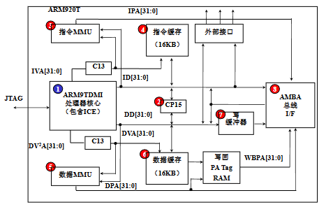

S3C2440 体系结构：

- **存储控制**：支持 NOR/NAND Flash 启动（内置 4KB 启动缓冲区），8 个存储 Bank（共 1GB 地址空间），兼容 SRAM、SDRAM 等存储器件，支持大小端。
- **显示接口**：LCD 控制器支持 STN（最高 4096 色）和 TFT（最高 16M 色）屏幕，适配常见的 320×240、640×480 等分辨率。
- **通信接口**：3 路 UART（带 64B FIFO，支持 IrDA 红外通信）、2 路 SPI、1 路 IIC（多主机支持）、1 路 IIS（音频）、2 路 USB 主机 + 1 路 USB 设备（1.1 版）、SD/MMC 卡接口。
- **数据采集与控制**：8 通道 10 位 ADC（模数转换，最高 500Kbps）+ 触摸屏接口、4 路 PWM 定时器、看门狗定时器、RTC 实时时钟（带日历 / 闹钟）。
- **扩展能力**：130 个通用 I/O 口（支持复用）、24 路外部中断、4 通道 DMA（解放 CPU，提升数据传输效率）、摄像头接口（最高 4096×4096 像素输入）。共**60个中断源**

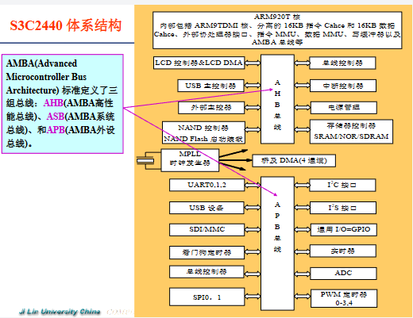


---

## 存储器控制器

S3C2440 把 “存储控制模块” 集成在芯片内部，相当于给外部所有存储器配了一个 “专属管家”

- 在访问存储单元时，可能采取**平板式的地址映射**机制对其进行读写，或需要使用**虚拟地址**对其进行读写。  
- ARM处理器中引入了**存储管理单元（MMU）**来管理存储系统。

| 关键参数                                               | 含义（通俗解读）                                             | 核心作用                                                     |
| ------------------------------------------------------ | ------------------------------------------------------------ | ------------------------------------------------------------ |
| 外部存储空间总容量：1GB                                | S3C2440 能管理的外部存储最大范围，拆成 8 个 “子仓库”         | 划定 CPU 可访问的外部存储边界                                |
| 8 个 Bank（存储块），每块 128MB                        | 把 1GB 空间分成 8 个独立区域，用 nGCS7~0 引脚 “点名” 访问（比如 nGCS0 有效 = 访问 Bank0）同时地址地址为0x0000_0000 | 给不同类型存储器 “分配专属地址段”，避免冲突                  |
| 大小端模式（软件可选）                                 | 小端：低字节存在低地址（如 0x1234，0x12 在高地址、0x34 在低地址）；大端相反 | 适配不同硬件 / 软件的字节存储习惯（嵌入式常用小端）          |
| 数据位宽                                               | Bank0：16/32 位（适配启动类器件，如 NOR Flash）；其他 Bank：8/16/32 位 | 匹配不同存储器的 “数据传输宽度”（比如 8 位串口 Flash 用 8 位宽，32 位 SDRAM 用 32 位宽） |
| Bank0-5：接 ROM/SRAM；Bank6-7：接 ROM/SRAM/SDRAM       | 不同 Bank 的 “适配器件类型”                                  | SDRAM 需要复杂时序控制，仅 Bank6/7 支持，Bank0-5 适配简单器件（如启动用的 NOR Flash） |
| Bank0-6 起始地址固定，Bank7 可调；Bank6-7 寻址范围可调 | 地址灵活性设计                                               | Bank7 可适配不同容量的 SDRAM，比如接 128MB 或 256MB SDRAM 时，调整起始地址避免浪费 |

分清 “嵌入式场景下各类存储器的用途差异”

| 存储类型               | 核心特性                                 | 嵌入式典型用途                                    | 关键注意点                                                |
| ---------------------- | ---------------------------------------- | ------------------------------------------------- | --------------------------------------------------------- |
| ROM/EEPROM/Flash       | 只读（EEPROM 可电擦写）、掉电数据不丢    | 存固定程序 / 参数（如早期 bootloader）            | 速度慢，仅读 / 少量写                                     |
| SRAM                   | 静态、读写快、掉电丢数据                 | 嵌入式系统 “高速缓存区”（如 CPU 附近的临时数据）  | 成本高，容量小                                            |
| SDRAM                  | 同步动态、读写较快、掉电丢数据           | 运行时的内存（如 Linux 系统的内存空间）           | 需时钟同步，仅 Bank6/7 支持                               |
| NOR Flash              | 按 “字” 操作、支持 XIP（片上运行）、可靠 | 启动分区（存 bootloader）、小容量程序存储         | 成本高，容量小，可直接启动                                |
| NAND Flash             | 按 “块” 操作、容量大、速度快、有坏区     | 存系统镜像、大数据（如 Android 的 userdata 分区） | 不支持 XIP，需 ECC 校验（纠错），启动时要靠 Steppingstone |
| SIMM/DIMM/RIMM/SO-DIMM | 内存模组（内存条）的物理形态             | 区分台式机（DIMM）、笔记本（SO-DIMM）等硬件适配   | 仅硬件选型时关注，编程层面不用管                          |

S3C2440 复位后存储器映射：

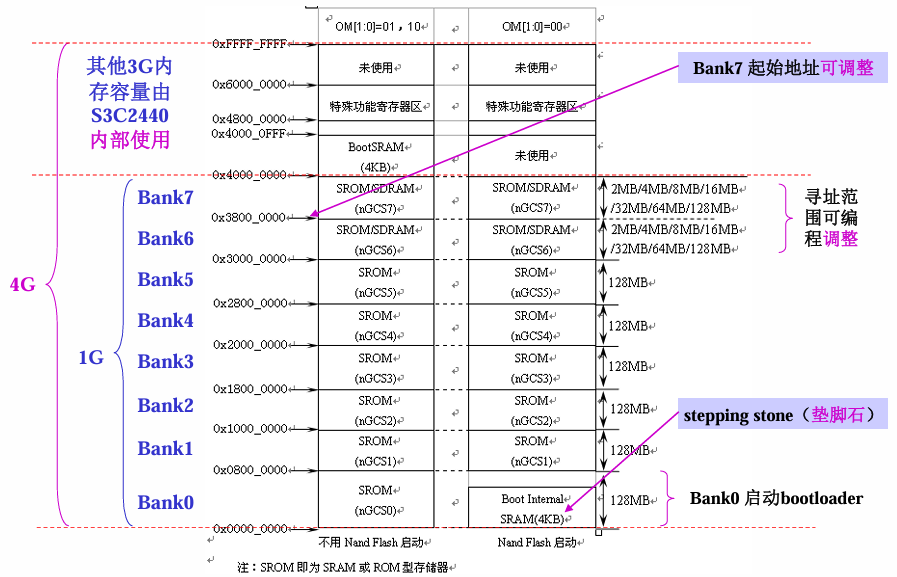


### 引脚 OM[1:0] 设置

OM [1] 和 OM [0] 是 S3C2440 的硬件引脚（需在硬件设计时接高 / 低电平），直接决定复位后 Bank0 的工作模式

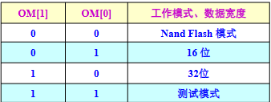

> [!tip]
>
> Steppingstone 的作用（NAND 启动的核心）
>
> NAND Flash 的物理特性是 “不能片上运行代码（XIP）”，但成本低、容量大，因此 S3C2440 设计了 4KB 的 Steppingstone（内置 SRAM）：
>
> - 当 OM [1:0]=00（NAND 模式）时，复位后硬件自动完成：
>   1. 从 NAND Flash 的起始地址读取前 4KB 的 bootloader 代码；
>   2. 把代码拷贝到 Steppingstone（地址映射为 0x00000000~0x00000FFF）；
>   3. CPU 跳转到 0x00000000，执行 Steppingstone 中的代码；
> - 这段 4KB 代码的核心任务：**初始化 SDRAM，然后把 NAND Flash 中剩余的 bootloader / 内核镜像拷贝到 SDRAM**，完成 “接力启动”。


### 存储器控制器特殊功能寄存器（SFR）

13 个寄存器按功能可分为 5 组，核心对应外部存储的 “总线宽度→时序→刷新→容量→模式”，复位值决定了上电后的默认状态，实操需按需修改：

| 分组           | 寄存器            | 地址          | 核心功能                               | 关键特点                                  |
| -------------- | ----------------- | ------------- | -------------------------------------- | ----------------------------------------- |
| 总线宽度控制   | BWSCON            | 0x48000000    | 8 个 Bank 的总线宽度 + WAIT 使能       | 每个 Bank 独立配置，是硬件适配的基础      |
| 存储块时序控制 | BANKCON0~BANKCON7 | 0x48000004 起 | 对应 Bank 的访问时序（如地址建立时间） | BANK0~5 适配 ROM/SRAM，BANK6~7 支持 SDRAM |
| SDRAM 刷新控制 | REFRESH           | 0x48000024    | SDRAM 刷新模式 / 周期 / 计数值         | 仅 SDRAM 需配置，否则会丢失数据           |
| 容量与省电控制 | BANKSIZE          | 0x48000028    | BANK6/7 容量 + 突发操作 + 省电模式     | 决定 SDRAM 的总容量，影响地址映射范围     |
| SDRAM 模式控制 | MRSRB6~MRSRB7     | 0x4800002C 起 | SDRAM 写突发长度 / 测试模式            | 复位值不确定，必须手动配置才能使用 SDRAM  |


1. 总线宽度控制寄存器 BWSCON（0x48000000）

   告诉 CPU“每个 Bank 的存储器是 8/16/32 位宽”，以及是否启用 WAIT 等待信号（适配低速存储器）。

   - 寄存器结构：每个 Bank 占 4 位（STn+WSn+DWn），共 32 位覆盖 Bank7~0（Reserved [0] 保留为 0）。
   - 关键位含义（以 Bank7 为例，其他 Bank 同理）：
     1. ST7（bit31）：是否使用 UB/LB（高 / 低字节控制），0 = 用 nWBE 引脚，1 = 用 nBE 引脚（SRAM 常用）；
     2. WS7（bit30）：WAIT 信号使能，0 = 不启用，1 = 启用（低速存储器需启用，避免数据出错）；
     3. DW7（bit29~28）：总线宽度，00=8bit、01=16bit、10=32bit（必须与硬件接线一致）。
   - 实操示例：Bank0 接 16 位 NOR Flash，配置为 “16bit 宽度 + 不启用 WAIT”→ BWSCON 的 DW0=01（bit5~4）、WS0=0（bit6）。

2. 存储块控制寄存器 BANKCONn（0x48000004 起）

   配置每个 Bank 的访问时序（如地址建立时间、访问周期），时序不匹配会导致读写出错。

3. SDRAM 刷新控制寄存器 REFRESH（0x48000024）

   SDRAM 是动态存储器，需定期刷新才能保留数据，此寄存器配置刷新规则（ROM/SRAM 无需配置）。比如设置刷新模式､刷新周期､刷新计数值｡

4. 存储块大小控制寄存器 BANKSIZE（0x48000028）

   配置 BANK6/7 的 SDRAM 容量，以及 CPU 突发操作、SDRAM 省电模式。

5. SDRAM 模式寄存器 MRSRB6~MRSRB7（0x4800002C/30）

   配置 SDRAM 的工作模式（如写突发长度），复位值不确定，必须手动配置。

---


### NAND Flash 控制器

S3C2440 的 NAND Flash 控制器是 “低成本大容量存储方案” 的核心，核心解决 “NAND Flash 不能直接运行代码（无 XIP）” 的问题，通过**内置缓冲 + 专用时序 / 寄存器**，实现启动加载、数据读写和错误校验

NOR vs NAND 核心差异（决定控制器设计）

| 关键差异点 | NOR Flash                | NAND Flash               | 控制器要解决的问题                |
| ---------- | ------------------------ | ------------------------ | --------------------------------- |
| 核心能力   | 支持 XIP（片上运行代码） | 不支持 XIP（仅顺序访问） | 需通过 Steppingstone 缓冲启动代码 |
| 容量与价格 | 小（1MB~32MB）、价高     | 大（16MB~512MB）、价低   | 适配大容量存储的地址 / 命令时序   |
| 可靠性     | 位反转少                 | 位反转常见               | 内置 ECC 硬件校验纠错             |
| 接口与速度 | 同 RAM 接口、擦写慢      | I/O 复用接口、擦写快     | 提供专用命令 / 地址 / 数据时序    |

1. 实现 NAND Flash 启动：通过 Steppingstone 缓冲（4KB 内置 SRAM 缓冲器），让系统能从低成本 NAND Flash 启动；
2. NAND Flash有2种工作模式：自动启动模式、 NAND Flash模式。
   1. 自动启动模式：重启时自动将NAND Flash上的启动代码加载到 **4KB的Steppingstone**上，然后代码在Steppingstone上执行。
   2. NAND Flash模式（软件模式）：作为**一般性存储器**，可读可写

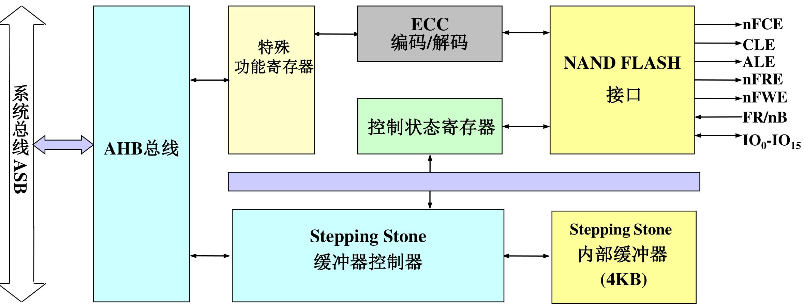

1. 启动前硬件引脚配置（OM+GPG 引脚）

| 引脚组合     | 配置功能                                                     |
| ------------ | ------------------------------------------------------------ |
| OM[1:0] = 00 | 使能 NAND Flash 启动模式（必设）                             |
| NCON         | 选择 NAND 类型：0 = 普通（256/512 字节页），1 = 高级（1K/2K 字节页） |
| GPG13        | 页容量选择：配合 NCON，0=256/1K 字节，1=512/2K 字节          |
| GPG14        | 地址周期选择：配合 NCON，0=3/4 个周期，1=4/5 个周期          |
| GPG15        | 总线宽度选择：0=8 位，1=16 位（需与 NAND 芯片匹配）          |

2. 时序配置（NFCONF 寄存器）

- 核心时序参数（控制信号同步，避免读写错误）：
  1. TACLS：CLE/ALE 信号持续时间 = HCLK × TACLS（0~3 可选）；
  2. TWRPH0：nWE/nRE 信号持续时间 = HCLK × (TWRPH0+1)（0~7 可选）；
  3. TWRPH1：数据有效时间 = HCLK × (TWRPH1+1)（0~7 可选）；
- 示例：HCLK=100MHz（周期 10ns），设 TACLS=1（10ns）、TWRPH0=0（10ns）、TWRPH1=0（10ns），适配大多数 NAND 芯片。

---


## GPIO

GPIO: `General Purpose I/O ports`,**通用输入/输出**，即ARM芯片中称为输 入输出端口｡

GPIO 就是芯片上的 “通用电引脚”—— 你可以通过代码控制这些引脚输出高电平（比如 3.3V）或低电平（0V），也能**读取外部设备加到引脚上的电平**（比如按键按下是低电平、松开是高电平）。

S3C2440的GPIO：**130个，分为9组**，GPA ~ GPJ，这9组GPIO端口均为多功能端口，端口功能可以编程设置

1. “先配置，后使用” 是铁律

   所有 GPIO 引脚默认可能不是 “普通输入 / 输出” 功能（比如 GPA 组默认是地址总线），必须在程序一开始（主程序运行前）**配置对应的 “控制寄存器”**（比如 GPFCON、GPGCON），选定你需要的功能（比如普通 IO、中断、UART 等），否则引脚不会按预期工作。

2. “不用特殊功能，就当普通 IO”：

   如果一个引脚你不用来做 UART、中断、LCD 等特殊功能，就可以把它设为 “普通输入 / 输出”，和 51 单片机的 IO 口完全一样用。

3. 分组的意义

   9 组 GPIO（GPA~GPJ）不是随便分的，每组有 “主打功能”：

   - GPA：地址总线 / 片选信号（主要**输出**并且只能作为输出口，几乎不用作普通 IO）；
   - GPF/GPG：支持外部中断（常用作按键中断、传感器中断）；
   - GPC/GPD：LCD 接口（接显示屏的行 / 列驱动）；
   - GPH：UART/USB 等通信接口；
   - GPJ：摄像头接口；

   分组的目的是让硬件接线更规整，比如接 LCD 就优先用 GPC/GPD，接按键中断就优先用 GPF/GPG。

### GPIO（GPA~GPJ）的完整功能

- 功能 1（兜底）：所有引脚默认支持「普通输入 / 输出」（和 51 单片机 IO 口一样，控电平、读信号）；
- 功能 2/3（专用）：为特定外设设计的 “专属接口”（如 LCD、UART、中断），是嵌入式开发的核心配置；
- 排他性：一个引脚同一时间只能选一种功能（比如 GPD8 要么当普通 IO，要么当 LCD 的 VD16，要么当 SPI 的 SPIMISO1）。

通过每组端口的「控制寄存器」（如 GPACON、GPBCON）配置 “功能选择位”（每引脚占 2~4 位），锁定所需功能。


### 端口A~J的引脚功能

1. 端口 A（GPA）：系统底层控制专用（23 引脚）

   - 普通输出口（仅能输出高低电平）

   - ① NAND Flash 控制：GPA17=CLE（命令锁存）、GPA18=ALE（地址锁存）、GPA19=nFWE（写允许）、GPA20=nFRE（读允许）、GPA22=nFCE（片选）；

     ② 地址总线：GPA0~11=ADDR0、ADDR16~26（外部存储地址）；12位

     ③ Bank 片选：GPA12~16=nGCS1~5（外部存储 Bank1~5 选择）

2.  端口 B（GPB）：DMA / 定时器专属（11 引脚）

   - 普通输入 / 输出（无限制）

   - ① DMA 请求 / 响应：GPB5~10=nXBACK/nXBREQ/nXDACK0/1/nXDREQ0/1（DMA 传输的触发 / 应答信号）；

     ② 定时器输出：GPB0~3=TOUT0~3（PWM 波形输出）、GPB4=TCLK0（定时器时钟）

3. 端口 C（GPC）：LCD 控制 + 低 8 位数据（16 引脚）

   - 普通输入 / 输出

   - ① LCD 控制信号：GPC0=LEND、GPC1=VCLK（像素时钟）、GPC2=VLINE（行同步）、GPC3=VFRAME（场同步）等；

     ② LCD 数据：GPC8~15=VD0~VD7（LCD 低 8 位像素数据）

4. 端口 D（GPD）：LCD 高 16 位数据 + SPI 复用（16 引脚）

   - 普通输入 / 输出
   - LCD 高 16 位数据：GPD0~15=VD8~23（和 GPC 的 VD0~7 组成 24 位 LCD 数据）
   - PI1 接口：GPD8=SPIMISO1、GPD9=SPIMOSI1、GPD10=SPICLK1；SPI 片选：GPD14=nSS1、GPD15=nSS0

5. 端口 E（GPE）：通信外设 “一站式”（16 引脚）

   - 普通输入 / 输出

   - ① SPI0：GPE11=SPIMISO0、GPE12=SPIMOSI0、GPE13=SPICLK0；

     ② SD 卡：GPE5=SDCLK、GPE6=SDCMD、GPE7~10=SDDAT0~3；

     ③ IIC：GPE14=IICSCL、GPE15=IICSDA；

     ④ IIS 音频：GPE0=I2SLRCK、GPE1=I2SSCLK、GPE2=CDCLK、GPE3=I2SSDI、GPE4=I2SSDO

   - AC97 音频：GPE0=AC_SYNC、GPE1=AC_BIT_CLK、GPE2=AC_nRESET、GPE3=AC_SDATA_IN、GPE4=AC_SDATA_OUT

6. 端口 F（GPF）：核心外部中断（8 引脚）

   - 普通输入 / 输出
   - 外部中断 EINT0~7：GPF0=EINT0、GPF1=EINT1…GPF7=EINT7

7. 端口 G（GPG）：扩展外部中断 + UART/SPI（16 引脚）

   - 普通输入 / 输出
   - 外部中断 EINT8~23：GPG0=EINT8、GPG1=EINT9…GPG15=EINT23（GPG4 额外支持 LCD_PWREN，LCD 电源控制）
   - UART1 流控：GPG9=nRTS1、GPG10=nCTS1、GPG11=TCLK1；SPI1：GPG5=SPIMISO1、GPG6=SPIMOSI1、GPG7=SPICLK1

8. 端口 H（GPH）：UART 通信 + 时钟输出（11 引脚）

   - 普通输入 / 输出

   - ① UART 通信：GPH2=TXD0、GPH3=RXD0（UART0，调试首选）；GPH4=TXD1、GPH5=RXD1（UART1）；GPH6=TXD2、GPH7=RXD2（UART2）；

     ② 时钟输出：GPH8=UEXTCLK、GPH9=CLKOUT0、GPH10=CLKOUT1

   - UART 流控：GPH0=nCTS0、GPH1=nRTS0（UART0）；GPH6=nRTS1、GPH7=nCTS1（UART2）

9. 端口 J（GPJ）：摄像头接口专用（13 引脚）

   - 普通输入 / 输出

   - 摄像头全套接口：

     ① 数据：GPJ0~7=CAMDATA0~7；

     ② 控制：GPJ8=CAMPCLK（像素时钟）、GPJ9=CAMVSYNC（场同步）、GPJ10=CAMHREF（行同步）、GPJ11=CAMCLKOUT（摄像头时钟）、GPJ12=CAMRESET（摄像头复位)

> [!note]
>
> - 系统底层（启动 / NAND）→ 找 GPA；
> - LCD 显示 → 找 GPC+GPD；
> - UART 调试 → 找 GPH（优先 GPH2/3=UART0）；
> - 中断 → 核心中断找 GPF，扩展中断找 GPG；
> - 通信外设（SD/IIC/SPI）→ 找 GPE；
> - 摄像头 → 找 GPJ；
> - DMA / 定时器 → 找 GPB；
> - 普通 IO（LED / 按键）→ 优先用未被专用功能占用的 GPB/GPE/GPG 引脚。

---


### 端口配置寄存器

- 通过编程设置端口控制寄存器，以决定使用每个I/O引脚的哪种功能
- I/O端口的状态（如输入/输出、数据线是否挂起），用户也需要通过编程设置控制寄存器来确定

S3C2440有9个端口，每个端口一般对应3个寄存器（端口A只有2个）：

| 寄存器类型              | 核心作用                                   | 通用操作逻辑                                                 |
| ----------------------- | ------------------------------------------ | ------------------------------------------------------------ |
| 控制寄存器（***CON）    | 定义引脚功能（输入 / 输出 / 专用外设功能） | 可读可写，通过特定位配置，不同端口位宽（1 位 / 2 位）对应不同功能选择 |
| 数据寄存器（***DAT）    | 存储引脚输入 / 输出电平数据                | 可读可写，1 位对应 1 个引脚，1 = 高电平，0 = 低电平          |
| 上拉电阻寄存器（***UP） | 控制引脚是否启用内部上拉电阻               | 可读可写，1 位对应 1 个引脚，1 = 禁用上拉，0 = 启用上拉（GPA 无此寄存器） |

1. 端口 A（GPA）：无内部上拉，侧重系统控制

| 寄存器         | 地址       | 复位值   | 核心细节                                                     |
| -------------- | ---------- | -------- | ------------------------------------------------------------ |
| GPACON（控制） | 0x56000000 | 0x7FFFFF | 每引脚 1 位控制，仅 2 种功能（0 = 普通输出，1 = 专用功能：地址总线 / NAND 控制）；GPA 仅支持输出，无输入功能 |
| GPADAT（数据） | 0x56000004 | 不确定   | 位 [22:0] 存储端口数据，仅用于输出操作                       |

2. 端口 B（GPB）：支持 DMA / 定时器功能

| 寄存器         | 地址       | 复位值   | 核心细节                                                     |
| -------------- | ---------- | -------- | ------------------------------------------------------------ |
| GPBCON（控制） | 0x56000010 | 0x000000 | 每引脚 2 位控制，4 种选择（00 = 输入，01 = 输出，10=DMA / 定时器功能，11 = 保留） |
| GPBDAT（数据） | 0x56000014 | 不确定   | 位 [10:0] 存储 11 个引脚数据，输入时读、输出时写             |
| GPBUP（上拉）  | 0x56000018 | 0x000    | 位 [10:0] 控制对应引脚上拉，默认启用上拉                     |

3. 端口 C（GPC）：LCD 接口专用

| 寄存器         | 地址       | 复位值   | 核心细节                                                     |
| -------------- | ---------- | -------- | ------------------------------------------------------------ |
| GPCCON（控制） | 0x56000020 | 0x000000 | 每引脚 2 位控制，4 种选择（00 = 输入，01 = 输出，10=LCD 控制信号 / VD0~VD7，11 = 保留） |
| GPCDAT（数据） | 0x56000024 | 不确定   | 位 [15:0] 存储 16 个引脚数据，适配 LCD 数据传输              |
| GPCUP（上拉）  | 0x56000028 | 0x0000   | 位 [15:0] 控制上拉，默认启用                                 |

4. 端口 D（GPD）：LCD 高 16 位数据 + SPI 复用

| 寄存器         | 地址       | 复位值   | 核心细节                                                     |
| -------------- | ---------- | -------- | ------------------------------------------------------------ |
| GPDCON（控制） | 0x56000030 | 0x000000 | 每引脚 2 位控制，4 种选择（00 = 输入，01 = 输出，10=VD8~VD23，11=SPI 片选 /nSS0，仅 GPD15 支持） |
| GPDDAT（数据） | 0x56000034 | 不确定   | 位 [15:0] 存储 16 个引脚数据，兼顾 LCD 和普通 IO 需求        |
| GPDUP（上拉）  | 0x56000038 | 0x0000   | 位 [15:0] 控制上拉，默认启用                                 |

5. 端口 E（GPE）：多通信外设集中区

| 寄存器         | 地址       | 复位值   | 核心细节                                                     |
| -------------- | ---------- | -------- | ------------------------------------------------------------ |
| GPECON（控制） | 0x56000040 | 0x000000 | 每引脚 2 位控制，4 种选择（00 = 输入，01 = 输出，10=SPI/SD 卡 / IIC/IIS，11=AC97 音频功能）；GPE14~15 为无上拉漏极开路 |
| GPEDAT（数据） | 0x56000044 | 不确定   | 位 [15:0] 存储 16 个引脚数据，适配多种通信外设数据传输       |
| GPEUP（上拉）  | 0x56000048 | 0x0000   | 位 [15:0] 控制上拉，默认启用（GPE14~15 无内部上拉）          |

6. 端口 F（GPF）：核心外部中断源

| 寄存器         | 地址       | 复位值   | 核心细节                                                     |
| -------------- | ---------- | -------- | ------------------------------------------------------------ |
| GPFCON（控制） | 0x56000050 | 0x000000 | 每引脚 2 位控制，4 种选择（00 = 输入，01 = 输出，10=EINT0~EINT7 中断，11 = 保留） |
| GPFDAT（数据） | 0x56000054 | 不确定   | 位 [7:0] 存储 8 个引脚数据，中断场景中可读取触发电平         |
| GPFUP（上拉）  | 0x56000058 | 0x00     | 位 [7:0] 控制上拉，中断引脚建议禁用上拉                      |

7. 端口 G（GPG）：扩展中断 + UART/SPI 复用

| 寄存器         | 地址       | 复位值     | 核心细节                                                     |
| -------------- | ---------- | ---------- | ------------------------------------------------------------ |
| GPGCON（控制） | 0x56000060 | 0x00000000 | 每引脚 2 位控制，4 种选择（00 = 输入，01 = 输出，10=EINT8~EINT23 中断，11=UART1/SPI1 功能） |
| GPGDAT（数据） | 0x56000064 | 不确定     | 位 [15:0] 存储 16 个引脚数据，兼顾中断和通信功能             |
| GPGUP（上拉）  | 0x56000068 | 0xF800     | 位 [15:0] 控制上拉，默认高 8 位禁用上拉（0xF800），低 8 位启用 |

8. 端口 H（GPH）：UART 通信 + 时钟输出

| 寄存器         | 地址       | 复位值     | 核心细节                                                     |
| -------------- | ---------- | ---------- | ------------------------------------------------------------ |
| GPHCON（控制） | 0x56000070 | 0x00000000 | 每引脚 2 位控制，4 种选择（00 = 输入，01 = 输出，10=UART0~UART2 / 时钟输出，11=UART 流控） |
| GPHDAT（数据） | 0x56000074 | 不确定     | 位 [10:0] 存储 11 个引脚数据，UART 调试核心端口              |
| GPHUP（上拉）  | 0x56000078 | 0x000      | 位 [10:0] 控制上拉，默认启用                                 |

9. 端口 J（GPJ）：摄像头接口专用

| 寄存器         | 地址       | 复位值     | 核心细节                                                     |
| -------------- | ---------- | ---------- | ------------------------------------------------------------ |
| GPJCON（控制） | 0x560000D0 | 0x00000000 | 每引脚 2 位控制，4 种选择（00 = 输入，01 = 输出，10 = 摄像头数据 / 控制信号，11 = 保留） |
| GPJDAT（数据） | 0x560000D4 | 不确定     | 位 [12:0] 存储 13 个引脚数据，适配摄像头数据采集             |
| GPJUP（上拉）  | 0x560000D8 | 0x000      | 位 [12:0] 控制上拉，默认启用                                 |


> [!note]
>
> 1. **地址规律**：每组**端口寄存器地址连续，间隔 4 字节**（如 \*\*\*CON→\*\*\*DAT→***UP 依次递增 4 字节）；同时GPA的起始地址为0x5600_0000，GPB为0x5600_0010，即**每个端口的寄存器地址相差`0x10`**
> 2. **复位值特点**：控制寄存器复位值多为 0x000000（GPA 为 0x7FFFFF），数据寄存器复位值均不确定，上拉寄存器复位值多为 0x000（GPG 为 0xF800）；
> 3. **配置顺序**：必须先通过\*\*\*CON 配置引脚功能，再用*\*\*DAT 读写数据，最后按需配置 ***UP 控制上拉，顺序错误会导致功能失效；
> 4. **功能冲突规避**：同一引脚同一时间仅能选择一种功能，需提前规划引脚用途，避免复用冲突。


### GPIO 其他寄存器

1. 多控制寄存器（MISCCR）：全局功能综合控制

   统筹 USB 模式、时钟输出、电池保护、数据线拉电阻等全局功能，是跨外设的基础控制寄存器。

2. DCLK 控制寄存器（DCLKCON）：外部时钟精准调控

   专门控制外部源时钟 DCLK0 和 DCLK1 的使能、分频、占空比，适配需要精准时钟的外设。

3. 外部中断控制寄存器（EXTINT0~EXTINT2）：中断触发方式配置

   共有3个，分别为EXTINT0、EXTINT1、EXTINT2。对24个外部中断请求信号（ EINT0 ~EINT23）的有效触发方式进
   行选择。
   EXTINT0地址=0x56000088 ，复位值=0x00000000，可读可写。
   EXTINT1地址=0x5600008c ，复位值=0x00000000，可读可写。
   EXTINT2地址=0x56000090 ，复位值=0x00000000，可读可写

   每 3 位控制一个中断，支持 5 种模式（000 = 低电平、001 = 高电平、01×= 下降沿、10×= 上升沿、11×= 边沿触发）

   滤波器使能：EXTINT1~EXTINT2 含 FLTENx 位（1 = 使能滤波器，0 = 不使能），配合 EINTFLTn 实现防抖

4. 外部中断过滤寄存器（EINTFLT0~EINTFLT3）：中断防抖控制

   过滤外部中断引脚的抖动信号，确保中断触发稳定（有效电平需保持≥40ns）。

5. 外部中断屏蔽 / 未决寄存器（EINTMSK/EINTPND）：中断状态管理

   控制外部中断的屏蔽与否，并记录中断请求状态，是中断响应的 “开关” 与 “状态指示器”。

   - EINTMSK：位 [4:23] 对应 EINT4~EINT23，0 = 不屏蔽（允许中断），1 = 屏蔽；位 [0:3] 保留。
   - EINTPND：位 [4:23] 对应 EINT4~EINT23，1 = 有中断请求（未处理），0 = 无请求；需手动写 1 清除未决状态。

6. 通用状态寄存器（GSTATUS0~GSTATUS4）：系统状态监测

   读取外部引脚状态、芯片标识、复位原因，保存关键数据，是系统诊断的重要依据。

   - GSTATUS0（0x560000AC）：只读，反映 nWAIT/NCON/RnB/BATT_FLT 引脚实时状态；
   - GSTATUS1（0x560000B0）：只读，芯片 ID 复位值 0x32440001（S3C2440 标识）；
   - GSTATUS2（0x560000B4）：可读可写，记录复位原因（WDTRST = 看门狗复位、SLEEPRST = 节能复位、PWRST = 上电复位）；
   - GSTATUS3~4（0x560000B8/BC）：可读可写，上电复位清空，否则保存数据（可被 nRESET 或看门狗清 0）。

7. 驱动能力控制寄存器（DSC0~DSC1）：I/O 驱动强度调节

   配置地址线、数据线、控制线的驱动电流，避免因驱动不足导致的信号不稳定。

8. 内存休眠控制寄存器（MSLCON）：休眠模式引脚状态配置

   定义系统休眠时，存储器接口相关引脚的状态（高阻、闲置、输出 0），保护外设与内存。


### **I/O应用实例**

> [!important]
>
> GPIO 的配置与使用核心遵循 “功能定义→辅助配置→数据读写” 的固定流程，

首先在进行一下配置前需要明确配置的端口，从而确定端口各个寄存器的地址用于绑定

- 定义寄存器时添加`volatile`关键字（如`#define rGPFCON (*(volatile unsigned *)0x56000050)`），禁止编译器优化，确保每次读写都是实际操作硬件寄存器。

#### 1. 引脚功能配置（核心第一步）

- 控制寄存器（***CON），如 GPFCON（地址 0x56000050）。
- 明确引脚是 “输入 / 输出” 还是 “专用功能（如中断、通信接口）”，避免功能冲突。
- 采用 “**先清后置**” 的位操作逻辑：先通过 “&= 掩码” 清除目标引脚原有配置（不影响其他引脚），再通过 “|= 配置值” 设定目标功能。

#### 2. 辅助配置（上拉 / 下拉电阻）

- **操作对象**：上拉电阻寄存器（***UP），如 GPFUP（地址 0x56000058）。
- **核心目的**：避免输入引脚电平漂浮，或增强输出引脚驱动稳定性（上拉电阻使引脚默认高电平，下拉电阻默认低电平，S3C2440 仅内置上拉）。
- 实操要点
  - 位操作精准控制：1 = 禁用上拉，0 = 启用上拉，无需改动的引脚通过掩码保留原有状态。
  - 示例（GPF6~GPF3 启用上拉）：`rGPFUP &= 0x87;`（0x87=10000111，仅将 GPF6~GPF3 位清 0 启用上拉，其他位不变）。
- 输出引脚建议启用上拉（增强驱动），**中断引脚按需禁用上拉**（避免干扰触发信号）。

#### 3. 数据读写（功能实现核心）

- 数据寄存器（***DAT），如 GPFDAT（地址 0x56000054）。
- 输出模式时写入电平（控制外设），输入模式时读取电平（获取外设状态）。
  - 输出操作：**直接写**入对应值，1 = 高电平，0 = 低电平（如 LED 亮 = 引脚低电平，`rGPFDAT=0xF7` 对应 GPF3 低电平，LED1 亮）。
  - 输入操作：直接读取寄存器值，通过**位掩码**提取目标引脚状态（如`Var = rGPFDAT & 0x08;` 读取 GPF3 电平）。
- **数据规律**：多个引脚控制时，可**定义数组存储对应电平组合**（如 LED 流水灯数组`ledtab[]={0xf7,0xef,0xdf,0xbf}`，依次对应 4 个 LED 单独点亮的电平配置）。

```c
// 1. 定义GPIO寄存器地址（根据芯片手册修改）
#define rGPIO_CON (*(volatile unsigned *)0xXXXXXXX)  // 控制寄存器地址
#define rGPIO_DAT (*(volatile unsigned *)0xXXXXXXX)  // 数据寄存器地址
#define rGPIO_UP  (*(volatile unsigned *)0xXXXXXXX)  // 上拉寄存器地址

// 2. 延时函数（按需调整时长）
void Delay(unsigned int x) {
    unsigned int i,j,k;
    for(i=0;i<=x;i++) for(j=0;j<=0xff;j++) for(k=0;k<=0xff;k++);
}

// 3. GPIO初始化（功能+上拉配置）
void GPIO_Init() {
    // 步骤1：配置目标引脚为输出/输入
    rGPIO_CON &= 0xXXXX;  // 清除原有配置（掩码根据引脚位置计算）
    rGPIO_CON |= 0xXXXX;  // 设定目标功能（01=输出，00=输入）
    
    // 步骤2：配置上拉电阻
    rGPIO_UP &= 0xXXXX;   // 启用/禁用目标引脚上拉（0=启用，1=禁用）
}

// 4. 外设控制（数据读写）
void GPIO_Control() {
    while(1) {
        rGPIO_DAT = 0xXX;  // 写入电平（控制外设状态，如LED亮）
        Delay(100);       // 维持状态
        rGPIO_DAT = 0xXX;  // 切换电平（如LED灭）
        Delay(100);
    }
}
```


## 中断系统

S3C2440 的中断系统是芯片响应 “异步事件”（如外设请求、外部信号触发）的核心机制，本质是让 CPU 暂停当前任务，优先处理紧急事件，处理完后再回到原任务。

S3C2440 内置中断控制器，专门管理 60 个中断源，核心作用是**统一协调所有中断请求**

- 区分并响应两种中断请求：**FIQ（快速中断请求）**和**IRQ（普通中断请求）**
- IRQ可以被FIQ中断，但IRQ不能中断FIQ

CPU 的**程序状态寄存器（CPSR）** 中专门有两位控制中断响应，相当于中断的 “全局开关”：

- **F 位**（FIQ 屏蔽位）；**I 位**（IRQ 屏蔽位）：1屏蔽，0允许

> 注：系统启动时**默认 I=1、F=1（屏蔽所有中断）**，需在程序中手动置 0 开启对应中断。

#### 中断源

3C2440 有 60 个中断源（触发中断的事件 / 设备），但单个 32 位寄存器只能记录 32 个状态（1 位对应 1 个中断源），因此需要**多个寄存器**（如 **SRCPND、EXTINT 系列、EINTPND** 等）配合，才能完整记录和控制 60 个中断源的状态

1. 最基础的分类，核心看中断是 “芯片内部产生” 还是 “外部设备触发”：

- 内部中断源（36 个）：S3C2440 芯片内部的外设模块，是片内硬件工作时主动触发的中断；
- 外部中断源（24 个）：芯片外部的设备 / 模块，通过专用引脚触发中断；

① 必须将对应 GPIO 引脚从 “输入 / 输出模式” 配置为 “中断模式”（通过 **GPFCON/GPGCON**）；

② 禁用该引脚的上拉电阻（避免电平漂移干扰中断触发信号）；

③ 需通过 EXTINT、EINTFLT 等寄存器配置触发方式、防抖滤波。

2. 按 “中断源复杂度” 分（直接 / 复合中断源）

**SRCPND 寄存器（中断源未决寄存器）** 的细分，核心看 “一个中断标志位是否对应唯一事件”：

- 直接中断源（一级中断源）
  - SRCPND 寄存器中 1 个位仅对应**一个唯一的中断事件**，响应中断后能直接定位到具体来源；
  - **数量**：23 个（内部 19 个 + 外部 4 个）；
- 复合中断源（二级中断源）
  - SRCPND 寄存器中 1 个位对应**多个中断事件**（多个子中断源 “或逻辑” 复合），响应中断后需额外判断才能定位具体来源；
  - **数量**：37 个（内部 17 个 + 外部 20 个）；

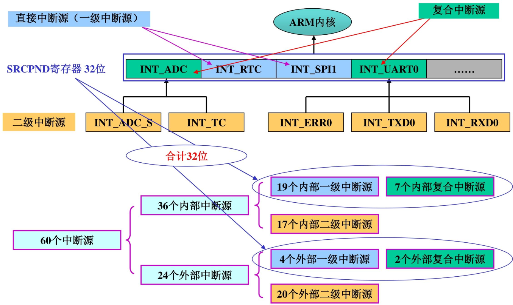


#### 中断过程

中断系统的核心是 “中断源触发→寄存器管控→程序响应” 的闭环流程，寄存器是配置核心，程序应用需遵循 “初始化→使能→处理→清除” 的固定逻辑

1. **中断触发**：内部外设（如 UART、定时器）或外部设备（如键盘、传感器）产生中断请求，对应中断源置位 SRCPND（子中断源置位 SUBSRCPND）。
2. **条件判断**：CPU 通过 CPSR 寄存器的 I/F 位判断是否允许中断（I=0 允许 IRQ，F=0 允许 FIQ），同时 INTMSK/SUBINTMSK 判断中断是否被屏蔽。
3. **优先级仲裁**：7 个仲裁器（6 个一级 + 1 个二级）按 PRIORITY 配置的模式（固定 / 循环）排序，选出最高优先级中断，置位 INTPND 并更新 INTOFFSET。
4. **程序跳转**：CPU 暂停当前任务，根据 INTOFFSET 值跳转到对应中断服务程序（ISR）。
5. **中断处理**：执行 ISR 中的业务逻辑（如数据读取、状态提示）。
6. **中断清除**：手动清除 SUBSRCPND（子中断）、SRCPND、INTPND 的对应位，避免重复响应。
7. **恢复现场**：ISR 执行完毕，CPU 恢复原任务上下文，回到中断前的程序执行点。

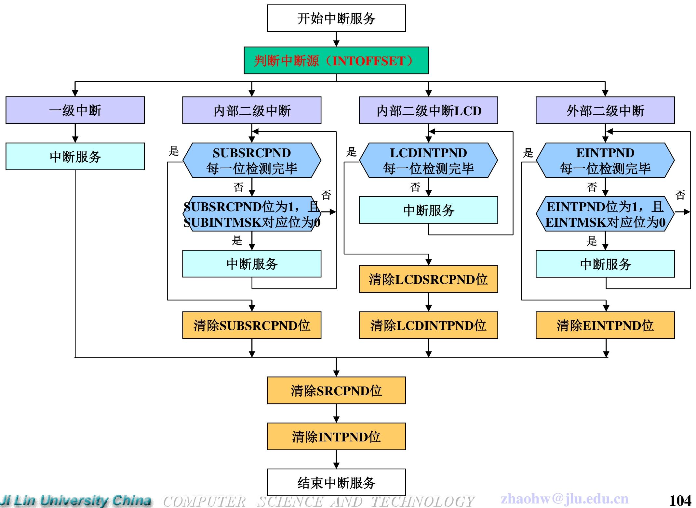

#### 寄存器配置

1. 模式与屏蔽配置（中断 “开关”）

| 寄存器    | 核心配置要点                                                 | 关键操作示例（允许 EINT0 中断）                       |
| --------- | ------------------------------------------------------------ | ----------------------------------------------------- |
| CPSR      | I=0（允许 IRQ）、F=0（允许 FIQ），通过汇编指令修改（如`msr cpsr_c, #0x50`） | 开启 IRQ 模式：`msr cpsr_c, #0x50`（I=0，模式为 IRQ） |
| INTMOD    | 配置中断为 IRQ（0）或 FIQ（1），仅 1 位可置 1（FIQ 独占）    | 设 EINT0 为 IRQ：`rINTMOD &= ~BIT_EINT0`              |
| INTMSK    | 1 = 屏蔽中断，0 = 允许中断，复位值全 1（默认屏蔽所有中断）   | 允许 EINT0：`rINTMSK &= ~BIT_EINT0`                   |
| SUBINTMSK | 屏蔽子中断源（如 UART0 的 TXD0/RXD0），1 = 屏蔽，0 = 允许    | 允许 UART0 接收中断：`rSUBINTMSK &= ~BIT_RXD0`        |

2. 优先级配置（中断 “排队规则”）

| 寄存器   | 核心配置要点                                              | 关键操作示例（默认循环优先级）       |
| -------- | --------------------------------------------------------- | ------------------------------------ |
| PRIORITY | ARB_MODE（0 = 固定，1 = 循环）、ARB_SEL（指定最低优先级） | 循环优先级：`rPRIORITY = 0x0000007F` |

3. 状态与偏移配置（中断 “定位工具”）

| 寄存器    | 核心配置要点                                         | 关键操作示例（读取中断源）                        |
| --------- | ---------------------------------------------------- | ------------------------------------------------- |
| SRCPND    | 记录中断源请求状态（1 = 有请求），需写 1 清除        | 清除 EINT0 请求：`rSRCPND = BIT_EINT0`            |
| INTPND    | 记录最高优先级未处理中断（仅 1 位置 1），需写 1 清除 | 清除 EINT0 未决：`rINTPND = BIT_EINT0`            |
| INTOFFSET | 只读，返回 INTPND 置 1 位的编号，用于定位中断源      | 读取中断编号：`unsigned int irq_num = rINTOFFSET` |
| SUBSRCPND | 记录子中断源请求状态，需写 1 清除                    | 清除 UART0 接收请求：`rSUBSRCPND = BIT_RXD0`      |

4. 外部中断专属配置（外部中断源必备）

| 寄存器     | 核心配置要点                                            | 关键操作示例（EINT0 下降沿触发）          |               |
| ---------- | ------------------------------------------------------- | ----------------------------------------- | ------------- |
| EXTINT0~2  | 配置 EINT0~23 的触发方式（000 = 低电平，01×= 下降沿等） | `rEXTINT0 &= 0xFFFFF9F9; rEXTINT0         | = 0x00000202` |
| EINTFLT0~3 | 控制外部中断滤波（滤波时钟 + 宽度），避免信号抖动       | 配置 EINT0 滤波：`rEINTFLT0 = 0x0000000F` |               |
| EINTMSK    | 屏蔽 EINT4~23（1 = 屏蔽），EINT0~3 通过 INTMSK 控制     | 允许 EINT4：`rEINTMSK &= ~(1<<4)`         |               |
| EINTPND    | 记录 EINT4~23 的未决状态，需写 1 清除                   | 清除 EINT4：`rEINTPND = (1<<4)`           |               |


#### 程序应用


1. 前期准备：硬件与宏定义

- 硬件连接：EINT0 接 GPF0、EINT2 接 GPF2，按键 K1/K2 按下触发中断。
- 宏定义（寄存器地址与位掩码）：

```c
#define rGPFCON      (*(volatile unsigned *)0x56000050)  // GPF控制寄存器
#define rGPFUP       (*(volatile unsigned *)0x56000058)  // GPF上拉寄存器
#define rEXTINT0     (*(volatile unsigned *)0x56000088)  // 外部中断控制寄存器0
#define rSRCPND      (*(volatile unsigned *)0x4A000000)  // 中断源未决寄存器
#define rINTPND      (*(volatile unsigned *)0x4A000010)  // 中断未决寄存器
#define rINTMSK      (*(volatile unsigned *)0x4A000008)  // 中断屏蔽寄存器
#define rINTOFFSET   (*(volatile unsigned *)0x4A000014)  // 中断偏移寄存器
#define BIT_EINT0    (1<<0)                             // EINT0位掩码
#define BIT_EINT2    (1<<2)                             // EINT2位掩码
```

2. 中断初始化函数（核心步骤）

初始化需完成 “GPIO 配置→中断触发方式→中断向量绑定”，避免影响其他引脚功能：

```c
// 中断服务函数声明
static void __irq Eint0_ISR(void);
static void __irq Eint2_ISR(void);

void Eint_Init(void) {
    // 步骤1：配置GPF0/EINT0、GPF2/EINT2为中断模式
    rGPFCON &= 0xFFCC;  // 清除原有配置（不影响其他引脚）
    rGPFCON |= 0x0022;  // GPF0=10（EINT0）、GPF2=10（EINT2）
    
    // 步骤2：禁用GPF0/GPF2上拉电阻（外部中断避免电平漂移）
    rGPFUP |= (1<<0) | (1<<2);
    
    // 步骤3：配置EINT0/EINT2为下降沿触发
    rEXTINT0 &= 0xFFFF_F9F9;  // 清除触发方式配置
    rEXTINT0 |= 0x0000_0202;  // EINT0/EINT2=01×（下降沿）
    
    // 步骤4：绑定中断向量（中断发生时跳转至对应ISR）
    pISR_EINT0 = (unsigned)Eint0_ISR;
    pISR_EINT2 = (unsigned)Eint2_ISR;
}
```

3. 中断使能函数（开启中断响应）

使能前需清除残留未决位，避免误触发：

```c
void Enable_Eint(void) {
    rPRIORITY = 0x0000_007F; // 使用默认的循环优先级
	rINTMOD = 0x0000_0000; // 所有中断均为默认的IRQ中断
    
    // 清除残留未决位
    rSRCPND |= BIT_EINT0 | BIT_EINT2;
    rINTPND |= BIT_EINT0 | BIT_EINT2;
    
    // 允许EINT0/EINT2中断（清0INTMSK对应位）
    rINTMSK &= ~(BIT_EINT0 | BIT_EINT2);
    
    // 开启IRQ模式（CPSR寄存器I=0）
    __asm__("msr cpsr_c, #0x50");  // 0x50对应IRQ模式，I=0
}
```

4. 中断服务函数（ISR：中断发生后的处理逻辑）

需遵循 “防抖→处理→清除” 逻辑，`__irq`关键字标记为中断函数：

```c
// EINT0中断处理函数（K1按下）
static void_irq Eint0_ISR(void) {
    Delay(10);  // 软件防抖（避免按键抖动误触发）
    Uart_Printf("EINT0 is occurred.\n");  // 业务逻辑：输出提示
    // 清除中断未决位（必须步骤，否则重复响应）
    rSRCPND = BIT_EINT0;
    rINTPND = BIT_EINT0;
}

// EINT2中断处理函数（K2按下）
static void_irq Eint2_ISR(void) {
    Delay(10);
    Uart_Printf("EINT2 is occurred.\n");
    rSRCPND = BIT_EINT2;
    rINTPND = BIT_EINT2;
}
```

5. 主程序（初始化 + 等待中断）

主程序通过死循环等待中断，中断触发时自动跳转至 ISR：

```c
int Main(void) {
    Uart_Init(115200);  // 初始化串口（用于输出提示）
    Eint_Init();        // 中断初始化
    Enable_Eint();      // 开启中断
    
    while(1) {  // 死循环等待中断
        Uart_Printf("Main program running...\n");
        Delay(50);
    }
    return 0;
}
```

---

## DMA

DMA（直接存储器访问）是 S3C2440 芯片中实现高速数据传输的关键模块，核心优势是**无需 CPU 干预**，直接在存储器与外设、存储器与存储器之间传输数据，大幅提升大批量数据传输效率。

- 通道数量：4 个独立 DMA 通道（Ch-0~Ch-3），通道间相互独立，可同时处理不同传输任务。
- 核心作用：解决 CPU 在大批量数据传输（如 UART 收发、LCD 显示、音频数据传输）中的占用问题，释放 CPU 处理其他任务。
- 启动方式：支持硬件请求（外设触发）、软件请求（程序设置）两种启动模式。

### DMA 请求方式与请求源

请求方式（2 种）

- 硬件请求（H/W 模式）：由选定的外设或外部设备触发 DMA 操作，是最常用的启动方式。
- 软件请求（S/W 模式）：通过编程设置寄存器触发 DMA，无需外设信号。

请求源（每通道 7 个，通道间不同）

每个通道可从 7 个专属请求源中选择 1 个，核心对应关系如下：

| 通道 | 核心请求源（典型场景）                                       |
| ---- | ------------------------------------------------------------ |
| Ch-0 | UART0（串口 0 数据传输）、Timer（定时器触发）、USB device EP1（USB 设备端点 1） |
| Ch-1 | UART1（串口 1 数据传输）、SPI0（SPI0 通信）、USB device EP2（USB 设备端点 2） |
| Ch-2 | IIS 音频（I2SSDO/SDI）、Timer、MICIN（麦克风输入）           |
| Ch-3 | UART2（串口 2 数据传输）、SPI1（SPI1 通信）、PCMOUT（音频输出） |

- 注：nXDREQ0/1 为外部设备请求源，可连接自定义外设。

### DMA传输方向

在“源←→目的”之间实现“高性能总线（AHB）←→外设总线（APB）”的传送

4 种组合（AHB↔AHB、AHB→APB、APB→AHB、APB↔APB），覆盖高性能总线与外设总线间所有数据流向。

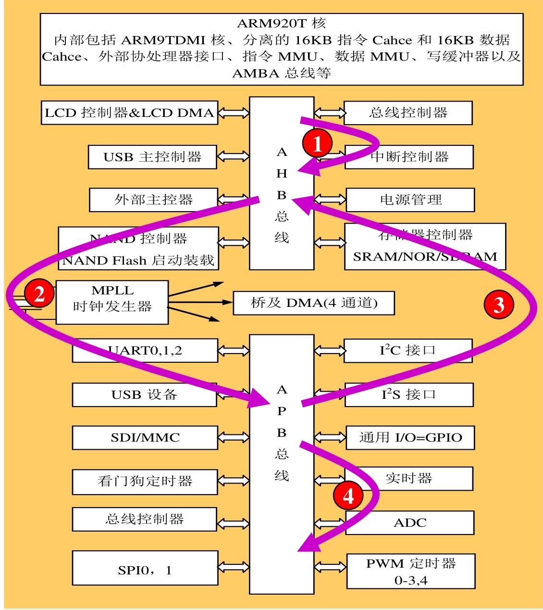

### DMA 工作机制（三态 FSM + 核心模式）

DMA 的工作流程遵循固定三态循环，确保传输有序进行：

1. 状态 1（等待请求）：初始状态，DMA ACK 和中断请求信号均为 0，等待硬件 / 软件请求触发。
2. 状态 2（计数器加载）：收到请求后，DMA ACK 置 1，从 DCON 寄存器加载 20 位传输计数值到 CURR_TC 计数器。
3. 状态 3（数据传输）：从源地址读取数据并写入目的地址，每次传输后 CURR_TC 减 1，计数器为 0 时传输结束。

DMA计数器：20位,减1型计数器,每次当前传输结束后计数器的值减1｡ 计数器值减到0时, 表示DMA操作结束｡

DMA工作模式

（1）传输模式（2 种）

- 请求模式（查询模式）：单个数据单元传输结束后，若请求信号（XnXDREQ）仍有效，立即启动下一次传输，适合连续批量传输。
- 握手模式：单个数据单元传输结束后，终止本次操作，需重新请求才能启动下一次传输，适合离散数据传输。

（2）服务模式（2 种）

- 单服务模式：一次请求仅完成 1 个数据单元传输。
- 全服务模式：一次请求完成一批数据单元传输，效率更高。

（3）基本传输模式（2 种）

- 单次传输：一次读操作 + 一次写操作，完成 1 个数据单元传输。
- 突发传输：四次连续读 + 四次连续写，完成 4 个数据单元批量传输，提升传输速率。

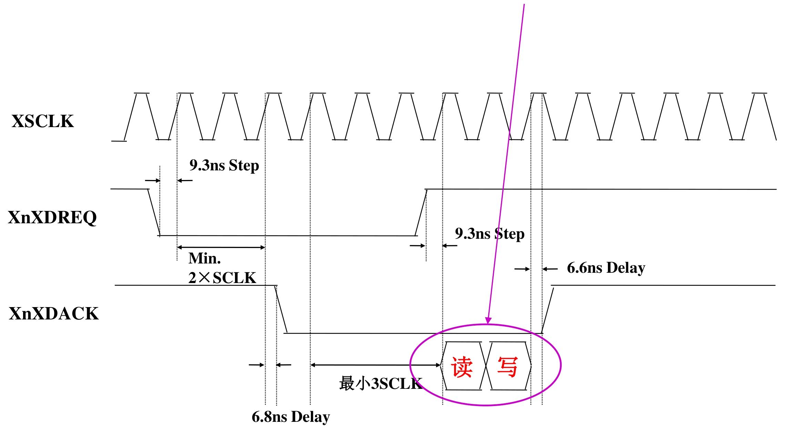


###  S3C2440芯片的DMA寄存器

1. 传输控制寄存器（6 个，可读可写）

（1）源地址相关寄存器

- DISRCn（初始源地址寄存器）：存放传输的源数据起始地址，地址范围 0x4B000000（Ch-0）~0x4B0000C0（Ch-3），复位值 0x00000000。相差0x40
- DISRCCn（源控制寄存器）：配置源地址所在总线（LOC 位：0=AHB，1=APB）和地址增量方式（INC 位：0 = 增加，1 = 固定）。

（2）目的地址相关寄存器

- DIDSTn（初始目的地址寄存器）：存放传输的目的数据起始地址，地址范围 0x4B000008（Ch-0）~0x4B0000C8（Ch-3），复位值 0x00000000。
- DIDSTCn（目的控制寄存器）：配置目的地址所在总线（LOC 位）、地址增量方式（INC 位），额外支持中断触发时机选择（CHK_INT 位）。

（3）核心控制寄存器

- DCONn（DMA 控制寄存器）：DMA 配置核心，关键配置包括：
  - 传输模式（DMD_HS 位：0 = 请求模式，1 = 握手模式）；
  - 传输大小（TSZ 位：0 = 单次传输，1 = 突发传输）；
  - 服务模式（SERVMODE 位：0 = 单服务，1 = 全服务）；
  - 请求源选择（HWSRCSEL 位：3 位选择 7 个请求源之一）；
  - 传输计数值（TC 位：20 位，实际传输字节数 = 数据宽度 × 传输大小 × 计数值）。
- DMASKTRIGn（屏蔽触发寄存器）：控制通道开关（ON_OFF 位：1 = 开启）、软件触发（SW_TRIG 位：1 = 触发）、紧急停止（STOP 位：1 = 传输完成后停止）。

2. 状态寄存器（3 个，仅可读）

- DSTATn（DMA 状态寄存器）：查看通道状态（STAT 位：00 = 就绪，01 = 忙）和当前计数值（CURR_TC 位）。
- DCSRCn（当前源地址寄存器）：实时显示当前源地址值，便于调试传输进度。
- DCDSTn（当前目的地址寄存器）：实时显示当前目的地址值，监控传输位置。

### DMA 典型工作流程（以 UART1 数据接收为例）

1. 配置寄存器：
   - 写 DISRC1：设置 UART1 接收数据缓冲区起始地址（源地址）。
   - 写 DISRCC1：LOC=1（源在 APB 总线）、INC=0（地址增加）。
   - 写 DIDST1：设置存储器中数据存储起始地址（目的地址）。
   - 写 DIDSTC1：LOC=0（目的在 AHB 总线）、INC=0（地址增加）。
   - 写 DCON1：HWSRCSEL=001（选择 UART1 请求源）、DSZ=00（字节传输）、TSZ=0（单次传输）、SERVMODE=1（全服务模式）。
2. 启动 DMA：设置 DMASKTRIG1 的 ON_OFF=1，开启通道。
3. 数据传输：UART1 收到数据后触发硬件请求，DMA 自动从 UART1 缓冲区读取数据，写入存储器指定地址。
4. 传输结束：计数值（CURR_TC）减至 0，DMA 触发中断（若 INT 位使能），通知 CPU 处理。


## 定时部件

S3C2440 的定时部件包含**看门狗定时器、RTC 实时时钟、Timer 定时器**三类核心模块


### 看门狗定时器（Watchdog Timer）

看门狗定时器（WDT）是 S3C2440 的核心容错 / 定时模块，本质是**16 位减 1 计数器**，核心价值在于 “程序异常时自动复位系统”，也可当作普通定时器用。

- 「定时中断」：计数到 0 时触发中断，可当作普通定时器使用；
- 「系统复位」：计数到 0 时生成内部复位信号，重启芯片（最核心用途：系统出现故障时产生复位信号）。

#### 硬件结构与时钟计算

`PCLK（外设时钟）→ 8位预分频器 → 除数因子（16/32/64/128）→ 计数时钟 → WTCNT（减1计数）→ 触发中断/复位`

- **PCLK**：APB 总线时钟（如 50MHz），为看门狗提供基础时钟；
- **8 位预分频器**：0~255 可调，先对 PCLK 做第一步分频；
- **除数因子**：4 档可选（16/32/64/128），对预分频后的时钟做第二步分频；
- **WTCNT**：16 位减 1 计数器，每来一个计数时钟就减 1，减到 0 触发中断 / 复位；
- **WTDAT**：保存计数初值，WTCNT 减到 0 时自动把初值加载到 WTCNT（实现循环计数）。

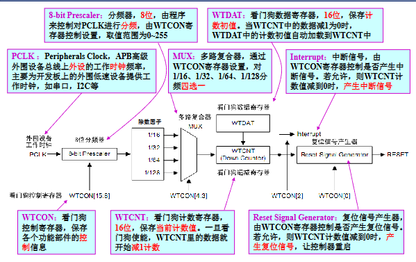

关键计算公式（必背）

（1）看门狗计数时钟频率

```plaintext
F_watchdog = PCLK ÷ (预分频值 + 1) ÷ 除数因子
```

 示例：PCLK=50MHz，预分频值 = 249，除数因子 = 16

```plaintext
F_watchdog = 50MHz ÷ (249+1) ÷ 16 = 50M ÷ 250 ÷ 16 = 12.5kHz
```

（2）计数时钟周期

```plaintext
T_watchdog = 1 ÷ F_watchdog
```

 示例：F_watchdog=12.5kHz → T_watchdog=1/12500=80μs

（3）计数初值（定时时间换算）

```plaintext
计数初值 = 定时时间 ÷ T_watchdog - 1
        = 定时时间 ×（PCLK /（预分频器值+1）/ 除数因子 ）- 1
```

 示例：要定时 1 秒（1000ms），T_watchdog=80μs

```plaintext
计数初值 = 1000000μs ÷ 80μs - 1 = 12500 - 1 = 12499
```

（注：减 1 是因为计数器从 “初值” 减到 “0” 才算完成一次计数，共经历「初值 + 1」个时钟周期）


#### 看门狗定时器的控制寄存器

| 寄存器        | 地址       | 位宽  | 核心作用                        | 复位值 | 读写属性 |
| ------------- | ---------- | ----- | ------------------------------- | ------ | -------- |
| WTCON（控制） | 0x53000000 | 16 位 | 配置分频、使能、中断 / 复位规则 | 0x8021 | 可读可写 |
| WTDAT（数据） | 0x53000004 | 16 位 | 存储计数初值（自动重载）        | 0x8000 | 可读可写 |
| WTCNT（计数） | 0x53000008 | 16 位 | 执行减 1 计数（当前值）         | 0x8000 | 可读可写 |

> 关键前提：看门狗的计数时钟 = PCLK / (预分频值 + 1) / 除数因子（PCLK 是外设总线时钟，如 50MHz）。

1. 看门狗控制寄存器（WTCON）

   | 位段   | 名称                 | 描述                                              | 初始值             | 配置规则 & 示例                                              |
   | ------ | -------------------- | ------------------------------------------------- | ------------------ | ------------------------------------------------------------ |
   | [15:8] | Prescaler Value      | 预分频器值，范围 0~255（2⁸-1）                    | 0x80（十进制 128） | 例：设为 249 → 预分频后时钟 = PCLK/(249+1)；初始值 0x80 是默认预分频值，可修改 |
   | [7:6]  | Reserved             | 保留位，必须设为 0                                | 00                 | 配置时需用`& ~(3<<6)`清 0，避免功能异常                      |
   | [5]    | Watchdog Timer       | 看门狗使能位：0 = 禁用；1 = 启用                  | 1                  | 复位默认启用，不用时需手动设 0                               |
   | [4:3]  | Clock Select         | 除数因子（最终分频）：00=16；01=32；10=64；11=128 | 00                 | 例：设为 11 → 除数因子 = 128；初始值 00 对应除数 16          |
   | [2]    | Interrupt Generation | 中断使能位：0 = 禁用中断；1 = 启用中断            | 0                  | 需定时中断则设 1，仅复位则保持 0                             |
   | [1]    | Reserved             | 保留位，必须设为 0                                | 0                  | 配置时用`& ~(1<<1)`清 0                                      |
   | [0]    | Reset Enable/Disable | 复位使能位：0 = 禁用复位；1 = 计数到 0 触发复位   | 1                  | 仅定时中断需设 0，系统容错需保持 1                           |

   **复位值 0x8021 的含义**（二进制：1000 0000 0010 0001）：

   - [15:8]=0x80（128）→ 预分频值默认 128；
   - [5]=1 → 默认启用看门狗；
   - [4:3]=00 → 默认除数因子 16；
   - [2]=0 → 默认禁用中断；
   - [0]=1 → 默认启用复位功能；

2. 看门狗数据寄存器（WTDAT）

   WTDAT 是 “计数初值的仓库”，核心作用是保存看门狗的**计数目标值**

   | 位段   | 名称               | 描述                        | 初始值                 | 核心规则 & 示例                        |
   | ------ | ------------------ | --------------------------- | ---------------------- | -------------------------------------- |
   | [15:0] | Count Reload Value | 16 位计数初值，范围 0~65535 | 0x8000（十进制 32768） | 初始值无实际意义，需按定时需求重新计算 |

   **自动重载**：当 WTCNT 减到 0 时，WTDAT 里的初值会自动加载到 WTCNT，实现循环计数（无需 CPU 干预）

3. 看门狗计数寄存器（WTCNT）

   WTCNT 是 “实际干活的计数器”，核心是 16 位减 1 计数器

   | 位段   | 名称        | 描述                                 | 初始值                 | 核心规则 & 注意事项            |
   | ------ | ----------- | ------------------------------------ | ---------------------- | ------------------------------ |
   | [15:0] | Count Value | 计数器当前值，每来一个计数时钟就减 1 | 0x8000（十进制 32768） | 初始值无意义，首次必须手动赋值 |

   看门狗启用（WTCON [5]=1）后，WTCNT 开始对 “计数时钟” 减 1，每来 1 个时钟脉冲，值减 1；

   WTDAT 的初值**不会自动加载到 WTCNT**（仅 WTCNT 减到 0 后才会重载），因此首次启用看门狗时，必须手动给 WTCNT 写初值

#### 看门狗定时器初始化

看门狗最核心的两种用法：**复位初始化（系统容错）** 和**定时初始化（中断定时）**

1. 看门狗定时器 - 复位初始化（系统容错）

   ```c
   void watchdog_test(void)
   {
       // 步骤1：配置预分频值+除数因子（基础时钟分频）
       rWTCON=((prescaler_value<<8)|(clock_select<<3));
       // 步骤2：设置计数初值（WTDAT存储重载值，WTCNT手动赋初值）
       rWTDAT=15000; // 设置计数初值（WTCNT归0时自动重载）
       rWTCNT=15000; // 设置计数值（首次计数必须手动赋值，否则从复位值0x8000开始）
       // 步骤3：清空保留位（[1:0]中的[1]是保留位，必须设0）
       rWTCON &= ~(3<<1);  // 3<<1 = 二进制11<<1 = 110，取反后是...11111001
                           // 作用：把WTCON的bit1、bit2清0（bit1是保留位，bit2是中断位）
       // 步骤4：启用看门狗+启用复位功能
       rWTCON|=((1<<5)|(1<<0));  // 1<<5=bit5置1（启用看门狗）；1<<0=bit0置1（启用复位）
       // 步骤5：死循环（模拟程序跑飞，无喂狗操作）
       while(1);
   }
   ```

2. 看门狗定时器 - 定时初始化（中断定时）

   ```c
   void watchdog_test(void)
   {
       // 步骤1：配置预分频值+除数因子（和复位版一致）
       rWTCON=((prescaler_value<<8)|(clock_select<<3));
       // 步骤2：设置计数初值（和复位版一致）
       rWTDAT=15000; // 设置计数初值
       rWTCNT=15000; // 设置计数值（首次必须手动赋值）
       // 步骤3：启用看门狗+启用中断功能（核心差异点）
       rWTCON|=(1<<5)|(1<<2);  // 1<<5=bit5置1（启用看门狗）；1<<2=bit2置1（启用中断）
       // 步骤4：死循环（等待中断触发）
       while(1) ;
   }
   ```

   

### RTC 部件（实时时钟）

RTC（Real Time Clock，实时时钟）是 S3C2440 芯片中**独立的时间管理模块**，核心优势是**掉电后仍能正常工作**（依赖后备电池），可精准记录年 / 月 / 日 / 时 / 分 / 秒 / 星期，支持定时报警和节拍中断

1. **时间维度**：完整覆盖年、月、日、时、分、秒、星期，解决 2000 年闰年问题。
2. **供电与时钟**：独立电源引脚（RTCVDD），外接 32.768KHz 高精度晶振，分频后生成 1Hz 秒时钟和 128Hz 节拍时钟。
3. 核心功能
   - 时间记录：以压缩 BCD 码格式存储时间数据；
   - 报警功能：支持年 / 月 / 日 / 时 / 分 / 秒维度报警，可触发**中断或唤醒掉电模式**；
   - 节拍中断：支持毫秒级周期性中断（由 128Hz 时钟衍生）；
   - 操作指令：支持 LDRB/STRB 指令读写（适配字节级数据）。
4. **数据格式**：所有时间 / 报警数据均为压缩 BCD 码（如数字 “12” 存储为 0x12，而非十进制 12）。

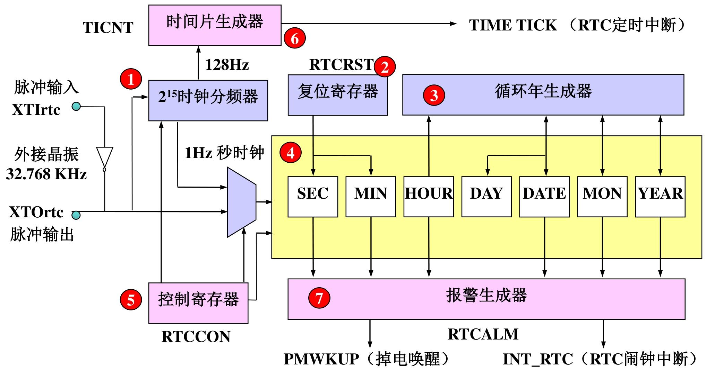

#### RTC定时初始化

**置 RTC 工作模式 + 设置初始时间（年 / 月 / 日 / 时 / 分 / 秒 / 星期） + 禁用 RTC 以降低功耗**

```c
// 1. 寄存器地址宏定义（S3C2440 RTC相关寄存器物理地址）
#define rRTCCON     (*(volatile unsigned int *)0x57000040)  // RTC总控制寄存器
#define rBCDYEAR    (*(volatile unsigned int *)0x57000088)  // BCD码年份寄存器（0x00~0x99，对应00~99年）
#define rBCDMON     (*(volatile unsigned int *)0x57000084)  // BCD码月份寄存器（0x01~0x12）
#define rBCDDATE    (*(volatile unsigned int *)0x5700007C)  // BCD码日期寄存器（0x01~0x31）
#define rBCDDAY     (*(volatile unsigned int *)0x57000080)  // BCD码星期寄存器（0x01~0x07，1=周日~7=周六）
#define rBCDHOUR    (*(volatile unsigned int *)0x57000078)  // BCD码小时寄存器（0x00~0x23）
#define rBCDMIN     (*(volatile unsigned int *)0x57000074)  // BCD码分钟寄存器（0x00~0x59）
#define rBCDSEC     (*(volatile unsigned int *)0x57000070)  // BCD码秒寄存器（0x00~0x59）

// 2. 初始时间配置宏定义（需根据需求修改，必须为压缩BCD码格式）
// 示例：2024年10月26日 周五 15:30:00 → BCD码对应 0x24=24, 0x10=10, 0x26=26, 0x05=周五, 0x15=15, 0x30=30, 0x00=00
#define TESTYEAR    0x24    // 年份（BCD码，0x00~0x99）
#define TESTMONTH   0x10    // 月份（BCD码，0x01~0x12）
#define TESTDATE    0x26    // 日期（BCD码，0x01~0x31）
#define TESTDAY     0x05    // 星期（BCD码，0x01~0x07）
#define TESTHOUR    0x15    // 小时（BCD码，0x00~0x23）
#define TESTMIN     0x30    // 分钟（BCD码，0x00~0x59）
#define TESTSEC     0x00    // 秒（BCD码，0x00~0x59）

/**
 * @brief  RTC初始化函数：配置RTC工作模式并设置初始时间
 * @note   1. 时间数据采用压缩BCD码格式（如十进制24 → 0x24，十进制10 → 0x10）
 *         2. 操作流程：使能RTC→写入时间→禁用RTC（降低功耗+防止误操作）
 *         3. 掉电后需外接备用电池，RTC才能保持时间运行
 */
void Rtc_Init(void)
{
    // 步骤1：配置RTCCON寄存器，使能RTC并设置工作模式
    // 位操作逻辑：rRTCCON & ~0xf → 清除低4位（[3:0]），rRTCCON | 0x1 → 置位bit0（RTCEN=1）
    // 最终配置：CLKRST=0（无复位）、CNTSEL=0（合并BCD计数器）、CLKSEL=0（32.768KHz时钟）、RTCEN=1（使能RTC读写）
    rRTCCON = rRTCCON & ~(0xf) | 0x1;

    // 步骤2：写入初始年份（BCD码），先清后设避免原有值干扰
    // rBCDYEAR & ~0xff → 清除低8位（年份寄存器有效位为8位），| TESTYEAR → 写入BCD码年份
    rBCDYEAR = rBCDYEAR & ~(0xff) | TESTYEAR;

    // 步骤3：写入初始月份（BCD码），低5位有效（月份范围01~12，5位足够表示）
    rBCDMON = rBCDMON & ~(0x1f) | TESTMONTH;

    // 步骤4：写入初始日期（BCD码），低6位有效（日期范围01~31，6位足够表示）
    rBCDDATE = rBCDDATE & ~(0x3f) | TESTDATE;

    // 步骤5：写入初始星期（BCD码），低3位有效（星期范围01~07，3位足够表示）
    rBCDDAY = rBCDDAY & ~(0x7) | TESTDAY;

    // 步骤6：写入初始小时（BCD码），低6位有效（小时范围00~23，6位足够表示）
    rBCDHOUR = rBCDHOUR & ~(0x3f) | TESTHOUR;

    // 步骤7：写入初始分钟（BCD码），低7位有效（分钟范围00~59，7位足够表示）
    rBCDMIN = rBCDMIN & ~(0x7f) | TESTMIN;

    // 步骤8：写入初始秒（BCD码），低7位有效（秒范围00~59，7位足够表示）
    rBCDSEC = rBCDSEC & ~(0x7f) | TESTSEC;

    // 步骤9：禁用RTC，锁定时间寄存器（降低功耗，防止后续误操作）
    // 配置：RTCCON=0x0 → RTCEN=0（禁用读写），其他位保持默认（无复位、合并计数器、正常时钟）
    rRTCCON = 0x0;
}
```


### Timer 定时器

Timer 定时器是 S3C2440 核心可编程模块，本质是 16 位减 1 计数器，核心能力覆盖**精准定时、PWM 脉宽调制、DMA 请求触发**，支持多模式配置，适配电机控制、周期性中断等场景

1. **硬件规格**：5 个独立 16 位定时器（Timer0~Timer4），2 个 8 位可编程预分频器 + 2 个 4 路分频器，支持 5 选 1 时钟源切换。
2. 核心功能
   - 定时中断：达到设定时间触发中断，释放 CPU；
   - PWM 输出：Timer0~Timer3 支持 PWM 波形，占空比可调；
   - DMA 请求：可触发 DMA 传输，无需 CPU 干预数据搬运；
   - 多工作模式：单脉冲（一次性信号）、自动加载（连续脉冲）、死区生成（防设备同时启动）。
3. **关键机制**：双缓冲结构（TCNTBn/TCMPBn），运行中可更新配置，下周期生效。

（1）计数时钟频率

```plaintext
计数时钟频率 = PCLK ÷ (预分频值 + 1) ÷ 分频值
```

 示例：PCLK=50MHz，预分频值 = 249，分频值 = 8

```plaintext
计数时钟频率 = 50MHz ÷ (249+1) ÷8 = 25KHz
```

（2）计数时钟周期

```plaintext
计数时钟周期 = 1 ÷ 计数时钟频率
```

 示例：25KHz 对应时钟周期 = 40μs

（3）定时时间计算

```plaintext
定时时间 = (计数初值 + 1) × 计数时钟周期
→ 计数初值 = 定时时间 ÷ 计数时钟周期 - 1
```

示例：定时 0.2 秒（200ms），时钟周期 40μs

```plaintext
计数初值 = 200000μs ÷40μs -1 = 4999
```

（4）PWM 占空比计算

```plaintext
占空比 = (TCNTBn - TCMPBn) ÷ TCNTBn × 100%
```

 示例：TCNTBn=100，TCMPBn=20 → 占空比 = 80%（高电平占 80%）

#### 定时器初始化通用流程

1. 选择定时器通道（0~4）；
2. 配置 TCFG0：设置预分频值；
3. 配置 TCFG1：设置分频因子（5 选 1）；
4. 配置 TCNTBn：写入计数初值（定时周期 / PWM 周期）；
5. （PWM 模式）配置 TCMPBn：写入比较初值（占空比）；
6. 配置 TCON：置位 “手动更新”+“自动加载”；
7. 清除 TCON “手动更新”，启动定时器；
8. （中断模式）配置中断控制器，绑定中断处理函数。

代码实例（2 类核心用法）

用法 1：定时中断（Timer0 产生 0.2 秒中断)

```c
// 寄存器地址宏定义
#define rTCFG0     (*(volatile unsigned int *)0x51000000)
#define rTCFG1     (*(volatile unsigned int *)0x51000004)
#define rTCON      (*(volatile unsigned int *)0x51000008)
#define rTCNTB0    (*(volatile unsigned int *)0x5100000C)
#define rTCMPB0    (*(volatile unsigned int *)0x51000010)

void Timer0_Init(void)
{
    // 步骤1：配置预分频（Timer0预分频=255）
    rTCFG0 &= ~0xFF;  // 清Timer0预分频位
    rTCFG0 |= 0xFF;   // 预分频值=255
    
    // 步骤2：配置分频因子（16分频）
    rTCFG1 &= ~0xF;   // 清Timer0分频位
    rTCFG1 |= 0x3;    // 0011=16分频
    
    // 步骤3：计算并设置计数初值（PCLK=50MHz，定时0.2秒）
    // 计数时钟频率=50MHz/(255+1)/16≈12.2KHz，时钟周期≈81.92us
    rTCNTB0 = 2440;   // (2440+1)*81.92us≈0.2秒
    
    // 步骤4：配置TCON（手动更新+自动加载）
    rTCON |= (1<<1) | (1<<3);  // 置位手动更新、自动加载
    rTCON &= ~(1<<1);           // 清除手动更新（加载初值）
    rTCON |= 1<<0;              // 启动Timer0
    
    // 步骤5：配置中断（绑定中断向量）
    pISR_TIMER0 = (unsigned)Timer0_ISR;
    rINTMSK &= ~BIT_TIMER0;     // 解除Timer0中断屏蔽
}

// 中断处理函数
void __irq Timer0_ISR(void)
{
    // 清除中断未决位
    rSRCPND |= BIT_TIMER0;
    rINTPND |= BIT_TIMER0;
    
    // 业务逻辑：如串口输出定时提示
    Uart_Printf("Timer0 interrupt trigger!\n");
}
```

用法 2：PWM 输出（Timer0 产生 50Hz，占空比 50% 波形）

```c
void Timer0_PWM_Init(void)
{
    // 步骤1：引脚复用（GPB0=TOUT0）
    rGPBCON &= ~0x3;
    rGPBCON |= 0x2;  // GPB0配置为TOUT0输出
    
    // 步骤2：预分频+分频配置（同定时中断，计数时钟=12.2KHz）
    rTCFG0 |= 0xFF;
    rTCFG1 |= 0x3;
    
    // 步骤3：设置PWM周期（50Hz=20ms，计数初值=244）
    rTCNTB0 = 244;  // (244+1)*81.92us≈20ms
    
    // 步骤4：设置占空比50%（比较初值=122）
    rTCMPB0 = 122;  // 高电平时间=(244-122)*81.92us≈10ms
    
    // 步骤5：启动PWM（自动加载模式）
    rTCON |= (1<<1) | (1<<3);
    rTCON &= ~(1<<1);
    rTCON |= 1<<0;
}
```

关键注意事项（避坑指南）

1. **手动更新必须配置**：启动定时器前，需先置位 “手动更新”，加载 TCNTBn/TCMPBn 初值，再清除该位；
2. **PWM 通道限制**：Timer4 无 PWM 功能，无 TCMPB4 寄存器；
3. **引脚复用**：TOUT0~TOUT3 与 GPB0~GPB3 复用，需先配置引脚功能；
4. **死区仅 Timer0 支持**：其他通道无死区生成器；
5. **双缓冲生效时机**：运行中修改 TCNTBn/TCMPBn，需等待当前周期结束，下周期才会应用新配置。


### UART

UART（通用异步收发器）是嵌入式系统中最核心的串行通信模块，S3C2440 的 UART 模块功能丰富、配置灵活

| 术语         | 解释                                                         |
| ------------ | ------------------------------------------------------------ |
| 串行通信     | 数据一位一位传输（对比并行通信），优点：传输线少、成本低、适合远距离；缺点：速度慢 |
| 通信方向     | 单工（仅收 / 仅发）、半双工（收 / 发分时）、全双工（收 / 发同时，UART 支持） |
| 通信同步方式 | 异步通信（UART）：收发无共用时钟，靠帧格式同步；同步通信：收发共用时钟（如 SPI） |
| 数据传输规则 | UART 以字符为单位，**先低位后高位** 逐位传输，靠 “起始位 + 停止位” 界定字符边界 |

2. UART 帧格式（通用标准）

一个完整的 UART 传输帧包含 5 部分（可编程配置）

```plaintext
空闲位（高电平）→ 起始位（1位，低电平）→ 数据位（5~8位）→ 奇偶校验位（可选）→ 停止位（1~2位，高电平）
```

 例：文档中 “8N1” 格式 = 1 起始位 + 8 数据位 + 无校验 + 1 停止位（最常用）。

S3C2440 内置 3 个独立 UART 通道（UART0/1/2），核心特性可归纳为 8 类：

1. 通道差异化特性

| 通道  | 核心能力                    | 特殊限制                                 |
| ----- | --------------------------- | ---------------------------------------- |
| UART0 | 支持 AFC 自动流控、红外模式 | 复用 GPH0（nCTS0）/GPH1（nRTS0）         |
| UART1 | 支持 AFC 自动流控、红外模式 | 复用 GPG10（nCTS1）/GPG9（nRTS1）        |
| UART2 | 无 AFC、无 nRTS/nCTS 引脚   | 仅基础收发，复用 GPH7（RXD2）/GPH6（TXD2 |

2. 工作模式（3 种）

- **查询模式（轮询）**：CPU 主动查询状态寄存器，判断收发状态（简单但占用 CPU）；
- **中断模式**：收发就绪 / 出错时触发中断，CPU 按需处理（高效，推荐）；
- **DMA 模式**：收发数据直接通过 DMA 搬运，CPU 无需参与（高吞吐场景）。

3. 数据缓冲方式（2 种）

- **单寄存器模式**：收发各 1 个 8 位缓冲寄存器（UTXHn/URXHn），无 FIFO；
- **FIFO 模式**：收发各 64 字节 FIFO，可设置触发阈值（减少中断次数）。

4. 其他关键特性

- 时钟源：3 选一（PCLK / 外设时钟、FCLK/n/ 内核分频、UEXTCLK / 外部时钟）；
- 波特率：最大 115.2Kbps（UEXTCLK 可更高），内置波特率发生器；
- 测试模式：回送模式（自发自收，用于自检）、红外模式（IR，适配红外通信）；
- 错误检测：支持溢出 / 奇偶校验 / 帧错误 / 终止条件检测，错误状态可触发中断。

#### S3C2440 UART 核心原理

ART 模块由 4 个核心子模块组成，信号流向：

```plaintext
CPU → 控制单元 → 波特率发生器 → 发送器（并串转换）→ TxD引脚
RxD引脚 → 接收器（串并转换）→ 控制单元 → CPU
```

波特率计算（核心公式）

```plaintext
时钟源（PCLK/FCLK/n/UEXTCLK）→ 预分频（可选）→ UBRDIVn分频 → 移位时钟（波特率×16）
```

- 时钟源选择：通过 UCONn 寄存器 [11:10] 位三选一：
  - 00/10：PCLK（外设时钟，例中为 50MHz）；
  - 01：UEXTCLK（外部输入时钟）；
  - 11：FCLK/n（内核时钟分频）；
- **UBRDIVn 分频**：核心分频环节，16 位除数寄存器（UBRDIVn）实现 “源时钟 ÷ (UBRDIVn + 1)” 的分频。

波特率由 “时钟源” 和 “UBRDIVn 除数” 共同决定，公式：

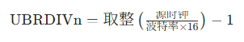

UART 的移位时钟频率必须是波特率的 16 倍


#### UART0 初始化

UART 初始化的核心是 “硬件引脚→时钟→波特率→帧格式→功能禁用 / 启用→工作模式” 的递进配置

| 通用流程步骤     | 例 5-9 具体操作                     | 核心寄存器    | 配置目标                                          |
| ---------------- | ----------------------------------- | ------------- | ------------------------------------------------- |
| 1. 初始化引脚    | 配置 GPH2=TXD0、GPH3=RXD0，禁用上拉 | GPHCON、GPHUP | 引脚复用为 UART 功能，而非 GPIO                   |
| 2. 选择时钟源    | 选择 PCLK（50MHz）作为 UART 时钟    | UCON0[11:10]  | 为波特率计算提供时钟基准                          |
| 3. 配置波特率    | 计算并设置 UBRDIV0=0x1A（26）       | UBRDIV0       | 实现 115200bps 波特率                             |
| 4. 配置帧格式    | 8 位数据位、1 位停止位、无校验      | ULCON0        | 匹配 “1 起始 + 8 数据 + 无校验 + 1 停止” 的帧格式 |
| 5. 配置自动流控  | 禁用 AFC 功能                       | UMCON0        | 无需 nRTS/nCTS 流控信号                           |
| 6. 配置收发 FIFO | 禁用 FIFO 模式                      | UFCON0        | 仅使用单寄存器缓冲收发                            |
| 7. 配置收发模式  | 配置为查询（轮询）模式              | UCON0[3:0]    | CPU 主动查询状态寄存器完成收发                    |

```cpp
// 1. 寄存器地址宏定义（S3C2440 UART0及GPIO相关寄存器）
#define rULCON0     (*(volatile unsigned int *)0x50000000)  // UART0线控制寄存器（帧格式）
#define rUCON0      (*(volatile unsigned int *)0x50000004)  // UART0控制寄存器（时钟/模式）
#define rUFCON0     (*(volatile unsigned int *)0x50000008)  // UART0 FIFO控制寄存器
#define rUMCON0     (*(volatile unsigned int *)0x5000000C)  // UART0 MODEM控制寄存器（流控）
#define rUTRSTAT0   (*(volatile unsigned int *)0x50000010)  // UART0状态寄存器（收发状态）
#define rUBRDIV0    (*(volatile unsigned int *)0x50000028)  // UART0波特率除数寄存器
#define rUTXH0      (*(volatile unsigned int *)0x50000020)  // UART0发送缓冲寄存器（写数据）
#define rURXH0      (*(volatile unsigned int *)0x50000024)  // UART0接收缓冲寄存器（读数据）
#define rGPHCON     (*(volatile unsigned int *)0x56000070)  // GPIO GPH端口配置寄存器（引脚复用）
#define rGPHUP      (*(volatile unsigned int *)0x56000078)  // GPIO GPH端口上拉电阻控制寄存器

// 2. 主函数（初始化+循环收发）
int TSmain( )
{
    char buf;  // 存储收发数据的缓冲变量（8位，匹配UART字节传输）

    /************************** 步骤1：GPIO引脚配置（GPH2=TXD0，GPH3=RXD0）**************************/
    // 清除GPH2[5:4]、GPH3[7:6]原有配置，避免干扰
    rGPHCON &= 0xFFFF0F;  
    // 配置GPH2=10（TXD0）、GPH3=10（RXD0），复用为UART0功能
    rGPHCON |= 0xA0;      
    // 清除GPH2、GPH3的上拉配置
    rGPHUP &= 0x7F3;      
    // 禁用GPH2、GPH3上拉电阻（UART通信无需上拉）
    rGPHUP |= 0x00C;      

    /************************** 步骤2：UART0核心初始化 **************************/
    // 配置帧格式：1起始位+8数据位+无校验+1停止位（8N1）
    rULCON0 &= 0x00;  // 清除原有配置
    rULCON0 |= 0x03;  // 00000011 → 数据位8位、无校验、停止位1位
    // 配置时钟源+收发模式：PCLK（50MHz）+ 查询模式
    rUCON0 = 0x0805;  // 0000100000000101 → 时钟源=PCLK，收发均为查询/中断模式（本例用查询）
    // 配置波特率：115200bps，除数因子=26（0x1A）
    rUBRDIV0 = 0x1A;  
    // 禁用FIFO模式（仅用单寄存器缓冲）
    rUFCON0 = 0x00;   
    // 禁用自动流控AFC（无需nRTS/nCTS引脚）
    rUMCON0 = 0x00;   

    /************************** 步骤3：循环查询收发（回声功能）**************************/
    while (1)
    {
        // 查询接收状态：UTRSTAT0[0]=1 → 接收缓冲有数据
        if (rUTRSTAT0 & 0x01)  
        {
            buf = rURXH0;  // 从接收缓冲寄存器读取数据
        }

        // 查询发送状态：UTRSTAT0[2]=1 → 发送器空（缓冲+移位寄存器均空，发送完成）
        if (rUTRSTAT0 & 0x04)  
        {
            rUTXH0 = buf;  // 把接收的数据写入发送缓冲寄存器，实现回声
        }
    }

    return 0;
}

// 3. 汇编入口（指定程序入口，设置堆栈）
AREA |DATA|, CODE, READONLY
ENTRY                   ; 标记程序入口
ldr r13, =0x1000        ; 设置堆栈指针SP地址为0x1000
b TSmain                ; 跳转到主函数TSmain
IMPORT TSmain           ; 声明TSmain为外部定义（若分文件编译需保留）
END                     ; 程序结束
```


## ADC 及触摸屏接口

S3C2440 集成的 ADC（模数转换器）与触摸屏接口是嵌入式系统中模拟信号采集、触控输入的核心模块


### ADC 基础原理

将连续的模拟电压信号（如传感器、触摸屏分压）转换为离散的数字信号，供 CPU 处理；核心过程为**采样→量化→编码**：

- 采样：按 “采样定理（采样频率≥2× 信号最高频率）” 将时间连续的模拟信号转为时间离散的信号；
- 量化：将幅值连续的采样信号转为幅值离散的信号；
- 编码：将量化后的信号转为二进制数字（S3C2440 为 10 位）。

主流转换方法对比

| 转换方法   | 核心原理                  | 优势             | 劣势            | 应用场景               |
| ---------- | ------------------------- | ---------------- | --------------- | ---------------------- |
| 计数式     | 斜坡电压与被测电压比较    | 电路简单、成本低 | 转换速度极慢    | 低速简易场景           |
| 双积分式   | 对输入 / 参考电压两次积分 | 精度高、抗干扰强 | 速度慢（<10Hz） | 仪器仪表、温度测量     |
| 逐次逼近式 | 二分法逼近被测电压        | 速度快、精度适中 | 抗干扰一般      | 微型机（S3C2440 采用） |

 ADC 关键指标：

- 分辨率：S3C2440 为 10 位（数字输出范围 0~0x3FF），对应最小可分辨电压 = 3.3V/1024≈3.22mV；
- 转换速率：最大 500KSPS（每秒采样 50 万次），由 PCLK 分频后的 ADC 时钟决定；
- 量程：模拟输入电压 0~3.3V（单极性）；
- 转换时间：公式为 `5/(PCLK/(预分频值+1))`（10 位转换需 5 个 ADC 时钟周期）。

### ADC 工作模式

ADC有五种工作模式，采用不同方式采集信号

| 模式类型                | 适用场景                 | 核心配置 / 操作                             |
| ----------------------- | ------------------------ | ------------------------------------------- |
| 普通转换模式            | 非触摸屏的单通道模拟采集 | ADCTSC [1:0]=00，选通道后命令启动 ADC       |
| 分离 XY 坐标转换模式    | 触摸屏手动分步采集 X/Y   | ADCTSC=0x69（X）/0x09（Y），分别转换        |
| 自动（连续）XY 坐标模式 | 触摸屏一键采集 X/Y       | ADCTSC [2]=1，连续转换 X/Y 并存入 ADCDAT0/1 |
| 等待中断模式            | 检测触摸屏按下 / 抬起    | ADCTSC [1:0]=11，触发 INT_TC 中断           |
| 备用模式                | 低功耗待机               | ADCCON [2]=1，停止 ADC 转换                 |


### 核心寄存器

通过下面的寄存器配置可以控制ADC

| 寄存器    | 地址          | 核心功能                       | 关键位 / 配置                                     |
| --------- | ------------- | ------------------------------ | ------------------------------------------------- |
| ADCCON    | 0x58000000    | ADC 主控（时钟 / 启动 / 通道） | [14]：预分频使能；[13:6]：预分频值；[0]：命令启动 |
| ADCTSC    | 0x58000004    | 触摸屏控制（模式 / 引脚）      | [1:0]：工作模式；[2]：自动 XY 转换；[3]：XP 上拉  |
| ADCDLY    | 0x58000008    | 转换延时                       | [15:0]：延时值（等待中断模式需≥ms 级）            |
| ADCDAT0/1 | 0x5800000C/10 | 转换数据存储                   | [9:0]：X/Y 坐标（10 位数据）                      |
| ADCUPDN   | 0x58000014    | 触摸中断标志                   | [0]：按下中断；[1]：抬起中断                      |


### 触摸屏坐标采集

通过 “等待中断模式检测触摸→自动 XY 模式采集坐标→UART 输出结果” 实现触摸屏触控采集，完整流程如下：

步骤 1：系统时钟配置

- 设置分频比：FCLK:HCLK:PCLK=1:3:6；
- 配置 MPLL：Fin=12MHz→FCLK=202.8MHz→PCLK=33.8MHz（ADC 时钟源）。

步骤 2：UART 初始化

- 配置 UART0 为 115200bps、8N1、禁用 FIFO，用于坐标数据输出。

步骤 3：ADC + 触摸屏初始化

1. 配置 ADCDLY：设置延时值（如 50000，对应 13.56ms）；
2. 配置 ADCCON：预分频使能 + 预分频值 39（ADC 时钟 = 33.8MHz/40≈845KHz）+ 普通模式；
3. 配置 ADCTSC：设为等待中断模式（0xD3），检测触摸按下；
4. 中断配置：映射 ADC 中断向量→清除未决位→开启 INT_ADC/INT_TC 中断。

步骤 4：中断服务程序（核心）

1. 关中断：避免嵌套干扰；
2. 切换模式：ADCTSC 设为自动连续 XY 坐标转换模式；
3. 启动 ADC：命令启动（ADCCON [0]=1），查询转换完成标志（ADCCON [15]=1）；
4. 读取数据：循环 5 次采集 X/Y 坐标，存入 ADCDAT0/1；
5. 输出数据：通过 UART 打印 5 组坐标；
6. 恢复模式：重置 ADCTSC 为等待中断模式，清除中断标志并重新开中断。

步骤 5：关闭触摸屏

- 关中断→配置 ADCCON 为备用模式（低功耗）。

> [!tip]
>
> 1. **ADC 核心**：以逐次逼近式为基础，通过 PCLK 分频控制转换速率，10 位分辨率满足大多数嵌入式模拟采集需求；
> 2. **触摸屏核心**：复用 ADC 通道，通过电阻分压原理实现坐标采集，结合中断模式实现触摸事件的高效检测；
> 3. 编程关键
>    - 时钟配置：预分频值需保证 ADC 时钟≤2.5MHz（最大转换速率）；
>    - 模式切换：等待中断模式（检测触摸）与自动 XY 模式（采集坐标）的配合；
>    - 中断管理：正确清除未决位、开关中断，避免漏触发 / 重复触发；

