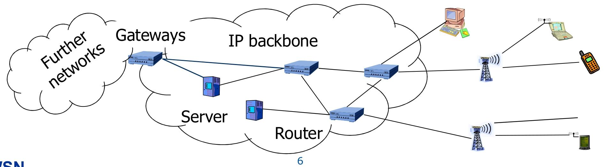
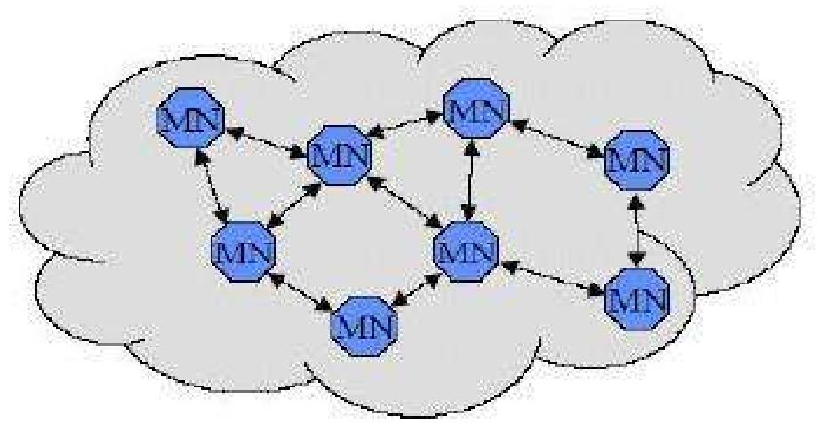
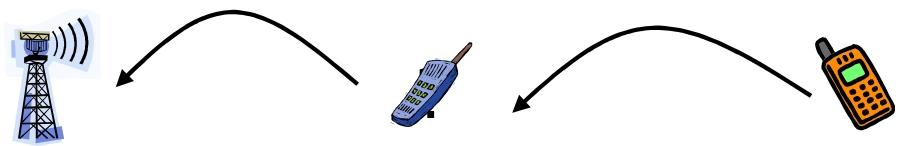
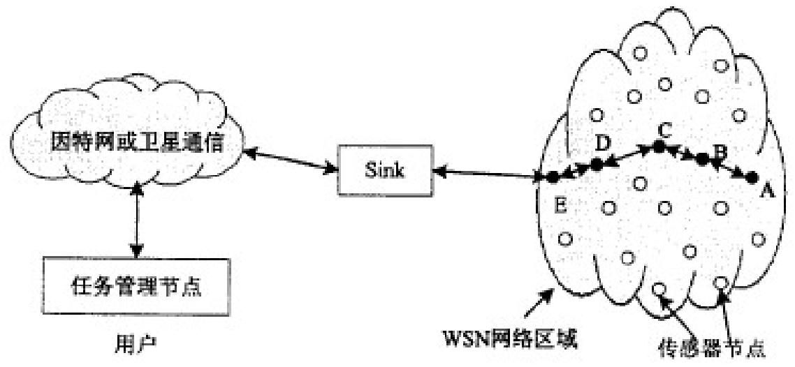
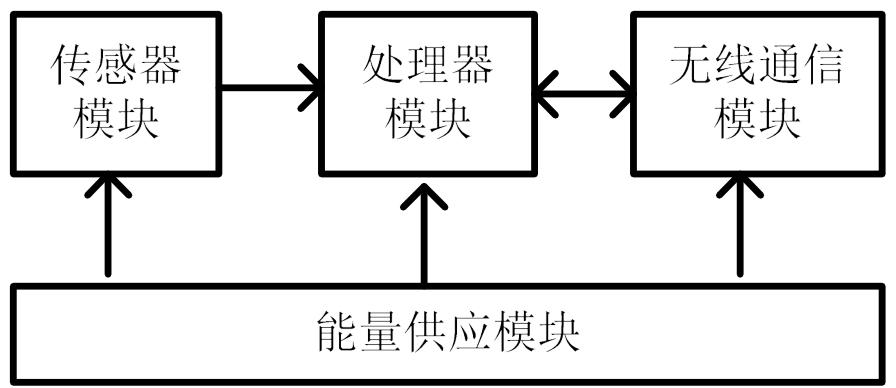
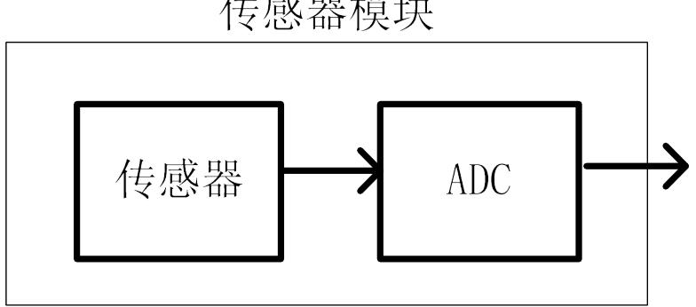
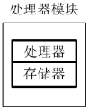
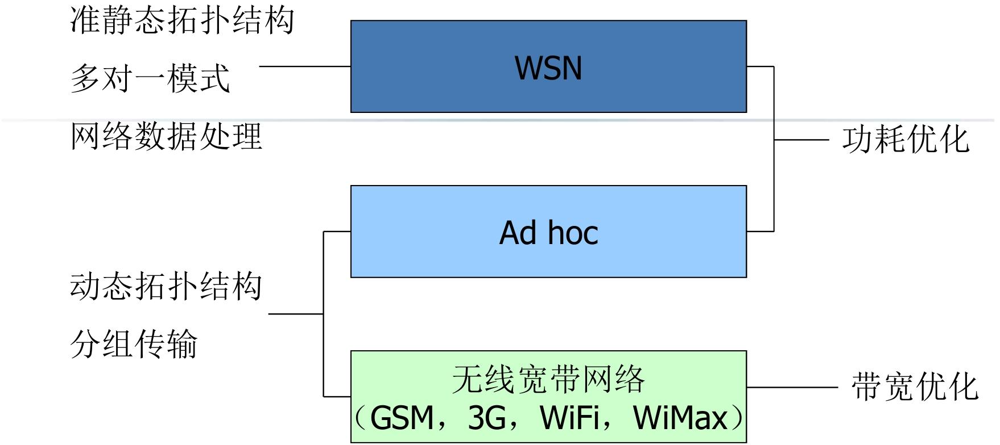

# WSN概述

 **“先讲传统方案（基于基础设施的无线网络）→ 暴露其痛点 → 给出替代方案（Ad hoc 网络）→ 详解方案特点与挑战”**

## 基于基础设施的无线网络

这类无线网络的本质是 **“所有终端都靠固定设施连接，没有设施就没法通信”**。

常见类型

- 蜂窝移动网络：GSM（2G）、UMTS（3G）、5G（我们手机常用的网络）；
- 有线主干网延伸的无线网络：比如企业 WiFi（靠路由器 / AP，而路由器要连有线宽带）、校园网 WiFi。

通信终端和基站的关系

- 通信终端以**无线**的方式与基站通信
- 通信终端之间的通信要通过**基站以及主干网**来完成
- 移动性通过**基站的切换**来支持

局限性：基础设施失效；成本太高 / 不方便部署；没有时间部署设施

## Wireless ad hoc 网络

对于上述基于基础设施的无线网络的局限性，可以**用 Wireless ad hoc 网络解决**；

- 利用无线终端**自身的组网**能力,构造一个不需要通信基础设施的“专用的”网络｡
- 不用基站、路由器这些固定设施，全靠无线终端自己的能力，**临时搭建**一个 “只为当前场景服务” 的专用网络。

Ad hoc 网络的两大核心特点（无基础设施带来的 “天生属性”）

- 没有核心设备 → 自组织 + 多跳通信
  - 网络里所有终端地位平等，终端开机后会自动扫描周围的同类设备，主动建立连接、形成网络
  - MAC 是分布式的；
  - **路由靠邻居** —— 单个终端通信距离有限（比如几十米），要给远处的设备发数据，就找中间的 “邻居终端” 帮忙转发，这就是 “多跳（multi-hop）”

- 支持移动 → 灵活但复杂（衍生出 MANET）
  - 这类 “支持移动的 Ad hoc 网络” 叫 **MANET**（mobile ad hoc networks，移动自组织网络）
  - 终端移动后，原来的 “邻居” 可能断开连接
  - 需要 “**自适应协议**”—— 网络能实时感知拓扑变化，自动调整数据转发路径，保证通信不中断

Ad hoc 网络的最大挑战：**电池电源约束**

- 考虑节能型网络协议：路由协议节能：选 “能耗最低” 的转发路径；网络实时监测每个终端的电池电量，动态调整任务

传感器（Sensors）：

能 “感受” 物理量（比如温度、声音、振动、压力），并把这些物理量转换成计算机能识别的电信号的设备。

即可以通过传感器实现对环境、现象或对象的感知，然后将数据提供给网络

## 无线传感器网络（WSN）发展历程简洁总结

1. **概念萌芽（1980 年）**：卡内基 - 梅隆大学启动 DSN 项目，明确 “分布式、低功耗、自主协作” 的 WSN 核心理念。
2. **技术攻坚（1993-2004 年）**：DARPA 等资助 WINS、Smart Dust 等项目，突破硬件集成、低功耗、微型化等核心技术，以军事需求为导向。
3. **民用拓展（2002-2003 年）**：英特尔明确 WSN 民用场景，美国 NSFC 资助基础理论研究，推动技术从军用转向通用。
4. **全球推广（2006 年后）**：中国将 WSN 纳入国家科技战略，“感知中国” 推动其与物联网融合，应用场景全面拓展，释放近距离、密集观测潜能。

## 无线传感器网络(Wireless Sensor Networks)

### WSN的概念

WSN 的核心是 “**分布式感知 + 自组织组网**”

> [!note]
>
> 由部署在**监测区域**内的大量、廉价、微型、**传感器节点**组成，通过**无线通信**方式形成的一个**多跳、自组织**的**网络系统**，其目的是协作地感知、采集和处理网络覆盖区域中感知对象的信息，并发送给观察者。

- 在监测区域部署大量 “微型传感器节点”
- 节点之间通过无线信号通信，能自动连接形成网络（自组织）；同时节点间距远，数据会通过多个节点接力转发（多跳）
- 所有节点协同工作，共同感知、采集环境或对象的信息，再对数据简单处理后，最终把有效信息传递给需要的人或系统

### 传感器网络三要素

传感器网络的核心是 “**谁来采集(传感器节点）→采集什么（感知对象）→谁用数据（观察者）**”

1. 传感器节点：网络的 “数据采集执行者”
   - 部署在监测区域的 “微型智能终端”，比如微型的嵌入式系统（体积小能耗小）
   - 实现环境、现象或对象的物理感知（感知能力）
   - 可以对采集的信号进行预处理（计算能力）
   - 通过无线通信技术报告感知信息（通信能力）
2. 感知对象：网络的 “监测目标”
   - 观察者感兴趣、由传感器网络感知的对象，是数据采集的核心指向。
   - 一个观察者可以在一个或多个传感器网络环境中观测多种现象
3. 观察者：网络的 “数据使用者与指令发起者”
   - 需要利用传感器数据的人、系统或设备
   - 传感器网络发布的感知信息的用户
   - 向传感器网络发出查询并接受回答
   - 根据感知信息进行各种决策

### 传感器网络结构

传感器网络的结构核心是 “**三层节点分工协作**”，底层**传感器节点**负责 “采集数据”，**中间汇聚节点**负责 “中转数据”，顶层**任务管理节点**负责 “调度与用数据”，再加上传感器节点内部的 “四大功能模块”，构成完整工作体系

网络层面：三层核心节点（数据从采集到使用的链路）

1. 传感器节点（底层 “**数据采集**小兵”）
   - 直接接触监测现场，数量最多，密集部署在监测区域。
   - 采集、处理、控制和通信
   - 网络功能：兼顾网络终端和路由器
   - 微型化（比如 CrossBow Mica Motes 仅指甲盖大小）、低成本、电池供电（Active 模式 8mA，休眠模式 < 15μA，靠 2 节 AA 电池就能用很久）

> [!tip]
>
> 节点层面：传感器节点的 “四大内部模块”
>
> 每个传感器节点是微型智能设备，内部由 4 个模块组成
>
> 
>
> - 传感器模块（“感知器官”）：直接 “感受” 环境，把温度、湿度、风力、噪声、物体移动等物理信号，转换成电信号（原始数据），即负责监测区域内**信息的采集和数据转换**
>
>   
>
> - 处理器模块（“大脑核心”）：控制整个节点的操作，存储和处理本身采集的数据，也处理其他节点发来的数据；
>
>   可选：微控制器( Microcontroller)；数字信号处理器（DSP）；可编程逻辑阵列（FPGA）；专用集成电路（ASIC）
>
>   
>
> - 无线通信模块（“嘴巴和耳朵”）：和其他传感器节点、汇聚节点进行**无线通信**，收发采集数据和控制指令；
>
>   支持射频（RF，比如 CrossBow 用的 CC2420，2.4G 频段、250kbps 速率）、光、声音等介质，支持低功耗模式（省电池）
>
> - 能量供应模块（“心脏”）：给整个传感器节点供电，核心是电池，部分支持光电池、振动发电等辅助供电；

2. 汇聚节点（中间 “数据中转站”，Sink 节点）

   - 网络的 “网关”；连接**外部网络，转协议，收发数据**
   - 收发数据：收集所有传感器节点（或经多跳转发）传来的数据；把处理后的批量数据转发给管理节点，同时把管理节点的任务指令下发给传感器节点；
   - 转协议：把传感器网络的专用协议，转换成互联网、卫星等外部网络能识别的协议；实现两种协议栈之间的通信协议转换
   - 连接外部网络：连接传感器网络与Internet等外部网络

3. 管理节点（顶层 “指挥中心”）

   - 网络配置和管理；
   - 发布监测任务，收集监测数据

   

---

### 无线传感器网络的特征

1. WSN 节点的核心短板：资源受限
   - 能量有限：多数节点靠传统电池供电，野外 / 偏远场景无法充电；
   - 通信能力有限：单个节点只能传几十到 100 米，远了要靠多跳转发；
   - 能量消耗和通信距离关系 ：` E = k * d^n (2<n<4)`
   - 计算和存储能力有限

> [!tip]
>
> 传感器网络的六大核心特点：
>
> 1. 大规模网络：节点数量大､分布广､密集
> 2. 自组织网络：无需基础设施，未知区域自动组网，撒播节点就能快速形成网络
> 3. 动态网络：网络结构随时变：比如节点电池没电故障、通信信号中断、部分节点移动，或新节点加入，都会让网络连接关系（拓扑）改变
> 4. 可靠网络：硬件可靠､通信保密数据安全
> 5. 应用相关网络：不同的应用背景,对硬件､软件､网络协议影响巨大
> 6.  以数据（任务）为中心：用户不关心 “某个节点是否正常”，只关心 “事件结果”

---

### 无线传感器网络与物联网、计算机网络的关系

三者是 **“局部 - 整体 - 支撑”** 的协同关系，核心逻辑：WSN 是物联网的 “感知核心”，计算机网络是物联网的 “传输通道”，共同构成 “感知 - 传输 - 应用” 的完整闭环

**物联网（IoT）：“万物互联” 的整体框架**：涵盖 **感知层、网络层、应用层** 三层架构

**WSN：物联网 “感知层” 的核心技术**：WSN 的核心作用是 “采集物理世界数据”

**计算机网络：物联网 “网络层” 的传输支撑**：计算机网络（包括互联网、局域网、5G/WiFi 等）是数据传输的 “通道”

物联网是 “完整的智能系统”，WSN 负责 “收集信息”，计算机网络负责 “传递信息”，三者缺一不可：没有 WSN，物联网就 “看不见、听不见”；没有计算机网络，WSN 采集的数据就 “传不出去、用不起来”。

---

## WSN 与 MANET 的对比及三种网络关系

WSN 与 MANET，两者都是 “无需人工干预” 的无线自组织网络，不用依赖基站、路由器等固定基础设施

- 节点通过无线通信传输数据
- 节点开机自动发现邻居，动态组网
- 单个节点通信距离有限，数据靠中间节点多跳转发

| 对比维度     | WSN（无线传感器网络）                          | MANET（移动自组织网络）                        |
| ------------ | ---------------------------------------------- | ---------------------------------------------- |
| 节点数量     | 极其庞大（几百到几千个）                       | 较少（几十到上百个）                           |
| 节点状态     | 多数静止（比如部署在森林、桥梁的传感器）       | 全移动（比如士兵携带的终端、移动设备）         |
| 节点分布     | 密集部署（监测区域内均匀 / 重点覆盖）          | 分布较松散（随节点移动动态变化）               |
| 拓扑变化原因 | 主要因节点能量耗尽、故障导致（多数节点不动）   | 主要因节点移动导致（能量充足，节点位置频繁变） |
| 能量约束     | 严格（靠电池供电，无法持续补充，需极致节能）   | 宽松（可充电或持续供电，无需过度考虑能耗）     |
| 通信模式     | 多对一（所有节点向汇聚节点 / Sink 节点传数据） | 点到点（任意节点之间可直接通信，无固定接收端） |

三种网络的关系（WSN、Ad hoc、无线宽带网络）

| 网络类型     | 核心拓扑结构                                  | 通信模式                          | 核心优化目标                           | 典型代表 / 场景            |
| ------------ | --------------------------------------------- | --------------------------------- | -------------------------------------- | -------------------------- |
| WSN          | 准静态拓扑（多数节点不动，仅少数故障 / 新增） | 多对一（节点→Sink 节点）          | 功耗优化（省电池，延长网络寿命）       | 森林火险监测、桥梁结构监测 |
| Ad hoc       | 动态拓扑（节点移动，连接关系频繁变）          | 分组传输（任意节点间灵活通信）    | 适配拓扑变化（保证移动时通信稳定）     | 战场单兵通信、灾区临时组网 |
| 无线宽带网络 | 固定拓扑（依赖基站 / 路由器等基础设施）       | 点对多 / 多对点（终端→基站→终端） | 带宽优化（提升传输速率，支持大量数据） | 5G、WiFi、GSM（手机通信）  |

