# WSN技术体系与物理层

“体系框架→物理层核心→实践应用”

## 传感器网络节点协议栈

传感器网络节点协议栈是无线传感器网络（WSN）的 “核心骨架”

本质是一套**分层协作 + 跨层管理**的技术体系

既通过**五层协议栈**实现 “数据传输从底层到上层的标准化流转”

1. 物理层：协议栈的 “基础设施层”，直接对接无线信道（如射频、光、超声波）；
   - 实现 “数字比特流” 与 “无线信号” 的相互转换，实现简单､强壮的信号调制和数据收发
   - 选择传输媒体（射频 / 光 / 超声波）、确定工作频率、信号调制解调（ASK、FSK、PSK)、能量感知（检测信号强度）；

2. 数据链路层：负责 “相邻节点之间的直接通信管理”（只处理近距离、直接可达的节点交互）；
   - 负责 “相邻节点之间的直接通信管理”
   - 把物理层传来的 “零散比特流” 包装成 “数据帧”，确保相邻节点间传输 “无错、有序、高效”；
     - 数据组帧，媒体访问控制（MAC)，差错控制，链路管理

3. 网络层：负责 “跨节点、多跳的数据路径规划”
   - 路由发现（找到从数据源到 Sink 节点的可用路径）、路由选择（选最优路径，如能量消耗最少、延迟最小）、路由维护（路径失效时重新找路，如节点移动 / 故障）；
   - 基于局部拓扑信息；数据为中心

4. 传输层：负责 “Sink 节点与传感器节点之间的端到端数据流控制”（确保数据从源头到终点的整体可靠）；
   - 拥塞控制，流量控制，可靠传输

5. 应用层：直接对接用户需求（把传输来的数据转化为实际应用价值）；
   - 通过标准化协议和接口，让上层应用程序无需关注底层技术细节，直接调用网络资源实现数据交互；

管理平台是 “横向支撑体系”

1. 能源管理：管理节点的能量使用
2. 移动管理：跟踪节点移动状态，维护网络拓扑稳定性；
3. 任务管理：平衡全网任务负载，确保所有任务高效执行；

   

## 无线传感器网络——物理层

### 无线通信技术概述

物理层最基础的核心 ——**无线通信技术**

WSN 物理层的无线通信，本质是 “靠电磁波当‘载体’，通过发射机和接收机的‘信号转换’，实现无实体线路的信息交换”。

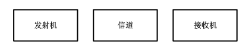

1. 发射机：将**原始信号转换**成更适合在给定传输介质上传输信号的设备电路｡
2. 信道：信号传输的载体
3. 接收机：从传输介质接受发射的信号并将其**转换回原始形式**的设备电路

---

### 无线通信频段

无线通信频段就像无线传感器网络（WSN）的 “专属通信频道”—— 不同频段的 “传播能力”“使用规则” 完全不同

**频率越高，波长越短；传播能力越弱，但数据传输速率越高**。

- 长波（如 LF 频段，30-300kHz）：波长 1-10km，能绕地球曲面传播，传输距离远，但数据率低（只能传低速信号）；
- 微波（如 2.4GHz，属于 SHF 频段）：波长 10cm 左右，绕射能力弱（容易被墙壁、障碍物遮挡），但数据率高（能传高速数据），是 WSN 的主流选择。

 ISM 波段，是 WSN 的 “首选频道”，核心原因就一个：**无需申请频率许可，直接使用，大幅降低成本**。

WSN 节点基本都属于 “微功率短距离设备”，所以：

- 只要选用 ISM 波段，且满足发射功率、覆盖半径要求（几百米之内），就不用申请许可，直接部署；

---

### 无线电波传播特性

#### 多径传输

同一发射信号通过**直射、反射、衍射、散射**等多种不同路径，先后到达接收端，形成多个 “时延不同、幅度不同、相位不同” 的信号，这种现象叫多径传输，对应的信号叠加效应叫多径效应。

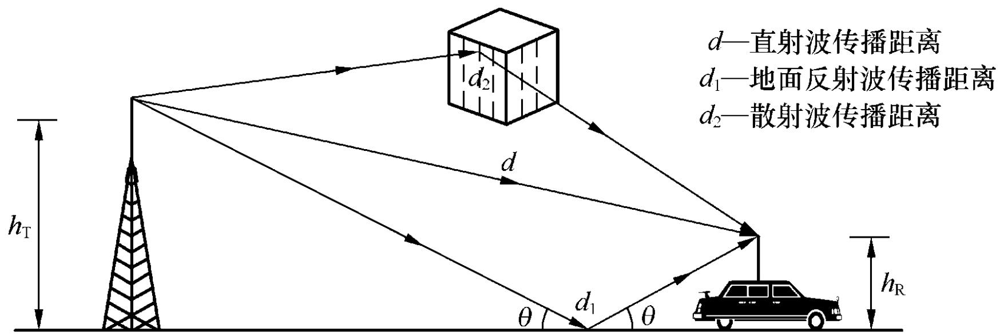

直射：无线通信的 “理想路径”

- 无线电波从发射天线出发，沿着**直线无遮挡**的路径直接到达接收点
- 真空，无障碍
- 对应模型：自由空间模型

反射：信号的 “反弹传播”

- 无线电波遇到**两种密度不同的平滑介质边界**，改变传播方向后到达接收点
- 核心影响：反射后的信号会与直射信号产生**相位差**

衍射（绕射）：信号的 “绕障能力”

- 无线电波遇到障碍物时，不会被完全阻挡，，**沿着障碍物边缘弯曲传播**，到达障碍物后方的接收点，这个过程叫衍射（也叫绕射）。
- 绕障能力与**波长正相关**—— 波长越长（频率越低），绕障能力越强
- 衍射后的信号会发生偏转

散射：信号的 “扩散传播”

- 无线电波遇到**粗糙表面**或 “体积远小于波长的微小障碍物”时，发生**多次反射并向多个方向弥散传播**，这个过程叫散射。
- 散射后的信号方向杂乱、能量分散

#### 衰减与信道损失

无线电波传播的本质是**能量的扩散传播**

无线电波的能量会随传播距离增加而逐渐分散，导致接收端信号功率下降，这个过程叫衰减，其中 “自由空间中因距离导致的能量扩散损耗” 叫信道损失（Path Loss）。

Friis 自由空间方程：

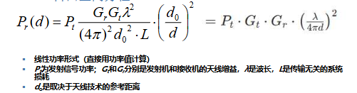

**接收功率 *Pr* 与实际距离 *d* 的平方成反比** —— 距离翻倍，接收功率变为原来的 1/4（对应衰减 6dB）。

#### 功率相关概念

1. 毫瓦分贝（dBm: milliwatt decibel）

   - 用于表示**功率大小的绝对值**
   - 计算公式为：`10 × lg(P / 1mW)`
   - **1W = 1000mW = 30dBm**

2. 分贝（dB: decibel）

   - 用于表征功率的相对比值，是倍数的对数表达式，即**表示两个功率的相对比值**
   - 计算公式为：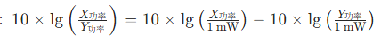
   - 直接用两个功率的 dBm 值相减，就是它们的相对比值 dB：dB=*X*dBm−*Y*dBm
   - 同时：功率损失（dB）= 发射功率（dBm）−接收功率（dBm）

3. **3dB 法则**：小功率系统的 “功率翻倍 / 减半” 捷径

   在 WSN 这类 “小功率系统” 中，3dB 是个关键阈值

   - +3dB = 功率 ×2（功率增加一倍）；
   - -3dB = 功率 ÷2（功率降低一半）；
   - +6dB = 功率 ×4（3dB×2，翻倍两次）；
   - -6dB = 功率 ÷4（3dB×2，减半两次）。

4. 弗里伊斯自由空间方程（对数功率形式）

   - 理想无遮挡环境中，接收功率 = 发射功率 + 天线增益 - 空间损耗（公式最后一项是空间损耗 dB 值）。

   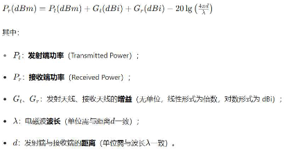

   除了自由空间损耗，还有多径、遮挡（阴影）、多普勒频移等衰落，所以需要引入 “信道损失指数*γ*”（2~6）

   所以改进的的 Friis 方程：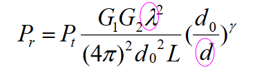

   - 接收功率与波长（频率）有关：频率越高（波长越短），损耗越大
   - 接收功率与传播距离有关：距离越远、*γ*越大（遮挡越严重），接收功率越小。

5. 接收灵敏度

   - 接收灵敏度是**接收端能够正确解码信号的最小功率门限**（用 dBm 表示），信号低于这个值，就无法正常解码数据。

### 调制与解调

调制与解调是 WSN 物理层 “信号适配无线传输” 的核心技术，本质是 “给数字信号装载体、传出去、再还原” 的完整流程

调制（Modulation）：把信号转换成适合在信道中传输的形式的一种过程；具体来说就是来自**信道字符集**的每一个符号被映射为一个或者有限多个波形（Waveforms），也称**码元(码片)**，且波形长度相同。承载信息量的基本信号单位 

其中，波形的长度为符号持续期，也称符号周期

解调（Demodulation）：调制的逆过程，其作用是将已调信号中的调制信号恢复出来

- **基带信号**：传感器采集的 “原始数据”，是符号的序列（不一定是0/1），其中符号来自信道字符集。并且根据字符集的数量分为二进制调制（两个符号），多进制调制。
- **载波信号**：高频周期性振荡信号（如 2.4GHz 正弦波）
- **载波调制**：用基带信号控制载波的参数（幅度、频率、相位），让原始数据具备无线传输能力；
- **已调信号**：载波被基带信号 “改造” 后形成的信号，兼具传输能力和数据承载能力；

二进制调制

每个符号对应 1 个比特（0 或 1），技术简单、成本低，适合低速率场景：

| 调制方式        | 核心原理                                           | 优缺点                                         |
| --------------- | -------------------------------------------------- | ---------------------------------------------- |
| ASK（幅移键控） | 用载波幅度变化表示 0/1（如有载波 = 1，无载波 = 0） | 优点：结构简单、带宽需求小；缺点：抗干扰能力差 |
| FSK（频移键控） | 用载波频率变化表示 0/1（如 f1=1，f2=0）            | 优点：抗干扰比 ASK 强；缺点：需要更大带宽      |
| PSK（相移键控） | 用载波相位变化表示 0/1（如 0°=1，180°=0）          | 优点：抗干扰最强；缺点：结构复杂、实现成本稍高 |

相同 SNR 下，PSK 的误码率最低（最可靠），ASK 最高（最易出错）；

多进制调制

- 1 个符号对应 n 个比特（如 4 进制→2 个比特，8 进制→3 个比特）；

  1. 4-ASK：用 4 种载波幅度（0、A、2A、3A），分别对应 00、01、10、11；
  2. 4-PSK：用 4 种载波相位（0°、π/2、π、3π/2），分别对应 00、01、10、11；

- 关键公式：数据率（bps）= 符号速率（波特）× 单个波形编码比特数

  （例：4 进制调制，符号速率 1000 波特，单个符号编 2 比特→数据率 = 2000bps）。

  - 符号速率（Symbol rate），也称码元传输速率、传码率，是单位时间内传输的符号个数。是符号周期的倒数。单位为“波特”,又称波特率，常用符号"Baud"表示，简写为"B"
  - 对于二进制调制而言，符号速率=“比特率”

#### 噪声和干扰

对于发送端来说，多径传播会导致信号失真，传播过程中则噪声和干扰会导致信号失真

- **噪声**：导体电子热运动产生的 “固有杂音”（加性高斯白噪声 AWGN），无法避免，会让信号失真；
- **干扰**：外部无用信号，主要分 3 类：
  1. 多用户干扰：其他节点同时发射同频段信号；
  2. 同信道干扰：相同频率的干扰源（如附近 WiFi）；
  3. 临信道干扰：邻近频率的干扰源（如相邻信道设备）

衡量信号质量的 3 个核心指标

- **SNR（信噪比）**：信号功率 ÷ 噪声功率，只考虑固有噪声，数值越高信号越 “纯净”；

  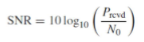

- **SINR（信号干扰噪声比）**：信号功率 ÷（噪声功率 + 所有干扰功率），实际环境中更实用；

  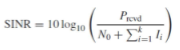

- **BER（误码率）**：错误比特数 ÷ 总比特数（如 BER=10⁻⁵表示每传 10 万个比特最多错 1 个），是可靠性的直接体现。

#### 无线信号的 3 大覆盖区域

以发射节点为中心，按信号强度和通信能力分为 3 个同心圆：

- **通信区域**：信号满足接收灵敏度和 SINR 要求，能可靠解码数据（WSN 部署核心区域，需保证相邻节点覆盖重叠）；
- **侦测区域**：能检测到信号，但误码率极高，无法建立有效通信（仅用于节点发现）；
- **干扰区域**：无法解码信号，还会干扰其他节点（部署时需避开关键节点）；

**捕获效应**：多信号同时到达时，接收机优先处理功率更强的信号（通常强 3~6dB 以上），可缓解干扰。

#### 信号传输方式

（一）按通信对象数量划分

- 点到点通信：两个节点直接交互（如传感器→中继节点）；
- 点到多点通信：一个节点向多个节点发送（如 Sink 节点→所有传感器）；
- 多点间通信：多个节点互传（如传感器间协同感知）。

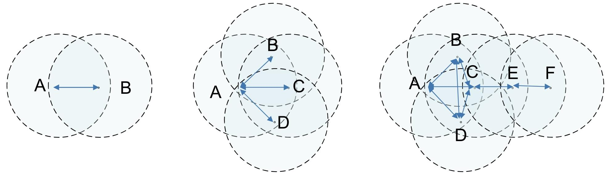

（二）按传输方向与时间划分

- 单工通信：单向传输（如广播，传感器只发不收）；
- 半双工通信：双向传输但不同时（如对讲机，WSN 主流方式）；
- 全双工通信：双向同时传输（如电话，功耗高，少用）。

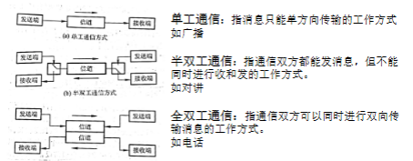

对于WSN 节点 “低功耗、廉价” 的特性，物理层使用分组传输与同步：确保信号 “被正确识别”

- 用串行传输（比特一位一位传），需保证 “码元同步”（识别每个比特起止）和 “字符同步”（识别数据边界）；
- 同步实现：发射端先发送 “Training（训练序列）”，接收端校准频率、相位后，再检测帧边界、接收数据；
- 帧结构（IEEE 802.15.4 标准）：前导码（4 字节，同步）→SFD（1 字节，帧起始）→帧长度（1 字节）→保留位→PSDU（可变长度，核心数据）。

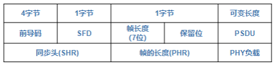

同时需要考虑能量优化

- 接收能耗不可忽视：接收模式能耗与发射模式相当甚至更高；
- 启动能耗高
- 通信成本远高于计算成本

还需要考虑非理想特性

- **链路状况随空间变化**：MICA2 节点的信号强度因传输方向不同而变化（部分方向信号弱）；
- **电池电压**影响发射功率：电池电压下降（如 1.4V→1.18V）会导致发射功率降低，通信距离缩短。
