# 无线传感器网络（WSN）MAC 协议

## WSN-MAC协议概述

WSN（无线传感器网络）核心特征决定了它的 MAC 协议不能直接套用传统设计：

1. 传感器节点资源受限：电池供电，计算和存储能力有限
2. 高密度、大规模随机分布
3. 动态、自组织：节点的网络拓扑界面动态变化
4. 应用相关、以数据（任务）为中心：采集数据为主

根据上述特定，则MAC 协议的设计要抓住三个核心目标：节能；可拓展；网络效率

1. **节省能量**
   - 能耗分析：组成模块的能耗以及无线通信模块的状态
   - 冲突碰撞，串音，空闲监听，控制信息开销都会浪费能量
2. **可扩展性**：不管是节点数量增加（比如从 100 个加到 1000 个）、拓扑变化（节点移动 / 故障），还是流量变化（突然有大量数据要传），协议都能适应，不用重新设计。
3. **网络效率**：在节能的前提下，要保证数据传得又快又稳。

### 信道共享方式：多跳共享广播信道

“信道” 就是无线信号传输的通道，不同网络的节点共享信道的方式不一样：

传统网络采用点对点（两个节点共享无线信道），点对多点（固定基础设施控制的无线信道），多点共享（多个终端共享一个无线信道）等方式

而WSN采用**多跳共享广播信道**

WSN 的**节点通信范围有限**（比如只能传 10 米），只有 “邻居节点”（在通信范围内）能收到它的信号，覆盖范围以外的节点感知不到任何通信的存在

- 所以WSN的**频率空间复用度高**， 比如 A 节点在 10 米内发数据，10 米外的 B 节点可以同时发数据，互不干扰，不用抢同一个信道。
- 但是同时会导致一些问题：冲突和节点的位置有关；会出现 “局部事件”（比如某个区域的节点感知到事件）和 “全局事件”（整个网络的节点都感知到）的差异；进而引发后续的隐藏终端、暴露终端问题

### 隐终端和暴露终端

这是 WSN 多跳共享信道特有的两个 “坑”，直接影响通信效率：

1. **隐终端问题**（Hidden-terminal problem）

   - 隐藏终端是指在**接收节点的覆盖范围内而在发送节点的覆盖范围外**的节点
     - 节点 C 在接收节点 B 的通信范围内，但不在发送节点 A 的通信范围内 ——A 看不到 C，C 也看不到 A。
   - 节点之间**无法互相监听对方**。但当其不可以同时传输时，其同时传输，从而导致冲突发生。
     - 即A 向 B 发数据时，C 也可能向 B 发数据，两个信号在 B 那里撞车（冲突），数据都传失败，浪费能量还降低效率。
   - 注意：**隐终端是相对的**，比如下图当C相对于B是A的隐终端，而A相对于B也是C的隐终端

   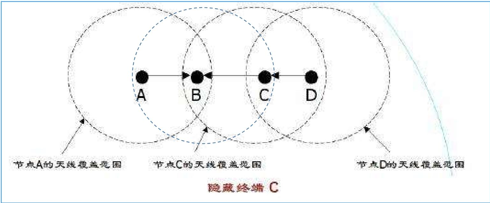

2. **暴露终端问题**（Exposed-terminal problem）
   - 暴露终端是指在**发送节点的覆盖范围内而在接收节点的覆盖范围外**的节点
     - 节点 C 在发送节点 B 的通信范围内，但不在接收节点 A 的通信范围内 ——C 能看到 B 在发数据，以为信道忙。D就是一个暴露终端
   - 节点之间能够**互相监听**对方。但其可以同时传输时，其不传输，从而造成浪费。
     - 同上图，C 本来可以向其他节点（比如 D，不在 B 的通信范围内）发数据，但因为看到 B 在忙，就不敢发了，白白浪费了信道资源。

### RTS/CTS 握手机制

为了缓解隐终端和暴露终端，设计了 “RTS/CTS 握手” 的协调机制，相当于通信前先 “打个招呼”

- 主要应对**隐发送终端问题**：避免 “发送节点看不到的潜在竞争者” 干扰通信，减少数据冲突和能量浪费；
- 辅助实现**信道预约**：通过短消息让邻居节点提前知晓 “即将有数据传输”，合理安排休眠或等待，提升信道利用率。

具体流程：

- 发送节点先发一个短控制消息 RTS（Request to Send，请求发送），告诉接收节点 “我要给你发数据了”；
- 接收节点回应一个短控制消息 CTS（Clear to Send，允许发送），告诉周围节点 “我要接收数据了，你们先别发”；
- 之后发送节点收到CTS后再发真正的数据（DATA），接收节点收到后回复确认（ACK）。
- 注意：如果A未收到CTS，A认为发生了冲突，延迟重发RTS；

周围的邻居节点听到 RTS 或 CTS 后，就知道信道被占用了，会暂时不发数据主动延迟自己的发送请求，避免和正在传输的数据冲突，能解决大部分隐终端问题

但是注意无法解决单信道时的隐接收终端问题

- 场景：C 收到 B 的 CTS 后，暂停向 B 发送数据；此时节点 D（在 C 的通信范围内、不在 B 的通信范围内）想给 C 发数据，于是向 C 发送 RTS；
- 矛盾：C 因为要避让 A 和 B 的通信，不能回复 D 的 RTS（怕干扰 B）；
- 后果：D 没收到 CTS 回应，无法判断是 “RTS 冲突”“C 没开机” 还是 “C 是隐终端”，只能反复重发 RTS，白白浪费能量，这个问题单信道下握手机制解决不了。

还有就是RTS 之间的碰撞也会导致问题

- 场景：节点 C 正在向节点 D 发送自己的 RTS（请求给 D 发数据），此时节点 A 向 B 发送 RTS，B 回应 CTS；
- 矛盾：C 因为正在发送自己的 RTS，听不到 B 的 CTS，不知道 A 和 B 即将传输数据；
- 后果：C 继续向 D 发送数据，可能和 A 向 B 发送的数据发生冲突，导致双方传输失败。

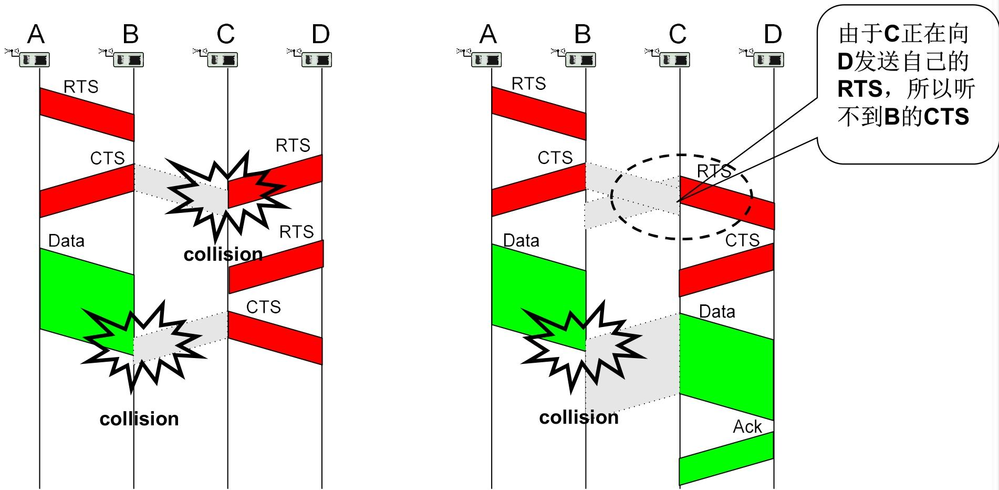

### MAC协议分类

MAC 协议的分类核心是从 “信道怎么用”“用多少信道”“谁来管信道” 三个维度划分

1. 按分配信道的方式（核心分类维度）

   这个维度决定了节点 “如何获取信道使用权”，是 MAC 协议最核心的划分依据。

   -  竞争型（Contention-based MAC protocol）
     - 信道是 “共享资源”，节点需要发数据时，先检测信道是否空闲，空闲就发，冲突了就按规则重试（比如等随机时间再抢）。
     - CSMA/CA、S-MAC、T-MAC、B-MAC、Sift。
   - 分配型（Schedule-based MAC protocol）
     - 提前把信道资源 “分配到户”，节点按固定 “配额” 使用 —— 比如分配固定的时间片、频率段，节点只在自己的配额内通信，不用抢，自然无冲突。
     - TDMA（时分多址）、FDMA（频分多址）、CDMA（码分多址）、TRAMA、DMAC。

2. 按使用的信道数目

   - 单信道，双信道，多信道

3. 控制类型

   - 集中式（中心节点统一管理信道），控制式（节点之间通过交互信息自主协商信道使用）

## IEEE 802.11 DCF

IEEE 802.11 DCF（分布式协调功能）是 WiFi 等无线局域网的基础 MAC 机制，核心是通过 “冲突避免” 解决无线信道无法检测冲突的问题，同时用 RTS/CTS 握手机制优化信道占用

### 为什么无线不用 CSMA/CD？

有线网络用 CSMA/CD（载波监听多路访问 / 冲突检测），发送数据时能实时检测是否冲突，一旦冲突就立即停止发送，节省能量。但无线局域网（WLAN）做不到：

- 设备同一时间只能要么发数据、要么收数据，**没法同时 “发送 + 检测冲突”**；
- 就算发送端显示发送正常，也可能因为信号衰减、遮挡等问题，数据根本没传到接收端，检测不到这种 “隐性失败”。

所以无线场景下，把 “冲突检测” 改成了 “**冲突避免**”，也就是 CSMA/CA 机制 —— 核心思路是 “发送前先确认信道空闲，忙就避让，减少冲突概率”。

### CSMA/CA （载波监听多路访问 / 冲突避免）

CSMA/CA 的核心是 “先监听、再发送，忙则退避”

1. 发送前监听信道：节点要发数据时，先通过两种方式**判断信道是否空闲**：
   - 物理载波监听（CS）：直接检测无线信号的能量或质量，有信号就认为信道忙；
   - 虚拟载波监听（CS）：看 MAC 报头或 RTS/CTS 报文中的 **NAV 字段**，NAV 值没减到 0，就认为信道还被占用。
   - 只要两种监听中有一个显示 “忙”，就不发送数据。
2. 信道状态处理
   - 若信道空闲：等待 DIFS（分布式协调帧隙）时间后，直接发送数据；
   - 若信道忙：先等信道空闲，再等待一段 “随机退避时间”，之后再监听信道，空闲就发送。
   - 关键：每个节点的退避时间不一样，能大幅减少多个节点同时抢信道的冲突。

其中通过帧间间隔（IFS）实现优先级控制：

> - SIFS（短帧隙）：优先级最高（比如 10μs/802.11b），用于需要立即响应的控制帧，比如 ACK、CTS，不用等退避，直接发送；
> - DIFS（分布式协调帧隙）：优先级中等（比如 50μs/802.11b），用于发送数据帧和普通管理帧，必须等 DIFS 时间后，确认信道空闲才能发送；
> - PIFS（点协调帧隙）：优先级介于 SIFS 和 DIFS 之间（比如 30μs/802.11b），用于 PCF（点协调功能）模式，能优先抢占信道。

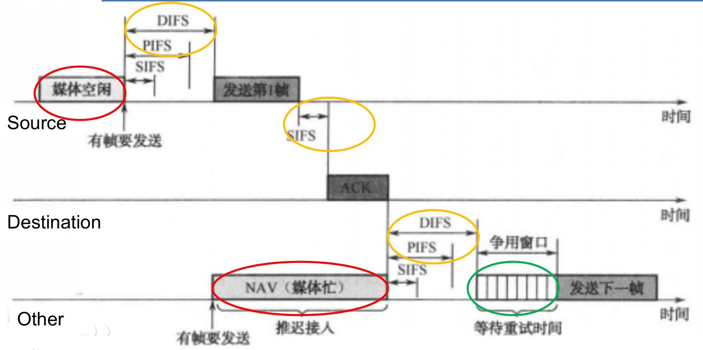

### RTS/CTS 握手机制（信道预留）

CSMA/CA 的优化补充，用来解决 “隐终端” 问题，同时明确信道占用时长，流程像 “打电话前先问对方是否方便”：

1. **RTS（请求发送）**：发送节点先发一个短控制消息，告诉接收节点 “我要给你发数据，**预计占用信道多久**”；
2. **CTS（允许发送）**：接收节点收到 RTS 后，立即回一个短控制消息，告诉周围所有节点 “信道忙”；
3. **数据传输 + ACK 确认**：发送节点收到 CTS 后，才开始发真正的数据；接收节点收到数据后，回复 ACK（确认消息），告诉发送节点 “数据收到了”。

> [!tip]
>
> 1. 发送节点：等 DIFS 时间→发 RTS；
> 2. 接收节点：收到 RTS 后，等 SIFS 时间→发 CTS；
> 3. 发送节点：收到 CTS 后，等 SIFS 时间→发数据；
> 4. 接收节点：收到数据后，等 SIFS 时间→发 ACK；
> 5. 其他节点：听到 RTS/CTS 后，根据 NAV 值避让，等 NAV 倒计时结束后，再等 DIFS 时间 + 随机退避时间，才能竞争信道。
>
> 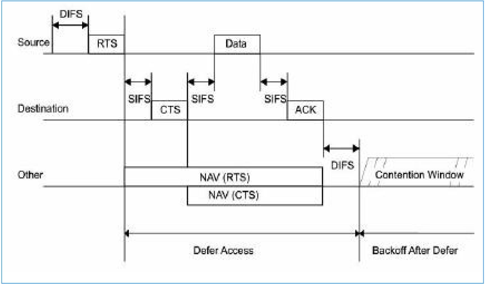

### 随机退避算法 —— 减少同时抢信道的冲突

当多个节点都检测到信道忙，等信道空闲后，不会同时发送，而是通过 “随机退避” 决定发送顺序：

1. 退避时间计算：**退避时间 = 随机数（Random ()）× 时隙时间（aSlottime）**；
   - 随机数（Random ()）：从 [0, CW] 区间里选一个均匀分布的整数，CW 是 “竞争窗口”；
   - 时隙时间（aSlottime）：固定值（比如 20μs/802.11b），包含发射启动、信号传播、检测响应的时间；
2. CW 的动态调整：类似于计网中TCP的拥塞控制
   - 第一次发送时，CW 用最小竞争窗（CWmin），比如 802.11b 的 CWmin=31；
   - 如果发送后没收到 ACK（说明冲突或传输失败），CW 就加倍（比如 31→62→124…），直到达到最大竞争窗（CWmax）；
   - **冲突越多，退避时间的随机性越大**，越能减少再次冲突的概率。
3. **退避过程**：多个节点同时进入退避时，退避时间最短的节点会最先竞争到信道，直接发送数据。

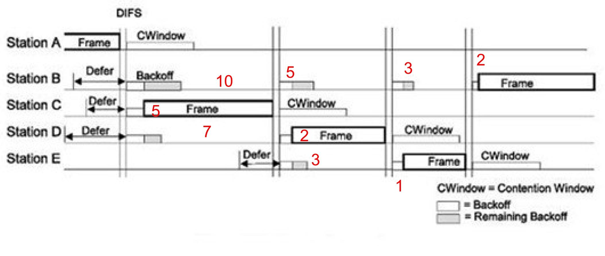

# S-MAC 协议

S-MAC 是专为无线传感器网络（WSN）设计的**竞争型 MAC 协议**，核心是在 WSN 资源受限的场景下，平衡节能与网络可用性

S-MAC 的设计基于 3 个关键场景假设，所有机制都围绕这些前提展开：

1. **单信道通信**：所有传感器节点共用一个无线信道
2. **平均数据率很低**：不需要高频次传输数据，数据发送间隔较长；
3. **可容忍一定通信延迟**：优先保证节点低功耗运行，允许数据传输有一定延迟

S-MAC 的设计目标优先级为 “节能＞扩展性”：最大化节点空闲（Idle）时间，减少能量浪费 —— 重点规避冲突、串音、空闲监听、控制消息开销这四类能耗源头；

S-MAC 的核心思想：

1. **周期性休眠 / 侦听**：节点按固定周期交替 “唤醒（侦听 / 收发数据）” 和 “休眠（关闭射频）”，从根源降低idle时间，减少空闲监听能耗
2. **邻居节点休眠机制**：当某两个节点正在收发数据时，无关的邻居节点主动进入休眠，既**避免了串音**（听无关数据），又减少了冲突（抢信道），双重节能；
3. **消息传递机制**：针对长消息重传代价高、短消息控制开销大的问题，优化数据传输方式，减少控制消息带来的能耗；
4. **自适应侦听机制**：缓解周期性休眠导致的延迟累加问题，在不增加太多能耗的前提下，让数据能更快地在多跳网络中传输。

## 周期性侦听和睡眠

周期性侦听和睡眠：本质是让传感器节点 “按时间表上下班”—— 定时唤醒处理通信、其余时间休眠省电；即**周期性唤醒**

- 每个节点都有一套固定的 “通信时间表”，核心由 3 个时段和 1 个关键参数构成：
  - **唤醒周期（Wakeup Period，也称调度周期 Tw）**：整个作息（**侦听时段+睡眠时段**）的循环时长，比如 “100 秒一个周期”，是节点作息的 “总时长”；
  - **侦听时段（Active Period，也称活跃时段 Ta）**：周期内节点唤醒的时间，比如 “100 秒周期中唤醒 10 秒”，这段时间节点可收发数据、交换同步信息，相当于 “工作时间”；
  - **睡眠时段（Sleep Period）**：周期内节点休眠的时间，即 “Tw - Ta”（比如 100 秒 - 10 秒 = 90 秒），这段时间节点关闭射频模块，完全不处理通信，相当于 “休息时间”；
  - **占空比（Duty Cycle）**：核心参数，公式是 “占空比 = Ta/Tw”，直白说就是 “节点每个周期的**工作时间占比**”（比如 10 秒 / 100 秒 = 10%），直接决定节能效果和通信效率。

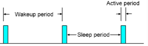

### 占空比

占空比没有 “绝对最优值”，选大或选小要根据场景权衡，核心是 “节能” 和 “通信效率” 的取舍

1. 小占空比（比如 Ta=1 秒，Tw=100 秒，占空比 1%）
   - 优点：节点 99% 的时间都在休眠，能最大程度避免 “没事却一直监听信道” 的空闲能耗，**超级省电，延长节点生命周期**；
   - 缺点：所有邻居节点的通信都要挤在 1 秒的活跃时段，**容易引发信道竞争和冲突**；多跳场景下，每跳都要等节点唤醒，等待时间会累积，导致端到端延迟变大（比如 10 跳每跳等 100 秒，总延迟就达 1000 秒）。
2. 大占空比（比如 Ta=30 秒，Tw=100 秒，占空比 30%）
   - 优点：活跃时间长，通信不用扎堆，冲突少；多跳传输时不用长时间等待，延迟小，通信效率高；
   - 缺点：休眠时间短，节点空闲监听的能耗增加，电池消耗更快，节能效果打折扣。

### 调度同步：邻居节点 “作息对齐” 才能通信

节点不能各自按自己的时间表来，否则 “你工作时我休眠”，数据根本传不了，所以必须实现 “邻居作息同步”：

分别有节点启动时的同步流程和工作中的同步维护

1. 节点启动时的同步流程

   - 主要是侦听是否存在邻居节点的同步帧 “同步广播（SYNC 帧）”，**优先 “抄邻居的作息”，没邻居就 “自己定作息”**

   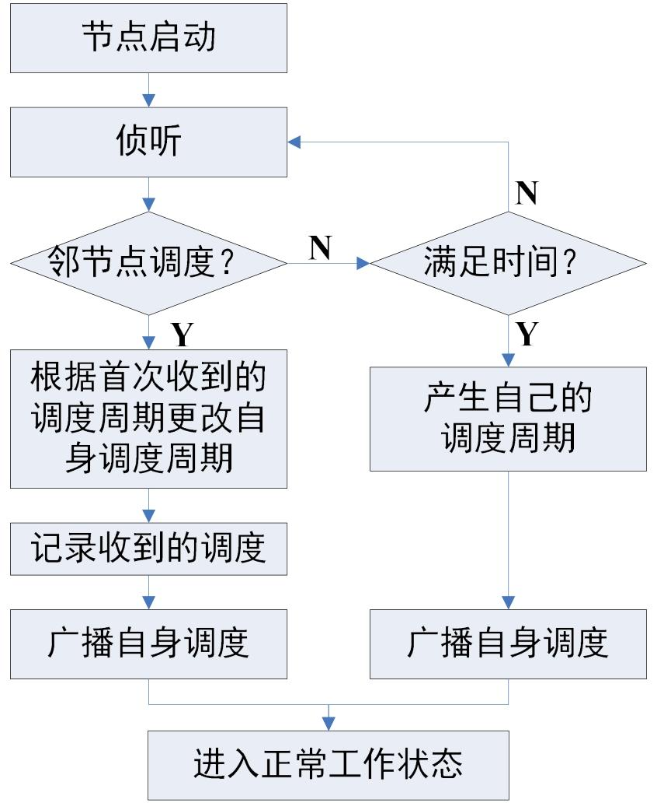

   - 例如：A 启动时没有邻居，后来 B 加入，流程如下：

     1. A 启动后侦听，没收到 SYNC→自己定作息，广播 “ASYNC”；

     2. B 加入，广播自己的作息 “BSYNC”；

     3. 因为 A 没有其他邻居，所以直接采纳 B 的 “BSYNC”，和 B 同步作息

        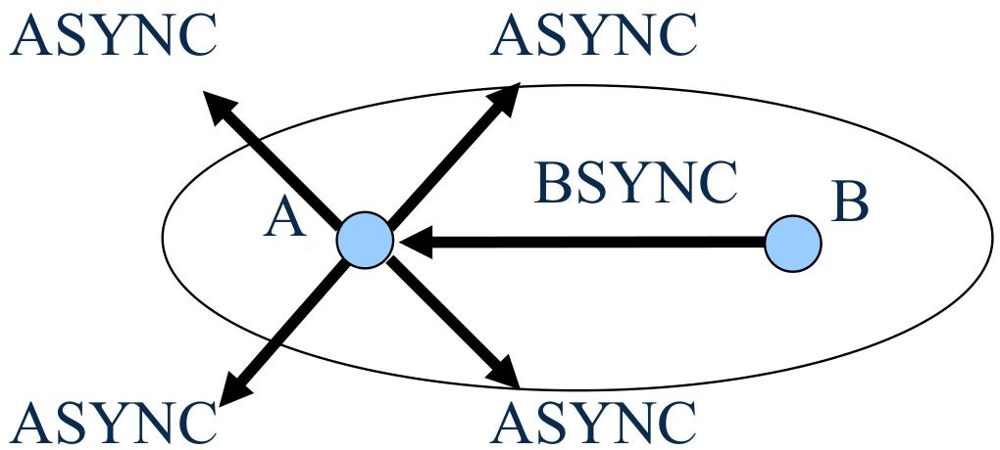

2. 工作中的同步维护

   - 工作中遇到新调度，**优先保持原作息，仅记录新调度**（避免频繁改作息）。

     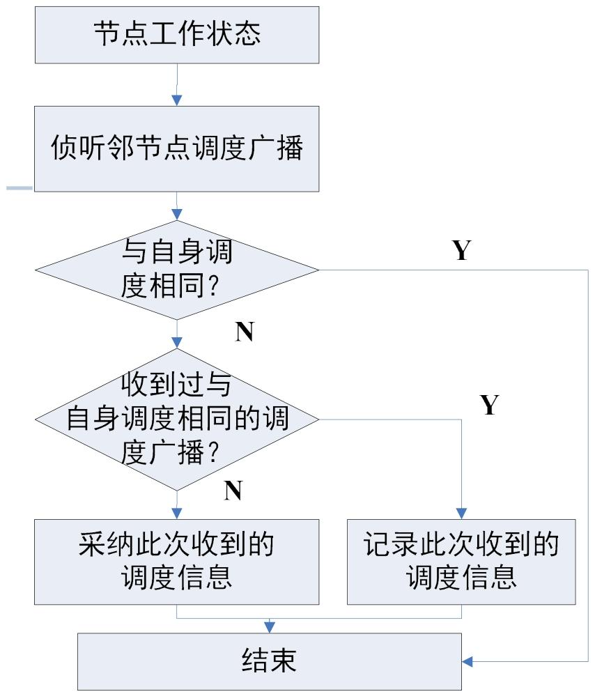

   - 其中工作中的维护例如：A 启动时已有邻居（N），后来 B 加入，流程如下：

     1. A 启动后侦听，没收到 SYNC→自己定作息 “ASYNC”，和邻居 N 同步；
     2. B 加入，广播自己的作息 “BSYNC”；
     3. 因为 A 已有邻居，所以**同时记录 “ASYNC” 和 “BSYNC”**，既和原邻居 N 通信，也能和 B 通信。

     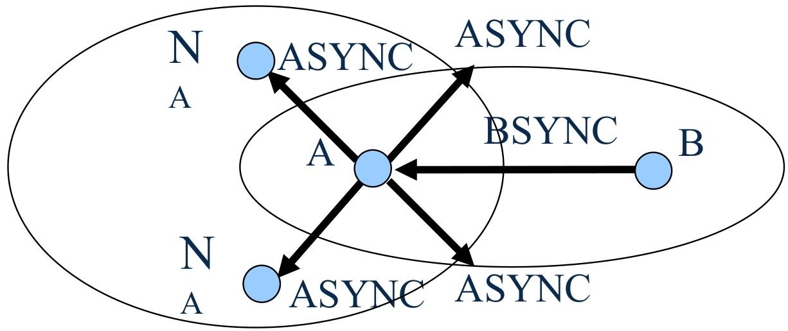

相邻节点同步后，会形成 “虚拟簇”（也称 “时间表同步的岛屿”），簇内所有节点作息完全相同，通信顺畅；

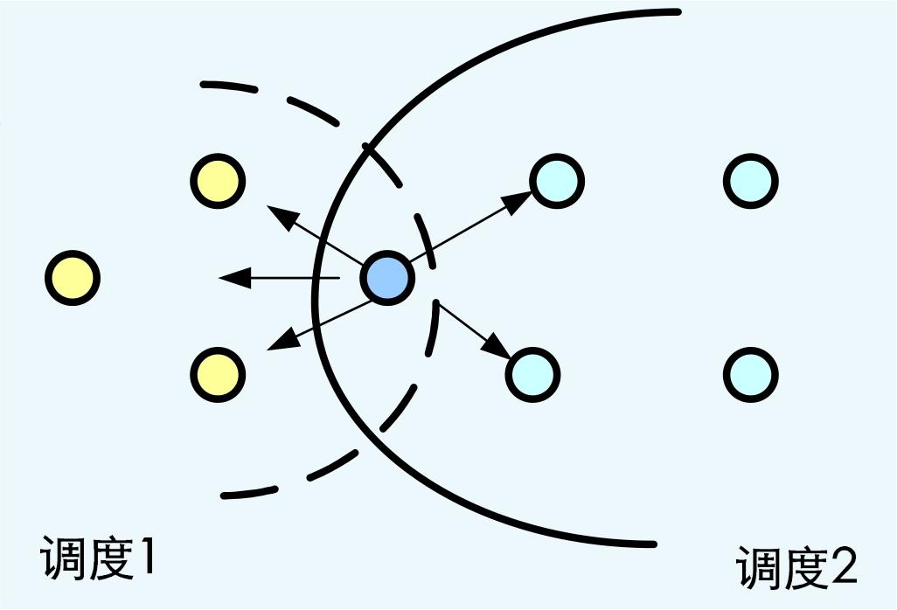

- 同一个簇内的所有节点，作息（调度周期、活跃 / 睡眠时段）完全一致；
- 不同簇的作息可能不同，但簇内通信是顺畅的（因为作息同步）。

但是如果一个节点同时属于**两个或多个簇**（比如节点 G 既在簇 1 的通信范围内，又在簇 2 的通信范围内），它就是**边界节点**：

1. **需要记录多个调度**：既要记住簇 1 的作息，也要记住簇 2 的作息；
2. **睡眠时间更短**：为了能和不同簇的节点通信，边界节点的活跃时段会覆盖多个簇的作息，相当于 “要同时上多个班”，所以睡眠时段被压缩，能耗会比普通节点高一些。

### 时间同步的维护：解决 “时钟漂移” 问题

节点的内置时钟会有 “漂移”（比如 A 的时钟每天快 2 秒，B 的每天慢 1 秒），时间久了作息就会不同步，S-MAC 用 **“相对时间戳”** 解决：

1. **发送节点记录 Ts**：发送完数据包后，记录自己 “从发完包到进入睡眠还需要等多久”（比如等 5 秒，记为`Ts=5`）；
2. **接收节点记录 Tr**：接收这个数据包时，记录自己 “接收包用了多久”（比如用了 2 秒，记为`Tr=2`）；
3. **接收节点调整时钟**：用`Ts - Tr`（5-2=3 秒）调整自己的时钟，确保和发送节点的作息对齐；
4. **辅助保障：定期全周期监听**：节点会定期 “全周期不睡觉”，专门接收邻居的 SYNC 帧，进一步修正时钟偏差。

### 侦听时段的细分：同步和通信 “分工”

节点的**活跃时段（Listen period）会分成两段**，避免混乱：

1. **同步时段**：专门交换 SYNC 帧，确认邻居的作息是否有变化，保持调度同步；
2. **控制时段**：处理实际数据传输，节点要发数据前，必须先用 CSMA 机制侦听信道（看看有没有其他节点在用），避免冲突。

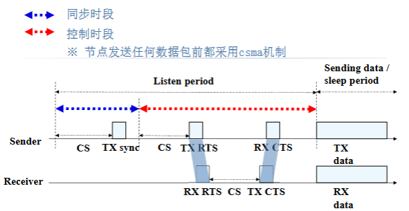

---

## 邻居节点休眠机制

串音：节点会收到**和自己无关的其他节点的通信数据**

所以信道忙时，**邻居节点主动休眠**，当两个节点（比如 A 和 B）正在通信时：

- **谁休眠？**：A 和 B 的**所有直接邻居**（比如 A 旁边的 C、B 旁边的 D）；
- 通过 RTS/CTS 报文中的**NAV 字段**（信道占用倒计时）决定休眠时间 —— 邻居节点看到 NAV 值，就知道 “信道还要忙多久”，这段时间直接休眠，不用监听。

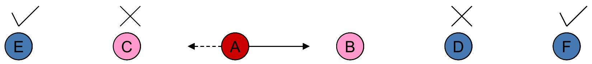

## 消息传递机制

消息(Message)：是具有密切的内部联系的**数据的集合**，只有得到完整的数据才可以在网络内部进行数据处理、聚合

其中消息又分为长消息（重传代价大）和短消息（传输代价大）

所以“一次预约，分段传输”：把长消息拆成多个短数据段（DATA），流程是：

1. 发**1 次 RTS/CTS**：预约整个长消息的信道占用时间；
2. 逐个发数据段：每个 DATA 都带 ACK 确认（确保传输成功）；
3. 重传只重传失败段：某一个 DATA 没收到 ACK，只重传这一段，不用重新预约信道。

以此降低重传代价和减少竞争延迟

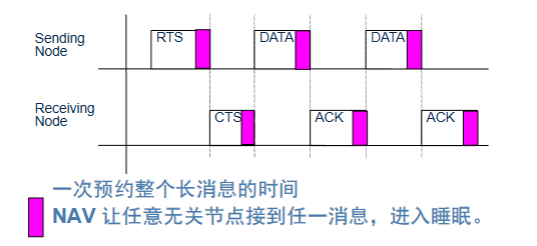

## 流量自适应侦听（AL）

周期性休眠会导致**多跳延迟累加**：比如 A→B→C 的传输，B 收到 A 的数据后，C 可能在休眠，B 得等 C 下一个活跃时段才能传，延迟变大。

解决办法：通信结束后，**邻居节点额外唤醒**

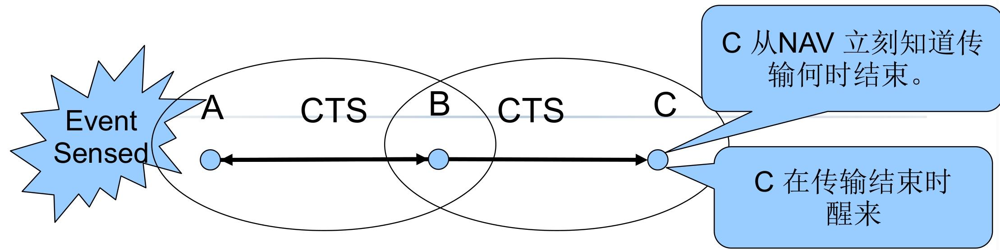

当 A 和 B 通信结束时：

- B 的邻居（比如 C）会通过 NAV 知道 “传输何时结束”；
- 传输结束后，C**额外唤醒一段时间**（自适应侦听窗口）；
- 若 B 有数据传给 C，可直接发 RTS，C 不用等下一个活跃时段，直接接收。

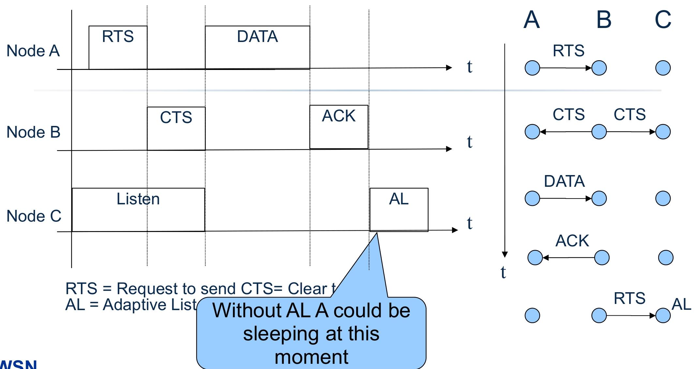

但是S-MAC协议也有其缺点：

- 调度周期固定：低流量时，活跃时段还是按高负载设计，会浪费能量；
- 边界节点能耗快：要适配多个簇的作息，睡眠少；
- 延迟优化有限：仅减少 1 跳延迟，多跳场景延迟仍大。

针对上述问题的相对应的改进协议

- **T-MAC**：解决 “固定活跃时间” 问题，动态调整活跃时长；
- **B-MAC**：解决 “严格同步” 问题，采用异步通信（不用同步作息）；
- **Sift**：解决 “事件响应慢” 问题，适配灾害报警等事件驱动场景。

# 分配型 MAC 协议

分配型 MAC 协议是为解决竞争型协议 “冲突浪费” 问题而生的 WSN 关键技术，核心是 “提前划分信道资源 + 按需分配”，从根源避免冲突

竞争型协议（如 S-MAC、CSMA/CA）的最大痛点是**冲突**：

- 多个节点同时抢信道，信号碰撞导致数据重传，既浪费节点能量（重传耗电），又降低带宽利用率（信道被无效数据占用）；
- 还会产生串音（接收无关数据）、空闲监听（无数据时仍监听信道）等额外能耗。

分配型协议的解决方案很直接：

1. 把无线信道拆分成多个 “子信道”（按时隙、频率、编码等维度）；
2. 用 “**调度表**” 把这些子信道静态或动态分配给节点；
3. 节点只在自己分配到的子信道上通信，彻底避免冲突，同时减少串音和空闲监听。

简单说：竞争型是 “先抢后用”，分配型是 “先分后用”，适配对冲突敏感、需节能的 WSN 场景。

分配型协议的核心是 “如何拆分信道”，主流有三种方式，适配不同场景：

1. FDMA（频分多址）：按 “频率” 划分
   - 把整个可用频段分成多个独立的子频段，每个节点独占一个子频段，只能在自己的频段内发送数据。
   - 就像多个电台用不同频率广播，听众调对频率就能收到，互不干扰。

2. TDMA（时分多址）：按 “时间” 划分
   - 把时间轴分成固定长度的 “时间帧”（也称超帧），每个时间帧再拆成多个 “时隙”（比如 1 个超帧 = 10 个时隙）；每个节点分配到固定的时隙，只能在自己的时隙内收发数据，其他时间休眠。
   - 就像会议室排发言表，每个人分配固定时间段，到点发言，其他人等待，不会抢话。

3. CDMA（码分多址）：按 “编码” 划分
   - 所有节点共用同一个频段，但每个节点有专属的 “编码”；发送数据时，节点用自己的编码调制信号，接收节点只有用相同的编码才能解调数据，相当于 “专属密码”。
   - 就像多人在同一房间用不同语言聊天，只有懂对应语言的人才能听懂，互不干扰。

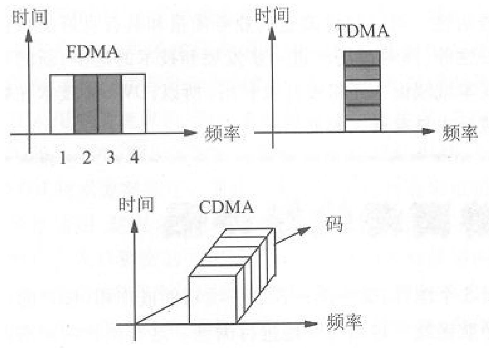

## 基于 TDMA 的 MAC 协议

基于 TDMA 的 MAC 协议是分配型协议的核心分支，核心逻辑是 “按时间划分时隙，节点独占时隙通信”

- **超帧（时间帧）**：时间轴被划分为固定长度的 “超帧”，每个超帧包含固定数量的 “时隙”（比如 1 个超帧 = 8 个时隙），超帧循环重复；
- **时隙独占**：每个节点被分配 1 个或多个专属时隙，只能在自己的时隙内收发数据，其他时隙完全休眠（关闭射频节能）；

要让 TDMA 正常工作，必须解决 4 个核心问题：

1. **超帧格式**：确定超帧长度、时隙数量（比如根据数据传输量，设置 10 个时隙 / 超帧）；
2. **时隙时长**：每个时隙的长度要足够容纳 1 个数据帧 + ACK 帧，避免数据传输超时；
3. **时隙分配**：按调度表将时隙分配给节点，分两种调度方式；
4. **时间同步**：所有节点的时钟必须严格对齐（误差小于时隙时长的 10%），否则时隙重叠会导致冲突。

两种时隙调度表设计

| 调度表类型   | 核心逻辑                                                    | 特点                                           | 适用场景                                   |
| ------------ | ----------------------------------------------------------- | ---------------------------------------------- | ------------------------------------------ |
| 全局调度表   | 由中心节点（如 Sink）统一分配所有节点的时隙，确保全局无冲突 | 调度简单、无冲突，但中心节点故障会导致网络瘫痪 | 一跳共享网络（节点都在中心节点通信范围内） |
| 分布式调度表 | 节点自主协商时隙分配，仅保证 “两跳内邻居不同时发送”         | 无中心节点、可扩展性好，但协商逻辑复杂         | 多跳共享网络（节点需通过中继转发数据）     |

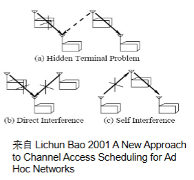

### TRAMA（流量自适应 TDMA）

TRAMA 是基于 TDMA 的**动态分配协议**，解决了传统 TDMA“时隙固定分配、不适应流量变化” 的问题，核心是 “按流量动态调整时隙，空闲时隙可释放”。

本质是将物理信道**划分为多个时隙**，每个时隙的无冲突发送者由 “**两跳内邻居信息**” 决定；

- 时间帧交替分为两个时段，各司其职：
  1. **随机接入时段**：节点交换邻居信息、同步时钟，维护网络拓扑（不传输业务数据）；
  2. **分配接入时段**：根据流量动态分配时隙，节点在专属时隙内发送数据，无数据则放弃时隙。

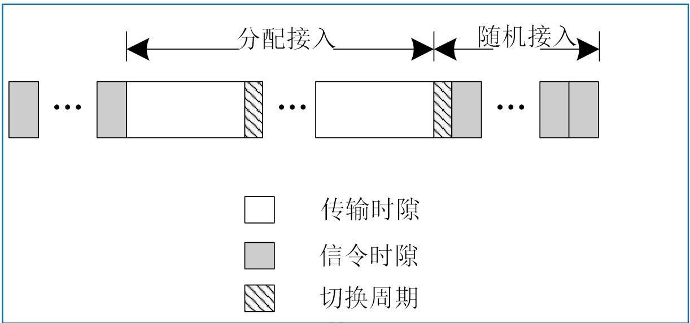

同时依赖三大算法或者协议实现动态时隙分配：NP协议维护邻居信息，SEP协议生成流量自适应调度表，AEA算法动态决定节点状态（发送 / 接收 / 休眠）

#### Neighbor Protocol (NP协议)

NP 协议的核心作用是让每个节点都能实时掌握 “谁是我的邻居”“邻居的邻居是谁”，相当于给节点建一张动态更新的 “网络通讯录”

1. 交换邻居更新信息：让节点知道周围哪些节点是活跃的（可通信的）；
2. 同步时钟信息：为 TDMA 时隙分配提供时间基准，避免时钟漂移导致冲突。

NP 协议只在**随机接入时段**工作，在这个阶段中所有节点都处于活跃状态，专门用于交换控制信息

具体实现逻辑：

1. 周期性发送控制信息，一是自己的 “一跳邻居列表”（当前能直接通信的节点），二是时钟同步信息（确保所有节点时间对齐）
2. 邻居状态判断：节点会持续监听邻居的控制信息广播，超过时间没收到更新，就判定该邻居 “失效”
3. 重传机制：如果节点没收到邻居的确认（或判断信息可能丢失），会在后续的随机接入时段重新广播控制信息
4. 维护两跳邻居表：每个节点最终会生成并维护一张 “两跳邻居表”（包括一跳邻居）

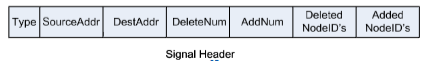

#### Schedule Exchange Protocol（SEP 协议）

SEP 协议是 TRAMA 协议的核心调度技术，本质是 “**基于流量的动态时隙分配机制**”，负责生成和同步调度表，让节点知道 “哪个时隙该自己用”

建立并维护**流量自适应的调度表**—— 节点有数据时优先占用时隙，无数据时释放时隙，避免传统 TDMA 时隙浪费的问题，同时通过广播同步调度信息，让全网节点达成 “时隙使用共识”。

1. 确定调度间隔：`Schedule_Interval`（调度间隔），即一次分配接入时段包含的时隙数

2. 计算 “赢时隙”：在`[t, t+Schedule_Interval]`的时隙范围内，节点基于 “两跳邻居信息”（由 NP 协议提供），计算每个时隙的优先级，选出自己在两跳内优先级最高的时隙 —— 这就是 “赢时隙”，节点在该时隙中发送数据无冲突

   > [!important]
   >
   > **优先级计算公式**：`Priority(u,t) = hash(u ⊕ t)`，其中`u`是节点唯一编号，`t`是时隙编号；
   >
   > 通过哈希函数生成，确保每个节点在不同时隙的优先级随机且唯一；

3. 时隙占用决策：有数据则保留，无数据则放弃“赢时隙”

4. 调度信息广播：节点将自己的时隙分配结果（哪些时隙保留、哪些放弃、接收者是谁）封装到 “调度分组（schedule package）” 中；按固定周期广播调度分组，邻居节点接收后，更新自己的调度表，明确 “哪个节点在哪个时隙使用信道”，避免冲突。

   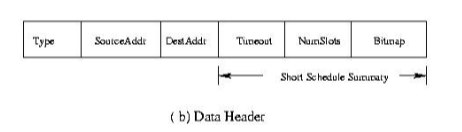

   - 格式包含`SourceAddr`（发送节点 ID）、`Timeout`（调度有效时间）、`Bitmaps`（时隙状态位图，标记保留 / 放弃）等字段；

由于调度分组可能因信道干扰丢失，导致邻居节点调度不同步；

在发送业务数据的分组中，携带 “调度摘要”（核心调度信息），即使调度分组丢失，邻居也能通过数据分组获取调度信息，确保同步一致性。

#### 自适应选举算法（AEA）

AEA 的核心作用是**实时判定节点状态**，让有数据的节点按优先级占用时隙，无数据的节点休眠节能，在某一时隙“t”上：

1. 节点具有两跳邻居内**最高优先级并且有数据**需要发送，则进入发送状态。确保两跳内仅一个节点发送数据，彻底避免冲突；
2. 让指定接收节点保持接收状态，不遗漏数据；
3. 其余节点休眠，最大化节能效果。

每个时隙的状态判定流程

1. 节点先基于 NP 协议的两跳邻居表，和 SEP 协议的优先级数据，算出 tx (u)、atx (u)、ntx (u) 三个核心角色
2. 按 “绝对胜者→相对胜者→急需胜者→休眠” 的顺序判断，优先级从高到低
3. “指定接收方”→进入**接收状态**

节点仅知道两跳内信息，可能出现 “认知偏差”—— 比如 A 不知道两跳外的 D 优先级更高，误以为自己是最高优先级

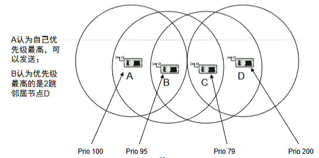

> [!tip]
>
> TRAMA 是 “为节能和无冲突牺牲了复杂度与延迟” 的协议，是**静态 / 半静态、周期性传输 WSN 场景的适配方案**，但不适合动态拓扑、高实时性的场景

## DMAC 协议

DMAC 是专为 **数据采集树型 WSN（节点向 Sink 单向传数据）** 设计的时分复用 MAC 协议，核心解决传统协议（如 S-MAC/T-MAC）的 “数据转发中断” 问题

“数据转发中断（DFI）”：S-MAC/T-MAC 的周期性休眠机制存在缺陷：

- 通信范围外的节点会在活跃期后休眠，导致多跳传输中断，产生中断数据转发
- 每个唤醒周期最多转发 2 跳，多跳场景下延迟累积严重。

DMAC 仅适用于以下固定场景：

> 1. 拓扑为**数据采集树**（节点分层，数据向 Sink 单向传输）；
> 2. 节点静态、路由稳定；
> 3. 节点时钟严格同步。

1. 交错唤醒机制：解决转发中断
   - 多跳路径上的节点**依次交错唤醒**，形成 “接收→发送→睡眠” 的链式节奏，保证数据持续传输。
   - 下层节点的唤醒时间比上层节点**提前 1 个时段（u）**
   - 用 “ACK + 重传” 保障可靠性，省去 RTS/CTS 降低控制开销；
   - 同层节点通过 “固定退避 / 随机退避 / 短周期” 避免碰撞。
2. 自适应占空比：适配多数据包传输
   - 节点需连续发送多个数据包时，固定占空比会导致传输中断。因此在数据帧 / ACK 帧中加入 “more data flag” 标记
     - 标记为 “1”：表示 “还有数据要发 / 准备好接收”；
     - 连续发送的节点在睡眠 3u 后唤醒，避免冲突。
3. 数据预测机制：解决父节点早睡（兄弟干扰）
   - 上层节点（父节点）子节点多，竞争失败的子节点会延迟发送。
   - 节点接收到数据后，**预测子节点仍有数据**，在发送周期结束后休眠 3u，重新切换为接收状态，等待子节点发送。
4. MTS 帧机制：解决跨父节点干扰
   - 不同父节点的节点（如 M 和 N）通信范围重叠，N 竞争胜出会导致 M 及其父节点 F 无传输时段，数据预测机制失效。
   - 引入**MTS（More To Send）帧**：包含目的地址和MTS标志位
     - MTS 请求（标志位 1）：节点因信道忙未发送数据，或收到子节点的 MTS 请求时，向父节点发送请求；
     - MTS 清除（标志位 0）：节点缓冲区为空且收到所有子节点的清除帧后，向发送过“MTS请求”帧，但没有
       发送过“MTS清除”帧的父节点发送清除，恢复原占空比；
     - 发送 / 接收 MTS 请求的节点每隔 3u 唤醒一次，保障数据传输。

# 拓展

针对S-MAC存在的问题进行改进的协议

- **T-MAC**：解决 “固定活跃时间” 问题，动态调整活跃时长；
- **B-MAC**：解决 “严格同步” 问题，采用异步通信（不用同步作息）；
- **Sift**：解决 “事件响应慢” 问题，适配灾害报警等事件驱动场景。

## T-MAC 协议

为了优化 S-MAC 的固定活跃时间缺陷，在低流量场景下减少空闲监听能耗。

T-MAC 的核心改进思路：**动态调整活跃时间长度**—— 在活跃时段内，若持续 TA 时间无激活事件，则提前进入睡眠。

节点处于**侦听（活跃）状态**，直到满足以下条件之一：

1. 调度周期定时器溢出；
2. 持续 TA 时间内**无激活事件**（激活事件包括：收到数据、感知到通信、侦听到 RTS-CTS 帧）。

此时节点会提前进入睡眠状态，减少空闲监听能耗

TA 是 “最短空闲侦听时间”，需满足约束：`TA > C + R + T`，C为信道竞争时间，R为发送RTS时间，T为状态切换时间

实际取值通常为：TA=1.5×(*C*+*R*+*T*)

通过**未来请求发送（FRTS）帧**解决早睡问题：发送节点转发节点发送**FRTS 帧**，提前唤醒下一跳节点和目的节点：

为避免节点缓冲区已满时丢失数据，T-MAC 增加规则：若节点缓冲区已满，**优先发送自身缓存的数据**，再接收其他节点的数据；

> [!tip]
>
> T-MAC 是**S-MAC 的低流量优化版本**，通过 “动态活跃时间 + FRTS 机制”，在流量波动较大、对节能敏感的 WSN 场景（如环境监测）中，平衡了节能与传输效率，但额外开销使其不适用于高流量场景。

---

## B-MAC（Berkeley MAC）协议

B-MAC 的节能与通信逻辑均基于 “异步休眠 - 唤醒” 设计，最小化空闲监听（idle listening）能耗

1. 低功耗侦听（LPL)
   - 无需像 S-MAC 那样严格同步邻居作息，节点可自主设定休眠 - 唤醒间隔
   - 节点按自定义的 “检查间隔（Check Interval）” 周期性醒来，检查前导码作为发送请求的信号
   - 发送者使用一个很长的前导码来提醒接收者，接收者没有检测到前导码立即休眠
2. 自适应前导侦听
   - 发送者在传输数据前，先发送一段 “足够长的前导码”（长度需覆盖接收者的最大休眠间隔）确保接收到
   - 接收者周期性唤醒检测到前导码后，会停止休眠，保持接收状态直到数据传输完成（或超时）
   - 前导码长度可根据网络拓扑（如节点休眠间隔、通信距离）动态调整
3. 信道空闲检测（CCA）
   - 发送前先检测信道是否空闲，发现空闲再发出前导码

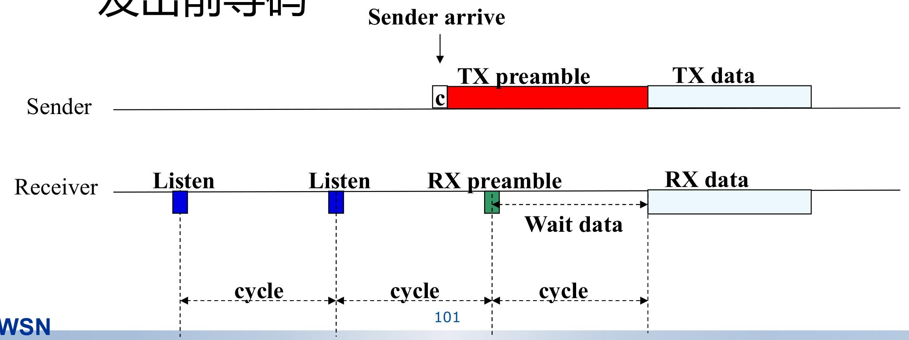

---

## Sift 协议

解决**事件驱动型无线传感器网络（WSN）的实时响应问题**，即“感知突发事件并快速上报”，而非周期性传输数据

Sift 协议的核心是**非均匀概率时隙选择**：

- 采用**固定长度的竞争窗口 CW**（无需动态调整窗口大小，简化逻辑）；

- 节点在竞争窗口的不同时隙（*r*=1,2,...,*CW*）选择发送数据的概率**呈几何递增**

  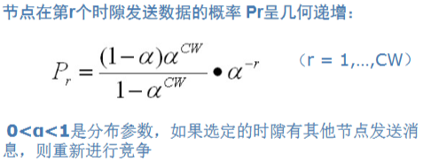

让早期时隙优先 “筛选” 少量节点发送，后期时隙通过高概率确保剩余节点快速竞争，减少冲突次数，缩短事件上报总时间。

