# 无线传感器网络（WSN）路由协议

路由协议作为 WSN 网络层的关键组成，直接决定了数据从源节点到汇聚节点（Sink）的传输效率、能量消耗和网络生存周期。

## 概述

路由的本质是**将数据分组从源节点通过网络转发到目的节点**，核心包含两大任务：

- 寻找源节点与目的节点间的优化路径；
- 确保数据分组沿优化路径正确转发。

通过两种基本策略实现：

- 源路由策略：源节点预先确定完整路径，数据分组携带全部路由信息；
- 逐跳路由策略：每个节点维护路由表，记录目的节点的下一跳和 “代价”（通常为跳数），数据逐节点转发。

传统网络路由的核心目标是**低延迟、高网络利用率和公平性**，而WSN网络要求能量高效能耗小，可拓展适应动态，鲁棒性，快速收敛

WSN 的路由设计与数据传输驱动方式紧密相关，主要分为三类：

- 时间驱动（周期上报）：节点**定期采集并上报**数据到Sink节点，适用于常态化监测（如环境温湿度监测）；
- 事件驱动（事件触发）：节点仅在采集**数据超过阈值时上报**（如森林火警、设备异常），具有局部性、低频率特点；
- 查询驱动：节点不主动上报，仅**响应 Sink 节点的查询命令**（如特定区域数据查询、目标跟踪）。

### 路由分类

WSN 路由协议可从多个维度分类，核心分类方式有两种：基于应用场景和基于网络拓扑。

1. 基于应用的分类
   - **能量感知路由协议**：核心关注数据传输的能量消耗，目标是寻找最优能耗路径、延长网络生存期；
   - **基于查询的路由协议**：适用于环境监测等场景，由 Sink 节点发起查询，传感器节点响应并上报数据；
   - **地理位置路由协议**：适用于跟踪类应用，以节点地理位置信息作为路由选择依据；
   - **可靠的路由协议**：针对通信服务质量要求高的场景，确保数据传输的可靠性。

2. 基于网络拓扑的分类
   - 层次型路由协议
     - 节点功能分层（如簇头节点、普通节点），按层次寻址；
   - 平面型路由协议：所有节点地位平等，无功能分层，分为两类：
     - 表驱动路由（先应式 / 主动路由）：每个节点维护到所有节点的路由表，路径随时可用，但路由建立和维护开销大；
     - 按需路由（反应式路由）：仅在源节点需要时通过路由发现过程建立路径，开销低但路由发现延迟高。

---

### 洪泛路由（Flooding）

洪泛路由是一种**无状态、广播式**的路由算法，无需依赖网络拓扑信息、节点地理位置或路由表，仅通过 “全向转发” 机制实现数据从源节点到目的节点的传输

基本思想可简化为 “**收到即转发，除源不重复**”，所以简单、健壮、自适应

但是同样存在不足：冗余、浪费、拥堵；比如**内爆（Implosion）问题**中间节点收到大量重复副本和**交叠（Overlap）现象**相邻同类节点，会采集到性质相同、数值相近的数据并同时洪泛转发

其他改进策略：

1. 谣言路由（Gossiping）：随机转发替代全向转发，但是延迟很大
2. 受限洪泛（Controlled Flooding）：选择性转发邻居子集

> [!tip]
>
> 基于洪泛路由确定节点到 Sink 的最小跳数：
>
> 1. **Sink 节点发起洪泛**：Sink 节点向所有邻居节点发送 “跳数广播包”，包中携带 “当前跳数 = 0”（表示 Sink 自身到自己的跳数为 0）；
> 2. **邻居节点接收并更新跳数**：Sink 的直接邻居节点（如 A、B）收到广播包后，记录 “自身到 Sink 的跳数 = 0+1=1”，并向除 Sink 外的所有邻居转发广播包，同时将 “当前跳数” 更新为 1；
> 3. **下游节点递归更新**：非直接邻居节点（如 A 的邻居 C）收到广播包后，若包中 “当前跳数 + 1” 小于自身已记录的跳数（或未记录跳数），则更新跳数为 “当前跳数 + 1”，并继续转发；若大于已记录跳数，则丢弃该包（避免非最小跳数的路径干扰）；
> 4. **全网收敛**：当所有节点均不再更新跳数时，每个节点记录的 “跳数” 即为其到 Sink 的最小跳数。

## 能量感知路由（Energy aware Routing）

从数据传输的能量消耗出发，通过优化路径选择，实现 “最小化能耗”“最大化网络生存期” 的核心目标

能量感知路由的本质是：**以 “节点可用能量” 和 “路径能量消耗” 为核心决策依据，选择数据转发路径的路由机制**。将 “能量高效” 和 “延长网络生存期” 作为首要目标。

WSN 网络生存期的两种定义

1. **第一个节点失效**，从网络运行开始，到**第一个节点因能量耗尽或故障失效**的时间段。这是最直观的生存期指标，反映了网络 “最小节点寿命”；
2. **网络被分割为不相连的孤立区**，从网络运行开始，到**网络被分割为两个或多个无法通信的孤立区域**的时间段。反映了网络 “连通性寿命”

节点在选择转发路径时，不再盲目选择 “跳数最少” 或 “距离最近” 的路径，而是重点考虑**节点可用能量以及路径能耗**

- 路径上每个节点的**可用能量（PA，power available）** ：节点剩余的、可用于通信的能量（PA 越高，节点越不容易因转发数据失效）；
- 路径的**总能量消耗**：数据从源节点到汇聚节点，沿路径传输所需的总能量（能耗越低，路径越节能）。

### 能量路由策略

能量感知路由的核心是 “路径选择策略”

1. 最大 PA 路由：选 “节点剩余能量总和最大” 的路径
   - 路径上所有节点的可用能量（PA）相加，总和越大，说明这条路径的 “能量储备越充足”，节点越不容易集体失效；
2. 最小能量消耗路由：选 “传输能耗最低” 的路径
   - 数据沿路径传输的总能量消耗最小，直接减少单次数据传输的能量开销，从 “节流” 角度节能；
3. 最少跳数路由：选 “跳数最少” 的路径
   - 跳数越少，数据转发的节点数越少，间接减少总能耗（转发次数少 = 能耗少），且实现简单；
4. 最大最小 PA 节点路由：选 “路径最弱节点能量最强” 的路径
   - 一条路径的 “瓶颈” 是 PA 最小的节点（该节点最先失效，导致路径断裂），因此用 “**路径上 PA 最小的节点能量**” 代表路径的 “可用能量上限”，选择这个 “上限最大” 的路径；

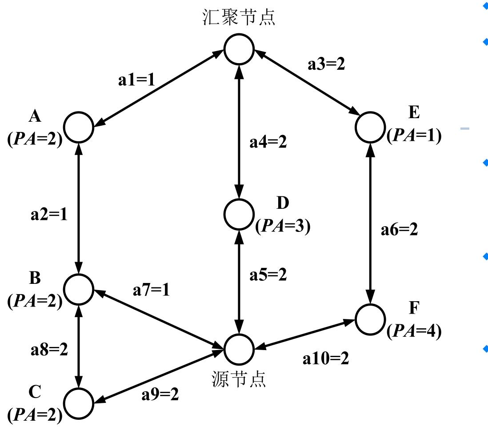

从源节点到汇聚节点一共有四条路径

1. 源→B→A→汇聚（sum_PA=4，need=3)，最小能耗路由，最大PA路由（因为路径2相对于路径1冗余）
2. 源→C→B→A→汇聚(sum_PA=6,need=6)，
3. 源→D→汇聚(sum_PA=3,need=4)，最少跳数路由，最大最小PA路由
4. 源→F→E→汇聚(sum_PA=5,need=6)

---

### 能量感知路由的实现

能量感知路由的实现需依托 “路由信息携带” 或 “路由表维护”

1. 源路由（Source Routing）：源节点决定路由
   - 源节点在发送数据前，预先确定从源到汇聚节点的**完整路径**（如源→B→A→汇聚），并将完整的路由信息（所有节点标识、链路信息）写入数据包报头；
   - 中间节点（如 B、A）无需维护路由表，仅需解析报头中的路由信息，按顺序转发即可；
2. 逐跳路由（Hop-by-Hop Routing）：中间转发
   - 每个节点维护一张**路由表**，路由表中记录 “目的节点（如汇聚节点）→下一跳节点→路径代价（PA 或能耗）”；
   - 中间节点查询路由表，找到 “到汇聚节点” 的下一跳（如 A），将数据包转发给 A，逐节点传递直到汇聚节点；

---

### 能量多径路由（Energy-aware Multipath Routing）

**通过建立多条冗余路径、基于能量代价的概率选路**，解决传统单路径路由 “节点过早失效、网络生存期短” 的痛点

能量多径路由的核心诉求的是：**通过多条路径分担数据传输压力，均衡全网能量消耗，延长网络生存期，同时提升传输可靠性**。

- 不再依赖单条 “最优路径”，而是在源节点和目的节点（Sink）之间建立**多条可用路径**；
- 每条路径的 “优劣” 用 “能量代价” 衡量（综合路径能耗和节点剩余能量）；
- 数据传输时，**按概率选择路径转发**：能量代价越低的路径，被选中的概率越高，既保证传输效率，又避免单路径过载。

1. 路径建立阶段：构建多条 “低能量代价” 路径

   > [!note]
   >
   > - 目的节点发起路径请求（洪泛触发）
   >
   >   - 目的节点（Sink）通过**洪泛方式**向全网发送 “路径建立请求消息”；
   >   - 消息中包含 “能量代价域”，初始值设为 `Cost(Nd) = 0`（`Nd` 表示目的节点，自身到自身的能量代价为 0）。
   >
   > - 中间节点在自己离源节点更近，离目标节点更远的情况下转发该消息，或者丢弃该消息，确保路径向源节点延伸
   >
   >   - 决定转发该消息，需要重新计算能量代价值，其中节点Nj通过节点Ni的路径转发所需能量代价:由上一个节点的代价加上当前节点（Nj）通过邻居节点（Ni）转发数据的**单链路能量代价（Metric）**
   >
   >     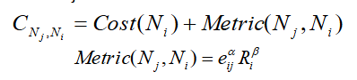
   >
   >     - *eij*：节点 Nj 到 Ni 的无线链路能耗（如发送 1 个数据包的能耗）；
   >     - *Ri*：节点 Ni 的剩余能量（可用能量 PA）；
   >     - *α*、*β*：权重系数（根据应用场景调整，比如更关注能耗则增大*α*，更关注节点剩余能量则增大*β*）；
   >
   >   - 筛选低代价路径（路由表筛选）：仅保留 “能量代价低于阈值” 的路径，**CNj,Ni** ：是节点 Nj 通过节点 Ni 到目的节点的路径总能量代价
   >
   >     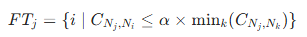
   >
   >     - *FTj*：节点 Nj 的 “可行路径集合”（最终写入路由表的路径）；
   >     - min*k*(*CNj*,*Nk*)：节点 Nj 所有可达路径中的最小能量代价；
   >     - *α*：阈值系数（如 1.5，可调整，确保筛选出少量低代价路径）；
   >
   >   - 计算路径转发概率（P）：对可行路径集合 *FTj* 中的每条路径，计算其被选中的转发概率
   >
   >     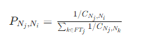
   >
   >     **转发概率与路径能量代价成反比**—— 路径代价越低，1/*C* 越大，被选中的概率越高；
   >
   >   - 更新节点自身能量代价并广播：节点 Nj 根据可行路径的 “转发概率” 和 “路径代价”，计算自身到目的节点的总能量代价
   >
   >     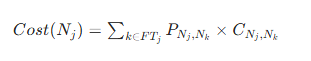

2. 数据传播阶段：按概率转发数据

   - 源节点和中间节点都按照路由表中记录的 “转发概率” 选择下一跳节点，实现数据传输；

3. 路由维护阶段：维持路径畅通

   - 目的节点**周期性发起洪泛查询**（类似路径建立阶段的请求消息）

> [!tip]
>
> 能量多路径路由协议是按需路由吗？
>
> **不是典型的按需路由（反应式路由）**，能量多径路由的路径建立阶段由 “目的节点周期性洪泛” 触发，而非 “源节点数据发送需求” 触发，属于 “主动建立路径”；

---

## 基于查询的路由

基于查询的路由是无线传感器网络（WSN）中**以 “数据需求” 为核心**的路由机制，典型代表是**定向扩散（Directed Diffusion，DD）协议**。

基于查询的路由采用 “基于内容的寻址”，与传统 IP 寻址的区别如下：

| 维度       | 基于内容的寻址（定向扩散）                            | 基于 IP 地址的寻址（传统网络）                       |
| ---------- | ----------------------------------------------------- | ---------------------------------------------------- |
| 访问方式   | 按 “数据属性” 查询（如 “逸夫教学楼 11 阶的平均温度”） | 按 “节点 IP 地址” 查询（如 “地址 13,47 的节点温度”） |
| 核心匹配项 | 数据特征（如类型、区域、阈值）                        | 节点唯一标识（IP 地址）                              |
| 适用场景   | WSN 中 “按需采集数据” 的场景（如环境监测）            | 点到点的端到端通信                                   |

### 兴趣和梯度

兴趣（Interest）：汇聚节点（Sink）下达的 “感知任务指令”，包含数据类型、目标区域、采集频率、时间戳等信息。

- 描述方式：采用 “属性 - 值 - 操作符”（Attribute-Value-Operation）格式，例如：
  - `<type, temperature, EQ>`（类型 = 温度）
  - `<x-coordinate, 20, LE>`（x 坐标≤20）
- IS表示“专门的属性”，由数据源产生,也称实际操作符

梯度（Gradient）：兴趣扩散过程中建立的 “路径权重”，反映路径与 Sink 数据需求的匹配程度（梯度越大，路径越适合传输数据）。

- 探测梯度（probe gradient）：兴趣扩散阶段使用，低速采集 / 发送，用于初步建路；
- 数据梯度（data gradient）：路径加强阶段使用，高速采集 / 发送，用于最优路径传输。

同时每个兴趣对应一个梯度缓冲区(Gradient cache)，保存每个兴趣相关的邻居的梯度

---

### 定向扩散

定向扩散分为**兴趣扩散、数据传播、路径加强**三个阶段，形成 “扩散 - 传输 - 强化” 的闭环：

1. 兴趣扩散阶段
   - Sink 通过洪泛发布 “兴趣”（含任务类型、区域、速率等）；
   - 中间节点本地保存 “兴趣列表”（记录兴趣、梯度、时间戳保证唯一），且同一兴趣仅转发一次；否则兴趣失效
   - 兴趣在网络中扩散，同时建立从源节点到 Sink 的梯度路径。
   - 让网络明确 “需要采集什么数据”，并初步**建立传输路径**。
2. 数据传播阶段
   - 符合 “兴趣” 的源节点（如温度传感器）采集数据，向梯度上的邻居发送 “样本数据”；
   - 中间节点查询兴趣列表，若匹配则缓存数据（通过 “数据缓冲池” 防环路）并转发；
   - Sink 可能通过多条路径收到同一数据的副本（多路径冗余）。
   - 将采集到的**数据传输至 Sink**。
3. 路径加强阶段（Reinforce）
   - Sink 收到 “样本数据” 后，选择 “数据最先到达” 或 “传输量最大” 的邻居；向该邻居发送 “时间间隔更小的兴趣”，强化这条最优路径；
   - 中间节点也会选择至少一个邻居进行路径加强。
   - 提升最优路径的传输速率，优化数据传输效率。

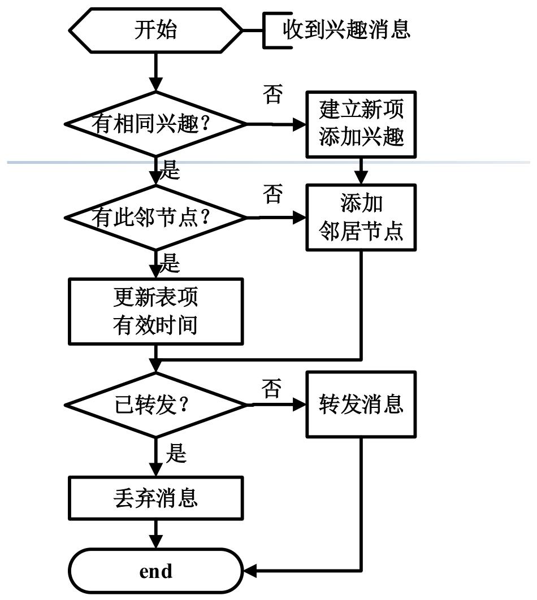

> [!note]
>
> DD 协议多路径 vs 能量感知路由多路径的区别
>
> | 维度     | 定向扩散的多路径                 | 能量感知路由的多路径               |
> | -------- | -------------------------------- | ---------------------------------- |
> | 建立目的 | 提供冗余，提升传输可靠性         | 分担负载，均衡全网能量消耗         |
> | 选择依据 | 数据到达速度、传输量（性能优先） | 节点剩余能量、路径能耗（能量优先） |
> | 后续操作 | 会强化最优路径，减少冗余         | 长期保留多路径，持续分担负载       |
>
> 能量感知路由 vs 基于查询的路由（定向扩散）的区别
>
> | 维度         | 能量感知路由                       | 基于查询的路由（定向扩散）    |
> | ------------ | ---------------------------------- | ----------------------------- |
> | 核心目标     | 最小化能耗，延长网络生存期         | 高效响应 Sink 的查询需求      |
> | 路由驱动     | 能量代价（节点剩余能量、路径能耗） | Sink 的 “兴趣”（数据需求）    |
> | 数据传输方向 | 源节点主动上报数据                 | Sink 查询触发，源节点被动响应 |
>
>  WSN 路由建立的一般过程
>
> 1. **路由触发**：由能量优化需求（能量感知路由）或 Sink 查询（基于查询的路由）触发；
> 2. **路径发现**：通过洪泛、定向转发等方式，建立源节点到 Sink 的可用路径；
> 3. **路径选择**：基于能量、性能等指标，筛选最优 / 可行路径；
> 4. **路径维护**：周期性更新路径信息，适应节点能量变化、链路失效等动态场景。

## 地理位置路由协议（Location-based Routing Protocols）

地理位置路由协议是无线传感器网络（WSN）中**以节点地理位置信息为核心依据**的路由机制，适用于目标跟踪、区域监测等场景

地理位置路由的基础是**节点已知自身及邻居的位置**，位置获取方式有两种：

1. **GPS（全球定位系统）**
2. **基于锚点的计算**：部分节点（锚点）已知位置，其他节点通过与锚点的距离（如信号强度、到达时间）计算自身位置，适用于 GPS 信号弱的室内 / 复杂环境。

位置信息的用途：既可辅助其他路由算法（如优化路径选择），也可直接作为**路由计算**的核心依据。

### 贪婪路由（Greedy Routing）

地理位置路由的核心是**贪婪转发**—— 节点收到数据后，选择 “离目标节点更近的邻居” 转发

1. MFR 策略（Most Forward within Radius）

   - 选择所有邻居中**离目标节点最近**的节点转发，目标是让数据 “尽快接近目标”；

   - 若源节点`S`要向目标`D`发送数据，会选择邻居中距离`D`最近的节点（如`A1`）；

   - **局限**：忽视拓扑结构，无法保证跳数最优（可能绕路）。

     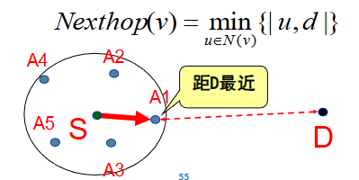

2. NFP 策略（Nearest with Forward Progress）

   - 选择 “比自己离目标更近、且离自己最近” 的邻居，目标是**降低单跳传输功耗**（距离越近，无线传输能耗越低）；

   - 源节点`S`会选邻居中 “既比`S`离`D`近、又离`S`最近” 的节点（如`A3`）。

     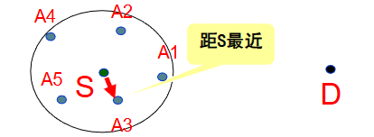

3. 定向路由（Directional Routing）

   - 选择 “沿源节点到目标节点的方向（如`SD`连线）最近” 的邻居，目标是让数据 “沿直线接近目标”；
   - 源节点`S`会选邻居中最靠近`SD`连线的节点（如`A1`）。

   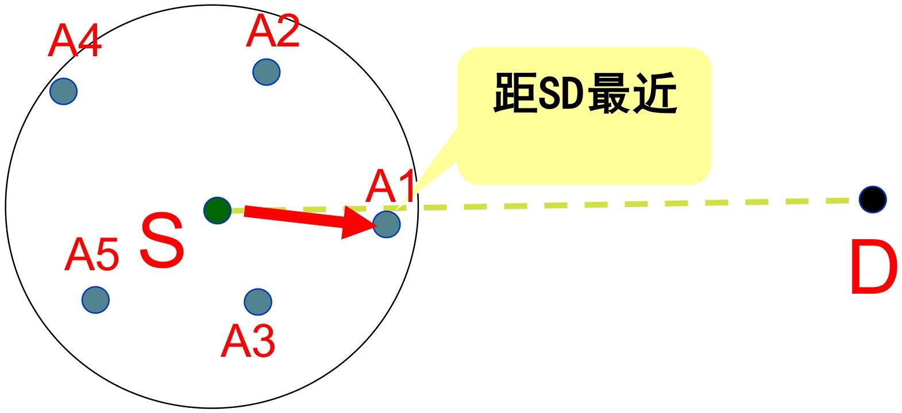

4. 地理受限洪泛（Geographically restricted flooding）

   - 仅向 “比自己离目标更近” 的邻居转发数据（而非无差别洪泛），平衡覆盖性与资源消耗。

   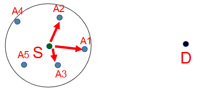

地理位置路由的核心优势是**轻量、动态、自适应**：

1. 节点仅需掌握**一跳邻居的位置信息**，无需全局拓扑；
2. 无需维护路由表，转发决策仅依赖实时位置；
3. 能动态适应拓扑变化（如节点移动、失效），自动选择新的可用邻居；

**贪婪路由不总是有效**—— 贪婪转发的核心逻辑是 “选择离目标更近的邻居”，但当节点**没有比自己离目标更近的邻居**时，转发就会中断，这种情况被称为 “**路由空洞（死胡同）**”。

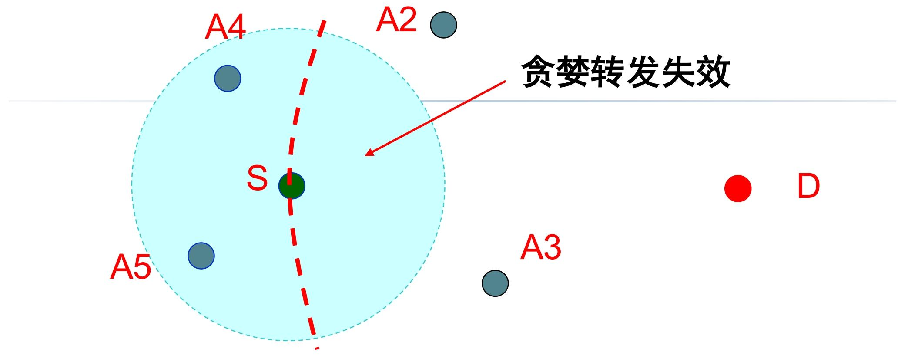

只有当 “网络节点足够密集，转发区域存在符合条件的邻居” 时，贪婪转发才有效；

在GPSR协议中，当贪婪转发遇到路由空洞的时候，进入周边转发模式绕过路由空洞。

周边转发模式有两个关键工具：**右手定则和构造平面拓扑图**

#### 右手定则

右手法则（Right-Hand Rule）是**绕开路由空洞的经典策略**

- 当节点遇到死胡同时，让数据分组**从原路返回**，沿空洞的边界逆时针行走（选择 “逆时针的边”）；
- 行走过程中持续检查邻居，一旦发现 “离目标更近的节点”，立即切换回贪婪转发。

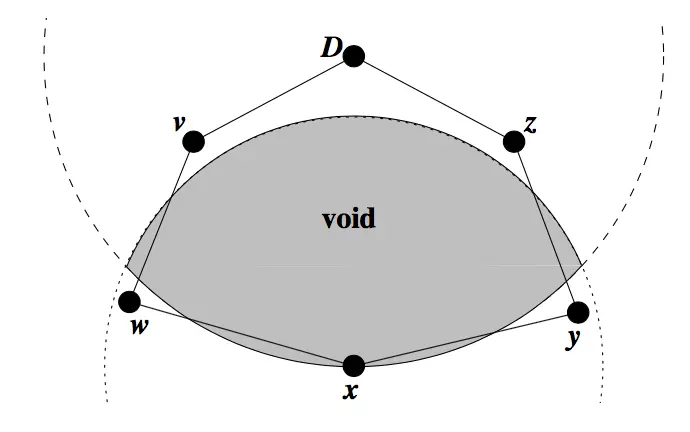

- 图中阴影区域是半径为xD的圆和节点x的圆形信号辐射范围的重叠面。

- 在这个范围内找不到x的邻节点进行贪婪转发。因为所有邻节点，都要比节点x离目的节点距离更远。这个区域被称为节点x的空洞区域(void)。

  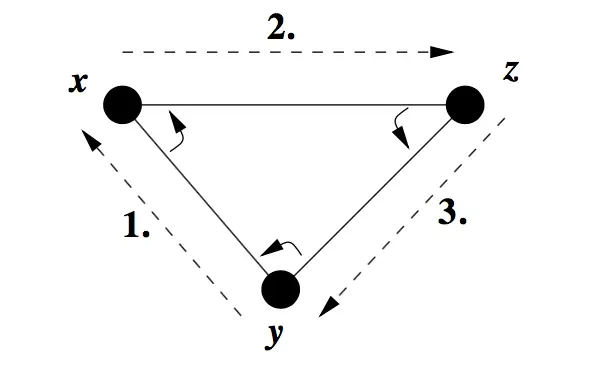

- 右手定则如上个图所示：当数据包从节点y到达节点x的时候，采用以节点x为轴心，将(x，y)按照顺时针旋转，到达的第一条边则是下一次转发所要经过的路径。

- 如图所示，转发顺序应该是y→x→z→y。

- 而为了绕过图一中出现的空洞区域，釆用x→w→v→D→z→y→x的顺序转发数据分组。这种由右手定则构成的路径，称为**周边(perimeter)**。

当转发数据包遇到路由空洞的时候，记录当时的状态（位置），使用右手定则来走出路由空洞。但是右手定则不能处理交叉边的情况

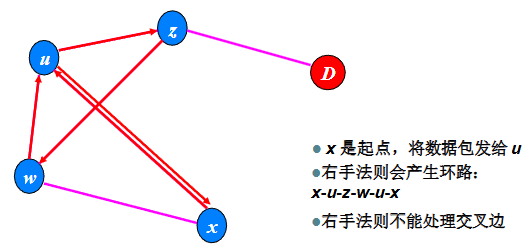

这需要一种无交叉启发式搜索算法，使右手定则在互相相交的图中，找到一个包含路由空洞的周边(perimeter)。

这个启发式搜索有以下责任：1.简化拓扑图，使周边转发更快走出路由空洞;  2.不能造成网络分区。 如果出现网络分区，算法将不会找到跨越此分区的路由。

所以引入**构造平面图**的这个工具。

#### 构造平面图

平面图就是没有任何两条边相交的图。

RNG平面图的定义

> 若顶点U，V和任意其它顶点W之间的距离，全都大于或等于顶点u和v之间的距离d(u，v)，则在顶点U和V之间存在RNG边(u，v)。用方程式表示如下:
>
> 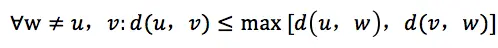

所以在进行右手定则前，需要去掉一些边将连通图变为平面图

### GPSR（贪婪周界无状态路由）

GPSR 是**直接以节点地理位置信息为路由决策依据**的无状态协议

“无状态” 体现在：节点**无需维护全网拓扑或完整路由表**，仅需局部邻居位置信息，即可实现数据转发，大幅降低节点存储与计算开销。

> 前提：节点位置和目标位置已知，邻居表通过节点周期性广播**Beacon 报文**构建和更新，平面图的构建

GPSR 的核心创新是 “贪婪转发” 与 “周边转发” 的**自适应切换**—— 默认用贪婪转发实现高效传输，遇到路由空洞时切换为周边转发绕开空洞

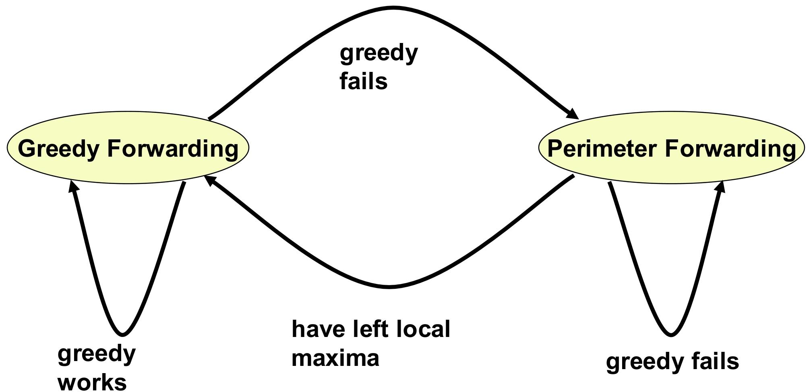

1. 平面图构建：RNG 算法
   - GPSR 通过 RNG（Relative Neighborhood Graph，相对邻居图）算法删除交叉边，构建无交叉的平面图，确保周边转发无环路。
   - 对任意节点 u 及其邻居集合 N，遍历所有邻居 v 和 w（w≠v）：
     - 计算距离：d (u,v)（u 与 v 的距离）、d (u,w)（u 与 w 的距离）、d (v,w)（v 与 w 的距离）；
     - 判定规则：若 d (u,v) > max [d (u,w), d (v,w)]，说明边 (u,v) 是 “冗余交叉边”，予以删除；
     - 最终效果：保留的边均满足 “无其他节点同时靠近 u 和 v”，形成无交叉的平面图。
2. 贪婪转发（Greedy Forwarding）
   - 每个转发节点从自身邻居表中，**选择 “离目的节点最近” 的邻居作为下一跳**，确保每一跳都向目标方向 “靠近”，直至数据到达目的节点。
3. 周边转发/边界转发（Perimeter Forwarding）
   - 当贪婪转发失效（遇路由空洞）时，GPSR 将数据转发模式切换为 “周边转发”，本质是**沿路由空洞的边界绕开空洞**
     - **记录空洞入口（Lp）**：切换至周边转发时，记录 “贪婪转发失败的节点位置（Lp）”，作为后续切回贪婪转发的判断依据；
     - **边界行走与模式切换**：周边转发过程中，节点持续比较 “自身到目的节点的距离” 与 “Lp 到目的节点的距离”—— 若自身距离更近，说明已绕开空洞，立即切回贪婪转发；
     - **目的节点不可达判断**：记录数据进入当前 “面（face，平面图中的区域）” 的第一条边 e0，若数据第二次沿 e0 发送，说明陷入环路，判定目的节点不可达，丢弃数据包。

根据上述内容，可以定义GPSR数据分组包头格式

1. 模式标志位：贪婪或者边界转发
2. 目标节点位置
3. 边界转发模式分组：Lp进入边界节点，e0数据分组进入新的面的第一条边

## 可靠的路由协议

可靠的路由协议是无线传感器网络（WSN）中专注于**提升数据传输可靠性**的核心协议类别，核心目标是最大化 “数据报成功抵达目的节点（Sink）的概率”

> 网络层数据包丢失的核心原因
>
> - 节点能量有限，失效
> - 网络拥塞
> - 无线信道不稳定，误码率很高

### 差错避免的可靠传输机制

为应对丢包问题，WSN 采用 5 类核心差错避免机制，通过 “确认重传”“冗余容错”“链路优化” 等方式提升可靠性：

1. **ACK 确认重传机制**
   - 接收节点成功收到数据包后，向发送节点反馈 “ACK 确认消息”；发送节点未在规定时间内收到 ACK，则自动重传该数据包；
   - 需承担额外延迟（等待 ACK 响应）和缓存开销（暂存待重传数据包）
2. FEC 前向纠错码机制
   - 发送节点在数据包中加入冗余编码（如奇偶校验码、卷积码），接收节点即使收到部分损坏的数据包，也可通过冗余信息恢复完整数据；
   - 会增加数据包体积和传输能耗
3. 数据包冗余传输机制
   - 同一数据包通过多条路径或多次发送，即使部分传输失败，仍有副本能成功抵达；
   - 增加网络能量开销和信道占用，需在可靠性与能效间平衡。

对于上述的机制又延伸出两种机制

1. 利用节点冗余性的**多链路**机制
   - WSN 中常存在 “多节点覆盖同一区域” 的冗余部署，协议可利用这一特性建立多条链路；
   - 某条链路失效时，自动切换至其他链路，无需额外重传，兼顾可靠性与能效。
2. 每跳**可靠性估计**机制
   - 节点实时监测每跳链路的质量（如误码率、传输成功率），建立可靠性估计模型；
   - 仅选择 “可靠性达标” 的链路转发数据，从源头减少丢包概率，避免无效传输。

### 多路径路由

多路径路由是可靠路由协议的核心技术，通过建立 “主路径 + 备用路径” 的冗余架构，应对主路径失效问题

先建立从源节点到汇聚节点的 “主路径”（优先选择传输质量优、能耗低的路径），再建立多条 “备用路径”；

- 正常情况下通过主路径传输数据，备用路径低速传输 “路径维护消息”，确保自身有效性；
- 当主路径因节点失效、链路中断而无法使用时，激活**优先级最高的备用路径**作为新主路径，保障传输不中断。

1. **不相交多路径**（disjoint multipath）

   - 从源节点到目的节点的任意两条路径 “无相交节点”，主路径与备用路径完全独立（如主路径为 “源→A→汇聚”，备用路径为 “源→B→汇聚”，A、B 无交集）；

     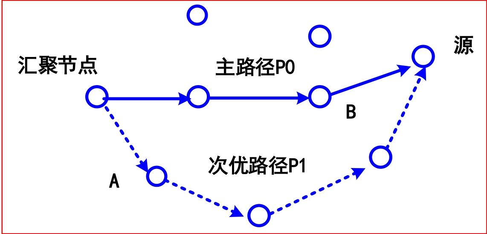

     - 建立方法（基于定向扩散协议）：
       1. Sink 节点发送 “主路径增强消息”，中间节点选择最优节点转发，构建主路径；
       2. Sink 节点再发送 “次优路径增强消息”，中间节点仅选择 “非主路径节点” 转发，确保备用路径与主路径无交集；

2. **缠绕多路径**（braid multipath）

   - 备用路径与主路径 “部分交叉 / 重叠”，每条备用路径对应主路径上的一个节点，专门应对该节点失效的场景；
   - 主路径上**每个节点都有一条对应的缠绕路径**，形成 “主路径 + 多条缠绕路径” 的架构，缠绕路径是 “主路径某节点失效后” 的优化备份；
   - 生成算法：
     1. 先建立主路径（如 “源→C→D→E→F→汇聚”）；
     2. 主路径上除源节点外的每个节点（C、D、E、F），向自身 “次优邻居节点” 发送备份增强消息；
     3. 次优节点继续向其最优节点传播该消息，直到传播至主路径上的其他节点，形成与主路径交叉的备用路径；

   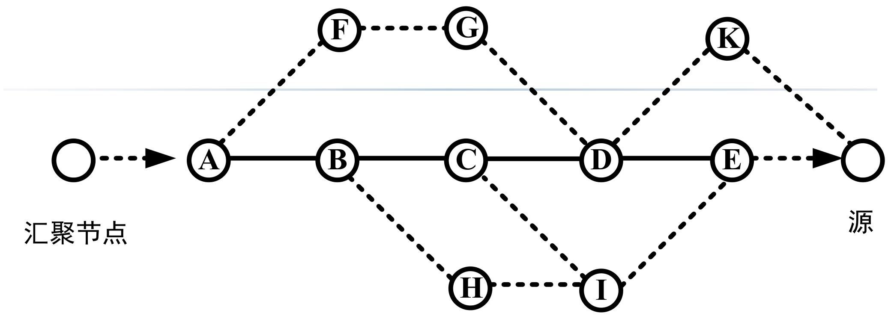

   能量效率更高 —— 路径部分重叠，减少了备用路径的建立和维护开销，更适配 WSN 能量受限的特点；

### 多路径同时传输如何提升系统可靠性（分组到达概率）

1. 单路径传输的可靠性

   单路径传输中，数据需经过`h`跳节点接力，**每一跳的信道差错都会降低最终可靠性**：

   - 单路径的系统可靠性 = 每一跳传输成功概率的乘积（因为每一跳都必须成功，数据才能最终到达）；

     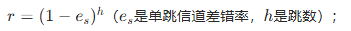

2. 多路径同时传输的可靠性

   同一数据通过`p`条路径同时发送，**只要至少 1 条路径成功，数据就能到达**，因此可靠性会显著提升

   - 系统可靠性 = 1−（所有路径都失败的概率）；

     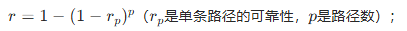

最后可以得到**WSN 多路径可靠路由的核心公式**

系统可靠性`r`：

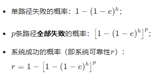

在已知系统可靠性需求*r*、信道差错率*e*、跳数*h*，需计算满足需求的最少路径数*p*

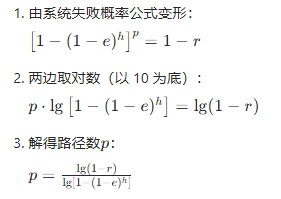

### ReInForM 路由协议

在多路径路由的基础上，通过 “多路径冗余传输” 解决无线信道不稳定导致的丢包问题，同时兼顾能量效率，适配 WSN 资源受限的特点。

ReInForM 的核心是 **“按需多路径拷贝传输”**，通过**动态计算路径数、分配转发任务**，在满足可靠性需求的同时避免资源浪费：

1. **多拷贝提可靠性**：在多条路径发送数据拷贝，只要至少 1 份到达 Sink，传输即成功；
2. **动态决策路径数**：综合 “信道质量（差错率）、可靠性需求、跳数”，计算所需路径数，而非固定多路径；
3. **分布式转发逻辑**：每个节点收到数据后，将自己视为新的 “源节点”，重复路径计算与转发流程，实现全链路可靠传输。

参数：可靠性参数`rs`，信道差错率`es`，节点到Sink的跳数`hs`，邻居节点集H：跳数相同`H0`，少一跳`H-`，多一跳`H+`

ReInForM 的传输流程是 “计算路径数→分配下一跳→邻居重复计算” 的循环，直到数据到达 Sink：

1. 根据可靠性需求、信道差错率、跳数，计算当前节点**需使用的路径数**，公式为：

   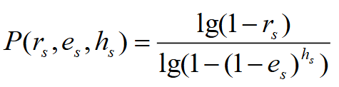

   路径数与 “可靠性需求” 正相关（需求越高，路径越多），与 “信道质量”“跳数” 负相关（信道越好、跳数越少，路径越少）；

2. 选择下一跳节点并分配路径数

   - 节点根据邻居分类，选择下一跳并分配路径数，核心逻辑是 “优先选择靠近 Sink 的邻居”：

     - **默认下一跳**：从 *H*− 选 1 个邻居，默认分配 1 条路径（以概率 1 转发）

     - **计算额外路径数**：若默认路径数不足，计算需补充的路径数 *P*′：

       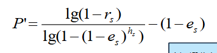

     - 不同集合中下一跳节点需要为源节点建立的路径数，其分配比例如下

       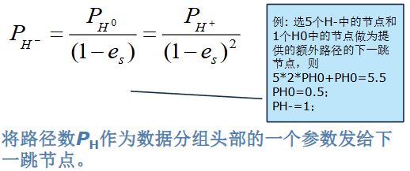

3. 邻居节点重新计算路径数

   - 将自己视为 “新的源节点”；
   - 更新参数：*ei*=*es*（信道差错率不变）、*hi*=*hs*−1（跳数减 1）；然后计算出新的可靠性值
   - 重复步骤 1-2：重新计算自身需用的路径数，选择下一跳并分配路径，直到数据到达 Sink。

**按需可靠**：仅根据实际需求计算路径数，避免 “过度冗余” 导致的能量浪费；